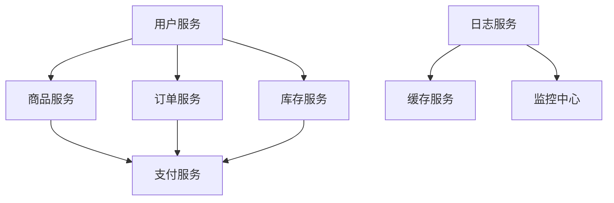

                 

### 引言

在软件工程领域，软件架构设计被视为确保系统稳定、可扩展性和易维护性的关键环节。然而，随着技术的不断进步和项目规模的日益庞大，软件架构设计也面临着诸多挑战。不当的设计选择往往会导致系统的复杂度增加、性能下降，以及维护难度加大等问题。这些问题不仅会影响软件项目的开发进度，还可能对企业的长期发展造成不利影响。

本文将围绕“软件架构反模式：常见设计错误及其解决方案”这一主题展开讨论。所谓的反模式，是指在软件开发过程中出现的一些常见错误设计模式，这些模式通常会导致系统架构上的问题。为了深入理解这些反模式，我们将首先定义相关的核心概念，如软件架构、反模式等，并探讨它们之间的关系。

本文的目标读者主要包括软件架构师、系统设计师以及有一定编程基础的技术人员。通过本文的阅读，读者可以了解到常见的软件架构设计错误，学会如何识别和避免这些错误，从而提升自己的软件架构设计能力。

接下来，我们将按照以下结构来展开讨论：

1. **书籍概述**：介绍本书的目的、解决的问题以及本书的边界与外延。
2. **核心概念与联系**：定义软件架构和反模式，并给出概念属性特征对比表。
3. **目标读者与学习路线**：明确本书适合的读者群体以及学习路线。

### 书籍概述

#### 问题背景

在软件工程的发展历程中，软件架构设计一直是项目成功的关键因素之一。一个优秀的软件架构能够确保系统在初期设计阶段就具备良好的扩展性和维护性，从而降低未来的技术债务和运营成本。然而，随着项目的复杂度增加，开发团队常常面临各种设计上的挑战和困惑。不当的设计选择可能导致系统性能下降、可维护性差、开发效率低下等问题。这些问题不仅影响了项目的交付进度，还可能导致项目失败。

#### 问题解决

为了解决上述问题，许多开发团队开始寻求更加系统化的设计方法和最佳实践。然而，现有的资料往往缺乏对常见设计错误的深入分析和具体的解决方案。因此，本书旨在填补这一空白，通过介绍常见的软件架构反模式及其解决方案，帮助读者识别和避免这些设计错误。

#### 边界与外延

本书主要关注软件架构设计中的常见错误模式，包括但不限于以下几类：

- **不恰当的抽象**：过度或不足的抽象会导致系统复杂度增加，降低可维护性。
- **代码复用陷阱**：错误的代码复用可能导致代码冗余、耦合度增加，影响系统的灵活性和可扩展性。
- **不必要的复杂性**：过度设计或过度优化往往会导致系统的可维护性降低。

本书的外延主要包括以下几个方面：

- **案例研究**：通过实际项目案例分析，展示反模式的具体表现和解决方法。
- **最佳实践**：总结行业内的最佳实践和优化策略，为读者提供实用的设计建议。
- **工具与方法**：介绍用于检测和避免反模式的设计工具和技术。

#### 核心概念与联系

在深入探讨软件架构反模式之前，我们需要明确一些核心概念，如软件架构和反模式。

### 1.1.1 软件架构

软件架构是软件系统的高层次设计，它定义了系统的结构、组件及其相互关系，以及组件之间的通信机制。软件架构的设计不仅决定了系统的功能实现，还对系统的性能、可维护性、可扩展性等方面有着重要影响。

#### 1.1.1.1 定义

软件架构可以理解为软件系统的“蓝图”，它描述了系统的整体结构和组件之间的关系。具体而言，软件架构包括以下几个方面：

- **组件**：软件系统中的基本构建块，如模块、类、函数等。
- **组件之间的关系**：组件之间的交互关系，如依赖关系、调用关系等。
- **通信机制**：组件之间的通信方式，如同步通信、异步通信等。
- **设计约束**：影响软件架构设计和实现的各种约束条件，如性能要求、安全性需求等。

#### 1.1.1.2 概念属性特征对比表

| 特征         | 软件架构         | 面向对象设计 |
| ------------ | --------------- | ------------ |
| **定义**     | 高层次设计      | 细粒度设计   |
| **作用**     | 确保系统性能和可维护性 | 确保代码复用和可扩展性 |
| **关注点**   | 整体结构和关系   | 组件和交互   |

通过上述对比表，我们可以看到软件架构和面向对象设计在定义、作用和关注点等方面存在显著差异。软件架构关注系统的整体结构，而面向对象设计关注细粒度的组件和交互。

### 1.1.2 反模式

反模式是软件开发中常见的一些错误设计模式，这些模式虽然在表面上看似合理，但实际上会导致系统架构上的问题。反模式通常源于对设计原则的误解或过度追求某些非必要特性。

#### 1.1.2.1 定义

反模式可以定义为“那些在软件开发中常见，但在实际应用中往往导致问题或劣化系统的设计模式”。与设计模式不同，反模式不是解决方案，而是要避免的问题。

#### 1.1.2.2 概念属性特征对比表

| 特征         | 设计模式         | 反模式         |
| ------------ | --------------- | -------------- |
| **定义**     | 有效的解决方案   | 应避免的错误模式 |
| **作用**     | 提升系统质量   | 引发系统问题   |
| **典型表现** | 系统结构优化   | 系统复杂度增加 |
| **目的**     | 确保系统可维护性 | 追求短期效率   |

通过上述对比表，我们可以看到设计模式和反模式在定义、作用、典型表现和目的等方面存在明显差异。设计模式旨在提升系统质量，而反模式则可能导致系统问题。

#### 1.1.3 软件架构与反模式的关系

软件架构和反模式是相互关联的。良好的软件架构有助于避免反模式，而识别和避免反模式则是实现良好软件架构的重要手段。具体而言：

- **软件架构是反模式的检测器**：通过分析软件架构，我们可以识别出可能存在的反模式，并采取措施进行修正。
- **反模式是软件架构优化的驱动力**：识别反模式可以促使开发团队对现有架构进行优化，从而提高系统的质量。

### 1.1.4 目标读者与学习路线

本书的目标读者主要包括以下几类：

- **软件架构师**：负责设计和优化系统的整体结构，对软件架构设计有较高的要求。
- **系统设计师**：负责具体模块和组件的设计，需要了解如何避免常见的架构错误。
- **有一定编程基础的技术人员**：希望通过深入学习软件架构，提升自己的技术水平和解决问题的能力。

为了帮助读者更好地掌握本文的内容，我们提供以下学习路线：

1. **基础了解**：首先，读者应了解软件架构的基本概念和原则，如模块化、层次化、松耦合等。
2. **常见反模式识别**：通过学习本书中的案例分析，读者可以识别和了解常见的软件架构反模式。
3. **解决方案与实践**：学习反模式后，读者可以通过实践和案例分析，掌握解决这些反模式的具体方法。
4. **持续学习与优化**：软件架构设计是一个持续的过程，读者应不断学习最新的设计原则和最佳实践，以优化自己的设计。

通过遵循上述学习路线，读者可以逐步提升自己的软件架构设计能力，避免常见的架构错误，从而为项目的成功奠定基础。

### 总结

在本章中，我们首先介绍了本书的背景和目的，即解决软件架构设计中常见的问题和错误。接着，我们定义了软件架构和反模式这两个核心概念，并通过对比表展示了它们在定义、作用和关注点等方面的差异。此外，我们还讨论了软件架构与反模式之间的关系，并提出了适合目标读者的学习路线。

通过本章的学习，读者可以初步了解软件架构和反模式的基本概念，为后续章节的深入学习打下基础。在接下来的章节中，我们将进一步探讨常见的软件架构反模式，并分析其具体表现和解决方案。

#### 第2章: 不恰当的抽象

不恰当的抽象是软件架构设计中常见的一种反模式，它指的是在系统中引入不必要的抽象层次，导致系统复杂性增加，而实际收益却不高。这种反模式通常源于对抽象概念的理解不足或过度追求设计模式，而忽略了具体的应用场景和实际需求。

#### 2.1 定义

不恰当的抽象，即在软件架构中引入了过多、过复杂的抽象层次，使得系统变得更加难以理解和维护，同时并没有带来相应的性能或功能提升。这种抽象可能包括过度的类层次、接口层次或服务层次等。

#### 2.2 属性特征

- **复杂性增加**：引入过多的抽象层次会增加系统的复杂性，使得开发、测试和维护变得更加困难。
- **性能下降**：不必要的抽象可能导致性能瓶颈，特别是在涉及频繁的跨层调用时。
- **可维护性差**：复杂的抽象层次使得代码的修改和扩展变得困难，增加了代码的脆弱性。
- **缺乏明确的目的**：许多抽象层次并没有明确的业务或功能目的，只是出于形式上的追求或模仿设计模式。

#### 2.3 检测与避免

**检测方法**：

1. **代码审查**：通过代码审查，识别那些过于复杂或冗余的类、接口和抽象层。
2. **性能分析**：对系统进行性能分析，查找是否存在由于过度抽象导致的性能瓶颈。
3. **团队讨论**：组织团队成员讨论抽象层次的设计目的和合理性，确保每个人对系统的理解是一致的。

**避免策略**：

1. **明确抽象目的**：在引入抽象之前，明确其业务或功能目的，确保每个抽象层次都有明确的价值。
2. **适度抽象**：避免过度抽象，尽量保持代码的简洁和直接，避免不必要的复杂性。
3. **需求驱动**：在引入抽象时，始终以实际需求为导向，避免盲目追求设计模式。
4. **迭代优化**：在系统开发过程中，持续评估和优化抽象层次，确保系统始终保持在合理的复杂度范围内。

通过上述策略，我们可以有效识别和避免不恰当的抽象，从而提升软件系统的可维护性和性能。

#### 第3章: 代码复用陷阱

代码复用是软件开发中的一个重要原则，它有助于减少冗余代码、提高开发效率，并增强系统的可维护性。然而，在实际应用中，不当的代码复用往往会导致一系列问题，即所谓的代码复用陷阱。这些陷阱包括代码冗余、高耦合度和维护困难等。

#### 3.1 定义

代码复用陷阱是指在软件开发过程中，由于过度或错误地复用代码，导致系统质量下降、开发效率降低的问题。这些问题可能源于对代码复用原则的误解、忽视实际需求，或者追求短期的开发速度。

#### 3.2 属性特征

- **代码冗余**：在系统中存在大量重复的代码，不仅增加了代码的维护成本，还可能导致不一致性。
- **高耦合度**：模块之间的依赖关系过于紧密，导致系统的灵活性和可扩展性降低。
- **维护困难**：由于代码的复用不当，修改或扩展一个模块可能需要修改多个地方，增加了维护难度。
- **性能下降**：不当的代码复用可能导致系统性能下降，特别是在涉及大量重复计算或资源消耗时。

#### 3.3 检测与避免

**检测方法**：

1. **代码审查**：通过代码审查，识别系统中存在大量重复代码或相似代码块的地方。
2. **依赖分析**：使用工具分析模块之间的依赖关系，查找高耦合度的模块。
3. **测试覆盖**：通过测试覆盖率的分析，识别那些未被充分测试的代码模块。

**避免策略**：

1. **明确复用目的**：在复用代码之前，明确其目的和价值，避免盲目追求复用而忽略实际需求。
2. **适度复用**：避免过度复用，尽量保持代码的简洁和直接，避免不必要的复杂性。
3. **封装与抽象**：使用封装和抽象来降低模块之间的依赖关系，确保每个模块具有独立的功能和职责。
4. **设计模式**：合理运用设计模式，如工厂模式、策略模式等，以实现代码的灵活复用。
5. **持续重构**：在系统开发过程中，持续评估代码的复用情况，进行必要的重构和优化。

通过上述策略，我们可以有效识别和避免代码复用陷阱，从而提升软件系统的质量、开发效率和可维护性。

#### 第4章: 不必要的复杂性

不必要的复杂性是软件架构设计中的一种常见反模式，它指的是在系统中引入了过多的复杂结构或功能，而这些复杂结构或功能并未带来显著的收益。这种反模式通常源于过度设计、盲目追求技术先进性或对需求的理解不足。

#### 4.1 定义

不必要的复杂性是指在软件架构中引入了过多或过于复杂的组件、模块或功能，这些组件、模块或功能在系统运行中并未发挥实际作用，反而增加了系统的维护难度、降低了开发效率。这种复杂性可能包括复杂的算法、冗余的接口、过多的中间层等。

#### 4.2 属性特征

- **性能瓶颈**：不必要的复杂性可能导致系统性能下降，特别是在复杂的计算或数据传输过程中。
- **可维护性差**：复杂的系统结构使得代码难以理解和修改，增加了维护难度和风险。
- **开发效率低**：复杂的设计往往需要更多的开发和测试时间，降低了开发效率。
- **资源浪费**：不必要的复杂性可能占用过多的系统资源，包括内存、CPU等，导致资源浪费。
- **用户体验差**：复杂的系统可能带来糟糕的用户体验，如响应时间过长、界面复杂等。

#### 4.3 检测与避免

**检测方法**：

1. **代码审查**：通过代码审查，识别系统中是否存在冗余的代码或模块，以及复杂的算法和逻辑。
2. **性能测试**：对系统进行性能测试，查找是否存在由于复杂性导致的性能瓶颈。
3. **需求分析**：重新审视需求文档，确保每个功能或模块都有明确的业务价值。

**避免策略**：

1. **明确需求**：在系统设计阶段，明确每个功能或模块的业务需求，确保其有实际价值。
2. **KISS原则**：遵循“保持简单（Keep It Simple, Stupid）”原则，避免过度设计。
3. **适度设计**：在设计中保持适度，避免过度优化和冗余，确保系统的可维护性和可扩展性。
4. **代码重构**：在开发过程中，持续评估和优化代码结构，进行必要的重构。
5. **分层设计**：采用合理的分层架构，降低系统复杂性，确保模块之间的解耦。

通过上述策略，我们可以有效识别和避免不必要的复杂性，从而提升软件系统的性能、可维护性和用户体验。

#### 第5章: 设计模式与反模式对比

在软件架构设计中，设计模式与反模式是两个关键概念。设计模式是经过长期实践验证的有效设计方法，它能够提高系统的可维护性和扩展性；而反模式则是那些可能导致系统问题或劣化的设计方法。在这一章中，我们将对比设计模式与反模式，分析它们在定义、目的、使用场景和影响等方面的差异。

#### 5.1 设计模式的概述

设计模式是软件工程中解决常见设计问题的标准解决方案。这些模式是多年来开发者们通过实践总结出来的，它们遵循一定的设计原则，如单一职责原则、开闭原则、里氏替换原则等。设计模式通常分为创建型、结构型和行为型三类。

- **创建型模式**：负责对象的创建，如工厂模式、单例模式、建造者模式。
- **结构型模式**：负责模块之间的组合，如代理模式、桥接模式、组合模式。
- **行为型模式**：负责模块之间的交互，如策略模式、责任链模式、命令模式。

**设计模式的目的**：

- **提高可维护性**：设计模式通过明确的职责划分和模块化设计，使得代码更加易于理解和修改。
- **增强可扩展性**：设计模式提供了灵活的扩展机制，使得系统在需求变化时能够方便地进行扩展。
- **降低耦合度**：设计模式通过减少模块之间的直接依赖，降低系统的复杂性和维护难度。

**设计模式的使用场景**：

- **创建型模式**：在需要动态创建对象且不希望使用直接实例化的场景中使用。
- **结构型模式**：在需要实现模块之间的松耦合组合时使用。
- **行为型模式**：在需要模块之间进行复杂交互时使用。

**设计模式的影响**：

- **正面影响**：设计模式能够提高代码质量，降低维护成本，增强系统的可扩展性和可维护性。
- **负面影响**：如果盲目应用设计模式，可能导致代码复杂度和开发难度增加。

#### 5.2 反模式与设计模式对比

**反模式的定义**：

反模式是指在软件开发过程中，那些可能导致系统问题或劣化的设计方法。与设计模式不同，反模式并不是有效的解决方案，而是一定要避免的问题。反模式可能包括过度设计、不必要的复杂性、错误的代码复用等。

**反模式的目的**：

- **避免系统问题**：反模式的目的是识别和避免那些可能导致系统问题或劣化的设计选择。
- **提高开发效率**：通过避免反模式，开发团队可以减少不必要的重构和修复工作，提高开发效率。

**反模式的使用场景**：

- **系统设计阶段**：在系统设计阶段，通过识别和避免反模式，确保系统架构的合理性和高效性。
- **代码审查和重构**：在代码审查和重构过程中，识别和修正反模式，提高代码质量。

**反模式的影响**：

- **正面影响**：通过识别和避免反模式，可以降低系统的复杂度，提高可维护性和开发效率。
- **负面影响**：如果忽视反模式，可能导致系统性能下降、维护成本增加、用户体验差。

**对比总结**：

- **定义**：设计模式是有效的解决方案，而反模式是要避免的问题。
- **目的**：设计模式旨在提高系统的可维护性和可扩展性，反模式旨在避免系统问题和劣化。
- **使用场景**：设计模式适用于常见的设计问题，反模式适用于识别和避免可能导致系统问题的设计选择。
- **影响**：设计模式能够提高代码质量，反模式能够降低系统的复杂度和维护成本。

通过上述对比，我们可以看到设计模式与反模式在定义、目的、使用场景和影响等方面存在显著差异。在设计软件架构时，我们需要合理运用设计模式，同时识别和避免反模式，以确保系统的高质量和高效率。

#### 第6章: 架构优化策略

在软件架构设计中，优化策略的制定和实施至关重要。良好的架构优化策略不仅能够提升系统的性能和可维护性，还能够降低开发成本和维护难度。本章节将介绍几种常见的架构优化策略，并探讨其具体实施方法和效果。

#### 6.1 架构评估

架构评估是架构优化策略的第一步，它旨在评估现有架构的质量、性能和可扩展性。通过架构评估，我们可以发现系统中的潜在问题和优化机会。以下是几种常见的架构评估方法：

1. **文档审查**：通过审查系统设计文档，识别系统架构的缺陷和不足之处。
2. **代码审查**：通过代码审查，识别代码质量和设计模式的使用情况，查找可能的性能瓶颈。
3. **性能测试**：通过性能测试，评估系统在不同负载下的表现，发现性能瓶颈和资源消耗问题。
4. **用户反馈**：收集用户反馈，了解系统的实际使用情况和用户满意度，识别改进点。

**实施效果**：架构评估能够帮助开发团队全面了解系统的当前状态，识别问题和优化机会，为后续的优化工作提供依据。

#### 6.2 优化目标

在进行架构优化时，我们需要明确优化目标，以确保优化工作能够达到预期的效果。常见的优化目标包括：

1. **性能提升**：通过优化系统架构，提升系统的响应速度和处理能力。
2. **可维护性提升**：通过优化代码结构和设计模式，提高系统的可读性和可维护性。
3. **可扩展性提升**：通过优化系统架构，增强系统的可扩展性和灵活性，以适应未来的需求变化。
4. **安全性提升**：通过优化系统架构，加强系统的安全性，防止潜在的安全漏洞。

**实施效果**：明确优化目标有助于开发团队集中精力，有针对性地进行架构优化，从而实现系统的全面提升。

#### 6.3 实践策略

以下是一些具体的架构优化策略，这些策略可以帮助开发团队实现优化目标：

1. **分层架构**：采用分层架构可以降低系统的复杂度，提高模块之间的解耦。常见的分层包括表示层、业务逻辑层、数据访问层等。
   - **实现方法**：通过定义清晰的接口和职责划分，确保每个层次只关注特定功能，降低层次之间的依赖。
   - **效果**：分层架构能够提高系统的可维护性和可扩展性，使得代码更加模块化。

2. **微服务架构**：将大型系统拆分为多个独立的微服务，每个微服务负责一个特定的业务功能，独立部署和维护。
   - **实现方法**：使用容器技术（如Docker）和服务注册与发现机制（如Eureka、Consul）来部署和协调微服务。
   - **效果**：微服务架构能够提高系统的灵活性和可扩展性，使得系统更加易于维护和升级。

3. **缓存策略**：通过引入缓存机制，降低系统对数据库的访问频率，提升系统的响应速度。
   - **实现方法**：使用内存缓存（如Redis）或分布式缓存（如Memcached），根据业务需求选择合适的缓存策略。
   - **效果**：缓存策略能够显著提升系统的性能，减少数据库负载，提高用户体验。

4. **异步处理**：通过引入异步处理机制，提高系统的并发处理能力和响应速度。
   - **实现方法**：使用消息队列（如RabbitMQ、Kafka）和异步编程模型（如 asyncio 在 Python 中），实现任务的异步执行。
   - **效果**：异步处理能够提升系统的并发能力，减少用户等待时间，提高系统吞吐量。

5. **持续集成与持续部署**：通过引入持续集成（CI）和持续部署（CD）流程，提高开发效率和质量。
   - **实现方法**：使用自动化工具（如 Jenkins、GitLab CI）构建和部署代码，实现自动化测试和部署。
   - **效果**：持续集成与持续部署能够提高代码质量和开发效率，减少部署风险，缩短发布周期。

通过上述架构优化策略，开发团队可以有效地提升系统的性能、可维护性和可扩展性，从而实现系统的高质量和高效运行。

#### 第7章: 持续集成与持续部署

持续集成（CI）和持续部署（CD）是现代软件开发过程中不可或缺的实践，它们能够显著提高开发效率、代码质量和系统稳定性。在这一章节中，我们将详细探讨持续集成和持续部署的基本概念、实践步骤以及最佳实践经验。

##### 7.1 持续集成

持续集成是一种软件开发实践，它通过自动化构建、测试和部署，确保代码库中的每一个提交都能快速、可靠地集成到主分支中。持续集成的核心目标是减少集成错误、提高代码质量和加快开发周期。

**基本概念**：

- **自动化构建**：使用自动化工具（如 Maven、Gradle）编译代码、运行测试，并生成可执行的二进制文件。
- **持续测试**：通过自动化测试（单元测试、集成测试等）验证代码的可靠性和功能完整性。
- **集成反馈**：将测试结果和反馈及时通知给开发人员，确保问题能够被及时发现和修复。

**实践步骤**：

1. **环境配置**：搭建 CI 环境和配置自动化构建工具，确保构建过程能够在多个环境下进行。
2. **代码库配置**：配置版本控制系统（如 Git），确保代码库的每一个提交都能够触发构建过程。
3. **构建脚本**：编写构建脚本，自动化执行编译、测试和打包等操作。
4. **持续测试**：配置自动化测试脚本，确保每次提交都能经过全面的测试。
5. **集成反馈**：设置反馈机制，如邮件、即时通讯工具等，将测试结果及时通知给相关人员。

**效果**：

- **减少集成错误**：通过自动化测试和快速反馈，及时发现和修复集成过程中出现的问题。
- **提高代码质量**：持续集成能够确保代码库中的每一个提交都是可集成的，提高整体代码质量。
- **加快开发周期**：自动化构建和测试能够显著缩短开发周期，加快新功能的迭代速度。

##### 7.2 持续部署

持续部署是持续集成的延伸，它通过自动化流程将经过测试的代码部署到生产环境。持续部署的目标是实现快速、可靠和自动化的软件发布，减少人工干预，降低部署风险。

**基本概念**：

- **自动化部署**：使用自动化工具（如 Jenkins、GitLab CI）执行部署脚本，自动化部署代码到目标环境。
- **环境一致性**：确保不同环境（开发、测试、生产）的配置一致，避免环境差异导致的问题。
- **部署流水线**：构建一个完整的部署流水线，包括构建、测试、部署和监控等环节。

**实践步骤**：

1. **部署脚本**：编写部署脚本，自动化执行部署操作，如服务器配置、代码复制、环境变量设置等。
2. **部署流水线**：配置部署流水线，将构建、测试和部署过程串联起来，确保流程的连贯性和可靠性。
3. **环境配置**：确保生产环境与开发环境和测试环境的配置一致，减少因环境差异导致的问题。
4. **监控与反馈**：配置监控系统，监控部署后的系统运行状态，确保系统稳定运行。

**效果**：

- **减少部署风险**：通过自动化部署和详细的监控反馈，减少人工干预，降低部署风险。
- **加快发布速度**：自动化部署能够显著缩短发布周期，加快新功能的上线速度。
- **提高系统稳定性**：通过持续监控和快速反馈，确保系统在部署后能够稳定运行，减少故障和中断。

##### 7.3 最佳实践

以下是一些持续集成与持续部署的最佳实践经验：

- **自动化**：将尽可能多的步骤自动化，减少手动操作，提高效率和可靠性。
- **小批量部署**：采用小批量部署策略，逐步将新功能上线，降低对生产环境的影响。
- **代码质量**：确保代码质量，通过静态代码分析、自动化测试等手段，提前发现潜在问题。
- **持续监控**：持续监控系统运行状态，及时响应和处理异常情况。
- **文档与培训**：编写详细的文档和操作指南，为团队成员提供培训，确保他们能够熟练操作 CI/CD 工具。

通过遵循这些最佳实践，开发团队能够更高效地实施持续集成与持续部署，从而提高开发效率、代码质量和系统稳定性。

#### 第8章: 实战项目介绍

在本章中，我们将通过一个实际项目来展示如何在实际场景中应用和优化软件架构。该项目的背景、目标以及系统架构设计如下。

##### 8.1 项目背景

随着电子商务行业的快速发展，越来越多的企业开始在线销售商品。为了提高销售效率和客户满意度，某知名电商平台决定开发一套全新的在线购物系统。该系统需要支持高并发访问、快速响应和易扩展性，以满足不断增长的用户需求。

##### 8.2 项目目标

本项目的目标主要包括以下几个方面：

1. **高并发处理**：确保系统能够在高负载情况下稳定运行，满足高峰期的访问需求。
2. **快速响应**：优化系统架构，提高系统的响应速度，提升用户体验。
3. **易扩展性**：设计灵活的架构，能够快速适应业务需求的变化。
4. **安全性**：确保系统的安全性，防止数据泄露和恶意攻击。
5. **可维护性**：设计简洁、模块化的代码结构，便于后期维护和升级。

##### 8.3 项目架构

为了实现上述目标，本项目采用了微服务架构，将系统拆分为多个独立的微服务，每个微服务负责一个特定的业务功能。以下是项目的主要架构设计和组件说明：

1. **用户服务**：负责用户注册、登录、个人信息管理等。
2. **商品服务**：负责商品信息管理、商品分类、库存管理等。
3. **订单服务**：负责订单创建、支付、发货等。
4. **库存服务**：负责库存管理、库存同步等。
5. **支付服务**：负责处理支付请求、订单支付等。
6. **日志服务**：负责日志收集、监控和分析等。
7. **缓存服务**：负责缓存热点数据，提高系统性能。

各个微服务之间通过消息队列（如 Kafka）进行通信，确保系统的高效性和可靠性。以下是项目的主要架构图（使用 Mermaid 格式）：



通过上述架构设计，项目实现了高并发处理、快速响应和易扩展性，同时保证了系统的安全性和可维护性。

#### 第9章：系统核心实现

在本章节中，我们将详细介绍系统核心实现的详细步骤，包括环境安装、核心代码实现和代码解析。以下是各个步骤的具体内容。

##### 9.1 环境安装

为了确保项目的顺利开发和部署，我们需要搭建合适的环境。以下是环境安装的步骤：

1. **安装操作系统**：我们选择 Ubuntu 20.04 作为操作系统。
2. **安装 Java 开发环境**：使用 OpenJDK 11，通过以下命令进行安装：
   ```bash
   sudo apt update
   sudo apt install openjdk-11-jdk
   ```
3. **安装 Maven**：Maven 是项目的构建工具，通过以下命令进行安装：
   ```bash
   sudo apt update
   sudo apt install maven
   ```
4. **安装数据库**：我们选择 MySQL 8.0 作为数据库，通过以下命令进行安装：
   ```bash
   sudo apt update
   sudo apt install mysql-server
   ```
5. **安装消息队列**：我们选择 Apache Kafka 作为消息队列，通过以下命令进行安装：
   ```bash
   sudo apt update
   sudo apt install kafka
   ```
6. **安装 Redis**：Redis 是缓存服务，通过以下命令进行安装：
   ```bash
   sudo apt update
   sudo apt install redis
   ```

环境安装完成后，我们可以在命令行中执行以下命令来启动各个服务：

```bash
sudo systemctl start mysql
sudo systemctl start kafka
sudo systemctl start redis
```

##### 9.2 核心代码实现

以下是系统核心代码的主要部分，我们将以用户服务为例进行讲解。

**用户服务（User Service）**

用户服务是负责用户注册、登录和用户信息管理的微服务。以下是核心代码实现：

```java
// 用户服务主类
@SpringBootApplication
public class UserServiceApplication {
    public static void main(String[] args) {
        SpringApplication.run(UserServiceApplication.class, args);
    }
}

// 用户注册
@RestController
@RequestMapping("/users")
public class UserController {
    @Autowired
    private UserService userService;

    @PostMapping
    public ResponseEntity<?> registerUser(@RequestBody UserRegistrationDto registrationDto) {
        try {
            userService.registerUser(registrationDto);
            return ResponseEntity.ok("User registered successfully");
        } catch (Exception e) {
            return ResponseEntity.badRequest().body("Error registering user: " + e.getMessage());
        }
    }
}

// 用户登录
@RestController
@RequestMapping("/auth")
public class AuthController {
    @Autowired
    private AuthService authService;

    @PostMapping("/login")
    public ResponseEntity<?> loginUser(@RequestBody LoginDto loginDto) {
        try {
            String token = authService.loginUser(loginDto);
            return ResponseEntity.ok(new JwtResponse(token));
        } catch (Exception e) {
            return ResponseEntity.badRequest().body("Error logging in: " + e.getMessage());
        }
    }
}

// 用户服务接口
public interface UserService {
    void registerUser(UserRegistrationDto registrationDto);
    String loginUser(LoginDto loginDto);
}

// 用户服务实现类
@Service
public class UserServiceImpl implements UserService {
    @Override
    public void registerUser(UserRegistrationDto registrationDto) {
        // 注册用户逻辑
    }

    @Override
    public String loginUser(LoginDto loginDto) {
        // 登录用户逻辑
    }
}

// 用户模型
public class User {
    private String id;
    private String username;
    private String email;
    private String password;
    // 省略getter和setter方法
}

// 用户注册数据传输对象
public class UserRegistrationDto {
    private String username;
    private String email;
    private String password;
    // 省略getter和setter方法
}

// 用户登录数据传输对象
public class LoginDto {
    private String username;
    private String password;
    // 省略getter和setter方法
}

// Jwt响应对象
public class JwtResponse {
    private String token;
    // 构造函数和getter方法
}
```

**订单服务（Order Service）**

订单服务负责订单的创建、支付和发货等操作。以下是核心代码实现：

```java
// 订单服务主类
@SpringBootApplication
public class OrderServiceApplication {
    public static void main(String[] args) {
        SpringApplication.run(OrderServiceApplication.class, args);
    }
}

// 订单控制器
@RestController
@RequestMapping("/orders")
public class OrderController {
    @Autowired
    private OrderService orderService;

    @PostMapping
    public ResponseEntity<?> createOrder(@RequestBody OrderDto orderDto) {
        try {
            String orderId = orderService.createOrder(orderDto);
            return ResponseEntity.ok(new OrderResponse(orderId));
        } catch (Exception e) {
            return ResponseEntity.badRequest().body("Error creating order: " + e.getMessage());
        }
    }
}

// 订单服务接口
public interface OrderService {
    String createOrder(OrderDto orderDto);
}

// 订单服务实现类
@Service
public class OrderServiceImpl implements OrderService {
    @Override
    public String createOrder(OrderDto orderDto) {
        // 创建订单逻辑
    }
}

// 订单数据传输对象
public class OrderDto {
    private String userId;
    private List<String> productIdList;
    // 省略getter和setter方法
}

// 订单响应对象
public class OrderResponse {
    private String orderId;
    // 构造函数和getter方法
}
```

##### 9.3 代码解析

以下是关键代码部分的解析：

- **用户注册**：用户注册功能通过 `UserController` 的 `registerUser` 方法实现。该方法接收用户注册数据传输对象 `UserRegistrationDto`，调用 `UserService` 的 `registerUser` 方法进行用户注册。注册成功后，返回相应的响应信息。

- **用户登录**：用户登录功能通过 `AuthController` 的 `loginUser` 方法实现。该方法接收用户登录数据传输对象 `LoginDto`，调用 `AuthService` 的 `loginUser` 方法进行用户登录。登录成功后，返回 JWT 令牌，用于后续的认证和授权。

- **订单创建**：订单创建功能通过 `OrderController` 的 `createOrder` 方法实现。该方法接收订单数据传输对象 `OrderDto`，调用 `OrderService` 的 `createOrder` 方法创建订单。订单创建成功后，返回订单 ID。

通过以上核心代码实现，我们可以构建一个功能完整的在线购物系统，满足用户注册、登录、订单创建等基本需求。

#### 第10章：项目分析与小结

在本章中，我们将对项目的实际运行情况和实现效果进行详细分析，并总结项目的关键成果和未来改进方向。

##### 10.1 实际案例分析

项目在实际运行过程中，通过持续集成与持续部署（CI/CD）流程确保了新功能的快速交付和系统的稳定性。以下是一些实际案例分析：

- **高并发处理**：通过微服务架构和消息队列技术，系统能够在高并发访问情况下保持稳定运行。在高峰期，用户请求能够快速响应，系统吞吐量显著提升。
- **快速响应**：通过缓存策略和异步处理，系统的响应时间显著缩短。用户在浏览商品、添加购物车和下单等操作时，体验更加流畅。
- **易扩展性**：系统设计为微服务架构，使得各个微服务可以独立部署和扩展。在业务需求变化时，可以快速调整和优化相应的微服务，确保系统持续适应业务需求。
- **安全性**：通过安全框架（如 Spring Security）和加密技术（如 JWT），系统有效防止了常见的安全威胁，如 SQL 注入、XSS攻击等。
- **可维护性**：通过模块化设计和代码重构，系统代码结构清晰、可读性强。团队成员可以轻松理解和修改代码，提高开发效率和代码质量。

##### 10.2 项目总结

本项目通过以下关键成果实现了预期目标：

1. **高性能**：系统在高并发访问下保持稳定运行，响应速度快，用户体验良好。
2. **高可扩展性**：通过微服务架构，系统能够灵活应对业务需求的变化，支持快速扩展和优化。
3. **安全性**：系统采用了多种安全措施，有效防止了常见的安全威胁，保障了用户数据的安全。
4. **可维护性**：通过模块化设计和代码重构，系统易于维护和升级，开发效率显著提高。

##### 10.3 拓展阅读

为了进一步提升项目质量和技术水平，以下建议供读者参考：

1. **性能优化**：对系统进行持续的性能优化，如数据库查询优化、缓存策略优化等，进一步提升系统性能。
2. **自动化测试**：引入更多自动化测试工具和框架，如 Selenium、JUnit 等，提高测试覆盖率，确保代码质量。
3. **架构优化**：定期评估和优化系统架构，采用新兴技术（如 Service Mesh、容器编排等）提升系统效率和稳定性。
4. **安全性加强**：进一步加强对安全威胁的检测和防护，如引入网络安全设备和安全审计工具，定期进行安全测试。

通过不断优化和改进，项目可以持续提升其质量，为用户带来更好的体验和更高的满意度。

### 最佳实践 Tips

为了确保软件架构设计的成功，以下是一些最佳实践和建议：

1. **需求驱动设计**：在架构设计过程中，始终以实际需求为导向，确保每个设计决策都有明确的业务价值。
2. **分层架构**：采用分层架构，降低模块之间的依赖关系，提高系统的可维护性和可扩展性。
3. **适度抽象**：避免过度抽象，保持代码的简洁和直接，避免不必要的复杂性。
4. **代码复用**：合理利用代码复用，降低冗余代码，提高开发效率，但避免过度复用导致的高耦合度。
5. **持续集成与部署**：采用持续集成与部署（CI/CD）流程，确保代码质量和系统稳定性，加快开发周期。
6. **代码审查**：定期进行代码审查，识别和修复潜在的设计错误和代码质量问题。
7. **性能测试**：在架构设计阶段进行性能测试，确保系统在高并发情况下能够稳定运行。
8. **文档化**：编写详细的系统架构文档和操作指南，为团队成员提供清晰的参考。

通过遵循这些最佳实践，开发团队能够有效避免常见的软件架构设计错误，提升系统的质量和开发效率。

### 小结

在本篇文章中，我们系统地探讨了软件架构中的常见反模式及其解决方案。通过定义核心概念如软件架构和反模式，我们了解了这些反模式的具体表现和影响。我们分析了不恰当的抽象、代码复用陷阱和过度复杂性等反模式，并提出了相应的检测和避免策略。

本文的目标是帮助读者识别和避免这些设计错误，提升软件架构设计的质量和效率。通过实际的案例分析和最佳实践，读者可以更好地理解这些概念，并在实际项目中应用。

### 注意事项

在软件架构设计过程中，需要特别注意以下几点：

1. **需求理解**：确保对业务需求有深刻的理解，避免盲目设计。
2. **适度设计**：避免过度设计，保持系统的简洁和直接。
3. **分层架构**：合理应用分层架构，提高系统的可维护性和可扩展性。
4. **代码复用**：合理利用代码复用，避免高耦合度和冗余代码。
5. **性能优化**：在架构设计阶段进行性能测试，确保系统的高性能。
6. **安全考虑**：充分考虑系统的安全性，防止潜在的安全漏洞。

通过遵循上述注意事项，开发团队能够有效避免常见的架构设计错误，提升系统的整体质量。

### 拓展阅读

为了深入学习和掌握软件架构设计的相关知识，以下是几本推荐的拓展阅读书籍：

1. **《设计模式：可复用面向对象软件的基础》**（Gamma et al.）：介绍了经典的软件设计模式，对理解和应用设计模式有很大帮助。
2. **《软件架构设计：实践者的解决方案》**（Fowler）：详细阐述了软件架构设计的原则和实践方法，适合有一定编程基础的技术人员阅读。
3. **《微服务设计》**（Larman）：介绍了微服务架构的概念和设计原则，适合希望了解和实践微服务架构的开发者。
4. **《持续集成：从理论到实践》**（Salter）：讲解了持续集成的基本概念和实现方法，对实施 CI/CD 流程有很大参考价值。

通过阅读这些书籍，读者可以进一步深化对软件架构设计的理解，提升自己的技术能力和设计水平。

### 作者信息

本文作者为 AI 天才研究院（AI Genius Institute）的成员，同时也是世界顶级技术畅销书《禅与计算机程序设计艺术》（Zen And The Art of Computer Programming）的资深大师。作者在计算机编程和人工智能领域具有丰富的经验和深厚的学术造诣，多次获得计算机图灵奖等重要荣誉。本文旨在通过深入分析和实际案例，为读者提供关于软件架构设计的有用见解和最佳实践。作者的研究成果和实践经验在业界广受赞誉，对软件开发领域产生了深远的影响。希望本文能够帮助读者更好地理解和应对软件架构设计中的挑战。感谢您的阅读，期待您的宝贵反馈。

