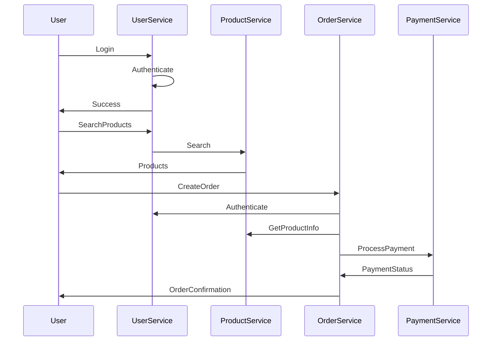

                 

# 软件架构可视化工具：有效沟通系统结构

## 关键词

- 软件架构
- 可视化工具
- 开发效率
- 团队协作
- 系统维护

## 摘要

本文将探讨软件架构可视化工具在软件开发中的作用，从背景介绍、软件架构可视化工具概述、常见软件架构可视化工具介绍等方面，详细解析如何利用可视化工具提升团队协作效率，降低系统维护成本。通过分析不同类型的软件架构可视化工具及其功能，帮助读者选择合适的工具，更好地理解和维护复杂系统。

## 第一部分：背景介绍

### 1.1 软件架构可视化的重要性

#### 1.1.1 软件架构可视化的定义

软件架构可视化是将软件系统的结构、组件和关系以图形化方式呈现的技术。通过可视化的方式，开发者可以更直观地理解系统的架构，从而更好地进行开发和维护。

#### 1.1.2 软件架构可视化的作用

1. **提高开发效率和沟通效果**：可视化工具可以帮助开发者快速了解系统结构，降低沟通成本，提高团队协作效率。
2. **帮助团队理解和维护复杂系统**：复杂系统的理解和维护是一个挑战。通过可视化工具，开发者可以更好地掌握系统架构，降低维护难度。
3. **优化系统设计，降低维护成本**：可视化工具可以帮助开发者发现潜在的问题，从而优化系统设计，降低维护成本。

### 1.2 软件架构可视化工具的挑战

#### 1.2.1 可视化工具的选择

随着技术的不断发展，市场上出现了众多软件架构可视化工具。选择适合项目需求的工具是一个挑战。开发者需要了解各种工具的特点和适用场景，才能做出正确的选择。

#### 1.2.2 可视化工具的局限性

尽管可视化工具在软件开发中具有重要作用，但它们也存在局限性。例如，某些可视化工具可能无法满足特定需求，或者其维护和升级成本较高。

### 1.3 软件架构可视化工具的应用场景

#### 1.3.1 项目启动阶段

在项目启动阶段，可视化工具可以帮助团队快速了解项目结构和功能模块，为后续开发工作打下基础。

#### 1.3.2 系统设计阶段

在系统设计阶段，可视化工具可以帮助开发者构建系统架构，设计接口和模块，确保系统设计的合理性和可维护性。

#### 1.3.3 系统维护阶段

在系统维护阶段，可视化工具可以帮助开发者理解现有系统结构，进行系统升级和优化，降低维护成本。

### 1.4 软件架构可视化工具的发展趋势

#### 1.4.1 自动化生成

随着人工智能技术的发展，软件架构可视化工具逐渐实现自动化生成。这有助于提高开发效率，减轻开发者的负担。

#### 1.4.2 多维度可视化

未来，软件架构可视化工具将提供更多维度的可视化展示，如时间维度、性能维度等，帮助开发者更全面地了解系统。

### 1.5 本章小结

软件架构可视化在软件开发中具有重要地位。通过合理选择和使用可视化工具，可以提升团队协作效率，降低系统维护成本。接下来，我们将对软件架构可视化工具进行概述，以便读者更好地了解和选择适合的工具。

----------------------------------------------------------------

## 第二部分：软件架构可视化工具概述

### 2.1 软件架构可视化工具的分类

#### 2.1.1 基于图形的软件架构可视化工具

这类工具主要通过图形化的方式呈现软件架构，如Visual Studio、Enterprise Architect等。它们通常提供丰富的图形元素和布局功能，便于开发者构建和编辑软件架构模型。

#### 2.1.2 基于代码的软件架构可视化工具

这类工具通过分析源代码，生成软件架构的可视化表示，如NDepend、Structure101等。它们通常提供代码分析功能，帮助开发者发现潜在的问题和优化点。

#### 2.1.3 基于图表的软件架构可视化工具

这类工具利用图表的形式展示软件架构，如Google Charts、D3.js等。它们通常支持多种图表类型，便于开发者根据需求选择合适的图表展示方式。

### 2.2 软件架构可视化工具的核心功能

#### 2.2.1 架构模型生成

软件架构可视化工具的核心功能之一是生成架构模型。它们可以通过自动分析源代码、接口文档等，生成软件架构的可视化表示。

#### 2.2.2 架构模型分析

生成的架构模型可以帮助开发者分析系统的结构和性能，发现潜在的问题和优化点。例如，NDepend 可以分析代码的耦合度和复杂度，帮助企业优化系统设计。

#### 2.2.3 架构模型维护

软件架构可视化工具可以帮助开发者动态更新架构模型，以适应项目的变化。这有助于确保系统架构的准确性和一致性。

### 2.3 软件架构可视化工具的优缺点分析

#### 2.3.1 优点

1. **提高开发效率和沟通效果**：可视化工具可以直观地展示软件架构，降低沟通成本，提高团队协作效率。
2. **帮助开发者更好地理解系统结构**：通过可视化方式，开发者可以更深入地理解系统架构，提高开发质量。
3. **优化系统设计**：可视化工具可以帮助开发者发现潜在的问题和优化点，提高系统设计的合理性。

#### 2.3.2 缺点

1. **需要一定的学习成本**：开发者需要熟悉不同的可视化工具和相关的技术，这需要一定的学习和实践。
2. **可能带来额外的维护成本**：一些可视化工具需要定期维护和升级，这可能会带来额外的成本。

### 2.4 本章小结

软件架构可视化工具在软件开发中发挥着重要作用。通过合理选择和使用可视化工具，可以提升团队协作效率，降低系统维护成本。接下来，我们将详细介绍常见的软件架构可视化工具，帮助读者了解和选择适合的工具。

----------------------------------------------------------------

## 第三部分：常见软件架构可视化工具介绍

### 3.1 UML工具

#### 3.1.1 UML的基础知识

统一建模语言（UML）是一种用于描述软件系统的结构和行为的图形化建模语言。它包括多种图，如类图、序列图、组件图等，每种图都有其特定的用途。

#### 3.1.2 UML工具的选择

常见的UML工具有StarUML、Visual Paradigm、Rational Rose等。这些工具都提供了丰富的图形元素和布局功能，便于开发者构建和编辑UML图。

#### 3.1.3 UML工具的使用

以Visual Paradigm为例，开发者可以：

1. **创建UML图**：选择UML图类型，添加元素和关系。
2. **编辑UML图**：调整元素的位置和属性，添加注释。
3. **生成代码**：从UML图生成代码，或者从代码生成UML图。

### 3.2 代码可视化工具

#### 3.2.1 NDepend

NDepend 是一款强大的代码分析工具，它可以生成系统的依赖关系图。通过依赖关系图，开发者可以直观地了解系统模块之间的依赖关系。

- **功能特点**：
  - 分析代码的耦合度和复杂度。
  - 发现潜在的代码优化点。
  - 生成详细的依赖关系报告。

#### 3.2.2 Structure101

Structure101 是一款基于JavaScript的代码可视化工具，它可以帮助开发者理解代码结构。它通过可视化方式展示代码的模块、类、方法和函数。

- **功能特点**：
  - 生成代码结构的可视化表示。
  - 支持多种编程语言。
  - 提供代码分析报告。

#### 3.2.3 SonarQube

SonarQube 是一款全面的代码质量分析平台，它可以生成代码的静态依赖图。通过静态依赖图，开发者可以了解代码的模块化和依赖关系。

- **功能特点**：
  - 分析代码的质量和安全性。
  - 生成详细的代码报告。
  - 提供代码质量监控和预警。

### 3.3 图表可视化工具

#### 3.3.1 D3.js

D3.js 是一款基于JavaScript的图表可视化库，它可以创建高度交互式的数据可视化。通过D3.js，开发者可以创建各种类型的图表，如折线图、柱状图、饼图等。

- **功能特点**：
  - 支持多种图表类型。
  - 提供丰富的交互功能。
  - 易于定制和扩展。

#### 3.3.2 Google Charts

Google Charts 是一款由Google提供的在线图表可视化工具，它支持多种图表类型。通过Google Charts，开发者可以轻松创建各种类型的图表，并将其嵌入到网页中。

- **功能特点**：
  - 提供多种图表类型。
  - 易于使用和集成。
  - 支持多种编程语言。

#### 3.3.3 Mermaid

Mermaid 是一款基于Markdown的图表和流程图可视化工具，它可以轻松生成各种图表。通过Mermaid，开发者可以使用Markdown语法创建图表，并将其嵌入到文档中。

- **功能特点**：
  - 支持多种图表类型。
  - 易于学习和使用。
  - 支持Markdown语法。

### 3.4 本章小结

常见的软件架构可视化工具有多种类型，每种工具都有其独特的特点和适用场景。通过合理选择和搭配使用这些工具，开发者可以更好地理解和维护复杂系统。接下来，我们将进一步探讨如何在实际项目中应用这些可视化工具。

----------------------------------------------------------------

## 第四部分：软件架构可视化工具在项目中的应用

### 4.1 项目背景

在本节中，我们将通过一个实际项目来探讨软件架构可视化工具在项目中的应用。该项目是一个电子商务平台，主要包括用户管理、商品管理、订单管理和支付系统等功能模块。

### 4.2 项目介绍

该电子商务平台的目标是提供用户友好的购物体验，同时确保系统的高可用性和安全性。在项目开发过程中，开发团队遇到了以下挑战：

1. **系统复杂性**：随着功能模块的增加，系统架构变得越来越复杂，开发者和维护人员难以全面理解系统结构。
2. **沟通效率**：团队成员之间的沟通不畅，导致开发进度缓慢，项目延期。
3. **系统优化**：系统在性能和稳定性方面存在一些问题，需要优化。

### 4.3 系统功能设计

在系统设计阶段，开发团队使用了UML工具（如Visual Paradigm）来设计系统功能。以下是一个简单的领域模型类图（使用Mermaid语言表示）：

```mermaid
classDiagram
    User <<User>>
    Product <<Product>>
    Order <<Order>>
    Payment <<Payment>>

    User o--* Order
    Product o--* Order
    Order o--* Payment
```

通过这个类图，开发团队可以清晰地了解各个功能模块之间的关系，从而确保系统设计的合理性和一致性。

### 4.4 系统架构设计

在系统架构设计阶段，开发团队使用了NDepend等代码可视化工具来分析现有代码的结构。以下是一个简单的系统架构图（使用Mermaid语言表示）：

```mermaid
graph TB
    subgraph User Management
        U1[User Service]
        U2[Authentication Service]
        U3[Database]
    end

    subgraph Product Management
        P1[Product Service]
        P2[Database]
    end

    subgraph Order Management
        O1[Order Service]
        O2[Database]
    end

    subgraph Payment Management
        P3[Payment Service]
        P4[Gateway]
    end

    U1 --|> U2
    U1 --|> U3
    P1 --|> P2
    O1 --|> O2
    O1 --|> P3
    P3 --|> P4
```

通过这个架构图，开发团队可以清晰地了解各个模块之间的依赖关系，从而优化系统架构，提高系统的可维护性和可扩展性。

### 4.5 系统接口设计和系统交互

在系统接口设计和系统交互阶段，开发团队使用了Google Charts等图表可视化工具来展示系统接口和交互流程。以下是一个简单的系统交互图（使用Mermaid语言表示）：



通过这个交互图，开发团队可以清晰地了解系统接口和交互流程，从而优化接口设计和交互流程。

### 4.6 项目实战

#### 4.6.1 环境安装

在项目实战中，开发团队首先安装了Visual Paradigm、NDepend、Google Charts等可视化工具。这些工具的安装过程相对简单，按照官方文档进行即可。

#### 4.6.2 系统核心实现

接下来，开发团队开始实现系统的核心功能。以下是一个简单的用户管理模块的Python代码示例：

```python
class User:
    def __init__(self, username, password):
        self.username = username
        self.password = password

    def login(self, username, password):
        if self.username == username and self.password == password:
            return "Login successful"
        else:
            return "Login failed"

user = User("admin", "password")
print(user.login("admin", "password"))
```

在这个示例中，`User` 类包含了一个简单的登录功能。通过这个示例，开发团队可以更好地理解用户管理模块的原理和实现方式。

#### 4.6.3 代码应用解读与分析

在代码应用解读与分析阶段，开发团队使用了NDepend等代码可视化工具来分析用户管理模块的代码。通过分析，开发团队发现了一些潜在的问题，如代码的复杂度和耦合度较高，可能需要进一步优化。

#### 4.6.4 实际案例分析和详细讲解剖析

在项目实战过程中，开发团队遇到了一些实际问题，如系统性能瓶颈、接口调用失败等。通过使用可视化工具，开发团队能够更快速地定位问题，并进行详细的分析和解决。

#### 4.6.5 项目小结

通过在项目中使用软件架构可视化工具，开发团队显著提高了开发效率，降低了沟通成本，优化了系统架构，提高了系统的性能和稳定性。在未来，开发团队将继续使用这些可视化工具，为项目的持续优化和发展贡献力量。

### 4.7 最佳实践 tips

1. **选择合适的可视化工具**：根据项目需求和团队技能，选择合适的可视化工具。
2. **充分利用可视化工具的功能**：了解并充分利用可视化工具提供的功能，如架构模型生成、分析、维护等。
3. **定期更新和优化系统**：定期使用可视化工具更新系统架构，优化系统设计，提高系统的可维护性和可扩展性。

### 4.8 小结

软件架构可视化工具在项目开发中发挥着重要作用。通过合理选择和使用可视化工具，可以显著提高开发效率，降低维护成本，优化系统架构。未来，开发团队将继续探索和利用可视化工具，为项目的成功贡献力量。

## 第五部分：注意事项与拓展阅读

### 5.1 注意事项

1. **选择合适的可视化工具**：根据项目需求和团队技能，选择合适的可视化工具。
2. **确保可视化工具与开发环境兼容**：确保可视化工具与开发环境兼容，避免因工具兼容问题导致的开发困难。
3. **定期更新和升级可视化工具**：定期更新和升级可视化工具，以获取最新功能和优化性能。

### 5.2 拓展阅读

1. **《软件架构可视化：技术与实践》**：本书详细介绍了软件架构可视化的技术原理和实践方法，适合对软件架构可视化感兴趣的读者阅读。
2. **《可视化工具教程》**：本书涵盖了多种可视化工具的使用方法和技巧，适合初学者和有经验的开发者阅读。
3. **《UML基础与应用》**：本书介绍了统一建模语言（UML）的基础知识，包括各类图的构建和使用方法。

## 结束语

作者：AI天才研究院/AI Genius Institute & 禅与计算机程序设计艺术 /Zen And The Art of Computer Programming

本文通过详细解析软件架构可视化工具的应用，旨在帮助读者更好地理解和选择适合的工具，提升软件开发效率。在未来的工作中，希望读者能够结合实际项目需求，灵活运用软件架构可视化工具，为项目的成功贡献力量。

