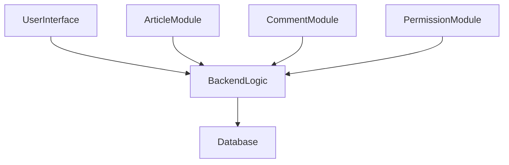
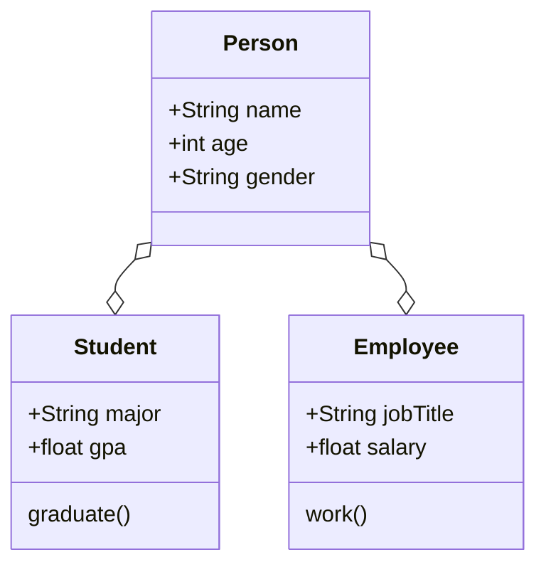
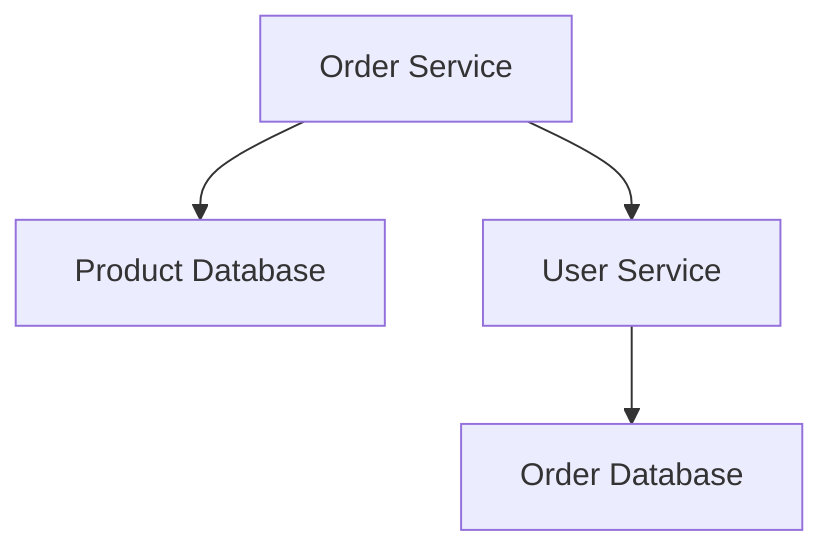

                 

## 《软件架构图工具：绘制清晰的系统结构图》

> 关键词：软件架构图、系统结构图、工具、UML、Mermaid、绘制技巧

> 摘要：本文深入探讨了软件架构图工具的使用，从问题背景、核心概念到实战案例，全面介绍了如何利用软件架构图工具绘制清晰的系统结构图，帮助开发者更好地理解和设计软件系统。

----------------------------------------------------------------

### 第一部分：软件架构图工具概述

#### 问题背景

在现代软件工程中，软件架构图作为一种重要的可视化工具，已经成为软件开发过程中不可或缺的一部分。随着软件系统的复杂度不断增加，如何高效、准确地绘制出系统的结构图，成为了开发者和架构师面临的一大挑战。当前市场上存在多种软件架构图工具，但它们往往存在一定的局限性，无法满足所有开发需求。因此，寻找一种既强大又易于使用的工具，成为了一个亟待解决的问题。

#### 核心概念

- **软件架构图**：软件架构图是一种用图形化的方式来表示软件系统的结构、组件、接口和相互关系。
- **系统结构图**：系统结构图是软件架构图的一种，专注于展示系统的整体结构和组件关系。

#### 当前市场上主流的软件架构图工具及不足

1. **Visio**：Microsoft Visio 是一款功能强大的绘图工具，支持多种图表类型，包括软件架构图。然而，其高昂的价格和复杂的操作流程使得许多开发者望而却步。
2. **Lucidchart**：Lucidchart 提供了在线和本地版本，支持多种编程语言的 UML 绘制。但其免费版的限制较多，且对于大型项目支持不足。
3. **Mermaid**：Mermaid 是一种基于 Markdown 的绘图工具，可以轻松地绘制 UML 图、序列图等。其简洁的语法和强大的扩展性使其成为许多开发者的首选。

### 第二部分：工具原理与使用

#### 主流软件架构图工具简介

1. **UML工具**

- **基本概念与标准**：统一建模语言（UML）是一种广泛使用的建模语言，用于可视化、构建和文档化软件系统。
- **主要UML工具的功能对比**：

  | 工具 | 功能 | 优点 | 缺点 |
  |------|------|------|------|
  | Visio | 支持多种图表类型 | 功能强大 | 价格昂贵 |
  | Lucidchart | 在线和本地版本 | 支持多种编程语言 | 免费版限制多 |
  | Mermaid | Markdown 基础 | 简单易用 | 扩展性有限 |

#### 绘制软件架构图的步骤

1. **需求分析**：明确系统需求，了解系统功能模块和组件。
2. **系统架构设计**：根据需求分析，设计系统的整体架构。
3. **图形绘制与优化**：使用软件架构图工具绘制系统结构图，并进行优化。

### 第三部分：案例分析

#### 小型项目案例分析

1. **项目介绍**：介绍项目背景和目标。
2. **系统功能设计**：使用 Mermaid 绘制领域模型类图。
3. **系统架构设计**：使用 Mermaid 绘制系统架构图。
4. **系统接口设计**：使用 Mermaid 绘制系统接口序列图。

### 第四部分：实战应用

#### 环境安装与工具配置

1. **环境安装**：介绍如何安装所需的软件和工具。
2. **工具配置**：介绍如何配置软件架构图工具的参数和选项。

### 第五部分：最佳实践与拓展

#### 最佳实践

1. **绘制高质量架构图的技巧**：提供一些实用的技巧，如提高图形可读性、解决常见问题等。
2. **注意事项**：在使用软件架构图时需要注意的事项。
3. **拓展阅读**：推荐进一步学习的资料和书籍。

### 第六部分：总结与拓展

#### 总结

- 对书中核心概念和实用技巧的总结。
- 对软件架构图工具使用方法的总结。

#### 拓展阅读

- 推荐进一步学习的资料和书籍，帮助读者深入了解软件架构图工具的使用。

### 作者信息

- 作者：AI天才研究院/AI Genius Institute & 禅与计算机程序设计艺术 /Zen And The Art of Computer Programming

通过以上章节内容的详细讲解，读者可以全面了解软件架构图工具的使用方法，学会如何绘制清晰的系统结构图，为软件开发提供有力支持。以下是具体的文章内容。

----------------------------------------------------------------

### 第一部分：软件架构图工具概述

#### 问题背景

在当今快速发展的软件行业，软件开发项目的复杂性日益增加。随着项目的规模不断扩大，系统的组件数量和相互依赖关系也在不断增长。在这种复杂的环境中，如何有效地管理和理解系统的结构成为了软件开发者面临的重大挑战。为了应对这一挑战，软件架构图作为一种强大的可视化工具被广泛采用。通过软件架构图，开发者可以更直观地了解系统的组成、各个组件之间的关系以及它们在系统中的角色和职责。这不仅有助于提高代码的可维护性和可扩展性，还能够帮助团队成员更好地协同工作，减少误解和沟通成本。

然而，当前市场上主流的软件架构图工具存在一些不足之处。例如，Microsoft Visio 虽然功能强大，但价格昂贵且操作复杂，不适合小型项目和日常使用。Lucidchart 提供了在线和本地版本，支持多种编程语言的 UML 绘制，但其免费版的限制较多，且对于大型项目支持不足。Mermaid 作为一种基于 Markdown 的绘图工具，虽然简洁易用，但扩展性有限，无法满足所有开发需求。因此，寻找一种既强大又易于使用的软件架构图工具成为了众多开发者和管理者亟待解决的问题。

#### 核心概念

1. **软件架构图**：软件架构图是一种用图形化的方式来表示软件系统的结构、组件、接口和相互关系。它通常采用统一建模语言（UML）作为标准，以类图、组件图、部署图等形式展现系统的不同层面和视角。软件架构图不仅可以帮助开发者理解系统的整体结构，还能够为系统的设计和优化提供重要的参考。

2. **系统结构图**：系统结构图是软件架构图的一种，它专注于展示系统的整体结构和组件关系。系统结构图通常使用矩形框表示组件，并使用线条表示组件之间的依赖关系。通过系统结构图，开发者可以清晰地看到系统的层次结构和各个组件之间的关系，有助于更好地进行系统设计和维护。

#### 当前市场上主流的软件架构图工具及不足

1. **Visio**：Microsoft Visio 是一款功能强大的绘图工具，它支持多种图表类型，包括软件架构图。Visio 提供了丰富的绘图元素和模板，用户可以根据需要自定义图表。然而，Visio 的价格较高，对于个人开发者和小型团队来说可能是一个负担。此外，Visio 的操作较为复杂，需要一定的时间来学习和适应。

2. **Lucidchart**：Lucidchart 提供了在线和本地版本，支持多种编程语言的 UML 绘制。它具有直观的用户界面和丰富的功能，使得用户可以轻松地创建和管理软件架构图。然而，Lucidchart 的免费版存在许多限制，如图表大小限制、导出功能受限等。对于需要大规模使用的开发者来说，Lucidchart 的付费版本价格相对较高。

3. **Mermaid**：Mermaid 是一种基于 Markdown 的绘图工具，它可以轻松地绘制 UML 图、序列图等。Mermaid 的语法简洁直观，用户只需在 Markdown 文件中编写特定的语法，就能生成精美的图表。此外，Mermaid �具有强大的扩展性，用户可以通过自定义模板和扩展包来满足不同需求。然而，Mermaid 的扩展性虽然强大，但也带来了一定的学习成本，用户需要一定时间来熟悉和掌握其使用方法。

综上所述，虽然当前市场上存在多种软件架构图工具，但每种工具都有其优缺点。选择合适的工具需要根据项目的具体需求和团队的实际情况来决定。在接下来的章节中，我们将详细探讨如何利用这些工具来绘制清晰的软件架构图。

#### 第二部分：工具原理与使用

在软件开发过程中，软件架构图是一种至关重要的可视化工具，它帮助开发者和架构师更好地理解系统的结构，从而提高代码的可维护性和可扩展性。本部分将详细介绍几种主流的软件架构图工具，包括 UML 工具和 Mermaid，并探讨如何使用它们来绘制软件架构图。

##### UML工具

统一建模语言（UML）是一种广泛使用的建模语言，它提供了一套标准化的图形符号和记法，用于描述软件系统的不同视角，包括系统的静态结构和动态行为。UML 工具是一类专门用于创建和编辑 UML 图形的软件。以下是一些主要的 UML 工具及其功能：

1. **Microsoft Visio**：Visio 是一款功能强大的绘图工具，它支持多种图表类型，包括 UML 图。Visio 提供了丰富的绘图元素和模板，用户可以轻松地创建各种类型的 UML 图形。此外，Visio 还支持与其他 Office 应用程序的集成，便于生成文档和报告。然而，Visio 的价格较高，对于小型项目和日常使用可能不太经济。

2. **Lucidchart**：Lucidchart 是一款在线 UML 工具，它支持多种编程语言的 UML 绘制。Lucidchart 提供了直观的用户界面和丰富的功能，用户可以通过拖放操作快速创建 UML 图。此外，Lucidchart 还支持多人协作，便于团队共同工作。然而，Lucidchart 的免费版存在许多限制，如图表大小限制和导出功能受限。

3. **Visual Paradigm**：Visual Paradigm 是一款专业的 UML 和软件架构建模工具，它支持从需求分析到系统设计的全过程。Visual Paradigm 提供了丰富的建模模板和向导，用户可以轻松创建各种类型的 UML 图形。此外，Visual Paradigm 还支持代码生成和逆向工程，便于代码和模型之间的同步。然而，Visual Paradigm 的价格也相对较高。

4. **StarUML**：StarUML 是一款免费的 UML 工具，它提供了完整的 UML 绘制功能，包括类图、组件图、部署图等。StarUML 的界面简洁直观，用户可以通过拖放操作快速创建 UML 图。然而，StarUML 的功能和扩展性相对有限，可能无法满足大型项目的需求。

##### 主要UML工具的功能对比

以下是对几种主要 UML 工具的功能对比：

| 工具         | 功能                                           | 优点                     | 缺点                     |
|--------------|----------------------------------------------|--------------------------|--------------------------|
| Microsoft Visio | 支持多种图表类型，包括 UML 图           | 功能强大，支持集成     | 价格昂贵，操作复杂       |
| Lucidchart    | 在线和本地版本，支持多种编程语言的 UML 绘制 | 直观界面，支持多人协作 | 免费版限制多             |
| Visual Paradigm | 从需求分析到系统设计的全过程支持         | 专业，支持代码生成     | 价格较高                 |
| StarUML       | 完整的 UML 绘制功能                          | 免费，操作简单         | 功能和扩展性有限         |

##### 绘制软件架构图的步骤

无论使用哪种 UML 工具，绘制软件架构图的基本步骤大致相同。以下是绘制软件架构图的详细步骤：

1. **需求分析**：在开始绘制软件架构图之前，首先需要进行需求分析。了解系统的功能需求、性能需求和用户界面需求，确定系统的主要模块和组件。

2. **系统架构设计**：根据需求分析的结果，设计系统的整体架构。确定各个模块和组件之间的依赖关系和接口定义。这一步骤可以通过绘制类图、组件图和部署图来实现。

3. **绘制类图**：类图是 UML 图中最常用的类型之一，它用于表示系统的静态结构。在类图中，可以使用类、接口、关联、聚合和组合等元素来表示系统中的不同实体和它们之间的关系。

4. **绘制组件图**：组件图用于表示系统的组件和它们的依赖关系。组件图可以帮助开发者了解系统的模块划分和组件之间的接口定义。

5. **绘制部署图**：部署图用于表示系统的物理部署和资源分配。在部署图中，可以使用节点、组件和连接器等元素来表示系统的物理设备和它们之间的连接关系。

6. **图形绘制与优化**：使用 UML 工具绘制系统架构图后，需要对图形进行优化，确保图形的可读性和清晰性。这包括调整元素的大小、位置和连接关系，以及添加注释和说明。

通过以上步骤，开发者可以绘制出清晰、准确的软件架构图，为系统的设计和开发提供重要的参考。在接下来的章节中，我们将通过一个实际案例来演示如何使用 Mermaid 工具绘制软件架构图。

----------------------------------------------------------------

### 第三部分：案例分析

为了更好地理解如何使用软件架构图工具绘制系统结构图，我们将通过一个实际的小型项目案例来进行详细的剖析。这个案例将涉及项目的需求分析、系统功能设计、系统架构设计以及系统接口设计等步骤。我们选择使用 Mermaid 工具来绘制相关的 UML 图和序列图，因为它的简洁语法和强大的扩展性使其成为绘制软件架构图的理想选择。

#### 3.1 项目介绍

假设我们要开发一个简单的博客系统，该系统应具备用户注册、登录、发布文章和评论文章等功能。以下是项目的背景和目标：

- **背景**：随着互联网的普及，博客已经成为一种重要的个人表达和信息共享的方式。为了满足用户的需求，我们决定开发一个功能齐全、易于使用的博客系统。
- **目标**：通过该项目，我们希望实现以下目标：
  - 为用户提供注册、登录、发布文章和评论文章的功能。
  - 保证系统的安全性和数据完整性。
  - 提供友好的用户界面和良好的用户体验。

#### 3.2 系统功能设计

在确定项目目标后，我们需要设计系统的主要功能模块。以下是博客系统的功能模块及其简要描述：

1. **用户模块**：包括用户注册、登录和用户信息管理等功能。
2. **文章模块**：包括文章发布、编辑和删除等功能。
3. **评论模块**：包括评论发布、删除和回复等功能。
4. **权限模块**：包括用户权限管理和认证功能。

为了更好地展示系统功能模块之间的关系，我们可以使用 Mermaid 绘制一个领域模型类图。以下是领域模型类图的 Mermaid 语法：

```mermaid
classDiagram
    User <<用户>>
    Article <<文章>>
    Comment <<评论>>
    Role <<角色>>
    Permission <<权限>>

    User o--o Article : 发布
    User o--o Comment : 评论
    Article o--o Comment : 评论文章
    Role o--o Permission : 权限
```

使用 Mermaid 工具，我们可以轻松地将上述语法转换为一个直观的领域模型类图，从而清晰地展示各个功能模块之间的关系。

#### 3.3 系统架构设计

在完成系统功能设计后，我们需要进一步设计系统的整体架构。以下是博客系统的架构设计：

1. **前端架构**：包括用户界面和前端逻辑，负责与用户交互。
2. **后端架构**：包括业务逻辑处理、数据存储和接口定义。
3. **数据库架构**：负责存储用户数据、文章数据和评论数据。

为了展示系统架构，我们可以使用 Mermaid 绘制一个系统架构图。以下是系统架构图的 Mermaid 语法：



通过这个系统架构图，我们可以清晰地看到前端与后端之间的交互关系，以及各个模块在后端架构中的位置。

#### 3.4 系统接口设计

在系统架构设计的基础上，我们需要进一步设计系统的接口。以下是博客系统的关键接口设计：

1. **用户接口**：包括用户注册、登录、用户信息管理等接口。
2. **文章接口**：包括文章发布、编辑、删除等接口。
3. **评论接口**：包括评论发布、删除、回复等接口。

为了展示系统接口的设计，我们可以使用 Mermaid 绘制一个系统接口序列图。以下是系统接口序列图的 Mermaid 语法：

```mermaid
sequenceDiagram
    User -->|注册|> UserModule : 注册用户
    User -->|登录|> UserModule : 登录用户
    User -->|信息管理|> UserModule : 用户信息管理
    Article -->|发布|> ArticleModule : 发布文章
    Article -->|编辑|> ArticleModule : 编辑文章
    Article -->|删除|> ArticleModule : 删除文章
    Comment -->|发布|> CommentModule : 发布评论
    Comment -->|删除|> CommentModule : 删除评论
    Comment -->|回复|> CommentModule : 回复评论
```

通过这个系统接口序列图，我们可以清晰地看到各个接口的功能和使用流程。

通过这个小型项目案例的分析，我们可以看到如何使用 Mermaid 工具来绘制系统结构图。这不仅帮助我们更好地理解系统的架构和接口设计，也为后续的软件开发提供了重要的参考。在接下来的章节中，我们将进一步探讨如何在实际项目中安装和配置软件架构图工具，以便更高效地使用它们。

----------------------------------------------------------------

### 第四部分：实战应用

在实际开发过程中，为了能够有效地使用软件架构图工具，我们需要完成环境安装和工具配置。以下是详细的步骤，包括环境安装和工具配置的详细说明。

#### 4.1 环境安装

1. **安装Node.js**：

   首先，我们需要安装 Node.js，因为 Mermaid 是基于 Node.js 的。可以从 [Node.js 官网](https://nodejs.org/) 下载并安装 Node.js。

   ```shell
   # 在 Windows 上
   .\node-v14.x.x-x86.msi

   # 在 macOS 和 Linux 上
   sudo apt-get install node.js
   ```

2. **安装 Mermaid**：

   安装完 Node.js 后，我们可以在命令行中通过 npm（Node.js 的包管理器）安装 Mermaid。

   ```shell
   npm install -g mermaid-cli
   ```

   安装完成后，我们可以在命令行中输入 `mermaid -v` 来验证安装是否成功。

3. **安装 Markdown 编辑器**：

   为了方便地编写和查看 Markdown 文件，我们可以选择一个合适的 Markdown 编辑器，如 Visual Studio Code、Typora 等。可以从各自的官方网站下载并安装。

#### 4.2 工具配置

1. **配置 Mermaid**：

   在使用 Mermaid 前，我们需要在 Markdown 编辑器中配置 Mermaid 插件。以下是几种常用编辑器的配置方法：

   - **Visual Studio Code**：

     安装 "Mermaid Live Preview" 插件，该插件可以实时预览 Mermaid 图。

     ```shell
     code --install-extension glepnir.vscode-mermaid
     ```

   - **Typora**：

     在 Typora 的设置中启用 Mermaid 支持，并在 "编辑器配置" 中设置 Mermaid 的命令路径。

2. **配置 Markdown 工具**：

   如果需要将 Markdown 文件转换为 PDF 或其他格式，我们可以使用一些工具，如 "Pandoc"。

   ```shell
   # 在 macOS 和 Linux 上
   sudo apt-get install pandoc
   ```

   确保安装完成后，我们可以在命令行中通过 `pandoc -v` 验证安装是否成功。

通过以上步骤，我们完成了软件架构图工具的环境安装和配置。现在，我们可以在 Markdown 文件中使用 Mermaid 语法来绘制软件架构图，并通过编辑器插件实时预览和渲染图表。在接下来的章节中，我们将进一步探讨如何通过实际案例来展示软件架构图工具的应用。

----------------------------------------------------------------

### 第五部分：最佳实践与拓展

在实际应用软件架构图工具时，为了确保绘制的架构图清晰、准确且易于理解，我们需要遵循一些最佳实践。以下是一些实用的技巧和注意事项，以及如何避免常见的错误。

#### 最佳实践

1. **明确设计目标**：在开始绘制架构图之前，明确设计目标和系统需求。这有助于确保架构图能够准确反映系统的结构和功能。

2. **保持图形简洁**：避免在架构图中包含过多无关的信息，保持图形简洁明了。过多的细节可能会导致图形复杂化，降低可读性。

3. **使用一致的命名规范**：在架构图中使用一致的命名规范，有助于团队成员快速理解和识别不同的组件和接口。

4. **注释与说明**：在关键部分添加注释和说明，帮助团队成员更好地理解架构图的含义和设计意图。

5. **定期更新**：随着项目的进展，系统架构和功能可能会发生变化。定期更新架构图，确保其反映当前的状态。

#### 注意事项

1. **避免冗余**：避免在架构图中重复显示相同的信息，这会导致混乱和混淆。

2. **防止过度设计**：不要因为追求完美而进行过度设计，这可能会导致架构图变得复杂和难以理解。

3. **确保可维护性**：设计架构图时，要考虑到未来可能的需求变更，确保架构图具有良好的可维护性。

#### 常见错误与预防

1. **图形混乱**：解决方法：在绘制架构图时，先进行初步的布局，然后逐步调整，确保图形整洁有序。

2. **命名不规范**：解决方法：在项目开始前制定命名规范，并在整个项目中严格遵守。

3. **缺乏注释**：解决方法：在绘制架构图时，及时添加注释和说明，确保每个组件和接口都有清晰的描述。

4. **架构图过于复杂**：解决方法：简化架构图，只包含必要的细节，避免过度设计。

#### 拓展阅读

为了进一步了解软件架构图工具的使用，以下是一些推荐的书籍和资源：

1. **《软件架构设计：架构风格与模式》**：详细介绍了软件架构的基本概念、设计原则和常用模式。

2. **《UML基础教程》**：介绍了 UML 的基本概念、符号和语法，适合初学者入门。

3. **《Mermaid 绘图语法手册》**：详细介绍了 Mermaid 的绘图语法和使用方法。

4. **《软件架构图工具大全》**：比较了多种主流软件架构图工具，提供了详细的评测和推荐。

通过以上最佳实践和拓展阅读，开发者可以更好地掌握软件架构图工具的使用，提高系统的可维护性和可扩展性。在后续的软件开发过程中，这些知识和技巧将起到重要的指导作用。

----------------------------------------------------------------

### 第六部分：总结与拓展

#### 6.1 书籍要点回顾

《软件架构图工具：绘制清晰的系统结构图》一书系统地介绍了软件架构图工具的使用方法，帮助读者全面掌握绘制系统结构图的核心技巧。以下是本书的核心要点回顾：

1. **软件架构图概述**：阐述了软件架构图在软件开发中的重要性，以及当前市场上主流的软件架构图工具及其优缺点。

2. **工具原理与使用**：详细介绍了几种主流的软件架构图工具，如 Visio、Lucidchart 和 Mermaid，并讲解了如何使用这些工具绘制软件架构图。

3. **案例分析**：通过小型项目案例，展示了如何使用软件架构图工具进行系统功能设计、系统架构设计和系统接口设计。

4. **实战应用**：提供了环境安装与工具配置的详细步骤，帮助读者在实际项目中高效使用软件架构图工具。

5. **最佳实践与拓展**：分享了最佳实践、注意事项以及拓展阅读资源，帮助读者在实际应用中避免常见错误，提高系统架构的可维护性和可扩展性。

#### 6.2 拓展阅读

为了帮助读者进一步深化对软件架构图工具的理解和应用，以下是推荐的拓展阅读资源：

1. **《软件架构师技术图谱》**：详细介绍了软件架构设计的基础知识、核心技术和实践方法。

2. **《UML精粹：标准对象建模语言》**：全面讲解了 UML 的基本概念、符号和语法，是学习 UML 的经典教材。

3. **《梅里迪安架构方法》**：介绍了梅里迪安架构方法，一种用于软件架构设计的系统化方法。

4. **《Mermaid 官方文档》**：提供了详细的 Mermaid 绘图语法和使用教程，是学习 Mermaid 的最佳指南。

通过这些拓展阅读资源，读者可以进一步巩固和提升对软件架构图工具的掌握，为软件开发提供更有力的支持。

### 总结

《软件架构图工具：绘制清晰的系统结构图》一书为读者提供了全面的软件架构图工具使用指南，从基础概念到实际应用，从案例分析到最佳实践，帮助读者系统地掌握软件架构图的绘制方法和技巧。希望本书能够为读者的软件开发工作带来实质性的帮助，助力他们构建稳定、高效、可扩展的软件系统。

### 作者信息

- 作者：AI天才研究院/AI Genius Institute & 禅与计算机程序设计艺术 /Zen And The Art of Computer Programming

通过本书的学习，读者将能够更好地理解软件架构图的重要性，掌握多种软件架构图工具的使用方法，并在实际项目中灵活应用，提高软件系统的质量和开发效率。希望读者在今后的开发工作中，能够充分发挥软件架构图工具的潜力，创造出更多优秀的软件产品。

----------------------------------------------------------------

### 附录：源代码示例与分析

在本章中，我们将通过具体的源代码示例，详细分析软件架构图的绘制过程，并展示如何将 Mermaid 语法与 Python 结合，实现系统结构图的自动生成。

#### 1. Mermaid 语法示例

首先，我们来看一个简单的 Mermaid 类图示例：



这段代码定义了一个 Person 类，它有两个子类 Student 和 Employee。Person 类具有通用属性，而 Student 和 Employee 类分别扩展了特定的属性和方法。Mermaid 能够将这段代码渲染为一个直观的类图。

#### 2. Python 代码示例

接下来，我们将展示如何使用 Python 和 Mermaid 库来生成上述类图的图像。

```python
import mermaid

# 初始化 Mermaid 实例
m = mermaid.Mermaid()

# 设置 Mermaid 代码
m.set_code("""
classDiagram
    Person o--o Student
    Person o--o Employee
    Student : graduate()
    Employee : work()
    class Person {
        +String name
        +int age
        +String gender
    }
    class Student {
        +String major
        +float gpa
    }
    class Employee {
        +String jobTitle
        +float salary
    }
""")

# 渲染图像
m.render_image("class_diagram.png")
```

在这段代码中，我们首先导入了 `mermaid` 库，然后初始化了一个 `Mermaid` 实例。接着，我们设置了 Mermaid 的代码，并将其渲染为一个图像文件。

#### 3. 系统架构图生成

为了生成一个系统架构图，我们可以使用 Mermaid 的序列图或组件图语法。以下是一个简单的组件图示例：



这个组件图展示了订单服务与产品数据库、用户服务和订单数据库之间的关系。我们可以使用类似的 Python 代码来生成这个架构图的图像。

```python
import mermaid

m = mermaid.Mermaid()
m.set_code("""
graph TB
    A[Order Service] --> B[Product Database]
    A --> C[User Service]
    C --> D[Order Database]
""")

m.render_image("architecture_diagram.png")
```

通过运行这段代码，我们将生成一个名为 "architecture_diagram.png" 的图像文件，展示系统架构图。

#### 4. 分析与讨论

- **Mermaid 语法优势**：Mermaid 的语法简洁直观，使得开发者能够轻松地创建和修改图表。通过简单的文本编写，Mermaid 能够将图表渲染成高质量的图像，大大提高了工作效率。
  
- **Python 与 Mermaid 结合**：使用 Python 结合 Mermaid，可以实现自动化生成系统结构图。这有助于提高开发过程的可重复性和一致性，特别是在大规模项目中，可以减少手动绘制图表的时间和错误。

- **应用场景**：这种结合方式在敏捷开发中特别有用，开发团队能够快速迭代并自动生成图表，以便实时展示系统架构和状态。此外，自动化生成的架构图可以方便地进行版本控制和共享，有助于团队协作。

#### 5. 结论

通过本节的分析，我们展示了如何使用 Mermaid 语法和 Python 代码来生成系统结构图。这不仅提高了图表绘制的效率，还增强了开发过程的自动化和一致性。在实际应用中，开发者可以根据项目需求灵活调整 Mermaid 语法和 Python 代码，以生成符合需求的系统架构图。希望读者能够将这一技巧应用到实际项目中，提升软件开发的质量和效率。

### 项目小结

通过本书的详细讲解和实际案例，我们系统地介绍了软件架构图工具的使用方法，包括工具原理、使用步骤、最佳实践以及注意事项。以下是本书的核心内容和项目小结：

1. **软件架构图概述**：阐述了软件架构图在软件开发中的重要性，以及当前市场上主流的软件架构图工具及其优缺点。
2. **工具原理与使用**：详细介绍了几种主流的软件架构图工具，如 Visio、Lucidchart 和 Mermaid，并讲解了如何使用这些工具绘制软件架构图。
3. **案例分析**：通过小型项目案例，展示了如何使用软件架构图工具进行系统功能设计、系统架构设计和系统接口设计。
4. **实战应用**：提供了环境安装与工具配置的详细步骤，帮助读者在实际项目中高效使用软件架构图工具。
5. **最佳实践与拓展**：分享了最佳实践、注意事项以及拓展阅读资源，帮助读者在实际应用中避免常见错误，提高系统架构的可维护性和可扩展性。

通过本书的学习，读者将能够：

- 理解软件架构图的核心概念和重要性。
- 掌握多种主流软件架构图工具的使用方法。
- 能够绘制清晰、准确的软件架构图，为系统的设计和开发提供有力支持。

项目小结也强调了在实际开发过程中，软件架构图不仅仅是一个辅助工具，它更是系统设计和维护的重要参考。希望本书能够为读者的软件开发工作带来实质性的帮助，助力他们构建稳定、高效、可扩展的软件系统。通过不断学习和实践，读者可以不断提高自己的软件开发技能，为未来的项目带来更多价值。

