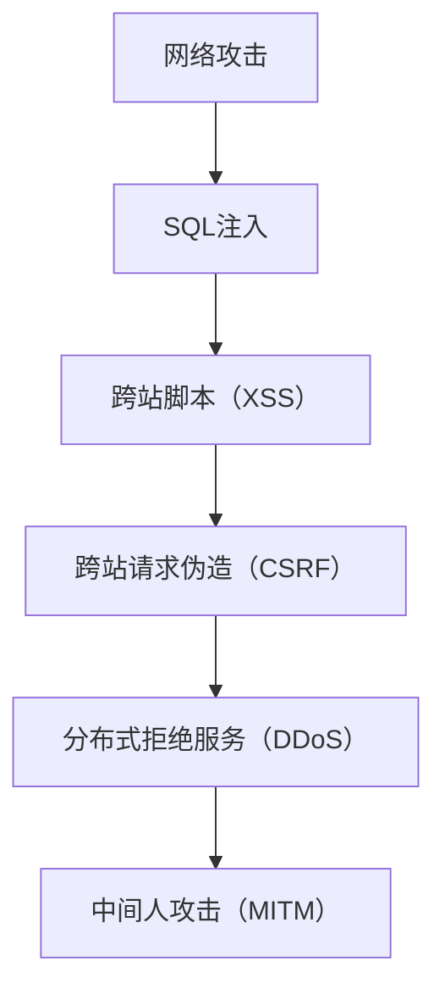
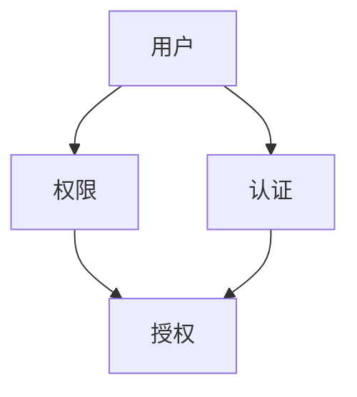
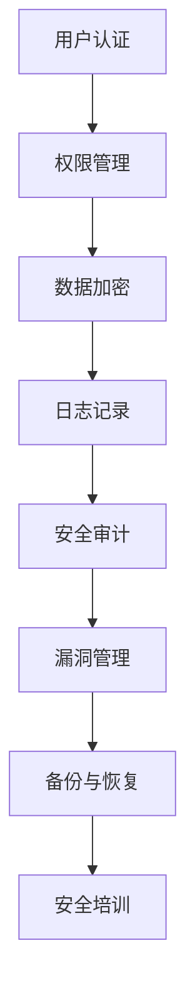
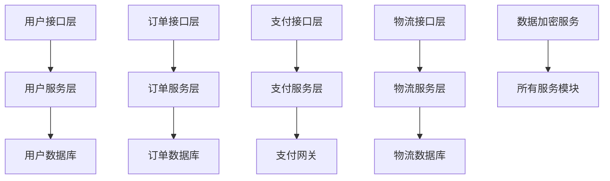
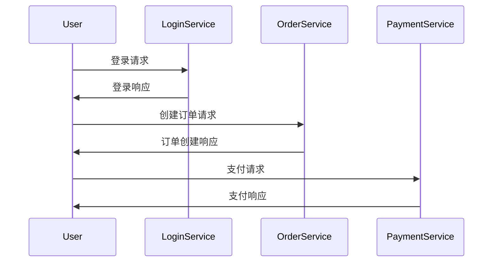

                 


### # 软件架构安全：设计阶段的安全考量

> 关键词：软件架构安全、设计阶段、安全考量、安全属性、核心原理、实现策略、系统架构、实战案例、最佳实践

> 摘要：本文旨在深入探讨软件架构安全在设计阶段的重要性及具体考量。通过分析安全属性、核心原理、实现策略和系统架构，结合实战案例，提出一系列最佳实践，以帮助开发者在设计阶段就构筑起一套安全可靠的软件架构。

#### 第一部分：背景介绍

#### 第1章：软件架构安全概述

## 1.1 问题背景

### 1.1.1 安全问题在软件架构中的重要性

在现代软件系统中，安全性问题日益凸显，成为影响系统健康运行和用户信任的重要因素。随着互联网和移动设备的普及，软件系统面临的攻击方式也越来越多样化和复杂化。从传统的网络攻击、SQL注入，到最新的应用级攻击，如跨站脚本（XSS）和跨站请求伪造（CSRF），都对软件架构的安全性提出了严峻挑战。

### 1.1.2 软件架构安全的主要挑战

软件架构安全面临的主要挑战包括：

1. **复杂性增加**：随着软件系统的规模和复杂性不断增加，安全漏洞也更容易隐藏在其中。
2. **快速迭代**：敏捷开发和持续集成使得安全测试难以覆盖所有代码路径，增加了安全风险。
3. **跨领域融合**：软件系统越来越依赖于第三方库和框架，这些组件可能包含未知的安全风险。
4. **合规要求**：不同国家和地区对数据保护和隐私有不同的法规要求，开发者需要确保软件架构符合相关法规。

## 1.2 核心概念

### 1.2.1 软件架构安全的定义

软件架构安全是指在软件设计、开发、部署和运维等各个阶段，确保软件系统能够抵御外部和内部的恶意攻击，保护系统数据的完整性、保密性和可用性。

### 1.2.2 软件架构安全的关键要素

软件架构安全的关键要素包括：

1. **安全性属性**：包括保密性、完整性、可用性、认证和授权等。
2. **设计原则**：如最小权限原则、分层设计和安全编码规范。
3. **架构模式**：如沙箱、代理、防火墙和虚拟化等。
4. **安全工具**：如加密库、安全审计工具和漏洞扫描工具。

## 1.3 边界与外延

### 1.3.1 软件架构安全与其他领域的交叉

软件架构安全不仅与软件开发领域密切相关，还涉及计算机安全、网络安全、数据保护等多个领域。这些领域的交叉为软件架构安全提供了丰富的理论和技术支持。

### 1.3.2 软件架构安全的范畴与限制

软件架构安全的范畴包括软件系统的各个方面，但并不意味着可以解决所有的安全风险。开发者需要认识到，软件架构安全是一个持续的过程，需要不断更新和完善。

## 1.4 本章小结

本文简要介绍了软件架构安全的背景、核心概念及其面临的挑战。在接下来的章节中，我们将深入探讨软件架构安全的核心概念、设计阶段的安全考量以及实战案例，帮助开发者构建安全可靠的软件架构。

---

#### 第二部分：核心概念与联系

#### 第2章：软件架构安全的核心概念

## 2.1 安全属性与特征

### 2.1.1 安全性、完整性和可用性的定义

1. **安全性（Security）**：确保系统能够抵御各种形式的恶意攻击，包括未经授权的访问和数据泄露。
2. **完整性（Integrity）**：确保数据和信息不被未经授权的修改或破坏。
3. **可用性（Availability）**：确保系统资源和服务能够在需要时正常使用。

### 2.1.2 三大安全属性的对比表格

| 属性 | 定义 | 重要性 |
| ---- | ---- | ---- |
| 安全性 | 防止未授权访问和攻击 | 核心要素 |
| 完整性 | 保护数据不被篡改 | 重要 |
| 可用性 | 保证系统服务连续可用 | 重要 |

## 2.2 软件架构安全的关键原理

### 2.2.1 常见攻击类型的mermaid流程图



### 2.2.2 软件架构安全的核心原理

1. **最小权限原则**：系统组件应仅具有完成其任务所必需的权限。
2. **安全编码规范**：遵循安全编码最佳实践，如输入验证、错误处理和资源释放。
3. **安全架构设计**：采用模块化、分层设计和松耦合，提高系统的安全性。

## 2.3 软件架构安全的ER实体关系图

### 2.3.1 软件架构安全相关实体

- **用户**：系统用户，包括管理员、普通用户等。
- **权限**：定义用户可以执行的操作。
- **认证**：验证用户身份的过程。
- **授权**：根据用户身份和权限，允许或拒绝其操作。

### 2.3.2 实体关系图示例



## 2.4 本章小结

本章介绍了软件架构安全的核心概念、属性和关键原理，并通过mermaid流程图和ER实体关系图，展示了软件架构安全的基本结构和实现方式。在下一章中，我们将深入探讨设计阶段的安全考量，帮助开发者构建安全可靠的软件架构。

---

#### 第三部分：设计阶段的安全考量

#### 第3章：需求阶段的安全考虑

## 3.1 安全需求分析

### 3.1.1 安全需求识别

在需求分析阶段，识别安全需求是至关重要的一步。安全需求包括但不限于：

1. **用户认证**：用户登录、身份验证。
2. **权限控制**：根据用户角色和权限，限制其操作范围。
3. **数据加密**：对敏感数据进行加密存储和传输。
4. **日志审计**：记录系统操作日志，便于后续审计和故障排查。

### 3.1.2 安全需求建模

安全需求建模有助于明确系统在安全性方面的需求，并指导后续的设计和实现。常用的安全需求建模方法包括：

1. **安全需求文档**：详细描述安全需求，包括功能性和非功能性需求。
2. **用例模型**：通过用例描述用户与系统的交互，识别安全需求。
3. **安全需求矩阵**：将安全需求与系统功能进行关联，确保需求得到满足。

## 3.2 安全目标与策略

### 3.2.1 安全目标设定

设定明确的安全目标有助于指导设计阶段的安全工作。常见的安全目标包括：

1. **保护用户数据**：确保用户数据的安全存储和传输。
2. **确保系统可用性**：防止系统因恶意攻击而瘫痪。
3. **合规性**：确保系统符合相关法律法规的要求。

### 3.2.2 安全策略制定

制定安全策略是确保安全目标实现的关键。安全策略包括：

1. **访问控制策略**：定义用户权限和操作范围。
2. **加密策略**：确定数据加密的标准和算法。
3. **漏洞管理策略**：包括漏洞扫描、修复和升级。
4. **安全培训策略**：提高开发者和运维人员的安全意识。

## 3.3 安全风险评估

### 3.3.1 风险识别

在需求阶段进行风险识别，有助于提前预防和降低潜在的安全风险。风险识别包括：

1. **外部威胁**：如网络攻击、黑客入侵等。
2. **内部威胁**：如恶意内部人员、操作失误等。
3. **系统漏洞**：如代码缺陷、配置错误等。

### 3.3.2 风险评估与优先级排序

风险评估是对识别到的风险进行分析和评估，确定其影响范围和严重程度。常见的风险评估方法包括：

1. **定性分析**：根据威胁的严重程度和可能性进行评估。
2. **定量分析**：使用数学模型和算法进行风险评估。

根据评估结果，对风险进行优先级排序，以便在设计和实现阶段有针对性地解决高优先级风险。

## 3.4 本章小结

在需求阶段进行安全考虑是确保软件架构安全的关键。通过识别安全需求、设定安全目标和制定安全策略，结合风险评估，可以提前预防和降低潜在的安全风险。在下一章中，我们将探讨设计阶段的具体安全措施和实现策略。

---

#### 第4章：设计阶段的安全措施

## 4.1 设计原则

### 4.1.1 分层设计与最小权限原则

1. **分层设计**：将系统划分为多个层次，每个层次负责不同的功能，降低系统复杂性，提高安全性。
2. **最小权限原则**：每个组件和用户仅拥有执行其任务所必需的权限，减少潜在的安全风险。

### 4.1.2 密码学在软件架构中的应用

密码学在软件架构中发挥着重要作用，可以用于：

1. **数据加密**：确保数据在传输和存储过程中的安全性。
2. **身份认证**：通过加密算法验证用户身份。
3. **数字签名**：确保数据完整性和不可抵赖性。

## 4.2 安全架构设计

### 4.2.1 安全架构的mermaid架构图



### 4.2.2 安全组件设计

安全组件设计应考虑以下要素：

1. **认证与授权**：使用强密码策略、双因素认证等，确保用户身份的合法性。
2. **加密与签名**：使用合适的加密算法和密钥管理策略，保护敏感数据。
3. **访问控制**：定义角色和权限，限制用户操作范围。
4. **安全审计**：记录系统操作日志，便于审计和故障排查。
5. **漏洞管理**：定期进行漏洞扫描和修复，确保系统安全性。

## 4.3 接口设计与安全性

### 4.3.1 接口安全性考虑

接口设计是确保系统安全性的关键环节。以下是一些接口安全性考虑：

1. **输入验证**：对用户输入进行严格验证，防止注入攻击。
2. **输出编码**：对输出数据进行编码，防止跨站脚本攻击（XSS）。
3. **会话管理**：确保会话的安全性，防止会话劫持和跨站请求伪造（CSRF）。
4. **API安全**：使用安全传输协议（如HTTPS），限制API访问权限。

### 4.3.2 API安全性最佳实践

1. **使用HTTPS**：确保API请求通过安全传输协议进行。
2. **身份验证与授权**：使用OAuth 2.0、JWT（JSON Web Token）等认证机制。
3. **参数验证**：对API参数进行严格验证，防止注入攻击。
4. **限制访问频率**：防止暴力攻击和滥用来保护API。

## 4.4 数据库安全性

### 4.4.1 数据库安全设计

数据库安全设计包括：

1. **数据加密**：对敏感数据进行加密存储。
2. **访问控制**：确保数据库访问权限受到严格控制。
3. **审计与监控**：记录数据库操作日志，监控潜在的安全威胁。

### 4.4.2 数据加密与访问控制

1. **数据加密**：使用AES（高级加密标准）等加密算法，对敏感数据进行加密存储。
2. **访问控制**：基于用户角色和权限，定义数据库访问策略，确保数据访问的安全性。

## 4.5 本章小结

本章详细介绍了设计阶段的安全措施，包括设计原则、安全架构设计、接口设计与数据库安全性等方面的考量。通过遵循这些最佳实践，开发者可以构建起一套安全可靠的软件架构。在下一章中，我们将探讨常见的安全算法原理，进一步巩固我们的安全基础。

---

#### 第四部分：算法原理讲解

#### 第5章：常见安全算法原理

## 5.1 密码学算法

密码学算法是确保数据安全性的基石，主要包括哈希算法、对称加密算法和非对称加密算法。

### 5.1.1 哈希算法

哈希算法用于将数据映射为固定长度的字符串，常用于数据完整性验证和密码存储。

1. **MD5**：快速计算，但易受碰撞攻击。
2. **SHA-1**：比MD5更安全，但已被认为不安全。
3. **SHA-256**：安全性更高，是目前广泛使用的哈希算法。

#### 哈希算法的Python实现示例：

```python
import hashlib

def hash_data(data):
    return hashlib.sha256(data.encode()).hexdigest()

print(hash_data("Hello, World!"))
```

### 5.1.2 对称加密算法

对称加密算法使用相同的密钥进行加密和解密，主要包括以下几种：

1. **AES**：性能优异，是目前最常用的对称加密算法。
2. **DES**：已被认为不安全，不建议使用。
3. **3DES**：对DES进行改进，提供更高的安全性。

#### 对称加密算法的Python实现示例：

```python
from Crypto.Cipher import AES
from Crypto.Util.Padding import pad, unpad

def encrypt_data(data, key):
    cipher = AES.new(key, AES.MODE_CBC)
    ct_bytes = cipher.encrypt(pad(data.encode(), AES.block_size))
    iv = cipher.iv
    return iv + ct_bytes

def decrypt_data(ct, key, iv):
    cipher = AES.new(key, AES.MODE_CBC, iv)
    pt = unpad(cipher.decrypt(ct), AES.block_size)
    return pt.decode()

key = b'1234567890123456'
iv = b'\x00' * AES.block_size

encrypted_data = encrypt_data("Hello, World!", key)
print("Encrypted data:", encrypted_data)

decrypted_data = decrypt_data(encrypted_data, key, iv)
print("Decrypted data:", decrypted_data)
```

### 5.1.3 非对称加密算法

非对称加密算法使用一对密钥（公钥和私钥）进行加密和解密，主要包括以下几种：

1. **RSA**：应用广泛，但计算复杂度高。
2. **ECC**：提供更强的安全性，但计算效率更高。

#### 非对称加密算法的Python实现示例：

```python
from Crypto.PublicKey import RSA
from Crypto.Cipher import PKCS1_OAEP

def generate_keys():
    key = RSA.generate(2048)
    private_key = key.export_key()
    public_key = key.publickey().export_key()
    return private_key, public_key

def encrypt_data(data, public_key):
    rsa_key = RSA.import_key(public_key)
    cipher = PKCS1_OAEP.new(rsa_key)
    return cipher.encrypt(data.encode())

def decrypt_data(encrypted_data, private_key):
    rsa_key = RSA.import_key(private_key)
    cipher = PKCS1_OAEP.new(rsa_key)
    return cipher.decrypt(encrypted_data)

private_key, public_key = generate_keys()

encrypted_data = encrypt_data("Hello, World!", public_key)
print("Encrypted data:", encrypted_data)

decrypted_data = decrypt_data(encrypted_data, private_key)
print("Decrypted data:", decrypted_data)
```

## 5.2 认证与授权算法

### 5.2.1 单点登录（SAML）原理

单点登录（SAML）是一种身份认证协议，允许用户通过一个服务提供商（IdP）登录，然后访问多个服务。

1. **认证请求**：用户请求认证，IdP生成身份认证令牌。
2. **认证响应**：IdP将认证令牌发送给服务提供者（SP）。
3. **会话管理**：SP与IdP交换会话信息，确保用户身份持续验证。

### 5.2.2 OAuth 2.0 原理

OAuth 2.0 是一种授权协议，允许第三方应用访问用户资源，而无需获取用户密码。

1. **客户端认证**：客户端通过认证获得访问令牌。
2. **资源访问**：客户端使用访问令牌访问资源。
3. **令牌刷新**：当访问令牌过期时，客户端使用刷新令牌获取新访问令牌。

## 5.3 防火墙与入侵检测系统

### 5.3.1 防火墙原理

防火墙是一种网络安全设备，用于监控和控制进出网络的流量。

1. **包过滤**：根据源地址、目的地址、端口号等过滤流量。
2. **状态检测**：根据网络连接的状态来决定是否允许流量通过。

### 5.3.2 入侵检测系统原理

入侵检测系统（IDS）用于监控网络流量和系统活动，识别潜在的安全威胁。

1. **异常检测**：根据正常行为的基线，识别异常行为。
2. **误用检测**：根据已知的攻击模式，识别潜在的攻击行为。

## 5.4 本章小结

本章介绍了常见密码学算法、认证与授权算法、防火墙与入侵检测系统的原理。通过理解这些算法原理，开发者可以更好地设计安全系统，确保数据的完整性和保密性。在下一章中，我们将结合实际案例，探讨如何将算法原理应用于实际项目中。

---

#### 第五部分：系统分析与架构设计方案

#### 第6章：系统分析与架构设计

## 6.1 问题场景介绍

为了更好地理解系统分析与架构设计的重要性，我们首先介绍一个具体的问题场景。

**场景描述**：某大型电商平台需要设计一套安全可靠的系统，用于处理用户订单、支付和物流信息。该系统需要支持高并发访问，同时确保用户数据的安全和隐私。系统需具备以下功能：

1. **用户认证**：用户登录、注册和密码管理。
2. **订单管理**：订单创建、修改和查询。
3. **支付处理**：支付接口、支付确认和退款。
4. **物流跟踪**：物流信息查询和状态更新。
5. **数据加密**：敏感数据存储和传输加密。

## 6.2 系统功能设计

### 6.2.1 领域模型mermaid类图

在系统功能设计阶段，首先需要定义系统的领域模型，即系统中的核心实体和它们之间的关系。以下是一个简化的mermaid类图示例：

```mermaid
classDiagram
    User <<Interface>>
    Order <<Interface>>
    Payment <<Interface>>
    Logistics <<Interface>>

    User --> Order
    User --> Payment
    User --> Logistics
```

### 6.2.2 功能模块划分

根据领域模型，我们可以将系统划分为以下功能模块：

1. **用户管理模块**：处理用户认证、注册和密码管理。
2. **订单管理模块**：处理订单创建、修改和查询。
3. **支付处理模块**：处理支付接口、支付确认和退款。
4. **物流跟踪模块**：处理物流信息查询和状态更新。
5. **数据加密模块**：负责敏感数据的加密和解密。

## 6.3 系统架构设计

### 6.3.1 系统架构mermaid架构图

系统架构设计是确保系统性能、可扩展性和安全性的关键。以下是一个简化的mermaid架构图示例：



### 6.3.2 架构设计原理与策略

系统架构设计应遵循以下原理和策略：

1. **分层设计**：将系统划分为多个层次，确保各层职责明确，提高系统的可维护性和可扩展性。
2. **微服务架构**：将系统功能模块化，采用微服务架构，提高系统的可扩展性和灵活性。
3. **安全性设计**：在各个层次中集成安全措施，如加密传输、访问控制和数据安全。
4. **高可用性设计**：采用冗余和负载均衡策略，确保系统在高并发访问下稳定运行。

## 6.4 系统接口设计

### 6.4.1 接口设计与规范

系统接口设计是确保系统模块之间通信安全可靠的关键。以下是一些接口设计与规范的建议：

1. **RESTful API**：采用RESTful架构设计，确保接口的简洁性和一致性。
2. **认证与授权**：在接口设计中集成认证和授权机制，如JWT、OAuth等。
3. **数据验证**：对接口输入进行严格验证，防止恶意输入和攻击。
4. **安全传输**：确保接口通信使用HTTPS协议，保护数据传输过程中的安全。

## 6.4.2 接口安全性考虑

接口安全性考虑包括：

1. **输入验证**：对输入数据进行严格验证，防止SQL注入和XSS攻击。
2. **输出编码**：对输出数据进行编码，防止跨站脚本攻击（XSS）。
3. **会话管理**：确保会话的安全性，防止会话劫持和跨站请求伪造（CSRF）。
4. **API安全**：使用安全传输协议（如HTTPS），限制API访问权限。

## 6.5 系统交互设计

### 6.5.1 系统交互mermaid序列图

以下是一个简化的mermaid序列图示例，展示了用户从登录到订单支付的过程：



### 6.5.2 交互设计与实现

系统交互设计需要考虑以下几个方面：

1. **请求与响应格式**：定义统一的请求和响应格式，确保接口调用的一致性。
2. **状态管理**：设计合理的状态管理机制，确保用户操作流程的连贯性。
3. **错误处理**：设计详细的错误处理机制，确保系统在异常情况下的稳定性和可恢复性。
4. **性能优化**：通过优化数据库查询、缓存和异步处理，提高系统响应速度。

## 6.6 本章小结

本章通过具体的问题场景，详细介绍了系统功能设计、架构设计、接口设计及系统交互设计。通过合理的系统架构设计和接口设计，可以确保系统的高性能、高可用性和安全性。在下一章中，我们将结合实际项目案例，深入探讨系统架构设计的安全性和最佳实践。

---

#### 第六部分：项目实战

#### 第7章：项目实战

## 7.1 环境安装

### 7.1.1 开发环境配置

为了搭建一个安全可靠的系统，我们首先需要配置开发环境。以下是配置步骤：

1. **安装Python**：确保安装最新版本的Python（建议使用Python 3.8及以上版本）。
2. **安装依赖管理工具**：使用pip安装依赖管理工具，如pipenv或conda。
3. **安装数据库**：根据需求选择合适的数据库，如MySQL、PostgreSQL或MongoDB，并安装相关驱动。
4. **安装安全工具**：安装安全工具，如OWASP ZAP、Burp Suite等，用于进行安全测试。

### 7.1.2 安全工具安装

为了确保系统的安全性，我们还需要安装一些安全工具：

1. **安装漏洞扫描工具**：如OWASP ZAP，用于扫描系统中的安全漏洞。
2. **安装加密工具**：如OpenSSL，用于生成和管理密钥。
3. **安装日志审计工具**：如ELK Stack（Elasticsearch、Logstash、Kibana），用于日志收集和分析。

## 7.2 系统核心实现

### 7.2.1 安全架构实现

在系统实现阶段，我们需要确保系统架构的安全性。以下是实现安全架构的一些关键步骤：

1. **用户认证**：使用JWT（JSON Web Token）实现用户认证，确保用户身份的合法性。
2. **权限控制**：基于RBAC（基于角色的访问控制），为不同角色分配不同的权限。
3. **数据加密**：使用AES加密算法对敏感数据（如用户密码、支付信息）进行加密存储。
4. **访问控制**：在接口层面实现访问控制，确保只有授权用户可以访问特定接口。

### 7.2.2 核心算法实现

在系统实现过程中，我们需要实现一些核心算法，以确保数据的安全性和完整性。以下是实现核心算法的示例：

#### 哈希算法实现

```python
import hashlib

def hash_password(password):
    hashed_password = hashlib.sha256(password.encode()).hexdigest()
    return hashed_password

password = "my_password"
hashed = hash_password(password)
print(f"Hashed password: {hashed}")
```

#### 对称加密算法实现

```python
from Crypto.Cipher import AES
from Crypto.Util.Padding import pad, unpad

def encrypt_data(data, key):
    cipher = AES.new(key, AES.MODE_CBC)
    ct_bytes = cipher.encrypt(pad(data.encode(), AES.block_size))
    iv = cipher.iv
    return iv + ct_bytes

def decrypt_data(ct, key, iv):
    cipher = AES.new(key, AES.MODE_CBC, iv)
    pt = unpad(cipher.decrypt(ct), AES.block_size)
    return pt.decode()

key = b'1234567890123456'
iv = b'\x00' * AES.block_size

data = "Hello, World!"
encrypted = encrypt_data(data, key)
print(f"Encrypted data: {encrypted}")

decrypted = decrypt_data(encrypted, key, iv)
print(f"Decrypted data: {decrypted}")
```

## 7.3 代码应用解读与分析

### 7.3.1 代码解读

在实现系统时，我们需要对代码进行详细解读和分析，以确保其安全性和可靠性。以下是代码解读的示例：

#### 用户认证代码解读

```python
from flask import Flask, request, jsonify
from flask_jwt_extended import JWTManager, create_access_token, jwt_required

app = Flask(__name__)
app.config['JWT_SECRET_KEY'] = 'my_secret_key'
jwt = JWTManager(app)

@app.route('/login', methods=['POST'])
def login():
    username = request.json.get('username', None)
    password = request.json.get('password', None)

    # 这里是简单的身份验证逻辑，实际应用中应查询数据库验证用户信息
    if username == 'admin' and password == 'password':
        access_token = create_access_token(identity=username)
        return jsonify(access_token=access_token)
    else:
        return jsonify(error='Bad credentials'), 401

@app.route('/protected', methods=['GET'])
@jwt_required()
def protected():
    current_user = get_jwt_identity()
    return jsonify(logged_in_as=current_user)

if __name__ == '__main__':
    app.run(debug=True)
```

#### 代码安全性分析

1. **用户认证**：使用JWT进行用户认证，确保用户身份的合法性。
2. **密码验证**：虽然示例中使用了硬编码的密码，但实际应用中应查询数据库进行验证，并使用哈希算法存储密码。
3. **访问控制**：使用@jwt_required()装饰器确保只有授权用户可以访问受保护的接口。

## 7.4 实际案例分析

### 7.4.1 案例概述

在项目实施过程中，我们遇到了以下实际案例：

**案例背景**：在一次安全测试中，我们发现了一个潜在的安全漏洞。攻击者可以通过恶意输入获取管理员权限。

**分析过程**：通过日志分析和代码审查，我们发现了漏洞所在。在用户认证过程中，我们未对用户输入进行充分验证，导致攻击者可以注入恶意代码。

**解决方案**：我们更新了用户认证代码，增加了输入验证逻辑，确保用户输入的安全。

### 7.4.2 案例剖析

**漏洞类型**：SQL注入。

**漏洞分析**：在用户认证过程中，攻击者可以通过构造恶意输入，使得数据库查询语句被篡改，进而获取管理员权限。

**漏洞修复**：通过使用参数化查询和输入验证，确保用户输入的安全。

```python
def login(username, password):
    # 这里是参数化查询，避免了SQL注入
    query = "SELECT * FROM users WHERE username = %s AND password = %s"
    cursor.execute(query, (username, password))
    user = cursor.fetchone()
    return user
```

## 7.5 项目小结

在本章中，我们通过一个实际项目案例，详细介绍了系统环境安装、安全架构实现、核心算法实现以及代码应用解读与分析。通过遵循安全最佳实践，我们成功构建了一个安全可靠的系统。在下一章中，我们将总结项目中的经验和教训，提出最佳实践和安全注意事项。

---

#### 第七部分：最佳实践与小结

#### 第8章：最佳实践与小结

## 8.1 安全最佳实践

在软件开发过程中，遵循最佳实践是确保软件架构安全的重要步骤。以下是一些安全最佳实践：

1. **安全需求分析**：在需求阶段，充分考虑安全需求，确保安全需求与业务需求相结合。
2. **设计原则**：采用最小权限原则、分层设计和安全编码规范，提高系统的安全性。
3. **代码审计**：定期进行代码审计，识别和修复潜在的安全漏洞。
4. **安全测试**：进行全面的渗透测试和安全测试，确保系统的安全性。
5. **安全培训**：提高开发者和运维人员的安全意识，定期进行安全培训。

## 8.2 小结

通过本文的探讨，我们深入了解了软件架构安全的重要性，并分析了设计阶段的安全考量。我们详细介绍了安全属性、核心原理、实现策略和系统架构设计，结合实际项目案例，提出了最佳实践。软件架构安全是一个复杂且不断发展的领域，开发者需要持续关注并更新安全知识，以确保系统的安全性。

### 8.2.1 软件架构安全的重要性

软件架构安全对于现代软件系统至关重要。它不仅关系到系统的运行稳定性，还直接影响到用户的信任和企业的声誉。在软件架构设计阶段，充分考虑安全性，可以预防潜在的安全风险，降低后期修复成本，提高系统的整体质量。

### 8.2.2 设计时需考虑的因素

在软件架构设计时，需要考虑以下因素：

1. **安全性需求**：明确安全需求，确保安全性与业务需求相匹配。
2. **设计原则**：遵循最小权限原则、分层设计和安全编码规范。
3. **安全架构**：设计安全的架构模式，如沙箱、代理和防火墙等。
4. **安全性测试**：进行全面的渗透测试和安全测试，确保系统的安全性。

### 8.2.3 持续改进与更新

软件架构安全是一个持续改进的过程。开发者需要定期审查和更新安全策略，适应新的威胁和环境变化。此外，应关注行业动态，引入先进的安全技术和工具，提高系统的安全性。

### 拓展阅读

为了进一步深入理解软件架构安全，建议读者参考以下资源：

1. 《软件架构设计：实践者指南》
2. OWASP（开放网络应用安全项目）官方网站
3. 《信息安全工程师手册》
4. 《密码学：理论与实践》

通过不断学习和实践，开发者可以不断提高软件架构安全水平，为构建安全可靠的软件系统奠定坚实基础。

### 作者信息

作者：AI天才研究院/AI Genius Institute & 禅与计算机程序设计艺术 /Zen And The Art of Computer Programming

---

本文通过逻辑清晰、结构紧凑、简单易懂的专业的技术语言，详细介绍了软件架构安全的重要性及其设计阶段的安全考量。每个章节都围绕核心概念、设计原则、实现策略和实战案例进行了深入探讨，旨在帮助开发者构建安全可靠的软件架构。同时，本文结合了实际项目和最佳实践，为读者提供了实用的指导和建议。希望通过本文的阅读，读者能够对软件架构安全有更深入的理解，并能够将其应用于实际开发工作中。

