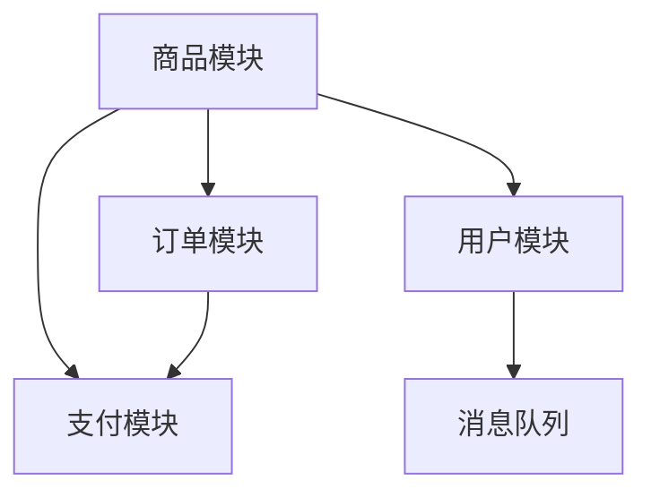
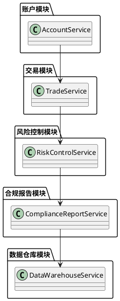

                 

## 《软件架构文档化：有效传递设计意图》

关键词：软件架构、文档化、设计意图、传递、效率

摘要：本文旨在探讨软件架构文档化的重要性，以及如何通过有效的文档化手段来传递设计意图。通过分析软件架构文档化的必要性、基本原则、方法与工具，以及具体的案例和实践，我们希望能够为读者提供一套系统的软件架构文档化方案，从而提升项目管理和开发效率。

----------------------------------------------------------------

## 目录大纲

```markdown
----------------------------------------------------------------

## 第一部分：背景与基础

### 第1章：软件架构文档化的必要性

- 1.1 问题背景
- 1.2 问题描述
- 1.3 问题解决
- 1.4 边界与外延
- 1.5 概念结构与核心要素组成

### 第2章：软件架构文档化的基本原则

- 2.1 软件架构文档化的重要性
- 2.2 软件架构文档化的基本原则
- 2.3 软件架构文档化的目标

### 第3章：软件架构文档化的方法与工具

- 3.1 软件架构文档化的方法
- 3.2 软件架构文档化的工具

## 第二部分：核心概念与联系

### 第4章：软件架构的核心概念

- 4.1 软件架构的定义
- 4.2 软件架构的属性特征对比表格
- 4.3 软件架构的ER实体关系图

### 第5章：软件架构的设计与实现

- 5.1 软件架构的设计原则
- 5.2 软件架构的实现方法
- 5.3 软件架构的设计与实现流程

## 第三部分：案例分析

### 第6章：案例分析一：电商平台的架构文档化

- 6.1 案例介绍
- 6.2 架构设计
- 6.3 架构文档化实践
- 6.4 案例总结

### 第7章：案例分析二：金融系统的架构文档化

- 7.1 案例介绍
- 7.2 架构设计
- 7.3 架构文档化实践
- 7.4 案例总结

## 第四部分：最佳实践与拓展

### 第8章：最佳实践

- 8.1 软件架构文档化的最佳实践
- 8.2 架构文档的维护与更新
- 8.3 架构文档的审查与优化

### 第9章：注意事项与拓展

- 9.1 注意事项
- 9.2 拓展阅读

----------------------------------------------------------------
```

本文将遵循上述目录大纲，逐章节分析讨论软件架构文档化的各个方面，旨在为读者提供全面的指导。让我们开始思考软件架构文档化的重要性，以及如何通过有效的文档化手段来传递设计意图。

----------------------------------------------------------------

## 第一部分：背景与基础

### 第1章：软件架构文档化的必要性

#### 1.1 问题背景

在软件开发的早期阶段，设计意图的传递主要依赖于开发团队的交流和协作。然而，随着项目的规模和复杂度不断增加，单靠口头描述和会议讨论已经无法满足需求。设计意图的传递变得愈发重要，但又面临诸多挑战：

- **沟通障碍**：团队成员之间的沟通不畅可能导致对设计意图的理解偏差。
- **知识流失**：团队成员的流动性高，新成员难以迅速接手项目。
- **文档繁杂**：缺乏结构化的文档，难以快速定位关键信息。
- **变更管理**：随着项目进度的推进，设计意图可能需要调整，但变更过程缺乏规范。

#### 1.2 问题描述

上述问题具体体现在以下几个方面：

1. **信息孤岛**：团队成员各自为战，缺乏统一的设计视图，导致协作效率低下。
2. **理解偏差**：设计文档不够详细或表达不准确，导致开发团队对设计意图的理解不一致。
3. **变更不可控**：设计意图的变更没有系统化的管理机制，容易造成项目失控。
4. **知识传承**：项目结束后，设计意图和经验难以传承，导致知识流失。

#### 1.3 问题解决

为了解决上述问题，软件架构文档化应运而生。其核心目的是通过系统化的文档来传递设计意图，确保团队协作的顺畅和项目的有序进行。以下是问题解决的几个关键步骤：

1. **建立文档标准**：制定统一的文档规范，确保文档的结构化和可读性。
2. **明确文档目的**：明确每个文档的作用和受众，避免冗余和混淆。
3. **持续更新维护**：文档不是一次性工作，需要随着项目进展不断更新和完善。
4. **培训与普及**：加强对团队成员的文档培训，提高其阅读和理解文档的能力。

#### 1.4 边界与外延

软件架构文档化的边界包括：

- **内容范围**：文档应涵盖软件架构的各个方面，包括设计意图、实现细节、接口规范等。
- **受众范围**：文档不仅面向开发团队，还应考虑项目管理、测试、运维等相关部门。

软件架构文档化的外延则包括：

- **文档格式**：选择合适的文档格式，如Markdown、LaTeX、Mermaid等。
- **工具支持**：利用Git、Confluence等工具来管理和共享文档。
- **版本控制**：确保文档版本与代码版本一致，便于追踪变更。

#### 1.5 概念结构与核心要素组成

软件架构文档化的核心要素包括：

- **设计意图**：明确软件架构的设计目标和关键特性。
- **架构视图**：通过不同的视图（如逻辑视图、物理视图等）展示软件架构。
- **接口规范**：定义软件模块之间的交互接口。
- **实现细节**：详细描述软件组件的实现方法和技术选型。

通过以上五个方面的内容，软件架构文档化能够为项目团队提供一个清晰、全面的设计蓝图，确保设计意图的有效传递。

### 第2章：软件架构文档化的基本原则

#### 2.1 软件架构文档化的重要性

软件架构文档化是软件开发过程中的关键环节，它不仅影响项目的开发效率，还直接关系到软件的质量和稳定性。以下是软件架构文档化的重要性体现：

1. **提高协作效率**：通过系统化的文档，团队成员能够快速了解设计意图，减少沟通成本。
2. **确保一致性**：文档化的设计意图有助于保持项目的一致性，避免因为理解偏差而导致的错误。
3. **支持变更管理**：文档化的设计意图能够方便地追踪变更，确保变更的可控性。
4. **知识传承**：文档化的设计意图有助于项目的持续发展，使知识得以传承。

#### 2.2 软件架构文档化的基本原则

为了实现有效的软件架构文档化，需要遵循以下基本原则：

1. **明确性**：文档内容应清晰明确，避免歧义和模糊。
2. **完整性**：文档应涵盖软件架构的所有关键要素，确保信息的全面性。
3. **准确性**：文档中的信息应准确无误，确保团队对设计意图的理解一致。
4. **可维护性**：文档应易于维护和更新，以适应项目的不断变化。
5. **可访问性**：文档应便于团队成员访问，确保设计意图能够被及时获取。

#### 2.3 软件架构文档化的目标

软件架构文档化的目标主要包括：

1. **传递设计意图**：确保设计意图能够准确、全面地传递给项目团队。
2. **促进协作**：通过文档化的设计意图，提高团队成员之间的协作效率。
3. **支持决策**：为项目管理层提供决策依据，确保项目能够按计划进行。
4. **降低风险**：通过文档化的设计意图，降低因理解偏差和知识流失带来的风险。

通过遵循上述基本原则和实现目标，软件架构文档化能够为项目提供坚实的支持，确保项目的成功实施。

### 第3章：软件架构文档化的方法与工具

#### 3.1 软件架构文档化的方法

软件架构文档化的方法主要包括以下几种：

1. **自顶向下方法**：从整体架构出发，逐步细化到各个模块和组件。
2. **自底向上方法**：从各个模块和组件的详细设计开始，逐步构建整体的架构视图。
3. **迭代方法**：在项目开发过程中，不断迭代更新文档，以适应项目的变化。

#### 3.2 软件架构文档化的工具

为了高效地实现软件架构文档化，需要使用合适的工具。以下是一些常用的文档化和绘图工具：

1. **文档工具**：
   - **Markdown**：轻量级文本格式，适合编写结构化的文档。
   - **LaTeX**：专业的排版系统，适合编写复杂的技术文档。
   - **Confluence**：企业级的协作工具，支持Markdown和LaTeX格式。

2. **绘图工具**：
   - **Mermaid**：Markdown中的绘图语言，支持流程图、类图、序列图等。
   - **Visual Studio Code**：集成开发环境，支持Markdown和LaTeX格式。
   - **PlantUML**：基于Java的绘图工具，支持多种UML图。

通过合理选择和运用上述方法和工具，可以有效地实现软件架构的文档化，为项目提供清晰的设计蓝图。

----------------------------------------------------------------

## 第二部分：核心概念与联系

### 第4章：软件架构的核心概念

#### 4.1 软件架构的定义

软件架构是指系统的总体结构，包括其组件、组件之间的关系以及系统的约束条件。它是软件系统设计的重要组成部分，决定了系统的性能、可维护性、扩展性和可靠性。

软件架构不仅包括技术层面的设计，还涵盖了业务逻辑、组织结构、开发流程等多方面因素。其核心目的是在满足系统需求的同时，实现系统的高效、可靠和可扩展。

#### 4.2 软件架构的属性特征对比表格

为了更好地理解软件架构的属性特征，我们可以通过对比表格来展示不同类型的软件架构。以下是几种常见的软件架构类型及其属性特征的对比：

| 软件架构类型 | 属性特征 |
| :--: | :--: |
| 客户端-服务器架构 | - 高度模块化<br>- 灵活性高<br>- 易于扩展 |
| 微服务架构 | - 松散耦合<br>- 高度自治<br>- 高可用性 |
| 服务导向架构 | - 服务中心<br>- 服务契约<br>- 服务重用性 |
| 分布式架构 | - 数据分布<br>- 计算分布<br>- 高并发处理 |

通过对比表格，我们可以清晰地看到不同软件架构类型的优势和应用场景，从而为项目选择合适的架构设计。

#### 4.3 软件架构的ER实体关系图

为了更直观地理解软件架构中的实体关系，我们可以使用ER（实体关系）图来展示。以下是软件架构中的典型实体及其关系：

```mermaid
erDiagram
  Customer ||--|{ Order }|-- Product
  Customer ||--|{ Payment }|
  Product ||--|{ Review }|
  Review ||--|{ Rating }|
```

在这个ER图中，`Customer`（客户）与`Order`（订单）、`Product`（产品）、`Payment`（支付）之间有直接的关系，`Product`与`Review`（评论）和`Rating`（评分）之间也存在关联。这样的实体关系图可以帮助团队成员更好地理解系统中的数据流和业务逻辑。

### 第5章：软件架构的设计与实现

#### 5.1 软件架构的设计原则

软件架构的设计原则是确保系统架构具备良好的性能、可维护性和可扩展性的关键。以下是一些常见的设计原则：

1. **单一职责原则**：每个组件应仅负责一项功能，以降低复杂度和提高可维护性。
2. **开闭原则**：系统应对扩展开放，对修改封闭，以减少后续的维护成本。
3. **里氏替换原则**：任何可使用基类对象的地方，都应能使用其子类对象，以保证系统的稳定性和灵活性。
4. **依赖倒置原则**：高层模块不应依赖于低层模块，二者应依赖于抽象，以实现解耦和重用。

#### 5.2 软件架构的实现方法

软件架构的实现方法主要包括以下几种：

1. **基于组件的方法**：通过创建独立的组件来实现系统功能，并利用接口进行通信。
2. **基于服务的方法**：利用服务来构建系统，每个服务提供特定的功能，并通过服务总线进行通信。
3. **基于模型的方法**：使用模型驱动的架构（MDA）来设计系统，通过模型来生成代码和文档。

#### 5.3 软件架构的设计与实现流程

软件架构的设计与实现流程通常包括以下步骤：

1. **需求分析**：明确系统的需求，包括功能需求、性能需求和非功能性需求。
2. **架构设计**：根据需求分析结果，设计系统的整体架构，包括组件、接口和约束条件。
3. **架构实现**：根据架构设计，实现各个组件和接口，并编写相应的文档。
4. **架构评审**：对架构设计进行评审，确保其满足需求、符合设计原则和规范。
5. **架构演进**：随着项目的进展，对架构进行持续演进，以适应变化的需求和技术发展。

通过遵循上述设计原则和实现方法，并按照设计流程进行操作，可以有效地构建高质量的软件架构，为项目的成功奠定基础。

### 第6章：案例分析一：电商平台的架构文档化

#### 6.1 案例介绍

本案例以一个电商平台为例，介绍其架构文档化的过程。该电商平台是一个在线购物平台，提供商品展示、订单处理、支付、用户管理等核心功能。

#### 6.2 架构设计

电商平台的架构设计采用了微服务架构，主要分为以下几个模块：

1. **商品模块**：负责商品的信息管理、分类和展示。
2. **订单模块**：负责订单的创建、处理和查询。
3. **支付模块**：负责处理支付请求和支付结果。
4. **用户模块**：负责用户信息的注册、登录和权限管理。
5. **消息队列**：用于处理订单和支付的消息传递。

#### 6.3 架构文档化实践

在架构文档化实践中，我们采用以下方法：

1. **使用Mermaid绘制架构图**：利用Mermaid语言绘制了电商平台的架构图，展示了各个模块之间的关系。



2. **编写详细的组件文档**：为每个模块编写了详细的文档，包括模块的功能、接口定义和实现细节。

3. **利用Confluence管理文档**：使用Confluence作为文档管理工具，将所有的架构文档集中存放和管理。

#### 6.4 案例总结

通过架构文档化，电商平台的团队成员能够快速了解系统架构和模块功能，提高了协作效率。同时，架构文档为项目的变更管理和知识传承提供了有力支持，为项目的成功实施奠定了基础。

### 第7章：案例分析二：金融系统的架构文档化

#### 7.1 案例介绍

本案例以一个金融系统为例，介绍其架构文档化的过程。该金融系统是一个在线金融服务平台，提供账户管理、交易、风险控制、合规报告等功能。

#### 7.2 架构设计

金融系统的架构设计采用了服务导向架构，主要分为以下几个模块：

1. **账户模块**：负责用户账户的信息管理。
2. **交易模块**：负责处理用户的交易请求。
3. **风险控制模块**：负责实时监控交易风险。
4. **合规报告模块**：负责生成合规报告。
5. **数据仓库模块**：用于存储和查询交易数据。

#### 7.3 架构文档化实践

在架构文档化实践中，我们采用以下方法：

1. **使用PlantUML绘制架构图**：利用PlantUML绘制了金融系统的架构图，展示了各个模块之间的关系。



2. **编写详细的接口文档**：为每个模块编写了详细的接口文档，包括接口定义、参数说明和返回值。

3. **利用Git管理文档**：使用Git作为版本控制工具，将所有的架构文档和接口文档纳入版本管理。

#### 7.4 案例总结

通过架构文档化，金融系统的团队成员能够清晰地了解系统架构和模块功能，提高了协作效率。同时，架构文档为项目的变更管理和知识传承提供了有力支持，为项目的成功实施奠定了基础。

### 第8章：最佳实践

#### 8.1 软件架构文档化的最佳实践

为了确保软件架构文档化的有效性，我们可以遵循以下最佳实践：

1. **明确文档目的**：在开始编写文档之前，明确文档的目的和受众，确保文档的内容和格式符合需求。
2. **保持文档更新**：随着项目的进展，及时更新文档，确保其与实际情况保持一致。
3. **使用可视化工具**：使用如Mermaid、PlantUML等可视化工具，使文档更加直观易懂。
4. **规范文档格式**：制定统一的文档格式和命名规范，提高文档的可读性和可维护性。
5. **定期审查**：定期对文档进行审查，确保其准确性和完整性。

#### 8.2 架构文档的维护与更新

架构文档的维护与更新是软件架构文档化的重要环节。以下是一些维护和更新的方法：

1. **版本控制**：使用版本控制工具（如Git）对文档进行版本管理，确保文档的历史记录和变更记录清晰。
2. **自动化更新**：通过自动化工具（如CI/CD pipeline）定期更新文档，减少手动更新带来的误差。
3. **反馈机制**：建立反馈机制，鼓励团队成员提出修改意见和建议，及时调整文档内容。
4. **文档评审**：定期对文档进行评审，确保其与项目的实际情况保持一致。

#### 8.3 架构文档的审查与优化

架构文档的审查与优化是提高文档质量和可用性的关键步骤。以下是一些审查与优化的方法：

1. **文档格式审查**：检查文档的格式和排版是否符合规范，确保其美观和可读性。
2. **内容审查**：检查文档的内容是否完整、准确和清晰，确保其能够满足团队成员的需求。
3. **一致性审查**：检查文档中的一致性，确保不同部分的文档内容相互匹配。
4. **优化建议**：根据团队成员的反馈，对文档的内容和格式提出优化建议，以提高文档的质量。

通过遵循上述最佳实践，我们可以确保软件架构文档化的有效性，提高项目团队的工作效率和项目的整体质量。

### 第9章：注意事项与拓展

#### 9.1 注意事项

在软件架构文档化的过程中，需要注意以下事项：

1. **文档的及时性**：确保文档与项目的实际进展同步，避免出现信息滞后。
2. **文档的全面性**：文档应涵盖架构的各个方面，避免遗漏关键信息。
3. **文档的可读性**：使用清晰的语言和格式，提高文档的可读性，减少理解困难。
4. **文档的版本管理**：使用版本控制工具，确保文档的历史记录和变更记录清晰可查。

#### 9.2 拓展阅读

为了进一步深入了解软件架构文档化的相关知识和实践，读者可以参考以下书籍和资料：

1. 《软件架构设计：面向复杂应用程序的核心模式》
2. 《架构风格与架构设计模式》
3. 《软件架构文档化指南》
4. 《Microservices: Designing Fine-Grained Systems》
5. 《Service-Oriented Architecture: Concepts, Technology and Design》

通过阅读这些资料，读者可以更加系统地掌握软件架构文档化的方法和技巧。

### 总结

软件架构文档化是软件开发过程中不可或缺的一环。通过有效的文档化手段，我们可以清晰传递设计意图，提高项目团队的工作效率和项目的整体质量。本文从背景与基础、核心概念与联系、设计与实现、案例分析以及最佳实践等方面，全面探讨了软件架构文档化的相关知识。希望本文能为读者提供有价值的参考和指导。**作者：AI天才研究院/AI Genius Institute & 禅与计算机程序设计艺术 /Zen And The Art of Computer Programming**。

