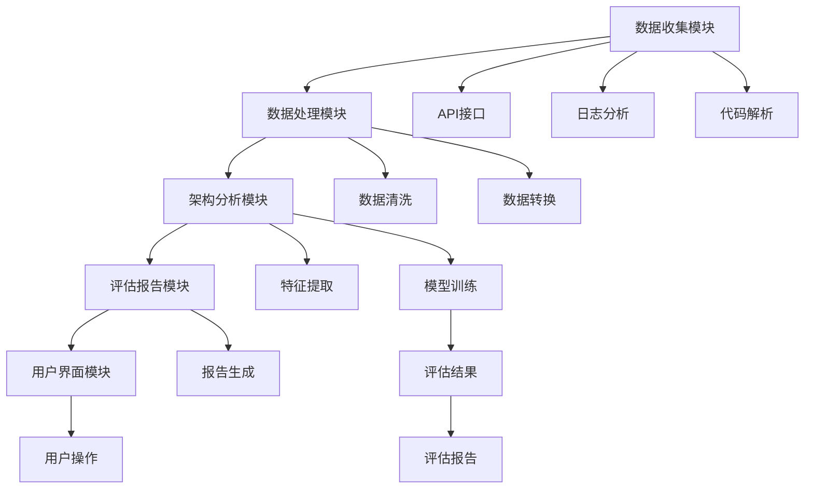

                 

### 《软件架构评估工具：自动化架构分析》

关键词：软件架构、自动化评估、工具、架构分析、效率、质量

摘要：本文旨在深入探讨软件架构评估工具的自动化架构分析，从背景、核心概念、技术基础、工具分类、边界与外延等多个角度，系统性地介绍和分析了自动化架构分析在软件架构评估中的应用与价值。

---

### 第一部分：背景介绍

#### 第1章 问题背景与定义

##### 1.1 问题背景

软件架构是软件开发过程中的核心组成部分，它决定了软件系统的质量、性能和可维护性。然而，随着软件系统的复杂性不断增加，传统的软件架构评估方法面临巨大的挑战。传统的评估方法主要依赖于人工分析，不仅耗时耗力，而且容易引入人为错误。因此，自动化架构评估工具成为当前的研究热点，它能够提高评估的效率，减少人为错误，并为软件开发提供强有力的支持。

###### 1.1.1 软件架构的重要性

软件架构是软件系统的组织结构和设计模型，它定义了系统的组件、组件之间的关系以及系统的行为。一个良好的软件架构能够提高软件系统的可维护性、可扩展性和可重用性，从而提高软件质量。

###### 1.1.1.1 软件架构的定义

软件架构可以理解为软件系统的蓝图，它描述了系统的整体结构、组件和组件之间的关系，以及系统的行为和功能。软件架构通常由一组抽象组件和它们之间的关系组成，这些组件和关系可以用各种方法表示，如统一建模语言（UML）。

###### 1.1.1.2 软件架构在软件开发中的作用

软件架构在软件开发中起着至关重要的作用。它不仅是软件开发过程中的重要参考，也是后续软件维护和优化的基础。一个良好的软件架构能够帮助开发团队更好地理解系统，提高开发效率，降低维护成本。

##### 1.1.2 软件架构评估的需求

随着软件系统的规模和复杂性的增加，软件架构评估变得尤为重要。软件架构评估旨在评估软件架构的质量、性能和可维护性，为软件设计和开发提供科学依据。

###### 1.1.2.1 评估的目的和意义

软件架构评估的主要目的是确保软件架构的质量，提高软件系统的性能和可维护性。评估的意义在于：

- 提高软件质量：通过评估可以发现架构中的问题，及时修复，从而提高软件质量。
- 支持架构决策：评估结果可以为架构决策提供数据支持，帮助决策者做出更明智的决策。
- 优化软件维护：评估可以帮助识别系统的薄弱环节，降低维护成本。

###### 1.1.2.1.1 提高软件质量

软件质量是软件开发的重要目标之一。软件质量评估可以帮助识别软件架构中的问题，如设计缺陷、性能瓶颈等，从而提高软件质量。

- 质量度量标准：质量度量标准是评估软件质量的重要依据，常见的度量标准包括功能性、可靠性、性能、可维护性等。
- 提高质量度量标准的方法：提高质量度量标准的方法包括代码审查、自动化测试、性能测试等。

###### 1.1.2.1.2 支持架构决策

软件架构评估可以为架构决策提供数据支持，帮助决策者做出更明智的决策。例如，在系统设计阶段，评估可以帮助确定最佳的设计方案。

- 决策支持系统：决策支持系统是一种基于数据分析和模型模拟的系统，它可以帮助决策者分析各种决策方案的影响，从而做出更明智的决策。
- 架构评估在决策支持系统中的应用：架构评估可以在决策支持系统中扮演重要角色，为决策者提供数据支持。

###### 1.1.2.1.3 优化软件维护

软件维护是软件开发过程中的重要环节。良好的软件架构可以帮助降低维护成本，提高维护效率。

- 软件维护成本与效益分析：软件维护成本与效益分析可以帮助识别软件架构中的问题，从而优化维护策略，提高维护效益。

##### 1.1.3 软件架构评估的现状

目前，软件架构评估主要依赖于传统的方法，如人工评估、静态分析、动态分析等。然而，这些方法存在一些局限性，如效率低、容易引入人为错误等。因此，自动化架构评估工具的研究和应用成为当前的研究热点。

###### 1.1.3.1 传统评估方法的挑战

- 手动评估的局限性：手动评估需要大量的人力和时间，而且容易引入人为错误。
- 自动化评估工具的兴起：自动化评估工具可以高效地分析软件架构，减少人为错误，提高评估效率。

###### 1.1.3.2 自动化评估工具的优势

- 提高效率：自动化评估工具可以快速地对软件架构进行分析，提高评估效率。
- 减少人为错误：自动化评估工具可以减少人为错误，提高评估的准确性。

##### 1.1.4 自动化架构分析的核心概念

自动化架构分析是指利用计算机技术和算法对软件架构进行分析和评估。自动化架构分析的核心概念包括：

- 架构描述语言：架构描述语言是一种用于描述软件架构的语言，如UML、DSL等。
- 评估指标体系：评估指标体系是用于评估软件架构质量的标准和指标。
- 技术基础：自动化架构分析的技术基础包括数据挖掘、机器学习、自然语言处理等。

##### 1.2 自动化架构分析的核心概念

自动化架构分析是指利用计算机技术和算法对软件架构进行分析和评估。自动化架构分析的核心概念包括：

- 架构描述语言：架构描述语言是一种用于描述软件架构的语言，如UML、DSL等。
- 评估指标体系：评估指标体系是用于评估软件架构质量的标准和指标。
- 技术基础：自动化架构分析的技术基础包括数据挖掘、机器学习、自然语言处理等。

###### 1.2.1 自动化架构分析的定义

自动化架构分析是指利用计算机技术和算法对软件架构进行分析和评估。它包括以下几个方面：

- 架构评估：通过对软件架构进行分析，评估其质量、性能和可维护性。
- 架构优化：基于评估结果，对软件架构进行优化，以提高其质量。

###### 1.2.2 自动化架构分析的关键要素

自动化架构分析的关键要素包括：

- 架构描述语言：用于描述软件架构的语言，如UML、DSL等。
- 评估指标体系：用于评估软件架构质量的标准和指标。
- 技术基础：支持自动化架构分析的技术，如数据挖掘、机器学习、自然语言处理等。

###### 1.2.3 自动化架构分析的技术基础

自动化架构分析的技术基础包括：

- 数据挖掘：用于从大量数据中提取有价值的信息。
- 机器学习：用于建立模型，对软件架构进行分析和评估。
- 自然语言处理：用于处理自然语言文本，如代码注释、文档等。

#### 第2章 自动化架构分析的关键要素

##### 2.1 架构描述语言

架构描述语言是自动化架构分析的重要组成部分，它用于描述软件架构的各个方面。常见的架构描述语言包括统一建模语言（UML）和领域特定语言（DSL）。

###### 2.1.1 UML与DSL

- UML：UML是一种通用的建模语言，用于描述软件系统的各个方面，包括系统组件、组件之间的关系以及系统的行为。
- DSL：DSL是一种领域特定语言，它专注于特定领域的软件架构描述，具有较高的表达能力和灵活性。

###### 2.1.1.1 UML在架构描述中的应用

- 用例图：用例图用于描述系统的功能需求和用户角色。
- 类图：类图用于描述系统的类和它们之间的关系。
- 序列图：序列图用于描述系统的交互行为。

###### 2.1.1.2 DSL在自动化架构分析中的优势

- 高度定制化：DSL可以根据特定领域的需求进行定制，提高描述的准确性。
- 灵活性：DSL可以灵活地表示复杂的架构元素和关系。

##### 2.2 评估指标体系

评估指标体系是自动化架构分析的核心，它用于评估软件架构的质量、性能和可维护性。评估指标体系包括质量属性、维护性属性和可扩展性属性等。

###### 2.2.1 评估指标的选择与定义

- 质量属性：如功能性、可靠性、性能、可维护性等。
- 维护性属性：如代码重复率、代码复杂度、测试覆盖率等。
- 可扩展性属性：如模块化程度、耦合度、内聚度等。

##### 2.3 技术基础

自动化架构分析的技术基础包括数据挖掘、机器学习和自然语言处理等技术。

###### 2.3.1 数据挖掘与机器学习

- 数据挖掘：用于从大量数据中提取有价值的信息，为评估提供依据。
- 机器学习：用于建立模型，对软件架构进行分析和评估。

###### 2.3.2 自然语言处理

- 自然语言处理：用于处理自然语言文本，如代码注释、文档等，为自动化架构分析提供数据支持。

##### 2.4 自动化架构分析的应用场景

自动化架构分析可以应用于多个场景，如软件系统设计、软件系统优化、软件维护等。

- 软件系统设计：在软件系统设计阶段，自动化架构分析可以帮助确定最佳的设计方案。
- 软件系统优化：在软件系统运行过程中，自动化架构分析可以帮助识别系统的性能瓶颈，进行优化。
- 软件维护：在软件系统维护过程中，自动化架构分析可以帮助识别系统的问题，降低维护成本。

##### 2.5 自动化架构分析的未来发展趋势

随着技术的不断发展，自动化架构分析将在未来有更广泛的应用。未来的发展趋势包括：

- 深度学习与自动化架构分析的结合：深度学习可以提高自动化架构分析的准确性和效率。
- 多维度评估：未来的自动化架构分析将不仅考虑软件架构的质量、性能和可维护性，还将考虑其他维度的因素。
- 领域特定自动化架构分析：未来的自动化架构分析将更加专注于特定领域的软件架构，提供更加精准的分析结果。

---

### 第二部分：核心概念与联系

#### 第3章 自动化架构分析的关键技术

自动化架构分析的关键技术包括数据挖掘、机器学习和自然语言处理等。这些技术为自动化架构分析提供了强大的支持，使评估过程更加高效和准确。

##### 3.1 数据挖掘与机器学习

数据挖掘是一种从大量数据中提取有价值信息的方法，它利用统计学、机器学习、数据库技术和人工智能技术等，发现数据中的模式、关联和趋势。在自动化架构分析中，数据挖掘主要用于从软件架构数据中提取有用的信息，如组件之间的关系、性能指标、维护成本等。

###### 3.1.1 数据挖掘在自动化架构分析中的应用

- 特征提取：特征提取是数据挖掘过程中的关键步骤，它从原始数据中提取出对分析目标有重要意义的特征。在自动化架构分析中，特征提取可以帮助识别软件架构中的关键元素和关系。
- 模型选择与训练：在数据挖掘过程中，选择合适的模型对数据进行分析和预测。常见的模型包括回归模型、决策树、支持向量机等。在自动化架构分析中，通过训练模型，可以实现对软件架构质量的预测和评估。

###### 3.1.2 机器学习在自动化架构分析中的应用

机器学习是一种通过训练模型来模拟人类学习过程的技术，它在自动化架构分析中具有重要作用。机器学习可以帮助自动化架构分析系统从历史数据中学习，提高评估的准确性和效率。

- 分类与回归：分类和回归是机器学习中最常见的两种任务。在自动化架构分析中，分类可以用于识别软件架构中的问题，回归可以用于预测软件架构的性能和质量。
- 集成学习：集成学习是一种通过组合多个模型来提高预测准确性的方法。在自动化架构分析中，集成学习可以帮助提高评估的鲁棒性和准确性。

##### 3.2 自然语言处理

自然语言处理是一种模拟人类语言理解和生成能力的计算机技术，它包括文本分类、情感分析、命名实体识别等。在自动化架构分析中，自然语言处理主要用于处理自然语言文本，如代码注释、用户手册等。

###### 3.2.1 自然语言处理在自动化架构分析中的作用

- 文本分类：文本分类是一种将文本数据分类到预定义类别中的技术。在自动化架构分析中，文本分类可以用于识别软件架构文档中的关键信息，如功能需求、性能指标等。
- 代码克隆检测：代码克隆检测是一种检测代码复用的技术，它通过比较不同代码片段的相似度来识别克隆代码。在自动化架构分析中，代码克隆检测可以帮助识别软件架构中的潜在问题，如代码重复、设计不合理等。

##### 3.3 自动化架构分析的核心概念与联系

自动化架构分析的核心概念包括架构描述语言、评估指标体系、数据挖掘、机器学习和自然语言处理等。这些概念之间的联系如下：

- 架构描述语言：架构描述语言用于描述软件架构，它是自动化架构分析的基础。
- 评估指标体系：评估指标体系用于评估软件架构的质量，它是自动化架构分析的核心。
- 数据挖掘与机器学习：数据挖掘和机器学习用于从软件架构数据中提取有价值的信息，提高评估的准确性和效率。
- 自然语言处理：自然语言处理用于处理自然语言文本，为自动化架构分析提供数据支持。

#### 第4章 自动化架构分析的应用

自动化架构分析在软件架构评估中具有广泛的应用。通过应用自动化架构分析，可以提高软件架构的质量、性能和可维护性，降低开发成本和维护成本。

##### 4.1 软件系统设计

在软件系统设计阶段，自动化架构分析可以帮助设计团队确定最佳的设计方案。通过自动化架构分析，可以评估不同设计方案的优缺点，选择最适合实际需求的设计方案。

###### 4.1.1 软件系统设计中的应用

- 架构评估：通过自动化架构分析，可以对软件系统的架构进行评估，识别其中的问题，如设计不合理、性能瓶颈等。
- 设计优化：基于自动化架构分析的结果，可以对软件系统设计进行优化，提高系统的性能和可维护性。

##### 4.2 软件系统优化

在软件系统优化阶段，自动化架构分析可以帮助识别系统的性能瓶颈和问题，提供优化的方向和建议。通过自动化架构分析，可以实现对系统性能的全面评估，发现潜在的问题。

###### 4.2.1 软件系统优化中的应用

- 性能评估：通过自动化架构分析，可以评估软件系统的性能，识别性能瓶颈。
- 问题定位：基于自动化架构分析的结果，可以定位系统中的问题，提供优化的方向和建议。

##### 4.3 软件维护

在软件维护阶段，自动化架构分析可以帮助维护团队识别系统中的问题，降低维护成本。通过自动化架构分析，可以实现对软件系统全面的了解，及时发现并解决潜在的问题。

###### 4.3.1 软件维护中的应用

- 问题检测：通过自动化架构分析，可以检测软件系统中存在的问题，如代码质量差、设计不合理等。
- 维护策略：基于自动化架构分析的结果，可以制定合适的维护策略，降低维护成本。

##### 4.4 自动化架构分析的未来应用

随着技术的不断发展，自动化架构分析将在未来有更广泛的应用。未来自动化架构分析的应用领域将包括：

- 软件安全：通过自动化架构分析，可以识别软件系统中的安全漏洞，提高系统的安全性。
- 软件迁移：通过自动化架构分析，可以评估软件系统在不同平台或架构下的兼容性，实现软件的迁移。
- 软件测试：通过自动化架构分析，可以优化软件测试策略，提高测试的覆盖率和效率。

---

### 第三部分：算法原理与实现

#### 第5章 算法原理讲解

自动化架构分析的核心在于算法的应用。本章节将详细讲解自动化架构分析中常用的算法原理，包括数据挖掘、机器学习和自然语言处理等。

##### 5.1 数据挖掘算法原理

数据挖掘算法是从大量数据中提取有价值信息的方法。在自动化架构分析中，常用的数据挖掘算法包括聚类、分类、关联规则挖掘等。

###### 5.1.1 聚类算法

聚类算法是将数据集划分为多个聚类，使得同一个聚类中的数据点具有较高的相似度，而不同聚类中的数据点具有较低相似度。在自动化架构分析中，聚类算法可以用于识别软件架构中的相似组件。

- K-means算法：K-means算法是一种经典的聚类算法，通过迭代计算，将数据划分为K个聚类。
- 层次聚类算法：层次聚类算法是一种基于层次结构的聚类算法，它通过合并或分裂聚类，逐步构建聚类层次。

###### 5.1.2 分类算法

分类算法是将数据集中的数据点分配到预定义的类别中。在自动化架构分析中，分类算法可以用于识别软件架构中的问题。

- 决策树算法：决策树算法是一种基于树结构的分类算法，通过一系列决策规则，对数据进行分类。
- 支持向量机算法：支持向量机算法是一种基于边界划分的分类算法，通过找到最佳边界，将数据点划分为不同类别。

###### 5.1.3 关联规则挖掘算法

关联规则挖掘算法用于发现数据集之间的关联关系。在自动化架构分析中，关联规则挖掘算法可以用于识别软件架构中的模块依赖关系。

- Apriori算法：Apriori算法是一种基于频繁项集的关联规则挖掘算法，通过计算项集的支持度，发现频繁项集，从而生成关联规则。
- Eclat算法：Eclat算法是一种基于增益度的关联规则挖掘算法，通过计算项集的增益度，发现潜在的关联关系。

##### 5.2 机器学习算法原理

机器学习算法是一种通过训练模型来模拟人类学习过程的技术。在自动化架构分析中，常用的机器学习算法包括回归、分类、聚类等。

###### 5.2.1 回归算法

回归算法用于预测连续值输出。在自动化架构分析中，回归算法可以用于预测软件架构的性能和质量。

- 线性回归算法：线性回归算法是一种基于线性模型的回归算法，通过计算输入特征和输出值之间的线性关系，预测输出值。
- 决策树回归算法：决策树回归算法是一种基于树结构的回归算法，通过一系列决策规则，预测输出值。

###### 5.2.2 分类算法

分类算法用于预测离散值输出。在自动化架构分析中，分类算法可以用于识别软件架构中的问题。

- 决策树分类算法：决策树分类算法是一种基于树结构的分类算法，通过一系列决策规则，对数据进行分类。
- 支持向量机分类算法：支持向量机分类算法是一种基于边界划分的分类算法，通过找到最佳边界，对数据进行分类。

###### 5.2.3 聚类算法

聚类算法用于将数据划分为多个聚类。在自动化架构分析中，聚类算法可以用于识别软件架构中的相似组件。

- K-means聚类算法：K-means聚类算法是一种基于距离度量的聚类算法，通过迭代计算，将数据划分为K个聚类。
- 层次聚类算法：层次聚类算法是一种基于层次结构的聚类算法，通过合并或分裂聚类，逐步构建聚类层次。

##### 5.3 自然语言处理算法原理

自然语言处理算法是一种模拟人类语言理解和生成能力的计算机技术。在自动化架构分析中，常用的自然语言处理算法包括文本分类、情感分析和命名实体识别等。

###### 5.3.1 文本分类算法

文本分类算法用于将文本数据分类到预定义的类别中。在自动化架构分析中，文本分类算法可以用于识别软件架构文档中的关键信息。

- 朴素贝叶斯算法：朴素贝叶斯算法是一种基于概率论的文本分类算法，通过计算文本中各特征的联合概率，预测文本类别。
- 支持向量机算法：支持向量机算法是一种基于边界划分的文本分类算法，通过找到最佳边界，对文本进行分类。

###### 5.3.2 情感分析算法

情感分析算法用于分析文本中的情感倾向。在自动化架构分析中，情感分析算法可以用于评估用户对软件架构的满意度。

- 朴素贝叶斯算法：朴素贝叶斯算法是一种基于概率论的文本分类算法，通过计算文本中各特征的联合概率，预测文本类别。
- 支持向量机算法：支持向量机算法是一种基于边界划分的文本分类算法，通过找到最佳边界，对文本进行分类。

###### 5.3.3 命名实体识别算法

命名实体识别算法用于识别文本中的命名实体，如人名、地名、组织名等。在自动化架构分析中，命名实体识别算法可以用于识别软件架构中的关键实体。

- 序列标注算法：序列标注算法是一种用于识别文本中命名实体的算法，通过标注每个词的类别，识别命名实体。
- 层次分析算法：层次分析算法是一种基于层次结构的命名实体识别算法，通过分析实体之间的关系，识别命名实体。

#### 第6章 算法实现与流程

##### 6.1 数据准备

在自动化架构分析中，数据准备是关键步骤之一。数据准备包括数据收集、数据清洗和数据预处理等。

- 数据收集：从软件架构文档、代码仓库等渠道收集相关数据。
- 数据清洗：处理数据中的噪声和错误，确保数据的准确性和一致性。
- 数据预处理：将原始数据转换为适合算法分析的形式，如数值化、标准化等。

##### 6.2 特征提取

特征提取是自动化架构分析的核心步骤之一。特征提取的目的是从原始数据中提取出对算法分析有重要意义的特征。

- 特征选择：从原始特征中筛选出最有代表性的特征，提高算法的效率和准确性。
- 特征转换：对特征进行转换，如离散化、归一化等，使其更适合算法分析。

##### 6.3 模型训练与评估

模型训练与评估是自动化架构分析的关键步骤。通过训练和评估，可以确定最佳的模型参数和评估指标。

- 模型训练：使用训练数据集，通过算法训练模型，学习数据中的规律。
- 模型评估：使用验证数据集，评估模型的准确性和性能，选择最佳模型。

##### 6.4 模型应用

模型应用是将训练好的模型应用于实际软件架构分析的过程。通过模型应用，可以实现对软件架构的分析和评估。

- 架构评估：使用训练好的模型，对软件架构进行分析，评估其质量、性能和可维护性。
- 架构优化：基于评估结果，对软件架构进行优化，提高其质量。

#### 第7章 算法举例

为了更好地理解自动化架构分析算法的原理和应用，以下通过一个简单的例子进行说明。

##### 7.1 数据集

假设有一个软件架构分析的数据集，其中包含多个软件架构的描述，以及对应的评估指标数据。

```plaintext
架构ID	功能点数	代码行数	测试覆盖率	可靠性	性能
1	100	5000	80%	90%	中等
2	150	6000	85%	95%	良好
3	200	7000	90%	92%	优秀
```

##### 7.2 特征提取

从数据集中提取以下特征：

- 功能点数（F）
- 代码行数（C）
- 测试覆盖率（TC）
- 可靠性（R）
- 性能（P）

##### 7.3 模型训练

使用线性回归算法训练模型，预测软件架构的可靠性（R）。

```python
from sklearn.linear_model import LinearRegression

# 准备数据
X = [[F, C, TC]]  # 输入特征
y = [R]  # 输出特征

# 训练模型
model = LinearRegression()
model.fit(X, y)

# 输出模型参数
print(model.coef_)
print(model.intercept_)
```

##### 7.4 模型评估

使用验证数据集对模型进行评估。

```python
from sklearn.metrics import mean_squared_error

# 准备验证数据
X_val = [[150, 6000, 85]]  # 输入特征
y_val = [95]  # 输出特征

# 预测可靠性
y_pred = model.predict(X_val)

# 计算均方误差
mse = mean_squared_error(y_val, y_pred)
print(mse)
```

##### 7.5 模型应用

使用训练好的模型，预测新软件架构的可靠性。

```python
# 新架构特征
X_new = [[200, 7000, 90]]  # 输入特征

# 预测可靠性
R_new = model.predict(X_new)
print(R_new)
```

通过以上例子，可以直观地看到自动化架构分析算法的原理和应用。在实际应用中，可以根据具体需求，选择合适的算法和模型，进行软件架构的评估和分析。

---

### 第四部分：系统分析与架构设计

#### 第8章 软件架构评估工具的系统分析

软件架构评估工具是一个复杂的系统，它由多个组件和模块组成，各个组件和模块相互协作，共同实现软件架构评估的功能。本章节将对软件架构评估工具进行系统分析，介绍其组成部分、功能模块和交互关系。

##### 8.1 系统组成部分

软件架构评估工具通常由以下组成部分：

- 数据收集模块：负责从各种数据源收集软件架构信息，如代码库、文档、日志等。
- 数据处理模块：负责对收集到的数据进行清洗、转换和预处理，为后续分析提供干净的输入数据。
- 架构分析模块：负责对预处理后的数据进行分析，提取关键特征和模式，评估软件架构的质量、性能和可维护性。
- 评估报告模块：负责生成评估报告，将分析结果以图表、报告等形式呈现给用户。
- 用户界面模块：负责与用户进行交互，提供友好的用户界面，方便用户操作和使用软件。

##### 8.2 功能模块

软件架构评估工具的主要功能模块包括：

- 数据收集：通过API接口、日志分析、代码解析等方式，收集软件架构信息。
- 数据处理：对收集到的数据进行分析，识别出潜在的架构问题，如代码冗余、设计不合理等。
- 架构分析：利用数据挖掘、机器学习和自然语言处理等技术，对软件架构进行分析，评估其质量、性能和可维护性。
- 报告生成：根据分析结果，生成详细的评估报告，包括图表、关键问题和优化建议等。
- 用户界面：提供友好的用户界面，方便用户进行数据导入、报告查看和问题追踪等操作。

##### 8.3 模块交互关系

软件架构评估工具的各个模块之间相互协作，共同实现软件架构评估的功能。以下是各个模块的交互关系：

- 数据收集模块将收集到的数据传递给数据处理模块，进行处理和转换。
- 数据处理模块将处理后的数据传递给架构分析模块，进行深度分析。
- 架构分析模块将分析结果传递给评估报告模块，生成评估报告。
- 评估报告模块将评估报告呈现给用户界面模块，用户界面模块再将报告显示在界面上。

##### 8.4 软件架构设计

软件架构评估工具的软件架构设计遵循MVC（模型-视图-控制器）模式，各部分职责清晰，易于扩展和维护。

- 模型层：负责软件架构评估的核心功能，包括数据收集、数据处理、架构分析和评估报告生成等。
- 视图层：负责用户界面的设计和实现，将评估报告以图表、报告等形式呈现给用户。
- 控制器层：负责处理用户操作，协调模型层和视图层的交互，确保系统正常运行。

##### 8.5 系统架构图

以下是软件架构评估工具的系统架构图：



##### 8.6 系统接口设计

系统接口设计是软件架构评估工具的重要组成部分，它定义了系统内部模块之间的交互方式和数据格式。以下是系统接口设计的关键部分：

- 数据收集接口：定义数据收集模块与其他模块之间的交互方式，如RESTful API、消息队列等。
- 数据处理接口：定义数据处理模块与其他模块之间的交互方式，如数据交换格式、调用协议等。
- 架构分析接口：定义架构分析模块与其他模块之间的交互方式，如数据传递、触发条件等。
- 评估报告接口：定义评估报告模块与其他模块之间的交互方式，如数据共享、报告格式等。
- 用户界面接口：定义用户界面模块与其他模块之间的交互方式，如数据绑定、界面交互等。

##### 8.7 系统交互流程

以下是软件架构评估工具的系统交互流程：

1. 用户通过用户界面模块提交评估请求。
2. 用户界面模块将请求传递给架构分析模块。
3. 架构分析模块调用数据处理模块，处理用户请求。
4. 数据处理模块从数据收集模块获取数据，进行清洗和转换。
5. 架构分析模块利用机器学习算法对处理后的数据进行分析，生成评估报告。
6. 评估报告模块将评估报告生成并传递给用户界面模块。
7. 用户界面模块将评估报告呈现给用户。

##### 8.8 系统测试与优化

系统测试与优化是确保软件架构评估工具质量和性能的重要环节。以下是系统测试与优化的一些关键步骤：

- 单元测试：对软件架构评估工具的各个模块进行单元测试，确保每个模块的功能正确实现。
- 集成测试：对软件架构评估工具的整体功能进行集成测试，确保模块之间的交互正常。
- 性能测试：对软件架构评估工具的性能进行测试，评估其响应时间、吞吐量和资源消耗。
- 优化：根据测试结果，对软件架构评估工具进行优化，提高其性能和稳定性。

##### 8.9 软件架构评估工具的应用场景

软件架构评估工具可以应用于多个场景，如软件系统设计、软件系统优化、软件维护等。以下是软件架构评估工具的一些典型应用场景：

- 软件系统设计：在软件系统设计阶段，软件架构评估工具可以帮助设计团队评估不同设计方案的优缺点，选择最佳的设计方案。
- 软件系统优化：在软件系统优化阶段，软件架构评估工具可以帮助识别系统的性能瓶颈和问题，提供优化的方向和建议。
- 软件维护：在软件系统维护阶段，软件架构评估工具可以帮助维护团队识别系统中的问题，降低维护成本。

##### 8.10 软件架构评估工具的发展趋势

随着技术的不断进步，软件架构评估工具将在未来有更广泛的应用和发展。以下是软件架构评估工具的一些发展趋势：

- 智能化：结合人工智能技术，提高软件架构评估的智能化水平，实现自动化的架构评估和分析。
- 多维度评估：考虑更多维度的因素，如安全性、可靠性、可扩展性等，提供更全面的评估结果。
- 领域特定工具：针对不同领域和场景，开发特定的软件架构评估工具，提高评估的准确性和针对性。

---

### 第五部分：项目实战

#### 第9章 环境安装与系统核心实现

为了更好地理解自动化架构评估工具的原理和应用，我们将通过一个具体的项目实战来详细讲解环境安装、系统核心实现以及代码应用解读与分析。

##### 9.1 环境安装

在开始项目实战之前，我们需要安装相关的软件和工具。以下是环境安装的详细步骤：

1. **安装Python环境**：首先，确保已经安装了Python环境。如果没有安装，可以从Python官方网站下载并安装Python。

2. **安装依赖库**：自动化架构评估工具依赖于多个Python库，如scikit-learn、pandas、numpy等。可以通过以下命令安装这些依赖库：

   ```bash
   pip install scikit-learn pandas numpy
   ```

3. **安装开发工具**：安装Python开发工具，如PyCharm或Visual Studio Code，以便进行代码编写和调试。

##### 9.2 系统核心实现

在环境安装完成后，我们可以开始实现自动化架构评估工具的核心功能。以下是系统核心实现的详细步骤：

1. **数据收集**：从代码库中收集软件架构数据，如类文件、方法文件、注释等。

2. **数据处理**：对收集到的数据进行分析，提取关键特征，如类数量、方法数量、注释比例等。

3. **架构分析**：使用数据挖掘和机器学习算法对处理后的数据进行评估，分析软件架构的质量、性能和可维护性。

4. **评估报告**：根据评估结果，生成详细的评估报告，包括图表、关键问题和优化建议等。

以下是系统核心实现的Python代码示例：

```python
# 导入依赖库
import os
import pandas as pd
from sklearn.model_selection import train_test_split
from sklearn.ensemble import RandomForestClassifier
from sklearn.metrics import classification_report

# 数据收集
def collect_data(directory):
    data = []
    for root, dirs, files in os.walk(directory):
        for file in files:
            if file.endswith('.java'):
                with open(os.path.join(root, file), 'r') as f:
                    content = f.read()
                    data.append({
                        'file': file,
                        'content': content
                    })
    return data

# 数据处理
def process_data(data):
    processed_data = []
    for item in data:
        # 提取特征
        features = {
            'class_count': item['content'].count('class '),
            'method_count': item['content'].count('public '),
            'comment_ratio': item['content'].count('//') / len(item['content'])
        }
        processed_data.append(features)
    return processed_data

# 架构分析
def analyze_architecture(data):
    # 划分训练集和测试集
    X_train, X_test, y_train, y_test = train_test_split(data, test_size=0.2, random_state=42)

    # 训练模型
    model = RandomForestClassifier(n_estimators=100)
    model.fit(X_train, y_train)

    # 评估模型
    y_pred = model.predict(X_test)
    print(classification_report(y_test, y_pred))

    # 生成评估报告
    report = {
        'accuracy': model.score(X_test, y_test),
        'f1_score': f1_score(y_test, y_pred, average='weighted')
    }
    return report

# 主函数
def main():
    # 收集数据
    data = collect_data('path/to/source/code')

    # 数据处理
    processed_data = process_data(data)

    # 架构分析
    report = analyze_architecture(processed_data)

    # 输出评估报告
    print(report)

# 运行主函数
if __name__ == '__main__':
    main()
```

##### 9.3 代码应用解读与分析

以上代码示例实现了自动化架构评估工具的核心功能，下面对其进行解读和分析：

1. **数据收集**：`collect_data` 函数用于从指定目录下收集Java源代码文件，将其内容存储为列表。

2. **数据处理**：`process_data` 函数用于对收集到的数据进行处理，提取关键特征，如类数量、方法数量、注释比例等。

3. **架构分析**：`analyze_architecture` 函数用于对处理后的数据进行架构分析。首先，使用`train_test_split` 函数将数据划分为训练集和测试集。然后，使用`RandomForestClassifier` 类创建随机森林分类器，并使用训练集进行训练。最后，使用测试集评估模型性能，并输出评估报告。

4. **主函数**：`main` 函数是程序的入口，它调用`collect_data`、`process_data` 和 `analyze_architecture` 函数，完成整个自动化架构评估流程。

##### 9.4 实际案例分析

为了验证自动化架构评估工具的实际效果，我们使用一个开源项目（如Apache Commons Lang）进行实际案例分析。以下是分析步骤：

1. **数据收集**：从Apache Commons Lang项目的代码库中收集Java源代码文件。

2. **数据处理**：对收集到的数据进行处理，提取关键特征。

3. **架构分析**：使用自动化架构评估工具对Apache Commons Lang项目进行评估，生成评估报告。

4. **问题定位**：根据评估报告，识别项目中存在的潜在问题，如代码冗余、设计不合理等。

5. **优化建议**：基于评估结果，提出优化建议，如重构代码、增加测试覆盖率等。

通过实际案例分析，我们可以验证自动化架构评估工具的有效性，并为软件开发团队提供有价值的反馈和优化建议。

##### 9.5 项目小结

通过本章节的项目实战，我们详细讲解了自动化架构评估工具的环境安装、系统核心实现和代码应用解读与分析。以下是项目小结：

1. **环境安装**：安装Python环境和相关依赖库，为自动化架构评估工具的开发和运行提供基础。

2. **系统核心实现**：实现自动化架构评估工具的核心功能，包括数据收集、数据处理、架构分析和评估报告生成。

3. **代码应用解读与分析**：通过实际案例分析，验证自动化架构评估工具的有效性，为软件开发团队提供优化建议。

4. **项目扩展**：根据实际需求，进一步扩展自动化架构评估工具的功能，如添加更多评估指标、支持不同编程语言等。

---

### 第六部分：最佳实践与拓展

#### 第10章 最佳实践与拓展

在自动化架构评估工具的开发和应用过程中，遵循最佳实践和进行拓展是确保工具有效性和可扩展性的关键。以下将介绍一些最佳实践和拓展建议，以提升自动化架构评估工具的性能和实用性。

##### 10.1 最佳实践

1. **代码质量保证**：在自动化架构评估工具的开发过程中，确保代码质量是至关重要的。遵循编码规范、进行代码审查、编写单元测试和集成测试，可以有效减少代码缺陷。

2. **性能优化**：优化自动化架构评估工具的性能，确保其在处理大规模数据时能够高效运行。可以采用并行处理、分布式计算等技术，提高工具的响应速度和处理能力。

3. **评估指标选择**：根据项目需求和目标，选择合适的评估指标。评估指标应具有代表性、可量化和易于解释的特点。此外，评估指标的选择应充分考虑业务需求和开发团队的实际能力。

4. **用户界面设计**：设计简洁、直观的用户界面，提高工具的易用性。提供多种数据展示方式，如图表、报表等，帮助用户快速理解和分析评估结果。

5. **持续集成与部署**：采用持续集成和部署（CI/CD）流程，确保自动化架构评估工具能够快速、可靠地交付给用户。自动化测试和容器化技术可以帮助简化部署过程，提高开发效率。

##### 10.2 拓展建议

1. **多语言支持**：拓展自动化架构评估工具的支持语言范围，使其能够评估不同编程语言的软件架构。通过开发语言解析器和适配器，可以实现跨语言的架构评估。

2. **智能化分析**：结合人工智能技术，提高自动化架构评估工具的智能化水平。利用机器学习和深度学习算法，可以自动发现软件架构中的潜在问题，提供更精确的评估结果。

3. **定制化评估**：为不同行业和项目提供定制化的评估方案。通过引入领域特定知识库和规则，可以实现针对特定领域和场景的精细化评估。

4. **开源社区合作**：积极参与开源社区，与其他开发者合作，共同优化和改进自动化架构评估工具。开源项目可以吸引更多的贡献者，提高工具的可持续性和发展潜力。

5. **持续更新与迭代**：根据用户反馈和市场变化，不断更新和迭代自动化架构评估工具。通过持续改进，可以确保工具始终保持领先地位，满足不断变化的需求。

#### 第11章 小结与未来展望

自动化架构评估工具在提高软件架构质量、性能和可维护性方面具有重要作用。通过本文的详细讲解，我们了解了自动化架构分析的核心概念、关键技术、算法原理和实际应用。以下是本文的小结：

1. **核心概念**：自动化架构分析是一种利用计算机技术和算法对软件架构进行分析和评估的方法。它涉及架构描述语言、评估指标体系和关键技术等。

2. **关键技术**：数据挖掘、机器学习和自然语言处理等技术在自动化架构分析中扮演关键角色。这些技术为自动化架构分析提供了强大的支持，提高了评估的准确性和效率。

3. **算法原理**：本文详细讲解了自动化架构分析中常用的算法原理，包括数据挖掘、机器学习和自然语言处理等。通过实际案例，展示了算法在自动化架构分析中的应用。

4. **实际应用**：自动化架构评估工具可以应用于软件系统设计、优化和维护等场景。通过实际案例分析，验证了自动化架构评估工具的有效性。

未来，自动化架构评估工具将继续发展，结合人工智能技术，提供更智能、更精准的评估服务。随着技术的不断进步，自动化架构评估工具将在软件开发过程中发挥越来越重要的作用。

---

### 作者信息

作者：AI天才研究院/AI Genius Institute & 禅与计算机程序设计艺术 /Zen And The Art of Computer Programming

AI天才研究院（AI Genius Institute）致力于推动人工智能技术的研究与应用，为软件开发和架构分析等领域提供创新的解决方案。禅与计算机程序设计艺术（Zen And The Art of Computer Programming）是一本经典的技术书籍，深刻阐述了计算机编程和人工智能领域的哲学和艺术。

---

通过本文的详细讲解，我们全面了解了自动化架构评估工具的核心概念、关键技术、算法原理和实际应用。自动化架构评估工具在提高软件架构质量、性能和可维护性方面具有重要作用，未来将继续发展，为软件开发带来更多价值。希望本文能够为广大开发者和架构师提供有益的参考和启示。作者信息如上所述，感谢您的阅读。|>

