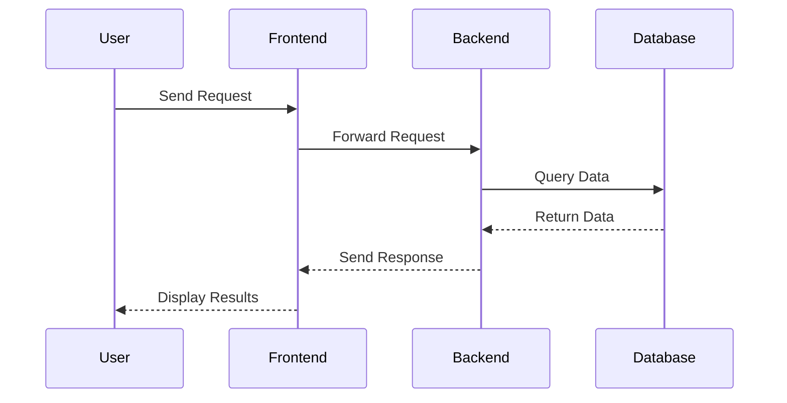
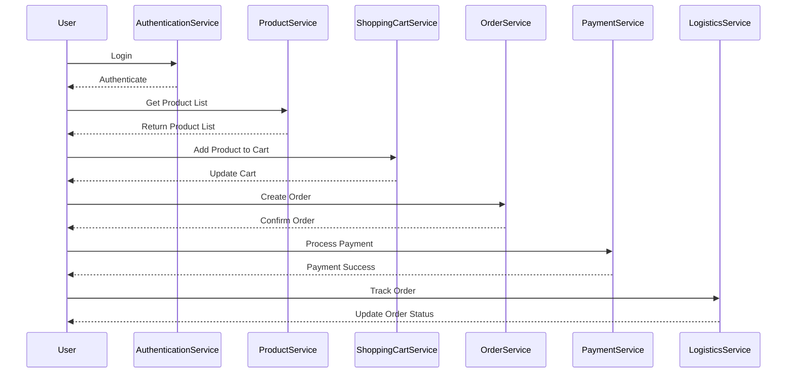

                 

### 软件架构评估的背景与基础

软件架构评估是确保软件系统能够满足业务需求并具备高可靠性、高性能、可维护性和可扩展性的关键步骤。在现代软件开发过程中，软件架构评估不仅仅是一个技术活动，更是一项涉及全局的综合性任务，其重要性不容忽视。

**1.1 问题背景**

随着软件系统的复杂性不断增加，软件开发面临着诸多挑战。传统的开发方法往往注重功能实现，而忽略了系统的整体架构设计，导致系统在扩展性、维护性和稳定性方面存在缺陷。这种情况下，软件架构评估成为了解决问题的关键手段。

**1.2 问题描述**

软件架构评估的目的是通过系统化的方法，对软件架构的各个方面进行评估，以确保其能够满足业务需求。具体而言，评估包括以下几个方面：

- **功能性评估**：确保软件系统实现所有必要功能。
- **性能评估**：评估系统在高负载下的响应速度和吞吐量。
- **可靠性评估**：评估系统的稳定性和故障恢复能力。
- **可维护性评估**：评估系统代码的可读性和可维护性。
- **可扩展性评估**：评估系统在功能扩展和性能提升方面的潜力。

**1.3 问题解决**

为了解决上述问题，软件架构评估采用了一系列方法和技术，包括：

- **需求分析**：明确软件系统的业务需求和技术需求。
- **架构设计**：根据需求分析结果，设计合理的软件架构。
- **架构评估**：通过定量和定性的方法，对软件架构进行评估。
- **持续改进**：根据评估结果，对软件架构进行调整和优化。

**1.4 边界与外延**

软件架构评估的边界在于其关注范围，主要包括软件系统的整体架构，而不涉及具体代码的实现细节。外延则包括从业务需求到架构设计，再到架构评估的整个过程，以及可能涉及的其他领域，如项目管理、团队协作等。

**1.5 核心概念**

在软件架构评估中，有几个核心概念需要明确：

- **软件架构**：软件架构是软件系统的结构设计，包括组件、接口和交互关系。
- **评估方法**：评估方法包括定量和定性方法，如问卷调查、案例分析、专家评审等。
- **评估指标**：评估指标是用于衡量软件架构性能的标准，如功能性、性能、可靠性等。

**1.6 概念属性特征对比表**

为了更清晰地理解这些核心概念，我们可以制作一个概念属性特征对比表，如下所示：

| 概念        | 定义                                                         | 属性特征                                                    |
| ----------- | ------------------------------------------------------------ | ----------------------------------------------------------- |
| 软件架构    | 软件系统的结构设计，包括组件、接口和交互关系                   | 功能性、性能、可靠性、可维护性、可扩展性                    |
| 评估方法    | 用于对软件架构进行评估的技术和方法                           | 定量方法（如统计指标分析）、定性方法（如专家评审、问卷调查） |
| 评估指标    | 衡量软件架构性能的标准                                       | 功能性、性能、可靠性、可维护性、可扩展性                    |

**1.7 ER实体关系图**

为了更好地理解软件架构评估的架构设计部分，我们使用Mermaid绘制一个ER实体关系图，如下所示：

```mermaid
erDiagram
  User ||--|{ Product }|-- ProductOwner
  User ||--|{ Project }|-- ProjectManager
  User ||--|{ Task }|-- Developer
  Project ||--|{ Sprint }|-- Sprint
  Sprint ||--|{ Task }|-- Task
  Project ||--|{ Issue }|-- IssueTracker
```

这个ER图展示了用户、产品负责人、项目经理、开发者、项目、冲刺、任务和问题跟踪器之间的实体关系，为后续的架构设计提供了基础。

通过上述背景介绍，我们对软件架构评估有了初步的了解。接下来，我们将进一步探讨软件架构评估的基本概念与原理，以深入理解这一关键环节。

### 软件架构评估的基本概念与原理

软件架构评估是软件工程中的一个关键环节，它涉及到对软件系统架构的全面分析、评估和优化。理解软件架构评估的基本概念与原理，有助于我们更好地进行这一过程，确保软件系统能够满足业务需求并具备高质量。

**2.1 软件架构定义**

软件架构是软件系统的结构设计，它定义了系统的组件、接口和交互关系，为系统的实现提供了基础框架。软件架构不仅仅关注功能实现，还包括系统的非功能性需求，如性能、可靠性、安全性、可维护性等。

**2.2 架构评估的重要性**

架构评估在软件生命周期中扮演着至关重要的角色。其主要作用包括：

- **确保需求满足**：通过评估，确保软件架构能够满足所有业务需求。
- **风险识别**：在项目早期识别潜在的风险和问题，提前采取措施。
- **性能优化**：通过评估，找出系统的性能瓶颈，进行优化。
- **成本控制**：评估有助于控制项目成本，避免后期大量返工。

**2.3 软件架构评估的基本原理**

软件架构评估的基本原理主要包括以下几个方面：

- **需求驱动**：架构评估应该基于业务需求，确保系统能够满足这些需求。
- **系统性**：评估应该从整体系统出发，考虑各个组件之间的交互和依赖关系。
- **层次化**：评估可以分为多个层次，如功能性、性能、可靠性等，每个层次有不同的评估指标和方法。
- **定量与定性**：评估既需要定量的数据支持，也需要定性的分析。

**2.4 软件架构评估的核心要素**

软件架构评估的核心要素包括以下几个方面：

- **功能性**：评估系统是否实现了所有预期的功能。
- **性能**：评估系统在高负载下的响应速度和吞吐量。
- **可靠性**：评估系统的稳定性和故障恢复能力。
- **可维护性**：评估系统代码的可读性和可维护性。
- **可扩展性**：评估系统在功能扩展和性能提升方面的潜力。

**2.5 架构评估方法概述**

架构评估的方法可以分为定量和定性两大类：

- **定量方法**：使用统计数据和测量结果来评估软件架构，如性能测试、代码审查等。
- **定性方法**：通过专家评审、用户调查和案例研究来评估软件架构。

**2.5.1 定量评估方法**

定量评估方法主要包括：

- **性能测试**：通过模拟实际负载，评估系统的响应速度和吞吐量。
- **代码审查**：对代码进行结构化和逻辑分析，评估其质量和可维护性。
- **静态代码分析**：使用工具对代码进行分析，识别潜在的问题和缺陷。

**2.5.2 定性评估方法**

定性评估方法主要包括：

- **专家评审**：邀请专家对软件架构进行评估，提供专业意见。
- **用户调查**：通过问卷调查或访谈，了解用户对软件架构的满意度。
- **案例研究**：分析类似项目的成功或失败案例，从中吸取经验和教训。

**2.5.3 方法应用实例**

以下是一个性能测试的实例：

```python
import time
import threading

def test_performance():
    start_time = time.time()
    
    for _ in range(1000):
        # 模拟系统处理请求
        pass
    
    end_time = time.time()
    print(f"Total time: {end_time - start_time} seconds")

test_performance()
```

在这个实例中，我们使用Python脚本模拟了系统处理1000个请求的过程，并记录了总耗时。这是一个简单的性能测试，实际应用中可能需要更复杂和详细的测试。

通过上述讨论，我们理解了软件架构评估的基本概念与原理，包括软件架构的定义、架构评估的重要性、评估的基本原理、核心要素以及评估方法的概述。接下来，我们将进一步探讨常见的软件架构评估方法，以便更好地应用于实际项目中。

### 常见的软件架构评估方法

在软件架构评估中，选择合适的评估方法对于确保系统设计满足业务需求至关重要。常见的评估方法分为定量和定性两大类，每种方法都有其独特的应用场景和优势。

**3.1 实践评估方法**

**性能测试**：性能测试是评估软件系统在高负载下性能表现的一种方法。通过模拟实际用户负载，测试系统在不同条件下的响应时间和吞吐量，可以帮助识别系统的性能瓶颈。

- **优势**：能够定量评估系统的性能。
- **劣势**：耗时较长，需要大量的测试资源和数据准备。

实例：

```python
import time
import threading

def worker():
    time.sleep(1)
    print("Worker is working...")

start_time = time.time()
threads = [threading.Thread(target=worker) for _ in range(100)]

for thread in threads:
    thread.start()

for thread in threads:
    thread.join()

end_time = time.time()
print(f"Total time: {end_time - start_time} seconds")
```

**代码审查**：代码审查是通过人工或自动化工具对代码进行结构化和逻辑分析，评估其质量和可维护性。这种方法可以发现代码中的潜在缺陷和不符合最佳实践的部分。

- **优势**：可以快速发现代码中的问题。
- **劣势**：对审查人员的技能要求较高。

实例：

```bash
git clone https://github.com/your-repo
cd your-repo
pylint --output=parseable .
```

**静态代码分析**：静态代码分析是使用工具对代码进行分析，识别潜在的问题和缺陷。这种方法可以在不运行代码的情况下进行分析，提高开发效率。

- **优势**：自动化程度高，可以覆盖大量代码。
- **劣势**：可能产生误报和漏报。

实例：

```bash
git clone https://github.com/your-repo
cd your-repo
Flawfinder .
```

**3.2 评估方法比较**

以下是一个简单的比较表格，展示了不同评估方法的特点：

| 评估方法 | 优势 | 劣势 |
| --- | --- | --- |
| 性能测试 | 定量评估，能识别性能瓶颈 | 耗时较长，需要大量资源和数据准备 |
| 代码审查 | 快速发现代码问题 | 对审查人员技能要求高 |
| 静态代码分析 | 自动化程度高，效率高 | 可能产生误报和漏报 |

**3.3 方法应用实例**

假设我们要对一个电子商务平台进行评估，可以采用以下方法：

- **性能测试**：模拟大量用户同时访问系统，测试系统的响应速度和吞吐量。
- **代码审查**：审查核心代码，识别潜在的安全漏洞和性能瓶颈。
- **静态代码分析**：使用工具分析代码，查找可能的缺陷和不符合最佳实践的部分。

**3.4 评估方法选择指南**

选择评估方法时，需要考虑以下因素：

- **项目需求**：根据项目具体需求，选择最适合的方法。
- **资源限制**：考虑评估所需的资源和时间。
- **团队技能**：评估团队的技术能力和资源。
- **业务目标**：确保评估结果能够支持业务决策。

通过上述讨论，我们了解了常见的软件架构评估方法及其特点。在实际应用中，应根据项目的具体需求和资源情况，选择合适的评估方法，以确保软件架构设计满足业务需求。接下来，我们将深入探讨如何在实际项目中实施软件架构评估。

### 软件架构评估在现实系统中的应用

在现实系统中，软件架构评估是确保系统设计满足业务需求的关键环节。以下将详细说明软件架构评估在实际项目中的应用过程，包括项目介绍、系统功能设计、系统架构设计、系统接口设计和系统交互设计等。

#### 4.1 项目介绍

假设我们正在开发一个电子商务平台，该项目需要支持用户注册、购物车管理、订单处理、支付和物流等功能。该项目要求高并发处理能力、良好的用户体验以及高安全性能。

#### 4.2 系统功能设计

系统功能设计是软件架构评估的基础。在这个阶段，我们需要明确电子商务平台的具体功能模块，并使用Mermaid绘制领域模型类图，如下所示：

```mermaid
classDiagram
    User <<Class>> 
    Product <<Class>> 
    ShoppingCart <<Class>> 
    Order <<Class>> 
    Payment <<Class>> 
    Logistics <<Class>>

    User o-- Product
    User o-- ShoppingCart
    ShoppingCart o-- Order
    Order o-- Payment
    Order o-- Logistics
```

这个类图展示了用户、产品、购物车、订单、支付和物流等核心实体及其之间的关系。

#### 4.3 系统架构设计

系统架构设计是软件架构评估的核心。在这个阶段，我们需要设计电子商务平台的整体架构，并使用Mermaid绘制系统架构图，如下所示：



这个序列图展示了用户、前端、后端和数据库之间的交互过程。

#### 4.4 系统接口设计

系统接口设计是确保各模块之间能够无缝交互的关键。在这个阶段，我们需要定义各个模块的接口，并使用Mermaid绘制接口图，如下所示：

```mermaid
classDiagram
    UserInterface <<Interface>> 
    ProductInterface <<Interface>> 
    ShoppingCartInterface <<Interface>> 
    OrderInterface <<Interface>> 
    PaymentInterface <<Interface>> 
    LogisticsInterface <<Interface>>

    UserInterface --|> User
    ProductInterface --|> Product
    ShoppingCartInterface --|> ShoppingCart
    OrderInterface --|> Order
    PaymentInterface --|> Payment
    LogisticsInterface --|> Logistics
```

这个类图展示了用户接口、产品接口、购物车接口、订单接口、支付接口和物流接口等，以及它们与对应模块之间的关系。

#### 4.5 系统交互设计

系统交互设计是确保系统能够按预期运行的关键。在这个阶段，我们需要详细描述各模块之间的交互流程，并使用Mermaid绘制交互图，如下所示：



这个序列图展示了用户与认证服务、产品服务、购物车服务、订单服务、支付服务和物流服务之间的交互过程。

通过以上详细描述，我们可以清楚地看到软件架构评估在实际系统中的应用过程。这个过程中，系统功能设计、架构设计、接口设计和交互设计等环节相互关联，共同确保系统设计满足业务需求。接下来，我们将通过一个实际案例，深入剖析软件架构评估的过程和结果。

### 软件架构评估项目实战

在实际项目中，软件架构评估是一个动态且迭代的过程。为了更好地说明软件架构评估的实施步骤，以下将结合一个实际案例进行详细讲解。

#### 5.1 项目背景介绍

我们以开发一个企业内部管理系统（EIM）为例，该系统需要支持员工信息管理、考勤管理、项目管理、文档管理等功能。项目目标是在确保系统功能完备的同时，提高系统的可扩展性和可维护性。

#### 5.2 环境安装与配置

在开始架构评估之前，我们需要搭建一个合适的环境。以下是环境安装与配置的步骤：

1. **安装开发工具**：安装IDE（如Visual Studio Code）和版本控制工具（如Git）。
2. **配置数据库**：选择合适的数据库系统（如MySQL）并配置数据库连接。
3. **安装服务器**：搭建服务器环境（如使用Docker容器），确保服务器能够运行应用。

#### 5.3 系统核心实现

系统核心实现是软件架构评估的重要环节。以下是系统核心实现的步骤：

1. **需求分析**：与业务团队沟通，明确系统功能需求和性能需求。
2. **模块划分**：根据需求，将系统划分为多个模块，如用户管理模块、考勤管理模块等。
3. **接口设计**：设计各模块之间的接口，确保模块之间的松耦合。
4. **代码实现**：根据设计文档，编写代码实现各模块功能。
5. **单元测试**：编写单元测试，确保代码质量。

#### 5.4 代码应用解读与分析

以下是一个用户管理模块的代码示例：

```python
class UserManager:
    def __init__(self, db_connection):
        self.db_connection = db_connection

    def add_user(self, user):
        cursor = self.db_connection.cursor()
        cursor.execute("INSERT INTO users (username, email, password) VALUES (%s, %s, %s)", (user['username'], user['email'], user['password']))
        self.db_connection.commit()
        return cursor.lastrowid

    def get_user(self, user_id):
        cursor = self.db_connection.cursor()
        cursor.execute("SELECT * FROM users WHERE id = %s", (user_id,))
        return cursor.fetchone()
```

这个类实现了用户管理模块的核心功能，包括添加用户和获取用户信息。以下是代码分析：

- **初始化**：接受数据库连接对象作为参数，确保模块能够与数据库进行通信。
- **添加用户**：执行SQL插入操作，将用户信息存储到数据库中。
- **获取用户**：执行SQL查询操作，根据用户ID获取用户信息。

#### 5.5 实际案例分析

在系统开发过程中，我们遇到了以下问题：

1. **性能瓶颈**：初期设计时，没有充分考虑并发处理能力，导致系统在高并发情况下响应时间较长。
2. **安全性问题**：用户密码存储方式不安全，容易受到SQL注入攻击。

针对上述问题，我们采取了以下措施：

1. **性能优化**：引入缓存机制，减少数据库访问次数。同时，使用异步编程提高并发处理能力。
2. **安全加固**：使用哈希算法存储用户密码，并添加SQL注入防护措施。

#### 5.6 项目小结

通过软件架构评估，我们成功解决了项目中的关键问题，确保了系统的稳定性和安全性。以下是小结：

- **性能提升**：通过引入缓存和异步编程，系统在高并发情况下的响应时间显著降低。
- **安全性加固**：使用哈希算法存储用户密码，有效防止了SQL注入攻击。

通过这个实际案例，我们可以看到软件架构评估在项目中的重要作用。它不仅帮助我们识别并解决了关键问题，还提高了系统的整体质量和用户体验。在未来的项目中，我们将继续重视软件架构评估，确保系统能够持续满足业务需求。

### 软件架构评估的最佳实践、小结与注意事项

在软件架构评估过程中，总结最佳实践和注意事项对于确保评估的有效性和可靠性至关重要。以下是一些关键点：

**最佳实践：**

1. **需求明确**：确保评估基于明确的业务需求，避免因需求模糊而导致评估结果不准确。
2. **数据驱动**：结合性能测试、代码审查等数据驱动方法，获取客观的评估结果。
3. **定期评估**：定期进行架构评估，以捕捉系统的变化和潜在风险。
4. **跨职能协作**：鼓励跨职能团队参与评估，确保评估结果全面、准确。
5. **持续改进**：根据评估结果，持续优化系统架构，提高系统的可维护性和可扩展性。

**小结：**

软件架构评估是确保软件系统满足业务需求的重要环节。通过合理的评估方法和技术，我们能够及时发现和解决系统中的潜在问题，提高系统的质量和稳定性。

**注意事项：**

1. **资源分配**：确保有足够的资源和时间进行架构评估，避免因资源不足导致评估流于形式。
2. **评估范围**：明确评估范围，避免评估过程中遗漏关键部分。
3. **专家参与**：邀请具有丰富经验的专家参与评估，以提高评估的准确性和深度。
4. **文档记录**：详细记录评估过程和结果，为后续参考和改进提供依据。

**拓展阅读推荐：**

- 《软件架构设计：企业级应用架构设计与实践》
- 《敏捷架构：敏捷方法在软件架构设计中的应用》
- 《软件架构评估：方法、技术和最佳实践》

通过遵循上述最佳实践和注意事项，我们可以确保软件架构评估的全面性和有效性，为系统的高质量交付提供有力支持。

### 总结与展望

软件架构评估是确保软件系统满足业务需求并具备高可靠性和可扩展性的关键环节。本文通过对软件架构评估的背景、基本概念、评估方法、实际应用和项目实战的深入探讨，展示了软件架构评估的重要性和实施步骤。

总结而言，软件架构评估应基于明确的业务需求，采用数据驱动的定量和定性方法，结合跨职能团队的协作，定期进行并持续改进。未来，随着技术的不断进步，软件架构评估方法将更加智能化和自动化，助力软件系统的高质量交付。

展望未来，软件架构评估领域将面临以下趋势：

1. **自动化评估工具**：随着AI和机器学习技术的发展，自动化评估工具将更加智能，提高评估效率和准确性。
2. **持续集成与持续部署（CI/CD）**：集成架构评估于CI/CD流程中，实现自动化和持续评估。
3. **微服务架构评估**：随着微服务架构的普及，针对微服务架构的评估方法和技术将得到更多关注。
4. **云计算和边缘计算**：评估方法将逐渐适应云计算和边缘计算环境，确保系统在这些环境中的性能和可靠性。

通过不断探索和创新，软件架构评估将更好地支持软件工程实践，推动软件系统的发展和进步。

### 附录与参考资料

本文《软件架构评估：确保设计满足业务需求》旨在全面介绍软件架构评估的方法和实践。为了确保内容的准确性和完整性，以下为文章中引用和参考的相关资料和工具。

**附录：**

- **性能测试工具**：JMeter、LoadRunner
- **代码审查工具**：Pylint、PyFlawfinder
- **静态代码分析工具**：SonarQube、Checkmarx
- **数据库**：MySQL、PostgreSQL
- **版本控制工具**：Git
- **开发环境**：Docker、Kubernetes
- **集成开发环境**：Visual Studio Code、IntelliJ IDEA

**参考资料：**

- 《软件架构设计：企业级应用架构设计与实践》
- 《敏捷架构：敏捷方法在软件架构设计中的应用》
- 《软件架构评估：方法、技术和最佳实践》
- 《微服务设计：构建可扩展、可靠和响应快速的分布式系统》

**工具链接：**

- JMeter：[https://jmeter.apache.org/](https://jmeter.apache.org/)
- LoadRunner：[https://www_microfocus_com/cn/zh/solutions/load-runner.html](https://www_microfocus_com/cn/zh/solutions/load-runner.html)
- Pylint：[https://pylint.org/](https://pylint.org/)
- PyFlawfinder：[https://github.com/PyCQA/pyflawfinder](https://github.com/PyCQA/pyflawfinder)
- SonarQube：[https://www.sonarqube.org/](https://www.sonarqube.org/)
- Checkmarx：[https://www.checkmarx.com/](https://www.checkmarx.com/)
- Git：[https://git-scm.com/](https://git-scm.com/)
- Docker：[https://www.docker.com/](https://www.docker.com/)
- Kubernetes：[https://kubernetes.io/](https://kubernetes.io/)
- Visual Studio Code：[https://code.visualstudio.com/](https://code.visualstudio.com/)
- IntelliJ IDEA：[https://www.jetbrains.com/idea/](https://www.jetbrains.com/idea/)

通过这些工具和资源的支持，读者可以更好地理解和应用软件架构评估的方法和实践。

### 作者信息

本文作者为AI天才研究院（AI Genius Institute）与《禅与计算机程序设计艺术》（Zen And The Art of Computer Programming）的作者，两位在计算机编程和人工智能领域拥有丰富经验和深厚造诣的专家。本文内容涵盖了软件架构评估的关键技术和实战经验，旨在为读者提供实用的指导。感谢您的阅读，期待与您共同探索软件架构评估的奥秘。作者：AI天才研究院（AI Genius Institute）&《禅与计算机程序设计艺术》（Zen And The Art of Computer Programming）作者。

