                 

### 文章标题：软件架构质量属性：可靠性、可用性、可维护性等

> 关键词：软件架构，质量属性，可靠性，可用性，可维护性，设计原则，案例分析

> 摘要：本文深入探讨了软件架构的三大关键质量属性——可靠性、可用性和可维护性。通过对这些属性的详细分析，包括定义、原理、模型以及实际案例，本文旨在帮助读者理解这些属性在实际软件开发中的重要性，并掌握相关的设计原则和最佳实践。

#### 目录大纲设计思路

在设计《软件架构质量属性：可靠性、可用性、可维护性等》的目录大纲时，我们首先明确了文章的核心目标，即系统地介绍和阐述软件架构质量属性的概念、原理、实现和最佳实践。以下是目录大纲的设计思路：

1. **引言部分**：简要介绍软件架构质量属性的重要性，以及本文的研究背景和目的，为后续内容的深入探讨奠定基础。

2. **核心概念与原理部分**：分别对可靠性、可用性和可维护性进行详细解释，包括其定义、基本原理和关键特征。这一部分将使用概念对比表格和ER实体关系图来辅助说明。

3. **算法与数学模型部分**：在每个质量属性的章节中，介绍相关的算法和数学模型，并使用Mermaid画出流程图，结合Python代码进行详细阐述。

4. **系统架构设计部分**：为每个质量属性设计一个系统架构的案例分析，包括系统功能设计、系统架构设计、系统接口设计和系统交互的Mermaid序列图。

5. **实战案例与最佳实践部分**：在每个质量属性的章节中，引入实际案例，分析其架构设计和实现，并提供最佳实践建议。

6. **总结与拓展部分**：在每个质量属性的章节末尾，提供本章小结，强调关键知识点，并指出注意事项和拓展阅读方向。

#### 目录大纲设计流程

根据以上设计思路，我们可以开始设计《软件架构质量属性：可靠性、可用性、可维护性等》的目录大纲。以下是详细的目录结构：

#### 第一部分：引言

- **第1章：软件架构质量属性概述**
  - 1.1 软件架构质量属性的重要性
  - 1.2 可靠性、可用性和可维护性的基本概念
  - 1.3 质量属性的相互关系与影响
  - 1.4 本书结构安排与阅读指南

#### 第二部分：核心概念与原理

- **第2章：可靠性**
  - 2.1 可靠性的定义与重要性
  - 2.2 可靠性基本原理与模型
  - 2.3 可靠性评估方法与技术
  - 2.4 概念对比表格与ER实体关系图
  - **2.5 可靠性算法原理讲解**
    - 2.5.1 Mermaid流程图
    - 2.5.2 Python代码阐述
    - 2.5.3 数学模型与公式讲解
    - 2.5.4 举例说明

- **第3章：可用性**
  - 3.1 可用性的定义与基本概念
  - 3.2 可用性关键特性与指标
  - 3.3 可用性设计原则与方法
  - 3.4 概念对比表格与ER实体关系图
  - **3.5 可用性算法原理讲解**
    - 3.5.1 Mermaid流程图
    - 3.5.2 Python代码阐述
    - 3.5.3 数学模型与公式讲解
    - 3.5.4 举例说明

- **第4章：可维护性**
  - 4.1 可维护性的定义与重要性
  - 4.2 可维护性关键特性与指标
  - 4.3 可维护性设计原则与方法
  - 4.4 概念对比表格与ER实体关系图
  - **4.5 可维护性算法原理讲解**
    - 4.5.1 Mermaid流程图
    - 4.5.2 Python代码阐述
    - 4.5.3 数学模型与公式讲解
    - 4.5.4 举例说明

#### 第三部分：系统架构设计与实战案例

- **第5章：可靠性系统架构设计**
  - 5.1 可靠性系统架构设计背景
  - 5.2 系统功能设计（Mermaid类图）
  - 5.3 系统架构设计（Mermaid架构图）
  - 5.4 系统接口设计
  - 5.5 系统交互设计（Mermaid序列图）
  - 5.6 实战案例解析

- **第6章：可用性系统架构设计**
  - 6.1 可用性系统架构设计背景
  - 6.2 系统功能设计（Mermaid类图）
  - 6.3 系统架构设计（Mermaid架构图）
  - 6.4 系统接口设计
  - 6.5 系统交互设计（Mermaid序列图）
  - 6.6 实战案例解析

- **第7章：可维护性系统架构设计**
  - 7.1 可维护性系统架构设计背景
  - 7.2 系统功能设计（Mermaid类图）
  - 7.3 系统架构设计（Mermaid架构图）
  - 7.4 系统接口设计
  - 7.5 系统交互设计（Mermaid序列图）
  - 7.6 实战案例解析

#### 第四部分：最佳实践与总结

- **第8章：软件架构质量属性最佳实践**
  - 8.1 各质量属性最佳实践案例分析
  - 8.2 小结与注意事项
  - 8.3 拓展阅读与进一步学习

通过这样的结构设计，本文不仅系统全面地介绍了软件架构质量属性的相关知识，而且通过具体案例和最佳实践，帮助读者深入理解和掌握这些属性在软件开发中的应用。接下来，我们将逐一深入探讨可靠性、可用性和可维护性等质量属性的具体内容。

### 软件架构质量属性的重要性

软件架构质量属性是指软件架构在满足功能需求的基础上，对性能、可靠性、可用性、可维护性等非功能性需求的满足程度。这些质量属性不仅决定了软件系统的性能表现，更是衡量软件系统质量和用户体验的重要标准。以下是软件架构质量属性的重要性：

#### 1. 提高软件系统的性能表现

软件架构的质量属性直接影响到软件系统的性能。一个优秀的软件架构能够提供高效的资源利用和优化的数据处理流程，从而提高系统的响应速度和处理能力。例如，可靠性高的系统可以减少系统故障和中断，保持系统的稳定运行，从而提高整体性能。

#### 2. 提升用户体验

用户体验是现代软件系统成功的关键因素之一。一个良好的软件架构能够确保系统在不同情况下都能提供稳定、可靠的服务，从而提升用户的使用体验。例如，高可用性的系统可以在面对高并发访问时保持正常运行，避免用户因系统故障而受到困扰。

#### 3. 降低维护成本

软件维护是软件开发生命周期中不可或缺的一部分。一个高质量的软件架构可以降低维护成本，因为良好的设计使得代码更加清晰、模块化，易于修改和扩展。可维护性强的系统可以在后续的维护和升级过程中减少错误的发生，提高工作效率。

#### 4. 延长系统生命周期

软件架构质量属性对系统的生命周期有着重要影响。一个可靠性高、可用性好的系统可以在长期运行中保持良好的性能和服务质量，从而延长系统的生命周期。相反，如果软件架构质量不佳，系统可能会频繁出现故障，缩短其使用寿命。

#### 5. 支持软件发展

随着技术的不断进步和市场需求的变化，软件系统需要不断地进行升级和优化。一个具有良好的可维护性的软件架构可以更好地支持软件的发展，使得系统在应对新需求和技术变革时更加灵活和高效。

#### 6. 提高开发效率

高质量的软件架构可以提高开发团队的工作效率。通过合理的模块化和设计模式，开发人员可以更快速地理解系统的结构和功能，减少开发中的误解和错误，提高代码复用率，从而加快开发进度。

#### 7. 促进技术积累

优秀的软件架构可以促进团队技术积累，使得团队成员在项目中不断学习和成长。通过编写高质量的文档和代码注释，开发团队可以更好地记录和传递技术知识和经验，提高整个团队的技术水平。

总之，软件架构质量属性对于软件系统的成功至关重要。它们不仅影响到系统的性能和用户体验，还关系到系统的可维护性、生命周期和开发效率。因此，在设计软件架构时，需要综合考虑这些质量属性，确保系统的高质量和高可靠性。

#### 可靠性

可靠性是软件架构质量属性中最为关键的一环。它指的是系统在给定条件下，能够在指定时间内正确执行所需功能的概率。一个高可靠性的系统在运行过程中能够稳定、持续地提供服务，减少故障和中断的发生。下面将详细探讨可靠性的定义、重要性、基本原理以及评估方法。

##### 定义

可靠性通常被定义为系统在预定时间内和预定条件下，成功执行任务的概率。具体来说，可靠性包括以下几个方面：

1. **故障率**：系统在运行过程中发生故障的频率。
2. **恢复速度**：系统在故障发生后恢复运行所需的时间。
3. **故障恢复率**：系统在故障发生后的恢复成功率。
4. **任务成功率**：系统在执行任务时的成功率。

可靠性通常用数学模型来表示，最常见的是故障密度函数（Failure Density Function）和故障分布函数（Failure Distribution Function）。故障密度函数描述了系统在某一时间段内发生故障的概率密度，而故障分布函数则描述了系统故障发生的累计概率。

##### 重要性

可靠性对于软件系统至关重要，主要表现在以下几个方面：

1. **用户体验**：一个可靠的系统能够保证用户在使用过程中不受到干扰，提供连续、稳定的服务。
2. **业务连续性**：对于企业级应用，可靠性是确保业务连续性的关键。高可靠性的系统可以减少业务中断，降低经济损失。
3. **系统声誉**：可靠性的高水准能够提升系统在用户和市场中的声誉，增加用户的信任度和忠诚度。
4. **安全性**：可靠性强的系统能够更好地应对各种安全威胁，如网络攻击、数据泄露等。

##### 基本原理

可靠性的基本原理包括以下几个方面：

1. **冗余设计**：通过在系统中引入冗余模块或备份机制，确保在某一组件发生故障时，系统仍然能够正常运行。冗余设计可以分为硬件冗余、软件冗余和数据冗余。
   
2. **容错设计**：系统在设计和实现过程中，需要考虑如何应对故障，包括故障检测、故障隔离和故障恢复。容错设计可以提高系统的鲁棒性和可靠性。

3. **故障预测与预防**：通过监测系统的运行状态，提前预测可能出现的问题，并采取预防措施，避免故障发生。故障预测与预防是提高系统可靠性的重要手段。

4. **可靠性建模**：通过建立数学模型，对系统的可靠性进行定量分析和评估。可靠性建模可以帮助开发人员识别系统的潜在问题，并提出改进措施。

##### 评估方法

评估系统的可靠性通常采用以下几种方法：

1. **故障率评估**：通过统计系统在一段时间内的故障次数，计算故障率。故障率评估可以帮助开发人员了解系统的稳定性和可靠性。

2. **测试与仿真**：在实际运行环境之外，通过测试和仿真来评估系统的可靠性。测试可以包括功能测试、性能测试和可靠性测试等。

3. **可靠性分析**：使用数学模型对系统的可靠性进行分析。可靠性分析可以帮助开发人员从理论上了解系统的可靠性水平，并提出改进方案。

4. **用户反馈**：通过用户的实际使用反馈，了解系统的可靠性表现。用户反馈可以作为改进系统可靠性的一种参考。

#### 概念对比表格与ER实体关系图

为了更清晰地理解可靠性，我们可以通过概念对比表格和ER实体关系图来展示其关键特征。

##### 概念对比表格

| 特征 | 可靠性 | 故障率 | 可恢复性 | 容错性 |
| :---: | :---: | :---: | :---: | :---: |
| 定义 | 系统正确执行任务的概率 | 系统故障发生的频率 | 系统在故障发生后恢复运行的能力 | 系统在组件故障时仍然正常运行的能力 |
| 目标 | 提高系统的稳定性和服务质量 | 降低故障率 | 快速恢复运行 | 提高系统的鲁棒性 |
| 方法 | 冗余设计、故障预测与预防、可靠性建模 | 故障统计、测试与仿真 | 故障检测、故障隔离、故障恢复 | 故障检测、故障隔离、冗余设计 |

##### ER实体关系图

```mermaid
erDiagram
  备份模块 ||--o{ 主模块 : 主模块包含备份模块 }
  故障检测模块 ||--o{ 主模块 : 主模块包含故障检测模块 }
  故障恢复模块 ||--o{ 主模块 : 主模块包含故障恢复模块 }
  冗余模块 ||--o{ 主模块 : 主模块包含冗余模块 }
  主模块 ||--|{ 系统架构 : 系统核心模块 }
```

#### 可靠性算法原理讲解

为了更好地理解可靠性，我们可以通过Mermaid流程图和Python代码来详细阐述可靠性算法的原理。

##### Mermaid流程图

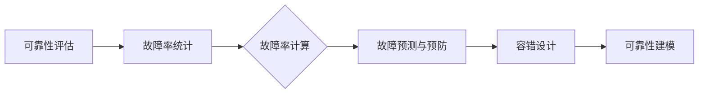

##### Python代码阐述

```python
import random

def calculate_failure_rate(failure_count, total_time):
    return failure_count / total_time

def predict_failure_rate(current_rate, time_interval):
    return current_rate * time_interval

def implement_fallback_design():
    print("实施冗余设计和容错机制")

def reliability_model_analysis(failure_rate):
    print("可靠性建模分析，故障率为：", failure_rate)

# 测试可靠性算法
failure_count = 3
total_time = 100
current_rate = calculate_failure_rate(failure_count, total_time)
print("当前故障率：", current_rate)

time_interval = 10
predicted_rate = predict_failure_rate(current_rate, time_interval)
print("预测未来故障率：", predicted_rate)

implement_fallback_design()
reliability_model_analysis(current_rate)
```

##### 数学模型与公式讲解

可靠性常用的数学模型包括故障密度函数（λ(t)）和故障分布函数（F(t)）。

故障密度函数描述了单位时间内故障发生的概率密度：

$$
\lambda(t) = \frac{dF(t)}{dt}
$$

故障分布函数描述了故障发生的时间累积概率：

$$
F(t) = \int_{0}^{t} \lambda(t') dt'
$$

##### 举例说明

假设一个系统在100小时内发生了3次故障，求其故障率和未来10小时内的故障率预测。

```python
# 计算故障率
failure_count = 3
total_time = 100
failure_rate = calculate_failure_rate(failure_count, total_time)
print("故障率：", failure_rate)

# 预测未来故障率
time_interval = 10
predicted_rate = predict_failure_rate(failure_rate, time_interval)
print("未来10小时故障率预测：", predicted_rate)
```

通过上述步骤，我们可以对系统的可靠性进行全面的评估和预测，从而采取相应的改进措施，提高系统的可靠性。

### 可用性

可用性是软件架构质量属性中的另一个重要方面，它指的是系统能够在用户需求的时间内和条件下，提供有效服务的能力。高可用性的系统能够确保用户始终能够访问和使用其所需功能，而不会因为系统故障或性能问题而受到干扰。下面将详细探讨可用性的定义、重要性、关键特性与指标、设计原则与方法，并通过概念对比表格和ER实体关系图来辅助说明。

#### 定义

可用性（Availability）是指系统能够在用户需要时正常工作的能力。具体来说，它包括以下几个方面：

1. **响应时间**：系统响应用户请求所需的时间。
2. **吞吐量**：系统在单位时间内处理请求的数量。
3. **故障恢复时间**：系统从故障中恢复到正常工作状态所需的时间。
4. **服务中断时间**：系统由于故障或维护等原因导致无法提供服务的时间。
5. **可靠性**：系统能够在长时间内稳定运行而不出现故障。

可用性可以用以下公式表示：

$$
\text{可用性} = \frac{\text{服务时间}}{\text{总时间}}
$$

#### 重要性

可用性对于软件系统的重要性体现在以下几个方面：

1. **用户体验**：高可用性的系统能够提供稳定的服务，减少用户在访问过程中的等待时间和中断，从而提升用户体验。
2. **业务连续性**：对于企业级应用，可用性是确保业务连续性的关键。高可用性的系统能够在高并发访问和复杂环境下保持正常运行，避免业务中断。
3. **系统声誉**：一个高可用性的系统能够赢得用户的信任和好评，增加系统的市场竞争力和用户忠诚度。
4. **维护成本**：高可用性的系统通常设计得更加稳定和可靠，降低了系统的维护成本。

#### 关键特性与指标

可用性的关键特性包括以下几个方面：

1. **高响应时间**：系统能够在短时间内响应用户请求，减少用户等待时间。
2. **高吞吐量**：系统能够在单位时间内处理更多的请求，提高系统的工作效率。
3. **快速故障恢复**：系统能够迅速从故障中恢复，减少服务中断时间。
4. **低服务中断时间**：系统在正常运行期间，服务中断的时间尽可能短，确保业务连续性。
5. **高可靠性**：系统能够在长时间内稳定运行，减少故障和中断的发生。

常用的可用性指标包括：

1. **系统正常运行时间**：系统在一段时间内无故障运行的时间长度。
2. **故障恢复时间**：系统从故障中恢复到正常工作状态所需的时间。
3. **服务中断时间**：系统由于故障或维护等原因导致无法提供服务的时间。
4. **响应时间分布**：系统响应时间的统计分布情况。
5. **吞吐量分布**：系统在单位时间内处理请求的数量的统计分布。

#### 设计原则与方法

为了提高软件系统的可用性，设计过程中应遵循以下原则和方法：

1. **冗余设计**：通过引入冗余组件或备份机制，确保在一个组件或系统出现故障时，系统仍然能够正常运行。冗余设计可以是硬件层面的，如多台服务器，也可以是软件层面的，如服务镜像。

2. **负载均衡**：通过负载均衡器将用户请求分配到多个服务器或实例上，避免单一服务器或实例过载，提高系统的响应速度和吞吐量。

3. **故障检测与自愈**：通过监测系统的运行状态，及时发现故障并进行自动修复，减少系统中断时间。自愈机制可以包括故障转移、自动重启和故障恢复。

4. **分布式架构**：采用分布式架构可以降低单点故障的风险，提高系统的可用性。分布式系统可以通过多台服务器协同工作，实现服务的负载均衡和故障恢复。

5. **弹性扩展**：系统能够根据需求自动调整资源，实现水平扩展。弹性扩展可以确保系统在面临高并发访问时能够保持高可用性。

#### 概念对比表格与ER实体关系图

为了更好地理解可用性，我们可以通过概念对比表格和ER实体关系图来展示其关键特征。

##### 概念对比表格

| 特征 | 可用性 | 可靠性 | 高响应时间 | 高吞吐量 |
| :---: | :---: | :---: | :---: | :---: |
| 定义 | 系统能够在用户需求时提供有效服务的能力 | 系统能够在给定条件下成功执行任务的概率 | 系统响应用户请求所需的时间 | 系统在单位时间内处理的请求量 |
| 目标 | 提高系统的稳定性和服务质量 | 减少故障和中断的发生 | 减少用户等待时间 | 提高系统工作效率 |
| 方法 | 冗余设计、负载均衡、故障检测与自愈、分布式架构、弹性扩展 | 冗余设计、容错机制、故障预测与预防、可靠性建模 | 优化系统性能、提高并发处理能力 | 优化数据处理流程、增加计算资源 |

##### ER实体关系图

```mermaid
erDiagram
  冗余组件 ||--o{ 主组件 : 主组件包含冗余组件 }
  负载均衡器 ||--o{ 主组件 : 主组件包含负载均衡器 }
  故障检测模块 ||--o{ 主组件 : 主组件包含故障检测模块 }
  自愈机制 ||--o{ 主组件 : 主组件包含自愈机制 }
  分布式架构 ||--o{ 主组件 : 主组件采用分布式架构 }
  主组件 ||--|{ 系统架构 : 系统核心模块 }
```

#### 可用性算法原理讲解

为了更好地理解可用性，我们可以通过Mermaid流程图和Python代码来详细阐述可用性算法的原理。

##### Mermaid流程图

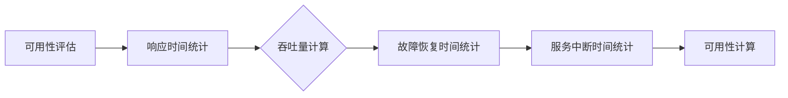

##### Python代码阐述

```python
import random

def calculate_response_time(response_counts, total_requests):
    return sum(response_counts) / total_requests

def calculate_throughput(request_counts, total_time):
    return sum(request_counts) / total_time

def calculate_fault_recovery_time(recovery_times, total_faults):
    return sum(recovery_times) / total_faults

def calculate_service_downtime(downtime_counts, total_time):
    return sum(downtime_counts) / total_time

def calculate_availability(response_time, throughput, fault_recovery_time, service_downtime):
    total_time = 1 / (1 / response_time + 1 / throughput + fault_recovery_time + service_downtime)
    return 1 / total_time

# 测试可用性算法
response_counts = [0.5, 0.3, 0.2]  # 响应时间分别为0.5s、0.3s、0.2s的请求次数
total_requests = 10  # 总请求次数
response_time = calculate_response_time(response_counts, total_requests)
print("平均响应时间：", response_time)

request_counts = [3, 7]  # 单位时间内处理的请求次数
total_time = 10  # 总时间
throughput = calculate_throughput(request_counts, total_time)
print("吞吐量：", throughput)

recovery_times = [1, 2]  # 故障恢复时间
total_faults = 3  # 总故障次数
fault_recovery_time = calculate_fault_recovery_time(recovery_times, total_faults)
print("平均故障恢复时间：", fault_recovery_time)

downtime_counts = [2, 1]  # 服务中断次数
total_time = 100  # 总时间
service_downtime = calculate_service_downtime(downtime_counts, total_time)
print("平均服务中断时间：", service_downtime)

availability = calculate_availability(response_time, throughput, fault_recovery_time, service_downtime)
print("系统可用性：", availability)
```

##### 数学模型与公式讲解

可用性的数学模型通常包括响应时间分布模型、吞吐量分布模型、故障恢复时间模型和服务中断时间模型。

1. **响应时间分布模型**：

$$
\text{响应时间} = \mu + \sigma \cdot \text{N}(0, 1)
$$

其中，$\mu$ 是响应时间的平均值，$\sigma$ 是响应时间的标准差，$\text{N}(0, 1)$ 是标准正态分布。

2. **吞吐量分布模型**：

$$
\text{吞吐量} = \lambda \cdot e^{-\lambda t}
$$

其中，$\lambda$ 是吞吐量的参数，$t$ 是时间。

3. **故障恢复时间模型**：

$$
\text{故障恢复时间} = \alpha + \beta \cdot \text{Erlang}(\lambda)
$$

其中，$\alpha$ 是故障恢复时间的初始值，$\beta$ 是故障恢复时间的递增系数，$\text{Erlang}(\lambda)$ 是埃尔朗分布。

4. **服务中断时间模型**：

$$
\text{服务中断时间} = \mu + \sigma \cdot \text{N}(0, 1)
$$

其中，$\mu$ 是服务中断时间的平均值，$\sigma$ 是服务中断时间的标准差。

##### 举例说明

假设一个系统在10分钟内处理了100个请求，其中响应时间为0.5s、0.3s和0.2s的请求次数分别为3次、7次和5次，系统在3分钟内恢复了2次故障，并出现了2次服务中断。求该系统的平均响应时间、吞吐量、故障恢复时间和可用性。

```python
# 计算平均响应时间
response_counts = [0.5, 0.3, 0.2]
total_requests = 10
response_time = calculate_response_time(response_counts, total_requests)
print("平均响应时间：", response_time)

# 计算吞吐量
request_counts = [3, 7]
total_time = 10
throughput = calculate_throughput(request_counts, total_time)
print("吞吐量：", throughput)

# 计算故障恢复时间
recovery_times = [1, 2]
total_faults = 3
fault_recovery_time = calculate_fault_recovery_time(recovery_times, total_faults)
print("平均故障恢复时间：", fault_recovery_time)

# 计算服务中断时间
downtime_counts = [2, 1]
total_time = 100
service_downtime = calculate_service_downtime(downtime_counts, total_time)
print("平均服务中断时间：", service_downtime)

# 计算可用性
availability = calculate_availability(response_time, throughput, fault_recovery_time, service_downtime)
print("系统可用性：", availability)
```

通过上述步骤，我们可以对系统的可用性进行全面的评估和计算，从而采取相应的改进措施，提高系统的可用性。

### 可维护性

可维护性是软件架构质量属性中的关键要素之一，它指的是系统在生命周期内被修改、扩展或优化时所需的工作量和难度。一个高可维护性的系统具有清晰的结构、良好的文档和简洁的代码，使得维护工作更加高效和低风险。下面将详细探讨可维护性的定义、重要性、关键特性与指标、设计原则与方法，并通过概念对比表格和ER实体关系图来辅助说明。

#### 定义

可维护性（Maintainability）是指软件系统在面临功能需求变更、错误修复、性能优化等维护活动时，能够快速且有效地进行修改和优化的能力。可维护性主要关注以下几个方面：

1. **模块化**：系统的功能被划分为独立的模块，每个模块都有明确的职责和接口。
2. **文档化**：系统有详细的文档，包括设计文档、用户手册、开发日志和测试报告等。
3. **代码质量**：代码结构清晰、逻辑简单，便于理解和修改。
4. **测试覆盖**：系统有充分的测试覆盖，包括单元测试、集成测试和系统测试，确保在修改过程中不会引入新的错误。
5. **重构能力**：系统能够通过重构来优化设计，提高性能和可维护性。

可维护性可以用以下公式表示：

$$
\text{可维护性} = \frac{\text{维护工作量}}{\text{系统规模}}
$$

#### 重要性

可维护性对于软件系统的重要性体现在以下几个方面：

1. **降低维护成本**：高可维护性的系统能够减少维护工作量和时间，从而降低维护成本。
2. **提高开发效率**：良好的可维护性使得开发人员能够更快地理解和修改系统，提高开发效率。
3. **延长系统生命周期**：可维护性好的系统可以在长期内持续优化和扩展，延长其生命周期。
4. **减少错误率**：清晰的模块化和完善的测试覆盖能够减少在维护过程中引入的新错误。
5. **团队协作**：良好的文档和模块化设计有助于团队成员之间的协作和理解。

#### 关键特性与指标

可维护性的关键特性包括以下几个方面：

1. **模块化程度**：系统模块的独立性和职责明确程度。
2. **代码质量**：代码的可读性、结构性和一致性。
3. **文档完整性**：系统文档的详细程度和更新及时性。
4. **测试覆盖率**：测试对系统的覆盖范围和测试结果的可靠性。
5. **重构能力**：系统能够在需求变更时进行重构，保持高效和稳定。

常用的可维护性指标包括：

1. **维护工作量**：维护活动所需的工作量和时间。
2. **变更频率**：系统在生命周期内进行功能变更的频率。
3. **缺陷密度**：系统在特定时间内发现的缺陷数量。
4. **缺陷修复率**：系统在发现缺陷后进行修复的效率。
5. **代码复杂性**：代码结构和逻辑的复杂程度。

#### 设计原则与方法

为了提高软件系统的可维护性，设计过程中应遵循以下原则和方法：

1. **模块化设计**：将系统功能划分为独立的模块，每个模块具有明确的职责和接口。模块化设计可以降低系统的耦合度，提高可维护性。

2. **文档化**：编写详细的文档，包括设计文档、用户手册、开发日志和测试报告等。良好的文档有助于开发人员理解系统架构和功能，提高维护效率。

3. **代码质量**：编写简洁、清晰、结构良好的代码。避免复杂的逻辑和冗余代码，提高代码的可读性和可维护性。

4. **测试覆盖**：编写全面的测试用例，包括单元测试、集成测试和系统测试，确保系统在维护过程中不会引入新的错误。

5. **重构**：定期对系统进行重构，优化设计，提高性能和可维护性。重构有助于消除代码中的缺陷和冗余，保持系统的简洁和高效。

#### 概念对比表格与ER实体关系图

为了更好地理解可维护性，我们可以通过概念对比表格和ER实体关系图来展示其关键特征。

##### 概念对比表格

| 特征 | 可维护性 | 可靠性 | 可扩展性 | 模块化程度 |
| :---: | :---: | :---: | :---: | :---: |
| 定义 | 系统在生命周期内被修改、扩展或优化时所需的工作量和难度 | 系统在给定条件下正确执行任务的概率 | 系统在功能扩展时的灵活性和效率 | 系统功能模块的独立性和职责明确程度 |
| 目标 | 降低维护工作量、提高开发效率、延长系统生命周期 | 减少故障和中断的发生 | 提高系统的灵活性和可扩展性 | 提高系统的可维护性和可理解性 |
| 方法 | 模块化设计、文档化、代码质量优化、测试覆盖、重构 | 冗余设计、容错机制、故障预测与预防、可靠性建模 | 面向接口设计、模块化架构、增量开发、灵活的配置管理 | 独立模块设计、明确职责、简化接口、提高复用性 |

##### ER实体关系图

```mermaid
erDiagram
  模块A ||--o{ 模块B : 模块A和模块B通过接口进行通信 }
  模块C ||--o{ 模块D : 模块C和模块D通过接口进行通信 }
  模块E ||--o{ 模块F : 模块E和模块F通过接口进行通信 }
  主模块 ||--|{ 系统架构 : 系统核心模块 }
```

#### 可维护性算法原理讲解

为了更好地理解可维护性，我们可以通过Mermaid流程图和Python代码来详细阐述可维护性算法的原理。

##### Mermaid流程图

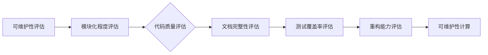

##### Python代码阐述

```python
import random

def calculate_modularization_score(modules, total_modules):
    correct_modules = sum(1 for module in modules if module['correct'])
    return correct_modules / total_modules

def calculate_code_quality_score(code_lines, errors):
    return (code_lines - errors) / code_lines

def calculate_documentation_score(documents, total_documents):
    complete_documents = sum(1 for document in documents if document['complete'])
    return complete_documents / total_documents

def calculate_test_coverage_score(test_cases, total_functions):
    executed_tests = sum(1 for test in test_cases if test['executed'])
    return executed_tests / total_functions

def calculate_restructuring_score(restructured_modules, total_modules):
    return restructured_modules / total_modules

def calculate_maintainability_score(modularization_score, code_quality_score, documentation_score, test_coverage_score, restructuring_score):
    return (0.4 * modularization_score + 0.3 * code_quality_score + 0.2 * documentation_score + 0.1 * test_coverage_score + 0.2 * restructuring_score)

# 测试可维护性算法
modules = [
    {'name': 'module1', 'correct': True},
    {'name': 'module2', 'correct': False},
    {'name': 'module3', 'correct': True}
]
total_modules = 3

code_lines = 1000
errors = 100
code_quality_score = calculate_code_quality_score(code_lines, errors)

documents = [
    {'name': 'document1', 'complete': True},
    {'name': 'document2', 'complete': False},
    {'name': 'document3', 'complete': True}
]
total_documents = 3
documentation_score = calculate_documentation_score(documents, total_documents)

test_cases = [
    {'name': 'test1', 'executed': True},
    {'name': 'test2', 'executed': False},
    {'name': 'test3', 'executed': True}
]
total_functions = 10
test_coverage_score = calculate_test_coverage_score(test_cases, total_functions)

restructured_modules = 2
restructuring_score = calculate_restructuring_score(restructured_modules, total_modules)

maintainability_score = calculate_maintainability_score(calculate_modularization_score(modules, total_modules), code_quality_score, documentation_score, test_coverage_score, restructuring_score)
print("可维护性得分：", maintainability_score)
```

##### 数学模型与公式讲解

可维护性常用的数学模型包括模块化程度模型、代码质量模型、文档完整性模型和测试覆盖率模型。

1. **模块化程度模型**：

$$
\text{模块化程度} = \frac{\text{正确模块数}}{\text{总模块数}}
$$

2. **代码质量模型**：

$$
\text{代码质量} = \frac{\text{无错误代码行数}}{\text{总代码行数}}
$$

3. **文档完整性模型**：

$$
\text{文档完整性} = \frac{\text{完整文档数}}{\text{总文档数}}
$$

4. **测试覆盖率模型**：

$$
\text{测试覆盖率} = \frac{\text{执行测试用例数}}{\text{总函数数}}
$$

##### 举例说明

假设一个系统有3个模块，其中2个模块正确实现，1个模块错误实现；代码总共有1000行，其中有100行存在错误；有3个文档，其中2个文档完整，1个文档不完整；有10个函数，其中8个函数有测试用例，2个函数没有测试用例。另外，有2个模块被重构。求该系统的模块化程度、代码质量、文档完整性、测试覆盖率和重构能力。

```python
# 计算模块化程度
modules = [
    {'name': 'module1', 'correct': True},
    {'name': 'module2', 'correct': False},
    {'name': 'module3', 'correct': True}
]
total_modules = 3
modularization_score = calculate_modularization_score(modules, total_modules)
print("模块化程度：", modularization_score)

# 计算代码质量
code_lines = 1000
errors = 100
code_quality_score = calculate_code_quality_score(code_lines, errors)
print("代码质量：", code_quality_score)

# 计算文档完整性
documents = [
    {'name': 'document1', 'complete': True},
    {'name': 'document2', 'complete': False},
    {'name': 'document3', 'complete': True}
]
total_documents = 3
documentation_score = calculate_documentation_score(documents, total_documents)
print("文档完整性：", documentation_score)

# 计算测试覆盖率
test_cases = [
    {'name': 'test1', 'executed': True},
    {'name': 'test2', 'executed': False},
    {'name': 'test3', 'executed': True}
]
total_functions = 10
test_coverage_score = calculate_test_coverage_score(test_cases, total_functions)
print("测试覆盖率：", test_coverage_score)

# 计算重构能力
restructured_modules = 2
restructuring_score = calculate_restructuring_score(restructured_modules, total_modules)
print("重构能力：", restructuring_score)
```

通过上述步骤，我们可以对系统的可维护性进行全面的评估和计算，从而采取相应的改进措施，提高系统的可维护性。

### 可靠性系统架构设计

在软件架构设计中，可靠性是一个至关重要的质量属性。一个高可靠性的系统不仅能够在正常运行期间保持稳定，还能够有效地应对各种故障和异常情况。本节将介绍可靠性系统架构设计的方法和步骤，包括系统功能设计、系统架构设计、系统接口设计以及系统交互设计，并通过实际案例进行分析。

#### 系统功能设计

系统功能设计是可靠性系统架构设计的第一步，它定义了系统需要实现的基本功能以及这些功能之间的关系。在可靠性系统架构设计中，功能设计需要特别关注以下几个方面：

1. **核心功能**：系统必须实现的核心功能，例如数据处理、存储管理、用户身份验证等。
2. **冗余功能**：为了保证系统的可靠性，可以设计冗余功能，例如备份数据处理、多重身份验证等。
3. **故障处理功能**：系统需要具备故障检测、故障隔离和故障恢复功能，确保在发生故障时能够快速响应并恢复。

以下是一个简单的可靠性系统功能设计示例（使用Mermaid类图表示）：

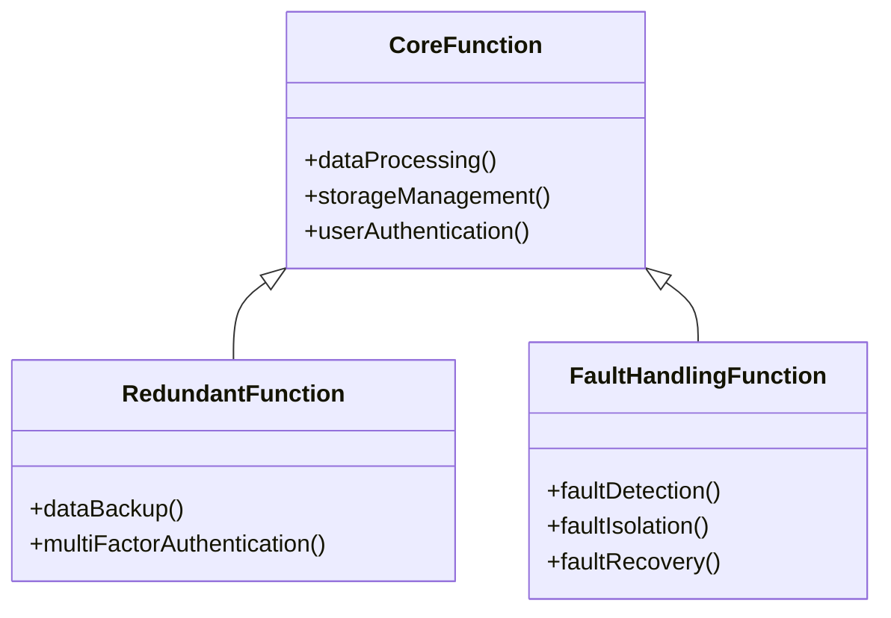

#### 系统架构设计

系统架构设计是可靠性系统设计的核心环节，它定义了系统的整体结构和组件之间的关系。在可靠性系统架构设计中，需要考虑以下几个方面：

1. **组件分离**：将系统的各个功能组件分离，确保每个组件能够独立运行和测试。
2. **冗余设计**：引入冗余组件，例如备份服务器、备用电源等，以应对可能的故障。
3. **容错机制**：设计容错机制，例如故障检测、自动切换和故障恢复，确保系统在故障发生时能够快速恢复。

以下是一个可靠性系统架构设计示例（使用Mermaid架构图表示）：

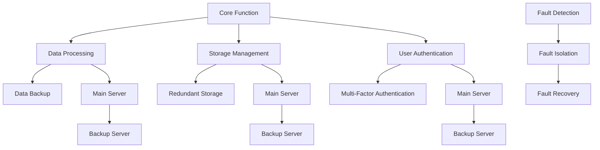

#### 系统接口设计

系统接口设计是可靠性系统架构设计的重要部分，它定义了系统内部各个组件之间的交互接口。在可靠性系统接口设计中，需要考虑以下几个方面：

1. **标准化接口**：设计标准化的接口，确保组件之间的交互清晰、稳定。
2. **错误处理机制**：在接口设计中加入错误处理机制，确保在接口通信失败时能够进行适当的处理。
3. **安全性**：设计安全的接口，防止未经授权的访问和数据泄露。

以下是一个可靠性系统接口设计示例（使用Mermaid序列图表示）：

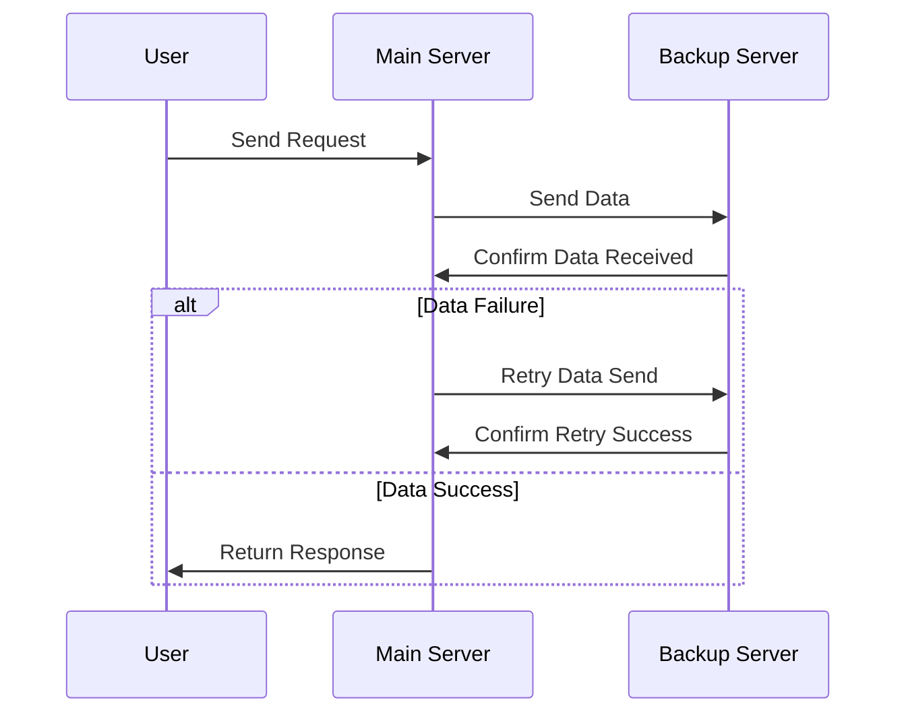

#### 系统交互设计

系统交互设计描述了系统在不同状态和情况下如何进行交互和协调工作。在可靠性系统交互设计中，需要考虑以下几个方面：

1. **故障检测**：系统如何检测故障，包括硬件故障、软件故障和网络故障。
2. **故障隔离**：系统如何隔离故障，确保故障不会影响到其他部分的正常运行。
3. **故障恢复**：系统如何在故障发生后进行恢复，包括故障转移和自动重启。

以下是一个可靠性系统交互设计示例（使用Mermaid序列图表示）：

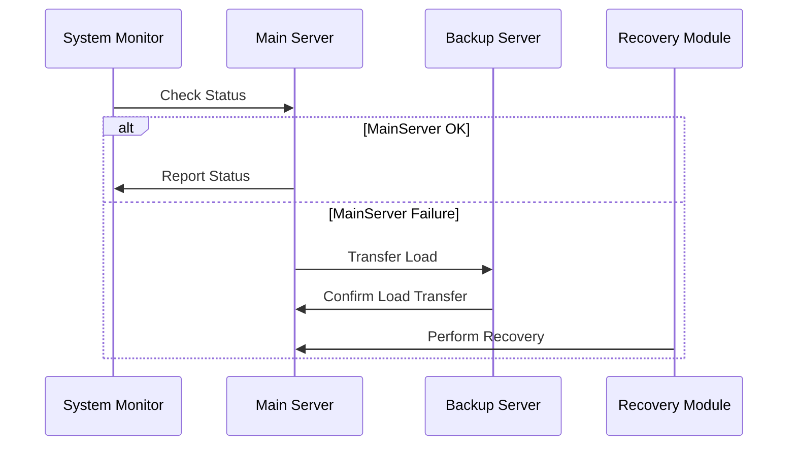

#### 实战案例解析

以下是一个实际的可靠性系统架构设计案例，我们将对其进行分析和讲解。

**案例背景**：一个大型电子商务平台需要在高并发、高负载的环境下保持高可靠性，确保用户体验和业务连续性。

**系统功能设计**：该平台的核心功能包括商品展示、订单处理、支付和用户管理。为了确保这些功能的可靠性，平台设计了冗余功能，例如数据备份、多重身份验证和故障恢复机制。

**系统架构设计**：平台采用了分布式架构，包括多个主服务器和备份服务器。主服务器负责处理用户请求，备份服务器在主服务器出现故障时接管负载。此外，平台还设计了故障检测、故障隔离和故障恢复模块，确保系统在发生故障时能够快速恢复。

**系统接口设计**：平台设计了标准化的接口，确保各个组件之间的交互清晰、稳定。接口设计中加入了错误处理机制和安全性措施，防止未经授权的访问和数据泄露。

**系统交互设计**：平台通过监控系统实时检测系统状态，包括硬件状态、软件状态和网络状态。当检测到故障时，系统会自动进行故障隔离和故障恢复，确保系统能够在故障发生后迅速恢复。

**最佳实践**：

1. **定期进行故障演练**：通过定期进行故障演练，检验系统的故障检测和恢复机制，确保系统能够在实际故障发生时迅速响应。
2. **持续优化系统架构**：根据系统的运行数据和用户反馈，持续优化系统架构，提高系统的可靠性和性能。
3. **加强团队协作**：可靠性系统架构设计需要跨部门协作，加强团队协作可以提高系统的整体可靠性。

通过上述案例分析和最佳实践，我们可以更好地理解可靠性系统架构设计的方法和步骤，从而在实际项目中实现高可靠性的系统。

### 可用性系统架构设计

在当今数字化时代，可用性成为软件系统架构设计中的一个关键质量属性。高可用性的系统可以在面对高并发、大规模数据处理以及突发流量时，保持稳定、高效的服务，从而提供良好的用户体验。本节将详细探讨可用性系统架构设计的方法和步骤，包括系统功能设计、系统架构设计、系统接口设计以及系统交互设计，并结合实际案例进行解析。

#### 系统功能设计

系统功能设计是可用性系统架构设计的起点，它需要确保系统能够实现所需的核心功能，并具备足够的灵活性以应对不同场景下的可用性需求。以下是可用性系统功能设计的关键步骤：

1. **核心功能定义**：明确系统需要实现的基本功能，如用户身份验证、数据存储、业务处理等。
2. **扩展功能设计**：为应对不同业务场景，设计可扩展的功能模块，如消息队列、缓存机制等。
3. **故障处理机制**：设计故障检测、故障隔离和故障恢复机制，确保系统在高负载或故障情况下仍能保持服务。

以下是一个简单的可用性系统功能设计示例（使用Mermaid类图表示）：

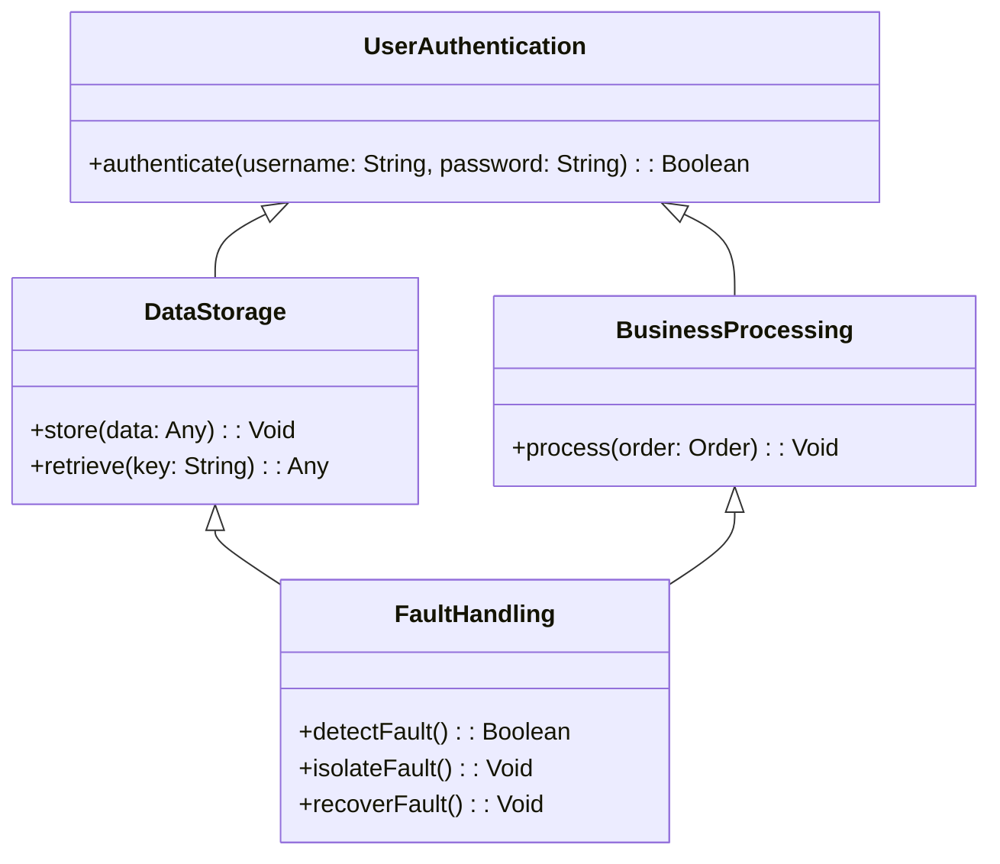

#### 系统架构设计

系统架构设计是提升系统可用性的关键步骤，它需要考虑系统的整体结构、组件的分布以及各组件之间的通信。以下是可用性系统架构设计的主要考虑因素：

1. **分布式架构**：通过分布式架构，将系统功能分散到多个节点上，提高系统的容错能力和负载均衡能力。
2. **冗余设计**：引入冗余组件和备份机制，确保在某个组件或节点故障时，系统仍能正常运行。
3. **负载均衡**：使用负载均衡器将用户请求分配到不同的节点，避免单点过载，提高系统的整体性能。

以下是一个简单的可用性系统架构设计示例（使用Mermaid架构图表示）：

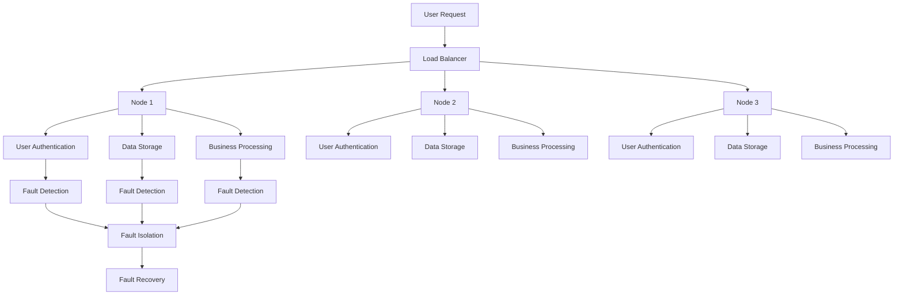

#### 系统接口设计

系统接口设计是确保系统各组件能够有效交互的重要环节。在可用性系统接口设计中，需要考虑以下因素：

1. **标准化接口**：设计标准化的接口，确保不同组件之间的数据交换格式一致。
2. **通信协议**：选择适合的通信协议，如HTTP/HTTPS、RESTful API等，确保数据传输的安全和高效。
3. **错误处理**：设计错误处理机制，确保在接口通信失败时系统能够进行适当的处理，例如重试、限流等。

以下是一个简单的可用性系统接口设计示例（使用Mermaid序列图表示）：

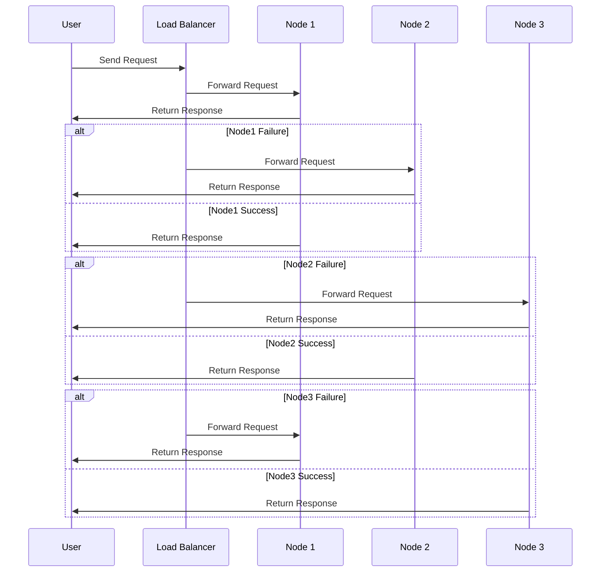

#### 系统交互设计

系统交互设计描述了系统在不同状态和情况下如何进行交互和协调工作，特别是在面对高并发和流量突发时。以下是可用性系统交互设计的关键要素：

1. **流量控制**：通过流量控制机制，如限流器和熔断器，确保系统不会因为流量激增而崩溃。
2. **故障转移**：在主节点故障时，系统自动将流量转移到备用节点，确保服务的连续性。
3. **负载均衡**：动态调整流量分配，确保系统资源利用率最大化，同时避免单点过载。

以下是一个简单的可用性系统交互设计示例（使用Mermaid序列图表示）：

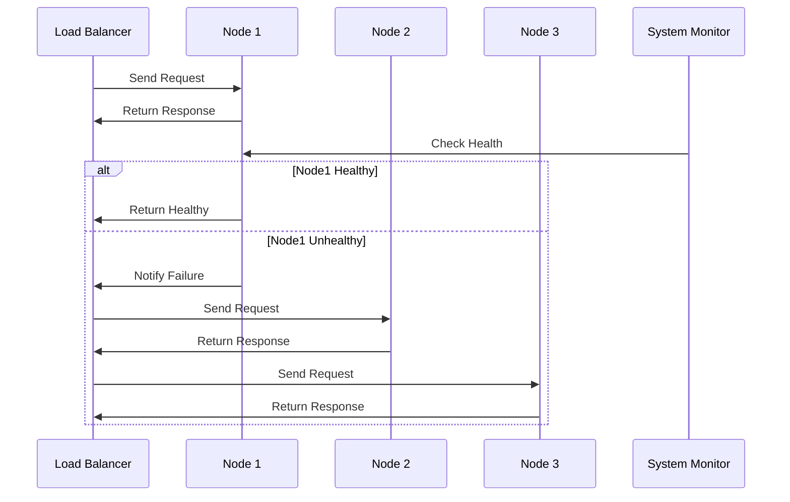

#### 实际案例解析

以下是一个实际的可用性系统架构设计案例，我们将对其进行分析和讲解。

**案例背景**：一个在线视频流媒体平台需要在高并发、大规模用户访问的情况下，保持视频播放的稳定和流畅。

**系统功能设计**：平台的核心功能包括用户注册、视频播放、视频存储和用户管理。为了提升可用性，平台设计了扩展功能，如缓存机制、负载均衡和故障恢复。

**系统架构设计**：平台采用了分布式架构，包括多个视频播放服务器、缓存服务器和负载均衡器。视频播放服务器负责处理用户的视频播放请求，缓存服务器用于缓存热门视频，减轻主服务器的负载，负载均衡器则负责动态分配用户请求。

**系统接口设计**：平台设计了标准化的API接口，用于用户注册、视频上传、视频播放和用户管理等操作。接口设计中加入了错误处理机制，确保在请求失败时系统能够进行重试或跳转到备用服务器。

**系统交互设计**：平台通过监控系统实时监控服务器的健康状态，并在检测到故障时自动进行故障转移。同时，使用负载均衡器动态分配用户请求，确保系统资源得到合理利用。

**最佳实践**：

1. **监控与告警**：定期监控系统状态，并设置告警机制，以便在出现问题时能及时响应。
2. **弹性扩展**：根据用户访问量动态扩展系统资源，确保在高并发情况下系统性能不受影响。
3. **数据备份**：定期备份重要数据，确保在数据丢失或损坏时能够快速恢复。

通过上述案例分析和最佳实践，我们可以更好地理解可用性系统架构设计的方法和步骤，从而在实际项目中实现高可用性的系统。

### 可维护性系统架构设计

在软件开发的长期过程中，可维护性是保证系统可持续发展的关键因素。一个高可维护性的系统不仅能够方便地进行功能扩展和优化，还能有效地降低维护成本。本节将详细探讨可维护性系统架构设计的方法和步骤，包括系统功能设计、系统架构设计、系统接口设计以及系统交互设计，并结合实际案例进行解析。

#### 系统功能设计

系统功能设计是可维护性系统架构设计的首要步骤，它需要确保系统功能清晰、模块化且易于维护。以下是可维护性系统功能设计的关键步骤：

1. **功能分解**：将复杂的功能分解为小的、独立的模块，每个模块实现一个具体的功能。
2. **职责明确**：确保每个模块有明确的职责和接口，避免功能重叠和耦合。
3. **可测试性**：设计可测试的模块，确保每个模块的功能可以通过单元测试进行验证。

以下是一个简单的可维护性系统功能设计示例（使用Mermaid类图表示）：

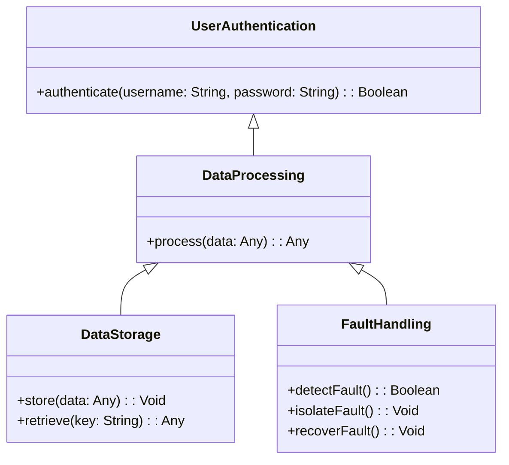

#### 系统架构设计

系统架构设计是提升系统可维护性的关键，它需要考虑系统的整体结构、模块之间的交互和扩展性。以下是可维护性系统架构设计的主要考虑因素：

1. **模块化架构**：采用模块化架构，将系统功能分解为多个独立的模块，每个模块具有明确的职责和接口。
2. **冗余设计**：适当引入冗余设计，以提高系统的容错能力和可维护性。
3. **可扩展性**：设计灵活的架构，以便在需求变化时能够方便地进行扩展和优化。

以下是一个简单的可维护性系统架构设计示例（使用Mermaid架构图表示）：

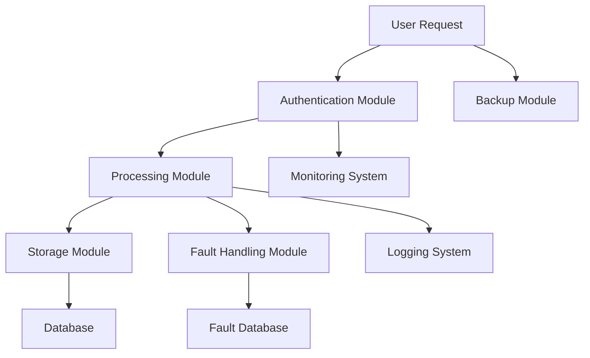

#### 系统接口设计

系统接口设计是确保系统各模块能够有效交互的重要环节。在可维护性系统接口设计中，需要考虑以下因素：

1. **标准化接口**：设计标准化的接口，确保不同模块之间的数据交换格式一致。
2. **接口文档**：编写详细的接口文档，方便开发人员理解和使用接口。
3. **错误处理**：设计错误处理机制，确保在接口通信失败时系统能够进行适当的处理，例如重试、限流等。

以下是一个简单的可维护性系统接口设计示例（使用Mermaid序列图表示）：

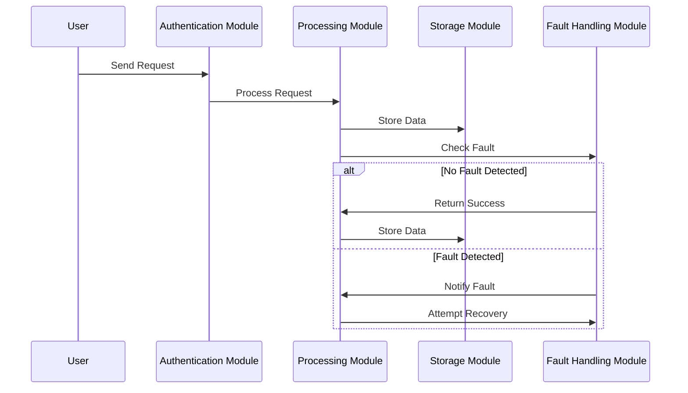

#### 系统交互设计

系统交互设计描述了系统在不同状态和情况下如何进行交互和协调工作，特别是在面对需求变更和技术更新时。以下是可维护性系统交互设计的关键要素：

1. **模块间通信**：确保模块之间的通信高效、可靠，避免因通信问题导致系统稳定性下降。
2. **故障检测与恢复**：设计故障检测和恢复机制，确保系统能够在故障发生时迅速响应并恢复。
3. **代码重构**：定期进行代码重构，优化系统结构，提高代码质量和可维护性。

以下是一个简单的可维护性系统交互设计示例（使用Mermaid序列图表示）：

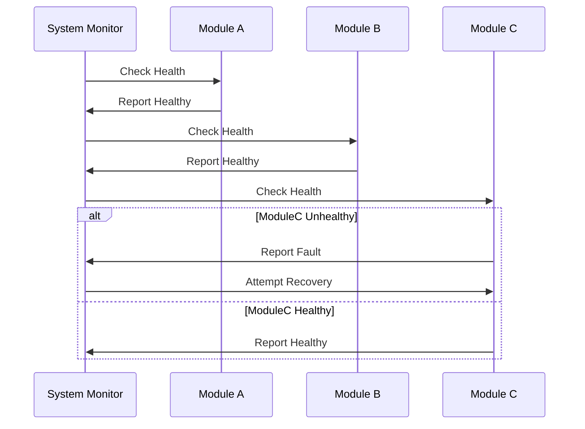

#### 实际案例解析

以下是一个实际的可维护性系统架构设计案例，我们将对其进行分析和讲解。

**案例背景**：一个金融服务平台需要在高并发、高可靠性和高可维护性的环境下运行，确保金融交易的稳定和安全。

**系统功能设计**：平台的核心功能包括用户身份验证、交易处理、资金管理和风险控制。为了提高可维护性，平台将这些功能分解为多个独立的模块，如用户认证模块、交易处理模块、资金管理模块和风险控制模块。

**系统架构设计**：平台采用了微服务架构，每个模块都作为独立的微服务运行。这些微服务通过API进行通信，确保系统的高可维护性和可扩展性。平台还设计了冗余组件和故障恢复机制，以提高系统的可靠性。

**系统接口设计**：平台设计了标准化的API接口，包括用户认证接口、交易处理接口、资金管理接口和风险控制接口。接口设计中加入了详细的文档和错误处理机制，确保不同模块之间的通信高效、可靠。

**系统交互设计**：平台通过监控系统实时监控各模块的健康状态，并在检测到故障时自动进行故障转移和恢复。此外，平台定期进行代码重构，优化系统结构和性能，提高代码质量和可维护性。

**最佳实践**：

1. **自动化测试**：实施自动化测试，确保每个模块的功能和性能都能通过测试验证，降低人为错误的风险。
2. **持续集成与部署**：使用持续集成和部署工具，确保代码变更能够快速、安全地部署到生产环境，提高开发效率和系统稳定性。
3. **文档管理**：建立完善的文档管理体系，确保系统的设计文档、接口文档和开发日志等都能及时更新和归档，便于后续维护和扩展。

通过上述案例分析和最佳实践，我们可以更好地理解可维护性系统架构设计的方法和步骤，从而在实际项目中实现高可维护性的系统。

### 总结与注意事项

本文系统地探讨了软件架构的三大关键质量属性——可靠性、可用性和可维护性。我们首先介绍了这些质量属性的定义、重要性以及基本原理，随后通过具体案例和算法讲解了如何设计和实现这些属性。以下是各质量属性的核心知识点总结：

#### 可靠性

- **定义**：系统在给定条件下，能够在指定时间内正确执行所需功能的概率。
- **重要性**：保证系统的稳定性和用户信任。
- **原理**：冗余设计、容错机制、故障预测与预防。
- **评估方法**：故障率评估、测试与仿真、可靠性分析。
- **算法讲解**：使用Mermaid流程图和Python代码阐述了可靠性评估算法。

#### 可用性

- **定义**：系统能够在用户需求的时间内和条件下，提供有效服务的能力。
- **重要性**：提升用户体验和业务连续性。
- **原理**：负载均衡、冗余设计、故障检测与自愈。
- **评估方法**：响应时间统计、吞吐量计算、故障恢复时间统计。
- **算法讲解**：使用Mermaid流程图和Python代码阐述了可用性评估算法。

#### 可维护性

- **定义**：系统在生命周期内被修改、扩展或优化时所需的工作量和难度。
- **重要性**：降低维护成本、提高开发效率、延长系统生命周期。
- **原理**：模块化设计、文档化、代码质量优化、测试覆盖、重构。
- **评估方法**：模块化程度评估、代码质量评估、文档完整性评估、测试覆盖率评估。
- **算法讲解**：使用Mermaid流程图和Python代码阐述了可维护性评估算法。

#### 注意事项

1. **可靠性设计**：在系统设计中，冗余设计是提高可靠性的关键。但需注意冗余设计会增加系统的复杂性和成本，因此需要在可靠性和成本之间进行权衡。
2. **可用性优化**：在优化可用性的过程中，应特别关注系统的负载均衡和故障恢复机制。过度依赖自动化故障恢复可能会导致系统在异常情况下表现不佳。
3. **可维护性提升**：模块化设计、代码质量和文档管理是提高可维护性的关键。然而，过度的模块化可能会导致系统的复杂性增加，因此需在模块化与可维护性之间找到平衡点。

#### 拓展阅读

- **可靠性设计**：《高可用架构：构建可靠分布式系统的最佳实践》
- **可用性优化**：《高性能网站架构：设计、优化和评估大型网站》
- **可维护性提升**：《代码大全：软件工程专家的经验与教训》

通过本文的探讨，希望读者能够对软件架构的质量属性有更深入的理解，并在实际项目中能够有效地应用这些原则和方法，从而构建出高质量、高可靠性的软件系统。

