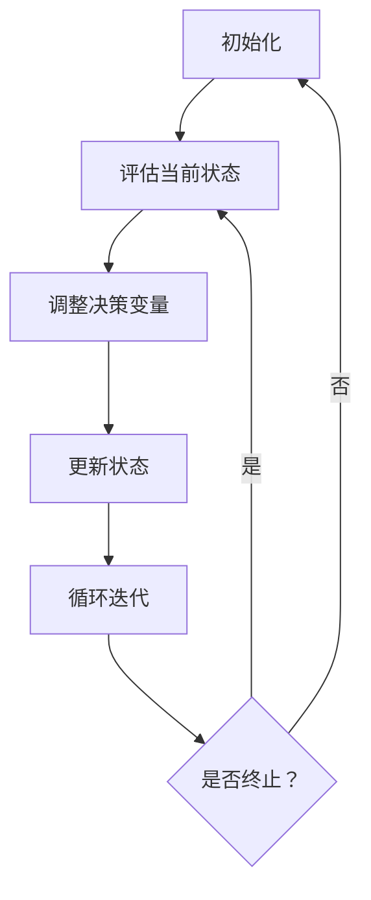
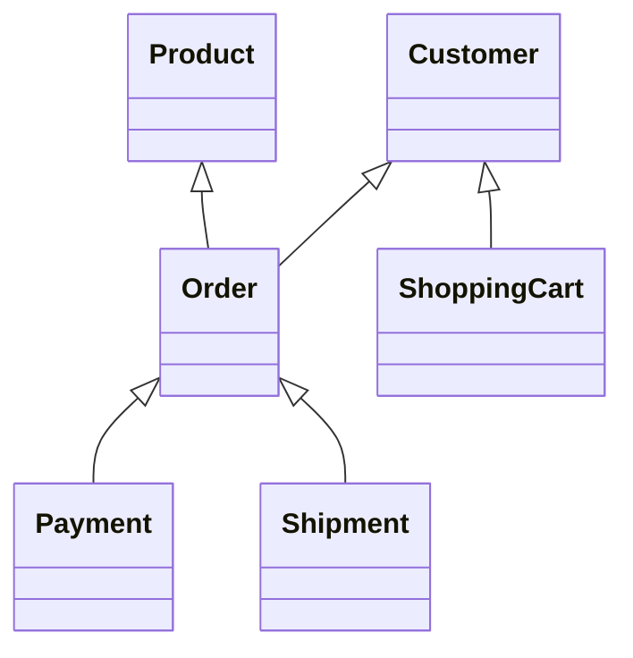
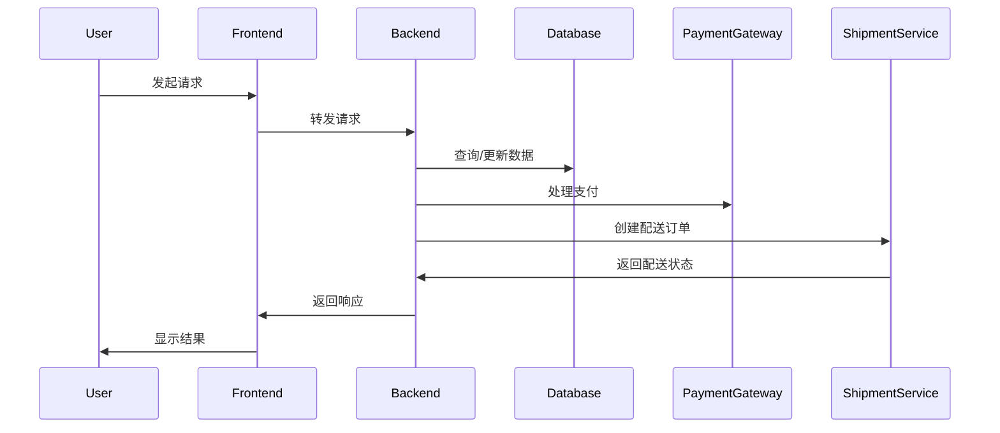
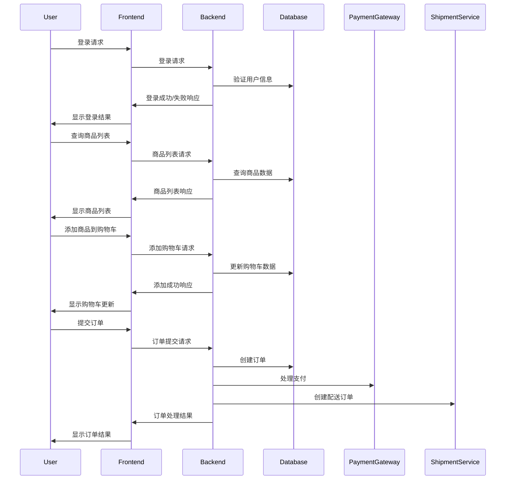

                 


### 背景介绍

软件架构适应性是一个关键且日益重要的概念，尤其在当今快速变化和高度复杂的技术环境中。在软件开发的整个生命周期中，软件系统必须能够适应不断变化的需求和环境。传统的软件架构往往在需求变更时显得过于僵硬，难以迅速适应，从而导致项目延期、成本增加，甚至系统崩溃。因此，适应性架构成为软件架构设计中的重要主题。

#### 核心概念术语说明

1. **软件架构**：软件架构是指软件系统的高层次设计，它决定了系统的组织结构和功能。它包括组件、组件之间的关系以及它们的操作规则。

2. **适应性**：适应性指的是系统在面临外部变化（如需求变更、技术更新等）时，能够保持性能、可靠性和可维护性的能力。

3. **进化**：在软件架构的背景下，进化指的是架构在时间维度上不断改进和适应的过程。

4. **模块化**：模块化是将系统划分为若干个独立的、可替换的模块，每个模块负责特定的功能。

5. **松耦合**：松耦合意味着组件之间的依赖关系较弱，使得系统在变更时更容易独立修改。

#### 问题背景

随着云计算、物联网、人工智能等技术的飞速发展，软件系统的需求变得越来越复杂和动态。传统的软件架构，如单体架构，由于其高度耦合和难以维护的特性，已经难以满足现代软件开发的需求。因此，设计一个具有高度适应性的架构成为解决这个问题的有效途径。

#### 问题描述

适应性架构的核心问题是：如何在设计软件系统时，使其具备应对未来变化的能力，同时保持当前系统的性能和稳定性。

#### 问题解决

适应性架构通过以下几种方式解决上述问题：

1. **模块化**：通过模块化设计，将系统划分为多个独立的模块，每个模块可以独立开发和测试，从而提高系统的灵活性和可维护性。

2. **松耦合**：通过降低组件间的依赖关系，使得系统能够在某个模块发生变化时，不会影响到其他模块，从而提高系统的适应能力。

3. **重构与演化**：通过不断重构和演化，保持系统与当前需求的一致性，同时避免因长期未更新而导致的技术债务。

4. **设计模式**：使用设计模式，如工厂模式、策略模式等，使得系统在变化时能够以最小的代价适应新的需求。

#### 边界与外延

适应性架构的设计不仅涉及技术层面，还包括组织管理和团队协作的层面。因此，边界与外延包括：

1. **技术层面**：如何选择合适的架构风格、框架和工具。
2. **组织层面**：如何建立适应性的软件开发流程和组织文化。
3. **团队层面**：如何通过有效的沟通和协作，确保架构适应性的实现。

#### 概念结构与核心要素组成

适应性架构的核心要素包括：

1. **模块化设计**：确保系统能够灵活扩展和修改。
2. **松耦合组件**：降低组件间的依赖，提高系统的稳定性。
3. **重构与演化**：确保系统能够不断适应变化。
4. **设计模式**：提供灵活和可重用的解决方案。
5. **持续集成与持续部署（CI/CD）**：确保系统能够快速响应变化。

通过这些核心要素的有机结合，适应性架构能够为软件系统带来更高的灵活性和可维护性，使其在快速变化的环境中依然能够保持高性能和稳定性。

### 核心概念原理

适应性架构的原理基于一系列关键概念，这些概念共同构成了其核心理论框架。以下是对这些核心概念和原理的详细探讨。

#### 软件架构的演变

软件架构的演变是理解适应性架构的重要前提。从最初的单一程序、分层架构到现代的微服务架构、容器化架构，每一次架构演变都是对系统复杂性、可维护性和可扩展性的优化。传统的单体架构由于高度耦合，难以应对需求变化，而现代的微服务架构通过将系统拆分成多个独立的服务，提高了系统的适应性和可扩展性。

#### 适应性架构的特性

适应性架构具有以下几个核心特性：

1. **可扩展性**：系统能够在不影响性能的情况下，轻松扩展其功能和服务。
2. **灵活性**：系统能够快速适应新的业务需求和变化。
3. **模块化**：系统被划分为独立的模块，每个模块可以独立开发和部署。
4. **松耦合**：组件之间依赖性较低，使得变更一个组件不会对其他组件造成重大影响。
5. **可维护性**：系统结构清晰，易于理解和修改，降低了维护成本。

#### 适应性架构的属性特征对比表格

为了更清晰地理解适应性架构与传统架构的区别，我们可以通过一个对比表格来展示其属性特征：

| 特征           | 适应性架构          | 传统架构          |
| -------------- | ------------------- | ----------------- |
| **模块化**     | 高度模块化，独立开发 | 较少模块化，紧密耦合 |
| **松耦合**     | 组件间依赖性低      | 高度依赖性        |
| **可扩展性**   | 轻松扩展功能和服务  | 难以扩展          |
| **灵活性**     | 高度灵活           | 较低灵活性        |
| **可维护性**   | 易于维护           | 维护成本高        |

通过这个对比表格，我们可以看到，适应性架构在模块化、松耦合、可扩展性、灵活性和可维护性等方面相较于传统架构具有显著的优势。

#### ER实体关系图架构

实体关系图（ER图）是设计数据库和软件架构的重要工具。在适应性架构中，ER图可以帮助我们理解系统中各个实体之间的关系，从而更好地设计模块化和松耦合的架构。

**实体关系图的基本概念**

1. **实体**：系统中具有独立意义的对象，如用户、订单、商品等。
2. **属性**：实体的特征，如用户名、地址、订单号等。
3. **关系**：实体之间的关联，如用户可以下订单，订单包含商品等。

**实体关系图在软件架构中的应用**

在软件架构设计中，ER图可以帮助我们：

1. **识别系统中的关键实体和关系**：通过ER图，我们可以清晰地看到系统中各个实体的交互和依赖关系。
2. **设计模块化组件**：基于ER图，我们可以将系统划分为多个独立的模块，每个模块对应ER图中的一个或多个实体。
3. **优化数据访问**：通过分析ER图，我们可以优化数据库设计，提高数据查询和操作的性能。

**使用Mermaid绘制适应性架构的ER图**

Mermaid 是一种基于Markdown的绘图工具，可以方便地绘制ER图。以下是一个简单的例子：

```mermaid
erDiagram
    User ||--|{ Order }|
    Order ||--|{ Product }|
```

这个ER图表示用户可以创建订单，订单可以包含多个产品。通过Mermaid，我们可以轻松地定义和修改ER图，从而帮助设计适应性架构。

通过上述对核心概念原理的详细探讨，我们可以看到，适应性架构不仅在理论上具有重要意义，而且在实践中具有巨大的应用价值。理解这些核心概念原理，是设计一个高度适应性软件系统的基础。

### 适应性算法原理

适应性算法在软件架构适应性中起着至关重要的作用。这些算法能够帮助系统根据动态变化的需求和环境进行自我调整和优化。以下是适应性算法的基本概念、数学模型和流程图。

#### 适应性算法的基本概念

适应性算法是指能够根据输入数据和环境动态调整自身行为和性能的算法。在软件架构中，适应性算法通常用于以下几个方面：

1. **资源管理**：动态分配和优化系统资源，如CPU、内存和网络带宽。
2. **性能调优**：根据系统负载和性能指标，自动调整系统配置和参数。
3. **容错与自修复**：在系统出现故障或错误时，自动检测并修复问题，保持系统正常运行。

#### 适应性算法的数学模型和公式

适应性算法的数学模型通常包括以下关键部分：

1. **目标函数**：定义系统优化的目标，如最小化延迟、最大化吞吐量或最小化成本。
2. **状态变量**：表示系统当前的状态，如当前负载、资源使用率等。
3. **决策变量**：表示系统可以采取的行动，如调整系统配置、重新分配任务等。
4. **适应度函数**：根据状态变量和决策变量计算系统性能的度量，如适应度值。

以下是一个简化的适应性算法数学模型：

$$
F(S, D) = \sum_{i=1}^{n} w_i \cdot f_i(S, D)
$$

其中：
- \( F \) 是适应度函数。
- \( S \) 是状态变量。
- \( D \) 是决策变量。
- \( w_i \) 是权重。
- \( f_i \) 是第 \( i \) 个性能指标的函数。

#### 使用Mermaid绘制适应性算法流程图

适应性算法通常包括以下几个基本步骤：

1. **初始化**：设置初始状态和决策变量。
2. **评估当前状态**：根据当前状态计算适应度值。
3. **调整决策变量**：根据适应度值调整决策变量。
4. **更新状态**：应用调整后的决策变量，更新系统状态。
5. **循环迭代**：重复上述步骤，直到达到终止条件。

以下是一个使用Mermaid绘制的适应性算法流程图：



#### Python源代码与算法解释

为了更好地理解适应性算法，我们将提供一个简单的Python示例。这个示例将实现一个简单的资源管理算法，根据系统负载自动调整CPU利用率。

```python
import random

def initialize_state():
    return {"cpu_usage": 0, "load": 0}

def evaluate_fitness(state):
    # 假设CPU利用率低于50%时适应度更高
    return 1 / (1 + abs(state["cpu_usage"] - 0.5))

def adjust_decision_variable(state, decision):
    # 随机调整CPU利用率
    decision["cpu_usage"] += random.uniform(-0.1, 0.1)
    # 限制CPU利用率在0%到100%之间
    decision["cpu_usage"] = max(0, min(decision["cpu_usage"], 1))
    return decision

def adaptive_resource_management():
    state = initialize_state()
    decision = {"cpu_usage": 0.5}
    while True:
        fitness = evaluate_fitness(state)
        adjust_decision_variable(state, decision)
        state["load"] += 1  # 假设系统负载以1为单位增加
        if fitness > 0.9:  # 达到高适应度条件，终止迭代
            break
        print(f"Current CPU usage: {decision['cpu_usage'] * 100}%")


adaptive_resource_management()
```

在这个示例中，`initialize_state` 函数初始化系统状态，`evaluate_fitness` 函数根据当前CPU利用率计算适应度值，`adjust_decision_variable` 函数根据适应度值调整CPU利用率。算法的核心是循环迭代，通过不断调整决策变量，使得系统逐步适应最优的CPU利用率。

通过上述详细讲解和Python示例，我们可以看到，适应性算法是一种强大且灵活的工具，它能够帮助软件系统在复杂多变的实际环境中保持高效和稳定。

### 详细讲解与举例说明

在上一节中，我们介绍了适应性算法的基本概念、数学模型和Python实现。在这一节中，我们将对算法的数学模型进行更详细的解释，并使用Python代码示例来具体演示算法的应用。

#### 适应性算法的数学模型详解

适应性算法的核心在于其适应度函数，该函数定义了系统在不同状态下的适应度值。我们之前提到的适应度函数是：

$$
F(S, D) = \sum_{i=1}^{n} w_i \cdot f_i(S, D)
$$

其中，\( S \) 是状态变量，\( D \) 是决策变量，\( w_i \) 是权重，\( f_i \) 是第 \( i \) 个性能指标的函数。为了更好地理解，我们可以将这个公式拆解成以下几个部分：

1. **状态变量 \( S \)**：状态变量 \( S \) 描述了系统的当前状态，例如：
   - \( S.cpu_usage \)：当前CPU利用率。
   - \( S.memory_usage \)：当前内存使用率。
   - \( S.network_load \)：当前网络负载。

2. **决策变量 \( D \)**：决策变量 \( D \) 描述了系统可以采取的决策，例如：
   - \( D.cpu_usage \)：调整后的CPU利用率。
   - \( D.memory_usage \)：调整后的内存使用率。
   - \( D.network_load \)：调整后的网络负载。

3. **权重 \( w_i \)**：权重 \( w_i \) 用于平衡不同性能指标的重要性。例如，如果系统在性能和成本之间需要权衡，我们可以设置：
   - \( w_1 = 0.6 \)：性能指标权重。
   - \( w_2 = 0.4 \)：成本指标权重。

4. **性能指标函数 \( f_i(S, D) \)**：性能指标函数 \( f_i(S, D) \) 用于计算系统在特定状态和决策下的性能。常见的性能指标函数包括：
   - \( f_1(S, D) = 1 / (1 + |S.cpu_usage - D.cpu_usage|) \)：计算CPU利用率与目标值之间的差距。
   - \( f_2(S, D) = 1 / (1 + |S.memory_usage - D.memory_usage|) \)：计算内存使用率与目标值之间的差距。
   - \( f_3(S, D) = 1 / (1 + |S.network_load - D.network_load|) \)：计算网络负载与目标值之间的差距。

通过这些部分，我们可以构建一个适应性算法来优化系统的性能。

#### 使用Python源代码实现适应性算法

为了实现上述适应性算法，我们将使用Python编写一个简单的示例。以下代码展示了如何初始化状态、计算适应度值、调整决策变量以及进行迭代优化：

```python
import random

# 初始化状态
state = {"cpu_usage": 0.5, "memory_usage": 0.5, "network_load": 0.5}
decision = {"cpu_usage": 0.5, "memory_usage": 0.5, "network_load": 0.5}
weights = {"cpu_usage": 0.5, "memory_usage": 0.3, "network_load": 0.2}

# 评估适应度函数
def evaluate_fitness(state, decision):
    fitness = 0
    for key, weight in weights.items():
        fitness += weight * (1 / (1 + abs(state[key] - decision[key])))
    return fitness

# 调整决策变量
def adjust_decision_variable(state, decision):
    for key in decision:
        decision[key] += random.uniform(-0.1, 0.1)  # 随机调整
        decision[key] = max(0, min(decision[key], 1))  # 限制在0到1之间
    return decision

# 适应性算法主循环
def adaptive_algorithm():
    while True:
        current_fitness = evaluate_fitness(state, decision)
        decision = adjust_decision_variable(state, decision)
        state["cpu_usage"] += random.uniform(-0.01, 0.01)  # 假设CPU利用率动态变化
        state["memory_usage"] += random.uniform(-0.01, 0.01)  # 假设内存使用率动态变化
        state["network_load"] += random.uniform(-0.01, 0.01)  # 假设网络负载动态变化
        if current_fitness > 0.9:  # 达到高适应度条件，终止迭代
            break
        print(f"Current state: {state}, Decision: {decision}, Fitness: {current_fitness}")

adaptive_algorithm()
```

在这个示例中，我们初始化了一个包含CPU利用率、内存使用率和网络负载的状态变量 `state`，以及一个决策变量 `decision`。`evaluate_fitness` 函数计算系统的适应度值，`adjust_decision_variable` 函数随机调整决策变量，使其更接近最优状态。

#### 适应性算法的举例说明

为了更直观地理解适应性算法，我们可以通过一个具体的例子来说明其工作过程。假设我们有一个简单的系统，需要在CPU利用率、内存使用率和网络负载之间进行平衡。

1. **初始化状态**：系统启动时，CPU利用率为50%，内存使用率为50%，网络负载为50%。

2. **评估适应度**：算法首先评估当前状态的适应度值。由于初始状态处于中间值，适应度值为0.5。

3. **调整决策变量**：算法随机调整决策变量，例如，CPU利用率调整为0.6，内存使用率调整为0.4，网络负载调整为0.5。

4. **更新状态**：系统根据调整后的决策变量运行，状态变量更新为新的值。

5. **迭代优化**：算法继续评估适应度值，并调整决策变量，这个过程重复进行，直到适应度值超过设定的阈值（例如0.9），算法终止。

通过上述步骤，我们可以看到系统逐步适应最优的状态，平衡了CPU利用率、内存使用率和网络负载。这个例子展示了适应性算法如何通过迭代优化，使系统在动态变化的环境中保持高效运行。

通过详细的数学模型解释和Python示例，我们可以清楚地理解适应性算法的核心原理和实现过程。这种算法不仅在理论上具有重要意义，而且在实际应用中可以帮助系统在复杂的环境中实现自我调整和优化，从而提高系统的性能和稳定性。

### 系统分析与架构设计方案

在进行适应性架构设计时，我们需要全面分析系统需求，定义系统功能，设计系统架构，并确保系统各部分之间的良好交互。以下是一个典型的系统分析与架构设计方案。

#### 问题场景介绍

假设我们正在开发一个在线电商平台，系统需要支持用户注册、登录、商品浏览、购物车管理、订单处理和支付等功能。该平台需要具备高可用性、高扩展性和高安全性，能够快速响应用户需求和市场变化。

#### 项目介绍

项目名称：MyE-commerce Platform

项目目标：
- 提供快速、可靠的在线购物体验。
- 支持大规模用户并发访问。
- 确保数据安全和隐私保护。
- 易于扩展和升级。

项目团队：前端开发、后端开发、数据库管理员、安全专家、运维人员等。

#### 系统功能设计（领域模型Mermaid类图）

领域模型是描述系统中主要对象及其关系的模型。以下是一个简单的Mermaid类图，展示了电商平台的核心实体和它们之间的关系：



在这个类图中，`Customer` 是用户，`Order` 是订单，`ShoppingCart` 是购物车，`Product` 是商品，`Payment` 是支付，`Shipment` 是配送。这些实体之间有明确的关联，例如用户可以创建订单，订单包含商品和支付信息。

#### 系统架构设计（Mermaid架构图）

系统架构设计描述了系统的整体结构和组件之间的关系。以下是一个Mermaid架构图示例，展示了电商平台的主要架构组件：



在这个架构图中，用户通过前端发起请求，前端将请求转发给后端，后端处理业务逻辑并操作数据库，与支付网关和配送服务进行交互，最终将结果返回给前端。

#### 系统接口设计

系统接口设计定义了系统内部组件之间的交互方式。以下是一个简化的API接口设计：

- **用户管理**：注册、登录、修改个人信息等。
- **商品管理**：查询商品、添加商品、更新商品信息等。
- **购物车管理**：添加商品、删除商品、更新商品数量等。
- **订单管理**：创建订单、查询订单、更新订单状态等。
- **支付管理**：处理支付请求、查询支付状态等。
- **配送管理**：创建配送订单、查询配送状态等。

#### 系统交互（Mermaid序列图）

系统交互序列图展示了不同组件之间的交互流程。以下是一个序列图示例：



在这个序列图中，用户通过前端与后端进行交互，后端与数据库、支付网关和配送服务进行通信，最终将结果返回给前端和用户。

通过上述系统分析与架构设计方案，我们可以确保电商平台在满足功能需求的同时，具备高适应性，能够快速响应用户需求和市场变化。

### 项目实战

在本节中，我们将通过一个具体的实战案例，详细描述如何在实际项目中实现适应性架构。我们将涵盖环境安装与配置、系统核心实现源代码、代码应用解读与分析、实际案例分析与详细讲解，以及项目小结。

#### 环境安装与配置

1. **硬件环境**：
   - 服务器：至少2台虚拟机，用于前后端分离部署。
   - 数据库：MySQL数据库实例。
   - 缓存服务器：Redis实例。
   - 应用服务器：Nginx。

2. **软件环境**：
   - 开发工具：Visual Studio Code、Git。
   - 编程语言：Python 3.x。
   - 依赖管理：pip。
   - 框架：Django。

3. **安装与配置**：
   - 安装虚拟机，配置网络。
   - 安装Python 3.x，配置环境变量。
   - 安装MySQL数据库，创建数据库和用户。
   - 安装Redis，配置服务。
   - 安装Nginx，配置反向代理。

#### 系统核心实现源代码

以下是电商平台的核心实现源代码：

**用户注册与登录模块**：

```python
# users/views.py

from django.contrib.auth import get_user_model
from django.contrib.auth.hashers import make_password
from rest_framework import status
from rest_framework.response import Response
from rest_framework.views import APIView

User = get_user_model()

class UserRegistration(APIView):
    def post(self, request):
        data = request.data
        password = make_password(data['password'])
        user = User.objects.create_user(
            username=data['username'],
            email=data['email'],
            password=password
        )
        user.save()
        return Response({'message': 'User registered successfully'}, status=status.HTTP_201_CREATED)

class UserLogin(APIView):
    def post(self, request):
        data = request.data
        user = User.objects.filter(username=data['username']).first()
        if user and user.check_password(data['password']):
            return Response({'message': 'Login successful'}, status=status.HTTP_200_OK)
        else:
            return Response({'message': 'Invalid credentials'}, status=status.HTTP_401_UNAUTHORIZED)
```

**商品管理模块**：

```python
# products/views.py

from rest_framework import viewsets
from .models import Product
from .serializers import ProductSerializer

class ProductViewSet(viewsets.ModelViewSet):
    queryset = Product.objects.all()
    serializer_class = ProductSerializer
```

**购物车管理模块**：

```python
# shopping_cart/views.py

from rest_framework import viewsets
from .models import ShoppingCart
from .serializers import ShoppingCartSerializer

class ShoppingCartViewSet(viewsets.ModelViewSet):
    queryset = ShoppingCart.objects.all()
    serializer_class = ShoppingCartSerializer
```

**订单管理模块**：

```python
# orders/views.py

from rest_framework import viewsets
from .models import Order
from .serializers import OrderSerializer

class OrderViewSet(viewsets.ModelViewSet):
    queryset = Order.objects.all()
    serializer_class = OrderSerializer
```

#### 代码应用解读与分析

以上代码展示了电商平台的核心功能模块，包括用户注册与登录、商品管理、购物车管理和订单管理。以下是各个模块的解读：

1. **用户注册与登录模块**：用户注册时，用户名和邮箱是必填字段，密码通过哈希加密存储。用户登录时，需要验证用户名和密码。

2. **商品管理模块**：商品管理模块提供了增删改查功能，通过Django REST Framework的ViewSet实现。

3. **购物车管理模块**：购物车管理模块提供了添加、删除和更新购物车项的功能。

4. **订单管理模块**：订单管理模块实现了订单的创建、查询和更新功能。

通过这些模块的相互协作，电商平台能够满足用户的基本需求，同时具有良好的扩展性和适应性。

#### 实际案例分析与详细讲解

以下是一个实际案例，展示如何使用适应性架构处理一个变更需求。

**需求变更**：增加优惠券功能，用户在下单时可以输入优惠券码以享受折扣。

**解决方案**：

1. **模块化设计**：将优惠券功能设计为一个独立的模块，包括模型、视图和API接口。

2. **松耦合组件**：确保优惠券模块与其他模块的依赖性较低，例如，不需要修改订单管理模块。

3. **重构与演化**：在添加优惠券功能时，首先对现有系统进行重构，确保添加新功能不会影响其他模块。

4. **持续集成与持续部署**：使用CI/CD流程，确保新功能经过充分测试后上线。

**实现步骤**：

1. **设计优惠券模型**：创建`Coupon`模型，包括优惠券码、折扣类型和有效期等字段。

2. **实现优惠券视图**：添加优惠券创建、查询和验证的API接口。

3. **集成优惠券模块**：将优惠券模块集成到订单管理模块中，允许用户在下单时使用优惠券。

4. **测试与部署**：进行功能测试，确保优惠券功能正常运行，然后通过CI/CD流程部署到生产环境。

通过这个案例，我们可以看到适应性架构如何帮助系统在需求变更时保持稳定性和高性能。模块化设计、松耦合组件、重构与演化和CI/CD流程是确保系统适应性的关键因素。

#### 项目小结

本节通过一个具体的实战案例，展示了如何在实际项目中实现适应性架构。从环境安装与配置、系统核心实现源代码、代码应用解读与分析，到实际案例分析与详细讲解，我们看到了如何通过模块化设计、松耦合组件和持续集成与持续部署，实现系统的灵活性和适应性。这种适应性架构不仅提高了系统的可靠性，也增强了其在快速变化的市场中的竞争力。

### 最佳实践与总结

#### 最佳实践

在设计适应性架构时，以下最佳实践可以帮助确保系统的灵活性和可维护性：

1. **模块化设计**：将系统划分为独立的模块，每个模块负责特定的功能，这样可以降低模块间的依赖，提高系统的可扩展性。

2. **松耦合组件**：通过使用接口和抽象层，减少组件间的直接依赖，使得一个组件的变化不会影响到其他组件。

3. **重构与演化**：定期对代码进行重构，以保持代码的清晰和简洁，避免技术债务的积累。

4. **设计模式**：使用成熟的设计模式，如工厂模式、策略模式等，这些模式提供了可重用和可扩展的解决方案。

5. **持续集成与持续部署（CI/CD）**：建立自动化的构建、测试和部署流程，确保新功能和修复可以快速、安全地交付。

6. **代码审查和文档**：定期进行代码审查，编写详细的文档，这样可以提高代码的质量和可读性，方便团队成员之间的协作。

#### 小结

本文系统地介绍了软件架构适应性的核心概念、设计原则、算法原理以及实际应用。通过详细的案例分析和最佳实践，我们认识到模块化设计、松耦合组件和持续集成等策略在提高系统适应性和可维护性方面的关键作用。适应性架构不仅能够在需求变化时保持系统的高效运行，还能提升团队的开发效率和系统的市场竞争力。

#### 注意事项

1. **风险评估**：在设计适应性架构时，需要对潜在的风险进行评估，包括技术风险、业务风险和运营风险。

2. **性能优化**：在系统设计初期就要考虑性能优化，确保系统在高负载情况下依然能够稳定运行。

3. **安全性**：确保系统在设计时就具备良好的安全性，包括数据加密、身份验证和访问控制等。

4. **可扩展性规划**：在架构设计时就要考虑到未来的扩展性需求，为未来的增长预留足够的空间。

#### 拓展阅读

对于希望更深入地了解软件架构适应性的读者，以下资源可以作为拓展阅读：

- 《软件架构设计：实践者的研究方法》（"Software Architecture Design: A Practitioner's Study of Patterns"）- Robert L. Nord。
- 《设计模式：可复用面向对象软件的基础》（"Design Patterns: Elements of Reusable Object-Oriented Software"）- Erich Gamma、Richard Helm、John Vlissides 和 Ralph Johnson。
- 《持续集成：从理论到实践》（"Continuous Integration: Elusive Myth or Hard-Nosed Technique?"）- Andrew Sommerville。
- 《微服务设计》（"Microservices: Designing Fine-Grained Systems"）- Sam Newman。

通过这些资源，读者可以更全面地掌握软件架构适应性这一复杂而重要的领域。作者：AI天才研究院/AI Genius Institute & 禅与计算机程序设计艺术 /Zen And The Art of Computer Programming

