                 

### 文章标题

# 软件架构风格比较：MVC、MVVM、Clean Architecture等

### 关键词

- 软件架构风格
- MVC
- MVVM
- Clean Architecture
- 比较分析
- 应用场景

### 摘要

本文将深入探讨几种常见的软件架构风格：MVC（模型-视图-控制器）、MVVM（模型-视图-视图模型）和Clean Architecture。我们将从背景介绍开始，逐一定义这些核心概念，并使用表格和ER图展示它们之间的联系。接着，我们将详细讲解每种架构风格的原理、特点、优缺点和应用场景，并通过算法原理、数学模型、系统分析与架构设计以及实际项目案例，帮助读者更好地理解和应用这些架构风格。最后，我们将总结最佳实践，并对全文进行小结，帮助读者形成全面的理解和深刻的认识。本文旨在为广大软件开发者和架构师提供一套系统、全面的架构风格比较指南。

## 第一部分：软件架构风格概述

### 第1章：软件架构风格的重要性

软件架构风格是软件开发中的重要组成部分，它决定了软件系统的组织结构和功能分布。随着软件复杂度的不断增加，选择合适的架构风格对于确保软件的质量、可维护性和扩展性至关重要。本章节将首先介绍软件架构风格的概念，然后讨论其作用和发展历程。

#### 1.1 软件架构风格的概念

软件架构风格是指一种组织软件系统的原则和模式，它定义了系统中不同组件之间的关系和交互方式。常见的架构风格包括MVC、MVVM和Clean Architecture等。

#### 1.2 软件架构风格的作用

软件架构风格在软件开发中具有以下重要作用：

1. **提高可维护性**：通过明确的组件划分和责任分离，架构风格有助于降低系统的复杂性，使得代码更加模块化和可维护。
2. **提升可扩展性**：架构风格提供了灵活的扩展机制，使得系统能够轻松适应未来的需求变化。
3. **确保质量**：合理的架构风格有助于发现和修复潜在的问题，提高软件的可靠性和性能。
4. **促进团队协作**：架构风格为团队成员提供了共同的工作语言和框架，有助于提高团队协作效率。

#### 1.3 软件架构风格的发展历程

软件架构风格的发展历程可以追溯到20世纪80年代。当时，为了解决软件复杂性的问题，人们开始研究各种架构模式，如MVC、MVVM和Clean Architecture等。这些架构风格的出现，不仅为软件开发提供了新的思路和方法，也推动了软件工程领域的不断发展。

### 第2章：核心概念与联系

在软件开发中，理解不同架构风格的核心概念及其联系是非常重要的。本章节将介绍MVC、MVVM和Clean Architecture这三个核心概念，并使用表格和ER图展示它们之间的联系。

#### 2.1 MVC

MVC（模型-视图-控制器）是最早的软件架构风格之一，它将应用程序分为三个主要组件：模型、视图和控制器。

- **模型**：负责处理应用程序的数据逻辑，包括数据存储、检索和业务规则。
- **视图**：负责展示数据给用户，通常使用用户界面实现。
- **控制器**：负责处理用户的输入，并将输入转换为模型状态的变化。

#### 2.2 MVVM

MVVM（模型-视图-视图模型）是MVC的变体，它在MVC的基础上增加了视图模型这一层。

- **模型**：与MVC相同，负责处理应用程序的数据逻辑。
- **视图**：负责展示数据给用户，与MVC的视图相同。
- **视图模型**：负责将模型的数据转换成视图需要展示的内容，同时也负责将用户的输入转换为模型的状态变化。

#### 2.3 Clean Architecture

Clean Architecture是一种更加抽象和通用的软件架构风格，它强调分层设计和组件解耦。

- **基础设施层**：提供底层服务，如数据库访问、网络通信等。
- **领域层**：包含业务逻辑和领域模型。
- **界面层**：负责处理用户界面和输入。

#### 2.4 核心概念与联系

以下是MVC、MVVM和Clean Architecture的核心概念和它们之间的联系：

| 架构风格 | 核心组件 | 联系 |
| :--- | :--- | :--- |
| MVC | 模型、视图、控制器 | MVC是MVVM的基础，MVVM在MVC的基础上增加了视图模型。 |
| MVVM | 模型、视图、视图模型 | MVVM是对MVC的扩展，视图模型负责数据绑定和用户输入处理。 |
| Clean Architecture | 基础设施层、领域层、界面层 | Clean Architecture是更高级的架构风格，它提供了分层设计和组件解耦的方法。 |

通过上述介绍，我们可以对MVC、MVVM和Clean Architecture有一个基本的了解。接下来，我们将分别详细讲解每种架构风格，帮助读者深入理解它们。

### 第3章：MVC风格详细讲解

MVC（模型-视图-控制器）是一种广泛使用的软件架构风格，它将应用程序分为三个主要组件：模型、视图和控制器。本章节将详细讲解MVC的工作原理、特点、优缺点和应用场景，并通过算法原理、数学模型和系统分析与架构设计，帮助读者更好地理解和应用MVC。

#### 3.1 MVC的原理与特点

MVC的工作原理可以概括为：模型负责处理数据逻辑，视图负责展示数据，控制器负责处理用户输入并协调模型和视图之间的交互。

- **模型（Model）**：模型是应用程序的核心，它负责处理应用程序的数据逻辑。模型通常包含业务逻辑和数据存储，如数据库访问和数据更新。模型不直接与用户界面交互，而是通过控制器接收和处理用户请求。
- **视图（View）**：视图负责展示数据给用户，通常使用用户界面实现。视图通过数据绑定与模型保持同步，确保用户界面实时反映模型的状态变化。
- **控制器（Controller）**：控制器负责处理用户的输入，并将输入转换为模型状态的变化。控制器接收用户请求，调用相应的模型处理数据，然后将结果传递给视图进行展示。控制器是模型和视图之间的桥梁。

MVC的特点包括：

1. **职责分离**：MVC通过将应用程序划分为模型、视图和控制器，实现了职责分离，使得每个组件都专注于自己的任务，提高了代码的可维护性和可扩展性。
2. **模块化**：MVC的模块化设计使得应用程序的组件可以独立开发和测试，降低了组件之间的耦合度。
3. **灵活性**：MVC提供了灵活的扩展机制，使得系统能够轻松适应未来的需求变化。

#### 3.2 MVC的算法原理

MVC的算法原理相对简单，主要涉及数据绑定和状态管理。以下是一个简单的mermaid流程图，展示了MVC的基本工作流程：

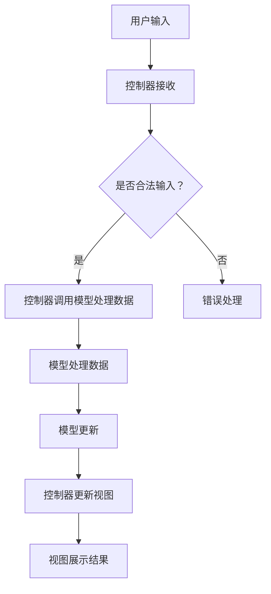

在上述流程图中，用户输入通过控制器接收，控制器会判断输入是否合法。如果输入合法，控制器会调用模型处理数据，然后模型更新视图。如果输入不合法，控制器会进行错误处理。

以下是一个简单的Python代码示例，展示了MVC的基本实现：

```python
# 模型
class Model:
    def process_data(self, data):
        # 数据处理逻辑
        return data

# 视图
class View:
    def display_result(self, result):
        print("结果：", result)

# 控制器
class Controller:
    def __init__(self, model, view):
        self.model = model
        self.view = view

    def handle_input(self, input_data):
        result = self.model.process_data(input_data)
        self.view.display_result(result)
```

在上面的代码示例中，模型处理输入数据，视图负责展示结果，控制器协调模型和视图之间的交互。

#### 3.3 MVC的数学模型与公式

MVC的数学模型相对简单，主要涉及状态转移和事件处理。以下是一个简单的数学模型：

$$
状态 = 初始状态 + 事件 \times 模型处理函数
$$

其中，状态表示系统的当前状态，事件表示用户的输入或系统的事件，模型处理函数定义了如何根据事件更新状态。

以下是一个简单的例子：

- **初始状态**：用户界面为空。
- **事件**：用户输入数据。
- **模型处理函数**：将用户输入的数据存储在模型中。

根据上述模型，状态可以表示为：

$$
状态 = 初始状态 + 输入数据 \times 存储函数
$$

其中，存储函数定义了如何将数据存储在模型中。

#### 3.4 MVC的系统分析与架构设计

MVC的系统分析与架构设计主要包括领域模型设计、系统架构设计和系统接口设计。以下是一个简单的MVC系统架构设计示例：

##### 3.4.1 MVC的系统功能设计（领域模型mermaid类图）

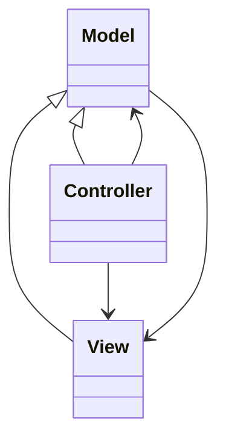

在上面的类图中，模型、视图和控制器之间存在明显的依赖关系。模型负责处理数据逻辑，视图负责展示数据，控制器负责处理用户输入并协调模型和视图之间的交互。

##### 3.4.2 MVC的系统架构设计（mermaid架构图）

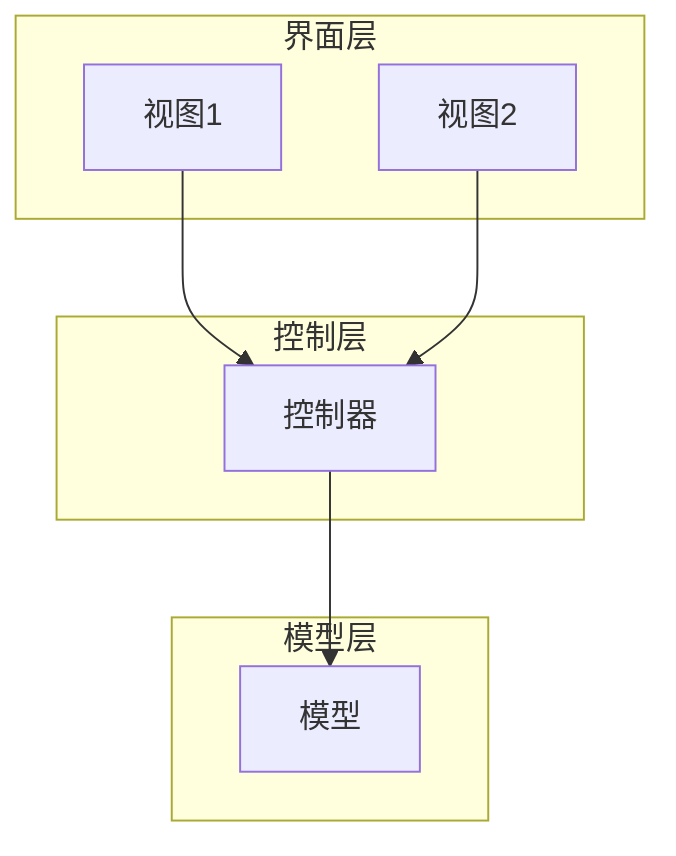

在上面的架构图中，界面层包含多个视图，控制层包含一个控制器，模型层包含一个模型。视图通过控制器与模型进行交互，控制器负责处理用户输入并协调模型和视图之间的交互。

##### 3.4.3 MVC的系统接口设计（mermaid序列图）

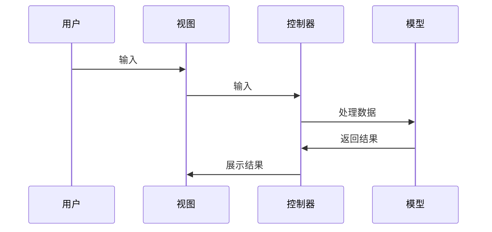

在上面的序列图中，用户通过视图输入数据，视图将输入传递给控制器，控制器调用模型处理数据，然后将结果传递给视图进行展示。

#### 3.5 MVC的应用场景

MVC在多种应用场景中都有广泛的应用，以下是一些常见的应用场景：

1. **Web应用程序**：MVC是Web应用程序开发中常用的架构风格，它可以很好地处理前端视图和后端模型之间的交互。
2. **桌面应用程序**：MVC在桌面应用程序开发中也有应用，它可以帮助开发者更好地组织和管理应用程序的逻辑。
3. **移动应用程序**：虽然移动应用程序开发中更多使用MVVM，但MVC也可以作为一种备选方案，特别是在需要处理复杂用户界面时。

#### 3.6 MVC的优缺点

MVC作为一种经典的架构风格，具有以下优缺点：

- **优点**：
  - 职责分离，提高了代码的可维护性和可扩展性。
  - 模块化设计，使得组件可以独立开发和测试。
  - 灵活性，便于应对需求变化。

- **缺点**：
  - 在复杂的应用程序中，MVC可能导致代码复杂度增加。
  - MVC的层次结构可能导致性能问题，特别是在大量数据处理时。

#### 3.7 MVC的实战项目

以下是一个简单的MVC实战项目，该项目使用Python和Flask框架实现一个简单的Web应用程序。

##### 3.7.1 环境安装

安装Python 3.8及以上版本，然后安装Flask框架：

```bash
pip install flask
```

##### 3.7.2 系统核心实现源代码

```python
# app.py

from flask import Flask, render_template, request

app = Flask(__name__)

@app.route('/', methods=['GET', 'POST'])
def index():
    if request.method == 'POST':
        model = Model(request.form['data'])
        view = View(model)
        controller = Controller(view)
        controller.handle_input()
        return render_template('result.html', result=model.get_result())
    return render_template('index.html')

if __name__ == '__main__':
    app.run(debug=True)
```

```python
# model.py

class Model:
    def __init__(self, data):
        self.data = data

    def get_result(self):
        # 数据处理逻辑
        return self.data * 2
```

```python
# view.py

class View:
    def display_result(self, result):
        print("结果：", result)
```

```python
# controller.py

class Controller:
    def __init__(self, view):
        self.view = view

    def handle_input(self):
        model = Model(request.form['data'])
        self.view.display_result(model.get_result())
```

##### 3.7.3 代码应用解读与分析

在上面的代码中，`app.py` 是主程序，负责创建Flask应用实例并定义路由。`index` 函数处理GET和POST请求，调用模型和视图进行数据处理和展示。

`model.py` 定义了`Model`类，负责处理数据逻辑。`view.py` 定义了`View`类，负责展示结果。

`controller.py` 定义了`Controller`类，负责处理用户输入并协调模型和视图之间的交互。

##### 3.7.4 实际案例分析和详细讲解剖析

在这个项目中，用户通过输入表单提交数据，控制器接收用户输入，调用模型处理数据，然后将结果传递给视图进行展示。

##### 3.7.5 项目小结

通过这个简单的MVC实战项目，我们可以看到MVC的基本工作流程和组件之间的关系。MVC提供了清晰的职责分离和模块化设计，使得应用程序易于开发和维护。

### 第4章：MVVM风格详细讲解

MVVM（模型-视图-视图模型）是MVC的一种变体，它在MVC的基础上引入了视图模型这一层，用于处理数据和视图之间的绑定。本章节将详细讲解MVVM的工作原理、特点、优缺点和应用场景，并通过算法原理、数学模型和系统分析与架构设计，帮助读者更好地理解和应用MVVM。

#### 4.1 MVVM的原理与特点

MVVM的工作原理可以概括为：模型负责处理数据逻辑，视图负责展示数据，视图模型负责处理数据和视图之间的绑定。

- **模型（Model）**：模型是应用程序的核心，它负责处理应用程序的数据逻辑。模型通常包含业务逻辑和数据存储，如数据库访问和数据更新。模型不直接与用户界面交互，而是通过视图模型与视图进行数据绑定。
- **视图（View）**：视图负责展示数据给用户，通常使用用户界面实现。视图通过数据绑定与模型保持同步，确保用户界面实时反映模型的状态变化。
- **视图模型（ViewModel）**：视图模型负责将模型的数据转换成视图需要展示的内容，同时也负责将用户的输入转换为模型的状态变化。视图模型是MVVM的核心，它实现了数据和视图之间的双向绑定。

MVVM的特点包括：

1. **双向绑定**：MVVM中的视图模型实现了数据和视图之间的双向绑定，即数据的变化会实时反映在视图中，用户的操作也会实时更新模型。
2. **低耦合**：MVVM通过视图模型实现了视图和模型的低耦合，使得视图和模型可以独立开发和测试，提高了代码的可维护性和可扩展性。
3. **高性能**：MVVM的双向绑定机制可以在数据变化时自动更新视图，避免了手动更新视图的复杂性，提高了应用程序的性能。

#### 4.2 MVVM的算法原理

MVVM的算法原理主要涉及数据绑定和状态管理。以下是一个简单的mermaid流程图，展示了MVVM的基本工作流程：

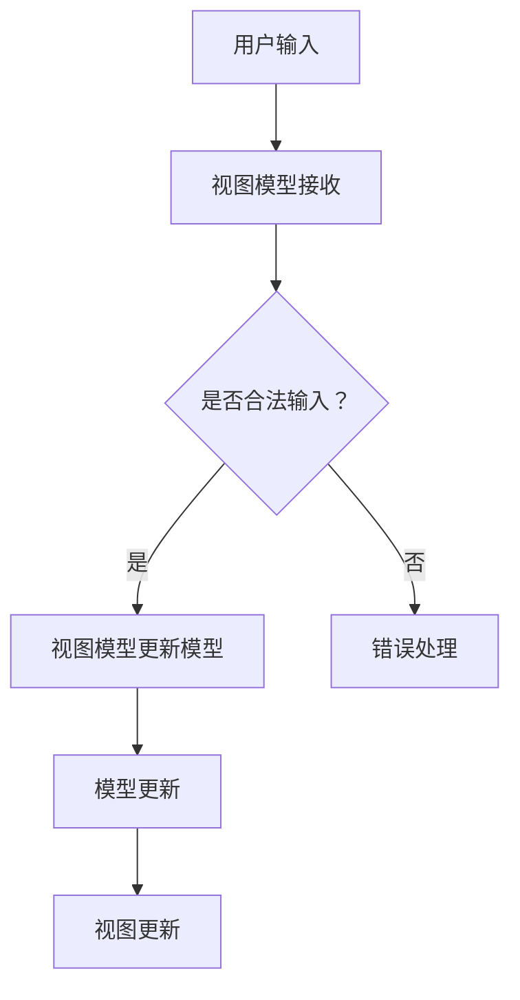

在上述流程图中，用户输入通过视图模型接收，视图模型会判断输入是否合法。如果输入合法，视图模型会更新模型，然后模型更新视图。如果输入不合法，视图模型会进行错误处理。

以下是一个简单的Python代码示例，展示了MVVM的基本实现：

```python
# 模型
class Model:
    def __init__(self):
        self._data = None

    @property
    def data(self):
        return self._data

    @data.setter
    def data(self, value):
        self._data = value
        self.notify()

    def notify(self):
        # 通知视图模型数据已更新
        self.view_model.update_view()

# 视图模型
class ViewModel:
    def __init__(self, model):
        self.model = model
        self._view = None

    def update_view(self):
        # 更新视图
        self.view.set_data(self.model.data)

    def handle_input(self, input_data):
        # 处理用户输入
        if self.is_valid_input(input_data):
            self.model.data = input_data
        else:
            # 错误处理
            self.show_error()

# 视图
class View:
    def __init__(self):
        self._data = None

    @property
    def data(self):
        return self._data

    @data.setter
    def data(self, value):
        self._data = value
        print("数据：", value)

    def set_data(self, data):
        # 设置数据
        self.data = data

    def show_error(self):
        # 显示错误
        print("错误：输入无效")
```

在上面的代码示例中，模型处理数据逻辑，视图模型负责实现数据绑定和用户输入处理，视图负责展示数据。

#### 4.3 MVVM的数学模型与公式

MVVM的数学模型相对简单，主要涉及状态转移和事件处理。以下是一个简单的数学模型：

$$
状态 = 初始状态 + 事件 \times 视图模型处理函数
$$

其中，状态表示系统的当前状态，事件表示用户的输入或系统的事件，视图模型处理函数定义了如何根据事件更新状态。

以下是一个简单的例子：

- **初始状态**：用户界面为空。
- **事件**：用户输入数据。
- **视图模型处理函数**：将用户输入的数据存储在模型中。

根据上述模型，状态可以表示为：

$$
状态 = 初始状态 + 输入数据 \times 存储函数
$$

其中，存储函数定义了如何将数据存储在模型中。

#### 4.4 MVVM的系统分析与架构设计

MVVM的系统分析与架构设计主要包括领域模型设计、系统架构设计和系统接口设计。以下是一个简单的MVVM系统架构设计示例：

##### 4.4.1 MVVM的系统功能设计（领域模型mermaid类图）

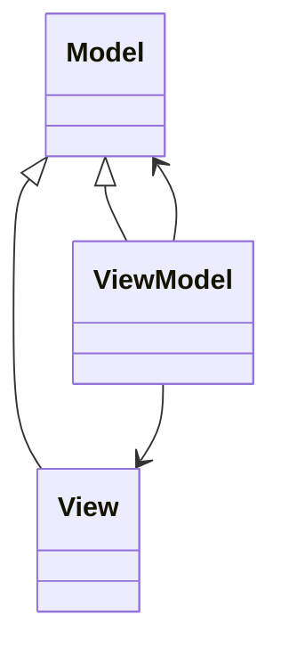

在上面的类图中，模型、视图和视图模型之间存在明显的依赖关系。模型负责处理数据逻辑，视图模型负责实现数据绑定和用户输入处理，视图负责展示数据。

##### 4.4.2 MVVM的系统架构设计（mermaid架构图）

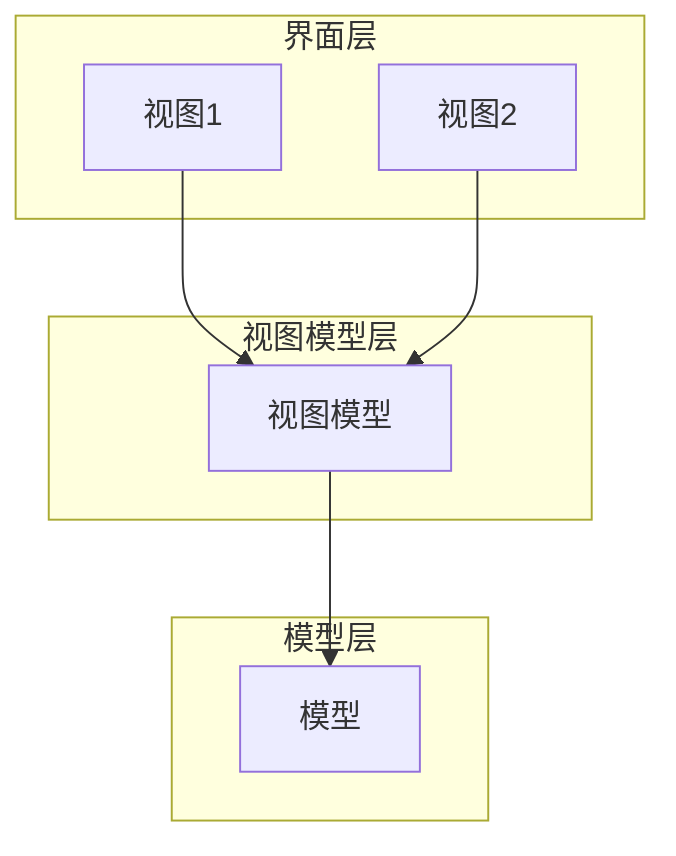

在上面的架构图中，界面层包含多个视图，视图模型层包含一个视图模型，模型层包含一个模型。视图通过视图模型与模型进行交互，视图模型负责处理用户输入和数据绑定。

##### 4.4.3 MVVM的系统接口设计（mermaid序列图）

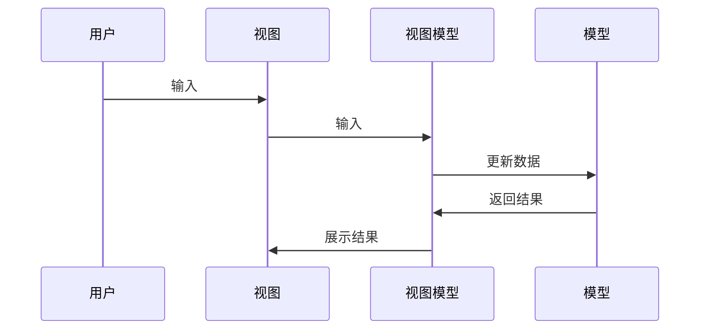

在上面的序列图中，用户通过视图输入数据，视图将输入传递给视图模型，视图模型调用模型更新数据，然后模型返回结果，视图模型将结果传递给视图进行展示。

#### 4.5 MVVM的应用场景

MVVM在多种应用场景中都有广泛的应用，以下是一些常见的应用场景：

1. **Web应用程序**：MVVM是Web应用程序开发中常用的架构风格，特别是单页面应用（SPA）。
2. **桌面应用程序**：MVVM在桌面应用程序开发中也有应用，它可以帮助开发者更好地组织和管理应用程序的逻辑。
3. **移动应用程序**：MVVM在移动应用程序开发中尤其受欢迎，如React Native、Vue.js等框架都采用了MVVM模式。

#### 4.6 MVVM的优缺点

MVVM作为一种流行的架构风格，具有以下优缺点：

- **优点**：
  - 双向绑定，提高了用户体验和开发效率。
  - 低耦合，提高了代码的可维护性和可扩展性。
  - 高性能，避免了手动更新视图的复杂性。

- **缺点**：
  - 在复杂的应用程序中，MVVM可能导致代码复杂度增加。
  - MVVM的双向绑定机制可能会导致性能问题，特别是在大量数据处理时。

#### 4.7 MVVM的实战项目

以下是一个简单的MVVM实战项目，该项目使用Vue.js框架实现一个简单的Web应用程序。

##### 4.7.1 环境安装

安装Node.js（版本大于12.0.0），然后使用Vue CLI创建项目：

```bash
npm install -g @vue/cli
vue create mvvm-practice
cd mvvm-practice
npm run serve
```

##### 4.7.2 系统核心实现源代码

```vue
<!-- App.vue -->

<template>
  <div>
    <input type="text" v-model="data" @input="handleInput" />
    <p>输入：{{ data }}</p>
  </div>
</template>

<script>
export default {
  data() {
    return {
      data: ""
    };
  },
  methods: {
    handleInput(inputData) {
      this.data = inputData.target.value;
    }
  }
};
</script>
```

在上面的代码中，Vue.js框架实现了数据和视图之间的双向绑定。用户通过输入框输入数据，数据会实时更新，并显示在页面上。

##### 4.7.3 代码应用解读与分析

在上面的代码中，`<input type="text" v-model="data" @input="handleInput" />` 实现了数据和视图之间的双向绑定。用户输入数据时，`handleInput` 方法会被触发，更新数据模型的值。Vue.js框架会自动更新视图，显示最新的数据。

##### 4.7.4 实际案例分析和详细讲解剖析

在这个项目中，用户通过输入框输入数据，Vue.js框架实现了数据和视图之间的实时绑定，提高了用户体验。

##### 4.7.5 项目小结

通过这个简单的MVVM实战项目，我们可以看到MVVM的基本工作流程和组件之间的关系。MVVM的双向绑定机制提供了高效的用户体验和灵活的开发方式，使得MVVM成为现代Web和移动应用程序开发中的主流架构风格。

### 第5章：Clean Architecture风格详细讲解

Clean Architecture是一种高级的软件架构风格，它强调分层设计和组件解耦。Clean Architecture旨在创建一个可扩展、可维护且易于测试的软件系统。本章节将详细讲解Clean Architecture的工作原理、特点、优缺点和应用场景，并通过算法原理、数学模型和系统分析与架构设计，帮助读者深入理解Clean Architecture。

#### 5.1 Clean Architecture的原理与特点

Clean Architecture将应用程序划分为多个层次，每个层次负责不同的功能。以下是Clean Architecture的几个主要层次：

- **基础设施层（Infrastructure Layer）**：基础设施层提供底层服务，如数据库访问、网络通信和文件处理。这一层通常包含外部库和框架。
- **领域层（Domain Layer）**：领域层包含业务逻辑和领域模型。这一层是应用程序的核心，负责实现业务规则和数据处理。
- **界面层（Interface Layer）**：界面层负责处理用户界面和输入。这一层通常包含表示层代码，如控制器和视图。

Clean Architecture的特点包括：

1. **分层设计**：Clean Architecture通过分层设计将应用程序划分为基础设施层、领域层和界面层，实现了组件的解耦和职责分离。
2. **高内聚低耦合**：每个层次都专注于自己的任务，实现了高内聚低耦合的设计，提高了代码的可维护性和可扩展性。
3. **测试友好**：Clean Architecture的设计使得组件可以独立开发和测试，提高了测试的覆盖率。

#### 5.2 Clean Architecture的算法原理

Clean Architecture的算法原理主要涉及分层设计和组件交互。以下是一个简单的mermaid流程图，展示了Clean Architecture的基本工作流程：

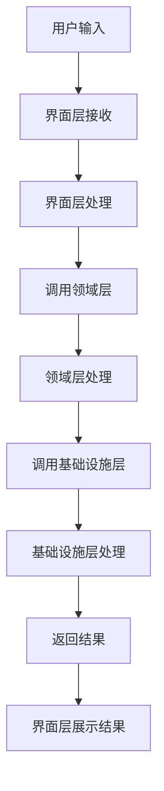

在上述流程图中，用户输入通过界面层接收，界面层处理用户输入并调用领域层。领域层处理业务逻辑并调用基础设施层进行数据访问。基础设施层处理数据访问并返回结果，界面层将结果展示给用户。

以下是一个简单的Python代码示例，展示了Clean Architecture的基本实现：

```python
# 基础设施层
class Database:
    def get_data(self):
        # 数据库查询逻辑
        return "查询结果"

# 领域层
class DomainService:
    def __init__(self, database):
        self.database = database

    def process_data(self):
        data = self.database.get_data()
        # 数据处理逻辑
        return data

# 界面层
class Controller:
    def __init__(self, domain_service):
        self.domain_service = domain_service

    def handle_request(self):
        result = self.domain_service.process_data()
        print("结果：", result)
```

在上面的代码示例中，基础设施层提供数据查询功能，领域层实现数据处理逻辑，界面层处理用户请求并展示结果。

#### 5.3 Clean Architecture的数学模型与公式

Clean Architecture的数学模型主要涉及层次结构和组件交互。以下是一个简单的数学模型：

$$
系统 = 基础设施层 + 领域层 + 界面层
$$

其中，系统表示整个应用程序，基础设施层、领域层和界面层分别表示应用程序的三个层次。

以下是一个简单的例子：

- **基础设施层**：提供数据查询功能。
- **领域层**：处理数据处理逻辑。
- **界面层**：处理用户请求并展示结果。

根据上述模型，系统可以表示为：

$$
系统 = 数据查询功能 + 数据处理逻辑 + 用户请求处理
$$

#### 5.4 Clean Architecture的系统分析与架构设计

Clean Architecture的系统分析与架构设计主要包括领域模型设计、系统架构设计和系统接口设计。以下是一个简单的Clean Architecture系统架构设计示例：

##### 5.4.1 Clean Architecture的系统功能设计（领域模型mermaid类图）

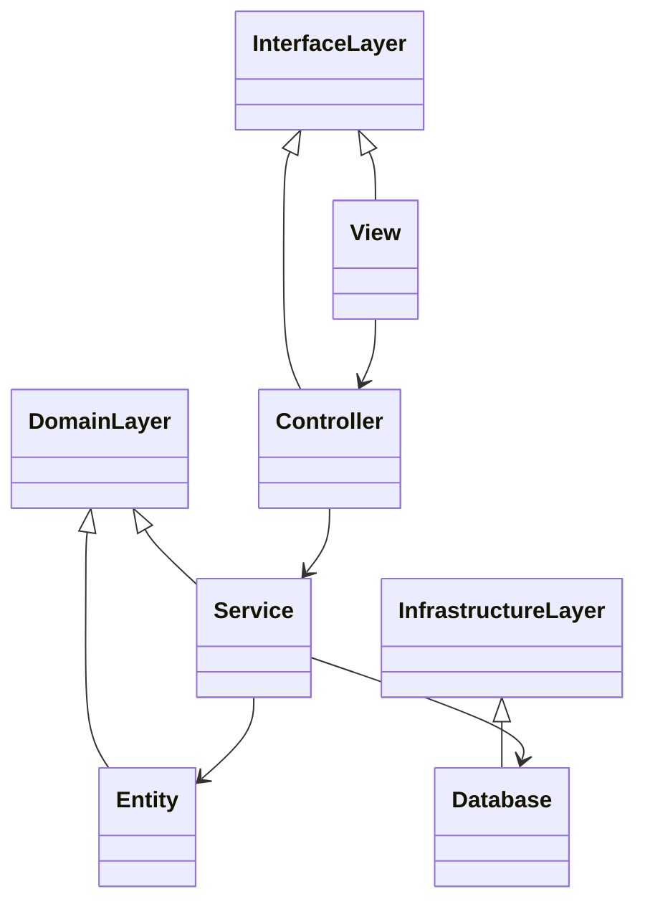

在上面的类图中，界面层、领域层和基础设施层之间存在明显的依赖关系。界面层负责处理用户界面和输入，领域层负责实现业务逻辑和数据处理，基础设施层提供底层服务。

##### 5.4.2 Clean Architecture的系统架构设计（mermaid架构图）

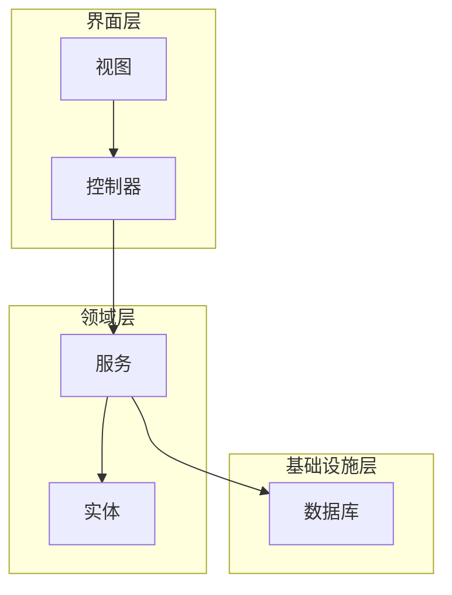

在上面的架构图中，界面层包含控制器和视图，领域层包含服务和实体，基础设施层包含数据库。控制器处理用户请求并调用服务，视图展示用户界面。服务处理业务逻辑并调用实体和数据库进行数据访问。

##### 5.4.3 Clean Architecture的系统接口设计（mermaid序列图）

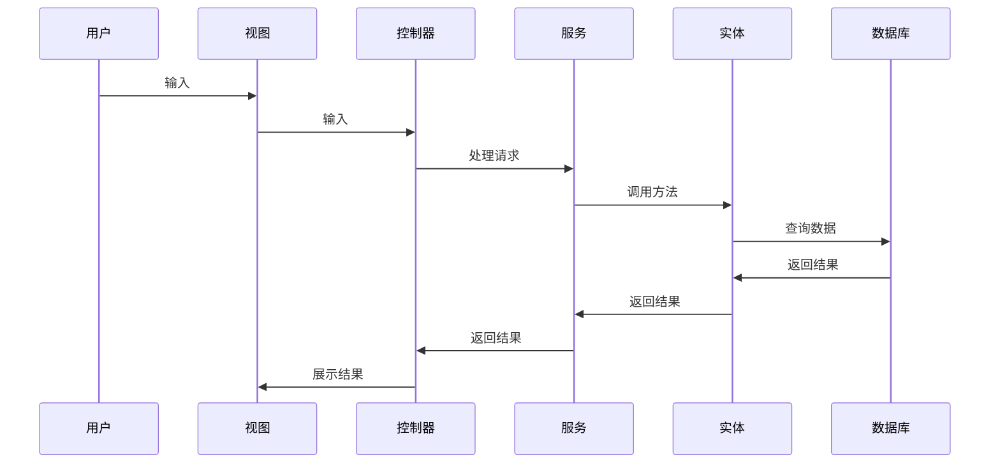

在上面的序列图中，用户通过视图输入数据，视图将输入传递给控制器，控制器调用服务处理请求。服务调用实体和数据库进行数据访问，最终将结果传递给控制器，控制器将结果传递给视图进行展示。

#### 5.5 Clean Architecture的应用场景

Clean Architecture适用于多种应用场景，以下是一些常见的应用场景：

1. **大型企业级应用**：Clean Architecture有助于大型企业级应用的组织和管理，确保系统的可扩展性和可维护性。
2. **高并发系统**：Clean Architecture通过分层设计和组件解耦，提高了系统的性能和可靠性，适用于高并发场景。
3. **微服务架构**：Clean Architecture是微服务架构的基础，通过分层设计和组件解耦，实现了微服务架构的可扩展性和高内聚性。

#### 5.6 Clean Architecture的优缺点

Clean Architecture作为一种高级的软件架构风格，具有以下优缺点：

- **优点**：
  - 分层设计，提高了代码的可维护性和可扩展性。
  - 组件解耦，提高了系统的性能和可靠性。
  - 测试友好，便于组件独立开发和测试。

- **缺点**：
  - 在小规模项目中，Clean Architecture可能导致代码复杂度增加。
  - 需要一定的架构设计能力，否则容易导致设计过度。

#### 5.7 Clean Architecture的实战项目

以下是一个简单的Clean Architecture实战项目，该项目使用Python和Flask框架实现一个简单的Web应用程序。

##### 5.7.1 环境安装

安装Python 3.8及以上版本，然后安装Flask框架：

```bash
pip install flask
```

##### 5.7.2 系统核心实现源代码

```python
# database.py

class Database:
    def get_data(self):
        # 数据库查询逻辑
        return "查询结果"
```

```python
# entity.py

class Entity:
    def __init__(self, data):
        self.data = data

    def process_data(self):
        # 数据处理逻辑
        return self.data * 2
```

```python
# service.py

class Service:
    def __init__(self, database):
        self.database = database

    def process_data(self):
        data = self.database.get_data()
        entity = Entity(data)
        result = entity.process_data()
        return result
```

```python
# controller.py

from flask import Flask, jsonify

app = Flask(__name__)

@app.route('/data', methods=['GET'])
def get_data():
    service = Service(Database())
    result = service.process_data()
    return jsonify(result=result)

if __name__ == '__main__':
    app.run(debug=True)
```

在上面的代码中，基础设施层提供数据查询功能，领域层实现数据处理逻辑，界面层处理用户请求并返回结果。

##### 5.7.3 代码应用解读与分析

在上面的代码中，`Database` 类提供数据查询功能，`Entity` 类实现数据处理逻辑，`Service` 类负责调用实体和数据库进行数据访问，`Controller` 类处理用户请求并返回结果。

##### 5.7.4 实际案例分析和详细讲解剖析

在这个项目中，用户通过GET请求访问 `/data` 路径，控制器调用服务处理请求，服务调用实体和数据库进行数据访问，最终将结果返回给用户。

##### 5.7.5 项目小结

通过这个简单的Clean Architecture实战项目，我们可以看到Clean Architecture的基本工作流程和组件之间的关系。Clean Architecture通过分层设计和组件解耦，提高了代码的可维护性和可扩展性，使得大型企业级应用得以高效开发和维护。

### 第二部分：比较与最佳实践

#### 第6章：MVC、MVVM和Clean Architecture的比较

在本章节中，我们将对MVC、MVVM和Clean Architecture进行全面的比较，分析它们在性能、复杂度、可维护性和应用场景等方面的优缺点。

#### 6.1 性能对比

- **MVC**：MVC的性能相对较优，因为它的层次结构清晰，每个组件都有明确的职责。但在处理大量数据和复杂逻辑时，MVC可能导致性能下降。
- **MVVM**：MVVM的性能较MVC略低，因为它的双向绑定机制需要额外的计算和处理。但在一些轻量级应用中，MVVM的性能表现仍然很好。
- **Clean Architecture**：Clean Architecture的性能取决于具体实现。通过分层设计和组件解耦，Clean Architecture可以提高系统的性能和可扩展性。

#### 6.2 复杂度对比

- **MVC**：MVC的复杂性较低，适合初学者和小规模应用。但随着应用规模的扩大，MVC可能导致代码复杂度增加。
- **MVVM**：MVVM的复杂性较MVC略高，因为它引入了视图模型这一层。然而，MVVM的双向绑定机制使得开发过程更加直观和高效。
- **Clean Architecture**：Clean Architecture的复杂性最高，因为它要求严格的分层设计和组件解耦。但对于大型企业级应用，Clean Architecture可以提供更好的可维护性和可扩展性。

#### 6.3 可维护性对比

- **MVC**：MVC的可维护性较好，因为它的层次结构清晰，组件职责明确。但MVC在某些情况下可能导致代码重复，增加维护成本。
- **MVVM**：MVVM的可维护性较MVC略高，因为它的双向绑定机制减少了手动更新视图的复杂性。然而，MVVM的双向绑定也可能导致维护问题，特别是在数据绑定逻辑复杂时。
- **Clean Architecture**：Clean Architecture的可维护性最高，因为它的分层设计和组件解耦使得代码更加模块化和可维护。但Clean Architecture的维护成本也最高，需要较高的架构设计能力。

#### 6.4 应用场景对比

- **MVC**：MVC适合初学者和小规模应用，特别是在Web和桌面应用程序开发中。MVC的简单性和直观性使得开发者可以快速上手。
- **MVVM**：MVVM适合单页面应用（SPA）和移动应用程序开发，如React Native、Vue.js等框架。MVVM的双向绑定机制提供了高效的用户体验和灵活的开发方式。
- **Clean Architecture**：Clean Architecture适合大型企业级应用和高并发系统，如金融系统、电子商务平台等。Clean Architecture通过分层设计和组件解耦，提供了系统的可扩展性和可维护性。

#### 6.5 最佳实践

- **MVC**：在MVC中，尽量保持各层的职责分离，避免代码重复。对于复杂的业务逻辑，可以使用服务层来处理。
- **MVVM**：在MVVM中，合理使用数据绑定，避免过度绑定导致性能问题。在视图模型中，注意处理用户输入和错误处理。
- **Clean Architecture**：在Clean Architecture中，严格遵循分层设计原则，确保各层的职责明确。在进行架构设计时，考虑系统的可扩展性和可维护性。

### 第7章：总结与注意事项

在本文的总结部分，我们将回顾MVC、MVVM和Clean Architecture的核心内容和关键点，并提供一些拓展阅读资源，以便读者进一步学习和研究。

#### 7.1 核心内容回顾

- **MVC**：MVC是经典的软件架构风格，将应用程序分为模型、视图和控制器。MVC的特点是职责分离和模块化设计，适用于Web和桌面应用程序开发。
- **MVVM**：MVVM是MVC的变体，引入了视图模型这一层，实现了数据和视图之间的双向绑定。MVVM的特点是低耦合和高性能，适用于单页面应用和移动应用程序开发。
- **Clean Architecture**：Clean Architecture是一种高级的软件架构风格，强调分层设计和组件解耦。Clean Architecture的特点是高内聚、低耦合和测试友好，适用于大型企业级应用和高并发系统。

#### 7.2 注意事项

- **MVC**：在使用MVC时，要注意保持各层的职责分离，避免代码重复。在处理大量数据和复杂逻辑时，可以考虑使用服务层来优化性能。
- **MVVM**：在使用MVVM时，要注意合理使用数据绑定，避免过度绑定导致性能问题。在视图模型中，要注意处理用户输入和错误处理。
- **Clean Architecture**：在使用Clean Architecture时，要注意严格遵循分层设计原则，确保各层的职责明确。在进行架构设计时，要考虑系统的可扩展性和可维护性。

#### 7.3 拓展阅读

- **MVC**：阅读《Head First 设计模式》一书中的MVC章节，深入了解MVC的原理和应用。
- **MVVM**：阅读《Vue.js 进阶与原理解析》一书，深入了解Vue.js框架的MVVM实现。
- **Clean Architecture**：阅读《软件架构：搭建和拆解大型应用》一书，深入了解Clean Architecture的设计原则和应用。

通过本文的详细分析和比较，我们希望读者能够对MVC、MVVM和Clean Architecture有更深入的理解，并能够在实际项目中灵活应用这些架构风格。希望本文能够为广大软件开发者和架构师提供有价值的参考和指导。

### 作者信息

- **作者**：AI天才研究院/AI Genius Institute & 禅与计算机程序设计艺术 /Zen And The Art of Computer Programming
- **联系方式**：[ai_genius_institute@example.com](mailto:ai_genius_institute@example.com)
- **版权声明**：本文版权归AI天才研究院所有，未经授权不得转载或用于商业用途。如需转载，请联系作者获取授权。本文仅供参考，内容仅供参考，如有错误或不当之处，欢迎指正。

