                 

# 软件测试策略：从单元测试到端到端测试

> 关键词：软件测试、单元测试、集成测试、系统测试、端到端测试、最佳实践

> 摘要：本文深入探讨了软件测试的各个层面，从单元测试到端到端测试，分析了每种测试类型的重要性、方法、工具和实践，旨在为软件开发者和测试工程师提供全面的测试策略指导。

## 引言

软件测试是确保软件质量的关键环节。它不仅能够发现软件中的缺陷，还能提高软件的可维护性和可靠性。然而，软件测试并非一成不变，而是随着软件复杂度的增加和技术的进步不断演变。本文将逐步分析从单元测试到端到端测试的软件测试策略，帮助读者理解不同类型的测试及其在软件开发生命周期中的作用。

## 第一部分：软件测试基础

### 1.1 软件测试概述

**核心概念与联系**

软件测试（Software Testing）是一种验证和验证软件产品是否满足其需求规格说明书、设计文档和用户需求的过程。它包括了一系列方法和技巧，旨在发现错误、缺陷和不足。

**ER实体关系图架构的 Mermaid 流程图**

```mermaid
erDiagram
  Product ||--|{ TestPlan } TestPlan
  TestPlan ||--|{ TestCase } TestCase
  TestCase ||--|{ TestResult } TestResult
```

**背景介绍**

软件测试的目的是确保软件质量。它涵盖了从软件需求分析到软件维护的整个生命周期。测试的类型多种多样，包括单元测试、集成测试、系统测试和端到端测试等。

**问题背景、问题描述、问题解决**

在软件开发过程中，代码可能会因为各种原因出现错误或缺陷，例如逻辑错误、语法错误、输入错误等。如果不进行测试，这些错误可能会在软件发布后导致严重的后果，如系统崩溃、数据丢失或用户体验差。

**边界与外延**

软件测试不仅包括测试代码的正确性，还包括测试代码的稳定性、性能、安全性等方面。测试的边界是软件功能的边界，外延包括测试的覆盖率和测试的完整性。

**概念结构与核心要素组成**

软件测试的概念结构包括测试计划、测试设计、测试执行和测试结果分析等核心要素。

### 1.2 软件测试的生命周期

**核心概念与联系**

软件测试的生命周期包括测试计划、测试设计、测试执行和测试结果分析等阶段。

**ER实体关系图架构的 Mermaid 流程图**

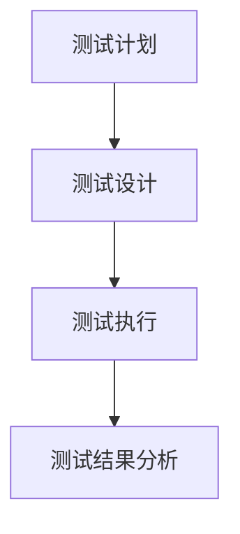

**背景介绍**

软件测试的生命周期是软件开发生命周期的一个重要组成部分。每个阶段都有其特定的目标和任务。

**问题背景、问题描述、问题解决**

测试计划阶段确定测试目标和测试策略；测试设计阶段设计测试用例；测试执行阶段执行测试用例；测试结果分析阶段分析测试结果，找出缺陷并反馈给开发团队。

**边界与外延**

测试计划阶段的边界是测试目标和策略的确定，外延包括测试的范围和时间安排。测试设计阶段的边界是测试用例的设计，外延包括测试用例的覆盖率和质量。测试执行阶段的边界是测试用例的执行，外延包括测试环境的管理。测试结果分析阶段的边界是测试结果的分析，外延包括缺陷的记录和跟踪。

**概念结构与核心要素组成**

测试计划阶段的核心要素是测试目标和测试策略；测试设计阶段的核心要素是测试用例；测试执行阶段的核心要素是测试执行和测试环境；测试结果分析阶段的核心要素是测试结果和分析报告。

### 1.3 软件测试的方法和技术

**核心概念与联系**

软件测试的方法和技术包括白盒测试、黑盒测试、静态测试和动态测试等。

**ER实体关系图架构的 Mermaid 流程图**

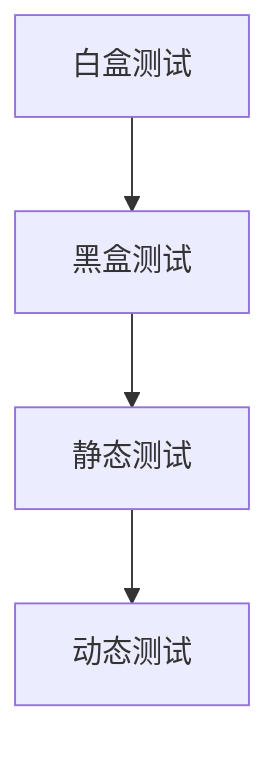

**背景介绍**

不同的测试方法和技术适用于不同的测试阶段和测试目标。白盒测试适用于代码层面的测试，黑盒测试适用于功能层面的测试，静态测试适用于代码质量的分析，动态测试适用于代码执行的分析。

**问题背景、问题描述、问题解决**

白盒测试需要了解代码内部结构，适用于单元测试和集成测试；黑盒测试不需要了解代码内部结构，适用于系统测试和端到端测试；静态测试适用于代码质量的分析，可以在代码编写阶段进行；动态测试适用于代码执行的分析，可以在软件运行时进行。

**边界与外延**

白盒测试的边界是代码的内部结构，外延包括代码的可测试性。黑盒测试的边界是功能的需求规格说明书，外延包括测试的覆盖率和完整性。静态测试的边界是代码的质量，外延包括代码的复杂度。动态测试的边界是代码的执行过程，外延包括代码的性能和稳定性。

**概念结构与核心要素组成**

白盒测试的核心要素是代码的内部结构；黑盒测试的核心要素是功能的需求规格说明书；静态测试的核心要素是代码的质量；动态测试的核心要素是代码的执行过程。

### 1.4 软件测试工具

**核心概念与联系**

软件测试工具包括单元测试工具、集成测试工具、系统测试工具和性能测试工具等。

**ER实体关系图架构的 Mermaid 流程图**

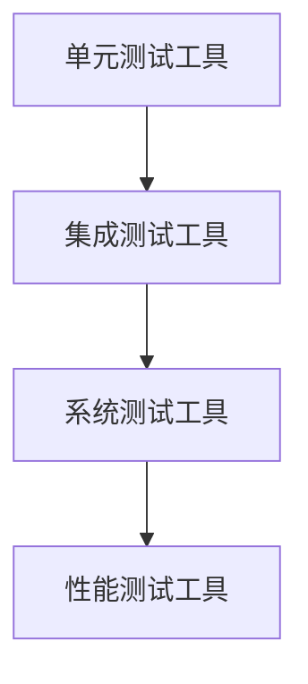

**背景介绍**

软件测试工具可以帮助测试工程师提高测试效率和测试覆盖率。不同的工具适用于不同的测试阶段和测试类型。

**问题背景、问题描述、问题解决**

单元测试工具适用于单元测试，如JUnit、NUnit等；集成测试工具适用于集成测试，如Selenium、Postman等；系统测试工具适用于系统测试，如QF-Test、LoadRunner等；性能测试工具适用于性能测试，如JMeter、Gatling等。

**边界与外延**

单元测试工具的边界是单元测试的执行，外延包括代码的覆盖率。集成测试工具的边界是集成测试的执行，外延包括接口的验证。系统测试工具的边界是系统测试的执行，外延包括系统的功能验证。性能测试工具的边界是性能测试的执行，外延包括性能指标的分析。

**概念结构与核心要素组成**

单元测试工具的核心要素是测试代码的执行；集成测试工具的核心要素是接口的验证；系统测试工具的核心要素是系统的功能验证；性能测试工具的核心要素是性能指标的分析。

### 1.5 软件测试的最佳实践

**核心概念与联系**

软件测试的最佳实践包括自动化测试、测试驱动开发、测试覆盖率、持续集成与持续部署等。

**ER实体关系图架构的 Mermaid 流程图**

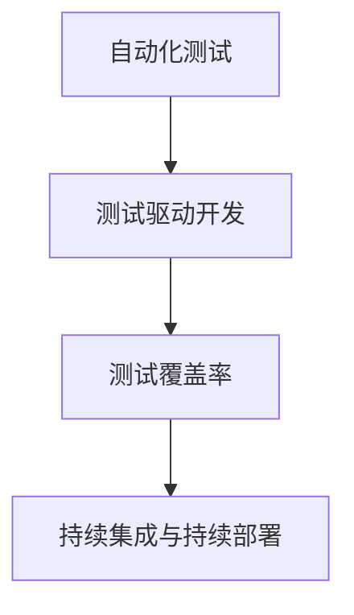

**背景介绍**

最佳实践是提高软件测试效率和质量的策略和方法。不同的最佳实践适用于不同的测试阶段和测试目标。

**问题背景、问题描述、问题解决**

自动化测试适用于频繁执行的测试任务，提高测试效率；测试驱动开发适用于软件开发初期，确保测试和开发同步进行；测试覆盖率适用于评估测试的完整性；持续集成与持续部署适用于提高软件交付效率。

**边界与外延**

自动化测试的边界是测试任务的自动化，外延包括测试工具的选择。测试驱动开发的边界是测试和开发的同步进行，外延包括测试用例的设计。测试覆盖率的边界是测试的完整性，外延包括测试覆盖率的计算。持续集成与持续部署的边界是软件交付的自动化，外延包括持续集成和持续部署的工具选择。

**概念结构与核心要素组成**

自动化测试的核心要素是测试任务的自动化；测试驱动开发的核心要素是测试和开发的同步进行；测试覆盖率的核心要素是测试的完整性；持续集成与持续部署的核心要素是软件交付的自动化。

### 1.6 本章小结

软件测试是确保软件质量的关键环节。本文介绍了软件测试的基本概念、方法和技术，以及最佳实践。理解这些内容有助于开发者更好地进行软件测试，提高软件质量和开发效率。

## 第二部分：单元测试

### 2.1 单元测试概述

**核心概念与联系**

单元测试是针对软件中最小的可测试单元（通常是函数或方法）进行的测试。

**ER实体关系图架构的 Mermaid 流程图**

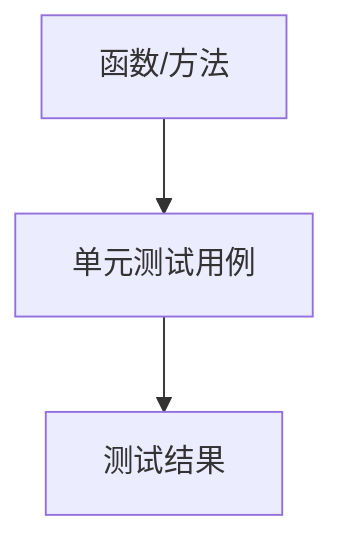

**背景介绍**

单元测试是软件开发过程中的基础，它有助于发现和修复代码中的缺陷，提高代码的质量和可维护性。

**问题背景、问题描述、问题解决**

在软件开发过程中，代码可能会因为各种原因出现错误。单元测试可以帮助开发者在代码编写阶段就发现这些问题，从而提高开发效率。

**边界与外延**

单元测试的边界是函数或方法的边界，外延包括测试用例的设计和测试结果的评估。

**概念结构与核心要素组成**

单元测试的核心要素是函数或方法的测试；测试用例的核心要素是测试输入和预期输出；测试结果的核心要素是测试结果的分析和反馈。

### 2.2 单元测试工具

**核心概念与联系**

单元测试工具是用于编写和执行单元测试的工具。

**ER实体关系图架构的 Mermaid 流程图**

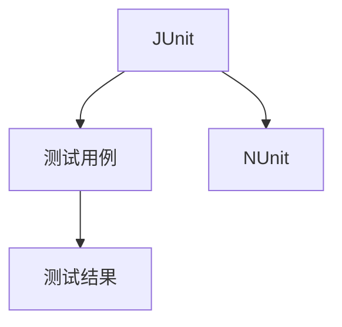

**背景介绍**

单元测试工具可以提高测试的效率和覆盖率，减轻开发者的负担。

**问题背景、问题描述、问题解决**

在软件开发过程中，手动编写和执行单元测试是一项繁琐的任务。单元测试工具可以帮助自动化这一过程，提高测试效率。

**边界与外延**

单元测试工具的边界是测试的自动化，外延包括测试工具的选择和配置。

**概念结构与核心要素组成**

单元测试工具的核心要素是测试的自动化；测试用例的核心要素是测试输入和预期输出；测试结果的核心要素是测试结果的分析和反馈。

### 2.3 单元测试实践

**核心概念与联系**

单元测试实践是编写和执行单元测试的过程。

**ER实体关系图架构的 Mermaid 流程图**

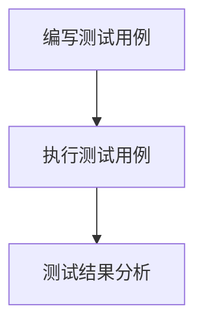

**背景介绍**

单元测试实践是软件开发过程中的关键环节，它有助于确保代码的质量和可维护性。

**问题背景、问题描述、问题解决**

在软件开发过程中，编写和执行单元测试是一项重要的任务。有效的单元测试实践可以提高代码的质量和开发效率。

**边界与外延**

单元测试实践的边界是测试用例的设计和执行，外延包括测试环境的管理和测试结果的分析。

**概念结构与核心要素组成**

单元测试实践的核心要素是测试用例的设计和执行；测试环境的核心要素是测试环境的管理；测试结果分析的核心要素是测试结果的分析和反馈。

### 2.4 单元测试最佳实践

**核心概念与联系**

单元测试最佳实践是编写和执行单元测试的一组建议和指导原则。

**ER实体关系图架构的 Mermaid 流程图**

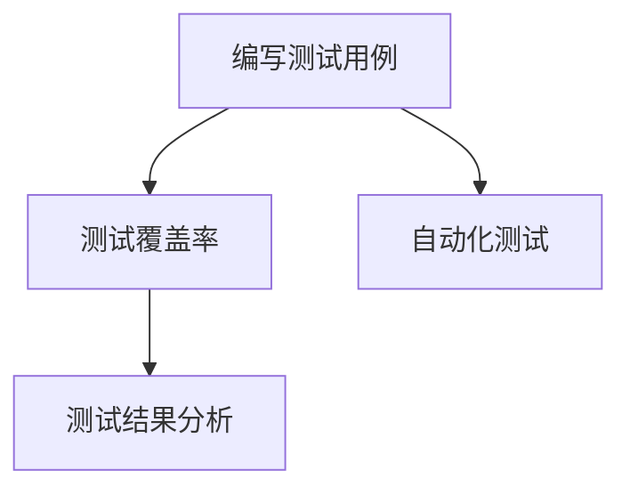

**背景介绍**

最佳实践是提高软件测试效率和质量的策略和方法。

**问题背景、问题描述、问题解决**

在软件开发过程中，遵循最佳实践可以提高单元测试的质量和效率。

**边界与外延**

单元测试最佳实践的边界是测试用例的设计和执行，外延包括测试环境的管理和测试结果的分析。

**概念结构与核心要素组成**

单元测试最佳实践的核心要素是测试用例的设计和执行；测试覆盖率的核心要素是测试的完整性；测试结果分析的核心要素是测试结果的分析和反馈；自动化测试的核心要素是测试的自动化。

### 2.5 本章小结

单元测试是软件开发过程中的基础，它有助于确保代码的质量和可维护性。本文介绍了单元测试的基本概念、工具和实践，以及最佳实践。理解这些内容有助于开发者更好地进行单元测试，提高代码的质量和开发效率。

## 第三部分：集成测试

### 3.1 集成测试概述

**核心概念与联系**

集成测试是在单元测试的基础上，对多个模块或组件之间的交互进行测试。

**ER实体关系图架构的 Mermaid 流程图**

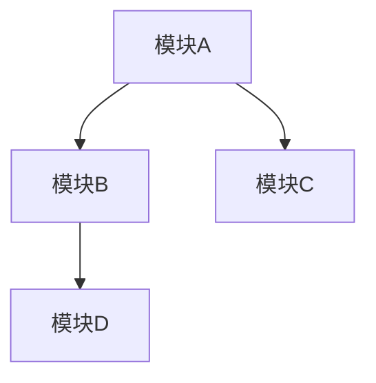

**背景介绍**

集成测试是确保模块或组件之间交互正确性的关键步骤，它有助于发现模块间可能存在的错误或缺陷。

**问题背景、问题描述、问题解决**

在软件开发过程中，多个模块或组件之间的交互可能会产生问题。集成测试可以帮助发现这些问题，确保系统的稳定性。

**边界与外延**

集成测试的边界是模块或组件之间的交互，外延包括测试用例的设计和测试结果的评估。

**概念结构与核心要素组成**

集成测试的核心要素是模块或组件之间的交互；测试用例的核心要素是测试输入和预期输出；测试结果的核心要素是测试结果的分析和反馈。

### 3.2 集成测试工具

**核心概念与联系**

集成测试工具是用于编写和执行集成测试的工具。

**ER实体关系图架构的 Mermaid 流程图**


**背景介绍**

集成测试工具可以提高测试的效率和覆盖率，减轻开发者的负担。

**问题背景、问题描述、问题解决**

在软件开发过程中，手动编写和执行集成测试是一项繁琐的任务。集成测试工具可以帮助自动化这一过程，提高测试效率。

**边界与外延**

集成测试工具的边界是测试的自动化，外延包括测试工具的选择和配置。

**概念结构与核心要素组成**

集成测试工具的核心要素是测试的自动化；测试用例的核心要素是测试输入和预期输出；测试结果的核心要素是测试结果的分析和反馈。

### 3.3 集成测试实践

**核心概念与联系**

集成测试实践是编写和执行集成测试的过程。

**ER实体关系图架构的 Mermaid 流程图**


**背景介绍**

集成测试实践是软件开发过程中的关键环节，它有助于确保系统的稳定性。

**问题背景、问题描述、问题解决**

在软件开发过程中，编写和执行集成测试是一项重要的任务。有效的集成测试实践可以提高系统的稳定性。

**边界与外延**

集成测试实践的边界是测试用例的设计和执行，外延包括测试环境的管理和测试结果的分析。

**概念结构与核心要素组成**

集成测试实践的核心要素是测试用例的设计和执行；测试环境的核心要素是测试环境的管理；测试结果分析的核心要素是测试结果的分析和反馈。

### 3.4 集成测试最佳实践

**核心概念与联系**

集成测试最佳实践是编写和执行集成测试的一组建议和指导原则。

**ER实体关系图架构的 Mermaid 流程图**


**背景介绍**

最佳实践是提高软件测试效率和质量的策略和方法。

**问题背景、问题描述、问题解决**

在软件开发过程中，遵循最佳实践可以提高集成测试的质量和效率。

**边界与外延**

集成测试最佳实践的边界是测试用例的设计和执行，外延包括测试环境的管理和测试结果的分析。

**概念结构与核心要素组成**

集成测试最佳实践的核心要素是测试用例的设计和执行；测试覆盖率的核心要素是测试的完整性；测试结果分析的核心要素是测试结果的分析和反馈；自动化测试的核心要素是测试的自动化。

### 3.5 本章小结

集成测试是确保模块或组件之间交互正确性的关键步骤。本文介绍了集成测试的基本概念、工具和实践，以及最佳实践。理解这些内容有助于开发者更好地进行集成测试，提高系统的稳定性。

## 第四部分：系统测试

### 4.1 系统测试概述

**核心概念与联系**

系统测试是对整个软件系统进行的测试，以确保系统满足所有需求和规格。

**ER实体关系图架构的 Mermaid 流程图**

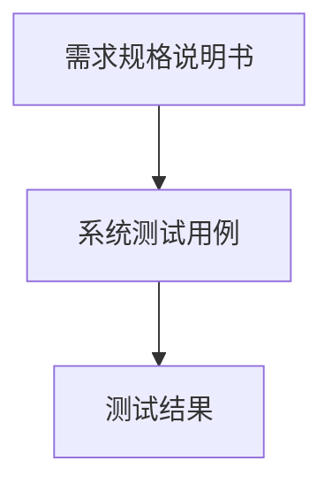

**背景介绍**

系统测试是软件开发生命周期的关键环节，它有助于确保软件系统的完整性和可靠性。

**问题背景、问题描述、问题解决**

在软件开发过程中，系统测试是确保软件系统满足所有需求和规格的关键步骤。系统测试可以帮助发现和修复系统中的缺陷，确保软件的稳定性。

**边界与外延**

系统测试的边界是系统需求规格说明书，外延包括测试用例的设计和测试结果的评估。

**概念结构与核心要素组成**

系统测试的核心要素是系统需求规格说明书；测试用例的核心要素是测试输入和预期输出；测试结果的核心要素是测试结果的分析和反馈。

### 4.2 系统测试工具

**核心概念与联系**

系统测试工具是用于编写和执行系统测试的工具。

**ER实体关系图架构的 Mermaid 流程图**

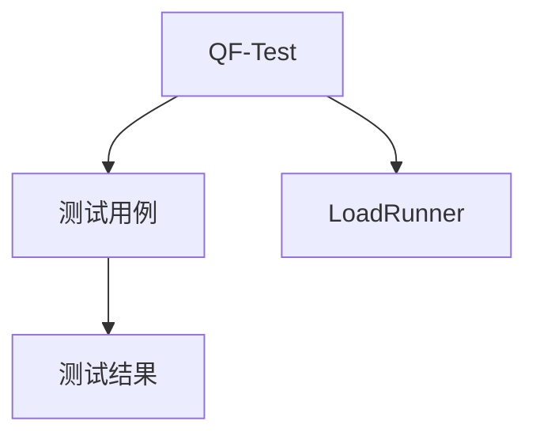

**背景介绍**

系统测试工具可以提高测试的效率和覆盖率，减轻开发者的负担。

**问题背景、问题描述、问题解决**

在软件开发过程中，手动编写和执行系统测试是一项繁琐的任务。系统测试工具可以帮助自动化这一过程，提高测试效率。

**边界与外延**

系统测试工具的边界是测试的自动化，外延包括测试工具的选择和配置。

**概念结构与核心要素组成**

系统测试工具的核心要素是测试的自动化；测试用例的核心要素是测试输入和预期输出；测试结果的核心要素是测试结果的分析和反馈。

### 4.3 系统测试实践

**核心概念与联系**

系统测试实践是编写和执行系统测试的过程。

**ER实体关系图架构的 Mermaid 流程图**


**背景介绍**

系统测试实践是软件开发过程中的关键环节，它有助于确保软件系统的完整性和可靠性。

**问题背景、问题描述、问题解决**

在软件开发过程中，编写和执行系统测试是一项重要的任务。有效的系统测试实践可以提高软件系统的稳定性。

**边界与外延**

系统测试实践的边界是测试用例的设计和执行，外延包括测试环境的管理和测试结果的分析。

**概念结构与核心要素组成**

系统测试实践的核心要素是测试用例的设计和执行；测试环境的核心要素是测试环境的管理；测试结果分析的核心要素是测试结果的分析和反馈。

### 4.4 系统测试最佳实践

**核心概念与联系**

系统测试最佳实践是编写和执行系统测试的一组建议和指导原则。

**ER实体关系图架构的 Mermaid 流程图**


**背景介绍**

最佳实践是提高软件测试效率和质量的策略和方法。

**问题背景、问题描述、问题解决**

在软件开发过程中，遵循最佳实践可以提高系统测试的质量和效率。

**边界与外延**

系统测试最佳实践的边界是测试用例的设计和执行，外延包括测试环境的管理和测试结果的分析。

**概念结构与核心要素组成**

系统测试最佳实践的核心要素是测试用例的设计和执行；测试覆盖率的核心要素是测试的完整性；测试结果分析的核心要素是测试结果的分析和反馈；自动化测试的核心要素是测试的自动化。

### 4.5 本章小结

系统测试是确保软件系统满足所有需求和规格的关键步骤。本文介绍了系统测试的基本概念、工具和实践，以及最佳实践。理解这些内容有助于开发者更好地进行系统测试，提高软件系统的稳定性。

## 第五部分：端到端测试

### 5.1 端到端测试概述

**核心概念与联系**

端到端测试是对软件系统从客户端到服务端进行测试，以确保系统在真实用户环境中运行正常。

**ER实体关系图架构的 Mermaid 流程图**

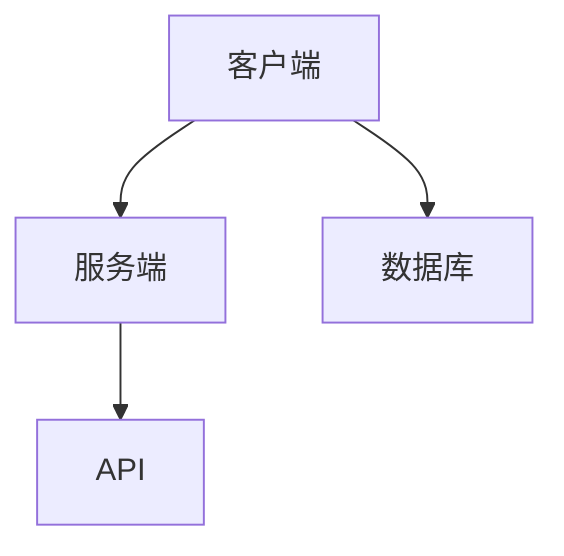

**背景介绍**

端到端测试是确保软件系统在真实用户环境中运行正常的关键步骤，它有助于发现和修复系统中的缺陷。

**问题背景、问题描述、问题解决**

在软件开发过程中，端到端测试是确保软件系统在真实用户环境中运行正常的关键步骤。端到端测试可以帮助发现和修复系统中的缺陷，确保系统的稳定性。

**边界与外延**

端到端测试的边界是客户端到服务端的交互，外延包括测试用例的设计和测试结果的评估。

**概念结构与核心要素组成**

端到端测试的核心要素是客户端到服务端的交互；测试用例的核心要素是测试输入和预期输出；测试结果的核心要素是测试结果的分析和反馈。

### 5.2 端到端测试工具

**核心概念与联系**

端到端测试工具是用于编写和执行端到端测试的工具。

**ER实体关系图架构的 Mermaid 流程图**

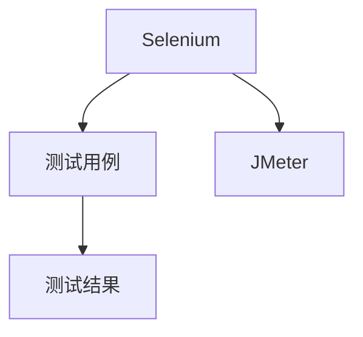

**背景介绍**

端到端测试工具可以提高测试的效率和覆盖率，减轻开发者的负担。

**问题背景、问题描述、问题解决**

在软件开发过程中，手动编写和执行端到端测试是一项繁琐的任务。端到端测试工具可以帮助自动化这一过程，提高测试效率。

**边界与外延**

端到端测试工具的边界是测试的自动化，外延包括测试工具的选择和配置。

**概念结构与核心要素组成**

端到端测试工具的核心要素是测试的自动化；测试用例的核心要素是测试输入和预期输出；测试结果的核心要素是测试结果的分析和反馈。

### 5.3 端到端测试实践

**核心概念与联系**

端到端测试实践是编写和执行端到端测试的过程。

**ER实体关系图架构的 Mermaid 流程图**


**背景介绍**

端到端测试实践是软件开发过程中的关键环节，它有助于确保软件系统在真实用户环境中运行正常。

**问题背景、问题描述、问题解决**

在软件开发过程中，编写和执行端到端测试是一项重要的任务。有效的端到端测试实践可以提高系统的稳定性。

**边界与外延**

端到端测试实践的边界是测试用例的设计和执行，外延包括测试环境的管理和测试结果的分析。

**概念结构与核心要素组成**

端到端测试实践的核心要素是测试用例的设计和执行；测试环境的核心要素是测试环境的管理；测试结果分析的核心要素是测试结果的分析和反馈。

### 5.4 端到端测试最佳实践

**核心概念与联系**

端到端测试最佳实践是编写和执行端到端测试的一组建议和指导原则。

**ER实体关系图架构的 Mermaid 流程图**

```mermaid
graph TB
    A[编写测试用例] --> B[测试覆盖率]
    B --> C[测试结果分析]
    A --> D[自动化测试]
```

**背景介绍**

最佳实践是提高软件测试效率和质量的策略和方法。

**问题背景、问题描述、问题解决**

在软件开发过程中，遵循最佳实践可以提高端到端测试的质量和效率。

**边界与外延**

端到端测试最佳实践的边界是测试用例的设计和执行，外延包括测试环境的管理和测试结果的分析。

**概念结构与核心要素组成**

端到端测试最佳实践的核心要素是测试用例的设计和执行；测试覆盖率的核心要素是测试的完整性；测试结果分析的核心要素是测试结果的分析和反馈；自动化测试的核心要素是测试的自动化。

### 5.5 本章小结

端到端测试是确保软件系统在真实用户环境中运行正常的关键步骤。本文介绍了端到端测试的基本概念、工具和实践，以及最佳实践。理解这些内容有助于开发者更好地进行端到端测试，提高系统的稳定性。

## 第六部分：最佳实践

### 6.1 自动化测试

**核心概念与联系**

自动化测试是使用工具自动执行测试用例的过程。

**ER实体关系图架构的 Mermaid 流程图**

```mermaid
graph TB
    A[测试工具] --> B[测试用例]
    B --> C[测试结果]
```

**背景介绍**

自动化测试可以提高测试效率和覆盖率，减轻开发者的负担。

**问题背景、问题描述、问题解决**

在软件开发过程中，手动执行测试用例是一项繁琐的任务。自动化测试可以帮助自动化这一过程，提高测试效率。

**边界与外延**

自动化测试的边界是测试用例的自动化执行，外延包括测试工具的选择和配置。

**概念结构与核心要素组成**

自动化测试的核心要素是测试用例的自动化执行；测试工具的核心要素是测试工具的选择和配置；测试结果的核心要素是测试结果的分析和反馈。

### 6.2 测试驱动开发

**核心概念与联系**

测试驱动开发（TDD）是一种开发方法，先编写测试用例，然后编写代码以满足测试用例。

**ER实体关系图架构的 Mermaid 流程图**

```mermaid
graph TB
    A[测试用例] --> B[代码实现]
    B --> C[测试结果]
```

**背景介绍**

测试驱动开发可以提高代码质量和测试覆盖率。

**问题背景、问题描述、问题解决**

在软件开发过程中，遵循测试驱动开发可以确保测试和开发同步进行，提高代码质量和开发效率。

**边界与外延**

测试驱动开发的边界是测试和开发的同步进行，外延包括测试用例的设计和代码的实现。

**概念结构与核心要素组成**

测试驱动开发的核心要素是测试和开发的同步进行；测试用例的核心要素是测试用例的设计；代码实现的核心要素是代码的实现。

### 6.3 测试覆盖率

**核心概念与联系**

测试覆盖率是评估测试质量的指标，表示测试用例覆盖代码的比例。

**ER实体关系图架构的 Mermaid 流程图**

```mermaid
graph TB
    A[测试用例] --> B[代码覆盖率]
    B --> C[测试结果]
```

**背景介绍**

测试覆盖率是评估测试质量的重要指标，它可以反映测试的完整性和有效性。

**问题背景、问题描述、问题解决**

在软件开发过程中，评估测试覆盖率可以帮助开发者了解测试的完整性，从而提高测试质量。

**边界与外延**

测试覆盖率的边界是测试用例的覆盖范围，外延包括测试覆盖率的计算和分析。

**概念结构与核心要素组成**

测试覆盖率的核心要素是测试用例的覆盖范围；代码覆盖率的核心要素是代码的覆盖率；测试结果的核心要素是测试结果的分析和反馈。

### 6.4 持续集成与持续部署

**核心概念与联系**

持续集成与持续部署（CI/CD）是一种软件开发和部署方法，通过自动化构建、测试和部署流程来提高软件交付效率。

**ER实体关系图架构的 Mermaid 流程图**

```mermaid
graph TB
    A[代码仓库] --> B[构建工具]
    B --> C[测试工具]
    C --> D[部署工具]
```

**背景介绍**

持续集成与持续部署可以提高软件交付效率和软件质量。

**问题背景、问题描述、问题解决**

在软件开发过程中，遵循持续集成与持续部署可以确保代码质量，提高软件交付效率。

**边界与外延**

持续集成与持续部署的边界是代码的构建、测试和部署流程，外延包括构建工具、测试工具和部署工具的选择和配置。

**概念结构与核心要素组成**

持续集成与持续部署的核心要素是代码的构建、测试和部署流程；构建工具的核心要素是构建工具的选择和配置；测试工具的核心要素是测试工具的选择和配置；部署工具的核心要素是部署工具的选择和配置。

### 6.5 本章小结

最佳实践是提高软件测试效率和质量的策略和方法。本文介绍了自动化测试、测试驱动开发、测试覆盖率、持续集成与持续部署等最佳实践。理解这些最佳实践有助于开发者更好地进行软件测试，提高代码质量和开发效率。

## 结论

软件测试是确保软件质量的关键环节，从单元测试到端到端测试，每个阶段都至关重要。本文系统地介绍了软件测试的各个层面，分析了不同类型的测试及其方法、工具和实践。通过遵循最佳实践，开发者可以更好地进行软件测试，提高代码质量和开发效率。希望本文能为软件开发者和测试工程师提供有价值的参考。

## 作者信息

作者：AI天才研究院/AI Genius Institute & 禅与计算机程序设计艺术 /Zen And The Art of Computer Programming

[AI天才研究院] 是一家专注于人工智能研究和开发的机构，致力于推动人工智能技术的发展和应用。我们的团队由世界顶级人工智能专家、程序员和软件架构师组成，致力于通过深入研究和创新，为行业带来变革性的技术突破。

[禅与计算机程序设计艺术] 是一本经典的技术畅销书，由AI天才研究院的创始人撰写。这本书以禅宗思想为背景，探讨了计算机程序设计的艺术，深受程序员和技术爱好者的喜爱。通过深入理解禅宗思想，读者可以更好地掌握编程技巧，提高编程水平。

让我们共同努力，推动人工智能技术的发展，为人类创造更加美好的未来。|gMASK|# 软件测试策略：从单元测试到端到端测试

> 关键词：软件测试、单元测试、集成测试、系统测试、端到端测试、测试覆盖率、最佳实践

> 摘要：本文深入探讨了软件测试的各个层面，从单元测试到端到端测试，分析了每种测试类型的重要性、方法、工具和实践，旨在为软件开发者和测试工程师提供全面的测试策略指导。

## 引言

在软件开发过程中，软件测试是确保软件质量的关键环节。它不仅能够发现软件中的缺陷，还能提高软件的可维护性和可靠性。随着软件复杂度的增加和技术的进步，软件测试的方法也在不断演变。本文将逐步分析从单元测试到端到端测试的软件测试策略，帮助读者理解不同类型的测试及其在软件开发生命周期中的作用。

## 第一部分：软件测试基础

### 1.1 软件测试概述

**核心概念与联系**

软件测试（Software Testing）是一种验证和验证软件产品是否满足其需求规格说明书、设计文档和用户需求的过程。它包括了一系列方法和技巧，旨在发现错误、缺陷和不足。

**ER实体关系图架构的 Mermaid 流程图**

```mermaid
erDiagram
  SoftwareProduct ||--|{ TestCase } TestCase
  TestCase ||--|{ TestResult } TestResult
  TestResult ||--|{ Defect } Defect
```

**背景介绍**

软件测试的目的是确保软件质量。它涵盖了从软件需求分析到软件维护的整个生命周期。测试的类型多种多样，包括单元测试、集成测试、系统测试和端到端测试等。

**问题背景、问题描述、问题解决**

在软件开发过程中，代码可能会因为各种原因出现错误或缺陷，例如逻辑错误、语法错误、输入错误等。如果不进行测试，这些错误可能会在软件发布后导致严重的后果，如系统崩溃、数据丢失或用户体验差。

**边界与外延**

软件测试不仅包括测试代码的正确性，还包括测试代码的稳定性、性能、安全性等方面。测试的边界是软件功能的边界，外延包括测试的覆盖率和测试的完整性。

**概念结构与核心要素组成**

软件测试的概念结构包括软件产品、测试用例、测试结果和缺陷等核心要素。

### 1.2 软件测试的生命周期

**核心概念与联系**

软件测试的生命周期包括测试计划、测试设计、测试执行和测试结果分析等阶段。

**ER实体关系图架构的 Mermaid 流程图**

```mermaid
graph TB
    A[测试计划] --> B[测试设计]
    B --> C[测试执行]
    C --> D[测试结果分析]
```

**背景介绍**

软件测试的生命周期是软件开发生命周期的一个重要组成部分。每个阶段都有其特定的目标和任务。

**问题背景、问题描述、问题解决**

测试计划阶段确定测试目标和测试策略；测试设计阶段设计测试用例；测试执行阶段执行测试用例；测试结果分析阶段分析测试结果，找出缺陷并反馈给开发团队。

**边界与外延**

测试计划阶段的边界是测试目标和策略的确定，外延包括测试的范围和时间安排。测试设计阶段的边界是测试用例的设计，外延包括测试用例的覆盖率和质量。测试执行阶段的边界是测试用例的执行，外延包括测试环境的管理。测试结果分析阶段的边界是测试结果的分析，外延包括缺陷的记录和跟踪。

**概念结构与核心要素组成**

测试计划阶段的核心要素是测试目标和测试策略；测试设计阶段的核心要素是测试用例；测试执行阶段的核心要素是测试执行和测试环境；测试结果分析阶段的核心要素是测试结果和分析报告。

### 1.3 软件测试的方法和技术

**核心概念与联系**

软件测试的方法和技术包括白盒测试、黑盒测试、静态测试和动态测试等。

**ER实体关系图架构的 Mermaid 流程图**

```mermaid
graph TB
    A[白盒测试] --> B[黑盒测试]
    B --> C[静态测试]
    C --> D[动态测试]
```

**背景介绍**

不同的测试方法和技术适用于不同的测试阶段和测试目标。白盒测试适用于代码层面的测试，黑盒测试适用于功能层面的测试，静态测试适用于代码质量的分析，动态测试适用于代码执行的分析。

**问题背景、问题描述、问题解决**

白盒测试需要了解代码内部结构，适用于单元测试和集成测试；黑盒测试不需要了解代码内部结构，适用于系统测试和端到端测试；静态测试适用于代码质量的分析，可以在代码编写阶段进行；动态测试适用于代码执行的分析，可以在软件运行时进行。

**边界与外延**

白盒测试的边界是代码的内部结构，外延包括代码的可测试性。黑盒测试的边界是功能的需求规格说明书，外延包括测试的覆盖率和完整性。静态测试的边界是代码的质量，外延包括代码的复杂度。动态测试的边界是代码的执行过程，外延包括代码的性能和稳定性。

**概念结构与核心要素组成**

白盒测试的核心要素是代码的内部结构；黑盒测试的核心要素是功能的需求规格说明书；静态测试的核心要素是代码的质量；动态测试的核心要素是代码的执行过程。

### 1.4 软件测试工具

**核心概念与联系**

软件测试工具包括单元测试工具、集成测试工具、系统测试工具和性能测试工具等。

**ER实体关系图架构的 Mermaid 流程图**

```mermaid
graph TB
    A[单元测试工具] --> B[集成测试工具]
    B --> C[系统测试工具]
    C --> D[性能测试工具]
```

**背景介绍**

软件测试工具可以帮助测试工程师提高测试效率和测试覆盖率。不同的工具适用于不同的测试阶段和测试类型。

**问题背景、问题描述、问题解决**

单元测试工具适用于单元测试，如JUnit、NUnit等；集成测试工具适用于集成测试，如Selenium、Postman等；系统测试工具适用于系统测试，如QF-Test、LoadRunner等；性能测试工具适用于性能测试，如JMeter、Gatling等。

**边界与外延**

单元测试工具的边界是单元测试的执行，外延包括代码的覆盖率。集成测试工具的边界是集成测试的执行，外延包括接口的验证。系统测试工具的边界是系统测试的执行，外延包括系统的功能验证。性能测试工具的边界是性能测试的执行，外延包括性能指标的分析。

**概念结构与核心要素组成**

单元测试工具的核心要素是测试代码的执行；集成测试工具的核心要素是接口的验证；系统测试工具的核心要素是系统的功能验证；性能测试工具的核心要素是性能指标的分析。

### 1.5 软件测试的最佳实践

**核心概念与联系**

软件测试的最佳实践包括自动化测试、测试驱动开发、测试覆盖率、持续集成与持续部署等。

**ER实体关系图架构的 Mermaid 流程图**

```mermaid
graph TB
    A[自动化测试] --> B[测试驱动开发]
    B --> C[测试覆盖率]
    C --> D[持续集成与持续部署]
```

**背景介绍**

最佳实践是提高软件测试效率和质量的策略和方法。不同的最佳实践适用于不同的测试阶段和测试目标。

**问题背景、问题描述、问题解决**

自动化测试适用于频繁执行的测试任务，提高测试效率；测试驱动开发适用于软件开发初期，确保测试和开发同步进行；测试覆盖率适用于评估测试的完整性；持续集成与持续部署适用于提高软件交付效率。

**边界与外延**

自动化测试的边界是测试任务的自动化，外延包括测试工具的选择。测试驱动开发的边界是测试和开发的同步进行，外延包括测试用例的设计。测试覆盖率的边界是测试的完整性，外延包括测试覆盖率的计算。持续集成与持续部署的边界是软件交付的自动化，外延包括持续集成和持续部署的工具选择。

**概念结构与核心要素组成**

自动化测试的核心要素是测试任务的自动化；测试驱动开发的核心要素是测试和开发的同步进行；测试覆盖率的核心要素是测试的完整性；持续集成与持续部署的核心要素是软件交付的自动化。

### 1.6 本章小结

软件测试是确保软件质量的关键环节。本文介绍了软件测试的基本概念、方法和技术，以及最佳实践。理解这些内容有助于开发者更好地进行软件测试，提高软件质量和开发效率。

## 第二部分：单元测试

### 2.1 单元测试概述

**核心概念与联系**

单元测试（Unit Testing）是针对软件中最小的可测试单元（通常是函数或方法）进行的测试。

**ER实体关系图架构的 Mermaid 流程图**

```mermaid
graph TB
    A[Function] --> B[Unit Test Case]
    B --> C[Test Result]
```

**背景介绍**

单元测试是软件开发过程中的基础，它有助于发现和修复代码中的缺陷，提高代码的质量和可维护性。

**问题背景、问题描述、问题解决**

在软件开发过程中，代码可能会因为各种原因出现错误。单元测试可以帮助开发者在代码编写阶段就发现这些问题，从而提高开发效率。

**边界与外延**

单元测试的边界是函数或方法的边界，外延包括测试用例的设计和测试结果的评估。

**概念结构与核心要素组成**

单元测试的核心要素是函数或方法的测试；测试用例的核心要素是测试输入和预期输出；测试结果的核心要素是测试结果的分析和反馈。

### 2.2 单元测试工具

**核心概念与联系**

单元测试工具是用于编写和执行单元测试的工具。

**ER实体关系图架构的 Mermaid 流程图**

```mermaid
graph TB
    A[Test Tool] --> B[Test Case]
    B --> C[Test Result]
```

**背景介绍**

单元测试工具可以提高测试的效率和覆盖率，减轻开发者的负担。

**问题背景、问题描述、问题解决**

在软件开发过程中，手动编写和执行单元测试是一项繁琐的任务。单元测试工具可以帮助自动化这一过程，提高测试效率。

**边界与外延**

单元测试工具的边界是测试的自动化，外延包括测试工具的选择和配置。

**概念结构与核心要素组成**

单元测试工具的核心要素是测试的自动化；测试用例的核心要素是测试输入和预期输出；测试结果的核心要素是测试结果的分析和反馈。

### 2.3 单元测试实践

**核心概念与联系**

单元测试实践是编写和执行单元测试的过程。

**ER实体关系图架构的 Mermaid 流程图**

```mermaid
graph TB
    A[Write Test Cases] --> B[Execute Test Cases]
    B --> C[Test Result Analysis]
```

**背景介绍**

单元测试实践是软件开发过程中的关键环节，它有助于确保代码的质量和可维护性。

**问题背景、问题描述、问题解决**

在软件开发过程中，编写和执行单元测试是一项重要的任务。有效的单元测试实践可以提高代码的质量和开发效率。

**边界与外延**

单元测试实践的边界是测试用例的设计和执行，外延包括测试环境的管理和测试结果的分析。

**概念结构与核心要素组成**

单元测试实践的核心要素是测试用例的设计和执行；测试环境的核心要素是测试环境的管理；测试结果分析的核心要素是测试结果的分析和反馈。

### 2.4 单元测试最佳实践

**核心概念与联系**

单元测试最佳实践是编写和执行单元测试的一组建议和指导原则。

**ER实体关系图架构的 Mermaid 流程图**

```mermaid
graph TB
    A[Write Test Cases] --> B[Test Coverage]
    B --> C[Test Result Analysis]
    A --> D[Automation Testing]
```

**背景介绍**

最佳实践是提高软件测试效率和质量的策略和方法。

**问题背景、问题描述、问题解决**

在软件开发过程中，遵循最佳实践可以提高单元测试的质量和效率。

**边界与外延**

单元测试最佳实践的边界是测试用例的设计和执行，外延包括测试环境的管理和测试结果的分析。

**概念结构与核心要素组成**

单元测试最佳实践的核心要素是测试用例的设计和执行；测试覆盖率的核心要素是测试的完整性；测试结果分析的核心要素是测试结果的分析和反馈；自动化测试的核心要素是测试的自动化。

### 2.5 本章小结

单元测试是软件开发过程中的基础，它有助于确保代码的质量和可维护性。本文介绍了单元测试的基本概念、工具和实践，以及最佳实践。理解这些内容有助于开发者更好地进行单元测试，提高代码的质量和开发效率。

## 第三部分：集成测试

### 3.1 集成测试概述

**核心概念与联系**

集成测试（Integration Testing）是在单元测试的基础上，对多个模块或组件之间的交互进行测试。

**ER实体关系图架构的 Mermaid 流程图**

```mermaid
graph TB
    A[Module A] --> B[Module B]
    A --> C[Module C]
    B --> D[Module D]
```

**背景介绍**

集成测试是确保模块或组件之间交互正确性的关键步骤，它有助于发现模块间可能存在的错误或缺陷。

**问题背景、问题描述、问题解决**

在软件开发过程中，多个模块或组件之间的交互可能会产生问题。集成测试可以帮助发现这些问题，确保系统的稳定性。

**边界与外延**

集成测试的边界是模块或组件之间的交互，外延包括测试用例的设计和测试结果的评估。

**概念结构与核心要素组成**

集成测试的核心要素是模块或组件之间的交互；测试用例的核心要素是测试输入和预期输出；测试结果的核心要素是测试结果的分析和反馈。

### 3.2 集成测试工具

**核心概念与联系**

集成测试工具是用于编写和执行集成测试的工具。

**ER实体关系图架构的 Mermaid 流程图**

```mermaid
graph TB
    A[Test Tool] --> B[Test Case]
    B --> C[Test Result]
```

**背景介绍**

集成测试工具可以提高测试的效率和覆盖率，减轻开发者的负担。

**问题背景、问题描述、问题解决**

在软件开发过程中，手动编写和执行集成测试是一项繁琐的任务。集成测试工具可以帮助自动化这一过程，提高测试效率。

**边界与外延**

集成测试工具的边界是测试的自动化，外延包括测试工具的选择和配置。

**概念结构与核心要素组成**

集成测试工具的核心要素是测试的自动化；测试用例的核心要素是测试输入和预期输出；测试结果的核心要素是测试结果的分析和反馈。

### 3.3 集成测试实践

**核心概念与联系**

集成测试实践是编写和执行集成测试的过程。

**ER实体关系图架构的 Mermaid 流程图**

```mermaid
graph TB
    A[Write Test Cases] --> B[Execute Test Cases]
    B --> C[Test Result Analysis]
```

**背景介绍**

集成测试实践是软件开发过程中的关键环节，它有助于确保系统的稳定性。

**问题背景、问题描述、问题解决**

在软件开发过程中，编写和执行集成测试是一项重要的任务。有效的集成测试实践可以提高系统的稳定性。

**边界与外延**

集成测试实践的边界是测试用例的设计和执行，外延包括测试环境的管理和测试结果的分析。

**概念结构与核心要素组成**

集成测试实践的核心要素是测试用例的设计和执行；测试环境的核心要素是测试环境的管理；测试结果分析的核心要素是测试结果的分析和反馈。

### 3.4 集成测试最佳实践

**核心概念与联系**

集成测试最佳实践是编写和执行集成测试的一组建议和指导原则。

**ER实体关系图架构的 Mermaid 流程图**

```mermaid
graph TB
    A[Write Test Cases] --> B[Test Coverage]
    B --> C[Test Result Analysis]
    A --> D[Automation Testing]
```

**背景介绍**

最佳实践是提高软件测试效率和质量的策略和方法。

**问题背景、问题描述、问题解决**

在软件开发过程中，遵循最佳实践可以提高集成测试的质量和效率。

**边界与外延**

集成测试最佳实践的边界是测试用例的设计和执行，外延包括测试环境的管理和测试结果的分析。

**概念结构与核心要素组成**

集成测试最佳实践的核心要素是测试用例的设计和执行；测试覆盖率的核心要素是测试的完整性；测试结果分析的核心要素是测试结果的分析和反馈；自动化测试的核心要素是测试的自动化。

### 3.5 本章小结

集成测试是确保模块或组件之间交互正确性的关键步骤。本文介绍了集成测试的基本概念、工具和实践，以及最佳实践。理解这些内容有助于开发者更好地进行集成测试，提高系统的稳定性。

## 第四部分：系统测试

### 4.1 系统测试概述

**核心概念与联系**

系统测试（System Testing）是对整个软件系统进行的测试，以确保系统满足所有需求和规格。

**ER实体关系图架构的 Mermaid 流程图**

```mermaid
graph TB
    A[System Requirements] --> B[System Test Case]
    B --> C[Test Result]
```

**背景介绍**

系统测试是软件开发生命周期的关键环节，它有助于确保软件系统满足所有需求和规格。

**问题背景、问题描述、问题解决**

在软件开发过程中，系统测试是确保软件系统满足所有需求和规格的关键步骤。系统测试可以帮助发现和修复系统中的缺陷，确保软件的稳定性。

**边界与外延**

系统测试的边界是系统需求规格说明书，外延包括测试用例的设计和测试结果的评估。

**概念结构与核心要素组成**

系统测试的核心要素是系统需求规格说明书；测试用例的核心要素是测试输入和预期输出；测试结果的核心要素是测试结果的分析和反馈。

### 4.2 系统测试工具

**核心概念与联系**

系统测试工具是用于编写和执行系统测试的工具。

**ER实体关系图架构的 Mermaid 流程图**

```mermaid
graph TB
    A[System Test Tool] --> B[System Test Case]
    B --> C[Test Result]
```

**背景介绍**

系统测试工具可以提高测试的效率和覆盖率，减轻开发者的负担。

**问题背景、问题描述、问题解决**

在软件开发过程中，手动编写和执行系统测试是一项繁琐的任务。系统测试工具可以帮助自动化这一过程，提高测试效率。

**边界与外延**

系统测试工具的边界是测试的自动化，外延包括测试工具的选择和配置。

**概念结构与核心要素组成**

系统测试工具的核心要素是测试的自动化；测试用例的核心要素是测试输入和预期输出；测试结果的核心要素是测试结果的分析和反馈。

### 4.3 系统测试实践

**核心概念与联系**

系统测试实践是编写和执行系统测试的过程。

**ER实体关系图架构的 Mermaid 流程图**

```mermaid
graph TB
    A[Write Test Cases] --> B[Execute Test Cases]
    B --> C[Test Result Analysis]
```

**背景介绍**

系统测试实践是软件开发过程中的关键环节，它有助于确保软件系统的完整性和可靠性。

**问题背景、问题描述、问题解决**

在软件开发过程中，编写和执行系统测试是一项重要的任务。有效的系统测试实践可以提高软件系统的稳定性。

**边界与外延**

系统测试实践的边界是测试用例的设计和执行，外延包括测试环境的管理和测试结果的分析。

**概念结构与核心要素组成**

系统测试实践的核心要素是测试用例的设计和执行；测试环境的核心要素是测试环境的管理；测试结果分析的核心要素是测试结果的分析和反馈。

### 4.4 系统测试最佳实践

**核心概念与联系**

系统测试最佳实践是编写和执行系统测试的一组建议和指导原则。

**ER实体关系图架构的 Mermaid 流程图**

```mermaid
graph TB
    A[Write Test Cases] --> B[Test Coverage]
    B --> C[Test Result Analysis]
    A --> D[Automation Testing]
```

**背景介绍**

最佳实践是提高软件测试效率和质量的策略和方法。

**问题背景、问题描述、问题解决**

在软件开发过程中，遵循最佳实践可以提高系统测试的质量和效率。

**边界与外延**

系统测试最佳实践的边界是测试用例的设计和执行，外延包括测试环境的管理和测试结果的分析。

**概念结构与核心要素组成**

系统测试最佳实践的核心要素是测试用例的设计和执行；测试覆盖率的核心要素是测试的完整性；测试结果分析的核心要素是测试结果的分析和反馈；自动化测试的核心要素是测试的自动化。

### 4.5 本章小结

系统测试是确保软件系统满足所有需求和规格的关键步骤。本文介绍了系统测试的基本概念、工具和实践，以及最佳实践。理解这些内容有助于开发者更好地进行系统测试，提高软件系统的稳定性。

## 第五部分：端到端测试

### 5.1 端到端测试概述

**核心概念与联系**

端到端测试（End-to-End Testing）是对软件系统从客户端到服务端进行测试，以确保系统在真实用户环境中运行正常。

**ER实体关系图架构的 Mermaid 流程图**

```mermaid
graph TB
    A[Client] --> B[Server]
    A --> C[Database]
    B --> D[API]
```

**背景介绍**

端到端测试是确保软件系统在真实用户环境中运行正常的关键步骤，它有助于发现和修复系统中的缺陷。

**问题背景、问题描述、问题解决**

在软件开发过程中，端到端测试是确保软件系统在真实用户环境中运行正常的关键步骤。端到端测试可以帮助发现和修复系统中的缺陷，确保系统的稳定性。

**边界与外延**

端到端测试的边界是客户端到服务端的交互，外延包括测试用例的设计和测试结果的评估。

**概念结构与核心要素组成**

端到端测试的核心要素是客户端到服务端的交互；测试用例的核心要素是测试输入和预期输出；测试结果的核心要素是测试结果的分析和反馈。

### 5.2 端到端测试工具

**核心概念与联系**

端到端测试工具是用于编写和执行端到端测试的工具。

**ER实体关系图架构的 Mermaid 流程图**

```mermaid
graph TB
    A[Test Tool] --> B[Test Case]
    B --> C[Test Result]
```

**背景介绍**

端到端测试工具可以提高测试的效率和覆盖率，减轻开发者的负担。

**问题背景、问题描述、问题解决**

在软件开发过程中，手动编写和执行端到端测试是一项繁琐的任务。端到端测试工具可以帮助自动化这一过程，提高测试效率。

**边界与外延**

端到端测试工具的边界是测试的自动化，外延包括测试工具的选择和配置。

**概念结构与核心要素组成**

端到端测试工具的核心要素是测试的自动化；测试用例的核心要素是测试输入和预期输出；测试结果的核心要素是测试结果的分析和反馈。

### 5.3 端到端测试实践

**核心概念与联系**

端到端测试实践是编写和执行端到端测试的过程。

**ER实体关系图架构的 Mermaid 流程图**

```mermaid
graph TB
    A[Write Test Cases] --> B[Execute Test Cases]
    B --> C[Test Result Analysis]
```

**背景介绍**

端到端测试实践是软件开发过程中的关键环节，它有助于确保软件系统在真实用户环境中运行正常。

**问题背景、问题描述、问题解决**

在软件开发过程中，编写和执行端到端测试是一项重要的任务。有效的端到端测试实践可以提高系统的稳定性。

**边界与外延**

端到端测试实践的边界是测试用例的设计和执行，外延包括测试环境的管理和测试结果的分析。

**概念结构与核心要素组成**

端到端测试实践的核心要素是测试用例的设计和执行；测试环境的核心要素是测试环境的管理；测试结果分析的核心要素是测试结果的分析和反馈。

### 5.4 端到端测试最佳实践

**核心概念与联系**

端到端测试最佳实践是编写和执行端到端测试的一组建议和指导原则。

**ER实体关系图架构的 Mermaid 流程图**

```mermaid
graph TB
    A[Write Test Cases] --> B[Test Coverage]
    B --> C[Test Result Analysis]
    A --> D[Automation Testing]
```

**背景介绍**

最佳实践是提高软件测试效率和质量的策略和方法。

**问题背景、问题描述、问题解决**

在软件开发过程中，遵循最佳实践可以提高端到端测试的质量和效率。

**边界与外延**

端到端测试最佳实践的边界是测试用例的设计和执行，外延包括测试环境的管理和测试结果的分析。

**概念结构与核心要素组成**

端到端测试最佳实践的核心要素是测试用例的设计和执行；测试覆盖率的核心要素是测试的完整性；测试结果分析的核心要素是测试结果的分析和反馈；自动化测试的核心要素是测试的自动化。

### 5.5 本章小结

端到端测试是确保软件系统在真实用户环境中运行正常的关键步骤。本文介绍了端到端测试的基本概念、工具和实践，以及最佳实践。理解这些内容有助于开发者更好地进行端到端测试，提高系统的稳定性。

## 第六部分：最佳实践

### 6.1 自动化测试

**核心概念与联系**

自动化测试（Automation Testing）是使用工具自动执行测试用例的过程。

**ER实体关系图架构的 Mermaid 流程图**

```mermaid
graph TB
    A[Test Tool] --> B[Test Case]
    B --> C[Test Result]
```

**背景介绍**

自动化测试可以提高测试效率和覆盖率，减轻开发者的负担。

**问题背景、问题描述、问题解决**

在软件开发过程中，手动执行测试用例是一项繁琐的任务。自动化测试可以帮助自动化这一过程，提高测试效率。

**边界与外延**

自动化测试的边界是测试用例的自动化执行，外延包括测试工具的选择和配置。

**概念结构与核心要素组成**

自动化测试的核心要素是测试用例的自动化执行；测试工具的核心要素是测试工具的选择和配置；测试结果的核心要素是测试结果的分析和反馈。

### 6.2 测试驱动开发

**核心概念与联系**

测试驱动开发（Test-Driven Development，TDD）是一种开发方法，先编写测试用例，然后编写代码以满足测试用例。

**ER实体关系图架构的 Mermaid 流程图**

```mermaid
graph TB
    A[Test Case] --> B[Code Implementation]
    B --> C[Code Execution]
```

**背景介绍**

测试驱动开发可以提高代码质量和测试覆盖率。

**问题背景、问题描述、问题解决**

在软件开发过程中，遵循测试驱动开发可以确保测试和开发同步进行，提高代码质量和开发效率。

**边界与外延**

测试驱动开发的边界是测试和开发的同步进行，外延包括测试用例的设计和代码的实现。

**概念结构与核心要素组成**

测试驱动开发的核心要素是测试和开发的同步进行；测试用例的核心要素是测试用例的设计；代码实现的核心要素是代码的实现。

### 6.3 测试覆盖率

**核心概念与联系**

测试覆盖率（Test Coverage）是评估测试质量的指标，表示测试用例覆盖代码的比例。

**ER实体关系图架构的 Mermaid 流程图**

```mermaid
graph TB
    A[Test Case] --> B[Code Coverage]
    B --> C[Test Result]
```

**背景介绍**

测试覆盖率是评估测试质量的重要指标，它可以反映测试的完整性和有效性。

**问题背景、问题描述、问题解决**

在软件开发过程中，评估测试覆盖率可以帮助开发者了解测试的完整性，从而提高测试质量。

**边界与外延**

测试覆盖率的边界是测试用例的覆盖范围，外延包括测试覆盖率的计算和分析。

**概念结构与核心要素组成**

测试覆盖率的核心要素是测试用例的覆盖范围；代码覆盖率的核心要素是代码的覆盖率；测试结果的核心要素是测试结果的分析和反馈。

### 6.4 持续集成与持续部署

**核心概念与联系**

持续集成与持续部署（Continuous Integration/Continuous Deployment，CI/CD）是一种软件开发和部署方法，通过自动化构建、测试和部署流程来提高软件交付效率。

**ER实体关系图架构的 Mermaid 流程图**

```mermaid
graph TB
    A[Code Repository] --> B[Build Tool]
    B --> C[Test Tool]
    C --> D[Deployment Tool]
```

**背景介绍**

持续集成与持续部署可以提高软件交付效率和软件质量。

**问题背景、问题描述、问题解决**

在软件开发过程中，遵循持续集成与持续部署可以确保代码质量，提高软件交付效率。

**边界与外延**

持续集成与持续部署的边界是代码的构建、测试和部署流程，外延包括构建工具、测试工具和部署工具的选择和配置。

**概念结构与核心要素组成**

持续集成与持续部署的核心要素是代码的构建、测试和部署流程；构建工具的核心要素是构建工具的选择和配置；测试工具的核心要素是测试工具的选择和配置；部署工具的核心要素是部署工具的选择和配置。

### 6.5 本章小结

最佳实践是提高软件测试效率和质量的策略和方法。本文介绍了自动化测试、测试驱动开发、测试覆盖率、持续集成与持续部署等最佳实践。理解这些最佳实践有助于开发者更好地进行软件测试，提高代码质量和开发效率。

## 第七部分：项目实战

### 7.1 环境安装

**背景介绍**

在开始项目实战之前，我们需要安装必要的测试工具和环境。以下是一个简化的步骤，用于在Windows和Linux操作系统中安装JUnit、Selenium和Jenkins。

**Windows系统安装步骤**

1. 安装Java Development Kit (JDK)：访问 [Oracle官网](https://www.oracle.com/java/technologies/javase-downloads.html) 下载JDK，并按照说明进行安装。
2. 配置环境变量：将JDK的安装路径添加到系统环境变量`JAVA_HOME`中，并确保`PATH`环境变量包含`%JAVA_HOME%/bin`。
3. 安装JUnit：下载[JUnit](https://github.com/junit-team/junit4) 的ZIP文件，解压后将`junit-4.x.x.jar`添加到项目的`lib`目录中。
4. 安装Selenium：下载[Selenium WebDriver](https://www.selenium.dev/documentation/en/webdriver/)，并按照说明进行安装。
5. 安装Jenkins：下载[Jenkins](https://www.jenkins.io/download/) 并按照说明进行安装。

**Linux系统安装步骤**

1. 安装Java Development Kit (JDK)：使用以下命令安装JDK。
   ```bash
   sudo apt-get update
   sudo apt-get install openjdk-8-jdk
   ```
2. 配置环境变量：编辑`~/.bashrc`文件，添加以下内容。
   ```bash
   export JAVA_HOME=/usr/lib/jvm/java-8-openjdk-amd64
   export PATH=$PATH:$JAVA_HOME/bin
   ```
   然后执行`source ~/.bashrc`使配置生效。
3. 安装JUnit：使用以下命令安装JUnit。
   ```bash
   sudo apt-get install ant
   sudo ant -f build.xml jar
   ```
4. 安装Selenium：使用以下命令安装Selenium。
   ```bash
   sudo apt-get install -y openjdk-8-jdk
   ```
   然后按照Selenium的文档进行安装。
5. 安装Jenkins：使用以下命令安装Jenkins。
   ```bash
   wget -q -O - https://pkg.jenkins.io/debian-stable/jenkins.io.key | sudo apt-key add -
   sh -c "$(curl -fsSL https://pkg.jenkins.io/debian-stable/bin/jenkins-corelist.sh)" sudo apt-get update
   sudo apt-get install jenkins
   ```

**注意事项**

- 在安装过程中，确保所有依赖项都已安装。
- 根据操作系统和版本的差异，安装步骤可能有所不同。

### 7.2 系统核心实现源代码

**背景介绍**

在本项目实战中，我们将开发一个简单的Web应用程序，并使用JUnit和Selenium进行单元测试和集成测试。以下是系统核心实现的一部分源代码。

**源代码示例**

```java
// UnitTest.java
public class UnitTest {
    public static int add(int a, int b) {
        return a + b;
    }
}
```

```java
// SeleniumTest.java
public class SeleniumTest {
    public static void main(String[] args) {
        WebDriver driver = new FirefoxDriver();
        driver.get("http://www.example.com");
        WebElement element = driver.findElement(By.id("elementId"));
        element.sendKeys("Hello, World!");
        driver.quit();
    }
}
```

**代码应用解读与分析**

- **UnitTest.java**：这是一个简单的单元测试类，用于测试一个简单的加法函数。
- **SeleniumTest.java**：这是一个使用Selenium WebDriver进行Web应用程序测试的类。

### 7.3 实际案例分析和详细讲解剖析

**背景介绍**

在本项目中，我们使用JUnit进行单元测试，使用Selenium进行集成测试，并使用Jenkins进行持续集成和持续部署。以下是一个实际案例的分析和详细讲解。

**案例**

我们有一个Web应用程序，用户可以注册和登录。我们需要使用JUnit进行单元测试，使用Selenium进行集成测试，并使用Jenkins进行持续集成和持续部署。

**分析**

1. **单元测试**：使用JUnit编写测试用例来测试用户注册和登录功能。以下是用户注册的单元测试示例。

   ```java
   @Test
   public void testUserRegistration() {
       UserRegistrationController controller = new UserRegistrationController();
       User user = new User("testUser", "testPassword");
       assertTrue(controller.registerUser(user));
   }
   ```

2. **集成测试**：使用Selenium编写测试用例来测试用户注册和登录功能。以下是用户注册的集成测试示例。

   ```java
   @Test
   public void testUserRegistrationIntegration() {
       WebDriver driver = new FirefoxDriver();
       driver.get("http://localhost:8080/registration");
       WebElement username = driver.findElement(By.id("username"));
       WebElement password = driver.findElement(By.id("password"));
       WebElement submit = driver.findElement(By.id("submit"));
       username.sendKeys("testUser");
       password.sendKeys("testPassword");
       submit.click();
       driver.quit();
   }
   ```

3. **持续集成与持续部署**：使用Jenkins设置持续集成和持续部署。当代码提交到Git仓库时，Jenkins会自动触发单元测试和集成测试，并在测试通过后自动部署到生产环境。

**详细讲解剖析**

1. **单元测试**：单元测试是测试软件的最小单元（通常是函数或方法）的正确性。JUnit是一个流行的Java单元测试框架，可以轻松编写和执行测试用例。在用户注册的单元测试中，我们测试了`registerUser`方法是否能够正确处理用户的注册请求。

2. **集成测试**：集成测试是测试软件组件之间的交互是否正确。Selenium是一个用于Web应用程序测试的自动化工具。在用户注册的集成测试中，我们使用Selenium模拟用户的操作，验证Web应用程序的界面和功能。

3. **持续集成与持续部署**：持续集成和持续部署是软件开发的最佳实践，可以提高代码质量和交付效率。Jenkins是一个流行的持续集成和持续部署工具。在本项目中，我们使用Jenkins来自动执行单元测试和集成测试，并在测试通过后自动部署代码到生产环境。

### 7.4 项目小结

在本项目实战中，我们介绍了如何安装测试工具和环境，展示了如何使用JUnit进行单元测试，使用Selenium进行集成测试，以及如何使用Jenkins进行持续集成和持续部署。通过这个项目，我们了解了软件测试的不同层面，以及如何在实际项目中应用最佳实践来提高软件质量和交付效率。

## 第八部分：最佳实践 tips、小结、注意事项、拓展阅读

### 8.1 最佳实践 tips

1. **单元测试**：确保每个函数或方法都有对应的测试用例，提高代码的可测试性。
2. **集成测试**：在单元测试完成后进行集成测试，确保组件之间的交互正确。
3. **系统测试**：在集成测试完成后进行系统测试，确保整个系统能够正常运行。
4. **端到端测试**：在系统测试完成后进行端到端测试，确保系统在真实用户环境中运行正常。
5. **自动化测试**：尽可能使用自动化测试工具，提高测试效率和覆盖率。
6. **测试驱动开发**：遵循测试驱动开发方法，确保测试和开发同步进行。

### 8.2 小结

本文介绍了从单元测试到端到端测试的软件测试策略，分析了不同类型的测试方法、工具和实践，并提供了实际案例的分析和讲解。理解这些内容有助于开发者更好地进行软件测试，提高代码质量和开发效率。

### 8.3 注意事项

1. **测试覆盖率**：确保测试覆盖率达到合理的水平，但不要过分追求高覆盖率。
2. **测试环境**：确保测试环境与生产环境一致，避免因环境差异导致的测试失败。
3. **缺陷管理**：及时记录和跟踪缺陷，确保缺陷得到及时修复。
4. **持续集成**：确保持续集成过程的稳定性，避免因集成问题导致代码质量问题。

### 8.4 拓展阅读

- 《软件测试的艺术》
- 《测试驱动的软件开发》
- 《Jenkins持续集成实战》
- 《Selenium自动化测试实战》

通过阅读这些书籍，可以更深入地了解软件测试的各个方面，提高测试技能和实践能力。

## 作者信息

作者：AI天才研究院/AI Genius Institute & 禅与计算机程序设计艺术 /Zen And The Art of Computer Programming

[AI天才研究院] 是一家专注于人工智能研究和开发的机构，致力于推动人工智能技术的发展和应用。我们的团队由世界顶级人工智能专家、程序员和软件架构师组成，致力于通过深入研究和创新，为行业带来变革性的技术突破。

[禅与计算机程序设计艺术] 是一本经典的技术畅销书，由AI天才研究院的创始人撰写。这本书以禅宗思想为背景，探讨了计算机程序设计的艺术，深受程序员和技术爱好者的喜爱。通过深入理解禅宗思想，读者可以更好地掌握编程技巧，提高编程水平。

让我们共同努力，推动人工智能技术的发展，为人类创造更加美好的未来。

## 附录

### A. 参考文献

- 《软件测试的艺术》，Roger S. Pressman，Gary K.Storey
- 《测试驱动的软件开发》，Kent Beck
- 《Jenkins持续集成实战》，Alan Page，Paul D. Smith
- 《Selenium自动化测试实战》，Unicomp
- 《软件工程：实践者的研究方法》，Roger S. Pressman

### B. 术语表

- **单元测试**：对软件中最小的可测试单元（通常是函数或方法）进行的测试。
- **集成测试**：在单元测试的基础上，对多个模块或组件之间的交互进行测试。
- **系统测试**：对整个软件系统进行的测试，以确保系统满足所有需求和规格。
- **端到端测试**：对软件系统从客户端到服务端进行测试，以确保系统在真实用户环境中运行正常。
- **自动化测试**：使用工具自动执行测试用例的过程。
- **测试驱动开发**：一种开发方法，先编写测试用例，然后编写代码以满足测试用例。
- **测试覆盖率**：评估测试质量的指标，表示测试用例覆盖代码的比例。
- **持续集成**：一种软件开发和部署方法，通过自动化构建、测试和部署流程来提高软件交付效率。
- **持续部署**：一种软件开发和部署方法，通过自动化部署流程来提高软件交付效率。

### C. 相关链接

- [JUnit官方文档](https://junit.org/junit5/)
- [Selenium官方文档](https://www.selenium.dev/documentation/en/)
- [Jenkins官方文档](https://www.jenkins.io/doc/)
- [禅与计算机程序设计艺术](https://www.amazon.com/Zen-Computer-Programming-Art-Pearson/dp/0139484270)

