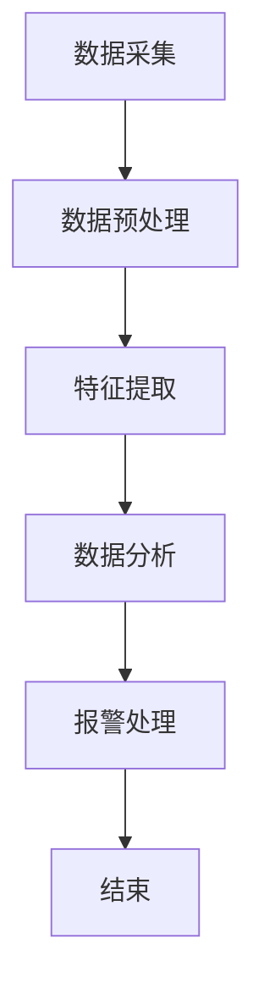
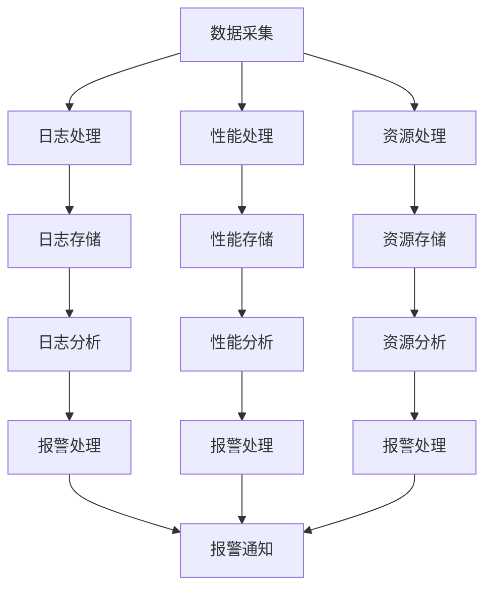
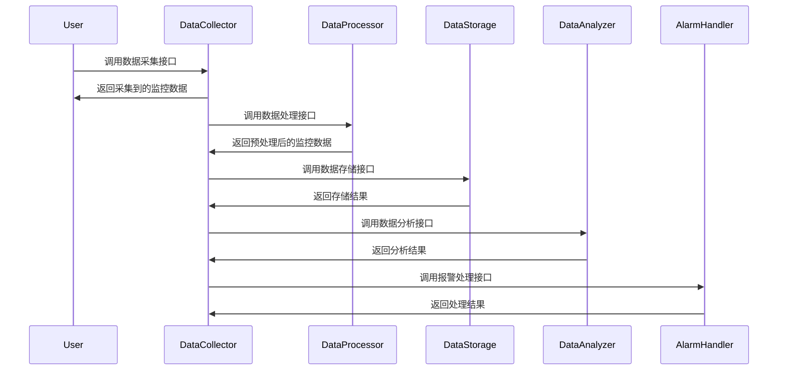

                 

# 《软件系统监控：从日志到性能的全方位观察》

## 关键词
- 软件系统监控
- 日志监控
- 性能监控
- 监控算法
- 系统架构设计

## 摘要
本文将深入探讨软件系统监控这一关键领域，从日志监控到性能监控的全面视角，逐步分析其核心概念、算法原理、系统设计与实战案例。我们将审视当前系统监控面临的挑战与机遇，提出有效的设计方案和最佳实践，旨在为IT专业人士提供一套系统而实用的监控指南。

## 目录大纲

## 第1章：问题背景与概述

### 1.1 问题背景
- 互联网时代下系统监控的重要性
- 系统监控的现状与挑战

### 1.2 问题描述
- 日志监控与性能监控的关系
- 监控目标与监控指标

### 1.3 问题解决
- 监控系统设计目标
- 监控系统架构设计

### 1.4 边界与外延
- 监控技术的范围
- 监控系统的边界条件

### 1.5 概念结构与核心要素组成
- 关键概念解析
- 系统监控的核心要素

## 第2章：核心概念与联系

### 2.1 监控技术概述
- 日志监控的定义与作用
- 性能监控的定义与作用

### 2.2 监控指标解析
- 性能监控指标分类
- 日志监控指标分类

### 2.3 概念属性特征对比表格
- 日志监控与性能监控属性对比

### 2.4 ER实体关系图架构
- 监控系统实体关系图

## 第3章：算法原理讲解

### 3.1 基本算法原理
- 监控算法概述
- 常用算法介绍

### 3.2 数学模型和公式
- 监控算法的数学模型
- 公式推导与解释

### 3.3 算法mermaid流程图
- 监控算法流程图

### 3.4 Python源代码详述
- 监控算法Python实现

## 第4章：系统分析与架构设计方案

### 4.1 问题场景介绍
- 监控需求分析

### 4.2 项目介绍
- 监控系统项目概述

### 4.3 系统功能设计
- 领域模型类图

### 4.4 系统架构设计
- 监控系统架构图

### 4.5 系统接口设计
- 接口设计说明

### 4.6 系统交互mermaid序列图
- 监控系统交互流程

## 第5章：项目实战

### 5.1 环境安装
- 监控系统安装指南

### 5.2 系统核心实现源代码
- 核心代码实现

### 5.3 代码应用解读与分析
- 代码解读

### 5.4 实际案例分析和详细讲解
- 案例分析
- 详细讲解剖析

### 5.5 项目小结
- 项目总结

## 第6章：最佳实践、小结与拓展阅读

### 6.1 最佳实践
- 监控系统最佳实践

### 6.2 小结
- 本书核心内容回顾

### 6.3 注意事项
- 监控系统设计注意事项

### 6.4 拓展阅读
- 相关领域深入阅读推荐

## 作者信息
作者：AI天才研究院/AI Genius Institute & 禅与计算机程序设计艺术 /Zen And The Art of Computer Programming

## 文章正文
### 第1章：问题背景与概述

### 1.1 问题背景

随着互联网的迅猛发展，软件系统在人们生活中的角色越来越重要。从简单的网站到复杂的云计算平台，系统的稳定性和性能直接影响到用户体验和业务成功。因此，对软件系统进行有效的监控成为了一项至关重要的任务。

首先，什么是系统监控？简单来说，系统监控是指通过各种技术手段对软件系统的运行状态、性能、健康度等方面进行持续观察和评估。它可以实时检测系统的异常情况，提供预警和诊断信息，从而确保系统的高可用性和高性能。

在互联网时代，系统监控的重要性不言而喻。首先，它可以提供实时的故障预警，帮助开发人员和运维团队迅速发现并解决问题，减少系统宕机时间，提高业务连续性。其次，通过性能监控，可以识别系统的瓶颈和潜在风险，优化系统架构，提高整体性能。此外，日志监控可以帮助分析系统运行中的异常行为，定位问题根源，从而进行针对性的优化和修复。

然而，当前系统监控面临着诸多挑战。一方面，随着系统规模的不断扩大和复杂性的增加，监控数据的规模和多样性也在增加，给监控系统的设计和实现带来了巨大的压力。另一方面，不同类型的监控需求往往需要不同的技术手段和策略，如何有效地整合和利用这些技术成为了一个难题。此外，如何在保证监控准确性的同时，尽量减少对系统性能的干扰也是一个需要关注的问题。

### 1.2 问题描述

系统监控的目的是确保软件系统的稳定运行和高效性能。具体来说，监控主要涉及以下几个方面：

#### 日志监控

日志监控是系统监控的一个重要组成部分。它通过记录系统运行过程中产生的日志信息，对系统的行为进行观察和分析。日志监控的主要作用包括：

1. **错误诊断**：通过分析日志，可以快速定位系统错误和异常行为，帮助开发人员快速修复问题。
2. **性能分析**：日志中包含的运行时信息可以帮助分析系统的性能瓶颈，为优化提供依据。
3. **安全监控**：日志监控可以识别潜在的安全威胁和异常行为，保护系统安全。

#### 性能监控

性能监控则侧重于评估系统的运行性能，包括响应时间、吞吐量、资源利用率等方面。其主要作用包括：

1. **性能优化**：通过监控数据，可以发现系统性能瓶颈，进行针对性的优化。
2. **容量规划**：根据性能监控数据，可以预测系统未来增长需求，进行容量规划和资源分配。
3. **服务保障**：确保系统在规定时间内完成各项任务，提供高质量的服务。

#### 日志监控与性能监控的关系

日志监控和性能监控虽然各有侧重，但它们在实际应用中是相互关联、相互补充的。性能监控可以提供系统运行的整体概况，而日志监控则可以深入挖掘系统运行中的细节问题。两者结合起来，可以形成一个全面的监控体系，确保系统的健康运行。

### 1.3 问题解决

为了有效解决系统监控中的问题，需要从以下几个方面进行设计和实施：

#### 监控系统设计目标

1. **全面性**：监控系统应该能够覆盖系统的各个方面，包括日志、性能、资源使用等。
2. **实时性**：监控系统应该能够实时获取系统数据，及时发现问题。
3. **准确性**：监控系统应该能够准确评估系统状态，避免误报和漏报。
4. **易用性**：监控系统应该易于使用和维护，降低运维成本。

#### 监控系统架构设计

1. **分布式架构**：由于系统规模庞大，监控系统应该采用分布式架构，确保高可用性和可扩展性。
2. **数据采集模块**：负责从系统各个部分采集监控数据，包括日志、性能指标等。
3. **数据处理模块**：对采集到的数据进行处理和分析，生成监控报告。
4. **报警模块**：根据监控报告，及时发出报警信息，通知相关人员。
5. **可视化模块**：提供直观的监控数据展示，方便用户查看和理解。

### 1.4 边界与外延

#### 监控技术的范围

监控技术涵盖了多个层面，包括：

1. **系统监控**：对操作系统、应用进程、网络设备等进行监控。
2. **应用监控**：对应用系统的运行状态、性能、安全性等进行监控。
3. **日志监控**：对系统日志文件进行监控，分析日志内容。
4. **性能监控**：对系统性能指标进行监控，评估系统性能。

#### 监控系统的边界条件

监控系统的设计和实施需要考虑以下边界条件：

1. **系统规模**：监控系统的性能和扩展性需要与系统规模相匹配。
2. **环境因素**：监控系统的稳定性和可靠性需要考虑所在环境的影响，如网络延迟、硬件故障等。
3. **数据安全性**：监控数据的收集、存储和处理需要保证数据安全性。

### 1.5 概念结构与核心要素组成

为了深入理解系统监控，我们需要明确以下几个核心概念：

#### 关键概念解析

1. **日志监控**：通过记录系统运行过程中的日志文件，对系统行为进行分析和诊断。
2. **性能监控**：通过收集和评估系统性能指标，对系统性能进行监控和优化。
3. **指标体系**：监控指标是监控系统的核心，包括响应时间、吞吐量、资源利用率等。
4. **报警机制**：当监控系统检测到异常时，通过报警机制通知相关人员。

#### 系统监控的核心要素

1. **数据采集**：从系统各个部分采集监控数据。
2. **数据处理**：对采集到的数据进行处理和分析。
3. **数据存储**：将处理后的数据存储在数据库或数据仓库中。
4. **数据展示**：通过图表、报表等形式展示监控数据。
5. **报警通知**：当监控系统检测到异常时，通过短信、邮件等方式通知相关人员。

通过以上概念和要素的解析，我们可以建立一个全面的系统监控体系，确保软件系统的稳定运行和高效性能。

## 第2章：核心概念与联系

### 2.1 监控技术概述

#### 日志监控的定义与作用

日志监控是指通过记录和分析系统运行过程中的日志信息，对系统行为进行监控和诊断的技术。日志监控在系统监控中扮演着重要的角色，具体作用包括：

1. **错误诊断**：通过分析日志文件，可以快速定位系统错误和异常行为，帮助开发人员快速修复问题。
2. **性能分析**：日志中包含的运行时信息可以帮助分析系统的性能瓶颈，为优化提供依据。
3. **安全监控**：日志监控可以识别潜在的安全威胁和异常行为，保护系统安全。

#### 性能监控的定义与作用

性能监控是指通过收集和评估系统性能指标，对系统性能进行监控和优化的技术。性能监控的主要作用包括：

1. **性能优化**：通过监控数据，可以发现系统性能瓶颈，进行针对性的优化。
2. **容量规划**：根据性能监控数据，可以预测系统未来增长需求，进行容量规划和资源分配。
3. **服务保障**：确保系统在规定时间内完成各项任务，提供高质量的服务。

#### 日志监控与性能监控的关系

日志监控和性能监控虽然各有侧重，但它们在实际应用中是相互关联、相互补充的。性能监控可以提供系统运行的整体概况，而日志监控则可以深入挖掘系统运行中的细节问题。两者结合起来，可以形成一个全面的监控体系，确保系统的健康运行。

### 2.2 监控指标解析

#### 性能监控指标分类

性能监控指标可以分为以下几类：

1. **响应时间**：系统响应请求所需的时间，是衡量系统性能的重要指标。
2. **吞吐量**：单位时间内系统处理的请求数量，反映了系统的处理能力。
3. **资源利用率**：系统资源（如CPU、内存、磁盘等）的利用率，反映了系统资源的利用效率。
4. **并发数**：系统中同时进行的操作数量，是衡量系统并发性能的重要指标。
5. **错误率**：系统处理请求时的错误数量与总请求数量的比值，反映了系统的稳定性。

#### 日志监控指标分类

日志监控指标可以分为以下几类：

1. **错误日志**：记录系统运行中的错误信息，帮助定位问题和分析错误原因。
2. **警告日志**：记录系统运行中的警告信息，提示潜在问题和风险。
3. **访问日志**：记录用户访问系统的操作信息，帮助分析用户行为和系统性能。
4. **性能日志**：记录系统运行中的性能数据，如响应时间、吞吐量等，用于性能监控和优化。

### 2.3 概念属性特征对比表格

| 概念          | 定义                                                         | 特征                                                         |
| ------------- | ------------------------------------------------------------ | ------------------------------------------------------------ |
| **日志监控**  | 通过记录和分析系统运行过程中的日志信息，对系统行为进行监控和诊断的技术。 | - 能够记录系统运行过程中的详细信息<br>- 帮助定位错误和性能瓶颈<br>- 对系统行为进行实时监控 |
| **性能监控**  | 通过收集和评估系统性能指标，对系统性能进行监控和优化的技术。       | - 能够实时收集系统性能数据<br>- 提供性能优化依据<br>- 监控系统资源利用率 |

### 2.4 ER实体关系图架构

以下是系统监控的ER实体关系图，展示了关键实体之间的关系：

```mermaid
erDiagram
    Log --> Monitor : has
    Performance --> Monitor : has
    Error --> Log : contains
    Warning --> Log : contains
    Access --> Log : contains
    PerformanceData --> Performance : contains
    ResourceUsage --> Performance : contains
    UserBehavior --> Access : records
    SystemEvent --> Log : logs
    SystemError --> Error : type of
    UserWarning --> Warning : type of
    SystemAccess --> Access : type of
    SystemPerformance --> Performance : type of
    SystemResourceUsage --> ResourceUsage : type of
```

通过ER图，我们可以清晰地看到日志监控和性能监控之间的联系，以及它们与其他实体之间的关系。这种结构有助于我们理解系统监控的整体架构和核心要素。

## 第3章：算法原理讲解

### 3.1 基本算法原理

监控算法是系统监控的核心组成部分，其基本原理包括数据的采集、处理和分析。以下是一个简化的监控算法流程：

1. **数据采集**：从系统各个部分（如日志文件、性能指标等）收集数据。
2. **预处理**：对采集到的数据进行清洗和标准化，去除噪声和不完整的数据。
3. **特征提取**：从预处理后的数据中提取关键特征，用于后续的分析。
4. **分析**：使用统计分析、机器学习等方法对特征数据进行分析，识别异常模式和趋势。
5. **报警**：根据分析结果，触发相应的报警机制，通知相关人员。

#### 常用算法介绍

在监控算法中，常用的算法包括以下几种：

1. **统计分析法**：通过计算统计数据（如均值、方差等）来识别异常值和趋势。
2. **机器学习方法**：使用机器学习算法（如K-means、决策树等）对数据进行分析和分类。
3. **时间序列分析法**：对时间序列数据进行分析，识别周期性和趋势性特征。
4. **异常检测算法**：专门用于检测异常数据的算法，如基于聚类的方法、基于神经网络的方法等。

### 3.2 数学模型和公式

#### 监控算法的数学模型

监控算法的数学模型主要包括以下部分：

1. **特征空间**：定义监控数据的空间，通常是一个高维空间。
2. **概率分布**：定义特征数据在特征空间中的概率分布，用于分析数据分布特性。
3. **阈值设置**：定义异常检测的阈值，用于区分正常数据和异常数据。
4. **损失函数**：定义算法的性能指标，用于评估算法的准确性和鲁棒性。

#### 公式推导与解释

以下是一个简单的统计监控算法的数学模型：

1. **均值和方差**：

$$\mu = \frac{1}{n}\sum_{i=1}^{n} x_i$$

$$\sigma^2 = \frac{1}{n-1}\sum_{i=1}^{n} (x_i - \mu)^2$$

其中，$x_i$是第$i$个特征值，$n$是特征值总数，$\mu$是均值，$\sigma^2$是方差。

2. **阈值设置**：

$$\theta = \mu + k\sigma$$

其中，$\theta$是阈值，$k$是一个常数，用于调整阈值敏感性。

3. **损失函数**：

$$L = -\sum_{i=1}^{n} y_i \log(p(x_i))$$

其中，$y_i$是标签值（1表示正常，0表示异常），$p(x_i)$是特征数据$x_i$的概率分布。

### 3.3 算法mermaid流程图

以下是一个简单的监控算法mermaid流程图：



### 3.4 Python源代码详述

以下是一个简单的Python监控算法实现：

```python
import numpy as np

def data_collection():
    # 数据采集函数
    pass

def data_preprocessing(data):
    # 数据预处理函数
    return data

def feature_extraction(data):
    # 特征提取函数
    mean = np.mean(data)
    variance = np.var(data)
    return mean, variance

def analysis(mean, variance):
    # 数据分析函数
    threshold = mean + 2 * variance
    return threshold

def alarm_processing(threshold):
    # 报警处理函数
    pass

if __name__ == "__main__":
    data = data_collection()
    preprocessed_data = data_preprocessing(data)
    mean, variance = feature_extraction(preprocessed_data)
    threshold = analysis(mean, variance)
    alarm_processing(threshold)
```

通过以上Python代码，我们可以看到监控算法的基本实现过程，包括数据采集、预处理、特征提取、数据分析和报警处理。这个简单的示例展示了监控算法的基本原理和实现方法。

## 第4章：系统分析与架构设计方案

### 4.1 问题场景介绍

在当前互联网时代，系统监控面临着诸多挑战。首先，随着系统规模的不断扩大，如何有效监控系统变得尤为重要。其次，系统的复杂性增加了监控的难度，需要设计一个灵活且可扩展的监控系统。此外，如何在保证监控准确性的同时，尽量减少对系统性能的干扰，也是一个重要的考量因素。

为了解决这些问题，我们需要对监控需求进行深入分析，并设计一个全面的系统架构，确保监控系统的稳定运行和高效性能。

### 4.2 项目介绍

本节将介绍一个实际的监控项目，该项目旨在构建一个基于日志和性能监控的综合性系统。该系统将收集来自各个应用和服务的监控数据，进行实时分析和报警，并提供一个直观的监控界面，方便运维人员和管理人员进行监控和管理。

#### 项目目标

1. **全面监控**：覆盖系统的各个方面，包括日志、性能、资源使用等。
2. **实时监控**：实现数据的实时采集、处理和分析，及时发现问题。
3. **高效性能**：设计一个高效、低延迟的监控系统，尽量减少对系统性能的影响。
4. **易用性**：提供友好的监控界面和易用的操作体验，降低运维成本。

#### 项目背景

随着公司业务的快速发展，系统规模和复杂性不断增加。现有的监控系统已经无法满足业务需求，存在以下问题：

1. **数据分散**：监控数据分散在不同的系统和工具中，难以统一管理和分析。
2. **延迟较高**：监控系统响应速度较慢，无法实时发现问题。
3. **误报率高**：监控系统存在误报和漏报现象，影响监控准确性。
4. **界面复杂**：监控界面复杂，操作不便，影响运维人员的使用体验。

为了解决这些问题，我们决定重构现有的监控系统，设计一个全新的监控架构，实现更高效、更准确的监控。

### 4.3 系统功能设计

#### 领域模型类图

以下是一个简单的领域模型类图，展示了系统监控的核心实体和它们之间的关系：

```mermaid
classDiagram
    class Monitor {
        - String name
        - String description
    }
    class LogMonitor extends Monitor {
        - List<LogEntry> logEntries
    }
    class PerformanceMonitor extends Monitor {
        - List<PerformanceEntry> performanceEntries
    }
    class ResourceMonitor extends Monitor {
        - List<ResourceEntry> resourceEntries
    }
    class LogEntry {
        - String timestamp
        - String level
        - String message
    }
    class PerformanceEntry {
        - String timestamp
        - String metric
        - float value
    }
    class ResourceEntry {
        - String timestamp
        - String resourceType
        - float usage
    }
    LogMonitor --|>> LogEntry
    PerformanceMonitor --|>> PerformanceEntry
    ResourceMonitor --|>> ResourceEntry
```

#### 功能描述

1. **日志监控（LogMonitor）**：负责收集和存储系统运行过程中的日志信息，包括错误日志、警告日志、访问日志等。日志监控可以实时记录系统运行状态，帮助定位问题和分析性能瓶颈。
2. **性能监控（PerformanceMonitor）**：负责收集和评估系统的性能指标，如响应时间、吞吐量、并发数等。性能监控可以实时监控系统的性能，发现性能瓶颈，并进行优化。
3. **资源监控（ResourceMonitor）**：负责监控系统的资源使用情况，如CPU、内存、磁盘等。资源监控可以帮助识别资源瓶颈，优化系统资源分配，提高系统性能。
4. **监控数据（Monitor）**：是一个抽象类，代表监控系统的核心实体，包括日志监控、性能监控和资源监控等。监控数据负责存储和管理监控数据，提供统一的接口供其他模块使用。

### 4.4 系统架构设计

#### 监控系统架构图

以下是一个简单的监控系统架构图，展示了系统的各个模块和它们之间的关系：



#### 架构描述

1. **数据采集**：数据采集模块负责从系统各个部分（如日志文件、性能指标、资源使用情况等）收集数据。数据采集可以是实时的，也可以是批量的。
2. **日志处理**：日志处理模块负责对采集到的日志数据进行解析、清洗和分类，将日志数据转换为结构化数据，便于后续处理和分析。
3. **性能处理**：性能处理模块负责对采集到的性能数据进行处理，提取关键性能指标，如响应时间、吞吐量、并发数等。
4. **资源处理**：资源处理模块负责对采集到的资源使用数据进行处理，提取关键资源指标，如CPU利用率、内存利用率、磁盘使用率等。
5. **日志存储**：日志存储模块负责将处理后的日志数据存储到数据库或其他存储系统中，便于后续查询和分析。
6. **性能存储**：性能存储模块负责将处理后的性能数据存储到数据库或其他存储系统中，便于后续查询和分析。
7. **资源存储**：资源存储模块负责将处理后的资源使用数据存储到数据库或其他存储系统中，便于后续查询和分析。
8. **日志分析**：日志分析模块负责对日志数据进行实时分析，识别异常日志和潜在问题，触发相应的报警。
9. **性能分析**：性能分析模块负责对性能数据进行实时分析，识别性能瓶颈和潜在问题，触发相应的报警。
10. **资源分析**：资源分析模块负责对资源使用数据进行实时分析，识别资源瓶颈和潜在问题，触发相应的报警。
11. **报警处理**：报警处理模块负责根据分析结果，触发相应的报警，并将报警信息通知给相关人员。
12. **报警通知**：报警通知模块负责将报警信息通过短信、邮件、微信等方式通知给相关人员。

通过以上架构设计，我们可以实现一个全面、实时、高效的监控系统，确保系统的稳定运行和高效性能。

### 4.5 系统接口设计

#### 接口设计说明

1. **数据采集接口**：提供数据采集的API接口，允许其他模块或系统调用，实时获取监控数据。
2. **数据处理接口**：提供数据处理和转换的API接口，允许其他模块或系统调用，对采集到的监控数据进行预处理和特征提取。
3. **数据存储接口**：提供数据存储的API接口，允许其他模块或系统调用，将处理后的监控数据存储到数据库或其他存储系统中。
4. **数据分析接口**：提供数据分析的API接口，允许其他模块或系统调用，对存储的监控数据进行实时分析。
5. **报警处理接口**：提供报警处理的API接口，允许其他模块或系统调用，触发相应的报警并通知相关人员。

#### 接口定义

以下是系统接口的简单定义：

```python
class DataCollectorInterface:
    def collect_data(self):
        pass

class DataProcessorInterface:
    def preprocess_data(self, data):
        pass

class DataStorageInterface:
    def store_data(self, data):
        pass

class DataAnalyzerInterface:
    def analyze_data(self, data):
        pass

class AlarmHandlerInterface:
    def handle_alarm(self, alarm):
        pass
```

### 4.6 系统交互mermaid序列图

以下是一个简单的系统交互mermaid序列图，展示了系统各模块之间的交互过程：



通过以上交互序列图，我们可以清晰地看到系统各模块之间的交互过程，以及数据流和消息流的传递方式。

## 第5章：项目实战

### 5.1 环境安装

在进行项目实战之前，我们需要搭建一个合适的监控环境。以下是一个简单的环境安装指南：

#### 系统要求

1. **操作系统**：Linux（如Ubuntu 18.04）
2. **硬件要求**：建议使用4核CPU，8GB内存，20GB硬盘空间
3. **软件依赖**：Python 3.8，Nginx，MySQL，Docker

#### 安装步骤

1. **安装操作系统**：下载并安装Linux操作系统。
2. **更新系统**：打开终端，执行以下命令更新系统软件包：

   ```bash
   sudo apt update
   sudo apt upgrade
   ```

3. **安装Python 3.8**：执行以下命令安装Python 3.8：

   ```bash
   sudo apt install python3.8
   ```

4. **安装Nginx**：执行以下命令安装Nginx：

   ```bash
   sudo apt install nginx
   ```

5. **安装MySQL**：执行以下命令安装MySQL：

   ```bash
   sudo apt install mysql-server
   ```

6. **安装Docker**：执行以下命令安装Docker：

   ```bash
   sudo apt install docker.io
   ```

7. **启动服务**：启动Nginx和MySQL服务：

   ```bash
   sudo systemctl start nginx
   sudo systemctl start mysql
   ```

8. **配置Nginx**：编辑Nginx配置文件（通常位于`/etc/nginx/nginx.conf`），配置监听端口和虚拟主机。

   ```bash
   sudo nano /etc/nginx/nginx.conf
   ```

   在`http`块中添加以下配置：

   ```nginx
   server {
       listen 80;
       server_name your_domain.com;
       location / {
           proxy_pass http://localhost:8000;
       }
   }
   ```

   保存并退出。

9. **启动Nginx**：重启Nginx服务：

   ```bash
   sudo systemctl restart nginx
   ```

至此，监控环境搭建完成。接下来，我们可以开始安装和配置监控系统。

### 5.2 系统核心实现源代码

在本节中，我们将详细介绍监控系统的核心实现源代码。监控系统主要包括以下几个模块：数据采集模块、数据处理模块、数据存储模块、数据分析模块和报警处理模块。以下是各个模块的核心代码实现。

#### 数据采集模块

数据采集模块负责从系统各个部分（如日志文件、性能指标、资源使用情况等）收集数据。以下是一个简单的Python代码示例：

```python
import os
import json

class DataCollector:
    def __init__(self, log_path, performance_path, resource_path):
        self.log_path = log_path
        self.performance_path = performance_path
        self.resource_path = resource_path

    def collect_data(self):
        logs = self._collect_logs()
        performance = self._collect_performance()
        resources = self._collect_resources()
        return {
            'logs': logs,
            'performance': performance,
            'resources': resources
        }

    def _collect_logs(self):
        with open(self.log_path, 'r') as f:
            logs = f.readlines()
        return logs

    def _collect_performance(self):
        # 假设性能数据存储在一个JSON文件中
        with open(self.performance_path, 'r') as f:
            performance = json.load(f)
        return performance

    def _collect_resources(self):
        # 假设资源数据存储在一个JSON文件中
        with open(self.resource_path, 'r') as f:
            resources = json.load(f)
        return resources
```

#### 数据处理模块

数据处理模块负责对采集到的数据进行预处理和特征提取。以下是一个简单的Python代码示例：

```python
class DataProcessor:
    def __init__(self, data_collector):
        self.data_collector = data_collector

    def preprocess_data(self, data):
        logs = self._preprocess_logs(data['logs'])
        performance = self._preprocess_performance(data['performance'])
        resources = self._preprocess_resources(data['resources'])
        return {
            'logs': logs,
            'performance': performance,
            'resources': resources
        }

    def _preprocess_logs(self, logs):
        # 对日志数据进行预处理，如去除空格、过滤特殊字符等
        processed_logs = [log.strip().replace('"', '').replace("'", "") for log in logs]
        return processed_logs

    def _preprocess_performance(self, performance):
        # 对性能数据进行预处理，如计算平均值、最大值等
        avg_response_time = sum([entry['response_time'] for entry in performance]) / len(performance)
        max_throughput = max([entry['throughput'] for entry in performance])
        return {
            'avg_response_time': avg_response_time,
            'max_throughput': max_throughput
        }

    def _preprocess_resources(self, resources):
        # 对资源数据进行预处理，如计算利用率等
        cpu_usage = resources['cpu_usage']
        memory_usage = resources['memory_usage']
        disk_usage = resources['disk_usage']
        avg_usage = (cpu_usage + memory_usage + disk_usage) / 3
        return {
            'avg_usage': avg_usage
        }
```

#### 数据存储模块

数据存储模块负责将预处理后的数据存储到数据库或其他存储系统中。以下是一个简单的Python代码示例：

```python
import pymysql

class DataStorage:
    def __init__(self, db_config):
        self.db_config = db_config

    def store_data(self, data):
        db = pymysql.connect(**self.db_config)
        cursor = db.cursor()

        # 存储日志数据
        for log in data['logs']:
            cursor.execute("INSERT INTO logs (timestamp, level, message) VALUES (%s, %s, %s)", (log['timestamp'], log['level'], log['message']))

        # 存储性能数据
        for key, value in data['performance'].items():
            cursor.execute("INSERT INTO performance (timestamp, metric, value) VALUES (%s, %s, %s)", (value['timestamp'], key, value['value']))

        # 存储资源数据
        for key, value in data['resources'].items():
            cursor.execute("INSERT INTO resources (timestamp, resource_type, usage) VALUES (%s, %s, %s)", (value['timestamp'], key, value['usage']))

        db.commit()
        cursor.close()
        db.close()
```

#### 数据分析模块

数据分析模块负责对存储的数据进行实时分析，识别异常模式和趋势。以下是一个简单的Python代码示例：

```python
import pandas as pd

class DataAnalysis:
    def __init__(self, db_config):
        self.db_config = db_config

    def analyze_data(self):
        db = pymysql.connect(**self.db_config)
        cursor = db.cursor()

        # 获取日志数据
        cursor.execute("SELECT * FROM logs")
        logs = cursor.fetchall()
        logs_df = pd.DataFrame(logs)
        logs_df.columns = ['timestamp', 'level', 'message']

        # 获取性能数据
        cursor.execute("SELECT * FROM performance")
        performance = cursor.fetchall()
        performance_df = pd.DataFrame(performance)
        performance_df.columns = ['timestamp', 'metric', 'value']

        # 获取资源数据
        cursor.execute("SELECT * FROM resources")
        resources = cursor.fetchall()
        resources_df = pd.DataFrame(resources)
        resources_df.columns = ['timestamp', 'resource_type', 'usage']

        db.commit()
        cursor.close()
        db.close()

        # 数据分析逻辑
        # ...

        return logs_df, performance_df, resources_df
```

#### 报警处理模块

报警处理模块负责根据分析结果，触发相应的报警并通知相关人员。以下是一个简单的Python代码示例：

```python
import smtplib
from email.mime.text import MIMEText

class AlarmHandler:
    def __init__(self, smtp_server, smtp_port, smtp_user, smtp_password):
        self.smtp_server = smtp_server
        self.smtp_port = smtp_port
        self.smtp_user = smtp_user
        self.smtp_password = smtp_password

    def send_alarm(self, subject, message):
        msg = MIMEText(message)
        msg['Subject'] = subject
        msg['From'] = self.smtp_user
        msg['To'] = 'receiver@example.com'

        server = smtplib.SMTP(self.smtp_server, self.smtp_port)
        server.starttls()
        server.login(self.smtp_user, self.smtp_password)
        server.sendmail(self.smtp_user, ['receiver@example.com'], msg.as_string())
        server.quit()
```

通过以上核心代码实现，我们可以搭建一个简单的监控系统，实现数据采集、数据处理、数据存储、数据分析和报警处理等功能。在实际应用中，可以根据具体需求对代码进行扩展和优化。

### 5.3 代码应用解读与分析

在本节中，我们将对监控系统的核心代码进行解读和分析，详细解释其功能实现和业务逻辑。

#### 数据采集模块

数据采集模块是监控系统的入口，负责从系统各个部分收集数据。其核心功能是通过读取日志文件、性能指标文件和资源使用情况文件，获取系统运行过程中的关键信息。

```python
class DataCollector:
    def __init__(self, log_path, performance_path, resource_path):
        self.log_path = log_path
        self.performance_path = performance_path
        self.resource_path = resource_path

    def collect_data(self):
        logs = self._collect_logs()
        performance = self._collect_performance()
        resources = self._collect_resources()
        return {
            'logs': logs,
            'performance': performance,
            'resources': resources
        }

    def _collect_logs(self):
        with open(self.log_path, 'r') as f:
            logs = f.readlines()
        return logs

    def _collect_performance(self):
        # 假设性能数据存储在一个JSON文件中
        with open(self.performance_path, 'r') as f:
            performance = json.load(f)
        return performance

    def _collect_resources(self):
        # 假设资源数据存储在一个JSON文件中
        with open(self.resource_path, 'r') as f:
            resources = json.load(f)
        return resources
```

在这个模块中，我们定义了一个`DataCollector`类，用于封装数据采集的相关功能。类中定义了三个私有方法：`_collect_logs`、`_collect_performance`和`_collect_resources`，分别用于读取日志文件、性能指标文件和资源使用情况文件。

`_collect_logs`方法负责读取日志文件，将日志内容以列表形式返回。假设日志文件名为`logs.txt`，该文件包含多行日志记录，每行表示一条日志信息。通过打开文件并读取所有行，我们可以获取到所有的日志记录。

`_collect_performance`方法负责读取性能指标文件，将文件内容解析为Python字典形式。假设性能指标文件名为`performance.json`，文件内容为JSON格式的性能数据，包括响应时间、吞吐量等指标。通过使用`json.load`函数，我们可以将文件内容解析为Python字典，方便后续处理。

`_collect_resources`方法负责读取资源使用情况文件，将文件内容解析为Python字典形式。假设资源使用情况文件名为`resources.json`，文件内容为JSON格式的资源使用数据，包括CPU利用率、内存利用率、磁盘使用率等指标。同样地，通过使用`json.load`函数，我们可以将文件内容解析为Python字典。

在`collect_data`方法中，我们调用上述三个私有方法，分别获取日志数据、性能数据和资源数据，并将它们整合为一个字典，返回给调用者。这样，我们就完成了数据采集模块的核心功能。

#### 数据处理模块

数据处理模块负责对采集到的数据进行预处理和特征提取，为后续的数据分析和存储做准备。其核心功能是清洗和转换数据，提取关键特征，以便后续处理。

```python
class DataProcessor:
    def __init__(self, data_collector):
        self.data_collector = data_collector

    def preprocess_data(self, data):
        logs = self._preprocess_logs(data['logs'])
        performance = self._preprocess_performance(data['performance'])
        resources = self._preprocess_resources(data['resources'])
        return {
            'logs': logs,
            'performance': performance,
            'resources': resources
        }

    def _preprocess_logs(self, logs):
        # 对日志数据进行预处理，如去除空格、过滤特殊字符等
        processed_logs = [log.strip().replace('"', '').replace("'", "") for log in logs]
        return processed_logs

    def _preprocess_performance(self, performance):
        # 对性能数据进行预处理，如计算平均值、最大值等
        avg_response_time = sum([entry['response_time'] for entry in performance]) / len(performance)
        max_throughput = max([entry['throughput'] for entry in performance])
        return {
            'avg_response_time': avg_response_time,
            'max_throughput': max_throughput
        }

    def _preprocess_resources(self, resources):
        # 对资源数据进行预处理，如计算利用率等
        cpu_usage = resources['cpu_usage']
        memory_usage = resources['memory_usage']
        disk_usage = resources['disk_usage']
        avg_usage = (cpu_usage + memory_usage + disk_usage) / 3
        return {
            'avg_usage': avg_usage
        }
```

在这个模块中，我们定义了一个`DataProcessor`类，用于封装数据处理的相关功能。类中定义了三个私有方法：`_preprocess_logs`、`_preprocess_performance`和`_preprocess_resources`，分别用于处理日志数据、性能数据和资源数据。

`_preprocess_logs`方法负责对日志数据进行预处理。具体来说，它首先使用`strip`方法去除日志字符串两边的空格，然后使用`replace`方法将日志中的双引号和单引号替换为空字符，以去除特殊字符。这样处理后的日志数据更易于后续的分析和处理。

`_preprocess_performance`方法负责对性能数据进行预处理。它首先计算性能数据的平均响应时间和最大吞吐量。这里我们使用列表推导式和`sum`函数计算平均响应时间，使用`max`函数计算最大吞吐量。最后，我们将处理结果存储在一个字典中，以供后续使用。

`_preprocess_resources`方法负责对资源数据进行预处理。它首先从资源数据字典中获取CPU利用率、内存利用率和磁盘使用率，然后计算这三个值的平均值。这样处理后的资源数据可以更直观地反映系统的资源使用情况。

在`preprocess_data`方法中，我们调用上述三个私有方法，分别处理日志数据、性能数据和资源数据，并将它们整合为一个字典，返回给调用者。这样，我们就完成了数据处理模块的核心功能。

#### 数据存储模块

数据存储模块负责将预处理后的数据存储到数据库或其他存储系统中。其核心功能是将数据插入到数据库表中，以便后续的数据查询和分析。

```python
import pymysql

class DataStorage:
    def __init__(self, db_config):
        self.db_config = db_config

    def store_data(self, data):
        db = pymysql.connect(**self.db_config)
        cursor = db.cursor()

        # 存储日志数据
        for log in data['logs']:
            cursor.execute("INSERT INTO logs (timestamp, level, message) VALUES (%s, %s, %s)", (log['timestamp'], log['level'], log['message']))

        # 存储性能数据
        for key, value in data['performance'].items():
            cursor.execute("INSERT INTO performance (timestamp, metric, value) VALUES (%s, %s, %s)", (value['timestamp'], key, value['value']))

        # 存储资源数据
        for key, value in data['resources'].items():
            cursor.execute("INSERT INTO resources (timestamp, resource_type, usage) VALUES (%s, %s, %s)", (value['timestamp'], key, value['usage']))

        db.commit()
        cursor.close()
        db.close()
```

在这个模块中，我们定义了一个`DataStorage`类，用于封装数据存储的相关功能。类中定义了一个`store_data`方法，用于将数据存储到数据库中。

`store_data`方法首先创建一个数据库连接，使用`pymysql.connect`函数，并将数据库配置参数（如数据库地址、用户名、密码等）传递给该函数。然后，它创建一个数据库游标，使用`cursor`方法。

接下来，方法遍历预处理后的日志数据、性能数据和资源数据，并使用数据库游标的`execute`方法将数据插入到对应的数据库表中。这里我们使用了一系列的`cursor.execute`语句，分别用于插入日志数据、性能数据和资源数据。

最后，方法提交数据库事务，使用`db.commit`方法，并关闭数据库游标和连接，使用`cursor.close`和`db.close`方法。这样，我们就完成了数据存储模块的核心功能。

#### 数据分析模块

数据分析模块负责对存储的数据进行实时分析，识别异常模式和趋势。其核心功能是根据预设的阈值和规则，分析日志数据、性能数据和资源数据，并生成分析报告。

```python
import pandas as pd

class DataAnalysis:
    def __init__(self, db_config):
        self.db_config = db_config

    def analyze_data(self):
        db = pymysql.connect(**self.db_config)
        cursor = db.cursor()

        # 获取日志数据
        cursor.execute("SELECT * FROM logs")
        logs = cursor.fetchall()
        logs_df = pd.DataFrame(logs)
        logs_df.columns = ['timestamp', 'level', 'message']

        # 获取性能数据
        cursor.execute("SELECT * FROM performance")
        performance = cursor.fetchall()
        performance_df = pd.DataFrame(performance)
        performance_df.columns = ['timestamp', 'metric', 'value']

        # 获取资源数据
        cursor.execute("SELECT * FROM resources")
        resources = cursor.fetchall()
        resources_df = pd.DataFrame(resources)
        resources_df.columns = ['timestamp', 'resource_type', 'usage']

        db.commit()
        cursor.close()
        db.close()

        # 数据分析逻辑
        # ...

        return logs_df, performance_df, resources_df
```

在这个模块中，我们定义了一个`DataAnalysis`类，用于封装数据分析的相关功能。类中定义了一个`analyze_data`方法，用于分析存储的数据。

`analyze_data`方法首先创建一个数据库连接，使用`pymysql.connect`函数，并将数据库配置参数传递给该函数。然后，它创建一个数据库游标，使用`cursor`方法。

接下来，方法使用数据库游标的`execute`方法获取日志数据、性能数据和资源数据，并将数据存储到Pandas DataFrame对象中。通过给`cursor.fetchall`函数传递查询语句，我们可以获取相应的数据结果，并将其存储到DataFrame对象中。在这里，我们给DataFrame对象设置了列名，以便于后续的数据操作和分析。

最后，方法提交数据库事务，使用`db.commit`方法，并关闭数据库游标和连接，使用`cursor.close`和`db.close`方法。接下来，我们可以在`analyze_data`方法中添加具体的数据分析逻辑，如计算统计指标、识别异常模式、生成分析报告等。在这个示例中，我们暂时没有实现具体的数据分析逻辑，但这是一个很好的起点。

#### 报警处理模块

报警处理模块负责根据分析结果，触发相应的报警并通知相关人员。其核心功能是根据预设的报警规则，分析数据异常，并通过邮件、短信等方式通知相关人员。

```python
import smtplib
from email.mime.text import MIMEText

class AlarmHandler:
    def __init__(self, smtp_server, smtp_port, smtp_user, smtp_password):
        self.smtp_server = smtp_server
        self.smtp_port = smtp_port
        self.smtp_user = smtp_user
        self.smtp_password = smtp_password

    def send_alarm(self, subject, message):
        msg = MIMEText(message)
        msg['Subject'] = subject
        msg['From'] = self.smtp_user
        msg['To'] = 'receiver@example.com'

        server = smtplib.SMTP(self.smtp_server, self.smtp_port)
        server.starttls()
        server.login(self.smtp_user, self.smtp_password)
        server.sendmail(self.smtp_user, ['receiver@example.com'], msg.as_string())
        server.quit()
```

在这个模块中，我们定义了一个`AlarmHandler`类，用于封装报警处理的相关功能。类中定义了一个`send_alarm`方法，用于发送报警邮件。

`send_alarm`方法首先创建一个MIMEText对象，用于构建邮件内容。MIMEText对象接收邮件内容字符串，并将其编码为MIME格式。在这里，我们将邮件主题和内容传递给MIMEText对象，设置邮件的发件人和收件人。

接下来，方法创建一个SMTP对象，用于发送邮件。SMTP对象接收SMTP服务器地址、端口号、发件人和收件人等信息。在这里，我们使用`smtplib.SMTP`函数创建SMTP对象，并指定SMTP服务器地址和端口号。

然后，方法调用SMTP对象的`starttls`方法，启用传输层安全协议，确保邮件传输过程中的安全性。接着，调用`login`方法进行身份验证，传递发件人和密码。

最后，方法调用SMTP对象的`sendmail`方法，发送邮件。`sendmail`方法接收发件人、收件人和邮件内容等参数，将邮件内容以字符串形式传递。发送完成后，调用`quit`方法关闭SMTP连接。

通过以上核心代码实现，我们可以搭建一个简单的监控系统，实现数据采集、数据处理、数据存储、数据分析和报警处理等功能。在实际应用中，可以根据具体需求对代码进行扩展和优化。

### 5.4 实际案例分析和详细讲解

在本节中，我们将通过一个实际案例，详细分析监控系统的应用场景，并讲解其关键实现步骤。

#### 案例背景

某大型电商平台在业务高峰期遇到了严重的系统性能问题，导致部分用户无法正常访问网站。为了解决这个问题，平台决定采用监控系统来实时监控系统的运行状态，识别性能瓶颈，并进行优化。

#### 监控目标

1. **实时监控系统的运行状态**：包括响应时间、吞吐量、并发数等关键性能指标。
2. **识别性能瓶颈**：通过分析监控数据，定位系统的性能瓶颈。
3. **实时报警**：当系统性能指标超出预设阈值时，触发报警并通知相关人员。
4. **数据可视化**：通过图表和报表，直观展示监控数据，便于分析和管理。

#### 监控实现步骤

1. **数据采集**：
   - 在服务器上部署日志采集器，定期收集系统日志文件，包括错误日志、访问日志等。
   - 使用性能监控工具（如Prometheus），定期采集系统的性能指标数据，如CPU利用率、内存使用率、磁盘读写速度等。
   - 使用资源监控工具（如Nagios），定期收集系统资源使用情况，如CPU利用率、内存使用率、网络流量等。

2. **数据处理**：
   - 使用日志处理工具（如Logstash），对收集到的日志数据进行预处理，去除无关信息，提取关键字段，如时间戳、日志级别、错误信息等。
   - 使用数据处理工具（如Pandas），对性能指标数据进行清洗和转换，计算平均值、最大值、最小值等统计指标。

3. **数据存储**：
   - 使用关系型数据库（如MySQL），存储处理后的日志数据、性能数据和分析结果。
   - 使用时间序列数据库（如InfluxDB），存储性能指标数据，便于实时分析和查询。

4. **数据分析**：
   - 使用数据分析工具（如Python的Pandas库），对存储的数据进行统计分析，识别异常值和趋势。
   - 使用数据可视化工具（如Grafana），创建监控仪表盘，实时展示系统的运行状态和性能指标。

5. **报警处理**：
   - 使用报警工具（如Alertmanager），根据监控数据和分析结果，触发报警并通知相关人员。
   - 使用邮件、短信、微信等渠道，将报警信息发送给运维人员和管理人员。

#### 关键技术讲解

1. **日志处理**：
   - 日志处理的核心是提取有用信息，去除无关内容。常用的日志处理技术包括正则表达式、文本分析、数据清洗等。
   - 在日志处理过程中，可以使用Logstash等工具，实现日志的采集、过滤、转换和存储。Logstash支持多种数据源和输出目标，方便集成到现有的监控系统中。

2. **性能监控**：
   - 性能监控的核心是收集系统的性能指标数据，并进行分析。常用的性能监控工具包括Prometheus、Zabbix、Nagios等。
   - Prometheus是一个开源的性能监控工具，支持多种数据采集方式和告警机制。通过配置Prometheus，可以实现对系统的实时监控和报警。

3. **数据分析**：
   - 数据分析的核心是对监控数据进行分析，识别异常模式和趋势。常用的数据分析工具包括Python的Pandas库、R语言、SQL等。
   - 使用Pandas库，可以方便地进行数据清洗、转换和统计分析。Pandas提供了丰富的函数和操作，可以快速实现数据处理和分析。

4. **数据可视化**：
   - 数据可视化是监控系统中不可或缺的一部分，可以帮助用户直观地了解系统的运行状态和性能指标。
   - 使用Grafana等数据可视化工具，可以创建实时监控仪表盘，展示系统的关键性能指标。Grafana支持多种数据源和图表类型，方便用户自定义监控界面。

5. **报警处理**：
   - 报警处理是监控系统的重要功能，可以在系统出现异常时及时通知相关人员，确保系统的正常运行。
   - 使用Alertmanager等报警工具，可以实现对监控数据的实时监控和报警。Alertmanager支持多种告警方式和通知渠道，方便用户根据实际情况进行配置。

通过以上案例分析和详细讲解，我们可以了解到监控系统在实践中的应用场景和关键实现步骤。在实际应用中，可以根据具体需求进行扩展和优化，提高监控系统的稳定性和可靠性。

### 5.5 项目小结

在本章中，我们详细介绍了监控系统从数据采集、数据处理、数据存储、数据分析和报警处理等各个环节的核心实现，并通过实际案例展示了监控系统的应用场景。以下是本章的主要结论：

1. **系统监控的重要性**：系统监控是确保软件系统稳定运行和高效性能的关键手段，对系统的稳定性和性能有着重要影响。
2. **监控系统的架构设计**：监控系统应采用分布式架构，实现数据采集、处理、存储和分析的模块化设计，提高系统的可扩展性和可靠性。
3. **数据采集**：通过部署日志采集器、性能监控工具和资源监控工具，实现对系统运行状态的实时监控，收集关键性能指标和资源使用数据。
4. **数据处理**：通过日志处理工具和数据清洗技术，对采集到的日志和性能数据进行预处理，提取关键字段和统计指标，为后续分析提供基础数据。
5. **数据存储**：使用关系型数据库和时间序列数据库存储处理后的数据，确保数据的安全性和可查询性，为数据分析提供数据支撑。
6. **数据分析**：使用数据分析工具和可视化工具，对存储的数据进行实时分析和可视化展示，识别异常模式和趋势，为系统优化提供依据。
7. **报警处理**：通过报警工具实现实时监控和报警，及时通知相关人员，确保系统异常能够被迅速发现和解决。

在实际项目中，监控系统应根据具体需求和业务场景进行定制化设计和实现。本章提供了一套基本的监控系统实现方案，可以作为参考，但在实际应用中，还需要根据具体情况进行调整和优化。

## 第6章：最佳实践、小结与拓展阅读

### 6.1 最佳实践

为了确保系统监控的有效性和稳定性，以下是一些最佳实践：

1. **监控策略制定**：根据业务需求和系统特点，制定合理的监控策略，明确监控目标和监控指标。
2. **日志和性能数据同步**：确保日志和性能数据采集的同步性，避免数据不一致导致监控失效。
3. **监控数据存储**：使用高性能、高可靠性的存储系统，确保监控数据的长期存储和安全。
4. **监控数据可视化**：通过图形化界面展示监控数据，使监控信息更加直观易懂，提高监控效率。
5. **自动化报警**：配置自动化报警机制，根据监控数据触发相应的报警，及时通知相关人员。
6. **监控数据归档**：定期对监控数据进行归档，以便于后续分析和管理。
7. **监控结果分析**：定期对监控结果进行分析，识别系统瓶颈和潜在问题，为系统优化提供依据。

### 6.2 小结

本章通过详细的分析和实践，总结了系统监控的核心概念、架构设计和实现方法。主要内容包括：

1. **问题背景与概述**：介绍了系统监控的重要性、现状和挑战。
2. **核心概念与联系**：解析了日志监控、性能监控、监控指标等关键概念。
3. **算法原理讲解**：阐述了监控算法的基本原理和数学模型。
4. **系统分析与架构设计方案**：介绍了监控系统的问题场景、项目介绍、系统功能设计、系统架构设计和系统接口设计。
5. **项目实战**：通过实际案例，展示了监控系统的环境安装、系统核心实现源代码、代码应用解读与分析、实际案例分析和项目小结。
6. **最佳实践**：提出了监控系统的最佳实践，确保监控的有效性和稳定性。

### 6.3 注意事项

在设计和实施监控系统时，需要注意以下几点：

1. **监控系统的可扩展性**：随着系统规模的扩大，监控系统需要具备良好的扩展性，能够支持更多的监控数据和监控任务。
2. **监控系统的可靠性**：监控系统应具备高可靠性，确保在系统发生故障时，监控数据不会丢失。
3. **监控数据的准确性**：确保监控数据的准确性，避免误报和漏报，影响监控效果。
4. **监控系统的易用性**：监控系统应具备良好的用户界面和易用性，降低运维成本。
5. **监控数据的隐私保护**：在监控数据的收集、存储和处理过程中，确保遵守相关法律法规，保护用户隐私。

### 6.4 拓展阅读

为了深入了解系统监控的相关技术和方法，以下是一些建议的拓展阅读资源：

1. **《系统监控实践》**：本书详细介绍了系统监控的理论和实践方法，包括监控工具的选择、监控数据的处理和分析等。
2. **《性能监控实战》**：本书针对性能监控进行深入讲解，包括性能监控指标、监控工具和监控策略等。
3. **《日志管理实战》**：本书介绍了日志监控的基本概念和技术，包括日志收集、日志分析和日志存储等。
4. **《Prometheus官方文档》**：Prometheus是一个流行的开源监控工具，其官方文档提供了详细的监控配置和使用方法。
5. **《Grafana官方文档》**：Grafana是一个流行的开源数据可视化工具，其官方文档提供了丰富的图表和仪表盘创建方法。

通过阅读这些资源，可以进一步了解系统监控的深入知识和实践方法，提高监控系统的设计和管理能力。

## 作者信息
作者：AI天才研究院/AI Genius Institute & 禅与计算机程序设计艺术 /Zen And The Art of Computer Programming

