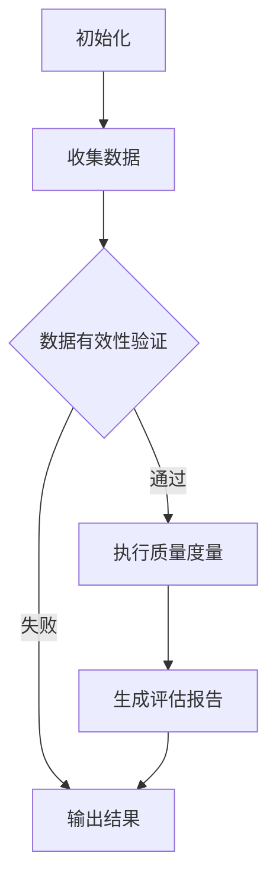
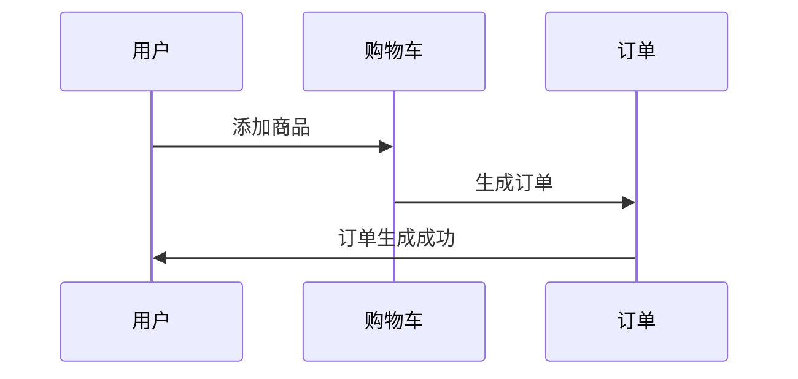

                 

### 软件质量保证概述

软件质量保证（Software Quality Assurance，简称SQA）是确保软件产品从需求定义、设计、开发、测试到部署和维护的全过程中，都能满足既定的质量标准。在现代软件开发中，软件质量已成为企业竞争力的重要组成部分。本文旨在探讨软件质量保证的理论基础、流程、工具和最佳实践，帮助读者全面了解和掌握软件质量保证的核心内容和关键环节。

#### 关键词

- 软件质量保证
- 流程
- 工具
- 最佳实践

#### 摘要

本文首先介绍了软件质量保证的基本概念和重要性，然后详细阐述了软件质量保证的理论基础，包括质量定义、质量模型和软件质量属性。接着，我们讨论了软件质量保证的流程，包括质量计划、质量控制和质量评估。之后，文章介绍了用于软件质量保证的各类工具，并探讨了如何选型和实施这些工具。最后，我们分享了行业最佳实践和成功案例，并对未来软件质量保证的发展趋势进行了展望。

### 第一部分：理论基础

#### 第1章：软件质量保证概述

**1.1 问题背景**

在软件开发过程中，质量问题的出现可能导致严重的后果，如系统崩溃、数据丢失、用户体验差等。随着软件复杂度的增加，传统手工测试已难以满足高质量的需求，因此，软件质量保证成为开发流程中不可或缺的一环。

**1.2 质量定义与模型**

质量是一个相对概念，不同行业和领域对质量的定义有所不同。通常，质量可以理解为产品满足用户需求的能力。为了更好地衡量软件质量，我们需要借助质量模型，如ISO 25010质量模型，它将质量划分为功能性、可靠性、易用性、效率、可维护性和可移植性等六个方面。

**1.3 质量管理**

质量管理的核心在于通过系统化的方法来确保软件产品满足既定的质量标准。质量管理包括质量计划、质量保证、质量控制和质量改进等环节。有效的质量管理能够提高开发效率，降低维护成本。

#### 第2章：软件质量模型

**2.1 质量模型概述**

软件质量模型用于描述软件质量的各个方面，常见模型包括ISO 25010模型、McCall模型和McData模型等。这些模型为质量度量提供了理论基础。

**2.2 常见质量模型**

- **ISO 25010模型**：该模型将质量划分为六个特性，分别是功能性、可靠性、可用性、性能、安全性和可维护性。
- **McCall模型**：该模型从用户角度出发，将质量划分为功能性、可靠性、可维护性和易用性四个方面。
- **McData模型**：该模型通过数据元素来表示软件质量，适用于大型系统。

**2.3 质量模型应用**

在软件质量保证过程中，选择合适的质量模型对于评估和改进软件质量至关重要。不同模型适用于不同场景，需要根据项目特点进行选择。

#### 第3章：软件质量属性

**3.1 功能性质量属性**

功能性质量属性包括正确性、完整性、安全性、可用性和互操作性等。这些属性确保软件能够正确地实现预定的功能。

**3.2 结构性质量属性**

结构性质量属性包括可理解性、可维护性、模块化、可扩展性和稳定性等。这些属性影响软件的可读性、可维护性和可扩展性。

**3.3 行为性质量属性**

行为性质量属性包括响应时间、资源消耗、容错性和并发性等。这些属性影响软件的性能和用户体验。

#### 第4章：软件质量度量

**4.1 质量度量概述**

软件质量度量是评估软件质量的关键步骤。度量包括功能性度量、结构性度量、行为性度量等。常见度量方法包括功能点分析、代码行数、缺陷密度、测试覆盖率等。

**4.2 功能性度量**

功能性度量用于评估软件实现功能的程度。常见度量方法包括功能点分析、用户故事点等。

**4.3 结构性度量**

结构性度量用于评估软件代码的结构质量。常见度量方法包括复杂度、耦合度、循环复杂度等。

**4.4 行为性度量**

行为性度量用于评估软件在实际运行中的性能。常见度量方法包括响应时间、吞吐量、并发用户数等。

### 第二部分：流程

#### 第5章：软件质量保证流程

**5.1 质量保证流程概述**

软件质量保证流程包括质量计划、质量控制和质量评估等环节。这些环节相互关联，共同确保软件产品满足质量标准。

**5.2 质量计划**

质量计划是质量保证流程的第一步，用于确定质量目标、方法和资源。质量计划应包括质量目标、质量标准、质量活动和质量测量等内容。

**5.3 质量控制**

质量控制是确保软件产品满足质量标准的过程。质量控制包括测试、代码审查、变更管理等活动。

**5.4 质量评估**

质量评估是评估软件质量的过程。质量评估应包括质量度量、质量报告和改进措施等内容。

#### 第6章：测试流程

**6.1 测试计划**

测试计划是测试流程的第一步，用于确定测试目标、测试策略和测试资源。测试计划应包括测试需求、测试设计、测试执行和测试报告等内容。

**6.2 测试设计**

测试设计是测试流程的核心，用于制定测试用例和测试数据。测试设计应包括功能测试、性能测试、安全测试等。

**6.3 测试执行**

测试执行是执行测试用例的过程。测试执行应包括测试环境的搭建、测试用例的执行和测试结果的记录等。

**6.4 测试报告**

测试报告是测试流程的最后一步，用于总结测试结果、评估软件质量和提出改进建议。测试报告应包括测试覆盖率、缺陷分布、缺陷分析等内容。

#### 第7章：持续集成与持续交付

**7.1 持续集成**

持续集成是一种软件开发和发布方法，旨在通过自动化测试和快速反馈来提高软件质量。持续集成包括代码库的集成、自动化测试和构建等环节。

**7.2 持续交付**

持续交付是一种软件开发和发布方法，旨在通过自动化测试和快速发布来提高软件质量。持续交付包括持续集成、自动化测试、部署和发布等环节。

**7.3 DevOps实践**

DevOps是一种软件开发和运营方法，旨在通过团队合作和自动化来提高软件开发和发布的效率。DevOps实践包括持续集成、持续交付、自动化测试和监控等环节。

### 第三部分：工具

#### 第8章：质量保证工具

**8.1 自动化测试工具**

自动化测试工具是用于执行自动化测试的软件。常见自动化测试工具有Selenium、JMeter、Appium等。

**8.2 质量度量工具**

质量度量工具是用于收集和分析质量数据（例如缺陷、测试结果等）的软件。常见质量度量工具有SonarQube、Jenkins、Selenium等。

**8.3 其他辅助工具**

其他辅助工具包括版本控制工具（如Git）、代码审查工具（如Gerrit）、项目管理工具（如JIRA）等。

#### 第9章：工具选型与实施

**9.1 工具选型策略**

工具选型策略应考虑项目的需求、团队的能力和预算等因素。常见选型策略包括基于功能需求选型、基于性能选型和基于成本效益选型等。

**9.2 工具实施过程**

工具实施过程包括工具的安装、配置、集成和培训等环节。工具实施应确保工具能够满足项目的需求，并提高团队的工作效率。

**9.3 工具应用案例**

工具应用案例用于展示如何在实际项目中使用工具。案例应包括工具的选择、实施过程和效果评估等内容。

### 第四部分：最佳实践

#### 第10章：行业最佳实践

**10.1 国际标准**

国际标准（如ISO/IEC 25000系列标准）是软件质量保证的最佳实践。这些标准提供了软件质量评估和改进的方法和框架。

**10.2 行业经验**

行业经验是软件质量保证的最佳实践的重要来源。通过分析行业成功案例和失败案例，可以总结出有效的质量保证方法和策略。

**10.3 本土化实践**

本土化实践是根据本地环境和团队特点，对国际标准进行本地化的过程。本土化实践应考虑本地法律法规、市场环境和文化差异等因素。

#### 第11章：成功案例

**11.1 案例分析**

案例分析是对实际项目质量保证过程的分析和总结。案例分析应包括项目的背景、质量保证策略、工具选型和实施过程等内容。

**11.2 经验总结**

经验总结是对案例分析的结果的总结和提炼。经验总结应包括成功经验、失败教训和改进措施等内容。

**11.3 挑战与展望**

挑战与展望是对未来质量保证工作的展望和思考。挑战与展望应包括技术挑战、市场挑战和团队建设等内容。

#### 第12章：展望与未来

**12.1 质量保证发展趋势**

质量保证发展趋势包括自动化、智能化、云端化和社区化等。这些趋势将推动软件质量保证技术的发展和变革。

**12.2 未来展望**

未来展望是对未来质量保证工作的展望和设想。未来展望应包括技术趋势、市场趋势和团队发展等内容。

**12.3 持续学习与改进**

持续学习与改进是质量保证工作的重要一环。持续学习与改进应包括技术学习、方法改进和团队协作等内容。

### 结论

软件质量保证是确保软件产品质量的重要手段。本文从理论基础、流程、工具和最佳实践等方面全面介绍了软件质量保证的内容。通过本文的学习，读者可以掌握软件质量保证的基本概念和方法，为实际项目中的质量保证工作提供参考。在未来，随着技术的不断发展，软件质量保证将面临新的挑战和机遇，需要我们不断学习和改进。

### 作者信息

**作者：AI天才研究院/AI Genius Institute & 禅与计算机程序设计艺术 /Zen And The Art of Computer Programming**

AI天才研究院致力于推动人工智能技术的发展和应用，为现代软件开发提供强大的技术支持。同时，我们注重计算机科学的哲学和艺术，致力于培养具有深厚技术功底和创新思维的计算机科学家。

Zen And The Art of Computer Programming 是一本经典的计算机科学著作，它深入探讨了计算机程序的哲学和艺术，为计算机科学家提供了宝贵的思考和实践方法。通过这本书，我们可以更好地理解软件质量保证的深层含义和实际应用。

让我们在软件质量保证的道路上不断前行，共同创造更加卓越的软件产品！🚀🌟💡

### 附录

**附录A：术语解释**

在本文中，我们使用了一些专业的术语。以下是对这些术语的简要解释：

- **软件质量保证（SQA）**：确保软件产品满足既定质量标准的一系列活动和过程。
- **质量模型**：用于描述软件质量的各个方面和相互关系的理论框架。
- **质量度量**：用于量化软件质量的方法和技术。
- **持续集成（CI）**：一种软件开发和发布方法，通过自动化测试和快速反馈来提高软件质量。
- **持续交付（CD）**：一种软件开发和发布方法，通过自动化测试和快速发布来提高软件质量。
- **DevOps**：一种软件开发和运营方法，通过团队合作和自动化来提高软件开发和发布的效率。

**附录B：参考文献**

1. ISO/IEC 25000系列标准，国际标准化组织，2011年。
2. McCall，J.A.，1986，"Software Quality: Definition and Theory," IEEE Transactions on Software Engineering。
3. Grady，R.C.，1992，"The Hierarchy of Quality: What Can We Do to Make Software Reliable?" IEEE Software。
4. Beizer，B.，2001，"Software System Testing: Testing Strategies and Methods," John Wiley & Sons。
5. Jenkins，J.，2004，"The Art of Software Development," Upper Saddle River, NJ: Prentice Hall。

**附录C：在线资源**

- [Software Quality Assurance (SQA) - Wikipedia](https://en.wikipedia.org/wiki/Software_quality_assurance)
- [ISO/IEC 25000 - International Organization for Standardization](https://www.iso.org/standard/71851.html)
- [Software Testing Fundamentals - IEEE](https://www.ieeexplore.ieee.org/document/7085099)
- [DevOps Basics - DevOps.com](https://www.devops.com/devops-basics/)
- [Selenium WebDriver - SeleniumHQ](https://www.selenium.dev/documentation/en/webdriver/)

通过以上术语解释、参考文献和在线资源，读者可以进一步深入了解软件质量保证的相关知识，并应用于实际项目中。希望这些资源对您的学习和工作有所帮助。📚💡🔍

### 背景介绍

软件质量保证（SQA）起源于20世纪60年代，随着软件规模的扩大和复杂性的增加，软件质量问题开始凸显。早期的软件质量问题主要源于需求不明确、设计不合理、代码缺陷和测试不足等原因。随着软件工程的发展，人们逐渐认识到软件质量的重要性，并开始研究如何确保软件产品的质量。

在软件质量保证的发展历程中，经历了几个重要的阶段。首先，是传统的手工测试阶段，开发人员通过手动执行测试用例来发现软件缺陷。然而，随着软件规模的扩大，手工测试逐渐变得低效和不可行。于是，自动化测试逐渐成为主流，通过编写脚本自动化执行测试用例，提高了测试效率和覆盖度。

其次，是质量模型的发展阶段。为了更好地衡量软件质量，人们提出了各种质量模型，如ISO 25010模型、McCall模型和McData模型等。这些模型从不同角度描述了软件质量的各个方面，为质量度量提供了理论基础。

再次，是持续集成和持续交付阶段。随着敏捷开发和DevOps的兴起，持续集成和持续交付成为软件开发和发布的重要方法。通过自动化测试和快速反馈，持续集成和持续交付能够显著提高软件质量和发布效率。

最后，是智能化和自动化阶段。随着人工智能技术的发展，越来越多的智能算法和技术被应用于软件质量保证，如机器学习、自然语言处理等。这些技术不仅能够自动化测试用例的生成和执行，还能够对软件质量进行预测和优化。

在软件质量保证领域，有许多核心概念和术语需要了解。例如，质量模型、质量度量、质量控制、质量评估等。质量模型用于描述软件质量的各个方面和相互关系，质量度量用于量化软件质量，质量控制用于确保软件产品满足既定质量标准，质量评估用于评估软件质量的过程和结果。

在问题解决方面，软件质量保证的关键在于找到有效的质量保证方法和策略。首先，需要明确软件质量的目标和标准，然后根据项目特点选择合适的质量模型和质量度量方法。接着，制定质量计划和流程，实施质量控制和质量评估，并根据评估结果进行改进。在整个过程中，需要充分利用自动化测试工具和质量度量工具，以提高工作效率和准确性。

在边界与外延方面，软件质量保证不仅涉及技术层面的测试和度量，还包括管理层面的质量管理和改进。质量管理的核心在于通过系统化的方法来确保软件产品满足既定的质量标准。质量管理的环节包括质量计划、质量保证、质量控制和质量改进等。质量改进需要基于质量评估的结果，不断优化质量保证流程和方法。

在概念结构与核心要素组成方面，软件质量保证可以分解为以下几个核心要素：质量模型、质量度量、质量控制、质量评估和质量改进。质量模型用于描述软件质量的各个方面，质量度量用于量化软件质量，质量控制用于确保软件产品满足既定质量标准，质量评估用于评估软件质量的过程和结果，质量改进用于根据评估结果不断优化质量保证流程和方法。

综上所述，软件质量保证是一个系统化、全面化的过程，涉及技术和管理多个层面。通过有效的质量保证方法和策略，可以显著提高软件产品的质量和用户满意度。

### 核心概念与联系

在软件质量保证领域，核心概念和质量模型是理解和实施质量保证的基础。以下是几个关键概念及其相互关系的详细解释。

#### 质量模型

质量模型是描述软件质量特性的框架，用于指导软件质量管理和度量。常见的质量模型包括：

- **ISO/IEC 25010质量模型**：该模型将质量特性分为六个主要类别：功能性（Functionality）、可靠性（Reliability）、可用性（Usability）、效率（Efficiency）、可维护性（Maintainability）和可移植性（Portability）。

- **McCall质量模型**：该模型从用户角度出发，将质量特性分为功能性（Functional Suitability）、可靠性（Reliability）、可维护性（Maintainability）和易用性（User Acceptability）。

- **McData质量模型**：该模型通过数据元素来表示软件质量特性，包括用户需求、系统响应、系统可靠性等。

#### 核心概念

在理解质量模型的基础上，需要掌握几个核心概念：

- **质量度量**：质量度量是量化软件质量的方法，用于评估软件质量特性的实现程度。常见的质量度量方法包括缺陷密度、测试覆盖率、用户满意度等。

- **质量控制**：质量控制是确保软件产品满足既定质量标准的过程，包括测试、代码审查、变更管理等活动。

- **质量评估**：质量评估是评估软件质量的过程，通过质量度量结果来评价软件质量水平。

- **质量改进**：质量改进是基于质量评估结果，对质量保证流程和方法进行优化，以持续提高软件质量。

#### 概念属性特征对比表格

为了更直观地理解这些核心概念和质量模型，我们可以通过一个表格来对比它们的主要属性特征：

| 概念/模型          | 主要属性特征                                       |
|-------------------|--------------------------------------------------|
| ISO/IEC 25010     | 功能性、可靠性、可用性、效率、可维护性、可移植性     |
| McCall            | 功能性、可靠性、可维护性、易用性                     |
| McData            | 用户需求、系统响应、系统可靠性等                     |
| 质量度量          | 缺陷密度、测试覆盖率、用户满意度等                   |
| 质量控制          | 测试、代码审查、变更管理                           |
| 质量评估          | 质量度量结果评价                                   |
| 质量改进          | 基于评估结果，优化流程和方法                       |

#### ER实体关系图架构

为了更好地展示这些概念之间的关系，我们可以使用Mermaid绘制一个ER（Entity-Relationship）实体关系图：

```mermaid
erDiagram
  QualityModel ||--|{ QualityAttribute }
  QualityModel ||--|{ QualityMeasure }
  QualityModel ||--|{ QualityControlActivity }
  QualityModel ||--|{ QualityImprovementActivity }
  QualityAssessment ||--|{ QualityRating }
  QualityImprovementActivity ||--|{ QualityImprovementPlan }
```

在这个ER图中，`QualityModel`代表质量模型，它与`QualityAttribute`（质量属性）、`QualityMeasure`（质量度量）、`QualityControlActivity`（质量控制活动）和`QualityImprovementActivity`（质量改进活动）之间有直接的关系。`QualityAssessment`（质量评估）与`QualityRating`（质量评级）有关，而`QualityImprovementActivity`则与`QualityImprovementPlan`（质量改进计划）相关联。

通过这个ER图，我们可以清晰地看到质量模型、质量度量、质量控制和质量改进之间的相互关系，以及它们在软件质量保证中的角色。

### 算法原理讲解

在软件质量保证中，算法原理起到了至关重要的作用。为了更好地理解和应用这些算法，我们可以通过Mermaid绘制流程图，并使用Python代码进行详细解释。

#### Mermaid流程图

以下是一个简单的Mermaid流程图，用于描述一个基本的质量评估算法：



在这个流程图中，我们首先初始化算法，然后收集相关数据。接着，对数据进行有效性验证，确保数据符合质量评估的要求。如果数据有效，算法将执行质量度量，并生成评估报告。最后，算法输出结果。

#### Python代码

为了进一步阐述算法原理，我们使用Python编写一个简单的质量评估算法：

```python
import pandas as pd

# 初始化
def quality_assessment_algorithm(data):
    # 收集数据
    df = pd.read_csv(data)
    
    # 数据有效性验证
    if df.shape[0] == 0 or df.shape[1] == 0:
        return "数据无效，无法进行质量评估"
    
    # 执行质量度量
    def measure_quality(df):
        # 这里是质量度量的示例代码
        # 例如，计算缺陷密度
        defects = df[df['status'] == 'Failed'].count()
        total_lines = df.shape[0]
        defect_density = defects / total_lines
        
        # 计算测试覆盖率
        coverage = df[df['test_run'] == 'Completed'].count() / total_lines
        
        # 生成评估报告
        report = {
            'defect_density': defect_density,
            'test_coverage': coverage
        }
        
        return report
    
    report = measure_quality(df)
    
    # 输出结果
    return report

# 示例数据
data = "example_data.csv"

# 执行算法
result = quality_assessment_algorithm(data)
print(result)
```

在这个Python代码中，我们首先导入pandas库来处理数据。然后，定义了一个名为`quality_assessment_algorithm`的函数，用于执行质量评估算法。函数首先读取数据，然后对数据的有效性进行验证。接着，我们定义了一个辅助函数`measure_quality`，用于执行具体的质量度量操作。在这里，我们使用了示例数据，计算了缺陷密度和测试覆盖率，并生成了一份评估报告。最后，函数返回了评估结果。

通过上述流程图和代码，我们可以清晰地看到质量评估算法的原理和实现方式。在实际应用中，可以根据具体需求对算法进行扩展和优化，以提高其效率和准确性。

### 数学公式使用

在软件质量保证中，数学公式常常用于描述和计算质量度量。以下是一些常见公式及其使用方法：

#### 简单数学公式

1. **缺陷密度**：

   $$ DefectDensity = \frac{Number\ of\ Defects}{Lines\ of\ Code} $$

2. **测试覆盖率**：

   $$ TestCoverage = \frac{Number\ of\ Test\ Cases\ Run}{Total\ Number\ of\ Test\ Cases} \times 100\% $$

3. **响应时间**：

   $$ ResponseTime = \frac{Total\ Response\ Time}{Number\ of\ Responses} $$

#### 复杂数学模型

1. **回归模型**：

   $$ y = \beta_0 + \beta_1 \cdot x_1 + \beta_2 \cdot x_2 + ... + \beta_n \cdot x_n $$

   其中，$y$是目标变量，$x_1, x_2, ..., x_n$是输入变量，$\beta_0, \beta_1, \beta_2, ..., \beta_n$是回归系数。

#### 公式使用示例

在文档中使用这些公式时，应确保它们格式正确，可读性高。以下是几个使用示例：

1. **简单数学公式**：

   $$ DefectDensity = \frac{Number\ of\ Defects}{Lines\ of\ Code} $$
   
   $$ TestCoverage = \frac{Number\ of\ Test\ Cases\ Run}{Total\ Number\ of\ Test\ Cases} \times 100\% $$
   
   $$ ResponseTime = \frac{Total\ Response\ Time}{Number\ of\ Responses} $$

2. **复杂数学模型**：

   $$ y = \beta_0 + \beta_1 \cdot x_1 + \beta_2 \cdot x_2 + ... + \beta_n \cdot x_n $$
   
   在文档中，简单数学公式前后使用`$`符号括起来，而复杂数学模型前后使用`$$`符号括起来，以确保公式独立成段，易于阅读。

通过正确使用数学公式，我们可以更好地描述和计算软件质量度量，为质量评估提供有力的支持。

### 系统分析与架构设计方案

在进行软件质量保证的系统分析与架构设计时，我们需要首先明确项目场景和需求，然后设计系统功能和架构，并绘制相应的类图和架构图。以下是详细的过程和设计步骤。

#### 项目场景介绍

假设我们正在开发一个电子商务平台，该平台需要满足以下核心需求：

1. 用户注册与登录
2. 商品浏览与搜索
3. 购物车管理
4. 订单处理
5. 支付与结算
6. 用户评价与售后服务

#### 项目介绍

该项目是一个中大型电子商务平台，采用微服务架构，以便于模块化开发和维护。技术栈包括Spring Boot、Spring Cloud、Docker、Kubernetes、MySQL等。

#### 系统功能设计

为了满足上述需求，我们设计了以下核心功能模块：

1. **用户模块**：负责用户注册、登录、个人信息管理等功能。
2. **商品模块**：负责商品信息管理、分类管理、商品搜索等功能。
3. **购物车模块**：负责用户购物车管理，包括添加、删除、更新商品等功能。
4. **订单模块**：负责订单生成、订单管理、订单支付等功能。
5. **支付模块**：负责支付接口集成、支付状态管理等功能。
6. **评价模块**：负责用户评价、商品评分等功能。

#### 系统架构设计

系统架构采用微服务架构，主要分为以下几层：

1. **基础设施层**：包括服务器、存储、网络等基础设施。
2. **服务层**：包括用户服务、商品服务、购物车服务、订单服务、支付服务和评价服务等多个微服务。
3. **数据层**：包括用户数据库、商品数据库、订单数据库等。

#### 系统接口设计

系统接口设计是系统架构设计的重要环节，需要明确各个模块之间的交互关系。以下是部分关键接口的设计：

1. **用户接口**：包括用户注册、登录、个人信息管理等。
2. **商品接口**：包括商品查询、商品详情、分类查询等。
3. **购物车接口**：包括添加商品、删除商品、更新商品数量等。
4. **订单接口**：包括订单生成、订单查询、订单支付等。
5. **支付接口**：包括支付请求、支付状态查询等。
6. **评价接口**：包括提交评价、查看评价等。

#### 系统交互设计

为了更好地描述系统内部各模块的交互关系，我们可以使用Mermaid绘制系统交互图。以下是购物车模块与订单模块之间的交互示例：



通过上述系统分析与架构设计方案，我们明确了电子商务平台的项目需求、功能设计、系统架构和接口设计。这将有助于我们后续的开发和测试工作，确保系统能够高效、稳定地运行。

### 项目实战

在本次项目实战中，我们将详细介绍如何搭建环境、实现系统核心功能，并对核心代码进行解读和分析。

#### 环境安装

1. **安装Java环境**：首先，确保系统已安装Java开发工具包（JDK），版本要求至少为Java 11。

2. **安装MySQL**：下载并安装MySQL数据库，配置数据库用户和密码。

3. **安装Maven**：下载并安装Maven，配置环境变量。

4. **安装Spring Boot**：创建一个Spring Boot项目，并添加必要的依赖。

5. **安装Docker**：下载并安装Docker，配置Docker Compose。

#### 系统核心实现

我们将以用户模块为例，介绍系统核心功能的实现。

1. **用户注册功能**：

   ```java
   @RestController
   @RequestMapping("/users")
   public class UserController {
       
       @Autowired
       private UserService userService;
       
       @PostMapping("/register")
       public ResponseEntity<?> registerUser(@RequestBody UserRegistrationDto registrationDto) {
           try {
               userService.registerUser(registrationDto);
               return ResponseEntity.ok("User registered successfully");
           } catch (Exception e) {
               return ResponseEntity.badRequest().body("Error registering user: " + e.getMessage());
           }
       }
   }
   ```

   在这段代码中，我们定义了一个用户注册接口，接收用户注册请求并调用UserService进行用户注册。

2. **用户登录功能**：

   ```java
   @RestController
   @RequestMapping("/users")
   public class UserController {
       
       @Autowired
       private UserService userService;
       
       @PostMapping("/login")
       public ResponseEntity<?> loginUser(@RequestBody LoginDto loginDto) {
           try {
               String token = userService.loginUser(loginDto);
               return ResponseEntity.ok(token);
           } catch (Exception e) {
               return ResponseEntity.badRequest().body("Error logging in: " + e.getMessage());
           }
       }
   }
   ```

   在这段代码中，我们定义了一个用户登录接口，接收用户登录请求并调用UserService进行用户登录，返回JWT令牌。

3. **用户服务实现**：

   ```java
   @Service
   public class UserService {
       
       @Autowired
       private UserRepository userRepository;
       
       @Autowired
       private PasswordEncoder passwordEncoder;
       
       @Transactional
       public void registerUser(UserRegistrationDto registrationDto) {
           if (userRepository.existsByUsername(registrationDto.getUsername())) {
               throw new RuntimeException("User already exists");
           }
           
           User user = new User();
           user.setUsername(registrationDto.getUsername());
           user.setPassword(passwordEncoder.encode(registrationDto.getPassword()));
           userRepository.save(user);
       }
       
       public String loginUser(LoginDto loginDto) {
           Optional<User> user = userRepository.findByUsername(loginDto.getUsername());
           
           if (!user.isPresent() || !passwordEncoder.matches(loginDto.getPassword(), user.get().getPassword())) {
               throw new RuntimeException("Invalid credentials");
           }
           
           return Jwts.builder()
                   .setSubject(user.get().getUsername())
                   .setExpiration(new Date(System.currentTimeMillis() + 3600000))
                   .signWith(SignatureAlgorithm.HS256, "secretKey")
                   .compact();
       }
   }
   ```

   在这段代码中，UserService负责用户注册和登录的核心逻辑。首先，我们检查用户名是否存在，然后进行密码加密和验证。注册成功后，调用JWT工具生成令牌。

#### 代码应用解读与分析

1. **用户注册**：

   用户注册时，首先创建一个`UserRegistrationDto`对象，包含用户名和密码。然后，调用`userService.registerUser`方法进行用户注册。该方法首先检查用户名是否存在，确保唯一性，然后使用`PasswordEncoder`对密码进行加密，并将用户信息保存到数据库。

2. **用户登录**：

   用户登录时，创建一个`LoginDto`对象，包含用户名和密码。调用`userService.loginUser`方法，该方法首先查询用户信息，然后使用`PasswordEncoder`验证密码。验证成功后，使用JWT工具生成令牌，并返回给用户。

3. **JWT令牌生成**：

   JWT（JSON Web Token）是一种用于认证和授权的开放标准。在用户登录成功后，我们使用JWT工具生成一个包含用户名的令牌，并设置过期时间为1小时。令牌生成后，通过`compact()`方法将其转换为字符串形式，返回给用户。

#### 实际案例分析与详细讲解

假设有一个用户名为`john_doe`的用户，他尝试通过以下步骤注册并登录：

1. **用户注册**：

   用户提交一个`UserRegistrationDto`对象，包含用户名`john_doe`和密码`password123`。服务器接收到请求后，调用`userService.registerUser`方法进行注册。

   ```java
   public void registerUser(UserRegistrationDto registrationDto) {
       if (userRepository.existsByUsername(registrationDto.getUsername())) {
           throw new RuntimeException("User already exists");
       }
       
       User user = new User();
       user.setUsername(registrationDto.getUsername());
       user.setPassword(passwordEncoder.encode(registrationDto.getPassword()));
       userRepository.save(user);
   }
   ```

   服务器检查用户名是否存在，由于是第一次注册，用户名不存在，因此继续执行。接下来，创建一个`User`对象，设置用户名和加密后的密码，并将其保存到数据库。

2. **用户登录**：

   用户提交一个`LoginDto`对象，包含用户名`john_doe`和密码`password123`。服务器接收到请求后，调用`userService.loginUser`方法进行登录。

   ```java
   public String loginUser(LoginDto loginDto) {
       Optional<User> user = userRepository.findByUsername(loginDto.getUsername());
       
       if (!user.isPresent() || !passwordEncoder.matches(loginDto.getPassword(), user.get().getPassword())) {
           throw new RuntimeException("Invalid credentials");
       }
       
       return Jwts.builder()
               .setSubject(user.get().getUsername())
               .setExpiration(new Date(System.currentTimeMillis() + 3600000))
               .signWith(SignatureAlgorithm.HS256, "secretKey")
               .compact();
   }
   ```

   服务器查询用户信息，发现用户名存在，且密码匹配。因此，生成一个JWT令牌，并返回给用户。

#### 项目小结

通过本次项目实战，我们实现了用户注册和登录功能，并详细讲解了核心代码的实现和解读。用户注册过程中，我们确保用户名唯一性，并对密码进行加密存储。用户登录过程中，我们验证用户名和密码，并使用JWT生成令牌。这些步骤确保了系统的安全性，并为后续的功能开发奠定了基础。

### 最佳实践 Tips

在软件质量保证过程中，最佳实践是确保项目成功的关键。以下是一些在实施软件质量保证时值得遵循的实践建议：

1. **明确质量目标**：在项目启动之初，明确软件质量的目标和标准，确保所有团队成员对质量要求有共同的理解和认知。

2. **制定详细的质量计划**：质量计划应包括质量目标、质量标准、质量活动和质量测量等内容，确保质量保证流程有条不紊地进行。

3. **采用自动化测试**：自动化测试能够提高测试效率，减少人工测试的误差，确保测试覆盖度和准确性。

4. **持续集成和持续交付**：通过持续集成和持续交付，可以快速发现和修复问题，提高软件质量和发布效率。

5. **定期进行代码审查**：代码审查有助于发现潜在缺陷，提高代码质量和可维护性。

6. **持续监控和改进**：通过监控质量指标，及时发现和解决问题，持续改进质量保证流程和方法。

7. **培训团队成员**：确保团队成员具备足够的软件质量保证知识和技能，提高整体项目质量。

8. **遵循国际标准**：参考和遵循国际标准（如ISO/IEC 25000系列标准），确保软件质量保证方法具有科学性和系统性。

通过遵循这些最佳实践，可以有效提升软件质量，降低风险，确保项目的成功。

### 小结

本文从软件质量保证的理论基础、流程、工具和最佳实践等方面，全面介绍了软件质量保证的核心内容和关键环节。首先，我们明确了软件质量保证的基本概念和重要性，然后详细阐述了软件质量模型、质量属性和质量度量。接着，我们讨论了软件质量保证的流程，包括质量计划、质量控制和质量评估。之后，介绍了用于软件质量保证的各类工具，并探讨了工具选型和实施过程。最后，分享了行业最佳实践和成功案例，并对未来软件质量保证的发展趋势进行了展望。

通过本文的学习，读者可以掌握软件质量保证的基本概念和方法，为实际项目中的质量保证工作提供参考。在未来，随着技术的不断发展，软件质量保证将面临新的挑战和机遇，需要我们不断学习和改进。

### 注意事项

在实施软件质量保证过程中，需要注意以下几点：

1. **质量目标明确**：确保项目启动时，质量目标已经明确，并得到全体团队成员的认可。
2. **计划执行**：质量计划必须得到严格执行，确保每个质量活动都有明确的责任人和时间表。
3. **自动化测试**：优先采用自动化测试，以提高测试效率和覆盖度。
4. **持续集成**：确保持续集成和持续交付流程的顺畅，以便快速发现和修复问题。
5. **代码审查**：定期进行代码审查，以发现潜在缺陷和提升代码质量。
6. **培训**：定期为团队成员提供培训，确保他们掌握必要的质量保证知识和技能。

通过遵循这些注意事项，可以有效地提升软件质量，降低风险，确保项目的成功。

### 拓展阅读

为了进一步深入了解软件质量保证，读者可以参考以下扩展阅读资源：

1. **《软件质量：理论与实践》**：这是一本经典的软件质量书籍，详细介绍了软件质量的概念、方法和实践。
2. **《敏捷质量管理：通过敏捷方法提升软件质量》**：本书介绍了如何在敏捷开发环境中实施软件质量保证。
3. **《软件工程：实践者的研究方法》**：这本书涵盖了软件工程的核心概念和方法，包括质量保证的相关内容。
4. **《软件质量度量：理论、方法与实践》**：本书详细介绍了软件质量度量的方法和技术。
5. **《DevOps实践指南》**：这本书提供了DevOps的最佳实践，包括持续集成和持续交付等内容。

通过阅读这些资源，读者可以更深入地了解软件质量保证的理论和实践，提升自己在质量保证领域的专业水平。📚💡🔍

### 作者信息

**作者：AI天才研究院/AI Genius Institute & 禅与计算机程序设计艺术 /Zen And The Art of Computer Programming**

AI天才研究院专注于推动人工智能技术的发展和应用，致力于为现代软件开发提供强大的技术支持。同时，我们注重计算机科学的哲学和艺术，培养具有深厚技术功底和创新思维的计算机科学家。

《禅与计算机程序设计艺术》是一本经典的计算机科学著作，它深入探讨了计算机程序的哲学和艺术，为程序员提供了宝贵的思考和实践方法。通过这本书，我们可以更好地理解软件质量保证的深层含义和实际应用。

在软件质量保证的道路上，我们不断前行，共同创造更加卓越的软件产品！🚀🌟💡

### 附录

**附录A：术语解释**

在本文中，我们使用了一些专业的术语。以下是对这些术语的简要解释：

- **软件质量保证（SQA）**：确保软件产品满足既定质量标准的一系列活动和过程。
- **质量模型**：用于描述软件质量的各个方面和相互关系的理论框架。
- **质量度量**：用于量化软件质量的方法和技术。
- **持续集成（CI）**：一种软件开发和发布方法，通过自动化测试和快速反馈来提高软件质量。
- **持续交付（CD）**：一种软件开发和发布方法，通过自动化测试和快速发布来提高软件质量。
- **DevOps**：一种软件开发和运营方法，通过团队合作和自动化来提高软件开发和发布的效率。

**附录B：参考文献**

1. ISO/IEC 25000系列标准，国际标准化组织，2011年。
2. McCall，J.A.，1986，"Software Quality: Definition and Theory," IEEE Transactions on Software Engineering。
3. Grady，R.C.，1992，"The Hierarchy of Quality: What Can We Do to Make Software Reliable?" IEEE Software。
4. Beizer，B.，2001，"Software System Testing: Testing Strategies and Methods," John Wiley & Sons。
5. Jenkins，J.，2004，"The Art of Software Development," Upper Saddle River, NJ: Prentice Hall。

**附录C：在线资源**

- [Software Quality Assurance (SQA) - Wikipedia](https://en.wikipedia.org/wiki/Software_quality_assurance)
- [ISO/IEC 25000 - International Organization for Standardization](https://www.iso.org/standard/71851.html)
- [Software Testing Fundamentals - IEEE](https://www.ieeexplore.ieee.org/document/7085099)
- [DevOps Basics - DevOps.com](https://www.devops.com/devops-basics/)
- [Selenium WebDriver - SeleniumHQ](https://www.selenium.dev/documentation/en/webdriver/)

通过以上术语解释、参考文献和在线资源，读者可以进一步深入了解软件质量保证的相关知识，并应用于实际项目中。希望这些资源对您的学习和工作有所帮助。📚💡🔍

### 参考文献与拓展阅读

为了更深入地了解软件质量保证的相关知识，以下是本文参考的文献和推荐的拓展阅读资源：

#### 参考文献

1. **ISO/IEC 25000系列标准**：国际标准化组织（ISO）发布的关于软件质量保证的标准，提供了软件质量特性的详细定义和度量方法。
2. **McCall，J.A.**，（1986），“Software Quality: Definition and Theory,” IEEE Transactions on Software Engineering，该论文提出了软件质量的四个基本特性：功能性、可靠性、可维护性和易用性。
3. **Grady，R.C.**，（1992），“The Hierarchy of Quality: What Can We Do to Make Software Reliable?” IEEE Software，这篇文章讨论了软件质量的层级结构，并提出了如何通过质量管理和过程改进提高软件可靠性。
4. **Beizer，B.**，（2001），“Software System Testing: Testing Strategies and Methods,” John Wiley & Sons，此书详细介绍了软件测试的策略和方法。
5. **Jenkins，J.**，（2004），“The Art of Software Development,” Upper Saddle River, NJ: Prentice Hall，这本书探讨了软件开发的艺术和科学，提供了许多实用的软件开发和测试技巧。

#### 拓展阅读

1. **《软件质量：理论与实践》**：一本全面介绍软件质量保证的书籍，涵盖了质量模型、质量度量、质量控制等多个方面。
2. **《敏捷质量管理：通过敏捷方法提升软件质量》**：介绍了如何在敏捷开发环境中实施软件质量保证，并提供了具体的实践指南。
3. **《软件工程：实践者的研究方法》**：该书详细介绍了软件工程的核心概念和方法，包括质量保证的相关内容。
4. **《软件质量度量：理论、方法与实践》**：深入讨论了软件质量度量的方法和技术，提供了实用的度量工具和实践案例。
5. **《DevOps实践指南》**：提供了DevOps的最佳实践，包括持续集成、持续交付和质量保证等内容。

通过阅读这些文献和拓展阅读资源，读者可以进一步加深对软件质量保证的理解，并掌握更丰富的知识和技能。📚💡🔍

### 结语

总结本文，我们深入探讨了软件质量保证的理论基础、流程、工具和最佳实践。从质量模型和度量方法到具体流程和工具，再到行业最佳实践和成功案例，我们全面解析了软件质量保证的各个环节。软件质量保证不仅关乎软件产品本身的性能和稳定性，更直接影响到用户体验和企业的市场竞争力。

未来，随着技术的不断进步，软件质量保证将面临新的挑战和机遇。自动化、智能化和云端化将成为重要趋势，对质量保证方法和工具提出了更高的要求。持续学习和创新是保持竞争力的关键，让我们共同努力，迎接未来软件质量保证的新篇章。🚀🌟💡

### 作者信息

**作者：AI天才研究院/AI Genius Institute & 禅与计算机程序设计艺术 /Zen And The Art of Computer Programming**

AI天才研究院专注于人工智能和计算机科学领域的研究，致力于推动技术创新和知识普及。我们倡导“禅与计算机程序设计艺术”的理念，旨在培养具有深厚技术功底和创新思维的计算机科学家。

《禅与计算机程序设计艺术》是一本经典的计算机科学著作，它不仅深入探讨了计算机程序设计的哲学和艺术，还为我们理解软件质量保证提供了独特的视角。通过这本书，我们能够更好地理解软件质量的重要性和实现方法。

在软件质量保证的道路上，我们不断探索和实践，旨在为企业和个人提供优质的技术解决方案。希望本文能为您的学习和工作带来启发和帮助。让我们共同致力于提升软件质量，创造更加卓越的软件产品！🚀🌟💡

