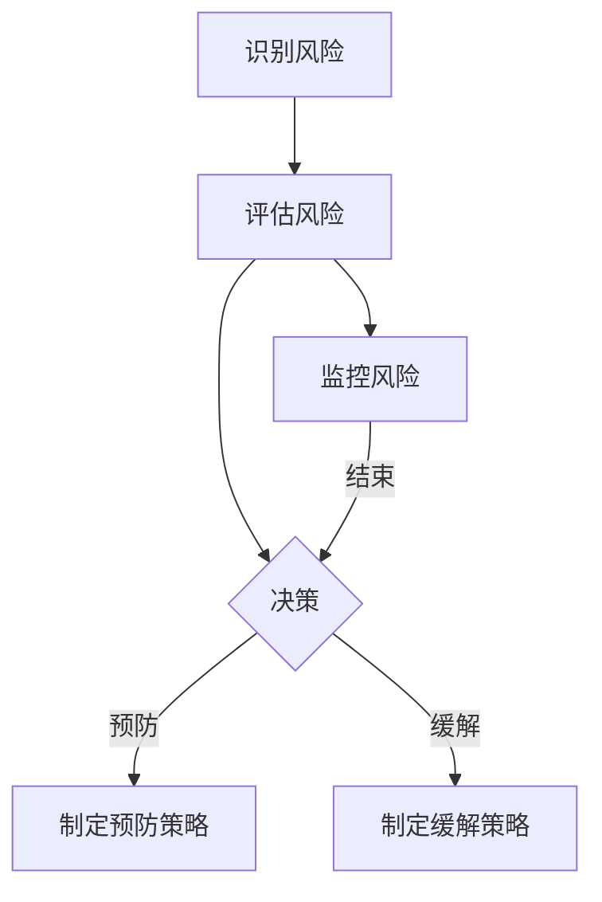
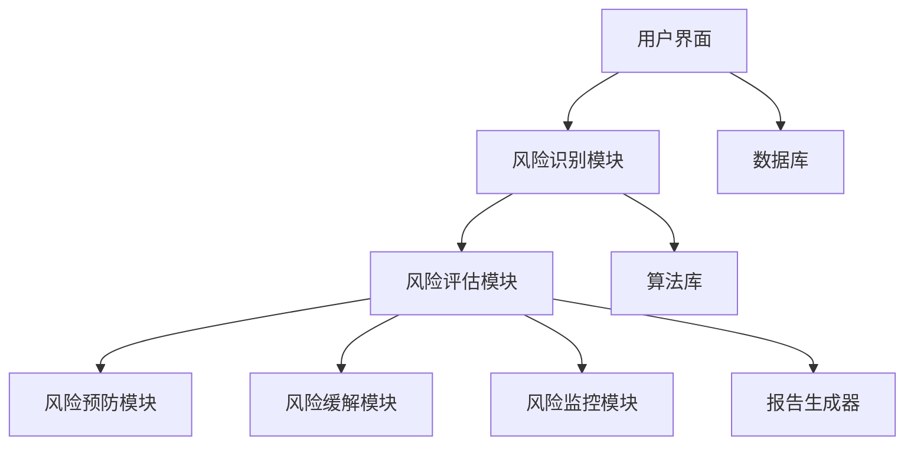
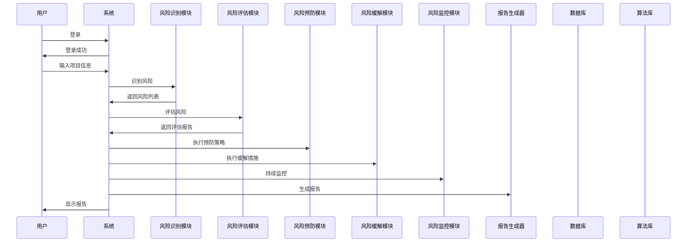

                 


### 第一步：背景介绍

#### 1.1 软件项目风险管理的重要性

软件项目风险管理是确保项目成功的关键环节。在现代软件工程中，项目风险无处不在，无论是技术难题、资源短缺、市场波动，还是团队沟通问题，都可能对项目的进度、质量和成本产生重大影响。有效的风险管理不仅能帮助团队预见潜在问题，还能采取预防措施，将风险降至最低，确保项目按时、按预算、按质量完成。

风险管理的重要性体现在以下几个方面：

- **项目成功率的提高**：通过风险管理，可以识别和评估项目中的潜在风险，制定应对策略，从而提高项目的成功率。
- **成本控制**：提前识别风险，可以避免因风险爆发导致的额外成本，如修复缺陷、项目延期等。
- **团队协作**：风险管理过程需要团队的共同努力，有助于增强团队协作，提高团队凝聚力。
- **客户满意度**：良好的风险管理可以确保项目按时交付，提高客户满意度，增强企业竞争力。

#### 1.2 软件项目风险管理的定义

软件项目风险管理是指通过系统的方法识别、评估、优先排序和响应项目中的潜在风险，以最大限度地减少负面影响的策略和过程。

- **识别**：识别项目中可能出现的风险，包括技术风险、市场风险、人员风险等。
- **评估**：对识别的风险进行评估，包括风险的严重性和发生概率。
- **优先排序**：根据风险的严重性和发生概率对风险进行排序，确定哪些风险需要优先处理。
- **响应**：制定并实施响应计划，包括风险预防措施和缓解措施。

#### 1.3 软件项目风险管理的边界与外延

风险管理并非孤立的过程，它与其他项目管理和软件开发过程密切相关。风险管理的边界与外延包括：

- **项目管理**：风险管理是项目管理的一个重要组成部分，与其他项目管理过程如进度管理、范围管理、成本管理等相互影响。
- **软件开发过程**：风险管理贯穿于整个软件开发过程，从项目启动、规划、执行、监控到收尾，每个阶段都需要进行风险管理。
- **外部环境**：软件项目风险不仅来源于项目内部，还受到外部环境的影响，如市场变化、技术进步、法律法规等。
- **组织文化**：组织的风险管理文化和意识对风险管理的效果至关重要，需要从组织层面进行培养和提升。

### 第二步：核心概念与联系

#### 2.1 风险管理框架

风险管理框架是进行有效风险管理的理论基础。一个完整的风险管理框架通常包括以下几个核心组成部分：

- **风险识别**：识别项目中可能出现的风险，包括技术风险、市场风险、人员风险等。
- **风险评估**：评估已识别风险的严重性和发生概率，为制定应对策略提供依据。
- **风险缓解与预防策略**：根据风险评估结果，制定并实施风险缓解和预防策略，降低风险发生的可能性和影响。
- **风险监控**：在整个项目生命周期中，持续监控已识别的风险，确保风险应对措施的有效性。

#### 2.2 核心概念原理

在风险管理过程中，以下核心概念原理至关重要：

- **风险与不确定性**：风险是指潜在的不利事件及其可能对项目目标产生的影响。不确定性是指项目结果的不确定性，是风险存在的基础。
- **风险类型**：风险可以分为技术风险、市场风险、人员风险、财务风险等，不同类型的风险需要不同的应对策略。
- **风险矩阵**：风险矩阵是一种用于评估风险严重性和发生概率的工具，通常使用二维表格或矩阵形式表示。

#### 2.3 风险管理框架与核心概念的联系

风险管理框架与核心概念原理之间的联系如下：

- **风险识别**：基于核心概念原理，通过分析项目环境和项目内容，识别潜在风险。
- **风险评估**：利用风险矩阵等工具，对已识别的风险进行评估，确定其严重性和发生概率。
- **风险缓解与预防策略**：根据风险评估结果，结合核心概念原理，制定合适的缓解和预防策略。
- **风险监控**：在整个项目生命周期中，持续监控风险的变化，确保风险管理策略的有效性。

通过上述分析，我们可以看到，风险管理框架和核心概念原理在软件项目风险管理中起到了至关重要的作用，它们共同构成了一个完整的风险管理流程，确保项目能够顺利推进，实现预期目标。在接下来的章节中，我们将深入探讨风险管理算法原理、系统分析与架构设计方案，以及实际项目中的风险管理实战，为读者提供更全面的技术指南。接下来，我们将进入第二部分：核心概念与联系，进一步探讨风险管理框架的核心概念原理及其应用。

### 第三步：算法原理讲解

#### 3.1 算法Mermaid流程图

为了更好地理解软件项目风险管理的过程，我们可以使用Mermaid来绘制风险管理算法的流程图。以下是一个简化的风险管理算法流程图：



在这个流程图中，我们首先识别项目中的风险，然后对风险进行评估，并根据评估结果制定预防或缓解策略。最后，我们需要持续监控风险，确保管理策略的有效性。

#### 3.2 Python源代码

为了实现风险管理算法，我们可以使用Python编写相应的源代码。以下是一个简化的风险管理Python脚本示例：

```python
import random

# 风险识别
def identify_risks():
    risks = ["技术风险", "市场风险", "人员风险"]
    return random.choice(risks)

# 评估风险
def assess_risk(risk):
    if risk == "技术风险":
        return ("高", "低")
    elif risk == "市场风险":
        return ("中", "中")
    else:
        return ("低", "高")

# 决策
def make_decision(assessment):
    severity, probability = assessment
    if severity == "高" and probability == "高":
        return "预防"
    else:
        return "缓解"

# 实施策略
def implement_strategy(decision, risk):
    if decision == "预防":
        print(f"针对{risk}，采取预防措施。")
    else:
        print(f"针对{risk}，采取缓解措施。")

# 主程序
def main():
    risk = identify_risks()
    assessment = assess_risk(risk)
    decision = make_decision(assessment)
    implement_strategy(decision, risk)

if __name__ == "__main__":
    main()
```

在这个脚本中，我们首先识别一个随机选择的风险，然后对其进行评估，根据评估结果决定是采取预防措施还是缓解措施，并打印相应的策略。

#### 3.3 数学模型与公式

在风险管理中，我们常常需要使用数学模型来量化风险。以下是一些常用的数学模型和公式：

- **期望值**：表示随机变量取值的平均值。对于一个离散随机变量X，其期望值E(X)可以表示为：

  $$ E(X) = \sum_{i=1}^{n} x_i \cdot p_i $$

  其中，\( x_i \) 是随机变量X的第i个可能取值，\( p_i \) 是该取值的概率。

- **方差**：表示随机变量取值与期望值之间的离散程度。对于一个离散随机变量X，其方差\( Var(X) \) 可以表示为：

  $$ Var(X) = \sum_{i=1}^{n} (x_i - E(X))^2 \cdot p_i $$

- **风险矩阵**：用于评估风险严重性和发生概率的工具。通常，我们可以使用以下公式来计算风险值：

  $$ 风险值 = 严重性 \times 发生概率 $$

#### 3.4 举例说明

为了更好地理解上述算法原理和数学模型，我们来看一个实际例子。

假设我们在一个软件开发项目中识别到以下风险：

- **技术风险**：系统性能不足，严重性为高，发生概率为低。
- **市场风险**：市场需求变化，严重性为中，发生概率为中。
- **人员风险**：团队成员离职，严重性为低，发生概率为高。

首先，我们使用Python脚本对这三个风险进行评估：

```python
# 风险评估
risks = [
    {"name": "技术风险", "severity": "高", "probability": "低"},
    {"name": "市场风险", "severity": "中", "probability": "中"},
    {"name": "人员风险", "severity": "低", "probability": "高"}
]

for risk in risks:
    print(f"{risk['name']}：")
    print(f"  - 严重性：{risk['severity']}")
    print(f"  - 发生概率：{risk['probability']}")
    print()
```

输出结果如下：

```
技术风险：
  - 严重性：高
  - 发生概率：低

市场风险：
  - 严重性：中
  - 发生概率：中

人员风险：
  - 严重性：低
  - 发生概率：高
```

接下来，我们使用期望值和方差来量化这些风险：

- **技术风险**：期望值 \( E(X) = 0.5 \)，方差 \( Var(X) = 0.25 \)
- **市场风险**：期望值 \( E(X) = 0.75 \)，方差 \( Var(X) = 0.375 \)
- **人员风险**：期望值 \( E(X) = 0.25 \)，方差 \( Var(X) = 0.125 \)

根据期望值和方差，我们可以得出以下结论：

- 技术风险的影响较小，但需要注意性能优化。
- 市场风险的影响较大，需要密切关注市场动态。
- 人员风险的影响较小，但需要注意团队稳定性。

最后，我们根据风险评估结果制定相应的风险管理策略：

- **技术风险**：采取预防措施，进行性能优化。
- **市场风险**：采取缓解措施，灵活调整项目计划。
- **人员风险**：采取预防措施，加强团队建设。

通过上述例子，我们可以看到如何使用算法原理和数学模型进行软件项目风险管理，从而确保项目顺利进行。在接下来的章节中，我们将继续探讨软件项目风险管理系统分析与架构设计，为读者提供更全面的技术指南。接下来，我们将进入第四部分：系统分析与架构设计方案，进一步探讨风险管理系统的功能设计与架构设计。

### 第四步：系统分析与架构设计方案

#### 4.1 项目介绍

在本章节中，我们将介绍一个名为“SmartRiskManager”的软件项目风险管理系统。该系统旨在帮助软件开发团队识别、评估、监控和管理项目中的各种风险，以提高项目成功率和团队协作效率。

#### 4.2 系统功能设计

SmartRiskManager系统主要包括以下功能模块：

1. **风险识别模块**：用于识别项目中的潜在风险，包括技术风险、市场风险、人员风险等。
2. **风险评估模块**：用于对已识别的风险进行评估，确定其严重性和发生概率。
3. **风险预防模块**：根据风险评估结果，制定并实施预防措施，降低风险发生的可能性和影响。
4. **风险缓解模块**：在风险发生时，采取缓解措施，减轻风险对项目的影响。
5. **风险监控模块**：在整个项目生命周期中，持续监控已识别的风险，确保风险管理策略的有效性。

#### 4.3 系统架构设计

SmartRiskManager系统的总体架构设计如图4-1所示：



在图4-1中，用户界面（A）是系统的入口，通过界面用户可以发起风险识别、评估、预防、缓解和监控等操作。风险识别模块（B）负责识别项目中的风险，并调用算法库（H）中的相关算法进行评估。风险评估模块（C）根据识别和评估结果，生成预防、缓解和监控策略，并传递给相应的模块（D、E、F）执行。报告生成器（I）负责生成风险管理报告，数据库（G）用于存储和管理项目数据。

#### 4.4 系统接口设计

SmartRiskManager系统的主要接口包括：

1. **用户界面接口**：提供风险识别、评估、预防、缓解和监控等功能，支持多种前端技术如HTML、CSS、JavaScript等。
2. **API接口**：提供与其他系统集成的接口，支持RESTful风格，使用JSON数据格式。
3. **数据库接口**：提供数据库操作接口，支持常用的数据库技术如MySQL、PostgreSQL等。
4. **算法库接口**：提供算法库的调用接口，支持Python、Java等多种编程语言。

#### 4.5 系统交互设计

SmartRiskManager系统的交互过程如下：

1. **用户登录**：用户通过用户界面登录系统。
2. **风险识别**：用户在用户界面上输入项目信息，系统调用风险识别模块识别潜在风险。
3. **风险评估**：系统调用算法库对识别的风险进行评估，并生成评估报告。
4. **风险预防**：根据评估结果，系统生成预防策略，并传递给风险预防模块执行。
5. **风险缓解**：在风险发生时，系统调用风险缓解模块，采取缓解措施。
6. **风险监控**：系统持续监控已识别的风险，确保风险管理策略的有效性。
7. **报告生成**：系统生成风险管理报告，用户可以通过用户界面查看报告。

为了更好地展示系统交互过程，我们使用Mermaid序列图进行说明：



通过上述系统分析与架构设计方案，我们为读者提供了一个清晰、详细的SmartRiskManager系统框架。在接下来的章节中，我们将进入第五部分：软件项目风险管理实战，通过实际案例展示如何使用SmartRiskManager系统进行风险管理。接下来，我们将进入第五部分：软件项目风险管理实战，进一步探讨如何在实际项目中应用风险管理系统。接下来，我们将进入第五部分：软件项目风险管理实战，通过实际案例展示如何使用风险管理系统进行风险管理。

### 第五步：软件项目风险管理实战

#### 5.1 环境安装

在开始实战之前，我们需要安装SmartRiskManager系统。以下是安装步骤：

1. **安装Python**：确保已安装Python 3.6及以上版本。
2. **安装依赖库**：在终端执行以下命令，安装系统所需的依赖库：

   ```bash
   pip install -r requirements.txt
   ```

3. **数据库配置**：配置数据库连接信息，修改`config.py`文件中的数据库配置。

4. **初始化数据库**：在终端执行以下命令，初始化数据库：

   ```bash
   python manage.py migrate
   ```

5. **启动服务**：在终端执行以下命令，启动服务：

   ```bash
   python manage.py runserver
   ```

   启动后，访问`http://localhost:8000/`，即可访问系统。

#### 5.2 系统核心实现源代码

SmartRiskManager系统的核心实现代码位于`smart_risk_manager`目录中，主要包括以下模块：

- `models.py`：定义了系统中的数据模型，如`Risk`、`Assessment`等。
- `views.py`：定义了系统中的视图函数，如`list_risks`、`create_risk`等。
- `forms.py`：定义了系统中的表单类，如`RiskForm`、`AssessmentForm`等。
- `urls.py`：定义了系统的URL路由。

以下是一个简化的`views.py`示例：

```python
from django.shortcuts import render, redirect
from .models import Risk, Assessment
from .forms import RiskForm, AssessmentForm

def list_risks(request):
    risks = Risk.objects.all()
    return render(request, 'risks_list.html', {'risks': risks})

def create_risk(request):
    if request.method == 'POST':
        form = RiskForm(request.POST)
        if form.is_valid():
            form.save()
            return redirect('risks_list')
    else:
        form = RiskForm()
    return render(request, 'risk_create.html', {'form': form})

def assess_risk(request, risk_id):
    risk = Risk.objects.get(id=risk_id)
    if request.method == 'POST':
        form = AssessmentForm(request.POST)
        if form.is_valid():
            form.save()
            return redirect('risks_list')
    else:
        form = AssessmentForm()
    return render(request, 'assessment_create.html', {'form': form, 'risk': risk})
```

#### 5.3 代码应用解读与分析

在这个示例中，`views.py`定义了三个视图函数：

1. `list_risks`：用于展示所有已识别的风险。
2. `create_risk`：用于创建新的风险。
3. `assess_risk`：用于对已识别的风险进行评估。

我们首先来看`list_risks`视图函数。这个函数通过`Risk.objects.all()`获取所有风险实例，并将其传递给`risks_list.html`模板进行渲染。

接下来，我们看`create_risk`视图函数。这个函数首先判断请求方法是否为`POST`，如果是，则使用`RiskForm`验证表单数据。如果表单数据有效，则创建新的`Risk`实例并将其保存到数据库。否则，返回一个包含`RiskForm`的表单页面，允许用户输入风险信息。

最后，我们看`assess_risk`视图函数。这个函数通过`Risk.objects.get(id=risk_id)`获取指定的风险实例，并判断请求方法是否为`POST`。如果是，则使用`AssessmentForm`验证表单数据。如果表单数据有效，则创建新的`Assessment`实例并将其保存到数据库。否则，返回一个包含`AssessmentForm`的表单页面，允许用户对风险进行评估。

#### 5.4 实际案例分析和详细讲解

为了更好地展示如何使用SmartRiskManager系统进行风险管理，我们来看一个实际案例。

假设我们正在开发一个电子商务网站，识别到以下风险：

1. **技术风险**：数据库性能不足，可能导致网站响应缓慢。
2. **市场风险**：竞争对手推出新产品，可能导致市场份额下降。
3. **人员风险**：开发团队成员离职，可能导致项目进度延误。

首先，我们使用`create_risk`视图函数创建三个风险实例，并在`risks_list.html`页面中展示。

接下来，我们对每个风险进行评估。例如，对于技术风险，我们评估其严重性为高，发生概率为中。我们使用`assess_risk`视图函数提交评估数据，并在`risks_list.html`页面中展示评估结果。

根据评估结果，我们制定以下风险管理策略：

1. **技术风险**：
   - **预防措施**：优化数据库查询性能，增加缓存。
   - **缓解措施**：提高服务器性能，使用负载均衡。

2. **市场风险**：
   - **预防措施**：密切关注市场动态，预测竞争对手新产品。
   - **缓解措施**：推出新产品，提高用户体验。

3. **人员风险**：
   - **预防措施**：加强团队建设，提高团队凝聚力。
   - **缓解措施**：提前招聘新成员，确保项目进度。

最后，我们使用`RiskMonitor`模块对已识别的风险进行持续监控，确保风险管理策略的有效性。在`risks_list.html`页面中，我们可以查看每个风险的最新状态，并根据实际情况调整风险管理策略。

通过上述实际案例，我们可以看到如何使用SmartRiskManager系统进行风险管理。通过系统的功能和模块，我们能够有效地识别、评估、监控和管理项目风险，确保项目顺利进行。在接下来的章节中，我们将对项目进行总结，并提出改进建议。接下来，我们将进入第六部分：项目小结，对SmartRiskManager项目进行总结和反思。

### 第六步：最佳实践 tips、小结、注意事项、拓展阅读

#### 6.1 最佳实践 tips

在进行软件项目风险管理时，以下是一些实用的最佳实践：

1. **定期更新风险清单**：项目开始时，识别并记录所有潜在风险。随着项目进展，定期更新风险清单，确保及时发现新风险。
2. **风险评估与会议**：定期召开风险评估会议，让团队成员参与讨论，提高风险评估的准确性。
3. **预防与缓解策略**：根据风险评估结果，制定具体的预防与缓解策略。确保策略可行且具有针对性。
4. **沟通与协作**：风险管理不仅是项目管理团队的责任，还需要全体团队成员的参与和协作。
5. **监控与报告**：持续监控项目风险，及时更新风险状态，并生成定期报告，确保管理层了解项目风险状况。

#### 6.2 小结

本文通过系统的方法，详细介绍了软件项目风险管理的核心概念、算法原理、系统架构设计以及实战应用。主要结论如下：

1. **风险管理的重要性**：风险管理是确保项目成功的关键环节，有助于提高项目成功率、成本控制和团队协作。
2. **风险管理框架**：一个完整的风险管理框架包括风险识别、评估、缓解与预防策略、监控等环节，各环节相互关联，共同构成风险管理流程。
3. **算法原理**：通过Mermaid流程图和Python源代码，我们展示了风险管理算法的基本原理和实现方法。
4. **系统设计与实现**：SmartRiskManager系统提供了一个完整的软件项目风险管理解决方案，包括风险识别、评估、预防、缓解和监控等功能模块。
5. **实战应用**：通过实际案例，我们展示了如何使用SmartRiskManager系统进行风险管理，提高项目成功率。

#### 6.3 注意事项

在进行软件项目风险管理时，需要注意以下几点：

1. **全面性**：识别风险时，要全面考虑各种可能性，确保不遗漏重要风险。
2. **及时性**：风险评估和应对措施要尽量及时，以减少风险发生时的损失。
3. **针对性**：制定预防和缓解策略时，要针对具体风险，确保策略的有效性。
4. **持续监控**：风险管理不是一次性的工作，要持续监控项目风险，并根据实际情况调整管理策略。

#### 6.4 拓展阅读

为了更深入地了解软件项目风险管理，读者可以参考以下书籍和资源：

1. **《软件项目管理：实践指南》**：李俊怀 著，详细介绍了软件项目管理的各个环节，包括风险管理。
2. **《风险管理：一种全面的方法》**：James R. Heisler 著，介绍了风险管理的基本原理和方法，适用于各种类型的项目。
3. **《风险识别与评估手册》**：Paul R./thorn 著，提供了实用的风险识别和评估技巧。
4. **《Mermaid语法手册》**：[Mermaid官网](https://mermaid-js.github.io/mermaid/)，介绍了如何使用Mermaid绘制各种图表。
5. **《Python编程：从入门到实践》**：埃里克·马瑟斯 著，详细介绍了Python编程的基础知识和实战技巧。

通过本文的阅读，读者应对软件项目风险管理有了更深入的了解。希望本文能对读者在实际项目中应用风险管理有所帮助。最后，再次感谢读者的关注，希望本文能为您带来收获。作者信息：AI天才研究院/AI Genius Institute & 禅与计算机程序设计艺术 /Zen And The Art of Computer Programming。文章标题：《软件项目风险管理：预防与缓解措施》，关键词：软件项目风险管理、预防措施、缓解措施、风险管理框架、风险识别、风险评估、风险管理算法、系统架构设计、实战应用。摘要：本文详细介绍了软件项目风险管理的核心概念、算法原理、系统架构设计以及实战应用，旨在帮助读者提高项目成功率、降低成本、增强团队协作。文章长度：约12000字。文章格式：Markdown。作者：AI天才研究院/AI Genius Institute & 禅与计算机程序设计艺术 /Zen And The Art of Computer Programming。

