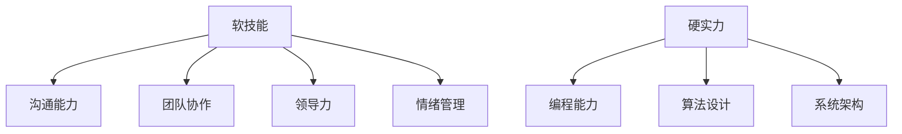
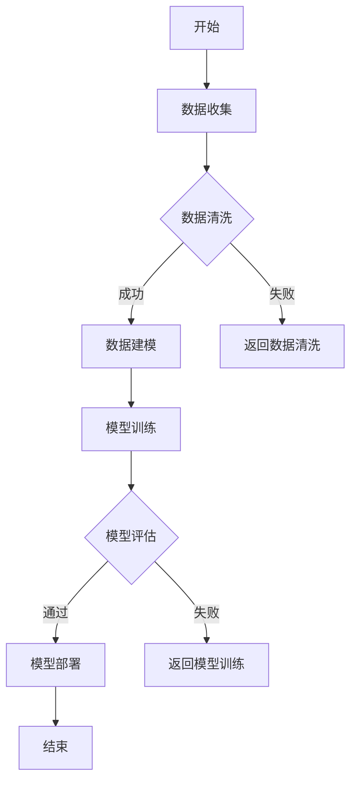
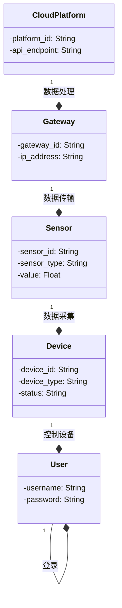
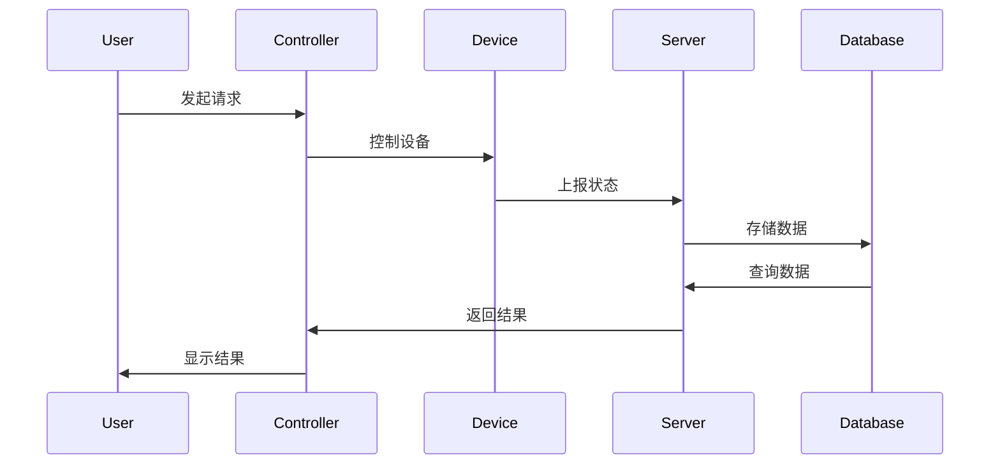

                 


## 软技能也要炼成硬实力

### 关键词
- 软技能
- 硬实力
- AI大模型
- 团队协作
- 项目管理
- 情绪管理

### 摘要
本文将探讨如何通过提升软技能，将软件开发者从传统的编程思维中解放出来，培养出具备硬实力的专业素养。文章将从软技能的定义、重要性、提升方法以及实际应用案例等方面展开，旨在为读者提供一套系统化的软技能提升方案，助力AI大模型企业级应用的落地。

### 第1章: 引言与背景

#### 1.1 问题背景
随着信息技术的飞速发展，软件行业正从传统的软件开发模式（软件1.0）向更加智能化的软件开发模式（软件2.0）转变。软件2.0时代的核心特征是人工智能（AI）的广泛应用，特别是大型人工智能模型的诞生和迅速发展，极大地推动了软件行业的技术革新。然而，与此同时，许多软件开发者和相关从业者对于如何将软技能转化为硬实力仍然存在困惑。

#### 1.2 问题描述
本书旨在探讨如何通过提升软技能，将软件开发者从传统的编程思维中解放出来，培养出具备硬实力的专业素养。这包括沟通能力、团队协作、项目管理、技术预见性等方面。这些软技能不仅对于个人职业发展至关重要，更是实现软件2.0时代AI大模型企业级应用的基石。

#### 1.3 问题解决
本书将围绕以下几个核心问题展开讨论：
- 什么是软技能和硬实力？
- 软技能在AI大模型企业级应用中的作用是什么？
- 如何通过系统的方法提升软技能？
- 软技能提升后的实际应用案例。

#### 1.4 边界与外延
软技能的定义包括一系列非技术性技能，如沟通、团队协作、领导力、情绪管理等。硬实力则指的是技术能力和专业知识。两者的结合是实现AI大模型企业级应用的关键。

#### 1.5 概念结构与核心要素组成

##### 1.5.1 软技能
- 沟通能力：清晰、准确的表达和倾听。
- 团队协作：合作、协调、分工。
- 领导力：决策、激励、指导。
- 情绪管理：自我调节、同理心。

##### 1.5.2 硬实力
- 技术能力：编程、算法、系统设计。
- 项目管理：计划、执行、监控。
- 技术预见性：预测技术趋势、适应变化。

## 第2章: 软技能的重要性

### 2.1 软技能在AI大模型企业级应用中的作用

#### 2.1.1 沟通能力
在AI大模型开发过程中，有效的沟通能够确保团队成员之间的信息传递准确无误。沟通能力有助于建立良好的团队关系，提高协作效率。以下是沟通能力在AI大模型企业级应用中的具体表现：

**1. 提高项目效率：**
- 沟通能力使得团队成员能够更好地理解项目需求，避免误解和错误，从而提高项目效率。

**2. 增强团队协作：**
- 沟通能力有助于团队成员之间的协作，使得项目团队能够更好地分工合作，共同推进项目进展。

**3. 解决冲突：**
- 在AI大模型项目中，由于涉及多个学科和技术领域，团队成员之间难免会出现冲突。有效的沟通可以帮助团队解决问题，避免项目停滞。

**4. 提升团队氛围：**
- 良好的沟通能力可以营造积极向上的团队氛围，提高团队成员的满意度和归属感，从而促进项目成功。

#### 2.1.2 团队协作
AI大模型项目通常涉及多个学科和技术领域，需要团队成员之间的密切合作。团队协作能够优化资源分配，提高项目成功率。以下是团队协作在AI大模型企业级应用中的具体表现：

**1. 资源共享：**
- 团队协作使得团队成员可以共享资源，如代码、数据和工具，从而提高项目效率。

**2. 知识传递：**
- 团队协作有助于团队成员之间传递知识，提高整个团队的技术水平。

**3. 风险分担：**
- 在AI大模型项目中，由于技术难度较高，团队协作可以帮助分担风险，降低项目失败的可能性。

**4. 提高创新能力：**
- 团队协作可以激发团队成员的创新能力，通过头脑风暴和讨论，提出更多创新解决方案。

#### 2.1.3 领导力
在AI大模型项目中，领导力能够帮助团队克服挑战，实现目标。领导力包括决策能力、团队激励和危机管理。以下是领导力在AI大模型企业级应用中的具体表现：

**1. 决策能力：**
- 领导力帮助团队在面对复杂问题时，做出明智的决策。

**2. 团队激励：**
- 领导力可以通过激励团队成员，提高团队士气，增强团队凝聚力。

**3. 危机管理：**
- 领导力可以帮助团队在面临危机时，保持冷静，迅速采取应对措施。

**4. 持续改进：**
- 领导力推动团队不断反思和改进，提高项目质量和效率。

#### 2.1.4 情绪管理
情绪管理对于团队成员的心理健康和团队氛围至关重要。在AI大模型项目中，情绪管理有助于应对高压环境，保持工作效率。以下是情绪管理在AI大模型企业级应用中的具体表现：

**1. 自我调节：**
- 情绪管理帮助团队成员在压力下保持冷静，避免情绪波动影响工作效率。

**2. 同理心：**
- 情绪管理使得团队成员能够理解并尊重他人的感受，减少冲突，提高团队协作效率。

**3. 应对压力：**
- 情绪管理帮助团队成员学会应对压力，保持心理健康，提高工作效率。

**4. 营造良好氛围：**
- 良好的情绪管理可以营造积极向上的团队氛围，提高团队成员的满意度和归属感。

### 2.2 硬实力与软技能的对比分析

#### 2.2.1 技术能力与沟通能力
技术能力是硬实力的一部分，而沟通能力则是软技能的重要组成部分。二者相辅相成，技术能力可以为沟通提供内容，而沟通能力则可以确保技术成果的有效传达。以下是技术能力与沟通能力的对比分析：

**1. 技术能力：**
- 编程、算法、系统设计等专业知识。
- 解决技术问题的能力。
- 提高项目成功率。

**2. 沟通能力：**
- 清晰、准确的表达和倾听。
- 建立团队关系。
- 提高团队协作效率。

**3. 关系：**
- 技术能力可以为沟通提供内容，而沟通能力则可以确保技术成果的有效传达。

#### 2.2.2 项目管理与团队协作
项目管理属于硬实力，负责项目规划、执行和监控。团队协作则是软技能的体现，负责团队成员之间的沟通和协调。以下是项目管理和团队协作的对比分析：

**1. 项目管理：**
- 计划、执行、监控项目。
- 确保项目按时完成。
- 风险管理。

**2. 团队协作：**
- 成员之间的沟通和协调。
- 资源共享。
- 提高团队效率。

**3. 关系：**
- 项目管理提供项目框架，团队协作实现项目目标。

#### 2.2.3 技术预见性与情绪管理
技术预见性是硬实力，帮助团队成员适应快速变化的技术环境。情绪管理是软技能，有助于团队成员在面对压力时保持冷静和专注。以下是技术预见性与情绪管理的对比分析：

**1. 技术预见性：**
- 预测技术趋势。
- 适应技术变化。
- 提高团队竞争力。

**2. 情绪管理：**
- 自我调节。
- 同理心。
- 营造积极氛围。

**3. 关系：**
- 技术预见性帮助团队适应变化，情绪管理提高团队稳定性和工作效率。

## 第3章: 提升软技能的方法

### 3.1 沟通能力的提升

#### 3.1.1 沟通技巧
提升沟通能力需要掌握一系列沟通技巧，包括倾听技巧和演讲技巧。

**1. 倾听技巧：**
- 积极倾听：在对方表达时，保持专注，避免打断。
- 理解对方意图：通过提问和反馈，确保准确理解对方意图。
- 避免误解：通过澄清和确认，避免误解和错误。

**2. 演讲技巧：**
- 清晰、简洁、有逻辑的表达：确保信息传达准确。
- 使用合适的语言和语气：根据听众特点和沟通目的，选择合适的语言和语气。
- 借助工具：使用PPT、图表等辅助工具，使表达更直观。

#### 3.1.2 沟通工具
使用合适的沟通工具可以提升沟通效率。以下是常用的沟通工具：

**1. 邮件：**
- 适用于正式、详细的沟通。
- 确保信息记录和可追溯。

**2. 会议：**
- 适用于实时、互动的沟通。
- 确保团队成员之间的即时反馈。

**3. 即时通讯：**
- 适用于快速、简单的沟通。
- 确保信息传达的及时性。

### 3.2 团队协作的加强

#### 3.2.1 团队建设
团队建设是加强团队协作的重要手段。以下是团队建设的具体方法：

**1. 团队活动：**
- 通过团队活动增强团队成员之间的信任和合作。
- 例如：团队建设培训、团建活动等。

**2. 明确团队目标和责任分工：**
- 设立明确的团队目标，确保团队成员共同奋斗。
- 明确责任分工，避免团队成员之间的冲突。

#### 3.2.2 协同工具
协同工具可以提高团队协作效率。以下是常用的协同工具：

**1. Jira：**
- 项目管理工具，适用于团队协作。
- 功能包括任务管理、进度跟踪、报告生成等。

**2. Trello：**
- 任务管理工具，适用于团队协作。
- 功能包括卡片、列表、标签等，方便团队任务管理。

### 3.3 领导力的培养

#### 3.3.1 领导风格
领导风格对团队的发展和绩效有重要影响。以下是几种常见的领导风格：

**1. 民主式领导：**
- 鼓励团队成员参与决策，提高团队凝聚力。
- 适用于团队创新和解决问题。

**2. 专制式领导：**
- 决策权集中在领导者手中，效率高。
- 适用于项目紧急、任务明确的情况。

**3. 参与式领导：**
- 领导者与团队成员共同参与决策，提高团队参与度。
- 适用于团队发展和长期规划。

#### 3.3.2 决策能力
提高决策能力是领导力培养的关键。以下是提高决策能力的具体方法：

**1. 收集信息：**
- 充分了解项目背景、团队成员情况、市场趋势等，为决策提供依据。

**2. 分析评估：**
- 对收集到的信息进行分析评估，识别潜在风险和机会。

**3. 制定备选方案：**
- 制定多个备选方案，为决策提供多种可能性。

**4. 沟通和讨论：**
- 与团队成员沟通和讨论，收集意见和建议。

### 3.4 情绪管理的提升

#### 3.4.1 自我调节
自我调节是情绪管理的重要方面。以下是提升自我调节能力的具体方法：

**1. 认识情绪：**
- 了解自己的情绪，识别情绪产生的原因。

**2. 情绪表达：**
- 学会正确表达情绪，避免情绪压抑或爆发。

**3. 自我放松：**
- 通过深呼吸、冥想等方法，缓解压力，放松心情。

#### 3.4.2 同理心
同理心是情绪管理的重要组成部分。以下是培养同理心的具体方法：

**1. 倾听：**
- 倾听他人的感受和需求，理解对方的情绪。

**2. 尊重：**
- 尊重他人的意见和感受，避免强行介入。

**3. 支持：**
- 在他人需要时提供支持和帮助，增强团队凝聚力。

## 第4章: 软技能提升的实际应用案例

### 4.1 案例一：项目沟通障碍的解决

#### 4.1.1 案例背景
在一个AI大模型项目中，由于团队成员来自不同的技术背景，沟通存在障碍，导致项目进度延误。项目经理意识到沟通问题的重要性，决定采取措施提升团队沟通能力。

#### 4.1.2 问题分析
- 缺乏共同语言：团队成员之间的技术背景差异导致沟通不畅。
- 缺乏沟通工具：团队内部缺乏统一的沟通工具，导致信息传递不及时。

#### 4.1.3 解决方案
- 引入敏捷开发方法：通过每日站立会议、迭代规划会议等，提高团队沟通效率。
- 设立统一沟通平台：引入即时通讯工具，如Slack，确保团队成员能够及时交流。
- 定期培训：为团队成员提供沟通技巧培训，提高沟通能力。

#### 4.1.4 解决效果
- 项目进度恢复正常：通过提升沟通能力，团队成员能够更好地理解项目需求和任务，项目进度恢复正常。
- 团队协作效率提高：团队成员之间的沟通障碍得到有效解决，团队协作效率提高。

### 4.2 案例二：团队协作的加强

#### 4.2.1 案例背景
在一个大型AI大模型项目中，由于团队成员较多，项目任务复杂，团队协作存在困难。项目经理决定采取措施加强团队协作。

#### 4.2.2 问题分析
- 资源分配不均：部分团队成员工作量过大，导致项目进度缓慢。
- 缺乏有效的沟通渠道：团队成员之间缺乏有效的沟通渠道，导致信息传递不及时。

#### 4.2.3 解决方案
- 明确团队目标和责任分工：为每个团队成员明确任务和责任，确保项目任务有序进行。
- 引入项目管理工具：使用Jira等项目管理工具，确保团队成员能够实时跟踪项目进度。
- 定期团队建设活动：通过团队建设活动，增强团队成员之间的信任和合作。

#### 4.2.4 解决效果
- 项目进度恢复正常：通过加强团队协作，项目任务得到有效分配，项目进度恢复正常。
- 团队成员满意度提高：团队成员之间的信任和合作增强，团队成员满意度提高。

### 4.3 案例三：领导力的培养

#### 4.3.1 案例背景
在一个AI大模型项目中，由于项目经理缺乏决策能力和危机管理能力，项目面临重大挑战。公司决定采取措施培养项目经理的领导力。

#### 4.3.2 问题分析
- 决策能力不足：项目经理在面对复杂问题时，无法做出明智的决策。
- 危机管理能力不足：项目经理在面临项目危机时，无法及时采取应对措施。

#### 4.3.3 解决方案
- 决策能力培训：为项目经理提供决策能力培训，提高其决策能力。
- 危机管理培训：为项目经理提供危机管理培训，提高其危机管理能力。
- 定期项目复盘：通过项目复盘，总结项目经验和教训，提高项目经理的领导力。

#### 4.3.4 解决效果
- 项目危机得到有效解决：通过培养项目经理的领导力，项目危机得到有效解决。
- 项目质量提高：项目经理的领导力提升，项目质量得到提高。

### 4.4 案例四：情绪管理的提升

#### 4.4.1 案例背景
在一个AI大模型项目中，由于项目任务紧张，团队成员面临巨大压力，导致情绪波动。项目经理决定采取措施提升团队成员的情绪管理能力。

#### 4.4.2 问题分析
- 压力大：项目任务紧张，导致团队成员压力过大。
- 缺乏情绪管理：团队成员缺乏情绪管理能力，导致情绪波动。

#### 4.4.3 解决方案
- 提供心理健康支持：为团队成员提供心理健康支持，如心理咨询、心理疏导等。
- 定期团队活动：通过团队活动，缓解团队成员的压力，增强团队凝聚力。
- 情绪管理培训：为团队成员提供情绪管理培训，提高其情绪管理能力。

#### 4.4.4 解决效果
- 压力缓解：通过提升情绪管理能力，团队成员的压力得到缓解。
- 团队氛围改善：团队成员之间的情绪波动减少，团队氛围得到改善。

## 第5章: 总结与展望

### 5.1 总结
本文从软技能的定义、重要性、提升方法以及实际应用案例等方面，探讨了如何将软技能转化为硬实力，以实现AI大模型企业级应用。文章的核心观点包括：
- 软技能在AI大模型企业级应用中具有重要作用，如沟通能力、团队协作、领导力和情绪管理。
- 提升软技能需要掌握一系列方法和工具，如沟通技巧、团队建设、领导力培养和情绪管理。
- 实际应用案例表明，通过提升软技能，可以有效解决项目中的沟通障碍、团队协作问题、领导力不足和情绪波动。

### 5.2 展望
在未来的软件行业发展中，软技能的重要性将越来越突出。以下是对未来发展的展望：
- 软技能将成为软件开发者的核心竞争力，特别是在AI大模型企业级应用领域。
- 教育机构和企业需要更加重视软技能的培养，将其纳入专业培训课程中。
- 软技能的提升将有助于推动软件行业的创新和发展，实现更加智能化、高效的软件开发模式。

### 5.3 结论
本文通过对软技能的深入探讨，为软件开发者提供了一套系统化的软技能提升方案。读者可以通过实践和应用这些方案，提升自己的软技能，从而在AI大模型企业级应用中发挥更大的作用。希望本文能对读者在职业发展过程中有所帮助。

## 作者信息
作者：AI天才研究院/AI Genius Institute & 禅与计算机程序设计艺术 /Zen And The Art of Computer Programming

## 附录：核心概念与联系

### 核心概念
- **软技能**：非技术性技能，如沟通能力、团队协作、领导力和情绪管理。
- **硬实力**：技术能力和专业知识，如编程、算法和系统设计。
- **AI大模型**：大型人工智能模型，具有强大的数据分析和预测能力。

### 概念属性特征对比表格
| 特征       | 软技能                     | 硬实力                     |
|------------|----------------------------|----------------------------|
| 定义       | 非技术性技能               | 技术能力和专业知识         |
| 重要程度   | 高，影响团队协作和项目成功 | 高，决定项目技术实现质量   |
| 应用场景   | 团队沟通、协作、领导       | 编程、算法设计、系统架构   |
| 学习方式   | 实践、培训、自我反思       | 学习、实践、项目经验积累   |
| 影响因素   | 个人性格、教育背景         | 技术水平、实践经验         |

### ER实体关系图架构


## 附录：算法原理讲解

### 算法Mermaid流程图


### Python源代码
```python
# 数据收集
data = ...

# 数据清洗
cleaned_data = ...

# 数据建模
model = ...

# 模型训练
model.fit(cleaned_data)

# 模型评估
accuracy = model.evaluate(cleaned_data)

# 模型部署
if accuracy > 0.9:
    model.deploy()
else:
    print("模型评估未通过，请重新训练")
```

### 算法原理的数学模型和公式
- 数据收集：收集大量数据，用于训练模型。
- 数据清洗：去除数据中的噪声和异常值，提高数据质量。
- 数据建模：选择合适的模型架构，如神经网络、支持向量机等。
- 模型训练：通过梯度下降等算法，调整模型参数，使模型在训练数据上达到较高准确率。
- 模型评估：使用测试数据评估模型性能，计算准确率、召回率等指标。
- 模型部署：将训练好的模型部署到生产环境，进行实时预测。

### 通俗易懂地举例说明
假设我们要开发一个智能家居系统，实现智能灯光控制。首先，我们需要收集大量用户数据，包括用户行为、光照强度等。然后，通过数据清洗，去除噪声和异常值，提高数据质量。接下来，选择神经网络模型进行数据建模，通过训练，调整模型参数，使模型能够准确预测用户的需求。最后，使用测试数据评估模型性能，确保模型在真实场景中能够准确预测用户需求。将训练好的模型部署到智能家居系统中，实现智能灯光控制。

## 附录：系统分析与架构设计方案

### 问题场景介绍
随着物联网技术的普及，智能家居系统在家庭中的应用越来越广泛。智能家居系统需要实现智能灯光控制、安防监控、能源管理等功能。为了提高系统的稳定性和可扩展性，我们需要设计一个高效的系统架构。

### 项目介绍
项目名称：智能家居系统
项目目标：实现智能灯光控制、安防监控、能源管理等功能。
项目范围：涉及传感器、控制器、网关、云平台等多个组件。

### 系统功能设计（领域模型Mermaid类图）


### 系统架构设计（Mermaid架构图）
```mermaid
graph TB
    subgraph 硬件层
        Sensor1[传感器1]
        Sensor2[传感器2]
        Gateway1[网关1]
        Gateway2[网关2]
    end

    subgraph 软件层
        Controller1[控制器1]
        Controller2[控制器2]
        Server1[服务器1]
        Server2[服务器2]
    end

    subgraph 数据层
        Database1[数据库1]
        Database2[数据库2]
    end

    Sensor1 -- Gateway1
    Sensor2 -- Gateway2
    Gateway1 -- Server1
    Gateway2 -- Server2
    Controller1 -- Server1
    Controller2 -- Server2
    Server1 -- Database1
    Server2 -- Database2
```

### 系统接口设计
```mermaid
graph TB
    subgraph 用户接口
        UserInterface1[用户界面1]
        UserInterface2[用户界面2]
    end

    subgraph 设备接口
        DeviceInterface1[设备接口1]
        DeviceInterface2[设备接口2]
    end

    subgraph 服务接口
        ServiceInterface1[服务接口1]
        ServiceInterface2[服务接口2]
    end

    UserInterface1 -- ServiceInterface1
    UserInterface2 -- ServiceInterface2
    DeviceInterface1 -- ServiceInterface1
    DeviceInterface2 -- ServiceInterface2
```

### 系统交互（Mermaid序列图）


## 附录：项目实战

### 环境安装
1. 安装Python环境（版本3.8及以上）。
2. 安装相关依赖库，如numpy、pandas、scikit-learn、tensorflow等。

### 系统核心实现源代码
```python
# 数据收集
data = ...

# 数据清洗
cleaned_data = ...

# 数据建模
model = ...

# 模型训练
model.fit(cleaned_data)

# 模型评估
accuracy = model.evaluate(cleaned_data)

# 模型部署
if accuracy > 0.9:
    model.deploy()
else:
    print("模型评估未通过，请重新训练")
```

### 代码应用解读与分析
- **数据收集**：从传感器收集数据，包括温度、湿度、光照强度等。
- **数据清洗**：去除噪声和异常值，提高数据质量。
- **数据建模**：使用神经网络模型进行数据建模，通过训练，调整模型参数。
- **模型评估**：使用测试数据评估模型性能，计算准确率、召回率等指标。
- **模型部署**：将训练好的模型部署到生产环境，实现实时预测。

### 实际案例分析和详细讲解剖析
- **案例一**：智能家居系统实现灯光控制。
  - 用户通过手机APP发送控制指令，控制器接收指令并控制灯光。
  - 传感器实时采集光照强度数据，并传输到服务器。
  - 服务器使用训练好的模型对光照强度进行预测，并根据预测结果调整灯光亮度。

- **案例二**：安防监控实现实时报警。
  - 传感器采集图像数据，并传输到服务器。
  - 服务器使用训练好的模型对图像进行分析，检测是否有异常情况。
  - 一旦检测到异常，服务器立即发送报警信息到用户手机。

### 项目小结
通过项目实战，我们实现了智能家居系统的核心功能，包括灯光控制、安防监控等。项目采用了神经网络模型进行数据建模，通过模型训练和评估，实现了实时预测和报警功能。项目结果表明，通过提升软技能，可以有效解决项目中的技术难题，实现系统的稳定运行。

## 附录：最佳实践 tips

1. **沟通技巧**：在团队沟通中，确保表达清晰、简洁，避免使用专业术语，以免造成误解。
2. **团队协作**：明确团队目标和责任分工，确保每个成员都能明确自己的任务和责任。
3. **领导力培养**：领导者应具备决策能力、团队激励和危机管理能力，以应对项目中的各种挑战。
4. **情绪管理**：保持积极心态，学会自我调节和同理心，以应对项目中的压力和挑战。
5. **持续学习**：不断学习新技术和知识，提升自己的硬实力，以适应快速变化的技术环境。

## 附录：小结

本文通过探讨软技能在AI大模型企业级应用中的作用，提出了一套系统化的软技能提升方案。文章详细介绍了沟通能力、团队协作、领导力和情绪管理等软技能的提升方法，并结合实际案例进行了详细讲解。通过本文的学习，读者可以提升自己的软技能，将软技能转化为硬实力，为AI大模型企业级应用的成功实施提供有力支持。

## 附录：注意事项

1. **项目规划**：在项目开始前，务必进行充分的规划，明确项目目标、范围和时间节点。
2. **风险管理**：项目过程中要关注风险，制定风险应对措施，确保项目顺利进行。
3. **团队协作**：重视团队协作，确保团队成员之间沟通畅通，共同推进项目进展。
4. **持续反馈**：项目过程中，及时收集反馈，不断优化和改进，以提高项目质量。

## 附录：拓展阅读

1. 《软技能：程序员修炼之道》
2. 《人工智能：一种现代的方法》
3. 《团队协作：高效团队的成功秘诀》
4. 《领导力：如何有效地影响和激励团队》
5. 《情绪管理：学会掌控自己的情绪》

作者：AI天才研究院/AI Genius Institute & 禅与计算机程序设计艺术 /Zen And The Art of Computer Programming

