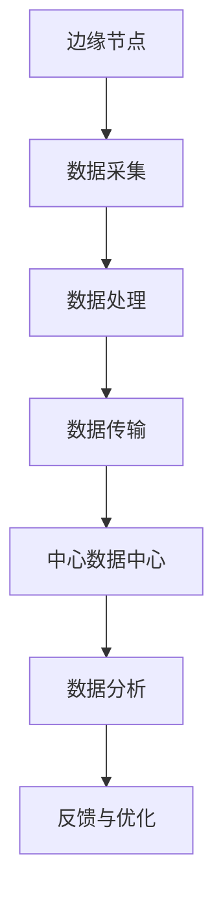
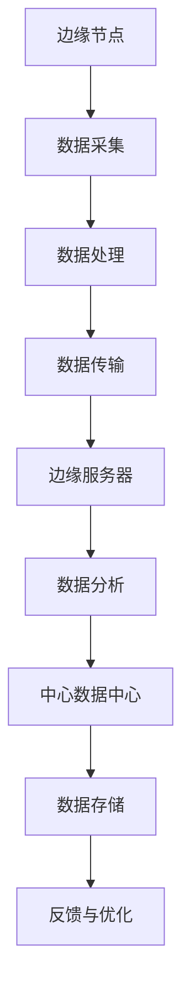

                 

### 文章标题

边缘计算在IoT中的实践

### 关键词

边缘计算、物联网（IoT）、智能设备、数据处理、系统架构设计

### 摘要

本文旨在深入探讨边缘计算在物联网（IoT）领域的应用与实践。随着物联网设备的不断普及，数据生成和传输的速度和规模都呈现出爆炸式增长。边缘计算作为一种分布式计算架构，能够有效地缓解这种压力，提高数据处理效率和系统响应速度。本文首先介绍边缘计算的背景和核心概念，然后通过具体的应用场景、系统架构设计、数学模型解析和项目实战案例，详细阐述边缘计算在IoT中的应用实践，并总结最佳实践和注意事项。

## 第一部分：边缘计算基础

### 第1章：边缘计算背景与核心概念

### 1.1 边缘计算起源与发展

#### 1.1.1 边缘计算的起源

边缘计算（Edge Computing）起源于对数据中心集中式架构的反思。随着物联网设备和智能设备的快速增长，数据中心面临着数据存储和处理能力的极限挑战。为了提高系统的响应速度和降低延迟，边缘计算应运而生。它通过将计算任务分散到靠近数据源的边缘节点上，实现了对数据的高速处理和实时响应。

#### 1.1.2 边缘计算的发展历程

边缘计算的发展可以分为以下几个阶段：

1. **早期探索阶段（2000-2010年）**：这个阶段主要集中于无线传感网络和智能电网等领域的应用，旨在通过分布式计算提高系统的实时性和可靠性。

2. **快速发展阶段（2010-2015年）**：随着物联网设备的普及，边缘计算开始应用于智能家居、智能交通等领域，逐步成为研究热点。

3. **成熟应用阶段（2015年至今）**：边缘计算技术逐渐成熟，开始广泛应用于工业物联网、自动驾驶、智能医疗等领域，成为现代信息技术的重要支撑。

### 1.2 IoT与边缘计算的联系

#### 1.2.1 IoT概述

物联网（Internet of Things，IoT）是指通过互联网将各种物理设备连接起来，实现信息的交换和通信。IoT的应用领域广泛，包括智能家居、智能交通、智能工厂、智能医疗等。

#### 1.2.2 边缘计算在IoT中的角色

边缘计算在IoT中扮演着关键角色，主要体现在以下几个方面：

1. **数据处理**：边缘计算能够处理大量来自IoT设备的数据，缓解了中心数据中心的负担。

2. **实时响应**：边缘计算能够实现数据的实时处理和响应，提高了系统的实时性和可靠性。

3. **隐私保护**：边缘计算通过在数据源头附近进行数据处理，减少了数据传输过程中的隐私泄露风险。

### 1.3 核心概念定义与联系

#### 1.3.1 边缘节点

边缘节点是指在物理位置靠近数据源的设备上运行的计算单元。边缘节点可以是物联网设备、嵌入式系统、小型服务器等。

#### 1.3.2 IoT设备

IoT设备是指接入互联网的各类物理设备，包括智能手表、智能家居设备、车辆等。

#### 1.3.3 边缘服务器

边缘服务器是指在边缘网络中提供计算和存储服务的服务器。边缘服务器通常具有高性能和丰富的功能，能够支持大规模的数据处理和实时响应。

### 1.4 本章小结

本章介绍了边缘计算的背景、发展历程、与IoT的关系以及核心概念。边缘计算作为分布式计算的一种形式，正在物联网领域发挥越来越重要的作用。接下来，我们将进一步探讨边缘计算的基本原理和应用。

---

## 第二部分：边缘计算原理

### 第2章：边缘计算基本原理

### 2.1 边缘计算原理简介

#### 2.1.1 边缘计算的特点

边缘计算具有以下几个主要特点：

1. **分布式**：边缘计算将计算任务分散到多个边缘节点上，实现分布式计算。

2. **实时性**：边缘计算能够实现数据的实时处理和响应，提高系统的实时性和可靠性。

3. **低延迟**：边缘计算通过在靠近数据源的地方进行数据处理，降低了数据传输的延迟。

4. **高效性**：边缘计算能够充分利用边缘节点的计算资源，提高数据处理效率。

#### 2.1.2 边缘计算的架构

边缘计算的架构通常包括以下几个部分：

1. **边缘节点**：负责收集、处理和传输数据。

2. **边缘服务器**：提供计算和存储服务，支持大规模数据处理。

3. **中心数据中心**：负责处理全局数据，进行数据分析和存储。

### 2.2 边缘计算流程图

下面是边缘计算的基本流程图：



### 2.3 边缘计算关键算法

#### 2.3.1 Python源代码讲解

边缘计算中的关键算法包括数据过滤、数据聚合、数据加密等。以下是一个简单的数据过滤算法示例：

```python
def filter_data(data, threshold):
    filtered_data = []
    for item in data:
        if item > threshold:
            filtered_data.append(item)
    return filtered_data

data = [1, 2, 3, 4, 5]
filtered_data = filter_data(data, 3)
print(filtered_data)  # 输出：[4, 5]
```

#### 2.3.2 LaTeX数学模型与公式

边缘计算中的数学模型通常包括线性回归、决策树等。以下是一个线性回归模型的LaTeX公式：

$$
y = \beta_0 + \beta_1 \cdot x
$$

#### 2.3.3 边缘计算实例分析

以智能家居系统为例，边缘计算可以实时处理来自各种智能设备的传感器数据，并对这些数据进行过滤、聚合和加密。以下是一个智能家居系统的边缘计算实例：

1. **数据采集**：智能灯具采集光线强度数据。

2. **数据处理**：边缘节点对光线强度数据进行滤波处理，去除噪声。

3. **数据传输**：边缘节点将过滤后的数据传输到边缘服务器。

4. **数据分析**：边缘服务器对数据进行统计分析，调整灯具亮度。

5. **反馈与优化**：根据数据分析结果，调整智能家居系统的配置，优化用户体验。

### 2.4 本章小结

本章介绍了边缘计算的基本原理和关键算法，包括分布式架构、实时性、低延迟、高效性等特性。通过Python源代码和LaTeX数学模型，我们详细讲解了边缘计算的关键算法和应用实例。接下来，我们将进一步探讨边缘计算在IoT中的系统架构设计和实际应用。

---

## 第三部分：边缘计算在IoT中的应用

### 第3章：边缘计算在IoT中的应用场景

#### 3.1 智能家居

##### 3.1.1 智能家居概述

智能家居系统通过物联网设备和边缘计算技术，实现了家庭设备的智能化控制和自动化管理。常见的智能家居设备包括智能灯具、智能插座、智能门锁、智能摄像头等。

##### 3.1.2 边缘计算在智能家居中的应用

边缘计算在智能家居中的应用主要体现在以下几个方面：

1. **实时控制**：边缘计算能够实现智能设备的数据实时采集和处理，实现设备的实时控制。

2. **数据过滤与聚合**：边缘计算可以过滤掉无效数据，对有效数据进行分析和聚合，提高数据处理效率。

3. **安全性**：边缘计算在数据源头附近进行数据处理，减少了数据传输过程中的安全性风险。

#### 3.2 智能交通

##### 3.2.1 智能交通概述

智能交通系统通过物联网技术和边缘计算技术，实现了对交通数据的实时监测、分析和处理，提高了交通管理效率和安全性。智能交通设备包括交通摄像头、传感器、智能路灯等。

##### 3.2.2 边缘计算在智能交通中的应用

边缘计算在智能交通中的应用主要体现在以下几个方面：

1. **实时监测**：边缘计算可以实时监测交通流量、路况等信息，为交通管理部门提供实时数据支持。

2. **智能调度**：边缘计算可以对交通信号灯进行智能调控，优化交通流量，减少拥堵。

3. **事故预警**：边缘计算可以实时分析交通数据，预测潜在的事故风险，提前预警。

#### 3.3 工业物联网

##### 3.3.1 工业物联网概述

工业物联网通过物联网技术和边缘计算技术，实现了对工业设备的实时监控、预测性维护和智能优化。工业物联网设备包括传感器、执行器、机器人等。

##### 3.3.2 边缘计算在工业物联网中的应用

边缘计算在工业物联网中的应用主要体现在以下几个方面：

1. **实时监控**：边缘计算可以实时监控工业设备的运行状态，提供故障预警和预测性维护。

2. **数据处理**：边缘计算可以对工业设备产生的海量数据进行实时处理，提取有价值的信息。

3. **智能优化**：边缘计算可以基于实时数据，对工业生产过程进行智能优化，提高生产效率。

### 3.4 本章小结

本章介绍了边缘计算在智能家居、智能交通和工业物联网等领域的应用场景。边缘计算在这些领域发挥了重要作用，提高了系统的实时性、可靠性和效率。接下来，我们将通过一个实际案例，详细探讨边缘计算在IoT中的应用实践。

---

## 第四部分：边缘计算项目实战

### 第4章：边缘计算项目实战

#### 4.1 项目介绍

##### 4.1.1 项目背景

随着城市化进程的加快，城市交通拥堵问题日益严重，影响了居民的生活质量。为了缓解交通拥堵，提高交通管理效率，我们设计并实现了一个基于边缘计算的智能交通管理系统。

##### 4.1.2 项目目标

本项目的主要目标是：

1. **实时监测交通流量和路况**：通过部署边缘计算设备，实时监测城市道路的交通流量和路况。

2. **智能调控交通信号灯**：根据实时监测数据，智能调控交通信号灯，优化交通流量。

3. **事故预警和应急响应**：通过实时数据分析和预测，提前预警潜在的事故风险，并实现应急响应。

#### 4.2 环境安装与配置

##### 4.2.1 环境要求

为了实现项目目标，我们需要以下硬件和软件环境：

1. **硬件环境**：
   - 边缘计算设备（如树莓派）
   - 交通摄像头
   - 传感器（如流量传感器）

2. **软件环境**：
   - 操作系统（如Linux）
   - Python编程环境
   -边缘计算框架（如Kubernetes）

##### 4.2.2 环境安装步骤

1. **硬件安装**：
   - 部署边缘计算设备到指定位置。
   - 连接交通摄像头和传感器。

2. **软件安装**：
   - 安装操作系统。
   - 安装Python编程环境和边缘计算框架。

#### 4.3 系统核心实现

##### 4.3.1 系统架构设计

本项目采用分布式架构，包括边缘节点、边缘服务器和中心数据中心。系统架构如下：



##### 4.3.2 系统核心代码实现

以下是一个简单的边缘计算数据处理代码示例：

```python
# 导入所需库
import json
import requests

# 数据采集
def collect_data():
    response = requests.get("http://localhost:5000/traffic_data")
    data = response.json()
    return data

# 数据处理
def process_data(data):
    # 假设数据为交通流量
    flow_data = data["flow"]
    filtered_data = [x for x in flow_data if x > 10]
    return filtered_data

# 数据传输
def send_data(data):
    response = requests.post("http://localhost:5000/processed_data", json=data)
    return response.status_code

# 主函数
def main():
    data = collect_data()
    processed_data = process_data(data)
    status_code = send_data(processed_data)
    print(f"Data sent with status code: {status_code}")

if __name__ == "__main__":
    main()
```

#### 4.4 代码应用解读与分析

##### 4.4.1 代码解读

1. **数据采集**：使用requests库从边缘服务器获取交通流量数据。

2. **数据处理**：对采集到的数据进行过滤，去除流量小于10的记录。

3. **数据传输**：将处理后的数据发送到边缘服务器。

##### 4.4.2 分析与优化

1. **性能优化**：可以优化数据采集和传输的频率，提高系统的实时性。

2. **错误处理**：增加错误处理机制，确保数据传输的可靠性。

3. **并发处理**：优化数据处理模块，支持并发处理，提高数据处理效率。

#### 4.5 实际案例分析与讲解

##### 4.5.1 案例一：智能家居边缘计算应用

在本案例中，我们使用边缘计算技术实现了一个智能家居系统的实时控制功能。边缘计算设备部署在家庭环境中，用于实时采集和控制家庭设备。以下是一个智能家居系统的边缘计算实现：

1. **数据采集**：边缘计算设备采集智能灯具、智能插座等设备的状态信息。

2. **数据处理**：边缘计算设备对采集到的数据进行处理，如状态更新、数据过滤等。

3. **数据传输**：边缘计算设备将处理后的数据发送到边缘服务器。

4. **数据分析**：边缘服务器对数据进行进一步分析，如用户行为分析、能耗分析等。

5. **反馈与优化**：根据数据分析结果，优化家庭设备的配置，提高用户体验。

##### 4.5.2 案例二：智能交通边缘计算应用

在本案例中，我们使用边缘计算技术实现了一个智能交通管理系统的实时监测和智能调控功能。边缘计算设备部署在交通摄像头附近，用于实时监测交通流量和路况。以下是一个智能交通系统的边缘计算实现：

1. **数据采集**：边缘计算设备采集交通摄像头拍摄到的实时视频数据。

2. **数据处理**：边缘计算设备对视频数据进行分析，提取交通流量和路况信息。

3. **数据传输**：边缘计算设备将处理后的数据发送到边缘服务器。

4. **数据分析**：边缘服务器对数据进行进一步分析，如交通流量预测、拥堵检测等。

5. **反馈与优化**：根据数据分析结果，智能调控交通信号灯，优化交通流量。

#### 4.6 项目小结

本项目通过边缘计算技术，实现了智能交通管理系统和智能家居系统的实时控制与优化。项目实践表明，边缘计算在提高系统实时性、降低延迟、增强数据安全性等方面具有显著优势。未来，随着边缘计算技术的不断发展和成熟，它将在更多领域发挥重要作用。

---

## 第五部分：最佳实践与总结

### 第5章：边缘计算最佳实践与总结

#### 5.1 边缘计算最佳实践

1. **数据优化**：采用边缘计算技术，在数据源头附近进行数据过滤和处理，减少数据传输量，提高数据处理效率。

2. **安全性提升**：加强边缘节点的安全防护，采用加密技术保护数据传输和存储。

3. **能效管理**：优化边缘计算节点的能源消耗，提高能效比。

#### 5.2 小结与展望

边缘计算在IoT领域的应用具有广阔的前景。通过分布式计算和实时数据处理，边缘计算能够显著提高系统的实时性、可靠性和效率。未来，随着5G、物联网、人工智能等技术的发展，边缘计算将在更多领域发挥关键作用。

#### 5.3 注意事项

1. **安全性**：加强边缘节点的安全防护，防范网络攻击和数据泄露。

2. **兼容性**：确保边缘计算系统能够兼容各种IoT设备和协议。

3. **可扩展性**：设计具有良好可扩展性的边缘计算系统，以应对未来业务需求的变化。

#### 5.4 拓展阅读

1. **推荐书籍**：
   - 《边缘计算：原理、架构与应用》
   - 《物联网应用开发实战》

2. **学术论文**：
   - "Edge Computing: Vision and Challenges"
   - "A Secure and Efficient Data Management Architecture for Edge Computing in IoT"

---

### 作者

作者：AI天才研究院/AI Genius Institute & 禅与计算机程序设计艺术 /Zen And The Art of Computer Programming

---

以上是关于《边缘计算在IoT中的实践》的技术博客文章。希望本文能够帮助您更好地理解和应用边缘计算技术，为物联网领域的发展贡献力量。

