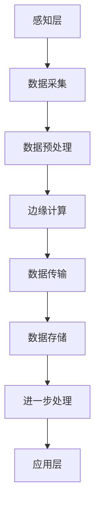

                 

### 引言：边缘计算与物联网简介

#### 1.1 问题背景

随着信息技术的迅猛发展，物联网（IoT）已经成为当今社会的重要组成部分。物联网通过将各种设备、传感器、网络和数据处理平台连接起来，实现了物理世界与数字世界的深度融合。然而，随着物联网设备的数量和种类不断增多，数据传输和处理的需求也越来越大，传统的云计算架构开始面临一些挑战。

首先，物联网设备产生的大量数据需要及时处理和响应，传统的云计算模式由于数据传输和处理的延迟，难以满足实时性的要求。其次，物联网设备通常分布在广泛的地理区域，数据传输的距离较远，容易受到网络延迟和带宽限制的影响。此外，数据的安全性问题也愈发凸显，大量的敏感数据在传输过程中可能面临泄露和攻击的风险。

为了解决上述问题，边缘计算应运而生。边缘计算通过在靠近数据源头的地方（即边缘）部署计算资源和处理能力，能够显著减少数据传输距离，提高数据处理速度，增强系统的实时性和可靠性。边缘计算与物联网的结合，不仅能够优化数据处理流程，提升用户体验，还能为各种行业应用提供更加高效、智能的解决方案。

#### 1.2 核心概念

##### 1.2.1 边缘计算

边缘计算（Edge Computing）是一种分布式计算架构，它将计算、存储、处理和分析任务从云端转移到网络边缘。这里的网络边缘指的是网络节点，如路由器、交换机、无线接入点等，或者是一些端设备，如智能手机、智能手表等。边缘计算的核心思想是通过在靠近数据源的地方处理数据，减少数据传输的延迟，提高系统的响应速度和效率。

- **定义**：边缘计算是一种将计算任务分散到网络的边缘节点进行的计算模式，旨在降低数据传输延迟，提升系统性能。
- **特点**：
  - **实时性**：靠近数据源，减少数据传输延迟。
  - **高效性**：在本地处理数据，减少网络带宽占用。
  - **灵活性**：支持多种设备和平台的接入。
  - **安全性**：本地处理数据，降低数据泄露风险。
- **优势**：
  - **提高响应速度**：本地处理数据，减少网络传输延迟。
  - **减少带宽占用**：只在必要时将数据传输到云端。
  - **增强安全性**：敏感数据在本地处理，减少泄露风险。

##### 1.2.2 物联网

物联网（Internet of Things，简称IoT）是指通过将各种物品与网络连接起来，实现物品之间的信息交换和通信。物联网的核心理念是万物互联，通过智能设备和传感器，将物理世界与数字世界相结合，形成一个智能化、网络化、自动化的系统。

- **定义**：物联网是通过将各种物品通过网络连接起来，实现智能识别、定位、追踪、监控和管理的一种网络技术。
- **分类**：
  - **消费类**：智能家居、智能穿戴设备等。
  - **工业类**：工业物联网、智能工厂等。
  - **公共服务类**：智能交通、智能城市等。
- **架构**：
  - **感知层**：通过各种传感器收集数据。
  - **网络层**：通过有线或无线网络传输数据。
  - **平台层**：数据处理、存储、分析和应用。
  - **应用层**：各种物联网应用和服务。

#### 1.3 应用价值

边缘计算在物联网中的应用价值主要体现在以下几个方面：

- **提高响应速度**：边缘计算在靠近数据源的地方处理数据，显著减少了数据传输的延迟，提高了系统的响应速度，特别是在实时性要求高的场景下，如自动驾驶、智能制造等。
- **减少带宽占用**：边缘计算能够本地处理大量数据，只在必要时将处理结果传输到云端，从而减少了数据传输的带宽占用，降低了网络拥堵的风险。
- **提高数据安全性**：边缘计算在本地处理数据，减少了敏感数据在网络中传输的风险，提高了系统的安全性。
- **支持多样化的应用场景**：边缘计算能够适应各种不同的应用场景，如远程医疗、智能农业、智能环境监测等，为各行各业提供智能化的解决方案。

#### 1.4 本章小结

本章介绍了边缘计算与物联网的基本概念、技术原理以及应用价值。边缘计算通过在靠近数据源头的地方部署计算资源和处理能力，能够显著提高数据处理速度和系统的实时性，降低数据传输延迟和带宽占用。物联网则通过将各种物品与网络连接，实现信息的交换和通信，推动物理世界与数字世界的深度融合。边缘计算与物联网的结合，为各种行业应用提供了更加高效、智能的解决方案，具有重要的应用价值。

## 边缘计算原理

### 2.1 工作原理

边缘计算的基本原理是将计算任务从中心化的云端转移到网络的边缘节点，即在数据生成的地方进行数据处理和分析。这种分布式计算模式具有以下几个核心特点：

- **数据本地处理**：在数据产生的源头（如智能设备、传感器等）进行数据处理，减少了数据传输的距离和延迟。
- **分布式计算资源**：利用网络边缘的设备（如路由器、交换机、智能终端等）进行计算，形成分布式计算资源网络。
- **边缘服务器和网关**：边缘服务器和网关是边缘计算的核心基础设施，负责数据处理、存储和转发等功能。

边缘计算的工作流程可以概括为以下几个步骤：

1. **数据采集**：物联网设备通过各种传感器和采集模块收集数据。
2. **数据预处理**：在边缘设备上对数据进行初步处理，如过滤、压缩、加密等。
3. **边缘计算**：在边缘设备上执行数据处理和分析任务，如实时监控、数据分析、预测模型等。
4. **数据传输**：将处理后的数据传输到云端或其他边缘节点，进行进一步处理和存储。
5. **数据存储**：将处理后的数据存储在边缘设备或云端，以备后续分析和查询。

### 2.2 基本架构

边缘计算的基本架构可以分为以下几个层次：

- **感知层**：包括各种物联网设备和传感器，负责数据采集。
- **网络层**：包括边缘网关、路由器等网络设备，负责数据传输。
- **平台层**：包括边缘服务器、云计算平台等，负责数据处理和分析。
- **应用层**：包括各种物联网应用和服务，如智能家居、智能交通等。

边缘计算的基本架构可以用 Mermaid 流程图来表示：

#### 2.3 核心技术

边缘计算涉及多种核心技术，包括但不限于以下几个方面：

- **边缘服务器**：边缘服务器是边缘计算的核心设备，负责处理和存储数据。边缘服务器通常具有高性能计算能力、高可靠性、安全性和可扩展性。
- **边缘网关**：边缘网关负责连接物联网设备和网络，进行数据采集、预处理和传输。边缘网关通常具备边缘计算能力，能够在本地进行数据处理。
- **容器技术**：容器技术如Docker和Kubernetes在边缘计算中得到了广泛应用，用于部署和管理边缘应用程序，提高系统的灵活性和可扩展性。
- **区块链**：区块链技术提供了一种去中心化的数据存储和传输方式，增强数据的安全性和可信度，在边缘计算中具有潜在的应用价值。
- **人工智能与机器学习**：边缘计算结合人工智能和机器学习技术，能够在本地设备上进行实时数据分析和预测，提供智能化的解决方案。

#### 2.4 实际案例

边缘计算在物联网领域有着广泛的应用场景。以下是一些典型的实际案例：

- **智能家居**：在智能家居中，边缘计算可以用于实时监控家庭环境，如温度、湿度、光线等，实现智能调节，提高居住舒适度。
- **智能交通**：在智能交通系统中，边缘计算可以用于实时监控交通状况，优化交通信号，减少拥堵，提高道路通行效率。
- **智能制造**：在智能制造中，边缘计算可以用于实时监控生产线数据，进行故障预测和维护，提高生产效率和质量。
- **智能医疗**：在智能医疗中，边缘计算可以用于实时监测患者健康数据，提供远程诊断和医疗服务，提高医疗服务的效率和质量。

#### 2.5 边缘计算与云计算的协同

边缘计算与云计算不是相互排斥的关系，而是相互补充、协同工作的关系。云计算提供海量计算资源和存储能力，而边缘计算则提供本地实时处理和响应能力。二者协同工作，可以充分发挥各自的优势，为物联网应用提供更加全面、高效的解决方案。

- **协同处理**：云计算和边缘计算可以协同处理数据，云端负责复杂的数据分析和处理任务，边缘计算则负责实时监控和快速响应。
- **负载均衡**：通过将部分计算任务分配到边缘计算节点，可以减轻云端的计算负担，实现负载均衡。
- **数据融合**：边缘计算和云计算可以共同参与数据融合，通过在边缘进行预处理和数据筛选，减少传输到云端的数据量。

### 2.6 本章小结

边缘计算是一种分布式计算架构，通过在网络的边缘节点部署计算资源和处理能力，能够提高数据处理的实时性和效率，满足物联网应用的需求。边缘计算的基本原理和架构包括数据采集、预处理、边缘计算、数据传输和存储等步骤，涉及边缘服务器、边缘网关、容器技术、区块链、人工智能等多种核心技术。边缘计算在智能家居、智能交通、智能制造、智能医疗等领域有着广泛的应用，并与云计算协同工作，为物联网应用提供更加全面、高效的解决方案。通过边缘计算，我们能够实现更加智能、高效的物联网系统，推动社会的数字化转型。

## 物联网基础

### 3.1 物联网的定义

物联网（Internet of Things，IoT）是指通过将各种物品与网络连接起来，实现物品之间的信息交换和通信的一种网络技术。物联网的核心理念是“万物互联”，旨在将物理世界与数字世界相结合，形成一个智能化、网络化、自动化的系统。

物联网的基本定义可以从以下几个方面来理解：

- **物品**：物联网中的“物品”指的是任何能够通过网络进行通信的实体，包括设备、传感器、机器等。
- **网络**：网络是指用于连接物联网设备和系统的通信网络，可以是无线网络、有线网络或互联网。
- **信息交换**：信息交换是指物联网中的物品通过网络进行数据传输和通信，实现信息的共享和互动。
- **通信**：通信是指物联网中的物品能够相互识别、交流和协作，形成一个有机的生态系统。

物联网的定义不仅涵盖了物理设备和网络技术，还包括了数据采集、处理、存储和分析等关键环节，是一个复杂、多维的系统。

### 3.2 物联网的分类

物联网可以根据应用领域、技术特点、结构层次等不同维度进行分类。以下是几种常见的分类方式：

- **按应用领域分类**：
  - **消费类物联网**：主要包括智能家居、智能穿戴设备、智能健身器材等，旨在提升消费者生活品质。
  - **工业类物联网**：主要包括工业物联网、智能工厂、智能制造等，旨在提高生产效率和产品质量。
  - **公共服务类物联网**：主要包括智能交通、智能城市、智能医疗等，旨在提供便捷、高效的公共服务。

- **按技术特点分类**：
  - **无线传感器网络**（WSN）：利用无线传感器节点进行数据采集和传输。
  - **无线通信网络**：包括无线局域网（Wi-Fi）、蜂窝网络（4G/5G）、低功耗广域网（LPWAN）等。
  - **有线网络**：包括以太网、光纤网络等。

- **按结构层次分类**：
  - **感知层**：包括各种传感器和采集设备，负责数据采集和初步处理。
  - **网络层**：包括各种通信网络和传输设备，负责数据的传输和路由。
  - **平台层**：包括数据处理、存储和分析平台，负责对数据进行处理和分析。
  - **应用层**：包括各种物联网应用和服务，实现具体业务功能。

### 3.3 物联网的架构

物联网的架构可以分为四个主要层次：感知层、网络层、平台层和应用层。每一层都有其特定的功能和技术特点。

- **感知层**：
  - **功能**：负责数据采集，通过传感器和采集设备实时监测物理环境中的各种参数，如温度、湿度、压力等。
  - **技术**：常见的传感器有温度传感器、湿度传感器、压力传感器、气体传感器等，数据采集设备包括智能摄像头、智能门锁等。

- **网络层**：
  - **功能**：负责数据的传输和路由，将感知层采集到的数据通过有线或无线网络传输到平台层。
  - **技术**：网络层包括各种通信技术，如Wi-Fi、蓝牙、Zigbee、4G/5G等，以及网络设备和协议，如路由器、交换机、TCP/IP等。

- **平台层**：
  - **功能**：负责数据处理、存储和分析，将接收到的数据进行分析和处理，提供数据存储、查询、分析和可视化等服务。
  - **技术**：平台层通常包括数据中心、云计算平台、大数据技术、人工智能算法等。

- **应用层**：
  - **功能**：实现具体的物联网应用和服务，如智能家居控制、智能交通管理、智能医疗监测等。
  - **技术**：应用层包括各种物联网应用开发框架和工具，如MQTT、CoAP、HTTP等通信协议，以及应用开发平台和开发工具。

### 3.4 物联网的关键技术

物联网的实现依赖于多种关键技术的支持，以下是其中几个重要的技术：

- **传感器技术**：传感器是物联网系统的核心组件，用于采集各种物理量的数据，如温度、湿度、压力等。
- **无线通信技术**：无线通信技术是实现物联网设备互联互通的基础，包括Wi-Fi、蓝牙、Zigbee、4G/5G等技术。
- **大数据技术**：大数据技术用于处理和分析物联网产生的海量数据，包括数据存储、数据挖掘、机器学习等技术。
- **云计算技术**：云计算技术为物联网提供了强大的计算和存储资源，可以实现海量数据的处理和分析。
- **人工智能技术**：人工智能技术用于物联网系统的智能决策和优化，如智能识别、预测分析等。

### 3.5 物联网的发展趋势

随着物联网技术的不断成熟，物联网的应用范围和规模也在不断扩大。以下是物联网发展的几个重要趋势：

- **智能化**：物联网系统越来越智能化，通过人工智能和机器学习技术实现自主学习和智能决策。
- **融合化**：物联网与其他技术的融合越来越紧密，如与大数据、云计算、区块链等技术的结合，实现更加丰富和多样化的应用。
- **个性化**：物联网应用越来越注重用户体验，通过个性化服务和定制化应用满足用户的多样化需求。
- **安全性**：随着物联网设备的增加和数据量的增长，数据安全和隐私保护成为物联网发展的重要挑战，安全技术的发展和应用也越来越重要。
- **普及化**：物联网技术逐渐从工业、公共服务等领域向消费类领域普及，物联网设备成为人们日常生活中不可或缺的一部分。

### 3.6 本章小结

物联网通过将各种物品与网络连接起来，实现信息的交换和通信，是一个智能化、网络化、自动化的系统。物联网涵盖了感知层、网络层、平台层和应用层四个主要层次，依赖于传感器技术、无线通信技术、大数据技术、云计算技术和人工智能技术等多种关键技术的支持。物联网的发展趋势包括智能化、融合化、个性化、安全性和普及化，未来将更加深入地融入人们的生活和工作，推动社会的数字化转型。

## 边缘计算与物联网融合

### 4.1 背景介绍

随着物联网设备的数量和种类的急剧增加，物联网所产生的大量数据对传统的云计算架构提出了巨大的挑战。传统的云计算模式在处理实时性要求高、数据传输量大且分布广泛的物联网应用时，面临着数据传输延迟、带宽消耗大以及安全性等问题。为了解决这些问题，边缘计算与物联网的结合成为了一种新的趋势。

边缘计算通过在网络的边缘节点（如智能设备、传感器、路由器等）部署计算资源和处理能力，能够在靠近数据源头的地方进行数据处理，减少数据传输的距离和延迟，提高系统的实时性和效率。而物联网则通过将各种物品与网络连接起来，实现信息的共享和通信。边缘计算与物联网的融合，使得物联网系统能够更加高效、智能地处理海量数据，满足各类应用场景的需求。

### 4.2 融合方式

边缘计算与物联网的融合可以通过以下几种方式进行：

- **数据融合**：将物联网设备在边缘节点采集到的数据与云端存储的数据进行融合，实现数据的全面分析和处理。通过边缘计算，对数据进行预处理和筛选，将重要的数据传输到云端，减轻云端的计算负担。
- **任务融合**：将物联网应用的某些任务在边缘节点和云端之间进行分配和协作。例如，复杂的计算任务可以部署在云端，而实时性要求高的任务可以部署在边缘节点。
- **资源融合**：将边缘节点的计算资源、存储资源和网络资源与云端资源进行整合，形成一个统一的资源池。通过智能调度和负载均衡，实现资源的最优利用。

### 4.3 应用场景

边缘计算与物联网的融合在多个领域都有着广泛的应用，以下是一些典型的应用场景：

- **智能交通**：在智能交通系统中，边缘计算可以用于实时监控交通流量，优化交通信号，提高道路通行效率。例如，通过在路口部署边缘设备，实时处理和传输交通数据，实现智能交通管理。
- **智能制造**：在智能制造中，边缘计算可以用于实时监控生产设备的状态，进行故障预测和维护。通过边缘设备收集设备运行数据，实时进行分析和预警，提高生产效率和产品质量。
- **智能医疗**：在智能医疗中，边缘计算可以用于实时监测患者的生命体征，提供远程诊断和医疗服务。通过在患者身边的边缘设备上实时处理和分析数据，及时为医生提供诊断依据，提高医疗服务的效率和质量。
- **智能农业**：在智能农业中，边缘计算可以用于实时监测土壤湿度、温度等参数，优化灌溉和施肥，提高农业生产效率。通过在农田边缘部署传感器和计算设备，实时收集和处理数据，实现精准农业管理。

### 4.4 解决方案

边缘计算与物联网的融合需要一系列解决方案来支持，以下是一些典型的解决方案：

- **边缘计算平台**：构建一个支持边缘计算的应用平台，提供边缘节点的管理、数据处理和任务调度等功能。例如，通过使用容器技术（如Docker和Kubernetes）在边缘节点上部署和管理应用程序，实现高效的边缘计算任务调度。
- **边缘网关**：边缘网关是连接物联网设备和网络的桥梁，负责数据采集、预处理和传输。通过在边缘网关上集成各种传感器接口和通信模块，实现对多种物联网设备的接入和管理。
- **安全机制**：由于边缘计算和物联网涉及大量的数据传输和处理，数据安全和隐私保护至关重要。通过采用加密技术、身份认证和访问控制等安全机制，确保数据的安全性和隐私性。
- **数据传输优化**：通过优化数据传输协议和算法，减少数据传输的延迟和带宽消耗。例如，采用低延迟、高可靠性的通信协议，实现边缘节点与云端之间的高效数据传输。

### 4.5 技术挑战

边缘计算与物联网的融合也面临着一系列技术挑战，包括：

- **资源限制**：边缘节点的计算资源、存储资源和网络资源相对有限，如何在这些有限资源上高效地处理海量数据是一个重要问题。
- **可靠性保障**：边缘计算依赖于大量的分布式节点，如何保障系统的可靠性和稳定性是一个挑战。需要设计高效的容错机制和负载均衡策略，确保系统的连续运行。
- **数据安全**：边缘计算和物联网涉及到大量的敏感数据，如何确保数据的安全性和隐私性是一个关键问题。需要采用多种安全机制，如数据加密、访问控制、安全审计等，保障数据的安全。
- **协同工作**：边缘计算和物联网涉及到多种设备和系统，如何实现它们之间的协同工作是另一个挑战。需要设计统一的接口和协议，实现设备和系统之间的无缝集成和协作。

### 4.6 本章小结

边缘计算与物联网的融合是一种新型的计算模式，通过在网络的边缘节点部署计算资源和处理能力，能够显著提高数据处理的实时性和效率，满足物联网应用的需求。边缘计算与物联网的融合在智能交通、智能制造、智能医疗、智能农业等多个领域有着广泛的应用，为这些领域提供了高效、智能的解决方案。然而，边缘计算与物联网的融合也面临着资源限制、可靠性保障、数据安全、协同工作等技术挑战，需要通过一系列解决方案和技术手段来克服。通过不断探索和实践，边缘计算与物联网的融合将为未来的物联网应用带来更多的创新和发展机会。

## 应用案例

### 5.1 智能交通系统

智能交通系统是边缘计算在物联网领域应用的一个重要场景。通过在交通节点部署边缘设备，如摄像头、传感器和智能信号灯，实时监控交通流量、道路状况和车辆位置，实现智能交通管理和优化。

**应用场景**：在繁忙的城市交通中，边缘计算可以实时处理摄像头采集的图像数据，通过图像识别算法识别交通拥堵、交通事故等情况，并实时调整交通信号灯的配时方案，优化交通流量。

**解决方案**：
- **边缘设备**：在交通路口部署边缘计算设备，如高性能摄像头和智能信号灯。
- **数据处理**：边缘设备对采集到的图像数据进行预处理和识别，将结果实时传输到云端或其他边缘节点进行进一步分析和处理。
- **协同工作**：边缘计算设备和云端系统协同工作，实时调整交通信号灯的配时方案。

**效果分析**：通过边缘计算的应用，智能交通系统能够快速响应交通状况的变化，减少交通拥堵，提高道路通行效率，同时降低了交通事故的发生率。

### 5.2 智能制造

智能制造是边缘计算在工业物联网中应用的一个典型例子。通过在生产线部署边缘计算设备，实时监控设备状态和生产数据，实现生产过程的优化和自动化。

**应用场景**：在智能工厂中，边缘计算可以实时监控生产设备的状态，如温度、压力、速度等，通过预测性维护和优化生产流程，提高生产效率和产品质量。

**解决方案**：
- **边缘设备**：在生产线的关键位置部署边缘计算设备，如传感器和智能控制器。
- **数据处理**：边缘设备实时采集设备状态和生产数据，进行初步分析和处理，将关键数据传输到云端或其他边缘节点。
- **协同工作**：边缘计算设备和云端系统协同工作，实现生产过程的优化和自动化。

**效果分析**：通过边缘计算的应用，智能制造系统能够实时监测设备状态，实现预测性维护，减少设备故障和停机时间，提高生产效率和质量。

### 5.3 智能医疗

智能医疗是边缘计算在物联网领域应用的另一个重要场景。通过在患者身边部署边缘计算设备，实时监测患者的生命体征和健康数据，提供远程诊断和医疗服务。

**应用场景**：在远程医疗中，边缘计算可以实时监测患者的血压、心率、血糖等生命体征数据，通过远程诊断系统为医生提供诊断依据，实现远程医疗服务。

**解决方案**：
- **边缘设备**：在患者身边部署边缘计算设备，如智能手表、智能血压计等。
- **数据处理**：边缘设备实时采集患者的生命体征数据，进行初步分析和处理，将关键数据传输到云端或其他边缘节点。
- **协同工作**：边缘计算设备和云端系统协同工作，实现远程诊断和医疗服务。

**效果分析**：通过边缘计算的应用，智能医疗系统能够实时监测患者健康数据，提高诊断的准确性和及时性，为医生提供更好的诊断依据，提高医疗服务的效率和质量。

### 5.4 智能环境监测

智能环境监测是边缘计算在物联网领域应用的另一个重要场景。通过在环境监测点部署边缘计算设备，实时监测环境参数，如空气质量、水质、噪声等，提供环境监测和分析服务。

**应用场景**：在城市环境监测中，边缘计算可以实时监测空气质量、水质、噪声等环境参数，通过环境监测系统提供实时的环境数据和分析报告。

**解决方案**：
- **边缘设备**：在环境监测点部署边缘计算设备，如空气质量传感器、水质监测仪等。
- **数据处理**：边缘设备实时采集环境数据，进行初步分析和处理，将关键数据传输到云端或其他边缘节点。
- **协同工作**：边缘计算设备和云端系统协同工作，实现环境监测和分析。

**效果分析**：通过边缘计算的应用，智能环境监测系统能够实时监测环境参数，提供准确的环境数据和分析报告，帮助相关部门及时采取环境治理措施，改善环境质量。

### 5.5 智能农业

智能农业是边缘计算在物联网领域应用的另一个重要场景。通过在农田部署边缘计算设备，实时监测土壤湿度、温度、光照等参数，实现精准农业管理。

**应用场景**：在现代农业中，边缘计算可以实时监测农田的土壤湿度、温度、光照等参数，通过智能灌溉和施肥系统，提高农业生产效率。

**解决方案**：
- **边缘设备**：在农田关键位置部署边缘计算设备，如土壤湿度传感器、气象站等。
- **数据处理**：边缘设备实时采集农田参数，进行初步分析和处理，将关键数据传输到云端或其他边缘节点。
- **协同工作**：边缘计算设备和云端系统协同工作，实现精准农业管理。

**效果分析**：通过边缘计算的应用，智能农业系统能够实时监测农田参数，优化灌溉和施肥方案，提高农业生产效率，减少资源浪费。

### 5.6 本章小结

边缘计算在物联网领域有着广泛的应用，通过在边缘节点部署计算资源和处理能力，能够显著提高数据处理的实时性和效率，满足各类物联网应用的需求。智能交通、智能制造、智能医疗、智能环境监测和智能农业是边缘计算在物联网领域的典型应用案例，通过这些案例，我们可以看到边缘计算为各行各业提供了高效、智能的解决方案。随着边缘计算技术的不断发展和完善，未来将在更多的物联网应用场景中发挥重要作用。

## 技术挑战与解决方案

### 6.1 资源限制

边缘计算节点通常部署在资源有限的设备上，如智能终端、路由器等，这给数据处理和任务调度带来了挑战。资源限制主要体现在计算能力、存储空间和网络带宽等方面。

**挑战**：
1. **计算能力有限**：边缘节点通常无法与云端服务器相比，其处理能力有限，难以应对复杂的计算任务。
2. **存储空间有限**：边缘节点的存储空间有限，无法存储大量的数据，这对数据持久化和分析造成限制。
3. **网络带宽限制**：边缘节点的网络带宽相对较低，数据传输速度受限，影响实时性和效率。

**解决方案**：
1. **优化算法**：通过设计高效的算法和模型，降低计算复杂度，提高资源利用效率。
2. **数据压缩**：采用数据压缩技术，减少数据存储和传输的体积，提高存储和传输效率。
3. **边缘与云协同**：将部分计算任务分配到边缘节点，而将复杂任务交给云端，通过协同工作提高整体效率。
4. **容器化和微服务**：采用容器技术和微服务架构，将应用程序分解为小模块，动态调整资源分配，提高资源利用率。

### 6.2 可靠性保障

边缘计算依赖于大量的分布式节点，如何保障系统的可靠性是一个重要挑战。边缘节点的故障可能导致数据丢失、任务中断等问题。

**挑战**：
1. **节点故障**：边缘节点可能因硬件故障、网络故障等原因出现故障，影响系统的稳定性。
2. **数据不一致**：分布式系统中，数据的一致性和同步是一个难题，可能会导致数据丢失或错误。

**解决方案**：
1. **冗余设计**：通过在系统中引入冗余设计，如备份节点、冗余数据存储等，提高系统的容错能力。
2. **故障检测与恢复**：采用故障检测和自动恢复机制，及时发现和处理节点故障，减少系统中断时间。
3. **数据同步机制**：设计高效的数据同步机制，确保数据的一致性和完整性，减少数据丢失的风险。
4. **边缘网关管理**：通过边缘网关对边缘节点进行统一管理和监控，及时发现和处理节点故障。

### 6.3 数据安全

边缘计算和物联网涉及到大量的敏感数据，如何确保数据的安全性和隐私性是一个关键问题。

**挑战**：
1. **数据泄露**：边缘节点和传输过程中，数据可能面临泄露和攻击的风险。
2. **数据加密**：如何在不消耗过多计算资源的情况下，高效地进行数据加密和解密。

**解决方案**：
1. **数据加密**：采用加密技术对数据进行加密，确保数据在传输和存储过程中安全可靠。
2. **访问控制**：设计严格的访问控制机制，确保只有授权用户和设备能够访问数据。
3. **安全审计**：通过安全审计，记录数据访问和操作日志，确保数据的合法性和安全性。
4. **安全协议**：采用安全协议（如SSL/TLS等），确保数据传输过程中的安全性和完整性。

### 6.4 协同工作

边缘计算和物联网系统中，多种设备和系统需要协同工作，如何实现高效、稳定的协同工作是一个挑战。

**挑战**：
1. **接口兼容性**：不同设备和系统之间的接口兼容性问题，导致数据传输和任务调度困难。
2. **任务调度**：如何高效地分配和调度任务，确保系统性能和可靠性。

**解决方案**：
1. **标准化接口**：制定统一的接口标准，确保不同设备和系统能够无缝集成和协同工作。
2. **智能调度算法**：设计智能调度算法，根据系统负载和任务需求，动态调整任务分配和资源利用。
3. **协同协议**：设计协同工作协议，确保不同设备和系统之间能够高效地通信和协作。
4. **边缘云协同**：通过边缘云和云端系统的协同工作，实现分布式计算和任务调度，提高系统整体性能。

### 6.5 本章小结

边缘计算在物联网应用中面临资源限制、可靠性保障、数据安全和协同工作等技术挑战。通过优化算法、数据压缩、边缘与云协同、冗余设计、故障检测与恢复、数据加密、访问控制、安全审计、标准化接口、智能调度算法、协同协议和边缘云协同等解决方案，可以有效地应对这些挑战，提高边缘计算和物联网系统的性能、可靠性和安全性。随着技术的不断进步，边缘计算与物联网的融合将变得更加成熟，为各个领域带来更多的创新和发展机会。

## 未来发展趋势

### 7.1 技术进步

随着技术的不断进步，边缘计算和物联网将在多个方面取得重大突破，推动未来发展的新趋势。

**7.1.1 边缘计算硬件性能提升**：随着硬件技术的进步，边缘节点的计算性能、存储容量和网络带宽将得到显著提升。例如，新型处理器、存储技术和高速无线通信技术的发展，将使得边缘节点能够处理更复杂的计算任务，支持更多的物联网设备。

**7.1.2 人工智能与机器学习**：人工智能（AI）和机器学习（ML）技术的快速发展，将极大地增强边缘计算的能力。通过在边缘节点部署AI算法和模型，可以实现实时数据处理、智能分析和预测，提高系统的智能化水平。

**7.1.3 区块链技术**：区块链技术提供了一种去中心化、安全可靠的数据存储和传输方式，有望在边缘计算和物联网领域发挥重要作用。通过区块链技术，可以确保数据的真实性和安全性，增强系统的透明度和可信度。

### 7.2 应用拓展

边缘计算和物联网的应用场景将不断拓展，覆盖更多领域，提供更加多样化的解决方案。

**7.2.1 智能城市**：智能城市是边缘计算和物联网的重要应用领域。通过在城市的各个角落部署边缘设备，实现交通管理、环境监测、公共安全等方面的智能化，提高城市的管理效率和居民的生活质量。

**7.2.2 智能医疗**：智能医疗将借助边缘计算和物联网技术，实现远程医疗、精准医疗和智能医疗。通过边缘设备实时监测患者的健康数据，提供个性化的医疗服务，提高医疗质量和效率。

**7.2.3 智能农业**：智能农业将利用边缘计算和物联网技术，实现精准农业管理，提高农业生产效率。通过边缘设备实时监测农田环境，优化灌溉和施肥方案，减少资源浪费，提高农产品产量和质量。

**7.2.4 智能工业**：智能工业将借助边缘计算和物联网技术，实现生产过程的自动化和智能化。通过边缘设备实时监控生产设备状态，进行故障预测和优化生产流程，提高生产效率和质量。

### 7.3 标准化和生态建设

随着边缘计算和物联网技术的快速发展，标准化和生态建设将成为未来发展的关键。

**7.3.1 标准化**：制定统一的边缘计算和物联网标准，确保不同设备和系统之间的互操作性，推动技术的普及和产业发展。

**7.3.2 生态建设**：建立完善的边缘计算和物联网生态系统，包括硬件设备、软件平台、应用服务、安全机制等各个环节，促进产业链的协同发展。

### 7.4 数据安全和隐私保护

随着数据量的爆炸式增长，数据安全和隐私保护将成为边缘计算和物联网领域的重要挑战。

**7.4.1 安全机制**：采用更加先进的安全机制，如端到端加密、区块链技术、多方安全计算等，确保数据在采集、传输、存储和处理过程中的安全性。

**7.4.2 隐私保护**：通过隐私保护技术，如数据匿名化、差分隐私等，确保用户隐私不被泄露，增强用户对物联网服务的信任。

### 7.5 本章小结

未来，边缘计算和物联网将在技术进步、应用拓展、标准化和生态建设、数据安全和隐私保护等方面取得重大发展。通过不断创新和优化，边缘计算和物联网将为各个领域带来更加高效、智能和安全的解决方案，推动社会的数字化转型和智能升级。

## 结论

边缘计算在物联网中的应用，为实时数据处理、高效资源利用和智能决策提供了强有力的支持。通过在靠近数据源的地方部署计算资源，边缘计算显著提高了系统的响应速度和数据处理效率，降低了数据传输延迟和带宽消耗。此外，边缘计算在提高数据安全性、降低网络拥堵和优化资源配置等方面也发挥了重要作用。未来，随着技术的不断进步，边缘计算和物联网将在更多领域得到广泛应用，为智能城市、智能医疗、智能农业和智能工业等领域带来更多的创新和机遇。通过不断探索和优化，边缘计算与物联网的结合将推动社会的数字化转型，实现更加高效、智能和可持续的发展。

### 作者信息

**作者：AI天才研究院/AI Genius Institute & 禅与计算机程序设计艺术 /Zen And The Art of Computer Programming**  
AI天才研究院致力于推动人工智能和物联网领域的研究与应用，汇聚了一批世界级人工智能专家和程序员，共同探索技术的边界，为各行各业提供智能化的解决方案。同时，《禅与计算机程序设计艺术》作为一本经典的计算机科学著作，深入探讨了计算机编程的哲学和艺术，为编程人员提供了宝贵的启示和指导。希望本文能为读者在边缘计算和物联网领域的探索提供一些有益的参考和启示。

