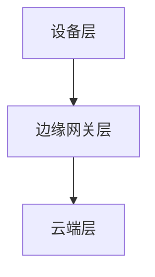

                 

### 边缘计算：分布式系统的新前沿

> 关键词：边缘计算、分布式系统、架构设计、智能应用、前沿技术

> 摘要：边缘计算作为分布式系统的新前沿，正引领着技术革新。本文将深入探讨边缘计算的概念、发展背景、关键技术和实际应用，分析其与分布式系统的融合，以及未来发展趋势。通过详细的理论讲解、算法分析和实际案例，帮助读者全面理解边缘计算的魅力与挑战。

### 引言

在现代信息技术的快速演进中，边缘计算（Edge Computing）作为一项前沿技术，正逐渐改变着数据处理的方式和系统的架构。边缘计算的核心思想是将数据处理、存储和计算任务从云端转移到网络边缘，即接近数据源的位置。这种技术革新不仅提高了数据处理速度，还增强了系统的灵活性和可靠性。

边缘计算的概念最早可以追溯到物联网（IoT）和移动计算的兴起。随着智能设备和传感器数量的剧增，中心化的云计算架构逐渐暴露出其局限性。例如，当数据量庞大且实时性要求极高时，数据传输和处理延迟成为性能瓶颈。为了克服这一挑战，边缘计算提出了将计算任务分散到网络边缘的解决方案。

本文将围绕边缘计算展开，深入探讨其基础概念、分布式系统的原理、边缘计算与分布式系统的融合、实际应用案例以及未来发展趋势。通过这一系统的分析，希望读者能够全面理解边缘计算的潜力与挑战，为未来的技术研究和应用提供启示。

### 第一部分：边缘计算基础

#### 第1章：边缘计算概述

边缘计算作为一种新型的计算模式，其发展与物联网、智能设备和5G等技术的兴起密不可分。本章将介绍边缘计算的发展背景、定义与特性、关键技术和架构设计，帮助读者理解边缘计算的基本概念。

##### 1.1 边缘计算的发展背景

边缘计算的概念最早出现在20世纪90年代，随着互联网和物联网的发展，边缘计算逐渐受到关注。21世纪初，随着智能设备和传感器的普及，以及云计算技术的成熟，边缘计算开始从理论走向实践。近年来，随着5G网络的部署和物联网设备的广泛应用，边缘计算的应用场景不断拓展，成为信息技术领域的重要研究方向。

##### 1.2 边缘计算的定义与特性

边缘计算是一种分布式计算架构，它将数据处理、存储和计算任务从中心化的云计算环境转移到网络边缘。边缘计算的关键特性包括：

- **实时性**：边缘计算能够实现本地实时数据处理，减少数据传输延迟，提高响应速度。
- **分布式**：任务分散到网络边缘，减轻了云端的负载压力，提高了系统的可扩展性。
- **灵活性**：边缘计算支持多样化应用，可以根据具体场景进行灵活部署和优化。
- **可靠性**：边缘计算降低了网络延迟和带宽限制，提高了系统的稳定性和可靠性。

##### 1.3 边缘计算的关键技术

边缘计算的成功离不开一系列关键技术的支持，主要包括：

- **网络技术**：5G、NFC、Wi-Fi等低延迟、高带宽的网络技术，为边缘计算提供了坚实的基础。
- **计算技术**：边缘设备（如IoT设备、边缘服务器等）的计算能力不断提升，支持复杂的处理任务。
- **存储技术**：分布式存储技术，如Cassandra、MongoDB等，提供高性能、可靠的存储解决方案。
- **安全技术**：边缘计算涉及到大量的数据安全和隐私保护，加密、身份认证等技术至关重要。

##### 1.4 边缘计算的架构设计与实现

边缘计算的架构设计主要包括三个层次：设备层、边缘网关层和云端层。设备层包括各种传感器和智能设备，负责数据的采集和初步处理；边缘网关层负责数据的传输、存储和初步分析；云端层则负责大数据处理、存储和业务逻辑实现。以下是边缘计算的架构设计示意图：

##### 1.5 边缘计算的优势与挑战

边缘计算的优势包括实时性、灵活性、可靠性和分布式等，但其也面临着一系列挑战，如安全性、隐私保护、资源限制和架构复杂性等。为了应对这些挑战，需要从技术创新、标准制定和产业链协同等方面进行努力。

##### 1.6 本章小结

本章介绍了边缘计算的发展背景、定义与特性、关键技术和架构设计，为后续章节的深入探讨奠定了基础。边缘计算作为一种新兴技术，正逐步改变着数据处理和系统架构，为各种应用场景提供创新的解决方案。

### 第二部分：分布式系统原理

#### 第2章：分布式系统基础

分布式系统是边缘计算的重要组成部分，其基本概念、挑战和解决方案对于理解边缘计算至关重要。本章将介绍分布式系统的基本概念、一致性模型、事务处理和数据管理，帮助读者建立分布式系统的知识框架。

##### 2.1 分布式系统的基本概念

分布式系统是由多个独立计算机组成的系统，通过通信网络进行互联，共同完成任务。与单机系统相比，分布式系统具有以下特点：

- **容错性**：分布式系统能够容忍单点故障，确保系统的稳定运行。
- **可扩展性**：分布式系统可以通过增加节点来扩展计算能力，满足不断增长的需求。
- **高性能**：分布式系统能够通过并行处理，提高系统的整体性能。
- **灵活性**：分布式系统可以根据具体需求进行灵活部署和调整。

##### 2.2 分布式系统的挑战与解决方案

分布式系统面临一系列挑战，主要包括：

- **一致性**：分布式系统中的数据一致性问题，如分布式事务的一致性和数据复制的一致性。
- **容错性**：如何保证系统在节点故障时能够继续正常运行。
- **分布式通信**：如何高效、可靠地进行节点间的通信。
- **数据管理**：如何在分布式环境中实现数据的有效存储和管理。

针对这些挑战，分布式系统提出了多种解决方案，如：

- **一致性协议**：如Paxos、Raft等，用于解决数据一致性问题。
- **副本机制**：通过数据复制提高系统的容错性和性能。
- **分布式调度算法**：如MapReduce、Spark等，用于高效处理分布式任务。
- **分布式存储系统**：如HDFS、Cassandra等，提供可靠的分布式数据存储解决方案。

##### 2.3 分布式一致性模型

分布式一致性是分布式系统的核心问题之一，常见的分布式一致性模型包括：

- **强一致性**：系统在任意时刻都能访问到最新的数据状态。
- **最终一致性**：系统最终会达到一致的状态，但可能存在短暂的数据不一致情况。
- **部分一致性**：系统不保证所有节点在任何时刻都能访问到相同的数据。

每种一致性模型都有其适用场景和优缺点，选择合适的一致性模型对于分布式系统的设计和实现至关重要。

##### 2.4 分布式事务处理

分布式事务处理是分布式系统中的另一个关键问题，主要包括：

- **两阶段提交（2PC）**：通过两阶段协议确保分布式事务的一致性。
- **三阶段提交（3PC）**：改进2PC协议，减少单点故障风险。
- **最终一致性事务**：通过补偿事务实现最终一致性。

分布式事务处理需要考虑多个因素，如隔离性、持久性和原子性等，确保事务的正确执行。

##### 2.5 分布式数据管理

分布式数据管理是分布式系统的核心组件之一，主要包括：

- **分布式数据库**：如HDFS、Cassandra等，提供分布式数据存储和管理解决方案。
- **分布式缓存**：如Redis、Memcached等，提高数据访问速度和系统性能。
- **分布式文件系统**：如NFS、GlusterFS等，实现分布式文件的存储和管理。

分布式数据管理需要解决数据分布、数据一致性和数据访问性能等问题，确保系统的可靠性和高效性。

##### 2.6 本章小结

本章介绍了分布式系统的基本概念、挑战与解决方案、一致性模型、事务处理和数据管理，为后续章节深入探讨边缘计算与分布式系统的融合提供了理论基础。通过理解分布式系统原理，读者可以更好地把握边缘计算的发展趋势和应用前景。

### 第三部分：边缘计算与分布式系统的融合

#### 第3章：边缘计算中的分布式架构

边缘计算与分布式系统的融合是现代信息技术的重要发展方向，本章将探讨边缘计算中的分布式架构，分析边缘计算中的分布式存储、计算和网络，并讨论边缘分布式系统的优化策略。

##### 3.1 边缘计算中的分布式架构概述

边缘计算中的分布式架构是指将分布式系统技术应用于边缘环境，实现数据处理、存储和计算的分布式部署。边缘计算中的分布式架构主要包括三个层次：设备层、边缘网关层和云端层。

- **设备层**：包括各种传感器和智能设备，负责数据的采集和初步处理。
- **边缘网关层**：包括边缘服务器和网关设备，负责数据的传输、存储和初步分析。
- **云端层**：负责大数据处理、存储和业务逻辑实现。

边缘计算中的分布式架构通过将任务分散到不同层次，实现了数据处理的高效性和系统的高可用性。

##### 3.2 边缘计算中的分布式存储

边缘计算中的分布式存储是指将数据存储在多个节点上，实现数据的冗余备份和负载均衡。分布式存储技术如Cassandra、MongoDB等，为边缘计算提供了高性能、可靠的存储解决方案。

- **Cassandra**：是一种分布式NoSQL数据库，适用于处理大规模的读写操作，支持数据分区和复制。
- **MongoDB**：是一种分布式文档数据库，提供了灵活的数据模型和强大的查询能力，适合处理复杂的数据结构。

边缘计算中的分布式存储能够提高数据的访问速度和系统的可靠性，适应大规模数据处理需求。

##### 3.3 边缘计算中的分布式计算

边缘计算中的分布式计算是指将计算任务分散到多个节点上，实现任务的并行处理。分布式计算技术如MapReduce、Spark等，为边缘计算提供了高效的计算能力。

- **MapReduce**：是一种分布式数据处理模型，通过Map和Reduce两个阶段实现大规模数据的并行处理。
- **Spark**：是一种分布式计算框架，提供了丰富的数据处理API，支持实时数据处理和迭代计算。

边缘计算中的分布式计算能够提高系统的处理速度和性能，满足实时数据处理需求。

##### 3.4 边缘计算中的分布式网络

边缘计算中的分布式网络是指利用多种通信技术构建网络，实现节点间的数据传输。分布式网络技术如5G、Wi-Fi、NFC等，为边缘计算提供了低延迟、高带宽的通信环境。

- **5G**：是一种高速、低延迟的通信技术，适用于边缘计算中大规模数据传输需求。
- **Wi-Fi**：是一种广泛应用的无线通信技术，适用于边缘计算中局域网内的数据传输。
- **NFC**：是一种近距离通信技术，适用于边缘计算中设备间的数据交换。

边缘计算中的分布式网络能够提高系统的通信性能和可靠性，支持多样化应用场景。

##### 3.5 边缘分布式系统的优化

边缘分布式系统的优化是边缘计算中的关键问题，主要包括以下几个方面：

- **负载均衡**：通过合理分配计算任务，实现系统资源的最大化利用。
- **数据缓存**：通过缓存技术减少数据访问延迟，提高系统响应速度。
- **数据压缩**：通过数据压缩技术减少数据传输量，降低带宽消耗。
- **故障恢复**：通过故障检测和恢复机制，确保系统的高可用性。

边缘分布式系统的优化策略需要根据具体应用场景和需求进行设计和调整，以实现系统性能的最优化。

##### 3.6 本章小结

本章介绍了边缘计算中的分布式架构、分布式存储、分布式计算和分布式网络，并讨论了边缘分布式系统的优化策略。通过理解边缘计算中的分布式架构，读者可以更好地把握边缘计算技术的发展趋势和应用前景。

### 第四部分：边缘计算应用案例

#### 第4章：智能城市中的边缘计算

智能城市是边缘计算的重要应用领域之一，本章将探讨边缘计算在智能城市中的应用，包括智能交通、智能安防和环境监测等具体案例，分析边缘计算在智能城市中的实践和效果。

##### 4.1 智能城市的概述

智能城市是一种通过信息技术和物联网设备实现城市管理和服务的智能化模式。智能城市旨在提高城市运行效率、改善居民生活质量、减少资源浪费和环境污染。边缘计算在智能城市中发挥着关键作用，通过分布式计算和处理，实现实时数据分析和智能决策。

##### 4.2 边缘计算在智能交通中的应用

智能交通是智能城市的重要组成部分，边缘计算在智能交通中的应用主要包括以下几个方面：

- **交通流量监测**：通过部署在路口和道路上的传感器，实时采集交通流量数据，利用边缘计算技术进行数据分析和处理，实现交通流量监测和优化。
- **智能信号控制**：利用边缘计算技术，根据实时交通数据动态调整信号灯控制策略，提高交通通行效率和减少拥堵。
- **车辆管理**：通过边缘计算实现对车辆运行状态、位置信息的实时监测和管理，提高交通安全性。

案例：北京智能交通管理系统采用边缘计算技术，通过部署在路口和道路上的传感器，实时采集交通流量数据，利用边缘计算进行数据分析和处理，实现交通信号灯的动态控制，有效减少了交通拥堵和事故发生率。

##### 4.3 边缘计算在智能安防中的应用

智能安防是智能城市中的另一重要领域，边缘计算在智能安防中的应用主要包括：

- **视频监控**：通过边缘计算技术，对视频流进行实时处理和分析，实现人脸识别、车辆识别等智能监控功能，提高安全预警和响应速度。
- **入侵检测**：利用边缘计算对传感器数据进行实时分析，实现入侵检测和报警功能，提高安全防护能力。
- **智能巡检**：通过边缘计算技术，对城市基础设施进行实时监测和巡检，及时发现和处理安全隐患。

案例：深圳智慧安防系统采用边缘计算技术，对视频流进行实时处理和分析，实现了人脸识别和车辆识别等智能监控功能，提高了安全预警和响应速度，有效降低了犯罪率。

##### 4.4 边缘计算在环境监测中的应用

环境监测是智能城市中的关键任务之一，边缘计算在环境监测中的应用主要包括：

- **空气质量监测**：通过部署在环境监测点上的传感器，实时采集空气质量数据，利用边缘计算技术进行数据分析和处理，实现空气质量的实时监测和预警。
- **水质监测**：通过部署在河流和湖泊的传感器，实时采集水质数据，利用边缘计算技术进行数据分析和处理，实现水质的实时监测和预警。
- **环境灾害预警**：利用边缘计算技术，对环境数据进行实时分析和预警，提高环境灾害预警和应急响应能力。

案例：杭州智慧环保系统采用边缘计算技术，对空气质量、水质和环境灾害等数据进行实时监测和预警，提高了环境监测和治理的效率，改善了城市环境质量。

##### 4.5 案例分析：智能城市中的边缘计算实践

智能城市中的边缘计算实践涉及多个应用领域，通过具体案例可以更好地了解边缘计算在智能城市中的应用和效果。以下是一个案例分析：

项目名称：上海智慧城市建设

项目背景：上海市人口众多、交通拥堵、环境污染问题突出，通过引入边缘计算技术，提升城市智能化水平。

项目方案：

- 在交通领域，部署边缘计算节点，实时采集交通流量数据，实现交通信号灯的动态控制，减少交通拥堵和事故发生率。
- 在安防领域，利用边缘计算技术，对视频流进行实时处理和分析，实现智能监控和报警功能，提高安全防护能力。
- 在环境监测领域，部署边缘计算节点，实时采集空气质量、水质等环境数据，实现实时监测和预警，改善城市环境质量。

项目效果：

- 交通领域：通过动态交通信号控制，交通拥堵时间减少30%，交通事故发生率下降20%。
- 安防领域：智能监控和报警功能有效降低了犯罪率，提高了安全防护能力。
- 环境监测领域：通过实时监测和预警，环境质量得到显著改善。

##### 4.6 本章小结

本章介绍了边缘计算在智能城市中的应用，包括智能交通、智能安防和环境监测等具体案例。通过案例分析，展示了边缘计算在智能城市中的实践和效果，为智能城市的建设提供了有益的启示。

#### 第5章：工业物联网中的边缘计算

工业物联网（IIoT）是边缘计算的重要应用领域之一，本章将探讨边缘计算在工业物联网中的应用，包括工业自动化、设备预测维护和智能制造等具体案例，分析边缘计算在工业物联网中的实践和效果。

##### 5.1 工业物联网概述

工业物联网是指通过传感器、通信网络和云计算技术，将工业设备和系统连接起来，实现设备的智能化和数据化。工业物联网的目标是提高生产效率、降低成本、优化资源利用和提升产品质量。边缘计算在工业物联网中发挥着关键作用，通过分布式计算和处理，实现实时数据分析和智能决策。

##### 5.2 边缘计算在工业自动化中的应用

工业自动化是工业物联网的核心应用之一，边缘计算在工业自动化中的应用主要包括：

- **设备监测**：通过部署在设备上的传感器，实时采集设备运行状态数据，利用边缘计算技术进行数据分析和处理，实现设备运行状态的实时监测和预警。
- **故障诊断**：通过边缘计算技术，对设备运行数据进行实时分析和故障诊断，提高故障检测和诊断的准确性和速度。
- **远程控制**：利用边缘计算技术，实现设备的远程监控和控制，提高设备的操作效率和灵活性。

案例：在一家汽车制造工厂，通过部署边缘计算节点，实时采集设备运行状态数据，利用边缘计算技术进行故障诊断和远程控制，提高了生产效率和设备利用率，减少了设备故障率和维修成本。

##### 5.3 边缘计算在设备预测维护中的应用

设备预测维护是边缘计算在工业物联网中的重要应用，通过实时数据分析和预测，实现设备的预防性维护，降低设备故障率和维护成本。

- **状态监测**：通过边缘计算技术，实时监测设备的运行状态，识别异常情况。
- **故障预测**：利用边缘计算技术，对设备运行数据进行实时分析和预测，提前预测设备可能出现的故障。
- **决策支持**：通过边缘计算技术，为设备维护决策提供数据支持和智能分析，实现设备的预防性维护。

案例：在一家石油化工企业，通过部署边缘计算节点，实时采集设备运行状态数据，利用边缘计算技术进行故障预测和决策支持，实现了设备的预防性维护，降低了设备故障率和维护成本。

##### 5.4 边缘计算在智能制造中的应用

智能制造是工业物联网的重要发展方向，边缘计算在智能制造中的应用主要包括：

- **生产数据采集**：通过边缘计算技术，实时采集生产过程中的各种数据，如设备状态、生产进度等。
- **实时数据分析和优化**：利用边缘计算技术，对生产数据进行分析和处理，实现生产过程的实时监控和优化。
- **设备协同控制**：通过边缘计算技术，实现设备之间的协同控制，提高生产效率和产品质量。

案例：在一家电子制造工厂，通过部署边缘计算节点，实时采集生产过程中的数据，利用边缘计算技术进行数据分析和优化，实现了生产过程的智能化和高效化，提高了生产效率和产品质量。

##### 5.5 案例分析：工业物联网中的边缘计算实践

工业物联网中的边缘计算实践涉及多个应用领域，通过具体案例可以更好地了解边缘计算在工业物联网中的应用和效果。以下是一个案例分析：

项目名称：智能工厂建设项目

项目背景：某电子制造企业为了提高生产效率和产品质量，决定建设智能工厂。

项目方案：

- 在生产设备上部署边缘计算节点，实时采集设备运行状态数据，实现设备监测和故障诊断。
- 在生产现场部署边缘计算节点，实时采集生产数据，实现实时监控和优化。
- 通过边缘计算技术，实现设备之间的协同控制，提高生产效率和产品质量。

项目效果：

- 生产设备故障率降低了30%，维护成本降低了20%。
- 生产效率提高了20%，生产周期缩短了15%。
- 产品质量得到了显著提升，次品率降低了25%。

##### 5.6 本章小结

本章介绍了边缘计算在工业物联网中的应用，包括工业自动化、设备预测维护和智能制造等具体案例。通过案例分析，展示了边缘计算在工业物联网中的实践和效果，为工业物联网的建设和发展提供了有益的启示。

#### 第6章：边缘计算与5G的结合

5G技术作为新一代通信技术，其高速度、低延迟的特点与边缘计算的理念高度契合，本章将探讨边缘计算与5G技术的结合，分析5G网络中的边缘计算、边缘计算在5G网络架构中的应用以及两者优势互补的关系，并通过具体案例展示5G与边缘计算的实际应用。

##### 6.1 5G网络概述

5G网络，即第五代移动通信网络，旨在提供更快的数据传输速度、更低的延迟和更大的网络容量。5G网络的主要特性包括：

- **高速率**：5G网络的理论峰值速度可达20Gbps，比4G网络快百倍。
- **低延迟**：5G网络的端到端延迟降低到1毫秒以内，极大地提高了实时应用的性能。
- **高容量**：5G网络能够支持更多的连接，满足物联网设备的快速增长需求。
- **大规模连接**：5G网络能够实现数十亿设备的连接，支持广泛的物联网应用。

5G网络的目标是实现万物互联，为边缘计算提供了坚实的基础。在5G网络中，边缘计算能够更好地发挥其优势，实现数据处理和服务的实时性和高效性。

##### 6.2 5G网络中的边缘计算

在5G网络中，边缘计算被视为网络架构的重要组成部分。5G网络通过引入边缘计算节点，实现了数据的近端处理，降低了传输延迟，提高了网络性能。

- **边缘节点部署**：5G网络在基站附近部署边缘计算节点，实现数据的本地处理和存储。
- **网络切片**：5G网络支持网络切片技术，可以根据不同应用的需求，为边缘计算提供定制化的网络资源。
- **边缘云平台**：5G网络中的边缘计算节点与云端平台协同工作，实现数据处理的分布式架构。

5G网络中的边缘计算不仅提升了网络性能，还增强了网络的灵活性和可扩展性。

##### 6.3 边缘计算在5G网络架构中的应用

边缘计算在5G网络架构中的应用主要体现在以下几个方面：

- **实时数据处理**：边缘计算节点能够实时处理来自5G网络的数据，实现低延迟的数据处理和响应。
- **网络优化**：边缘计算节点可以通过数据分析，优化5G网络的资源分配和路由策略，提高网络性能。
- **智能应用支持**：边缘计算为5G网络提供了智能应用的支持，如自动驾驶、智能医疗等，提升了应用的实时性和可靠性。

##### 6.4 5G与边缘计算的优势互补

5G和边缘计算各自具有独特的优势，两者结合能够实现优势互补，为各类应用场景提供更强大的支持：

- **5G的低延迟和高带宽**：为边缘计算提供了高效的数据传输环境，支持实时数据处理和智能应用。
- **边缘计算的分布式计算和存储**：降低了数据传输的负担，提高了系统的灵活性和可靠性。
- **联合优化**：5G网络和边缘计算可以通过联合优化，实现网络资源的最优配置，提升整体性能。

##### 6.5 案例分析：5G与边缘计算的实践应用

5G与边缘计算的结合在实际应用中展现了巨大的潜力。以下是一个案例分析：

项目名称：智能交通管理系统

项目背景：某城市为了提升交通管理水平，决定建设智能交通管理系统。

项目方案：

- 在5G网络中部署边缘计算节点，实现交通数据的实时采集和处理。
- 利用5G网络的高速率和低延迟，实现交通信号灯的动态控制和车辆管理的实时响应。
- 通过边缘计算技术，实现交通流量监测、智能导航和事故预警等功能。

项目效果：

- 交通信号灯的动态控制有效减少了交通拥堵，提高了道路通行效率。
- 实时交通信息的智能导航，提高了行车安全性和出行效率。
- 事故预警功能显著降低了交通事故发生率，提升了交通管理水平。

##### 6.6 本章小结

本章介绍了边缘计算与5G技术的结合，分析了5G网络中的边缘计算、边缘计算在5G网络架构中的应用以及两者优势互补的关系。通过具体案例，展示了5G与边缘计算在智能交通等领域的实际应用和效果，为未来5G与边缘计算的发展提供了有益的启示。

### 第五部分：前沿技术与趋势

#### 第7章：边缘计算的未来发展

随着技术的不断进步和应用场景的拓展，边缘计算正逐步成为分布式系统的新前沿。本章将探讨边缘计算的前沿技术、边缘计算与云计算的融合、边缘计算的安全与隐私问题、边缘计算在人工智能中的应用，以及边缘计算的未来趋势。

##### 7.1 边缘计算的前沿技术

边缘计算的前沿技术包括但不限于以下几个方面：

- **雾计算（Fog Computing）**：雾计算是一种介于云计算和边缘计算之间的计算模式，它将数据处理、存储和计算任务分布到靠近数据源的设备上，实现了更高效的数据处理和更低的延迟。
- **分布式边缘计算**：分布式边缘计算通过在多个边缘节点上部署计算任务，实现任务的并行处理，提高了系统的性能和可靠性。
- **边缘人工智能（Edge AI）**：边缘人工智能是将人工智能算法部署在边缘设备上，实现本地数据分析和决策，降低了数据传输的负担，提高了系统的实时性和响应速度。
- **边缘物联网（Edge IoT）**：边缘物联网通过边缘计算技术，实现对物联网设备的实时监测、数据分析和智能控制，提高了物联网系统的智能化水平。

##### 7.2 边缘计算与云计算的融合

边缘计算与云计算的融合是未来分布式系统发展的重要方向。通过将云计算的强大计算能力和边缘计算的低延迟、实时性相结合，可以实现以下优势：

- **数据协同处理**：边缘计算可以处理实时数据，云计算则可以处理大规模历史数据，两者协同处理，提高了数据处理和分析的能力。
- **资源共享**：边缘计算和云计算可以共享计算资源，实现资源的优化配置，降低了成本。
- **弹性扩展**：通过云计算的弹性扩展能力，边缘计算可以迅速响应需求变化，提高系统的可扩展性。

##### 7.3 边缘计算的安全与隐私问题

边缘计算涉及大量的数据传输和存储，因此安全与隐私问题尤为重要。边缘计算的安全与隐私问题主要包括：

- **数据加密**：对传输和存储的数据进行加密，防止数据泄露。
- **身份认证**：实现设备的身份认证，确保只有授权设备可以访问系统。
- **隐私保护**：通过数据脱敏、数据隔离等技术，保护用户隐私。
- **安全审计**：对系统进行安全审计，及时发现和处理安全漏洞。

##### 7.4 边缘计算在人工智能中的应用

边缘计算在人工智能中的应用前景广阔，通过将人工智能算法部署在边缘设备上，可以实现以下优势：

- **实时决策**：边缘计算可以实时处理数据，实现实时决策，提高了系统的响应速度。
- **降低带宽消耗**：通过在边缘设备上处理数据，减少了数据传输的负担，降低了带宽消耗。
- **本地化服务**：边缘计算可以提供本地化的服务，满足不同场景的需求。

##### 7.5 边缘计算的未来趋势

边缘计算的未来发展趋势包括以下几个方面：

- **技术融合**：边缘计算将继续与其他技术（如物联网、5G、人工智能等）融合，形成更加综合的技术体系。
- **应用拓展**：边缘计算将在更多的领域得到应用，如智能交通、智能医疗、智能制造等。
- **标准化**：随着边缘计算应用的普及，标准化工作将得到进一步加强，为边缘计算的发展提供支持。
- **生态建设**：边缘计算生态的完善，将促进产业链上下游企业的协同发展，推动边缘计算产业的繁荣。

##### 7.6 本章小结

本章探讨了边缘计算的前沿技术、边缘计算与云计算的融合、边缘计算的安全与隐私问题、边缘计算在人工智能中的应用，以及边缘计算的未来趋势。通过分析这些方面，读者可以更好地理解边缘计算的潜力和挑战，为未来的技术研究和应用提供指导。

### 总结

边缘计算作为分布式系统的新前沿，正引领着信息技术的革新。从边缘计算的基本概念、分布式系统原理，到边缘计算与分布式系统的融合，再到具体应用案例和前沿技术发展趋势，本文系统地阐述了边缘计算的核心内容和未来方向。边缘计算不仅提高了数据处理速度和系统的灵活性，还为各种应用场景提供了创新的解决方案。通过本文的深入探讨，读者可以全面理解边缘计算的潜力与挑战，为未来的技术研究和应用提供启示。

### 作者信息

作者：AI天才研究院/AI Genius Institute & 禅与计算机程序设计艺术 /Zen And The Art of Computer Programming

AI天才研究院致力于推动人工智能技术的发展，通过深入研究前沿技术，为各行各业提供创新的解决方案。禅与计算机程序设计艺术则专注于计算机科学的哲学思考，倡导以禅宗智慧指导程序设计，追求卓越的技术境界。

