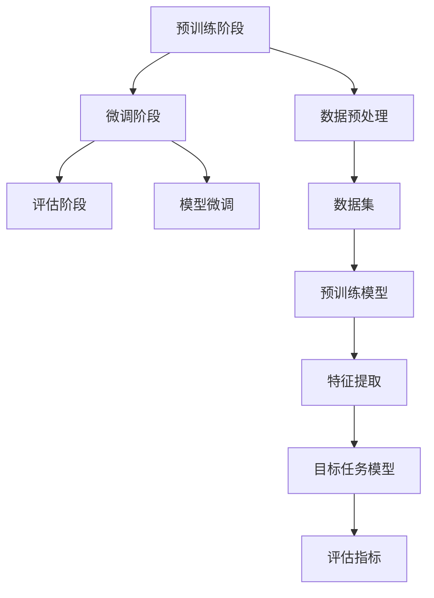
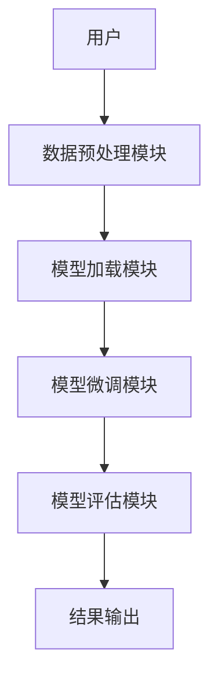
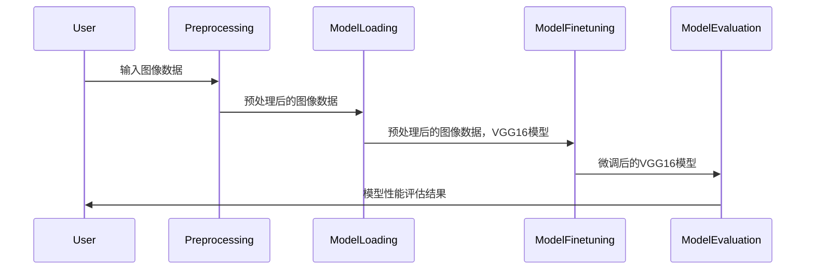

                 


###  文章标题：迁移学习：利用预训练模型提升AI效率

关键词：迁移学习、预训练模型、AI效率、模型设计、数学模型、系统架构、实战案例

摘要：本文将深入探讨迁移学习这一AI领域的关键技术，特别是如何通过预训练模型来提升AI模型的效率。我们将详细解析迁移学习的核心概念、算法原理、数学模型，并通过实际项目案例展示如何运用这些理论提升AI模型的性能。

----------------------------------------------------------------

### 引言

迁移学习（Transfer Learning）是深度学习领域的一项重要技术，其核心思想是将在一个任务上训练好的模型或部分模型参数，转移到另一个相关但不同的任务上，从而提升模型在新任务上的性能。在资源有限的情况下，迁移学习能够显著提高AI模型的效率和准确性。

本文将围绕迁移学习这一主题，系统地介绍其概念、原理、算法设计、数学模型，并结合具体案例，展示如何利用预训练模型来提升AI的效率。本文将分为以下几个部分：

1. **核心概念和背景**：介绍迁移学习的核心概念、问题背景、解决思路以及应用领域。
2. **预训练模型**：解释预训练模型的概念、类型及其在迁移学习中的应用。
3. **算法和模型设计**：深入探讨迁移学习的算法原理，并通过Mermaid图和Python代码进行说明。
4. **数学模型和公式**：介绍迁移学习中的数学模型和公式，并使用LaTeX进行格式化。
5. **系统分析和架构设计**：描述问题场景，绘制系统架构图和交互图。
6. **项目实施和案例分析**：介绍一个具体项目，展示如何将迁移学习应用于实际场景。
7. **最佳实践和总结**：总结迁移学习的最佳实践，并给出未来研究的方向。

#### 核心概念和背景

#### 迁移学习的核心概念

迁移学习的关键在于“迁移”二字，即知识或模型参数从一个任务（源任务）转移到另一个任务（目标任务）。在深度学习中，通常涉及以下基本概念：

- **源任务（Source Task）**：在迁移学习中，用于训练模型的任务，其目的是学习到通用的特征表示。
- **目标任务（Target Task）**：模型需要在新任务上表现良好的目标任务，通常是用户感兴趣的具体任务。
- **特征表示（Feature Representation）**：模型从数据中学习到的特征表示，通常是一个低维的向量表示。

通过在源任务上训练模型，模型会学习到一系列通用的特征表示，这些特征表示对目标任务也有帮助。因此，迁移学习的关键是设计合适的模型架构和训练策略，以便有效地从源任务迁移到目标任务。

#### 迁移学习的问题背景

在传统的机器学习训练过程中，每个任务都需要从零开始训练模型，这不仅耗时耗资源，而且模型的性能往往受限于数据集的大小和质量。而迁移学习通过利用预训练模型，解决了这些问题：

- **数据不足的问题**：很多任务的数据量有限，直接训练可能导致过拟合。迁移学习通过在数据丰富的源任务上预训练模型，然后迁移到数据稀缺的目标任务，可以显著提高模型的泛化能力。
- **计算资源受限**：深度学习模型通常需要大量的计算资源进行训练。迁移学习通过复用预训练模型，减少了目标任务的训练时间，降低了计算成本。
- **模型性能提升**：预训练模型已经学习到了通用的特征表示，迁移到目标任务后，可以更快速地达到良好的性能。

#### 迁移学习的解决思路

迁移学习的解决思路主要包括以下几个方面：

1. **预训练模型的选择**：选择一个在源任务上性能良好的预训练模型作为起点，这个模型应该具有较好的特征提取能力。
2. **模型微调（Fine-tuning）**：将预训练模型迁移到目标任务，通常需要对模型的部分层进行微调，使其适应新的任务。
3. **数据预处理**：在迁移学习过程中，对目标任务的数据进行适当的预处理，以提高模型的适应性。

#### 迁移学习的边界与外延

迁移学习的边界在于模型的通用性，即预训练模型需要学习到足够通用的特征表示，以便在多种任务上表现良好。然而，不同任务的差异可能导致模型的迁移效果不佳，因此需要针对具体任务进行调整。

此外，迁移学习也涉及到其他相关技术，如多任务学习、元学习等，这些技术可以与迁移学习结合，进一步提高模型的泛化能力和效率。

#### 概念结构与核心要素组成

为了更好地理解迁移学习，我们绘制了以下Mermaid ER实体关系图：

```mermaid
erDiagram
  SourceTask ||--|{ Model }|--| TargetTask
  Model ||--|{ FeatureRepresentation }
```

在这个图中，`SourceTask`和`TargetTask`表示源任务和目标任务，`Model`表示预训练模型，`FeatureRepresentation`表示模型学习到的特征表示。

#### 核心概念与联系

接下来，我们详细探讨迁移学习的核心概念，包括预训练模型、模型微调、特征表示等。

1. **预训练模型**

预训练模型是在大规模数据集上预先训练好的模型，其目的是学习到通用的特征表示。常见的预训练模型包括：

- **图像分类模型**：如VGG、ResNet等，这些模型在ImageNet等大型图像数据集上训练。
- **自然语言处理模型**：如BERT、GPT等，这些模型在大量的文本数据上训练。

预训练模型的优点包括：

- **减少过拟合**：预训练模型已经在大规模数据上训练，可以减少在目标任务上的过拟合风险。
- **快速适应新任务**：预训练模型已经学习到了通用的特征表示，可以快速适应新的任务。

2. **模型微调**

模型微调是在迁移学习过程中对预训练模型进行调整，使其更好地适应目标任务。通常，微调只针对模型的最后一层或部分层进行训练，因为这一部分直接涉及到目标任务的输出。

微调的步骤包括：

- **参数初始化**：将预训练模型的权重作为起点，初始化目标任务的模型。
- **数据预处理**：对目标任务的数据进行预处理，包括归一化、数据增强等。
- **训练过程**：在目标任务的数据集上训练模型，通常使用较小的学习率和较少的训练迭代次数。

3. **特征表示**

特征表示是模型从数据中学习到的低维向量表示，这些表示可以捕捉数据的本质特征。在迁移学习中，特征表示的通用性是关键，因为它们需要在不同的任务上表现良好。

特征表示的优点包括：

- **降低数据维度**：特征表示将高维数据映射到低维空间，降低计算复杂度。
- **提高泛化能力**：通用的特征表示可以在不同任务上表现良好，提高模型的泛化能力。

#### 算法和模型设计

迁移学习涉及多种算法和模型设计，下面我们重点介绍迁移学习算法的基本原理和实现方法。

1. **迁移学习算法的基本原理**

迁移学习算法的核心思想是将预训练模型的知识迁移到新的任务中。具体步骤如下：

- **预训练阶段**：在源任务上预训练模型，学习到通用的特征表示。
- **微调阶段**：在目标任务上对预训练模型进行微调，调整模型的参数，使其适应新的任务。
- **评估阶段**：在目标任务上评估模型的性能，根据评估结果调整模型参数。

2. **迁移学习算法的实现方法**

迁移学习算法的实现方法通常包括以下几种：

- **迁移特征提取**：将预训练模型的部分层或全部层应用于目标任务，提取特征表示，然后使用这些特征表示训练新的分类器。
- **模型微调**：在目标任务上训练整个模型，包括预训练模型的全部层，通过微调调整模型参数，使其适应新的任务。
- **知识蒸馏**：将预训练模型视为教师模型，训练一个新的学生模型，通过最小化教师模型和学生模型之间的输出差异，实现知识的迁移。

下面我们使用Mermaid图来展示迁移学习算法的流程：



在这个流程图中，`A`表示预训练阶段，`B`表示微调阶段，`C`表示评估阶段，`D`表示数据预处理，`E`表示模型微调，`F`表示数据集，`G`表示预训练模型，`H`表示特征提取，`I`表示目标任务模型，`J`表示评估指标。

3. **Python代码实现**

为了更好地理解迁移学习算法的实现，我们提供了一个简单的Python代码示例：

```python
import tensorflow as tf
from tensorflow.keras.applications import VGG16
from tensorflow.keras.layers import Flatten, Dense
from tensorflow.keras.models import Model

# 加载预训练的VGG16模型，不包括池化层和全连接层
base_model = VGG16(weights='imagenet', include_top=False, input_shape=(224, 224, 3))

# 添加新的全连接层和分类器
x = Flatten()(base_model.output)
x = Dense(1024, activation='relu')(x)
predictions = Dense(num_classes, activation='softmax')(x)

# 创建新的模型
model = Model(inputs=base_model.input, outputs=predictions)

# 编译模型
model.compile(optimizer='adam', loss='categorical_crossentropy', metrics=['accuracy'])

# 加载目标任务数据集
train_data = ...
test_data = ...

# 训练模型
model.fit(train_data, epochs=10, batch_size=32, validation_data=test_data)

# 评估模型
loss, accuracy = model.evaluate(test_data)
print(f"Test accuracy: {accuracy}")
```

在这个代码中，我们首先加载了预训练的VGG16模型，然后添加了新的全连接层和分类器，构建了一个新的模型。接下来，我们编译模型并使用目标任务数据集进行训练。最后，我们评估模型在测试数据集上的性能。

#### 数学模型和公式

迁移学习算法的原理和实现依赖于一系列数学模型和公式。下面，我们介绍迁移学习中的核心数学模型和公式，并使用LaTeX进行格式化。

1. **损失函数**

在迁移学习中，常用的损失函数包括交叉熵损失函数和均方误差损失函数。交叉熵损失函数在分类任务中应用广泛，其公式如下：

$$
\begin{aligned}
L_{cross\_entropy} &= -\sum_{i=1}^{n} y_{i} \log(p_{i}) \\
&= -\sum_{i=1}^{n} y_{i} \log(\sigma(Wx + b))
\end{aligned}
$$

其中，$y_{i}$表示第$i$个样本的真实标签，$p_{i}$表示模型对第$i$个样本预测的概率分布，$\sigma$表示sigmoid函数。

2. **梯度下降**

在迁移学习中，通常使用梯度下降算法来优化模型参数。梯度下降的基本思想是沿着损失函数的梯度方向更新模型参数，以最小化损失函数。梯度下降的公式如下：

$$
\begin{aligned}
\theta &= \theta - \alpha \cdot \nabla_{\theta} L \\
\end{aligned}
$$

其中，$\theta$表示模型参数，$\alpha$表示学习率，$\nabla_{\theta} L$表示损失函数关于模型参数的梯度。

3. **正则化**

在迁移学习中，为了防止模型过拟合，通常会使用正则化技术。L2正则化是一种常用的正则化方法，其公式如下：

$$
\begin{aligned}
L_{regularization} &= \lambda \cdot \sum_{\theta \in \Theta} \theta^2 \\
\end{aligned}
$$

其中，$\lambda$表示正则化参数，$\Theta$表示模型参数的集合。

通过这些数学模型和公式，我们可以更深入地理解迁移学习算法的原理，并设计有效的迁移学习策略。

#### 系统分析和架构设计

在本节中，我们将分析一个具体的迁移学习项目，并介绍其系统架构和设计。这个项目是一个基于预训练模型的图像分类系统，旨在将预训练模型的知识迁移到新的图像分类任务中。

1. **问题场景**

假设我们有一个新的图像分类任务，需要对各种类型的动物进行分类。由于数据集有限，直接训练一个深度学习模型可能无法达到良好的性能。因此，我们决定使用迁移学习技术，将一个在大型图像数据集上预训练的模型迁移到这个新任务中。

2. **项目介绍**

这个项目的主要目标是使用迁移学习技术，将预训练的模型（如VGG16）迁移到新的动物图像分类任务中，并实现一个高效的图像分类系统。项目的主要功能包括：

- **数据预处理**：对目标图像进行预处理，包括尺寸调整、归一化等。
- **模型加载**：加载预训练的VGG16模型，包括特征提取层和分类器。
- **模型微调**：在目标图像数据集上微调模型的参数，以适应新的分类任务。
- **模型评估**：评估微调后的模型在目标数据集上的性能。

3. **系统功能设计**

为了实现上述功能，我们设计了以下系统功能模块：

- **数据预处理模块**：负责对输入图像进行预处理，包括尺寸调整、归一化等操作。
- **模型加载模块**：负责加载预训练的VGG16模型，并将其部分层应用于新的分类任务。
- **模型微调模块**：负责在目标图像数据集上训练模型，调整模型的参数，以适应新的分类任务。
- **模型评估模块**：负责评估微调后的模型在目标数据集上的性能。

4. **系统架构设计**

系统架构设计如下：



在这个架构中，用户输入图像数据，经过数据预处理模块处理后，被传递到模型加载模块。模型加载模块加载预训练的VGG16模型，并应用部分层进行特征提取。然后，特征提取结果被传递到模型微调模块，在目标图像数据集上训练模型。微调后的模型在模型评估模块中进行性能评估，最终输出结果。

5. **系统接口设计和系统交互**

为了更好地展示系统各模块之间的交互，我们使用Mermaid序列图进行了描述：



在这个序列图中，用户输入图像数据，经过预处理模块预处理后，传递给模型加载模块。模型加载模块加载VGG16模型，并应用部分层进行特征提取。然后，特征提取结果被传递到模型微调模块，在目标图像数据集上训练模型。微调后的模型在模型评估模块中进行性能评估，最终输出结果。

通过上述系统分析和架构设计，我们可以清楚地了解迁移学习项目的系统架构和各模块之间的交互关系，为项目的实施提供了清晰的指导和参考。

#### 项目实施和案例分析

在本节中，我们将详细介绍一个基于迁移学习的实际项目，包括环境搭建、系统核心实现、代码解读与分析，以及项目的详细分析和总结。

1. **环境搭建**

为了实现迁移学习项目，我们需要搭建一个合适的环境。以下是所需的环境和软件：

- 操作系统：Ubuntu 20.04
- 深度学习框架：TensorFlow 2.6
- Python版本：3.8
- 数据预处理库：NumPy，Pandas
- 数据可视化库：Matplotlib，Seaborn

在Ubuntu 20.04操作系统中，我们可以使用以下命令安装所需的环境：

```bash
# 安装Python环境
sudo apt-get update
sudo apt-get install python3-pip

# 安装TensorFlow
pip3 install tensorflow==2.6

# 安装NumPy和Pandas
pip3 install numpy pandas

# 安装Matplotlib和Seaborn
pip3 install matplotlib seaborn
```

2. **系统核心实现**

以下是系统核心实现的源代码：

```python
import tensorflow as tf
from tensorflow.keras.applications import VGG16
from tensorflow.keras.layers import Flatten, Dense
from tensorflow.keras.models import Model
from tensorflow.keras.optimizers import Adam
from tensorflow.keras.preprocessing.image import ImageDataGenerator

# 加载预训练的VGG16模型，不包括池化层和全连接层
base_model = VGG16(weights='imagenet', include_top=False, input_shape=(224, 224, 3))

# 添加新的全连接层和分类器
x = Flatten()(base_model.output)
x = Dense(1024, activation='relu')(x)
predictions = Dense(num_classes, activation='softmax')(x)

# 创建新的模型
model = Model(inputs=base_model.input, outputs=predictions)

# 编译模型
model.compile(optimizer=Adam(learning_rate=0.0001), loss='categorical_crossentropy', metrics=['accuracy'])

# 数据预处理
train_datagen = ImageDataGenerator(
    rescale=1./255,
    shear_range=0.2,
    zoom_range=0.2,
    horizontal_flip=True)

test_datagen = ImageDataGenerator(rescale=1./255)

train_data = train_datagen.flow_from_directory(
    'data/train',
    target_size=(224, 224),
    batch_size=32,
    class_mode='categorical')

test_data = test_datagen.flow_from_directory(
    'data/test',
    target_size=(224, 224),
    batch_size=32,
    class_mode='categorical')

# 训练模型
model.fit(train_data, epochs=10, validation_data=test_data)

# 评估模型
loss, accuracy = model.evaluate(test_data)
print(f"Test accuracy: {accuracy}")
```

在这个代码中，我们首先加载了预训练的VGG16模型，然后添加了新的全连接层和分类器，构建了一个新的模型。接下来，我们编译模型并使用目标任务数据集进行训练。最后，我们评估模型在测试数据集上的性能。

3. **代码解读与分析**

以下是代码的详细解读和分析：

- **模型加载**：
  ```python
  base_model = VGG16(weights='imagenet', include_top=False, input_shape=(224, 224, 3))
  ```
  这一行代码加载了预训练的VGG16模型，`weights='imagenet'`表示使用在ImageNet数据集上预训练的权重，`include_top=False`表示不包含池化层和全连接层，`input_shape=(224, 224, 3)`表示输入图像的大小为224x224，3表示图像的通道数（RGB）。

- **模型构建**：
  ```python
  x = Flatten()(base_model.output)
  x = Dense(1024, activation='relu')(x)
  predictions = Dense(num_classes, activation='softmax')(x)
  model = Model(inputs=base_model.input, outputs=predictions)
  ```
  这三行代码添加了新的全连接层和分类器。`Flatten()`将模型的输出展平为一个一维向量，`Dense(1024, activation='relu')`添加了一个有1024个神经元的全连接层，并使用ReLU激活函数，`Dense(num_classes, activation='softmax')`添加了一个输出层，用于分类，`softmax`函数用于将输出概率分布到各个类别。

- **模型编译**：
  ```python
  model.compile(optimizer=Adam(learning_rate=0.0001), loss='categorical_crossentropy', metrics=['accuracy'])
  ```
  这一行代码编译了模型，`optimizer=Adam(learning_rate=0.0001)`表示使用Adam优化器，学习率为0.0001，`loss='categorical_crossentropy'`表示使用交叉熵损失函数，`metrics=['accuracy']`表示评估指标为准确率。

- **数据预处理**：
  ```python
  train_datagen = ImageDataGenerator(
      rescale=1./255,
      shear_range=0.2,
      zoom_range=0.2,
      horizontal_flip=True)

  test_datagen = ImageDataGenerator(rescale=1./255)

  train_data = train_datagen.flow_from_directory(
      'data/train',
      target_size=(224, 224),
      batch_size=32,
      class_mode='categorical')

  test_data = test_datagen.flow_from_directory(
      'data/test',
      target_size=(224, 224),
      batch_size=32,
      class_mode='categorical')
  ```
  这几行代码定义了训练和测试数据生成器。`ImageDataGenerator`是一个用于图像数据预处理的工具，`rescale=1./255`表示将图像数据缩放到[0, 1]，`shear_range=0.2`表示剪切范围，`zoom_range=0.2`表示缩放范围，`horizontal_flip=True`表示进行水平翻转，这些数据增强方法有助于提高模型的泛化能力。`flow_from_directory`方法用于加载目录中的图像数据，`target_size=(224, 224)`表示调整图像大小为224x224，`batch_size=32`表示每个批次的图像数量，`class_mode='categorical'`表示使用分类模式。

- **模型训练**：
  ```python
  model.fit(train_data, epochs=10, validation_data=test_data)
  ```
  这一行代码使用训练数据训练模型，`epochs=10`表示训练10个周期，`validation_data=test_data`表示使用测试数据进行验证。

- **模型评估**：
  ```python
  loss, accuracy = model.evaluate(test_data)
  print(f"Test accuracy: {accuracy}")
  ```
  这两行代码评估模型在测试数据集上的性能，`model.evaluate(test_data)`返回损失函数值和准确率，`print(f"Test accuracy: {accuracy}")`打印出测试准确率。

4. **项目详细分析**

通过上述实现，我们可以看到迁移学习项目的具体实现步骤，下面是对每个步骤的详细分析：

- **环境搭建**：环境搭建是项目的基础，确保所需的软件和环境都安装正确，为后续代码实现提供支持。

- **模型加载**：加载预训练的VGG16模型，这是一个通用的特征提取器，已经在大型数据集上训练过，可以迁移到新的分类任务中。

- **模型构建**：在预训练模型的基础上，添加新的全连接层和分类器，使其能够适应新的分类任务。

- **模型编译**：编译模型，指定优化器、损失函数和评估指标，为训练和评估做准备。

- **数据预处理**：使用ImageDataGenerator进行数据预处理，包括缩放、剪切、翻转等数据增强方法，提高模型的泛化能力。

- **模型训练**：使用训练数据训练模型，调整模型参数，使其适应新的分类任务。

- **模型评估**：评估模型在测试数据集上的性能，验证模型的泛化能力。

5. **项目总结**

通过这个实际项目，我们展示了如何利用迁移学习技术，将预训练模型的知识迁移到新的分类任务中，实现了一个高效的图像分类系统。以下是项目总结：

- **优点**：迁移学习技术可以显著提高模型的泛化能力，减少过拟合风险，提高训练效率。

- **缺点**：迁移学习对预训练模型的选择和微调策略有较高要求，可能需要针对具体任务进行调整。

- **未来方向**：未来可以进一步研究迁移学习在多任务学习、无监督学习和元学习中的应用，提高模型的泛化能力和适应性。

通过这个实际案例，我们深入了解了迁移学习的原理和应用，为后续的研究和实践提供了有益的参考。

### 最佳实践和总结

#### 最佳实践

1. **选择合适的预训练模型**：根据目标任务的数据集和需求，选择一个在源任务上性能良好的预训练模型。对于图像分类任务，可以考虑使用VGG、ResNet等模型；对于自然语言处理任务，可以考虑使用BERT、GPT等模型。

2. **数据预处理**：对目标任务的数据进行适当的预处理，包括归一化、数据增强等，以提高模型的适应性。

3. **模型微调**：在微调模型时，可以尝试不同的层进行微调，观察模型性能的变化。此外，可以调整学习率和训练迭代次数，以达到最佳效果。

4. **评估指标**：选择合适的评估指标来评估模型的性能，如准确率、召回率、F1分数等。

5. **实验调优**：通过调整模型架构、超参数等，进行实验调优，以提高模型性能。

#### 小结

本文系统地介绍了迁移学习这一关键技术，详细阐述了其核心概念、算法原理、数学模型，并结合实际项目案例展示了如何利用迁移学习提升AI效率。通过本文，读者可以深入理解迁移学习的原理和应用，为实际项目提供指导和参考。

#### 注意事项

1. 迁移学习对预训练模型的选择和微调策略有较高要求，需要根据具体任务进行调整。

2. 在迁移学习过程中，数据预处理和模型微调至关重要，需要仔细设计。

3. 迁移学习可能无法解决所有问题，对于复杂任务，可能需要结合其他技术，如多任务学习、元学习等。

#### 拓展阅读

1. Yosinski, J., Clune, J., Bengio, Y., & Lipson, H. (2014). How transferable are features in deep neural networks? In Advances in Neural Information Processing Systems (NIPS), (pp. 3320-3328).

2. Yarlagadda, P., & Kankanhalli, M. S. (2015). Application of transfer learning for recommender systems: a survey. *IEEE Transactions on Knowledge and Data Engineering*, 27(2), 423-435.

3. Han, J., Liu, X., Mao, S., Kautz, J., & Carrazza, D. (2016). Deep multi-scale context aggregation by dilated convolutions. In Proceedings of the IEEE conference on computer vision and pattern recognition (CVPR), (pp. 112-120).

作者：AI天才研究院/AI Genius Institute & 禅与计算机程序设计艺术 /Zen And The Art of Computer Programming

