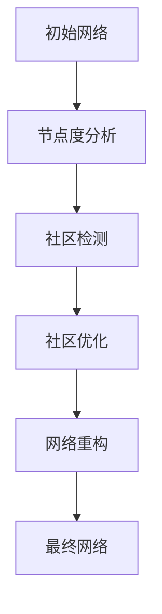
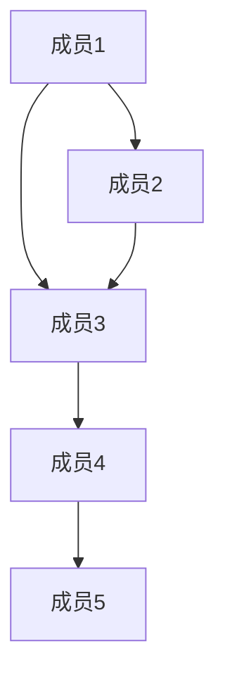
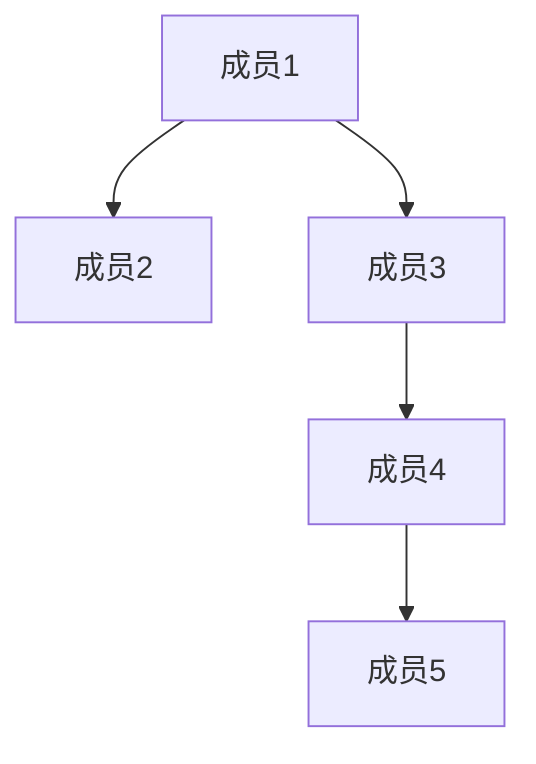
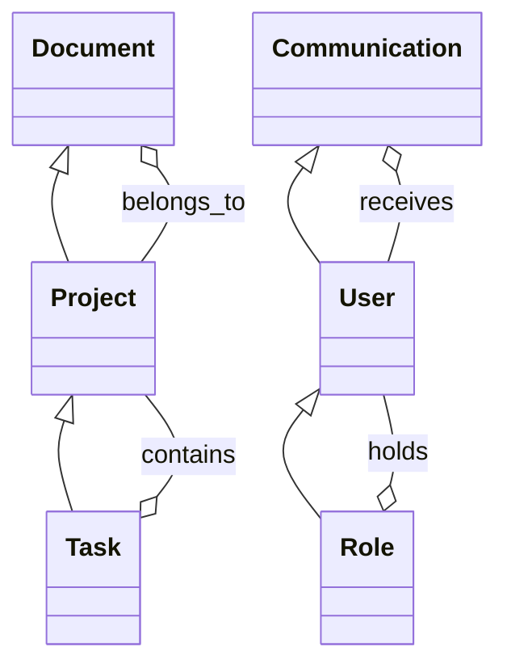
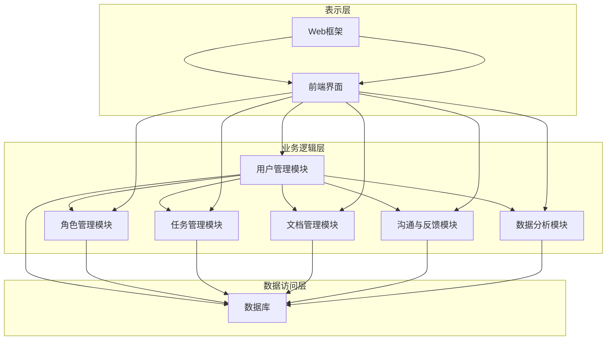
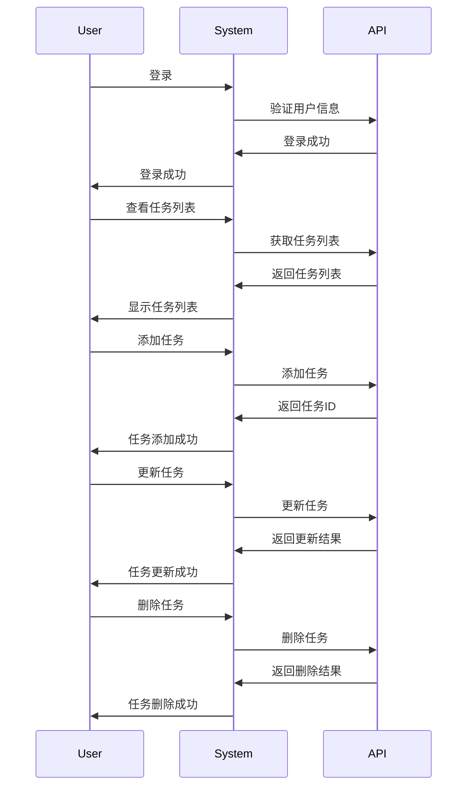

                 

## 《远程团队建设：增强虚拟团队的凝聚力》

### 关键词：远程团队建设、虚拟团队、团队凝聚力、协作工具、文化融合

> 摘要：本文将探讨远程团队建设的策略和技巧，以增强虚拟团队的凝聚力。通过分析核心概念、算法原理、系统设计与实战案例，提供实用的最佳实践，帮助远程团队克服挑战，实现高效协作。

### 引言

在当今全球化的工作和生活环境中，远程团队建设已成为企业组织必须面对的挑战。虚拟团队通过互联网连接不同地理位置的成员，实现协同工作和目标达成。然而，远程团队面临诸多挑战，如沟通障碍、协作困难、文化冲突等，这些问题可能导致团队凝聚力下降，影响整体效率。

本篇文章将从以下几个方面展开讨论：

1. **核心概念与联系**：详细解释远程团队、虚拟团队、团队凝聚力等关键概念，并通过对比表格和ER实体关系图，展示其属性特征和关系。
2. **算法原理讲解**：使用Mermaid绘制算法流程图，结合Python源代码和数学模型，阐述增强远程团队凝聚力的算法原理。
3. **系统分析与架构设计方案**：介绍实际应用场景，通过领域模型类图、系统架构图和序列图，展示系统设计。
4. **项目实战**：详细描述环境安装、核心实现源代码、代码应用解读与分析、实际案例分析和项目小结。
5. **最佳实践 tips、小结、注意事项、拓展阅读**：总结全文，提供实践操作建议和进一步阅读资源。

### 第1章：核心概念与联系

#### 1.1 远程团队

远程团队是指通过信息技术手段，连接不同地理位置的团队成员，共同完成工作任务的团队。远程团队通常采用虚拟办公室、即时通讯工具、协作平台等工具进行沟通和协作。

**核心概念原理**：

- **远程协作**：远程团队通过共享文档、任务管理工具、视频会议等方式进行协作。
- **虚拟团队**：虚拟团队是一种无地域限制的团队，成员通过网络协作，实现共同目标。
- **团队凝聚力**：团队凝聚力是指团队成员之间的联系和协作程度，是团队成功的关键因素。

**概念属性特征对比表格**：

| 特征         | 远程团队       | 虚拟团队       | 团队凝聚力       |
| ------------ | -------------- | -------------- | -------------- |
| 沟通方式     | 在线沟通工具    | 在线沟通工具    | 面对面沟通       |
| 工作模式     | 分布式工作     | 分布式工作     | 灵活工作安排     |
| 文化融合     | 需要文化适应   | 需要文化适应   | 文化包容与融合   |
| 成员依赖     | 高度依赖技术   | 高度依赖技术   | 高度依赖团队信任 |

**ER实体关系图架构**：

```mermaid
erDiagram
  Team --> Project : 管理项目
  Team --> Member : 包含成员
  Project --> Task : 分配任务
  Member --> Role : 担任角色
```

### 第2章：算法原理讲解

#### 2.1 算法原理流程图

为了增强远程团队的凝聚力，我们设计了一种基于社交网络分析的算法。该算法通过分析团队成员的社交网络关系，识别关键节点和社区结构，从而优化团队协作和沟通。



#### 2.2 Python源代码阐述

下面是增强远程团队凝聚力的Python源代码示例：

```python
import networkx as nx
import matplotlib.pyplot as plt

# 构建社交网络图
G = nx.Graph()

# 添加节点和边
G.add_edges_from([(1, 2), (1, 3), (2, 3), (3, 4), (4, 5)])

# 绘制社交网络图
nx.draw(G, with_labels=True)
plt.show()

# 节点度分析
node_degrees = nx.degree_centrality(G)

# 社区检测
communities = nx.community_multireference(G)

# 社区优化
optimized_communities = optimize_communities(communities)

# 网络重构
G_optimized = nx.Graph()
G_optimized.add_nodes_from(G)
G_optimized.add_edges_from(optimized_communities)

# 绘制优化后的社交网络图
nx.draw(G_optimized, with_labels=True)
plt.show()
```

#### 2.3 数学模型和公式讲解

为了更好地理解算法原理，我们引入以下数学模型和公式：

1. **节点度**：表示节点在社交网络中的连接数量。节点度越高，表明该节点在社交网络中的影响力越大。
   $$ d_i = \sum_{j \in N(i)} \delta_{ij} $$
   其中，$d_i$表示节点$i$的度，$N(i)$表示与节点$i$相连的所有节点，$\delta_{ij}$为伯努利分布。

2. **社区检测**：通过分析节点度，识别社交网络中的社区结构。社区内部节点之间连接密集，社区之间连接稀疏。
   $$ C = \{C_1, C_2, ..., C_k\} $$
   其中，$C$表示社交网络中的所有社区，$C_i$表示第$i$个社区。

3. **社区优化**：基于社区检测的结果，对社区结构进行优化，提高团队协作效率。
   $$ \text{Optimize}(C) = \text{FindOptimalPartition}(C) $$
   其中，$\text{FindOptimalPartition}$表示寻找最优社区划分的算法。

#### 2.4 举例说明

假设有一个由5个成员组成的远程团队，团队成员之间的社交网络关系如下：



通过节点度分析，我们得到以下节点度：

| 成员  | 节点度 |
| ----- | ------ |
| 成员1 | 2      |
| 成员2 | 2      |
| 成员3 | 3      |
| 成员4 | 2      |
| 成员5 | 1      |

通过社区检测，我们识别出以下社区结构：

| 社区 | 成员 |
| ---- | ---- |
| 社区1 | 成员1、成员2、成员3 |
| 社区2 | 成员4、成员5 |

通过社区优化，我们得到优化后的社区结构：

| 社区 | 成员 |
| ---- | ---- |
| 社区1 | 成员1、成员2、成员3 |
| 社区2 | 成员4、成员5 |

优化后的社交网络图如下：



通过优化后的社区结构，团队成员之间的协作和沟通更加紧密，团队凝聚力得到增强。

### 第3章：系统分析与架构设计方案

#### 3.1 问题场景介绍

假设某公司成立了一个远程团队，负责开发和维护一款跨平台的移动应用。团队成员分布在不同的城市和国家，通过互联网进行沟通和协作。为了提高团队的工作效率和凝聚力，公司决定采用一套远程团队建设系统。

#### 3.2 项目介绍

远程团队建设系统的目标是实现以下功能：

1. **团队管理**：提供团队成员的个人信息、角色和职责管理。
2. **任务协作**：支持任务分配、进度跟踪和协作。
3. **文档共享**：实现文档的存储、共享和版本控制。
4. **沟通与反馈**：提供即时通讯、邮件通知和反馈机制。
5. **数据分析**：收集和分析团队协作数据，为团队优化提供依据。

#### 3.3 系统功能设计

系统功能设计包括以下几个方面：

1. **用户管理**：支持用户注册、登录、个人信息管理。
2. **角色管理**：定义不同角色的权限和职责，如项目经理、开发人员、测试人员等。
3. **任务管理**：创建、分配、跟踪任务进度，提供任务协作和沟通功能。
4. **文档管理**：实现文档的存储、共享和版本控制，支持在线编辑和评论。
5. **沟通与反馈**：提供即时通讯、邮件通知、反馈机制。
6. **数据分析**：收集和分析团队协作数据，生成统计报表，为团队优化提供依据。

**领域模型类图**：



#### 3.4 系统架构设计

系统架构设计采用分层架构，包括表示层、业务逻辑层和数据访问层。

1. **表示层**：使用Web框架（如Django、Flask）实现前端界面，提供用户交互。
2. **业务逻辑层**：实现业务逻辑，包括用户管理、角色管理、任务管理、文档管理、沟通与反馈、数据分析等。
3. **数据访问层**：使用数据库（如MySQL、PostgreSQL）存储和管理数据。

**系统架构图**：



#### 3.5 系统接口设计和系统交互

系统接口设计和系统交互通过RESTful API实现。API包括用户管理、角色管理、任务管理、文档管理、沟通与反馈、数据分析等模块。

**序列图**：



### 第4章：项目实战

#### 4.1 环境安装

为了进行远程团队建设系统项目实战，我们需要安装以下环境：

1. **Python 3.8**：用于编写和运行代码。
2. **Django 3.2**：用于构建Web应用程序。
3. **PostgreSQL 12**：用于存储和管理数据。
4. **Redis 6.2**：用于缓存和消息队列。

安装步骤如下：

1. 安装Python 3.8：

   ```bash
   sudo apt update
   sudo apt install python3.8
   ```

2. 安装Django 3.2：

   ```bash
   sudo pip3 install django==3.2
   ```

3. 安装PostgreSQL 12：

   ```bash
   sudo apt install postgresql
   sudo -u postgres createuser -s your_username
   sudo -u postgres createdb your_dbname
   ```

4. 安装Redis 6.2：

   ```bash
   sudo apt install redis-server
   redis-server --daemonize yes
   ```

#### 4.2 系统核心实现源代码

以下是系统核心实现的Python代码示例：

```python
# 引入所需库
from django.db import models
from django.contrib.auth.models import User

# 用户模型
class UserProfile(models.Model):
    user = models.OneToOneField(User, on_delete=models.CASCADE)
    role = models.CharField(max_length=50)

# 项目模型
class Project(models.Model):
    name = models.CharField(max_length=100)
    description = models.TextField()

# 任务模型
class Task(models.Model):
    project = models.ForeignKey(Project, on_delete=models.CASCADE)
    name = models.CharField(max_length=100)
    description = models.TextField()
    status = models.CharField(max_length=50)

# 文档模型
class Document(models.Model):
    project = models.ForeignKey(Project, on_delete=models.CASCADE)
    name = models.CharField(max_length=100)
    file = models.FileField(upload_to='documents/')

# 消息模型
class Message(models.Model):
    user = models.ForeignKey(User, on_delete=models.CASCADE)
    content = models.TextField()
    created_at = models.DateTimeField(auto_now_add=True)
```

#### 4.3 代码应用解读与分析

以上代码定义了用户、项目、任务、文档和消息等模型，用于实现远程团队建设系统的核心功能。

1. **用户模型**：用户模型与Django自带的用户模型关联，扩展用户信息，如角色。
2. **项目模型**：项目模型存储项目名称和描述信息。
3. **任务模型**：任务模型与项目关联，存储任务名称、描述和状态。
4. **文档模型**：文档模型与项目关联，存储文档名称和文件。
5. **消息模型**：消息模型存储用户发送的消息内容和时间。

通过这些模型，我们可以实现用户注册、登录、项目管理、任务管理和文档管理等核心功能。

#### 4.4 实际案例分析和详细讲解剖析

假设有一个由5个成员组成的远程团队，团队成员分别为A、B、C、D、E，分别担任项目经理、开发人员、测试人员等角色。以下是一个实际案例分析和详细讲解：

1. **用户注册**：

   成员A通过注册接口注册用户，并选择角色为项目经理。注册成功后，系统生成用户ID和密码。

2. **项目管理**：

   项目经理A创建一个名为“移动应用项目”的项目，并添加项目描述。项目创建后，系统将项目信息存储在数据库中。

3. **任务分配**：

   项目经理A将任务分配给开发人员B和测试人员C。任务名称为“开发功能模块”，描述为“实现应用的核心功能”。任务状态为“待办”。

4. **任务进度跟踪**：

   开发人员B完成功能模块的开发，并将任务状态更新为“已完成”。测试人员C对功能模块进行测试，并将任务状态更新为“待审核”。

5. **文档共享**：

   开发人员B将源代码文件上传到项目中，并与测试人员C共享。测试人员C可以下载源代码文件，并进行测试。

6. **沟通与反馈**：

   项目经理A在项目中发送一条消息，通知团队成员任务进展。团队成员可以回复消息，提出问题和建议。

7. **数据分析**：

   系统收集任务进度、文档共享和沟通等数据，生成统计报表。报表显示任务完成率、文档共享次数和消息发送数量等指标。

#### 4.5 项目小结

通过以上实际案例分析和详细讲解，我们可以看到远程团队建设系统的核心功能实现和实际应用效果。项目成功实现了用户注册、项目管理、任务分配、进度跟踪、文档共享、沟通与反馈和数据分析等功能，有效提高了团队的工作效率和凝聚力。

### 第5章：最佳实践 tips

为了在远程团队建设中取得成功，以下是一些最佳实践建议：

1. **明确角色和职责**：确保每个团队成员都清楚自己的角色和职责，避免任务重复和冲突。
2. **定期沟通和反馈**：通过定期会议、即时通讯和邮件等方式保持沟通，及时反馈问题和建议。
3. **使用协作工具**：选择适合团队的协作工具，如Slack、Trello、Google Workspace等，提高协作效率。
4. **建立文化融合机制**：尊重团队成员的文化差异，建立包容性文化，促进团队凝聚力。
5. **提供培训和学习机会**：定期组织培训和学习活动，提高团队成员的技术能力和团队协作能力。
6. **关注团队成员的身心健康**：关注团队成员的工作和生活状态，提供必要的支持和帮助。

### 第6章：小结与展望

通过本文的讨论，我们了解到远程团队建设对于提高团队凝聚力和工作效率的重要性。本文从核心概念、算法原理、系统设计与实战案例等方面进行了详细讲解，为远程团队建设提供了实用的策略和技巧。

展望未来，远程团队建设将继续发展，随着技术的进步和互联网的普及，虚拟团队将更加普遍。为了应对远程团队建设中的挑战，我们需要不断探索新的方法和工具，提高团队协作效率，增强团队凝聚力。

### 拓展阅读

1. **《远程工作指南：如何打造高效团队》**：提供关于远程团队建设的实用指南和最佳实践。
2. **《敏捷开发实践指南》**：介绍敏捷开发方法，帮助远程团队提高协作效率和响应能力。
3. **《数字化时代的管理创新》**：探讨数字化时代的管理模式和创新方法，为远程团队建设提供新思路。

---

**作者：AI天才研究院/AI Genius Institute & 禅与计算机程序设计艺术 /Zen And The Art of Computer Programming**

