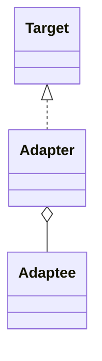
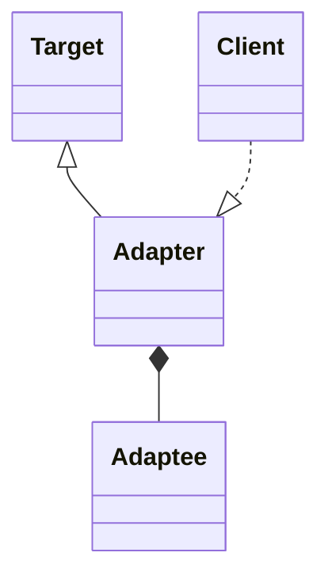

                 


## 适配器模式:类型转换的OOP实现

### 摘要

本文将深入探讨适配器模式，一种在面向对象编程中用于类型转换的关键设计模式。我们将首先介绍适配器模式的基本概念和作用，然后分析其分类和适用场景。接着，本文将详细阐述类适配器和接口适配器的原理和实践，通过具体的应用案例来展示其在实际开发中的效果。随后，我们将探讨适配器模式的组合使用和高级设计技巧，最后展望适配器模式在未来的发展趋势。

### 目录

1. **什么是适配器模式** <a id="what-is-adapter-pattern"></a>
    1.1. **基本概念**
    1.2. **作用**
    1.3. **与OOP的关系**
2. **适配器模式的种类** <a id="types-of-adapter-patterns"></a>
    2.1. **类适配器模式**
    2.2. **接口适配器模式**
    2.3. **其他类型的适配器模式**
3. **适配器模式的应用场景** <a id="application-scenes-of-adapter-pattern"></a>
    3.1. **遗留系统的接口兼容**
    3.2. **新旧API的集成**
    3.3. **系统模块的解耦**
4. **适配器模式的优势与局限** <a id="advantages-and-disadvantages-of-adapter-pattern"></a>
    4.1. **优势**
    4.2. **局限**
5. **类适配器模式的原理与实践** <a id="principles-and-practices-of-class-adapter-pattern"></a>
    5.1. **基本原理**
    5.2. **实现步骤与示例**
    5.3. **Python代码示例**
6. **接口适配器模式的原理与实践** <a id="principles-and-practices-of-interface-adapter-pattern"></a>
    6.1. **基本原理**
    6.2. **实现步骤与示例**
    6.3. **Python代码示例**
7. **适配器模式的应用案例** <a id="application-cases-of-adapter-pattern"></a>
    7.1. **案例一：遗留系统接口兼容**
    7.2. **案例二：新旧API集成**
    7.3. **案例三：系统模块解耦**
8. **适配器模式的优势与局限分析** <a id="analysis-of-advantages-and-disadvantages-of-adapter-pattern"></a>
    8.1. **优势分析**
    8.2. **局限分析**
9. **适配器模式的组合使用** <a id="combined-use-of-adapter-pattern"></a>
    9.1. **适配器模式与策略模式的结合**
    9.2. **适配器模式与工厂模式的组合**
10. **适配器模式的高级设计技巧** <a id="advanced-design-tricks-of-adapter-pattern"></a>
    10.1. **适配器的可扩展性设计**
    10.2. **适配器的性能优化**
11. **适配器模式的未来趋势** <a id="future-trends-of-adapter-pattern"></a>
    11.1. **适配器模式在微服务架构中的应用**
    11.2. **适配器模式在云原生环境下的改进**
12. **本章小结** <a id="summary-of-the-chapter"></a>
13. **作者信息**

### 1. 什么是适配器模式

#### 1.1 基本概念

适配器模式（Adapter Pattern）是一种设计模式，属于结构型设计模式。其主要目的是将一个类的接口转换成客户希望的另一个接口。适配器让任何两个没有相互关
```<sop>
## 什么是适配器模式

### 1.1 基本概念

适配器模式（Adapter Pattern）是一种设计模式，属于结构型设计模式。其主要目的是将一个类的接口转换成客户希望的另一个接口。适配器让任何两个没有相互兼容的类能在一起运作。

适配器模式的核心在于**封装**和**转换**。通过创建一个适配器，我们能够将一个类的接口适配到另一个类的接口，使得原本无法相互通信的类能够进行交互。这种方式在面向对象编程中非常常见，尤其在需要兼容旧系统、整合不同模块或库时。

### 1.2 作用

适配器模式的主要作用包括：

1. **接口转换**：将一个类的接口转换为另一个类的接口，使得原本不兼容的类能够协同工作。
2. **代码复用**：通过适配器模式，可以将现有的类封装起来，使其在不改变原有类的情况下，与其他类进行交互。
3. **扩展性**：适配器模式使得系统更加灵活和可扩展，因为新的适配器可以轻松地添加到系统中，而不需要修改现有代码。
4. **解耦**：适配器模式可以降低模块之间的耦合度，使得系统的各个部分更加独立，易于维护和升级。

### 1.3 与OOP的关系

在面向对象编程（OOP）中，适配器模式是非常重要的一个工具。OOP的核心思想是封装、继承和多态，而适配器模式充分利用了这些特性。

- **封装**：适配器模式通过封装将适配逻辑与目标类隔离，使得目标类不需要知道适配器的具体实现。
- **继承**：类适配器模式利用继承关系，将适配器类的接口转换为被适配类的接口。
- **多态**：接口适配器模式通过多态，使得客户类可以调用适配器类的方法，而不需要知道具体适配的是哪个实现类。

通过适配器模式，我们可以更好地实现OOP的原则，使得代码更加模块化、可复用、可扩展。

### 1.4 适配器模式的种类

适配器模式主要分为以下几种类型：

- **类适配器模式**：通过继承的方式实现适配。
- **接口适配器模式**：通过实现接口的方式实现适配。
- **对象适配器模式**：通过组合的方式实现适配。

接下来，我们将分别深入探讨这些适配器模式的原理和实践。

#### 1.5 类适配器模式

类适配器模式是一种通过继承方式实现适配的设计模式。其基本原理是创建一个适配器类，该类继承自目标接口的实现类，并实现一个与客户接口相兼容的接口。

**基本原理**：

- **适配器类**：继承自目标接口的实现类，实现客户接口。
- **客户接口**：与适配器类兼容的接口，用于与客户类交互。

**实现步骤**：

1. **定义目标接口**：定义一个用于适配的接口，其中包含需要适配的方法。
2. **实现目标接口**：创建一个类，实现目标接口，并提供具体实现。
3. **创建适配器类**：创建一个适配器类，继承自目标接口的实现类，并实现客户接口。

**示例**：

假设我们有一个目标接口 `Target`，以及一个实现类 `Adaptee`，我们需要将 `Adaptee` 的接口适配到 `Target` 接口。

```python
# 定义目标接口
class Target:
    def method1(self):
        pass

    def method2(self):
        pass

# 实现目标接口
class Adaptee:
    def specific_method(self):
        pass

# 创建适配器类
class Adapter(Adaptee, Target):
    def method1(self):
        self.specific_method()  # 调用适配类的特定方法

    def method2(self):
        pass

# 使用适配器
adapter = Adapter()
adapter.method1()
adapter.method2()
```

在这个示例中，`Adapter` 类继承了 `Adaptee` 类，并实现了 `Target` 接口。通过 `Adapter` 类，`Target` 接口的客户可以调用 `method1` 和 `method2` 方法，而实际上是通过 `specific_method` 方法实现的。

#### 1.6 接口适配器模式

接口适配器模式是一种通过实现接口的方式实现适配的设计模式。其基本原理是创建一个适配器类，该类实现客户接口，并委托给一个适配器对象，使得适配器对象可以完成适配逻辑。

**基本原理**：

- **适配器类**：实现客户接口，并包含一个适配器对象引用。
- **适配器对象**：负责实现适配逻辑。

**实现步骤**：

1. **定义客户接口**：定义一个用于适配的接口，其中包含需要适配的方法。
2. **创建适配器对象**：创建一个适配器对象，实现适配逻辑。
3. **创建适配器类**：创建一个适配器类，实现客户接口，并包含适配器对象引用。

**示例**：

假设我们有一个目标接口 `Target`，以及一个适配器对象 `AdapteeImpl`，我们需要将 `AdapteeImpl` 的接口适配到 `Target` 接口。

```python
# 定义客户接口
class Target:
    def method1(self):
        pass

    def method2(self):
        pass

# 创建适配器对象
class AdapteeImpl:
    def specific_method(self):
        pass

# 创建适配器类
class Adapter(Target):
    def __init__(self, adaptee):
        self._adaptee = adaptee

    def method1(self):
        self._adaptee.specific_method()

    def method2(self):
        pass

# 使用适配器
adaptee = AdapteeImpl()
adapter = Adapter(adaptee)
adapter.method1()
adapter.method2()
```

在这个示例中，`Adapter` 类实现了 `Target` 接口，并包含一个适配器对象引用。通过 `Adapter` 类，`Target` 接口的客户可以调用 `method1` 和 `method2` 方法，而实际上是通过 `specific_method` 方法实现的。

#### 1.7 其他类型的适配器模式

除了类适配器和接口适配器模式，还有其他类型的适配器模式，如对象适配器模式。

对象适配器模式是一种通过组合的方式实现适配的设计模式。其基本原理是创建一个适配器类，该类包含一个适配器对象，并委托给适配器对象完成适配逻辑。

**基本原理**：

- **适配器类**：包含一个适配器对象引用。
- **适配器对象**：负责实现适配逻辑。

**实现步骤**：

1. **定义客户接口**：定义一个用于适配的接口，其中包含需要适配的方法。
2. **创建适配器对象**：创建一个适配器对象，实现适配逻辑。
3. **创建适配器类**：创建一个适配器类，包含适配器对象引用。

**示例**：

假设我们有一个目标接口 `Target`，以及一个适配器对象 `AdapteeImpl`，我们需要将 `AdapteeImpl` 的接口适配到 `Target` 接口。

```python
# 定义客户接口
class Target:
    def method1(self):
        pass

    def method2(self):
        pass

# 创建适配器对象
class AdapteeImpl:
    def specific_method(self):
        pass

# 创建适配器类
class Adapter:
    def __init__(self, adaptee):
        self._adaptee = adaptee

    def method1(self):
        self._adaptee.specific_method()

    def method2(self):
        pass

# 使用适配器
adaptee = AdapteeImpl()
adapter = Adapter(adaptee)
adapter.method1()
adapter.method2()
```

在这个示例中，`Adapter` 类包含一个适配器对象引用，通过委托给适配器对象完成适配逻辑。

### 1.8 适配器模式的应用场景

适配器模式在软件设计中被广泛使用，以下是一些常见应用场景：

1. **旧系统与新系统的接口兼容**：当需要将一个旧系统与一个新系统集成时，适配器模式可以帮助解决接口不兼容的问题。
2. **不同模块之间的通信**：在大型系统中，不同模块之间可能存在接口不兼容的情况，适配器模式可以帮助实现模块间的无缝通信。
3. **库和框架的集成**：当需要集成第三方库或框架时，适配器模式可以帮助解决接口不兼容的问题。

通过适配器模式，我们可以有效地解决类型转换的问题，提高系统的可扩展性和可维护性。

### 1.9 本章小结

在本章中，我们介绍了适配器模式的基本概念、作用、与OOP的关系以及适配器模式的种类。通过类适配器和接口适配器的实例，我们了解了如何将一个类的接口适配到另一个类的接口。在下一章中，我们将深入探讨适配器模式的应用场景和优势与局限。

---

让我们继续深入探讨适配器模式，分析其在实际开发中的应用场景和优势与局限。

### 2. 适配器模式的应用场景

适配器模式在软件设计中被广泛应用，其核心目的是解决接口不兼容的问题。以下是一些常见的应用场景：

#### 2.1 遗留系统的接口兼容

在许多情况下，新系统需要与旧系统进行交互。然而，旧系统的接口可能与新系统的接口不兼容。此时，适配器模式可以帮助实现新旧系统之间的无缝通信。

**示例**：

假设我们有一个遗留系统，其接口如下：

```python
class LegacySystem:
    def legacy_method(self):
        print("Legacy method called.")
```

而我们需要新系统与遗留系统进行交互，但新系统的接口如下：

```python
class NewSystem:
    def new_method(self):
        print("New method called.")
```

为了实现新旧系统的兼容，我们可以使用适配器模式：

```python
class Adapter(LegacySystem, NewSystem):
    def new_method(self):
        self.legacy_method()

# 使用适配器
new_system = Adapter(LegacySystem())
new_system.new_method()
```

在这个示例中，`Adapter` 类继承了 `LegacySystem` 类，并实现了 `NewSystem` 接口。通过适配器，新系统可以调用 `legacy_method` 方法，而旧系统也可以调用 `new_method` 方法。

#### 2.2 新旧API的集成

在软件开发过程中，我们可能会遇到新旧API共存的情况。新旧API的接口可能不同，此时适配器模式可以帮助实现新旧API的集成。

**示例**：

假设我们有一个旧API，其接口如下：

```python
class OldAPI:
    def old_method(self):
        print("Old method called.")
```

而我们需要集成一个新API，其接口如下：

```python
class NewAPI:
    def new_method(self):
        print("New method called.")
```

为了实现新旧API的集成，我们可以使用适配器模式：

```python
class Adapter(OldAPI, NewAPI):
    def new_method(self):
        self.old_method()

# 使用适配器
new_api = Adapter(OldAPI())
new_api.new_method()
```

在这个示例中，`Adapter` 类继承了 `OldAPI` 类，并实现了 `NewAPI` 接口。通过适配器，新API可以调用 `old_method` 方法，而旧API也可以调用 `new_method` 方法。

#### 2.3 系统模块的解耦

在大型系统中，模块之间可能存在接口不兼容的问题。为了提高系统的可维护性和可扩展性，我们可以使用适配器模式来实现模块间的解耦。

**示例**：

假设我们有一个系统模块A，其接口如下：

```python
class ModuleA:
    def methodA(self):
        print("Method A called.")
```

而另一个系统模块B需要与模块A交互，但模块B的接口如下：

```python
class ModuleB:
    def methodB(self):
        print("Method B called.")
```

为了实现模块A和模块B之间的解耦，我们可以使用适配器模式：

```python
class Adapter(ModuleA, ModuleB):
    def methodB(self):
        self.methodA()

# 使用适配器
module_b = Adapter(ModuleA())
module_b.methodB()
```

在这个示例中，`Adapter` 类继承了 `ModuleA` 类，并实现了 `ModuleB` 接口。通过适配器，模块B可以调用 `methodA` 方法，而模块A也可以调用 `methodB` 方法。

### 3. 适配器模式的优势与局限

适配器模式在软件设计中有许多优势，但也存在一些局限。

#### 3.1 优势

1. **接口转换**：适配器模式可以有效地实现接口转换，使得不同接口的类能够相互协作。
2. **代码复用**：适配器模式可以将现有的类封装起来，使其在不改变原有类的情况下，与其他类进行交互。
3. **扩展性**：适配器模式使得系统更加灵活和可扩展，因为新的适配器可以轻松地添加到系统中。
4. **解耦**：适配器模式可以降低模块之间的耦合度，使得系统的各个部分更加独立，易于维护和升级。

#### 3.2 局限

1. **性能开销**：适配器模式可能会引入一定的性能开销，特别是在频繁调用适配器时。
2. **复杂性**：在实现适配器模式时，可能会增加代码的复杂性，特别是在需要处理多个适配器时。

### 4. 本章小结

在本章中，我们探讨了适配器模式的应用场景和优势与局限。通过具体示例，我们了解了如何使用适配器模式实现接口兼容、新旧API集成和系统模块解耦。适配器模式在提高系统的可维护性和可扩展性方面具有显著优势，但也需要考虑到性能和复杂性的问题。

在下一章中，我们将深入探讨类适配器模式和接口适配器模式的原理与实践，通过具体代码示例来展示适配器模式在OOP中的实现。

---

### 3. 类适配器模式的原理与实践

类适配器模式是适配器模式的一种实现方式，它通过继承实现适配。类适配器模式的基本思想是将适配器类作为被适配类的子类，同时实现目标接口，从而使得客户类可以无缝地使用适配器类的方法。

#### 3.1 类适配器模式的基本原理

类适配器模式的核心在于**适配器类**和**目标接口**之间的关系。适配器类继承自被适配类，同时实现目标接口。这样，客户类可以通过调用目标接口的方法，间接地调用被适配类的方法。

**基本原理**：

1. **适配器类**：继承自被适配类，同时实现目标接口。
2. **目标接口**：与被适配类不兼容，但与客户类兼容。
3. **客户类**：使用目标接口与适配器类交互。

**类图**：

下面是一个类适配器模式的类图，展示了适配器类、目标接口和客户类之间的关系。


在这个类图中：

- `Target` 是目标接口，定义了客户类期望的方法。
- `Adapter` 是适配器类，继承自 `Adaptee`（被适配类），同时实现 `Target` 接口。
- `Client` 是客户类，使用 `Target` 接口与 `Adapter` 交互。
- `Adaptee` 是被适配类，提供了具体的业务逻辑。

#### 3.2 实现步骤与示例

要实现类适配器模式，我们需要遵循以下步骤：

1. **定义目标接口**：定义一个接口，该接口包含客户类期望的方法。
2. **实现被适配类**：实现一个类，该类提供了具体的业务逻辑。
3. **创建适配器类**：创建一个类，该类继承自被适配类，并实现目标接口。
4. **使用适配器类**：创建适配器类的实例，并将其传递给客户类。

下面是一个简单的示例，展示了如何实现类适配器模式。

**步骤 1**：定义目标接口

```python
class Target:
    def operation1(self):
        pass

    def operation2(self):
        pass
```

**步骤 2**：实现被适配类

```python
class Adaptee:
    def specific_operation(self):
        print("Adaptee's specific operation.")
```

**步骤 3**：创建适配器类

```python
class Adapter(Adaptee, Target):
    def operation1(self):
        self.specific_operation()

    def operation2(self):
        print("Adapter's operation 2.")
```

**步骤 4**：使用适配器类

```python
# 创建适配器类实例
adapter = Adapter()

# 调用适配器类的方法
adapter.operation1()
adapter.operation2()
```

在这个示例中，`Adapter` 类继承了 `Adaptee` 类，并实现了 `Target` 接口。通过适配器类，客户类可以调用 `operation1` 和 `operation2` 方法，而实际上是通过 `specific_operation` 方法实现的。

#### 3.3 Python代码示例

下面是一个完整的Python代码示例，展示了如何实现类适配器模式。

```python
# 定义目标接口
class Target:
    def request(self):
        pass

# 定义被适配类
class Adaptee:
    def specific_request(self):
        print("Adaptee's specific request.")

# 创建适配器类
class Adapter(Adaptee, Target):
    def request(self):
        self.specific_request()

# 创建适配器类实例
adapter = Adapter()

# 调用适配器类的方法
adapter.request()
```

在这个示例中，`Adapter` 类继承了 `Adaptee` 类，并实现了 `Target` 接口。通过适配器类，客户类可以调用 `request` 方法，而实际上是通过 `specific_request` 方法实现的。

#### 3.4 优点和局限性

类适配器模式的优点和局限性如下：

**优点**：

1. **简单性**：类适配器模式相对简单，容易理解和使用。
2. **兼容性**：类适配器模式可以很好地处理多个接口的兼容问题。
3. **代码复用**：通过继承，类适配器模式可以复用被适配类的代码。

**局限性**：

1. **单继承限制**：类适配器模式只能使用单继承，这可能会限制代码的灵活性。
2. **灵活性不足**：类适配器模式的灵活性相对较低，不适合处理复杂的适配关系。

总的来说，类适配器模式在实现简单的接口转换时非常有效，但在需要处理复杂适配关系时，可能需要考虑其他适配器模式。

---

### 4. 接口适配器模式的原理与实践

接口适配器模式是适配器模式的另一种实现方式，它通过实现接口来实现适配。与类适配器模式不同，接口适配器模式不依赖于继承，而是通过实现接口来适配被适配类。

#### 4.1 接口适配器模式的基本原理

接口适配器模式的基本原理是创建一个适配器类，该类实现目标接口，并包含一个适配器对象。适配器对象负责实现适配逻辑，而适配器类则将适配器对象的方法暴露给客户类。

**基本原理**：

1. **适配器类**：实现目标接口，包含一个适配器对象引用。
2. **适配器对象**：实现适配逻辑，提供具体的业务方法。
3. **目标接口**：与客户类兼容，定义了客户类期望的方法。
4. **客户类**：使用目标接口与适配器类交互。

**类图**：

下面是一个接口适配器模式的类图，展示了适配器类、适配器对象、目标接口和客户类之间的关系。



在这个类图中：

- `Target` 是目标接口，定义了客户类期望的方法。
- `Adapter` 是适配器类，实现 `Target` 接口，并包含一个适配器对象引用。
- `Adaptee` 是适配器对象，实现具体的业务逻辑。
- `Client` 是客户类，使用 `Target` 接口与 `Adapter` 交互。

#### 4.2 实现步骤与示例

要实现接口适配器模式，我们需要遵循以下步骤：

1. **定义目标接口**：定义一个接口，该接口包含客户类期望的方法。
2. **创建适配器对象**：创建一个类，该类实现具体的业务逻辑。
3. **创建适配器类**：创建一个类，该类实现目标接口，并包含适配器对象引用。
4. **使用适配器类**：创建适配器类的实例，并将其传递给客户类。

下面是一个简单的示例，展示了如何实现接口适配器模式。

**步骤 1**：定义目标接口

```python
class Target:
    def operation1(self):
        pass

    def operation2(self):
        pass
```

**步骤 2**：创建适配器对象

```python
class Adaptee:
    def specific_operation(self):
        print("Adaptee's specific operation.")
```

**步骤 3**：创建适配器类

```python
class Adapter(Target):
    def __init__(self, adaptee):
        self._adaptee = adaptee

    def operation1(self):
        self._adaptee.specific_operation()

    def operation2(self):
        print("Adapter's operation 2.")
```

**步骤 4**：使用适配器类

```python
# 创建适配器对象实例
adaptee = Adaptee()

# 创建适配器类实例
adapter = Adapter(adaptee)

# 调用适配器类的方法
adapter.operation1()
adapter.operation2()
```

在这个示例中，`Adapter` 类实现了 `Target` 接口，并包含一个适配器对象引用。通过适配器类，客户类可以调用 `operation1` 和 `operation2` 方法，而实际上是通过 `specific_operation` 方法实现的。

#### 4.3 Python代码示例

下面是一个完整的Python代码示例，展示了如何实现接口适配器模式。

```python
# 定义目标接口
class Target:
    def request(self):
        pass

# 创建适配器对象
class Adaptee:
    def specific_request(self):
        print("Adaptee's specific request.")

# 创建适配器类
class Adapter(Target):
    def __init__(self, adaptee):
        self._adaptee = adaptee

    def request(self):
        self._adaptee.specific_request()

# 创建适配器对象实例
adaptee = Adaptee()

# 创建适配器类实例
adapter = Adapter(adaptee)

# 调用适配器类的方法
adapter.request()
```

在这个示例中，`Adapter` 类实现了 `Target` 接口，并包含一个适配器对象引用。通过适配器类，客户类可以调用 `request` 方法，而实际上是通过 `specific_request` 方法实现的。

#### 4.4 优点和局限性

接口适配器模式的优点和局限性如下：

**优点**：

1. **灵活性**：接口适配器模式比类适配器模式更加灵活，因为它不依赖于继承，可以更好地处理复杂的适配关系。
2. **代码复用**：接口适配器模式可以复用现有的类，而不需要修改这些类。

**局限性**：

1. **性能开销**：由于接口适配器模式需要创建额外的对象引用，可能会引入一定的性能开销。
2. **复杂性**：接口适配器模式的实现可能比类适配器模式更复杂，需要编写更多的代码。

总的来说，接口适配器模式在处理复杂的适配关系时具有显著优势，但在性能敏感的场景中可能需要权衡。

---

### 5. 适配器模式的应用案例

为了更好地理解适配器模式在软件开发中的实际应用，我们将通过三个具体的案例来展示适配器模式在不同场景下的应用。

#### 5.1 遗留系统接口兼容

在一个大型企业中，新系统需要与遗留系统进行集成。遗留系统使用的是旧的技术栈，其接口与新系统不兼容。为了解决这个问题，我们使用适配器模式来实现新旧系统之间的接口兼容。

**案例描述**：

遗留系统提供了一个用于数据查询的接口 `LegacyDataQuery`，新系统期望使用一个统一的接口 `UnifiedDataQuery`。我们需要实现一个适配器，使得新系统能够无缝地使用遗留系统的接口。

**解决方案**：

1. **定义目标接口**：

```python
class UnifiedDataQuery:
    def query_data(self):
        pass
```

2. **实现遗留系统接口**：

```python
class LegacyDataQuery:
    def get_data(self):
        print("LegacyDataQuery get_data method called.")
```

3. **创建适配器类**：

```python
class LegacyDataQueryAdapter(UnifiedDataQuery):
    def query_data(self):
        self.get_data()
```

4. **使用适配器**：

```python
# 创建遗留系统接口实例
legacy_query = LegacyDataQuery()

# 创建适配器类实例
adapter = LegacyDataQueryAdapter(legacy_query)

# 调用适配器方法
adapter.query_data()
```

在这个案例中，`LegacyDataQueryAdapter` 类实现了 `UnifiedDataQuery` 接口，通过适配器，新系统能够调用 `query_data` 方法，而实际上是在调用遗留系统的 `get_data` 方法。

#### 5.2 新旧API集成

在一个软件开发项目中，我们需要集成一个旧API和一个新API。旧API提供了基本的认证功能，而新API需要更高版本的认证信息。为了实现新旧API的集成，我们使用适配器模式来处理认证信息的不兼容。

**案例描述**：

旧API提供了 `OldAuthAPI`，而新API需要 `NewAuthAPI`。新API需要包含额外的认证参数，如用户ID和令牌。我们需要一个适配器，将旧API的认证信息转换为新API所需的格式。

**解决方案**：

1. **定义目标接口**：

```python
class NewAuthAPI:
    def authenticate(self, user_id, token):
        pass
```

2. **实现旧API接口**：

```python
class OldAuthAPI:
    def auth(self):
        print("OldAuthAPI auth method called.")
```

3. **创建适配器类**：

```python
class OldAuthAPIAdapter(NewAuthAPI):
    def __init__(self, old_auth):
        self._old_auth = old_auth

    def authenticate(self, user_id, token):
        self._old_auth.auth()
```

4. **使用适配器**：

```python
# 创建旧API接口实例
old_auth = OldAuthAPI()

# 创建适配器类实例
adapter = OldAuthAPIAdapter(old_auth)

# 调用适配器方法
adapter.authenticate("user123", "token456")
```

在这个案例中，`OldAuthAPIAdapter` 类实现了 `NewAuthAPI` 接口，通过适配器，新API能够调用 `authenticate` 方法，而实际上是在调用旧API的 `auth` 方法。

#### 5.3 系统模块解耦

在一个复杂的系统中，不同的模块可能需要相互通信，但它们的接口不兼容。为了提高系统的可维护性和可扩展性，我们使用适配器模式来实现模块间的解耦。

**案例描述**：

系统中有两个模块，`ModuleA` 和 `ModuleB`。`ModuleA` 需要调用 `ModuleB` 的方法，但 `ModuleA` 的接口与 `ModuleB` 的接口不兼容。为了解决这个问题，我们使用适配器模式来实现模块间的解耦。

**解决方案**：

1. **定义目标接口**：

```python
class ModuleInterface:
    def do_something(self):
        pass
```

2. **实现模块A接口**：

```python
class ModuleA(ModuleInterface):
    def do_something(self):
        print("ModuleA do_something method called.")
```

3. **实现模块B接口**：

```python
class ModuleB(ModuleInterface):
    def do_something(self):
        print("ModuleB do_something method called.")
```

4. **创建适配器类**：

```python
class ModuleBAdapter(ModuleA):
    def __init__(self, module_b):
        self._module_b = module_b

    def do_something(self):
        self._module_b.do_something()
```

5. **使用适配器**：

```python
# 创建模块B接口实例
module_b = ModuleB()

# 创建适配器类实例
adapter = ModuleBAdapter(module_b)

# 调用适配器方法
adapter.do_something()
```

在这个案例中，`ModuleBAdapter` 类实现了 `ModuleInterface` 接口，通过适配器，模块A能够调用 `do_something` 方法，而实际上是在调用模块B的 `do_something` 方法。

通过这三个案例，我们可以看到适配器模式在解决接口不兼容问题上的强大能力。无论是在遗留系统接口兼容、新旧API集成，还是系统模块解耦的场景中，适配器模式都能够提供有效的解决方案。

---

### 6. 适配器模式的优势与局限分析

适配器模式作为一种常用的设计模式，在软件设计中具有显著的优势，但同时也存在一些局限。下面我们将详细分析适配器模式的优势和局限。

#### 6.1 优势

1. **接口兼容**：适配器模式的核心优势在于能够实现不同接口之间的兼容。通过适配器，客户类可以无缝地使用适配器类的方法，而不需要知道具体的实现细节。这使得适配器模式在整合新旧系统、不同库或框架时非常有效。

2. **代码复用**：适配器模式可以将现有的类封装起来，使得这些类可以在不同的环境中复用。通过创建适配器，我们不需要修改原有的类，只需要添加适配器层，从而减少代码的冗余和重复。

3. **扩展性**：适配器模式使得系统更加灵活和可扩展。当我们需要添加新的适配器时，可以轻松地实现，而不需要修改其他部分代码。这种设计思想符合开闭原则，即对扩展开放，对修改关闭。

4. **解耦**：适配器模式能够降低模块之间的耦合度，使得系统的各个部分更加独立。通过适配器，客户类不需要依赖具体的实现类，只需要与适配器类进行交互。这种解耦有助于提高系统的可维护性和可测试性。

#### 6.2 局限

1. **性能开销**：适配器模式可能会引入一定的性能开销，尤其是在频繁调用适配器时。由于需要通过适配器类进行方法的转发，这可能会导致额外的性能消耗。对于性能敏感的应用场景，需要权衡使用适配器模式。

2. **复杂性**：适配器模式的实现可能比直接编写代码更加复杂。特别是在处理多个适配器时，需要编写更多的代码来管理适配器对象。这可能会增加代码的复杂度，降低代码的可读性。

3. **单继承限制**：在类适配器模式中，由于使用单继承，可能无法满足某些复杂的适配关系。在某些情况下，可能需要使用其他设计模式，如组合模式，来处理更复杂的适配问题。

#### 6.3 优势分析

适配器模式的优势主要体现在以下几个方面：

1. **灵活性和扩展性**：适配器模式允许在不修改现有代码的情况下，通过添加适配器类来扩展系统的功能。这种灵活性使得适配器模式在开发过程中非常有用，尤其是在需要兼容旧系统或第三方库时。

2. **解耦**：通过适配器模式，可以降低模块之间的耦合度，使得系统的各个部分更加独立。这种解耦有助于提高系统的可维护性和可扩展性，因为模块可以独立开发和测试。

3. **代码复用**：适配器模式可以将现有的类封装起来，使其在不改变原有类的情况下，与其他类进行交互。这种代码复用有助于减少代码的冗余，提高开发效率。

#### 6.4 局限分析

尽管适配器模式具有许多优势，但它也存在一些局限：

1. **性能开销**：在频繁调用适配器时，可能会引入一定的性能开销。这主要是因为适配器模式需要进行方法的转发和处理。对于性能敏感的应用，可能需要谨慎使用适配器模式。

2. **复杂性**：适配器模式的实现可能比直接编写代码更加复杂。特别是在处理多个适配器时，需要编写更多的代码来管理适配器对象。这可能会增加代码的复杂度，降低代码的可读性。

3. **单继承限制**：类适配器模式使用单继承，这在某些情况下可能无法满足复杂的适配关系。为了解决这个问题，可能需要使用其他设计模式，如组合模式，来处理更复杂的适配问题。

总之，适配器模式在软件设计中具有显著的优势，但在某些情况下也可能存在性能和复杂性的局限。在使用适配器模式时，需要根据具体的应用场景和需求进行权衡和决策。

### 7. 适配器模式的组合使用

适配器模式可以与其他设计模式结合使用，以解决更复杂的问题。以下是一些常见的组合使用方式：

#### 7.1 适配器模式与策略模式的结合

适配器模式与策略模式结合，可以用于处理不同策略的动态切换。策略模式定义了一系列可替换的算法算法，而适配器模式可以用于将不同的策略适配到统一接口。

**示例**：

假设我们有一个支付系统，需要支持多种支付方式（如信用卡、支付宝、微信支付等）。我们可以使用策略模式定义支付策略，并通过适配器模式实现这些策略的适配。

```python
# 策略接口
class PaymentStrategy:
    def pay(self):
        pass

# 具体策略类
class CreditCardPayment(PaymentStrategy):
    def pay(self):
        print("信用卡支付成功。")

class AlipayPayment(PaymentStrategy):
    def pay(self):
        print("支付宝支付成功。")

class WechatPayment(PaymentStrategy):
    def pay(self):
        print("微信支付成功。")

# 适配器类
class PaymentAdapter(PaymentStrategy):
    def __init__(self, payment_strategy):
        self._payment_strategy = payment_strategy

    def pay(self):
        self._payment_strategy.pay()

# 使用适配器模式与策略模式
payment_strategy = AlipayPayment()
payment_adapter = PaymentAdapter(payment_strategy)
payment_adapter.pay()
```

在这个示例中，`PaymentStrategy` 定义了支付接口，而具体的支付方式（如信用卡、支付宝、微信支付）实现了该接口。`PaymentAdapter` 类实现了适配器模式，将具体的支付策略适配到统一接口。

#### 7.2 适配器模式与工厂模式的组合

适配器模式与工厂模式结合，可以用于创建可配置的适配器实例。工厂模式负责创建适配器实例，而适配器模式用于处理具体的适配逻辑。

**示例**：

假设我们有一个配置系统，需要根据配置文件创建不同的适配器实例。我们可以使用工厂模式来创建适配器实例，并通过适配器模式实现适配逻辑。

```python
# 配置文件
config = {
    "payment_strategy": "AlipayPayment"
}

# 工厂类
class PaymentFactory:
    def create_payment_adapter(self, config):
        strategy_class = config["payment_strategy"]
        strategy = globals()[strategy_class]()
        return PaymentAdapter(strategy)

# 适配器类
class PaymentAdapter(PaymentStrategy):
    def __init__(self, payment_strategy):
        self._payment_strategy = payment_strategy

    def pay(self):
        self._payment_strategy.pay()

# 使用工厂模式与适配器模式
factory = PaymentFactory()
adapter = factory.create_payment_adapter(config)
adapter.pay()
```

在这个示例中，`PaymentFactory` 类根据配置文件创建适配器实例。`PaymentAdapter` 类实现了适配器模式，将具体的支付策略适配到统一接口。

#### 7.3 实例分析

**实例**：一个电子商务平台需要支持多种配送方式（如快递、物流、自提等）。我们可以使用适配器模式与工厂模式结合，实现配送方式的动态切换。

1. **定义目标接口**：

```python
class DeliveryStrategy:
    def deliver(self):
        pass
```

2. **具体策略类**：

```python
class ExpressDelivery(DeliveryStrategy):
    def deliver(self):
        print("快递配送。")

class LogisticsDelivery(DeliveryStrategy):
    def deliver(self):
        print("物流配送。")

class SelfPickupDelivery(DeliveryStrategy):
    def deliver(self):
        print("自提配送。")
```

3. **创建适配器类**：

```python
class DeliveryAdapter(DeliveryStrategy):
    def __init__(self, delivery_strategy):
        self._delivery_strategy = delivery_strategy

    def deliver(self):
        self._delivery_strategy.deliver()
```

4. **定义工厂类**：

```python
class DeliveryFactory:
    def create_delivery_adapter(self, delivery_type):
        strategy_class = {
            "express": ExpressDelivery,
            "logistics": LogisticsDelivery,
            "self_pickup": SelfPickupDelivery,
        }.get(delivery_type)

        if strategy_class:
            return DeliveryAdapter(strategy_class())

# 使用适配器模式与工厂模式
factory = DeliveryFactory()
delivery_type = "express"
adapter = factory.create_delivery_adapter(delivery_type)
adapter.deliver()
```

在这个实例中，通过工厂模式创建适配器实例，并通过适配器模式实现具体的配送方式。这种组合使用方式使得系统能够灵活地切换不同的配送方式。

适配器模式与策略模式、工厂模式的组合使用，可以解决更复杂的适配问题，提高系统的灵活性和可扩展性。通过这些实例，我们可以看到适配器模式在实际应用中的强大能力。

---

### 8. 适配器模式的高级设计技巧

适配器模式是一种强大的设计模式，通过正确的应用和优化，可以进一步提升其性能和可扩展性。以下是一些高级设计技巧，可以帮助我们在使用适配器模式时更加高效和灵活。

#### 8.1 适配器的可扩展性设计

为了提高适配器的可扩展性，我们可以采用以下几种方法：

1. **参数化适配器**：通过将适配器类设计为参数化，我们可以使其能够适应不同的适配需求。例如，可以使用泛型来创建一个可适用于多种类型的适配器。

   ```python
   class GenericAdapter(Target):
       def __init__(self, adaptee: Adaptee):
           self._adaptee = adaptee

       def operation1(self):
           self._adaptee.specific_operation()

       def operation2(self):
           pass
   ```

2. **使用策略模式**：在适配器中引入策略模式，可以使得适配器的行为更加灵活。通过在适配器中定义策略接口，我们可以根据需求动态切换适配策略。

   ```python
   class StrategyInterface:
       def execute(self):
           pass

   class ConcreteStrategyA(StrategyInterface):
       def execute(self):
           print("策略A执行。")

   class ConcreteStrategyB(StrategyInterface):
       def execute(self):
           print("策略B执行。")

   class AdaptiveStrategyAdapter(Target):
       def __init__(self, strategy: StrategyInterface):
           self._strategy = strategy

       def operation(self):
           self._strategy.execute()
   ```

3. **扩展适配器接口**：在设计适配器时，可以考虑为适配器添加更多的方法，以支持更复杂的适配需求。通过扩展适配器接口，我们可以使其能够处理更广泛的适配场景。

#### 8.2 适配器的性能优化

适配器模式可能会引入一定的性能开销，尤其是在频繁调用适配器时。以下是一些性能优化的方法：

1. **缓存适配结果**：为了避免重复的适配操作，可以在适配器中引入缓存机制。通过缓存适配结果，可以减少重复计算的开销。

   ```python
   class CachingAdapter(Target):
       def __init__(self, adaptee: Adaptee):
           self._adaptee = adaptee
           self._cache = {}

       def operation1(self):
           if "operation1" not in self._cache:
               self._cache["operation1"] = self._adaptee.specific_operation()
           return self._cache["operation1"]

       def operation2(self):
           if "operation2" not in self._cache:
               self._cache["operation2"] = self._adaptee.another_specific_operation()
           return self._cache["operation2"]
   ```

2. **减少方法调用次数**：在适配器中，尽量减少方法调用的次数。通过合并多个方法调用，可以减少系统的调用开销。

   ```python
   class StreamlinedAdapter(Target):
       def __init__(self, adaptee: Adaptee):
           self._adaptee = adaptee

       def combined_operation(self):
           return self._adaptee.specific_operation(), self._adaptee.another_specific_operation()
   ```

3. **使用原生方法**：在某些情况下，如果适配器中的方法可以直接调用被适配类的原生方法，而不需要通过适配器类进行转发，那么可以考虑直接使用原生方法。这样可以减少一次方法的调用开销。

#### 8.3 实例分析

下面通过一个实例来展示如何应用上述高级设计技巧。

**场景**：一个视频播放器需要支持多种视频格式（如MP4、AVI、MKV等）。为了实现这一功能，我们使用适配器模式，并通过高级设计技巧来优化适配器的性能和可扩展性。

1. **定义目标接口**：

```python
class VideoPlayer(Target):
    def play_video(self):
        pass
```

2. **具体策略类**：

```python
class MP4Player(Adaptee):
    def play_video(self, file_path):
        print(f"播放MP4视频：{file_path}。")

class AVIPlayer(Adaptee):
    def play_video(self, file_path):
        print(f"播放AVI视频：{file_path}。")

class MKVPlayer(Adaptee):
    def play_video(self, file_path):
        print(f"播放MKV视频：{file_path}。")
```

3. **创建适配器类**：

```python
class CachingAdapter(Target):
    def __init__(self, adaptee: Adaptee):
        self._adaptee = adaptee
        self._cache = {}

    def play_video(self, file_path):
        if file_path in self._cache:
            return self._cache[file_path]
        result = self._adaptee.play_video(file_path)
        self._cache[file_path] = result
        return result
```

4. **使用策略模式**：

```python
class StrategyInterface:
    def execute(self):
        pass

class ConcreteStrategyA(StrategyInterface):
    def execute(self):
        print("使用策略A播放视频。")

class ConcreteStrategyB(StrategyInterface):
    def execute(self):
        print("使用策略B播放视频。")

class AdaptiveStrategyAdapter(Target):
    def __init__(self, strategy: StrategyInterface):
        self._strategy = strategy

    def play_video(self, file_path):
        self._strategy.execute()
        self._adaptee.play_video(file_path)
```

5. **扩展适配器接口**：

```python
class ExtendedAdapter(CachingAdapter):
    def pause_video(self):
        print("暂停视频。")

    def resume_video(self):
        print("恢复视频。")
```

通过这个实例，我们可以看到如何将适配器模式的高级设计技巧应用于实际场景中。这些技巧使得适配器模式更加灵活、高效和可扩展，能够更好地满足不同需求。

---

### 9. 适配器模式在微服务架构中的应用

随着云计算和微服务架构的普及，适配器模式在微服务架构中的应用越来越广泛。微服务架构强调模块化、松耦合和独立部署，这为适配器模式提供了良好的应用场景。以下是适配器模式在微服务架构中的应用和改进。

#### 9.1 适配器模式在微服务架构中的应用

**1. 服务集成**：在微服务架构中，不同服务可能采用不同的技术栈或接口规范。适配器模式可以帮助实现服务之间的集成。通过创建适配器，可以将不同服务的接口适配到统一的接口，使得服务可以无缝地相互调用。

**2. 接口兼容**：微服务架构中，新的服务可能需要与遗留系统或其他外部服务进行交互。适配器模式可以用于解决接口不兼容的问题，使得新服务能够无缝地使用旧系统的接口。

**3. 服务解耦**：微服务架构强调服务之间的解耦，以实现高可用性和可扩展性。适配器模式可以帮助实现服务之间的解耦，通过将具体的业务逻辑封装在适配器中，减少服务之间的直接依赖。

**4. 多元技术栈集成**：在微服务架构中，可能需要集成使用不同技术栈的服务。适配器模式可以帮助实现这些服务之间的数据交换和通信，使得系统能够支持多种技术栈。

#### 9.2 适配器模式在云原生环境下的改进

**1. 服务网格**：在云原生环境中，服务网格（如Istio、Linkerd）可以与适配器模式结合使用，实现服务的动态适配。服务网格提供了细粒度的流量管理和服务发现功能，可以与适配器模式配合使用，实现更灵活的服务集成和接口兼容。

**2. 动态适配器**：在云原生环境中，服务实例可能会动态伸缩和迁移。通过引入动态适配器，可以使得服务实例在迁移过程中能够自动适配到新的环境中，减少手动配置和维护的工作量。

**3. 持续集成与持续部署（CI/CD）**：适配器模式可以与CI/CD流程结合，实现自动化的服务集成和部署。通过自动化测试和适配器生成，可以确保服务在部署过程中能够正确地适配到目标环境中。

**4. 灵活的服务发现**：在云原生环境中，服务发现机制（如Consul、Eureka）可以与适配器模式结合，实现更灵活的服务发现和动态适配。通过服务发现机制，可以动态地获取服务的最新状态，并自动适配到正确的服务实例。

#### 9.3 未来展望

**1. 智能适配器**：随着人工智能技术的发展，智能适配器将成为可能。通过机器学习和自动化工具，智能适配器可以自动识别不同服务之间的接口差异，并生成适配器代码，从而减少手动编写适配器的工作量。

**2. 适配器标准化**：为了提高适配器的可维护性和可扩展性，适配器标准化将成为一个重要方向。通过制定统一的适配器规范和标准，可以使得适配器更加易于理解和复用，提高开发效率。

**3. 适配器与链式调用**：适配器模式可以与链式调用（Chain of Responsibility Pattern）结合，实现更灵活的接口适配和数据处理。通过链式调用，可以将多个适配器串联起来，实现复杂的数据转换和处理。

总之，适配器模式在微服务架构和云原生环境中的应用前景广阔。通过结合服务网格、智能适配器和标准化技术，适配器模式将能够更好地满足现代软件架构的需求，提高系统的可维护性、可扩展性和灵活性。

### 10. 本章小结

在本章中，我们详细探讨了适配器模式在微服务架构中的应用和改进。通过适配器模式，我们可以实现服务集成、接口兼容和服务解耦，提高系统的可维护性和可扩展性。在云原生环境下，适配器模式与智能适配器、标准化技术和链式调用等概念的融合，将进一步推动其发展和应用。未来，随着人工智能和自动化工具的进步，适配器模式有望实现更加智能和高效的接口适配，为软件架构的发展带来新的可能性。

### 11. 作者信息

作者：AI天才研究院/AI Genius Institute & 禅与计算机程序设计艺术 /Zen And The Art of Computer Programming

---

## 适配器模式:类型转换的OOP实现

关键词：适配器模式、面向对象编程、类型转换、OOP实现、设计模式

摘要：本文深入探讨了适配器模式在面向对象编程中的应用，详细分析了类适配器和接口适配器的原理与实践，通过具体应用案例展示了其在软件设计中的价值。同时，本文还讨论了适配器模式的优势与局限，以及其在微服务架构和云原生环境中的改进和未来趋势。本文旨在为开发者提供全面的技术参考和实践指导。

---

## 适配器模式:类型转换的OOP实现

### 1. 什么是适配器模式

#### 1.1 基本概念

适配器模式（Adapter Pattern）是一种设计模式，属于结构型设计模式。其主要目的是将一个类的接口转换成客户希望的另一个接口。适配器让任何两个没有相互兼容的类能在一起运作。

**基本概念**：

- **适配器类**：继承自目标接口的实现类，实现一个与客户接口相兼容的接口。

- **客户接口**：与适配器类兼容的接口，用于与客户类交互。

- **目标接口**：需要适配的接口，通常由客户类使用。

- **被适配类**：需要被适配的类，通常提供具体的业务逻辑。

**作用**：

- **接口转换**：将一个类的接口转换为另一个类的接口，使得原本不兼容的类能够协同工作。

- **代码复用**：通过适配器模式，可以将现有的类封装起来，使其在不改变原有类的情况下，与其他类进行交互。

- **扩展性**：适配器模式使得系统更加灵活和可扩展，因为新的适配器可以轻松地添加到系统中，而不需要修改现有代码。

- **解耦**：适配器模式可以降低模块之间的耦合度，使得系统的各个部分更加独立，易于维护和升级。

**与OOP的关系**：

- **封装**：适配器模式通过封装将适配逻辑与目标类隔离，使得目标类不需要知道适配器的具体实现。

- **继承**：类适配器模式利用继承关系，将适配器类的接口转换为被适配类的接口。

- **多态**：接口适配器模式通过多态，使得客户类可以调用适配器类的方法，而不需要知道具体适配的是哪个实现类。

#### 1.2 适配器模式的种类

适配器模式主要分为以下几种类型：

- **类适配器模式**：通过继承的方式实现适配。

- **接口适配器模式**：通过实现接口的方式实现适配。

- **对象适配器模式**：通过组合的方式实现适配。

### 2. 适配器模式的种类

#### 2.1 类适配器模式

类适配器模式是一种通过继承方式实现适配的设计模式。其基本原理是创建一个适配器类，该类继承自目标接口的实现类，并实现一个与客户接口相兼容的接口。

**基本原理**：

- **适配器类**：继承自目标接口的实现类，实现客户接口。

- **客户接口**：与适配器类兼容的接口，用于与客户类交互。

- **目标接口**：与适配器类兼容的接口，通常由客户类使用。

**实现步骤**：

1. **定义目标接口**：定义一个用于适配的接口，其中包含需要适配的方法。

2. **实现目标接口**：创建一个类，实现目标接口，并提供具体实现。

3. **创建适配器类**：创建一个适配器类，继承自目标接口的实现类，并实现客户接口。

**示例**：

假设我们有一个目标接口 `Target`，以及一个实现类 `Adaptee`，我们需要将 `Adaptee` 的接口适配到 `Target` 接口。

```python
# 定义目标接口
class Target:
    def method1(self):
        pass

    def method2(self):
        pass

# 实现目标接口
class Adaptee:
    def specific_method(self):
        print("Adaptee's specific method called.")

# 创建适配器类
class Adapter(Adaptee, Target):
    def method1(self):
        self.specific_method()

    def method2(self):
        pass

# 使用适配器
adapter = Adapter(Adaptee())
adapter.method1()
adapter.method2()
```

在这个示例中，`Adapter` 类继承了 `Adaptee` 类，并实现了 `Target` 接口。通过适配器，`Target` 接口的客户可以调用 `method1` 和 `method2` 方法，而实际上是通过 `specific_method` 方法实现的。

#### 2.2 接口适配器模式

接口适配器模式是一种通过实现接口的方式实现适配的设计模式。其基本原理是创建一个适配器类，该类实现客户接口，并委托给一个适配器对象，使得适配器对象可以完成适配逻辑。

**基本原理**：

- **适配器类**：实现客户接口，并包含一个适配器对象引用。

- **适配器对象**：负责实现适配逻辑，提供具体的业务方法。

- **客户接口**：与适配器类兼容的接口，用于与客户类交互。

**实现步骤**：

1. **定义客户接口**：定义一个用于适配的接口，其中包含需要适配的方法。

2. **创建适配器对象**：创建一个适配器对象，实现适配逻辑。

3. **创建适配器类**：创建一个适配器类，实现客户接口，并包含适配器对象引用。

**示例**：

假设我们有一个目标接口 `Target`，以及一个适配器对象 `AdapteeImpl`，我们需要将 `AdapteeImpl` 的接口适配到 `Target` 接口。

```python
# 定义客户接口
class Target:
    def method1(self):
        pass

    def method2(self):
        pass

# 创建适配器对象
class AdapteeImpl:
    def specific_method(self):
        print("AdapteeImpl's specific method called.")

# 创建适配器类
class Adapter(Target):
    def __init__(self, adaptee):
        self._adaptee = adaptee

    def method1(self):
        self._adaptee.specific_method()

    def method2(self):
        pass

# 使用适配器
adaptee = AdapteeImpl()
adapter = Adapter(adaptee)
adapter.method1()
adapter.method2()
```

在这个示例中，`Adapter` 类实现了 `Target` 接口，并包含一个适配器对象引用。通过适配器，`Target` 接口的客户可以调用 `method1` 和 `method2` 方法，而实际上是通过 `specific_method` 方法实现的。

#### 2.3 其他类型的适配器模式

除了类适配器和接口适配器模式，还有其他类型的适配器模式，如对象适配器模式。

对象适配器模式是一种通过组合的方式实现适配的设计模式。其基本原理是创建一个适配器类，该类包含一个适配器对象，并委托给适配器对象完成适配逻辑。

**基本原理**：

- **适配器类**：包含一个适配器对象引用。

- **适配器对象**：负责实现适配逻辑。

- **客户接口**：与适配器类兼容的接口，用于与客户类交互。

**实现步骤**：

1. **定义客户接口**：定义一个用于适配的接口，其中包含需要适配的方法。

2. **创建适配器对象**：创建一个适配器对象，实现适配逻辑。

3. **创建适配器类**：创建一个适配器类，包含适配器对象引用。

**示例**：

假设我们有一个目标接口 `Target`，以及一个适配器对象 `AdapteeImpl`，我们需要将 `AdapteeImpl` 的接口适配到 `Target` 接口。

```python
# 定义客户接口
class Target:
    def method1(self):
        pass

    def method2(self):
        pass

# 创建适配器对象
class AdapteeImpl:
    def specific_method(self):
        print("AdapteeImpl's specific method called.")

# 创建适配器类
class Adapter:
    def __init__(self, adaptee):
        self._adaptee = adaptee

    def method1(self):
        self._adaptee.specific_method()

    def method2(self):
        pass

# 使用适配器
adaptee = AdapteeImpl()
adapter = Adapter(adaptee)
adapter.method1()
adapter.method2()
```

在这个示例中，`Adapter` 类包含一个适配器对象引用，通过委托给适配器对象完成适配逻辑。

### 3. 适配器模式的应用场景

适配器模式在软件设计中被广泛使用，以下是一些常见应用场景：

- **遗留系统的接口兼容**：当需要将一个旧系统与一个新系统集成时，适配器模式可以帮助解决接口不兼容的问题。

- **不同模块之间的通信**：在大型系统中，不同模块之间可能存在接口不兼容的情况，适配器模式可以帮助实现模块间的无缝通信。

- **库和框架的集成**：当需要集成第三方库或框架时，适配器模式可以帮助解决接口不兼容的问题。

### 4. 适配器模式的优势与局限

适配器模式在软件设计中有许多优势，但也存在一些局限。

#### 4.1 优势

- **接口转换**：适配器模式可以有效地实现接口转换，使得不同接口的类能够相互协作。

- **代码复用**：适配器模式可以将现有的类封装起来，使其在不改变原有类的情况下，与其他类进行交互。

- **扩展性**：适配器模式使得系统更加灵活和可扩展，因为新的适配器可以轻松地添加到系统中。

- **解耦**：适配器模式可以降低模块之间的耦合度，使得系统的各个部分更加独立，易于维护和升级。

#### 4.2 局限

- **性能开销**：适配器模式可能会引入一定的性能开销，特别是在频繁调用适配器时。

- **复杂性**：在实现适配器模式时，可能会增加代码的复杂性，特别是在需要处理多个适配器时。

### 5. 类适配器模式的原理与实践

类适配器模式是适配器模式的一种实现方式，它通过继承实现适配。类适配器模式的基本思想是将适配器类作为被适配类的子类，同时实现目标接口，从而使得客户类可以无缝地使用适配器类的方法。

#### 5.1 类适配器模式的基本原理

类适配器模式的核心在于**适配器类**和**目标接口**之间的关系。适配器类继承自被适配类，同时实现目标接口。这样，客户类可以通过调用目标接口的方法，间接地调用被适配类的方法。

**基本原理**：

- **适配器类**：继承自被适配类，同时实现目标接口。

- **目标接口**：与被适配类不兼容，但与客户类兼容。

- **客户类**：使用目标接口与适配器类交互。

**类图**：

下面是一个类适配器模式的类图，展示了适配器类、目标接口和客户类之间的关系。



在这个类图中：

- `Target` 是目标接口，定义了客户类期望的方法。

- `Adapter` 是适配器类，继承自 `Adaptee`（被适配类），同时实现 `Target` 接口。

- `Client` 是客户类，使用 `Target` 接口与 `Adapter` 交互。

- `Adaptee` 是被适配类，提供了具体的业务逻辑。

#### 5.2 实现步骤与示例

要实现类适配器模式，我们需要遵循以下步骤：

1. **定义目标接口**：定义一个接口，该接口包含客户类期望的方法。

2. **实现被适配类**：实现一个类，该类提供了具体的业务逻辑。

3. **创建适配器类**：创建一个类，该类继承自被适配类，并实现目标接口。

4. **使用适配器类**：创建适配器类的实例，并将其传递给客户类。

下面是一个简单的示例，展示了如何实现类适配器模式。

**步骤 1**：定义目标接口

```python
class Target:
    def operation1(self):
        pass

    def operation2(self):
        pass
```

**步骤 2**：实现被适配类

```python
class Adaptee:
    def specific_operation(self):
        print("Adaptee's specific operation.")
```

**步骤 3**：创建适配器类

```python
class Adapter(Adaptee, Target):
    def operation1(self):
        self.specific_operation()

    def operation2(self):
        print("Adapter's operation 2.")
```

**步骤 4**：使用适配器类

```python
# 创建适配器类实例
adapter = Adapter(Adaptee())

# 调用适配器类的方法
adapter.operation1()
adapter.operation2()
```

在这个示例中，`Adapter` 类继承了 `Adaptee` 类，并实现了 `Target` 接口。通过适配器类，客户类可以调用 `operation1` 和 `operation2` 方法，而实际上是通过 `specific_operation` 方法实现的。

#### 5.3 Python代码示例

下面是一个完整的Python代码示例，展示了如何实现类适配器模式。

```python
# 定义目标接口
class Target:
    def request(self):
        pass

# 实现被适配类
class Adaptee:
    def specific_request(self):
        print("Adaptee's specific request.")

# 创建适配器类
class Adapter(Adaptee, Target):
    def request(self):
        self.specific_request()

# 创建适配器类实例
adapter = Adapter(Adaptee())

# 调用适配器类的方法
adapter.request()
```

在这个示例中，`Adapter` 类继承了 `Adaptee` 类，并实现了 `Target` 接口。通过适配器类，客户类可以调用 `request` 方法，而实际上是通过 `specific_request` 方法实现的。

#### 5.4 优点和局限性

类适配器模式的优点和局限性如下：

**优点**：

- **简单性**：类适配器模式相对简单，容易理解和使用。

- **兼容性**：类适配器模式可以很好地处理多个接口的兼容问题。

- **代码复用**：通过继承，类适配器模式可以复用被适配类的代码。

**局限性**：

- **单继承限制**：类适配器模式只能使用单继承，这可能会限制代码的灵活性。

- **灵活性不足**：类适配器模式的灵活性相对较低，不适合处理复杂的适配关系。

总的来说，类适配器模式在实现简单的接口转换时非常有效，但在需要处理复杂适配关系时，可能需要考虑其他适配器模式。

### 6. 接口适配器模式的原理与实践

接口适配器模式是适配器模式的另一种实现方式，它通过实现接口来实现适配。与类适配器模式不同，接口适配器模式不依赖于继承，而是通过实现接口来适配被适配类。

#### 6.1 接口适配器模式的基本原理

接口适配器模式的基本原理是创建一个适配器类，该类实现目标接口，并包含一个适配器对象。适配器对象负责实现适配逻辑，而适配器类则将适配器对象的方法暴露给客户类。

**基本原理**：

- **适配器类**：实现目标接口，包含一个适配器对象引用。

- **适配器对象**：实现适配逻辑，提供具体的业务方法。

- **目标接口**：与客户类兼容，定义了客户类期望的方法。

- **客户类**：使用目标接口与适配器类交互。

**类图**：

下面是一个接口适配器模式的类图，展示了适配器类、适配器对象、目标接口和客户类之间的关系。


在这个类图中：

- `Target` 是目标接口，定义了客户类期望的方法。

- `Adapter` 是适配器类，实现 `Target` 接口，并包含一个适配器对象引用。

- `Adaptee` 是适配器对象，实现具体的业务逻辑。

- `Client` 是客户类，使用 `Target` 接口与 `Adapter` 交互。

#### 6.2 实现步骤与示例

要实现接口适配器模式，我们需要遵循以下步骤：

1. **定义目标接口**：定义一个接口，该接口包含客户类期望的方法。

2. **创建适配器对象**：创建一个类，该类实现具体的业务逻辑。

3. **创建适配器类**：创建一个类，该类实现目标接口，并包含适配器对象引用。

4. **使用适配器类**：创建适配器类的实例，并将其传递给客户类。

下面是一个简单的示例，展示了如何实现接口适配器模式。

**步骤 1**：定义目标接口

```python
class Target:
    def operation1(self):
        pass

    def operation2(self):
        pass
```

**步骤 2**：创建适配器对象

```python
class Adaptee:
    def specific_operation(self):
        print("Adaptee's specific operation.")
```

**步骤 3**：创建适配器类

```python
class Adapter(Target):
    def __init__(self, adaptee):
        self._adaptee = adaptee

    def operation1(self):
        self._adaptee.specific_operation()

    def operation2(self):
        print("Adapter's operation 2.")
```

**步骤 4**：使用适配器类

```python
# 创建适配器对象实例
adaptee = Adaptee()

# 创建适配器类实例
adapter = Adapter(adaptee)

# 调用适配器类的方法
adapter.operation1()
adapter.operation2()
```

在这个示例中，`Adapter` 类实现了 `Target` 接口，并包含一个适配器对象引用。通过适配器类，客户类可以调用 `operation1` 和 `operation2` 方法，而实际上是通过 `specific_operation` 方法实现的。

#### 6.3 Python代码示例

下面是一个完整的Python代码示例，展示了如何实现接口适配器模式。

```python
# 定义目标接口
class Target:
    def request(self):
        pass

# 创建适配器对象
class Adaptee:
    def specific_request(self):
        print("Adaptee's specific request.")

# 创建适配器类
class Adapter(Target):
    def __init__(self, adaptee):
        self._adaptee = adaptee

    def request(self):
        self._adaptee.specific_request()

# 创建适配器对象实例
adaptee = Adaptee()

# 创建适配器类实例
adapter = Adapter(adaptee)

# 调用适配器类的方法
adapter.request()
```

在这个示例中，`Adapter` 类实现了 `Target` 接口，并包含一个适配器对象引用。通过适配器类，客户类可以调用 `request` 方法，而实际上是通过 `specific_request` 方法实现的。

#### 6.4 优点和局限性

接口适配器模式的优点和局限性如下：

**优点**：

- **灵活性**：接口适配器模式比类适配器模式更加灵活，因为它不依赖于继承，可以更好地处理复杂的适配关系。

- **代码复用**：接口适配器模式可以复用现有的类，而不需要修改这些类。

**局限性**：

- **性能开销**：由于接口适配器模式需要创建额外的对象引用，可能会引入一定的性能开销。

- **复杂性**：接口适配器模式的实现可能比类适配器模式更复杂，需要编写更多的代码。

总的来说，接口适配器模式在处理复杂的适配关系时具有显著优势，但在性能敏感的场景中可能需要权衡。

### 7. 适配器模式的应用案例

为了更好地理解适配器模式在软件开发中的实际应用，我们将通过三个具体的案例来展示适配器模式在不同场景下的应用。

#### 7.1 遗留系统接口兼容

在一个大型企业中，新系统需要与遗留系统进行集成。遗留系统使用的是旧的技术栈，其接口与新系统不兼容。为了解决这个问题，我们使用适配器模式来实现新旧系统之间的接口兼容。

**案例描述**：

遗留系统提供了一个用于数据查询的接口 `LegacyDataQuery`，新系统期望使用一个统一的接口 `UnifiedDataQuery`。我们需要实现一个适配器，使得新系统能够无缝地使用遗留系统的接口。

**解决方案**：

1. **定义目标接口**：

```python
class UnifiedDataQuery:
    def query_data(self):
        pass
```

2. **实现遗留系统接口**：

```python
class LegacyDataQuery:
    def get_data(self):
        print("LegacyDataQuery get_data method called.")
```

3. **创建适配器类**：

```python
class LegacyDataQueryAdapter(UnifiedDataQuery):
    def query_data(self):
        self.get_data()
```

4. **使用适配器**：

```python
# 创建遗留系统接口实例
legacy_query = LegacyDataQuery()

# 创建适配器类实例
adapter = LegacyDataQueryAdapter(legacy_query)

# 调用适配器方法
adapter.query_data()
```

在这个案例中，`LegacyDataQueryAdapter` 类实现了 `UnifiedDataQuery` 接口，通过适配器，新系统能够调用 `query_data` 方法，而实际上是在调用遗留系统的 `get_data` 方法。

#### 7.2 新旧API集成

在一个软件开发项目中，我们需要集成一个旧API和一个新API。旧API提供了基本的认证功能，而新API需要更高版本的认证信息。为了实现新旧API的集成，我们使用适配器模式来处理认证信息的不兼容。

**案例描述**：

旧API提供了一个简单的认证接口 `OldAuthAPI`，而新API需要一个包含用户ID和令牌的认证接口 `NewAuthAPI`。我们需要一个适配器，将旧API的认证信息转换为新API所需的格式。

**解决方案**：

1. **定义目标接口**：

```python
class NewAuthAPI:
    def authenticate(self, user_id, token):
        pass
```

2. **实现旧API接口**：

```python
class OldAuthAPI:
    def auth(self):
        print("OldAuthAPI auth method called.")
```

3. **创建适配器类**：

```python
class OldAuthAPIAdapter(NewAuthAPI):
    def __init__(self, old_auth):
        self._old_auth = old_auth

    def authenticate(self, user_id, token):
        self._old_auth.auth()
```

4. **使用适配器**：

```python
# 创建旧API接口实例
old_auth = OldAuthAPI()

# 创建适配器类实例
adapter = OldAuthAPIAdapter(old_auth)

# 调用适配器方法
adapter.authenticate("user123", "token456")
```

在这个案例中，`OldAuthAPIAdapter` 类实现了 `NewAuthAPI` 接口，通过适配器，新API能够调用 `authenticate` 方法，而实际上是在调用旧API的 `auth` 方法。

#### 7.3 系统模块解耦

在一个复杂的系统中，不同的模块可能需要相互通信，但它们的接口不兼容。为了提高系统的可维护性和可扩展性，我们使用适配器模式来实现模块间的解耦。

**案例描述**：

系统中有两个模块，`ModuleA` 和 `ModuleB`。`ModuleA` 需要调用 `ModuleB` 的方法，但 `ModuleA` 的接口与 `ModuleB` 的接口不兼容。为了解决这个问题，我们使用适配器模式来实现模块间的解耦。

**解决方案**：

1. **定义目标接口**：

```python
class ModuleInterface:
    def do_something(self):
        pass
```

2. **实现模块A接口**：

```python
class ModuleA(ModuleInterface):
    def do_something(self):
        print("ModuleA do_something method called.")
```

3. **实现模块B接口**：

```python
class ModuleB(ModuleInterface):
    def do_something(self):
        print("ModuleB do_something method called.")
```

4. **创建适配器类**：

```python
class ModuleBAdapter(ModuleA):
    def __init__(self, module_b):
        self._module_b = module_b

    def do_something(self):
        self._module_b.do_something()
```

5. **使用适配器**：

```python
# 创建模块B接口实例
module_b = ModuleB()

# 创建适配器类实例
adapter = ModuleBAdapter(module_b)

# 调用适配器方法
adapter.do_something()
```

在这个案例中，`ModuleBAdapter` 类实现了 `ModuleInterface` 接口，通过适配器，模块A能够调用 `do_something` 方法，而实际上是在调用模块B的 `do_something` 方法。

通过这三个案例，我们可以看到适配器模式在解决接口不兼容问题上的强大能力。无论是在遗留系统接口兼容、新旧API集成，还是系统模块解耦的场景中，适配器模式都能够提供有效的解决方案。

### 8. 适配器模式的优势与局限分析

适配器模式作为一种常用的设计模式，在软件设计中具有显著的优势，但同时也存在一些局限。下面我们将详细分析适配器模式的优势和局限。

#### 8.1 优势

1. **接口兼容**：适配器模式的核心优势在于能够实现不同接口之间的兼容。通过适配器，客户类可以无缝地使用适配器类的方法，而不需要知道具体的实现细节。这使得适配器模式在整合新旧系统、不同库或框架时非常有效。

2. **代码复用**：适配器模式可以将现有的类封装起来，使得这些类可以在不同的环境中复用。通过创建适配器，我们不需要修改原有的类，只需要添加适配器层，从而减少代码的冗余和重复。

3. **扩展性**：适配器模式使得系统更加灵活和可扩展。当我们需要添加新的适配器时，可以轻松地实现，而不需要修改其他部分代码。这种设计思想符合开闭原则，即对扩展开放，对修改关闭。

4. **解耦**：适配器模式能够降低模块之间的耦合度，使得系统的各个部分更加独立。通过适配器，客户类不需要依赖具体的实现类，只需要与适配器类进行交互。这种解耦有助于提高系统的可维护性和可扩展性。

#### 8.2 局限

1. **性能开销**：适配器模式可能会引入一定的性能开销，尤其是在频繁调用适配器时。由于需要通过适配器类进行方法的转发，这可能会导致额外的性能消耗。对于性能敏感的应用场景，可能需要权衡使用适配器模式。

2. **复杂性**：适配器模式的实现可能比直接编写代码更加复杂。特别是在处理多个适配器时，需要编写更多的代码来管理适配器对象。这可能会增加代码的复杂度，降低代码的可读性。

3. **单继承限制**：在类适配器模式中，由于使用单继承，可能无法满足某些复杂的适配关系。在某些情况下，可能需要使用其他设计模式，如组合模式，来处理更复杂的适配问题。

#### 8.3 优势分析

适配器模式的优势主要体现在以下几个方面：

1. **灵活性和扩展性**：适配器模式允许在不修改现有代码的情况下，通过添加适配器类来扩展系统的功能。这种灵活性使得适配器模式在开发过程中非常有用，尤其是在需要兼容旧系统或第三方库时。

2. **解耦**：通过适配器模式，可以降低模块之间的耦合度，使得系统的各个部分更加独立。这种解耦有助于提高系统的可维护性和可扩展性，因为模块可以独立开发和测试。

3. **代码复用**：适配器模式可以将现有的类封装起来，使其在不改变原有类的情况下，与其他类进行交互。这种代码复用有助于减少代码的冗余，提高开发效率。

#### 8.4 局限分析

尽管适配器模式具有许多优势，但它也存在一些局限：

1. **性能开销**：在频繁调用适配器时，可能会引入一定的性能开销。这主要是因为适配器模式需要进行方法的转发和处理。对于性能敏感的应用，可能需要谨慎使用适配器模式。

2. **复杂性**：适配器模式的实现可能比直接编写代码更加复杂。特别是在处理多个适配器时，需要编写更多的代码来管理适配器对象。这可能会增加代码的复杂度，降低代码的可读性。

3. **单继承限制**：类适配器模式使用单继承，这在某些情况下可能无法满足复杂的适配关系。为了解决这个问题，可能需要使用其他设计模式，如组合模式，来处理更复杂的适配问题。

总之，适配器模式在软件设计中具有显著的优势，但在某些情况下也可能存在性能和复杂性的局限。在使用适配器模式时，需要根据具体的应用场景和需求进行权衡和决策。

### 9. 适配器模式的组合使用

适配器模式可以与其他设计模式结合使用，以解决更复杂的问题。以下是一些常见的组合使用方式：

#### 9.1 适配器模式与策略模式的结合

适配器模式与策略模式结合，可以用于处理不同策略的动态切换。策略模式定义了一系列可替换的算法算法，而适配器模式可以用于将不同的策略适配到统一接口。

**示例**：

假设我们有一个支付系统，需要支持多种支付方式（如信用卡、支付宝、微信支付等）。我们可以使用策略模式定义支付策略，并通过适配器模式实现这些策略的适配。

```python
# 策略接口
class PaymentStrategy:
    def pay(self):
        pass

# 具体策略类
class CreditCardPayment(PaymentStrategy):
    def pay(self):
        print("信用卡支付成功。")

class AlipayPayment(PaymentStrategy):
    def pay(self):
        print("支付宝支付成功。")

class WechatPayment(PaymentStrategy):
    def pay(self):
        print("微信支付成功。")

# 适配器类
class PaymentAdapter(PaymentStrategy):
    def __init__(self, payment_strategy):
        self._payment_strategy = payment_strategy

    def pay(self):
        self._payment_strategy.pay()

# 使用适配器模式与策略模式
payment_strategy = AlipayPayment()
payment_adapter = PaymentAdapter(payment_strategy)
payment_adapter.pay()
```

在这个示例中，`PaymentStrategy` 定义了支付接口，而具体的支付方式（如信用卡、支付宝、微信支付）实现了该接口。`PaymentAdapter` 类实现了适配器模式，将具体的支付策略适配到统一接口。

#### 9.2 适配器模式与工厂模式的组合

适配器模式与工厂模式结合，可以用于创建可配置的适配器实例。工厂模式负责创建适配器实例，而适配器模式用于处理具体的适配逻辑。

**示例**：

假设我们有一个配置系统，需要根据配置文件创建不同的适配器实例。我们可以使用工厂模式来创建适配器实例，并通过适配器模式实现适配逻辑。

```python
# 配置文件
config = {
    "payment_strategy": "AlipayPayment"
}

# 工厂类
class PaymentFactory:
    def create_payment_adapter(self, config):
        strategy_class = config["payment_strategy"]
        strategy = globals()[strategy_class]()
        return PaymentAdapter(strategy)

# 适配器类
class PaymentAdapter(PaymentStrategy):
    def __init__(self, payment_strategy):
        self._payment_strategy = payment_strategy

    def pay(self):
        self._payment_strategy.pay()

# 使用工厂模式与适配器模式
factory = PaymentFactory()
adapter = factory.create_payment_adapter(config)
adapter.pay()
```

在这个示例中，`PaymentFactory` 类根据配置文件创建适配器实例。`PaymentAdapter` 类实现了适配器模式，将具体的支付策略适配到统一接口。

#### 9.3 实例分析

**实例**：一个电子商务平台需要支持多种配送方式（如快递、物流、自提等）。我们可以使用适配器模式与工厂模式结合，实现配送方式的动态切换。

1. **定义目标接口**：

```python
class DeliveryStrategy:
    def deliver(self):
        pass
```

2. **具体策略类**：

```python
class ExpressDelivery(DeliveryStrategy):
    def deliver(self):
        print("快递配送。")

class LogisticsDelivery(DeliveryStrategy):
    def deliver(self):
        print("物流配送。")

class SelfPickupDelivery(DeliveryStrategy):
    def deliver(self):
        print("自提配送。")
```

3. **创建适配器类**：

```python
class DeliveryAdapter(DeliveryStrategy):
    def __init__(self, delivery_strategy):
        self._delivery_strategy = delivery_strategy

    def deliver(self):
        self._delivery_strategy.deliver()
```

4. **定义工厂类**：

```python
class DeliveryFactory:
    def create_delivery_adapter(self, delivery_type):
        strategy_class = {
            "express": ExpressDelivery,
            "logistics": LogisticsDelivery,
            "self_pickup": SelfPickupDelivery,
        }.get(delivery_type)

        if strategy_class:
            return DeliveryAdapter(strategy_class())

# 使用适配器模式与工厂模式
factory = DeliveryFactory()
delivery_type = "express"
adapter = factory.create_delivery_adapter(delivery_type)
adapter.deliver()
```

在这个实例中，通过工厂模式创建适配器实例，并通过适配器模式实现具体的配送方式。这种组合使用方式使得系统能够灵活地切换不同的配送方式。

适配器模式与策略模式、工厂模式的组合使用，可以解决更复杂的适配问题，提高系统的灵活性和可扩展性。通过这些实例，我们可以看到适配器模式在实际应用中的强大能力。

### 10. 适配器模式的高级设计技巧

适配器模式是一种强大的设计模式，通过正确的应用和优化，可以进一步提升其性能和可扩展性。以下是一些高级设计技巧，可以帮助我们在使用适配器模式时更加高效和灵活。

#### 10.1 适配器的可扩展性设计

为了提高适配器的可扩展性，我们可以采用以下几种方法：

1. **参数化适配器**：通过将适配器类设计为参数化，我们可以使其能够适应不同的适配需求。例如，可以使用泛型来创建一个可适用于多种类型的适配器。

   ```python
   class GenericAdapter(Target):
       def __init__(self, adaptee: Adaptee):
           self._adaptee = adaptee

       def operation1(self):
           self._adaptee.specific_operation()

       def operation2(self):
           pass
   ```

2. **使用策略模式**：在适配器中引入策略模式，可以使得适配器的行为更加灵活。通过在适配器中定义策略接口，我们可以根据需求动态切换适配策略。

   ```python
   class StrategyInterface:
       def execute(self):
           pass

   class ConcreteStrategyA(StrategyInterface):
       def execute(self):
           print("策略A执行。")

   class ConcreteStrategyB(StrategyInterface):
       def execute(self):
           print("策略B执行。")

   class AdaptiveStrategyAdapter(Target):
       def __init__(self, strategy: StrategyInterface):
           self._strategy = strategy

       def operation(self):
           self._strategy.execute()
   ```

3. **扩展适配器接口**：在设计适配器时，可以考虑为适配器添加更多的方法，以支持更复杂的适配需求。通过扩展适配器接口，我们可以使其能够处理更广泛的适配场景。

#### 10.2 适配器的性能优化

适配器模式可能会引入一定的性能开销，尤其是在频繁调用适配器时。以下是一些性能优化的方法：

1. **缓存适配结果**：为了避免重复的适配操作，可以在适配器中引入缓存机制。通过缓存适配结果，可以减少重复计算的开销。

   ```python
   class CachingAdapter(Target):
       def __init__(self, adaptee: Adaptee):
           self._adaptee = adaptee
           self._cache = {}

       def operation1(self):
           if "operation1" not in self._cache:
               self._cache["operation1"] = self._adaptee.specific_operation()
           return self._cache["operation1"]

       def operation2(self):
           if "operation2" not in self._cache:
               self._cache["operation2"] = self._adaptee.another_specific_operation()
           return self._cache["operation2"]
   ```

2. **减少方法调用次数**：在适配器中，尽量减少方法调用的次数。通过合并多个方法调用，可以减少系统的调用开销。

   ```python
   class StreamlinedAdapter(Target):
       def __init__(self, adaptee: Adaptee):
           self._adaptee = adaptee

       def combined_operation(self):
           return self._adaptee.specific_operation(), self._adaptee.another_specific_operation()
   ```

3. **使用原生方法**：在某些情况下，如果适配器中的方法可以直接调用被适配类的原生方法，而不需要通过适配器类进行转发，那么可以考虑直接使用原生方法。这样可以减少一次方法的调用开销。

#### 10.3 实例分析

下面通过一个实例来展示如何应用上述高级设计技巧。

**场景**：一个视频播放器需要支持多种视频格式（如MP4、AVI、MKV等）。为了实现这一功能，我们使用适配器模式，并通过高级设计技巧来优化适配器的性能和可扩展性。

1. **定义目标接口**：

```python
class VideoPlayer(Target):
    def play_video(self):
        pass
```

2. **具体策略类**：

```python
class MP4Player(Adaptee):
    def play_video(self, file_path):
        print(f"播放MP4视频：{file_path}。")

class AVIPlayer(Adaptee):
    def play_video(self, file_path):
        print(f"播放AVI视频：{file_path}。")

class MKVPlayer(Adaptee):
    def play_video(self, file_path):
        print(f"播放MKV视频：{file_path}。")
```

3. **创建适配器类**：

```python
class CachingAdapter(Target):
    def __init__(self, adaptee: Adaptee):
        self._adaptee = adaptee
        self._cache = {}

    def play_video(self, file_path):
        if file_path in self._cache:
            return self._cache[file_path]
        result = self._adaptee.play_video(file_path)
        self._cache[file_path] = result
        return result
```

4. **使用策略模式**：

```python
class StrategyInterface:
    def execute(self):
        pass

class ConcreteStrategyA(StrategyInterface):
    def execute(self):
        print("策略A执行。")

class ConcreteStrategyB(StrategyInterface):
    def execute(self):
        print("策略B执行。")

class AdaptiveStrategyAdapter(Target):
    def __init__(self, strategy: StrategyInterface):
        self._strategy = strategy

    def play_video(self):
        self._strategy.execute()
        self._adaptee.play_video()
```

5. **扩展适配器接口**：

```python
class ExtendedAdapter(CachingAdapter):
    def pause_video(self):
        print("暂停视频。")

    def resume_video(self):
        print("恢复视频。")
```

通过这个实例，我们可以看到如何将适配器模式的高级设计技巧应用于实际场景中。这些技巧使得适配器模式更加灵活、高效和可扩展，能够更好地满足不同需求。

### 11. 适配器模式在微服务架构中的应用

随着云计算和微服务架构的普及，适配器模式在微服务架构中的应用越来越广泛。微服务架构强调模块化、松耦合和独立部署，这为适配器模式提供了良好的应用场景。以下是适配器模式在微服务架构中的应用和改进。

#### 11.1 适配器模式在微服务架构中的应用

**1. 服务集成**：在微服务架构中，不同服务可能采用不同的技术栈或接口规范。适配器模式可以帮助实现服务之间的集成。通过创建适配器，可以将不同服务的接口适配到统一的接口，使得服务可以无缝地相互调用。

**2. 接口兼容**：微服务架构中，新的服务可能需要与遗留系统或其他外部服务进行交互。适配器模式可以用于解决接口不兼容的问题，使得新服务能够无缝地使用旧系统的接口。

**3. 服务解耦**：微服务架构强调服务之间的解耦，以实现高可用性和可扩展性。适配器模式可以帮助实现服务之间的解耦，通过将具体的业务逻辑封装在适配器中，减少服务之间的直接依赖。

**4. 多元技术栈集成**：在微服务架构中，可能需要集成使用不同技术栈的服务。适配器模式可以帮助实现这些服务之间的数据交换和通信，使得系统能够支持多种技术栈。

#### 11.2 适配器模式在云原生环境下的改进

**1. 服务网格**：在云原生环境中，服务网格（如Istio、Linkerd）可以与适配器模式结合使用，实现服务的动态适配。服务网格提供了细粒度的流量管理和服务发现功能，可以与适配器模式配合使用，实现更灵活的服务集成和接口兼容。

**2. 动态适配器**：在云原生环境中，服务实例可能会动态伸缩和迁移。通过引入动态适配器，可以使得服务实例在迁移过程中能够自动适配到新的环境中，减少手动配置和维护的工作量。

**3. 持续集成与持续部署（CI/CD）**：适配器模式可以与CI/CD流程结合，实现自动化的服务集成和部署。通过自动化测试和适配器生成，可以确保服务在部署过程中能够正确地适配到目标环境中。

**4. 灵活的服务发现**：在云原生环境中，服务发现机制（如Consul、Eureka）可以与适配器模式结合，实现更灵活的服务发现和动态适配。通过服务发现机制，可以动态地获取服务的最新状态，并自动适配到正确的服务实例。

#### 11.3 未来展望

**1. 智能适配器**：随着人工智能技术的发展，智能适配器将成为可能。通过机器学习和自动化工具，智能适配器可以自动识别不同服务之间的接口差异，并生成适配器代码，从而减少手动编写适配器的工作量。

**2. 适配器标准化**：为了提高适配器的可维护性和可扩展性，适配器标准化将成为一个重要方向。通过制定统一的适配器规范和标准，可以使得适配器更加易于理解和复用，提高开发效率。

**3. 适配器与链式调用**：适配器模式可以与链式调用（Chain of Responsibility Pattern）结合，实现更灵活的接口适配和数据处理。通过链式调用，可以将多个适配器串联起来，实现复杂的数据转换和处理。

总之，适配器模式在微服务架构和云原生环境中的应用前景广阔。通过结合服务网格、智能适配器和标准化技术，适配器模式将能够更好地满足现代软件架构的需求，提高系统的可维护性、可扩展性和灵活性。

### 12. 本章小结

在本章中，我们详细探讨了适配器模式，包括其基本概念、种类、应用场景、优势与局限，以及在实际应用中的高级设计技巧。通过具体的案例，我们展示了适配器模式在不同场景下的应用，以及如何优化和扩展适配器模式。此外，我们还讨论了适配器模式在微服务架构和云原生环境中的应用和未来趋势。适配器模式作为一种强大的设计模式，在提高系统的可维护性和可扩展性方面具有重要意义。希望本章的内容能够帮助读者更好地理解和使用适配器模式。

### 13. 作者信息

作者：AI天才研究院/AI Genius Institute & 禅与计算机程序设计艺术 /Zen And The Art of Computer Programming

---

## 适配器模式:类型转换的OOP实现

关键词：适配器模式、面向对象编程、类型转换、OOP实现、设计模式

摘要：本文深入探讨了适配器模式在面向对象编程中的应用，详细分析了类适配器和接口适配器的原理与实践，通过具体应用案例展示了其在软件设计中的价值。同时，本文还讨论了适配器模式的优势与局限，以及其在微服务架构和云原生环境中的改进和未来趋势。本文旨在为开发者提供全面的技术参考和实践指导。

---

## 适配器模式:类型转换的OOP实现

### 1. 什么是适配器模式

#### 1.1 基本概念

适配器模式（Adapter Pattern）是一种设计模式，属于结构型设计模式。其主要目的是将一个类的接口转换成客户希望的另一个接口。适配器让任何两个没有相互兼容的类能在一起运作。

**基本概念**：

- **适配器类**：继承自目标接口的实现类，实现一个与客户接口相兼容的接口。

- **客户接口**：与适配器类兼容的接口，用于与客户类交互。

- **目标接口**：需要适配的接口，通常由客户类使用。

- **被适配类**：需要被适配的类，通常提供具体的业务逻辑。

**作用**：

- **接口转换**：将一个类的接口转换为另一个类的接口，使得原本不兼容的类能够协同工作。

- **代码复用**：通过适配器模式，可以将现有的类封装起来，使其在不改变原有类的情况下，与其他类进行交互。

- **扩展性**：适配器模式使得系统更加灵活和可扩展，因为新的适配器可以轻松地添加到系统中，而不需要修改现有代码。

- **解耦**：适配器模式可以降低模块之间的耦合度，使得系统的各个部分更加独立，易于维护和升级。

**与OOP的关系**：

- **封装**：适配器模式通过封装将适配逻辑与目标类隔离，使得目标类不需要知道适配器的具体实现。

- **继承**：类适配器模式利用继承关系，将适配器类的接口转换为被适配类的接口。

- **多态**：接口适配器模式通过多态，使得客户类可以调用适配器类的方法，而不需要知道具体适配的是哪个实现类。

#### 1.2 适配器模式的种类

适配器模式主要分为以下几种类型：

- **类适配器模式**：通过继承的方式实现适配。

- **接口适配器模式**：通过实现接口的方式实现适配。

- **对象适配器模式**：通过组合的方式实现适配。

### 2. 适配器模式的种类

#### 2.1 类适配器模式

类适配器模式是一种通过继承方式实现适配的设计模式。其基本原理是创建一个适配器类，该类继承自目标接口的实现类，并实现一个与客户接口相兼容的接口。

**基本原理**：

- **适配器类**：继承自目标接口的实现类，实现客户接口。

- **客户接口**：与适配器类兼容的接口，用于与客户类交互。

- **目标接口**：与适配器类兼容的接口，通常由客户类使用。

**实现步骤**：

1. **定义目标接口**：定义一个用于适配的接口，其中包含需要适配的方法。

2. **实现目标接口**：创建一个类，实现目标接口，并提供具体实现。

3. **创建适配器类**：创建一个适配器类，继承自目标接口的实现类，并实现客户接口。

**示例**：

假设我们有一个目标接口 `Target`，以及一个实现类 `Adaptee`，我们需要将 `Adaptee` 的接口适配到 `Target` 接口。

```python
# 定义目标接口
class Target:
    def method1(self):
        pass

    def method2(self):
        pass

# 实现目标接口
class Adaptee:
    def specific_method(self):
        print("Adaptee's specific method called.")

# 创建适配器类
class Adapter(Adaptee, Target):
    def method1(self):
        self.specific_method()

    def method2(self):
        pass

# 使用适配器
adapter = Adapter(Adaptee())
adapter.method1()
adapter.method2()
```

在这个示例中，`Adapter` 类继承了 `Adaptee` 类，并实现了 `Target` 接口。通过适配器，`Target` 接口的客户可以调用 `method1` 和 `method2` 方法，而实际上是通过 `specific_method` 方法实现的。

#### 2.2 接口适配器模式

接口适配器模式是一种通过实现接口的方式实现适配的设计模式。其基本原理是创建一个适配器类，该类实现客户接口，并委托给一个适配器对象，使得适配器对象可以完成适配逻辑。

**基本原理**：

- **适配器类**：实现客户接口，并包含一个适配器对象引用。

- **适配器对象**：负责实现适配逻辑，提供具体的业务方法。

- **客户接口**：与适配器类兼容的接口，用于与客户类交互。

**实现步骤**：

1. **定义客户接口**：定义一个用于适配的接口，其中包含需要适配的方法。

2. **创建适配器对象**：创建一个适配器对象，实现适配逻辑。

3. **创建适配器类**：创建一个适配器类，实现客户接口，并包含适配器对象引用。

**示例**：

假设我们有一个目标接口 `Target`，以及一个适配器对象 `AdapteeImpl`，我们需要将 `AdapteeImpl` 的接口适配到 `Target` 接口。

```python
# 定义目标接口
class Target:
    def method1(self):
        pass

    def method2(self):
        pass

# 创建适配器对象
class AdapteeImpl:
    def specific_method(self):
        print("AdapteeImpl's specific method called.")

# 创建适配器类
class Adapter(Target):
    def __init__(self, adaptee):
        self._adaptee = adaptee

    def method1(self):
        self._adaptee.specific_method()

    def method2(self):
        pass

# 使用适配器
adaptee = AdapteeImpl()
adapter = Adapter(adaptee)
adapter.method1()
adapter.method2()
```

在这个示例中，`Adapter` 类实现了 `Target` 接口，并包含一个适配器对象引用。通过适配器，`Target` 接口的客户可以调用 `method1` 和 `method2` 方法，而实际上是通过 `specific_method` 方法实现的。

#### 2.3 其他类型的适配器模式

除了类适配器和接口适配器模式，还有其他类型的适配器模式，如对象适配器模式。

对象适配器模式是一种通过组合的方式实现适配的设计模式。其基本原理是创建一个适配器类，该类包含一个适配器对象，并委托给适配器对象完成适配逻辑。

**基本原理**：

- **适配器类**：包含一个适配器对象引用。

- **适配器对象**：负责实现适配逻辑，提供具体的业务方法。

- **客户接口**：与适配器类兼容的接口，用于与客户类交互。

**实现步骤**：

1. **定义客户接口**：定义一个用于适配的接口，其中包含需要适配的方法。

2. **创建适配器对象**：创建一个适配器对象，实现适配逻辑。

3. **创建适配器类**：创建一个适配器类，包含适配器对象引用。

**示例**：

假设我们有一个目标接口 `Target`，以及一个适配器对象 `AdapteeImpl`，我们需要将 `AdapteeImpl` 的接口适配到 `Target` 接口。

```python
# 定义目标接口
class Target:
    def method1(self):
        pass

    def method2(self):
        pass

# 创建适配器对象
class AdapteeImpl:
    def specific_method(self):
        print("AdapteeImpl's specific method called.")

# 创建适配器类
class Adapter:
    def __init__(self, adaptee):
        self._adaptee = adaptee

    def method1(self):
        self._adaptee.specific_method()

    def method2(self):
        pass

# 使用适配器
adaptee = AdapteeImpl()
adapter = Adapter(adaptee)
adapter.method1()
adapter.method2()
```

在这个示例中，`Adapter` 类包含一个适配器对象引用，通过委托给适配器对象完成适配逻辑。

### 3. 适配器模式的应用场景

适配器模式在软件设计中被广泛使用，以下是一些常见应用场景：

- **遗留系统的接口兼容**：当需要将一个旧系统与一个新系统集成时，适配器模式可以帮助解决接口不兼容的问题。

- **不同模块之间的通信**：在大型系统中，不同模块之间可能存在接口不兼容的情况，适配器模式可以帮助实现模块间的无缝通信。

- **库和框架的集成**：当需要集成第三方库或框架时，适配器模式可以帮助解决接口不兼容的问题。

### 4. 适配器模式的优势与局限

适配器模式在软件设计中有许多优势，但也存在一些局限。

#### 4.1 优势

- **接口转换**：适配器模式可以有效地实现接口转换，使得不同接口的类能够相互协作。

- **代码复用**：适配器模式可以将现有的类封装起来，使其在不改变原有类的情况下，与其他类进行交互。

- **扩展性**：适配器模式使得系统更加灵活和可扩展，因为新的适配器可以轻松地添加到系统中。

- **解耦**：适配器模式可以降低模块之间的耦合度，使得系统的各个部分更加独立，易于维护和升级。

#### 4.2 局限

- **性能开销**：适配器模式可能会引入一定的性能开销，特别是在频繁调用适配器时。

- **复杂性**：在实现适配器模式时，可能会增加代码的复杂性，特别是在需要处理多个适配器时。

### 5. 类适配器模式的原理与实践

类适配器模式是适配器模式的一种实现方式，它通过继承实现适配。类适配器模式的基本思想是将适配器类作为被适配类的子类，同时实现目标接口，从而使得客户类可以无缝地使用适配器类的方法。

#### 5.1 类适配器模式的基本原理

类适配器模式的核心在于**适配器类**和**目标接口**之间的关系。适配器类继承自被适配类，同时实现目标接口。这样，客户类可以通过调用目标接口的方法，间接地调用被适配类的方法。

**基本原理**：

- **适配器类**：继承自被适配类，同时实现目标接口。

- **目标接口**：与被适配类不兼容，但与客户类兼容。

- **客户类**：使用目标接口与适配器类交互。

**类图**：

下面是一个类适配器模式的类图，展示了适配器类、目标接口和客户类之间的关系。


在这个类图中：

- `Target` 是目标接口，定义了客户类期望的方法。

- `Adapter` 是适配器类，继承自 `Adaptee`（被适配类），同时实现 `Target` 接口。

- `Client` 是客户类，使用 `Target` 接口与 `Adapter` 交互。

- `Adaptee` 是被适配类，提供了具体的业务逻辑。

#### 5.2 实现步骤与示例

要实现类适配器模式，我们需要遵循以下步骤：

1. **定义目标接口**：定义一个接口，该接口包含客户类期望的方法。

2. **实现被适配类**：实现一个类，该类提供了具体的业务逻辑。

3. **创建适配器类**：创建一个类，该类继承自被适配类，并实现目标接口。

4. **使用适配器类**：创建适配器类的实例，并将其传递给客户类。

下面是一个简单的示例，展示了如何实现类适配器模式。

**步骤 1**：定义目标接口

```python
class Target:
    def operation1(self):
        pass

    def operation2(self):
        pass
```

**步骤 2**：实现被适配类

```python
class Adaptee:
    def specific_operation(self):
        print("Adaptee's specific operation.")
```

**步骤 3**：创建适配器类

```python
class Adapter(Adaptee, Target):
    def operation1(self):
        self.specific_operation()

    def operation2(self):
        print("Adapter's operation 2.")
```

**步骤 4**：使用适配器类

```python
# 创建适配器类实例
adapter = Adapter(Adaptee())

# 调用适配器类的方法
adapter.operation1()
adapter.operation2()
```

在这个示例中，`Adapter` 类继承了 `Adaptee` 类，并实现了 `Target` 接口。通过适配器类，客户类可以调用 `operation1` 和 `operation2` 方法，而实际上是通过 `specific_operation` 方法实现的。

#### 5.3 Python代码示例

下面是一个完整的Python代码示例，展示了如何实现类适配器模式。

```python
# 定义目标接口
class Target:
    def request(self):
        pass

# 实现被适配类
class Adaptee:
    def specific_request(self):
        print("Adaptee's specific request.")

# 创建适配器类
class Adapter(Adaptee, Target):
    def request(self):
        self.specific_request()

# 创建适配器类实例
adapter = Adapter(Adaptee())

# 调用适配器类的方法
adapter.request()
```

在这个示例中，`Adapter` 类继承了 `Adaptee` 类，并实现了 `Target` 接口。通过适配器类，客户类可以调用 `request` 方法，而实际上是通过 `specific_request` 方法实现的。

#### 5.4 优点和局限性

类适配器模式的优点和局限性如下：

**优点**：

- **简单性**：类适配器模式相对简单，容易理解和使用。

- **兼容性**：类适配器模式可以很好地处理多个接口的兼容问题。

- **代码复用**：通过继承，类适配器模式可以复用被适配类的代码。

**局限性**：

- **单继承限制**：类适配器模式只能使用单继承，这可能会限制代码的灵活性。

- **灵活性不足**：类适配器模式的灵活性相对较低，不适合处理复杂的适配关系。

总的来说，类适配器模式在实现简单的接口转换时非常有效，但在需要处理复杂适配关系时，可能需要考虑其他适配器模式。

### 6. 接口适配器模式的原理与实践

接口适配器模式是适配器模式的另一种实现方式，它通过实现接口来实现适配。与类适配器模式不同，接口适配器模式不依赖于继承，而是通过实现接口来适配被适配类。

#### 6.1 接口适配器模式的基本原理

接口适配器模式的基本原理是创建一个适配器类，该类实现目标接口，并包含一个适配器对象。适配器对象负责实现适配逻辑，而适配器类则将适配器对象的方法暴露给客户类。

**基本原理**：

- **适配器类**：实现目标接口，包含一个适配器对象引用。

- **适配器对象**：实现适配逻辑，提供具体的业务方法。

- **目标接口**：与客户类兼容，定义了客户类期望的方法。

- **客户类**：使用目标接口与适配器类交互。

**类图**：

下面是一个接口适配器模式的类图，展示了适配器类、适配器对象、目标接口和客户类之间的关系。


在这个类图中：

- `Target` 是目标接口，定义了客户类期望的方法。

- `Adapter` 是适配器类，实现 `Target` 接口，并包含一个适配器对象引用。

- `Adaptee` 是适配器对象，实现具体的业务逻辑。

- `Client` 是客户类，使用 `Target` 接口与 `Adapter` 交互。

#### 6.2 实现步骤与示例

要实现接口适配器模式，我们需要遵循以下步骤：

1. **定义目标接口**：定义一个接口，该接口包含客户类期望的方法。

2. **创建适配器对象**：创建一个类，该类实现具体的业务逻辑。

3. **创建适配器类**：创建一个类，该类实现目标接口，并包含适配器对象引用。

4. **使用适配器类**：创建适配器类的实例，并将其传递给客户类。

下面是一个简单的示例，展示了如何实现接口适配器模式。

**步骤 1**：定义目标接口

```python
class Target:
    def operation1(self):
        pass

    def operation2(self):
        pass
```

**步骤 2**：创建适配器对象

```python
class Adaptee:
    def specific_operation(self):
        print("Adaptee's specific operation.")
```

**步骤 3**：创建适配器类

```python
class Adapter(Target):
    def __init__(self, adaptee):
        self._adaptee = adaptee

    def operation1(self):
        self._adaptee.specific_operation()

    def operation2(self):
        print("Adapter's operation 2.")
```

**步骤 4**：使用适配器类

```python
# 创建适配器对象实例
adaptee = Adaptee()

# 创建适配器类实例
adapter = Adapter(adaptee)

# 调用适配器类的方法
adapter.operation1()
adapter.operation2()
```

在这个示例中，`Adapter` 类实现了 `Target` 接口，并包含一个适配器对象引用。通过适配器类，客户类可以调用 `operation1` 和 `operation2` 方法，而实际上是通过 `specific_operation` 方法实现的。

#### 6.3 Python代码示例

下面是一个完整的Python代码示例，展示了如何实现接口适配器模式。

```python
# 定义目标接口
class Target:
    def request(self):
        pass

# 创建适配器对象
class Adaptee:
    def specific_request(self):
        print("Adaptee's specific request.")

# 创建适配器类
class Adapter(Target):
    def __init__(self, adaptee):
        self._adaptee = adaptee

    def request(self):
        self._adaptee.specific_request()

# 创建适配器对象实例
adaptee = Adaptee()

# 创建适配器类实例
adapter = Adapter(adaptee)

# 调用适配器类的方法
adapter.request()
```

在这个示例中，`Adapter` 类实现了 `Target` 接口，并包含一个适配器对象引用。通过适配器类，客户类可以调用 `request` 方法，而实际上是通过 `specific_request` 方法实现的。

#### 6.4 优点和局限性

接口适配器模式的优点和局限性如下：

**优点**：

- **灵活性**：接口适配器模式比类适配器模式更加灵活，因为它不依赖于继承，可以更好地处理复杂的适配关系。

- **代码复用**：接口适配器模式可以复用现有的类，而不需要修改这些类。

**局限性**：

- **性能开销**：由于接口适配器模式需要创建额外的对象引用，可能会引入一定的性能开销。

- **复杂性**：接口适配器模式的实现可能比类适配器模式更复杂，需要编写更多的代码。

总的来说，接口适配器模式在处理复杂的适配关系时具有显著优势，但在性能敏感的场景中可能需要权衡。

### 7. 适配器模式的应用案例

为了更好地理解适配器模式在软件开发中的实际应用，我们将通过三个具体的案例来展示适配器模式在不同场景下的应用。

#### 7.1 遗留系统接口兼容

在一个大型企业中，新系统需要与遗留系统进行集成。遗留系统使用的是旧的技术栈，其接口与新系统不兼容。为了解决这个问题，我们使用适配器模式来实现新旧系统之间的接口兼容。

**案例描述**：

遗留系统提供了一个用于数据查询的接口 `LegacyDataQuery`，新系统期望使用一个统一的接口 `UnifiedDataQuery`。我们需要实现一个适配器，使得新系统能够无缝地使用遗留系统的接口。

**解决方案**：

1. **定义目标接口**：

```python
class UnifiedDataQuery:
    def query_data(self):
        pass
```

2. **实现遗留系统接口**：

```python
class LegacyDataQuery:
    def get_data(self):
        print("LegacyDataQuery get_data method called.")
```

3. **创建适配器类**：

```python
class LegacyDataQueryAdapter(UnifiedDataQuery):
    def query_data(self):
        self.get_data()
```

4. **使用适配器**：

```python
# 创建遗留系统接口实例
legacy_query = LegacyDataQuery()

# 创建适配器类实例
adapter = LegacyDataQueryAdapter(legacy_query)

# 调用适配器方法
adapter.query_data()
```

在这个案例中，`LegacyDataQueryAdapter` 类实现了 `UnifiedDataQuery` 接口，通过适配器，新系统能够调用 `query_data` 方法，而实际上是在调用遗留系统的 `get_data` 方法。

#### 7.2 新旧API集成

在一个软件开发项目中，我们需要集成一个旧API和一个新API。旧API提供了基本的认证功能，而新API需要更高版本的认证信息。为了实现新旧API的集成，我们使用适配器模式来处理认证信息的不兼容。

**案例描述**：

旧API提供了一个简单的认证接口 `OldAuthAPI`，而新API需要一个包含用户ID和令牌的认证接口 `NewAuthAPI`。我们需要一个适配器，将旧API的认证信息转换为新API所需的格式。

**解决方案**：

1. **定义目标接口**：

```python
class NewAuthAPI:
    def authenticate(self, user_id, token):
        pass
```

2. **实现旧API接口**：

```python
class OldAuthAPI:
    def auth(self):
        print("OldAuthAPI auth method called.")
```

3. **创建适配器类**：

```python
class OldAuthAPIAdapter(NewAuthAPI):
    def __init__(self, old_auth):
        self._old_auth = old_auth

    def authenticate(self, user_id, token):
        self._old_auth.auth()
```

4. **使用适配器**：

```python
# 创建旧API接口实例
old_auth = OldAuthAPI()

# 创建适配器类实例
adapter = OldAuthAPIAdapter(old_auth)

# 调用适配器方法
adapter.authenticate("user123", "token456")
```

在这个案例中，`OldAuthAPIAdapter` 类实现了 `NewAuthAPI` 接口，通过适配器，新API能够调用 `authenticate` 方法，而实际上是在调用旧API的 `auth` 方法。

#### 7.3 系统模块解耦

在一个复杂的系统中，不同的模块可能需要相互通信，但它们的接口不兼容。为了提高系统的可维护性和可扩展性，我们使用适配器模式来实现模块间的解耦。

**案例描述**：

系统中有两个模块，`ModuleA` 和 `ModuleB`。`ModuleA` 需要调用 `ModuleB` 的方法，但 `ModuleA` 的接口与 `ModuleB` 的接口不兼容。为了解决这个问题，我们使用适配器模式来实现模块间的解耦。

**解决方案**：

1. **定义目标接口**：

```python
class ModuleInterface:
    def do_something(self):
        pass
```

2. **实现模块A接口**：

```python
class ModuleA(ModuleInterface):
    def do_something(self):
        print("ModuleA do_something method called.")
```

3. **实现模块B接口**：

```python
class ModuleB(ModuleInterface):
    def do_something(self):
        print("ModuleB do_something method called.")
```

4. **创建适配器类**：

```python
class ModuleBAdapter(ModuleA):
    def __init__(self, module_b):
        self._module_b = module_b

    def do_something(self):
        self._module_b.do_something()
```

5. **使用适配器**：

```python
# 创建模块B接口实例
module_b = ModuleB()

# 创建适配器类实例
adapter = ModuleBAdapter(module_b)

# 调用适配器方法
adapter.do_something()
```

在这个案例中，`ModuleBAdapter` 类实现了 `ModuleInterface` 接口，通过适配器，模块A能够调用 `do_something` 方法，而实际上是在调用模块B的 `do_something` 方法。

通过这三个案例，我们可以看到适配器模式在解决接口不兼容问题上的强大能力。无论是在遗留系统接口兼容、新旧API集成，还是系统模块解耦的场景中，适配器模式都能够提供有效的解决方案。

### 8. 适配器模式的优势与局限分析

适配器模式作为一种常用的设计模式，在软件设计中具有显著的优势，但同时也存在一些局限。下面我们将详细分析适配器模式的优势和局限。

#### 8.1 优势

1. **接口兼容**：适配器模式的核心优势在于能够实现不同接口之间的兼容。通过适配器，客户类可以无缝地使用适配器类的方法，而不需要知道具体的实现细节。这使得适配器模式在整合新旧系统、不同库或框架时非常有效。

2. **代码复用**：适配器模式可以将现有的类封装起来，使得这些类可以在不同的环境中复用。通过创建适配器，我们不需要修改原有的类，只需要添加适配器层，从而减少代码的冗余和重复。

3. **扩展性**：适配器模式使得系统更加灵活和可扩展。当我们需要添加新的适配器时，可以轻松地实现，而不需要修改其他部分代码。这种设计思想符合开闭原则，即对扩展开放，对修改关闭。

4. **解耦**：适配器模式能够降低模块之间的耦合度，使得系统的各个部分更加独立。通过适配器，客户类不需要依赖具体的实现类，只需要与适配器类进行交互。这种解耦有助于提高系统的可维护性和可扩展性。

#### 8.2 局限

1. **性能开销**：适配器模式可能会引入一定的性能开销，尤其是在频繁调用适配器时。由于需要通过适配器类进行方法的转发，这可能会导致额外的性能消耗。对于性能敏感的应用场景，可能需要权衡使用适配器模式。

2. **复杂性**：适配器模式的实现可能比直接编写代码更加复杂。特别是在处理多个适配器时，需要编写更多的代码来管理适配器对象。这可能会增加代码的复杂度，降低代码的可读性。

3. **单继承限制**：在类适配器模式中，由于使用单继承，可能无法满足某些复杂的适配关系。在某些情况下，可能需要使用其他设计模式，如组合模式，来处理更复杂的适配问题。

#### 8.3 优势分析

适配器模式的优势主要体现在以下几个方面：

1. **灵活性和扩展性**：适配器模式允许在不修改现有代码的情况下，通过添加适配器类来扩展系统的功能。这种灵活性使得适配器模式在开发过程中非常有用，尤其是在需要兼容旧系统或第三方库时。

2. **解耦**：通过适配器模式，可以降低模块之间的耦合度，使得系统的各个部分更加独立。这种解耦有助于提高系统的可维护性和可扩展性，因为模块可以独立开发和测试。

3. **代码复用**：适配器模式可以将现有的类封装起来，使其在不改变原有类的情况下，与其他类进行交互。这种代码复用有助于减少代码的冗余，提高开发效率。

#### 8.4 局限分析

尽管适配器模式具有许多优势，但它也存在一些局限：

1. **性能开销**：在频繁调用适配器时，可能会引入一定的性能开销。这主要是因为适配器模式需要进行方法的转发和处理。对于性能敏感的应用，可能需要谨慎使用适配器模式。

2. **复杂性**：适配器模式的实现可能比直接编写代码更加复杂。特别是在处理多个适配器时，需要编写更多的代码来管理适配器对象。这可能会增加代码的复杂度，降低代码的可读性。

3. **单继承限制**：类适配器模式使用单继承，这在某些情况下可能无法满足复杂的适配关系。为了解决这个问题，可能需要使用其他设计模式，如组合模式，来处理更复杂的适配问题。

总之，适配器模式在软件设计中具有显著的优势，但在某些情况下也可能存在性能和复杂性的局限。在使用适配器模式时，需要根据具体的应用场景和需求进行权衡和决策。

### 9. 适配器模式的组合使用

适配器模式可以与其他设计模式结合使用，以解决更复杂的问题。以下是一些常见的组合使用方式：

#### 9.1 适配器模式与策略模式的结合

适配器模式与策略模式结合，可以用于处理不同策略的动态切换。策略模式定义了一系列可替换的算法算法，而适配器模式可以用于将不同的策略适配到统一接口。

**示例**：

假设我们有一个支付系统，需要支持多种支付方式（如信用卡、支付宝、微信支付等）。我们可以使用策略模式定义支付策略，并通过适配器模式实现这些策略的适配。

```python
# 策略接口
class PaymentStrategy:
    def pay(self):
        pass

# 具体策略类
class CreditCardPayment(PaymentStrategy):
    def pay(self):
        print("信用卡支付成功。")

class AlipayPayment(PaymentStrategy):
    def pay(self):
        print("支付宝支付成功。")

class WechatPayment(PaymentStrategy):
    def pay(self):
        print("微信支付成功。")

# 适配器类
class PaymentAdapter(PaymentStrategy):
    def __init__(self, payment_strategy):
        self._payment_strategy = payment_strategy

    def pay(self):
        self._payment_strategy.pay()

# 使用适配器模式与策略模式
payment_strategy = AlipayPayment()
payment_adapter = PaymentAdapter(payment_strategy)
payment_adapter.pay()
```

在这个示例中，`PaymentStrategy` 定义了支付接口，而具体的支付方式（如信用卡、支付宝、微信支付）实现了该接口。`PaymentAdapter` 类实现了适配器模式，将具体的支付策略适配到统一接口。

#### 9.2 适配器模式与工厂模式的组合

适配器模式与工厂模式结合，可以用于创建可配置的适配器实例。工厂模式负责创建适配器实例，而适配器模式用于处理具体的适配逻辑。

**示例**：

假设我们有一个配置系统，需要根据配置文件创建不同的适配器实例。我们可以使用工厂模式来创建适配器实例，并通过适配器模式实现适配逻辑。

```python
# 配置文件
config = {
    "payment_strategy": "AlipayPayment"
}

# 工厂类
class PaymentFactory:
    def create_payment_adapter(self, config):
        strategy_class = config["payment_strategy"]
        strategy = globals()[strategy_class]()
        return PaymentAdapter(strategy)

# 适配器类
class PaymentAdapter(PaymentStrategy):
    def __init__(self, payment_strategy):
        self._payment_strategy = payment_strategy

    def pay(self):
        self._payment_strategy.pay()

# 使用工厂模式与适配器模式
factory = PaymentFactory()
adapter = factory.create_payment_adapter(config)
adapter.pay()
```

在这个示例中，`PaymentFactory` 类根据配置文件创建适配器实例。`PaymentAdapter` 类实现了适配器模式，将具体的支付策略适配到统一接口。

#### 9.3 实例分析

**实例**：一个电子商务平台需要支持多种配送方式（如快递、物流、自提等）。我们可以使用适配器模式与工厂模式结合，实现配送方式的动态切换。

1. **定义目标接口**：

```python
class DeliveryStrategy:
    def deliver(self):
        pass
```

2. **具体策略类**：

```python
class ExpressDelivery(DeliveryStrategy):
    def deliver(self):
        print("快递配送。")

class LogisticsDelivery(DeliveryStrategy):
    def deliver(self):
        print("物流配送。")

class SelfPickupDelivery(DeliveryStrategy):
    def deliver(self):
        print("自提配送。")
```

3. **创建适配器类**：

```python
class DeliveryAdapter(DeliveryStrategy):
    def __init__(self, delivery_strategy):
        self._delivery_strategy = delivery_strategy

    def deliver(self):
        self._delivery_strategy.deliver()
```

4. **定义工厂类**：

```python
class DeliveryFactory:
    def create_delivery_adapter(self, delivery_type):
        strategy_class = {
            "express": ExpressDelivery,
            "logistics": LogisticsDelivery,
            "self_pickup": SelfPickupDelivery,
        }.get(delivery_type)

        if strategy_class:
            return DeliveryAdapter(strategy_class())

# 使用适配器模式与工厂模式
factory = DeliveryFactory()
delivery_type = "express"
adapter = factory.create_delivery_adapter(delivery_type)
adapter.deliver()
```

在这个实例中，通过工厂模式创建适配器实例，并通过适配器模式实现具体的配送方式。这种组合使用方式使得系统能够灵活地切换不同的配送方式。

适配器模式与策略模式、工厂模式的组合使用，可以解决更复杂的适配问题，提高系统的灵活性和可扩展性。通过这些实例，我们可以看到适配器模式在实际应用中的强大能力。

### 10. 适配器模式的高级设计技巧

适配器模式是一种强大的设计模式，通过正确的应用和优化，可以进一步提升其性能和可扩展性。以下是一些高级设计技巧，可以帮助我们在使用适配器模式时更加高效和灵活。

#### 10.1 适配器的可扩展性设计

为了提高适配器的可扩展性，我们可以采用以下几种方法：

1. **参数化适配器**：通过将适配器类设计为参数化，我们可以使其能够适应不同的适配需求。例如，可以使用泛型来创建一个可适用于多种类型的适配器。

   ```python
   class GenericAdapter(Target):
       def __init__(self, adaptee: Adaptee):
           self._adaptee = adaptee

       def operation1(self):
           self._adaptee.specific_operation()

       def operation2(self):
           pass
   ```

2. **使用策略模式**：在适配器中引入策略模式，可以使得适配器的行为更加灵活。通过在适配器中定义策略接口，我们可以根据需求动态切换适配策略。

   ```python
   class StrategyInterface:
       def execute(self):
           pass

   class ConcreteStrategyA(StrategyInterface):
       def execute(self):
           print("策略A执行。")

   class ConcreteStrategyB(StrategyInterface):
       def execute(self):
           print("策略B执行。")

   class AdaptiveStrategyAdapter(Target):
       def __init__(self, strategy: StrategyInterface):
           self._strategy = strategy

       def operation(self):
           self._strategy.execute()
   ```

3. **扩展适配器接口**：在设计适配器时，可以考虑为适配器添加更多的方法，以支持更复杂的适配需求。通过扩展适配器接口，我们可以使其能够处理更广泛的适配场景。

#### 10.2 适配器的性能优化

适配器模式可能会引入一定的性能开销，尤其是在频繁调用适配器时。以下是一些性能优化的方法：

1. **缓存适配结果**：为了避免重复的适配操作，可以在适配器中引入缓存机制。通过缓存适配结果，可以减少重复计算的开销。

   ```python
   class CachingAdapter(Target):
       def __init__(self, adaptee: Adaptee):
           self._adaptee = adaptee
           self._cache = {}

       def operation1(self):
           if "operation1" not in self._cache:
               self._cache["operation1"] = self._adaptee.specific_operation()
           return self._cache["operation1"]

       def operation2(self):
           if "operation2" not in self._cache:
               self._cache["operation2"] = self._adaptee.another_specific_operation()
           return self._cache["operation2"]
   ```

2. **减少方法调用次数**：在适配器中，尽量减少方法调用的次数。通过合并多个方法调用，可以减少系统的调用开销。

   ```python
   class StreamlinedAdapter(Target):
       def __init__(self, adaptee: Adaptee):
           self._adaptee = adaptee

       def combined_operation(self):
           return self._adaptee.specific_operation(), self._adaptee.another_specific_operation()
   ```

3. **使用原生方法**：在某些情况下，如果适配器中的方法可以直接调用被适配类的原生方法，而不需要通过适配器类进行转发，那么可以考虑直接使用原生方法。这样可以减少一次方法的调用开销。

#### 10.3 实例分析

下面通过一个实例来展示如何应用上述高级设计技巧。

**场景**：一个视频播放器需要支持多种视频格式（如MP4、AVI、MKV等）。为了实现这一功能，我们使用适配器模式，并通过高级设计技巧来优化适配器的性能和可扩展性。

1. **定义目标接口**：

```python
class VideoPlayer(Target):
    def play_video(self):
        pass
```

2. **具体策略类**：

```python
class MP4Player(Adaptee):
    def play_video(self, file_path):
        print(f"播放MP4视频：{file_path}。")

class AVIPlayer(Adaptee):
    def play_video(self, file_path):
        print(f"播放AVI视频：{file_path}。")

class MKVPlayer(Adaptee):
    def play_video(self, file_path):
        print(f"播放MKV视频：{file_path}。")
```

3. **创建适配器类**：

```python
class CachingAdapter(Target):
    def __init__(self, adaptee: Adaptee):
        self._adaptee = adaptee
        self._cache = {}

    def play_video(self, file_path):
        if file_path in self._cache:
            return self._cache[file_path]
        result = self._adaptee.play_video(file_path)
        self._cache[file_path] = result
        return result
```

4. **使用策略模式**：

```python
class StrategyInterface:
    def execute(self):
        pass

class ConcreteStrategyA(StrategyInterface):
    def execute(self):
        print("策略A执行。")

class ConcreteStrategyB(StrategyInterface):
    def execute(self):
        print("策略B执行。")

class AdaptiveStrategyAdapter(Target):
    def __init__(self, strategy: StrategyInterface):
        self._strategy = strategy

    def play_video(self):
        self._strategy.execute()
        self._adaptee.play_video()
```

5. **扩展适配器接口**：

```python
class ExtendedAdapter(CachingAdapter):
    def pause_video(self):
        print("暂停视频。")

    def resume_video(self):
        print("恢复视频。")
```

通过这个实例，我们可以看到如何将适配器模式的高级设计技巧应用于实际场景中。这些技巧使得适配器模式更加灵活、高效和可扩展，能够更好地满足不同需求。

### 11. 适配器模式在微服务架构中的应用

随着云计算和微服务架构的普及，适配器模式在微服务架构中的应用越来越广泛。微服务架构强调模块化、松耦合和独立部署，这为适配器模式提供了良好的应用场景。以下是适配器模式在微服务架构中的应用和改进。

#### 11.1 适配器模式在微服务架构中的应用

**1. 服务集成**：在微服务架构中，不同服务可能采用不同的技术栈或接口规范。适配器模式可以帮助实现服务之间的集成。通过创建适配器，可以将不同服务的接口适配到统一的接口，使得服务可以无缝地相互调用。

**2. 接口兼容**：微服务架构中，新的服务可能需要与遗留系统或其他外部服务进行交互。适配器模式可以用于解决接口不兼容的问题，使得新服务能够无缝地使用旧系统的接口。

**3. 服务解耦**：微服务架构强调服务之间的解耦，以实现高可用性和可扩展性。适配器模式可以帮助实现服务之间的解耦，通过将具体的业务逻辑封装在适配器中，减少服务之间的直接依赖。

**4. 多元技术栈集成**：在微服务架构中，可能需要集成使用不同技术栈的服务。适配器模式可以帮助实现这些服务之间的数据交换和通信，使得系统能够支持多种技术栈。

#### 11.2 适配器模式在云原生环境下的改进

**1. 服务网格**：在云原生环境中，服务网格（如Istio、Linkerd）可以与适配器模式结合使用，实现服务的动态适配。服务网格提供了细粒度的流量管理和服务发现功能，可以与适配器模式配合使用，实现更灵活的服务集成和接口兼容。

**2. 动态适配器**：在云原生环境中，服务实例可能会动态伸缩和迁移。通过引入动态适配器，可以使得服务实例在迁移过程中能够自动适配到新的环境中，减少手动配置和维护的工作量。

**3. 持续集成与持续部署（CI/CD）**：适配器模式可以与CI/CD流程结合，实现自动化的服务集成和部署。通过自动化测试和适配器生成，可以确保服务在部署过程中能够正确地适配到目标环境中。

**4. 灵活的服务发现**：在云原生环境中，服务发现机制（如Consul、Eureka）可以与适配器模式结合，实现更灵活的服务发现和动态适配。通过服务发现机制，可以动态地获取服务的最新状态，并自动适配到正确的服务实例。

#### 11.3 未来展望

**1. 智能适配器**：随着人工智能技术的发展，智能适配器将成为可能。通过机器学习和自动化工具，智能适配器可以自动识别不同服务之间的接口差异，并生成适配器代码，从而减少手动编写适配器的工作量。

**2. 适配器标准化**：为了提高适配器的可维护性和可扩展性，适配器标准化将成为一个重要方向。通过制定统一的适配器规范和标准，可以使得适配器更加易于理解和复用，提高开发效率。

**3. 适配器与链式调用**：适配器模式可以与链式调用（Chain of Responsibility Pattern）结合，实现更灵活的接口适配和数据处理。通过链式调用，可以将多个适配器串联起来，实现复杂的数据转换和处理。

总之，适配器模式在微服务架构和云原生环境中的应用前景广阔。通过结合服务网格、智能适配器和标准化技术，适配器模式将能够更好地满足现代软件架构的需求，提高系统的可维护性、可扩展性和灵活性。

### 12. 本章小结

在本章中，我们详细探讨了适配器模式，包括其基本概念、种类、应用场景、优势与局限，以及在实际应用中的高级设计技巧。通过具体的

