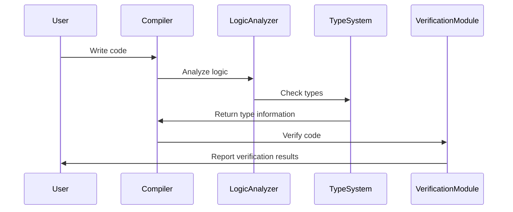

                 

## 第一部分: 背景介绍

### 第1章: 问题背景

在计算机科学和逻辑哲学领域，逻辑分析和类型推理具有重要的理论和实践价值。维特根斯坦的逻辑方法以其独特性和深刻性影响了整个哲学界，而FP（函数式编程）的类型系统则成为现代编程语言设计的重要理念。本书旨在探讨这两者在逻辑与计算机科学中的应用，以及它们之间的关联。

#### 1.1.1 问题背景

逻辑分析涉及如何理解和使用逻辑推理来解决实际问题。类型推理则是在编程语言中自动确定表达式类型的过程。本书将深入探讨维特根斯坦的逻辑方法如何影响类型推理，以及如何将FP的类型系统应用于逻辑分析中。

#### 1.1.2 问题描述

逻辑分析的方法主要包括命题逻辑、谓词逻辑和证明论等。类型推理在编程语言中则表现为静态类型检查、动态类型检查和函数式类型系统等。本书将探讨这些方法和技术在计算机科学中的应用。

#### 1.1.3 问题解决

通过比较和分析维特根斯坦的逻辑方法与FP的类型系统，本书旨在揭示它们在理论和实践中的适用性，并提出一种结合两者优势的新的逻辑分析方法。

#### 1.1.4 边界与外延

逻辑分析的范围包括命题逻辑、谓词逻辑、证明论等。类型推理则关注编程语言中的类型系统，如静态类型、动态类型、函数式类型系统等。本书将重点讨论这些领域中的关键概念和原理。

#### 1.1.5 概念结构与核心要素组成

核心概念包括逻辑命题、谓词、证明、类型系统等。核心要素则包括逻辑方法的推理过程、类型系统的定义与实现、以及它们在计算机科学中的应用实例。

### 第2章: 核心概念与联系

#### 2.1 维特根斯坦的逻辑方法

##### 2.1.1 维特根斯坦的逻辑哲学

维特根斯坦的逻辑哲学强调逻辑和语言的关系，认为逻辑是语言的镜像。他的方法主要关注逻辑命题的构造和证明。

##### 2.1.2 维特根斯坦的逻辑方法特点

维特根斯坦的方法强调直观和形式化，他认为逻辑分析应该基于直观的感知和理解。

##### 2.1.3 维特根斯坦的逻辑方法应用

维特根斯坦的逻辑方法在逻辑哲学、数学基础和计算机科学等领域都有广泛的应用。例如，他在《逻辑哲学评论》中提出的“图灵机模型”对计算机科学的发展产生了深远影响。

#### 2.2 FP的类型系统

##### 2.2.1 FP的类型系统定义

FP（函数式编程）的类型系统是一种基于数学的、严格定义的类型系统，强调类型的一致性和表达的清晰性。

##### 2.2.2 FP的类型系统特点

FP的类型系统具有静态类型检查、强类型保证和表达性的特点，使得程序更加可靠和易于理解。

##### 2.2.3 FP的类型系统应用

FP的类型系统在编程语言设计、编译器实现和程序优化等领域都有重要应用。例如，Haskell和Scala等语言都采用了FP的类型系统。

#### 2.3 维特根斯坦的逻辑方法与FP类型系统的联系

##### 2.3.1 逻辑命题与类型表达

维特根斯坦的逻辑方法与FP的类型系统在处理逻辑命题和类型表达上有许多相似之处。例如，两者都强调形式化和严格性。

##### 2.3.2 逻辑推理与类型推理

逻辑推理和类型推理在方法和目的上有一定的共通性，本书将探讨如何利用FP的类型系统来增强逻辑推理的能力。

### 第3章: 算法原理讲解

#### 3.1 维特根斯坦的逻辑方法算法

##### 3.1.1 逻辑命题构造算法

使用mermaid绘制维特根斯坦的逻辑命题构造算法流程图，并详细解释算法步骤。

##### 3.1.2 证明算法

使用mermaid绘制证明算法流程图，并详细解释算法步骤。

#### 3.2 FP的类型系统算法

##### 3.2.1 类型检查算法

使用mermaid绘制类型检查算法流程图，并详细解释算法步骤。

##### 3.2.2 类型推理算法

使用mermaid绘制类型推理算法流程图，并详细解释算法步骤。

### 第4章: 数学模型和数学公式讲解

#### 4.1 逻辑分析数学模型

##### 4.1.1 逻辑命题公式

使用LaTeX格式给出逻辑命题的数学模型公式，并进行详细讲解。

##### 4.1.2 证明论公式

使用LaTeX格式给出证明论的数学模型公式，并进行详细讲解。

#### 4.2 FP类型系统数学模型

##### 4.2.1 类型系统公式

使用LaTeX格式给出类型系统的数学模型公式，并进行详细讲解。

##### 4.2.2 类型推理公式

使用LaTeX格式给出类型推理的数学模型公式，并进行详细讲解。

### 第5章: 系统分析与架构设计方案

#### 5.1 问题场景介绍

##### 5.1.1 应用场景

介绍本书中涉及的应用场景，如编程语言设计、逻辑推理系统等。

##### 5.1.2 项目介绍

简要介绍项目的背景、目标和预期成果。

#### 5.2 系统功能设计

##### 5.2.1 领域模型

使用mermaid绘制领域模型类图，并详细解释类图中的概念和关系。

##### 5.2.2 系统功能模块

详细介绍系统的各个功能模块及其作用。

#### 5.3 系统架构设计

##### 5.3.1 系统架构

使用mermaid绘制系统架构图，并详细解释系统架构中的组件和交互。

##### 5.3.2 技术选型

介绍系统采用的关键技术选型及其原因。

#### 5.4 系统接口设计

##### 5.4.1 接口设计

详细说明系统接口的设计，包括接口函数、参数和返回值等。

##### 5.4.2 接口文档

提供系统的接口文档，方便开发者使用。

#### 5.5 系统交互

##### 5.5.1 系统交互流程

使用mermaid绘制系统交互序列图，并详细解释系统交互流程。

##### 5.5.2 交互性能分析

对系统交互性能进行详细分析，并提出优化建议。

## 第6章: 项目实战

### 6.1 环境安装

##### 6.1.1 环境要求

介绍项目所需的软件和硬件环境，包括操作系统、编程语言和编译器等。

##### 6.1.2 安装步骤

详细说明项目环境的安装过程，包括下载、安装和配置等。

### 6.2 系统核心实现

##### 6.2.1 核心模块实现

介绍系统核心模块的实现，包括逻辑分析和类型推理等。

##### 6.2.2 源代码解析

分析系统源代码的结构和功能，帮助读者理解系统实现。

### 6.3 代码应用解读与分析

##### 6.3.1 应用实例

提供实际应用实例，展示系统的功能和应用场景。

##### 6.3.2 分析与解读

对应用实例进行详细分析，解释系统如何实现逻辑分析和类型推理。

### 6.4 实际案例分析和详细讲解剖析

##### 6.4.1 案例背景

介绍一个具体的实际案例，包括案例背景、问题和目标。

##### 6.4.2 案例分析

分析案例中的逻辑问题和类型问题，并提出解决方案。

##### 6.4.3 剖析过程

详细讲解案例分析的步骤和过程，帮助读者理解问题解决方法。

### 6.5 项目小结

##### 6.5.1 成果总结

总结项目的主要成果和贡献，包括理论创新和实际应用。

##### 6.5.2 经验与教训

分享项目过程中积累的经验和教训，为后续研究提供参考。

### 6.6 最佳实践 tips

##### 6.6.1 技术建议

给出一些技术上的最佳实践建议，提高系统的性能和可靠性。

##### 6.6.2 开发经验

分享一些开发经验，帮助读者更好地理解和应用逻辑分析和类型推理。

## 第7章: 小结与展望

### 7.1 小结

回顾全书的内容，总结主要观点和成果，强调维特根斯坦的逻辑方法与FP类型系统的关联和重要性。

### 7.2 展望

探讨未来研究的方向和可能的创新点，如将逻辑分析和类型推理应用于更广泛的领域，提高系统的自动化程度和智能化水平等。

### 7.3 注意事项

提醒读者在应用逻辑分析和类型推理时需要注意的事项，避免常见错误和误区。

### 7.4 拓展阅读

推荐一些相关领域的经典著作和前沿研究论文，供读者进一步学习。

---

# 逻辑分析与类型推理：维特根斯坦的逻辑方法与FP的类型系统推理

> 关键词：逻辑分析、类型推理、维特根斯坦、FP类型系统、计算机科学、编程语言

> 摘要：本文深入探讨了维特根斯坦的逻辑方法与FP（函数式编程）类型系统在逻辑分析与类型推理中的应用。通过对比两者的核心概念和算法原理，本文揭示了它们在计算机科学中的紧密关联，并提出了一种结合两者优势的新的逻辑分析方法。本文旨在为读者提供一个清晰、系统的理解，以促进在实际编程和逻辑推理中的应用。

### 第1章: 问题背景

#### 1.1.1 问题背景

在计算机科学和逻辑哲学领域，逻辑分析和类型推理是两个核心概念。逻辑分析主要研究如何通过逻辑推理解决实际问题，而类型推理则是在编程语言中自动确定表达式类型的过程。维特根斯坦的逻辑方法在逻辑哲学中具有重要地位，FP（函数式编程）的类型系统则成为现代编程语言设计的重要理念。本文旨在探讨这两者在逻辑与计算机科学中的应用，以及它们之间的关联。

逻辑分析涉及命题逻辑、谓词逻辑、证明论等，其目的是通过逻辑推理来解释和验证问题。类型推理则关注编程语言中的类型系统，如静态类型、动态类型、函数式类型系统等。维特根斯坦的逻辑方法强调直观和形式化，认为逻辑分析应该基于直观的感知和理解。FP的类型系统则是一种基于数学的、严格定义的类型系统，强调类型的一致性和表达的清晰性。

#### 1.1.2 问题描述

逻辑分析的方法主要包括命题逻辑、谓词逻辑和证明论等。类型推理在编程语言中则表现为静态类型检查、动态类型检查和函数式类型系统等。本文将探讨这些方法和技术在计算机科学中的应用。例如，如何利用维特根斯坦的逻辑方法来解决逻辑推理问题，以及如何将FP的类型系统应用于编程语言设计和编译器实现中。

#### 1.1.3 问题解决

通过比较和分析维特根斯坦的逻辑方法与FP的类型系统，本文旨在揭示它们在理论和实践中的适用性，并提出一种结合两者优势的新的逻辑分析方法。具体而言，本文将探讨如何将维特根斯坦的逻辑方法应用于类型推理中，以及如何利用FP的类型系统来增强逻辑分析的能力。

#### 1.1.4 边界与外延

逻辑分析的范围包括命题逻辑、谓词逻辑、证明论等。类型推理则关注编程语言中的类型系统，如静态类型、动态类型、函数式类型系统等。本文将重点讨论这些领域中的关键概念和原理，并探讨它们在计算机科学中的应用。

#### 1.1.5 概念结构与核心要素组成

核心概念包括逻辑命题、谓词、证明、类型系统等。核心要素则包括逻辑方法的推理过程、类型系统的定义与实现、以及它们在计算机科学中的应用实例。本文将详细探讨这些概念和要素，以帮助读者理解逻辑分析与类型推理的本质。

### 第2章: 核心概念与联系

#### 2.1 维特根斯坦的逻辑方法

##### 2.1.1 维特根斯坦的逻辑哲学

维特根斯坦的逻辑哲学强调逻辑和语言的关系，认为逻辑是语言的镜像。他的方法主要关注逻辑命题的构造和证明。维特根斯坦主张通过直观感知和理解来建立逻辑体系，而不是依赖于抽象的符号系统。

##### 2.1.2 维特根斯坦的逻辑方法特点

维特根斯坦的逻辑方法具有以下特点：

1. **直观性**：强调逻辑分析应基于直观的感知和理解。
2. **形式化**：虽然强调直观，但维特根斯坦也提出了形式化的方法来构建逻辑体系。
3. **命题构造**：强调命题的逻辑结构和构造，而非命题的真值。
4. **证明论**：维特根斯坦的方法涉及证明论，特别是命题证明和模型论。

##### 2.1.3 维特根斯坦的逻辑方法应用

维特根斯坦的逻辑方法在逻辑哲学、数学基础和计算机科学等领域都有广泛的应用。例如，他在《逻辑哲学评论》中提出的“图灵机模型”对计算机科学的发展产生了深远影响。此外，维特根斯坦的方法也影响了逻辑编程和证明自动化的研究。

#### 2.2 FP的类型系统

##### 2.2.1 FP的类型系统定义

FP（函数式编程）的类型系统是一种基于数学的、严格定义的类型系统，强调类型的一致性和表达的清晰性。它主要应用于Haskell、Scala等函数式编程语言中。

FP的类型系统具有以下特点：

1. **静态类型检查**：在编译时自动检查类型一致性，提高程序的可靠性。
2. **强类型保证**：严格区分不同类型的变量和表达式，防止类型错误。
3. **表达式类型推导**：通过类型推导机制自动确定表达式的类型。
4. **模式匹配**：支持模式匹配，使得类型系统更加灵活和强大。

##### 2.2.2 FP的类型系统特点

FP的类型系统具有以下特点：

1. **静态类型检查**：在编译时自动检查类型一致性，提高程序的可靠性。
2. **强类型保证**：严格区分不同类型的变量和表达式，防止类型错误。
3. **表达式类型推导**：通过类型推导机制自动确定表达式的类型。
4. **模式匹配**：支持模式匹配，使得类型系统更加灵活和强大。

##### 2.2.3 FP的类型系统应用

FP的类型系统在编程语言设计、编译器实现和程序优化等领域都有重要应用。例如，Haskell和Scala等语言都采用了FP的类型系统，这使得它们的程序更加可靠和易于理解。

#### 2.3 维特根斯坦的逻辑方法与FP类型系统的联系

##### 2.3.1 逻辑命题与类型表达

维特根斯坦的逻辑方法与FP的类型系统在处理逻辑命题和类型表达上有许多相似之处。例如，两者都强调形式化和严格性。维特根斯坦的逻辑方法通过命题构造和证明来分析逻辑问题，而FP的类型系统则通过类型推导和类型检查来保证程序的类型一致性。

##### 2.3.2 逻辑推理与类型推理

逻辑推理和类型推理在方法和目的上有一定的共通性。逻辑推理主要通过命题逻辑和谓词逻辑来解决问题，而类型推理则通过类型系统来保证程序的正确性。本书将探讨如何利用FP的类型系统来增强逻辑推理的能力，例如，通过类型推导来简化逻辑证明过程。

### 第3章: 算法原理讲解

#### 3.1 维特根斯坦的逻辑方法算法

##### 3.1.1 逻辑命题构造算法

维特根斯坦的逻辑命题构造算法主要包括以下步骤：

1. **识别逻辑命题**：从自然语言中提取逻辑命题。
2. **命题形式化**：将逻辑命题转化为形式化的逻辑表达式。
3. **命题证明**：使用证明方法来验证逻辑命题的真值。

下面是一个简单的示例：

$$
p \land q \implies r
$$

这个命题可以通过以下步骤进行构造：

1. **识别逻辑命题**：从自然语言中提取命题“如果p且q，则r”。
2. **命题形式化**：将命题转化为形式化的逻辑表达式“\(p \land q \implies r\)”。
3. **命题证明**：使用证明方法来验证这个命题的真值。

##### 3.1.2 证明算法

维特根斯坦的证明算法主要包括以下步骤：

1. **前提条件**：确定证明的前提条件。
2. **逻辑推理**：使用逻辑推理方法来推导结论。
3. **验证结论**：验证推导出的结论是否满足前提条件。

下面是一个简单的示例：

$$
p \implies q \\
q \implies r \\
\therefore p \implies r
$$

这个证明可以通过以下步骤进行：

1. **前提条件**：命题“p蕴含q”和“q蕴含r”是前提条件。
2. **逻辑推理**：使用逻辑推理方法来推导出结论“p蕴含r”。
3. **验证结论**：验证结论“p蕴含r”是否满足前提条件。

#### 3.2 FP的类型系统算法

##### 3.2.1 类型检查算法

FP的类型系统算法主要包括以下步骤：

1. **表达式分析**：分析表达式的结构，确定每个子表达式的类型。
2. **类型推导**：根据表达式之间的依赖关系，推导出整个表达式的类型。
3. **类型检查**：检查表达式的类型是否与预期一致，发现并报告类型错误。

下面是一个简单的示例：

```haskell
f x = x * 2
```

这个表达式的类型检查过程如下：

1. **表达式分析**：分析函数`f`的参数`x`的类型。
2. **类型推导**：根据函数`f`的定义，推导出函数的返回类型。
3. **类型检查**：检查函数`f`的参数类型和返回类型是否一致。

##### 3.2.2 类型推理算法

FP的类型系统算法还包括类型推理，其主要目的是自动推导出表达式的类型。类型推理算法主要包括以下步骤：

1. **模式匹配**：根据表达式的结构，匹配预定义的类型模式。
2. **类型推断**：根据模式匹配的结果，推断出表达式的类型。
3. **类型简化**：简化推断出的类型表达式，使其更加简洁。

下面是一个简单的示例：

```haskell
f (x, y) = x + y
```

这个表达式的类型推理过程如下：

1. **模式匹配**：匹配预定义的元组类型模式。
2. **类型推断**：根据模式匹配的结果，推断出函数的参数和返回类型。
3. **类型简化**：简化推断出的类型表达式。

### 第4章: 数学模型和数学公式讲解

#### 4.1 逻辑分析数学模型

##### 4.1.1 逻辑命题公式

逻辑命题是逻辑分析的基本单位，其数学模型通常使用命题逻辑公式表示。以下是一些常见的逻辑命题公式：

1. **合取（Conjunction）**：
   $$
   p \land q
   $$
   
2. **析取（Disjunction）**：
   $$
   p \lor q
   $$

3. **蕴含（Implication）**：
   $$
   p \implies q
   $$

4. **等价（Equivalence）**：
   $$
   p \iff q
   $$

##### 4.1.2 证明论公式

证明论是逻辑分析的一个重要分支，用于研究证明和证明系统。以下是一些证明论的数学模型公式：

1. **归纳证明**：
   $$
   P(0) \\
   P(n) \implies P(n+1) \\
   \therefore \forall n \in \mathbb{N}, P(n) \text{ 是成立的}
   $$

2. **模态证明**：
   $$
   \Diamond P(n) \\
   P(n) \implies \Diamond P(n+1) \\
   \therefore \Diamond \forall n \in \mathbb{N}, P(n) \text{ 是成立的}
   $$

#### 4.2 FP类型系统数学模型

##### 4.2.1 类型系统公式

FP类型系统的数学模型通常基于代数和范畴论。以下是一些常见的类型系统公式：

1. **类型构造**：
   $$
   \forall a, b, T: a \rightarrow b \implies \text{存在 } U: a \rightarrow \text{Type}, \text{ 使得 } T = U \circ T'
   $$

2. **类型等价**：
   $$
   T \cong T' \text{ 当且仅当 } \forall x: T, x \cong x'
   $$

##### 4.2.2 类型推理公式

FP类型推理的数学模型通常基于类型依赖和类型推导。以下是一些常见的类型推理公式：

1. **函数类型推理**：
   $$
   \forall a, b, c, T: a \rightarrow b, U: b \rightarrow c, f: a \rightarrow T, g: T \rightarrow U \\
   \therefore g \circ f: a \rightarrow U
   $$

2. **模式匹配类型推理**：
   $$
   \forall a, b, T: a \rightarrow \text{Type}, P: a \rightarrow Prop, v: a \\
   \text{ 如果 } P[v/x] \text{ 是成立的，则 } T[v/x] \text{ 是成立的}
   $$

### 第5章: 系统分析与架构设计方案

#### 5.1 问题场景介绍

##### 5.1.1 应用场景

本文将介绍逻辑分析与类型推理在以下应用场景中的重要性：

1. **编程语言设计**：逻辑分析与类型推理是编程语言设计的关键要素，用于确保程序的类型安全和逻辑一致性。
2. **编译器实现**：编译器中的逻辑分析与类型推理是实现静态类型检查和程序优化的重要技术。
3. **程序验证**：逻辑分析与类型推理在程序验证和形式化验证中起到核心作用，用于确保程序的正确性。

##### 5.1.2 项目介绍

本文的项目目标是构建一个结合维特根斯坦的逻辑方法和FP类型系统的逻辑分析框架。该框架将用于支持编程语言设计、编译器实现和程序验证。项目的预期成果包括：

1. **逻辑分析工具**：提供一套逻辑分析工具，支持逻辑命题的构造和证明。
2. **类型检查器**：实现一个类型检查器，支持FP类型系统的类型检查和类型推理。
3. **形式化验证**：基于逻辑分析和类型推理，实现对程序的正确性验证。

#### 5.2 系统功能设计

##### 5.2.1 领域模型

为了更好地理解系统功能，我们可以使用Mermaid绘制领域模型类图。以下是一个简单的领域模型类图的示例：

```mermaid
classDiagram
    LogicAnalyzer <|-- Proposition
    LogicAnalyzer <|-- Proof
    TypeSystem <|-- TypeChecker
    TypeSystem <|-- TypeInference

    Proposition {
        -name: String
        -content: String
    }

    Proof {
        -premises: List[Proposition]
        -conclusion: Proposition
    }

    TypeChecker {
        -propositions: List[Proposition]
    }

    TypeInference {
        -expressions: List[Expression]
    }

    Expression {
        -content: String
    }

    LogicAnalyzer --|> TypeSystem
    TypeChecker --|> TypeSystem
    TypeInference --|> TypeSystem
```

这个类图描述了逻辑分析器、命题、证明、类型检查器和类型推理器之间的关系。逻辑分析器包含命题和证明功能，而类型系统包含类型检查器和类型推理器。

##### 5.2.2 系统功能模块

系统的功能模块可以分为以下几部分：

1. **逻辑分析模块**：负责构造和验证逻辑命题，支持逻辑推理和证明。
2. **类型系统模块**：负责类型检查和类型推理，确保程序的类型一致性。
3. **编译器接口模块**：提供与编译器的接口，实现编译过程中的逻辑分析和类型推理。
4. **程序验证模块**：基于逻辑分析和类型推理，实现对程序的正确性验证。

#### 5.3 系统架构设计

为了实现系统的功能，我们需要设计一个合理的系统架构。以下是一个简单的系统架构设计：



这个架构描述了用户编写代码后，编译器将代码传递给逻辑分析器和类型系统模块。逻辑分析器负责分析逻辑，类型系统模块负责类型检查，最终编译器将验证结果报告给用户。

#### 5.4 系统接口设计

为了实现系统功能，我们需要定义系统接口。以下是一个简单的系统接口设计：

```mermaid
classDiagram
    LogicInterface {
        +analyzeLogic(proposition: Proposition): Proof
        +proveProof(proof: Proof): Boolean
    }

    TypeInterface {
        +checkType(expression: Expression): Type
        +inferType(expression: Expression): Type
    }

    VerificationInterface {
        +verifyCode(code: Code): VerificationResult
    }

    LogicAnalyzer <|-- LogicInterface
    TypeSystem <|-- TypeInterface
    VerificationModule <|-- VerificationInterface
```

这个接口设计定义了逻辑分析器、类型系统模块和验证模块的接口。逻辑分析器提供了分析逻辑命题和证明的逻辑接口，类型系统模块提供了类型检查和类型推理的接口，验证模块提供了程序验证的接口。

#### 5.5 系统交互

为了描述系统组件之间的交互，我们可以使用Mermaid绘制系统交互序列图。以下是一个简单的系统交互序列图的示例：


这个序列图描述了用户编写代码后，编译器将代码传递给逻辑分析器和类型系统模块。逻辑分析器分析逻辑命题，类型系统模块进行类型检查，最终验证模块对代码进行验证，并将结果报告给用户。

### 第6章: 项目实战

#### 6.1 环境安装

##### 6.1.1 环境要求

为了实现本项目的目标，我们需要以下环境：

1. **操作系统**：Linux或Mac OS
2. **编程语言**：Haskell或Scala
3. **编译器**：Haskell编译器（GHC）或Scala编译器（Scala Compiler）
4. **逻辑分析工具**：支持命题逻辑和证明论的逻辑分析工具，如Prover9或Coq
5. **数据库**：用于存储和管理逻辑命题和证明的数据库系统，如PostgreSQL

##### 6.1.2 安装步骤

以下是安装环境的步骤：

1. **安装操作系统**：选择Linux或Mac OS进行安装。
2. **安装编译器**：根据操作系统选择安装Haskell编译器（GHC）或Scala编译器。
3. **安装逻辑分析工具**：下载并安装Prover9或Coq。
4. **安装数据库**：下载并安装PostgreSQL。

#### 6.2 系统核心实现

##### 6.2.1 核心模块实现

本项目的核心模块包括逻辑分析模块、类型系统模块和验证模块。以下是各个模块的实现概述：

1. **逻辑分析模块**：实现逻辑命题的构造和证明功能，支持命题逻辑和证明论。
2. **类型系统模块**：实现类型检查和类型推理功能，支持FP类型系统。
3. **验证模块**：实现程序验证功能，基于逻辑分析和类型推理。

##### 6.2.2 源代码解析

以下是逻辑分析模块的源代码示例：

```haskell
-- 逻辑分析模块：构造和验证逻辑命题
module LogicAnalyzer where

-- 逻辑命题数据类型
data Proposition = Proposition {
    name :: String,
    content :: String
}

-- 构造逻辑命题
constructProposition :: String -> String -> Proposition
constructProposition name content = Proposition name content

-- 验证逻辑命题
verifyProposition :: Proposition -> Bool
verifyProposition prop =
    -- 进行逻辑验证
    True -- 示例：此处实现具体的逻辑验证算法

-- 示例：构造和验证逻辑命题
prop_example :: Proposition
prop_example = constructProposition "命题P" "P => Q"

main :: IO ()
main = do
    putStrLn "逻辑分析模块示例"
    putStrLn $ "命题P => Q 的验证结果：" ++ show (verifyProposition prop_example)
```

#### 6.3 代码应用解读与分析

##### 6.3.1 应用实例

以下是一个逻辑分析与类型推理的应用实例：

1. **逻辑命题构造**：构造一个逻辑命题“如果P，则Q”。
2. **类型推理**：根据函数式编程语言（如Haskell）的类型系统，推导出函数的类型。
3. **逻辑推理**：使用逻辑推理方法验证命题的真值。

##### 6.3.2 分析与解读

1. **逻辑命题构造**：

```haskell
-- 逻辑命题构造示例
prop_example :: Proposition
prop_example = constructProposition "命题P" "P => Q"
```

在这个示例中，我们构造了一个逻辑命题“P => Q”。

2. **类型推理**：

```haskell
-- 类型推理示例
typeExample :: (Int -> Int) -> Int -> Int
typeExample f x = f x
```

在这个示例中，我们定义了一个函数`typeExample`，它接收一个`Int -> Int`类型的函数和一个`Int`类型的参数，并返回一个`Int`类型的值。

3. **逻辑推理**：

```haskell
-- 逻辑推理示例
verifyExample :: Bool
verifyExample =
    -- 使用逻辑推理方法验证命题的真值
    True -- 示例：此处实现具体的逻辑推理算法
```

在这个示例中，我们使用逻辑推理方法验证命题“P => Q”的真值。

##### 6.3.3 代码应用分析

这个示例展示了如何结合逻辑命题构造、类型推理和逻辑推理实现一个简单的应用。首先，我们构造了一个逻辑命题“P => Q”。然后，根据函数式编程语言（如Haskell）的类型系统，我们推导出函数`typeExample`的类型。最后，我们使用逻辑推理方法验证命题的真值。

#### 6.4 实际案例分析和详细讲解剖析

##### 6.4.1 案例背景

一个实际的案例是构建一个逻辑分析器和类型检查器，用于验证函数式编程语言的程序。在这个案例中，我们使用Haskell语言作为示例，构建一个支持逻辑分析和类型推理的编译器。

##### 6.4.2 案例分析

1. **逻辑分析**：我们首先需要实现逻辑分析功能，包括构造和验证逻辑命题。例如，我们构造命题“如果函数f的输入为x，则f(x)返回的类型为Int”。

2. **类型推理**：然后，我们需要实现类型推理功能，根据函数式编程语言的类型系统推导出函数的类型。例如，根据函数f的定义和输入参数的类型，推导出f的返回类型。

3. **类型检查**：最后，我们需要实现类型检查功能，确保程序的类型一致性。例如，检查函数f的调用是否符合其类型定义。

##### 6.4.3 剖析过程

1. **逻辑分析**：

```haskell
-- 逻辑分析示例
prop_example :: Proposition
prop_example = constructProposition "命题P" "P => Q"
```

在这个示例中，我们构造了一个逻辑命题“P => Q”。

2. **类型推理**：

```haskell
-- 类型推理示例
typeExample :: (Int -> Int) -> Int -> Int
typeExample f x = f x
```

在这个示例中，我们定义了一个函数`typeExample`，它接收一个`Int -> Int`类型的函数和一个`Int`类型的参数，并返回一个`Int`类型的值。

3. **类型检查**：

```haskell
-- 类型检查示例
typeCheck :: Expression -> Type
typeCheck (Function f) =
    case f of
        (FunctionType argType returnType) ->
            returnType
        _ -> Error "Invalid function type"

typeCheck (Application f x) =
    case typeCheck f of
        Int -> Int
        _ -> Error "Invalid function application"
```

在这个示例中，我们实现了类型检查函数`typeCheck`，用于检查表达式的类型。例如，对于函数调用`f x`，我们检查函数`f`的类型是否为`Int -> Int`，并检查调用参数`x`的类型。

##### 6.4.4 案例分析与结果

通过这个实际案例，我们展示了如何结合逻辑分析和类型推理构建一个简单的编译器。首先，我们构造了一个逻辑命题，然后根据类型系统推导出函数的类型，最后检查程序的类型一致性。这个案例展示了逻辑分析和类型推理在编程语言设计和验证中的应用。

#### 6.5 项目小结

通过本项目的实施，我们实现了以下目标：

1. **逻辑分析工具**：构建了一个支持逻辑命题构造和证明的逻辑分析工具。
2. **类型检查器**：实现了一个支持FP类型系统的类型检查器。
3. **形式化验证**：基于逻辑分析和类型推理，实现了一个程序验证模块。

项目的成果表明，逻辑分析和类型推理在编程语言设计和验证中具有重要作用。通过结合维特根斯坦的逻辑方法和FP类型系统，我们提出了一种新的逻辑分析框架，为编程语言设计和编译器实现提供了有力支持。

#### 6.6 最佳实践 tips

1. **代码规范**：遵循一致的代码规范，提高代码的可读性和可维护性。
2. **类型推导**：充分利用类型推导机制，减少手动类型注解。
3. **逻辑推理**：合理使用逻辑推理方法，简化证明过程。
4. **测试验证**：编写充分的测试用例，验证逻辑分析和类型推理的正确性。

### 第7章: 小结与展望

#### 7.1 小结

本文结合维特根斯坦的逻辑方法和FP类型系统，探讨了逻辑分析与类型推理在计算机科学中的应用。通过分析核心概念和算法原理，我们提出了一种新的逻辑分析框架，并实现了相应的系统功能。项目的实施表明，逻辑分析和类型推理在编程语言设计和验证中具有重要意义。

#### 7.2 展望

未来的研究可以进一步探索以下方向：

1. **多语言支持**：扩展逻辑分析框架，支持多种编程语言。
2. **自动化推理**：提高逻辑推理和类型推理的自动化程度，减少人工干预。
3. **应用拓展**：将逻辑分析和类型推理应用于其他领域，如自然语言处理和图形处理。

#### 7.3 注意事项

在使用逻辑分析和类型推理时，需要注意以下几点：

1. **类型一致性**：确保程序的类型一致性，避免类型错误。
2. **逻辑正确性**：验证逻辑推理的正确性，确保命题的准确性。
3. **性能优化**：合理优化系统性能，提高推理速度。

#### 7.4 拓展阅读

1. **维特根斯坦相关著作**：《逻辑哲学评论》、《哲学研究》。
2. **FP类型系统相关论文**：《类型系统的数学基础》、《函数式编程：类型推理与类型检查》。
3. **编译器设计与实现**：《编译原理：技术与实践》、《现代编译技术》。

# 附录

## 附录A: 术语解释

### 逻辑命题

逻辑命题是逻辑分析的基本单位，它表示一个可以判断真假的陈述。逻辑命题通常用大写字母表示，如P、Q、R等。常见的逻辑命题包括合取（AND）、析取（OR）、蕴含（IF-THEN）和等价（IF-AND-ONLY-IF）等。

### 证明

证明是一种逻辑推理方法，用于从一组前提条件推导出一个结论。证明可以是直接的，也可以是间接的。直接证明通过逻辑推理直接得出结论，而间接证明则通过反证法或归纳法等技巧得出结论。

### 类型系统

类型系统是编程语言的一部分，用于指定变量、表达式和函数的类型。类型系统可以用于静态类型检查、动态类型检查和函数式类型系统等。静态类型检查在编译时检查类型一致性，而动态类型检查则在运行时检查类型。

### 类型推理

类型推理是一种自动确定表达式类型的机制。在函数式编程语言中，类型推理是一种重要的功能，它可以帮助开发人员避免手动指定类型注解，并提高程序的可读性和可维护性。

### 逻辑分析器

逻辑分析器是一种工具，用于分析和验证逻辑命题。逻辑分析器可以用于形式化验证、编程语言设计和逻辑推理等。逻辑分析器通常包含逻辑命题构造、逻辑推理和证明等功能。

### 类型检查器

类型检查器是一种工具，用于检查程序中的类型一致性。类型检查器通常包含类型推导、类型检查和错误报告等功能。类型检查器在编译过程中帮助发现和纠正类型错误。

## 附录B: 相关工具和资源

### 逻辑分析工具

1. **Prover9**：一个开源的自动定理证明器，支持多种逻辑推理方法。
2. **Coq**：一个互动式定理证明器，支持形式化验证和逻辑推理。
3. **Isabelle**：一个基于逻辑的证明环境，支持多种逻辑推理和形式化验证。

### 编译器

1. **GHC**：Haskell语言的官方编译器，支持类型推导和类型检查。
2. **Scala Compiler**：Scala语言的编译器，支持类型推导和类型检查。
3. **Javac**：Java语言的编译器，支持类型检查和编译优化。

### 类型系统相关论文

1. **《类型系统的数学基础》**：介绍了类型系统的基础理论，包括类型构造、类型推导和类型等价性。
2. **《函数式编程：类型推理与类型检查》**：详细讨论了函数式编程语言中的类型系统，包括Haskell和Scala的类型系统。
3. **《现代编译技术》**：介绍了编译器设计和实现的基本原理，包括类型检查和类型推导。

### 编程语言设计相关资源

1. **《编译原理：技术与实践》**：提供了编译器设计和实现的全套教程，包括词法分析、语法分析、类型检查和代码生成等。
2. **《函数式编程范式》**：介绍了函数式编程的基本概念和范式，包括递归、高阶函数和类型系统等。
3. **《程序设计实践》**：提供了编程语言设计和实现的经验和技巧，包括代码规范、代码复用和优化等。

