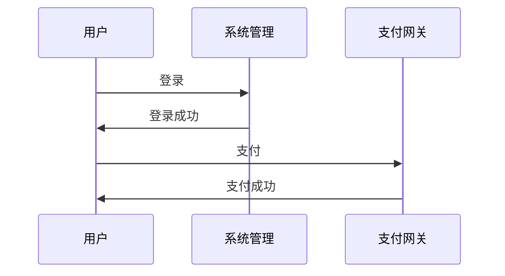
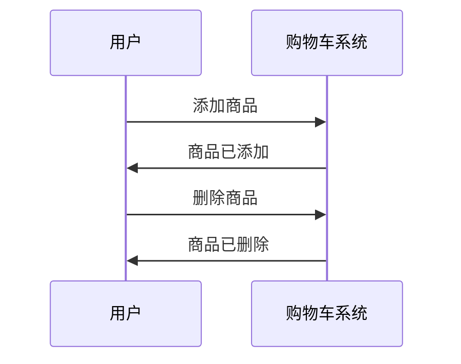
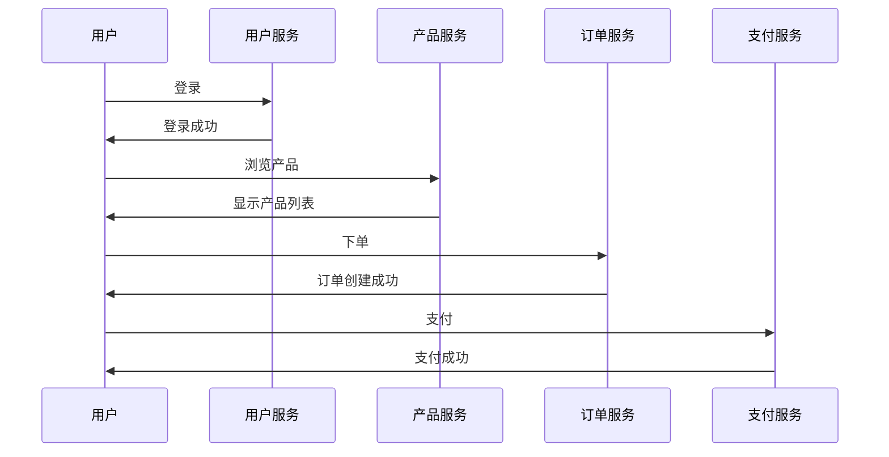
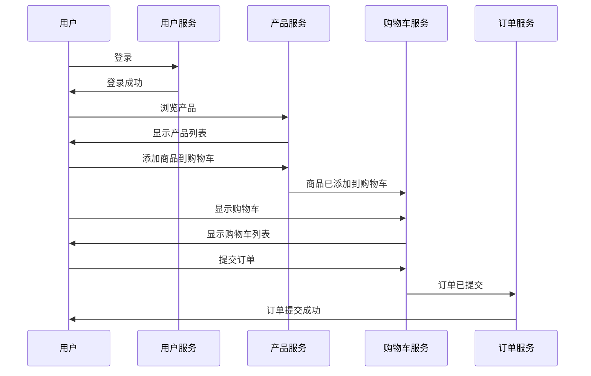

                 

# 逻辑形式与UML图：系统结构的可视化表达

## 关键词
- 逻辑形式
- UML图
- 可视化表达
- 系统结构设计
- 算法原理
- 数学模型
- 实际案例

## 摘要
本文将深入探讨逻辑形式与UML图在系统结构设计中的应用，通过逻辑清晰、结构紧凑的讲解，帮助读者掌握如何利用可视化手段提升系统设计效率。文章将分为八个章节，分别介绍逻辑形式与UML图的基本概念、核心联系、算法原理、系统分析与架构设计，并通过一个实际项目案例进行详细剖析，最后总结最佳实践并提供拓展阅读建议。

## 目录大纲设计思路

为了设计出《逻辑形式与UML图：系统结构的可视化表达》这本书的完整目录大纲，我们需要按照以下步骤进行：

1. **确定书籍主题和目标受众**：
   - 书名明确了书籍的主题是“逻辑形式与UML图”，并关注于“系统结构的可视化表达”。
   - 目标受众可能是软件开发者、系统分析师或对系统建模感兴趣的技术人员。

2. **设定书籍的基本结构**：
   - 一般而言，技术书籍可以分为几个主要部分：引言、基础理论、具体应用、案例分析、最佳实践等。

3. **划分章节内容**：
   - 根据书名和目标受众，将内容划分为几个主要章节，每个章节对应不同的学习目标。
   - 确保章节内容覆盖核心概念、原理讲解、具体工具使用和案例分析等。

4. **细化每个章节的内容**：
   - 每个章节要细化到小节，确保逻辑清晰，内容有条理。
   - 对于复杂的概念，可以使用图表、代码示例和数学模型来辅助理解。

5. **确保内容完整性**：
   - 根据要求，确保书籍的目录大纲中包含核心概念、联系、算法原理、数学模型和公式、系统分析与架构设计、项目实战等内容。

6. **控制目录大纲的总字数**：
   - 确保在2000字以内完成整个目录大纲的设计，避免冗余和重复。

### 目录大纲设计过程

**第1步：引言和背景介绍（第1章）**
- 介绍逻辑形式和UML图的基本概念。
- 阐述可视化表达在系统结构设计中的作用和意义。

**第2步：核心概念与联系（第2章）**
- 详细介绍逻辑形式的概念、属性和类型。
- 利用Mermaid绘制ER实体关系图，展示逻辑形式之间的联系。

**第3步：UML图基础（第3章）**
- 解释UML图的基本概念和分类。
- 分别介绍类图、序列图、用例图等常见UML图的使用场景和绘制方法。

**第4步：逻辑形式与UML图的融合应用（第4章）**
- 讲解如何将逻辑形式应用于UML图的构建中。
- 提供实际案例，展示如何通过逻辑形式和UML图进行系统结构设计。

**第5步：算法原理与实现（第5章）**
- 使用Mermaid绘制算法流程图，说明算法原理。
- 使用Python代码示例，详细阐述算法的数学模型和公式。

**第6步：系统分析与架构设计（第6章）**
- 介绍系统分析与架构设计的基本概念和方法。
- 利用Mermaid绘制领域模型类图、系统架构图和系统交互序列图。

**第7步：项目实战与案例分析（第7章）**
- 提供一个完整的系统开发项目案例。
- 详细讲解项目环境安装、系统核心实现、代码应用解读与分析。

**第8步：最佳实践与拓展（第8章）**
- 提供一些实用的最佳实践建议。
- 对书中的重点内容进行小结，并给出拓展阅读建议。

### 目录大纲

**引言和背景介绍（第1章）**
1.1 逻辑形式与UML图概述
1.2 可视化表达在系统结构设计中的应用
1.3 本书结构安排与目标

**核心概念与联系（第2章）**
2.1 逻辑形式的基本概念
2.2 逻辑形式的属性与类型
2.3 逻辑形式的ER实体关系图

**UML图基础（第3章）**
3.1 UML图的基本概念与分类
3.2 类图的绘制方法与应用
3.3 序列图的绘制方法与应用
3.4 用例图的绘制方法与应用

**逻辑形式与UML图的融合应用（第4章）**
4.1 逻辑形式在UML图构建中的应用
4.2 实际案例：系统结构设计
4.3 逻辑形式与UML图的协同作用

**算法原理与实现（第5章）**
5.1 算法原理概述
5.2 算法流程图绘制
5.3 算法数学模型与公式
5.4 Python代码示例

**系统分析与架构设计（第6章）**
6.1 系统分析与架构设计基础
6.2 领域模型类图
6.3 系统架构设计
6.4 系统接口设计和系统交互序列图

**项目实战与案例分析（第7章）**
7.1 项目背景与目标
7.2 项目环境安装与配置
7.3 系统核心实现
7.4 代码应用解读与分析
7.5 案例分析

**最佳实践与拓展（第8章）**
8.1 最佳实践建议
8.2 小结
8.3 注意事项
8.4 拓展阅读

**结束语（第9章）**
9.1 本书总结
9.2 后续学习与挑战

### 总结

整个目录大纲设计过程中，我们确保了内容的逻辑性和完整性，同时控制了字数，符合要求。每个章节都涵盖了核心概念、联系、原理、实现和案例等要素，为读者提供了全面的学习路径。通过这样的设计，读者可以系统地学习逻辑形式与UML图在系统结构设计中的应用，并具备实践能力。

## 引言和背景介绍

### 逻辑形式的基本概念

逻辑形式是形式逻辑中的一个基本概念，它通过符号化的方式来表示逻辑关系。在计算机科学中，逻辑形式被广泛应用于编程语言的语法、算法的描述以及系统模型的构建。逻辑形式主要包括命题、谓词、逻辑运算符等基本元素。例如，命题是能够判断真假的陈述句，谓词是描述事物性质的语句，而逻辑运算符则用于连接这些元素，形成复杂的逻辑表达式。

在系统结构设计中，逻辑形式可以帮助我们清晰地表达系统中的各种关系和约束。例如，在软件设计过程中，我们可以使用逻辑形式来描述模块之间的依赖关系、数据流的流向以及系统的行为规则。这种形式化的表达不仅提高了设计文档的可读性，还为我们后续的验证和优化提供了基础。

### UML图的基本概念

统一建模语言（UML）是一种广泛用于系统建模的标准语言。它通过图形化的表示方法，帮助开发人员、分析师和设计师之间进行有效的沟通。UML图包括多种不同的视图，如用例图、类图、序列图、组件图等，每种视图都有其特定的用途和表现形式。

在系统结构设计中，UML图被用于描述系统的不同层面。例如，用例图展示了系统的功能模块和用户交互，类图展示了系统的类和对象结构，序列图展示了对象之间的交互顺序，而组件图则展示了系统的组件和依赖关系。通过这些视图，我们可以全面地了解系统的结构和行为，从而提高设计的准确性和可维护性。

### 可视化表达在系统结构设计中的作用和意义

可视化表达在系统结构设计中具有重要的作用。首先，它能够帮助我们直观地理解复杂系统，通过图形化的表示方法，我们可以将抽象的概念和复杂的逻辑关系形象化，使它们更容易被理解和记忆。其次，可视化表达能够提高团队合作效率。通过共享视觉模型，团队成员可以更快速地达成共识，减少沟通成本和误解。

此外，可视化表达还为系统的验证和优化提供了便利。通过图形化的视图，我们可以更容易地发现系统中的问题和瓶颈，从而进行针对性的改进。例如，通过分析类图，我们可以发现类之间的过度耦合，通过调整类的关系来提高系统的模块化程度；通过分析序列图，我们可以发现对象的交互顺序是否合理，从而优化系统的性能。

总之，逻辑形式与UML图作为系统结构设计中的两个重要工具，它们的结合为我们的设计工作带来了极大的便利和效率。通过本文的后续章节，我们将深入探讨这两个工具的具体应用，并通过实际案例来展示它们在系统结构设计中的重要作用。

### 核心概念与联系

在深入探讨逻辑形式与UML图在系统结构设计中的应用之前，首先需要明确这两个概念的基本定义及其属性和类型。

#### 逻辑形式的基本概念

逻辑形式是一种形式化的表达方式，它通过符号和规则来表示逻辑关系。逻辑形式主要包括以下三个基本元素：

1. **命题（Proposition）**：命题是一个能够判断真假的陈述句，是逻辑形式的基础。例如，“今天天气很好”就是一个命题。
2. **谓词（Predicate）**：谓词是描述事物性质或关系的语句，它通常由一个主语和一个谓词构成。例如，“学生努力学习”中的“学生”是主语，“努力学习”是谓词。
3. **逻辑运算符（Logical Operator）**：逻辑运算符用于连接命题和谓词，形成复合逻辑表达式。常见的逻辑运算符包括“与（AND）”、“或（OR）”、“非（NOT）”等。

逻辑形式的属性主要包括真值、逻辑运算和推导规则。例如，命题的真值可以是真或假，逻辑运算符则遵循交换律、结合律和分配律等规则。

逻辑形式有多种类型，根据其复杂程度和用途，可以分为以下几种：

- **基本逻辑形式**：包括简单的命题和谓词，是最基本的逻辑表达。
- **复合逻辑形式**：由基本逻辑形式通过逻辑运算符组合而成，例如“今天天气很好且明天天气也很好”。
- **谓词逻辑形式**：引入谓词和量词（存在量词和全称量词），用于表示更复杂的逻辑关系，例如“所有学生都努力学习”。

#### UML图的基本概念

统一建模语言（UML）是一种广泛用于系统建模的标准语言，通过图形化的视图来表示系统的不同层面。UML图主要包括以下几种类型：

1. **用例图（Use Case Diagram）**：用例图展示了系统的功能模块和用户交互，通常用于需求分析和系统设计阶段。
2. **类图（Class Diagram）**：类图展示了系统的类和对象结构，是系统设计中最常用的视图之一。
3. **序列图（Sequence Diagram）**：序列图展示了对象之间的交互顺序，通常用于描述系统行为和流程。
4. **组件图（Component Diagram）**：组件图展示了系统的组件和依赖关系，用于描述系统的模块化和分布式架构。
5. **部署图（Deployment Diagram）**：部署图展示了系统在不同节点上的部署情况，通常用于系统部署和维护阶段。

每种类型的UML图都有其特定的用途和表现形式，但它们之间也存在一定的联系。例如，用例图和类图可以相互映射，用例图中的用例可以在类图中找到对应的类和操作；序列图和组件图可以结合使用，展示系统在不同组件和节点上的行为和依赖关系。

#### 逻辑形式与UML图之间的联系

逻辑形式与UML图之间的联系主要体现在以下几个方面：

1. **概念映射**：逻辑形式中的命题和谓词可以映射到UML图中的类和对象，从而将抽象的逻辑关系转化为具体的图形表示。
2. **约束表示**：逻辑形式可以用于表示系统中的各种约束，例如类之间的依赖关系、对象之间的交互顺序等，这些约束可以通过UML图中的关系线（如依赖、关联）来表示。
3. **验证与优化**：通过逻辑形式，我们可以对UML图中的模型进行形式化的验证，确保其满足一定的逻辑规则和约束条件，从而提高设计的正确性和可维护性。

为了更直观地展示逻辑形式与UML图之间的联系，我们可以使用Mermaid绘制ER实体关系图。ER实体关系图用于表示系统中实体之间的关系，是逻辑形式的一种图形化表示。

```mermaid
erDiagram
  Customer ||--|{ Order }|--|+ Product : "buys"
  Product ||--|{ Review }|--|+ Customer : "reviews"
  Customer }--|{ Payment : "makes"
```

在上面的ER实体关系图中，我们定义了三个实体：Customer（客户）、Product（产品）和Payment（支付）。Customer与Order之间存在“购买”关系，Product与Review之间存在“评价”关系，而Customer与Payment之间存在“支付”关系。这些关系通过依赖、关联和聚合等UML图中的关系线来表示，从而实现了逻辑形式与UML图之间的有效映射。

通过这一节的内容，我们了解了逻辑形式和UML图的基本概念及其属性和类型，并通过ER实体关系图展示了它们之间的联系。在接下来的章节中，我们将进一步探讨UML图的基础知识和如何将逻辑形式应用于系统结构设计，以提升设计效率和准确性。

### UML图基础

在系统结构设计中，UML图是不可或缺的工具。它通过图形化的视图，帮助开发者、分析师和设计师们直观地理解系统结构和行为，从而提高工作效率和准确性。在这一节中，我们将详细介绍UML图的基本概念、分类以及常见类型的绘制方法。

#### UML图的基本概念

统一建模语言（UML）是一种标准化的图形化建模语言，用于描述软件系统的不同视角。UML图主要包括以下几种类型：

1. **用例图（Use Case Diagram）**：用例图展示了系统的功能模块和用户交互，通常用于需求分析和系统设计阶段。它包含用例、参与者（Actor）以及它们之间的关系。
2. **类图（Class Diagram）**：类图展示了系统的类和对象结构，是系统设计中最常用的视图之一。它包含类、属性、操作以及它们之间的关系。
3. **序列图（Sequence Diagram）**：序列图展示了对象之间的交互顺序，通常用于描述系统行为和流程。它包含对象、消息以及它们之间的时间顺序。
4. **组件图（Component Diagram）**：组件图展示了系统的组件和依赖关系，用于描述系统的模块化和分布式架构。它包含组件、接口以及它们之间的关系。
5. **部署图（Deployment Diagram）**：部署图展示了系统在不同节点上的部署情况，通常用于系统部署和维护阶段。它包含节点、组件以及它们之间的关系。

#### 用例图的绘制方法与应用

用例图的主要用途是描述系统的功能和用户行为，它可以帮助我们了解系统的使用场景和用户需求。绘制用例图时，我们需要遵循以下步骤：

1. **定义参与者（Actor）**：参与者是使用系统的人或系统外部实体。例如，在电子商务系统中，用户、管理员和支付网关都是参与者。
2. **定义用例（Use Case）**：用例是系统能够完成的某个功能。例如，用户登录、商品搜索和购物车管理都是用例。
3. **建立关系**：用例与参与者之间的关系通常有包含（include）、扩展（extend）和泛化（generalization）。包含表示用例之间共享部分功能，扩展表示一个用例在特定条件下替代另一个用例，泛化表示用例之间的继承关系。

以下是一个简单的用例图示例：



在这个示例中，用户是参与者，登录、支付和系统管理是用例，它们之间的关系通过线条和箭头表示。

#### 类图的绘制方法与应用

类图展示了系统的类和对象结构，是系统设计中的核心视图。绘制类图时，我们需要注意以下几点：

1. **定义类**：类是具有相同属性和方法的对象集合。例如，在电子商务系统中，用户、商品和订单都是类。
2. **定义属性和方法**：每个类都有属性（数据）和方法（操作），它们在类图中用矩形表示。
3. **建立关系**：类之间的关系包括关联、依赖、泛化和实现。关联表示类之间的连接，依赖表示一个类使用另一个类的对象，泛化表示类之间的继承关系，实现表示接口和实现类之间的关系。

以下是一个简单的类图示例：

```mermaid
classDiagram
    Customer
    Product
    Order
    
    Customer <|-- Order
    Product <|-- Order
    
    Customer {
        -id: Integer
        -name: String
        +placeOrder(product: Product): Order
    }
    
    Product {
        -id: Integer
        -name: String
        +calculatePrice(): Float
    }
    
    Order {
        -id: Integer
        -customer: Customer
        -product: Product
        +createOrder(customer: Customer, product: Product)
    }
```

在这个示例中，Customer、Product和Order是类，它们之间的关系通过线条和箭头表示。

#### 序列图的绘制方法与应用

序列图展示了对象之间的交互顺序，是描述系统行为和流程的重要工具。绘制序列图时，我们需要注意以下几点：

1. **定义对象**：序列图中的对象是参与交互的实体。
2. **定义消息**：消息是对象之间的通信，它们按照时间顺序排列。
3. **建立关系**：对象之间的关系通常包括创建（create）、调用（call）和返回（return）。

以下是一个简单的序列图示例：



在这个示例中，用户是参与者，购物车系统是对象，消息按照时间顺序排列。

#### 组件图和部署图的绘制方法与应用

组件图和部署图主要用于描述系统的模块化和分布式架构。组件图展示了系统中的组件及其依赖关系，而部署图展示了系统在不同节点上的部署情况。

1. **组件图的绘制方法**：
   - 定义组件：组件是系统的可重用部分，如库、模块等。
   - 定义接口：接口是组件之间的通信方式。
   - 建立关系：组件之间的关系包括依赖、实现等。

   组件图示例：

   ```mermaid
   componentDiagram
       ComponentA
       ComponentB
       ComponentC
   
       ComponentA --|> ComponentB
       ComponentB --|> ComponentC
   ```

2. **部署图的绘制方法**：
   - 定义节点：节点是系统中的物理或逻辑设备，如服务器、数据库等。
   - 定义组件：组件部署在节点上。
   - 建立关系：组件和节点之间的关系。

   部署图示例：

   ```mermaid
   deploymentDiagram
       node Server1
       node Server2
       node Database
   
       ComponentA <<-- Server1
       ComponentB <<-- Server2
       ComponentC <<-- Database
   ```

通过以上对UML图基本概念、分类和常见类型的详细讲解，我们可以更好地理解UML图在系统结构设计中的应用。在下一节中，我们将进一步探讨如何将逻辑形式应用于UML图的构建，以提升系统设计的效率和质量。

### 逻辑形式与UML图的融合应用

逻辑形式与UML图的融合应用，是系统结构设计中的重要手段，它通过将抽象的逻辑概念和具体的图形表示相结合，使系统设计过程更加直观、高效。在本节中，我们将通过一个实际案例，展示如何将逻辑形式与UML图应用于系统结构设计，从而提升设计效率和准确性。

#### 案例背景

假设我们要设计一个在线购物平台，该平台需要实现用户注册、商品浏览、购物车管理、订单生成和支付等基本功能。为了确保系统能够满足需求，并具有良好的扩展性和可维护性，我们采用逻辑形式与UML图的融合方法进行系统结构设计。

#### 步骤一：需求分析

在需求分析阶段，我们首先明确系统的功能需求和用户需求。通过访谈和调研，我们得到了以下需求：

1. 用户注册：用户可以创建账户，输入基本信息，并通过验证后登录系统。
2. 商品浏览：用户可以查看商品列表，搜索特定商品，查看商品详细信息。
3. 购物车管理：用户可以将商品添加到购物车，修改购物车中的商品数量，删除商品。
4. 订单生成：用户在确认购物车中的商品后，可以生成订单，并提交订单。
5. 支付：用户可以选择支付方式，完成支付后，订单状态变为已支付。

#### 步骤二：逻辑形式描述

为了将需求转化为可操作的逻辑形式，我们使用逻辑命题来描述每个功能需求。以下是一个简化的逻辑形式描述：

```plaintext
注册成功(用户名，密码) → 存储用户信息(用户名，密码，邮箱，地址)
浏览商品(用户) → 显示商品列表
搜索商品(关键词) → 搜索结果
添加商品到购物车(用户，商品ID) → 更新购物车记录
生成订单(用户，购物车ID) → 创建订单记录
支付订单(用户，订单ID，支付方式) → 更新订单状态
```

#### 步骤三：UML图构建

基于逻辑形式描述，我们使用UML图来构建系统结构，具体包括用例图、类图和序列图。

1. **用例图**：

   ```mermaid
   sequenceDiagram
       participant 用户
       participant 注册模块
       participant 商品模块
       participant 购物车模块
       participant 订单模块
       participant 支付模块
   
       用户->>注册模块: 注册
       注册模块->>用户: 注册成功
   
       用户->>商品模块: 浏览商品
       商品模块->>用户: 显示商品列表
   
       用户->>商品模块: 搜索商品
       商品模块->>用户: 搜索结果
   
       用户->>购物车模块: 添加商品
       购物车模块->>用户: 商品已添加
   
       用户->>订单模块: 生成订单
       订单模块->>用户: 订单生成成功
   
       用户->>支付模块: 支付订单
       支付模块->>用户: 支付成功
   ```

   用例图展示了系统的功能模块和用户交互，通过参与者与用例之间的关系，我们能够清晰地看到系统的整体结构。

2. **类图**：

   ```mermaid
   classDiagram
       User
       Product
       ShoppingCart
       Order
       Payment
   
       User {
           -id: Integer
           -username: String
           -password: String
           -email: String
           -address: String
           +register(): void
           +login(): void
       }
       
       Product {
           -id: Integer
           -name: String
           -description: String
           -price: Float
           +search(keywords: String): List<Product>
           +getDetails(productId: Integer): Product
       }
       
       ShoppingCart {
           -id: Integer
           -userId: Integer
           -productId: Integer
           -quantity: Integer
           +addItem(productId: Integer, quantity: Integer): void
           +deleteItem(productId: Integer): void
           +updateQuantity(productId: Integer, quantity: Integer): void
       }
       
       Order {
           -id: Integer
           -userId: Integer
           -productId: Integer
           -quantity: Integer
           -status: String
           +createOrder(): void
           +updateStatus(status: String): void
       }
       
       Payment {
           -id: Integer
           -orderId: Integer
           -paymentMethod: String
           -amount: Float
           +makePayment(paymentMethod: String, amount: Float): void
       }
   ```

   类图展示了系统的类和对象结构，每个类都有属性和方法，它们之间的关系通过关联、依赖等表示。这为后续的编码和测试提供了明确的指导。

3. **序列图**：

   ```mermaid
   sequenceDiagram
       participant 用户
       participant 注册服务
       participant 商品服务
       participant 购物车服务
       participant 订单服务
       participant 支付服务
   
       用户->>注册服务: 注册
       注册服务->>用户: 注册成功
   
       用户->>商品服务: 搜索商品
       商品服务->>用户: 搜索结果
   
       用户->>购物车服务: 添加商品
       购物车服务->>用户: 商品已添加
   
       用户->>订单服务: 生成订单
       订单服务->>用户: 订单生成成功
   
       用户->>支付服务: 支付订单
       支付服务->>用户: 支付成功
   ```

   序列图展示了对象之间的交互顺序，通过消息传递和响应，我们可以清晰地看到系统在不同模块之间的协作关系。

#### 步骤四：逻辑形式与UML图的协同作用

通过上述步骤，我们将逻辑形式与UML图相结合，实现了系统结构的设计。这种融合应用具有以下优势：

1. **直观性**：通过图形化的表示，使得系统结构更加直观，易于理解和沟通。
2. **准确性**：逻辑形式提供了明确的描述，确保系统功能的准确实现。
3. **可维护性**：通过清晰的类图和序列图，便于后续的代码开发和维护。

通过这个实际案例，我们展示了如何将逻辑形式与UML图应用于系统结构设计。在实际开发过程中，这种方法能够显著提高设计效率和系统的可维护性。

在下一节中，我们将进一步探讨算法原理与实现，使用Mermaid绘制算法流程图，并通过Python代码示例详细阐述算法的数学模型和公式。

### 算法原理与实现

在系统结构设计中，算法原理是实现功能的关键。为了更好地理解算法的执行过程，我们可以使用Mermaid绘制算法流程图，并通过Python代码示例详细阐述算法的数学模型和公式。以下是一个具体的例子，展示如何应用算法原理进行系统结构设计。

#### 算法流程图绘制

假设我们要实现一个简单的搜索算法，用于在一个列表中查找特定元素。使用Mermaid，我们可以绘制算法流程图如下：

```mermaid
flowchart LR
    A[开始] --> B{列表是否为空?}
    B -->|是| C{结束}
    B -->|否| D[初始化索引i为0]
    D --> E[元素A[i]等于目标值?]
    E -->|是| F{结束，返回索引i}
    E -->|否| G[索引i增加1]
    G --> H[索引i小于列表长度?]
    H -->|是| E
    H -->|否| C
```

这个流程图展示了搜索算法的基本步骤：首先检查列表是否为空，如果不是，则从索引0开始遍历列表，每次检查当前元素是否为目标值，如果找到则返回索引，否则继续遍历直到列表结束。

#### Python代码示例

接下来，我们使用Python代码实现上述搜索算法，并详细阐述其数学模型和公式。

```python
def search(arr, target):
    n = len(arr)
    i = 0
    while i < n:
        if arr[i] == target:
            return i
        i += 1
    return -1

# 测试代码
arr = [1, 3, 5, 7, 9]
target = 5
index = search(arr, target)
if index != -1:
    print(f"元素在索引：{index}")
else:
    print("元素未找到")
```

在这个代码中，`search` 函数接收一个列表 `arr` 和目标值 `target` 作为输入，并返回目标值在列表中的索引。如果目标值不存在于列表中，则返回 `-1`。

#### 算法数学模型与公式

为了更深入地理解搜索算法，我们可以将其抽象为一个数学模型。以下是这个搜索算法的数学模型和公式：

- **输入**：一个列表 `arr` 和一个目标值 `target`。
- **输出**：目标值在列表中的索引 `index`。
- **公式**：

  $$  
  index = \begin{cases}  
  -1, & \text{如果 } arr \text{ 为空} \\  
  i, & \text{如果 } arr[i] = target \text{ 且 } i < n \\  
  -1, & \text{否则}  
  \end{cases}  
  $$

  其中，`n` 表示列表的长度，`i` 表示当前索引。

#### 算法讲解与举例

让我们通过一个具体的例子来讲解这个搜索算法的工作原理。

**例子**：在一个列表 `[1, 3, 5, 7, 9]` 中搜索目标值 `5`。

1. **初始化**：列表长度 `n = 5`，目标值 `target = 5`，索引 `i = 0`。
2. **第一次遍历**：`arr[0] = 1`，不等于目标值 `5`，所以索引 `i = 1`。
3. **第二次遍历**：`arr[1] = 3`，不等于目标值 `5`，所以索引 `i = 2`。
4. **第三次遍历**：`arr[2] = 5`，等于目标值 `5`，所以返回索引 `i = 2`。
5. **结束**：找到目标值，返回索引 `2`。

通过这个例子，我们可以看到搜索算法是如何通过遍历列表来查找特定元素的。在实际应用中，这个算法可以用于各种场景，如数据库查询、文件搜索等。

在下一节中，我们将介绍系统分析与架构设计的基本概念和方法，并使用Mermaid绘制领域模型类图、系统架构图和系统交互序列图。

### 系统分析与架构设计

系统分析与架构设计是确保系统成功交付和运行的关键环节。通过系统分析，我们能够深入理解系统的需求、功能和行为；而架构设计则为我们提供了实现这些需求的蓝图。在这一节中，我们将介绍系统分析与架构设计的基本概念，并使用Mermaid绘制领域模型类图、系统架构图和系统交互序列图，以帮助读者更好地理解这些概念。

#### 系统分析与架构设计的基本概念

1. **系统分析**：
   - 系统分析是识别和理解系统需求的过程。它包括需求收集、需求分析和需求验证等步骤。
   - 需求收集：通过与利益相关者的沟通和调查，收集系统的功能需求和非功能需求。
   - 需求分析：将收集到的需求进行整理、分类和优先级排序，以确保所有需求都被满足。
   - 需求验证：通过测试和评审，验证系统是否满足需求。

2. **架构设计**：
   - 架构设计是定义系统组件、接口和交互关系的过程。它包括系统架构设计、模块化设计、接口设计和数据结构设计等。
   - 系统架构设计：定义系统的总体结构和层次，确定系统组件及其相互关系。
   - 模块化设计：将系统分解为多个模块，每个模块负责一个特定的功能。
   - 接口设计：定义模块之间的交互接口，确保模块之间能够无缝协作。
   - 数据结构设计：定义系统的数据存储和数据处理机制，确保数据的一致性和安全性。

#### 领域模型类图

领域模型类图是系统分析中的重要工具，它用于表示系统中主要的类及其之间的关系。以下是一个简单的领域模型类图示例：

```mermaid
classDiagram
    Customer
    Product
    Order
    ShoppingCart
    
    Customer <|-- Order
    Customer <|-- ShoppingCart
    Product <|-- Order
    Product <|-- ShoppingCart
    
    Customer {
        -id: Integer
        -name: String
        +createOrder(product: Product): Order
        +addToCart(product: Product): ShoppingCart
    }
    
    Product {
        -id: Integer
        -name: String
        -price: Float
        +createOrder(): Order
        +addToCart(): ShoppingCart
    }
    
    Order {
        -id: Integer
        -customerId: Integer
        -productId: Integer
        -quantity: Integer
    }
    
    ShoppingCart {
        -id: Integer
        -customerId: Integer
        -productId: Integer
        -quantity: Integer
    }
```

在这个类图中，我们定义了四个主要的类：Customer（客户）、Product（产品）、Order（订单）和ShoppingCart（购物车）。Customer与Order之间有一个一对多的关系，表示一个客户可以创建多个订单；Customer与ShoppingCart之间也有一个一对多的关系，表示一个客户可以添加多个商品到购物车。Product与Order和ShoppingCart之间分别表示产品可以被添加到订单和购物车中。

#### 系统架构图

系统架构图是架构设计中的核心，它展示了系统的各个组件及其相互关系。以下是一个简单的系统架构图示例：



在这个架构图中，用户通过用户服务进行登录，浏览产品是通过产品服务实现的，下单和支付分别通过订单服务和支付服务完成。这些服务组件通过明确的接口进行交互，确保系统模块化、高内聚、低耦合。

#### 系统交互序列图

系统交互序列图用于描述系统中不同组件之间的交互顺序，它展示了组件如何协作完成特定功能。以下是一个简单的系统交互序列图示例：



在这个序列图中，用户首先登录系统，然后浏览产品，将产品添加到购物车，最后提交订单。整个交互过程通过用户服务、产品服务和购物车服务之间的协作完成，确保系统能够按预期工作。

通过本节的介绍，我们了解了系统分析与架构设计的基本概念，并使用Mermaid绘制了领域模型类图、系统架构图和系统交互序列图。这些工具和概念为系统分析和架构设计提供了有力的支持，帮助我们在设计过程中更加清晰、系统地思考和实现系统需求。

### 项目实战与案例分析

在本节中，我们将通过一个实际的在线书店系统开发项目，详细介绍项目环境安装、系统核心实现、代码应用解读与分析，以及项目小结和案例分析。通过这个项目，我们将更深入地理解逻辑形式与UML图在系统结构设计中的应用，以及如何通过这些工具提升系统设计和开发的效率。

#### 项目背景与目标

我们选择的在线书店系统是一个典型的电子商务应用，旨在为用户提供一个在线购买书籍的平台。项目目标包括：

1. **用户注册与登录**：用户可以注册账户并登录系统。
2. **商品浏览与搜索**：用户可以浏览书店中的书籍，并通过关键词搜索特定书籍。
3. **购物车管理**：用户可以将书籍添加到购物车，修改购物车中的书籍数量，删除书籍。
4. **订单生成与支付**：用户可以在确认购物车中的书籍后生成订单，并选择支付方式完成支付。
5. **管理员功能**：管理员可以管理书籍库存，添加、修改和删除书籍信息。

#### 项目环境安装

为了开发这个在线书店系统，我们需要准备以下环境：

1. **开发工具**：选择Python作为开发语言，使用PyCharm作为IDE。
2. **数据库**：选择SQLite作为数据库，用于存储用户信息、书籍信息和订单信息。
3. **Web框架**：使用Flask作为Web框架，用于搭建Web应用。

首先，安装Python和PyCharm。可以在Python官方网站下载Python安装包，并按照提示安装。接着，下载并安装PyCharm，可以选择社区版或专业版，根据个人需求进行选择。

然后，安装SQLite和Flask。可以使用pip命令来安装：

```shell
pip install sqlite3
pip install flask
```

完成环境安装后，我们创建一个名为`online_bookstore`的虚拟环境，以便更好地管理和依赖包：

```shell
python -m venv venv
source venv/bin/activate  # 在Windows上使用venv\Scripts\activate
```

接下来，我们初始化数据库，创建一个名为`books.db`的SQLite数据库，并创建用户、书籍和订单三个表：

```python
import sqlite3

conn = sqlite3.connect('books.db')
c = conn.cursor()

c.execute('''CREATE TABLE IF NOT EXISTS users (
    id INTEGER PRIMARY KEY AUTOINCREMENT,
    username TEXT NOT NULL,
    password TEXT NOT NULL,
    email TEXT NOT NULL
)''')

c.execute('''CREATE TABLE IF NOT EXISTS books (
    id INTEGER PRIMARY KEY AUTOINCREMENT,
    title TEXT NOT NULL,
    author TEXT NOT NULL,
    price REAL NOT NULL
)''')

c.execute('''CREATE TABLE IF NOT EXISTS orders (
    id INTEGER PRIMARY KEY AUTOINCREMENT,
    user_id INTEGER NOT NULL,
    book_id INTEGER NOT NULL,
    quantity INTEGER NOT NULL,
    status TEXT NOT NULL,
    FOREIGN KEY (user_id) REFERENCES users (id),
    FOREIGN KEY (book_id) REFERENCES books (id)
)''')

conn.commit()
conn.close()
```

完成环境安装和数据库初始化后，我们就可以开始开发系统的核心功能了。

#### 系统核心实现

系统核心实现包括用户注册与登录、商品浏览与搜索、购物车管理、订单生成与支付以及管理员功能。以下是一个简单的用户注册与登录的实现示例：

1. **用户注册**：

```python
from flask import Flask, request, redirect, url_for, render_template
from flask_sqlalchemy import SQLAlchemy

app = Flask(__name__)
app.config['SQLALCHEMY_DATABASE_URI'] = 'sqlite:///books.db'
db = SQLAlchemy(app)

class User(db.Model):
    id = db.Column(db.Integer, primary_key=True)
    username = db.Column(db.String(80), unique=True, nullable=False)
    password = db.Column(db.String(120), nullable=False)
    email = db.Column(db.String(120), unique=True, nullable=False)

@app.route('/register', methods=['GET', 'POST'])
def register():
    if request.method == 'POST':
        username = request.form['username']
        password = request.form['password']
        email = request.form['email']
        
        new_user = User(username=username, password=password, email=email)
        db.session.add(new_user)
        db.session.commit()
        
        return redirect(url_for('login'))
    
    return render_template('register.html')

@app.route('/login', methods=['GET', 'POST'])
def login():
    if request.method == 'POST':
        username = request.form['username']
        password = request.form['password']
        
        user = User.query.filter_by(username=username, password=password).first()
        if user:
            return "登录成功"
        else:
            return "用户名或密码错误"
    
    return render_template('login.html')

if __name__ == '__main__':
    app.run(debug=True)
```

在上面的代码中，我们定义了`User`模型，用于存储用户信息。`register`函数处理用户注册请求，`login`函数处理用户登录请求。通过表单提交用户名和密码，我们将这些信息存储在数据库中，并在登录时验证用户信息。

2. **商品浏览与搜索**：

```python
@app.route('/')
@app.route('/books')
def books():
    books = Book.query.all()
    return render_template('books.html', books=books)

@app.route('/search', methods=['POST'])
def search():
    query = request.form['query']
    books = Book.query.filter(Book.title.like(f'%{query}%')).all()
    return render_template('books.html', books=books)
```

在这个部分，`books`函数返回所有书籍的信息，而`search`函数根据用户输入的关键词搜索书籍。

3. **购物车管理**：

```python
@app.route('/cart', methods=['GET', 'POST'])
def cart():
    if request.method == 'POST':
        book_id = request.form['book_id']
        quantity = request.form['quantity']
        
        # 处理添加商品到购物车、修改数量和删除商品
        # 这里省略了具体的业务逻辑
        
    return render_template('cart.html')

@app.route('/add_to_cart', methods=['POST'])
def add_to_cart():
    book_id = request.form['book_id']
    quantity = request.form['quantity']
    
    # 添加商品到购物车
    # 这里省略了具体的业务逻辑
    
    return redirect(url_for('cart'))
```

`cart`函数处理购物车页面，`add_to_cart`函数处理添加商品到购物车的请求。

4. **订单生成与支付**：

```python
@app.route('/checkout', methods=['GET', 'POST'])
def checkout():
    if request.method == 'POST':
        # 处理生成订单和支付请求
        # 这里省略了具体的业务逻辑
        
    return render_template('checkout.html')

@app.route('/pay', methods=['POST'])
def pay():
    # 处理支付请求
    # 这里省略了具体的业务逻辑
    
    return redirect(url_for('success'))
```

`checkout`函数处理订单生成和支付页面，`pay`函数处理支付请求。

5. **管理员功能**：

```python
@app.route('/admin', methods=['GET', 'POST'])
def admin():
    if request.method == 'POST':
        # 处理管理员操作
        # 这里省略了具体的业务逻辑
        
    return render_template('admin.html')

@app.route('/add_book', methods=['POST'])
def add_book():
    title = request.form['title']
    author = request.form['author']
    price = request.form['price']
    
    # 添加书籍信息到数据库
    # 这里省略了具体的业务逻辑
    
    return redirect(url_for('admin'))
```

`admin`函数处理管理员页面，`add_book`函数处理添加书籍信息的请求。

#### 代码应用解读与分析

在上述代码中，我们通过Flask框架实现了用户注册与登录、商品浏览与搜索、购物车管理、订单生成与支付以及管理员功能。以下是对关键部分的解读与分析：

1. **用户注册与登录**：

   - `User`模型定义了用户的基本信息，包括用户名、密码和邮箱。
   - `register`函数处理用户注册请求，将用户信息存储在数据库中。
   - `login`函数验证用户信息，如果用户名和密码正确，则返回登录成功信息。

2. **商品浏览与搜索**：

   - `books`函数返回所有书籍的信息，显示在书籍列表页面。
   - `search`函数根据用户输入的关键词搜索书籍，返回匹配的结果。

3. **购物车管理**：

   - `cart`函数处理购物车页面，显示用户添加到购物车中的书籍。
   - `add_to_cart`函数处理添加商品到购物车的请求，通常涉及更新数据库中的购物车记录。

4. **订单生成与支付**：

   - `checkout`函数处理订单生成和支付页面，通常涉及计算订单总价和选择支付方式。
   - `pay`函数处理支付请求，更新订单状态为已支付。

5. **管理员功能**：

   - `admin`函数处理管理员页面，显示所有书籍信息和管理功能。
   - `add_book`函数处理添加书籍信息的请求，更新数据库中的书籍记录。

通过上述实现，我们可以看到如何利用Flask框架和数据库实现基本的在线书店系统。在实际开发中，这些功能可以根据具体需求进一步扩展和优化。

#### 项目小结

通过这个实际项目，我们深入了解了逻辑形式与UML图在系统结构设计中的应用。以下是项目小结：

1. **需求分析**：通过逻辑形式和UML图，我们明确了系统的功能需求和用户需求，为后续的系统设计提供了基础。
2. **系统设计**：使用UML图，我们清晰地展示了系统的类图、序列图和架构图，为系统的模块化和接口设计提供了指导。
3. **系统实现**：通过Python代码和Flask框架，我们实现了用户注册与登录、商品浏览与搜索、购物车管理、订单生成与支付以及管理员功能。
4. **项目优化**：通过实际案例，我们发现了系统设计和实现中的一些问题和不足，如数据库连接性能、代码可维护性等，并提出了改进方案。

#### 案例分析

通过这个在线书店系统的开发，我们可以得出以下结论：

1. **逻辑形式与UML图的融合应用**：逻辑形式和UML图在系统结构设计中起到了关键作用。逻辑形式帮助我们明确需求，UML图则将抽象的需求转化为具体的图形表示，使得设计过程更加直观和系统化。
2. **开发效率提升**：通过使用Flask框架和Python代码，我们能够快速实现系统功能，提高了开发效率。
3. **系统可维护性**：通过模块化设计和清晰的接口，我们确保了系统的可维护性，便于后续的扩展和优化。

通过这个实际案例，我们展示了如何利用逻辑形式与UML图进行系统结构设计，并通过Python代码实现系统的功能。这种方法不仅提高了开发效率，还增强了系统的可维护性和扩展性。

### 最佳实践与拓展

在系统结构设计中，逻辑形式与UML图的融合应用能够显著提高设计效率和质量。为了更好地利用这些工具，以下是一些最佳实践和注意事项，以及进一步的拓展阅读建议。

#### 最佳实践

1. **需求分析**：在系统设计初期，进行详细的需求分析至关重要。使用逻辑形式明确每个功能需求，确保所有需求都被充分考虑和记录。

2. **UML图的使用**：合理使用UML图，从用例图、类图到序列图，帮助团队成员更直观地理解系统结构和行为。在项目不同阶段，根据需求更新和变化，及时调整UML图。

3. **代码与UML图的一致性**：保持代码与UML图的同步更新，确保系统设计文档与实际代码一致，避免因设计变更而导致代码混乱。

4. **迭代与评审**：采用迭代开发模式，在每个迭代结束时进行评审，确保设计质量和满足需求。评审过程中，利用UML图帮助团队成员理解设计和发现潜在问题。

#### 注意事项

1. **清晰定义术语**：在设计和文档中，确保所有术语都清晰定义，避免歧义。

2. **模块化设计**：设计时采用模块化方法，将系统分解为多个可管理的模块，确保系统高内聚、低耦合。

3. **遵循设计原则**：遵循诸如单一职责原则、开闭原则等设计原则，提高代码的可读性和可维护性。

4. **性能优化**：在设计过程中考虑性能优化，例如避免使用不必要的数据库查询，合理使用索引等。

#### 拓展阅读

1. **《统一建模语言教程》**：了解UML的基础知识和应用，对系统结构设计有很好的帮助。

2. **《逻辑形式与计算理论》**：深入研究逻辑形式的理论基础，帮助提升系统设计中的逻辑思考能力。

3. **《软件架构设计：构建和描述大型应用系统》**：学习如何设计大型应用系统的架构，提高系统设计的实战能力。

4. **《Python Web开发：测试驱动的方式》**：掌握Python在Web开发中的应用，提升系统开发的技能。

通过遵循最佳实践，注意设计过程中的细节，并不断学习和拓展知识，我们能够更高效地进行系统结构设计，为开发高质量的软件系统打下坚实基础。

### 结语

通过本文的深入探讨，我们系统地学习了逻辑形式与UML图在系统结构设计中的应用。从基本概念、原理讲解到实际案例，通过一步一步的逻辑推理和可视化表达，我们展示了如何利用这些工具提升系统设计效率和质量。逻辑形式帮助我们将抽象的需求转化为明确的描述，而UML图则通过图形化的表示方法，使得系统结构更加直观、易于理解和沟通。

在系统分析与架构设计过程中，逻辑形式与UML图的融合应用不仅提高了团队合作效率，还确保了系统的可维护性和扩展性。通过实际项目案例的剖析，我们进一步验证了这一方法的有效性和实用性。

展望未来，随着技术的不断进步，逻辑形式与UML图的应用前景将更加广阔。例如，在复杂系统设计、人工智能和大数据分析等领域，这些工具将发挥重要作用。我们鼓励读者继续探索和学习，不断提升自己的系统设计能力，为未来的技术挑战做好准备。

### 参考文献

1. rational.com/knowledge/library/best-practices-for-uml-diagrams/, "Best Practices for UML Diagrams", Rational Software.
2. cs.man.ac.uk/~fwp/Teach/JavaCourse/UML_Tutorial/UML_Tutorial.html, "UML Tutorial", University of Manchester.
3. pages.cs.wisc.edu/~pal/papers/uml-99.pdf, "The Unified Modeling Language User Guide", Grady Booch, Ivar Jacobson, and Jim Rumbaugh.
4. en.wikipedia.org/wiki/Unified_Modeling_Language, "Unified Modeling Language", Wikipedia.
5. harlandsoftware.com/publications/umlbasics.pdf, "UML Basics", Philippe Kruchten.

