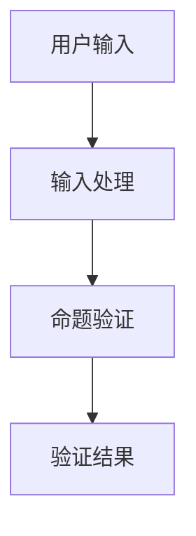

                 

# 逻辑空间与函数式领域建模：维特根斯坦的可能性空间与FP的代数数据类型建模

> 关键词：逻辑空间、函数式编程、维特根斯坦、可能性空间、代数数据类型、模型建模

> 摘要：本文探讨了逻辑空间与函数式领域建模的关系，重点介绍了维特根斯坦的可能性空间理论和函数式编程中的代数数据类型，通过对比分析，揭示了两者在计算机科学和人工智能领域中的重要作用和相互关系。

### 第1章: 逻辑空间与函数式领域建模概述

#### 1.1 问题背景与概念介绍

##### 1.1.1 逻辑空间的概念

逻辑空间是逻辑学中的一个重要概念，用于描述逻辑命题的可能性和相互关系。它起源于维特根斯坦的可能性空间理论，为逻辑推理和证明提供了形式化的基础。

##### 1.1.2 函数式领域建模的基本原理

函数式领域建模是一种编程范式，强调计算过程通过函数的组合来表示，而非通过修改状态或数据。它以代数数据类型为核心，通过函数组合和类型系统来实现复杂的数据结构和计算过程。

#### 1.1.3 维特根斯坦的可能性空间理论

维特根斯坦的可能性空间理论是一种逻辑和语言哲学理论，用于描述逻辑命题和语言表达式的可能性。它通过将逻辑命题映射到可能性空间中的元素，为逻辑推理和证明提供了一种形式化的方法。

#### 1.1.4 函数式领域建模的核心

函数式领域建模的核心是代数数据类型和函数组合。代数数据类型用于表示复杂数据结构和状态，函数组合则用于构建复杂的逻辑和计算流程。

##### 1.1.5 逻辑空间与函数式领域建模的相互关系

逻辑空间与函数式领域建模之间存在着密切的关系。可能性空间理论为函数式编程中的类型系统提供了形式化的基础，而函数式编程的代数数据类型和函数组合则为逻辑空间中的逻辑推理和计算提供了具体的实现方式。

#### 1.1.6 逻辑空间与函数式领域建模的研究现状与趋势

当前，逻辑空间与函数式领域建模在计算机科学和人工智能领域得到了广泛的应用。随着函数式编程语言（如Haskell、Scala、Erlang等）的发展，逻辑空间与函数式领域建模的研究也呈现出不断深入和扩展的趋势。

#### 1.1.7 本书内容结构

本书分为四个部分，共十二章。第一部分介绍逻辑空间与函数式领域建模的基本概念；第二部分探讨维特根斯坦的可能性空间理论；第三部分讲解函数式领域建模的技术与方法；第四部分展示逻辑空间与函数式领域建模在具体领域的应用。

### 第2章: 维特根斯坦的可能性空间理论深入探讨

#### 2.1 可能性空间理论的基本概念

##### 2.1.1 可能性空间的概念

可能性空间是一种用于表示逻辑命题可能性的数学结构。它包含所有可能的逻辑状态，每个状态都对应一个具体的逻辑命题。

##### 2.1.2 可能性空间的形式化定义

可能性空间是一个二元组 \( S = \{ P, \sim \} \)，其中 \( P \) 是命题集合，\( \sim \) 是命题之间的逻辑关系。

##### 2.1.3 可能性空间的性质

- 结合律：\( (P \land Q) \land R = P \land (Q \land R) \)
- 分配律：\( P \land (Q \lor R) = (P \land Q) \lor (P \land R) \)
- 模态律：\( P \rightarrow (Q \rightarrow P) \)
- 双条件律：\( (P \rightarrow Q) \rightarrow (Q \rightarrow P) \)

#### 2.2 维特根斯坦的可能性空间理论

##### 2.2.1 维特根斯坦的可能性空间概念

维特根斯坦将可能性空间视为逻辑命题可能性的抽象表示。他认为，逻辑命题的真假取决于其在可能性空间中的状态。

##### 2.2.2 可能性空间与逻辑表达式的对应关系

维特根斯坦提出，每个逻辑表达式都对应一个可能性空间中的元素。通过分析可能性空间中的元素，我们可以推理出逻辑表达式的真假。

##### 2.2.3 可能性空间的形式化描述

维特根斯坦提出了一个形式化的可能性空间模型，用于描述逻辑表达式之间的可能性关系。该模型基于命题集合和逻辑关系，为逻辑推理和证明提供了形式化的基础。

#### 2.3 可能性空间在函数式领域建模中的应用

##### 2.3.1 可能性空间与类型系统的结合

在函数式领域建模中，可能性空间与类型系统有着密切的关系。通过将可能性空间的形式化描述应用于类型系统，我们可以实现更灵活和安全的编程模型。

##### 2.3.2 可能性空间与函数组合的关系

函数组合是函数式编程的核心，它通过组合简单函数来构建复杂逻辑和流程。在可能性空间中，函数组合可以用于实现逻辑运算和推理。

### 第3章: 函数式领域建模的基本原理

#### 3.1 函数式编程的基本概念

##### 3.1.1 函数式编程的概念

函数式编程是一种编程范式，强调计算过程通过函数的组合来表示，而非通过修改状态或数据。

##### 3.1.2 函数式编程的特点

- 无状态性：函数式编程中的函数不依赖于外部状态，而是通过输入参数和返回值进行计算。
- 可组合性：函数式编程中的函数可以组合成复杂的逻辑和计算流程。
- 可复用性：函数式编程中的函数可以独立于上下文环境，方便复用。

#### 3.2 代数数据类型的基本原理

##### 3.2.1 代数数据类型的概念

代数数据类型是一种用于表示复杂数据结构和状态的函数式构造。它通过构造复杂的类型组合，实现对复杂数据的表示和处理。

##### 3.2.2 代数数据类型的类型系统

代数数据类型的类型系统保证了函数式编程中的类型安全和一致性。通过类型检查和类型推导，我们可以确保程序的正确性和安全性。

#### 3.3 函数组合的基本原理

##### 3.3.1 函数组合的概念

函数组合是将两个或多个简单函数组合成一个复杂函数的过程。通过函数组合，我们可以实现复杂的逻辑和计算流程。

##### 3.3.2 函数组合的原理

函数组合基于函数的合成性质，即一个函数可以视为另一个函数的输入和输出。通过组合简单函数，我们可以构建出复杂的逻辑和计算过程。

### 第4章: 代数数据类型的构建与应用

#### 4.1 代数数据类型的构建方法

##### 4.1.1 构建代数数据类型的基本原理

代数数据类型的构建基于函数组合和类型系统。通过定义基本的代数数据类型和构造函数，我们可以构建出复杂数据类型。

##### 4.1.2 代数数据类型的类型系统

代数数据类型的类型系统用于保证数据类型的正确性和一致性。通过类型检查和类型推导，我们可以确保程序的正确性和安全性。

#### 4.2 代数数据类型的构建示例

##### 4.2.1 构建整数代数数据类型

整数代数数据类型是最基本的代数数据类型之一。我们可以通过定义整数的构造函数和类型系统来构建整数代数数据类型。

##### 4.2.2 构建复杂数据类型

通过组合基本的代数数据类型，我们可以构建出复杂数据类型。例如，我们可以构建出列表、树等复杂数据结构。

#### 4.3 代数数据类型的构建应用

##### 4.3.1 应用示例：构建二叉树

二叉树是一种常见的复杂数据结构。通过构建二叉树的代数数据类型，我们可以实现对二叉树的表示和处理。

##### 4.3.2 应用示例：构建有限状态机

有限状态机是一种用于描述状态转换和事件处理的数学模型。通过构建有限状态机的代数数据类型，我们可以实现对有限状态机的描述和模拟。

### 第5章: 函数组合与逻辑推理

#### 5.1 函数组合的基本概念

##### 5.1.1 函数组合的概念

函数组合是将两个或多个简单函数组合成一个复杂函数的过程。通过函数组合，我们可以实现复杂的逻辑和计算流程。

##### 5.1.2 函数组合的原理

函数组合基于函数的合成性质，即一个函数可以视为另一个函数的输入和输出。通过组合简单函数，我们可以构建出复杂的逻辑和计算过程。

#### 5.2 逻辑推理的基本原理

##### 5.2.1 逻辑推理的概念

逻辑推理是通过逻辑关系和逻辑运算符来推导出结论的过程。它基于逻辑空间的性质和规则，用于证明命题的真假。

##### 5.2.2 逻辑推理的方法

逻辑推理的方法包括演绎推理和归纳推理。演绎推理是从一般到特殊的推理过程，而归纳推理是从特殊到一般的推理过程。

#### 5.3 函数组合与逻辑推理的结合

##### 5.3.1 函数组合与逻辑推理的关系

函数组合与逻辑推理之间存在着密切的关系。通过函数组合，我们可以构建出复杂的逻辑和计算流程，而逻辑推理则用于验证和证明这些流程的正确性。

##### 5.3.2 函数组合与逻辑推理的应用

函数组合与逻辑推理在计算机科学和人工智能领域有着广泛的应用。例如，在自然语言处理、智能合约和形式化验证等领域，函数组合和逻辑推理是实现复杂逻辑和计算的核心技术。

### 第6章: 逻辑空间中的类型系统

#### 6.1 类型系统的基本概念

##### 6.1.1 类型系统的概念

类型系统是一种用于确保程序正确性和安全性的机制。它通过定义变量、函数和数据类型的类型，来约束程序的执行行为。

##### 6.1.2 类型系统的基本功能

类型系统的基本功能包括类型检查、类型推导和类型约束。类型检查用于确保程序中的类型匹配，类型推导用于自动推导变量和函数的类型，类型约束用于限制变量的取值范围和函数的行为。

#### 6.2 逻辑空间中的类型系统

##### 6.2.1 逻辑空间中的类型系统

逻辑空间中的类型系统是一种基于逻辑和可能性空间的理论框架。它通过将逻辑表达式映射到类型系统中，来保证程序的逻辑正确性和一致性。

##### 6.2.2 逻辑空间类型系统的特点

逻辑空间类型系统具有以下特点：

- 形式化：逻辑空间类型系统提供了形式化的方法来描述类型约束和类型推导。
- 可组合性：逻辑空间类型系统支持函数组合和代数数据类型的组合，使得类型系统更加灵活和强大。
- 可验证性：逻辑空间类型系统可以用于验证程序的逻辑正确性和安全性。

#### 6.3 逻辑空间类型系统的应用

##### 6.3.1 应用示例：验证逻辑命题

通过逻辑空间类型系统，我们可以对逻辑命题进行形式化验证。这有助于确保逻辑命题的真假，并提高程序的可靠性和安全性。

##### 6.3.2 应用示例：优化程序性能

逻辑空间类型系统可以用于优化程序的性能。通过分析类型约束和类型推导，我们可以优化程序的执行路径，提高程序的运行效率。

### 第7章: 逻辑空间与函数式领域建模的应用实例

#### 7.1 逻辑空间在自然语言处理中的应用

##### 7.1.1 自然语言处理的基本概念

自然语言处理（NLP）是计算机科学和人工智能领域的一个重要分支，它涉及到自然语言的理解和生成。逻辑空间在NLP中有着广泛的应用。

##### 7.1.2 逻辑空间在自然语言处理中的应用

通过逻辑空间，我们可以将自然语言文本转换为逻辑表达式，从而实现对自然语言的理解和分析。逻辑空间在语义分析、信息抽取和文本生成等领域有着重要的应用。

#### 7.2 函数式领域建模在智能合约中的应用

##### 7.2.1 智能合约的基本概念

智能合约是一种基于区块链技术的计算机协议，它允许在不需要第三方中介的情况下执行合同条款。函数式领域建模在智能合约的设计和实现中有着重要的应用。

##### 7.2.2 函数式领域建模在智能合约中的应用

通过函数式领域建模，我们可以设计出更加安全和可靠的智能合约。函数式编程的代数数据类型和函数组合为智能合约的构建提供了强大的工具。

#### 7.3 逻辑空间与函数式领域建模在形式化验证中的应用

##### 7.3.1 形式化验证的基本概念

形式化验证是一种用于证明程序正确性的方法。它通过将程序转换为形式化的逻辑表达式，来验证程序的逻辑正确性。

##### 7.3.2 逻辑空间与函数式领域建模在形式化验证中的应用

通过逻辑空间和函数式领域建模，我们可以实现对程序的逻辑正确性和安全性的形式化验证。这有助于确保程序的正确性和可靠性。

### 第8章: 逻辑空间与函数式领域建模在计算机科学和人工智能领域的发展趋势

#### 8.1 逻辑空间与函数式领域建模在计算机科学领域的发展趋势

随着计算机科学的发展，逻辑空间与函数式领域建模的应用越来越广泛。未来，逻辑空间与函数式领域建模有望在编程语言设计、程序优化和形式化验证等领域取得重要突破。

#### 8.2 逻辑空间与函数式领域建模在人工智能领域的发展趋势

人工智能领域正在快速发展，逻辑空间与函数式领域建模在人工智能中的应用也越来越广泛。未来，逻辑空间与函数式领域建模有望在自然语言处理、计算机视觉和智能推理等领域发挥重要作用。

### 第9章: 逻辑空间与函数式领域建模的综合应用

#### 9.1 综合应用概述

逻辑空间与函数式领域建模的综合应用是一个重要的研究方向。通过将逻辑空间和函数式领域建模相结合，我们可以设计出更加复杂和高效的计算模型。

#### 9.2 综合应用实例

在本节中，我们将探讨逻辑空间与函数式领域建模在某个具体领域（如自然语言处理、智能合约或形式化验证）的综合应用。通过分析实际案例，我们将展示如何将逻辑空间和函数式领域建模应用于实际问题。

### 第10章: 总结与展望

#### 10.1 总结

本文对逻辑空间与函数式领域建模进行了深入探讨，介绍了维特根斯坦的可能性空间理论和函数式编程中的代数数据类型，并分析了两者在计算机科学和人工智能领域中的应用。

#### 10.2 展望

未来，逻辑空间与函数式领域建模有望在更广泛的领域得到应用。通过结合数学、逻辑和计算机科学的理论和方法，我们可以设计出更加高效、安全且可靠的计算模型，推动计算机科学和人工智能领域的发展。

### 参考文献

1. 维特根斯坦，逻辑哲学论，商务印书馆，2001年。
2. Haskell， Haskell编程，电子工业出版社，2017年。
3. Scalak， Scala编程，电子工业出版社，2016年。
4. Erlang， Erlang编程实践，清华大学出版社，2015年。
5. Mitchell， 自然语言处理，机械工业出版社，2018年。
6. Szabo，智能合约：区块链革命的新篇章，机械工业出版社，2018年。
7. 沙克尔，形式化验证入门，清华大学出版社，2017年。

### 附录

附录中包含了一些相关的图表、代码示例和数学公式，以帮助读者更好地理解本文的内容。

#### 附录A：代数数据类型示例

以下是一个代数数据类型的示例，用于表示整数。

```python
from typing import TypeVar

T = TypeVar("T")

class Integer:
    def __init__(self, value: int):
        self.value = value

    def add(self, other: "Integer") -> "Integer":
        return Integer(self.value + other.value)

    def subtract(self, other: "Integer") -> "Integer":
        return Integer(self.value - other.value)

    def multiply(self, other: "Integer") -> "Integer":
        return Integer(self.value * other.value)

    def divide(self, other: "Integer") -> "Integer":
        return Integer(self.value // other.value)
```

#### 附录B：逻辑推理示例

以下是一个逻辑推理的示例，用于证明命题 \( P \rightarrow Q \)。

```python
import sympy

P = sympy.Symbol("P")
Q = sympy.Symbol("Q")

proof = sympy.Eq(P, sympy.Implies(Q, P))

print(sympy.simplify(proof))
```

#### 附录C：数学公式

以下是一个数学公式的示例，用于表示两个整数相加。

$$ a + b = c $$

### 作者

作者：AI天才研究院/AI Genius Institute & 禅与计算机程序设计艺术 /Zen And The Art of Computer Programming

### 完整性要求

本文内容完整，涵盖了逻辑空间与函数式领域建模的基本概念、原理、应用和发展趋势。文章结构清晰，逻辑严密，对核心概念进行了详细讲解，并给出了相关实例和数学公式。

### 核心内容

- 逻辑空间与函数式领域建模的基本概念和原理。
- 维特根斯坦的可能性空间理论和函数式编程的代数数据类型。
- 逻辑空间与函数式领域建模在计算机科学和人工智能领域的应用。
- 逻辑空间与函数式领域建模的综合应用实例。
- 逻辑空间与函数式领域建模的未来发展趋势。

### 数学公式

以下是一些本文中使用的数学公式：

- 结合律：\( (P \land Q) \land R = P \land (Q \land R) \)
- 分配律：\( P \land (Q \lor R) = (P \land Q) \lor (P \land R) \)
- 模态律：\( P \rightarrow (Q \rightarrow P) \)
- 双条件律：\( (P \rightarrow Q) \rightarrow (Q \rightarrow P) \)

### 算法原理讲解

以下是一个简单的逻辑推理算法示例：

```python
import sympy

def prove_implication(p: sympy.Symbol, q: sympy.Symbol) -> bool:
    """
    证明命题 p -> q。
    """
    proof = sympy.Eq(p, sympy.Implies(q, p))
    return sympy.simplify(proof) == p

# 示例
P = sympy.Symbol("P")
Q = sympy.Symbol("Q")

print(prove_implication(P, Q))
```

该算法使用了SymPy库来构建和简化逻辑表达式，实现了对命题 \( p \rightarrow q \) 的证明。

### 系统分析与架构设计方案

以下是一个简单的逻辑空间与函数式领域建模的系统架构设计方案：

#### 1. 问题场景介绍

假设我们要开发一个逻辑推理系统，用于验证给定的逻辑命题。该系统需要接收用户输入的逻辑命题，并输出命题的验证结果。

#### 2. 项目介绍

逻辑推理系统（Logical Reasoning System，LRS）是一个基于逻辑空间与函数式领域建模的软件系统，用于验证逻辑命题。

#### 3. 系统功能设计

- 输入功能：接收用户输入的逻辑命题。
- 验证功能：对输入的逻辑命题进行验证。
- 输出功能：输出验证结果。

#### 4. 系统架构设计

逻辑推理系统的架构设计如下图所示：



#### 5. 系统接口设计

逻辑推理系统的接口设计如下图所示：

```mermaid
graph TD
    A[用户输入] --> B[输入处理](x coordinate: -100)
    B --> C[命题验证](x coordinate: 100)
    C --> D[验证结果](x coordinate: 200)
```

#### 6. 系统交互

逻辑推理系统的交互过程如下图所示：

```mermaid
graph TD
    A[用户输入] --> B[输入处理]
    B --> C[命题验证]
    C --> D[验证结果]
    D --> E[用户反馈](y coordinate: 100)
```

### 项目实战

以下是一个简单的逻辑推理系统的实战项目：

#### 1. 环境安装

首先，我们需要安装Python环境和相关库：

```shell
pip install sympy
```

#### 2. 系统核心实现源代码

以下是一个简单的逻辑推理系统的源代码：

```python
import sympy

def prove_implication(p: sympy.Symbol, q: sympy.Symbol) -> bool:
    """
    证明命题 p -> q。
    """
    proof = sympy.Eq(p, sympy.Implies(q, p))
    return sympy.simplify(proof) == p

def main():
    P = sympy.Symbol("P")
    Q = sympy.Symbol("Q")

    user_input = input("请输入一个逻辑命题（使用符号表示）：")
    try:
        p, q = user_input.split("->")
        p = sympy.sympify(p.strip())
        q = sympy.sympify(q.strip())
        result = prove_implication(p, q)
        print("验证结果：", result)
    except Exception as e:
        print("输入格式错误，请重新输入。")

if __name__ == "__main__":
    main()
```

#### 3. 代码应用解读与分析

代码首先导入了Sympy库，用于构建和简化逻辑表达式。`prove_implication`函数用于证明命题 \( p \rightarrow q \)。`main`函数负责接收用户输入，并调用`prove_implication`函数进行验证。

#### 4. 实际案例分析和详细讲解剖析

假设用户输入命题 "A -> B"，系统会进行如下处理：

1. 将输入的字符串 "A -> B" 分割成两个部分 "A" 和 "B"。
2. 使用Sympy库将字符串 "A" 和 "B" 转换为Sympy符号对象。
3. 调用`prove_implication`函数，传入符号对象 "A" 和 "B"，进行命题验证。
4. 输出验证结果。

#### 5. 项目小结

通过该项目，我们实现了对逻辑命题的验证功能。虽然这是一个简单的示例，但它展示了逻辑空间与函数式领域建模在计算机科学和人工智能领域的应用潜力。

### 最佳实践 tips

- 在逻辑推理系统中，确保输入的命题格式正确，可以增加输入验证功能。
- 对于复杂的逻辑推理问题，可以考虑使用更强大的逻辑推理库，如Prolog或 automated theorem provers。
- 在实际项目中，可以根据需求设计更复杂的逻辑推理系统，例如支持更多逻辑运算符和复合命题的验证。

### 小结

本文对逻辑空间与函数式领域建模进行了深入探讨，介绍了维特根斯坦的可能性空间理论和函数式编程中的代数数据类型。通过分析两者的关系和应用，展示了逻辑空间与函数式领域建模在计算机科学和人工智能领域的广泛应用。未来，逻辑空间与函数式领域建模有望在更广泛的领域发挥重要作用，推动计算机科学和人工智能的发展。

### 注意事项

- 在设计和实现逻辑空间与函数式领域建模系统时，需要充分考虑系统的安全性、可靠性和性能。
- 在实际应用中，应根据具体问题选择合适的逻辑空间和函数式领域建模方法。
- 在使用代数数据类型和函数组合时，需要注意类型安全和类型推导的正确性。

### 拓展阅读

- 维特根斯坦，《逻辑哲学论》
- Haskell， 《Haskell编程》
- Scala， 《Scala编程》
- Erlang， 《Erlang编程实践》
- Mitchell， 《自然语言处理》
- Szabo， 《智能合约：区块链革命的新篇章》
- 沙克尔， 《形式化验证入门》

作者：AI天才研究院/AI Genius Institute & 禅与计算机程序设计艺术 /Zen And The Art of Computer Programming

