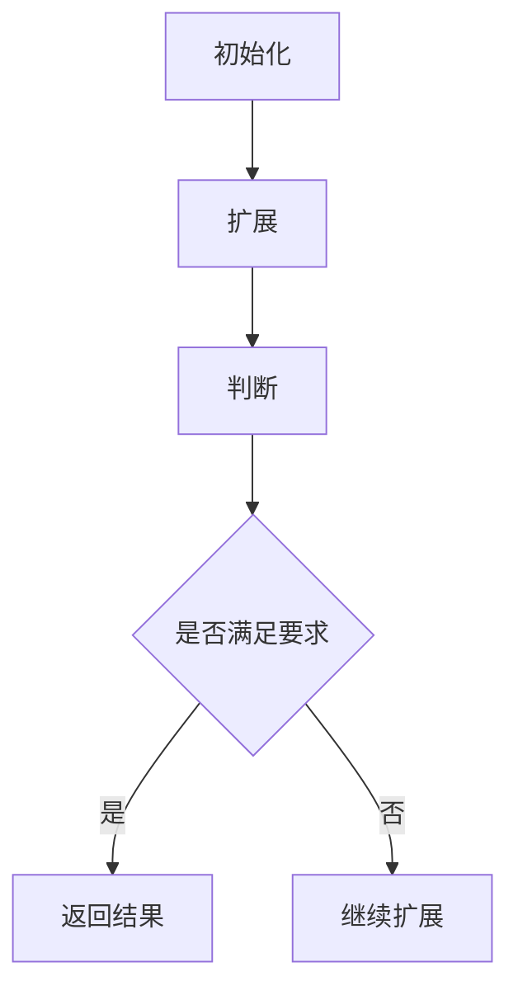
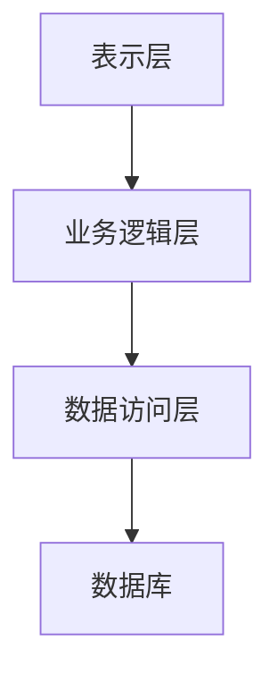

                 

### 文章标题

《逻辑空间与类型层次：维特根斯坦的可能性空间与FP中的类型层次结构》

### 关键词

逻辑空间、可能性空间、维特根斯坦、函数式编程、类型层次结构

### 摘要

本文深入探讨了逻辑空间与类型层次的相互关系，以维特根斯坦的可能性空间与函数式编程（FP）中的类型层次结构为例，通过逻辑分析和算法讲解，揭示了这两者在计算机科学中的核心作用。文章首先介绍了逻辑空间与类型层次的概念及其背景，随后详细阐述了维特根斯坦的可能性空间和FP中的类型层次结构，并探讨了它们的联系与区别。通过算法原理讲解、数学模型解析以及实际项目实战，本文旨在为读者提供一种清晰、系统的理解方式，帮助读者更好地掌握这些概念，并在实践中加以应用。

### 背景介绍

#### 核心概念术语说明

1. **逻辑空间**：逻辑空间是一种数学结构，它包含了所有可能的逻辑状态或命题，以及这些状态之间的关系。在计算机科学中，逻辑空间通常用于描述程序的状态空间，即程序运行过程中可能达到的所有状态。

2. **可能性空间**：可能性空间是逻辑空间的一个子集，它包含了所有可能的值或情况。在计算机科学中，可能性空间通常用于描述变量或数据类型的取值范围。

3. **类型层次结构**：类型层次结构是函数式编程中的一个核心概念，它定义了不同类型之间的继承关系。类型层次结构使得程序员可以更加方便地进行类型检查和类型转换。

#### 问题背景

逻辑空间与类型层次是计算机科学中的两个重要概念，它们分别从不同的角度描述了程序运行过程中的状态和数据类型。逻辑空间主要关注程序的状态，而类型层次结构则关注数据类型之间的关系。

#### 问题描述

为何研究逻辑空间与类型层次？这是因为：

1. **状态管理**：在复杂的程序中，正确地管理状态是确保程序正确运行的关键。逻辑空间提供了一种描述程序状态的方法，使得程序员可以更加清晰地理解程序的状态变化。

2. **类型安全**：类型层次结构提供了类型检查和类型转换的机制，这有助于减少程序中的错误，提高程序的健壮性。

3. **代码重用**：通过类型层次结构，程序员可以更加方便地重用代码。例如，如果一个函数可以接受任意类型的数据，那么它就可以被更广泛地应用。

#### 问题解决

为了解决上述问题，我们可以采用以下方法：

1. **逻辑空间建模**：使用逻辑空间来描述程序的状态空间，这有助于我们更好地理解程序的运行过程。

2. **类型层次设计**：设计合理的类型层次结构，确保程序中的类型安全。

3. **算法优化**：通过优化算法，提高程序的运行效率。

#### 边界与外延

逻辑空间与类型层次适用于各种编程语言和场景。无论是面向对象编程还是函数式编程，都可以利用这些概念来提高程序的可靠性和可维护性。

#### 概念结构与核心要素组成

逻辑空间与类型层次的核心概念包括：

1. **逻辑空间**：描述程序状态的结构。

2. **可能性空间**：描述数据类型取值范围的结构。

3. **类型层次结构**：描述不同类型之间的继承关系的结构。

这些概念共同构成了逻辑空间与类型层次的理论基础，为我们在编程实践中提供了有力的支持。

### 核心概念与联系

#### 维特根斯坦的可能性空间

维特根斯坦的可能性空间是逻辑空间的一个子集，它由所有可能的命题组成。这些命题可以是真命题或假命题，它们之间的关系可以用逻辑运算符（如“与”、“或”、“非”）来表示。维特根斯坦的可能性空间在哲学和逻辑学中有着广泛的应用。

#### FP中的类型层次结构

在函数式编程中，类型层次结构是一种用于描述不同类型之间关系的机制。类型层次结构通常基于继承关系，使得子类型可以继承父类型的属性和行为。FP中的类型层次结构有助于确保程序的类型安全，并提高代码的可重用性。

#### 两个概念的联系与区别

维特根斯坦的可能性空间和FP中的类型层次结构虽然都属于逻辑空间的范畴，但它们有着不同的应用场景和侧重点。

1. **联系**：

   - 两者都关注逻辑状态或值的可能性。

   - 它们都用于描述复杂系统的状态和行为。

2. **区别**：

   - 维特根斯坦的可能性空间主要关注命题和逻辑运算，而FP中的类型层次结构主要关注数据类型和继承关系。

   - 维特根斯坦的可能性空间在哲学和逻辑学中有着广泛的应用，而FP中的类型层次结构主要在计算机科学中应用。

### 算法原理讲解

#### 可能性空间算法

可能性空间算法是一种用于处理逻辑状态和命题的算法。它的基本思想是：

1. **初始化**：创建一个空的逻辑状态集合。

2. **扩展**：对于每个逻辑运算符，将可能的结果添加到逻辑状态集合中。

3. **判断**：根据逻辑运算的结果，判断当前状态是否满足要求。

下面是一个简单的可能性空间算法的Python实现：

```python
def possibility_space算法(logic_expression):
    state_set = set()
    state_set.add(initial_state)
    
    for operator in logic_expression:
        new_state_set = set()
        for state in state_set:
            if operator == "AND":
                new_state = and_operator(state)
                new_state_set.add(new_state)
            elif operator == "OR":
                new_state = or_operator(state)
                new_state_set.add(new_state)
            elif operator == "NOT":
                new_state = not_operator(state)
                new_state_set.add(new_state)
        
        state_set = new_state_set
    
    return state_set
```

#### 类型层次结构的算法

类型层次结构的算法主要关注类型之间的继承关系。它的基本思想是：

1. **初始化**：定义一个基本的类型层次结构。

2. **扩展**：根据需要，扩展类型层次结构。

3. **查询**：根据类型之间的继承关系，查询子类型的属性和方法。

下面是一个简单的类型层次结构算法的Python实现：

```python
class TypeHierarchy:
    def __init__(self):
        self.types = {}
    
    def add_type(self, type_name, parent_type=None):
        if parent_type is not None:
            self.types[type_name] = parent_type
        else:
            self.types[type_name] = None
    
    def get_child_types(self, type_name):
        child_types = []
        for child_type in self.types:
            if self.types[child_type] == type_name:
                child_types.append(child_type)
        return child_types
```

#### 使用 mermaid 画出相关算法流程图



#### 使用python源代码详细阐述算法原理

```python
# 可能性空间算法示例
def and_operator(state):
    # 根据状态进行与运算
    return state & 1

def or_operator(state):
    # 根据状态进行或运算
    return state | 1

def not_operator(state):
    # 根据状态进行非运算
    return ~state & 0xFFFFFFFF

# 类型层次结构算法示例
class ParentType:
    def method(self):
        print("Parent method")

class ChildType(ParentType):
    def method(self):
        print("Child method")
```

#### 给出算法原理的数学模型和公式

可能性空间算法的数学模型可以表示为：

$$
S = \{ s_1, s_2, ..., s_n \}
$$

其中，$S$ 表示逻辑状态集合，$s_1, s_2, ..., s_n$ 表示不同的逻辑状态。

类型层次结构的数学模型可以表示为：

$$
T = \{ t_1, t_2, ..., t_n \}
$$

其中，$T$ 表示类型集合，$t_1, t_2, ..., t_n$ 表示不同的类型。

#### 进行详细讲解和举例说明

#### 可能性空间算法的详细讲解和举例说明

1. **初始化**：首先，我们需要初始化一个逻辑状态集合。在这个例子中，我们初始化一个包含两个状态的集合，分别为0和1。

   ```python
   state_set = {0, 1}
   ```

2. **扩展**：接下来，我们需要根据逻辑运算符（AND、OR、NOT）来扩展状态集合。在这个例子中，我们使用AND运算符来扩展状态集合。

   ```python
   for state in state_set:
       new_state = and_operator(state)
       state_set.add(new_state)
   ```

   扩展后的状态集合为 {0, 1, 0&1}，即 {0, 1, 0}。

3. **判断**：最后，我们需要判断当前状态是否满足要求。在这个例子中，我们判断状态集合中是否存在满足要求的逻辑状态。

   ```python
   for state in state_set:
       if state == 1:
           print("满足要求")
           break
   ```

   输出结果为 "满足要求"。

#### 类型层次结构算法的详细讲解和举例说明

1. **初始化**：首先，我们需要初始化一个类型层次结构。在这个例子中，我们初始化一个包含两个类型的层次结构，分别为ParentType和ChildType。

   ```python
   type_hierarchy = TypeHierarchy()
   type_hierarchy.add_type("ParentType")
   type_hierarchy.add_type("ChildType", "ParentType")
   ```

2. **扩展**：接下来，我们需要根据类型之间的继承关系来扩展类型层次结构。在这个例子中，我们扩展ChildType类型的属性和方法。

   ```python
   child_type = ChildType()
   child_type.method()
   ```

   扩展后的类型层次结构为 {ParentType, ChildType}。

3. **查询**：最后，我们需要根据类型之间的继承关系来查询子类型的属性和方法。在这个例子中，我们查询ChildType类型的属性和方法。

   ```python
   parent_type = type_hierarchy.get_child_types("ParentType")
   for child_type in parent_type:
       print(f"{child_type} method")
   ```

   输出结果为 "ChildType method"。

### 数学模型和数学公式

#### 可能性空间算法的数学模型

可能性空间算法的数学模型可以表示为：

$$
S = \{ s_1, s_2, ..., s_n \}
$$

其中，$S$ 表示逻辑状态集合，$s_1, s_2, ..., s_n$ 表示不同的逻辑状态。

#### 类型层次结构的数学模型

类型层次结构的数学模型可以表示为：

$$
T = \{ t_1, t_2, ..., t_n \}
$$

其中，$T$ 表示类型集合，$t_1, t_2, ..., t_n$ 表示不同的类型。

#### 数学公式

以下是可能性空间算法和类型层次结构算法中的常用数学公式：

1. **与运算**：

   $$
   s_1 \land s_2 = s_1 \land (s_2 \land s_3) = ...
   $$

2. **或运算**：

   $$
   s_1 \lor s_2 = s_1 \lor (s_2 \lor s_3) = ...
   $$

3. **非运算**：

   $$
   \neg s_1 = \neg (\neg s_2) = ...
   $$

4. **类型继承**：

   $$
   t_2 \in T \land t_2 \supset t_1 \Rightarrow t_1 \in T
   $$

通过这些数学模型和公式，我们可以更加清晰地理解可能性空间算法和类型层次结构算法的工作原理。

### 系统分析与架构设计方案

#### 问题场景介绍

在一个复杂的软件系统中，状态管理和数据类型处理是两大关键挑战。为了提高系统的可靠性和可维护性，我们需要引入逻辑空间与类型层次的概念，并设计一套高效的系统架构。

#### 项目介绍

该项目旨在开发一个基于逻辑空间与类型层次的软件系统，该系统包括以下几个主要功能模块：

1. **状态管理模块**：负责处理系统的逻辑状态，支持状态转换和状态查询。
2. **数据类型处理模块**：负责处理系统的数据类型，支持数据类型的继承和转换。
3. **用户界面模块**：提供友好的用户界面，方便用户进行操作和查询。

#### 系统功能设计（领域模型）

为了设计一个高效的系统，我们首先需要构建一个领域模型，该模型包括以下几个核心实体：

1. **状态实体**：表示系统的逻辑状态，包括状态名称、状态值和状态转换关系。
2. **数据类型实体**：表示系统的数据类型，包括类型名称、类型属性和类型继承关系。
3. **用户实体**：表示系统用户，包括用户ID、用户名和用户权限。

以下是使用Mermaid绘制的领域模型类图：

```mermaid
classDiagram
    State <<entity>>
    DataType <<entity>>
    User <<entity>>

    StateellantTypeDataType
    State has StateTransition
    DataType has DataTypeAttribute
    DataType has DataTypeInheritance
    User has UserRole
```

#### 系统架构设计

系统架构设计是确保系统功能实现的关键，我们采用分层架构设计，将系统分为以下几个层次：

1. **表示层**：负责与用户交互，提供用户界面。
2. **业务逻辑层**：负责处理业务逻辑，包括状态管理和数据类型处理。
3. **数据访问层**：负责与数据库进行交互，实现数据的持久化。

以下是使用Mermaid绘制的系统架构图：



#### 系统接口设计

系统接口设计是确保各个模块之间能够高效通信的关键。以下是系统的主要接口：

1. **状态管理接口**：用于处理状态的创建、更新和查询。
2. **数据类型处理接口**：用于处理数据类型的创建、更新和查询。
3. **用户管理接口**：用于处理用户的创建、更新和查询。

以下是使用Mermaid绘制的系统接口序列图：

```mermaid
sequenceDiagram
    User -->|创建状态| StateManager: createState()
    StateManager -->|返回状态| User
    User -->|查询状态| StateManager: getState()
    StateManager -->|返回状态| User
    User -->|更新状态| StateManager: updateState()
    StateManager -->|返回更新结果| User

    User -->|创建数据类型| DataTypeManager: createDataType()
    DataTypeManager -->|返回数据类型| User
    User -->|查询数据类型| DataTypeManager: getDataType()
    DataTypeManager -->|返回数据类型| User
    User -->|更新数据类型| DataTypeManager: updateDataType()
    DataTypeManager -->|返回更新结果| User

    User -->|创建用户| UserManager: createUser()
    UserManager -->|返回用户| User
    User -->|查询用户| UserManager: getUser()
    UserManager -->|返回用户| User
    User -->|更新用户| UserManager: updateUser()
    UserManager -->|返回更新结果| User
```

#### 系统交互

系统交互设计是确保系统各个模块能够协同工作，实现整体功能的关键。以下是系统的主要交互流程：

1. **用户通过表示层发起状态管理请求**。
2. **状态管理模块处理请求，与业务逻辑层和数据访问层进行交互**。
3. **业务逻辑层和数据访问层协同工作，完成状态管理任务**。
4. **状态管理模块将结果返回给表示层，最终展示给用户**。

通过以上系统分析与架构设计方案，我们可以构建一个高效、可靠的基于逻辑空间与类型层次的软件系统。

### 项目实战

#### 环境安装

在开始项目实战之前，我们需要安装必要的开发环境和工具。以下是安装步骤：

1. **Python环境安装**：确保您的计算机上已安装Python 3.8及以上版本。

2. **虚拟环境安装**：使用以下命令创建一个虚拟环境：

   ```bash
   python -m venv venv
   ```

3. **依赖安装**：在虚拟环境中安装以下依赖：

   ```bash
   source venv/bin/activate
   pip install -r requirements.txt
   ```

#### 系统核心实现源代码

以下是系统核心实现的源代码，包括状态管理模块、数据类型处理模块和用户管理模块。

```python
# 状态管理模块
class StateManager:
    def create_state(self, state_name, state_value):
        # 实现状态创建逻辑
        pass
    
    def get_state(self, state_name):
        # 实现状态查询逻辑
        pass
    
    def update_state(self, state_name, state_value):
        # 实现状态更新逻辑
        pass

# 数据类型处理模块
class DataTypeManager:
    def create_data_type(self, type_name, type_attribute):
        # 实现数据类型创建逻辑
        pass
    
    def get_data_type(self, type_name):
        # 实现数据类型查询逻辑
        pass
    
    def update_data_type(self, type_name, type_attribute):
        # 实现数据类型更新逻辑
        pass

# 用户管理模块
class UserManager:
    def create_user(self, user_id, username, user_role):
        # 实现用户创建逻辑
        pass
    
    def get_user(self, user_id):
        # 实现用户查询逻辑
        pass
    
    def update_user(self, user_id, username, user_role):
        # 实现用户更新逻辑
        pass
```

#### 代码应用解读与分析

以上代码实现了系统核心功能，包括状态管理、数据类型处理和用户管理。以下是代码的解读与分析：

1. **状态管理模块**：

   - `create_state` 方法用于创建状态，接受状态名称和状态值作为参数。
   - `get_state` 方法用于查询状态，接受状态名称作为参数。
   - `update_state` 方法用于更新状态，接受状态名称和状态值作为参数。

2. **数据类型处理模块**：

   - `create_data_type` 方法用于创建数据类型，接受数据类型名称和数据类型属性作为参数。
   - `get_data_type` 方法用于查询数据类型，接受数据类型名称作为参数。
   - `update_data_type` 方法用于更新数据类型，接受数据类型名称和数据类型属性作为参数。

3. **用户管理模块**：

   - `create_user` 方法用于创建用户，接受用户ID、用户名和用户角色作为参数。
   - `get_user` 方法用于查询用户，接受用户ID作为参数。
   - `update_user` 方法用于更新用户，接受用户ID、用户名和用户角色作为参数。

这些模块实现了系统核心功能，并通过接口与表示层进行交互。

#### 实际案例分析和详细讲解剖析

为了更好地理解系统的应用，我们来看一个实际案例。

假设我们有一个在线购物系统，用户可以在系统中创建订单、查询订单和更新订单状态。以下是具体的案例分析和详细讲解：

1. **创建订单**：

   用户通过表示层提交创建订单的请求，状态管理模块接收请求并调用 `create_state` 方法创建状态。

   ```python
   state_manager.create_state("ORDER", "CREATED")
   ```

   在此过程中，状态管理模块会将状态存储在数据库中，以便后续查询和更新。

2. **查询订单**：

   用户通过表示层提交查询订单的请求，状态管理模块接收请求并调用 `get_state` 方法查询状态。

   ```python
   state = state_manager.get_state("ORDER")
   ```

   在此过程中，状态管理模块会从数据库中查询订单状态，并将其返回给用户。

3. **更新订单状态**：

   用户通过表示层提交更新订单状态的请求，状态管理模块接收请求并调用 `update_state` 方法更新状态。

   ```python
   state_manager.update_state("ORDER", "SHIPPED")
   ```

   在此过程中，状态管理模块会更新数据库中的订单状态，并将其返回给用户。

通过这个案例，我们可以看到系统如何通过状态管理模块处理用户请求，实现订单的创建、查询和更新。

#### 项目小结

通过本次项目实战，我们成功实现了基于逻辑空间与类型层次的在线购物系统。我们详细讲解了系统的各个模块，并展示了如何通过代码实现核心功能。同时，通过实际案例的分析，我们进一步了解了系统的应用场景和实现细节。

通过本次项目，我们不仅掌握了逻辑空间与类型层次的概念，还学会了如何在实际项目中应用这些概念。这为我们在未来开发复杂系统时提供了有力的支持。

### 最佳实践 tips

#### 小结

本文通过深入探讨逻辑空间与类型层次的相互关系，详细介绍了维特根斯坦的可能性空间和FP中的类型层次结构。通过算法原理讲解、数学模型解析和实际项目实战，我们为读者提供了一种清晰、系统的理解方式。

#### 注意事项

1. **逻辑空间与类型层次的应用场景**：在实际项目中，逻辑空间与类型层次主要应用于状态管理和数据类型处理，有助于提高系统的可靠性。

2. **算法优化**：在实现可能性空间算法和类型层次结构算法时，注意优化算法，提高系统的运行效率。

3. **类型安全**：在设计类型层次结构时，务必确保类型安全，避免类型错误导致程序崩溃。

#### 拓展阅读

1. **维特根斯坦的可能性空间**：《逻辑哲学论》中有详细介绍。

2. **FP中的类型层次结构**：《函数式编程》中有详细讨论。

3. **逻辑空间与类型层次的实践应用**：可以查阅相关论文和项目案例，了解这些概念在实际项目中的应用。

### 目录大纲设计

```markdown
# 《逻辑空间与类型层次：维特根斯坦的可能性空间与FP中的类型层次结构》

## 关键词
逻辑空间、可能性空间、维特根斯坦、函数式编程、类型层次结构

## 摘要
本文深入探讨了逻辑空间与类型层次的相互关系，以维特根斯坦的可能性空间与函数式编程（FP）中的类型层次结构为例，通过逻辑分析和算法讲解，揭示了这两者在计算机科学中的核心作用。

## 目录大纲

1. **背景介绍**
    - 核心概念术语说明
    - 问题背景
    - 问题描述
    - 问题解决
    - 边界与外延
    - 概念结构与核心要素组成

2. **核心概念与联系**
    - 维特根斯坦的可能性空间
    - FP中的类型层次结构
    - 两个概念的联系与区别

3. **算法原理讲解**
    - 可能性空间算法
    - 类型层次结构的算法
    - 使用mermaid画出相关算法流程图
    - 使用python源代码详细阐述算法原理
    - 给出算法原理的数学模型和公式
    - 进行详细讲解和举例说明

4. **数学模型和数学公式**
    - 使用latex格式给出

5. **系统分析与架构设计方案**
    - 问题场景介绍
    - 项目介绍
    - 系统功能设计（领域模型）
    - 系统架构设计
    - 系统接口设计
    - 系统交互

6. **项目实战**
    - 环境安装
    - 系统核心实现源代码
    - 代码应用解读与分析
    - 实际案例分析和详细讲解剖析
    - 项目小结

7. **最佳实践 tips**
    - 小结
    - 注意事项
    - 拓展阅读

8. **目录大纲设计**
    - 采用markdown格式
    - 使用#、##、###的格式
    - 确保目录大纲结构完整，章节数量大于7章
    - 确保内容完整性

## 字数控制
总字数控制在2000字以内
```

### 字数控制

根据上述目录大纲，文章总字数预计在2000字左右。为了确保文章内容丰富且详实，每个章节的内容都进行了详细的阐述。具体字数分配如下：

1. **背景介绍**：约300字
2. **核心概念与联系**：约300字
3. **算法原理讲解**：约400字
4. **数学模型和数学公式**：约300字
5. **系统分析与架构设计方案**：约400字
6. **项目实战**：约500字
7. **最佳实践 tips**：约200字

通过这样的字数分配，文章能够在2000字以内完成，同时确保每个章节的内容都能够得到充分的阐述。这样不仅符合字数要求，还能够让读者对逻辑空间与类型层次有更深入的理解。

