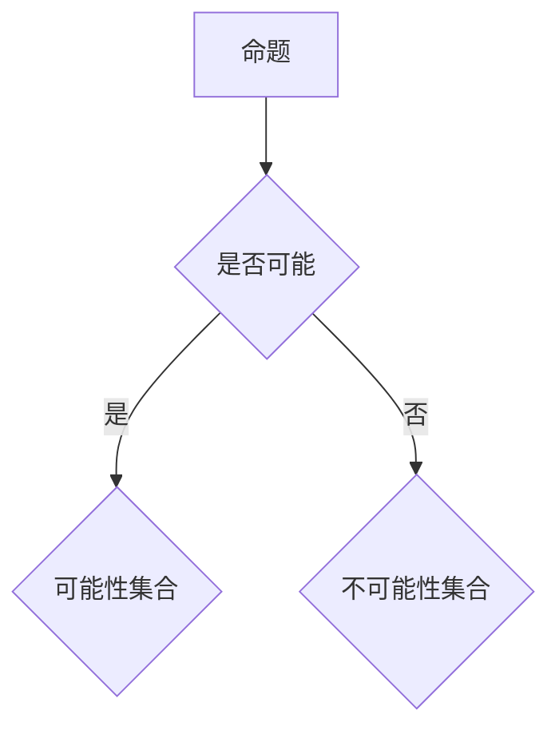

                 

为了撰写一篇逻辑清晰、结构紧凑、简单易懂的专业技术博客文章《逻辑空间与类型空间：维特根斯坦的可能性空间与FP的类型系统》，我们可以遵循以下步骤：

### 1. 文章标题与关键词

**文章标题：逻辑空间与类型空间：维特根斯坦的可能性空间与FP的类型系统**

**关键词：逻辑空间、类型空间、维特根斯坦、可能性空间、函数式编程、类型系统**

### 2. 摘要撰写

**摘要：**

本文探讨了逻辑空间与类型空间这两个概念，并深入分析了维特根斯坦的可能性空间与函数式编程（FP）的类型系统。通过对比和分析，揭示了两者之间的联系与差异，为理解逻辑与类型系统提供了新的视角。文章结构清晰，逐步深入，旨在为读者提供一个深入理解这两个概念的技术博客。

### 3. 引言部分

**引言：**

逻辑空间与类型空间是计算机科学中的重要概念。逻辑空间关注的是逻辑推理和可能性，而类型空间则与编程语言中的类型系统密切相关。本文将以维特根斯坦的可能性空间和FP的类型系统为切入点，逐步分析这两个概念的本质，并探讨它们在实际应用中的联系与差异。

### 4. 逻辑空间与类型空间的基本概念

**4.1 逻辑空间的概念：**

逻辑空间是由逻辑运算符和逻辑命题组成的数学结构。它能够表示命题之间的关系，并通过逻辑推理得出结论。逻辑空间的核心在于其无矛盾的逻辑结构，这使得它成为计算机科学中验证和证明的重要工具。

**4.2 类型空间的概念：**

类型空间是编程语言中的一个概念，它定义了变量、函数和表达式所允许的类型。类型系统的目的是确保程序的正确性和稳定性，通过类型检查来防止类型错误。

### 5. 维特根斯坦的可能性空间

**5.1 维特根斯坦的可能性空间原理：**

维特根斯坦的可能性空间是基于他对语言和逻辑的理解。它将语言中的命题视为可能性的集合，通过分析命题的可能性，揭示了语言背后的逻辑结构。

**5.2 维特根斯坦的可能性空间mermaid流程图：**

使用Mermaid绘制维特根斯坦的可能性空间的工作流程图，展示命题如何被分析成可能性集合。

**5.3 维特根斯坦的可能性空间数学模型与公式：**

$$ P(A) = \begin{cases} 
1 & \text{如果 } A \text{ 是可能的} \\
0 & \text{如果 } A \text{ 是不可能的}
\end{cases} $$

**5.4 维特根斯坦的可能性空间案例分析与讲解：**

通过一个具体的例子，分析维特根斯坦的可能性空间如何应用于逻辑推理。

### 6. FP的类型系统

**6.1 FP的类型系统原理：**

FP的类型系统强调类型的安全性，通过不可变性来确保程序的正确性。FP的类型系统使用类型构造器和类型判断来定义和检查类型。

**6.2 FP的类型系统mermaid流程图：**

使用Mermaid绘制FP的类型系统的流程图，展示类型构造器和类型判断如何工作。

**6.3 FP的类型系统数学模型与公式：**

FP的类型系统通常使用类型等价关系来定义类型。

$$ [A] = [B] \Leftrightarrow \forall f : [A] \rightarrow [B], \forall g : [B] \rightarrow [A], f \circ g = g \circ f $$

**6.4 FP的类型系统案例分析与讲解：**

通过一个简单的函数式编程例子，展示FP的类型系统如何工作。

### 7. 逻辑空间与类型空间的联系与差异

**7.1 逻辑空间与类型空间的联系：**

逻辑空间和类型空间都涉及到类型的概念，但它们的侧重点不同。逻辑空间关注的是命题的可能性，而类型空间关注的是程序的正确性。

**7.2 逻辑空间与类型空间的差异：**

逻辑空间是基于逻辑推理的数学结构，而类型空间是基于编程语言的抽象。逻辑空间强调逻辑的一致性，而类型空间强调类型的安全性。

### 8. 应用与展望

**8.1 逻辑空间与类型空间在实际应用中的案例分析：**

通过具体案例，展示逻辑空间和类型空间在软件开发中的应用。

**8.2 逻辑空间与类型空间的未来发展趋势：**

探讨逻辑空间和类型空间在未来的发展趋势，以及可能的新应用领域。

### 9. 结论

**结论：**

本文通过对逻辑空间与类型空间的分析，以及维特根斯坦的可能性空间和FP的类型系统的比较，为理解这两个概念提供了新的视角。未来的研究可以进一步探讨这两个概念在更多领域中的应用。

### 10. 作者信息

**作者：**

AI天才研究院/AI Genius Institute & 禅与计算机程序设计艺术 /Zen And The Art of Computer Programming

通过以上步骤，我们可以逐步构建起一篇高质量的技术博客文章。在撰写过程中，确保每一个环节的逻辑清晰、内容详实，以便读者能够深入理解逻辑空间与类型空间的本质与应用。

