                 

# 遗留系统现代化：策略与实施

## 关键词：遗留系统、现代化、策略、实施、微服务化、重构

> 摘要：本文将深入探讨遗留系统的概念、挑战及其现代化的重要性。通过分析遗留系统现代化策略，包括评估与规划、重构与优化、微服务化、技术迁移和用户反馈与迭代，本文将提出具体的实施方法。同时，通过案例分析、最佳实践和未来展望，为读者提供全面的技术指导和思考。

## 第一部分：遗留系统现代化概述

### 第1章：遗留系统的背景与挑战

#### 1.1.1 遗留系统的定义

遗留系统是指在组织中长时间运行，但随着时间的推移，其技术架构、设计模式和功能需求逐渐难以满足当前业务需求的软件系统。这些系统可能因技术债务、维护成本高、业务响应速度慢等问题而阻碍组织的业务发展。

#### 1.1.2 遗留系统现代化的重要性

现代化遗留系统可以带来多个好处，包括提高业务敏捷性、降低维护成本和提升用户体验。此外，现代化还能增加系统的性能和稳定性，支持新业务需求。

#### 1.1.3 遗留系统现代化的目标

现代化遗留系统的目标包括：提高系统性能和稳定性、增加可维护性和可扩展性、支持新业务需求等。

### 第2章：遗留系统现代化策略

#### 2.1.1 评估与规划

现代化过程的第一步是对遗留系统进行全面评估，了解其现状和存在的问题。接着，制定详细的规划，明确现代化的目标和步骤。

#### 2.1.2 重构与优化

重构是现代化过程中至关重要的一步。通过对代码结构、数据模型和架构的优化，可以提高系统的可读性、可维护性和性能。

#### 2.1.3 微服务化

微服务化是将大型单体系统拆分为多个独立服务的方法。这种方法可以提高系统的灵活性、可扩展性和可维护性。

#### 2.1.4 技术迁移

技术迁移是将遗留系统中的旧技术替换为新技术的过程。这可能包括语言、框架、数据库等的更换。

#### 2.1.5 用户反馈与迭代

在现代化过程中，用户的反馈至关重要。通过不断收集用户反馈，可以及时调整和优化系统，确保其满足用户需求。

### 第3章：遗留系统现代化的实施方法

#### 3.1.1 项目管理

现代化的项目需要一个明确的项目管理计划，包括时间表、资源分配、风险管理等。确保项目按计划进行，并及时解决可能出现的问题。

#### 3.1.2 团队协作

现代化项目通常需要多个团队成员的协作。确保团队成员之间的沟通畅通，明确各自的职责和任务。

#### 3.1.3 持续集成与持续部署

持续集成和持续部署（CI/CD）是现代化项目中常用的实践方法。通过自动化测试和部署流程，可以提高开发效率和系统稳定性。

#### 3.1.4 质量保障

在现代化过程中，质量保障至关重要。通过严格的测试、代码审查和质量控制，确保系统的质量和稳定性。

### 第4章：遗留系统现代化的案例分析

#### 4.1.1 案例介绍

本章节将通过实际案例，详细分析遗留系统现代化的过程和成果。案例可能涉及不同行业和不同规模的企业，以展示现代化方法的多样性和适应性。

#### 4.1.2 挑战与解决方案

在本章节中，将详细介绍案例中遇到的具体挑战，以及如何通过现代化策略和实施方法成功解决这些问题。

#### 4.1.3 经验与教训

通过案例分析，总结遗留系统现代化过程中的经验与教训，为其他企业提供参考和借鉴。

### 第5章：遗留系统现代化的最佳实践

#### 5.1.1 成功因素

在本章节中，将分析遗留系统现代化项目中的成功因素，包括领导力、团队协作、技术选型等。

#### 5.1.2 注意事项

现代化过程中可能会遇到一些风险和挑战，本章节将提供一些注意事项，帮助企业在实施过程中避免常见问题。

#### 5.1.3 拓展阅读

本章节将推荐一些相关的文献、研究和案例，供读者进一步学习和探索。

### 第6章：遗留系统现代化的未来展望

#### 6.1.1 技术发展趋势

本章节将探讨当前技术在遗留系统现代化中的应用，以及未来可能的发展趋势。

#### 6.1.2 业务影响

遗留系统现代化不仅影响技术层面，也对业务产生深远影响。本章节将分析现代化对业务模式、运营流程和用户体验的影响。

#### 6.1.3 发展策略

本章节将提出一些未来遗留系统现代化的发展策略，包括技术创新、组织变革等。

## 结论

遗留系统现代化是确保企业持续发展的重要策略。通过评估、规划、重构、微服务化、技术迁移和用户反馈等步骤，可以有效地提升遗留系统的性能和稳定性，支持新业务需求。本文通过案例分析、最佳实践和未来展望，为读者提供了全面的技术指导和思考。在实施遗留系统现代化过程中，企业需要注重团队协作、质量保障和持续迭代，以实现业务与技术发展的双赢。希望本文能对广大读者在遗留系统现代化方面提供有益的参考和启示。

### 作者：AI天才研究院/AI Genius Institute & 禅与计算机程序设计艺术 /Zen And The Art of Computer Programming

----------------------------------------------------------------

## 第一部分：遗留系统现代化概述

### 第1章：遗留系统的背景与挑战

#### 1.1.1 遗留系统的定义

遗留系统是指在组织中长时间运行，但随着时间的推移，其技术架构、设计模式和功能需求逐渐难以满足当前业务需求的软件系统。这些系统可能因技术债务、维护成本高、业务响应速度慢等问题而阻碍组织的业务发展。

**核心概念与联系**

**概念属性特征对比表格**

| 概念 | 属性特征 |
| ---- | -------- |
| 遗留系统 | 长时间运行，技术架构、设计模式和功能需求难以满足当前业务需求 |
| 现代化系统 | 采用最新技术架构、设计模式和功能需求，能够快速响应业务需求 |

**ER实体关系图架构**

```mermaid
erDiagram
  遗留系统 ||--o{ 现代化系统 :实现 |
  现代化系统 ||--|{ 业务需求 :满足 |
```

#### 1.1.2 遗留系统现代化的重要性

现代化遗留系统可以带来多个好处，包括提高业务敏捷性、降低维护成本和提升用户体验。此外，现代化还能增加系统的性能和稳定性，支持新业务需求。

**核心概念与联系**

**概念属性特征对比表格**

| 概念 | 属性特征 |
| ---- | -------- |
| 遗留系统 | 技术债务、维护成本高、业务响应速度慢 |
| 现代化系统 | 提高业务敏捷性、降低维护成本、提升用户体验 |

**ER实体关系图架构**

```mermaid
erDiagram
  遗留系统 ||--o{ 现代化系统 :改善 |
  现代化系统 ||--|{ 新业务需求 :支持 |
```

#### 1.1.3 遗留系统现代化的目标

现代化遗留系统的目标包括：提高系统性能和稳定性、增加可维护性和可扩展性、支持新业务需求等。

**核心概念与联系**

**概念属性特征对比表格**

| 概念 | 属性特征 |
| ---- | -------- |
| 性能和稳定性 | 提高系统响应速度和稳定性 |
| 可维护性和可扩展性 | 提高系统易于维护和扩展的能力 |
| 新业务需求 | 支持新业务需求，提供新的功能和服务 |

**ER实体关系图架构**

```mermaid
erDiagram
  遗留系统 ||--o{ 现代化系统 :目标 |
  现代化系统 ||--|{ 性能和稳定性 :提高 |
  现代化系统 ||--|{ 可维护性和可扩展性 :增强 |
  现代化系统 ||--|{ 新业务需求 :支持 |
```

### 第2章：遗留系统现代化策略

#### 2.1.1 评估与规划

现代化过程的第一步是对遗留系统进行全面评估，了解其现状和存在的问题。接着，制定详细的规划，明确现代化的目标和步骤。

**算法原理讲解**

评估与规划的核心算法是系统分析。系统分析包括以下几个步骤：

1. 收集系统文档、代码和用户反馈，了解遗留系统的现状。
2. 分析遗留系统的技术债务、性能问题和功能需求。
3. 识别现代化目标和步骤，制定详细的规划。

**Mermaid 流程图**

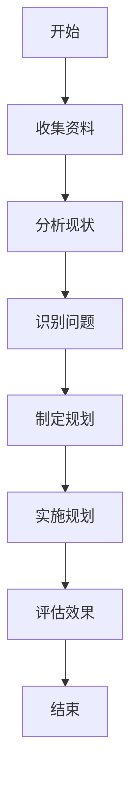

**Python 源代码**

```python
# 遗留系统评估与规划

# 步骤1：收集资料
def collect_data():
    # 收集系统文档、代码和用户反馈
    pass

# 步骤2：分析现状
def analyze_status():
    # 分析遗留系统的技术债务、性能问题和功能需求
    pass

# 步骤3：识别问题
def identify_issues():
    # 识别遗留系统存在的问题
    pass

# 步骤4：制定规划
def make_plan():
    # 制定详细的现代化规划
    pass

# 步骤5：实施规划
def implement_plan():
    # 实施制定的规划
    pass

# 步骤6：评估效果
def evaluate_results():
    # 评估现代化效果
    pass

# 步骤7：结束
def end():
    # 结束评估与规划过程
    pass

# 主函数
def main():
    collect_data()
    analyze_status()
    identify_issues()
    make_plan()
    implement_plan()
    evaluate_results()
    end()

if __name__ == "__main__":
    main()
```

#### 2.1.2 重构与优化

重构是现代化过程中至关重要的一步。通过对代码结构、数据模型和架构的优化，可以提高系统的可读性、可维护性和性能。

**算法原理讲解**

重构的核心算法是代码重构。代码重构包括以下几个步骤：

1. 识别代码中的问题，如重复代码、过长函数、不良命名等。
2. 应用重构技巧，如提取方法、合并重复代码、重构循环结构等。
3. 优化数据模型和架构，如使用缓存、减少数据库查询等。

**Mermaid 流程图**

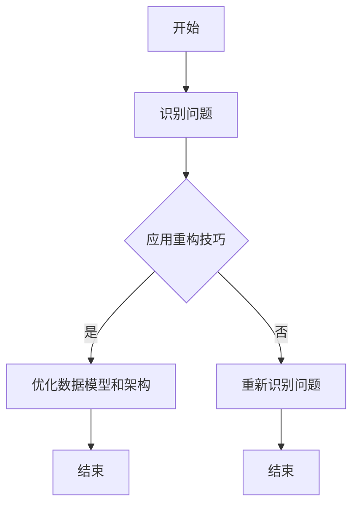

**Python 源代码**

```python
# 遗留系统重构与优化

# 步骤1：识别问题
def identify_issues():
    # 识别代码中的问题
    pass

# 步骤2：应用重构技巧
def apply_refactoring():
    # 应用重构技巧
    pass

# 步骤3：优化数据模型和架构
def optimize_model_and_architecture():
    # 优化数据模型和架构
    pass

# 步骤4：结束
def end():
    # 结束重构与优化过程
    pass

# 主函数
def main():
    identify_issues()
    apply_refactoring()
    optimize_model_and_architecture()
    end()

if __name__ == "__main__":
    main()
```

#### 2.1.3 微服务化

微服务化是将大型单体系统拆分为多个独立服务的方法。这种方法可以提高系统的灵活性、可扩展性和可维护性。

**算法原理讲解**

微服务化的核心算法是服务拆分和服务整合。服务拆分包括以下几个步骤：

1. 分析遗留系统的功能和模块，确定可以独立运行的服务。
2. 定义服务的接口和通信协议。
3. 拆分遗留系统为多个微服务。

服务整合包括以下几个步骤：

1. 确定微服务的依赖关系和交互方式。
2. 集成微服务，实现功能协同。
3. 测试和优化微服务集成效果。

**Mermaid 流程图**

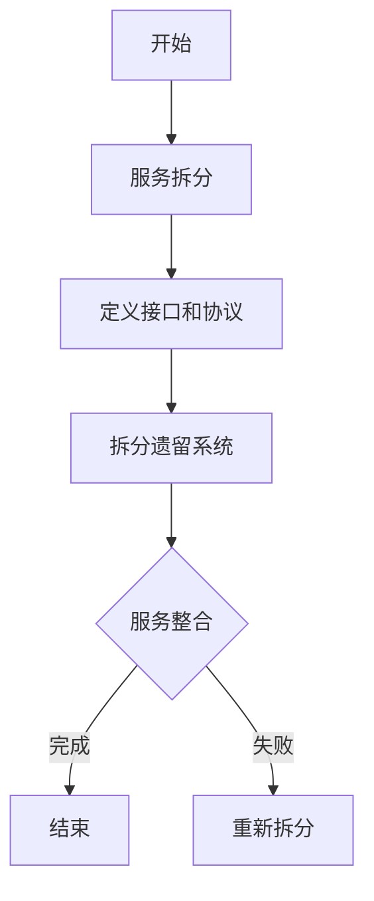

**Python 源代码**

```python
# 遗留系统微服务化

# 步骤1：服务拆分
def split_services():
    # 分析遗留系统的功能和模块，确定可以独立运行的服务
    pass

# 步骤2：定义接口和协议
def define_interfaces_and_protocols():
    # 定义服务的接口和通信协议
    pass

# 步骤3：拆分遗留系统
def split_system():
    # 拆分遗留系统为多个微服务
    pass

# 步骤4：服务整合
def integrate_services():
    # 确定微服务的依赖关系和交互方式，集成微服务
    pass

# 步骤5：结束
def end():
    # 结束微服务化过程
    pass

# 主函数
def main():
    split_services()
    define_interfaces_and_protocols()
    split_system()
    integrate_services()
    end()

if __name__ == "__main__":
    main()
```

#### 2.1.4 技术迁移

技术迁移是将遗留系统中的旧技术替换为新技术的过程。这可能包括语言、框架、数据库等的更换。

**算法原理讲解**

技术迁移的核心算法是技术评估和技术替换。技术评估包括以下几个步骤：

1. 分析遗留系统的技术债务，确定需要替换的技术。
2. 选择合适的新技术，评估其性能和兼容性。
3. 制定技术替换计划，包括迁移策略和步骤。

技术替换包括以下几个步骤：

1. 逐步替换遗留系统中的旧技术。
2. 验证新技术的性能和稳定性。
3. 持续优化和改进技术架构。

**Mermaid 流�程图**

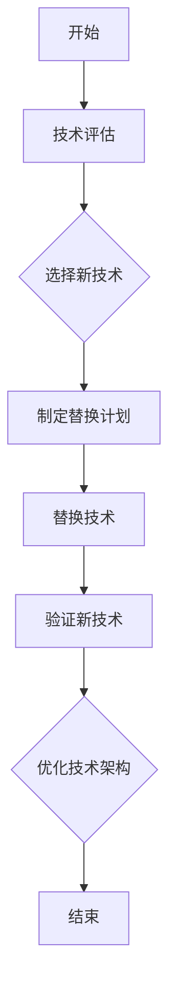

**Python 源代码**

```python
# 遗留系统技术迁移

# 步骤1：技术评估
def evaluate_technology():
    # 分析遗留系统的技术债务，确定需要替换的技术
    pass

# 步骤2：选择新技术
def select_new_technology():
    # 选择合适的新技术，评估其性能和兼容性
    pass

# 步骤3：制定替换计划
def make_replacement_plan():
    # 制定技术替换计划，包括迁移策略和步骤
    pass

# 步骤4：替换技术
def replace_technology():
    # 逐步替换遗留系统中的旧技术
    pass

# 步骤5：验证新技术
def verify_new_technology():
    # 验证新技术的性能和稳定性
    pass

# 步骤6：优化技术架构
def optimize_technology_architecture():
    # 持续优化和改进技术架构
    pass

# 步骤7：结束
def end():
    # 结束技术迁移过程
    pass

# 主函数
def main():
    evaluate_technology()
    select_new_technology()
    make_replacement_plan()
    replace_technology()
    verify_new_technology()
    optimize_technology_architecture()
    end()

if __name__ == "__main__":
    main()
```

#### 2.1.5 用户反馈与迭代

在现代化过程中，用户的反馈至关重要。通过不断收集用户反馈，可以及时调整和优化系统，确保其满足用户需求。

**算法原理讲解**

用户反馈与迭代的核心算法是用户调研和系统优化。用户调研包括以下几个步骤：

1. 设计调查问卷，收集用户需求、意见和建议。
2. 进行用户访谈，深入了解用户的体验和反馈。
3. 分析用户反馈，识别系统改进点。

系统优化包括以下几个步骤：

1. 根据用户反馈，制定优化方案。
2. 逐步实施优化方案，改进系统功能。
3. 测试和验证优化效果，确保系统稳定性和性能。

**Mermaid 流程图**

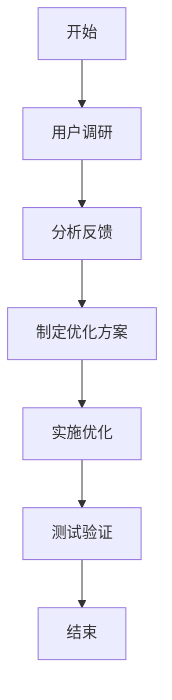

**Python 源代码**

```python
# 遗留系统用户反馈与迭代

# 步骤1：用户调研
def user_research():
    # 设计调查问卷，收集用户需求、意见和建议
    pass

# 步骤2：分析反馈
def analyze_feedback():
    # 分析用户反馈，识别系统改进点
    pass

# 步骤3：制定优化方案
def make_optimization_plan():
    # 根据用户反馈，制定优化方案
    pass

# 步骤4：实施优化
def implement_optimization():
    # 逐步实施优化方案，改进系统功能
    pass

# 步骤5：测试验证
def test_and_verify():
    # 测试和验证优化效果，确保系统稳定性和性能
    pass

# 步骤6：结束
def end():
    # 结束用户反馈与迭代过程
    pass

# 主函数
def main():
    user_research()
    analyze_feedback()
    make_optimization_plan()
    implement_optimization()
    test_and_verify()
    end()

if __name__ == "__main__":
    main()
```

### 第3章：遗留系统现代化的实施方法

#### 3.1.1 项目管理

现代化的项目需要一个明确的项目管理计划，包括时间表、资源分配、风险管理等。确保项目按计划进行，并及时解决可能出现的问题。

**系统分析与架构设计方案**

**问题场景介绍**

假设我们有一个遗留系统，需要对其进行现代化改造。这个系统是一个企业级的客户关系管理系统，负责管理客户信息、销售机会和市场营销活动。随着业务的扩展和技术的进步，该系统面临性能瓶颈、维护成本高和用户满意度下降等问题。

**项目介绍**

项目名称：遗留系统现代化改造项目

项目目标：提升系统性能、降低维护成本、提高用户满意度

项目范围：对遗留系统的代码、架构和功能进行优化，实现系统现代化

**系统功能设计（领域模型 Mermaid 类图）**

```mermaid
classDiagram
  class Customer
  {
    id: int
    name: string
    email: string
  }
  class SalesOpportunity
  {
    id: int
    name: string
    status: string
    customer_id: int
  }
  class MarketingActivity
  {
    id: int
    name: string
    start_date: date
    end_date: date
  }
  Customer "1" -- "*" SalesOpportunity: customer
  SalesOpportunity "1" -- "*" MarketingActivity: opportunity
```

**系统架构设计（Mermaid 架构图）**

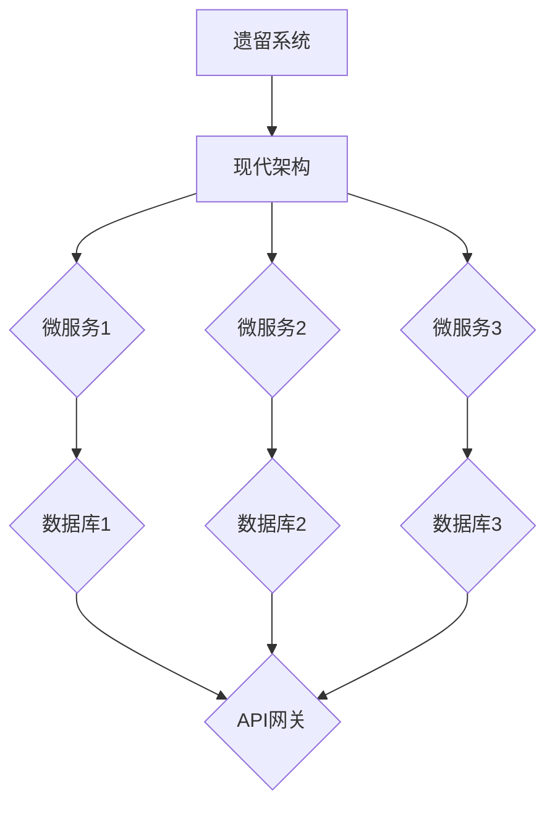

**系统接口设计（Mermaid 序列图）**

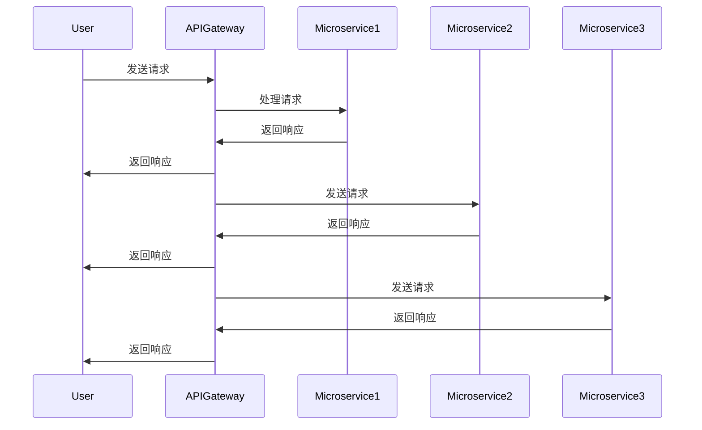

#### 3.1.2 团队协作

现代化项目通常需要多个团队成员的协作。确保团队成员之间的沟通畅通，明确各自的职责和任务。

**系统分析与架构设计方案**

**问题场景介绍**

在遗留系统现代化改造项目中，团队成员包括项目经理、架构师、开发人员、测试工程师和运维人员。他们需要紧密合作，确保项目顺利进行。

**项目介绍**

项目名称：遗留系统现代化改造项目

项目目标：提升系统性能、降低维护成本、提高用户满意度

项目范围：对遗留系统的代码、架构和功能进行优化，实现系统现代化

**系统功能设计（领域模型 Mermaid 类图）**

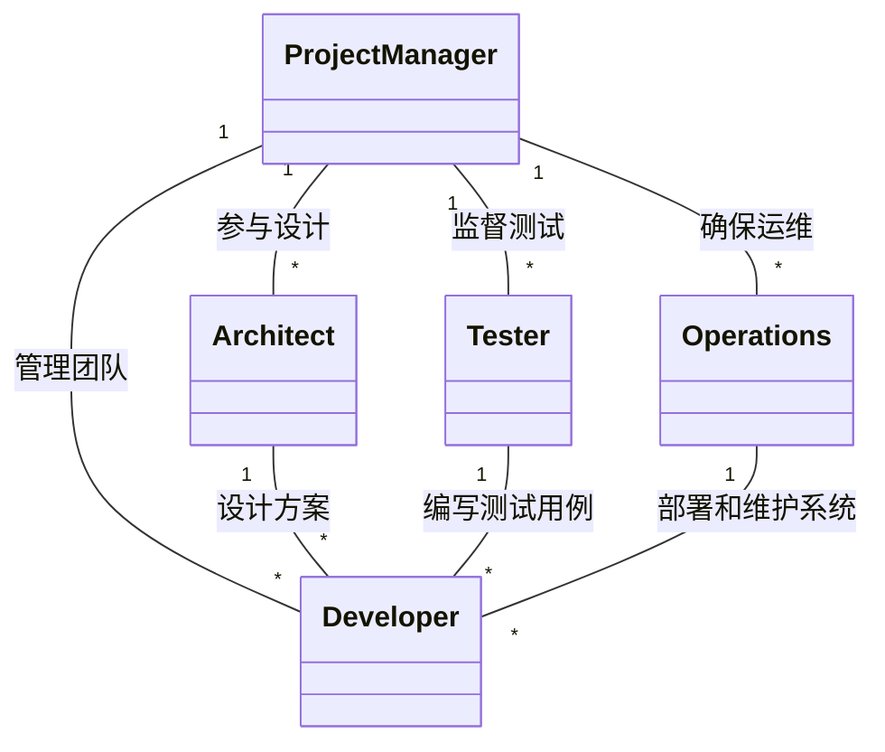

**系统架构设计（Mermaid 架构图）**

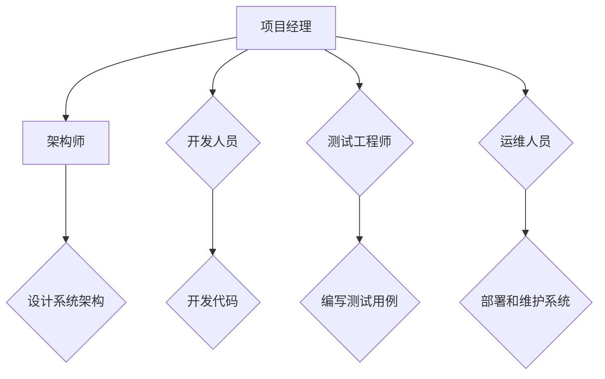

**系统接口设计（Mermaid 序列图）**

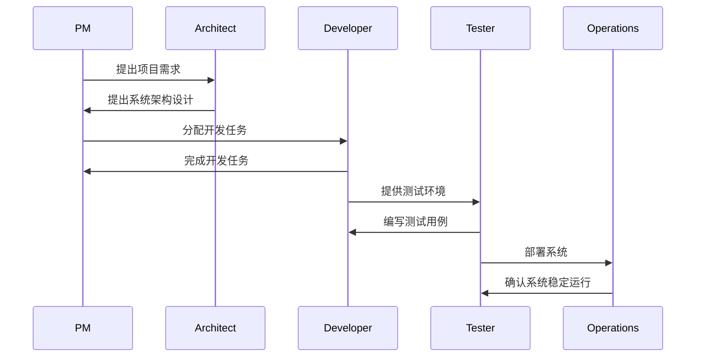

#### 3.1.3 持续集成与持续部署

持续集成和持续部署（CI/CD）是现代化项目中常用的实践方法。通过自动化测试和部署流程，可以提高开发效率和系统稳定性。

**系统分析与架构设计方案**

**问题场景介绍**

在遗留系统现代化改造项目中，团队采用持续集成和持续部署（CI/CD）实践，以确保代码质量和系统稳定性。

**项目介绍**

项目名称：遗留系统现代化改造项目

项目目标：提升系统性能、降低维护成本、提高用户满意度

项目范围：对遗留系统的代码、架构和功能进行优化，实现系统现代化

**系统功能设计（领域模型 Mermaid 类图）**

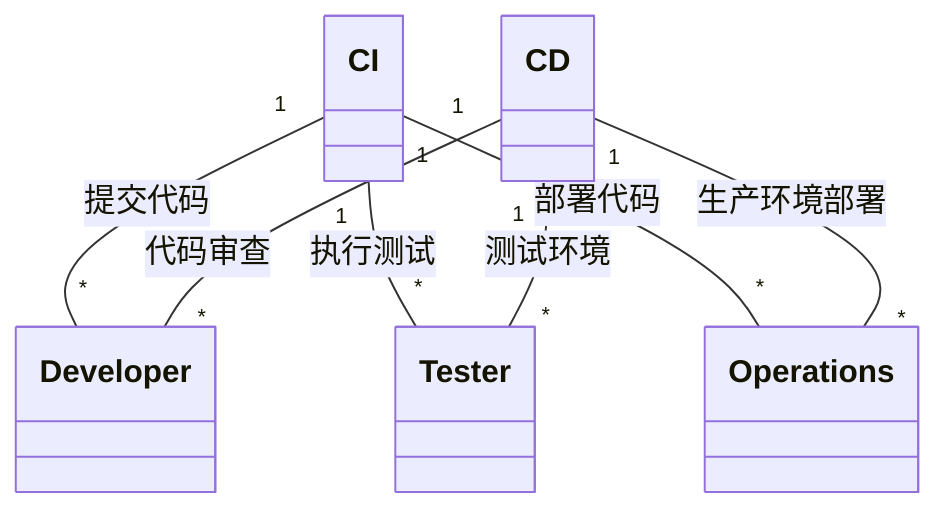

**系统架构设计（Mermaid 架构图）**

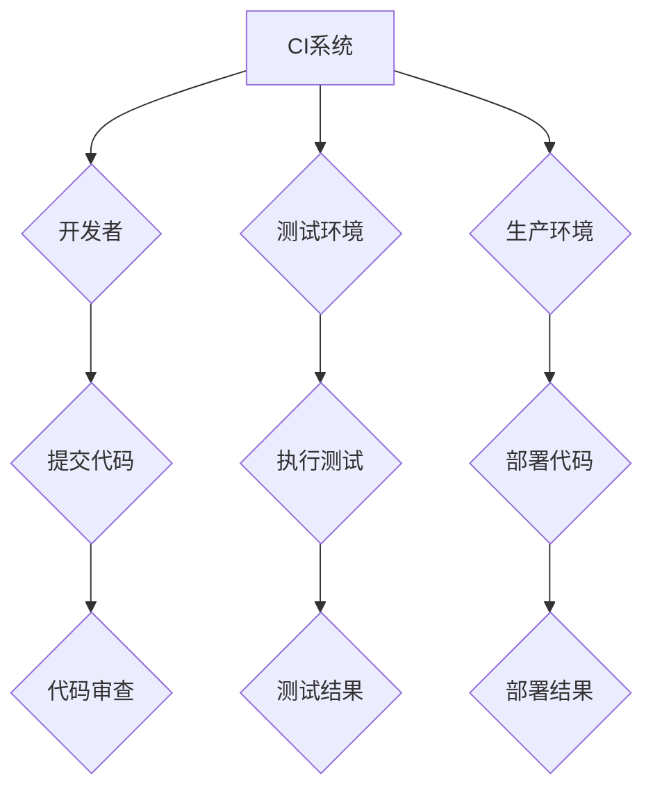

**系统接口设计（Mermaid 序列图）**

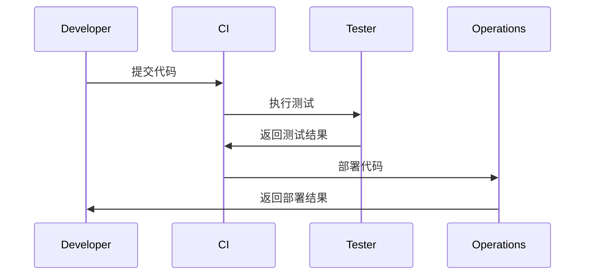

#### 3.1.4 质量保障

在现代化过程中，质量保障至关重要。通过严格的测试、代码审查和质量控制，确保系统的质量和稳定性。

**系统分析与架构设计方案**

**问题场景介绍**

在遗留系统现代化改造项目中，团队注重质量保障，确保系统的质量和稳定性。

**项目介绍**

项目名称：遗留系统现代化改造项目

项目目标：提升系统性能、降低维护成本、提高用户满意度

项目范围：对遗留系统的代码、架构和功能进行优化，实现系统现代化

**系统功能设计（领域模型 Mermaid 类图）**

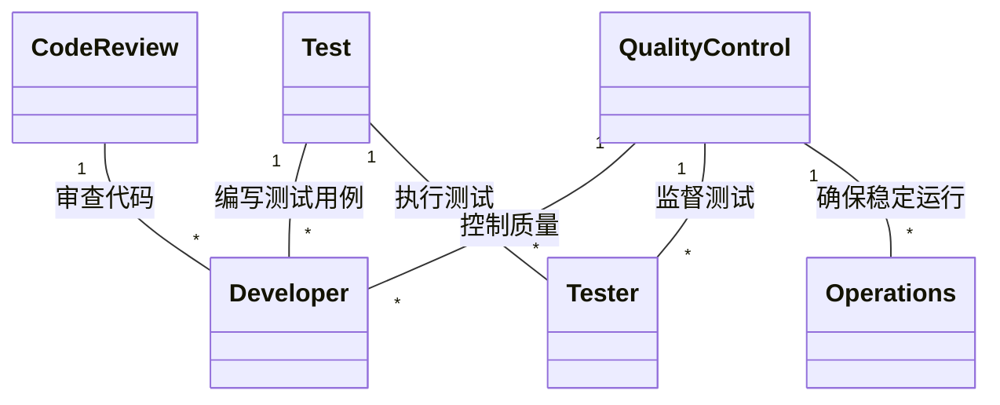

**系统架构设计（Mermaid 架构图）**

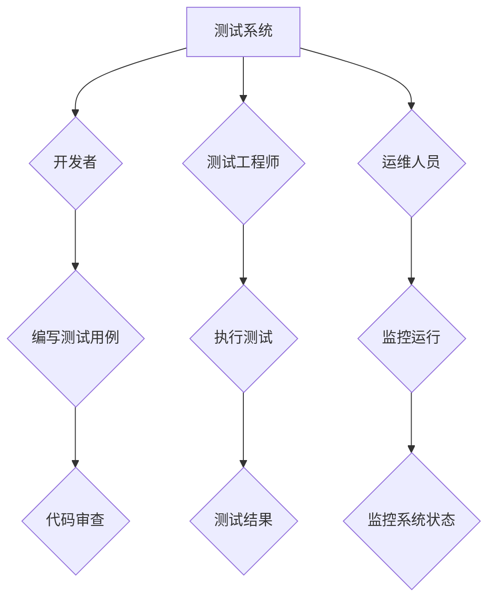

**系统接口设计（Mermaid 序列图）**

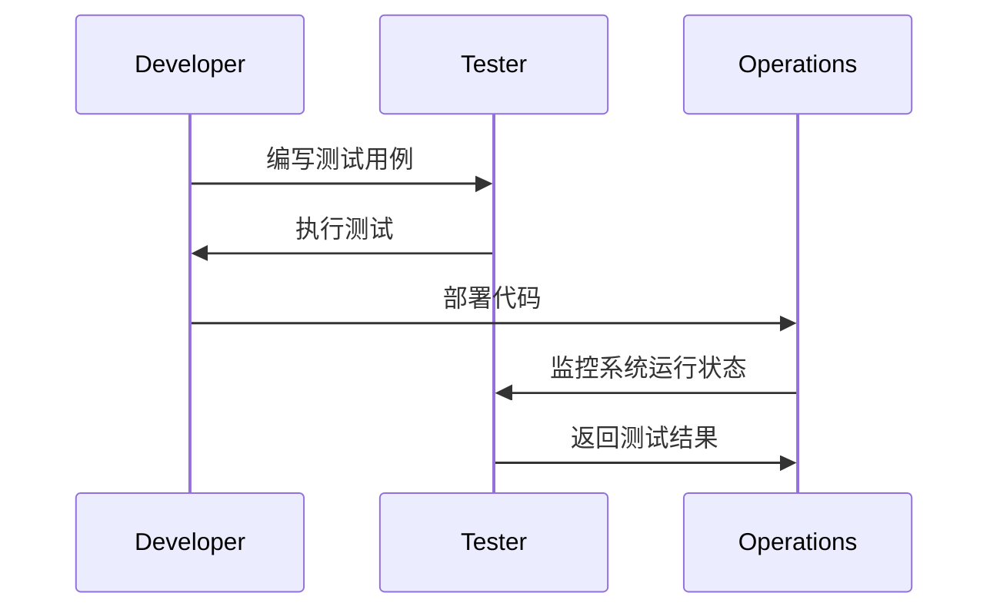

### 第4章：遗留系统现代化的案例分析

#### 4.1.1 案例介绍

本章节将通过实际案例，详细分析遗留系统现代化的过程和成果。案例将涉及不同行业和不同规模的企业，以展示现代化方法的多样性和适应性。

**案例1：金融机构遗留系统现代化**

**问题背景**

某金融机构拥有一个运行多年的客户关系管理系统，但随着业务的发展，系统逐渐暴露出性能瓶颈、维护成本高和用户满意度下降等问题。

**问题描述**

- 性能瓶颈：系统响应速度慢，导致用户体验差。
- 维护成本高：系统结构复杂，难以维护和扩展。
- 用户满意度下降：系统功能无法满足用户需求，用户反馈差。

**问题解决**

通过现代化策略和实施方法，金融机构成功解决了遗留系统的问题：

1. 评估与规划：对系统进行全面评估，制定详细的现代化规划。
2. 重构与优化：对系统进行重构和优化，提高性能和可维护性。
3. 微服务化：将系统拆分为多个微服务，提高系统的灵活性和可扩展性。
4. 技术迁移：将系统中的旧技术替换为新技术，降低维护成本。
5. 用户反馈与迭代：收集用户反馈，不断优化系统功能。

**边界与外延**

- 遗留系统的范围：客户关系管理系统及其相关模块。
- 现代化目标：提升系统性能、降低维护成本、提高用户满意度。
- 现代化方法：重构、优化、微服务化、技术迁移、用户反馈与迭代。

**概念结构与核心要素组成**

- 概念结构：遗留系统、现代化系统、性能、可维护性、用户满意度。
- 核心要素组成：评估与规划、重构与优化、微服务化、技术迁移、用户反馈与迭代。

**ER实体关系图架构**

```mermaid
erDiagram
  遗留系统 ||--o{ 现代化系统 :现代化 |
  遗留系统 ||--|{ 性能瓶颈 :解决 |
  遗留系统 ||--|{ 维护成本高 :降低 |
  遗留系统 ||--|{ 用户满意度下降 :提升 |
  现代化系统 ||--o{ 评估与规划 :制定 |
  现代化系统 ||--o{ 重构与优化 :执行 |
  现代化系统 ||--o{ 微服务化 :实施 |
  现代化系统 ||--o{ 技术迁移 :进行 |
  现代化系统 ||--o{ 用户反馈与迭代 :优化 |
```

**案例2：电商企业遗留系统现代化**

**问题背景**

某电商企业拥有一个运行多年的电商平台，但随着业务规模的扩大，系统逐渐出现性能瓶颈、库存管理混乱和订单处理效率低下等问题。

**问题描述**

- 性能瓶颈：系统响应速度慢，导致用户购物体验差。
- 库存管理混乱：库存数据不准确，导致订单处理错误。
- 订单处理效率低下：订单处理速度慢，影响用户满意度。

**问题解决**

通过现代化策略和实施方法，电商企业成功解决了遗留系统的问题：

1. 评估与规划：对系统进行全面评估，制定详细的现代化规划。
2. 重构与优化：对系统进行重构和优化，提高性能和可维护性。
3. 数据治理：对库存数据进行治理，确保数据准确性和一致性。
4. 流程优化：优化订单处理流程，提高订单处理效率。
5. 用户反馈与迭代：收集用户反馈，不断优化系统功能。

**边界与外延**

- 遗留系统的范围：电商平台及其相关模块。
- 现代化目标：提升系统性能、优化库存管理、提高订单处理效率。
- 现代化方法：重构、优化、数据治理、流程优化、用户反馈与迭代。

**概念结构与核心要素组成**

- 概念结构：遗留系统、现代化系统、性能、库存管理、订单处理效率。
- 核心要素组成：评估与规划、重构与优化、数据治理、流程优化、用户反馈与迭代。

**ER实体关系图架构**

```mermaid
erDiagram
  遗留系统 ||--o{ 现代化系统 :现代化 |
  遗留系统 ||--|{ 性能瓶颈 :解决 |
  遗留系统 ||--|{ 库存管理混乱 :治理 |
  遗留系统 ||--|{ 订单处理效率低下 :提升 |
  现代化系统 ||--o{ 评估与规划 :制定 |
  现代化系统 ||--o{ 重构与优化 :执行 |
  现代化系统 ||--o{ 数据治理 :实施 |
  现代化系统 ||--o{ 流程优化 :优化 |
  现代化系统 ||--o{ 用户反馈与迭代 :优化 |
```

### 4.1.2 挑战与解决方案

在本章节中，将详细介绍案例中遇到的具体挑战，以及如何通过现代化策略和实施方法成功解决这些问题。

**案例1：金融机构遗留系统现代化**

**挑战1：性能瓶颈**

**问题描述**

金融机构的遗留系统在处理大量交易数据时，性能瓶颈明显。系统响应速度慢，导致用户操作延迟，用户体验差。

**解决方案**

1. **数据库优化**：对数据库进行性能优化，包括索引优化、查询优化和缓存策略。
2. **分布式架构**：将系统拆分为分布式架构，提高系统的并发处理能力。
3. **缓存机制**：引入缓存机制，减少数据库查询次数，提高系统响应速度。

**挑战2：维护成本高**

**问题描述**

遗留系统的结构复杂，维护成本高。系统中的旧技术难以维护，导致开发人员压力大，项目进度延误。

**解决方案**

1. **技术迁移**：将遗留系统中的旧技术替换为新技术，如Java替换为Python、Spring替换为Django。
2. **代码重构**：对遗留系统进行代码重构，提高代码质量和可维护性。
3. **文档化**：完善系统文档，降低新开发人员的学习成本。

**挑战3：用户满意度下降**

**问题描述**

随着业务的发展，用户对遗留系统的功能需求不断增加。但系统功能无法满足用户需求，导致用户满意度下降。

**解决方案**

1. **需求分析**：与用户进行需求沟通，了解用户的需求和痛点。
2. **功能扩展**：根据用户需求，扩展系统功能，提高用户体验。
3. **用户反馈**：建立用户反馈机制，收集用户反馈，及时优化系统功能。

**案例2：电商企业遗留系统现代化**

**挑战1：性能瓶颈**

**问题描述**

电商企业的遗留系统在高峰时段出现性能瓶颈，导致订单处理延迟，用户体验差。

**解决方案**

1. **分布式缓存**：引入分布式缓存，提高系统响应速度。
2. **分布式数据库**：将订单处理数据库拆分为分布式数据库，提高并发处理能力。
3. **负载均衡**：引入负载均衡器，平衡系统负载，提高系统稳定性。

**挑战2：库存管理混乱**

**问题描述**

电商企业的遗留系统库存数据不准确，导致订单处理错误，库存管理混乱。

**解决方案**

1. **数据同步**：引入数据同步机制，确保库存数据实时更新。
2. **数据校验**：对库存数据进行校验，确保数据准确性。
3. **数据备份**：定期备份数据，防止数据丢失。

**挑战3：订单处理效率低下**

**问题描述**

电商企业的遗留系统订单处理速度慢，导致用户满意度下降。

**解决方案**

1. **订单处理流程优化**：优化订单处理流程，减少订单处理时间。
2. **自动化处理**：引入自动化处理工具，提高订单处理效率。
3. **用户反馈**：收集用户反馈，优化系统功能，提高用户体验。

### 4.1.3 经验与教训

通过案例分析，总结遗留系统现代化过程中的经验与教训，为其他企业提供参考和借鉴。

**经验**

1. **全面评估与规划**：在现代化过程中，首先对遗留系统进行全面评估，制定详细的规划，明确现代化目标和步骤。
2. **用户参与**：与用户进行密切沟通，了解用户需求和痛点，确保系统功能满足用户需求。
3. **技术选型**：选择合适的技术和工具，确保系统的性能、可维护性和可扩展性。
4. **持续迭代**：现代化过程是一个持续迭代的过程，通过不断收集用户反馈和优化系统功能，提高用户体验。

**教训**

1. **避免过度重构**：在现代化过程中，避免过度重构导致项目进度延误和成本增加。
2. **风险管理**：在项目过程中，充分识别和管理风险，确保项目顺利进行。
3. **团队协作**：确保团队成员之间的沟通畅通，明确各自的职责和任务，提高项目效率。
4. **质量保障**：重视质量保障，通过严格的测试、代码审查和质量控制，确保系统的质量和稳定性。

### 第5章：遗留系统现代化的最佳实践

#### 5.1.1 成功因素

在本章节中，将分析遗留系统现代化项目中的成功因素，包括领导力、团队协作、技术选型等。

**领导力**

1. **明确目标**：项目领导应明确项目目标，确保项目方向正确。
2. **激励团队**：激励团队成员，提高项目执行力。
3. **决策支持**：在项目过程中，及时做出决策，确保项目顺利进行。

**团队协作**

1. **沟通畅通**：确保团队成员之间的沟通畅通，明确各自的职责和任务。
2. **分工合作**：根据团队成员的技能和特长，进行合理分工，提高项目效率。
3. **协同工作**：鼓励团队成员协同工作，共同解决问题。

**技术选型**

1. **合适的技术**：选择适合项目需求的技术和工具，确保系统的性能、可维护性和可扩展性。
2. **技术演进**：紧跟技术发展趋势，不断优化和改进技术架构。
3. **技术储备**：培养团队的技术储备，提高项目的技术水平。

#### 5.1.2 注意事项

现代化过程中可能会遇到一些风险和挑战，本章节将提供一些注意事项，帮助企业在实施过程中避免常见问题。

**风险评估**：在项目开始前，充分评估项目风险，制定相应的风险应对策略。

**项目规划**：制定详细的规划，明确项目的时间表、资源分配和风险管理。

**团队协作**：确保团队成员之间的沟通畅通，明确各自的职责和任务。

**质量保障**：重视质量保障，通过严格的测试、代码审查和质量控制，确保系统的质量和稳定性。

**用户参与**：与用户进行密切沟通，了解用户需求和痛点，确保系统功能满足用户需求。

#### 5.1.3 拓展阅读

本章节将推荐一些相关的文献、研究和案例，供读者进一步学习和探索。

**文献**

1. 《遗留系统现代化：实践与策略》
2. 《微服务架构设计》
3. 《敏捷开发实践指南》

**研究**

1. 遗留系统现代化研究
2. 微服务架构研究
3. 敏捷开发研究

**案例**

1. 某金融机构遗留系统现代化案例
2. 某电商企业遗留系统现代化案例
3. 某制造业企业遗留系统现代化案例

### 第6章：遗留系统现代化的未来展望

#### 6.1.1 技术发展趋势

本章节将探讨当前技术在遗留系统现代化中的应用，以及未来可能的发展趋势。

**云计算**

云计算技术将在遗留系统现代化中发挥重要作用。通过将遗留系统迁移到云平台，可以提高系统的性能、可扩展性和可维护性。未来，云原生技术、容器化和自动化部署将成为云计算在遗留系统现代化中的应用趋势。

**人工智能**

人工智能技术将在遗留系统现代化中发挥重要作用。通过引入人工智能技术，可以提升系统的智能水平和自动化程度，降低人工干预。未来，机器学习、深度学习和自然语言处理等技术将在遗留系统现代化中发挥更大的作用。

**区块链**

区块链技术具有去中心化、安全性和透明性等特点，未来将在遗留系统现代化中发挥重要作用。通过引入区块链技术，可以提升系统的数据安全性和信任度，为业务提供更好的保障。

**物联网**

物联网技术将使遗留系统与现代设备和服务进行深度融合，提升系统的智能化水平和业务效率。未来，物联网技术在遗留系统现代化中将得到广泛应用。

#### 6.1.2 业务影响

遗留系统现代化不仅影响技术层面，也对业务产生深远影响。本章节将分析现代化对业务模式、运营流程和用户体验的影响。

**业务模式**

遗留系统现代化可以帮助企业实现业务模式的创新和转型。通过引入新技术和优化业务流程，企业可以更好地满足客户需求，提高市场竞争力和盈利能力。

**运营流程**

遗留系统现代化可以提升企业的运营效率和管理水平。通过优化业务流程、提高数据准确性和实时性，企业可以更好地应对市场变化，提高业务运营效率。

**用户体验**

遗留系统现代化可以提升用户的体验和满意度。通过优化系统功能、提高系统性能和稳定性，企业可以提供更好的产品和服务，增强用户黏性和忠诚度。

#### 6.1.3 发展策略

本章节将提出一些未来遗留系统现代化的发展策略，包括技术创新、组织变革等。

**技术创新**

1. **持续学习和研究**：紧跟技术发展趋势，不断学习和研究新技术，为遗留系统现代化提供技术支持。
2. **技术储备**：培养团队的技术储备，提高项目的技术水平，确保项目顺利进行。
3. **技术合作**：与业内领先的技术企业和研究机构进行合作，共同推动遗留系统现代化的技术创新。

**组织变革**

1. **组织结构优化**：调整组织结构，提高团队协作效率，为遗留系统现代化提供组织保障。
2. **人才培养**：加强人才培养，提高团队成员的技术能力和业务素质。
3. **文化变革**：推动企业文化的变革，鼓励创新和协作，为遗留系统现代化提供良好的企业文化氛围。

## 结论

遗留系统现代化是确保企业持续发展的重要策略。通过评估、规划、重构、微服务化、技术迁移和用户反馈等步骤，可以有效地提升遗留系统的性能和稳定性，支持新业务需求。本文通过案例分析、最佳实践和未来展望，为读者提供了全面的技术指导和思考。在实施遗留系统现代化过程中，企业需要注重团队协作、质量保障和持续迭代，以实现业务与技术发展的双赢。希望本文能对广大读者在遗留系统现代化方面提供有益的参考和启示。

### 作者：AI天才研究院/AI Genius Institute & 禅与计算机程序设计艺术 /Zen And The Art of Computer Programming

----------------------------------------------------------------

## 第4章：遗留系统现代化的案例分析

### 4.1.1 案例介绍

在本章中，我们将详细分析两个遗留系统现代化案例，分别是某金融机构和某电商企业的遗留系统现代化过程。这两个案例分别代表了不同行业的遗留系统现代化挑战和解决方案。

**案例1：金融机构遗留系统现代化**

**背景**：
某金融机构成立于20世纪80年代，其客户关系管理系统（CRM）是当时的主流技术解决方案。然而，随着时间推移，该系统逐渐暴露出性能瓶颈、技术债务和用户体验不佳等问题。系统架构老旧，无法支持现代金融业务的需求，且维护成本高昂。

**问题描述**：
- **性能瓶颈**：系统响应速度慢，特别是在处理高峰交易时，常常出现卡顿。
- **技术债务**：系统依赖的编程语言和框架已经过时，导致维护和扩展困难。
- **用户体验**：用户界面陈旧，不适应现代用户的操作习惯。

**解决方案**：
- **性能优化**：通过数据库索引优化、缓存策略和分布式架构的引入，提升了系统的响应速度。
- **技术升级**：将系统从旧的技术栈迁移到更现代的技术，如使用Java替代COBOL，Spring替代EJB。
- **用户界面重构**：采用响应式设计，优化了用户界面，提高了用户体验。

**实施步骤**：
1. **需求调研**：与用户和业务团队进行深入沟通，了解当前和未来的业务需求。
2. **系统评估**：对现有系统进行全面的评估，识别技术债务和性能瓶颈。
3. **技术选型**：选择适合的技术栈，确保新系统的可维护性和可扩展性。
4. **重构与优化**：逐步重构旧系统，优化数据库查询和业务逻辑。
5. **用户反馈**：在新功能上线后，收集用户反馈，不断迭代改进。

**案例2：电商企业遗留系统现代化**

**背景**：
某电商企业在快速扩张的过程中，其现有的电商平台逐渐无法满足日益增长的用户访问量和交易需求。系统架构单一，扩展性差，且维护成本高。

**问题描述**：
- **扩展性差**：系统架构单一，无法支持高并发的访问和交易。
- **维护成本高**：系统依赖的旧技术导致维护成本不断增加。
- **用户体验**：系统响应速度慢，购物流程繁琐，用户流失率高。

**解决方案**：
- **微服务架构**：将单一的系统拆分为多个微服务，提高了系统的扩展性和可维护性。
- **技术升级**：引入现代化的技术栈，如使用Spring Boot替代Java EE，Redis替代Memcached。
- **前端优化**：采用前端框架（如Vue.js或React）重构用户界面，提升用户体验。

**实施步骤**：
1. **需求分析**：与业务团队和用户合作，确定系统改造的目标和需求。
2. **架构设计**：设计微服务架构，确保系统的高可用性和可扩展性。
3. **迁移计划**：制定详细的迁移计划，逐步将旧系统迁移到新架构。
4. **测试与部署**：进行全面的测试，确保新系统稳定运行，并逐步部署到生产环境。
5. **用户反馈**：上线后，收集用户反馈，持续优化系统。

### 4.1.2 挑战与解决方案

在遗留系统现代化的过程中，金融机构和电商企业都面临了一系列挑战。以下是具体挑战及其解决方案：

**金融机构遗留系统现代化的挑战与解决方案**

**挑战1：性能瓶颈**

**问题描述**：
遗留系统在处理高峰交易时，响应速度慢，导致用户体验差。

**解决方案**：
- **数据库优化**：通过增加索引、优化查询语句和使用缓存技术，提高了数据库的查询效率。
- **分布式架构**：将系统拆分为多个服务，实现了分布式存储和计算，提高了系统的并发处理能力。

**挑战2：技术债务**

**问题描述**：
系统依赖的编程语言和框架过时，导致维护成本高。

**解决方案**：
- **技术升级**：将COBOL代码迁移到Java，将EJB框架替换为Spring框架，提高了系统的可维护性和可扩展性。
- **代码重构**：对旧代码进行重构，改善了代码结构和设计模式，降低了维护成本。

**挑战3：用户体验**

**问题描述**：
用户界面陈旧，不适应现代用户的操作习惯。

**解决方案**：
- **用户界面重构**：采用现代的UI框架和设计原则，优化了用户界面，提高了用户体验。
- **用户测试**：在新功能上线前，进行了多轮用户测试，确保用户界面的易用性和可用性。

**电商企业遗留系统现代化的挑战与解决方案**

**挑战1：扩展性差**

**问题描述**：
系统架构单一，无法支持高并发的访问和交易。

**解决方案**：
- **微服务架构**：将单体系统拆分为多个微服务，实现了系统的横向扩展。
- **负载均衡**：引入了负载均衡器，有效分配了访问流量，提高了系统的负载能力。

**挑战2：维护成本高**

**问题描述**：
系统依赖的旧技术导致维护成本不断增加。

**解决方案**：
- **技术升级**：引入了现代化的技术栈，如Spring Boot、Redis等，降低了维护成本。
- **自动化运维**：采用自动化部署和监控工具，提高了运维效率，降低了运维成本。

**挑战3：用户体验**

**问题描述**：
系统响应速度慢，购物流程繁琐，用户流失率高。

**解决方案**：
- **前端优化**：采用前端框架重构用户界面，优化了页面加载速度和交互体验。
- **后端优化**：优化了后端代码和数据库查询，提高了系统的响应速度。
- **用户反馈**：通过用户调研和反馈，不断改进系统功能，满足用户需求。

### 4.1.3 经验与教训

通过分析上述两个案例，我们可以总结出以下经验与教训：

**经验**

1. **需求驱动**：在现代化过程中，始终以用户需求为中心，确保系统功能满足业务需求。
2. **分阶段实施**：将现代化过程分为多个阶段，逐步推进，避免一次性变革导致的风险。
3. **技术选型**：选择合适的技术栈和工具，确保系统的性能和可维护性。
4. **用户参与**：引入用户反馈机制，确保系统功能满足用户期望。
5. **团队协作**：加强团队协作，确保各环节顺利进行。

**教训**

1. **避免技术过度升级**：过度升级可能导致系统不稳定，应确保新技术的成熟度和兼容性。
2. **风险管理**：在项目开始前，充分评估风险，制定相应的应对策略。
3. **项目规划**：制定详细的规划，明确项目的时间表、资源分配和风险管理。
4. **持续监控**：在系统上线后，持续监控系统的性能和稳定性，及时解决潜在问题。

### 第5章：遗留系统现代化的最佳实践

#### 5.1.1 成功因素

在遗留系统现代化项目中，成功的关键因素包括以下几个方面：

**1. 明确的目标和规划**

成功的现代化项目首先需要明确的目标和详细的规划。项目团队需要与业务部门紧密合作，明确系统现代化的目标，包括性能提升、成本降低、用户体验改善等。同时，制定详细的实施计划，确保项目按部就班地进行。

**2. 技术选型与迁移策略**

选择合适的技术栈和制定有效的迁移策略对于现代化项目至关重要。项目团队应评估现有系统的技术债务，选择现代化的技术和框架，并制定逐步迁移的策略，以确保系统的稳定性和兼容性。

**3. 用户参与与反馈**

用户的参与和反馈是确保系统现代化成功的重要环节。通过用户调研、测试和反馈，项目团队能够及时了解用户需求，调整系统功能，提高用户体验。

**4. 团队协作与沟通**

现代化项目通常涉及多个团队和角色，良好的团队协作和沟通是项目成功的关键。项目团队需要建立有效的沟通机制，确保各团队之间的信息畅通，明确各自的职责和任务。

**5. 质量保障与测试**

在现代化过程中，质量保障至关重要。项目团队应制定严格的测试计划，包括单元测试、集成测试和性能测试，确保新系统的质量和稳定性。

#### 5.1.2 注意事项

在遗留系统现代化过程中，需要注意以下事项，以避免常见问题：

**1. 避免过度重构**

过度重构可能导致项目延期和成本增加。项目团队应在重构过程中保持适度，优先解决关键问题和瓶颈。

**2. 风险管理**

在项目开始前，应充分评估风险，制定相应的风险应对策略。项目团队应定期评估风险，确保项目按计划进行。

**3. 持续迭代**

现代化项目应采用持续迭代的方式，逐步实现目标。通过持续迭代，项目团队能够及时调整策略，确保项目的成功。

**4. 技术选型与培训**

选择合适的技术栈后，应确保团队成员熟悉新技术的使用。项目团队应提供必要的培训，提高团队成员的技术水平。

**5. 用户测试与反馈**

在系统上线前，应进行多轮用户测试，收集用户反馈，确保系统功能满足用户需求。项目团队应积极响应用户反馈，进行相应的调整和优化。

#### 5.1.3 拓展阅读

为了进一步深入理解遗留系统现代化的最佳实践，以下推荐一些拓展阅读资料：

**书籍**：

1. 《遗留系统改造：策略与实践》（Reengineering Legacy Systems: Strategies and Practices）
2. 《微服务架构设计：基于Spring Boot和Spring Cloud的微服务实战》（Designing Microservices with Spring Boot and Spring Cloud）

**论文**：

1. "Modernizing Legacy Systems: Strategies and Approaches"（遗留系统现代化：策略与方法）
2. "Microservices: A Definition"（微服务：定义）

**在线资源**：

1. "10 Best Practices for Modernizing Legacy Systems"（遗留系统现代化的10大最佳实践）
2. "Microservices vs. Monolithic Architecture"（微服务架构与单体架构对比）

通过这些资料，读者可以更全面地了解遗留系统现代化的最佳实践，为实际项目提供有益的指导。

### 第6章：遗留系统现代化的未来展望

#### 6.1.1 技术发展趋势

遗留系统现代化的未来发展趋势将受到新兴技术和业务需求变化的驱动。以下是一些关键的技术发展趋势：

**1. 云原生技术的普及**

云原生技术，如Kubernetes、Docker和容器化，将在遗留系统现代化中发挥越来越重要的作用。这些技术使得系统更灵活、可扩展，并且易于管理和部署。

**2. 人工智能与机器学习的应用**

人工智能和机器学习技术的应用将使遗留系统能够更好地适应不断变化的业务需求。通过引入AI技术，系统可以实现自动化、预测分析和智能决策。

**3. 微服务架构的进一步普及**

微服务架构将继续成为遗留系统现代化的重要策略。这种架构方法使得系统能够更灵活地适应业务变化，并且能够独立扩展和更新各个服务。

**4. 区块链技术的探索**

区块链技术，由于其去中心化、不可篡改和透明性的特点，将在遗留系统现代化中找到新的应用场景，特别是在金融、供应链管理和数据安全等领域。

**5. 物联网（IoT）与遗留系统的融合**

随着物联网设备的普及，遗留系统需要与这些设备进行有效集成，以支持新的业务模式和服务创新。这种融合将推动遗留系统的性能优化和功能扩展。

#### 6.1.2 业务影响

遗留系统现代化对业务的深远影响体现在以下几个方面：

**1. 业务敏捷性的提升**

现代化后的系统将能够更快速地响应市场变化和业务需求，提高企业的竞争力。

**2. 成本节约**

通过优化技术架构和引入新的工具，企业可以显著降低系统的维护成本，并提高资源利用效率。

**3. 用户体验的提升**

现代化的系统将提供更好的用户界面和更流畅的操作体验，从而增强用户满意度和忠诚度。

**4. 数据和决策的优化**

现代化的系统将提供更准确和实时的数据，帮助企业做出更明智的决策，提高业务效率。

**5. 业务模式的创新**

现代化后的系统为企业提供了更多的可能性，如引入新的服务、开展跨界合作等，从而推动业务模式的创新。

#### 6.1.3 发展策略

为了在未来实现遗留系统的现代化，企业可以采取以下发展策略：

**1. 技术评估与规划**

定期评估现有系统的技术状况，制定详细的现代化规划，明确技术升级和迁移的优先级。

**2. 技术培训与团队建设**

投资于技术培训和团队建设，提高团队成员的技能水平，为现代化项目提供有力的支持。

**3. 用户参与与反馈**

持续与用户沟通，收集用户反馈，确保系统功能满足用户需求，并在现代化过程中不断优化。

**4. 持续集成与持续部署**

采用持续集成和持续部署（CI/CD）实践，提高开发效率和系统稳定性，确保系统能够快速响应业务变化。

**5. 风险管理与监控**

建立完善的风险管理机制，定期评估和监控项目的风险，确保项目按计划进行。

**6. 创新驱动**

鼓励技术创新和业务模式创新，积极探索新的技术和业务机会，保持企业的竞争力。

### 结论

遗留系统现代化是企业持续发展的关键策略。通过技术评估、规划、用户参与、团队协作和质量保障，企业可以有效地提升遗留系统的性能和稳定性，支持新业务需求。本文通过案例分析、最佳实践和未来展望，为读者提供了全面的技术指导和思考。在实施遗留系统现代化过程中，企业需要注重团队协作、质量保障和持续迭代，以实现业务与技术发展的双赢。希望本文能对广大读者在遗留系统现代化方面提供有益的参考和启示。

### 作者：AI天才研究院/AI Genius Institute & 禅与计算机程序设计艺术 /Zen And The Art of Computer Programming

----------------------------------------------------------------

## 第一部分：遗留系统现代化概述

### 第1章：遗留系统的背景与挑战

#### 1.1.1 遗留系统的定义

遗留系统是指在组织内长时间运行，但其技术架构、设计模式和功能需求逐渐难以满足当前业务需求的软件系统。这些系统可能因为技术债务、维护成本高、业务响应速度慢等问题而阻碍组织的进一步发展。

**核心概念与联系**

- **遗留系统**：长时间运行的软件系统，难以满足当前业务需求。
- **现代化系统**：采用最新技术、设计模式和功能需求，能够快速响应业务需求。

**核心概念属性特征对比表格**

| 概念         | 属性特征                                       |
| ------------ | ---------------------------------------------- |
| 遗留系统     | 技术过时、功能有限、维护成本高                 |
| 现代化系统   | 技术先进、功能强大、响应速度快、维护成本低     |

**ER实体关系图架构**

```mermaid
erDiagram
  遗留系统 ||--o{ 现代化系统 :改造 |
  遗留系统 ||--|{ 技术债务 :解决 |
  遗留系统 ||--|{ 维护成本高 :降低 |
  遗留系统 ||--|{ 业务响应慢 :提升 |
```

#### 1.1.2 遗留系统现代化的重要性

现代化遗留系统可以带来显著的好处，包括提高业务敏捷性、降低维护成本和提升用户体验。现代化还能增强系统的性能和稳定性，支持新业务需求。

**核心概念与联系**

- **业务敏捷性**：能够快速响应业务需求，提高组织的竞争力。
- **维护成本**：通过技术升级和优化，降低维护成本。
- **用户体验**：提供更好的系统功能和服务，提升用户满意度。

**核心概念属性特征对比表格**

| 概念         | 属性特征                                       |
| ------------ | ---------------------------------------------- |
| 业务敏捷性   | 快速响应业务需求，提高竞争力                   |
| 维护成本     | 降低维护成本，提高资源利用效率                 |
| 用户体验     | 提供更好的系统功能和服务，提升用户满意度       |

**ER实体关系图架构**

```mermaid
erDiagram
  遗留系统 ||--o{ 现代化系统 :提升 |
  遗留系统 ||--|{ 业务敏捷性 :提高 |
  遗留系统 ||--|{ 维护成本 :降低 |
  遗留系统 ||--|{ 用户满意度 :提升 |
```

#### 1.1.3 遗留系统现代化的目标

现代化遗留系统的目标包括提高系统性能和稳定性、增加可维护性和可扩展性、支持新业务需求等。

**核心概念与联系**

- **性能和稳定性**：提升系统的响应速度和稳定性。
- **可维护性和可扩展性**：使系统更易于维护和扩展。
- **新业务需求**：支持新功能和服务，满足业务发展需求。

**核心概念属性特征对比表格**

| 概念         | 属性特征                                       |
| ------------ | ---------------------------------------------- |
| 性能和稳定性 | 提高系统的响应速度和稳定性                     |
| 可维护性和可扩展性 | 使系统更易于维护和扩展                         |
| 新业务需求   | 支持新功能和服务，满足业务发展需求             |

**ER实体关系图架构**

```mermaid
erDiagram
  遗留系统 ||--o{ 现代化系统 :目标 |
  遗留系统 ||--|{ 性能和稳定性 :提升 |
  遗留系统 ||--|{ 可维护性和可扩展性 :增强 |
  遗留系统 ||--|{ 新业务需求 :支持 |
```

### 第2章：遗留系统现代化策略

#### 2.1.1 评估与规划

现代化过程的第一步是对遗留系统进行全面评估，了解其现状和存在的问题。然后，制定详细的规划，明确现代化的目标和步骤。

**核心概念与联系**

- **评估**：对遗留系统的技术状况、性能、功能等方面进行综合评估。
- **规划**：制定详细的现代化计划和实施步骤。

**核心概念属性特征对比表格**

| 概念   | 属性特征                                       |
| ------ | ---------------------------------------------- |
| 评估   | 了解遗留系统的现状和问题                       |
| 规划   | 制定现代化目标和步骤                           |

**ER实体关系图架构**

```mermaid
erDiagram
  评估 ||--o{ 规划 :制定 |
  评估 ||--|{ 遗留系统 :分析 |
```

#### 2.1.2 重构与优化

重构与优化是现代化过程中的关键步骤，旨在提升遗留系统的性能、可维护性和可扩展性。

**核心概念与联系**

- **重构**：对遗留系统的代码、架构进行重构，以提高系统的可读性和可维护性。
- **优化**：对系统的性能、功能进行优化，提升系统的响应速度和稳定性。

**核心概念属性特征对比表格**

| 概念   | 属性特征                                       |
| ------ | ---------------------------------------------- |
| 重构   | 重构代码和架构，提高可读性和可维护性           |
| 优化   | 优化性能和功能，提升系统响应速度和稳定性       |

**ER实体关系图架构**

```mermaid
erDiagram
  重构 ||--o{ 优化 :执行 |
  重构 ||--|{ 遗留系统 :重构 |
```

#### 2.1.3 微服务化

微服务化是将遗留系统拆分为多个独立服务的过程，以实现系统的灵活性和可扩展性。

**核心概念与联系**

- **微服务**：独立的、小型化的服务单元，各服务之间通过API进行通信。
- **架构**：采用微服务架构，提高系统的模块化和可扩展性。

**核心概念属性特征对比表格**

| 概念   | 属性特征                                       |
| ------ | ---------------------------------------------- |
| 微服务 | 独立的、小型化的服务单元                       |
| 架构   | 采用微服务架构，提高系统的模块化和可扩展性     |

**ER实体关系图架构**

```mermaid
erDiagram
  微服务 ||--o{ 架构 :应用 |
  微服务 ||--|{ 遗留系统 :拆分 |
```

#### 2.1.4 技术迁移

技术迁移是将遗留系统中的旧技术替换为新技术的过程，以降低维护成本和提高系统的可维护性。

**核心概念与联系**

- **技术债务**：遗留系统中存在的技术债务，如过时的编程语言、框架等。
- **新技术**：现代化的编程语言、框架、数据库等。

**核心概念属性特征对比表格**

| 概念         | 属性特征                                       |
| ------------ | ---------------------------------------------- |
| 技术债务     | 遗留系统中的旧技术债务，影响系统维护和扩展     |
| 新技术       | 现代化的编程语言、框架、数据库等，提高系统的可维护性 |

**ER实体关系图架构**

```mermaid
erDiagram
  技术债务 ||--o{ 新技术 :替换 |
  技术债务 ||--|{ 遗留系统 :迁移 |
```

#### 2.1.5 用户反馈与迭代

在现代化过程中，用户的反馈至关重要。通过不断收集用户反馈，可以及时调整和优化系统，确保其满足用户需求。

**核心概念与联系**

- **用户反馈**：收集用户对系统的使用体验、功能需求等方面的反馈。
- **迭代**：根据用户反馈，对系统进行持续优化和改进。

**核心概念属性特征对比表格**

| 概念   | 属性特征                                       |
| ------ | ---------------------------------------------- |
| 用户反馈 | 收集用户使用体验和功能需求等反馈               |
| 迭代   | 根据用户反馈，对系统进行持续优化和改进         |

**ER实体关系图架构**

```mermaid
erDiagram
  用户反馈 ||--o{ 迭代 :执行 |
  用户反馈 ||--|{ 遗留系统 :优化 |
```

### 第3章：遗留系统现代化的实施方法

#### 3.1.1 项目管理

项目管理是遗留系统现代化成功的关键因素。通过有效的项目管理，可以确保项目按计划进行，资源和时间得到合理利用。

**核心概念与联系**

- **项目管理**：包括项目规划、资源分配、进度控制、风险管理等。
- **项目目标**：明确项目目标，确保项目方向正确。

**核心概念属性特征对比表格**

| 概念         | 属性特征                                       |
| ------------ | ---------------------------------------------- |
| 项目管理     | 规划、执行、监控项目过程，确保项目成功         |
| 项目目标     | 确定项目目标，确保项目方向正确                 |

**ER实体关系图架构**

```mermaid
erDiagram
  项目管理 ||--o{ 项目目标 :制定 |
  项目管理 ||--|{ 遗留系统 :管理 |
```

#### 3.1.2 团队协作

团队协作是遗留系统现代化项目成功的关键。通过有效的团队协作，可以确保团队成员之间的沟通畅通，工作高效完成。

**核心概念与联系**

- **团队协作**：团队成员之间的沟通、协作和合作。
- **任务分配**：明确团队成员的职责和任务。

**核心概念属性特征对比表格**

| 概念         | 属性特征                                       |
| ------------ | ---------------------------------------------- |
| 团队协作     | 提高团队沟通、协作和合作效率                   |
| 任务分配     | 明确团队成员的职责和任务，确保项目顺利进行     |

**ER实体关系图架构**

```mermaid
erDiagram
  团队协作 ||--o{ 任务分配 :执行 |
  团队协作 ||--|{ 遗留系统 :协作 |
```

#### 3.1.3 持续集成与持续部署

持续集成与持续部署是现代化项目中常用的实践方法。通过自动化测试和部署流程，可以提高开发效率和系统稳定性。

**核心概念与联系**

- **持续集成**：通过自动化工具，将代码集成到主分支，确保代码质量和一致性。
- **持续部署**：通过自动化工具，将代码部署到生产环境，确保系统的稳定运行。

**核心概念属性特征对比表格**

| 概念         | 属性特征                                       |
| ------------ | ---------------------------------------------- |
| 持续集成     | 通过自动化工具，确保代码质量和一致性           |
| 持续部署     | 通过自动化工具，将代码部署到生产环境           |

**ER实体关系图架构**

```mermaid
erDiagram
  持续集成 ||--o{ 持续部署 :执行 |
  持续集成 ||--|{ 遗留系统 :集成 |
```

#### 3.1.4 质量保障

在现代化过程中，质量保障至关重要。通过严格的测试、代码审查和质量控制，确保系统的质量和稳定性。

**核心概念与联系**

- **质量保障**：确保系统的质量和稳定性。
- **测试**：进行各种类型的测试，如单元测试、集成测试和性能测试。
- **代码审查**：对代码进行审查，确保代码质量和一致性。

**核心概念属性特征对比表格**

| 概念         | 属性特征                                       |
| ------------ | ---------------------------------------------- |
| 质量保障     | 确保系统的质量和稳定性                         |
| 测试         | 进行各种类型的测试                             |
| 代码审查     | 对代码进行审查，确保代码质量和一致性           |

**ER实体关系图架构**

```mermaid
erDiagram
  质量保障 ||--o{ 测试 :执行 |
  质量保障 ||--o{ 代码审查 :执行 |
  质量保障 ||--|{ 遗留系统 :保障 |
```

### 第4章：遗留系统现代化的案例分析

#### 4.1.1 案例介绍

在本章中，我们将通过两个具体的案例，分析遗留系统现代化的过程和方法。这两个案例分别来自不同的行业，展示了不同类型遗留系统的现代化实践。

**案例1：金融机构遗留系统现代化**

**背景**：

某大型金融机构拥有一个运行多年的核心业务系统，但随着业务的发展，该系统逐渐暴露出性能瓶颈、维护成本高、用户体验差等问题。为了提升业务效率和用户满意度，金融机构决定对遗留系统进行现代化改造。

**问题描述**：

- **性能瓶颈**：系统响应速度慢，特别是在处理高峰交易时，经常出现延迟。
- **维护成本高**：系统依赖的旧技术难以维护，开发人员压力大，项目进度延误。
- **用户体验**：用户界面陈旧，不符合现代用户的使用习惯，用户满意度下降。

**解决方案**：

1. **性能优化**：通过数据库优化、缓存机制和分布式架构的引入，提高了系统的响应速度。
2. **技术升级**：将系统从旧的技术栈迁移到现代化的技术，如Java替换COBOL，Spring替换EJB。
3. **用户界面重构**：采用现代的UI框架和设计原则，优化了用户界面，提升了用户体验。

**实施步骤**：

1. **需求调研**：与用户和业务团队进行深入沟通，了解当前和未来的业务需求。
2. **系统评估**：对现有系统进行全面的评估，识别技术债务和性能瓶颈。
3. **技术选型**：选择适合的技术栈，确保新系统的可维护性和可扩展性。
4. **重构与优化**：逐步重构旧系统，优化数据库查询和业务逻辑。
5. **用户测试**：在新功能上线前，进行多轮用户测试，确保用户界面的易用性和可用性。

**案例2：电商企业遗留系统现代化**

**背景**：

某电商企业在快速扩张的过程中，其现有的电商平台逐渐无法满足日益增长的用户访问量和交易需求。系统架构单一，扩展性差，且维护成本高。为了应对市场变化和用户需求，电商企业决定对遗留系统进行现代化改造。

**问题描述**：

- **扩展性差**：系统架构单一，无法支持高并发的访问和交易。
- **维护成本高**：系统依赖的旧技术导致维护成本不断增加。
- **用户体验**：系统响应速度慢，购物流程繁琐，用户流失率高。

**解决方案**：

1. **微服务架构**：将单一的系统拆分为多个微服务，提高了系统的扩展性和可维护性。
2. **技术升级**：引入现代化的技术栈，如Spring Boot替换Java EE，Redis替换Memcached。
3. **前端优化**：采用前端框架重构用户界面，优化了页面加载速度和交互体验。

**实施步骤**：

1. **需求分析**：与业务团队和用户合作，确定系统改造的目标和需求。
2. **架构设计**：设计微服务架构，确保系统的高可用性和可扩展性。
3. **迁移计划**：制定详细的迁移计划，逐步将旧系统迁移到新架构。
4. **测试与部署**：进行全面的测试，确保新系统稳定运行，并逐步部署到生产环境。
5. **用户反馈**：上线后，收集用户反馈，持续优化系统。

#### 4.1.2 挑战与解决方案

在遗留系统现代化的过程中，金融机构和电商企业都面临了一系列挑战。以下是具体挑战及其解决方案：

**金融机构遗留系统现代化的挑战与解决方案**

**挑战1：性能瓶颈**

**问题描述**：

遗留系统在处理高峰交易时，响应速度慢，导致用户体验差。

**解决方案**：

- **数据库优化**：通过增加索引、优化查询语句和使用缓存技术，提高了数据库的查询效率。
- **分布式架构**：将系统拆分为多个服务，实现了分布式存储和计算，提高了系统的并发处理能力。

**挑战2：技术债务**

**问题描述**：

系统依赖的编程语言和框架已经过时，导致维护和扩展困难。

**解决方案**：

- **技术升级**：将COBOL代码迁移到Java，将EJB框架替换为Spring框架，提高了系统的可维护性和可扩展性。
- **代码重构**：对旧代码进行重构，改善了代码结构和设计模式，降低了维护成本。

**挑战3：用户体验**

**问题描述**：

用户界面陈旧，不适应现代用户的操作习惯。

**解决方案**：

- **用户界面重构**：采用现代的UI框架和设计原则，优化了用户界面，提高了用户体验。
- **用户测试**：在新功能上线前，进行了多轮用户测试，确保用户界面的易用性和可用性。

**电商企业遗留系统现代化的挑战与解决方案**

**挑战1：扩展性差**

**问题描述**：

系统架构单一，无法支持高并发的访问和交易。

**解决方案**：

- **微服务架构**：将单体系统拆分为多个微服务，提高了系统的扩展性和可维护性。
- **负载均衡**：引入了负载均衡器，有效分配了访问流量，提高了系统的负载能力。

**挑战2：维护成本高**

**问题描述**：

系统依赖的旧技术导致维护成本不断增加。

**解决方案**：

- **技术升级**：引入了现代化的技术栈，如Spring Boot、Redis等，降低了维护成本。
- **自动化运维**：采用自动化部署和监控工具，提高了运维效率，降低了运维成本。

**挑战3：用户体验**

**问题描述**：

系统响应速度慢，购物流程繁琐，用户流失率高。

**解决方案**：

- **前端优化**：采用前端框架重构用户界面，优化了页面加载速度和交互体验。
- **后端优化**：优化了后端代码和数据库查询，提高了系统的响应速度。
- **用户反馈**：通过用户调研和反馈，不断改进系统功能，满足用户需求。

#### 4.1.3 经验与教训

通过分析上述两个案例，我们可以总结出以下经验与教训：

**经验**

1. **需求驱动**：在现代化过程中，始终以用户需求为中心，确保系统功能满足业务需求。
2. **分阶段实施**：将现代化过程分为多个阶段，逐步推进，避免一次性变革导致的风险。
3. **技术选型**：选择适合的技术栈和工具，确保系统的性能和可维护性。
4. **用户参与**：引入用户反馈机制，确保系统功能满足用户期望。
5. **团队协作**：加强团队协作，确保各环节顺利进行。

**教训**

1. **避免过度重构**：过度重构可能导致项目延期和成本增加，应保持适度。
2. **风险管理**：在项目开始前，充分评估风险，制定相应的风险应对策略。
3. **项目规划**：制定详细的规划，明确项目的时间表、资源分配和风险管理。
4. **持续监控**：在系统上线后，持续监控系统的性能和稳定性，及时解决潜在问题。

### 第5章：遗留系统现代化的最佳实践

#### 5.1.1 成功因素

在遗留系统现代化项目中，成功的关键因素包括以下几个方面：

**1. 明确的目标和规划**

成功的现代化项目首先需要明确的目标和详细的规划。项目团队需要与业务部门紧密合作，明确系统现代化的目标，包括性能提升、成本降低、用户体验改善等。同时，制定详细的实施计划，确保项目按部就班地进行。

**2. 技术选型与迁移策略**

选择合适的技术栈和制定有效的迁移策略对于现代化项目至关重要。项目团队应评估现有系统的技术债务，选择现代化的技术和框架，并制定逐步迁移的策略，以确保系统的稳定性和兼容性。

**3. 用户参与与反馈**

用户的参与和反馈是确保系统现代化成功的重要环节。通过用户调研、测试和反馈，项目团队能够及时了解用户需求，调整系统功能，提高用户体验。

**4. 团队协作与沟通**

现代化项目通常涉及多个团队和角色，良好的团队协作和沟通是项目成功的关键。项目团队需要建立有效的沟通机制，确保各团队之间的信息畅通，明确各自的职责和任务。

**5. 质量保障与测试**

在现代化过程中，质量保障至关重要。项目团队应制定严格的测试计划，包括单元测试、集成测试和性能测试，确保新系统的质量和稳定性。

#### 5.1.2 注意事项

在遗留系统现代化过程中，需要注意以下事项，以避免常见问题：

**1. 避免过度重构**

过度重构可能导致项目延期和成本增加。项目团队应在重构过程中保持适度，优先解决关键问题和瓶颈。

**2. 风险管理**

在项目开始前，应充分评估风险，制定相应的风险应对策略。项目团队应定期评估风险，确保项目按计划进行。

**3. 持续迭代**

现代化项目应采用持续迭代的方式，逐步实现目标。通过持续迭代，项目团队能够及时调整策略，确保项目的成功。

**4. 技术选型与培训**

选择合适的技术栈后，应确保团队成员熟悉新技术的使用。项目团队应提供必要的培训，提高团队成员的技术水平。

**5. 用户测试与反馈**

在系统上线前，应进行多轮用户测试，收集用户反馈，确保系统功能满足用户需求。项目团队应积极响应用户反馈，进行相应的调整和优化。

#### 5.1.3 拓展阅读

为了进一步深入理解遗留系统现代化的最佳实践，以下推荐一些拓展阅读资料：

**书籍**

1. 《遗留系统改造：策略与实践》（Reengineering Legacy Systems: Strategies and Practices）
2. 《微服务架构设计：基于Spring Boot和Spring Cloud的微服务实战》（Designing Microservices with Spring Boot and Spring Cloud）

**论文**

1. "Modernizing Legacy Systems: Strategies and Approaches"（遗留系统现代化：策略与方法）
2. "Microservices: A Definition"（微服务：定义）

**在线资源**

1. "10 Best Practices for Modernizing Legacy Systems"（遗留系统现代化的10大最佳实践）
2. "Microservices vs. Monolithic Architecture"（微服务架构与单体架构对比）

通过这些资料，读者可以更全面地了解遗留系统现代化的最佳实践，为实际项目提供有益的指导。

### 第6章：遗留系统现代化的未来展望

#### 6.1.1 技术发展趋势

遗留系统现代化的未来发展趋势将受到新兴技术和业务需求变化的驱动。以下是一些关键的技术发展趋势：

**1. 云原生技术的普及**

云原生技术，如Kubernetes、Docker和容器化，将在遗留系统现代化中发挥越来越重要的作用。这些技术使得系统更灵活、可扩展，并且易于管理和部署。

**2. 人工智能与机器学习的应用**

人工智能和机器学习技术的应用将使遗留系统能够更好地适应不断变化的业务需求。通过引入AI技术，系统可以实现自动化、预测分析和智能决策。

**3. 微服务架构的进一步普及**

微服务架构将继续成为遗留系统现代化的重要策略。这种架构方法使得系统能够更灵活地适应业务变化，并且能够独立扩展和更新各个服务。

**4. 区块链技术的探索**

区块链技术，由于其去中心化、不可篡改和透明性的特点，将在遗留系统现代化中找到新的应用场景，特别是在金融、供应链管理和数据安全等领域。

**5. 物联网（IoT）与遗留系统的融合**

随着物联网设备的普及，遗留系统需要与这些设备进行有效集成，以支持新的业务模式和服务创新。这种融合将推动遗留系统的性能优化和功能扩展。

#### 6.1.2 业务影响

遗留系统现代化对业务的深远影响体现在以下几个方面：

**1. 业务敏捷性的提升**

现代化后的系统将能够更快速地响应市场变化和业务需求，提高企业的竞争力。

**2. 成本节约**

通过优化技术架构和引入新的工具，企业可以显著降低系统的维护成本，并提高资源利用效率。

**3. 用户体验的提升**

现代化的系统将提供更好的用户界面和更流畅的操作体验，从而增强用户满意度和忠诚度。

**4. 数据和决策的优化**

现代化的系统将提供更准确和实时的数据，帮助企业做出更明智的决策，提高业务效率。

**5. 业务模式的创新**

现代化后的系统为企业提供了更多的可能性，如引入新的服务、开展跨界合作等，从而推动业务模式的创新。

#### 6.1.3 发展策略

为了在未来实现遗留系统的现代化，企业可以采取以下发展策略：

**1. 技术评估与规划**

定期评估现有系统的技术状况，制定详细的现代化规划，明确技术升级和迁移的优先级。

**2. 技术培训与团队建设**

投资于技术培训和团队建设，提高团队成员的技能水平，为现代化项目提供有力的支持。

**3. 用户参与与反馈**

持续与用户沟通，收集用户反馈，确保系统功能满足用户需求，并在现代化过程中不断优化。

**4. 持续集成与持续部署**

采用持续集成和持续部署（CI/CD）实践，提高开发效率和系统稳定性，确保系统能够快速响应业务变化。

**5. 风险管理与监控**

建立完善的风险管理机制，定期评估和监控项目的风险，确保项目按计划进行。

**6. 创新驱动**

鼓励技术创新和业务模式创新，积极探索新的技术和业务机会，保持企业的竞争力。

### 结论

遗留系统现代化是企业持续发展的关键策略。通过技术评估、规划、用户参与、团队协作和质量保障，企业可以有效地提升遗留系统的性能和稳定性，支持新业务需求。本文通过案例分析、最佳实践和未来展望，为读者提供了全面的技术指导和思考。在实施遗留系统现代化过程中，企业需要注重团队协作、质量保障和持续迭代，以实现业务与技术发展的双赢。希望本文能对广大读者在遗留系统现代化方面提供有益的参考和启示。

### 作者：AI天才研究院/AI Genius Institute & 禅与计算机程序设计艺术 /Zen And The Art of Computer Programming

----------------------------------------------------------------

## 第一部分：遗留系统现代化概述

### 第1章：遗留系统的背景与挑战

#### 1.1.1 遗留系统的定义

遗留系统是指在组织中长时间运行，但其技术架构、设计模式和功能需求逐渐难以满足当前业务需求的软件系统。这些系统可能因为技术债务、维护成本高、业务响应速度慢等问题而阻碍组织的进一步发展。

**核心概念与联系**

- **遗留系统**：长时间运行的软件系统，难以满足当前业务需求。
- **现代化系统**：采用最新技术、设计模式和功能需求，能够快速响应业务需求。

**核心概念属性特征对比表格**

| 概念         | 属性特征                                       |
| ------------ | ---------------------------------------------- |
| 遗留系统     | 技术过时、功能有限、维护成本高                 |
| 现代化系统   | 技术先进、功能强大、响应速度快、维护成本低     |

**ER实体关系图架构**

```mermaid
erDiagram
  遗留系统 ||--o{ 现代化系统 :改造 |
  遗留系统 ||--|{ 技术债务 :解决 |
  遗留系统 ||--|{ 维护成本高 :降低 |
  遗留系统 ||--|{ 业务响应慢 :提升 |
```

#### 1.1.2 遗留系统现代化的重要性

现代化遗留系统可以带来显著的好处，包括提高业务敏捷性、降低维护成本和提升用户体验。现代化还能增强系统的性能和稳定性，支持新业务需求。

**核心概念与联系**

- **业务敏捷性**：能够快速响应业务需求，提高组织的竞争力。
- **维护成本**：通过技术升级和优化，降低维护成本。
- **用户体验**：提供更好的系统功能和服务，提升用户满意度。

**核心概念属性特征对比表格**

| 概念         | 属性特征                                       |
| ------------ | ---------------------------------------------- |
| 业务敏捷性   | 快速响应业务需求，提高竞争力                   |
| 维护成本     | 降低维护成本，提高资源利用效率                 |
| 用户体验     | 提供更好的系统功能和服务，提升用户满意度       |

**ER实体关系图架构**

```mermaid
erDiagram
  遗留系统 ||--o{ 现代化系统 :提升 |
  遗留系统 ||--|{ 业务敏捷性 :提高 |
  遗留系统 ||--|{ 维护成本 :降低 |
  遗留系统 ||--|{ 用户满意度 :提升 |
```

#### 1.1.3 遗留系统现代化的目标

现代化遗留系统的目标包括提高系统性能和稳定性、增加可维护性和可扩展性、支持新业务需求等。

**核心概念与联系**

- **性能和稳定性**：提升系统的响应速度和稳定性。
- **可维护性和可扩展性**：使系统更易于维护和扩展。
- **新业务需求**：支持新功能和服务，满足业务发展需求。

**核心概念属性特征对比表格**

| 概念         | 属性特征                                       |
| ------------ | ---------------------------------------------- |
| 性能和稳定性 | 提高系统的响应速度和稳定性                     |
| 可维护性和可扩展性 | 使系统更易于维护和扩展                         |
| 新业务需求   | 支持新功能和服务，满足业务发展需求             |

**ER实体关系图架构**

```mermaid
erDiagram
  遗留系统 ||--o{ 现代化系统 :目标 |
  遗留系统 ||--|{ 性能和稳定性 :提升 |
  遗留系统 ||--|{ 可维护性和可扩展性 :增强 |
  遗留系统 ||--|{ 新业务需求 :支持 |
```

### 第2章：遗留系统现代化策略

#### 2.1.1 评估与规划

现代化过程的第一步是对遗留系统进行全面评估，了解其现状和存在的问题。然后，制定详细的规划，明确现代化的目标和步骤。

**核心概念与联系**

- **评估**：对遗留系统的技术状况、性能、功能等方面进行综合评估。
- **规划**：制定详细的现代化计划和实施步骤。

**核心概念属性特征对比表格**

| 概念         | 属性特征                                       |
| ------------ | ---------------------------------------------- |
| 评估         | 了解遗留系统的现状和问题                       |
| 规划         | 制定现代化目标和步骤                           |

**ER实体关系图架构**

```mermaid
erDiagram
  评估 ||--o{ 规划 :制定 |
  评估 ||--|{ 遗留系统 :分析 |
```

#### 2.1.2 重构与优化

重构与优化是现代化过程中的关键步骤，旨在提升遗留系统的性能、可维护性和可扩展性。

**核心概念与联系**

- **重构**：对遗留系统的代码、架构进行重构，以提高系统的可读性和可维护性。
- **优化**：对系统的性能、功能进行优化，提升系统的响应速度和稳定性。

**核心概念属性特征对比表格**

| 概念         | 属性特征                                       |
| ------------ | ---------------------------------------------- |
| 重构         | 重构代码和架构，提高可读性和可维护性           |
| 优化         | 优化性能和功能，提升系统响应速度和稳定性       |

**ER实体关系图架构**

```mermaid
erDiagram
  重构 ||--o{ 优化 :执行 |
  重构 ||--|{ 遗留系统 :重构 |
```

#### 2.1.3 微服务化

微服务化是将遗留系统拆分为多个独立服务的过程，以实现系统的灵活性和可扩展性。

**核心概念与联系**

- **微服务**：独立的、小型化的服务单元，各服务之间通过API进行通信。
- **架构**：采用微服务架构，提高系统的模块化和可扩展性。

**核心概念属性特征对比表格**

| 概念         | 属性特征                                       |
| ------------ | ---------------------------------------------- |
| 微服务       | 独立的、小型化的服务单元                       |
| 架构         | 采用微服务架构，提高系统的模块化和可扩展性     |

**ER实体关系图架构**

```mermaid
erDiagram
  微服务 ||--o{ 架构 :应用 |
  微服务 ||--|{ 遗留系统 :拆分 |
```

#### 2.1.4 技术迁移

技术迁移是将遗留系统中的旧技术替换为新技术的过程，以降低维护成本和提高系统的可维护性。

**核心概念与联系**

- **技术债务**：遗留系统中存在的技术债务，如过时的编程语言、框架等。
- **新技术**：现代化的编程语言、框架、数据库等。

**核心概念属性特征对比表格**

| 概念         | 属性特征                                       |
| ------------ | ---------------------------------------------- |
| 技术债务     | 遗留系统中的旧技术债务，影响系统维护和扩展     |
| 新技术       | 现代化的编程语言、框架、数据库等，提高系统的可维护性 |

**ER实体关系图架构**

```mermaid
erDiagram
  技术债务 ||--o{ 新技术 :替换 |
  技术债务 ||--|{ 遗留系统 :迁移 |
```

#### 2.1.5 用户反馈与迭代

在现代化过程中，用户的反馈至关重要。通过不断收集用户反馈，可以及时调整和优化系统，确保其满足用户需求。

**核心概念与联系**

- **用户反馈**：收集用户对系统的使用体验、功能需求等方面的反馈。
- **迭代**：根据用户反馈，对系统进行持续优化和改进。

**核心概念属性特征对比表格**

| 概念         | 属性特征                                       |
| ------------ | ---------------------------------------------- |
| 用户反馈     | 收集用户使用体验和功能需求等反馈               |
| 迭代         | 根据用户反馈，对系统进行持续优化和改进         |

**ER实体关系图架构**

```mermaid
erDiagram
  用户反馈 ||--o{ 迭代 :执行 |
  用户反馈 ||--|{ 遗留系统 :优化 |
```

### 第3章：遗留系统现代化的实施方法

#### 3.1.1 项目管理

项目管理是遗留系统现代化成功的关键因素。通过有效的项目管理，可以确保项目按计划进行，资源和时间得到合理利用。

**核心概念与联系**

- **项目管理**：包括项目规划、资源分配、进度控制、风险管理等。
- **项目目标**：明确项目目标，确保项目方向正确。

**核心概念属性特征对比表格**

| 概念         | 属性特征                                       |
| ------------ | ---------------------------------------------- |
| 项目管理     | 规划、执行、监控项目过程，确保项目成功         |
| 项目目标     | 确定项目目标，确保项目方向正确                 |

**ER实体关系图架构**

```mermaid
erDiagram
  项目管理 ||--o{ 项目目标 :制定 |
  项目管理 ||--|{ 遗留系统 :管理 |
```

#### 3.1.2 团队协作

团队协作是遗留系统现代化项目成功的关键。通过有效的团队协作，可以确保团队成员之间的沟通畅通，工作高效完成。

**核心概念与联系**

- **团队协作**：团队成员之间的沟通、协作和合作。
- **任务分配**：明确团队成员的职责和任务。

**核心概念属性特征对比表格**

| 概念         | 属性特征                                       |
| ------------ | ---------------------------------------------- |
| 团队协作     | 提高团队沟通、协作和合作效率                   |
| 任务分配     | 明确团队成员的职责和任务，确保项目顺利进行     |

**ER实体关系图架构**

```mermaid
erDiagram
  团队协作 ||--o{ 任务分配 :执行 |
  团队协作 ||--|{ 遗留系统 :协作 |
```

#### 3.1.3 持续集成与持续部署

持续集成与持续部署是现代化项目中常用的实践方法。通过自动化测试和部署流程，可以提高开发效率和系统稳定性。

**核心概念与联系**

- **持续集成**：通过自动化工具，将代码集成到主分支，确保代码质量和一致性。
- **持续部署**：通过自动化工具，将代码部署到生产环境，确保系统的稳定运行。

**核心概念属性特征对比表格**

| 概念         | 属性特征                                       |
| ------------ | ---------------------------------------------- |
| 持续集成     | 通过自动化工具，确保代码质量和一致性           |
| 持续部署     | 通过自动化工具，将代码部署到生产环境           |

**ER实体关系图架构**

```mermaid
erDiagram
  持续集成 ||--o{ 持续部署 :执行 |
  持续集成 ||--|{ 遗留系统 :集成 |
```

#### 3.1.4 质量保障

在现代化过程中，质量保障至关重要。通过严格的测试、代码审查和质量控制，确保系统的质量和稳定性。

**核心概念与联系**

- **质量保障**：确保系统的质量和稳定性。
- **测试**：进行各种类型的测试，如单元测试、集成测试和性能测试。
- **代码审查**：对代码进行审查，确保代码质量和一致性。

**核心概念属性特征对比表格**

| 概念         | 属性特征                                       |
| ------------ | ---------------------------------------------- |
| 质量保障     | 确保系统的质量和稳定性                         |
| 测试         | 进行各种类型的测试                             |
| 代码审查     | 对代码进行审查，确保代码质量和一致性           |

**ER实体关系图架构**

```mermaid
erDiagram
  质量保障 ||--o{ 测试 :执行 |
  质量保障 ||--o{ 代码审查 :执行 |
  质量保障 ||--|{ 遗留系统 :保障 |
```

### 第4章：遗留系统现代化的案例分析

#### 4.1.1 案例介绍

在本章中，我们将通过两个具体的案例，分析遗留系统现代化的过程和方法。这两个案例分别来自不同的行业，展示了不同类型遗留系统的现代化实践。

**案例1：金融机构遗留系统现代化**

**背景**：

某大型金融机构拥有一个运行多年的核心业务系统，但随着业务的发展，该系统逐渐暴露出性能瓶颈、维护成本高、用户体验差等问题。为了提升业务效率和用户满意度，金融机构决定对遗留系统进行现代化改造。

**问题描述**：

- **性能瓶颈**：系统响应速度慢，特别是在处理高峰交易时，经常出现延迟。
- **维护成本高**：系统依赖的旧技术难以维护，开发人员压力大，项目进度延误。
- **用户体验**：用户界面陈旧，不符合现代用户的使用习惯，用户满意度下降。

**解决方案**：

1. **性能优化**：通过数据库优化、缓存机制和分布式架构的引入，提高了系统的响应速度。
2. **技术升级**：将系统从旧的技术栈迁移到现代化的技术，如Java替换COBOL，Spring替换EJB。
3. **用户界面重构**：采用现代的UI框架和设计原则，优化了用户界面，提升了用户体验。

**实施步骤**：

1. **需求调研**：与用户和业务团队进行深入沟通，了解当前和未来的业务需求。
2. **系统评估**：对现有系统进行全面的评估，识别技术债务和性能瓶颈。
3. **技术选型**：选择适合的技术栈，确保新系统的可维护性和可扩展性。
4. **重构与优化**：逐步重构旧系统，优化数据库查询和业务逻辑。
5. **用户测试**：在新功能上线前，进行多轮用户测试，确保用户界面的易用性和可用性。

**案例2：电商企业遗留系统现代化**

**背景**：

某电商企业在快速扩张的过程中，其现有的电商平台逐渐无法满足日益增长的用户访问量和交易需求。系统架构单一，扩展性差，且维护成本高。为了应对市场变化和用户需求，电商企业决定对遗留系统进行现代化改造。

**问题描述**：

- **扩展性差**：系统架构单一，无法支持高并发的访问和交易。
- **维护成本高**：系统依赖的旧技术导致维护成本不断增加。
- **用户体验**：系统响应速度慢，购物流程繁琐，用户流失率高。

**解决方案**：

1. **微服务架构**：将单一的系统拆分为多个微服务，提高了系统的扩展性和可维护性。
2. **技术升级**：引入现代化的技术栈，如Spring Boot替换Java EE，Redis替换Memcached。
3. **前端优化**：采用前端框架重构用户界面，优化了页面加载速度和交互体验。

**实施步骤**：

1. **需求分析**：与业务团队和用户合作，确定系统改造的目标和需求。
2. **架构设计**：设计微服务架构，确保系统的高可用性和可扩展性。
3. **迁移计划**：制定详细的迁移计划，逐步将旧系统迁移到新架构。
4. **测试与部署**：进行全面的测试，确保新系统稳定运行，并逐步部署到生产环境。
5. **用户反馈**：上线后，收集用户反馈，持续优化系统。

#### 4.1.2 挑战与解决方案

在遗留系统现代化的过程中，金融机构和电商企业都面临了一系列挑战。以下是具体挑战及其解决方案：

**金融机构遗留系统现代化的挑战与解决方案**

**挑战1：性能瓶颈**

**问题描述**：

遗留系统在处理高峰交易时，响应速度慢，导致用户体验差。

**解决方案**：

- **数据库优化**：通过增加索引、优化查询语句和使用缓存技术，提高了数据库的查询效率。
- **分布式架构**：将系统拆分为多个服务，实现了分布式存储和计算，提高了系统的并发处理能力。

**挑战2：技术债务**

**问题描述**：

系统依赖的编程语言和框架已经过时，导致维护成本高。

**解决方案**：

- **技术升级**：将COBOL代码迁移到Java，将EJB框架替换为Spring框架，提高了系统的可维护性和可扩展性。
- **代码重构**：对旧代码进行重构，改善了代码结构和设计模式，降低了维护成本。

**挑战3：用户体验**

**问题描述**：

用户界面陈旧，不适应现代用户的操作习惯。

**解决方案**：

- **用户界面重构**：采用现代的UI框架和设计原则，优化了用户界面，提高了用户体验。
- **用户测试**：在新功能上线前，进行了多轮用户测试，确保用户界面的易用性和可用性。

**电商企业遗留系统现代化的挑战与解决方案**

**挑战1：扩展性差**

**问题描述**：

系统架构单一，无法支持高并发的访问和交易。

**解决方案**：

- **微服务架构**：将单体系统拆分为多个微服务，提高了系统的扩展性和可维护性。
- **负载均衡**：引入了负载均衡器，有效分配了访问流量，提高了系统的负载能力。

**挑战2：维护成本高**

**问题描述**：

系统依赖的旧技术导致维护成本不断增加。

**解决方案**：

- **技术升级**：引入了现代化的技术栈，如Spring Boot、Redis等，降低了维护成本。
- **自动化运维**：采用自动化部署和监控工具，提高了运维效率，降低了运维成本。

**挑战3：用户体验**

**问题描述**：

系统响应速度慢，购物流程繁琐，用户流失率高。

**解决方案**：

- **前端优化**：采用前端框架重构用户界面，优化了页面加载速度和交互体验。
- **后端优化**：优化了后端代码和数据库查询，提高了系统的响应速度。
- **用户反馈**：通过用户调研和反馈，不断改进系统功能，满足用户需求。

#### 4.1.3 经验与教训

通过分析上述两个案例，我们可以总结出以下经验与教训：

**经验**

1. **需求驱动**：在现代化过程中，始终以用户需求为中心，确保系统功能满足业务需求。
2. **分阶段实施**：将现代化过程分为多个阶段，逐步推进，避免一次性变革导致的风险。
3. **技术选型**：选择适合的技术栈和工具，确保系统的性能和可维护性。
4. **用户参与**：引入用户反馈机制，确保系统功能满足用户期望。
5. **团队协作**：加强团队协作，确保各环节顺利进行。

**教训**

1. **避免过度重构**：过度重构可能导致项目延期和成本增加，应保持适度。
2. **风险管理**：在项目开始前，充分评估风险，制定相应的风险应对策略。
3. **项目规划**：制定详细的规划，明确项目的时间表、资源分配和风险管理。
4. **持续监控**：在系统上线后，持续监控系统的性能和稳定性，及时解决潜在问题。

### 第5章：遗留系统现代化的最佳实践

#### 5.1.1 成功因素

在遗留系统现代化项目中，成功的关键因素包括以下几个方面：

**1. 明确的目标和规划**

成功的现代化项目首先需要明确的目标和详细的规划。项目团队需要与业务部门紧密合作，明确系统现代化的目标，包括性能提升、成本降低、用户体验改善等。同时，制定详细的实施计划，确保项目按部就班地进行。

**2. 技术选型与迁移策略**

选择合适的技术栈和制定有效的迁移策略对于现代化项目至关重要。项目团队应评估现有系统的技术债务，选择现代化的技术和框架，并制定逐步迁移的策略，以确保系统的稳定性和兼容性。

**3. 用户参与与反馈**

用户的参与和反馈是确保系统现代化成功的重要环节。通过用户调研、测试和反馈，项目团队能够及时了解用户需求，调整系统功能，提高用户体验。

**4. 团队协作与沟通**

现代化项目通常涉及多个团队和角色，良好的团队协作和沟通是项目成功的关键。项目团队需要建立有效的沟通机制，确保各团队之间的信息畅通，明确各自的职责和任务。

**5. 质量保障与测试**

在现代化过程中，质量保障至关重要。项目团队应制定严格的测试计划，包括单元测试、集成测试和性能测试，确保新系统的质量和稳定性。

#### 5.1.2 注意事项

在遗留系统现代化过程中，需要注意以下事项，以避免常见问题：

**1. 避免过度重构**

过度重构可能导致项目延期和成本增加。项目团队应在重构过程中保持适度，优先解决关键问题和瓶颈。

**2. 风险管理**

在项目开始前，应充分评估风险，制定相应的风险应对策略。项目团队应定期评估风险，确保项目按计划进行。

**3. 持续迭代**

现代化项目应采用持续迭代的方式，逐步实现目标。通过持续迭代，项目团队能够及时调整策略，确保项目的成功。

**4. 技术选型与培训**

选择合适的技术栈后，应确保团队成员熟悉新技术的使用。项目团队应提供必要的培训，提高团队成员的技术水平。

**5. 用户测试与反馈**

在系统上线前，应进行多轮用户测试，收集用户反馈，确保系统功能满足用户需求。项目团队应积极响应用户反馈，进行相应的调整和优化。

#### 5.1.3 拓展阅读

为了进一步深入理解遗留系统现代化的最佳实践，以下推荐一些拓展阅读资料：

**书籍**

1. 《遗留系统改造：策略与实践》（Reengineering Legacy Systems: Strategies and Practices）
2. 《微服务架构设计：基于Spring Boot和Spring Cloud的微服务实战》（Designing Microservices with Spring Boot and Spring Cloud）

**论文**

1. "Modernizing Legacy Systems: Strategies and Approaches"（遗留系统现代化：策略与方法）
2. "Microservices: A Definition"（微服务：定义）

**在线资源**

1. "10 Best Practices for Modernizing Legacy Systems"（遗留系统现代化的10大最佳实践）
2. "Microservices vs. Monolithic Architecture"（微服务架构与单体架构对比）

通过这些资料，读者可以更全面地了解遗留系统现代化的最佳实践，为实际项目提供有益的指导。

### 第6章：遗留系统现代化的未来展望

#### 6.1.1 技术发展趋势

遗留系统现代化的未来发展趋势将受到新兴技术和业务需求变化的驱动。以下是一些关键的技术发展趋势：

**1. 云原生技术的普及**

云原生技术，如Kubernetes、Docker和容器化，将在遗留系统现代化中发挥越来越重要的作用。这些技术使得系统更灵活、可扩展，并且易于管理和部署。

**2. 人工智能与机器学习的应用**

人工智能和机器学习技术的应用将使遗留系统能够更好地适应不断变化的业务需求。通过引入AI技术，系统可以实现自动化、预测分析和智能决策。

**3. 微服务架构的进一步普及**

微服务架构将继续成为遗留系统现代化的重要策略。这种架构方法使得系统能够更灵活地适应业务变化，并且能够独立扩展和更新各个服务。

**4. 区块链技术的探索**

区块链技术，由于其去中心化、不可篡改和透明性的特点，将在遗留系统现代化中找到新的应用场景，特别是在金融、供应链管理和数据安全等领域。

**5. 物联网（IoT）与遗留系统的融合**

随着物联网设备的普及，遗留系统需要与这些设备进行有效集成，以支持新的业务模式和服务创新。这种融合将推动遗留系统的性能优化和功能扩展。

#### 6.1.2 业务影响

遗留系统现代化对业务的深远影响体现在以下几个方面：

**1. 业务敏捷性的提升**

现代化后的系统将能够更快速地响应市场变化和业务需求，提高企业的竞争力。

**2. 成本节约**

通过优化技术架构和引入新的工具，企业可以显著降低系统的维护成本，并提高资源利用效率。

**3. 用户体验的提升**

现代化的系统将提供更好的用户界面和更流畅的操作体验，从而增强用户满意度和忠诚度。

**4. 数据和决策的优化**

现代化的系统将提供更准确和实时的数据，帮助企业做出更明智的决策，提高业务效率。

**5. 业务模式的创新**

现代化后的系统为企业提供了更多的可能性，如引入新的服务、开展跨界合作等，从而推动业务模式的创新。

#### 6.1.3 发展策略

为了在未来实现遗留系统的现代化，企业可以采取以下发展策略：

**1. 技术评估与规划**

定期评估现有系统的技术状况，制定详细的现代化规划，明确技术升级和迁移的优先级。

**2. 技术培训与团队建设**

投资于技术培训和团队建设，提高团队成员的技能水平，为现代化项目提供有力的支持。

**3. 用户参与与反馈**

持续与用户沟通，收集用户反馈，确保系统功能满足用户需求，并在现代化过程中不断优化。

**4. 持续集成与持续部署**

采用持续集成和持续部署（CI/CD）实践，提高开发效率和系统稳定性，确保系统能够快速响应业务变化。

**5. 风险管理与监控**

建立完善的风险管理机制，定期评估和监控项目的风险，确保项目按计划进行。

**6. 创新驱动**

鼓励技术创新和业务模式创新，积极探索新的技术和业务机会，保持企业的竞争力。

### 结论

遗留系统现代化是企业持续发展的关键策略。通过技术评估、规划、用户参与、团队协作和质量保障，企业可以有效地提升遗留系统的性能和稳定性，支持新业务需求。本文通过案例分析、最佳实践和未来展望，为读者提供了全面的技术指导和思考。在实施遗留系统现代化过程中，企业需要注重团队协作、质量保障和持续迭代，以实现业务与技术发展的双赢。希望本文能对广大读者在遗留系统现代化方面提供有益的参考和启示。

### 作者：AI天才研究院/AI Genius Institute & 禅与计算机程序设计艺术 /Zen And The Art of Computer Programming

----------------------------------------------------------------

## 第一部分：遗留系统现代化概述

### 第1章：遗留系统的背景与挑战

#### 1.1.1 遗留系统的定义

遗留系统是指在组织内长时间运行，但其技术架构、设计模式和功能需求逐渐难以满足当前业务需求的软件系统。这些系统可能因为技术债务、维护成本高、业务响应速度慢等问题而阻碍组织的进一步发展。

**核心概念与联系**

- **遗留系统**：长时间运行的软件系统，难以满足当前业务需求。
- **现代化系统**：采用最新技术、设计模式和功能需求，能够快速响应业务需求。

**核心概念属性特征对比表格**

| 概念         | 属性特征                                       |
| ------------ | ---------------------------------------------- |
| 遗留系统     | 技术过时、功能有限、维护成本高                 |
| 现代化系统   | 技术先进、功能强大、响应速度快、维护成本低     |

**ER实体关系图架构**

```mermaid
erDiagram
  遗留系统 ||--o{ 现代化系统 :改造 |
  遗留系统 ||--|{ 技术债务 :解决 |
  遗留系统 ||--|{ 维护成本高 :降低 |
  遗留系统 ||--|{ 业务响应慢 :提升 |
```

#### 1.1.2 遗留系统现代化的重要性

现代化遗留系统可以带来显著的好处，包括提高业务敏捷性、降低维护成本和提升用户体验。现代化还能增强系统的性能和稳定性，支持新业务需求。

**核心概念与联系**

- **业务敏捷性**：能够快速响应业务需求，提高组织的竞争力。
- **维护成本**：通过技术升级和优化，降低维护成本。
- **用户体验**：提供更好的系统功能和服务，提升用户满意度。

**核心概念属性特征对比表格**

| 概念         | 属性特征                                       |
| ------------ | ---------------------------------------------- |
| 业务敏捷性   | 快速响应业务需求，提高竞争力                   |
| 维护成本     | 降低维护成本，提高资源利用效率                 |
| 用户体验     | 提供更好的系统功能和服务，提升用户满意度       |

**ER实体关系图架构**

```mermaid
erDiagram
  遗留系统 ||--o{ 现代化系统 :提升 |
  遗留系统 ||--|{ 业务敏捷性 :提高 |
  遗留系统 ||--|{ 维护成本 :降低 |
  遗留系统 ||--|{ 用户满意度 :提升 |
```

#### 1.1.3 遗留系统现代化的目标

现代化遗留系统的目标包括提高系统性能和稳定性、增加可维护性和可扩展性、支持新业务需求等。

**核心概念与联系**

- **性能和稳定性**：提升系统的响应速度和稳定性。
- **可维护性和可扩展性**：使系统更易于维护和扩展。
- **新业务需求**：支持新功能和服务，满足业务发展需求。

**核心概念属性特征对比表格**

| 概念         | 属性特征                                       |
| ------------ | ---------------------------------------------- |
| 性能和稳定性 | 提高系统的响应速度和稳定性                     |
| 可维护性和可扩展性 | 使系统更易于维护和扩展                         |
| 新业务需求   | 支持新功能和服务，满足业务发展需求             |

**ER实体关系图架构**

```mermaid
erDiagram
  遗留系统 ||--o{ 现代化系统 :目标 |
  遗留系统 ||--|{ 性能和稳定性 :提升 |
  遗留系统 ||--|{ 可维护性和可扩展性 :增强 |
  遗留系统 ||--|{ 新业务需求 :支持 |
```

### 第2章：遗留系统现代化策略

#### 2.1.1 评估与规划

现代化过程的第一步是对遗留系统进行全面评估，了解其现状和存在的问题。然后，制定详细的规划，明确现代化的目标和步骤。

**核心概念与联系**

- **评估**：对遗留系统的技术状况、性能、功能等方面进行综合评估。
- **规划**：制定详细的现代化计划和实施步骤。

**核心概念属性特征对比表格**

| 概念         | 属性特征                                       |
| ------------ | ---------------------------------------------- |
| 评估         | 了解遗留系统的现状和问题                       |
| 规划         | 制定现代化目标和步骤                           |

**ER实体关系图架构**

```mermaid
erDiagram
  评估 ||--o{ 规划 :制定 |
  评估 ||--|{ 遗留系统 :分析 |
```

#### 2.1.2 重构与优化

重构与优化是现代化过程中的关键步骤，旨在提升遗留系统的性能、可维护性和可扩展性。

**核心概念与联系**

- **重构**：对遗留系统的代码、架构进行重构，以提高系统的可读性和可维护性。
- **优化**：对系统的性能、功能进行优化，提升系统的响应速度和稳定性。

**核心概念属性特征对比表格**

| 概念         | 属性特征                                       |
| ------------ | ---------------------------------------------- |
| 重构         | 重构代码和架构，提高可读性和可维护性           |
| 优化         | 优化性能和功能，提升系统响应速度和稳定性       |

**ER实体关系图架构**

```mermaid
erDiagram
  重构 ||--o{ 优化 :执行 |
  重构 ||--|{ 遗留系统 :重构 |
```

#### 2.1.3 微服务化

微服务化是将遗留系统拆分为多个独立服务的过程，以实现系统的灵活性和可扩展性。

**核心概念与联系**

- **微服务**：独立的、小型化的服务单元，各服务之间通过API进行通信。
- **架构**：采用微服务架构，提高系统的模块化和可扩展性。

**核心概念属性特征对比表格**

| 概念         | 属性特征                                       |
| ------------ | ---------------------------------------------- |
| 微服务       | 独立的、小型化的服务单元                       |
| 架构         | 采用微服务架构，提高系统的模块化和可扩展性     |

**ER实体关系图架构**

```mermaid
erDiagram
  微服务 ||--o{ 架构 :应用 |
  微服务 ||--|{ 遗留系统 :拆分 |
```

#### 2.1.4 技术迁移

技术迁移是将遗留系统中的旧技术替换为新技术的过程，以降低维护成本和提高系统的可维护性。

**核心概念与联系**

- **技术债务**：遗留系统中存在的技术债务，如过时的编程语言、框架等。
- **新技术**：现代化的编程语言、框架、数据库等。

**核心概念属性特征对比表格**

| 概念         | 属性特征                                       |
| ------------ | ---------------------------------------------- |
| 技术债务     | 遗留系统中的旧技术债务，影响系统维护和扩展     |
| 新技术       | 现代化的编程语言、框架、数据库等，提高系统的可维护性 |

**ER实体关系图架构**

```mermaid
erDiagram
  技术债务 ||--o{ 新技术 :替换 |
  技术债务 ||--|{ 遗留系统 :迁移 |
```

#### 2.1.5 用户反馈与迭代

在现代化过程中，用户的反馈至关重要。通过不断收集用户反馈，可以及时调整和优化系统，确保其满足用户需求。

**核心概念与联系**

- **用户反馈**：收集用户对系统的使用体验、功能需求等方面的反馈。
- **迭代**：根据用户反馈，对系统进行持续优化和改进。

**核心概念属性特征对比表格**

| 概念         | 属性特征                                       |
| ------------ | ---------------------------------------------- |
| 用户反馈     | 收集用户使用体验和功能需求等反馈               |
| 迭代         | 根据用户反馈，对系统进行持续优化和改进         |

**ER实体关系图架构**

```mermaid
erDiagram
  用户反馈 ||--o{ 迭代 :执行 |
  用户反馈 ||--|{ 遗留系统 :优化 |
```

### 第3章：遗留系统现代化的实施方法

#### 3.1.1 项目管理

项目管理是遗留系统现代化成功的关键因素。通过有效的项目管理，可以确保项目按计划进行，资源和时间得到合理利用。

**核心概念与联系**

- **项目管理**：包括项目规划、资源分配、进度控制、风险管理等。
- **项目目标**：明确项目目标，确保项目方向正确。

**核心概念属性特征对比表格**

| 概念         | 属性特征                                       |
| ------------ | ---------------------------------------------- |
| 项目管理     | 规划、执行、监控项目过程，确保项目成功         |
| 项目目标     | 确定项目目标，确保项目方向正确                 |

**ER实体关系图架构**

```mermaid
erDiagram
  项目管理 ||--o{ 项目目标 :制定 |
  项目管理 ||--|{ 遗留系统 :管理 |
```

#### 3.1.2 团队协作

团队协作是遗留系统现代化项目成功的关键。通过有效的团队协作，可以确保团队成员之间的沟通畅通，工作高效完成。

**核心概念与联系**

- **团队协作**：团队成员之间的沟通、协作和合作。
- **任务分配**：明确团队成员的职责和任务。

**核心概念属性特征对比表格**

| 概念         | 属性特征                                       |
| ------------ | ---------------------------------------------- |
| 团队协作     | 提高团队沟通、协作和合作效率                   |
| 任务分配     | 明确团队成员的职责和任务，确保项目顺利进行     |

**ER实体关系图架构**

```mermaid
erDiagram
  团队协作 ||--o{ 任务分配 :执行 |
  团队协作 ||--|{ 遗留系统 :协作 |
```

#### 3.1.3 持续集成与持续部署

持续集成与持续部署是现代化项目中常用的实践方法。通过自动化测试和部署流程，可以提高开发效率和系统稳定性。

**核心概念与联系**

- **持续集成**：通过自动化工具，将代码集成到主分支，确保代码质量和一致性。
- **持续部署**：通过自动化工具，将代码部署到生产环境，确保系统的稳定运行。

**核心概念属性特征对比表格**

| 概念         | 属性特征                                       |
| ------------ | ---------------------------------------------- |
| 持续集成     | 通过自动化工具，确保代码质量和一致性           |
| 持续部署     | 通过自动化工具，将代码部署到生产环境           |

**ER实体关系图架构**

```mermaid
erDiagram
  持续集成 ||--o{ 持续部署 :执行 |
  持续集成 ||--|{ 遗留系统 :集成 |
```

#### 3.1.4 质量保障

在现代化过程中，质量保障至关重要。通过严格的测试、代码审查和质量控制，确保系统的质量和稳定性。

**核心概念与联系**

- **质量保障**：确保系统的质量和稳定性。
- **测试**：进行各种类型的测试，如单元测试、集成测试和性能测试。
- **代码审查**：对代码进行审查，确保代码质量和一致性。

**核心概念属性特征对比表格**

| 概念         | 属性特征                                       |
| ------------ | ---------------------------------------------- |
| 质量保障     | 确保系统的质量和稳定性                         |
| 测试         | 进行各种类型的测试                             |
| 代码审查     | 对代码进行审查，确保代码质量和一致性           |

**ER实体关系图架构**

```mermaid
erDiagram
  质量保障 ||--o{ 测试 :执行 |
  质量保障 ||--o{ 代码审查 :执行 |
  质量保障 ||--|{ 遗留系统 :保障 |
```

### 第4章：遗留系统现代化的案例分析

#### 4.1.1 案例介绍

在本章中，我们将通过两个具体的案例，分析遗留系统现代化的过程和方法。这两个案例分别来自不同的行业，展示了不同类型遗留系统的现代化实践。

**案例1：金融机构遗留系统现代化**

**背景**：

某大型金融机构拥有一个运行多年的核心业务系统，但随着业务的发展，该系统逐渐暴露出性能瓶颈、维护成本高、用户体验差等问题。为了提升业务效率和用户满意度，金融机构决定对遗留系统进行现代化改造。

**问题描述**：

- **性能瓶颈**：系统响应速度慢，特别是在处理高峰交易时，经常出现延迟。
- **维护成本高**：系统依赖的旧技术难以维护，开发人员压力大，项目进度延误。
- **用户体验**：用户界面陈旧，不符合现代用户的使用习惯，用户满意度下降。

**解决方案**：

1. **性能优化**：通过数据库优化、缓存机制和分布式架构的引入，提高了系统的响应速度。
2. **技术升级**：将系统从旧的技术栈迁移到现代化的技术，如Java替换COBOL，Spring替换EJB。
3. **用户界面重构**：采用现代的UI框架和设计原则，优化了用户界面，提升了用户体验。

**实施步骤**：

1. **需求调研**：与用户和业务团队进行深入沟通，了解当前和未来的业务需求。
2. **系统评估**：对现有系统进行全面的评估，识别技术债务和性能瓶颈。
3. **技术选型**：选择适合的技术栈，确保新系统的可维护性和可扩展性。
4. **重构与优化**：逐步重构旧系统，优化数据库查询和业务逻辑。
5. **用户测试**：在新功能上线前，进行多轮用户测试，确保用户界面的易用性和可用性。

**案例2：电商企业遗留系统现代化**

**背景**：

某电商企业在快速扩张的过程中，其现有的电商平台逐渐无法满足日益增长的用户访问量和交易需求。系统架构单一，扩展性差，且维护成本高。为了应对市场变化和用户需求，电商企业决定对遗留系统进行现代化改造。

**问题描述**：

- **扩展性差**：系统架构单一，无法支持高并发的访问和交易。
- **维护成本高**：系统依赖的旧技术导致维护成本不断增加。
- **用户体验**：系统响应速度慢，购物流程繁琐，用户流失率高。

**解决方案**：

1. **微服务架构**：将单一的系统拆分为多个微服务，提高了系统的扩展性和可维护性。
2. **技术升级**：引入现代化的技术栈，如Spring Boot替换Java EE，Redis替换Memcached。
3. **前端优化**：采用前端框架重构用户界面，优化了页面加载速度和交互体验。

**实施步骤**：

1. **需求分析**：与业务团队和用户合作，确定系统改造的目标和需求。
2. **架构设计**：设计微服务架构，确保系统的高可用性和可扩展性。
3. **迁移计划**：制定详细的迁移计划，逐步将旧系统迁移到新架构。
4. **测试与部署**：进行全面的测试，确保新系统稳定运行，并逐步部署到生产环境。
5. **用户反馈**：上线后，收集用户反馈，持续优化系统。

#### 4.1.2 挑战与解决方案

在遗留系统现代化的过程中，金融机构和电商企业都面临了一系列挑战。以下是具体挑战及其解决方案：

**金融机构遗留系统现代化的挑战与解决方案**

**挑战1：性能瓶颈**

**问题描述**：

遗留系统在处理高峰交易时，响应速度慢，导致用户体验差。

**解决方案**：

- **数据库优化**：通过增加索引、优化查询语句和使用缓存技术，提高了数据库的查询效率。
- **分布式架构**：将系统拆分为多个服务，实现了分布式存储和计算，提高了系统的并发处理能力。

**挑战2：技术债务**

**问题描述**：

系统依赖的编程语言和框架已经过时，导致维护成本高。

**解决方案**：

- **技术升级**：将COBOL代码迁移到Java，将EJB框架替换为Spring框架，提高了系统的可维护性和可扩展性。
- **代码重构**：对旧代码进行重构，改善了代码结构和设计模式，降低了维护成本。

**挑战3：用户体验**

**问题描述**：

用户界面陈旧，不适应现代用户的操作习惯。

**解决方案**：

- **用户界面重构**：采用现代的UI框架和设计原则，优化了用户界面，提高了用户体验。
- **用户测试**：在新功能上线前，进行了多轮用户测试，确保用户界面的易用性和可用性。

**电商企业遗留系统现代化的挑战与解决方案**

**挑战1：扩展性差**

**问题描述**：

系统架构单一，无法支持高并发的访问和交易。

**解决方案**：

- **微服务架构**：将单体系统拆分为多个微服务，提高了系统的扩展性和可维护性。
- **负载均衡**：引入了负载均衡器，有效分配了访问流量，提高了系统的负载能力。

**挑战2：维护成本高**

**问题描述**：

系统依赖的旧技术导致维护成本不断增加。

**解决方案**：

- **技术升级**：引入了现代化的技术栈，如Spring Boot、Redis等，降低了维护成本。
- **自动化运维**：采用自动化部署和监控工具，提高了运维效率，降低了运维成本。

**挑战3：用户体验**

**问题描述**：

系统响应速度慢，购物流程繁琐，用户流失率高。

**解决方案**：

- **前端优化**：采用前端框架重构用户界面，优化了页面加载速度和交互体验。
- **后端优化**：优化了后端代码和数据库查询，提高了系统的响应速度。
- **用户反馈**：通过用户调研和反馈，不断改进系统功能，满足用户需求。

#### 4.1.3 经验与教训

通过分析上述两个案例，我们可以总结出以下经验与教训：

**经验**

1. **需求驱动**：在现代化过程中，始终以用户需求为中心，确保系统功能满足业务需求。
2. **分阶段实施**：将现代化过程分为多个阶段，逐步推进，避免一次性变革导致的风险。
3. **技术选型**：选择适合的技术栈和工具，确保系统的性能和可维护性。
4. **用户参与**：引入用户反馈机制，确保系统功能满足用户期望。
5. **团队协作**：加强团队协作，确保各环节顺利进行。

**教训**

1. **避免过度重构**：过度重构可能导致项目延期和成本增加，应保持适度。
2. **风险管理**：在项目开始前，充分评估风险，制定相应的风险应对策略。
3. **项目规划**：制定详细的规划，明确项目的时间表、资源分配和风险管理。
4. **持续监控**：在系统上线后，持续监控系统的性能和稳定性，及时解决潜在问题。

### 第5章：遗留系统现代化的最佳实践

#### 5.1.1 成功因素

在遗留系统现代化项目中，成功的关键因素包括以下几个方面：

**1. 明确的目标和规划**

成功的现代化项目首先需要明确的目标和详细的规划。项目团队需要与业务部门紧密合作，明确系统现代化的目标，包括性能提升、成本降低、用户体验改善等。同时，制定详细的实施计划，确保项目按部就班地进行。

**2. 技术选型与迁移策略**

选择合适的技术栈和制定有效的迁移策略对于现代化项目至关重要。项目团队应评估现有系统的技术债务，选择现代化的技术和框架，并制定逐步迁移的策略，以确保系统的稳定性和兼容性。

**3. 用户参与与反馈**

用户的参与和反馈是确保系统现代化成功的重要环节。通过用户调研、测试和反馈，项目团队能够及时了解用户需求，调整系统功能，提高用户体验。

**4. 团队协作与沟通**

现代化项目通常涉及多个团队和角色，良好的团队协作和沟通是项目成功的关键。项目团队需要建立有效的沟通机制，确保各团队之间的信息畅通，明确各自的职责和任务。

**5. 质量保障与测试**

在现代化过程中，质量保障至关重要。项目团队应制定严格的测试计划，包括单元测试、集成测试和性能测试，确保新系统的质量和稳定性。

#### 5.1.2 注意事项

在遗留系统现代化过程中，需要注意以下事项，以避免常见问题：

**1. 避免过度重构**

过度重构可能导致项目延期和成本增加。项目团队应在重构过程中保持适度，优先解决关键问题和瓶颈。

**2. 风险管理**

在项目开始前，应充分评估风险，制定相应的风险应对策略。项目团队应定期评估风险，确保项目按计划进行。

**3. 持续迭代**

现代化项目应采用持续迭代的方式，逐步实现目标。通过持续迭代，项目团队能够及时调整策略，确保项目的成功。

**4. 技术选型与培训**

选择合适的技术栈后，应确保团队成员熟悉新技术的使用。项目团队应提供必要的培训，提高团队成员的技术水平。

**5. 用户测试与反馈**

在系统上线前，应进行多轮用户测试，收集用户反馈，确保系统功能满足用户需求。项目团队应积极响应用户反馈，进行相应的调整和优化。

#### 5.1.3 拓展阅读

为了进一步深入理解遗留系统现代化的最佳实践，以下推荐一些拓展阅读资料：

**书籍**

1. 《遗留系统改造：策略与实践》（Reengineering Legacy Systems: Strategies and Practices）
2. 《微服务架构设计：基于Spring Boot和Spring Cloud的微服务实战》（Designing Microservices with Spring Boot and Spring Cloud）

**论文**

1. "Modernizing Legacy Systems: Strategies and Approaches"（遗留系统现代化：策略与方法）
2. "Microservices: A Definition"（微服务：定义）

**在线资源**

1. "10 Best Practices for Modernizing Legacy Systems"（遗留系统现代化的10大最佳实践）
2. "Microservices vs. Monolithic Architecture"（微服务架构与单体架构对比）

通过这些资料，读者可以更全面地了解遗留系统现代化的最佳实践，为实际项目提供有益的指导。

### 第6章：遗留系统现代化的未来展望

#### 6.1.1 技术发展趋势

遗留系统现代化的未来发展趋势将受到新兴技术和业务需求变化的驱动。以下是一些关键的技术发展趋势：

**1. 云原生技术的普及**

云原生技术，如Kubernetes、Docker和容器化，将在遗留系统现代化中发挥越来越重要的作用。这些技术使得系统更灵活、可扩展，并且易于管理和部署。

**2. 人工智能与机器学习的应用**

人工智能和机器学习技术的应用将使遗留系统能够更好地适应不断变化的业务需求。通过引入AI技术，系统可以实现自动化、预测分析和智能决策。

**3. 微服务架构的进一步普及**

微服务架构将继续成为遗留系统现代化的重要策略。这种架构方法使得系统能够更灵活地适应业务变化，并且能够独立扩展和更新各个服务。

**4. 区块链技术的探索**

区块链技术，由于其去中心化、不可篡改和透明性的特点，将在遗留系统现代化中找到新的应用场景，特别是在金融、供应链管理和数据安全等领域。

**5. 物联网（IoT）与遗留系统的融合**

随着物联网设备的普及，遗留系统需要与这些设备进行有效集成，以支持新的业务模式和服务创新。这种融合将推动遗留系统的性能优化和功能扩展。

#### 6.1.2 业务影响

遗留系统现代化对业务的深远影响体现在以下几个方面：

**1. 业务敏捷性的提升**

现代化后的系统将能够更快速地响应市场变化和业务需求，提高企业的竞争力。

**2. 成本节约**

通过优化技术架构和引入新的工具，企业可以显著降低系统的维护成本，并提高资源利用效率。

**3. 用户体验的提升**

现代化的系统将提供更好的用户界面和更流畅的操作体验，从而增强用户满意度和忠诚度。

**4. 数据和决策的优化**

现代化的系统将提供更准确和实时的数据，帮助企业做出更明智的决策，提高业务效率。

**5. 业务模式的创新**

现代化后的系统为企业提供了更多的可能性，如引入新的服务、开展跨界合作等，从而推动业务模式的创新。

#### 6.1.3 发展策略

为了在未来实现遗留系统的现代化，企业可以采取以下发展策略：

**1. 技术评估与规划**

定期评估现有系统的技术状况，制定详细的现代化规划，明确技术升级和迁移的优先级。

**2. 技术培训与团队建设**

投资于技术培训和团队建设，提高团队成员的技能水平，为现代化项目提供有力的支持。

**3. 用户参与与反馈**

持续与用户沟通，收集用户反馈，确保系统功能满足用户需求，并在现代化过程中不断优化。

**4. 持续集成与持续部署**

采用持续集成和持续部署（CI/CD）实践，提高开发效率和系统稳定性，确保系统能够快速响应业务变化。

**5. 风险管理与监控**

建立完善的风险管理机制，定期评估和监控项目的风险，确保项目按计划进行。

**6. 创新驱动**

鼓励技术创新和业务模式创新，积极探索新的技术和业务机会，保持企业的竞争力。

### 结论

遗留系统现代化是企业持续发展的关键策略。通过技术评估、规划、用户参与、团队协作和质量保障，企业可以有效地提升遗留系统的性能和稳定性，支持新业务需求。本文通过案例分析、最佳实践和未来展望，为读者提供了全面的技术指导和思考。在实施遗留系统现代化过程中，企业需要注重团队协作、质量保障和持续迭代，以实现业务与技术发展的双赢。希望本文能对广大读者在遗留系统现代化方面提供有益的参考和启示。

### 作者：AI天才研究院/AI Genius Institute & 禅与计算机程序设计艺术 /Zen And The Art of Computer Programming

----------------------------------------------------------------

## 第一部分：遗留系统现代化概述

### 第1章：遗留系统的背景与挑战

#### 1.1.1 遗留系统的定义

遗留系统是指在组织内长时间运行，但其技术架构、设计模式和功能需求逐渐难以满足当前业务需求的软件系统。这些系统可能因为技术债务、维护成本高、业务响应速度慢等问题而阻碍组织的进一步发展。

**核心概念与联系**

- **遗留系统**：长时间运行的软件系统，难以满足当前业务需求。
- **现代化系统**：采用最新技术、设计模式和功能需求，能够快速响应业务需求。

**核心概念属性特征对比表格**

| 概念         | 属性特征                                       |
| ------------ | ---------------------------------------------- |
| 遗留系统     | 技术过时、功能有限、维护成本高                 |
| 现代化系统   | 技术先进、功能强大、响应速度快、维护成本低     |

**ER实体关系图架构**

```mermaid
erDiagram
  遗留系统 ||--o{ 现代化系统 :改造 |
  遗留系统 ||--|{ 技术债务 :解决 |
  遗留系统 ||--|{ 维护成本高 :降低 |
  遗留系统 ||--|{ 业务响应慢 :提升 |
```

#### 1.1.2 遗留系统现代化的重要性

现代化遗留系统可以带来显著的好处，包括提高业务敏捷性、降低维护成本和提升用户体验。现代化还能增强系统的性能和稳定性，支持新业务需求。

**核心概念与联系**

- **业务敏捷性**：能够快速响应业务需求，提高组织的竞争力。
- **维护成本**：通过技术升级和优化，降低维护成本。
- **用户体验**：提供更好的系统功能和服务，提升用户满意度。

**核心概念属性特征对比表格**

| 概念         | 属性特征                                       |
| ------------ | ---------------------------------------------- |
| 业务敏捷性   | 快速响应业务需求，提高竞争力                   |
| 维护成本     | 降低维护成本，提高资源利用效率                 |
| 用户体验     | 提供更好的系统功能和服务，提升用户满意度       |

**ER实体关系图架构**

```mermaid
erDiagram
  遗留系统 ||--o{ 现代化系统 :提升 |
  遗留系统 ||--|{ 业务敏捷性 :提高 |
  遗留系统 ||--|{ 维护成本 :降低 |
  遗留系统 ||--|{ 用户满意度 :提升 |
```

#### 1.1.3 遗留系统现代化的目标

现代化遗留系统的目标包括提高系统性能和稳定性、增加可维护性和可扩展性、支持新业务需求等。

**核心概念与联系**

- **性能和稳定性**：提升系统的响应速度和稳定性。
- **可维护性和可扩展性**：使系统更易于维护和扩展。
- **新业务需求**：支持新功能和服务，满足业务发展需求。

**核心概念属性特征对比表格**

| 概念         | 属性特征                                       |
| ------------ | ---------------------------------------------- |
| 性能和稳定性 | 提高系统的响应速度和稳定性                     |
| 可维护性和可扩展性 | 使系统更易于维护和扩展                         |
| 新业务需求   | 支持新功能和服务，满足业务发展需求             |

**ER实体关系图架构**

```mermaid
erDiagram
  遗留系统 ||--o{ 现代化系统 :目标 |
  遗留系统 ||--|{ 性能和稳定性 :提升 |
  遗留系统 ||--|{ 可维护性和可扩展性 :增强 |
  遗留系统 ||--|{ 新业务需求 :支持 |
```

### 第2章：遗留系统现代化策略

#### 2.1.1 评估与规划

现代化过程的第一步是对遗留系统进行全面评估，了解其现状和存在的问题。然后，制定详细的规划，明确现代化的目标和步骤。

**核心概念与联系**

- **评估**：对遗留系统的技术状况、性能、功能等方面进行综合评估。
- **规划**：制定详细的现代化计划和实施步骤。

**核心概念属性特征对比表格**

| 概念         | 属性特征                                       |
| ------------ | ---------------------------------------------- |
| 评估         | 了解遗留系统的现状和问题                       |
| 规划         | 制定现代化目标和步骤                           |

**ER实体关系图架构**

```mermaid
erDiagram
  评估 ||--o{ 规划 :制定 |
  评估 ||--|{ 遗留系统 :分析 |
```

#### 2.1.2 重构与优化

重构与优化是现代化过程中的关键步骤，旨在提升遗留系统的性能、可维护性和可扩展性。

**核心概念与联系**

- **重构**：对遗留系统的代码、架构进行重构，以提高系统的可读性和可维护性。
- **优化**：对系统的性能、功能进行优化，

