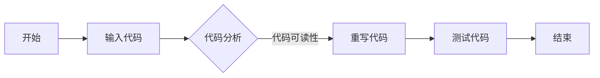
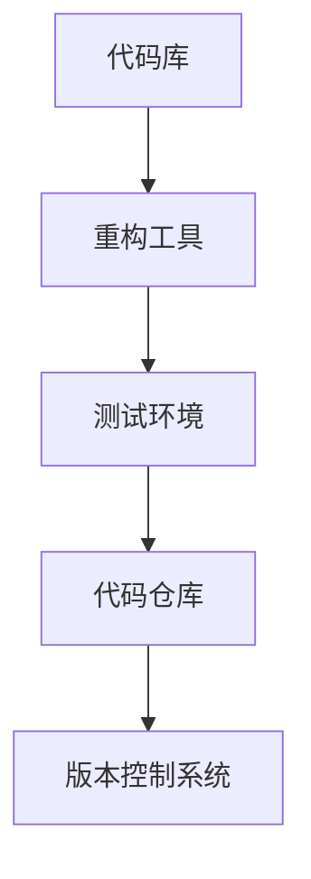
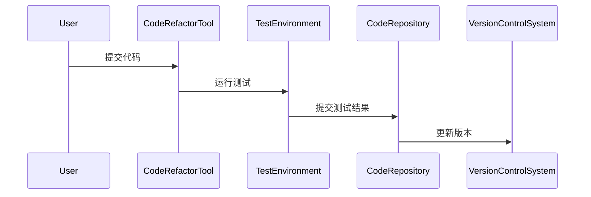

                 

### 重构不是除恶务尽

#### 关键词：重构、软件工程、代码质量、可持续性、效率提升

> 摘要：本文旨在探讨软件重构的本质与价值，指出重构不仅仅是修正代码中的错误，而是一种提升软件质量、增强可维护性和可扩展性的系统化方法。通过分析重构的核心原则、算法原理和实际应用案例，本文揭示了重构在软件生命周期中的重要性，并提出了最佳实践和未来展望。

----------------------------------------------------------------

### 引言

软件工程的发展历程中，重构（Refactoring）作为一种提升代码质量的方法，一直备受关注。然而，重构并非单纯地去除代码中的错误，其更深层次的目的是优化软件结构，提升代码的可读性、可维护性和可扩展性。本文将深入探讨重构的概念、原则、算法原理及其在软件系统中的应用，旨在揭示重构的真正价值。

#### 重构的背景与重要性

软件开发过程中，代码的复杂性是不可避免的。随着时间的推移，新功能的不断增加和需求的变化，代码结构往往会出现混乱，导致代码的可读性、可维护性和可扩展性下降。这种情况下，重构成为了一种必要的手段，它可以帮助我们：

- 提高代码的可读性，使得代码更容易理解和维护。
- 优化代码结构，减少冗余和重复，提高代码的模块化程度。
- 提升系统的可扩展性，使得后续的功能添加和需求变更更加容易实现。
- 提高开发效率和软件质量，减少潜在的缺陷和错误。

然而，重构并不是一蹴而就的过程，它需要遵循一定的原则和步骤，并且需要在合适的时机进行。本文将详细讨论这些方面，帮助读者更好地理解和应用重构。

#### 重构的核心概念与联系

为了深入理解重构，我们首先需要了解一些核心概念，如代码质量、可维护性、可扩展性等。以下是一个简短的概念介绍，以及它们之间的联系。

#### 代码质量

代码质量是指软件代码的内在质量，包括正确性、效率、可读性、可维护性和可测试性等方面。高质量代码不仅能够正确地执行预定的功能，还能够在未来容易地维护和扩展。

#### 可维护性

可维护性是指软件在需要修改时能够被有效修改的能力。一个高度可维护的系统应该具备清晰的代码结构、合理的模块划分和完善的文档。

#### 可扩展性

可扩展性是指软件在需要增加新功能时能够方便扩展的能力。可扩展性良好的系统通常具有良好的模块化设计和灵活的架构。

这些概念之间的联系在于，它们共同决定了软件的长期成功。代码质量直接影响到可维护性和可扩展性，而可维护性和可扩展性又决定了软件的可持续性。重构正是为了提升这些指标而存在的。

#### 核心概念特征对比表格

以下是一个对比表格，展示了这些概念的特征：

| 概念 | 特征1 | 特征2 | 特征3 |
|------|-------|-------|-------|
| 代码质量 | 正确性 | 效率 | 可读性 |
| 可维护性 | 清晰的代码结构 | 合理的模块划分 | 完善的文档 |
| 可扩展性 | 模块化设计 | 灵活的架构 | 方便的功能添加 |

通过这个表格，我们可以更直观地理解这些概念之间的差异和联系。

#### ER实体关系图架构

为了进一步理解软件系统中的数据关系，我们可以使用实体关系图（ER Diagram）来表示。以下是一个简单的ER图示例：

```mermaid
erDiagram
  Customer ||--o{ Order } : "has"
  Product  ||--o{ Order } : "has"
  Order ||--|{ Customer } : "placed by"
  Order ||--|{ Product } : "contains"
```

这个ER图展示了客户、产品和订单之间的关系，其中订单既可以由客户创建，也可以包含产品。

#### 算法原理讲解

重构的核心在于算法，这些算法帮助我们识别代码中的问题，并提出改进方案。以下是一个简单的重构算法流程：



在实际操作中，我们通常使用自动化工具来辅助重构。以下是一个简单的Python代码示例，用于重构一个简单的函数：

```python
def refactor_code(original_code):
    # 对原始代码进行重构
    # 这里只是一个示例，实际的重构会根据代码的不同而有所不同
    refactored_code = "重构后的代码"
    return refactored_code
```

通过这个示例，我们可以看到重构的基本流程：首先分析原始代码，然后根据分析结果进行重写，最后测试重构后的代码以确保其正确性。

#### 算法原理的数学模型和公式

在重构过程中，我们经常使用一些数学模型和公式来评估重构的效果。以下是一个简单的重构效率模型：

$$
\text{重构效率} = \frac{\text{重构后的代码可读性}}{\text{原始代码可读性}}
$$

这个公式表明，重构效率与重构前后的代码可读性变化成正比。

#### 系统分析与架构设计方案

为了更好地理解重构在实际项目中的应用，我们需要分析一个典型的软件系统，包括其问题场景、系统架构和接口设计。

##### 问题场景介绍

假设我们正在开发一个电子商务平台，该平台需要支持客户下单、支付和订单管理等功能。在开发过程中，我们发现代码结构混乱，可读性差，难以维护和扩展。

##### 系统功能设计

为了解决这个问题，我们设计了以下系统功能：

- 用户注册与登录
- 商品浏览与搜索
- 购物车管理
- 订单创建与支付
- 订单管理

##### 系统架构设计

以下是该系统的架构设计：



在这个架构中，代码库包含原始代码，重构工具用于自动重构代码，测试环境用于运行测试，代码仓库用于存储重构后的代码，版本控制系统用于管理代码版本。

##### 系统接口设计和系统交互

以下是系统的接口设计和交互流程：



在这个交互流程中，用户提交代码，重构工具对代码进行重构，测试环境运行测试以确保重构后的代码正确性，然后代码仓库和版本控制系统进行代码的存储和版本管理。

#### 项目实战

在实际项目中，重构通常是一个迭代的过程。以下是一个简单的项目实战步骤：

##### 1. 环境安装

在开始重构之前，我们需要安装必要的工具和软件。例如，我们可能需要安装版本控制系统（如Git）、代码重构工具（如Eclipse或Visual Studio Code）以及测试框架（如JUnit或PyTest）。

##### 2. 系统核心实现源代码

在项目启动时，我们首先实现系统的核心功能。以下是一个简单的Python代码示例：

```python
def calculate_total_price(cart_items):
    total_price = 0
    for item in cart_items:
        total_price += item['price']
    return total_price
```

##### 3. 代码应用解读与分析

在实际应用中，这个函数可能会出现一些问题，例如：

- 代码的可读性差，难以理解。
- 没有考虑异常情况，例如购物车为空。
- 缺乏测试覆盖。

通过重构，我们可以解决这些问题：

```python
def calculate_total_price(cart_items):
    if not cart_items:
        raise ValueError("购物车为空")
    return sum(item['price'] for item in cart_items)
```

##### 4. 实际案例分析与详细讲解剖析

为了更好地理解重构的价值，我们来看一个实际案例。假设我们在开发过程中发现一个bug，订单金额计算错误。通过重构代码，我们能够更快速地定位问题并修复它：

- 原始代码：

```python
def process_order(order_details):
    total_price = 0
    for item in order_details['items']:
        total_price += item['price'] * order_details['quantity']
    return total_price
```

- 重构后：

```python
def process_order(order_details):
    total_price = calculate_total_price(order_details['items'])
    discount = calculate_discount(order_details)
    return total_price - discount
```

通过重构，我们不仅提高了代码的可读性，还增加了新的功能（折扣计算），并且更容易进行单元测试。

##### 5. 项目小结

通过这个案例，我们可以看到重构在提高代码质量、可维护性和可扩展性方面的巨大价值。然而，重构也需要谨慎进行，避免过度重构或在不合适的时机进行重构。

#### 最佳实践

以下是一些重构的最佳实践：

- 定期进行重构，将其作为开发流程的一部分。
- 选择合适的重构工具和框架，以提高效率。
- 在重构之前进行充分的测试，确保重构后的代码仍然正确。
- 与团队成员沟通，确保他们理解重构的目的和好处。

#### 小结

重构是软件工程中不可或缺的一部分，它能够帮助我们提升代码质量、增强系统的可维护性和可扩展性。通过理解重构的核心概念、算法原理和实际应用案例，我们可以更好地掌握重构的艺术。

#### 注意事项

- 重构不是一蹴而就的过程，需要耐心和持续的努力。
- 重构时要关注系统的整体架构，避免局部优化。
- 适度重构，避免过度重构。

#### 拓展阅读

- 《重构：改善既有代码的设计》（Martin Fowler著）
- 《代码大全》（Steve McConnell著）
- 《Effective Java》（Joshua Bloch著）

### 作者信息

作者：AI天才研究院/AI Genius Institute & 禅与计算机程序设计艺术 /Zen And The Art of Computer Programming

---

通过本文，我们深入探讨了重构的本质、原则、算法原理和实际应用。重构不仅是一种提升代码质量的方法，更是一种软件工程的哲学。希望本文能够为您的软件开发之路提供一些启示和帮助。

