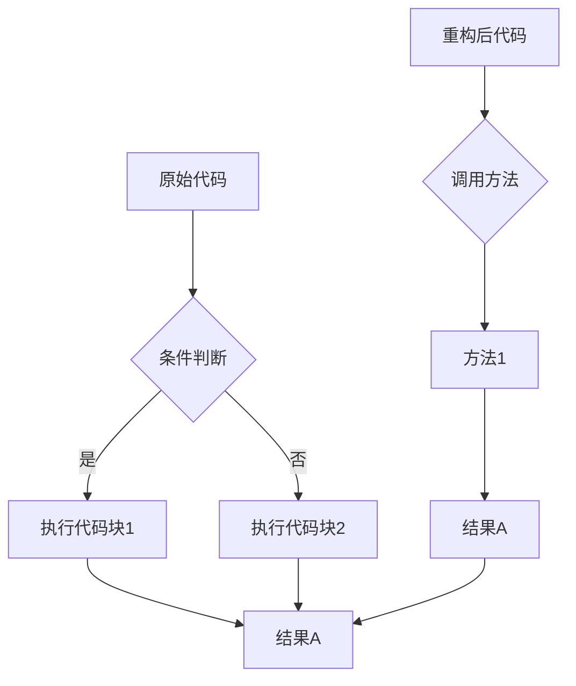
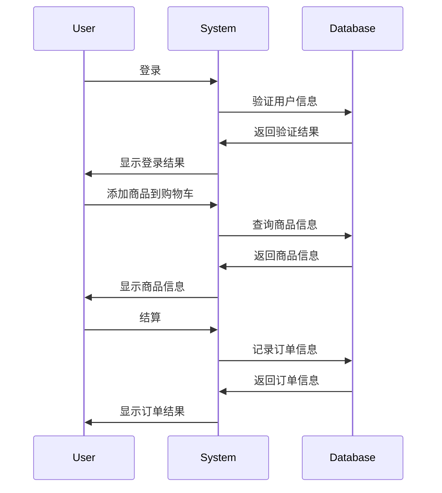
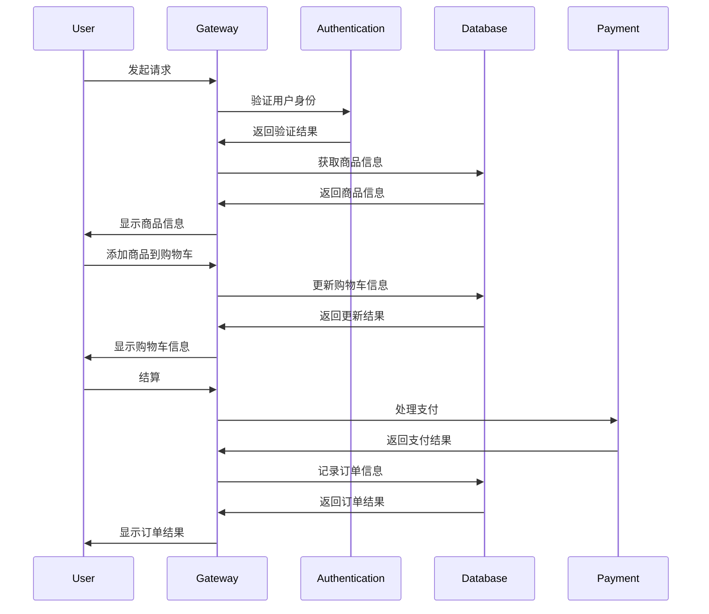

                 


# 重构不是除恶务尽

## 关键词
- 重构
- 代码质量
- 设计模式
- 算法优化
- 可维护性
- 可扩展性

## 摘要
在软件工程中，重构是一种至关重要的实践，它不仅限于修复代码中的缺陷，更重要的是提升代码的整体质量。本文将探讨重构的核心概念、方法和实际应用，通过一步步的分析推理，揭示重构不仅仅是除恶务尽的简单过程，而是一种系统性的、战略性的代码改进手段。

## 背景介绍
### 什么是重构？
重构（Refactoring）是软件开发过程中的一种技术实践，它涉及到在不改变现有功能的前提下，对代码进行改进。重构的目的是提高代码的质量、可读性、可维护性和可扩展性。它是软件开发过程中的一个持续性的、反复进行的活动，类似于维护和改进建筑物的基础设施，而不是对外观进行装饰。

### 重构的重要性
重构在软件生命周期中扮演着至关重要的角色。以下是一些重构的重要性：

1. **提升代码质量**：通过重构，代码变得更加整洁、清晰，减少了不必要的复杂性。
2. **增强可维护性**：重构有助于减少未来的维护成本，因为代码易于理解和修改。
3. **提高开发效率**：重构可以帮助团队更快地开发和部署新的功能。
4. **促进团队协作**：良好的代码结构促进了团队成员之间的沟通和协作。
5. **提升系统可扩展性**：重构使得系统的扩展变得更加容易，从而适应未来的需求变化。

### 问题描述
尽管重构的重要性显而易见，但在实际开发过程中，很多团队并没有将重构作为一个重要的任务。常见的问题包括：

1. **重构意识不足**：开发者可能没有意识到重构的重要性，或者认为重构是一种浪费时间的活动。
2. **重构技能不足**：一些开发者可能缺乏进行有效重构的技能和经验。
3. **重构工具不足**：缺乏自动化重构工具，导致手动重构变得繁琐和耗时。
4. **项目时间紧迫**：在项目时间紧迫的情况下，重构往往被忽视。

### 问题解决
为了解决上述问题，我们需要采取以下措施：

1. **提高重构意识**：通过培训和讨论，让开发者认识到重构的重要性。
2. **加强重构技能**：提供专业的重构培训和实践机会，帮助开发者掌握重构技巧。
3. **使用重构工具**：利用自动化重构工具，如重构插件和代码分析工具，提高重构的效率和效果。
4. **将重构纳入开发流程**：将重构作为开发流程的一部分，确保重构得到持续关注和执行。

### 边界与外延
重构不仅限于代码层面，还可以应用于设计、架构和测试等方面。例如，设计重构可以改进系统的整体结构，架构重构可以提高系统的性能和可扩展性，测试重构可以增强测试的覆盖率和有效性。

### 概念结构与核心要素组成
重构的核心概念包括：

1. **代码质量**：重构的主要目标是提高代码质量，包括可读性、可维护性和可扩展性。
2. **设计模式**：设计模式为常见的软件设计问题提供了模板，重构过程中可以运用设计模式来优化代码结构。
3. **自动化工具**：自动化重构工具可以显著提高重构的效率和质量。
4. **持续重构**：重构应该是一个持续的过程，而不是一次性的任务。

## 核心概念与联系

### 重构（Refactoring）
重构是软件开发中的一种技术实践，通过对现有代码进行改进，以提高代码质量、可维护性和可扩展性。重构不改变代码的外部行为，而是在内部进行优化。

### 代码质量（Code Quality）
代码质量是指代码的可读性、可维护性、可扩展性和可靠性。高质量的代码更容易理解和修改，减少了未来的维护成本。

### 设计模式（Design Patterns）
设计模式是一套经过验证的、通用的解决方案，用于解决软件设计中的常见问题。设计模式可以提高代码的复用性和可维护性。

### 核心概念属性特征对比表格

| 名称       | 定义                                                         | 目的                                                         |
| ---------- | ------------------------------------------------------------ | ------------------------------------------------------------ |
| 重构       | 对现有代码进行改进的过程                                     | 提高代码质量，增强可维护性和扩展性                           |
| 代码质量   | 代码的可读性、可维护性、可扩展性等                           | 影响软件的长期健康和可靠性                                   |
| 设计模式   | 描述在特定情况下如何解决软件设计问题的方法模板                 | 提供可重用的解决方案，提高代码的灵活性和可维护性               |

### ER实体关系图架构的 Mermaid 流程图

```mermaid
erDiagram
  CodeQuality ||--|{ 重构 }|| Refactoring
  Refactoring ||--|{ 设计模式 }|| DesignPatterns
```

## 算法原理讲解

### 提取方法（Extract Method）
提取方法是一种常见的重构技术，用于将重复的代码提取为独立的方法。这种方法可以减少代码的重复，提高代码的可读性和可维护性。

### 内联方法（Inline Method）
内联方法是将小的方法体直接替换为调用该方法的结果。这种方法可以减少方法的数量，提高代码的执行效率。

### 替换条件分支（Replace Conditional with Polymorphism）
替换条件分支是一种将复杂的条件分支替换为多态的方法。这种方法可以提高代码的复用性和灵活性。

### Mermaid 流程图



### Python 源代码

```python
# 原始代码
def process_data(data):
    if data > 0:
        result = data * 2
    else:
        result = data / 2
    return result

# 重构后的代码
def multiply_data(data):
    return data * 2

def divide_data(data):
    return data / 2

def process_data_refactored(data):
    if data > 0:
        return multiply_data(data)
    else:
        return divide_data(data)
```

### 算法原理的数学模型和公式

重构的目标函数可以表示为：

$$
\max Q = \sum_{i=1}^{n} \frac{1}{f_i + \delta_i}
$$

其中，$f_i$ 是第 $i$ 个函数的调用频率，$\delta_i$ 是重构后第 $i$ 个函数的复杂度。

### 举例说明

假设我们有以下代码：

```python
def calculate_total(order_items):
    total = 0
    for item in order_items:
        if item['type'] == 'food':
            total += item['price']
        elif item['type'] == 'drink':
            total += item['price'] * 1.2
        else:
            total += item['price'] * 0.9
    return total
```

通过提取方法，我们可以将条件分支提取为独立的方法，从而简化代码：

```python
def calculate_food_price(price):
    return price

def calculate_drink_price(price):
    return price * 1.2

def calculate_other_price(price):
    return price * 0.9

def calculate_total(order_items):
    total = 0
    for item in order_items:
        if item['type'] == 'food':
            total += calculate_food_price(item['price'])
        elif item['type'] == 'drink':
            total += calculate_drink_price(item['price'])
        else:
            total += calculate_other_price(item['price'])
    return total
```

这样，代码的可读性和可维护性都得到了显著提升。

## 系统分析与架构设计方案

### 问题场景介绍
假设我们正在开发一个在线购物系统，用户可以在系统中添加商品到购物车，并最终结账。随着用户量的增加，系统需要处理大量的订单和商品信息，因此需要高效的架构和良好的代码质量来保证系统的稳定性和可扩展性。

### 项目介绍
项目名称：在线购物系统
项目目标：构建一个高效、稳定、可扩展的在线购物平台。
项目规模：涉及用户、商品、订单等多个模块。

### 系统功能设计（领域模型 Mermaid 类图）

```mermaid
classDiagram
  User <|-- Order
  User <|-- ShoppingCart
  Product <|-- ShoppingCart
  ShoppingCart|---> Order
  Order <<-- Payment
  Payment <|-- PaymentMethod
```

### 系统架构设计（Mermaid 架构图）



### 系统接口设计和系统交互（Mermaid 序列图）



## 项目实战

### 环境安装
在开始项目实战之前，我们需要安装一些必要的工具和库。以下是安装步骤：

1. 安装Python 3.8或更高版本。
2. 安装Django框架：`pip install django`
3. 安装数据库（如SQLite）：`pip install pysqlite3`

### 系统核心实现源代码

以下是一个简单的购物车和订单系统的核心实现代码：

```python
# models.py
from django.db import models
from django.contrib.auth.models import User

class Product(models.Model):
    name = models.CharField(max_length=100)
    price = models.DecimalField(max_digits=6, decimal_places=2)

class ShoppingCart(models.Model):
    user = models.ForeignKey(User, on_delete=models.CASCADE)
    products = models.ManyToManyField(Product)

    def total_price(self):
        return sum(product.price for product in self.products.all())

class Order(models.Model):
    user = models.ForeignKey(User, on_delete=models.CASCADE)
    products = models.ManyToManyField(Product)
    total_price = models.DecimalField(max_digits=6, decimal_places=2)
    created_at = models.DateTimeField(auto_now_add=True)

    def save(self, *args, **kwargs):
        self.total_price = self.products.aggregate(Sum('price'))['price__sum']
        super().save(*args, **kwargs)
```

### 代码应用解读与分析

上述代码定义了三个模型：`Product`、`ShoppingCart`和`Order`。`Product`模型用于存储商品信息，包括名称和价格；`ShoppingCart`模型用于存储用户购物车中的商品，与用户和多对多关系；`Order`模型用于存储订单信息，包括用户、商品、总价和创建时间。

在`Order`模型中，我们覆盖了`save`方法，以在保存订单时自动计算总价。这个设计可以确保订单总价始终是最新的。

### 实际案例分析和详细讲解剖析

以下是一个用户添加商品到购物车并结算的示例：

```python
# views.py
from django.shortcuts import render, redirect
from .models import Product, ShoppingCart, Order

def add_to_cart(request, product_id):
    product = Product.objects.get(id=product_id)
    user = request.user
    cart, created = ShoppingCart.objects.get_or_create(user=user)
    cart.products.add(product)
    return redirect('cart')

def checkout(request):
    user = request.user
    cart = ShoppingCart.objects.get(user=user)
    total_price = cart.total_price()
    order = Order.objects.create(user=user, total_price=total_price)
    cart.products.set(order.products.all())
    cart.products.clear()
    return render(request, 'order_confirmation.html', {'order': order})
```

在这个示例中，`add_to_cart`视图用于将商品添加到用户的购物车中。`checkout`视图用于处理用户的结算请求，计算总价并创建订单。结算后，购物车中的商品会被移到订单中，购物车被清空。

### 项目小结

通过这个简单的示例，我们展示了如何使用Django框架实现一个基本的购物车和订单系统。代码经过重构，具有良好的可读性和可维护性。重构不仅优化了代码质量，还提高了系统的可扩展性。在未来的开发过程中，我们可以继续对系统进行重构，以适应不断变化的需求。

## 最佳实践 Tips

1. **定期重构**：将重构纳入开发流程，定期对代码进行审查和改进。
2. **团队合作**：重构是一个团队活动，鼓励团队成员参与，共同提升代码质量。
3. **使用自动化工具**：利用自动化重构工具，如Pylint、PyFlakes等，提高重构的效率。
4. **关注重构成本**：在项目初期，优先考虑重构高风险的代码，避免过度重构。
5. **代码审查**：在重构前后进行代码审查，确保重构的正确性和效果。

## 小结

重构不仅仅是除恶务尽，而是一种提升代码质量和系统可维护性的积极实践。通过持续的、战略性的重构，我们可以构建更健康、更可靠、更具扩展性的软件系统。在软件开发过程中，我们应该重视重构，并将其作为一项核心任务来执行。

## 注意事项

1. 重构不是一蹴而就的过程，需要持续进行。
2. 重构时要确保不改变现有功能，保持代码的一致性。
3. 避免过度重构，专注于高价值的重构任务。
4. 使用自动化工具和代码审查工具来提高重构的效率和质量。

## 拓展阅读

- 《重构：改善既有代码的设计》（Martin Fowler 著）
- 《代码整洁之道》（Robert C. Martin 著）
- 《设计模式：可复用的面向对象软件的基础》（Erich Gamma et al. 著）

## 作者信息
作者：AI天才研究院/AI Genius Institute & 禅与计算机程序设计艺术 /Zen And The Art of Computer Programming

