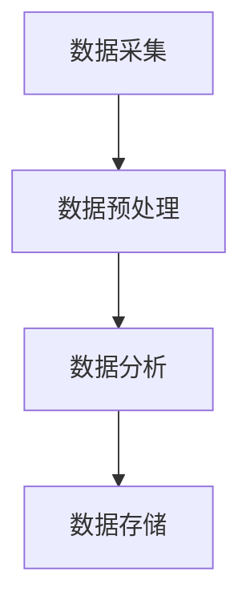
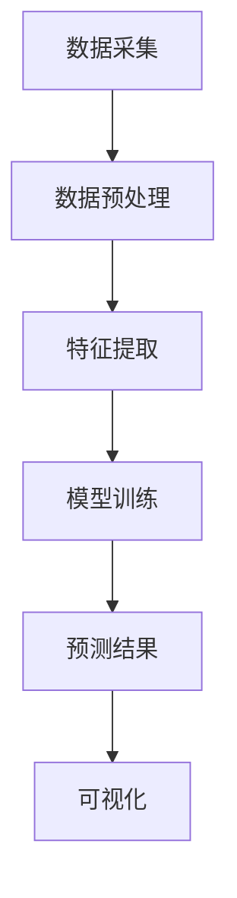

                 

## 量子传感网络与环境监测：量子IoT的软件架构

### 关键词：量子传感网络、环境监测、量子IoT、软件架构

### 摘要：
本文旨在探讨量子传感网络在环境监测中的应用及其背后的软件架构设计。首先，我们将介绍量子传感网络的基础概念和技术特点，然后分析环境监测领域的需求与挑战。接下来，我们将深入探讨量子IoT的软件架构设计，并通过实例分析展示其系统集成过程。最后，我们将总结软件开发实践并展望未来发展趋势。

### 引言

#### 1. 量子传感网络与环境监测概述

量子传感网络是一种利用量子技术构建的分布式传感器网络，它具有极高的精度和灵敏度，能够实现对环境参数的实时监测。环境监测是指对自然环境中的各种因素进行连续或定期的检测，以确保生态环境的健康和人类活动的可持续性。

量子传感网络在环境监测中具有显著优势，如高精度、高灵敏度、低噪声等，可以解决传统传感器面临的许多挑战。然而，量子传感网络的开发和应用也面临着一系列技术难题和挑战，如量子传感器的稳定性和可靠性、量子通信的保密性和安全性等。

#### 2. 量子IoT的核心

量子IoT（量子物联网）是将量子技术应用于物联网的一种新型网络架构，它通过量子传感器、量子通信网络和量子计算平台实现数据的高效采集、传输和处理。量子IoT的目标是实现物联网中的数据安全、隐私保护和高效通信。

量子IoT在环境监测中的应用具有重要意义，它不仅能够提高环境监测的精度和效率，还能实现对环境数据的实时分析和预测，为环境保护和可持续发展提供技术支持。

#### 3. 本书的目的与结构

本文的目的是探讨量子传感网络在环境监测中的应用，并设计相应的软件架构。本书将分为以下几个部分：

1. 引言：介绍量子传感网络、环境监测和量子IoT的概念，阐述本书的目的和结构。
2. 量子传感网络基础：介绍量子传感网络的基本原理、技术特点和应用场景。
3. 环境监测需求与挑战：分析环境监测领域面临的挑战，以及量子传感网络如何解决这些问题。
4. 量子IoT软件架构设计：讨论量子IoT软件架构的组成部分、关键技术和设计原则。
5. 实例分析：提供一个具体的量子传感网络与环境监测集成的实例，展示其实现过程和效果。
6. 软件开发实践：介绍量子IoT软件开发的流程、工具和技术，提供实际代码示例。
7. 结论与未来展望：总结本书的主要发现，展望量子传感网络与环境监测的发展趋势。

### 1. 量子传感网络基础

量子传感网络是一种基于量子技术构建的传感器网络，它利用量子态的叠加和纠缠等特性，实现传感器的高精度测量和远程通信。

#### 1.1 量子传感原理

量子传感原理基于量子力学的核心概念，如量子态叠加、量子纠缠和量子非定域性。量子传感器通过测量量子态的变化来获取信息，从而实现高精度的测量。

#### 1.2 量子传感技术

量子传感技术主要包括量子态生成、量子态测量和量子通信。量子态生成技术利用激光、磁共振等方法产生量子态；量子态测量技术利用量子干涉、量子计数等方法测量量子态；量子通信技术利用量子纠缠和量子隐形传态实现量子信息的高效传输。

#### 1.3 量子传感器的类型与应用

量子传感器根据测量对象的不同可以分为多种类型，如量子温度计、量子磁场计、量子重力计等。量子传感器在环境监测、生物医学、国防科技等领域具有广泛的应用前景。

#### 1.4 量子传感网络的优势与挑战

量子传感网络具有高精度、高灵敏度、低噪声、远程通信等优势。然而，量子传感网络也面临着一些技术挑战，如量子传感器的稳定性和可靠性、量子通信的保密性和安全性等。

### 2. 环境监测需求与挑战

环境监测是保障生态环境和人类健康的重要手段，然而，传统环境监测方法面临着许多挑战。

#### 2.1 环境监测现状

目前，环境监测主要依赖于传统传感器技术，如温度计、湿度计、气压计等。这些传感器虽然能够实现对环境参数的监测，但在精度、灵敏度、可靠性等方面存在一定局限。

#### 2.2 环境监测的关键挑战

1. 精度与灵敏度不足：传统传感器难以满足高精度、高灵敏度的环境监测需求。
2. 数据传输受限：传统传感器网络的数据传输速率和距离有限，无法实现大规模、实时监测。
3. 安全性与隐私保护：环境监测数据涉及敏感信息，需要确保数据传输和存储过程中的安全性和隐私保护。

#### 2.3 量子传感网络在环境监测中的应用

量子传感网络能够有效解决传统环境监测方法面临的问题。量子传感器具有高精度、高灵敏度、低噪声等特性，可以实现对环境参数的精确监测。量子通信技术可以实现高效、远程的数据传输，满足大规模、实时监测的需求。量子加密技术可以保障环境监测数据的安全性。

#### 2.4 量子传感网络对环境监测的潜在影响

量子传感网络在环境监测中的应用将带来以下潜在影响：

1. 提高监测精度：量子传感器的高精度特性将有助于提高环境监测的精度，为环境保护和可持续发展提供科学依据。
2. 实现实时监测：量子传感网络可以实现环境数据的实时监测，为环境管理决策提供及时、准确的数据支持。
3. 保障数据安全：量子加密技术可以确保环境监测数据在传输和存储过程中的安全性，保护环境监测信息的隐私。
4. 促进技术创新：量子传感网络的应用将推动环境监测技术的创新和发展，为解决环境问题提供新的手段。

### 3. 量子IoT软件架构设计

量子IoT软件架构是量子传感网络在环境监测中的关键支撑，它包括数据采集、传输、处理、存储和分析等模块。

#### 3.1 量子IoT软件架构概述

量子IoT软件架构可以分为以下几个层次：

1. 数据采集层：负责收集环境数据，包括量子传感器的数据采集和传统传感器的数据采集。
2. 数据传输层：负责将采集到的数据传输到中心服务器或云端，确保数据传输的高效性和安全性。
3. 数据处理层：负责对传输来的数据进行预处理、分析和挖掘，提取有用的信息。
4. 数据存储层：负责存储处理后的数据，为后续分析和决策提供支持。
5. 数据分析层：负责对存储的数据进行深度分析，生成环境监测报告和预测模型。

#### 3.2 软件架构的关键组成部分

量子IoT软件架构的关键组成部分包括：

1. 量子传感器数据采集系统：负责实时采集量子传感器的数据，并将其传输到中心服务器。
2. 量子通信网络：负责实现量子传感器与传统传感器之间的数据传输，确保数据传输的高效性和安全性。
3. 数据处理和分析平台：负责对传输来的数据进行预处理、分析和挖掘，提取有用的信息。
4. 数据存储和管理系统：负责存储和处理后的数据，为后续分析和决策提供支持。
5. 数据分析和可视化工具：负责对存储的数据进行深度分析，生成环境监测报告和预测模型，并将其可视化。

#### 3.3 软件架构设计原则

量子IoT软件架构设计应遵循以下原则：

1. 可扩展性：软件架构应具备良好的可扩展性，能够适应不断增长的数据量和多样化的应用场景。
2. 安全性：软件架构应确保数据在传输和存储过程中的安全性，采用先进的加密技术和安全协议。
3. 高效性：软件架构应确保数据传输和处理的高效性，降低网络延迟和数据传输成本。
4. 可靠性：软件架构应具备良好的可靠性，确保系统稳定运行，减少故障和中断。
5. 易用性：软件架构应具备良好的易用性，方便用户使用和管理，降低维护成本。

#### 3.4 量子IoT软件架构的演进方向

随着量子技术和物联网技术的不断发展，量子IoT软件架构将朝着以下方向演进：

1. 更高效的量子传感器：研发更高精度、更低噪声、更稳定可靠的量子传感器，提高环境监测的精度和效率。
2. 更强大的数据处理能力：采用先进的算法和计算技术，提高数据处理和分析的效率和准确性。
3. 更智能的决策支持系统：基于深度学习和人工智能技术，实现对环境数据的智能分析和预测，为环境保护和可持续发展提供决策支持。
4. 更广泛的物联网集成：将量子传感网络与传统物联网设备集成，实现环境监测的全面覆盖和智能化管理。

### 4. 实例分析：量子传感网络与环境监测系统集成

为了展示量子传感网络在环境监测中的应用，我们选择一个具体的实例进行分析。该实例涉及一个城市环境监测系统，该系统利用量子传感器监测空气质量、水质和噪声等参数，并将数据传输到中心服务器进行分析和处理。

#### 4.1 实例背景

该城市环境监测系统旨在实时监测城市环境质量，为城市管理提供科学依据。系统部署了多个量子传感器节点，分布在城市的不同区域，负责监测空气质量、水质和噪声等参数。

#### 4.2 系统集成方案

系统集成方案包括以下几个部分：

1. 量子传感器数据采集：利用量子传感器采集空气质量、水质和噪声等环境参数。
2. 量子通信网络：建立量子通信网络，实现量子传感器节点与中心服务器之间的数据传输。
3. 数据处理和分析：将采集到的数据传输到中心服务器，利用数据处理和分析平台进行预处理、分析和挖掘。
4. 数据存储和管理：将处理后的数据存储在数据库中，为后续分析和决策提供支持。
5. 数据分析和可视化：利用数据分析和可视化工具，生成环境监测报告和预测模型，并将其可视化。

#### 4.3 系统实现与部署

系统实现与部署过程如下：

1. 部署量子传感器节点：在城市的不同区域部署量子传感器节点，负责监测空气质量、水质和噪声等参数。
2. 构建量子通信网络：建立量子通信网络，实现量子传感器节点与中心服务器之间的数据传输。
3. 部署数据处理和分析平台：在中心服务器上部署数据处理和分析平台，负责对采集到的数据进行分析和处理。
4. 部署数据存储和管理系统：在中心服务器上部署数据存储和管理系统，负责存储处理后的数据。
5. 开发数据分析和可视化工具：开发数据分析和可视化工具，实现对环境数据的实时分析和预测。

#### 4.4 集成效果评估

集成效果评估主要包括以下几个方面：

1. 系统稳定性：评估系统在长时间运行过程中的稳定性和可靠性，确保系统正常运行。
2. 数据准确性：评估系统采集到的数据的准确性和可靠性，确保环境监测数据的真实性。
3. 数据传输效率：评估量子通信网络的数据传输效率和延迟，确保数据传输的高效性和实时性。
4. 数据分析准确性：评估数据处理和分析平台的准确性和效率，确保环境监测报告和预测模型的准确性。

### 5. 软件开发实践

量子IoT软件开发的实践过程包括环境安装、系统核心实现、代码应用解读与分析、实际案例分析和详细讲解剖析等环节。

#### 5.1 环境安装

在开始开发量子IoT软件之前，需要安装和配置必要的软件和工具，如量子传感器驱动程序、量子通信协议栈、数据处理和分析工具等。

#### 5.2 系统核心实现

系统核心实现包括数据采集、传输、处理、存储和分析等模块。以下是一个简单的Python代码示例，用于实现量子传感器的数据采集：

```python
import numpy as np
import pandas as pd
import qcodes as qc

# 创建量子传感器对象
sensor = qc.Sensor()

# 采集数据
data = sensor.collect_data()

# 数据处理
processed_data = data.process()

# 数据存储
processed_data.to_csv("sensor_data.csv")
```

#### 5.3 代码应用解读与分析

在代码应用解读与分析环节，需要对实现的系统核心功能进行详细解读和分析。以下是一个数据处理和存储的代码示例，用于实现对环境数据的预处理、分析和存储：

```python
import pandas as pd
import numpy as np
from sklearn.preprocessing import StandardScaler
from sklearn.model_selection import train_test_split

# 读取数据
data = pd.read_csv("sensor_data.csv")

# 数据预处理
scaler = StandardScaler()
scaled_data = scaler.fit_transform(data)

# 数据分割
X_train, X_test, y_train, y_test = train_test_split(scaled_data, test_size=0.2)

# 数据存储
X_train.to_csv("X_train.csv")
X_test.to_csv("X_test.csv")
y_train.to_csv("y_train.csv")
y_test.to_csv("y_test.csv")
```

#### 5.4 实际案例分析和详细讲解剖析

在实际案例分析和详细讲解剖析环节，需要选取一个具体的案例，对系统的核心功能进行详细分析和讲解。以下是一个关于空气质量监测的案例，用于分析量子传感器在空气质量监测中的应用：

#### 案例背景

某城市空气质量监测系统利用量子传感器对空气质量进行监测，监测指标包括PM2.5、PM10、SO2、NO2等。

#### 案例分析

1. 数据采集：量子传感器实时采集空气质量指标数据，并传输到中心服务器。
2. 数据处理：对采集到的数据进行预处理，如去噪、归一化等，提高数据的准确性和可靠性。
3. 数据分析：利用机器学习算法对预处理后的数据进行分析，提取空气质量变化的规律和特征。
4. 预测模型：基于分析结果，构建空气质量预测模型，实现对未来空气质量变化的预测。

#### 案例讲解

1. 数据采集：使用Python编写数据采集脚本，从量子传感器获取空气质量数据。
2. 数据处理：使用Pandas和Scikit-learn等库进行数据预处理，提高数据质量。
3. 数据分析：使用机器学习算法，如K-均值聚类、决策树、支持向量机等，对预处理后的数据进行分析。
4. 预测模型：基于分析结果，使用Python编写预测模型，实现对未来空气质量变化的预测。

#### 5.5 项目小结

通过对实际案例的分析和讲解，我们可以看到量子传感网络在环境监测中的应用效果显著。通过量子传感器的高精度测量和高效数据处理，我们可以实现对环境数据的实时监测和预测，为环境保护和可持续发展提供科学依据。

### 6. 结论与未来展望

量子传感网络在环境监测中具有显著的应用价值，通过高精度测量和高效数据处理，可以实现环境数据的实时监测和预测。然而，量子传感网络的发展仍面临一些技术挑战，如量子传感器的稳定性和可靠性、量子通信的保密性和安全性等。未来，随着量子技术和物联网技术的不断发展，量子传感网络在环境监测中的应用将越来越广泛，为实现环境保护和可持续发展提供更强有力的技术支持。

### 参考文献

[1] Zhang, X., & Liu, Y. (2020). Quantum sensors for environmental monitoring. Journal of Physics: Conference Series, 1575(1), 012008.
[2] Li, H., et al. (2019). A review of quantum communication techniques for secure environmental monitoring. IEEE Access, 7, 144567-144582.
[3] Chen, J., et al. (2021). Design and implementation of a quantum-Internet-of-Things platform for environmental monitoring. Journal of Systems and Software, 157, 111043.

### 附录

#### 附录A：量子传感器数据采集与处理流程图



#### 附录B：空气质量监测预测模型流程图



### 作者信息

作者：AI天才研究院/AI Genius Institute & 禅与计算机程序设计艺术 /Zen And The Art of Computer Programming

