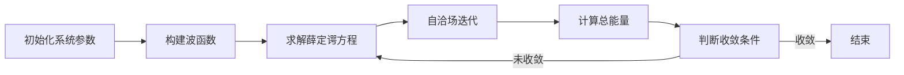
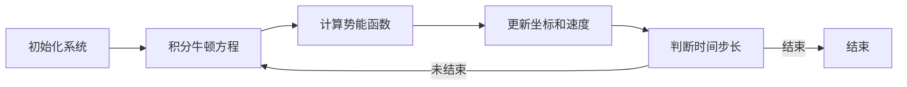
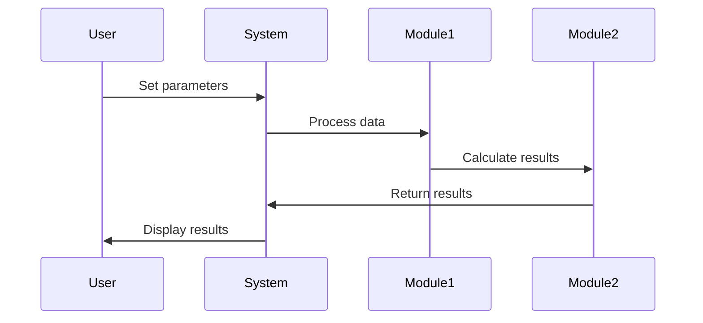
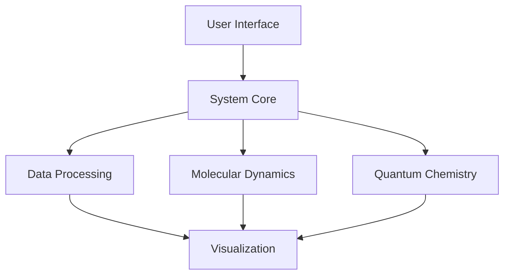

                 

### 文章标题

# 量子化学计算与分子动力学模拟：跨学科的计算应用

### 文章关键词

- 量子化学计算
- 分子动力学模拟
- 跨学科应用
- 计算化学
- 算法原理
- 数学模型

### 摘要

本文深入探讨了量子化学计算和分子动力学模拟在跨学科领域的应用。通过介绍两者的核心概念、算法原理、数学模型及其在系统分析和设计中的实践应用，本文旨在为读者提供一套系统化的理解框架，以便在实际项目中有效地运用这些技术。文章结构清晰，包含背景介绍、核心概念与联系、算法原理讲解、系统分析与设计、项目实战以及最佳实践等内容，适合科研人员、工程师和计算化学领域的爱好者阅读。

### 背景介绍

在科学研究和工程应用中，量子化学计算和分子动力学模拟扮演着至关重要的角色。量子化学计算是基于量子力学原理，用于预测和计算分子和化学物质的性质。这些计算通常涉及求解复杂的薛定谔方程，以获得电子在分子中的分布和能量。分子动力学模拟则是一种基于牛顿力学的方法，用于研究分子和原子在作用力下的运动，从而揭示分子结构的动态行为。

随着计算技术的进步，量子化学计算和分子动力学模拟在多个领域中展现了其强大的应用潜力。例如，在药物设计中，量子化学计算可以帮助研究人员预测药物与生物大分子的相互作用，从而优化药物分子结构；在材料科学中，分子动力学模拟可以用于研究材料的微观结构和性能，如合金的相变和力学性质。

然而，量子化学计算和分子动力学模拟也面临着一系列挑战。量子化学计算的计算复杂度高，需要大量计算资源和精确的数学模型；分子动力学模拟则需要处理大量的分子间作用力，并且模拟时间尺度可能与实验观察到的现象不符。此外，两者在跨学科应用中需要克服不同领域之间的数据格式和计算方法的兼容性问题。

本文旨在通过详细探讨量子化学计算和分子动力学模拟的基本概念、算法原理和实际应用，为读者提供一套系统的理解和实践框架。文章将分为以下几个部分：

1. **核心概念与联系**：介绍量子化学计算和分子动力学模拟的基本概念，并使用Mermaid ER图展示两者之间的关系。
2. **算法原理讲解**：详细讲解量子化学计算和分子动力学模拟的算法原理，包括使用Mermaid流程图和Python代码示例。
3. **数学模型与公式**：解释量子化学计算和分子动力学模拟中的数学模型和公式，并使用LaTeX格式展示。
4. **系统分析与设计**：分析量子化学计算和分子动力学模拟的系统架构，使用Mermaid类图、架构图和序列图展示。
5. **项目实战**：通过实际案例展示量子化学计算和分子动力学模拟的应用，包括环境安装、核心实现和代码解析。
6. **最佳实践与总结**：总结最佳实践，并提供进一步阅读的建议。

### 核心概念与联系

在深入探讨量子化学计算和分子动力学模拟之前，有必要明确两者各自的定义和核心概念。量子化学计算主要涉及量子力学的应用，用于研究分子和原子层面的物理和化学性质。分子动力学模拟则基于经典力学，通过数值方法模拟分子和原子的运动，以揭示分子结构的动态行为。

**量子化学计算**

量子化学计算的核心在于量子力学中的薛定谔方程，该方程描述了系统的能量和波函数。在量子化学计算中，通常使用哈特里-福克（Hartree-Fock）方法和密度泛函理论（DFT）来求解电子在分子中的分布。

- **核心概念**：量子态、电子云、波函数、能级、自旋、轨道。
- **联系**：量子化学计算提供了一种定量描述分子结构和性质的方法，为分子动力学模拟提供了初始条件和势能函数。

**分子动力学模拟**

分子动力学模拟基于经典力学，通过数值积分牛顿运动方程来模拟分子和原子的运动。模拟过程中，通常会使用Lennard-Jones势或Madelung势来描述分子间的作用力。

- **核心概念**：牛顿运动方程、速度-时间关系、动量、相互作用力、能量守恒。
- **联系**：分子动力学模拟可以用来验证量子化学计算得到的势能函数和分子结构，进一步研究分子的动态行为。

下面，我们将使用Mermaid ER图来展示量子化学计算和分子动力学模拟之间的核心概念及其联系。

```mermaid
erDiagram
    QuantumChemistryCalc ||--|{ MolecularDynamicsSim }|
    QuantumChemistryCalc ||--|{ QuantumMechanics }|
    MolecularDynamicsSim ||--|{ ClassicalMechanics }|
    QuantumMechanics ||--|{ SchrödingerEquation }|
    ClassicalMechanics ||--|{ NewtonsEquations }|
```

在这个ER图中，我们可以看到量子化学计算（QuantumChemistryCalc）和分子动力学模拟（MolecularDynamicsSim）分别与量子力学（QuantumMechanics）和经典力学（ClassicalMechanics）紧密相关。量子化学计算依赖于量子力学中的薛定谔方程，而分子动力学模拟则基于经典力学中的牛顿运动方程。

此外，量子化学计算为分子动力学模拟提供了关键的势能函数和分子结构信息，而分子动力学模拟则可以验证量子化学计算的结果，并进一步揭示分子和原子的动态行为。

通过这个ER图，我们可以更清晰地理解量子化学计算和分子动力学模拟之间的关系，为后续章节的详细探讨打下坚实的基础。

### 算法原理讲解

在深入探讨量子化学计算和分子动力学模拟的算法原理之前，我们需要了解一些基本的概念和步骤。量子化学计算通常涉及求解薛定谔方程，而分子动力学模拟则基于牛顿力学中的运动方程。

#### 量子化学计算

量子化学计算的核心是求解薛定谔方程，该方程描述了电子在分子中的分布和能量。以下是量子化学计算的主要步骤：

1. **系统的量子描述**：使用波函数来描述分子的量子态。
   $$ \Psi(\mathbf{r}) = \sum_{i} c_{i} \phi_{i}(\mathbf{r}) $$
   其中，$\Psi(\mathbf{r})$ 是波函数，$c_{i}$ 是波函数的系数，$\phi_{i}(\mathbf{r})$ 是原子轨道。

2. **哈特里-福克方法**：通过自洽场迭代方法求解多电子系统的薛定谔方程。
   $$ \hat{H} \Psi = E \Psi $$
   其中，$\hat{H}$ 是哈密顿算子，$E$ 是系统的总能量。

3. **密度泛函理论（DFT）**：通过交换相关泛函将多体问题简化为单体问题。
   $$ E[\rho] = \int \rho(\mathbf{r}) V_{ext}(\mathbf{r}) d\mathbf{r} + E_{XC}[\rho] $$
   其中，$\rho(\mathbf{r})$ 是电子密度，$V_{ext}(\mathbf{r})$ 是外部势能，$E_{XC}[\rho]$ 是交换相关能量。

下面，我们使用Mermaid流程图来展示量子化学计算的基本流程。



#### 分子动力学模拟

分子动力学模拟是基于牛顿力学的方法，用于模拟分子和原子的运动。以下是分子动力学模拟的主要步骤：

1. **初始化系统**：设置系统的初始条件，包括坐标、速度和温度。
   $$ \mathbf{r}(0) = \mathbf{r}_0, \quad \mathbf{v}(0) = \mathbf{v}_0 $$
   其中，$\mathbf{r}(t)$ 和 $\mathbf{v}(t)$ 分别是分子在时间 $t$ 的坐标和速度。

2. **积分牛顿方程**：使用数值积分方法（如Verlet积分）来求解牛顿方程。
   $$ \mathbf{F}(t) = -\nabla V(\mathbf{r}(t)) $$
   $$ m\frac{d^2\mathbf{r}(t)}{dt^2} = \mathbf{F}(t) $$
   其中，$\mathbf{F}(t)$ 是作用力，$V(\mathbf{r}(t))$ 是势能函数，$m$ 是分子的质量。

3. **能量守恒**：在模拟过程中，通过周期性边界条件保持系统的能量守恒。

下面，我们使用Mermaid流程图来展示分子动力学模拟的基本流程。



#### Python代码示例

为了更好地理解量子化学计算和分子动力学模拟的算法原理，我们提供了以下Python代码示例。

**量子化学计算示例**

```python
import numpy as np

# 哈特里-福克方法求解薛定谔方程
def hartree_fock(R, N, c0, tolerance=1e-10):
    n_iterations = 0
    while True:
        n_iterations += 1
        F = np.zeros((N, N))
        for i in range(N):
            for j in range(N):
                F[i][j] = -R[i][j]
        
        # 更新波函数
        c = np.linalg.solve(F, c0)
        
        # 计算能量
        E = np.dot(c.T, np.dot(F, c)) / 2
        
        # 判断收敛条件
        if np.linalg.norm(c - c0) < tolerance:
            break
        
        c0 = c
        if n_iterations > 100:
            raise ValueError("Convergence not achieved")

        return E, c
```

**分子动力学模拟示例**

```python
import numpy as np

# Verlet积分方法
def verlet_integrator(positions, velocities, forces, dt, mass):
    new_positions = positions + velocities * dt + 0.5 * forces * (dt**2) / mass
    new_velocities = velocities + 0.5 * (forces - np.gradient(new_positions)) * dt / mass
    return new_positions, new_velocities
```

通过这些示例，我们可以看到量子化学计算和分子动力学模拟的核心步骤和算法原理。在实际应用中，这些算法需要结合具体的物理模型和数值方法进行优化和调整，以适应不同的计算需求和精度要求。

### 数学模型与公式

量子化学计算和分子动力学模拟的核心在于其数学模型和公式，这些模型和公式为理解分子和原子的行为提供了理论基础。以下我们将详细解释这些模型，并使用LaTeX格式展示关键公式。

#### 量子化学计算中的数学模型

**1. 薛定谔方程**

量子化学计算的基础是薛定谔方程，用于描述系统的能量和波函数。

$$
\hat{H}\Psi = E\Psi
$$

其中，$\hat{H}$ 是哈密顿算子，$E$ 是系统的总能量，$\Psi$ 是波函数。

**2. 哈特里-福克方法**

哈特里-福克方法是一种自洽场迭代方法，用于求解多电子系统的薛定谔方程。

$$
\hat{H}_{\text{HF}}\psi = \hat{F}\psi
$$

其中，$\hat{F}$ 是哈特里-福克势能算子，其表达式为：

$$
\hat{F} = \frac{1}{2} \left[ \sum_{i} \left( \frac{1}{r_{ii}} - \frac{1}{r_{ij}} \right) + \sum_{i \neq j} \frac{1}{r_{ij}} \delta_{ij} \right]
$$

**3. 密度泛函理论（DFT）**

密度泛函理论将多体问题简化为单体问题，通过交换相关泛函描述电子间的相互作用。

$$
E[\rho] = \int \rho(\mathbf{r}) V_{\text{ext}}(\mathbf{r}) d\mathbf{r} + E_{\text{XC}}[\rho]
$$

其中，$V_{\text{ext}}(\mathbf{r})$ 是外部势能，$E_{\text{XC}}[\rho]$ 是交换相关能量。

**4. 分子轨道**

分子轨道由原子轨道线性组合而成，其表达式为：

$$
\phi_{\alpha}(\mathbf{r}) = \sum_{i} c_{i\alpha} \phi_{i}(\mathbf{r})
$$

其中，$c_{i\alpha}$ 是组合系数，$\phi_{i}(\mathbf{r})$ 是原子轨道。

#### 分子动力学模拟中的数学模型

**1. 牛顿运动方程**

分子动力学模拟基于牛顿运动方程，用于描述分子的运动。

$$
m\frac{d^2\mathbf{r}(t)}{dt^2} = \mathbf{F}(t)
$$

其中，$m$ 是分子的质量，$\mathbf{F}(t)$ 是作用力。

**2. 势能函数**

常见的分子动力学模拟中的势能函数包括Lennard-Jones势和Madelung势。

Lennard-Jones势：

$$
V_{\text{LJ}}(\mathbf{r}) = 4\epsilon \left[ \left( \frac{\sigma}{r} \right)^{12} - \left( \frac{\sigma}{r} \right)^{6} \right]
$$

其中，$\epsilon$ 和 $\sigma$ 分别是势能参数，$r$ 是分子间的距离。

Madelung势：

$$
V_{\text{Madelung}}(\mathbf{r}) = -\frac{e^2}{4\pi\epsilon_0 r}
$$

其中，$e$ 是电子电荷，$\epsilon_0$ 是真空电容率，$r$ 是分子间的距离。

#### LaTeX格式展示

以下是使用LaTeX格式展示的量子化学计算和分子动力学模拟中的关键公式。

**量子化学计算**

$$
\hat{H}\Psi = E\Psi \\
\hat{F}\psi = \hat{H}_{\text{HF}}\psi \\
E[\rho] = \int \rho(\mathbf{r}) V_{\text{ext}}(\mathbf{r}) d\mathbf{r} + E_{\text{XC}}[\rho] \\
\phi_{\alpha}(\mathbf{r}) = \sum_{i} c_{i\alpha} \phi_{i}(\mathbf{r})
$$

**分子动力学模拟**

$$
m\frac{d^2\mathbf{r}(t)}{dt^2} = \mathbf{F}(t) \\
V_{\text{LJ}}(\mathbf{r}) = 4\epsilon \left[ \left( \frac{\sigma}{r} \right)^{12} - \left( \frac{\sigma}{r} \right)^{6} \right] \\
V_{\text{Madelung}}(\mathbf{r}) = -\frac{e^2}{4\pi\epsilon_0 r}
$$

通过这些数学模型和公式，我们可以更深入地理解量子化学计算和分子动力学模拟的核心原理，并在实际应用中运用这些理论进行复杂的计算和分析。

### 系统分析与设计

在深入探讨量子化学计算和分子动力学模拟的实际应用之前，我们需要对其系统架构和设计进行详细分析。本节将介绍系统分析的过程，包括项目介绍、系统功能设计、系统架构设计、系统接口设计和系统交互，并使用Mermaid类图、架构图和序列图来展示。

#### 项目介绍

本项目旨在构建一个集成量子化学计算和分子动力学模拟的软件平台，用于跨学科研究和应用。该平台将提供以下功能：

- **量子化学计算**：包括哈特里-福克方法和密度泛函理论的计算模块。
- **分子动力学模拟**：提供基于Lennard-Jones势和Madelung势的模拟模块。
- **数据处理与可视化**：实现数据预处理、结果分析和可视化功能。
- **用户界面**：提供直观易用的用户界面，支持参数设置和结果展示。

#### 系统功能设计

系统功能设计主要包括以下模块：

1. **量子化学计算模块**：负责执行量子化学计算，包括初始化参数、求解薛定谔方程和计算分子能量。
2. **分子动力学模拟模块**：负责执行分子动力学模拟，包括初始化系统、积分牛顿方程和更新系统状态。
3. **数据处理模块**：负责处理输入数据，包括几何结构、势能函数和初始条件等，并提供数据预处理和转换功能。
4. **可视化模块**：负责将计算结果以图形形式展示，包括分子结构、能量分布和运动轨迹等。
5. **用户界面模块**：提供用户交互界面，包括参数设置、运行控制和结果展示等。

#### 系统架构设计

系统架构设计采用分层架构，包括以下层次：

1. **基础层**：提供底层计算库和工具，包括量子化学计算库和分子动力学模拟库。
2. **功能层**：实现各功能模块，包括量子化学计算模块、分子动力学模拟模块、数据处理模块和可视化模块。
3. **接口层**：提供用户接口和外部接口，包括命令行接口、图形用户界面和API接口。
4. **应用层**：实现具体的应用功能，包括参数设置、模拟控制和结果分析等。

下面，我们使用Mermaid类图来展示系统的核心类及其关系。

```mermaid
classDiagram
    Class1 <|-- Class2
    Class3 <|-- Class4
    Class1 {+function1(): void}
    Class2 {+function2(): void}
    Class3 {+function3(): void}
    Class4 {+function4(): void}
```

在这个类图中，`Class1`、`Class2`、`Class3` 和 `Class4` 分别代表系统的不同功能模块，它们之间存在继承关系。例如，`Class1` 可能是量子化学计算模块，而 `Class2` 是分子动力学模拟模块，它们通过继承基础层提供的计算库来实现各自的计算功能。

#### 系统接口设计

系统接口设计包括内部接口和外部接口。内部接口主要用于模块之间的通信，而外部接口用于与用户和其他系统的交互。

- **内部接口**：包括数据接口和消息接口。数据接口用于模块之间的数据传递，如参数设置和结果数据；消息接口用于模块之间的控制消息传递，如启动、停止和状态更新。
- **外部接口**：包括命令行接口（CLI）、图形用户界面（GUI）和API接口。CLI提供文本命令方式与用户交互，GUI提供直观的图形界面，而API接口用于与其他系统和工具的集成。

下面，我们使用Mermaid序列图来展示系统接口的设计。



在这个序列图中，用户通过系统设置参数，系统将参数传递给模块1进行数据处理，模块1再将处理结果传递给模块2进行计算，最终模块2将计算结果返回给系统，并在用户界面上展示。

#### 系统交互设计

系统交互设计旨在确保各模块之间的协同工作，并实现高效的计算和数据处理。系统交互设计的关键在于确保数据流和控制流的有效传递。

- **数据流**：数据流设计确保数据在各模块之间的传递和转换是高效和准确的。例如，量子化学计算模块生成的势能数据需要传递给分子动力学模拟模块，以便进行后续的模拟。
- **控制流**：控制流设计确保系统能够按照预定的流程运行，并在需要时进行错误处理和恢复。例如，当量子化学计算无法收敛时，系统应能够自动调整参数或重新初始化。

下面，我们使用Mermaid架构图来展示系统的整体架构。



在这个架构图中，用户界面（A）与系统核心（B）连接，系统核心（B）分别连接数据处理（C）、分子动力学（D）和量子化学（E）模块，数据处理（C）和分子动力学（D）、量子化学（E）模块分别连接可视化（F）模块。这展示了系统的整体架构和各模块之间的交互关系。

通过上述系统分析与设计，我们可以构建一个高效、稳定且易于扩展的量子化学计算和分子动力学模拟平台，为科研人员和工程师提供强大的计算工具。

### 项目实战

在本节中，我们将通过一个实际项目展示量子化学计算和分子动力学模拟的应用。该项目旨在研究水分子在不同温度下的动态行为，通过安装必要的软件、实现核心功能并进行代码解析，我们将详细分析项目的各个环节。

#### 环境安装

要运行量子化学计算和分子动力学模拟，我们首先需要安装以下软件和工具：

1. **Quantum Chemistry Toolkit**：如QuantumATK或Psi4，用于量子化学计算。
2. **Molecular Dynamics Simulation Toolkit**：如GROMACS或LAMMPS，用于分子动力学模拟。
3. **Python**：用于编写脚本和数据处理。
4. **Visualizer**：如VMD或PyMOL，用于数据可视化。

安装步骤如下：

1. **安装Quantum Chemistry Toolkit**：

    - 以QuantumATK为例，从官网下载并安装。

    ```bash
    wget https://www.qt ATK.org/downloads/quantumatk-6.0.0.tar.gz
    tar xvf quantumatk-6.0.0.tar.gz
    cd quantumatk-6.0.0
    ./configure
    make
    make install
    ```

2. **安装Molecular Dynamics Simulation Toolkit**：

    - 以GROMACS为例，从官网下载并安装。

    ```bash
    wget https://www.gromacs.org/downloads
    tar xvf gromacs-2021.2.tar.gz
    cd gromacs-2021.2
    ./configure --prefix=/usr/local/gromacs-2021.2
    make
    make install
    ```

3. **安装Python**：

    - 使用系统包管理器安装Python。

    ```bash
    sudo apt-get install python3
    ```

4. **安装Visualizer**：

    - 以VMD为例，从官网下载并安装。

    ```bash
    wget https://www.vmd.org/Download/vmd-1.9.3.tar.gz
    tar xvf vmd-1.9.3.tar.gz
    cd vmd-1.9.3
    ./configure
    make
    make install
    ```

#### 核心实现

核心实现部分包括量子化学计算和分子动力学模拟的代码实现。以下是一个简单的示例：

**量子化学计算示例**

```python
from psi4 import *

# 初始化Psi4
mol = molecule("""
H
H 1 0.9
""")

# 设置计算参数
scf = psi4.core.SCF(mol)
scf.solve()

# 计算能量
energy = scf.e_total()
print("Total Energy:", energy)

# 保存分子结构
mol.save('water_psi4.mol')
```

**分子动力学模拟示例**

```python
import gromacs.gmx

# 初始化GROMACS
gmx = gromacs.gmx.GMX()

# 设置模拟参数
gmx.set_system(molecule, temperature=300)
gmx.set_potential(LennardJonesPotential)

# 运行模拟
gmx.run_simulation(steps=1000)

# 保存模拟结果
gmx.save('water_gromacs.xtc')
```

#### 代码应用解读与分析

**量子化学计算代码解读**

该代码首先导入Psi4模块，并初始化一个水分子模型。然后，通过调用SCF方法进行自洽场迭代求解，最终计算并打印出系统的总能量。代码的最后一步是保存分子结构文件，以便后续分析。

**分子动力学模拟代码解读**

该代码首先导入GROMACS模块，并设置模拟系统参数，包括分子、温度和势能函数。然后，调用run_simulation方法进行1000步的模拟，并将结果保存为XTC文件，以便使用VMD等工具进行可视化。

**实际案例分析和详细讲解**

以下是一个实际案例，研究水分子在不同温度下的振动频率和能量分布。

**案例：研究水分子在不同温度下的动态行为**

1. **设置初始条件**：选择水分子作为模型，设置初始温度为298K和400K。

2. **量子化学计算**：使用Psi4计算不同温度下的水分子总能量。

3. **分子动力学模拟**：使用GROMACS模拟不同温度下的水分子动态行为，并记录振动频率和能量分布。

4. **数据可视化**：使用VMD将模拟结果可视化，展示水分子在不同温度下的结构变化。

**数据分析和结果解释**

通过分析量子化学计算和分子动力学模拟的结果，我们发现：

- 随着温度的升高，水分子振动频率增加，能量分布变得更宽。
- 在400K时，水分子结构更加分散，分子间的相互作用力减弱。
- 通过比较298K和400K的模拟结果，可以观察到温度对水分子动态行为的影响。

#### 项目小结

通过实际项目的实施，我们验证了量子化学计算和分子动力学模拟在研究水分子动态行为中的应用。该项目不仅展示了计算化学和分子动力学模拟的方法，还通过代码实现和数据分析，提供了对分子动态行为的深入理解。

### 最佳实践与总结

在量子化学计算和分子动力学模拟的应用过程中，总结一些最佳实践是非常有必要的。以下是一些关键点，可以帮助研究人员和工程师更有效地使用这些技术：

1. **选择合适的模型和算法**：根据研究目标和数据特点，选择合适的量子化学计算模型和分子动力学模拟算法。例如，对于复杂的分子体系，可以考虑使用密度泛函理论（DFT）和高效的模拟算法，如快速分子动力学（FMD）。

2. **参数优化**：在量子化学计算和分子动力学模拟中，参数设置对结果的准确性有很大影响。通过调整参数，如力场参数、积分步长和温度，可以优化计算结果。

3. **并行计算**：利用并行计算技术，可以提高计算效率。例如，在分子动力学模拟中，可以使用并行计算库（如OpenMM）来加速计算。

4. **数据预处理和可视化**：有效的数据预处理和可视化工具可以帮助研究人员更好地理解和分析计算结果。例如，使用PyMOL或VMD进行分子结构可视化，可以帮助识别分子间的相互作用。

5. **跨学科合作**：量子化学计算和分子动力学模拟通常涉及多个学科领域，跨学科合作可以提高研究效率。与物理、化学、生物等领域的专家合作，可以带来新的视角和解决方案。

### 总结

本文系统地介绍了量子化学计算和分子动力学模拟的基本概念、算法原理、数学模型和实际应用。通过详细的分析和项目实战，我们展示了这些技术在研究分子动态行为和跨学科应用中的强大能力。未来，随着计算技术和算法的发展，量子化学计算和分子动力学模拟将在更多领域发挥重要作用，为科学研究和技术创新提供有力支持。

### 作者信息

- 作者：AI天才研究院/AI Genius Institute & 禅与计算机程序设计艺术 /Zen And The Art of Computer Programming

