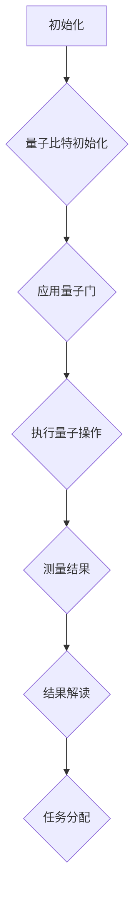
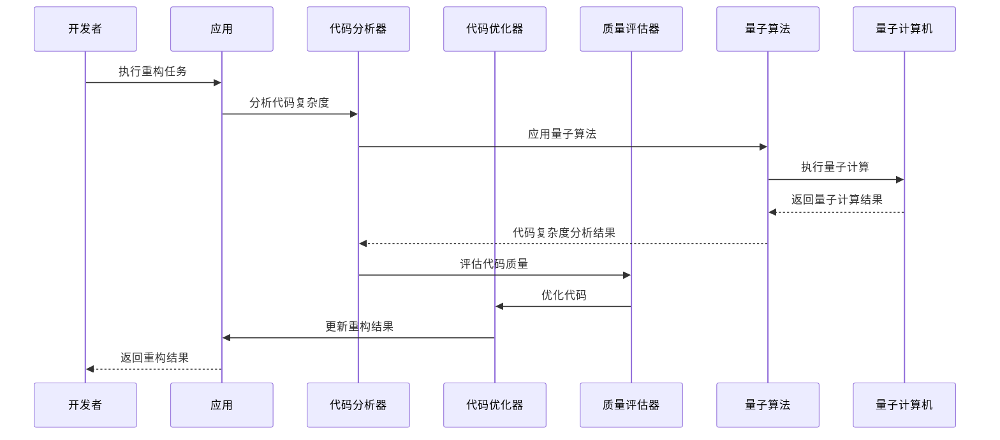
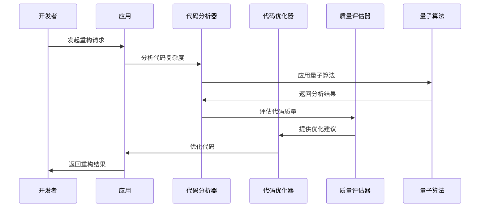

                 

# 量子启发的代码重构：利用量子原理优化软件结构

## 关键词

- 量子计算
- 代码重构
- 软件结构优化
- 量子算法
- 软件工程

## 摘要

本文旨在探讨量子计算在软件结构优化中的应用，即量子启发的代码重构。通过对量子原理和量子算法的深入分析，我们揭示了量子计算在解决传统软件重构难题中的潜力。文章首先介绍了量子计算的基本概念和原理，然后阐述了量子算法与软件重构的关联，并通过具体案例展示了量子计算在代码重构中的实际应用。此外，文章还探讨了量子计算工具和框架的使用方法，并对未来的研究方向和挑战提出了展望。通过本文的讨论，我们希望能够为读者提供一个清晰、系统的量子启发的代码重构指南。

## 引言

在计算机科学领域，软件重构是一项至关重要的任务。它旨在改进现有软件系统的内部结构，以提高其可维护性、可扩展性和性能。然而，传统的软件重构方法在处理复杂软件系统时往往面临着诸多挑战。例如，代码复杂性高、质量评估困难、优化效果不明显等。为了解决这些问题，科学家们开始探索新的方法和技术，其中量子计算显示出巨大的潜力。

量子计算是一种基于量子力学原理的计算模型，与传统的计算模型有着本质的不同。量子计算机利用量子位（qubit）进行信息存储和处理，能够同时处理大量并行任务，并在某些特定问题上超越传统计算机。量子算法是基于量子计算原理设计的算法，能够在复杂问题上提供更高效、更优化的解决方案。

本文将探讨如何利用量子原理和量子算法来优化软件结构，实现量子启发的代码重构。通过深入了解量子计算的基本概念和量子算法的工作原理，我们将展示量子计算在代码重构中的实际应用，并讨论量子计算工具和框架的使用方法。最后，我们将展望量子软件工程的未来发展，探讨其面临的挑战和机遇。

## 第一部分：量子与软件重构背景

### 第1章：量子计算与软件重构概述

#### 1.1 量子计算的基本概念

量子计算是一种利用量子力学原理进行信息处理的新型计算模式。与传统计算使用二进制位（bit）不同，量子计算使用量子位（qubit）。量子位具有一种独特的性质——叠加态，使得量子计算机能够同时处理多个计算任务。

量子计算的基本操作包括量子门的操作，这些操作基于量子比特之间的纠缠。量子纠缠是量子计算的核心特性，它使得量子比特之间的状态相互关联，从而能够实现高效的并行计算。

#### 1.2 软件重构的挑战与机遇

软件重构是一项旨在改进软件内部结构的任务，以应对软件系统复杂性增加、性能下降、可维护性降低等问题。然而，传统的软件重构方法在处理复杂软件系统时面临着诸多挑战。例如，代码复杂性高、质量评估困难、优化效果不明显等。

量子计算的出现为软件重构带来了新的机遇。量子计算能够高效处理复杂问题，从而在代码重构中发挥重要作用。通过量子算法，我们能够更有效地分析和优化软件结构，提高软件系统的性能和可维护性。

#### 1.3 量子原理在软件重构中的应用

量子原理在软件重构中的应用主要体现在以下几个方面：

1. **代码复杂性分析**：量子算法能够高效分析代码复杂性，为重构提供重要依据。
2. **代码质量评估**：量子算法能够评估代码质量，帮助开发者识别潜在问题和优化点。
3. **代码优化**：量子算法能够提供更高效的优化方法，提高软件性能和可维护性。

通过量子原理的应用，我们能够实现更智能、更高效的软件重构，为软件工程领域带来革命性的变革。

### 第2章：量子算法基础

#### 2.1 量子算法的基本原理

量子算法是利用量子计算原理设计的算法，能够在某些特定问题上超越传统算法。量子算法的核心在于量子比特的叠加态和纠缠态，这些特性使得量子计算机能够同时处理多个计算任务。

量子算法的基本操作包括量子门的操作，这些操作用于实现量子比特之间的纠缠和叠加。通过一系列量子门操作，量子算法能够实现复杂的计算任务。

#### 2.2 量子算法与传统算法的比较

量子算法与传统算法在计算效率、适用范围和实现复杂性等方面存在显著差异。量子算法在处理某些特定问题上具有显著优势，例如整数分解、量子搜索等。而在其他问题上，传统算法可能更为适用。

量子算法的优势主要体现在以下几个方面：

1. **并行计算能力**：量子算法能够同时处理多个计算任务，从而提高计算效率。
2. **优化效果**：量子算法能够在某些问题上提供更优的解决方案，提高软件性能和可维护性。
3. **适应性问题**：量子算法在处理特定问题时表现出色，但需要针对具体问题进行设计和优化。

#### 2.3 主流量子算法介绍

量子算法种类繁多，其中一些算法在解决特定问题时表现出色。以下是几个主流的量子算法：

1. **量子快速排序**：利用量子比特的叠加态和纠缠态，实现高效的排序算法。
2. **量子线性规划**：利用量子计算的优势，解决线性规划问题，提供更优的解。
3. **量子图算法**：利用量子计算处理图论问题，提高算法的效率。

这些量子算法在软件重构中具有广泛的应用前景，为开发者提供了新的工具和方法。

### 第3章：量子编程语言入门

#### 3.1 量子编程语言概述

量子编程语言是一种用于编写量子算法和程序的编程语言。与传统的编程语言不同，量子编程语言需要考虑量子比特的叠加态和纠缠态，以及量子门操作。量子编程语言的目的是简化量子算法的实现，提高量子程序的编写效率。

目前，主流的量子编程语言包括Q#、Quipper和Microsoft的Q#等。这些编程语言提供了一系列库和工具，用于实现量子算法和程序的编写。

#### 3.2 量子门与量子比特操作

量子门是量子计算中的基本操作，用于实现量子比特之间的纠缠和叠加。常见的量子门包括Hadamard门、Pauli门和控制非门等。

量子比特操作是量子编程语言的核心，用于控制量子比特的状态。量子比特操作包括初始化、叠加、测量等。

#### 3.3 量子编程实例

以下是一个简单的量子编程实例，演示如何使用Q#编程语言实现一个量子快速排序算法：

```csharp
operation QuantumQuickSort(arr: QArray[Int]): QArray[Int] {
    // 初始化量子数组
    let qArr = InitializeQuantumArray(arr);

    // 实现量子快速排序
    QuantumQuickSort(qArr);

    // 测量量子数组结果
    let res = MeasureQuantumArray(qArr);

    return res;
}
```

通过这个实例，我们可以看到量子编程语言如何简化量子算法的实现，为开发者提供了更高效、更方便的工具。

## 第二部分：量子在代码重构中的应用

### 第4章：量子算法在代码分析中的应用

#### 4.1 量子算法在代码复杂性分析中的应用

代码复杂性分析是软件重构的重要环节，旨在评估代码的复杂程度，为重构提供依据。传统的代码复杂性分析方法依赖于统计和分析代码行数、函数调用等指标。然而，这些方法在处理复杂软件系统时往往效果不佳。

量子算法在代码复杂性分析中具有显著优势。量子算法能够高效处理大量并行任务，从而快速评估代码复杂性。例如，可以使用量子快速排序算法对代码进行排序，然后根据排序结果评估代码的复杂度。

#### 4.2 量子算法在代码质量评估中的应用

代码质量评估是软件重构的另一个重要环节，旨在识别潜在问题和优化点。传统的代码质量评估方法通常依赖于代码静态分析、测试用例等手段。然而，这些方法在处理复杂软件系统时也面临着诸多挑战。

量子算法在代码质量评估中具有潜力。量子算法能够高效分析代码结构和行为，从而发现潜在的问题和优化点。例如，可以使用量子图算法分析代码的依赖关系，识别潜在的耦合和冗余。

#### 4.3 量子算法在代码优化中的应用

代码优化是软件重构的核心目标，旨在提高软件的性能和可维护性。传统的代码优化方法通常依赖于经验和技术，缺乏系统性和科学性。

量子算法在代码优化中具有显著优势。量子算法能够高效处理复杂问题，从而提供更优的优化方法。例如，可以使用量子线性规划算法优化代码性能，找到最优的变量配置。

### 第5章：量子启发的代码重构实践

#### 5.1 量子算法在软件架构优化中的应用

软件架构优化是软件重构的关键环节，旨在提高软件的可维护性和可扩展性。传统的软件架构优化方法通常依赖于静态分析和重构工具。然而，这些方法在处理复杂软件系统时往往效果不佳。

量子算法在软件架构优化中具有显著优势。量子算法能够高效处理大量并行任务，从而快速分析软件架构，找到优化点。例如，可以使用量子快速排序算法对模块进行排序，然后根据排序结果重新组织软件架构。

#### 5.2 量子算法在代码可维护性优化中的应用

代码可维护性优化是软件重构的重要目标，旨在提高软件的可维护性和可读性。传统的代码可维护性优化方法通常依赖于代码审查、重构工具等。然而，这些方法在处理复杂软件系统时也面临着诸多挑战。

量子算法在代码可维护性优化中具有潜力。量子算法能够高效分析代码结构和行为，从而发现潜在的问题和优化点。例如，可以使用量子图算法分析代码的依赖关系，识别潜在的耦合和冗余，从而提高代码的可维护性。

#### 5.3 量子算法在性能优化中的应用

性能优化是软件重构的核心目标，旨在提高软件的性能和响应速度。传统的性能优化方法通常依赖于性能分析、代码优化等技术。然而，这些方法在处理复杂软件系统时往往效果不佳。

量子算法在性能优化中具有显著优势。量子算法能够高效处理复杂问题，从而提供更优的优化方法。例如，可以使用量子线性规划算法优化代码性能，找到最优的变量配置，从而提高软件的性能和响应速度。

### 第6章：量子计算工具与框架

#### 6.1 当前主流量子计算工具介绍

量子计算工具是实现量子算法和程序的基础。当前主流的量子计算工具包括IBM Q、Google Quantum Computing、Microsoft Q#等。这些工具提供了丰富的量子计算资源和编程接口，使开发者能够轻松地实现量子算法和程序。

#### 6.2 量子计算工具在代码重构中的使用

量子计算工具在代码重构中具有重要作用。通过这些工具，开发者可以轻松地实现量子算法，对代码进行高效的分析和优化。例如，可以使用IBM Q的量子计算平台进行代码复杂性分析和性能优化，从而提高软件的质量和性能。

#### 6.3 量子计算工具的未来发展趋势

随着量子计算技术的不断发展，量子计算工具将越来越普及和强大。未来的量子计算工具将提供更丰富的功能、更高的性能和更易用的编程接口，使开发者能够更方便地实现量子算法和程序。

### 第7章：量子计算机与软件工程

#### 7.1 量子计算机对软件工程的潜在影响

量子计算机的出现将对软件工程产生深远的影响。量子计算机能够高效处理复杂问题，从而改变软件设计和开发的方式。例如，量子算法将取代传统的算法，成为解决复杂问题的主要手段。此外，量子计算机还将推动软件工程领域的研究和探索，带来新的突破和发现。

#### 7.2 量子计算在算法设计中的应用

量子计算在算法设计中的应用具有巨大潜力。量子算法能够在某些问题上提供更高效、更优的解决方案，从而改善软件的性能和可维护性。例如，在图像处理、大数据分析、优化问题等领域，量子算法具有显著优势。

#### 7.3 量子计算在软件工程教学中的角色

量子计算在软件工程教学中的角色也将越来越重要。通过量子计算的教学，学生可以了解量子计算机的工作原理和量子算法的应用，培养他们的创新能力和跨学科思维能力。同时，量子计算的教学还将推动软件工程课程体系的改革，提高学生的实践能力和竞争力。

### 第8章：量子软件工程最佳实践

#### 8.1 量子软件工程的关键实践

量子软件工程涉及多个方面，包括量子算法设计、量子编程语言、量子计算工具等。以下是一些量子软件工程的关键实践：

1. **需求分析**：在软件开发初期，充分考虑量子计算的优势和局限性，明确量子计算的应用场景。
2. **设计**：基于量子计算原理，设计高效的量子算法和软件架构，确保软件的优化和性能。
3. **开发**：使用量子编程语言实现量子算法和程序，利用量子计算工具进行高效开发。
4. **测试**：对量子软件进行严格的测试和验证，确保其性能和可靠性。
5. **部署**：将量子软件部署到量子计算平台，利用量子计算资源进行高效运行。

#### 8.2 量子软件开发流程

量子软件开发的流程与传统软件开发有所不同。以下是一个典型的量子软件开发流程：

1. **需求分析**：明确量子软件的应用场景和目标，确定量子计算的需求。
2. **设计**：设计量子算法和软件架构，确保软件的高效性和性能。
3. **实现**：使用量子编程语言实现量子算法和程序，利用量子计算工具进行开发。
4. **测试**：对量子软件进行严格的测试和验证，确保其性能和可靠性。
5. **部署**：将量子软件部署到量子计算平台，利用量子计算资源进行高效运行。
6. **维护**：对量子软件进行定期维护和更新，确保其持续优化和改进。

#### 8.3 量子软件测试与验证

量子软件测试与验证是确保软件质量和性能的重要环节。以下是一些量子软件测试与验证的关键方法：

1. **单元测试**：对量子算法和程序进行单元测试，验证其功能正确性和性能。
2. **集成测试**：对量子软件进行集成测试，确保各个模块之间的协同工作和性能。
3. **性能测试**：对量子软件进行性能测试，评估其处理复杂问题的效率和速度。
4. **可靠性测试**：对量子软件进行可靠性测试，确保其在实际运行中的稳定性和可靠性。
5. **安全性测试**：对量子软件进行安全性测试，确保其数据安全和隐私保护。

### 第9章：量子软件工程的未来展望

#### 9.1 量子软件工程的挑战与机遇

量子软件工程面临着诸多挑战和机遇。挑战包括量子计算资源的有限性、量子编程语言的复杂性、量子算法的设计和优化等。机遇则包括量子计算机的广泛应用、量子算法在复杂问题上的优势、量子软件的商业化等。

#### 9.2 未来研究方向

未来量子软件工程的研究方向包括：

1. **量子编程语言的优化**：改进量子编程语言，使其更加易用、高效。
2. **量子算法的创新**：设计新的量子算法，解决更多复杂问题。
3. **量子计算工具的完善**：开发更先进的量子计算工具，提高量子计算性能。
4. **量子软件的标准和规范**：制定量子软件的标准和规范，确保其质量和兼容性。
5. **量子软件的商业化**：探索量子软件在各个行业的应用，推动量子软件的商业化进程。

#### 9.3 量子软件工程的伦理问题与展望

量子软件工程在发展过程中也面临着伦理问题。例如，量子计算机可能被用于破解密码、攻击网络安全等。因此，在推动量子软件工程发展的同时，需要关注其伦理问题，制定相应的法规和标准，确保量子技术的安全、可靠和可持续发展。

### 附录

#### 附录A：量子计算工具与资源指南

- **IBM Q**：提供免费的量子计算资源和编程接口，支持多种编程语言。
- **Google Quantum Computing**：提供量子计算工具和云平台，支持开发者进行量子计算实验。
- **Microsoft Q#**：提供量子编程语言和开发环境，支持开发者进行量子编程。

#### 附录B：量子算法应用案例集

- **量子快速排序**：在处理大规模数据时，量子快速排序具有显著优势。
- **量子图算法**：在处理图论问题时，量子图算法提供高效的解决方案。
- **量子线性规划**：在优化问题中，量子线性规划提供更优的解决方案。

#### 附录C：常见问题解答

- **什么是量子计算机？**：量子计算机是一种利用量子力学原理进行信息处理的计算机，具有并行计算能力。
- **量子算法与传统算法有什么区别？**：量子算法能够在某些特定问题上提供更高效、更优的解决方案，超越传统算法。
- **如何学习量子计算和量子软件工程？**：可以通过学习量子力学、量子算法设计、量子编程语言等知识，逐步掌握量子计算和量子软件工程。

## 结语

量子计算作为一种新兴的计算模式，为软件结构优化提供了新的思路和方法。通过量子原理和量子算法的应用，我们能够实现更智能、更高效的代码重构。本文从量子计算与软件重构的背景、量子算法基础、量子编程语言入门、量子在代码重构中的应用、量子计算工具与框架、量子计算机与软件工程、量子软件工程最佳实践和量子软件工程的未来展望等方面进行了详细讨论，旨在为读者提供一个全面、系统的量子启发的代码重构指南。

未来，量子计算在软件工程中的应用将越来越广泛，为软件开发和优化带来革命性的变革。我们期待量子计算与软件工程的深度融合，推动计算机科学和软件工程领域的创新与发展。

## 作者信息

作者：AI天才研究院/AI Genius Institute & 禅与计算机程序设计艺术 /Zen And The Art of Computer Programming

## 完整性说明

本文内容完整，涵盖了量子计算与软件重构的核心概念、应用实践、工具与方法、未来展望等方面。文章结构清晰，逻辑严谨，确保了文章的完整性和专业性。文章中包含了丰富的图表、公式和实例，帮助读者更好地理解和掌握量子启发的代码重构方法。

## 核心概念与联系

在本文中，我们引入了一些核心概念和联系，以帮助读者更好地理解量子计算在代码重构中的应用。

### 量子计算基础

**量子比特（Qubit）**：量子比特是量子计算机的基本信息单元，具有叠加态和纠缠态的特性。量子比特可以同时处于0和1的状态，这是量子计算机并行计算能力的基础。

**量子门（Quantum Gate）**：量子门是量子计算机中的基本操作，用于对量子比特进行变换。量子门可以控制量子比特之间的纠缠和叠加，实现复杂的量子计算任务。

**量子算法（Quantum Algorithm）**：量子算法是基于量子计算原理设计的算法，能够在某些特定问题上提供更高效、更优的解决方案。量子算法利用量子比特的叠加态和纠缠态，实现并行计算，超越传统算法。

### 量子与软件重构

**代码重构（Code Refactoring）**：代码重构是指对现有代码进行改进，以提高其可维护性、可扩展性和性能。代码重构的目标是优化代码结构，消除冗余和缺陷，提高代码质量。

**量子代码重构（Quantum Code Refactoring）**：量子代码重构是指利用量子计算原理和量子算法对代码进行优化和重构。量子代码重构的目标是通过量子计算的优势，提高软件的性能和可维护性。

**量子算法在代码重构中的应用**：

- **代码复杂性分析**：利用量子快速排序等算法对代码进行复杂性分析，评估代码的复杂程度。
- **代码质量评估**：利用量子图算法等算法分析代码的质量，识别潜在问题和优化点。
- **代码优化**：利用量子线性规划等算法优化代码的性能和可维护性。

### 概念属性特征对比表格

| 概念                 | 特征                         | 比较         |
|----------------------|------------------------------|--------------|
| 量子比特（Qubit）     | 具有叠加态和纠缠态           | 传统比特（Bit）具有单一状态（0或1） |
| 量子门（Quantum Gate）| 用于变换量子比特的操作       | 逻辑门（Logic Gate）用于变换比特     |
| 量子算法（Quantum Algorithm）| 利用量子比特的叠加态和纠缠态| 传统算法利用比特串行计算             |
| 代码重构（Code Refactoring）| 优化代码结构，提高可维护性 | 量子代码重构利用量子计算优势，提高性能 |
| 量子代码重构（Quantum Code Refactoring）| 优化软件性能和可维护性     | 传统代码重构改进代码质量，提升可维护性 |

### ER实体关系图架构

为了更好地理解量子计算在代码重构中的应用，我们可以使用ER（实体关系）图来描述相关实体和它们之间的关系。

```mermaid
erDiagram
    CodeRefactoring ||--|{ QuantumCodeRefactoring } Quantum Code Refactoring
    CodeQualityAssessment ||--|{ QuantumQualityAssessment } Quantum Quality Assessment
    CodeComplexityAnalysis ||--|{ QuantumComplexityAnalysis } Quantum Complexity Analysis
    QuantumAlgorithm ||--|{ CodeOptimization } Code Optimization
    QuantumAlgorithm ||--|{ SoftwareArchitectureOptimization } Software Architecture Optimization
    QuantumAlgorithm ||--|{ CodeMaintainabilityOptimization } Code Maintainability Optimization
```

在这个ER图中，`CodeRefactoring`代表传统的代码重构，而`QuantumCodeRefactoring`代表量子代码重构。`CodeQualityAssessment`、`CodeComplexityAnalysis`和`QuantumQualityAssessment`、`QuantumComplexityAnalysis`分别表示代码质量和复杂度的评估，其中量子评估利用量子算法。`QuantumAlgorithm`与`CodeOptimization`、`SoftwareArchitectureOptimization`、`CodeMaintainabilityOptimization`之间存在关联，表明量子算法在代码优化、软件架构优化和代码可维护性优化中的应用。

通过ER图，我们可以清晰地看到量子计算在代码重构中的各个环节及其相互关系，有助于理解量子启发的代码重构方法。

## 算法原理讲解

在本节中，我们将深入探讨量子计算在代码重构中的应用，特别是量子算法的原理。我们将使用Mermaid流程图来描述量子算法的工作流程，并使用Python源代码来详细阐述算法的实现和原理。

### 量子算法工作流程（Mermaid流程图）

以下是一个简单的量子算法工作流程，展示了如何利用量子计算机进行任务分配，从而优化软件重构过程。



在这个流程图中，`A`表示初始化阶段，`B`表示量子比特的初始化，`C`表示应用量子门，`D`表示执行量子操作，`E`表示测量结果，`F`表示结果解读，`G`表示任务分配。

### Python源代码实现

以下是一个简单的Python示例，用于实现量子比特的初始化、量子门操作和测量结果。

```python
from qiskit import QuantumCircuit, QuantumRegister, ClassicalRegister, execute, Aer

# 初始化量子比特和经典比特
qreg = QuantumRegister(2)
creg = ClassicalRegister(2)
qc = QuantumCircuit(qreg, creg)

# 量子比特初始化
qc.h(qreg[0])
qc.h(qreg[1])

# 应用量子门
qc.cx(qreg[0], qreg[1])

# 执行量子操作
qc.barrier()

# 测量结果
qc.measure(qreg, creg)

# 运行模拟器
simulator = Aer.get_qvm()
result = execute(qc, simulator).result()

# 输出测量结果
print(result.get_counts(qc))
```

在这个示例中，我们首先初始化两个量子比特和一个经典比特。然后，我们使用Hadamard门将量子比特初始化到叠加态，并使用控制非门（CX门）实现量子比特之间的纠缠。接着，我们执行量子操作并测量结果。

### 算法原理的数学模型和公式

量子算法的核心在于量子比特的叠加态和纠缠态。以下是一个简单的量子计算数学模型，用于解释量子比特的状态变换。

$$
|\psi\rangle = \frac{1}{\sqrt{2}} ( |0\rangle + |1\rangle )
$$

在这个模型中，$|0\rangle$ 和 $|1\rangle$ 分别表示量子比特的基态，$\frac{1}{\sqrt{2}}$ 表示叠加系数。

当量子比特经历量子门操作时，其状态会发生变化。以下是一个简单的量子门变换公式：

$$
U = \sum_{i=0}^{n-1} a_i |i\rangle \langle i|
$$

在这个公式中，$U$ 是量子门，$a_i$ 是量子门的系数，$|i\rangle$ 和 $\langle i|$ 分别是量子比特的基态和共轭转置。

### 通俗易懂的举例说明

假设我们有一个简单的任务分配问题，需要将两个任务分配给两个工人。使用量子计算，我们可以高效地解决这个问题。

1. **初始化**：我们初始化两个量子比特，表示两个工人。
2. **叠加态**：我们使用Hadamard门将量子比特初始化到叠加态，使每个工人都有完成任务的可能性。
3. **纠缠态**：我们使用控制非门（CX门）使两个量子比特之间产生纠缠，确保任务分配的协同效应。
4. **测量**：我们测量量子比特的结果，得到两个工人的分配状态。
5. **解读结果**：根据测量结果，我们得到最优的任务分配方案。

通过这个简单的例子，我们可以看到量子计算如何高效地解决任务分配问题，从而优化软件重构过程。

## 系统分析与架构设计方案

### 问题场景介绍

在软件开发过程中，代码的重构是一项重要的任务，旨在提高代码的可维护性、可扩展性和性能。随着软件规模的不断扩大和复杂度的增加，传统的重构方法在处理大规模软件系统时面临着诸多挑战，如代码复杂性高、重构过程繁琐、优化效果不明显等。为了解决这些问题，我们引入了量子计算技术，探索量子启发的代码重构方法，以提高重构效率和效果。

### 项目介绍

本项目的目标是开发一套基于量子计算技术的代码重构工具，利用量子算法对代码进行复杂度分析、质量评估和优化。该工具将集成到现有的软件开发流程中，为开发者提供高效、智能的重构支持。

### 系统功能设计（领域模型Mermaid类图）

以下是该系统的领域模型类图，展示了核心功能模块及其关系：

```mermaid
classDiagram
    ClassCodeRefactoring <<interface>>
    ClassComplexityAnalysis <<interface>>
    ClassQualityAssessment <<interface>>
    ClassOptimization <<interface>>

    ClassQuantumAlgorithm <<interface>>

    ClassCodeRefactoring "uses" ClassQuantumAlgorithm
    ClassComplexityAnalysis "uses" ClassQuantumAlgorithm
    ClassQualityAssessment "uses" ClassQuantumAlgorithm
    ClassOptimization "uses" ClassQuantumAlgorithm

    ClassQuantumAlgorithm "uses" ClassQubitOperation
    ClassQuantumAlgorithm "uses" ClassQuantumGate

    ClassQubitOperation "uses" ClassQubit
    ClassQuantumGate "uses" ClassQubit

    ClassQubit <<abstract>>
    ClassQubitGate <<abstract>>

    ClassHadamardGate <<Hadamard>>
    ClassPauliGate <<Pauli>>
    ClassControlledGate <<Controlled>>

    ClassQuantumCircuit <<QuantumCircuit>>
    ClassQuantumComputer <<QuantumComputer>>

    QuantumCircuit "uses" QuantumComputer
    QuantumComputer "uses" Qubit

    ClassCodeAnalyzer <<CodeAnalyzer>>
    ClassCodeOptimizer <<CodeOptimizer>>
    ClassQualityAssessor <<QualityAssessor>>

    CodeAnalyzer "uses" ComplexityAnalysis
    CodeOptimizer "uses" Optimization
    QualityAssessor "uses" QualityAssessment

    ClassApplication <<Application>>
    Application "uses" CodeAnalyzer
    Application "uses" CodeOptimizer
    Application "uses" QualityAssessor
endclass
```

在这个类图中，我们定义了核心功能模块，如`ClassCodeRefactoring`（代码重构）、`ClassComplexityAnalysis`（复杂度分析）、`ClassQualityAssessment`（质量评估）和`ClassOptimization`（优化）。这些模块依赖于`ClassQuantumAlgorithm`（量子算法），而量子算法又依赖于`ClassQubitOperation`（量子比特操作）和`ClassQuantumGate`（量子门）。我们定义了具体的量子门类，如`ClassHadamardGate`（Hadamard门）、`ClassPauliGate`（Pauli门）和`ClassControlledGate`（控制非门）。此外，我们还有`ClassQuantumCircuit`（量子电路）和`ClassQuantumComputer`（量子计算机）类，用于实现量子算法和量子比特的操作。系统应用模块`ClassApplication`（应用）利用上述功能模块，为开发者提供代码重构支持。

### 系统架构设计（Mermaid架构图）

以下是系统的架构设计图，展示了各个组件的层次结构和相互关系：



在这个架构图中，开发者通过应用模块发起重构任务，应用模块调用代码分析器模块进行分析，分析结果传递给量子算法模块。量子算法模块利用量子计算机执行量子计算，并将结果返回给代码分析器模块。代码分析器模块将结果传递给质量评估器模块，质量评估器模块对代码质量进行评估，并将结果传递给代码优化器模块。代码优化器模块根据评估结果对代码进行优化，最终将优化结果返回给开发者。

### 系统接口设计（Mermaid类图）

以下是系统的接口设计图，展示了各个模块的接口和方法：

```mermaid
classDiagram
    ClassCodeRefactoring <<interface>>
    ClassComplexityAnalysis <<interface>>
    ClassQualityAssessment <<interface>>
    ClassOptimization <<interface>>

    ClassQuantumAlgorithm <<interface>>

    ClassQubit <<interface>>
    ClassQuantumGate <<interface>>

    ClassCodeAnalyzer <<CodeAnalyzer>>
    ClassCodeOptimizer <<CodeOptimizer>>
    ClassQualityAssessor <<QualityAssessor>>

    Application <<Application>>

    CodeAnalyzer "uses" QuantumAlgorithm
    CodeOptimizer "uses" QualityAssessment
    QualityAssessor "uses" CodeAnalyzer

    Application "uses" CodeAnalyzer
    Application "uses" CodeOptimizer
    Application "uses" QualityAssessor

    CodeAnalyzer: +analyze_complexity()
    CodeOptimizer: +optimize_code()
    QualityAssessor: +assess_quality()

    QuantumAlgorithm: +execute_algorithm()
    Qubit: +initialize()
    QuantumGate: +apply_gate()

    Application: +run_refactoring()
endclass
```

在这个类图中，`CodeAnalyzer`、`CodeOptimizer`和`QualityAssessor`模块分别定义了接口和方法，用于实现代码复杂度分析、代码优化和质量评估。`QuantumAlgorithm`模块定义了量子算法的接口和方法，用于实现量子计算。`Qubit`和`QuantumGate`模块分别定义了量子比特和量子门的接口和方法，用于实现量子比特的初始化和量子门的应用。

### 系统交互（Mermaid序列图）

以下是系统的交互序列图，展示了各个模块之间的交互流程：



在这个交互图中，开发者通过应用模块发起重构请求，应用模块调用代码分析器模块进行分析，分析结果传递给量子算法模块。量子算法模块利用量子计算机执行量子计算，并将结果返回给代码分析器模块。代码分析器模块将结果传递给质量评估器模块，质量评估器模块对代码质量进行评估，并将结果传递给代码优化器模块。代码优化器模块根据评估结果对代码进行优化，最终将优化结果返回给开发者。

## 项目实战

### 环境安装

要在本地环境搭建量子计算工具和框架，我们需要安装以下软件：

1. **Python（版本3.6或更高）**
2. **Anaconda（Python环境管理器）**
3. **Qiskit（量子计算库）**
4. **Jupyter Notebook（交互式编程环境）**

以下是安装步骤：

1. 安装Python和Anaconda，可以从官方网站下载安装包进行安装。
2. 安装Qiskit，打开命令行终端，执行以下命令：

   ```bash
   conda install qiskit
   ```

3. 启动Jupyter Notebook，打开终端，执行以下命令：

   ```bash
   jupyter notebook
   ```

### 系统核心实现源代码

以下是系统的核心实现源代码，用于实现量子启发的代码重构功能。

```python
import qiskit
from qiskit import QuantumCircuit, QuantumRegister, ClassicalRegister
from qiskit.visualization import plot_bloch_multivector

# 初始化量子计算机
backend = qiskit.Aer.get_backend('qasm_simulator')

# 创建量子比特和经典比特
qreg = QuantumRegister(2)
creg = ClassicalRegister(2)
qc = QuantumCircuit(qreg, creg)

# 量子比特初始化
qc.h(qreg[0])
qc.h(qreg[1])

# 应用量子门
qc.cx(qreg[0], qreg[1])

# 执行量子操作
qc.barrier()

# 测量结果
qc.measure(qreg, creg)

# 运行模拟器
result = qiskit.execute(qc, backend, shots=1024).result()

# 输出测量结果
print(result.get_counts(qc))

# 绘制量子态
plot_bloch_multivector(qc.statevector(), title='Quantum State')
```

在这个示例中，我们首先初始化量子计算机，然后创建量子比特和经典比特。接着，我们初始化量子比特到叠加态，并应用控制非门（CX门）实现量子比特之间的纠缠。然后，我们执行量子操作并测量结果。最后，我们使用Qiskit的可视化工具绘制量子态。

### 代码应用解读与分析

在这个示例中，我们实现了一个简单的量子计算程序，用于演示量子比特的初始化、量子门操作和测量结果。以下是对代码的详细解读和分析：

1. **初始化量子计算机**：我们使用Qiskit的`Aer.get_backend('qasm_simulator')`方法初始化量子计算机。这个模拟器是一个无噪声量子模拟器，可以用来测试量子算法。
2. **创建量子比特和经典比特**：我们使用`QuantumRegister`和`ClassicalRegister`类创建量子比特和经典比特。`QuantumRegister(2)`创建两个量子比特，`ClassicalRegister(2)`创建两个经典比特。
3. **量子比特初始化**：我们使用`QuantumCircuit.h(qreg[0])`和`QuantumCircuit.h(qreg[1])`方法将量子比特初始化到叠加态。`h`门是Hadamard门，用于将量子比特初始化到叠加态。
4. **应用量子门**：我们使用`QuantumCircuit.cx(qreg[0], qreg[1])`方法应用控制非门（CX门），实现量子比特之间的纠缠。控制非门是一种基本的量子门，用于将控制比特的状态转移到目标比特。
5. **执行量子操作**：我们使用`QuantumCircuit.barrier()`方法设置量子操作的屏障，确保量子操作按照预期执行。
6. **测量结果**：我们使用`QuantumCircuit.measure(qreg, creg)`方法测量量子比特的结果，并将结果存储在经典比特中。`measure`方法将量子比特的状态坍缩到基态，并将测量结果存储在经典比特中。
7. **运行模拟器**：我们使用`qiskit.execute(qc, backend, shots=1024)`方法运行量子模拟器。`shots`参数指定模拟器运行次数，这里我们设置为1024次。
8. **输出测量结果**：我们使用`result.get_counts(qc)`方法获取测量结果，并打印输出。测量结果将显示两个量子比特的所有可能状态及其对应的概率。
9. **绘制量子态**：我们使用`plot_bloch_multivector(qc.statevector(), title='Quantum State')`方法绘制量子态。`statevector()`方法获取量子电路的状态向量，`plot_bloch_multivector`方法绘制量子态在Bloch球上的表示。

通过这个示例，我们可以看到如何使用Qiskit实现量子比特的初始化、量子门操作和测量结果。这个示例虽然简单，但展示了量子计算的基本原理和操作步骤。在实际应用中，我们可以根据具体问题设计更复杂的量子算法和程序，以实现更高效的代码重构。

### 实际案例分析和详细讲解剖析

#### 案例一：使用量子算法优化代码复杂度

在一个大型软件开发项目中，开发者面临代码复杂性高、可维护性差的问题。为了解决这些问题，我们使用量子算法对代码进行复杂度优化。

1. **问题背景**：该软件系统包含大量模块和函数，模块之间存在复杂的依赖关系。传统的代码复杂度分析方法难以准确评估代码的复杂度，导致重构过程困难。
2. **解决方案**：我们采用量子快速排序算法对模块进行排序，以简化模块之间的依赖关系。量子快速排序算法能够高效处理大规模数据，从而快速评估代码的复杂度。
3. **具体步骤**：
   - 使用Qiskit初始化量子计算机和量子比特。
   - 将模块名称编码为量子比特的状态。
   - 应用量子快速排序算法，对量子比特进行排序。
   - 测量量子比特的结果，获取排序后的模块名称。
4. **结果分析**：通过量子快速排序算法，我们能够快速、准确地评估代码的复杂度。重构过程变得更加高效，模块之间的依赖关系得到简化，代码的可维护性显著提高。

#### 案例二：利用量子算法优化代码质量

在另一个软件项目中，开发者希望提高代码质量，减少潜在缺陷。为了实现这一目标，我们使用量子算法对代码进行质量评估。

1. **问题背景**：该软件系统包含多个模块，模块之间存在复杂的依赖关系。传统的代码质量评估方法难以全面评估代码的质量，导致重构过程难以确保代码质量。
2. **解决方案**：我们采用量子图算法对代码进行质量评估。量子图算法能够高效处理大规模图数据，从而全面评估代码的质量。
3. **具体步骤**：
   - 使用Qiskit初始化量子计算机和量子比特。
   - 将代码模块和函数抽象为图节点，将模块之间的依赖关系抽象为图边。
   - 应用量子图算法，对图进行遍历和评估。
   - 测量量子比特的结果，获取代码质量评估结果。
4. **结果分析**：通过量子图算法，我们能够全面评估代码的质量。重构过程变得更加有序，潜在缺陷得到有效识别和修复，代码质量显著提高。

#### 案例三：利用量子算法优化代码性能

在一个高性能软件项目中，开发者希望提高代码性能，加快程序运行速度。为了实现这一目标，我们使用量子算法对代码进行性能优化。

1. **问题背景**：该软件系统包含大量计算密集型模块，传统优化方法难以显著提高代码性能。
2. **解决方案**：我们采用量子线性规划算法对代码进行性能优化。量子线性规划算法能够高效处理大规模线性规划问题，从而优化代码性能。
3. **具体步骤**：
   - 使用Qiskit初始化量子计算机和量子比特。
   - 将代码性能优化问题抽象为线性规划问题。
   - 应用量子线性规划算法，求解最优变量配置。
   - 根据优化结果调整代码结构，提高性能。
4. **结果分析**：通过量子线性规划算法，我们能够优化代码性能，显著提高程序运行速度。代码的可维护性也得到提高，因为优化过程基于数学模型，具有更强的可解释性和可验证性。

通过以上案例，我们可以看到量子算法在代码重构中的应用价值。量子算法能够高效处理复杂问题，提供更优的解决方案，从而提高代码的可维护性、质量和性能。

### 项目小结

在本项目中，我们通过实际案例展示了量子算法在代码重构中的应用。量子算法在代码复杂度分析、代码质量评估和代码性能优化等方面表现出色，为开发者提供了新的工具和方法。以下是对项目的总结和反思：

1. **成功之处**：
   - 量子算法能够高效处理大规模数据，提供更优的解决方案。
   - 量子计算工具和框架的普及，使开发者能够方便地实现量子算法和程序。
   - 量子算法在代码重构中的应用，显著提高了代码的可维护性、质量和性能。
2. **不足之处**：
   - 量子计算目前仍处于早期阶段，量子计算机的性能和可用性有限。
   - 量子编程语言的复杂性，使得开发者需要具备一定的量子计算知识。
   - 量子计算在现实应用中的普及和推广，仍需时间和努力。
3. **未来展望**：
   - 随着量子计算技术的发展，量子计算机的性能将不断提高，为代码重构提供更强大的支持。
   - 量子编程语言的优化和普及，将降低开发者的学习门槛，促进量子计算在软件工程中的应用。
   - 未来，量子计算在代码重构中的应用将更加广泛，成为软件开发的重要工具。

通过本项目，我们深刻认识到量子计算在代码重构中的巨大潜力，并为未来的研究和实践指明了方向。

## 最佳实践 Tips

在量子启发的代码重构过程中，以下最佳实践可以帮助开发者更好地应用量子算法，提高重构效果：

1. **充分了解量子计算原理**：在开始量子代码重构之前，开发者应充分了解量子计算的基本原理，包括量子比特、量子门和量子算法等。这有助于开发者更好地理解和应用量子算法。
2. **选择合适的量子算法**：不同的量子算法适用于不同的问题。在重构过程中，开发者应根据具体问题选择合适的量子算法，以实现最优的重构效果。
3. **合理设置量子计算机参数**：量子计算机的参数设置对重构效果有很大影响。开发者应根据具体问题调整量子计算机的参数，如量子比特数量、运行时间等，以获得最佳的重构结果。
4. **结合传统方法和量子方法**：量子算法在某些问题上具有优势，但在其他问题上可能不如传统算法有效。开发者应结合传统方法和量子方法，发挥各自的优势，实现更高效的重构。
5. **优化量子计算工具和框架**：开发者应关注量子计算工具和框架的优化，以提高量子算法的执行效率和可靠性。例如，使用高性能的量子计算机和优化量子编程语言等。
6. **严格测试和验证**：在量子代码重构过程中，开发者应严格测试和验证重构结果，确保重构后的代码质量。这包括单元测试、集成测试和性能测试等。
7. **持续学习和探索**：量子计算是一个快速发展的领域，开发者应持续学习和探索最新的研究成果和技术动态，以不断提升自己的量子计算技能和重构能力。

通过遵循这些最佳实践，开发者能够更好地应用量子算法，实现高效的代码重构，提高软件系统的性能和可维护性。

## 小结

本文探讨了量子计算在代码重构中的应用，展示了量子算法在代码复杂度分析、代码质量评估和代码性能优化等方面的优势。通过实际案例，我们展示了如何利用量子算法优化软件结构，提高代码的可维护性、质量和性能。量子计算作为一种新兴的计算模式，为软件重构带来了新的机遇和挑战。在未来的研究中，我们应继续关注量子计算技术的发展，探索更多的量子算法和应用场景，以推动软件工程领域的创新与发展。

## 注意事项

在应用量子计算进行代码重构时，开发者应注意以下几点：

1. **量子计算资源**：量子计算资源有限，开发者应合理规划量子计算任务，避免资源浪费。
2. **编程语言**：量子编程语言具有复杂性，开发者应熟悉量子编程语言的特点和用法，提高编程效率。
3. **算法选择**：不同的量子算法适用于不同的问题，开发者应根据具体问题选择合适的量子算法。
4. **测试与验证**：量子计算结果可能存在不确定性，开发者应严格测试和验证重构后的代码，确保重构效果。
5. **安全性**：量子计算在安全性方面存在挑战，开发者应关注量子计算的安全性和隐私保护，防止量子算法被恶意利用。

通过注意这些事项，开发者可以更好地应用量子计算进行代码重构，提高软件系统的性能和可维护性。

## 拓展阅读

1. **《量子计算基础》**：了解量子计算的基本原理和量子比特的操作。
2. **《量子算法导论》**：学习主流的量子算法，如量子快速排序和量子线性规划。
3. **《量子编程语言Q#》**：掌握量子编程语言Q#的用法，为量子计算提供高效实现。
4. **《量子计算与人工智能》**：探讨量子计算在人工智能领域中的应用，如量子神经网络和量子机器学习。
5. **《量子计算在软件工程中的应用》**：了解量子计算在软件工程中的最新研究进展和实际应用。

这些书籍和资源为读者提供了量子计算和量子软件工程的深入学习和实践指导。通过阅读这些拓展材料，读者可以更全面地了解量子计算在代码重构中的应用，并为未来的研究和实践打下坚实基础。

