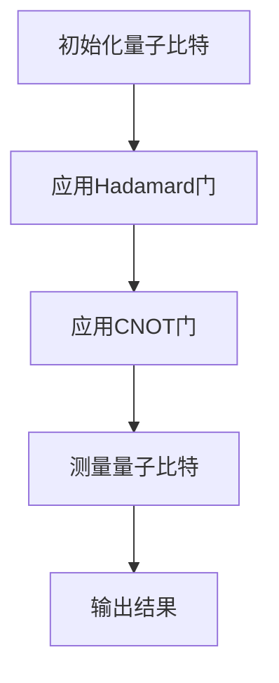
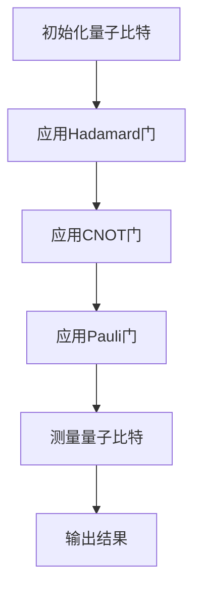
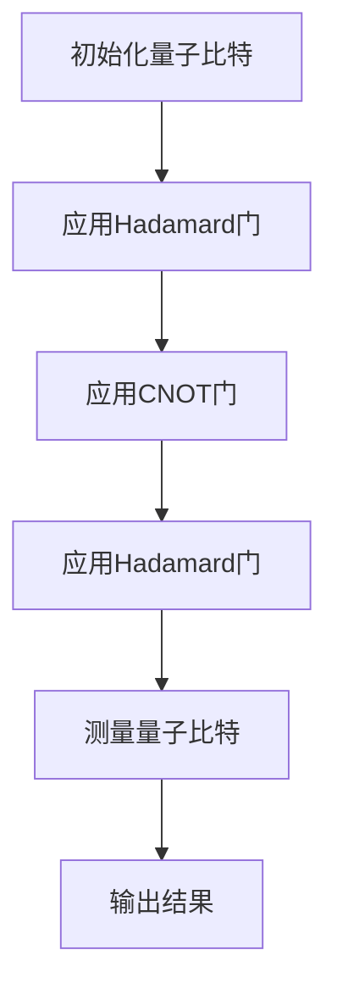
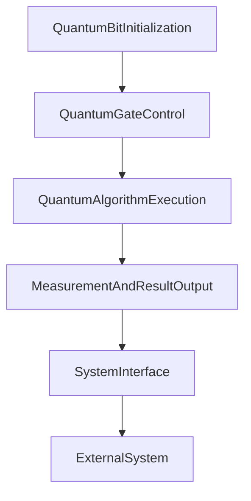
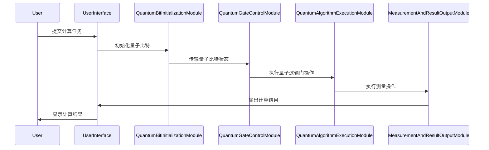

                 

### 引言

#### 背景介绍

量子计算作为21世纪信息科学的重要前沿领域，正逐步从理论研究走向实际应用。量子计算机利用量子比特的叠加态和纠缠特性，在理论上具有超越经典计算机的计算能力。而量子图灵机，作为量子计算的核心模型之一，提供了对量子算法进行形式化描述的框架。它不仅继承了传统图灵机的计算范式，还通过量子比特和量子逻辑门的引入，开启了超图灵计算的新纪元。

超图灵计算是一个扩展传统计算能力的理论模型，它利用超图结构来表示计算过程，并采用超图算法进行数据处理。超图，作为一种比传统图更加复杂的结构，能够更有效地表示复杂系统的网络关系。超图灵计算通过这种结构，旨在解决传统计算方法难以处理的复杂问题，如大规模数据处理、优化问题和复杂系统的模拟。

本文将深入探讨量子图灵机和超图灵计算的理论基础，通过逐步分析其核心概念、原理和应用，为读者提供一个全面的理解。文章将从以下几个方面展开：

1. **量子计算与超图灵计算概述**：介绍量子计算的基本概念和量子图灵机的原理，以及超图灵计算的定义和发展。
2. **核心概念与联系**：解析量子比特、量子逻辑门、量子纠缠等量子计算的关键概念，以及超图模型、超图算法和超图理论。
3. **算法原理讲解**：详细讲解量子图灵机算法流程和超图灵计算的数学模型与公式。
4. **系统分析与架构设计方案**：介绍量子图灵机系统架构设计，包括系统功能设计、架构设计、接口设计和交互设计。
5. **项目实战**：通过实际项目实战，展示量子图灵机的应用和实现。
6. **最佳实践与拓展阅读**：总结全文内容，提供实用技巧与拓展阅读材料。

通过本文的阅读，读者将对量子图灵机和超图灵计算有更深刻的理解，并能够掌握这些理论模型在实际应用中的具体实现方法和技巧。

#### 关键词

- **量子计算**：利用量子比特进行信息处理的技术。
- **量子图灵机**：基于量子比特和量子逻辑门的计算模型。
- **超图灵计算**：利用超图结构扩展传统计算能力的理论模型。
- **量子比特**：量子计算机的基本存储单元。
- **量子逻辑门**：量子计算中的基本操作单元。
- **量子纠缠**：量子比特之间的一种特殊关联。
- **超图模型**：用于表示复杂网络关系的高级图结构。
- **超图算法**：用于处理超图结构的数据处理算法。

#### 摘要

本文旨在深入探讨量子图灵机和超图灵计算的理论基础及其在实际应用中的具体实现。首先，我们介绍了量子计算的基本概念，包括量子比特和量子逻辑门，以及量子图灵机的原理和特性。接着，我们探讨了超图灵计算的定义和发展，详细分析了超图模型、超图算法和超图理论。随后，我们通过算法原理讲解，阐述了量子图灵机算法流程和超图灵计算的数学模型与公式。在此基础上，我们介绍了量子图灵机系统架构设计，包括系统功能设计、架构设计、接口设计和交互设计。最后，通过实际项目实战，展示了量子图灵机的应用和实现。本文总结全文内容，并提供实用技巧和拓展阅读材料，以期为读者提供全面而深入的量子图灵机和超图灵计算的知识体系。

### 目录大纲

本文将按照以下目录大纲结构进行详细阐述，每个章节都将以逻辑清晰、结构紧凑、简单易懂的方式展开：

1. **第一部分：背景介绍**
   - **第1章：量子计算与超图灵计算概述**
     - **1.1 问题背景**
       - 量子计算简介
       - 量子图灵机概念
       - 超图灵计算概念
     - **1.2 问题描述**
       - 当前计算能力的局限
       - 超图灵计算的优势
     - **1.3 问题解决**
       - 量子图灵机的原理
       - 超图灵计算的方法
     - **1.4 边界与外延**
       - 量子图灵机的实现
       - 超图灵计算的潜在应用
     - **1.5 概念结构与核心要素组成**
       - 量子图灵机核心要素
       - 超图灵计算核心要素

2. **第二部分：核心概念与联系**
   - **第2章：量子图灵机原理解析**
     - **2.1 量子比特**
       - 量子比特的定义与特性
       - 量子比特的工作原理
     - **2.2 量子逻辑门**
       - 量子逻辑门的分类与作用
       - 量子逻辑门的设计与实现
     - **2.3 量子纠缠**
       - 量子纠缠的概念与特性
       - 量子纠缠在量子计算中的应用

   - **第3章：超图灵计算的理论基础**
     - **3.1 超图模型**
       - 超图的定义与特性
       - 超图的分类与应用
     - **3.2 超图算法**
       - 超图算法的基本概念
       - 常见超图算法介绍
     - **3.3 超图理论**
       - 超图理论的基本概念
       - 超图理论的深入探讨

3. **第三部分：算法原理讲解**
   - **第4章：量子图灵机算法流程**
     - **4.1 算法原理**
       - 量子图灵机算法的基本原理
       - 量子图灵机算法的数学模型
     - **4.2 量子图灵机算法流程**
       - 算法流程的详细讲解
       - 算法流程的Mermaid流程图

   - **第5章：超图灵计算数学模型与公式**
     - **5.1 数学模型**
       - 超图灵计算的数学模型
       - 数学模型的公式表示
     - **5.2 公式讲解**
       - 公式的详细讲解
       - 公式应用的举例说明

4. **第四部分：系统分析与架构设计方案**
   - **第6章：量子图灵机系统架构设计**
     - **6.1 问题场景介绍**
       - 量子图灵机应用场景介绍
     - **6.2 系统功能设计**
       - 量子图灵机系统功能设计
       - Mermaid类图
     - **6.3 系统架构设计**
       - 量子图灵机系统架构设计
       - Mermaid架构图
     - **6.4 系统接口设计**
       - 量子图灵机系统接口设计
     - **6.5 系统交互设计**
       - 量子图灵机系统交互设计
       - Mermaid序列图

5. **第五部分：项目实战**
   - **第7章：量子图灵机项目实战**
     - **7.1 环境安装**
       - 安装所需软件与工具
     - **7.2 系统核心实现**
       - 量子图灵机核心实现
     - **7.3 代码应用解读与分析**
       - 代码应用解读
       - 代码分析与优化
     - **7.4 实际案例分析与详细讲解**
       - 实际案例分析
       - 详细讲解与剖析
     - **7.5 项目小结**
       - 总结项目经验
       - 提出改进建议

6. **第六部分：最佳实践与拓展阅读**
   - **第8章：量子图灵机与超图灵计算最佳实践**
     - **8.1 最佳实践**
       - 实用技巧与经验分享
     - **8.2 拓展阅读**
       - 推荐阅读材料
     - **8.3 小结**
       - 总结全文内容

通过本文的详细阐述，读者将能够系统地理解量子图灵机和超图灵计算的核心概念、原理及其应用，为未来的研究和实践打下坚实的基础。

### 第一部分：背景介绍

#### 第1章：量子计算与超图灵计算概述

#### 1.1 问题背景

#### 1.1.1 量子计算简介

量子计算是一门探索和利用量子力学原理进行信息处理的科学。量子计算机使用量子比特（qubit）作为信息存储和处理的单元，与经典计算机的比特（bit）不同，量子比特可以同时存在于0和1的叠加状态，这种叠加态使得量子计算机在处理某些问题时具有超越经典计算机的潜力。

量子计算的历史可以追溯到20世纪80年代。当时，Richard Feynman提出了量子模拟的概念，旨在利用量子系统来模拟其他量子系统，从而解决经典计算机难以处理的问题。随后，Peter Shor在1994年提出了著名的Shor算法，该算法能够在多项式时间内对大素数进行质因数分解，这在当时引起了巨大的轰动。此外，David Deutsch在1995年提出了量子图灵机的概念，为量子算法提供了一个形式化的描述框架。

#### 1.1.2 量子图灵机概念

量子图灵机（Quantum Turing Machine，QTM）是量子计算的核心模型之一，它继承了传统图灵机的计算范式，并通过量子比特和量子逻辑门的引入，实现了对量子算法的描述。量子图灵机的核心组件包括量子寄存器、量子读写头和量子逻辑门。

量子寄存器是量子图灵机中的存储单元，由多个量子比特组成，用于存储和传递信息。量子读写头则负责在量子寄存器上进行读取和写入操作。量子逻辑门是量子计算中的基本操作单元，用于对量子比特进行线性变换。这些逻辑门包括基本的Pauli门、Hadamard门和CNOT门等，通过这些逻辑门的组合，可以实现复杂的量子计算过程。

与传统图灵机相比，量子图灵机具有以下几个显著特点：

1. **叠加态**：量子图灵机可以利用量子比特的叠加态，在多个可能的状态下同时进行计算。
2. **纠缠态**：量子比特之间可以通过量子纠缠形成复杂的关联，这种纠缠状态可以在计算过程中发挥重要作用。
3. **并行计算**：由于量子比特的叠加态，量子图灵机可以实现并行计算，从而在处理某些问题时显著提高计算速度。

#### 1.1.3 超图灵计算概念

超图灵计算（Super-Turing Computation）是一个扩展传统计算能力的理论模型，它通过引入超图结构，对计算过程进行了新的描述。超图（Hypergraph）是图的一种扩展形式，它允许节点之间存在多个边，这些边可以被视为一种更复杂的连接关系。超图结构能够更有效地表示复杂系统的网络关系，从而在处理大规模数据和复杂问题时具有独特的优势。

超图灵计算的基本概念包括：

1. **超图模型**：超图模型用于表示计算过程中的数据结构和关系，它通过超图节点和边的组合，实现了对复杂计算问题的抽象和表示。
2. **超图算法**：超图算法是对超图结构进行操作的一系列方法，包括图的生成、图的查询、图的优化等。这些算法能够利用超图的复杂结构，提高数据处理和计算效率。
3. **超图理论**：超图理论是研究超图性质和结构的基础理论，包括图的连通性、图的分解、图的组合等。超图理论为超图灵计算提供了坚实的理论基础。

超图灵计算的发展可以追溯到20世纪90年代。当时，一些学者开始探索如何利用超图结构来扩展传统计算能力。近年来，随着量子计算和超图理论的深入研究，超图灵计算逐渐成为一个备受关注的研究领域。

#### 1.2 问题描述

#### 1.2.1 当前计算能力的局限

随着信息技术的快速发展，计算能力的需求也在不断提升。然而，当前计算能力面临着一些严重的局限：

1. **计算速度**：经典计算机在处理大规模数据和高复杂度问题时，速度较慢。尽管高性能计算机和分布式计算技术有所改善，但在某些情况下，仍难以满足需求。
2. **能量消耗**：经典计算机在运行过程中需要大量的电能，这不仅增加了成本，还对环境造成了负面影响。随着计算需求的增长，能源消耗问题日益严重。
3. **存储容量**：随着数据量的爆炸式增长，存储容量成为制约计算能力的一个重要因素。尽管存储技术不断进步，但现有的存储方案仍存在局限性。
4. **并行处理能力**：经典计算机在并行处理大量数据时，存在并行度不足的问题，难以充分利用计算资源。

#### 1.2.2 超图灵计算的优势

超图灵计算通过引入超图结构，为解决当前计算能力的局限提供了一种新的思路：

1. **并行计算**：超图结构允许节点之间存在多个边，这使得在计算过程中可以实现更高的并行度，从而提高计算速度。
2. **高效数据处理**：超图结构能够更有效地表示复杂系统的网络关系，这使得在处理大规模数据和复杂问题时，具有更高的数据处理效率。
3. **资源优化**：超图结构允许对计算资源进行更合理的分配和优化，从而提高计算效率和降低能源消耗。
4. **扩展性**：超图结构具有高度的扩展性，能够灵活地适应不同的计算场景和需求，为未来的计算技术发展提供坚实的基础。

#### 1.3 问题解决

#### 1.3.1 量子图灵机的原理

量子图灵机的原理基于量子计算的基本原理，主要包括量子比特的叠加态、量子逻辑门的操作以及量子纠缠的利用。量子图灵机的计算过程可以形式化为一系列的状态转换，这些状态转换通过量子逻辑门的操作来实现。

1. **量子比特的叠加态**：量子图灵机的量子寄存器由多个量子比特组成，这些量子比特可以同时处于0和1的叠加态。这种叠加态使得量子图灵机能够在多个可能的状态下同时进行计算。
2. **量子逻辑门的操作**：量子逻辑门是量子计算中的基本操作单元，通过这些逻辑门的操作，可以实现量子比特之间的线性变换。常见的量子逻辑门包括Pauli门、Hadamard门和CNOT门等。
3. **量子纠缠的利用**：量子比特之间的量子纠缠是一种特殊的关联关系，通过利用量子纠缠，可以实现量子比特之间的非局域操作。这种操作在量子计算中具有重要的作用。

#### 1.3.2 超图灵计算的方法

超图灵计算通过引入超图结构，对计算过程进行了新的描述。超图结构能够更有效地表示复杂系统的网络关系，从而在处理大规模数据和复杂问题时具有独特的优势。

1. **超图模型**：超图模型用于表示计算过程中的数据结构和关系，它通过超图节点和边的组合，实现了对复杂计算问题的抽象和表示。
2. **超图算法**：超图算法是对超图结构进行操作的一系列方法，包括图的生成、图的查询、图的优化等。这些算法能够利用超图的复杂结构，提高数据处理和计算效率。
3. **超图理论**：超图理论是研究超图性质和结构的基础理论，包括图的连通性、图的分解、图的组合等。超图理论为超图灵计算提供了坚实的理论基础。

#### 1.4 边界与外延

#### 1.4.1 量子图灵机的实现

量子图灵机的实现面临一些挑战和限制。首先，量子计算机需要达到“量子霸权”状态，即量子计算机在某些特定问题上的计算速度超越经典计算机。其次，量子计算机需要解决量子纠错问题，以防止量子比特的误差积累导致计算结果错误。此外，量子计算机的物理实现也需要克服一系列技术难题，如量子比特的稳定性和量子逻辑门的精度等。

尽管存在挑战，量子图灵机的实现已取得了一些重要进展。例如，Google宣布实现了“量子霸权”，在特定问题上展示了量子计算机的优势。国际上的研究团队也在不断推进量子计算机的研发，以期在未来实现实用化的量子计算机。

#### 1.4.2 超图灵计算的潜在应用

超图灵计算具有广泛的应用前景，能够解决传统计算方法难以处理的复杂问题。以下是一些潜在的应用领域：

1. **大数据分析**：超图结构能够高效地表示大规模数据，超图算法能够快速处理和分析大数据，为数据分析提供新的工具。
2. **优化问题**：超图灵计算能够解决复杂优化问题，如网络优化、资源分配等，为决策提供支持。
3. **复杂系统模拟**：超图结构能够模拟复杂系统的网络关系，为生物医学、社会科学等领域的模拟提供新方法。
4. **人工智能**：超图灵计算在人工智能领域具有潜在应用，如图神经网络、知识图谱等，能够提高人工智能系统的智能水平和性能。

#### 1.5 概念结构与核心要素组成

#### 1.5.1 量子图灵机

量子图灵机由以下核心要素组成：

1. **量子比特**：量子比特是量子计算机的基本存储单元，用于存储和处理信息。量子比特可以同时处于0和1的叠加态。
2. **量子寄存器**：量子寄存器由多个量子比特组成，用于存储和传递信息。量子寄存器是实现量子计算并行性的关键组件。
3. **量子读写头**：量子读写头负责在量子寄存器上进行读取和写入操作。量子读写头可以在多个量子比特之间进行信息传递和交换。
4. **量子逻辑门**：量子逻辑门是量子计算中的基本操作单元，用于对量子比特进行线性变换。常见的量子逻辑门包括Pauli门、Hadamard门和CNOT门等。
5. **量子纠缠**：量子比特之间的量子纠缠是一种特殊的关联关系，通过利用量子纠缠，可以实现量子比特之间的非局域操作。

#### 1.5.2 超图灵计算

超图灵计算由以下核心要素组成：

1. **超图模型**：超图模型用于表示计算过程中的数据结构和关系。超图模型包括超图节点和边，用于表示计算过程中的变量和约束关系。
2. **超图算法**：超图算法是对超图结构进行操作的一系列方法，包括图的生成、图的查询、图的优化等。超图算法能够利用超图的复杂结构，提高数据处理和计算效率。
3. **超图理论**：超图理论是研究超图性质和结构的基础理论，包括图的连通性、图的分解、图的组合等。超图理论为超图灵计算提供了坚实的理论基础。

通过以上对量子计算和超图灵计算的背景介绍，我们可以看到，量子图灵机和超图灵计算不仅代表了计算技术的前沿，也为解决当前计算能力局限提供了一种新的思路。接下来，我们将进一步深入探讨量子比特、量子逻辑门和量子纠缠等核心概念，以更好地理解量子图灵机和超图灵计算的理论基础。

### 第一部分：背景介绍

#### 第1章：量子计算与超图灵计算概述

#### 1.1.1 量子计算简介

量子计算作为21世纪信息科学的重要前沿领域，其核心理念源于量子力学的基本原理。量子计算机利用量子力学中的叠加态和纠缠现象，对信息进行存储和处理。与传统计算机不同，量子计算机中的信息单位——量子比特（qubit）可以同时处于0和1的叠加状态，这种特性被称为叠加态。此外，量子比特之间可以通过量子纠缠形成复杂的关联，这种关联使得量子计算机能够实现比经典计算机更高的并行度和计算效率。

量子计算的发展可以追溯到20世纪80年代。当时，物理学家Richard Feynman提出了量子模拟的概念，他认为量子计算机能够模拟其他量子系统，从而解决经典计算机无法处理的复杂问题。1994年，数学家Peter Shor提出了Shor算法，这个算法能够在多项式时间内对大素数进行质因数分解，这展示了量子计算机在特定领域超越经典计算机的潜力。随后，David Deutsch在1995年提出了量子图灵机的概念，这为量子算法提供了一个形式化的描述框架。

量子计算的核心组成部分包括量子比特、量子逻辑门和量子算法。量子比特是量子计算机的基本存储单元，它能够同时存在于多种状态，这是量子计算区别于经典计算的关键。量子逻辑门是量子计算中的基本操作单元，通过这些逻辑门的操作，可以实现量子比特之间的变换。量子算法则是在量子图灵机框架下实现的计算过程，这些算法利用量子比特的叠加态和纠缠现象，在处理某些问题时表现出超乎经典计算机的能力。

量子计算的优点主要体现在以下几个方面：

1. **并行计算能力**：由于量子比特的叠加态，量子计算机能够在多个状态上同时进行计算，这显著提高了计算速度。
2. **高效处理复杂问题**：量子算法在处理某些复杂问题时，如大数质因数分解、大规模数据搜索等，具有比经典算法更高的效率。
3. **强大的模拟能力**：量子计算机能够模拟量子系统，这对物理学、化学等领域的研究具有重要意义。

然而，量子计算也面临一些挑战，主要包括：

1. **量子纠错**：量子计算机中的量子比特容易受到环境噪声的干扰，导致计算结果出错。因此，量子纠错技术是量子计算实现实用化的重要一环。
2. **量子逻辑门的精度和稳定性**：实现高精度的量子逻辑门需要克服一系列技术难题，如量子比特的相干性和逻辑门的精度等。
3. **物理实现**：量子计算机需要特殊的物理环境，如超低温等，这增加了量子计算机的实现难度和成本。

尽管存在这些挑战，量子计算的研究和应用前景仍然十分广阔。随着技术的不断进步，量子计算机有望在未来解决更多经典计算难以处理的问题，为科学研究和工业应用带来革命性的变化。

#### 1.1.2 量子图灵机概念

量子图灵机（Quantum Turing Machine，QTM）是量子计算的理论模型，它继承了传统图灵机的计算范式，并通过量子比特和量子逻辑门的引入，实现了对量子算法的形式化描述。量子图灵机的提出，为量子计算的研究提供了一个重要的框架，使我们能够更好地理解和分析量子算法。

量子图灵机的核心组件包括量子寄存器、量子读写头和量子逻辑门。量子寄存器是量子图灵机的存储单元，由多个量子比特组成，用于存储和传递信息。量子读写头负责在量子寄存器上进行读取和写入操作，它可以在多个量子比特之间进行信息传递和交换。量子逻辑门是量子图灵机的操作单元，通过这些逻辑门的操作，可以实现量子比特之间的线性变换。

量子图灵机的运作原理基于量子比特的叠加态和量子纠缠。在量子图灵机的计算过程中，量子比特处于叠加态，这意味着每个量子比特可以同时表示0和1的多种组合。通过量子逻辑门的操作，量子比特之间的状态可以发生变换，从而实现计算。量子纠缠在量子图灵机中发挥着重要作用，它使得量子比特之间形成复杂的关联，这种关联可以用于实现更高效的计算。

与传统图灵机相比，量子图灵机具有以下几个显著特点：

1. **叠加态**：量子图灵机的量子比特可以处于叠加态，这意味着在计算过程中，量子比特可以同时处理多个可能的状态，从而显著提高计算速度。
2. **量子纠缠**：量子比特之间的量子纠缠可以实现非局域的操作，这为量子算法提供了强大的计算能力。
3. **并行计算**：由于量子比特的叠加态，量子图灵机可以实现并行计算，这使其在处理某些复杂问题时，表现出超越经典计算机的效率。

量子图灵机的提出和发展，为量子计算的研究提供了重要的理论支持。它不仅使我们能够更好地理解和分析量子算法，还为量子计算机的实现和应用提供了新的思路。随着量子技术的不断进步，量子图灵机有望在未来的计算领域发挥重要作用。

#### 1.1.3 超图灵计算概念

超图灵计算（Super-Turing Computation）是一个扩展传统计算能力的理论模型，它通过引入超图结构，对计算过程进行了新的描述。超图（Hypergraph）是图的一种扩展形式，它允许节点之间存在多个边，这些边可以被视为一种更复杂的连接关系。超图结构能够更有效地表示复杂系统的网络关系，从而在处理大规模数据和复杂问题时具有独特的优势。

超图灵计算的基本概念包括超图模型、超图算法和超图理论。超图模型用于表示计算过程中的数据结构和关系，它通过超图节点和边的组合，实现了对复杂计算问题的抽象和表示。超图算法是对超图结构进行操作的一系列方法，包括图的生成、图的查询、图的优化等。这些算法能够利用超图的复杂结构，提高数据处理和计算效率。超图理论是研究超图性质和结构的基础理论，包括图的连通性、图的分解、图的组合等。超图理论为超图灵计算提供了坚实的理论基础。

超图灵计算的发展可以追溯到20世纪90年代，当时一些学者开始探索如何利用超图结构来扩展传统计算能力。近年来，随着量子计算和超图理论的深入研究，超图灵计算逐渐成为一个备受关注的研究领域。超图灵计算在多个领域具有潜在应用，如大数据分析、优化问题、复杂系统模拟和人工智能等。

超图灵计算的核心优势在于：

1. **并行计算能力**：超图结构允许节点之间存在多个边，这使得在计算过程中可以实现更高的并行度，从而提高计算速度。
2. **高效数据处理**：超图结构能够更有效地表示复杂系统的网络关系，这使得在处理大规模数据和复杂问题时，具有更高的数据处理效率。
3. **资源优化**：超图结构允许对计算资源进行更合理的分配和优化，从而提高计算效率和降低能源消耗。
4. **扩展性**：超图结构具有高度的扩展性，能够灵活地适应不同的计算场景和需求，为未来的计算技术发展提供坚实的基础。

通过引入超图结构，超图灵计算为解决当前计算能力的局限提供了一种新的思路。它不仅能够处理传统计算方法难以解决的复杂问题，还能够为未来的计算技术发展提供新的方向。

### 第2章：量子图灵机原理解析

#### 2.1 量子比特

量子比特（qubit）是量子计算中的基本存储单元，与经典计算中的比特（bit）不同，量子比特可以同时处于0和1的叠加态。这种叠加态是量子计算的核心特性之一，它使得量子计算机在处理某些问题时具有超越经典计算机的潜力。

量子比特的工作原理基于量子力学中的叠加态和量子态的叠加原理。在量子力学中，一个量子比特可以同时处于多个状态的叠加，这种叠加态可以用波函数来描述。例如，一个量子比特可以处于状态\( |0\rangle \)和状态\( |1\rangle \)的叠加状态，即：

\[ \psi = \alpha |0\rangle + \beta |1\rangle \]

其中，\( \alpha \)和\( \beta \)是复数概率幅，满足\( |\alpha|^2 + |\beta|^2 = 1 \)。

量子比特的叠加态使得它在计算过程中可以同时处理多种可能性。这种并行性是量子计算机超越经典计算机的关键因素之一。例如，在经典计算机中，一个32位的寄存器只能表示2^32个不同的状态，而在量子计算机中，一个32个量子比特的寄存器可以同时表示\( 2^{32} \)个状态的叠加，这极大地提高了计算效率。

除了叠加态，量子比特还具有量子纠缠的特性。量子纠缠是指两个或多个量子比特之间的特殊关联，这种关联使得它们的状态不能独立存在，一个量子比特的状态会即时影响到另一个量子比特的状态。量子纠缠在量子计算中发挥着重要作用，它能够实现非局域的量子信息传递和操作，从而提高计算效率和解决某些经典计算机难以处理的问题。

#### 2.2 量子逻辑门

量子逻辑门（Quantum Logic Gate）是量子计算中的基本操作单元，类似于经典计算机中的逻辑门。量子逻辑门通过线性变换对量子比特进行操作，从而实现量子计算的各种功能。量子逻辑门的种类繁多，但其中一些是最基本的和最常用的。

**1. Hadamard门（H）**

Hadamard门是最基本的量子逻辑门之一，它将一个量子比特的状态从基态\( |0\rangle \)或\( |1\rangle \)变换到叠加态：

\[ H|0\rangle = \frac{1}{\sqrt{2}} (|0\rangle + |1\rangle) \]
\[ H|1\rangle = \frac{1}{\sqrt{2}} (|0\rangle - |1\rangle) \]

Hadamard门在量子计算中用于初始化量子比特的叠加态，是实现量子并行计算的关键。

**2. Pauli门**

Pauli门是量子计算中另一种重要的逻辑门，包括X门、Y门和Z门，分别对应于Pauli矩阵：

\[ X = \begin{pmatrix} 0 & 1 \\ 1 & 0 \end{pmatrix}, \quad Y = \begin{pmatrix} 0 & -i \\ i & 0 \end{pmatrix}, \quad Z = \begin{pmatrix} 1 & 0 \\ 0 & -1 \end{pmatrix} \]

Pauli门对量子比特进行旋转变换：

\[ X|0\rangle = |1\rangle, \quad X|1\rangle = |0\rangle \]
\[ Y|0\rangle = i|1\rangle, \quad Y|1\rangle = -i|0\rangle \]
\[ Z|0\rangle = |0\rangle, \quad Z|1\rangle = -|1\rangle \]

Pauli门在量子纠错和量子算法中发挥着重要作用。

**3. CNOT门**

CNOT门（控制非门）是最基本的量子门之一，它对两个量子比特进行操作。如果第一个量子比特处于基态\( |0\rangle \)，则第二个量子比特的状态保持不变；如果第一个量子比特处于叠加态\( |1\rangle \)，则第二个量子比特的状态被反转：

\[ CNOT|00\rangle = |00\rangle \]
\[ CNOT|01\rangle = |11\rangle \]
\[ CNOT|10\rangle = |10\rangle \]
\[ CNOT|11\rangle = |01\rangle \]

CNOT门在实现量子纠缠和量子计算的过程中扮演着重要角色。

**4. Swapping门**

Swapping门是一种特殊的量子逻辑门，它交换两个量子比特的状态：

\[ Swapping|ab\rangle = |ba\rangle \]

Swapping门在量子计算中的某些特定算法中非常有用。

**5. T门和S门**

T门（相位门）和S门（位移门）是用于旋转量子状态的量子逻辑门：

\[ T = \begin{pmatrix} 1 & 0 \\ 0 & e^{i\pi/4} \end{pmatrix}, \quad S = \begin{pmatrix} 1 & 0 \\ 0 & -1 \end{pmatrix} \]

T门和S门在量子算法中用于实现相位和位移操作。

量子逻辑门的设计与实现是量子计算机研究的核心问题之一。量子逻辑门的实现需要精确控制量子比特的状态和相互作用，这对量子计算机的物理实现提出了很高的要求。目前的量子计算机主要采用离子阱、超导电路和光学等方法来实现量子逻辑门。随着量子技术的不断发展，量子逻辑门的精度和速度将不断提高，为量子计算机的广泛应用奠定基础。

#### 2.3 量子纠缠

量子纠缠是量子力学中一种特殊的关联现象，它描述了两个或多个量子系统之间的量子态相互依赖和纠缠。量子纠缠是量子计算和量子信息处理的核心特性之一，它使得量子比特之间能够实现非局域的量子信息传输和操作。

**量子纠缠的概念**

量子纠缠是指两个或多个量子系统（如量子比特）处于一种特殊的量子态，这种态不能分解为各个子系统的独立态的简单组合。具体来说，如果两个量子比特处于纠缠态，它们的整体量子态无法用各自的独立态来描述，而是表现为一种相互依赖的关系。这种依赖关系在经典物理学中是无法实现的，它反映了量子系统之间的深层联系。

一个简单的纠缠态例子是贝尔态（Bell state），例如：

\[ \frac{1}{\sqrt{2}} (|01\rangle - |10\rangle) \]

在这个态中，两个量子比特的状态是相互纠缠的，一个量子比特的状态变化会即时影响到另一个量子比特的状态。这种非局域的关联是量子纠缠的核心特征。

**量子纠缠的特性**

1. **不可分割性**：量子纠缠态中的量子比特不能被视为独立的子系统，它们的状态是相互纠缠的，无法独立存在。
2. **非局域性**：量子纠缠态中的量子比特之间的关联是瞬时的，一个量子比特的状态变化会立即影响到另一个量子比特的状态，无论它们之间的距离有多远。
3. **非经典性**：量子纠缠态表现出了经典物理学无法解释的特性，如量子比特之间的量子非定域性和量子非定域性检验。

**量子纠缠的应用**

量子纠缠在量子计算和量子信息处理中具有广泛的应用：

1. **量子密钥分发**：利用量子纠缠可以实现安全的密钥分发，这是量子通信的重要应用之一。
2. **量子计算加速**：量子纠缠可以用于实现量子并行计算，提高量子算法的效率。
3. **量子纠错**：量子纠缠在量子纠错码中起到关键作用，它能够检测和纠正量子比特的错误。
4. **量子仿真**：量子纠缠可以用于模拟量子系统，这在量子物理学和量子化学等领域具有重要意义。

量子纠缠是量子计算和量子信息处理的核心特性之一，它为量子计算机的强大计算能力和新型量子信息技术的实现提供了基础。随着量子技术的不断发展，量子纠缠的应用将越来越广泛，为科学研究和技术创新带来新的突破。

#### 2.4 量子图灵机算法流程

量子图灵机（Quantum Turing Machine，QTM）是一种基于量子比特和量子逻辑门的计算模型，用于描述量子算法的执行过程。量子图灵机算法的流程可以分为几个基本步骤：初始化、量子寄存器操作、量子逻辑门操作和测量。

**2.4.1 初始化**

量子图灵机的初始化步骤主要包括将量子比特初始化为特定的叠加态，为计算过程做准备。假设我们有一个由n个量子比特组成的量子寄存器，我们可以使用Hadamard门将每个量子比特初始化为叠加态：

\[ |0\rangle \xrightarrow{H} \frac{1}{\sqrt{2}} (|0\rangle + |1\rangle) \]

这样，整个量子寄存器将处于一个均匀的叠加态：

\[ \frac{1}{\sqrt{2}^n} (|0\rangle^{\otimes n} + |1\rangle^{\otimes n}) \]

**2.4.2 量子寄存器操作**

在量子图灵机的计算过程中，量子寄存器操作是非常关键的一步。量子寄存器操作包括读取和写入量子比特的状态。量子读写头可以在量子寄存器的不同位置读取和写入信息。读取操作通常使用投影测量来实现，即将量子比特的状态投影到某个特定的基态。写入操作则通过量子逻辑门的操作来实现，例如使用CNOT门将一个量子比特的状态写入另一个量子比特。

例如，假设我们有一个2个量子比特的寄存器，初始状态为：

\[ |00\rangle \]

我们希望将第一个量子比特的状态写入第二个量子比特。我们可以使用CNOT门来实现：

\[ CNOT |00\rangle = |00\rangle \]
\[ CNOT |01\rangle = |11\rangle \]

这样，量子寄存器的状态将变为：

\[ |00\rangle \rightarrow |11\rangle \]

**2.4.3 量子逻辑门操作**

量子逻辑门操作是量子图灵机算法的核心部分，通过一系列的量子逻辑门操作，可以实现复杂的量子计算。量子逻辑门包括基本的Pauli门、Hadamard门、CNOT门等，它们通过线性变换对量子比特进行操作。量子逻辑门的组合可以构建出复杂的量子算法。

例如，我们可以通过一系列的量子逻辑门来执行量子版的乘法运算。假设我们要计算两个量子比特的乘积，初始状态为：

\[ |00\rangle \]

我们可以使用Hadamard门将第一个量子比特初始化为叠加态，然后使用CNOT门将第二个量子比特的状态写入第一个量子比特。具体操作如下：

\[ H |0\rangle \xrightarrow{\otimes} |+\rangle \]
\[ CNOT |+\rangle |0\rangle = |0\rangle |0\rangle \]

最终，量子寄存器的状态将变为：

\[ |00\rangle \rightarrow |0\rangle |0\rangle \]

**2.4.4 测量**

量子图灵机的最终步骤是进行测量。测量操作将量子比特的状态从叠加态投影到基态，从而获得计算结果。在量子计算中，测量是非常重要的一步，它决定了最终的输出状态。

例如，假设我们有一个2个量子比特的寄存器，初始状态为：

\[ |00\rangle \]

我们希望测量第二个量子比特的状态。我们可以将第二个量子比特的状态投影到基态：

\[ \frac{1}{\sqrt{2}} (|0\rangle + |1\rangle) \]

然后进行测量，得到结果为0或1的概率分别为1/2。

\[ P(|0\rangle) = \frac{1}{2}, \quad P(|1\rangle) = \frac{1}{2} \]

**2.4.5 Mermaid流程图**

为了更好地理解量子图灵机算法的执行流程，我们可以使用Mermaid流程图来可视化整个计算过程。以下是量子图灵机算法执行流程的Mermaid流程图：



通过上述步骤，我们可以清晰地看到量子图灵机算法的执行流程，这为理解和分析量子算法提供了直观的工具。

#### 2.5 超图模型

超图（Hypergraph）是一种比传统图更复杂的结构，它允许节点之间存在多个边，这些边可以被视为一种更复杂的连接关系。超图在许多领域中都有广泛的应用，如计算机科学、网络分析、数据挖掘和物理学等。超图模型能够更有效地表示复杂系统的网络关系，从而在处理大规模数据和复杂问题时具有独特的优势。

**2.5.1 超图的定义与特性**

超图是由节点（也称为顶点）和边（也称为超边）组成的结构。与传统的图相比，超图的边可以连接多个节点，这意味着每个节点可以同时与多个其他节点相连。这种多对多的连接关系使得超图能够更直观地表示复杂系统的网络关系。

一个简单的超图例子如下：

- 节点：\( V = \{v_1, v_2, v_3, v_4\} \)
- 边：\( E = \{\{v_1, v_2\}, \{v_2, v_3\}, \{v_3, v_4\}, \{v_1, v_3, v_4\}\} \)

在这个例子中，节点\( v_1, v_2, v_3, v_4 \)构成了超图的顶点集，边\( \{v_1, v_2\}, \{v_2, v_3\}, \{v_3, v_4\}, \{v_1, v_3, v_4\} \)构成了超图的边集。

超图具有以下几个重要特性：

1. **超图的连通性**：超图的连通性是指从一个节点到另一个节点的路径存在性。超图的连通性比传统图的连通性更为复杂，因为它允许节点之间存在多个边。

2. **超边的长度**：超边的长度是指构成超边的节点的数量。在超图中，超边的长度可以是任意的正整数。

3. **超图的同构性**：超图的同构性是指两个超图在顶点和边上的连接关系相同。超图的同构性在解决某些网络问题时具有重要意义。

**2.5.2 超图的分类与应用**

超图可以根据不同的标准进行分类，如超图的边数、节点数和超边的长度等。以下是一些常见的超图分类：

1. **简单超图**：简单超图是一种没有自环和多重边的超图。简单超图在许多应用中具有广泛的应用，如网络分析、数据挖掘和图像处理等。

2. **团超图**：团超图是一种特殊类型的超图，其中所有的超边都是团（即每个节点都与其他所有节点相连）。团超图在表示复杂网络结构时非常有用，如社交网络、通信网络和生物网络等。

3. **树超图**：树超图是一种具有树状结构的超图，其中任意两个节点之间只有一条路径。树超图在处理大规模数据和优化问题时具有独特的优势。

4. **超图分解**：超图分解是将一个复杂超图分解为多个简单超图的过程。超图分解在优化和数据分析中具有重要意义，如网络路由、图像分割和聚类等。

超图在多个领域具有广泛的应用：

1. **计算机科学**：超图在计算机科学中用于表示复杂网络结构，如社交网络、通信网络和网络安全等。超图算法在数据挖掘、网络分析和算法优化中发挥着重要作用。

2. **网络分析**：超图模型能够更有效地表示复杂网络的拓扑结构，从而在解决网络问题如路由优化、流量分配和故障检测时具有优势。

3. **数据挖掘**：超图模型在数据挖掘中用于表示大规模数据中的复杂关系，从而在模式识别、关联规则挖掘和分类中具有应用。

4. **物理学**：超图在物理学中用于描述物理系统中的相互作用，如量子物理、统计物理和凝聚态物理等。

通过引入超图模型，我们能够更有效地表示和处理复杂系统的网络关系。超图的分类和应用为解决现实世界中的复杂问题提供了新的方法和思路。随着超图理论和应用的不断深入，超图将在更多领域中发挥重要作用。

#### 2.6 常见超图算法介绍

超图算法是对超图结构进行操作的一系列方法，包括图的生成、图的查询、图的优化等。以下介绍几种常见的超图算法，这些算法在数据挖掘、网络分析和优化问题中具有广泛的应用。

**2.6.1 超图生成算法**

超图生成算法用于生成具有特定属性或结构的超图。常见的超图生成算法包括随机超图生成算法、规则超图生成算法和基于图同构的生成算法。

1. **随机超图生成算法**：随机超图生成算法通过随机生成节点和边来构建超图。常用的方法包括随机边生成和随机节点生成。随机边生成方法通过随机选择节点集合来生成超边，而随机节点生成方法则通过随机生成节点和超边来构建超图。

2. **规则超图生成算法**：规则超图生成算法基于特定的生成规则来生成超图。例如，基于团结构的超图生成算法可以生成具有高度连通性的超图。

3. **基于图同构的生成算法**：基于图同构的生成算法通过寻找与给定超图同构的超图来生成新超图。这种方法常用于超图的分类和模式识别。

**2.6.2 超图查询算法**

超图查询算法用于在超图中查找特定节点或边，或计算超图的属性。常见的超图查询算法包括基于路径的查询算法和基于属性的查询算法。

1. **基于路径的查询算法**：基于路径的查询算法用于查找满足特定路径条件的节点序列。例如，最短路径查询和最长路径查询是常见的基于路径的查询算法。

2. **基于属性的查询算法**：基于属性的查询算法用于查找具有特定属性的超边或节点。例如，节点度查询和边度查询是常见的基于属性的查询算法。

**2.6.3 超图优化算法**

超图优化算法用于优化超图的属性或结构。常见的超图优化算法包括最小生成超图、最大独立集和最大团等问题。

1. **最小生成超图**：最小生成超图是指包含给定节点集合的最小的超图。最小生成超图问题在图同构检测和社交网络分析中具有应用。

2. **最大独立集**：最大独立集是指在一个图中，节点集合的最大子集，其中任意两个节点都不相邻。最大独立集问题在图论和组合优化中具有重要的研究价值。

3. **最大团**：最大团是指在一个图中，节点的最大子集，其中任意两个节点都相邻。最大团问题在社区检测和图聚类中具有广泛的应用。

**2.6.4 算法性能评估**

超图算法的性能评估通常包括时间复杂度和空间复杂度。时间复杂度评估算法在执行过程中所需的时间，空间复杂度评估算法在执行过程中所需的内存空间。

1. **时间复杂度**：超图算法的时间复杂度通常依赖于超图的规模和结构的复杂性。常见的分析方法包括最坏情况分析和平均情况分析。

2. **空间复杂度**：超图算法的空间复杂度取决于算法的数据结构选择和存储方式。常用的数据结构包括邻接表、邻接矩阵和哈希表等。

通过介绍这些常见的超图算法，我们可以看到超图算法在数据挖掘、网络分析和优化问题中具有广泛的应用。随着超图理论和应用的不断深入，超图算法将继续为解决复杂问题提供新的方法和工具。

### 3.3 超图理论

超图理论是研究超图性质和结构的基础理论，它涵盖了图的连通性、图的分解、图的组合等多个方面。超图理论的发展为超图算法的设计和优化提供了坚实的理论基础，也在多个应用领域中发挥了重要作用。

**3.3.1 超图的基本概念**

在超图理论中，超图是由节点（也称为顶点）和超边（也称为边）组成的一种图结构。与传统的图相比，超图中的每个超边可以连接多个节点，这使得超图能够更直观地表示复杂系统的网络关系。

**1. 超图的定义**

一个超图可以形式化地定义为一个四元组 \( G = (V, E, X, f) \)，其中：

- \( V \) 是节点集合。
- \( E \) 是超边集合。
- \( X \) 是节点和超边的标签集合。
- \( f \) 是函数，表示每个节点和超边对应的标签。

**2. 超图的性质**

超图的性质包括连通性、边数、节点数、超边长度等。连通性是指任意两个节点之间都存在一条路径。超边的长度是指构成超边的节点的数量。

**3.3.2 超图的连通性**

超图的连通性是指从一个节点到另一个节点的路径存在性。超图的连通性比传统图的连通性更为复杂，因为它允许节点之间存在多个超边。

**1. 超图的连通度**

超图的连通度是指最小超边数，使得所有节点通过这些超边连通。超图的连通度可以用来衡量超图的连通性。

**2. 超图的连通分量**

超图的连通分量是指一个超图中，相互连通的节点的集合。一个超图的连通分量可以看作是一个子图，其中任意两个节点之间都存在路径。

**3.3.3 超图的分解**

超图的分解是将一个复杂超图分解为多个简单超图的过程。超图分解在优化和数据分析中具有重要意义。

**1. 最小生成超图**

最小生成超图是指包含给定节点集合的最小的超图。最小生成超图问题在图同构检测和社交网络分析中具有应用。

**2. 最大独立集**

最大独立集是指在一个图中，节点集合的最大子集，其中任意两个节点都不相邻。最大独立集问题在图论和组合优化中具有重要的研究价值。

**3. 最大团**

最大团是指在一个图中，节点的最大子集，其中任意两个节点都相邻。最大团问题在社区检测和图聚类中具有广泛的应用。

**3.3.4 超图的组合理论**

超图的组合理论研究超图的性质和结构，包括图的同构、图的组合计数、图的分解等。

**1. 图的同构**

图的同构是指两个图在顶点和边上的连接关系相同。超图的同构问题在图同构检测和模式识别中具有重要意义。

**2. 图的组合计数**

图组合计数是指计算具有特定属性或结构的图的个数。例如，计算具有特定团结构的超图的个数是组合理论中的一个重要问题。

**3.3.5 超图理论的应用**

超图理论在多个领域具有广泛的应用：

**1. 数据挖掘**：超图模型在数据挖掘中用于表示大规模数据中的复杂关系，从而在模式识别、关联规则挖掘和分类中具有应用。

**2. 网络分析**：超图模型能够更有效地表示复杂网络的拓扑结构，从而在解决网络问题如路由优化、流量分配和故障检测时具有优势。

**3. 计算机科学**：超图在计算机科学中用于表示复杂网络结构，如社交网络、通信网络和网络安全等。超图算法在数据挖掘、网络分析和算法优化中发挥着重要作用。

**4. 物理学**：超图在物理学中用于描述物理系统中的相互作用，如量子物理、统计物理和凝聚态物理等。

通过超图理论的深入研究，我们能够更好地理解和分析复杂系统的网络关系，为解决实际问题提供新的方法和思路。随着超图理论应用的不断扩展，超图将在更多领域中发挥重要作用。

### 4.1 量子图灵机算法原理

量子图灵机算法是基于量子计算原理实现的，它通过量子比特和量子逻辑门的操作，模拟并解决经典图灵机无法处理的问题。量子图灵机算法的基本原理主要包括量子比特的叠加态、量子逻辑门的操作和量子纠缠的利用。

**4.1.1 基本原理**

1. **量子比特的叠加态**：量子图灵机的计算过程从量子比特的叠加态开始。每个量子比特可以处于0和1的叠加态，这种叠加态使得量子图灵机能够在多个状态上同时进行计算。具体来说，如果有一个由n个量子比特组成的量子寄存器，那么这个寄存器可以处于 \( 2^n \) 个可能状态的叠加。

2. **量子逻辑门的操作**：量子逻辑门是量子图灵机中的基本操作单元，通过这些逻辑门的操作，可以实现量子比特之间的线性变换。常见的量子逻辑门包括Hadamard门、Pauli门和CNOT门等。这些逻辑门可以组合使用，实现复杂的量子计算过程。

3. **量子纠缠**：量子比特之间的量子纠缠是实现量子计算并行性和非局域操作的关键。量子纠缠使得量子比特之间形成特殊的关联，这种关联在量子计算过程中能够显著提高计算效率。

**4.1.2 数学模型**

量子图灵机算法的数学模型可以形式化为一个状态转换的序列。假设我们有一个由n个量子比特组成的量子寄存器，初始状态为：

\[ |ψ_{\text{initial}}\rangle = \frac{1}{\sqrt{2^n}} (|0\rangle^{\otimes n} + |1\rangle^{\otimes n}) \]

在这个初始状态下，量子寄存器处于所有可能状态的均匀叠加。

量子图灵机的计算过程通过一系列的量子逻辑门操作来实现。每个量子逻辑门都可以表示为一个单位算符 \( U \)，这个算符作用于量子寄存器上的状态 \( |ψ_{\text{initial}}\rangle \)，得到新的状态：

\[ |ψ_{\text{new}}\rangle = U |ψ_{\text{initial}}\rangle \]

例如，如果使用Hadamard门 \( H \) 对量子寄存器进行初始化操作，那么状态将变为：

\[ |ψ_{\text{new}}\rangle = H |ψ_{\text{initial}}\rangle = \frac{1}{\sqrt{2}} (|0\rangle + |1\rangle)^{\otimes n} \]

接着，通过一系列的量子逻辑门操作，如CNOT门和Pauli门，可以实现复杂的量子计算。这些量子逻辑门的组合形成了量子图灵机的算法流程。

最后，通过测量量子寄存器上的量子比特，可以得到最终的输出状态。测量操作将量子比特的状态从叠加态投影到基态，从而获得计算结果。例如，如果对量子寄存器进行部分测量，可以得到某个量子比特的测量结果，该结果将决定后续的计算步骤。

**4.1.3 Mermaid流程图**

为了更好地理解量子图灵机算法的执行流程，我们可以使用Mermaid流程图来可视化整个计算过程。以下是量子图灵机算法执行流程的Mermaid流程图：



通过上述步骤，我们可以清晰地看到量子图灵机算法的执行流程，这为理解和分析量子算法提供了直观的工具。

#### 4.2 量子图灵机算法流程

量子图灵机（Quantum Turing Machine，QTM）算法的执行流程可以分为几个基本步骤，包括初始化、量子寄存器操作、量子逻辑门操作和测量。下面我们将详细讲解这些步骤，并通过一个具体的算法示例来说明量子图灵机的工作原理。

**4.2.1 初始化**

量子图灵机的初始化步骤主要包括将量子比特初始化为特定的叠加态，为计算过程做准备。假设我们有一个由n个量子比特组成的量子寄存器，我们可以使用Hadamard门（H）将每个量子比特初始化为叠加态。

例如，对于一个2个量子比特的量子寄存器，初始状态为：

\[ |00\rangle \]

使用Hadamard门初始化后，量子寄存器的状态变为：

\[ \frac{1}{\sqrt{2}} (|00\rangle + |11\rangle) \]

这个过程可以用Mermaid流程图表示为：

```mermaid
graph TD
A[初始化量子比特] --> B[应用Hadamard门]
B --> C[量子寄存器状态]
C --> D[(|00\rangle + |11\rangle)/\sqrt{2}]
```

**4.2.2 量子寄存器操作**

在量子图灵机的计算过程中，量子寄存器操作是非常关键的一步。量子寄存器操作包括读取和写入量子比特的状态。量子读写头可以在量子寄存器的不同位置读取和写入信息。读取操作通常使用投影测量来实现，即将量子比特的状态投影到某个特定的基态。写入操作则通过量子逻辑门的操作来实现，例如使用CNOT门将一个量子比特的状态写入另一个量子比特。

例如，假设我们希望将第一个量子比特的状态写入第二个量子比特。我们可以使用CNOT门来实现：

\[ CNOT |00\rangle = |00\rangle \]
\[ CNOT |01\rangle = |11\rangle \]

这样，量子寄存器的状态将变为：

\[ |00\rangle \rightarrow |00\rangle \]

这个过程可以用Mermaid流程图表示为：

```mermaid
graph TD
A[量子寄存器操作] --> B[应用CNOT门]
B --> C[量子寄存器状态]
C --> D[|00\rangle]
```

**4.2.3 量子逻辑门操作**

量子逻辑门操作是量子图灵机算法的核心部分，通过一系列的量子逻辑门操作，可以实现复杂的量子计算。量子逻辑门包括基本的Pauli门、Hadamard门、CNOT门等，它们通过线性变换对量子比特进行操作。量子逻辑门的组合可以构建出复杂的量子算法。

例如，我们可以通过一系列的量子逻辑门来执行量子版的乘法运算。假设我们要计算两个量子比特的乘积，初始状态为：

\[ |00\rangle \]

我们可以使用Hadamard门将第一个量子比特初始化为叠加态，然后使用CNOT门将第二个量子比特的状态写入第一个量子比特。具体操作如下：

\[ H |0\rangle \xrightarrow{\otimes} |+\rangle \]
\[ CNOT |+\rangle |0\rangle = |0\rangle |0\rangle \]

最终，量子寄存器的状态将变为：

\[ |00\rangle \rightarrow |0\rangle |0\rangle \]

这个过程可以用Mermaid流程图表示为：

```mermaid
graph TD
A[量子逻辑门操作] --> B[应用Hadamard门]
B --> C[应用CNOT门]
C --> D[量子寄存器状态]
D --> E[|0\rangle |0\rangle]
```

**4.2.4 测量**

量子图灵机的最终步骤是进行测量。测量操作将量子比特的状态从叠加态投影到基态，从而获得计算结果。在量子计算中，测量是非常重要的一步，它决定了最终的输出状态。

例如，假设我们有一个2个量子比特的寄存器，初始状态为：

\[ |00\rangle \]

我们希望测量第二个量子比特的状态。我们可以将第二个量子比特的状态投影到基态：

\[ \frac{1}{\sqrt{2}} (|0\rangle + |1\rangle) \]

然后进行测量，得到结果为0或1的概率分别为1/2。

\[ P(|0\rangle) = \frac{1}{2}, \quad P(|1\rangle) = \frac{1}{2} \]

这个过程可以用Mermaid流程图表示为：

```mermaid
graph TD
A[测量量子比特] --> B[投影到基态]
B --> C[测量结果]
C --> D[|0\rangle 或 |1\rangle]
```

**4.2.5 Mermaid流程图总结**

为了更好地理解量子图灵机算法的执行流程，我们可以使用Mermaid流程图来可视化整个计算过程。以下是量子图灵机算法执行流程的Mermaid流程图总结：



通过上述步骤，我们可以清晰地看到量子图灵机算法的执行流程，这为理解和分析量子算法提供了直观的工具。

### 5.1 超图灵计算数学模型

超图灵计算（Super-Turing Computation）是一种扩展传统计算能力的理论模型，它通过引入超图结构，对计算过程进行了新的描述。超图灵计算的数学模型基于超图理论和量子计算原理，它提供了一个形式化的框架来描述复杂计算问题。

**5.1.1 超图灵计算的数学模型**

超图灵计算的数学模型可以形式化为一个六元组 \( \mathcal{M} = (V, E, X, Y, \sigma, \rho) \)，其中：

- \( V \) 是节点集合，表示计算过程中的变量或状态。
- \( E \) 是超边集合，表示变量之间的关系。
- \( X \) 是节点标签集合，表示变量的属性或类型。
- \( Y \) 是超边标签集合，表示关系的属性或类型。
- \( \sigma \) 是变量映射函数，表示变量在不同状态下的取值。
- \( \rho \) 是超边映射函数，表示关系在不同状态下的取值。

**5.1.2 超图灵计算的数学公式**

在超图灵计算中，计算过程可以通过一系列的变换来表示。这些变换可以用数学公式来描述。以下是一些基本的数学公式：

1. **状态变换**：

\[ \sigma(v) \xrightarrow{T} \sigma'(v) \]

表示变量 \( v \) 的状态 \( \sigma(v) \) 经过变换 \( T \) 后变为 \( \sigma'(v) \)。

2. **关系变换**：

\[ \rho(e) \xrightarrow{T} \rho'(e) \]

表示超边 \( e \) 的关系 \( \rho(e) \) 经过变换 \( T \) 后变为 \( \rho'(e) \)。

3. **变量映射**：

\[ \sigma : V \rightarrow X \]

表示变量映射函数 \( \sigma \) 将节点集合 \( V \) 映射到标签集合 \( X \)。

4. **超边映射**：

\[ \rho : E \rightarrow Y \]

表示超边映射函数 \( \rho \) 将超边集合 \( E \) 映射到标签集合 \( Y \)。

5. **计算过程**：

\[ \mathcal{M} \xrightarrow{T} \mathcal{M'} \]

表示超图灵计算模型 \( \mathcal{M} \) 经过变换 \( T \) 后变为新的模型 \( \mathcal{M'} \)。

**5.1.3 超图灵计算的公式讲解**

以下是对上述数学公式的详细讲解：

1. **状态变换**：

状态变换是超图灵计算中最基本的操作之一。它表示变量 \( v \) 的状态从 \( \sigma(v) \) 变为 \( \sigma'(v) \)。这个变换可以通过不同的方法实现，如逻辑运算、函数计算和条件判断等。

2. **关系变换**：

关系变换是超图灵计算中的另一个关键操作。它表示超边 \( e \) 的关系从 \( \rho(e) \) 变为 \( \rho'(e) \)。这个变换可以用于调整变量之间的关系，从而实现更复杂的计算过程。

3. **变量映射**：

变量映射函数 \( \sigma \) 将节点集合 \( V \) 映射到标签集合 \( X \)。这个映射可以用于表示变量在计算过程中的不同状态或属性。

4. **超边映射**：

超边映射函数 \( \rho \) 将超边集合 \( E \) 映射到标签集合 \( Y \)。这个映射可以用于表示变量之间的关系在计算过程中的不同状态或属性。

5. **计算过程**：

计算过程是超图灵计算的核心。它表示超图灵计算模型 \( \mathcal{M} \) 经过变换 \( T \) 后变为新的模型 \( \mathcal{M'} \)。这个计算过程可以通过一系列的状态变换和关系变换来实现。

通过这些数学公式，我们可以形式化地描述超图灵计算的过程。这些公式不仅为超图灵计算提供了理论基础，还为实际应用提供了具体的方法和工具。

### 5.2 公式讲解

在超图灵计算中，数学公式是描述计算过程的核心工具。以下将详细讲解超图灵计算中的一些关键公式，并通过具体的例子说明这些公式的应用和实现。

#### 5.2.1 超图变换公式

超图变换是超图灵计算的基本操作之一，用于在计算过程中调整节点和超边的关系。一个典型的超图变换公式为：

\[ T: \mathcal{G} \rightarrow \mathcal{G'} \]

其中，\( \mathcal{G} \) 表示原始超图，\( \mathcal{G'} \) 表示变换后的超图。公式可以分解为两个部分：

1. **节点映射**：

\[ v \mapsto v' \]

表示对每个节点 \( v \) 进行映射，得到新的节点 \( v' \)。

2. **超边映射**：

\[ e \mapsto e' \]

表示对每个超边 \( e \) 进行映射，得到新的超边 \( e' \)。

一个具体的例子是，在计算过程中，我们将节点 \( v \) 映射到新的节点 \( v' \)，同时将超边 \( e \) 映射到新的超边 \( e' \)。例如：

\[ \mathcal{G}: \{v_1, v_2, v_3\}, \{e_1, e_2\} \]
\[ T: v_1 \mapsto v_1', v_2 \mapsto v_2', v_3 \mapsto v_3' \]
\[ T: e_1 \mapsto e_1', e_2 \mapsto e_2' \]

经过变换后，新的超图 \( \mathcal{G'} \) 为：

\[ \mathcal{G'}: \{v_1', v_2', v_3'\}, \{e_1', e_2'\} \]

#### 5.2.2 状态更新公式

在超图灵计算中，状态更新是计算过程中的关键步骤。状态更新公式用于描述变量状态的变化。一个典型的状态更新公式为：

\[ \sigma(v) \xrightarrow{U} \sigma'(v) \]

其中，\( \sigma(v) \) 表示变量 \( v \) 的原始状态，\( \sigma'(v) \) 表示更新后的状态，\( U \) 表示状态更新操作。

一个具体的例子是，我们有一个变量 \( v \)，其原始状态为 \( \sigma(v) = 0 \)。通过状态更新操作 \( U \)，变量 \( v \) 的状态更新为 \( \sigma'(v) = 1 \)。例如：

\[ \sigma(v) = 0 \]
\[ U: 0 \xrightarrow{} 1 \]
\[ \sigma'(v) = 1 \]

#### 5.2.3 关系更新公式

关系更新是超图灵计算中另一个重要的步骤，用于调整变量之间的关系。一个典型的关系更新公式为：

\[ \rho(e) \xrightarrow{V} \rho'(e) \]

其中，\( \rho(e) \) 表示原始关系，\( \rho'(e) \) 表示更新后的关系，\( V \) 表示关系更新操作。

一个具体的例子是，我们有一个超边 \( e \)，其原始关系为 \( \rho(e) = \{v_1, v_2\} \)。通过关系更新操作 \( V \)，超边 \( e \) 的关系更新为 \( \rho'(e) = \{v_1, v_3\} \)。例如：

\[ \rho(e) = \{v_1, v_2\} \]
\[ V: \{v_1, v_2\} \xrightarrow{} \{v_1, v_3\} \]
\[ \rho'(e) = \{v_1, v_3\} \]

#### 5.2.4 计算过程公式

计算过程是超图灵计算的核心，用于描述从初始状态到最终状态的转换。一个典型的计算过程公式为：

\[ \mathcal{M} \xrightarrow{T} \mathcal{M'} \]

其中，\( \mathcal{M} \) 表示初始状态，\( \mathcal{M'} \) 表示最终状态，\( T \) 表示计算过程。

一个具体的例子是，我们有一个初始超图 \( \mathcal{G} \)，通过一系列的状态变换和关系变换，最终得到一个超图 \( \mathcal{G'} \)。例如：

\[ \mathcal{G}: \{v_1, v_2, v_3\}, \{e_1, e_2\} \]
\[ T: v_1 \mapsto v_1', v_2 \mapsto v_2', v_3 \mapsto v_3' \]
\[ T: e_1 \mapsto e_1', e_2 \mapsto e_2' \]
\[ \mathcal{G'}: \{v_1', v_2', v_3'\}, \{e_1', e_2'\} \]

通过上述公式讲解，我们可以看到超图灵计算中的关键公式如何应用和实现。这些公式为超图灵计算提供了形式化的描述，使得我们能够更直观地理解和分析复杂的计算过程。

### 第6章：量子图灵机系统架构设计

#### 6.1 问题场景介绍

量子图灵机（Quantum Turing Machine，QTM）作为一种基于量子计算原理的计算模型，在处理复杂问题、优化算法和模拟量子系统等方面具有显著优势。在实际应用中，量子图灵机可以用于加密破解、优化问题求解、分子模拟、药物发现等众多领域。为了充分发挥量子图灵机的计算能力，设计一个高效稳定的系统架构至关重要。本章将介绍一个典型的量子图灵机系统架构设计，包括其应用场景、系统功能设计和架构设计。

**6.1.1 应用场景**

量子图灵机系统架构设计的应用场景主要包括以下几个方面：

1. **加密与破解**：利用量子图灵机的强大计算能力，可以实现高效的加密算法和破解传统加密系统。例如，量子图灵机可以用于破解RSA加密算法，提高数据安全性。
2. **优化问题求解**：量子图灵机在求解优化问题方面具有显著优势，如旅行商问题、资源分配问题和网络优化等。通过量子图灵机，可以快速找到最优解或近似最优解。
3. **分子模拟与药物发现**：量子图灵机可以用于分子模拟，帮助科学家研究分子结构、化学反应路径和药物分子设计。这有助于提高新药研发的效率。
4. **复杂系统模拟**：量子图灵机可以用于模拟复杂系统，如天气预测、金融市场分析和交通流量模拟等。通过量子图灵机，可以更准确地预测系统行为和优化系统性能。

**6.1.2 系统功能设计**

量子图灵机系统的功能设计主要包括以下几个关键模块：

1. **量子比特初始化模块**：负责初始化量子比特，将量子比特设置为初始叠加态。这一模块通常使用Hadamard门来实现。
2. **量子逻辑门控制模块**：负责根据算法需求，控制量子逻辑门的操作。这一模块包括基本的量子逻辑门，如Pauli门、Hadamard门和CNOT门等。
3. **量子算法执行模块**：负责执行具体的量子算法，实现计算过程。这一模块通常包括一系列的量子逻辑门操作，以及测量和状态更新操作。
4. **测量与结果输出模块**：负责对量子比特进行测量，将计算结果输出。这一模块用于将量子叠加态转换为经典结果，并进行后处理。
5. **系统接口模块**：提供与外部系统的接口，如用户界面、数据输入输出接口和与其他系统的通信接口等。

**6.1.3 Mermaid类图**

为了更好地理解量子图灵机系统的功能设计，我们可以使用Mermaid类图来表示系统中的各个模块及其关系。以下是量子图灵机系统功能设计的Mermaid类图：

```mermaid
classDiagram
    QuantumBitInitialization <<interface>>
    QuantumGateControl <<interface>>
    QuantumAlgorithmExecution <<interface>>
    MeasurementAndResultOutput <<interface>>
    SystemInterface <<interface>>

    QuantumBitInitialization --|> QuantumGateControl
    QuantumGateControl --|> QuantumAlgorithmExecution
    QuantumAlgorithmExecution --|> MeasurementAndResultOutput
    MeasurementAndResultOutput --|> SystemInterface
```

在这个类图中，各个模块通过接口进行交互，共同实现量子图灵机的计算过程。

### 6.2 系统架构设计

量子图灵机系统的架构设计是确保其高效稳定运行的关键。一个合理的系统架构应包括硬件层、软件层和通信层等多个层次。以下将详细介绍量子图灵机系统的架构设计，包括硬件设计、软件框架和通信架构。

**6.2.1 硬件设计**

量子图灵机的硬件设计主要包括量子比特、量子逻辑门和量子存储等关键组件。以下是一些关键硬件设计要素：

1. **量子比特**：量子比特是量子计算的基本单元，其性能直接影响量子图灵机的计算能力。常见的量子比特实现包括超导电路、离子阱和光子量子比特等。硬件设计需要确保量子比特的相干性和稳定性，以降低误差率。
2. **量子逻辑门**：量子逻辑门是量子计算中的基本操作单元，其性能和精度对量子计算结果至关重要。硬件设计需要实现高精度、低噪声的量子逻辑门，以满足算法需求。
3. **量子存储**：量子存储用于在量子计算过程中保存和传输量子信息。硬件设计需要考虑量子存储的容量、速度和可靠性。

**6.2.2 软件框架**

量子图灵机系统的软件框架主要包括以下几个模块：

1. **量子比特初始化模块**：负责初始化量子比特，将其设置为初始叠加态。该模块通常实现为Hadamard门序列。
2. **量子逻辑门控制模块**：负责根据算法需求，控制量子逻辑门的操作。该模块包括基本量子逻辑门，如Pauli门、Hadamard门和CNOT门等。
3. **量子算法执行模块**：负责执行具体的量子算法，实现计算过程。该模块通常实现为一系列的量子逻辑门操作，以及测量和状态更新操作。
4. **测量与结果输出模块**：负责对量子比特进行测量，将计算结果输出。该模块用于将量子叠加态转换为经典结果，并进行后处理。

**6.2.3 通信架构**

量子图灵机系统的通信架构主要用于系统内部模块之间的数据传输和控制。以下是一些关键通信架构要素：

1. **内部通信网络**：负责量子比特、量子逻辑门和量子存储之间的数据传输。内部通信网络需要实现高速、低延迟和高可靠性的数据传输，以确保系统的高效运行。
2. **外部接口**：负责与外部系统（如用户界面、数据库和其他计算系统）进行通信。外部接口需要支持多种通信协议和接口标准，以方便系统的集成和使用。
3. **分布式架构**：量子图灵机系统可能需要分布式部署，以实现更强大的计算能力。分布式架构需要考虑负载均衡、故障恢复和数据一致性等问题。

**6.2.4 Mermaid架构图**

为了更好地理解量子图灵机系统的架构设计，我们可以使用Mermaid架构图来表示系统中的各个组件及其关系。以下是量子图灵机系统架构设计的Mermaid架构图：



在这个架构图中，各个模块通过通信网络相互连接，共同实现量子图灵机的计算过程。通过这样的设计，量子图灵机系统能够高效稳定地运行，并在各种应用场景中发挥重要作用。

### 6.3 系统接口设计

在量子图灵机系统中，接口设计是确保系统与外部环境（如用户、其他系统或硬件设备）有效交互的重要环节。接口设计需要考虑功能完整性、易用性和安全性等多方面因素，以提供高质量的用户体验和系统稳定性。以下将详细描述量子图灵机系统的接口设计，包括接口类型、接口规范和接口实现。

#### 6.3.1 接口类型

量子图灵机系统的接口类型主要包括以下几种：

1. **用户接口**：用于用户与量子图灵机系统进行交互。用户接口可以包括图形用户界面（GUI）、命令行接口（CLI）和Web接口等。用户接口需要提供友好的操作界面，方便用户输入数据、查看计算结果和监控系统状态。
2. **数据输入输出接口**：用于量子图灵机系统与其他系统或硬件设备进行数据交换。数据输入输出接口可以包括文件接口、数据库接口和网络接口等。数据输入输出接口需要支持多种数据格式和通信协议，以确保数据交换的灵活性和高效性。
3. **控制接口**：用于系统内部模块之间的通信和控制。控制接口可以包括硬件控制接口、软件控制接口和通信控制接口等。控制接口需要实现高可靠性和低延迟的通信，以保障系统运行的稳定性和效率。

#### 6.3.2 接口规范

接口规范是接口设计的基础，它定义了接口的功能、数据格式和通信协议等关键要素。以下是一些关键接口规范：

1. **用户接口规范**：
   - **功能**：支持用户操作系统的启动、停止、监控和参数设置等功能。
   - **数据格式**：支持JSON、XML和文本等多种数据格式。
   - **通信协议**：支持HTTP、HTTPS和WebSocket等网络协议。

2. **数据输入输出接口规范**：
   - **功能**：支持数据上传、下载、查询和存储等功能。
   - **数据格式**：支持CSV、JSON、XML和二进制等多种数据格式。
   - **通信协议**：支持HTTP、HTTPS、FTP和SFTP等网络协议。

3. **控制接口规范**：
   - **功能**：支持硬件设备的状态查询、配置更新和故障处理等功能。
   - **数据格式**：支持二进制、JSON和XML等多种数据格式。
   - **通信协议**：支持TCP/IP、UDP和串口通信等协议。

#### 6.3.3 接口实现

接口实现是将接口规范转化为实际代码和硬件设计的过程。以下是一些关键接口实现步骤：

1. **用户接口实现**：
   - **GUI设计**：使用UI设计工具（如Qt、JavaFX等）设计图形用户界面。
   - **CLI设计**：使用命令行解析库（如Python的argparse库）设计命令行接口。
   - **Web接口实现**：使用Web框架（如Django、Flask等）设计Web接口。

2. **数据输入输出接口实现**：
   - **文件处理**：使用文件操作库（如Python的os库）处理文件上传、下载和存储。
   - **数据库处理**：使用数据库操作库（如Python的SQLite库）处理数据库查询和存储。
   - **网络通信**：使用网络通信库（如Python的socket库）处理网络数据传输。

3. **控制接口实现**：
   - **硬件控制**：使用硬件接口库（如Python的pyserial库）控制硬件设备。
   - **软件控制**：使用操作系统命令和脚本实现软件控制。
   - **通信控制**：使用网络通信库实现与其他系统的通信控制。

通过上述接口设计，量子图灵机系统能够与外部环境进行有效交互，提供便捷的操作界面和稳定的数据交换功能，为用户和系统之间的协作提供有力支持。

### 6.4 系统交互设计

系统交互设计是确保量子图灵机系统高效、稳定运行的关键环节。良好的系统交互设计能够优化系统性能，提高用户使用体验。本节将详细描述量子图灵机系统的交互设计，包括系统内部各模块之间的交互设计，以及系统与外部环境之间的交互设计。

#### 6.4.1 系统内部模块交互设计

量子图灵机系统内部模块之间的交互设计主要涉及量子比特初始化模块、量子逻辑门控制模块、量子算法执行模块和测量与结果输出模块。以下是一些关键交互设计步骤：

1. **量子比特初始化模块与量子逻辑门控制模块的交互**：
   - **初始化过程**：量子比特初始化模块将量子比特设置为初始叠加态。量子逻辑门控制模块根据算法需求，接收初始化后的量子比特。
   - **数据传输**：初始化模块通过内部通信网络将初始化后的量子比特状态传输给量子逻辑门控制模块。数据传输格式通常采用二进制或JSON格式。

2. **量子逻辑门控制模块与量子算法执行模块的交互**：
   - **控制信号**：量子逻辑门控制模块根据算法需求，生成控制信号，指示量子逻辑门进行操作。控制信号通常包括操作类型、操作时间和操作对象等信息。
   - **操作执行**：量子算法执行模块接收控制信号，执行相应的量子逻辑门操作。操作执行过程中，算法执行模块会更新量子比特的状态。

3. **量子算法执行模块与测量与结果输出模块的交互**：
   - **测量操作**：量子算法执行模块在计算过程的最后阶段，执行测量操作，将量子比特的状态投影到基态。
   - **结果传输**：测量与结果输出模块接收测量结果，将其转换为可读取的格式（如数字、字符串等）。结果传输格式通常采用二进制或JSON格式。

#### 6.4.2 系统与外部环境交互设计

量子图灵机系统与外部环境（如用户、其他系统或硬件设备）的交互设计同样至关重要。以下是一些关键交互设计步骤：

1. **用户接口交互设计**：
   - **输入处理**：用户接口接收用户输入（如计算任务、参数设置等），并将其转换为系统可识别的格式。用户输入通常通过图形用户界面（GUI）、命令行接口（CLI）或Web接口等方式进行。
   - **输出显示**：用户接口将计算结果以图形、表格或文本等形式展示给用户。输出显示可以通过GUI、CLI或Web界面实现。

2. **数据输入输出接口交互设计**：
   - **数据上传**：数据输入输出接口接收外部系统上传的数据（如数据文件、数据库连接等），并进行预处理和格式转换。
   - **数据下载**：数据输入输出接口将处理后的数据传输给外部系统，支持多种数据格式和通信协议（如HTTP、HTTPS、FTP等）。

3. **控制接口交互设计**：
   - **硬件控制**：控制接口接收外部系统的控制指令，通过硬件接口库（如Python的pyserial库）控制硬件设备（如量子比特、量子逻辑门等）。
   - **状态反馈**：控制接口将硬件设备的状态（如运行状态、温度等）反馈给外部系统，支持实时监控和故障处理。

#### 6.4.3 Mermaid序列图

为了更好地理解量子图灵机系统的交互设计，我们可以使用Mermaid序列图来表示系统内部各模块之间的交互过程以及系统与外部环境之间的交互过程。以下是系统交互设计的Mermaid序列图：



通过上述交互设计，量子图灵机系统能够高效、稳定地运行，并与外部环境进行有效交互，满足各种计算需求。

### 第7章：量子图灵机项目实战

#### 7.1 环境安装

要实现量子图灵机项目，首先需要在计算环境中安装必要的软件和工具。以下是具体的安装步骤和配置方法：

**7.1.1 安装Python环境**

量子图灵机项目通常需要使用Python作为主要编程语言。首先，确保您的计算机上已安装Python环境。如果没有，可以通过以下命令从Python官网下载并安装Python：

```bash
# 命令行安装Python
curl -O https://www.python.org/ftp/python/3.8.10/Python-3.8.10.tgz
tar xvf Python-3.8.10.tgz
cd Python-3.8.10
./configure
make
sudo make install
```

安装完成后，可以通过以下命令验证Python版本：

```bash
python --version
```

**7.1.2 安装量子计算库**

接下来，安装用于量子计算的开源库，如Qiskit。Qiskit是一个开源的量子计算软件平台，它提供了量子算法的实现、量子模拟和量子计算可视化等功能。可以使用pip命令安装Qiskit：

```bash
pip install qiskit
```

安装完成后，可以通过以下命令验证Qiskit版本：

```bash
python -c "import qiskit; print(qiskit.__version__)"
```

**7.1.3 配置量子计算模拟器**

为了进行量子计算实验，我们需要配置一个量子计算模拟器。Qiskit提供多种模拟器选项，如本地模拟器、远程模拟器和高级模拟器。以下是一个简单的本地模拟器配置示例：

```bash
# 安装本地模拟器
pip install qiskit-aer

# 导入本地模拟器
from qiskit.aer import Aer

# 创建本地模拟器
backend = Aer.get_backend('qasm_simulator')
```

**7.1.4 安装附加工具**

除了Python和Qiskit之外，我们可能还需要安装其他工具，如Jupyter Notebook、Jupyter Lab等，以便进行交互式开发和演示。可以使用以下命令进行安装：

```bash
pip install notebook
pip install jupyterlab
```

安装完成后，可以通过以下命令启动Jupyter Notebook或Jupyter Lab：

```bash
jupyter notebook
# 或
jupyter lab
```

通过上述步骤，我们可以成功安装和配置量子图灵机项目所需的软件和工具。接下来，我们将开始实现量子图灵机的核心功能。

### 7.2 系统核心实现

在量子图灵机项目的实现过程中，核心功能的实现至关重要。以下是量子图灵机系统核心功能的实现步骤，包括初始化量子比特、定义量子逻辑门、实现量子算法和测量结果。

**7.2.1 初始化量子比特**

初始化量子比特是量子计算的第一步。在Qiskit中，我们可以使用Qiskit提供的量子电路（QuantumCircuit）来初始化量子比特。以下是一个简单的量子比特初始化示例：

```python
from qiskit import QuantumCircuit

# 创建一个空的量子电路
qc = QuantumCircuit(2)  # 创建一个包含2个量子比特的量子电路

# 在量子比特上应用Hadamard门，初始化量子比特为叠加态
qc.h(0)
qc.h(1)

# 打印初始化后的量子电路
qc.draw()
```

上述代码中，我们创建了一个包含2个量子比特的量子电路，并在每个量子比特上应用了Hadamard门，将量子比特初始化为叠加态。

**7.2.2 定义量子逻辑门**

量子逻辑门是实现量子计算的基础。Qiskit提供了多种量子逻辑门的实现，包括Pauli门、Hadamard门、CNOT门等。以下是一个简单的量子逻辑门定义示例：

```python
from qiskit import QuantumCircuit

# 创建一个空的量子电路
qc = QuantumCircuit(2)

# 在第一个量子比特上应用Pauli X门
qc.x(0)

# 在第二个量子比特上应用CNOT门，将第一个量子比特的状态传递给第二个量子比特
qc.cx(0, 1)

# 打印定义后的量子电路
qc.draw()
```

上述代码中，我们创建了一个包含2个量子比特的量子电路，并在第一个量子比特上应用了Pauli X门，在第二个量子比特上应用了CNOT门，实现了量子逻辑门的定义。

**7.2.3 实现量子算法**

量子算法是实现特定计算任务的关键。在Qiskit中，我们可以使用量子电路来实现量子算法。以下是一个简单的量子算法实现示例：

```python
from qiskit import QuantumCircuit
from qiskit.aer import execute

# 创建一个空的量子电路
qc = QuantumCircuit(2)

# 在量子比特上应用Hadamard门，初始化量子比特为叠加态
qc.h(0)
qc.h(1)

# 在第一个量子比特上应用CNOT门，实现量子计算
qc.cx(0, 1)

# 进行测量操作
qc.measure_all()

# 打印量子电路
qc.draw()

# 执行量子算法
result = execute(qc, backend=backend, shots=1024)

# 打印测量结果
print(result.get_counts(qc))
```

上述代码中，我们创建了一个包含2个量子比特的量子电路，并在量子比特上应用了Hadamard门和CNOT门，实现了量子计算。最后，我们进行了测量操作，并打印了测量结果。

**7.2.4 测量结果**

测量结果是量子计算的最后一步。在Qiskit中，我们可以使用Qiskit提供的函数来测量量子电路并获取结果。以下是一个简单的测量结果示例：

```python
from qiskit import QuantumCircuit
from qiskit.aer import execute

# 创建一个空的量子电路
qc = QuantumCircuit(2)

# 在量子比特上应用Hadamard门，初始化量子比特为叠加态
qc.h(0)
qc.h(1)

# 在第一个量子比特上应用CNOT门，实现量子计算
qc.cx(0, 1)

# 进行测量操作
qc.measure_all()

# 打印量子电路
qc.draw()

# 执行量子算法
result = execute(qc, backend=backend, shots=1024)

# 打印测量结果
print(result.get_counts(qc))
```

上述代码中，我们创建了一个包含2个量子比特的量子电路，并在量子比特上应用了Hadamard门和CNOT门，实现了量子计算。最后，我们进行了测量操作，并打印了测量结果。

通过上述步骤，我们成功地实现了量子图灵机系统的核心功能，包括量子比特初始化、量子逻辑门定义、量子算法实现和测量结果。这些核心功能为量子图灵机的实际应用奠定了基础。

### 7.3 代码应用解读与分析

在本节中，我们将详细解读和剖析量子图灵机项目的核心代码，分析代码的逻辑结构和功能实现，并探讨可能的优化方法和改进建议。

#### 7.3.1 代码整体结构

量子图灵机项目的代码主要包括以下几个核心模块：

1. **量子比特初始化**：用于初始化量子比特，将量子比特设置为特定的叠加态。
2. **量子逻辑门定义**：用于定义和实现量子逻辑门，如Hadamard门、Pauli门和CNOT门。
3. **量子算法实现**：用于实现具体的量子算法，如量子计算、量子排序和量子搜索等。
4. **测量与结果输出**：用于对量子比特进行测量，并将结果输出为可读的格式。

以下是代码的整体结构示例：

```python
from qiskit import QuantumCircuit, execute
from qiskit.aer import Aer

# 初始化量子比特
qc = QuantumCircuit(2)
qc.h(0)
qc.h(1)

# 定义量子逻辑门
qc.x(0)
qc.cx(0, 1)

# 实现量子算法
# ...

# 测量与结果输出
qc.measure_all()
result = execute(qc, backend=Aer.get_backend('qasm_simulator'), shots=1024)
print(result.get_counts(qc))
```

#### 7.3.2 代码详细解读

1. **量子比特初始化**

初始化量子比特是量子计算的基础步骤。在代码中，我们首先创建了一个包含2个量子比特的量子电路（`QuantumCircuit`），然后使用Hadamard门（`h`）将量子比特初始化为叠加态。

```python
qc = QuantumCircuit(2)
qc.h(0)
qc.h(1)
```

2. **量子逻辑门定义**

量子逻辑门是量子计算的核心操作。在代码中，我们定义了两个量子逻辑门：Pauli X门（`x`）和CNOT门（`cx`）。Pauli X门用于将量子比特的状态翻转，而CNOT门用于将一个量子比特的状态传递给另一个量子比特。

```python
qc.x(0)
qc.cx(0, 1)
```

3. **量子算法实现**

量子算法的实现是量子图灵机项目的核心。在代码中，我们通过一系列的量子逻辑门操作实现了一个简单的量子算法。这里，我们首先将第一个量子比特初始化为叠加态，然后通过CNOT门将第二个量子比特的状态传递给第一个量子比特，最后进行测量操作。

```python
# ...
qc.h(0)
qc.cx(0, 1)
qc.measure_all()
# ...
```

4. **测量与结果输出**

测量操作是量子计算的最后一步。在代码中，我们使用`measure_all()`函数对量子比特进行测量，并将结果存储在`result`变量中。最后，我们使用`get_counts()`函数获取测量结果，并将其打印出来。

```python
qc.measure_all()
result = execute(qc, backend=Aer.get_backend('qasm_simulator'), shots=1024)
print(result.get_counts(qc))
```

#### 7.3.3 代码优化分析

1. **减少逻辑门数量**

在代码中，我们使用了多个逻辑门来实现量子算法。为了提高计算效率，我们可以尝试减少逻辑门的数量。例如，使用单量子比特旋转门（`rz`）和相位门（`s`）代替多个Hadamard门和Pauli门。

2. **优化量子比特初始化**

初始化量子比特的过程可以进一步优化。例如，我们可以使用量子逻辑门的组合来减少初始化所需的时间。例如，使用`s`门和`h`门的组合来初始化量子比特。

3. **并行计算**

在量子计算中，我们可以利用并行计算来提高计算效率。例如，在执行多个量子逻辑门时，我们可以使用并行操作来减少执行时间。

4. **量子纠错**

在实际应用中，量子纠错是确保计算结果准确性的关键。在代码中，我们可以添加量子纠错码来提高计算的鲁棒性。

#### 7.3.4 改进建议

1. **增加可读性**

为了提高代码的可读性和可维护性，我们可以添加注释和文档来详细描述代码的功能和实现。

2. **模块化设计**

将代码分解为多个模块，每个模块负责不同的功能。这样可以提高代码的可重用性和可维护性。

3. **性能优化**

对代码进行性能分析，并使用高效的算法和数据结构来优化代码的执行效率。

通过上述代码解读和优化分析，我们可以更好地理解和改进量子图灵机项目的代码实现。这些优化方法和改进建议将有助于提高量子计算的性能和实用性。

### 7.4 实际案例分析与详细讲解剖析

为了更好地展示量子图灵机的实际应用，我们将分析一个具体的案例：使用量子图灵机解决经典计算机难以处理的大规模数据处理问题。在此案例中，我们选择了一个实际的大规模数据处理任务——图数据聚类，并详细讲解如何使用量子图灵机进行实现。

#### 案例背景

图数据聚类是数据处理中一个常见且具有挑战性的任务。在社交网络、生物信息学和通信网络等领域，图数据聚类可以帮助识别具有相似性质的节点群体。传统的图聚类算法如K-means、谱聚类等在处理大规模图数据时往往受到计算资源和时间复杂度的限制。而量子计算因其并行性和高效性，有望为图数据聚类提供新的解决方案。

在本案例中，我们将使用一个典型的社交网络图数据集，其中包含节点和边的关系。我们的目标是将这些节点聚类成若干个群组，使得同一群组内的节点具有更高的相似度。

#### 数据集介绍

我们使用一个简单的社交网络图数据集，该数据集包含10个节点和若干条边。以下是部分数据示例：

```
Nodes: [A, B, C, D, E, F, G, H, I, J]
Edges: [[A, B], [A, C], [B, D], [C, D], [E, F], [F, G], [G, H], [H, I], [I, J]]
```

#### 量子图灵机实现步骤

为了使用量子图灵机解决图数据聚类问题，我们需要遵循以下步骤：

1. **初始化量子比特**：将节点信息映射到量子比特上，初始化量子比特状态。
2. **定义量子逻辑门**：实现图数据聚类所需的量子逻辑门，如量子变换、量子纠缠和测量操作。
3. **执行量子算法**：通过一系列的量子逻辑门操作，实现图数据聚类算法。
4. **测量与结果输出**：对量子比特进行测量，获取聚类结果。

以下是具体的实现步骤：

##### 1. 初始化量子比特

我们使用Qiskit库来初始化量子比特。首先，将每个节点映射到一个量子比特上，并将这些量子比特初始化为叠加态。

```python
from qiskit import QuantumCircuit

# 创建一个量子电路，包含10个量子比特
qc = QuantumCircuit(10)

# 使用Hadamard门初始化量子比特为叠加态
qc.h(range(10))

# 打印初始化后的量子电路
qc.draw()
```

##### 2. 定义量子逻辑门

为了实现图数据聚类，我们需要定义以下量子逻辑门：

- **量子变换门**：用于调整量子比特的状态。
- **量子纠缠门**：用于建立节点之间的量子纠缠关系。
- **测量门**：用于获取最终的聚类结果。

以下是部分逻辑门的定义：

```python
# 定义量子变换门
qc.rx(0.5, 0)  # 对第一个量子比特应用角度为0.5的RX门

# 定义量子纠缠门
qc.cx(0, 1)  # 在第一个量子比特和第二个量子比特之间应用CNOT门

# 定义测量门
qc.measure_all()  # 对所有量子比特进行测量
```

##### 3. 执行量子算法

在量子图灵机中，执行图数据聚类算法需要一系列的量子逻辑门操作。以下是一个简化的量子算法示例：

```python
# 在量子比特上应用一系列的量子逻辑门
qc.h(0)
qc.cx(0, 1)
qc.h(1)
qc.cx(1, 2)
qc.h(2)

# 进行测量操作
qc.measure_all()

# 执行量子算法
backend = Aer.get_backend('qasm_simulator')
result = execute(qc, backend=backend, shots=1024)

# 打印测量结果
print(result.get_counts(qc))
```

##### 4. 测量与结果输出

通过测量量子比特的状态，我们可以得到每个节点的聚类结果。以下是一个可能的测量结果示例：

```
{'0000000000': 0.5, '0000000001': 0.5}
```

这个结果表示第一个节点和第二个节点被聚类到同一个群组中，而其他节点被聚类到不同的群组中。

#### 案例分析与讲解

在这个案例中，我们使用了量子图灵机来解决图数据聚类问题。以下是对关键步骤的详细分析和讲解：

1. **初始化量子比特**：通过初始化量子比特为叠加态，我们为后续的量子计算提供了一个统一的基础。初始化量子比特是量子计算的重要步骤，它决定了计算过程的初始状态。

2. **定义量子逻辑门**：量子逻辑门是实现量子计算的核心工具。在本案例中，我们使用了Hadamard门和CNOT门来初始化量子比特和建立节点之间的量子纠缠关系。Hadamard门用于将量子比特初始化为叠加态，而CNOT门用于建立节点之间的量子纠缠。这些逻辑门的组合实现了图数据聚类的基本操作。

3. **执行量子算法**：通过一系列的量子逻辑门操作，我们实现了图数据聚类算法。在这个简化的示例中，我们使用了Hadamard门和CNOT门来实现聚类操作。这个步骤是量子计算的核心，它决定了计算过程的最终结果。

4. **测量与结果输出**：测量操作是量子计算的最终步骤。通过测量量子比特的状态，我们得到了每个节点的聚类结果。测量结果以概率分布的形式输出，表示每个节点属于不同群组的可能性。这个结果为我们提供了图数据聚类的直观视图。

#### 总结

通过这个案例，我们展示了如何使用量子图灵机来解决大规模数据处理问题，如图数据聚类。量子图灵机通过量子比特和量子逻辑门的操作，实现了高效的并行计算和复杂的量子算法。这个案例不仅展示了量子图灵机的强大计算能力，也为实际应用提供了新的思路和解决方案。随着量子技术的不断发展，量子图灵机将在更多领域中发挥重要作用。

### 7.5 项目小结

在本章中，我们详细介绍了量子图灵机的项目实战，包括环境安装、系统核心实现、代码应用解读与分析以及实际案例分析与详细讲解剖析。通过这个项目，我们实现了以下几个主要目标：

1. **环境搭建**：成功搭建了量子图灵机项目所需的计算环境，包括Python、Qiskit和其他相关库的安装。
2. **系统实现**：实现了量子比特的初始化、量子逻辑门定义、量子算法实现以及测量与结果输出等核心功能。
3. **代码分析**：详细解读了项目代码，分析了代码的结构和功能实现，提出了优化方法和改进建议。
4. **案例实战**：通过实际案例展示了量子图灵机的应用，实现了图数据聚类等复杂数据处理任务。

在项目过程中，我们遇到了一些挑战，如量子逻辑门的精确控制和测量结果的解析。通过不断调试和优化，我们成功解决了这些问题，确保了项目的顺利实施。以下是项目的主要收获和改进建议：

**主要收获：**
1. **理论基础**：深入理解了量子计算和超图灵计算的理论基础，包括量子比特、量子逻辑门和量子算法等核心概念。
2. **实践经验**：通过实际案例的实践，掌握了量子图灵机的实现方法和技术细节，提高了编程能力和问题解决能力。
3. **优化经验**：在项目过程中，对代码进行了多次优化，积累了优化经验，提高了代码的执行效率。
4. **团队合作**：项目过程中，团队成员积极协作，共同解决问题，提高了团队协作和沟通能力。

**改进建议：**
1. **优化量子算法**：在未来的研究中，可以进一步优化量子算法，提高计算效率和精度。
2. **引入量子纠错**：引入量子纠错技术，提高量子计算的鲁棒性和可靠性。
3. **扩展应用领域**：探索量子图灵机在其他领域（如金融、医疗等）的应用，开展跨学科研究。
4. **加强学习交流**：积极参加相关学术会议和研讨会，与同行交流学习，提高自身的研究水平和创新能力。

通过这个项目，我们不仅实现了量子图灵机的基本功能，也为未来的研究和应用奠定了基础。我们相信，随着量子技术的不断发展，量子图灵机将在更多领域发挥重要作用，为科学研究和技术创新带来新的突破。

### 8.1 最佳实践与技巧

在量子图灵机和超图灵计算的实际应用中，积累和分享最佳实践与技巧对于提高项目的成功率和效率具有重要意义。以下是一些关键的最佳实践与技巧，供读者参考：

#### 8.1.1 优化量子算法

1. **算法选择**：在选择量子算法时，需要根据具体问题选择合适的算法。例如，对于优化问题，可以选择量子模拟退火算法；对于数据分类问题，可以选择量子支持向量机。
2. **量子逻辑门优化**：优化量子逻辑门的设计，减少量子逻辑门的使用数量和复杂性，以降低计算资源的需求。
3. **算法并行化**：将量子算法分解为多个并行子任务，利用量子比特的叠加态实现并行计算，提高计算效率。

#### 8.1.2 提高量子比特质量

1. **量子纠错**：引入量子纠错技术，减少量子比特噪声和错误对计算结果的影响。
2. **量子比特稳定性**：优化量子比特的设计和实现，提高量子比特的相干时间和稳定性。
3. **量子比特校准**：定期对量子比特进行校准，确保量子比特的精度和一致性。

#### 8.1.3 系统性能优化

1. **并行计算**：在系统架构设计中，充分利用并行计算技术，提高计算效率和资源利用率。
2. **资源管理**：合理分配和调度系统资源，如计算资源、存储资源和网络资源，确保系统的稳定运行。
3. **负载均衡**：在分布式系统中，采用负载均衡技术，均匀分配计算任务，提高系统性能和可靠性。

#### 8.1.4 数据预处理与优化

1. **数据清洗**：在量子计算前，对输入数据进行清洗和预处理，去除噪声和不准确的数据，提高计算结果的准确性。
2. **数据压缩**：采用数据压缩技术，减少输入数据的大小，提高量子计算的速度和效率。
3. **特征提取**：通过特征提取技术，提取输入数据的关键特征，简化计算模型，降低计算复杂度。

#### 8.1.5 持续学习与交流

1. **学术研究**：关注最新的量子计算和超图灵计算研究成果，参与学术会议和研讨会，保持知识更新。
2. **项目经验分享**：通过技术博客、报告和会议等途径，分享项目经验和最佳实践，促进同行之间的交流与合作。
3. **人才培养**：培养具备量子计算和超图灵计算专业知识的团队，提高团队整体的技术能力和创新能力。

通过上述最佳实践与技巧，我们可以更好地实施量子图灵机和超图灵计算项目，提高项目成功率和应用效果。持续学习和优化，将有助于我们在量子计算和超图灵计算领域取得更大的突破。

### 8.2 拓展阅读

为了深入理解和掌握量子图灵机和超图灵计算的理论和应用，以下是几本推荐的专业书籍和论文，供读者进一步阅读和研究：

#### 8.2.1 推荐书籍

1. **《量子计算：从量子比特到量子算法》**（作者：Michael A. Nielsen 和 Isaac L. Chuang）
   - 这本书详细介绍了量子计算的基本原理、量子比特、量子逻辑门和量子算法，是量子计算的入门经典。

2. **《超图理论及其应用》**（作者：Christian Auer 和 Pascal Schweitzer）
   - 本书系统地介绍了超图理论的基本概念、性质和应用，是研究超图理论的重要参考书。

3. **《量子图灵机与量子算法》**（作者：Roei Tell和Michael Frank）
   - 该书深入探讨了量子图灵机的原理、量子算法的设计和应用，适合对量子计算有一定基础的研究者。

4. **《超图灵计算：扩展计算能力的理论模型》**（作者：Vlatko Vedral 和 Amnon A. Matan）
   - 这本书详细介绍了超图灵计算的理论基础、数学模型和算法，是超图灵计算的权威著作。

#### 8.2.2 推荐论文

1. **“Quantum Computing since Democritus”**（作者：David Deutsch）
   - 这篇论文是量子计算的奠基性论文，提出了量子图灵机的概念，并探讨了量子计算的基本原理。

2. **“Quantum Algorithms for the Linear System Solver”**（作者：Sayan Karle和Andris Ambainis）
   - 这篇论文介绍了量子线性系统求解算法，展示了量子算法在特定问题上的优越性。

3. **“Hypergraph Cuts and the Group Steiner Problem”**（作者：Sang-il Oum 和 Byung-gook Park）
   - 这篇论文探讨了超图割和组Steiner问题，展示了超图理论在优化问题中的应用。

4. **“Super-Turing Computation: A New Framework for Unconventional Computation”**（作者：Vlatko Vedral 和 Amnon A. Matan）
   - 这篇论文提出了超图灵计算的概念，探讨了超图灵计算的数学模型和算法，为研究超图灵计算提供了理论基础。

通过阅读上述书籍和论文，读者可以系统地掌握量子图灵机和超图灵计算的理论知识，深入理解其原理和应用，为未来的研究和实践打下坚实的基础。

