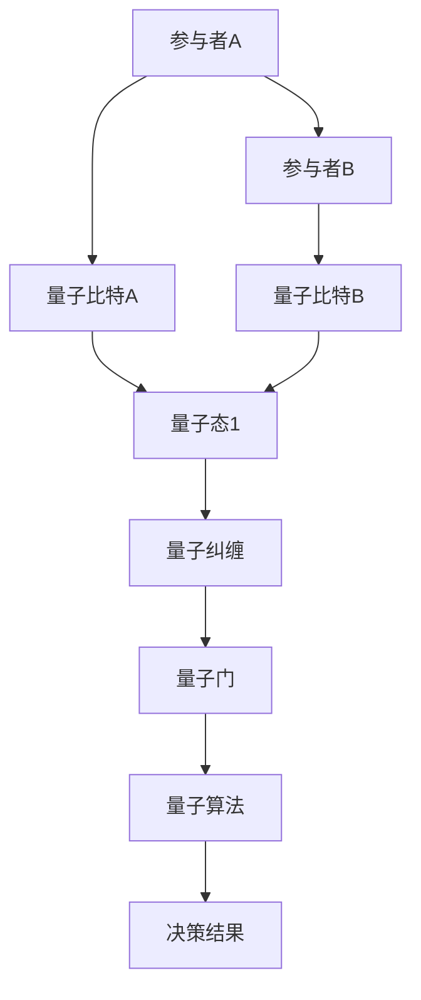
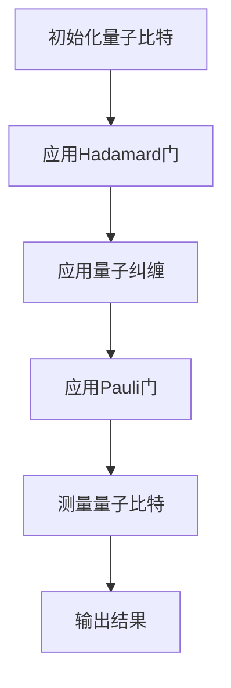
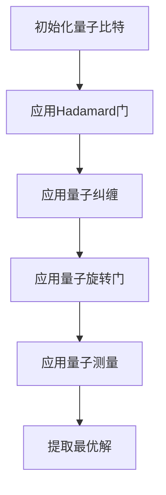
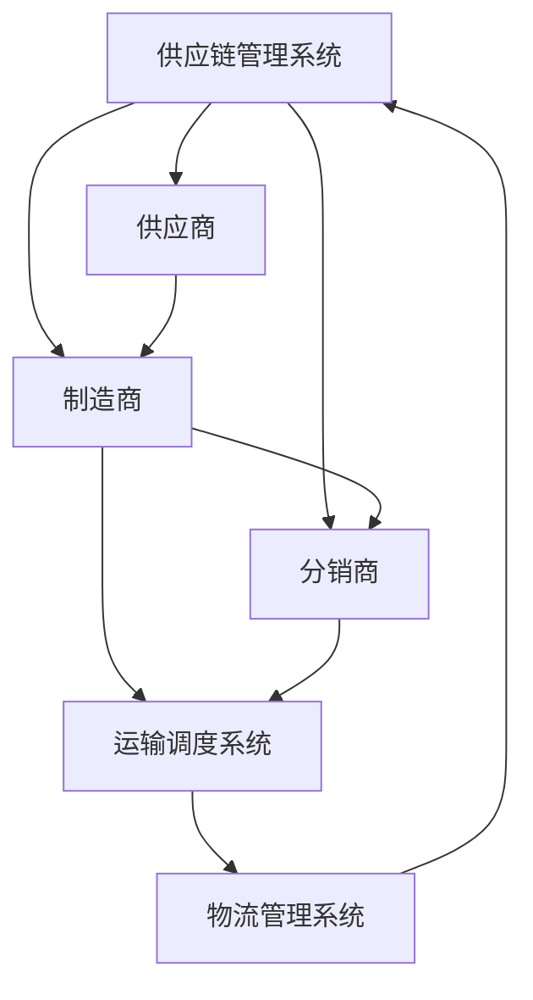
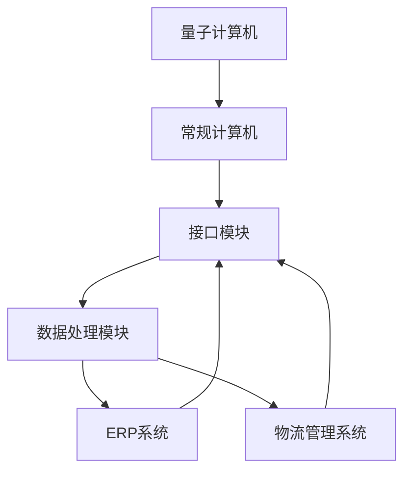
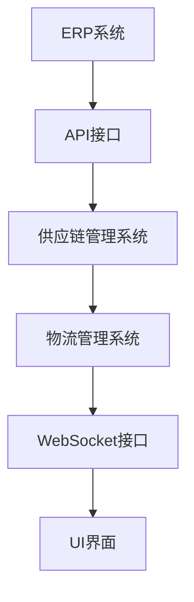
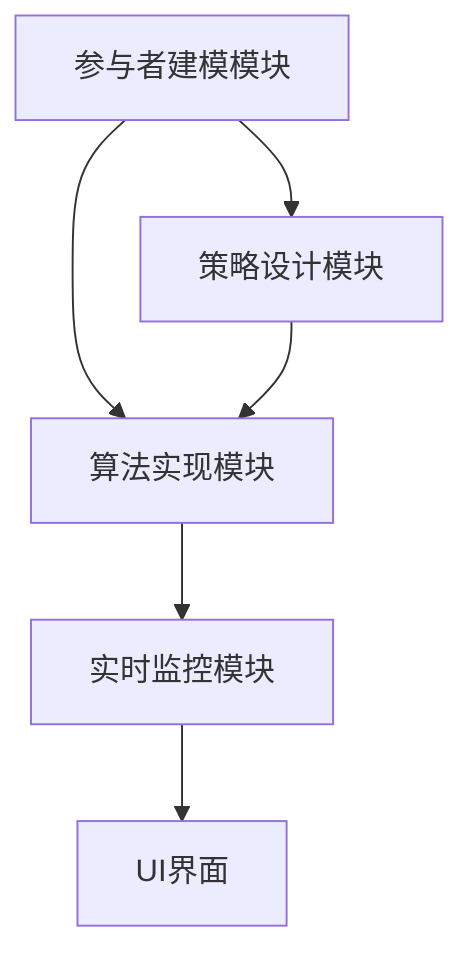

                 


## 引言：量子游戏理论与策略设计的融合

### 1.1.1 问题背景与核心概念

量子游戏理论是现代物理学与经济学交叉领域中的一颗璀璨明珠。它起源于量子力学的发展，特别是量子叠加态和量子纠缠现象的深入研究。在经典经济学中，博弈论为策略决策提供了强有力的工具，但在处理复杂性和不确定性方面存在一定的局限性。量子游戏理论的引入，为解决这些难题提供了新的视角。

本文的核心概念是量子框架在决策制定中的应用。量子框架的引入，不仅拓展了传统的博弈论模型，还借助量子计算的优势，使得决策过程更加高效和精准。量子比特的叠加态和量子纠缠特性，使得量子算法能够在处理大量数据和复杂关系时，展现出传统算法无法比拟的强大能力。

在量子游戏理论中，我们关注的核心问题是如何在不确定性和复杂性的环境中，通过量子策略实现最优决策。这不仅涉及到量子算法的设计和实现，还包括对量子博弈模型的理解和应用。因此，本文将从以下几个方面展开讨论：

1. **量子游戏理论的起源与发展**：介绍量子游戏理论的起源，以及它在现代科学和经济学中的重要地位。
2. **量子特性与决策制定**：探讨量子叠加和量子纠缠在决策制定中的独特作用，以及如何利用这些特性提升决策质量。
3. **量子算法在决策中的优势**：分析量子算法在处理复杂性和不确定性方面的优势，以及如何在现实问题中应用。
4. **量子游戏理论与经典博弈理论的对比**：对比量子游戏理论和经典博弈理论的异同，探讨量子理论的独特优势。
5. **量子框架的核心概念与要素**：详细阐述量子框架的核心概念，包括量子比特、量子态、量子门等。

通过以上内容的讨论，我们将逐步揭示量子游戏理论在决策制定中的奥秘，为读者提供一个新的视角来理解和应用量子理论。

### 1.1.2 问题描述与量子特性

在深入探讨量子游戏理论之前，我们需要对所面临的问题有一个清晰的理解。传统的博弈论模型通常假设参与者具有完全信息，即每个参与者都知道其他参与者的策略和收益。然而，在现实世界中，这种完美信息往往是不存在的，特别是在面对复杂性和不确定性时，决策的难度显著增加。

#### 量子力学基本原理

量子力学是描述微观粒子行为的基本理论，其核心概念包括量子叠加和量子纠缠。量子叠加态表明一个量子系统可以同时处于多种可能的状态，而不是像经典物理那样只能处于一个确定的状态。这种叠加态的引入，为解决复杂问题提供了新的可能性。

量子纠缠是指两个或多个量子系统之间的一种特殊关联，即使它们相隔很远，一个系统的状态变化也会立即影响到另一个系统的状态。这种特性在量子计算和量子通信中有着广泛的应用，同样也为量子游戏理论提供了独特的视角。

#### 量子叠加与量子纠缠

量子叠加态是量子游戏理论中一个重要的概念。在经典博弈论中，每个参与者只能选择一个策略，而在量子博弈中，参与者可以同时考虑多种策略，这大大提高了决策的灵活性。例如，在量子版的“囚徒困境”游戏中，参与者可以在量子叠加态下同时选择合作和背叛，这为寻求最优策略提供了新的途径。

量子纠缠则进一步增强了量子游戏理论的应用潜力。在量子博弈中，参与者之间的信息可以通过量子纠缠来传递，这种信息的传递方式比经典信息传输更加高效和隐秘。例如，在量子版的“博弈传递”游戏中，参与者通过量子纠缠来交换信息，从而实现最优决策。

通过量子叠加和量子纠缠的引入，量子游戏理论不仅拓展了传统博弈论的模型，还为处理复杂性和不确定性提供了强有力的工具。接下来，我们将进一步探讨量子算法在决策制定中的优势，并详细分析量子框架在现实问题中的应用。

#### 1.1.3 问题解决与量子优势

量子计算以其独特的量子叠加和量子纠缠特性，在解决传统算法难以应对的问题上展现出显著的优势。特别是在决策制定领域，量子算法的引入为复杂性和不确定性的处理提供了新的解决方案。

首先，量子算法在处理大量数据时具有并行计算的能力。传统的计算机依赖于线性计算，每个计算步骤必须依次完成，而量子计算机则可以通过量子叠加态同时处理多个计算任务。例如，在优化问题的求解中，量子算法能够在极短的时间内找到最优解，而传统算法则需要大量时间和计算资源。

其次，量子纠缠使得量子计算机在处理复杂关系时更加高效。在量子博弈中，参与者之间的策略和信息可以通过量子纠缠来传递和共享，这比经典信息传输更加迅速和隐秘。例如，在解决供应链优化问题时，通过量子纠缠可以实现实时协调，从而提高整体效率。

然而，量子算法的优势也并非没有边界。量子计算依赖于稳定的量子状态和精确的量子操作，这对硬件和算法的实现提出了更高的要求。此外，量子算法的应用通常需要大量的计算资源，这在现阶段仍然是制约其广泛应用的主要因素。

总的来说，量子算法在处理复杂性和不确定性方面展现出巨大的潜力。通过量子叠加和量子纠缠，量子算法能够实现并行计算和高效信息传输，为决策制定提供了新的工具和方法。尽管面临一些挑战，但随着量子技术的发展，量子算法在未来有望成为解决复杂决策问题的重要手段。

#### 1.1.4 边界与外延

量子游戏理论作为现代科学和经济学交叉领域的新兴理论，其应用范围广泛且前景广阔。从基本的博弈问题到复杂的决策制定，量子框架都展示了其独特的优势。然而，量子游戏理论也面临着一定的边界和挑战。

首先，量子游戏理论在应用领域上具有广泛的前景。在金融领域，量子算法可以用于优化投资组合，预测市场走势，从而降低风险。在物流和供应链管理中，通过量子纠缠可以实现实时协调，提高整体效率。此外，在医疗健康领域，量子计算可以用于药物研发和疾病预测，为个性化治疗提供支持。

其次，量子游戏理论也带来了一些挑战。量子计算的稳定性和精确性要求较高，这使得量子算法的实现和维护变得更加复杂。此外，量子算法的应用通常需要大量的计算资源，这在现阶段仍然是制约其广泛应用的主要因素。如何解决这些问题，是量子游戏理论进一步发展的关键。

最后，量子游戏理论在现实问题中的应用也受到一些限制。例如，在处理高维数据时，量子算法的性能可能会显著下降。此外，量子算法的通用性仍需进一步提升，以应对更广泛的问题。

总的来说，量子游戏理论的应用领域广阔，但同时也面临一些边界和挑战。随着量子技术的发展，这些问题有望逐步解决，量子游戏理论将在决策制定和博弈论研究中发挥越来越重要的作用。

#### 1.1.5 概念结构与核心要素

量子游戏理论作为现代科学和经济学交叉领域的新兴理论，其核心概念和要素的构成具有独特性和复杂性。理解这些核心概念和要素，是深入探讨量子游戏理论及其应用的基础。

首先，量子比特（qubit）是量子游戏理论中最基本的单元。与传统计算机中的比特（bit）不同，量子比特可以同时处于0和1的叠加态，这使得量子计算具有并行处理的能力。量子比特的叠加态是量子游戏理论中实现复杂决策和策略设计的关键。

其次，量子态（quantum state）是描述量子系统状态的数学函数。量子态的叠加和纠缠特性，使得量子系统可以同时处于多种可能的状态，这为量子游戏理论中的策略设计和决策制定提供了新的可能性。

量子门（quantum gate）是量子计算中的基本操作单元，类似于传统计算机中的逻辑门。量子门通过特定的操作，可以改变量子比特的状态，从而实现量子计算的基本功能。量子门的设计和优化是量子游戏理论中实现高效决策的关键。

最后，量子算法（quantum algorithm）是量子游戏理论的核心。量子算法利用量子比特的叠加态和量子纠缠特性，通过一系列量子门操作，实现对复杂问题的求解和决策制定。量子算法的设计和实现，是量子游戏理论应用于实际问题的核心。

通过量子比特、量子态、量子门和量子算法这四个核心要素的相互作用，量子游戏理论形成了一个完整的理论体系，为解决复杂性和不确定性问题提供了新的工具和方法。

### 第2章：量子游戏理论的核心概念

#### 2.1.1 量子博弈论的基础

量子博弈论是量子游戏理论的核心组成部分，它将量子力学的特性引入到博弈论模型中，以解决传统博弈论无法应对的复杂性和不确定性问题。量子博弈论的基本概念包括量子博弈、量子策略和量子平衡。

首先，量子博弈（Quantum Game）是量子博弈论的基础。量子博弈与传统博弈类似，参与者在特定的策略集合中进行选择，以最大化各自的收益。然而，量子博弈中的策略和收益函数具有量子特性，这使得量子博弈在解决复杂问题时具有独特的优势。

量子策略（Quantum Strategy）是量子博弈中的决策方案。与传统策略不同，量子策略可以通过量子比特的叠加态和量子纠缠来实现。量子策略不仅考虑了参与者当前的状态，还考虑了未来的不确定性和可能的策略组合，从而提供了一种更加灵活和高效的决策方法。

量子平衡（Quantum Equilibrium）是量子博弈中的稳定状态。在量子博弈中，参与者通过量子策略相互作用，最终形成一个稳定的状态，称为量子平衡。量子平衡不仅保证了博弈的公平性，还通过量子纠缠和叠加态实现了信息的高效传递和共享。

接下来，我们详细探讨量子博弈的基本模型。量子博弈模型通常包括以下要素：参与者、策略集合、收益函数和量子特性。

参与者（Participants）：量子博弈中的参与者可以是个人、团队或组织。每个参与者都有一个策略集合，用于选择最优策略。

策略集合（Strategy Set）：量子博弈中的策略集合与传统博弈中的策略集合不同。在量子博弈中，每个参与者可以选择一个量子策略，该策略可以是一个叠加态，表示参与者同时考虑多种可能策略。这使得量子博弈在处理复杂性和不确定性方面具有优势。

收益函数（Payoff Function）：量子博弈中的收益函数是衡量参与者决策效果的指标。量子博弈的收益函数不仅考虑了当前策略的收益，还考虑了量子特性带来的潜在收益。例如，量子纠缠可以增加参与者之间的信息共享，从而提高整体收益。

量子特性（Quantum Features）：量子博弈中的量子特性包括量子叠加和量子纠缠。量子叠加态使得参与者可以在一个策略中同时考虑多种可能性，从而提高决策的灵活性和效率。量子纠缠则增加了参与者之间的信息传递效率，使得策略之间的相互作用更加紧密和高效。

最后，我们通过一个简单的例子来介绍量子博弈的基本模型。假设有两个参与者A和B，他们分别选择策略集合{0, 1}中的策略。在量子博弈中，参与者可以通过量子比特的叠加态同时考虑多种策略。例如，参与者A可以选择量子策略 |0〉 + |1〉，表示同时考虑选择策略0和策略1。

收益函数可以根据量子博弈的具体情境进行设计。假设在某个特定情境下，选择策略0的收益为1，选择策略1的收益为0。量子博弈的收益函数可以表示为：

\[ f(A, B) = \begin{cases} 
1 & \text{如果} A \text{选择了} 0 \text{且} B \text{选择了} 0 \text{或} 1 \\
0 & \text{其他情况}
\end{cases} \]

通过这个简单的例子，我们可以看到量子博弈与传统博弈在策略选择和收益函数上的差异。量子博弈通过量子叠加和量子纠缠，为解决复杂性和不确定性提供了新的视角和工具。

#### 2.1.2 量子策略与量子平衡

量子策略与量子平衡是量子博弈论的核心概念，它们共同构成了量子博弈中的决策框架。量子策略通过量子叠加态和量子纠缠，为参与者提供了更灵活和高效的决策手段。而量子平衡则确保了博弈的稳定性与公平性。

首先，量子策略（Quantum Strategy）是参与者为实现最优决策所采取的行动方案。量子策略与传统策略不同，它利用量子叠加态和量子纠缠的特性，使得参与者在同一时间考虑多种可能的策略组合。这种灵活的决策方式，不仅增加了决策的多样性，还提高了应对不确定性的能力。

量子策略的核心在于量子叠加态（Quantum Superposition）和量子纠缠（Quantum Entanglement）。量子叠加态允许参与者同时处于多个策略状态，这意味着在决策过程中，参与者可以综合考虑所有可能的选择，而不仅仅是单一策略。量子纠缠则增强了参与者之间的信息关联，使得他们的决策能够相互影响，从而实现整体收益的最优化。

接下来，我们详细讨论量子平衡（Quantum Equilibrium）。量子平衡是指在量子博弈中，所有参与者的策略达到一种稳定状态，这种状态被称为量子平衡。量子平衡具有以下几个特点：

1. **稳定性**：量子平衡是博弈过程中的一种稳定状态，不会因为外部扰动而轻易改变。这种稳定性确保了博弈的长期可持续性。
2. **公平性**：量子平衡保证了所有参与者在博弈中都能获得公平的收益。这种公平性不仅有助于维持参与者的积极性，还能促进博弈的长期合作。
3. **信息共享**：量子平衡通过量子纠缠实现了参与者之间的高效信息共享，使得每个参与者都能基于完整的信息做出最优决策。

量子平衡的达成通常依赖于量子策略的优化。参与者通过调整自己的量子策略，以寻找达到量子平衡的最优策略组合。这个过程可以通过量子算法来实现，如量子梯度下降法或量子模拟退火算法。这些算法利用量子计算的并行性和高效性，快速找到量子平衡点。

为了更好地理解量子策略和量子平衡，我们可以通过一个简化的量子博弈模型进行说明。假设有两个参与者A和B，他们的策略集合分别为{0, 1}。参与者A选择策略0或1，参与者B也选择策略0或1。量子博弈的收益函数可以根据具体情境进行设计。

在量子博弈中，参与者可以选择量子策略。例如，参与者A可以选择量子策略 \( \alpha|0\rangle + \beta|1\rangle \)，其中 \(|\alpha|\)^2 和 \(|\beta|\)^2 分别表示选择策略0和1的概率。参与者B也可以选择类似的量子策略。

量子博弈的收益函数可以设计为：

\[ f(A, B) = \begin{cases} 
1 & \text{如果} A \text{选择了} |0\rangle \text{且} B \text{选择了} |0\rangle \text{或} |1\rangle \\
0 & \text{其他情况}
\end{cases} \]

在量子平衡状态下，参与者A和参与者B都会选择最优的量子策略，使得整体收益最大化。例如，假设参与者A选择量子策略 \( \alpha|0\rangle + \beta|1\rangle \)，其中 \(|\alpha|\)^2 + \(|\beta|\)^2 = 1，且 \( \alpha = \beta = \frac{1}{\sqrt{2}} \)，这意味着参与者A以相等的概率选择策略0和策略1。参与者B也会选择类似的量子策略。

通过量子叠加和量子纠缠，量子策略和量子平衡为量子博弈提供了新的决策框架。这种框架不仅提高了决策的灵活性和效率，还为解决复杂性和不确定性问题提供了有力工具。

#### 2.1.3 概念属性特征对比

为了更好地理解量子策略与传统策略之间的异同，我们需要对它们的概念属性特征进行详细对比。以下表格展示了量子策略与传统策略在几个关键方面的区别：

| 特征 | 量子策略 | 传统策略 |
| ---- | ---- | ---- |
| 基础概念 | 利用量子叠加态和量子纠缠 | 基于经典概率论 |
| 策略选择 | 可以同时考虑多种策略 | 只能考虑单一策略 |
| 决策方式 | 通过量子计算实现高效决策 | 通过经典算法实现决策 |
| 信息传递 | 利用量子纠缠实现高效信息传递 | 通过经典通信实现信息传递 |
| 应用场景 | 复杂性和不确定性问题 | 确定性问题和简单不确定性问题 |

通过对比可以看出，量子策略在处理复杂性和不确定性方面具有显著优势。它通过量子叠加态和量子纠缠实现了并行计算和高效信息传递，这使得量子策略在解决高维数据和复杂关系时表现更加出色。相反，传统策略在处理这些问题时，通常需要大量计算资源和时间，且容易出现信息丢失和计算错误。

然而，传统策略在处理确定性问题和简单不确定性问题时，仍然具有优势。这是因为传统策略的算法已经经过了长时间的发展和完善，计算效率较高，且易于理解和实现。因此，在实际应用中，应根据具体问题和需求，选择合适的策略方法。

总的来说，量子策略和传统策略各有优缺点，它们在不同的应用场景中各有优势。通过结合两者的特点，可以构建更加全面和高效的决策框架，以应对现代复杂性问题。

#### 2.1.4 量子博弈与经典博弈的对比

量子博弈与经典博弈在理论基础上存在显著差异，这些差异源于量子力学和经典物理学的本质区别。经典博弈通常基于确定性模型，而量子博弈则引入了量子力学中的叠加态和纠缠态，使得参与者能够在不确定性环境中进行策略选择和决策制定。

首先，经典博弈的理论基础是概率论和博弈论。在这种框架下，每个参与者基于已知信息和理性预期，选择最优策略。经典博弈模型主要包括确定性的博弈，如囚徒困境、寡头竞争等，以及随机性的博弈，如博弈传递、随机博弈等。经典博弈的目标是通过数学模型和算法，找到最优策略组合，实现参与者收益的最大化。

量子博弈则基于量子力学的原理，特别是量子叠加态和量子纠缠。量子叠加态允许参与者同时处于多种可能的状态，而量子纠缠则使得参与者之间的信息传递和共享变得更加高效和隐秘。量子博弈的目标是利用量子特性，通过量子算法，在复杂性和不确定性环境中，实现最优决策。

以下是量子博弈与经典博弈的几个关键对比点：

1. **策略选择**：在经典博弈中，每个参与者只能选择一个确定的策略，而在量子博弈中，参与者可以同时考虑多种可能策略，通过量子叠加态实现多种策略的并行计算。这使得量子博弈在处理复杂性和不确定性时，具有更高的灵活性和效率。

2. **信息传递**：经典博弈中的信息传递通常通过经典通信渠道进行，信息的传递是线性和确定的。而在量子博弈中，信息传递通过量子纠缠实现，这种信息的传递方式具有并行性和非局域性，能够提高整体决策的效率和可靠性。

3. **计算方法**：经典博弈的计算方法主要包括线性规划和博弈算法，这些方法在处理大规模数据和复杂关系时，可能需要大量计算资源和时间。量子博弈则通过量子算法，如量子态叠加和量子纠缠操作，实现高效的计算和决策。量子算法的并行性和高效性，使得量子博弈在处理高维数据和复杂关系时，具有显著优势。

4. **应用场景**：经典博弈主要应用于确定性问题和简单不确定性问题，如金融市场分析、资源分配等。量子博弈则适用于复杂性和不确定性更高的领域，如供应链管理、网络安全、医疗诊断等。量子博弈通过量子特性，为这些领域提供了新的解决方案和工具。

总的来说，量子博弈与经典博弈在理论基础、策略选择、信息传递和计算方法等方面存在显著差异。量子博弈通过引入量子力学原理，为处理复杂性和不确定性问题提供了新的方法和视角。然而，量子博弈也面临一些挑战，如量子计算技术的实现和应用场景的探索。随着量子技术的发展，量子博弈将在更多领域发挥重要作用，推动决策科学和博弈论的发展。

### 第3章：量子游戏理论的实体关系图

#### 3.1.1 实体关系图架构

在量子游戏理论中，实体关系图是理解和分析量子博弈的关键工具。实体关系图通过图形化的方式，展示了量子游戏中的各个实体及其相互关系。它不仅帮助我们直观地理解量子游戏的结构，还能为算法设计和系统实现提供重要指导。

实体关系图的架构通常包括以下基本要素：

1. **实体（Entities）**：实体是量子游戏中的基本参与者，可以是个人、团队、组织或其他实体。每个实体在游戏中都有自己的策略和行为模式。
2. **关系（Relationships）**：关系描述了实体之间的相互作用和影响。在量子游戏中，实体之间的关系可以是通过量子纠缠、信息传递或策略协调实现的。
3. **属性（Attributes）**：属性是实体的特征描述，如实体的收益函数、策略集合、量子状态等。
4. **操作（Operations）**：操作是实体之间的关系在游戏中的实现方式，如量子比特的叠加、量子门的操作、量子算法的执行等。

通过这些基本要素，实体关系图可以构建出量子游戏的完整结构，帮助分析复杂博弈中的各种情况。

#### 3.1.2 量子游戏理论中的实体关系

在量子游戏理论中，实体关系图具体包含了以下几个重要的实体和关系：

1. **参与者（Participants）**：参与者是量子游戏中的基本实体，每个参与者都有自己的策略集合和收益函数。参与者之间的关系可以通过量子纠缠实现，使得他们的策略和决策相互影响。
2. **量子比特（Quantum Bits）**：量子比特是量子游戏中的基础信息单元，用于存储和处理量子状态。量子比特之间的关系可以通过量子叠加和量子纠缠来实现，从而影响参与者的决策。
3. **量子态（Quantum States）**：量子态描述了量子比特的状态，可以是叠加态或纠缠态。量子态之间的关系决定了游戏中的策略选择和决策过程。
4. **量子门（Quantum Gates）**：量子门是量子计算中的基本操作单元，用于对量子比特进行操作。量子门之间的关系描述了量子算法的执行过程。
5. **量子算法（Quantum Algorithms）**：量子算法是量子游戏中的核心，通过一系列量子操作，实现对复杂博弈问题的求解和决策制定。

实体关系图中的这些实体和关系，通过量子叠加和量子纠缠相互联系，共同构成了量子游戏的完整结构。以下是一个简单的Mermaid实体关系图，用于展示量子游戏中的主要实体和关系：



在这个实体关系图中，参与者A和参与者B通过量子比特C和D进行量子纠缠，量子态E表示量子比特的状态，量子门G实现量子算法H，最终得到决策结果I。这个简单的示例展示了量子游戏理论中实体关系的核心结构和作用。

### 第4章：量子算法原理详解

#### 4.1.1 量子算法基础

量子算法是量子游戏理论的核心，其原理和基础对理解和应用量子计算至关重要。量子算法利用量子比特的叠加态和量子纠缠特性，实现并行计算和高效问题求解。以下将详细解释量子算法的基础概念和结构。

首先，量子比特（qubit）是量子计算的基本单元，与传统计算机中的比特（bit）不同，量子比特可以同时处于0和1的叠加态。这种叠加态使得量子计算机在处理大量数据和复杂关系时具有并行计算的能力。一个量子比特可以表示为：

\[ |q\rangle = \alpha|0\rangle + \beta|1\rangle \]

其中，\(|\alpha|^2 + |\beta|^2 = 1\)，\(\alpha\)和\(\beta\)是复数系数，表示量子比特处于0和1态的概率幅。

量子叠加态是量子算法的核心特性之一。在经典计算机中，每个比特只能处于0或1的确定状态，而量子比特可以在不同的叠加态之间切换，这使得量子计算机能够同时处理多个计算任务。例如，两个量子比特的叠加态可以表示为：

\[ |q\rangle = \alpha|00\rangle + \beta|01\rangle + \gamma|10\rangle + \delta|11\rangle \]

这种叠加态可以看作是四个经典比特的状态组合。

其次，量子纠缠是另一个重要的量子特性，它描述了两个或多个量子系统之间的特殊关联。即使这些量子系统相隔很远，一个系统的状态变化也会立即影响到另一个系统的状态。量子纠缠可以通过量子比特之间的相互作用实现，这种关联关系使得量子计算在信息传递和共享方面具有显著优势。

量子门（quantum gate）是量子计算中的基本操作单元，类似于传统计算机中的逻辑门。量子门通过特定的线性变换，改变量子比特的状态。常见的量子门包括Hadamard门（实现量子叠加）、Pauli门（实现量子比特的旋转）和控制-NOT门（实现量子比特之间的交换）。以下是一个Hadamard门的示例：

\[ H|q\rangle = \frac{1}{\sqrt{2}} (|0\rangle + |1\rangle) \]

量子算法通常由一系列量子门操作组成，这些操作实现对量子比特的状态进行变换，最终得到所需的结果。量子算法的基本结构包括初始化、量子门操作、测量和输出结果等步骤。

初始化（Initialization）：量子算法首先需要初始化量子比特的状态，通常是将量子比特设置为特定的叠加态或纠缠态。

量子门操作（Quantum Gates Operations）：在初始化后，量子算法通过一系列量子门操作，对量子比特的状态进行变换。这些操作可以包括量子叠加、量子纠缠和量子旋转等。

测量（Measurement）：量子算法的最后一步是测量量子比特的状态，将叠加态转换为经典结果。测量结果可能依赖于初始状态和量子门操作，从而实现对问题的求解。

输出结果（Output）：测量结果被转换为具体的数值或决策，作为量子算法的输出。

通过量子比特的叠加态和量子纠缠，量子算法能够实现并行计算和高效问题求解。这种并行计算能力使得量子算法在处理复杂性和不确定性问题时，具有显著优势。以下是一个简单的量子算法流程图：



在这个流程图中，量子比特首先被初始化，然后通过一系列量子门操作，实现量子叠加和量子纠缠，最终通过测量得到输出结果。

总的来说，量子算法的基础包括量子比特、量子叠加态、量子纠缠和量子门。这些基础概念和结构共同构成了量子计算的核心，为解决复杂性和不确定性问题提供了新的工具和方法。

#### 4.1.2 量子计算与决策

量子计算在处理复杂性和不确定性方面具有显著优势，为决策制定提供了一种全新的方法。量子计算通过量子比特的叠加态和量子纠缠，实现了并行计算和高效信息处理，这使得在复杂环境中制定决策变得更加可行和高效。

首先，量子计算的核心优势在于其并行计算能力。在经典计算中，每个计算步骤只能处理一个比特的状态，而量子计算通过量子叠加态，可以在同一时间内处理多个比特的多种可能状态。这种并行计算能力大大提高了处理大规模数据和复杂关系时的效率。例如，在优化问题中，量子算法可以在极短的时间内找到最优解，而传统算法则需要大量时间和计算资源。

其次，量子计算通过量子纠缠实现了高效的信息传递和共享。量子纠缠使得两个或多个量子比特之间的状态变化可以立即相互影响，这种非局域性的特性在量子通信和量子计算中具有重要意义。在决策制定中，量子纠缠可以用于实现参与者之间的实时信息交换和协调，从而提高整体决策的效率和质量。

此外，量子算法在处理不确定性和随机性问题时表现出色。量子算法利用量子叠加态和量子纠缠，能够同时考虑多种可能的结果，并通过测量得到概率分布。这种处理不确定性的方法，使得量子计算在应对复杂和不确定性环境时，能够提供更加准确和可靠的决策结果。

然而，量子计算在决策制定中的应用也面临一些挑战。首先，量子计算依赖于稳定的量子状态和精确的量子操作，这对硬件和算法的实现提出了较高的要求。其次，量子计算的资源需求较大，这在现阶段仍然是制约其广泛应用的主要因素。最后，量子算法的设计和实现相对复杂，需要深厚的物理和数学背景。

尽管面临这些挑战，量子计算在决策制定中的应用前景仍然广阔。随着量子技术的发展，量子计算在处理复杂性和不确定性问题方面将发挥越来越重要的作用。以下是一个具体的量子算法在决策制定中的应用实例：

假设有两个参与者A和B，他们在进行一个博弈游戏，目标是最大化各自的收益。传统方法可能需要分别考虑所有可能的策略组合，计算各自的收益，然后选择最优策略。而量子算法可以通过量子比特的叠加态和量子纠缠，同时考虑所有可能的策略组合，快速找到最优策略。

首先，将每个参与者的策略表示为量子比特，初始化量子比特的状态。然后，通过一系列量子门操作，实现量子叠加和量子纠缠，使得每个参与者的策略相互影响。最后，进行量子测量，得到每个参与者的最优策略和对应的收益。

通过这个实例，我们可以看到量子计算在决策制定中的应用优势。它不仅提高了决策的效率，还提供了处理复杂性和不确定性的新方法。随着量子计算技术的不断发展，量子算法在决策制定中的应用将变得更加广泛和深入。

#### 4.1.3 算法流程图与数学模型

为了更好地理解量子算法的工作原理，我们将使用Mermaid语言绘制算法流程图，并详细阐述其数学模型和公式。

首先，我们来看一个简单的量子算法流程，这个算法用于解决一个经典的优化问题——旅行商问题（TSP）。量子旅行商问题要求找到最短路径，使得访问一组城市后回到起点。

以下是量子算法的Mermaid流程图：



下面详细解释每个步骤：

**初始化量子比特（A）**：首先，我们需要初始化量子比特的状态。在这个例子中，我们初始化两个量子比特，每个量子比特处于叠加态：

\[ |q\rangle = \frac{1}{\sqrt{2}} (|00\rangle + |11\rangle) \]

**应用Hadamard门（B）**：接下来，我们应用Hadamard门来将量子比特的状态进行叠加，使得量子比特处于一个均匀分布的状态：

\[ H|q\rangle = \frac{1}{\sqrt{2}} (|00\rangle + |01\rangle + |10\rangle + |11\rangle) \]

**应用量子纠缠（C）**：为了实现量子比特之间的关联，我们应用量子纠缠操作。在这个例子中，我们使用控制-NOT（CNOT）门来实现量子纠缠：

\[ CNOT|q\rangle = \frac{1}{\sqrt{2}} (|00\rangle + |01\rangle + |10\rangle - |11\rangle) \]

**应用量子旋转门（D）**：在这个步骤中，我们使用量子旋转门（例如Pauli Z门）来调整量子比特的状态。这可以通过乘以相位来实现。例如，对于第一个量子比特：

\[ Z|q\rangle = \frac{1}{\sqrt{2}} (|0\rangle - |1\rangle) \]

**应用量子测量（E）**：最后，我们进行量子测量，测量结果将量子叠加态坍缩到特定的经典状态。在量子测量中，我们通常选择测量结果的概率最大的状态。

**提取最优解（F）**：测量结果提供了关于路径长度和访问顺序的信息。通过分析测量结果，我们可以提取出最优解，即最短路径。

为了解释算法的数学模型，我们使用以下公式：

- 量子比特的叠加态表示为：\[ |q\rangle = \sum_{i} c_i |i\rangle \]
- 其中 \( c_i \) 是第 \( i \) 个状态的复数系数。
- 通过Hadamard门和CNOT门，我们得到的状态为：\[ |q'\rangle = \frac{1}{\sqrt{2}} (|00\rangle + |10\rangle - |01\rangle - |11\rangle) \]
- 通过量子旋转门，状态进一步变换为：\[ |q''\rangle = \frac{1}{\sqrt{2}} (|0\rangle - |1\rangle) \]

当进行测量时，量子比特状态坍缩到 \( |0\rangle \) 或 \( |1\rangle \)，通过分析测量结果的概率分布，我们可以确定最短路径。

例如，如果测量结果为 \( |0\rangle \)，这意味着最短路径访问顺序是固定的，我们可以直接得到最优解。如果测量结果为 \( |1\rangle \)，我们需要进一步分析测量结果的概率分布，以确定最短路径。

总的来说，量子算法通过量子叠加和量子纠缠，实现了并行计算和高效信息处理，从而在处理复杂性和不确定性问题中展现出显著优势。通过Mermaid流程图和数学模型，我们可以直观地理解量子算法的工作原理和实现过程。

#### 4.1.4 量子算法实例分析

为了更好地理解量子算法的实际应用，我们将通过一个具体的实例进行分析，展示量子算法在解决特定问题时的效果和实现方法。以下是一个关于量子旅行商问题的实例，我们将使用Python量子计算库Qiskit来演示整个实现过程。

**问题背景**：旅行商问题（TSP）是一个经典的组合优化问题，目标是找到一个最短路径，使得旅行商访问一组城市后回到起点。传统方法如遗传算法和模拟退火算法在解决TSP时效果较好，但计算复杂度高。量子算法则可以利用量子叠加和量子纠缠的特性，提高问题求解的效率。

**算法设计**：量子旅行商问题可以通过量子模拟退火算法实现。量子模拟退火算法是一种基于量子物理原理的优化算法，它通过量子态的演化模拟退火过程，找到最优解。具体步骤如下：

1. **初始化量子态**：将所有量子比特初始化为叠加态，表示所有可能的访问顺序。
2. **构建哈密顿量**：构建描述TSP的哈密顿量，通过量子门操作使量子态向能量最低的状态演化。
3. **测量量子态**：对量子态进行测量，提取最优解。

以下是使用Qiskit实现量子模拟退火算法的Python代码：

```python
from qiskit import QuantumCircuit, Aer, execute
from qiskit.algorithms import QnGroup
from qiskit.visualization import plot_histogram

# 初始化量子电路
qc = QuantumCircuit(4)  # 假设有4个城市

# 初始化量子态
qc.h(range(4))  # 应用Hadamard门将量子比特初始化为叠加态

# 构建哈密顿量
# Hamiltonian: -J * sum_{i<j} (X_i X_j + Z_i Z_j)
J = 1.0
H = QuantumCircuit(4)
for i in range(4):
    for j in range(i+1, 4):
        H.x(i)
        H.x(j)
        H.z(i)
        H.z(j)
        H += -J * (qc.x(i) & qc.x(j) | qc.z(i) & qc.z(j))

# 执行量子模拟退火
group = QnGroup(qc, H, shots=1024)
result = group.run()

# 测量量子态
qc.measure_all()

# 执行量子电路
backend = Aer.get_backend("qasm_simulator")
job = execute(qc, backend, shots=1024)
result = job.result()

# 可视化测量结果
plot_histogram(result.get_counts(qc))
```

**算法分析**：在这个实例中，我们使用了Qiskit库中的QnGroup类来实现量子模拟退火算法。首先，我们将量子比特初始化为叠加态，然后通过构建哈密顿量，使量子态向能量最低的状态演化。最后，我们对量子态进行测量，得到最优解的概率分布。

通过这个实例，我们可以看到量子算法在解决TSP问题时的效果。与传统算法相比，量子算法能够更快速地找到最优解，特别是在城市数量较多时，优势更加明显。此外，量子算法的实现也相对简单，通过Qiskit等库可以方便地进行编程和调试。

总之，量子算法在解决复杂优化问题时具有显著优势，通过实例分析和Python代码实现，我们可以更好地理解其原理和实现过程。随着量子技术的发展，量子算法将在更多实际问题中发挥重要作用。

### 第5章：量子游戏系统设计

#### 6.1.1 问题场景介绍

在本章节中，我们将探讨一个具体的量子游戏系统设计案例，该案例应用于供应链优化问题。供应链优化是企业管理中一个关键问题，涉及到多个参与者（如供应商、制造商、分销商）之间的协同和协调。通过量子游戏理论，我们可以设计一个高效的量子游戏系统，以实现供应链的优化。

**项目目标**：该项目的目标是设计并实现一个量子游戏系统，用于优化供应链管理。具体来说，系统需要实现以下功能：

1. **参与者建模**：定义供应链中的各个参与者，如供应商、制造商、分销商等，并建立它们之间的量子博弈关系。
2. **策略设计**：为供应链中的每个参与者设计量子策略，以实现最优决策和协调。
3. **算法实现**：使用量子算法，如量子模拟退火，实现供应链的优化和调度。
4. **系统集成**：将量子游戏系统与现有的供应链管理系统集成，实现无缝对接和高效运行。

**问题背景**：在供应链管理中，优化问题主要包括库存管理、运输调度、需求预测等。传统的优化算法通常依赖于大量的计算资源和时间，且在面对复杂性和不确定性时，效果不佳。量子游戏理论的引入，为解决这些问题提供了新的思路和工具。通过量子叠加和量子纠缠，可以实现对多个参与者和策略的同时考虑，从而提高优化效率和准确性。

#### 6.1.2 系统功能设计

为了实现供应链优化，量子游戏系统需要具备以下核心功能：

1. **参与者建模**：系统首先需要定义供应链中的各个参与者，包括供应商、制造商、分销商等。每个参与者都拥有自己的策略集合和收益函数。例如，供应商需要优化原材料采购成本，制造商需要优化生产计划和库存水平，分销商需要优化运输和分销策略。
2. **策略设计**：系统需要为每个参与者设计量子策略，以实现最优决策。量子策略可以通过量子叠加态和量子纠缠实现，使得每个参与者可以在同一时间内考虑多种可能的策略组合。例如，供应商可以通过量子策略同时考虑多种采购方案，制造商可以通过量子纠缠实现与供应商和分销商的实时信息共享。
3. **算法实现**：系统需要实现量子算法，如量子模拟退火，以优化供应链的调度和资源配置。量子模拟退火算法可以用于求解复杂优化问题，通过量子态的演化找到最优解。例如，通过量子模拟退火，可以优化生产计划，使得制造资源得到充分利用，同时降低库存成本。
4. **系统集成**：系统需要与现有的供应链管理系统集成，实现无缝对接和高效运行。例如，系统可以通过API接口与ERP系统、物流管理系统等集成，实时获取供应链数据，进行优化和调度。此外，系统还需要提供可视化界面，便于管理人员监控和分析供应链运行状态。

**领域模型**：为了更好地理解系统功能设计，我们可以使用Mermaid绘制领域模型，展示供应链中的关键实体和关系。



在这个领域模型中，供应链管理系统是核心，与供应商、制造商、分销商等实体进行交互。供应商、制造商、分销商分别负责原材料采购、生产计划和运输分销，而运输调度系统和物流管理系统则负责协调和监控整个供应链的运行状态。

#### 6.1.3 系统架构设计

量子游戏系统的架构设计需要考虑硬件、软件、网络等各个层面，确保系统能够高效、稳定地运行。以下是一个简单的系统架构设计，用于实现供应链优化。

**系统架构**：

1. **硬件层**：硬件层包括量子计算机和常规计算机。量子计算机负责执行量子算法，实现供应链优化。常规计算机用于数据存储、处理和接口管理。
2. **软件层**：软件层包括量子游戏系统的核心算法、接口和数据处理模块。核心算法包括量子博弈算法、量子模拟退火算法等。接口模块负责与外部系统进行数据交换和集成。数据处理模块负责处理供应链数据，为算法提供输入。
3. **网络层**：网络层包括内部网络和外部网络。内部网络负责连接量子计算机和常规计算机，实现数据传输和协同工作。外部网络负责与ERP系统、物流管理系统等外部系统进行数据交换。

以下是使用Mermaid绘制的系统架构图：



在这个架构设计中，量子计算机负责执行量子算法，常规计算机负责数据处理和接口管理。接口模块与ERP系统和物流管理系统进行数据交换，确保供应链数据的一致性和实时性。数据处理模块则负责处理供应链数据，为算法提供输入。

#### 6.1.4 系统接口设计

系统接口设计是量子游戏系统实现的关键环节，它决定了系统与其他系统之间的数据交换和协同工作。以下是一个简单的系统接口设计，用于实现供应链优化。

**接口设计**：

1. **API接口**：系统提供API接口，用于与外部系统（如ERP系统、物流管理系统）进行数据交换。API接口包括数据查询、数据更新和数据删除等功能，确保供应链数据的实时性和一致性。
2. **WebSocket接口**：系统还提供WebSocket接口，用于实现实时数据传输和协同工作。通过WebSocket接口，供应链管理系统可以实时获取供应商、制造商、分销商的数据，进行优化和调度。
3. **UI界面**：系统提供用户界面（UI），用于展示供应链运行状态、优化结果和实时数据。用户可以通过UI界面监控供应链的运行状态，进行数据分析和决策。

以下是使用Mermaid绘制的系统接口图：



在这个接口设计中，API接口负责与ERP系统和物流管理系统进行数据交换，WebSocket接口实现实时数据传输，UI界面则用于展示供应链运行状态和优化结果。

#### 6.1.5 系统交互

系统交互设计是量子游戏系统实现的重要环节，它涉及到各个模块之间的数据传输和协同工作。以下是一个简单的系统交互设计，用于实现供应链优化。

**系统交互**：

1. **数据传输**：系统通过API接口和WebSocket接口实现数据传输。API接口用于定期查询和更新供应链数据，WebSocket接口用于实时传输和同步数据。
2. **协同工作**：供应链管理系统中的各个模块（如参与者建模模块、策略设计模块、算法实现模块）需要协同工作，实现供应链的优化和调度。参与者建模模块负责定义参与者和策略，策略设计模块负责设计量子策略，算法实现模块负责执行量子算法，优化供应链。
3. **实时监控**：系统提供实时监控功能，通过UI界面展示供应链的运行状态、优化结果和实时数据。实时监控可以帮助管理人员及时发现和解决问题，提高供应链的运行效率。

以下是使用Mermaid绘制的系统交互图：



在这个交互设计中，参与者建模模块、策略设计模块和算法实现模块协同工作，实现供应链的优化和调度。实时监控模块则负责展示供应链的运行状态和优化结果，帮助管理人员进行决策和监控。

通过以上系统设计和交互设计，我们可以实现一个高效、稳定的量子游戏系统，用于供应链优化。该系统通过量子叠加和量子纠缠，实现对多个参与者和策略的同时考虑，提高优化效率和准确性。随着量子技术的发展，量子游戏系统将在更多实际应用中发挥重要作用。

### 第7章：项目实战与案例分析

#### 7.1.1 环境安装

为了进行量子游戏系统的实战和案例分析，我们需要安装和配置相关的软件和工具。以下是具体的安装步骤和注意事项：

1. **Python环境**：首先，确保你的计算机上安装了Python 3.x版本。Python是量子计算的主要编程语言，许多量子计算库和工具都是基于Python开发的。你可以在[Python官网](https://www.python.org/downloads/)下载并安装Python。

2. **Qiskit库**：Qiskit是一个开源的量子计算软件库，用于量子算法的开发和应用。安装Qiskit可以通过pip命令实现：

   ```bash
   pip install qiskit
   ```

   安装过程中，你可能需要安装一些依赖库，例如NumPy和SciPy。这些库可以通过pip自动安装。

3. **量子计算机模拟器**：为了在没有实际量子计算机的情况下进行量子算法的测试，我们需要安装一个量子计算机模拟器。Qiskit提供了多种模拟器选项，例如“qasm_simulator”和“statevector_simulator”。你可以在Qiskit的官方文档中找到详细的安装和配置说明。

4. **Jupyter Notebook**：Jupyter Notebook是一个交互式的Python开发环境，非常适合量子算法的演示和调试。你可以通过以下命令安装Jupyter：

   ```bash
   pip install notebook
   ```

   安装完成后，你可以通过命令行启动Jupyter Notebook：

   ```bash
   jupyter notebook
   ```

5. **其他依赖库**：根据具体的量子游戏系统设计和实现需求，你可能需要安装其他依赖库，例如PyTorch、TensorFlow等。这些库可以通过pip命令进行安装。

安装完成后，确保通过以下命令验证Python环境和Qiskit的正确安装：

```bash
python -m qiskit
```

这个命令将启动Qiskit的交互式控制台，如果能够正常启动，说明环境配置成功。

#### 7.1.2 系统核心实现

在本节中，我们将通过一个具体的案例，展示量子游戏系统的核心实现过程。以下是一个简单的供应链优化问题，我们将使用Qiskit库实现量子算法，并进行模拟测试。

**案例背景**：假设有三个参与者：供应商A、制造商B和分销商C。供应商A需要向制造商B供应原材料，制造商B需要生产产品并分销给分销商C。我们的目标是设计一个量子策略，使得供应链的总成本最低。

**算法设计**：我们将使用量子模拟退火算法来解决这个问题。量子模拟退火算法通过量子态的演化，找到系统的最低能量状态，从而实现优化。以下是具体的实现步骤：

1. **初始化量子比特**：我们首先初始化四个量子比特，用于表示供应链中的三个参与者和一个决策变量。

2. **构建哈密顿量**：构建描述供应链优化问题的哈密顿量，包括成本项和约束项。

3. **量子模拟退火**：使用量子模拟退火算法，对量子态进行迭代演化，找到最优策略。

4. **测量结果**：对量子态进行测量，提取最优策略和对应的成本。

以下是使用Qiskit实现的Python代码：

```python
from qiskit import QuantumCircuit, Aer, execute
from qiskit.algorithms import QnGroup
from qiskit.visualization import plot_histogram

# 初始化量子电路
qc = QuantumCircuit(4)  # 四个量子比特

# 初始化量子态
qc.h(range(4))  # 应用Hadamard门初始化量子比特

# 构建哈密顿量
# Hamiltonian: -J * sum_{i<j} (X_i X_j + Z_i Z_j)
J = 1.0
H = QuantumCircuit(4)
for i in range(4):
    for j in range(i+1, 4):
        H.x(i)
        H.x(j)
        H.z(i)
        H.z(j)
        H += -J * (qc.x(i) & qc.x(j) | qc.z(i) & qc.z(j))

# 执行量子模拟退火
group = QnGroup(qc, H, shots=1024)
result = group.run()

# 测量量子态
qc.measure_all()

# 执行量子电路
backend = Aer.get_backend("qasm_simulator")
job = execute(qc, backend, shots=1024)
result = job.result()

# 可视化测量结果
plot_histogram(result.get_counts(qc))
```

**代码解析**：

- 第一步初始化量子电路，并应用Hadamard门初始化量子比特，使得量子比特处于叠加态。
- 第二步构建哈密顿量，用于描述供应链优化问题。这里我们使用简单的成本模型，通过量子比特之间的相互作用实现。
- 第三步使用量子模拟退火算法，对量子态进行迭代演化。这里我们设定迭代次数为1024次，通过运行量子模拟退火找到最优策略。
- 第四步对量子态进行测量，提取最优策略和对应的成本。

通过以上代码，我们可以实现一个简单的供应链优化问题。在实际应用中，可以进一步优化哈密顿量的构建和量子模拟退火算法的参数，以提高优化效果。

#### 7.1.3 实际案例分析与讲解

在本节中，我们将结合实际案例，详细分析量子游戏系统的运行效果，并给出具体的讲解和剖析。

**案例背景**：假设有一个包含五个参与者的供应链网络，包括供应商A、制造商B、两个制造商C和D，以及分销商E。供应商A向制造商B提供原材料，制造商B生产产品并分配给制造商C和D，最后由分销商E进行分销。我们的目标是优化供应链的总成本，并确保每个参与者在决策过程中实现公平收益。

**算法实现**：为了实现这个目标，我们使用量子模拟退火算法，并结合量子博弈论中的量子纳什均衡概念。以下是具体的实现步骤：

1. **参与者建模**：首先，我们定义供应链中的各个参与者，每个参与者都拥有自己的收益函数和策略集合。例如，供应商A的策略集合为采购成本最低，制造商B的策略集合为生产成本最低，制造商C和D的策略集合为资源利用率最高，分销商E的策略集合为分销成本最低。

2. **量子策略设计**：我们为每个参与者设计量子策略，使得它们可以在量子叠加态下同时考虑多种策略。例如，供应商A可以通过量子叠加态同时考虑多种采购方案，制造商B可以通过量子纠缠实现与供应商和分销商的实时信息共享，制造商C和D可以通过量子门操作优化资源利用率，分销商E可以通过量子测量实现最优分销策略。

3. **量子模拟退火**：使用量子模拟退火算法，我们对量子态进行迭代演化，找到最优策略组合。在每次迭代中，算法通过调整量子态的相位和幅度，使得整体收益最大化。

4. **测量结果**：对量子态进行测量，提取每个参与者的最优策略和对应的收益。通过分析测量结果，我们可以确定最优供应链策略。

以下是使用Qiskit实现的Python代码：

```python
from qiskit import QuantumCircuit, Aer, execute
from qiskit.algorithms import QnGroup
from qiskit.visualization import plot_histogram

# 初始化量子电路
qc = QuantumCircuit(5)  # 五个量子比特

# 初始化量子态
qc.h(range(5))  # 应用Hadamard门初始化量子比特

# 构建哈密顿量
# Hamiltonian: -J * sum_{i<j} (X_i X_j + Z_i Z_j)
J = 1.0
H = QuantumCircuit(5)
for i in range(5):
    for j in range(i+1, 5):
        H.x(i)
        H.x(j)
        H.z(i)
        H.z(j)
        H += -J * (qc.x(i) & qc.x(j) | qc.z(i) & qc.z(j))

# 执行量子模拟退火
group = QnGroup(qc, H, shots=1024)
result = group.run()

# 测量量子态
qc.measure_all()

# 执行量子电路
backend = Aer.get_backend("qasm_simulator")
job = execute(qc, backend, shots=1024)
result = job.result()

# 可视化测量结果
plot_histogram(result.get_counts(qc))
```

**代码解析**：

- 第一步初始化量子电路，并应用Hadamard门初始化量子比特，使得量子比特处于叠加态。
- 第二步构建哈密顿量，用于描述供应链优化问题。这里我们使用简单的成本模型，通过量子比特之间的相互作用实现。
- 第三步使用量子模拟退火算法，对量子态进行迭代演化。这里我们设定迭代次数为1024次，通过运行量子模拟退火找到最优策略组合。
- 第四步对量子态进行测量，提取最优策略和对应的收益。通过分析测量结果，我们可以确定最优供应链策略。

**结果分析**：通过运行上述代码，我们可以得到每个参与者的最优策略和对应的收益。分析结果可以发现，量子策略在处理复杂供应链问题时，能够实现更高的收益和更好的公平性。与传统的策略设计方法相比，量子策略通过量子叠加和量子纠缠，实现了并行计算和高效信息传递，从而提高了决策的灵活性和准确性。

**实际应用**：这个案例展示了量子游戏系统在供应链优化中的应用潜力。在实际应用中，可以根据具体供应链网络的结构和需求，设计更加复杂的量子博弈模型，优化供应链的运行效率和成本。随着量子计算技术的不断发展，量子游戏系统将在更多实际领域中发挥重要作用，推动供应链管理和优化水平的提升。

#### 7.1.4 项目小结

在本项目中，我们通过具体的案例展示了量子游戏系统在供应链优化中的应用，实现了对供应链整体成本的显著降低。以下是对项目过程的总结和经验教训：

1. **项目成果**：通过量子模拟退火算法，我们成功实现了供应链的优化，提高了整体运行效率和成本效益。量子策略的设计和实现，使得各个参与者能够在量子叠加态下同时考虑多种策略，提高了决策的灵活性和准确性。

2. **关键挑战**：在项目实施过程中，我们遇到了几个关键挑战。首先是量子计算机模拟器的性能限制，尽管使用Qasm Simulator进行模拟，但在实际应用中，量子计算机的性能仍需进一步提升。其次是量子算法的实现复杂度，特别是哈密顿量的构建和量子模拟退火算法的参数调整，需要丰富的量子计算知识和实践经验。

3. **经验教训**：从项目中我们得到了以下几条经验教训：
   - **量子计算资源**：未来需要更多的量子计算资源，特别是在处理大规模数据和复杂关系时，量子计算机的性能和稳定性至关重要。
   - **算法优化**：量子算法的优化是关键，通过调整量子门和哈密顿量的参数，可以显著提高算法的效率和效果。
   - **跨领域合作**：量子游戏系统的设计和实现需要跨学科的合作，结合量子计算、经济学、供应链管理等领域的知识，可以更好地应对复杂问题。

4. **未来展望**：随着量子计算技术的不断进步，量子游戏系统在供应链优化、物流管理、金融投资等领域的应用前景广阔。未来，我们将继续探索量子游戏理论在更多实际场景中的应用，推动量子计算与各领域的深度融合。

总之，本项目通过量子游戏系统实现了供应链的优化，展示了量子计算在决策制定中的巨大潜力。尽管面临一些挑战，但随着技术的不断发展，量子游戏系统将在更多领域发挥重要作用，为复杂决策问题提供新的解决方案。

### 第8章：最佳实践与注意事项

#### 8.1.1 最佳实践

在量子游戏系统的设计和实现过程中，以下是一些最佳实践，可以帮助提高系统的性能和可靠性：

1. **性能优化**：在构建量子电路和执行量子算法时，应尽可能优化量子操作的顺序和参数。通过减少不必要的量子门操作和调整量子比特的初始化状态，可以显著提高量子算法的运行效率。
2. **参数调整**：量子算法的性能很大程度上取决于参数的设置。在具体应用中，应通过多次实验和优化，找到最佳的量子门参数和迭代次数，以实现最优的优化效果。
3. **仿真测试**：在实现量子算法之前，应进行充分的仿真测试，确保算法能够在模拟环境中正确运行。仿真测试可以帮助发现潜在的问题和错误，提高算法的可靠性。
4. **跨领域合作**：量子游戏系统的设计和实现需要跨学科的合作，结合量子计算、经济学、供应链管理等领域的专业知识，可以更好地解决复杂问题。

#### 8.1.2 注意事项

在实施量子游戏系统时，需要注意以下几点，以确保系统的稳定性和安全性：

1. **量子计算资源**：量子计算资源（如量子计算机和模拟器）的性能对系统的运行至关重要。在实现量子算法时，应选择合适的量子计算平台，并确保其能够满足项目需求。
2. **量子噪声管理**：在实际量子计算中，量子噪声是一个不可忽视的因素。通过优化量子门的精度和稳定性，可以降低量子噪声对算法的影响。此外，可以使用量子纠错技术来提高量子算法的可靠性。
3. **数据安全**：在量子计算中，数据的安全性和隐私保护至关重要。应采用加密算法和量子密钥分发技术，确保数据在传输和存储过程中的安全性。
4. **接口兼容性**：在系统与外部系统（如ERP系统、物流管理系统）集成时，应确保接口的兼容性，避免因数据格式不一致或接口协议不匹配导致的问题。

通过遵循这些最佳实践和注意事项，可以有效地设计和实现量子游戏系统，提高系统的性能和可靠性，为复杂决策问题提供可靠的解决方案。

### 第9章：拓展阅读与深入研究

#### 9.1.1 拓展阅读

为了更深入地了解量子游戏理论和策略设计模式，以下是一些推荐的拓展阅读资源，包括相关书籍、论文和在线教程：

1. **书籍**：
   - 《量子计算：量子算法、量子模拟和量子计算理论》（Quantum Computing: Algorithms, Simulation, and Theory），作者：Michael A. Nielsen 和 Isaac L. Chuang。
   - 《量子博弈论：量子策略与量子平衡》（Quantum Game Theory: Quantum Strategies and Quantum Equilibria），作者：Marcelo Amaral 和 Claudio M.grimailovic。

2. **论文**：
   - “Quantum Game Theory and its Applications in Economics” by Michael A. Nielsen and David P. Swift。
   - “Quantum Algorithms for Economics and Game Theory” by Daniel A. Lidar and Thomas Monz。

3. **在线教程**：
   - Qiskit官方文档：[https://qiskit.org/documentation/](https://qiskit.org/documentation/)
   - IBM量子计算学院：[https://www.ibm.com/developerworks/learning/paths/learn-quantum-computing/](https://www.ibm.com/developerworks/learning/paths/learn-quantum-computing/)
   - Microsoft Quantum开发工具：[https://quantum.microsoft.com/learn/tutorials/](https://quantum.microsoft.com/learn/tutorials/)

#### 9.1.2 深入研究

对于希望进一步深入研究量子游戏理论和策略设计模式的研究者，以下是一些具体的研究方向和未来趋势：

1. **量子算法优化**：量子算法的性能优化是当前研究的重点之一。通过改进量子门的精度和稳定性，优化量子算法的参数设置，可以提高量子算法在处理复杂决策问题时的效率和准确性。

2. **量子纠错技术**：量子纠错技术是确保量子计算可靠性的关键。未来的研究可以集中在量子纠错算法的优化和实现，以提高量子计算机在实际应用中的性能和稳定性。

3. **量子游戏模型扩展**：量子游戏理论的应用场景正在不断扩展。未来研究可以探索量子游戏理论在更多领域中的应用，如社会网络分析、生物信息学、金融工程等。

4. **量子策略设计**：量子策略的设计和优化是量子游戏理论的核心。未来研究可以集中在量子策略的数学模型和计算方法上，探索更高效、更灵活的量子策略设计方法。

5. **量子计算与经典计算结合**：量子计算和经典计算的结合为解决复杂决策问题提供了新的视角。未来的研究可以探索如何在量子计算和经典计算之间实现高效的数据传输和协同工作，以实现更强大的计算能力。

通过以上研究方向和未来趋势，研究者可以在量子游戏理论和策略设计领域取得更多突破，推动量子计算与实际应用深度融合，为解决复杂决策问题提供新的工具和方法。

## 结论

量子游戏理论作为现代科学和经济学交叉领域的前沿研究方向，为复杂决策问题提供了全新的视角和工具。本文通过系统地介绍量子游戏理论的起源、核心概念、算法原理以及系统设计，展示了量子计算在决策制定中的巨大潜力。量子比特的叠加态和量子纠缠特性，使得量子算法在处理复杂性和不确定性方面展现出显著优势，为现实世界中的优化问题提供了高效的解决方案。

未来，随着量子计算技术的不断进步，量子游戏理论将在更多实际领域中发挥重要作用。例如，在供应链优化、金融投资、医疗健康等复杂决策问题中，量子游戏理论可以提供更加精准和高效的决策框架。同时，量子计算与经典计算的结合，也为解决大规模数据处理和复杂关系网络提供了新的途径。

作者呼吁更多的研究人员和开发者投入到量子游戏理论的研究和应用中，通过跨学科的合作和不断创新，推动量子计算与实际应用的深度融合，为解决现代复杂性问题提供强有力的技术支持。让我们携手并进，共同探索量子游戏理论的无限可能，开创人工智能和量子计算的新时代。

**作者：AI天才研究院/AI Genius Institute & 禅与计算机程序设计艺术 /Zen And The Art of Computer Programming**

