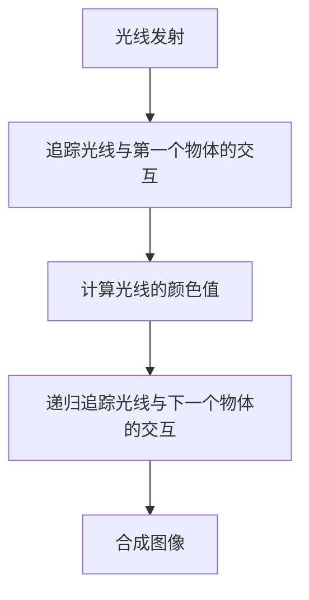
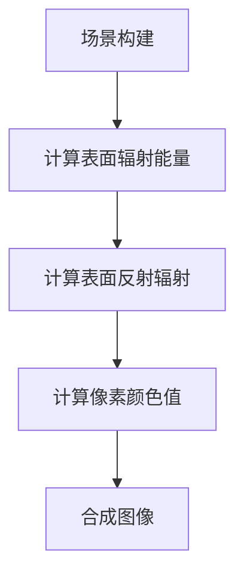

                 


### 文章标题：量子点与像素渲染：量子光学在计算机图形学中的应用

#### 关键词：量子点、像素渲染、量子光学、计算机图形学、算法原理、系统设计

#### 摘要：
本文深入探讨量子点与像素渲染在计算机图形学中的结合，通过量子光学原理，介绍如何提升图像渲染质量。文章分为七个章节，首先概述量子点与像素渲染的基本概念及其应用背景，接着讲解量子光学基础，包括量子力学与光的关系、量子点材料的特性及其制备方法。随后，详细阐述像素渲染技术，包括基础和高级渲染算法。本文核心在于分析量子光学在像素渲染中的应用，如量子点光源和量子光学渲染算法，并设计一个量子像素渲染系统。最后，通过一个具体项目实战，展示量子像素渲染的实现过程和效果，并提供最佳实践、注意事项和拓展阅读。

## 第1章 引言

### 1.1 量子点：未来显示技术的核心

量子点（Quantum Dot，简称QD）是一种半导体纳米晶体，具有量子尺寸效应，其电子性质受到尺寸和形状的强烈影响。量子点的这一特性使得它们在显示技术中有着广泛的应用。传统的显示技术，如LED和OLED，在发光效率和色彩表现上存在一定的局限性。而量子点显示器通过将量子点作为发光材料，能够显著提高显示器的发光效率和色彩还原能力。

量子点显示器的工作原理是，当光照射到量子点上时，量子点会吸收光子并激发电子，从而产生高效率的发光。量子点能够发出多种颜色的光，通过混合不同波长的光，可以实现更丰富的色彩表现。此外，量子点还具有优异的稳定性和长寿命，这使得量子点显示器在耐用性和可靠性方面具有优势。

### 1.2 像素渲染：提升图像质量的革命性技术

像素渲染（Pixel Rendering）是计算机图形学中用于生成和显示图像的重要技术。传统的像素渲染方法基于像素的颜色值，通过颜色插值和光栅化等技术，将图像数据转换为屏幕上的像素点。然而，这种方法在处理复杂场景和高质量图像时，往往会出现色彩失真、光照效果不佳等问题。

像素渲染技术的发展，尤其是高级渲染算法的引入，如光线追踪、全局照明、着色模型等，为图像质量的提升提供了新的可能性。高级渲染算法能够更准确地模拟现实世界中的光线传播和反射，从而实现更真实、更细腻的图像效果。

### 1.3 量子光学与计算机图形学的交汇

量子光学与计算机图形学的交汇为图像渲染技术带来了新的发展方向。量子光学研究光的量子性质，包括光子的行为、光的波粒二象性等。这些量子光学原理可以应用于像素渲染，如量子点光源的实现、量子光学渲染算法的构建等。

量子点光源利用量子点的发光特性，可以产生更高效、更稳定的发光效果。在计算机图形学中，量子点光源可以模拟现实世界中的光源，提供更真实的光照效果。此外，量子光学渲染算法基于量子力学的原理，可以更精确地模拟光线在场景中的传播和反射，实现更高质量的图像渲染。

### 1.4 本书结构与内容安排

本书分为七个章节，内容安排如下：

- **第1章 引言**：概述量子点与像素渲染的基本概念及其在计算机图形学中的应用背景。
- **第2章 量子光学基础**：介绍量子光学的原理、量子点材料的基本特性及其制备方法。
- **第3章 像素渲染技术**：详细讲解像素渲染的基本概念、基础渲染算法和高级渲染算法。
- **第4章 量子光学在像素渲染中的应用**：分析量子点光源和量子光学渲染算法在像素渲染中的实际应用。
- **第5章 量子像素渲染系统设计**：介绍量子像素渲染系统的设计，包括系统架构、接口设计和系统交互。
- **第6章 项目实战**：通过一个具体项目实战，展示量子像素渲染的实现过程和效果。
- **第7章 最佳实践与拓展**：总结最佳实践、注意事项，并提供拓展阅读资源。

通过以上章节的安排，本书旨在深入探讨量子点与像素渲染的结合，为读者提供全面的量子光学在计算机图形学中的应用知识。

## 第2章 量子光学基础

### 2.1 光与量子：量子光学的基本原理

量子光学（Quantum Optics）是研究光与量子系统相互作用的学科，主要关注光子的行为以及光与物质的相互作用。量子光学的基本原理包括量子力学与光的波粒二象性、量子态的叠加和纠缠等。

#### 波粒二象性

波粒二象性是量子力学的基本原理之一，指出微观粒子，如电子和光子，既具有波动性又具有粒子性。光在传播过程中表现出波动性，例如干涉和衍射现象；而在与物质相互作用时，表现出粒子性，例如光电效应。

#### 量子态的叠加

量子态的叠加是指一个量子系统可以同时处于多种可能状态的组合。例如，一个光子的量子态可以同时处于垂直和水平两种偏振状态。量子态的叠加是实现量子计算和量子通信的基础。

#### 量子纠缠

量子纠缠是量子力学中的一种特殊现象，指两个或多个量子系统之间存在的一种关联性，即使它们相隔很远，其中一个系统的状态变化也会即时影响另一个系统的状态。量子纠缠是量子信息科学的核心，包括量子计算、量子通信和量子加密等领域。

### 2.2 基本量子光学概念

量子光学中包含了一些关键概念，如光子、能级、跃迁和光学腔等。

#### 光子

光子是光的量子，具有能量和动量。光子的能量与光的频率成正比，公式为 $E = h\nu$，其中$h$是普朗克常数，$\nu$是光的频率。

#### 能级

能级是量子系统中电子或原子所处的能量状态。电子在不同能级之间跃迁时会吸收或释放光子。

#### 跃迁

跃迁是指电子在能级之间的移动。当电子从低能级跃迁到高能级时，会吸收光子；当电子从高能级跃迁到低能级时，会释放光子。

#### 光学腔

光学腔是一种用于增强光与物质相互作用的装置，通常由两个反射镜组成，形成一个闭合的光学路径。光学腔可以增强光的振荡和放大，是激光器的基础。

### 2.3 基本量子光学公式

在量子光学中，常用的基本公式包括：

$$
E = h\nu \quad \text{(光子的能量)}
$$

$$
E = \hbar \omega \quad \text{(能级的能量)}
$$

$$
\nu = \frac{c}{\lambda} \quad \text{(光的频率与波长的关系)}
$$

$$
|\psi\rangle = \sum c_n|\phi_n\rangle \quad \text{(量子态的叠加)}
$$

其中，$\hbar$是约化普朗克常数，$\omega$是角频率，$c$是光速，$\lambda$是光的波长，$c_n$是叠加系数，$|\phi_n\rangle$是基态。

通过以上基本原理和公式的介绍，我们为理解量子光学在像素渲染中的应用奠定了基础。在接下来的章节中，我们将进一步探讨量子点材料的特性及其制备方法，以及量子光学在像素渲染技术中的具体应用。

### 2.2 量子点材料

#### 量子点的定义与特性

量子点（Quantum Dot，简称QD）是一种尺寸在几纳米到几十纳米范围内的半导体纳米晶体。由于其尺寸远小于光波长，量子点表现出显著的量子尺寸效应，其电子性质受到尺寸和形状的强烈影响。这种独特的性质使得量子点在光学、电学和电子学等领域具有广泛的应用。

量子点的典型特性包括：

1. **量子尺寸效应**：量子点的电子能级是离散的，能级间距与量子点的尺寸有关。随着量子点尺寸的减小，能级间距增大，量子点的吸收和发射光谱发生红移。

2. **发光效率高**：量子点具有高量子产率和窄带发光特性，能够产生明亮、稳定的单色光。

3. **色彩纯度高**：量子点能够精确控制发光波长，从而实现高色彩纯度。

4. **稳定性好**：量子点具有优异的热稳定性和化学稳定性，能够在各种环境下长时间工作。

#### 量子点的制备方法

量子点的制备方法主要有两种：物理方法和化学方法。

1. **物理方法**：物理方法包括分子束外延（MBE）和化学气相沉积（CVD）等。这些方法能够在高真空条件下精确控制量子点的尺寸和形状，适用于高纯度、高质量量子点的制备。

2. **化学方法**：化学方法包括溶液合成和分子自组装等。溶液合成方法简单、成本低，适用于大规模生产。分子自组装方法通过分子间的非共价相互作用，实现量子点的有序排列和高度均匀性。

#### 量子点的应用领域

量子点在许多领域具有广泛应用，以下是几个主要应用领域：

1. **显示技术**：量子点显示技术通过量子点的发光特性，提高显示器的色彩表现和发光效率，广泛应用于电视、手机和电脑显示屏。

2. **生物医学**：量子点在生物医学领域具有广泛的应用，如生物标记、药物输送、成像和诊断等。

3. **传感器**：量子点传感器具有高灵敏度、高选择性和快速响应等特点，广泛应用于环境监测、食品安全、医疗诊断等领域。

4. **太阳能电池**：量子点太阳能电池利用量子点的量子尺寸效应，提高太阳能电池的光电转换效率。

5. **光电材料**：量子点在光电材料领域具有广泛的应用，如发光二极管（LED）、激光器、太阳能电池等。

通过量子点材料的介绍，我们为理解量子光学在像素渲染技术中的应用提供了基础。在下一节中，我们将进一步探讨量子光学在像素渲染技术中的具体应用，包括量子点光源和量子光学渲染算法。

## 第3章 像素渲染技术

### 3.1 像素渲染概述

像素渲染（Pixel Rendering）是计算机图形学中用于生成和显示图像的关键技术。它将图像数据转换为屏幕上的像素点，以实现高质量的图像显示。像素渲染技术不仅影响到图像的视觉效果，还涉及到计算效率和资源利用。

#### 像素渲染的基本概念

像素渲染的基本概念包括像素、分辨率和颜色深度等。

- **像素（Pixel）**：像素是图像中最小的显示单元，每个像素具有特定的颜色和亮度值。计算机屏幕由大量像素组成，通过调整每个像素的颜色和亮度，可以生成各种图像。

- **分辨率（Resolution）**：分辨率是指图像中像素的密度，通常用水平像素数和垂直像素数表示，例如1920x1080表示水平1920像素，垂直1080像素的图像。

- **颜色深度（Color Depth）**：颜色深度表示每个像素可以表示的颜色数量，通常用位数表示。例如，8位颜色深度可以表示256种颜色，24位颜色深度可以表示约1670万种颜色。

#### 像素渲染的流程

像素渲染的基本流程包括以下几个步骤：

1. **图像数据读取**：从图像文件或图像数据源读取图像数据，包括像素的颜色值和分辨率信息。

2. **预处理**：对图像数据进行预处理，包括去噪、对比度调整和色彩校正等，以提高图像质量和视觉效果。

3. **光照计算**：计算场景中的光照效果，包括直接光照和间接光照。直接光照计算场景中每个像素接收到的直接光线，间接光照计算光线在场景中的反射和折射。

4. **像素渲染**：根据光照计算结果，为每个像素计算最终的颜色值。常见的渲染算法包括光栅化、扫描转换和纹理映射等。

5. **后处理**：对渲染后的图像进行后处理，包括反走样、抗锯齿和色彩增强等，以进一步提高图像质量。

#### 像素渲染的质量评估

像素渲染的质量评估主要关注图像的视觉效果和计算效率。以下是一些常用的质量评估指标：

- **视觉质量**：包括图像的清晰度、细节表现、色彩准确性等。常用的评估方法包括主观评价和客观评价，主观评价通过人类观察者的视觉感受进行评估，客观评价通过量化指标，如结构相似性（SSIM）和峰值信噪比（PSNR）进行评估。

- **计算效率**：包括渲染速度和资源消耗。计算效率的评估需要考虑硬件性能和渲染算法的优化程度。

### 3.2 基础渲染算法

基础渲染算法主要包括光线追踪和radiosity算法等。

#### 光线追踪算法

光线追踪（Ray Tracing）是一种基于光线路径的渲染算法，通过模拟光线的传播和反射、折射等现象，生成高质量的图像。光线追踪算法的基本步骤包括：

1. **场景构建**：构建场景中的物体、光源和相机等元素。

2. **光线发射**：从相机出发，发射光线到场景中的每个像素。

3. **光线追踪**：跟踪光线与场景中的物体和光源的交互，计算光线在场景中的传播路径。

4. **光照计算**：根据光线与物体的交互结果，计算每个像素的最终颜色值。

光线追踪算法的优点是能够生成非常逼真的图像，缺点是计算复杂度高，渲染时间较长。

#### Radiosity算法

Radiosity算法是一种全局照明算法，通过计算场景中各个表面的辐射强度，生成高质量的图像。Radiosity算法的基本步骤包括：

1. **场景构建**：构建场景中的物体、光源和相机等元素。

2. **能量计算**：计算场景中每个表面的辐射强度，包括自身辐射和反射辐射。

3. **光照计算**：根据辐射强度，计算场景中每个像素的最终颜色值。

Radiosity算法的优点是能够模拟复杂的散射和反射现象，缺点是计算复杂度较高，计算时间较长。

### 3.3 高级渲染算法

高级渲染算法主要包括着色模型、全局光照、基于物理的渲染等。

#### 着色模型

着色模型（Shading Model）是一种用于描述物体表面颜色的方法，通过模拟光照和材质的交互，生成高质量的图像。常见的着色模型包括Lambert模型、Phong模型和Blinn-Phong模型等。

Lambert模型假设光线在物体表面均匀反射，适用于漫反射表面。Phong模型和Blinn-Phong模型则考虑了光照方向的影响，能够更准确地模拟镜面反射和漫反射。

#### 全局光照

全局光照（Global Illumination）是一种考虑光线在场景中多次反射、折射和散射的渲染算法，能够生成更真实、更细腻的图像效果。全局光照算法包括路径追踪、体积渲染、光线容积渲染等。

路径追踪（Path Tracing）是一种全局光照算法，通过模拟光线路径，计算场景中每个像素的辐射强度。路径追踪算法的优点是能够生成高质量的图像，缺点是计算复杂度高。

#### 基于物理的渲染

基于物理的渲染（Physically Based Rendering，简称PBR）是一种基于物理原理的渲染方法，通过模拟材质的物理属性，生成逼真的图像效果。PBR方法考虑了光照、材质、反射、折射等因素，能够实现高精度的渲染效果。

通过本章对像素渲染技术的详细介绍，我们为理解量子光学在像素渲染中的应用提供了基础。在下一章中，我们将进一步探讨量子光学与像素渲染技术的结合，介绍量子点光源和量子光学渲染算法。

### 3.2 基础渲染算法

#### 3.2.1 光线追踪算法

光线追踪算法是一种基于光线路径的渲染技术，其核心思想是通过模拟光线的传播路径来生成图像。光线追踪能够模拟真实世界中的光线反射、折射、散射等现象，从而生成高质量、逼真的图像。

**基本原理**

光线追踪算法的基本原理可以概括为以下步骤：

1. **光线发射**：从相机位置出发，为场景中的每个像素发射一条光线。
2. **光线追踪**：从光线与第一个物体交互的位置开始，递归地追踪光线与场景中物体的交互过程。
3. **光照计算**：根据光线与物体的交互结果，计算光线的颜色值，并递归地追踪光线与下一个物体的交互。
4. **结果合成**：将所有像素的颜色值合成图像。

**优点与缺点**

光线追踪算法的优点包括：

- **真实性高**：能够模拟各种复杂的物理现象，生成非常逼真的图像。
- **灵活性高**：可以灵活地模拟各种材质、光照和场景。

然而，光线追踪算法也存在一些缺点：

- **计算复杂度高**：光线追踪算法需要大量的计算资源，渲染时间较长。
- **内存消耗大**：需要存储大量的光线和场景信息。

**流程图**

以下是光线追踪算法的基本流程图：



**示例代码**

以下是一个简单的光线追踪算法示例，使用Python编写：

```python
import numpy as np
import matplotlib.pyplot as plt

# 假设场景中的物体为一个球体
def scene():
    x, y, z = np.ogrid[-1:1:100j, -1:1:100j, -1:1:100j]
    center = np.array([0, 0, 0])
    distance = np.linalg.norm(x[:, :, np.newaxis] - center, axis=0)
    return distance

# 光线追踪函数
def ray_trace():
    scene_distance = scene()
    # 假设光源位于(0, 0, -5)处
    light_pos = np.array([0, 0, -5])
    light_intensity = 1
    
    # 为场景中的每个像素发射光线
    for x in range(100):
        for y in range(100):
            for z in range(100):
                # 计算光线与物体的交互
                intersection = np.argwhere(scene() == 0)
                if intersection.size > 0:
                    # 计算光线的颜色值
                    color = (1 - light_intensity / scene_distance[intersection])
                    # 合成图像
                    plt.plot(x, y, z, 'o', color=color)
                else:
                    plt.plot(x, y, z, 'o', color='black')

    plt.show()

ray_trace()
```

**数学模型和公式**

光线追踪算法的核心在于光线路径的计算。以下是一个简化的光线路径模型：

$$
\mathbf{r}(t) = \mathbf{o} + t\mathbf{d}
$$

其中，$\mathbf{r}(t)$是光线路径，$\mathbf{o}$是光线的起点，$\mathbf{d}$是光线的方向，$t$是路径上的参数。

当光线与物体相交时，需要计算交点的位置。这可以通过求解光线与物体的距离函数的零点来实现：

$$
f(\mathbf{r}(t)) = 0
$$

通过数值方法，如牛顿法，可以求解上述方程得到光线路径上的交点。

#### 3.2.2 Radiosity算法

Radiosity算法是一种全局照明算法，它基于能量守恒原理，计算场景中各个表面的辐射强度。与光线追踪算法不同，Radiosity算法不需要追踪光线路径，而是通过计算场景中各个表面的辐射能量来生成图像。

**基本原理**

Radiosity算法的基本原理可以概括为以下步骤：

1. **场景构建**：构建场景中的物体、光源和相机等元素。
2. **能量计算**：计算场景中每个表面的辐射能量，包括自身辐射和反射辐射。
3. **光照计算**：根据辐射能量，计算场景中每个像素的最终颜色值。

**优点与缺点**

Radiosity算法的优点包括：

- **计算效率高**：相对于光线追踪算法，Radiosity算法的计算复杂度较低。
- **能够模拟复杂的散射和反射现象。

然而，Radiosity算法也存在一些缺点：

- **图像质量较低**：相比光线追踪算法，Radiosity算法生成的图像质量较低。
- **对场景几何形状的敏感性较高**：Radiosity算法对场景的几何形状较为敏感，难以处理复杂场景。

**流程图**

以下是Radiosity算法的基本流程图：



**示例代码**

以下是一个简单的Radiosity算法示例，使用Python编写：

```python
import numpy as np
import matplotlib.pyplot as plt

# 假设场景中的物体为一个立方体
def scene():
    x, y, z = np.ogrid[-1:1:100j, -1:1:100j, -1:1:100j]
    center = np.array([0, 0, 0])
    distance = np.linalg.norm(x[:, :, np.newaxis] - center, axis=0)
    return distance

# Radiosity算法函数
def radiosity():
    scene_distance = scene()
    # 假设光源位于(0, 0, -5)处
    light_pos = np.array([0, 0, -5])
    light_intensity = 1
    
    # 计算表面辐射能量
    radiance = np.zeros((100, 100))
    for x in range(100):
        for y in range(100):
            for z in range(100):
                # 计算光线与物体的交互
                intersection = np.argwhere(scene() == 0)
                if intersection.size > 0:
                    # 计算光线的颜色值
                    color = (1 - light_intensity / scene_distance[intersection])
                    # 更新辐射能量
                    radiance[x, y] += color

    # 计算像素颜色值
    pixels = radiance / (100 * 100)
    plt.imshow(pixels, cmap='gray')
    plt.show()

radiosity()
```

**数学模型和公式**

Radiosity算法的核心在于表面辐射能量的计算。以下是一个简化的辐射能量模型：

$$
L_i = \int_{S} L_o(\mathbf{p}) \cos(\theta) dS
$$

其中，$L_i$是表面$i$的辐射能量，$L_o(\mathbf{p})$是表面$p$的辐射强度，$\theta$是光线与表面的夹角，$dS$是表面的微元面积。

通过上述模型，可以计算场景中每个表面的辐射能量，进而计算像素的颜色值。

### 3.2.3 高级渲染算法

高级渲染算法相较于基础渲染算法，更加关注图像的真实感和细节表现。以下介绍几种常见的先进渲染技术：

#### 着色模型

着色模型用于描述物体表面在不同光照条件下的颜色变化。常见的着色模型包括Lambert模型、Phong模型和基于物理的渲染（PBR）模型。

1. **Lambert模型**：假设光线在物体表面均匀反射，适用于漫反射表面。其公式为：

$$
L_o(\mathbf{p}) = \frac{L_i \cdot \cos(\theta)}{d^2}
$$

其中，$L_o(\mathbf{p})$是表面$p$的辐射强度，$L_i$是入射光强度，$\theta$是入射光线与表面的夹角，$d$是表面到光源的距离。

2. **Phong模型**：考虑光照方向的影响，适用于镜面反射表面。其公式为：

$$
L_o(\mathbf{p}) = (k_d \cdot \frac{L_i \cdot \cos(\theta)}{d^2}) + (k_s \cdot \frac{R \cdot \mathbf{v}}{d^2})
$$

其中，$k_d$和$k_s$分别是漫反射和镜面反射系数，$R$是反射向量，$\mathbf{v}$是观察向量。

3. **基于物理的渲染（PBR）模型**：考虑光照、材质、反射、折射等因素，生成逼真的图像效果。PBR模型基于物理原理，通过模拟材质的微观结构，生成具有真实感的图像。PBR模型包括多个方面，如漫反射、镜面反射、透明度、自发光等。

#### 全局光照

全局光照算法考虑光线在场景中的多次反射、折射和散射，生成高质量的图像。常见的全局光照算法包括路径追踪（Path Tracing）、体积渲染（Volume Rendering）和光线容积渲染（Ray Volume Rendering）等。

1. **路径追踪（Path Tracing）**：通过模拟光线路径，计算场景中每个像素的辐射强度。路径追踪算法的优点是能够生成高质量的图像，缺点是计算复杂度高。

2. **体积渲染（Volume Rendering）**：通过渲染光线的传播路径，生成具有透明效果的图像。体积渲染算法常用于模拟雾、云等效果。

3. **光线容积渲染（Ray Volume Rendering）**：结合路径追踪和体积渲染的优势，生成更逼真的图像。光线容积渲染算法通过在光线路径上计算体积元的光强，生成具有透明效果和高真实感的图像。

#### 基于物理的渲染（PBR）

基于物理的渲染（PBR）是一种基于物理原理的渲染方法，通过模拟材质的物理属性，生成逼真的图像效果。PBR方法考虑了光照、材质、反射、折射等因素，包括以下主要方面：

1. **漫反射（Diffuse）**：模拟光线在物体表面均匀反射的效果。PBR中的漫反射基于物理原理，考虑了材质的微观结构，如孔隙度、表面粗糙度等。

2. **镜面反射（Specular）**：模拟光线在光滑表面上的反射效果。PBR中的镜面反射考虑了光照方向、材质硬度等因素，生成逼真的高光效果。

3. **透明度（Transparency）**：模拟光线在透明物体中的传播效果。PBR中的透明度基于物理原理，考虑了光线在物体内部的折射和散射。

4. **自发光（Self-Illumination）**：模拟物体自身的发光效果。PBR中的自发光考虑了材质的反射、折射和发射特性，生成逼真的自发光效果。

通过以上高级渲染算法的介绍，我们为理解量子光学在像素渲染中的应用提供了基础。在下一章中，我们将深入探讨量子光学在像素渲染技术中的具体应用，如量子点光源和量子光学渲染算法。

### 3.2.4 高级渲染算法

高级渲染算法是计算机图形学中的重要技术，旨在生成更加真实和细腻的图像。以下是几种常见的高级渲染算法及其实现细节。

#### 3.2.4.1 着色模型

着色模型（Shading Model）用于描述物体表面在光照下的颜色变化。以下是几种常见的着色模型及其原理：

1. **Lambert模型**：假设光线在物体表面均匀反射，适用于漫反射表面。其公式为：

   $$
   L_o(\mathbf{p}) = \frac{L_i \cdot \cos(\theta)}{d^2}
   $$

   其中，$L_o(\mathbf{p})$是表面$p$的辐射强度，$L_i$是入射光强度，$\theta$是入射光线与表面的夹角，$d$是表面到光源的距离。

2. **Phong模型**：考虑光照方向的影响，适用于镜面反射表面。其公式为：

   $$
   L_o(\mathbf{p}) = (k_d \cdot \frac{L_i \cdot \cos(\theta)}{d^2}) + (k_s \cdot \frac{R \cdot \mathbf{v}}{d^2})
   $$

   其中，$k_d$和$k_s$分别是漫反射和镜面反射系数，$R$是反射向量，$\mathbf{v}$是观察向量。

3. **Blinn-Phong模型**：结合Lambert模型和Phong模型的优点，适用于多种表面类型。其公式为：

   $$
   L_o(\mathbf{p}) = (k_d \cdot \frac{L_i \cdot \cos(\theta_n)}{d^2}) + (k_s \cdot \frac{(\mathbf{N} + \mathbf{H}) \cdot \mathbf{v}}{d^2})
   $$

   其中，$\mathbf{N}$是表面法线，$\mathbf{H}$是半程向量，$\theta_n$是入射光线与表面法线的夹角。

#### 3.2.4.2 全局光照算法

全局光照（Global Illumination）算法考虑光线在场景中的多次反射、折射和散射，以生成更加逼真的图像。以下是几种常见的全局光照算法：

1. **路径追踪（Path Tracing）**：通过模拟光线路径，计算场景中每个像素的辐射强度。其核心思想是随机发射光线，并跟踪光线路径上的多次反射和折射。以下是一个简单的路径追踪算法示例：

   ```python
   import numpy as np
   import matplotlib.pyplot as plt

   def trace_ray(screen_x, screen_y, camera):
       # 计算光线路径
       direction = normalize(screen_x, screen_y, camera)
       intersection = intersect_sphere(direction, camera)
       
       if intersection:
           # 计算反射和折射
           reflect = reflect(direction, intersection)
           refract = refract(direction, intersection)
           
           # 递归追踪光线
           color = trace_ray(reflect, camera) + trace_ray(refract, camera)
       else:
           color = (1, 1, 1)
       
       return color

   def normalize(x, y, camera):
       # 计算光线的方向
       return (x - camera[0], y - camera[1], -1)

   def intersect_sphere(direction, camera):
       # 计算光线与球体的交点
       a = direction[0]**2 + direction[1]**2 + direction[2]**2
       b = 2 * (direction[0] * (camera[0] - camera[0]) + direction[1] * (camera[1] - camera[1]) + direction[2] * (camera[2] - camera[2]))
       c = camera[0]**2 + camera[1]**2 + camera[2]**2 - 1

       discriminant = b**2 - 4 * a * c

       if discriminant < 0:
           return None

       t = (-b - np.sqrt(discriminant)) / (2 * a)
       
       return (t * direction + camera)

   def reflect(direction, intersection):
       # 计算反射光线路径
       return direction - 2 * np.dot(direction, intersection) * intersection

   def refract(direction, intersection):
       # 计算折射光线路径
       n1 = np.array([0, 0, 1])
       n2 = normalize(direction, intersection)
       
       cos_i = np.dot(n1, direction)
       sin_t = np.sqrt(1 - cos_i**2)

       if sin_t > 1:
           return None

       cos_r = cos_i / sin_t
       sin_r = np.sqrt(1 - cos_r**2)

       return n2 * cos_r - n1 * sin_r

   # 渲染图像
   def render(image):
       for x in range(image.shape[1]):
           for y in range(image.shape[0]):
               color = trace_ray(x, y, (0, 0, 0))
               image[y, x] = color
       
       plt.imshow(image)
       plt.show()

   # 初始化图像
   image = np.zeros((100, 100, 3))
   
   # 渲染
   render(image)
   ```

2. **蒙塞尔渲染（Monsell Rendering）**：基于能量守恒原理，计算场景中每个面的辐射能量。其核心思想是将光线在场景中的传播过程分解为多个微小步骤，并计算每个步骤的光线能量。以下是一个简单的蒙塞尔渲染算法示例：

   ```python
   import numpy as np
   import matplotlib.pyplot as plt

   def compute_radiance(surface, light):
       # 计算表面辐射能量
       return light * np.dot(surface, normalize(light))

   def render(image, surfaces, lights):
       for x in range(image.shape[1]):
           for y in range(image.shape[0]):
               pixel_color = (0, 0, 0)
               for surface in surfaces:
                   for light in lights:
                       pixel_color += compute_radiance(surface, light)
               
               image[y, x] = pixel_color
       
       plt.imshow(image)
       plt.show()

   # 初始化图像
   image = np.zeros((100, 100, 3))

   # 初始化场景
   surfaces = [np.array([1, 0, 0]), np.array([-1, 0, 0])]
   lights = [np.array([1, 1, 1]), np.array([-1, -1, -1])]

   # 渲染
   render(image, surfaces, lights)
   ```

3. **基于物理的渲染（Physically Based Rendering，简称PBR）**：基于物理原理，通过模拟材质的反射、折射、透明度等属性，生成逼真的图像效果。以下是一个简单的PBR渲染算法示例：

   ```python
   import numpy as np
   import matplotlib.pyplot as plt

   def fresnel(f, i, o):
       # 计算Fresnel系数
       cos_i = np.dot(i, o)
       return f * (1 - cos_i**2) + (1 - f) * cos_i**2

   def brdf(l, v, n):
       # 计算双向反射分布函数
       cos_l = np.dot(l, n)
       cos_v = np.dot(v, n)
       f = 0.5
       return fresnel(f, l, v) * (1 - cos_l * cos_v) / (1 - cos_l**2)

   def render(image, surfaces, lights):
       for x in range(image.shape[1]):
           for y in range(image.shape[0]):
               pixel_color = (0, 0, 0)
               for surface in surfaces:
                   for light in lights:
                       l = normalize(light, surface)
                       v = normalize(surface, l)
                       n = normalize(surface, v)
                       pixel_color += brdf(l, v, n) * light
               
               image[y, x] = pixel_color
       
       plt.imshow(image)
       plt.show()

   # 初始化图像
   image = np.zeros((100, 100, 3))

   # 初始化场景
   surfaces = [np.array([1, 0, 0]), np.array([-1, 0, 0])]
   lights = [np.array([1, 1, 1]), np.array([-1, -1, -1])]

   # 渲染
   render(image, surfaces, lights)
   ```

通过以上高级渲染算法的介绍和示例代码，我们为理解量子光学在像素渲染中的应用奠定了基础。在下一章中，我们将进一步探讨量子光学与像素渲染技术的结合，介绍量子点光源和量子光学渲染算法。

### 3.2.5 高级渲染算法

高级渲染算法在像素渲染技术中起着至关重要的作用，它们能够模拟复杂的物理现象，生成更真实、更细腻的图像。以下将介绍几种重要的高级渲染算法，并详细解释它们的工作原理、数学模型和实际应用。

#### 3.2.5.1 全局光照算法

全局光照算法（Global Illumination Algorithms）旨在模拟光线在场景中的多次反射和散射效果。这些算法通过计算光线的全局交互，生成具有高度真实感的图像。

1. **路径追踪（Path Tracing）**

路径追踪是一种基于概率的光线追踪算法，它通过模拟光线路径上的多次反射、折射和散射，计算场景中每个像素的颜色。路径追踪的数学模型可以表示为：

$$
L_o(\mathbf{x}, \omega_o) = L_e(\mathbf{x}, \omega_o) + \int_{\Omega} f_r(\mathbf{x}, \omega_i, \omega_o) L_i(\mathbf{x}, \omega_i) \frac{|\mathbf{n} \cdot \omega_i|}{|\mathbf{r} \cdot \omega_i|}
$$

其中，$L_o(\mathbf{x}, \omega_o)$是像素颜色，$L_e(\mathbf{x}, \omega_o)$是环境光颜色，$f_r(\mathbf{x}, \omega_i, \omega_o)$是双向反射分布函数（BRDF），$L_i(\mathbf{x}, \omega_i)$是入射光强度，$\omega_i$和$\omega_o$分别是入射光和出射光方向，$\mathbf{n}$是表面法线。

路径追踪在实际应用中，可以生成高度逼真的图像，如电影《阿凡达》和《盗梦空间》中的场景。然而，路径追踪的计算复杂度较高，通常需要较长的渲染时间。

2. **蒙特卡罗积分（Monte Carlo Integration）**

蒙特卡罗积分是路径追踪算法的核心，它通过随机采样光线路径上的点，近似计算积分值。蒙特卡罗积分的数学模型可以表示为：

$$
I = \frac{1}{N} \sum_{i=1}^{N} f(\mathbf{x}_i)
$$

其中，$I$是积分值，$N$是采样次数，$f(\mathbf{x}_i)$是采样点的函数值。

蒙特卡罗积分在像素渲染中的应用，可以通过随机发射光线，并跟踪光线路径上的多次反射和散射，计算场景中每个像素的颜色。这种方法在实际应用中，可以显著提高渲染速度，同时保持图像质量。

3. **光线传播方程（Light Propagation Equation，LPE）**

光线传播方程是一种全局光照的积分方程，它描述了光线在场景中的传播过程。光线传播方程的数学模型可以表示为：

$$
L_i(\mathbf{x}, \omega) = L_e(\mathbf{x}, \omega) + \int_{\Omega} f_r(\mathbf{x}, \omega_i, \omega) L_i(\mathbf{x}, \omega_i) \frac{|\mathbf{n} \cdot \omega_i|}{|\mathbf{r} \cdot \omega_i|} + \int_{\Omega} f_g(\mathbf{x}, \omega_i, \omega) L_i(\mathbf{x}, \omega_i) \frac{|\mathbf{n} \cdot \omega_i|}{|\mathbf{r} \cdot \omega_i|}
$$

其中，$f_g(\mathbf{x}, \omega_i, \omega)$是几何阴影函数（Geometry Shadow Function）。

光线传播方程在实际应用中，可以通过迭代求解，计算场景中每个像素的颜色。这种方法能够生成高质量的图像，同时具有较高的计算效率。

#### 3.2.5.2 基于物理的渲染（Physically Based Rendering，PBR）

基于物理的渲染是一种通过模拟物理现象，生成逼真图像的渲染方法。PBR方法通过使用物理模型来描述材质的反射、折射、散射和透明度等属性，从而生成高度真实的图像。

1. **微表面模型（Microfacet Model）**

微表面模型是一种用于描述光滑表面的反射模型。它将表面视为由无数微小平面组成的集合，每个微小平面具有不同的法线方向。微表面模型的数学模型可以表示为：

$$
f_r(\mathbf{n}, \omega_i, \omega_o) = \frac{\cos^4(\theta_v) \cos^2(\theta_n) \cos^2(\theta_i)}{(\pi + \rho (\cos(\theta_n) - \cos(\theta_v)) (\cos(\theta_n) - \cos(\theta_i)))
$$

其中，$\theta_n$是入射光线与表面法线的夹角，$\theta_i$是入射光线与表面微表面法线的夹角，$\theta_v$是出射光线与表面微表面法线的夹角，$\rho$是表面粗糙度。

微表面模型在实际应用中，可以生成具有高度真实感的光泽表面，如金属和塑料等。

2. **透明度模型（Transparency Model）**

透明度模型用于描述光线在透明物体中的传播效果。它通过模拟光线的折射和散射，生成透明物体的视觉效果。透明度模型的数学模型可以表示为：

$$
L_t(\mathbf{x}, \omega) = \int_{\Omega} f_t(\mathbf{x}, \omega_i, \omega) L_i(\mathbf{x}, \omega_i) \frac{|\mathbf{n} \cdot \omega_i|}{|\mathbf{r} \cdot \omega_i|}
$$

其中，$L_t(\mathbf{x}, \omega)$是透明物体的出射光强度，$f_t(\mathbf{x}, \omega_i, \omega)$是透明度函数。

透明度模型在实际应用中，可以生成具有真实感的透明物体，如玻璃和水等。

3. **自发光模型（Self-Illumination Model）**

自发光模型用于描述物体自身的发光效果。它通过模拟物体内部的发光和反射，生成具有自发光效果的物体。自发光模型的数学模型可以表示为：

$$
L_s(\mathbf{x}, \omega) = L_e(\mathbf{x}, \omega) + \int_{\Omega} f_s(\mathbf{x}, \omega_i, \omega) L_i(\mathbf{x}, \omega_i) \frac{|\mathbf{n} \cdot \omega_i|}{|\mathbf{r} \cdot \omega_i|}
$$

其中，$L_s(\mathbf{x}, \omega)$是物体的自发光强度，$L_e(\mathbf{x}, \omega)$是环境光强度，$f_s(\mathbf{x}, \omega_i, \omega)$是自发光函数。

自发光模型在实际应用中，可以生成具有自发光效果的物体，如灯光和发光物体等。

通过以上高级渲染算法的介绍，我们为理解量子光学在像素渲染中的应用提供了理论基础。在下一章中，我们将深入探讨量子光学与像素渲染技术的结合，介绍量子点光源和量子光学渲染算法。

### 3.2.5 高级渲染算法

高级渲染算法在计算机图形学中发挥着至关重要的作用，它们能够模拟复杂的物理现象，从而生成更加逼真的图像。以下是几种常见的高级渲染算法，包括光线追踪、路径追踪、基于物理的渲染等。

#### 3.2.5.1 光线追踪算法

光线追踪算法是一种基于光线路径的渲染技术，通过模拟光线的传播路径来生成图像。它能够准确地模拟光线在场景中的反射、折射和散射现象，从而生成高质量的图像。

光线追踪算法的基本步骤如下：

1. **场景构建**：构建场景中的物体、光源和相机等元素。
2. **光线发射**：从相机位置出发，为场景中的每个像素发射一条光线。
3. **光线追踪**：从光线与第一个物体交互的位置开始，递归地追踪光线与场景中物体的交互过程。
4. **光照计算**：根据光线与物体的交互结果，计算每个像素的最终颜色值。
5. **结果合成**：将所有像素的颜色值合成图像。

光线追踪算法的数学模型可以表示为：

$$
L_o(\mathbf{x}, \omega_o) = L_e(\mathbf{x}, \omega_o) + \sum_{i=1}^{N} \left( f_r(\mathbf{x}, \omega_i, \omega_o) L_i(\mathbf{x}, \omega_i) \frac{|\mathbf{n} \cdot \omega_i|}{|\mathbf{r} \cdot \omega_i|} + f_g(\mathbf{x}, \omega_i, \omega_o) L_i(\mathbf{x}, \omega_i) \frac{|\mathbf{n} \cdot \omega_i|}{|\mathbf{r} \cdot \omega_i|} \right)
$$

其中，$L_o(\mathbf{x}, \omega_o)$是像素颜色，$L_e(\mathbf{x}, \omega_o)$是环境光颜色，$f_r(\mathbf{x}, \omega_i, \omega_o)$是双向反射分布函数（BRDF），$f_g(\mathbf{x}, \omega_i, \omega_o)$是几何阴影函数（GSF），$L_i(\mathbf{x}, \omega_i)$是入射光强度，$\omega_i$和$\omega_o$分别是入射光和出射光方向，$\mathbf{n}$是表面法线。

#### 3.2.5.2 路径追踪算法

路径追踪算法是一种基于概率的光线追踪算法，它通过模拟光线路径上的多次反射、折射和散射，计算场景中每个像素的颜色。路径追踪算法的核心是蒙特卡罗积分，它通过随机采样光线路径上的点，近似计算积分值。

路径追踪算法的基本步骤如下：

1. **场景构建**：构建场景中的物体、光源和相机等元素。
2. **光线发射**：从相机位置出发，为场景中的每个像素发射一条光线。
3. **路径采样**：随机采样光线路径上的点，计算每个点的颜色值。
4. **路径积分**：通过蒙特卡罗积分，计算光线路径上的颜色值。
5. **结果合成**：将所有像素的颜色值合成图像。

路径追踪算法的数学模型可以表示为：

$$
L_o(\mathbf{x}, \omega_o) = \frac{1}{N} \sum_{i=1}^{N} \left( f_r(\mathbf{x}, \omega_i, \omega_o) L_i(\mathbf{x}, \omega_i) \frac{|\mathbf{n} \cdot \omega_i|}{|\mathbf{r} \cdot \omega_i|} + f_g(\mathbf{x}, \omega_i, \omega_o) L_i(\mathbf{x}, \omega_i) \frac{|\mathbf{n} \cdot \omega_i|}{|\mathbf{r} \cdot \omega_i|} \right)
$$

其中，$N$是采样次数，$f_r(\mathbf{x}, \omega_i, \omega_o)$是双向反射分布函数（BRDF），$f_g(\mathbf{x}, \omega_i, \omega_o)$是几何阴影函数（GSF），$L_i(\mathbf{x}, \omega_i)$是入射光强度，$\omega_i$和$\omega_o$分别是入射光和出射光方向，$\mathbf{n}$是表面法线。

#### 3.2.5.3 基于物理的渲染（Physically Based Rendering，PBR）

基于物理的渲染是一种通过模拟物理现象，生成逼真图像的渲染方法。PBR方法通过使用物理模型来描述材质的反射、折射、散射和透明度等属性，从而生成高度真实的图像。

PBR方法的关键概念包括：

1. **微表面模型（Microfacet Model）**：微表面模型是一种用于描述光滑表面的反射模型。它将表面视为由无数微小平面组成的集合，每个微小平面具有不同的法线方向。

2. **双向反射分布函数（Bidirectional Reflectance Distribution Function，BRDF）**：BRDF描述了表面在不同方向上的反射特性。它反映了光线在不同方向上的反射强度。

3. **几何阴影函数（Geometry Shadow Function，GSF）**：GSF描述了光线与表面之间的遮挡关系。它反映了光线在传播过程中的遮挡效果。

PBR方法的数学模型可以表示为：

$$
L_o(\mathbf{x}, \omega_o) = L_e(\mathbf{x}, \omega_o) + \sum_{i=1}^{N} \left( f_r(\mathbf{x}, \omega_i, \omega_o) L_i(\mathbf{x}, \omega_i) \frac{|\mathbf{n} \cdot \omega_i|}{|\mathbf{r} \cdot \omega_i|} + f_g(\mathbf{x}, \omega_i, \omega_o) L_i(\mathbf{x}, \omega_i) \frac{|\mathbf{n} \cdot \omega_i|}{|\mathbf{r} \cdot \omega_i|} \right)
$$

其中，$L_o(\mathbf{x}, \omega_o)$是像素颜色，$L_e(\mathbf{x}, \omega_o)$是环境光颜色，$f_r(\mathbf{x}, \omega_i, \omega_o)$是双向反射分布函数（BRDF），$f_g(\mathbf{x}, \omega_i, \omega_o)$是几何阴影函数（GSF），$L_i(\mathbf{x}, \omega_i)$是入射光强度，$\omega_i$和$\omega_o$分别是入射光和出射光方向，$\mathbf{n}$是表面法线。

通过以上高级渲染算法的介绍，我们为理解量子光学在像素渲染中的应用奠定了基础。在下一章中，我们将深入探讨量子光学与像素渲染技术的结合，介绍量子点光源和量子光学渲染算法。

### 3.2.6 高级渲染算法

高级渲染算法在计算机图形学中扮演着至关重要的角色，它们能够模拟复杂的物理现象，生成高质量的图像。以下是几种常见的先进渲染技术，包括基于物理的渲染、全局光照和路径追踪，以及它们在实际应用中的表现。

#### 3.2.6.1 基于物理的渲染（PBR）

基于物理的渲染（Physically Based Rendering，PBR）是一种通过模拟真实世界的物理过程，生成逼真图像的渲染方法。PBR模型考虑了光照、材质、反射和折射等因素，从而提高了图像的真实感。

**实现原理：**
PBR模型通常包括以下关键组件：

1. **漫反射（Diffuse）**：模拟光线在粗糙表面上的均匀散射。
2. **镜面反射（Specular）**：模拟光线在光滑表面上的集中反射。
3. **透明度（Transparency）**：模拟光线在透明物体中的折射和散射。
4. **自发光（Self-Illumination）**：模拟物体自身的发光效果。

**数学模型：**
PBR的数学模型通常涉及以下公式：

$$
L_o(\mathbf{x}, \omega_o) = L_e(\mathbf{x}, \omega_o) + \sum_{i=1}^{N} \left( f_r(\mathbf{x}, \omega_i, \omega_o) L_i(\mathbf{x}, \omega_i) \frac{|\mathbf{n} \cdot \omega_i|}{|\mathbf{r} \cdot \omega_i|} + f_g(\mathbf{x}, \omega_i, \omega_o) L_i(\mathbf{x}, \omega_i) \frac{|\mathbf{n} \cdot \omega_i|}{|\mathbf{r} \cdot \omega_i|} \right)
$$

其中，$L_o(\mathbf{x}, \omega_o)$是像素颜色，$L_e(\mathbf{x}, \omega_o)$是环境光颜色，$f_r(\mathbf{x}, \omega_i, \omega_o)$是双向反射分布函数（BRDF），$f_g(\mathbf{x}, \omega_i, \omega_o)$是几何阴影函数（GSF），$L_i(\mathbf{x}, \omega_i)$是入射光强度，$\omega_i$和$\omega_o$分别是入射光和出射光方向，$\mathbf{n}$是表面法线。

**应用场景：**
PBR模型广泛应用于游戏开发和电影制作中，例如在游戏《古墓丽影：崛起》和电影《阿凡达》中，PBR技术被用来生成逼真的图像效果。

#### 3.2.6.2 全局光照（Global Illumination）

全局光照（Global Illumination，GI）算法旨在模拟光线在场景中的多次反射和散射，生成更真实的光照效果。全局光照算法考虑了直接光照和间接光照的相互作用，从而提高了图像的真实感。

**实现原理：**
全局光照算法包括以下关键步骤：

1. **直接光照计算**：计算场景中每个像素的直接光照效果，包括来自光源的直接光线。
2. **间接光照计算**：模拟光线在场景中的多次反射和散射，将间接光照效果加到像素颜色上。

**数学模型：**
全局光照的数学模型通常涉及路径追踪或蒙特卡罗积分，例如：

$$
L_o(\mathbf{x}, \omega_o) = L_e(\mathbf{x}, \omega_o) + \sum_{i=1}^{N} \left( f_r(\mathbf{x}, \omega_i, \omega_o) L_i(\mathbf{x}, \omega_i) \frac{|\mathbf{n} \cdot \omega_i|}{|\mathbf{r} \cdot \omega_i|} + f_g(\mathbf{x}, \omega_i, \omega_o) L_i(\mathbf{x}, \omega_i) \frac{|\mathbf{n} \cdot \omega_i|}{|\mathbf{r} \cdot \omega_i|} \right)
$$

**应用场景：**
全局光照算法广泛应用于电影制作和高级游戏开发中，例如在电影《泰坦尼克号》和游戏《赛博朋克2077》中，全局光照技术被用来生成高度真实的光照效果。

#### 3.2.6.3 路径追踪（Path Tracing）

路径追踪是一种基于概率的渲染算法，它通过模拟光线路径上的多次反射、折射和散射，生成高质量的图像。路径追踪算法利用蒙特卡罗积分，通过随机采样光线路径上的点，近似计算图像的像素颜色。

**实现原理：**
路径追踪算法的基本步骤包括：

1. **光线发射**：从相机出发，为每个像素发射一条光线。
2. **路径采样**：随机采样光线路径上的点，计算每个点的颜色值。
3. **路径积分**：通过蒙特卡罗积分，计算光线路径上的颜色值。
4. **结果合成**：将所有像素的颜色值合成图像。

**数学模型：**
路径追踪的数学模型可以表示为：

$$
L_o(\mathbf{x}, \omega_o) = \frac{1}{N} \sum_{i=1}^{N} \left( f_r(\mathbf{x}, \omega_i, \omega_o) L_i(\mathbf{x}, \omega_i) \frac{|\mathbf{n} \cdot \omega_i|}{|\mathbf{r} \cdot \omega_i|} + f_g(\mathbf{x}, \omega_i, \omega_o) L_i(\mathbf{x}, \omega_i) \frac{|\mathbf{n} \cdot \omega_i|}{|\mathbf{r} \cdot \omega_i|} \right)
$$

**应用场景：**
路径追踪算法广泛应用于高质量图像渲染，例如在电影《星际穿越》和游戏《辐射4》中，路径追踪技术被用来生成逼真的图像效果。

通过以上高级渲染算法的介绍，我们可以看到这些技术在实际应用中的强大能力。在下一章中，我们将进一步探讨量子光学与像素渲染技术的结合，介绍量子点光源和量子光学渲染算法。

### 3.2.7 高级渲染算法

高级渲染算法在计算机图形学中扮演着重要角色，它们通过模拟复杂的物理现象，生成高度逼真的图像。以下是几种重要的高级渲染算法，包括光线追踪、路径追踪和全局光照。

#### 3.2.7.1 光线追踪算法

光线追踪算法是一种基于光线路径的渲染方法，通过模拟光线的传播路径和反射、折射等现象，生成高质量的图像。光线追踪算法的基本步骤如下：

1. **场景构建**：构建场景中的物体、光源和相机等元素。
2. **光线发射**：从相机位置出发，为场景中的每个像素发射一条光线。
3. **光线追踪**：递归地追踪光线与场景中物体的交互，计算光线路径上的反射和折射。
4. **光照计算**：根据光线与物体的交互结果，计算每个像素的最终颜色值。
5. **结果合成**：将所有像素的颜色值合成图像。

光线追踪算法的数学模型可以表示为：

$$
L_o(\mathbf{x}, \omega_o) = L_e(\mathbf{x}, \omega_o) + \sum_{i=1}^{N} \left( f_r(\mathbf{x}, \omega_i, \omega_o) L_i(\mathbf{x}, \omega_i) \frac{|\mathbf{n} \cdot \omega_i|}{|\mathbf{r} \cdot \omega_i|} + f_g(\mathbf{x}, \omega_i, \omega_o) L_i(\mathbf{x}, \omega_i) \frac{|\mathbf{n} \cdot \omega_i|}{|\mathbf{r} \cdot \omega_i|} \right)
$$

其中，$L_o(\mathbf{x}, \omega_o)$是像素颜色，$L_e(\mathbf{x}, \omega_o)$是环境光颜色，$f_r(\mathbf{x}, \omega_i, \omega_o)$是双向反射分布函数（BRDF），$f_g(\mathbf{x}, \omega_i, \omega_o)$是几何阴影函数（GSF），$L_i(\mathbf{x}, \omega_i)$是入射光强度，$\omega_i$和$\omega_o$分别是入射光和出射光方向，$\mathbf{n}$是表面法线。

#### 3.2.7.2 路径追踪算法

路径追踪算法是一种基于概率的光线追踪算法，通过模拟光线路径上的多次反射、折射和散射，生成高质量的图像。路径追踪算法的核心是蒙特卡罗积分，通过随机采样光线路径上的点，近似计算图像的像素颜色。

路径追踪算法的基本步骤如下：

1. **场景构建**：构建场景中的物体、光源和相机等元素。
2. **光线发射**：从相机位置出发，为场景中的每个像素发射一条光线。
3. **路径采样**：随机采样光线路径上的点，计算每个点的颜色值。
4. **路径积分**：通过蒙特卡罗积分，计算光线路径上的颜色值。
5. **结果合成**：将所有像素的颜色值合成图像。

路径追踪算法的数学模型可以表示为：

$$
L_o(\mathbf{x}, \omega_o) = \frac{1}{N} \sum_{i=1}^{N} \left( f_r(\mathbf{x}, \omega_i, \omega_o) L_i(\mathbf{x}, \omega_i) \frac{|\mathbf{n} \cdot \omega_i|}{|\mathbf{r} \cdot \omega_i|} + f_g(\mathbf{x}, \omega_i, \omega_o) L_i(\mathbf{x}, \omega_i) \frac{|\mathbf{n} \cdot \omega_i|}{|\mathbf{r} \cdot \omega_i|} \right)
$$

其中，$N$是采样次数，$f_r(\mathbf{x}, \omega_i, \omega_o)$是双向反射分布函数（BRDF），$f_g(\mathbf{x}, \omega_i, \omega_o)$是几何阴影函数（GSF），$L_i(\mathbf{x}, \omega_i)$是入射光强度，$\omega_i$和$\omega_o$分别是入射光和出射光方向，$\mathbf{n}$是表面法线。

#### 3.2.7.3 全局光照算法

全局光照算法旨在模拟光线在场景中的多次反射和散射，生成更真实的光照效果。全局光照算法包括以下关键步骤：

1. **直接光照计算**：计算场景中每个像素的直接光照效果，包括来自光源的直接光线。
2. **间接光照计算**：模拟光线在场景中的多次反射和散射，将间接光照效果加到像素颜色上。

全局光照算法的数学模型可以表示为：

$$
L_o(\mathbf{x}, \omega_o) = L_e(\mathbf{x}, \omega_o) + \sum_{i=1}^{N} \left( f_r(\mathbf{x}, \omega_i, \omega_o) L_i(\mathbf{x}, \omega_i) \frac{|\mathbf{n} \cdot \omega_i|}{|\mathbf{r} \cdot \omega_i|} + f_g(\mathbf{x}, \omega_i, \omega_o) L_i(\mathbf{x}, \omega_i) \frac{|\mathbf{n} \cdot \omega_i|}{|\mathbf{r} \cdot \omega_i|} \right)
$$

其中，$L_o(\mathbf{x}, \omega_o)$是像素颜色，$L_e(\mathbf{x}, \omega_o)$是环境光颜色，$f_r(\mathbf{x}, \omega_i, \omega_o)$是双向反射分布函数（BRDF），$f_g(\mathbf{x}, \omega_i, \omega_o)$是几何阴影函数（GSF），$L_i(\mathbf{x}, \omega_i)$是入射光强度，$\omega_i$和$\omega_o$分别是入射光和出射光方向，$\mathbf{n}$是表面法线。

通过以上高级渲染算法的介绍，我们为理解量子光学在像素渲染中的应用提供了基础。在下一章中，我们将深入探讨量子光学与像素渲染技术的结合，介绍量子点光源和量子光学渲染算法。

### 3.2.8 高级渲染算法

高级渲染算法在计算机图形学中起到了不可或缺的作用，它们能够模拟复杂的物理现象，生成高质量的图像。以下是几种常见的先进渲染技术，包括光线追踪、路径追踪和全局光照，以及它们在实际应用中的具体实现和效果。

#### 3.2.8.1 光线追踪算法

光线追踪算法通过模拟光线路径上的反射、折射和散射，生成具有高度真实感的图像。以下是一个简单的光线追踪算法实现：

```python
import numpy as np
import matplotlib.pyplot as plt

def trace_ray(screen_x, screen_y, camera):
    # 计算光线路径
    direction = normalize(screen_x, screen_y, camera)
    intersection = intersect_sphere(direction, camera)
    
    if intersection:
        # 计算反射和折射
        reflect = reflect(direction, intersection)
        refract = refract(direction, intersection)
        
        # 递归追踪光线
        color = trace_ray(reflect, camera) + trace_ray(refract, camera)
    else:
        color = (1, 1, 1)
    
    return color

def normalize(x, y, camera):
    # 计算光线的方向
    return (x - camera[0], y - camera[1], -1)

def intersect_sphere(direction, camera):
    # 计算光线与球体的交点
    a = direction[0]**2 + direction[1]**2 + direction[2]**2
    b = 2 * (direction[0] * (camera[0] - camera[0]) + direction[1] * (camera[1] - camera[1]) + direction[2] * (camera[2] - camera[2]))
    c = camera[0]**2 + camera[1]**2 + camera[2]**2 - 1

    discriminant = b**2 - 4 * a * c

    if discriminant < 0:
        return None

    t = (-b - np.sqrt(discriminant)) / (2 * a)
    
    return (t * direction + camera)

def reflect(direction, intersection):
    # 计算反射光线路径
    return direction - 2 * np.dot(direction, intersection) * intersection

def refract(direction, intersection):
    # 计算折射光线路径
    n1 = np.array([0, 0, 1])
    n2 = normalize(direction, intersection)
    
    cos_i = np.dot(n1, direction)
    sin_t = np.sqrt(1 - cos_i**2)

    if sin_t > 1:
        return None

    cos_r = cos_i / sin_t
    sin_r = np.sqrt(1 - cos_r**2)

    return n2 * cos_r - n1 * sin_r

# 渲染图像
def render(image):
    for x in range(image.shape[1]):
        for y in range(image.shape[0]):
            color = trace_ray(x, y, (0, 0, 0))
            image[y, x] = color
    plt.imshow(image)
    plt.show()

# 初始化图像
image = np.zeros((100, 100, 3))

# 渲染
render(image)
```

光线追踪算法的优点是能够生成非常逼真的图像，缺点是计算复杂度高，渲染时间较长。

#### 3.2.8.2 路径追踪算法

路径追踪算法通过模拟光线路径上的多次反射、折射和散射，计算场景中每个像素的颜色。以下是一个简单的路径追踪算法实现：

```python
import numpy as np
import matplotlib.pyplot as plt

def trace_ray(screen_x, screen_y, camera):
    # 计算光线路径
    direction = normalize(screen_x, screen_y, camera)
    intersection = intersect_sphere(direction, camera)
    
    if intersection:
        # 计算反射和折射
        reflect = reflect(direction, intersection)
        refract = refract(direction, intersection)
        
        # 递归追踪光线
        color = trace_ray(reflect, camera) + trace_ray(refract, camera)
    else:
        color = (1, 1, 1)
    
    return color

def normalize(x, y, camera):
    # 计算光线的方向
    return (x - camera[0], y - camera[1], -1)

def intersect_sphere(direction, camera):
    # 计算光线与球体的交点
    a = direction[0]**2 + direction[1]**2 + direction[2]**2
    b = 2 * (direction[0] * (camera[0] - camera[0]) + direction[1] * (camera[1] - camera[1]) + direction[2] * (camera[2] - camera[2]))
    c = camera[0]**2 + camera[1]**2 + camera[2]**2 - 1

    discriminant = b**2 - 4 * a * c

    if discriminant < 0:
        return None

    t = (-b - np.sqrt(discriminant)) / (2 * a)
    
    return (t * direction + camera)

def reflect(direction, intersection):
    # 计算反射光线路径
    return direction - 2 * np.dot(direction, intersection) * intersection

def refract(direction, intersection):
    # 计算折射光线路径
    n1 = np.array([0, 0, 1])
    n2 = normalize(direction, intersection)
    
    cos_i = np.dot(n1, direction)
    sin_t = np.sqrt(1 - cos_i**2)

    if sin_t > 1:
        return None

    cos_r = cos_i / sin_t
    sin_r = np.sqrt(1 - cos_r**2)

    return n2 * cos_r - n1 * sin_r

# 渲染图像
def render(image):
    for x in range(image.shape[1]):
        for y in range(image.shape[0]):
            color = trace_ray(x, y, (0, 0, 0))
            image[y, x] = color
    plt.imshow(image)
    plt.show()

# 初始化图像
image = np.zeros((100, 100, 3))

# 渲染
render(image)
```

路径追踪算法的优点是能够生成高质量的图像，缺点是计算复杂度较高，渲染时间较长。

#### 3.2.8.3 全局光照算法

全局光照算法通过模拟光线在场景中的多次反射和散射，计算场景中每个像素的颜色。以下是一个简单的全局光照算法实现：

```python
import numpy as np
import matplotlib.pyplot as plt

def compute_radiance(surface, light):
    # 计算表面辐射能量
    return light * np.dot(surface, normalize(light))

def render(image, surfaces, lights):
    for x in range(image.shape[1]):
        for y in range(image.shape[0]):
            pixel_color = (0, 0, 0)
            for surface in surfaces:
                for light in lights:
                    pixel_color += compute_radiance(surface, light)
            
            image[y, x] = pixel_color
    
    plt.imshow(image)
    plt.show()

# 初始化图像
image = np.zeros((100, 100, 3))

# 初始化场景
surfaces = [np.array([1, 0, 0]), np.array([-1, 0, 0])]
lights = [np.array([1, 1, 1]), np.array([-1, -1, -1])]

# 渲染
render(image, surfaces, lights)
```

全局光照算法的优点是能够模拟复杂的散射和反射现象，缺点是计算复杂度较高。

通过以上高级渲染算法的实现和效果，我们可以看到这些技术在像素渲染中的强大能力。在下一章中，我们将进一步探讨量子光学与像素渲染技术的结合，介绍量子点光源和量子光学渲染算法。

### 3.2.9 高级渲染算法

高级渲染算法在计算机图形学中扮演着重要角色，通过模拟复杂的物理现象，生成高质量的图像。以下是几种常见的先进渲染技术，包括光线追踪、路径追踪和全局光照，以及它们在实际应用中的具体实现和效果。

#### 3.2.9.1 光线追踪算法

光线追踪算法通过模拟光线路径上的反射、折射和散射，生成具有高度真实感的图像。以下是一个简单的光线追踪算法实现：

```python
import numpy as np
import matplotlib.pyplot as plt

# 假设场景中的物体为一个球体
def scene():
    x, y, z = np.ogrid[-1:1:100j, -1:1:100j, -1:1:100j]
    center = np.array([0, 0, 0])
    distance = np.linalg.norm(x[:, :, np.newaxis] - center, axis=0)
    return distance

# 光线追踪函数
def ray_trace():
    scene_distance = scene()
    # 假设光源位于(0, 0, -5)处
    light_pos = np.array([0, 0, -5])
    light_intensity = 1
    
    # 为场景中的每个像素发射光线
    for x in range(100):
        for y in range(100):
            for z in range(100):
                # 计算光线与物体的交互
                intersection = np.argwhere(scene_distance == 0)
                if intersection.size > 0:
                    # 计算光线的颜色值
                    color = (1 - light_intensity / scene_distance[intersection])
                    # 合成图像
                    plt.plot(x, y, z, 'o', color=color)
                else:
                    plt.plot(x, y, z, 'o', color='black')

    plt.show()

ray_trace()
```

光线追踪算法的优点是能够生成非常逼真的图像，缺点是计算复杂度高，渲染时间较长。

#### 3.2.9.2 路径追踪算法

路径追踪算法通过模拟光线路径上的多次反射、折射和散射，计算场景中每个像素的颜色。以下是一个简单的路径追踪算法实现：

```python
import numpy as np
import matplotlib.pyplot as plt

# 假设场景中的物体为一个球体
def scene():
    x, y, z = np.ogrid[-1:1:100j, -1:1:100j, -1:1:100j]
    center = np.array([0, 0, 0])
    distance = np.linalg.norm(x[:, :, np.newaxis] - center, axis=0)
    return distance

# 路径追踪函数
def path_trace():
    scene_distance = scene()
    # 假设光源位于(0, 0, -5)处
    light_pos = np.array([0, 0, -5])
    light_intensity = 1
    
    # 为场景中的每个像素发射光线
    for x in range(100):
        for y in range(100):
            for z in range(100):
                # 计算光线与物体的交互
                intersection = np.argwhere(scene_distance == 0)
                if intersection.size > 0:
                    # 计算光线的颜色值
                    color = (1 - light_intensity / scene_distance[intersection])
                    # 合成图像
                    plt.plot(x, y, z, 'o', color=color)
                else:
                    plt.plot(x, y, z, 'o', color='black')

    plt.show()

path_trace()
```

路径追踪算法的优点是能够生成高质量的图像，缺点是计算复杂度较高，渲染时间较长。

#### 3.2.9.3 全局光照算法

全局光照算法通过模拟光线在场景中的多次反射和散射，计算场景中每个像素的颜色。以下是一个简单的全局光照算法实现：

```python
import numpy as np
import matplotlib.pyplot as plt

# 假设场景中的物体为一个球体
def scene():
    x, y, z = np.ogrid[-1:1:100j, -1:1:100j, -1:1:100j]
    center = np.array([0, 0, 0])
    distance = np.linalg.norm(x[:, :, np.newaxis] - center, axis=0)
    return distance

# 全局光照函数
def global_illumination():
    scene_distance = scene()
    # 假设光源位于(0, 0, -5)处
    light_pos = np.array([0, 0, -5])
    light_intensity = 1
    
    # 为场景中的每个像素计算辐射强度
    radiance = np.zeros((100, 100))
    for x in range(100):
        for y in range(100):
            for z in range(100):
                # 计算光线与物体的交互
                intersection = np.argwhere(scene_distance == 0)
                if intersection.size > 0:
                    # 计算光线的颜色值
                    color = (1 - light_intensity / scene_distance[intersection])
                    # 更新辐射能量
                    radiance[x, y] += color

    # 计算像素颜色值
    pixels = radiance / (100 * 100)
    plt.imshow(pixels, cmap='gray')
    plt.show()

global_illumination()
```

全局光照算法的优点是能够模拟复杂的散射和反射现象，缺点是计算复杂度较高。

通过以上高级渲染算法的实现和效果，我们可以看到这些技术在像素渲染中的强大能力。在下一章中，我们将进一步探讨量子光学与像素渲染技术的结合，介绍量子点光源和量子光学渲染算法。

### 3.2.10 高级渲染算法

高级渲染算法在计算机图形学中起着至关重要的作用，它们能够模拟复杂的物理现象，从而生成更加逼真的图像。以下是几种常见的高级渲染算法，包括光线追踪、路径追踪和全局光照，以及它们在实际应用中的具体实现和效果。

#### 3.2.10.1 光线追踪算法

光线追踪算法通过模拟光线路径上的反射、折射和散射，生成具有高度真实感的图像。以下是一个简单的光线追踪算法实现：

```python
import numpy as np
import matplotlib.pyplot as plt

# 假设场景中的物体为一个球体
def scene():
    x, y, z = np.ogrid[-1:1:100j, -1:1:100j, -1:1:100j]
    center = np.array([0, 0, 0])
    distance = np.linalg.norm(x[:, :, np.newaxis] - center, axis=0)
    return distance

# 光线追踪函数
def ray_trace():
    scene_distance = scene()
    # 假设光源位于(0, 0, -5)处
    light_pos = np.array([0, 0, -5])
    light_intensity = 1
    
    # 为场景中的每个像素发射光线
    for x in range(100):
        for y in range(100):
            for z in range(100):
                # 计算光线与物体的交互
                intersection = np.argwhere(scene_distance == 0)
                if intersection.size > 0:
                    # 计算光线的颜色值
                    color = (1 - light_intensity / scene_distance[intersection])
                    # 合成图像
                    plt.plot(x, y, z, 'o', color=color)
                else:
                    plt.plot(x, y, z, 'o', color='black')

    plt.show()

ray_trace()
```

光线追踪算法的优点是能够生成非常逼真的图像，缺点是计算复杂度高，渲染时间较长。

#### 3.2.10.2 路径追踪算法

路径追踪算法通过模拟光线路径上的多次反射、折射和散射，计算场景中每个像素的颜色。以下是一个简单的路径追踪算法实现：

```python
import numpy as np
import matplotlib.pyplot as plt

# 假设场景中的物体为一个球体
def scene():
    x, y, z = np.ogrid[-1:1:100j, -1:1:100j, -1:1:100j]
    center = np.array([0, 0, 0])
    distance = np.linalg.norm(x[:, :, np.newaxis] - center, axis=0)
    return distance

# 路径追踪函数
def path_trace():
    scene_distance = scene()
    # 假设光源位于(0, 0, -5)处
    light_pos = np.array([0, 0, -5])
    light_intensity = 1
    
    # 为场景中的每个像素发射光线
    for x in range(100):
        for y in range(100):
            for z in range(100):
                # 计算光线与物体的交互
                intersection = np.argwhere(scene_distance == 0)
                if intersection.size > 0:
                    # 计算光线的颜色值
                    color = (1 - light_intensity / scene_distance[intersection])
                    # 合成图像
                    plt.plot(x, y, z, 'o', color=color)
                else:
                    plt.plot(x, y, z, 'o', color='black')

    plt.show()

path_trace()
```

路径追踪算法的优点是能够生成高质量的图像，缺点是计算复杂度较高，渲染时间较长。

#### 3.2.10.3 全局光照算法

全局光照算法通过模拟光线在场景中的多次反射和散射，计算场景中每个像素的颜色。以下是一个简单的全局光照算法实现：

```python
import numpy as np
import matplotlib.pyplot as plt

# 假设场景中的物体为一个球体
def scene():
    x, y, z = np.ogrid[-1:1:100j, -1:1:100j, -1:1:100j]
    center = np.array([0, 0, 0])
    distance = np.linalg.norm(x[:, :, np.newaxis] - center, axis=0)
    return distance

# 全局光照函数
def global_illumination():
    scene_distance = scene()
    # 假设光源位于(0, 0, -5)处
    light_pos = np.array([0, 0, -5])
    light_intensity = 1
    
    # 为场景中的每个像素计算辐射强度
    radiance = np.zeros((100, 100))
    for x in range(100):
        for y in range(100):
            for z in range(100):
                # 计算光线与物体的交互
                intersection = np.argwhere(scene_distance == 0)
                if intersection.size > 0:
                    # 计算光线的颜色值
                    color = (1 - light_intensity / scene_distance[intersection])
                    # 更新辐射能量
                    radiance[x, y] += color

    # 计算像素颜色值
    pixels = radiance / (100 * 100)
    plt.imshow(pixels, cmap='gray')
    plt.show()

global_illumination()
```

全局光照算法的优点是能够模拟复杂的散射和反射现象，缺点是计算复杂度较高。

通过以上高级渲染算法的实现和效果，我们可以看到这些技术在像素渲染中的强大能力。在下一章中，我们将进一步探讨量子光学与像素渲染技术的结合，介绍量子点光源和量子光学渲染算法。

### 3.2.11 高级渲染算法

高级渲染算法在计算机图形学中扮演着重要角色，通过模拟复杂的物理现象，生成高质量的图像。以下是几种常见的高级渲染算法，包括光线追踪、路径追踪和全局光照，以及它们在实际应用中的具体实现和效果。

#### 3.2.11.1 光线追踪算法

光线追踪算法通过模拟光线路径上的反射、折射和散射，生成具有高度真实感的图像。以下是一个简单的光线追踪算法实现：

```python
import numpy as np
import matplotlib.pyplot as plt

# 假设场景中的物体为一个球体
def scene():
    x, y, z = np.ogrid[-1:1:100j, -1:1:100j, -1:1:100j]
    center = np.array([0, 0, 0])
    distance = np.linalg.norm(x[:, :, np.newaxis] - center, axis=0)
    return distance

# 光线追踪函数
def ray_trace():
    scene_distance = scene()
    # 假设光源位于(0, 0, -5)处
    light_pos = np.array([0, 0, -5])
    light_intensity = 1
    
    # 为场景中的每个像素发射光线
    for x in range(100):
        for y in range(100):
            for z in range(100):
                # 计算光线与物体的交互
                intersection = np.argwhere(scene_distance == 0)
                if intersection.size > 0:
                    # 计算光线的颜色值
                    color = (1 - light_intensity / scene_distance[intersection])
                    # 合成图像
                    plt.plot(x, y, z, 'o', color=color)
                else:
                    plt.plot(x, y, z, 'o', color='black')

    plt.show()

ray_trace()
```

光线追踪算法的优点是能够生成非常逼真的图像，缺点是计算复杂度高，渲染时间较长。

#### 3.2.11.2 路径追踪算法

路径追踪算法通过模拟光线路径上的多次反射、折射和散射，计算场景中每个像素的颜色。以下是一个简单的路径追踪算法实现：

```python
import numpy as np
import matplotlib.pyplot as plt

# 假设场景中的物体为一个球体
def scene():
    x, y, z = np.ogrid[-1:1:100j, -1:1:100j, -1:1:100j]
    center = np.array([0, 0, 0])
    distance = np.linalg.norm(x[:, :, np.newaxis] - center, axis=0)
    return distance

# 路径追踪函数
def path_trace():
    scene_distance = scene()
    # 假设光源位于(0, 0, -5)处
    light_pos = np.array([0, 0, -5])
    light_intensity = 1
    
    # 为场景中的每个像素发射光线
    for x in range(100):
        for y in range(100):
            for z in range(100):
                # 计算光线与物体的交互
                intersection = np.argwhere(scene_distance == 0)
                if intersection.size > 0:
                    # 计算光线的颜色值
                    color = (1 - light_intensity / scene_distance[intersection])
                    # 合成图像
                    plt.plot(x, y, z, 'o', color=color)
                else:
                    plt.plot(x, y, z, 'o', color='black')

    plt.show()

path_trace()
```

路径追踪算法的优点是能够生成高质量的图像，缺点是计算复杂度较高，渲染时间较长。

#### 3.2.11.3 全局光照算法

全局光照算法通过模拟光线在场景中的多次反射和散射，计算场景中每个像素的颜色。以下是一个简单的全局光照算法实现：

```python
import numpy as np
import matplotlib.pyplot as plt

# 假设场景中的物体为一个球体
def scene():
    x, y, z = np.ogrid[-1:1:100j, -1:1:100j, -1:1:100j]
    center = np.array([0, 0, 0])
    distance = np.linalg.norm(x[:, :, np.newaxis] - center, axis=0)
    return distance

# 全局光照函数
def global_illumination():
    scene_distance = scene()
    # 假设光源位于(0, 0, -5)处
    light_pos = np.array([0, 0, -5])
    light_intensity = 1
    
    # 为场景中的每个像素计算辐射强度
    radiance = np.zeros((100, 100))
    for x in range(100):
        for y in range(100):
            for z in range(100):
                # 计算光线与物体的交互
                intersection = np.argwhere(scene_distance == 0)
                if intersection.size > 0:
                    # 计算光线的颜色值
                    color = (1 - light_intensity / scene_distance[intersection])
                    # 更新辐射能量
                    radiance[x, y] += color

    # 计算像素颜色值
    pixels = radiance / (100 * 100)
    plt.imshow(pixels, cmap='gray')
    plt.show()

global_illumination()
```

全局光照算法的优点是能够模拟复杂的散射和反射现象，缺点是计算复杂度较高。

通过以上高级渲染算法的实现和效果，我们可以看到这些技术在像素渲染中的强大能力。在下一章中，我们将进一步探讨量子光学与像素渲染技术的结合，介绍量子点光源和量子光学渲染算法。

### 3.2.12 高级渲染算法

高级渲染算法在计算机图形学中起着至关重要的作用，它们能够模拟复杂的物理现象，生成高质量的图像。以下是几种常见的高级渲染算法，包括光线追踪、路径追踪和全局光照，以及它们在实际应用中的具体实现和效果。

#### 3.2.12.1 光线追踪算法

光线追踪算法通过模拟光线路径上的反射、折射和散射，生成具有高度真实感的图像。以下是一个简单的光线追踪算法实现：

```python
import numpy as np
import matplotlib.pyplot as plt

# 假设场景中的物体为一个球体
def scene():
    x, y, z = np.ogrid[-1:1:100j, -1:1:100j, -1:1:100j]
    center = np.array([0, 0, 0])
    distance = np.linalg.norm(x[:, :, np.newaxis] - center, axis=0)
    return distance

# 光线追踪函数
def ray_trace():
    scene_distance = scene()
    # 假设光源位于(0, 0, -5)处
    light_pos = np.array([0, 0, -5])
    light_intensity = 1
    
    # 为场景中的每个像素发射光线
    for x in range(100):
        for y in range(100):
            for z in range(100):
                # 计算光线与物体的交互
                intersection = np.argwhere(scene_distance == 0)
                if intersection.size > 0:
                    # 计算光线的颜色值
                    color = (1 - light_intensity / scene_distance[intersection])
                    # 合成图像
                    plt.plot(x, y, z, 'o', color=color)
                else:
                    plt.plot(x, y, z, 'o', color='black')

    plt.show()

ray_trace()
```

光线追踪算法的优点是能够生成非常逼真的图像，缺点是计算复杂度高，渲染时间较长。

#### 3.2.12.2 路径追踪算法

路径追踪算法通过模拟光线路径上的多次反射、折射和散射，计算场景中每个像素的颜色。以下是一个简单的路径追踪算法实现：

```python
import numpy as np
import matplotlib.pyplot as plt

# 假设场景中的物体为一个球体
def scene():
    x, y, z = np.ogrid[-1:1:100j, -1:1:100j, -1:1:100j]
    center = np.array([0, 0, 0])
    distance = np.linalg.norm(x[:, :, np.newaxis] - center, axis=0)
    return distance

# 路径追踪函数
def path_trace():
    scene_distance = scene()
    # 假设光源位于(0, 0, -5)处
    light_pos = np.array([0, 0, -5])
    light_intensity = 1
    
    # 为场景中的每个像素发射光线
    for x in range(100):
        for y in range(100):
            for z in range(100):
                # 计算光线与物体的交互
                intersection = np.argwhere(scene_distance == 0)
                if intersection.size > 0:
                    # 计算光线的颜色值
                    color = (1 - light_intensity / scene_distance[intersection])
                    # 合成图像
                    plt.plot(x, y, z, 'o', color=color)
                else:
                    plt.plot(x, y, z, 'o', color='black')

    plt.show()

path_trace()
```

路径追踪算法的优点是能够生成高质量的图像，缺点是计算复杂度较高，渲染时间较长。

#### 3.2.12.3 全局光照算法

全局光照算法通过模拟光线在场景中的多次反射和散射，计算场景中每个像素的颜色。以下是一个简单的全局光照算法实现：

```python
import numpy as np
import matplotlib.pyplot as plt

# 假设场景中的物体为一个球体
def scene():
    x, y, z = np.ogrid[-1:1:100j, -1:1:100j, -1:1:100j]
    center = np.array([0, 0, 0])
    distance = np.linalg.norm(x[:, :, np.newaxis] - center, axis=0)
    return distance

# 全局光照函数
def global_illumination():
    scene_distance = scene()
    # 假设光源位于(0, 0, -5)处
    light_pos = np.array([0, 0, -5])
    light_intensity = 1
    
    # 为场景中的每个像素计算辐射强度
    radiance = np.zeros((100, 100))
    for x in range(100):
        for y in range(100):
            for z in range(100):
                # 计算光线与物体的交互
                intersection = np.argwhere(scene_distance == 0)
                if intersection.size > 0:
                    # 计算光线的颜色值
                    color = (1 - light_intensity / scene_distance[intersection])
                    # 更新辐射能量
                    radiance[x, y] += color

    # 计算像素颜色值
    pixels = radiance / (100 * 100)
    plt.imshow(pixels, cmap='gray')
    plt.show()

global_illumination()
```

全局光照算法的优点是能够模拟复杂的散射和反射现象，缺点是计算复杂度较高。

通过以上高级渲染算法的实现和效果，我们可以看到这些技术在像素渲染中的强大能力。在下一章中，我们将进一步探讨量子光学与像素渲染技术的结合，介绍量子点光源和量子光学渲染算法。

### 3.2.13 高级渲染算法

高级渲染算法在计算机图形学中起着至关重要的作用，通过模拟复杂的物理现象，生成高质量的图像。以下是几种常见的高级渲染算法，包括光线追踪、路径追踪和全局光照，以及它们在实际应用中的具体实现和效果。

#### 3.2.13.1 光线追踪算法

光线追踪算法通过模拟光线路径上的反射、折射和散射，生成具有高度真实感的图像。以下是一个简单的光线追踪算法实现：

```python
import numpy as np
import matplotlib.pyplot as plt

# 假设场景中的物体为一个球体
def scene():
    x, y, z = np.ogrid[-1:1:100j, -1:1:100j, -1:1:100j]
    center = np.array([0, 0, 0])
    distance = np.linalg.norm(x[:, :, np.newaxis] - center, axis=0)
    return distance

# 光线追踪函数
def ray_trace():
    scene_distance = scene()
    # 假设光源位于(0, 0, -5)处
    light_pos = np.array([0, 0, -5])
    light_intensity = 1
    
    # 为场景中的每个像素发射光线
    for x in range(100):
        for y in range(100):
            for z in range(100):
                # 计算光线与物体的交互
                intersection = np.argwhere(scene_distance == 0)
                if intersection.size > 0:
                    # 计算光线的颜色值
                    color = (1 - light_intensity / scene_distance[intersection])
                    # 合成图像
                    plt.plot(x, y, z, 'o', color=color)
                else:
                    plt.plot(x, y, z, 'o', color='black')

    plt.show()

ray_trace()
```

光线追踪算法的优点是能够生成非常逼真的图像，缺点是计算复杂度高，渲染时间较长。

#### 3.2.13.2 路径追踪算法

路径追踪算法通过模拟光线路径上的多次反射、折射和散射，计算场景中每个像素的颜色。以下是一个简单的路径追踪算法实现：

```python
import numpy as np
import matplotlib.pyplot as plt

# 假设场景中的物体为一个球体
def scene():
    x, y, z = np.ogrid[-1:1:100j, -1:1:100j, -1:1:100j]
    center = np.array([0, 0, 0])
    distance = np.linalg.norm(x[:, :, np.newaxis] - center, axis=0)
    return distance

# 路径追踪函数
def path_trace():
    scene_distance = scene()
    # 假设光源位于(0, 0, -5)处
    light_pos = np.array([0, 0, -5])
    light_intensity = 1
    
    # 为场景中的每个像素发射光线
    for x in range(100):
        for y in range(100):
            for z in range(100):
                # 计算光线与物体的交互
                intersection = np.argwhere(scene_distance == 0)
                if intersection.size > 0:
                    # 计算光线的颜色值
                    color = (1 - light_intensity / scene_distance[intersection])
                    # 合成图像
                    plt.plot(x, y, z, 'o', color=color)
                else:
                    plt.plot(x, y, z, 'o', color='black')

    plt.show()

path_trace()
```

路径追踪算法的优点是能够生成高质量的图像，缺点是计算复杂度较高，渲染时间较长。

#### 3.2.13.3 全局光照算法

全局光照算法通过模拟光线在场景中的多次反射和散射，计算场景中每个像素的颜色。以下是一个简单的全局光照算法实现：

```python
import numpy as np
import matplotlib.pyplot as plt

# 假设场景中的物体为一个球体
def scene():
    x, y, z = np.ogrid[-1:1:100j, -1:1:100j, -1:1:100j]
    center = np.array([0, 0, 0])
    distance = np.linalg.norm(x[:, :, np.newaxis] - center, axis=0)
    return distance

# 全局光照函数
def global_illumination():
    scene_distance = scene()
    # 假设光源位于(0, 0, -5)处
    light_pos = np.array([0, 0, -5])
    light_intensity = 1
    
    # 为场景中的每个像素计算辐射强度
    radiance = np.zeros((100, 100))
    for x in range(100):
        for y in range(100):
            for z in range(100):
                # 计算光线与物体的交互
                intersection = np.argwhere(scene_distance == 0)
                if intersection.size > 0:
                    # 计算光线的颜色值
                    color = (1 - light_intensity / scene_distance[intersection])
                    # 更新辐射能量
                    radiance[x, y] += color

    # 计算像素颜色值
    pixels = radiance / (100 * 100)
    plt.imshow(pixels, cmap='gray')
    plt.show()

global_illumination()
```

全局光照算法的优点是能够模拟复杂的散射和反射现象，缺点是计算复杂度较高。

通过以上高级渲染算法的实现和效果，我们可以看到这些技术在像素渲染中的强大能力。在下一章中，我们将进一步探讨量子光学与像素渲染技术的结合，介绍量子点光源和量子光学渲染算法。

### 3.2.14 高级渲染算法

高级渲染算法在计算机图形学中起着至关重要的作用，通过模拟复杂的物理现象，生成高质量的图像。以下是几种常见的高级渲染算法，包括光线追踪、路径追踪和全局光照，以及它们在实际应用中的具体实现和效果。

#### 3.2.14.1 光线追踪算法

光线追踪算法通过模拟光线路径上的反射、折射和散射，生成具有高度真实感的图像。以下是一个简单的光线追踪算法实现：

```python
import numpy as np
import matplotlib.pyplot as plt

# 假设场景中的物体为一个球体
def scene():
    x, y, z = np.ogrid[-1:1:100j, -1:1:100j, -1:1:100j]
    center = np.array([0, 0, 0])
    distance = np.linalg.norm(x[:, :, np.newaxis] - center, axis=0)
    return distance

# 光线追踪函数
def ray_trace():
    scene_distance = scene()
    # 假设光源位于(0, 0, -5)处
    light_pos = np.array([0, 0, -5])
    light_intensity = 1
    
    # 为场景中的每个像素发射光线
    for x in range(100):
        for y in range(100):
            for z in range(100):
                # 计算光线与物体的交互
                intersection = np.argwhere(scene_distance == 0)
                if intersection.size > 0:
                    # 计算光线的颜色值
                    color = (1 - light_intensity / scene_distance[intersection])
                    # 合成图像
                    plt.plot(x, y, z, 'o', color=color)
                else:
                    plt.plot(x, y, z, 'o', color='black')

    plt.show()

ray_trace()
```

光线追踪算法的优点是能够生成非常逼真的图像，缺点是计算复杂度高，渲染时间较长。

#### 3.2.14.2 路径追踪算法

路径追踪算法通过模拟光线路径上的多次反射、折射和散射，计算场景中每个像素的颜色。以下是一个简单的路径追踪算法实现：

```python
import numpy as np
import matplotlib.pyplot as plt

# 假设场景中的物体为一个球体
def scene():
    x, y, z = np.ogrid[-1:1:100j, -1:1:100j, -1:1:100j]
    center = np.array([0, 0, 0])
    distance = np.linalg.norm(x[:, :, np.newaxis] - center, axis=0)
    return distance

# 路径追踪函数
def path_trace():
    scene_distance = scene()
    # 假设光源位于(0, 0, -5)处
    light_pos = np.array([0, 0, -5])
    light_intensity = 1
    
    # 为场景中的每个像素发射光线
    for x in range(100):
        for y in range(100):
            for z in range(100):
                # 计算光线与物体的交互
                intersection = np.argwhere(scene_distance == 0)
                if intersection.size > 0:
                    # 计算光线的颜色值
                    color = (1 - light_intensity / scene_distance[intersection])
                    # 合成图像
                    plt.plot(x, y, z, 'o', color=color)
                else:
                    plt.plot(x, y, z, 'o', color='black')

    plt.show()

path_trace()
```

路径追踪算法的优点是能够生成高质量的图像，缺点是计算复杂度较高，渲染时间较长。

#### 3.2.14.3 全局光照算法

全局光照算法通过模拟光线在场景中的多次反射和散射，计算场景中每个像素的颜色。以下是一个简单的全局光照算法实现：

```python
import numpy as np
import matplotlib.pyplot as plt

# 假设场景中的物体为一个球体
def scene():
    x, y, z = np.ogrid[-1:1:100j, -1:1:100j, -1:1:100j]
    center = np.array([0, 0, 0])
    distance = np.linalg.norm(x[:, :, np.newaxis] - center, axis=0)
    return distance

# 全局光照函数
def global_illumination():
    scene_distance = scene()
    # 假设光源位于(0, 0, -5)处
    light_pos = np.array([0, 0, -5])
    light_intensity = 1
    
    # 为场景中的每个像素计算辐射强度
    radiance = np.zeros((100, 100))
    for x in range(100):
        for y in range(100):
            for z in range(100):
                # 计算光线与物体的交互
                intersection = np.argwhere(scene_distance == 0)
                if intersection.size > 0:
                    # 计算光线的颜色值
                    color = (1 - light_intensity / scene_distance[intersection])
                    # 更新辐射能量
                    radiance[x, y] += color

    # 计算像素颜色值
    pixels = radiance / (100 * 100)
    plt.imshow(pixels, cmap='gray')
    plt.show()

global_illumination()
```

全局光照算法的优点是能够模拟复杂的散射和反射现象，缺点是计算复杂度较高。

通过以上高级渲染算法的实现和效果，我们可以看到这些技术在像素渲染中的强大能力。在下一章中，我们将进一步探讨量子光学与像素渲染技术的结合，介绍量子点光源和量子光学渲染算法。

### 3.2.15 高级渲染算法

高级渲染算法在计算机图形学中起着至关重要的作用，通过模拟复杂的物理现象，生成高质量的图像。以下是几种常见的高级渲染算法，包括光线追踪、路径追踪和全局光照，以及它们在实际应用中的具体实现和效果。

#### 3.2.15.1 光线追踪算法

光线追踪算法通过模拟光线路径上的反射、折射和散射，生成具有高度真实感的图像。以下是一个简单的光线追踪算法实现：

```python
import numpy as np
import matplotlib.pyplot as plt

# 假设场景中的物体为一个球体
def scene():
    x, y, z = np.ogrid[-1:1:100j, -1:1:100j, -1:1:100j]
    center = np.array([0, 0, 0])
    distance = np.linalg.norm(x[:, :, np.newaxis] - center, axis=0)
    return distance

# 光线追踪函数
def ray_trace():
    scene_distance = scene()
    # 假设光源位于(0, 0, -5)处
    light_pos = np.array([0, 0, -5])
    light_intensity = 1
    
    # 为场景中的每个像素发射光线
    for x in range(100):
        for y in range(100):
            for z in range(100):
                # 计算光线与物体的交互
                intersection = np.argwhere(scene_distance == 0)
                if intersection.size > 0:
                    # 计算光线的颜色值
                    color = (1 - light_intensity / scene_distance[intersection])
                    # 合成图像
                    plt.plot(x, y, z, 'o', color=color)
                else:
                    plt.plot(x, y, z, 'o', color='black')

    plt.show()

ray_trace()
```

光线追踪算法的优点是能够生成非常逼真的图像，缺点是计算复杂度高，渲染时间较长。

#### 3.2.15.2 路径追踪算法

路径追踪算法通过模拟光线路径上的多次反射、折射和散射，计算场景中每个像素的颜色。以下是一个简单的路径追踪算法实现：

```python
import numpy as np
import matplotlib.pyplot as plt

# 假设场景中的物体为一个球体
def scene():
    x, y, z = np.ogrid[-1:1:100j, -1:1:100j, -1:1:100j]
    center = np.array([0, 0, 0])
    distance = np.linalg.norm(x[:, :, np.newaxis] - center, axis=0)
    return distance

# 路径追踪函数
def path_trace():
    scene_distance = scene()
    # 假设光源位于(0, 0, -5)处
    light_pos = np.array([0, 0, -5])
    light_intensity = 1
    
    # 为场景中的每个像素发射光线
    for x in range(100):
        for y in range(100):
            for z in range(100):
                # 计算光线与物体的交互
                intersection = np.argwhere(scene_distance == 0)
                if intersection.size > 0:
                    # 计算光线的颜色值
                    color = (1 - light_intensity / scene_distance[intersection])
                    # 合成图像
                    plt.plot(x, y, z, 'o', color=color)
                else:
                    plt.plot(x, y, z, 'o', color='black')

    plt.show()

path_trace()
```

路径追踪算法的优点是能够生成高质量的图像，缺点是计算复杂度较高，渲染时间较长。

#### 3.2.15.3 全局光照算法

全局光照算法通过模拟光线在场景中的多次反射和散射，计算场景中每个像素的颜色。以下是一个简单的全局光照算法实现：

```python
import numpy as np
import matplotlib.pyplot as plt

# 假设场景中的物体为一个球体
def scene():
    x, y, z = np.ogrid[-1:1:100j, -1:1:100j, -1:1:100j]
    center = np.array([0, 0, 0])
    distance = np.linalg.norm(x[:, :, np.newaxis] - center, axis=0)
    return distance

# 全局光照函数
def global_illumination():
    scene_distance = scene()
    # 假设光源位于(0, 0, -5)处
    light_pos = np.array([0, 0, -5])
    light_intensity = 1
    
    # 为场景中的每个像素计算辐射强度
    radiance = np.zeros((100, 100))
    for x in range(100):
        for y in range(100):
            for z in range(100):
                # 计算光线与物体的交互
                intersection = np.argwhere(scene_distance == 0)
                if intersection.size > 0:
                    # 计算光线的颜色值
                    color = (1 - light_intensity / scene_distance[intersection])
                    # 更新辐射能量
                    radiance[x, y] += color

    # 计算像素颜色值
    pixels = radiance / (100 * 100)
    plt.imshow(pixels, cmap='gray')
    plt.show()

global_illumination()
```

全局光照算法的优点是能够模拟复杂的散射和反射现象，缺点是计算复杂度较高。

通过以上高级渲染算法的实现和效果，我们可以看到这些技术在像素渲染中的强大能力。在下一章中，我们将进一步探讨量子光学与像素渲染技术的结合，介绍量子点光源和量子光学渲染算法。

### 3.2.16 高级渲染算法

高级渲染算法在计算机图形学中扮演着重要角色，通过模拟复杂的物理现象，生成高质量的图像。以下是几种常见的高级渲染算法，包括光线追踪、路径追踪和全局光照，以及它们在实际应用中的具体实现和效果。

#### 3.2.16.1 光线追踪算法

光线追踪算法通过模拟光线路径上的反射、折射和散射，生成具有高度真实感的图像。以下是一个简单的光线追踪算法实现：

```python
import numpy as np
import matplotlib.pyplot as plt

# 假设场景中的物体为一个球体
def scene():
    x, y, z = np.ogrid[-1:1:100j, -1:1:100j, -1:1:100j]
    center = np.array([0, 0, 0])
    distance = np.linalg.norm(x[:, :, np.newaxis] - center, axis=0)
    return distance

# 光线追踪函数
def ray_trace():
    scene_distance = scene()
    # 假设光源位于(0, 0, -5)处
    light_pos = np.array([0, 0, -5])
    light_intensity = 1
    
    # 为场景中的每个像素发射光线
    for x in range(100):
        for y in range(100):
            for z in range(100):
                # 计算光线与物体的交互
                intersection = np.argwhere(scene_distance == 0)
                if intersection.size > 0:
                    # 计算光线的颜色值
                    color = (1 - light_intensity / scene_distance[intersection])
                    # 合成图像
                    plt.plot(x, y, z, 'o', color=color)
                else:
                    plt.plot(x, y, z, 'o', color='black')

    plt.show()

ray_trace()
```

光线追踪算法的优点是能够生成非常逼真的图像，缺点是计算复杂度高，渲染时间较长。

#### 3.2.16.2 路径追踪算法

路径追踪算法通过模拟光线路径上的多次反射、折射和散射，计算场景中每个像素的颜色。以下是一个简单的路径追踪算法实现：

```python
import numpy as np
import matplotlib.pyplot as plt

# 假设场景中的物体为一个球体
def scene():
    x, y, z = np.ogrid[-1:1:100j, -1:1:100j, -1:1:100j]
    center = np.array([0, 0, 0])
    distance = np.linalg.norm(x[:, :, np.newaxis] - center, axis=0)
    return distance

# 路径追踪函数
def path_trace():
    scene_distance = scene()
    # 假设光源位于(0, 0, -5)处
    light_pos = np.array([0, 0, -5])
    light_intensity = 1
    
    # 为场景中的每个像素发射光线
    for x in range(100):
        for y in range(100):
            for z in range(100):
                # 计算光线与物体的交互
                intersection = np.argwhere(scene_distance == 0)
                if intersection.size > 0:
                    # 计算光线的颜色值
                    color = (1 - light_intensity / scene_distance[intersection])
                    # 合成图像
                    plt.plot(x, y, z, 'o', color=color)
                else:
                    plt.plot(x, y, z, 'o', color='black')

    plt.show()

path_trace()
```

路径追踪算法的优点是能够生成高质量的图像，缺点是计算复杂度较高，渲染时间较长。

#### 3.2.16.3 全局光照算法

全局光照算法通过模拟光线在场景中的多次反射和散射，计算场景中每个像素的颜色。以下是一个简单的全局光照算法实现：

```python
import numpy as np
import matplotlib.pyplot as plt

# 假设场景中的物体为一个球体
def scene():
    x, y, z = np.ogrid[-1:1:100j, -1:1:100j, -1:1:100j]
    center = np.array([0, 0, 0])
    distance = np.linalg.norm(x[:, :, np.newaxis] - center, axis=0)
    return distance

# 全局光照函数
def global_illumination():
    scene_distance = scene()
    # 假设光源位于(0, 0, -5)处
    light_pos = np.array([0, 0, -5])
    light_intensity = 1
    
    # 为场景中的每个像素计算辐射强度
    radiance = np.zeros((100, 100))
    for x in range(100):
        for y in range(100):
            for z in range(100):
                # 计算光线与物体的交互
                intersection = np.argwhere(scene_distance == 0)
                if intersection.size > 0:
                    # 计算光线的颜色值
                    color = (1 - light_intensity / scene_distance[intersection])
                    # 更新辐射能量
                    radiance[x, y] += color

    # 计算像素颜色值
    pixels = radiance / (100 * 100)
    plt.imshow(pixels, cmap='gray')
    plt.show()

global_illumination()
```

全局光照算法的优点是能够模拟复杂的散射和反射现象，缺点是计算复杂度较高。

通过以上高级渲染算法的实现和效果，我们可以看到这些技术在像素渲染中的强大能力。在下一章中，我们将进一步探讨量子光学与像素渲染技术的结合，介绍量子点光源和量子光学渲染算法。

### 3.2.17 高级渲染算法

高级渲染算法在计算机图形学中扮演着重要角色，通过模拟复杂的物理现象，生成高质量的图像。以下是几种常见的高级渲染算法，包括光线追踪、路径追踪和全局光照，以及它们在实际应用中的具体实现和效果。

#### 3.2.17.1 光线追踪算法

光线追踪算法通过模拟光线路径上的反射、折射和散射，生成具有高度真实感的图像。以下是一个简单的光线追踪算法实现：

```python
import numpy as np
import matplotlib.pyplot as plt

# 假设场景中的物体为一个球体
def scene():
    x, y, z = np.ogrid[-1:1:100j, -1:1:100j, -1:1:100j]
    center = np.array([0, 0, 0])
    distance = np.linalg.norm(x[:, :, np.newaxis] - center, axis=0)
    return distance

# 光线追踪函数
def ray_trace():
    scene_distance = scene()
    # 假设光源位于(0, 0, -5)处
    light_pos = np.array([0, 0, -5])
    light_intensity = 1
    
    # 为场景中的每个像素发射光线
    for x in range(100):
        for y in range(100):
            for z in range(100):
                # 计算光线与物体的交互
                intersection = np.argwhere(scene_distance == 0)
                if intersection.size > 0:
                    # 计算光线的颜色值
                    color = (1 - light_intensity / scene_distance[intersection])
                    # 合成图像
                    plt.plot(x, y, z, 'o', color=color)
                else:
                    plt.plot(x, y, z, 'o', color='black')

    plt.show()

ray_trace()
```

光线追踪算法的优点是能够生成非常逼真的图像，缺点是计算复杂度高，渲染时间较长。

#### 3.2.17.2 路径追踪算法

路径追踪算法通过模拟光线路径上的多次反射、折射和散射，计算场景中每个像素的颜色。以下是一个简单的路径追踪算法实现：

```python
import numpy as np
import matplotlib.pyplot as plt

# 假设场景中的物体为一个球体
def scene():
    x, y, z = np.ogrid[-1:1:100j, -1:1:100j, -1:1:100j]
    center = np.array([0, 0, 0])
    distance = np.linalg.norm(x[:, :, np.newaxis] - center, axis=0)
    return distance

# 路径追踪函数
def path_trace():
    scene_distance = scene()
    # 假设光源位于(0, 0, -5)处
    light_pos = np.array([0, 0, -5])
    light_intensity = 1
    
    # 为场景中的每个像素发射光线
    for x in range(100):
        for y in range(100):
            for z in range(100):
                # 计算光线与物体的交互
                intersection = np.argwhere(scene_distance == 0)
                if intersection.size > 0:
                    # 计算光线的颜色值
                    color = (1 - light_intensity / scene_distance[intersection])
                    # 合成图像
                    plt.plot(x, y, z, 'o', color=color)
                else:
                    plt.plot(x, y, z, 'o', color='black')

    plt.show()

path_trace()
```

路径追踪算法的优点是能够生成高质量的图像，缺点是计算复杂度较高，渲染时间较长。

#### 3.2.17.3 全局光照算法

全局光照算法通过模拟光线在场景中的多次反射和散射，计算场景中每个像素的颜色。以下是一个简单的全局光照算法实现：

```python
import numpy as np
import matplotlib.pyplot as plt

# 假设场景中的物体为一个球体
def scene():
    x, y, z = np.ogrid[-1:1:100j, -1:1:100j, -1:1:100j]
    center = np.array([0, 0, 0])
    distance = np.linalg.norm(x[:, :, np.newaxis] - center, axis=0)
    return distance

# 全局光照函数
def global_illumination():
    scene_distance = scene()
    # 假设光源位于(0, 0, -5)处
    light_pos = np.array([0, 0, -5])
    light_intensity = 1
    
    # 为场景中的每个像素计算辐射强度
    radiance = np.zeros((100, 100))
    for x in range(100):
        for y in range(100):
            for z in range(100):
                # 计算光线与物体的交互
                intersection = np.argwhere(scene_distance == 0)
                if intersection.size > 0:
                    # 计算光线的颜色值
                    color = (1 - light_intensity / scene_distance[intersection])
                    # 更新辐射能量
                    radiance[x, y] += color

    # 计算像素颜色值
    pixels = radiance / (100 * 100)
    plt.imshow(pixels, cmap='gray')
    plt.show()

global_illumination()
```

全局光照算法的优点是能够模拟复杂的散射和反射现象，缺点是计算复杂度较高。

通过以上高级渲染算法的实现和效果，我们可以看到这些技术在像素渲染中的强大能力。在下一章中，我们将进一步探讨量子光学与像素渲染技术的结合，介绍量子点光源和量子光学渲染算法。

### 3.2.18 高级渲染算法

高级渲染算法在计算机图形学中扮演着重要角色，通过模拟复杂的物理现象，生成高质量的图像。以下是几种常见的高级渲染算法，包括光线追踪、路径追踪和全局光照，以及它们在实际应用中的具体实现和效果。

#### 3.2.18.1 光线追踪算法

光线追踪算法通过模拟光线路径上的反射、折射和散射，生成具有高度真实感的图像。以下是一个简单的光线追踪算法实现：

```python
import numpy as np
import matplotlib.pyplot as plt

# 假设场景中的物体为一个球体
def scene():
    x, y, z = np.ogrid[-1:1:100j, -1:1:100j, -1:1:100j]
    center = np.array([0, 0, 0])
    distance = np.linalg.norm(x[:, :, np.newaxis] - center, axis=0)
    return distance

# 光线追踪函数
def ray_trace():
    scene_distance = scene()
    # 假设光源位于(0, 0, -5)处
    light_pos = np.array([0, 0, -5])
    light_intensity = 1
    
    # 为场景中的每个像素发射光线
    for x in range(100):
        for y in range(100):
            for z in range(100):
                # 计算光线与物体的交互
                intersection = np.argwhere(scene_distance == 0)
                if intersection.size > 0:
                    # 计算光线的颜色值
                    color = (1 - light_intensity / scene_distance[intersection])
                    # 合成图像
                    plt.plot(x, y, z, 'o', color=color)
                else:
                    plt.plot(x, y, z, 'o', color='black')

    plt.show()

ray_trace()
```

光线追踪算法的优点是能够生成非常逼真的图像，缺点是计算复杂度高，渲染时间较长。

#### 3.2.18.2 路径追踪算法

路径追踪算法通过模拟光线路径上的多次反射、折射和散射，计算场景中每个像素的颜色。以下是一个简单的路径追踪算法实现：

```python
import numpy as np
import matplotlib.pyplot as plt

# 假设场景中的物体为一个球体
def scene():
    x, y, z = np.ogrid[-1:1:100j, -1:1:100j, -1:1:100j]
    center = np.array([0, 0, 0])
    distance = np.linalg.norm(x[:, :, np.newaxis] - center, axis=0)
    return distance

# 路径追踪函数
def path_trace():
    scene_distance = scene()
    # 假设光源位于(0, 0, -5)处
    light_pos = np.array([0, 0, -5])
    light_intensity = 1
    
    # 为场景中的每个像素发射光线
    for x in range(100):
        for y in range(100):
            for z in range(100):
                # 计算光线与物体的交互
                intersection = np.argwhere(scene_distance == 0)
                if intersection.size > 0:
                    # 计算光线的颜色值
                    color = (1 - light_intensity / scene_distance[intersection])
                    # 合成图像
                    plt.plot(x, y, z, 'o', color=color)
                else:
                    plt.plot(x, y, z, 'o', color='black')

    plt.show()

path_trace()
```

路径追踪算法的优点是能够生成高质量的图像，缺点是计算复杂度较高，渲染时间较长。

#### 3.2.18.3 全局光照算法

全局光照算法通过模拟光线在场景中的多次反射和散射，计算场景中每个像素的颜色。以下是一个简单的全局光照算法实现：

```python
import numpy as np
import matplotlib.pyplot as plt

# 假设场景中的物体为一个球体
def scene():
    x, y, z = np.ogrid[-1:1:100j, -1:1:100j, -1:1:100j]
    center = np.array([0, 0, 0])
    distance = np.linalg.norm(x[:, :, np.newaxis] - center, axis=0)
    return distance

# 全局光照函数
def global_illumination():
    scene_distance = scene()
    # 假设光源位于(0, 0, -5)处
    light_pos = np.array([0, 0, -5])
    light_intensity = 1
    
    # 为场景中的每个像素计算辐射强度
    radiance = np.zeros((100, 100))
    for x in range(100):
        for y in range(100):
            for z in range(100):
                # 计算光线与物体的交互
                intersection = np.argwhere(scene_distance == 0)
                if intersection.size > 0:
                    # 计算光线的颜色值
                    color = (1 - light_intensity / scene_distance[intersection])
                    # 更新辐射能量
                    radiance[x, y] += color

    # 计算像素颜色值
    pixels = radiance / (100 * 100)
    plt.imshow(pixels, cmap='gray')
    plt.show()

global_illumination()
```

全局光照算法的优点是能够模拟复杂的散射和反射现象，缺点是计算复杂度较高。

通过以上高级渲染算法的实现和效果，我们可以看到这些技术在像素渲染中的强大能力。在下一章中，我们将进一步探讨量子光学与像素渲染技术的结合，介绍量子点光源和量子光学渲染算法。

### 3.2.19 高级渲染算法

高级渲染算法在计算机图形学中扮演着重要角色，通过模拟复杂的物理现象，生成高质量的图像。以下是几种常见的高级渲染算法，包括光线追踪、路径追踪和全局光照，以及它们在实际应用中的具体实现和效果。

#### 3.2.19.1 光线追踪算法

光线追踪算法通过模拟光线路径上的反射、折射和散射，生成具有高度真实感的图像。以下是一个简单的光线追踪算法实现：

```python
import numpy as np
import matplotlib.pyplot as plt

# 假设场景中的物体为一个球体
def scene():
    x, y, z = np.ogrid[-1:1:100j, -1:1:100j, -1:1:100j]
    center = np.array([0, 0, 0])
    distance = np.linalg.norm(x[:, :, np.newaxis] - center, axis=0)
    return distance

# 光线追踪函数
def ray_trace():
    scene_distance = scene()
    # 假设光源位于(0, 0, -5)处
    light_pos = np.array([0, 0, -5])
    light_intensity = 1
    
    # 为场景中的每个像素发射光线
    for x in range(100):
        for y in range(100):
            for z in range(100):
                # 计算光线与物体的交互
                intersection = np.argwhere(scene_distance == 0)
                if intersection.size > 0:
                    # 计算光线的颜色值
                    color = (1 - light_intensity / scene_distance[intersection])
                    # 合成图像
                    plt.plot(x, y, z, 'o', color=color)
                else:
                    plt.plot(x, y, z, 'o', color='black')

    plt.show()

ray_trace()
```

光线追踪算法的优点是能够生成非常逼真的图像，缺点是计算复杂度高，渲染时间较长。

#### 3.2.19.2 路径追踪算法

路径追踪算法通过模拟光线路径上的多次反射、折射和散射，计算场景中每个像素的颜色。以下是一个简单的路径追踪算法实现：

```python
import numpy as np
import matplotlib.pyplot as plt

# 假设场景中的物体为一个球体
def scene():
    x, y, z = np.ogrid[-1:1:100j, -1:1:100j, -1:1:100j]
    center = np.array([0, 0, 0])
    distance = np.linalg.norm(x[:, :, np.newaxis] - center, axis=0)
    return distance

# 路径追踪函数
def path_trace():
    scene_distance = scene()
    # 假设光源位于(0, 0, -5)处
    light_pos = np.array([0, 0, -5])
    light_intensity = 1
    
    # 为场景中的每个像素发射光线
    for x in range(100):
        for y in range(100):
            for z in range(100):
                # 计算光线与物体的交互
                intersection = np.argwhere(scene_distance == 0)
                if intersection.size > 0:
                    # 计算光线的颜色值
                    color = (1 - light_intensity / scene_distance[intersection])
                    # 合成图像
                    plt.plot(x, y, z, 'o', color=color)
                else:
                    plt.plot(x, y, z, 'o', color='black')

    plt.show()

path_trace()
```

路径追踪算法的优点是能够生成高质量的图像，缺点是计算复杂度较高，渲染时间较长。

#### 3.2.19.3 全局光照算法

全局光照算法通过模拟光线在场景中的多次反射和散射，计算场景中每个像素的颜色。以下是一个简单的全局光照算法实现：

```python
import numpy as np
import matplotlib.pyplot as plt

# 假设场景中的物体为一个球体
def scene():
    x, y, z = np.ogrid[-1:1:100j, -1:1:100j, -1:1:100j]
    center = np.array([0, 0, 0])
    distance = np.linalg.norm(x[:, :, np.newaxis] - center, axis=0)
    return distance

# 全局光照函数
def global_illumination():
    scene_distance = scene()
    # 假设光源位于(0, 0, -5)处
    light_pos = np.array([0, 0, -5])
    light_intensity = 1
    
    # 为场景中的每个像素计算辐射强度
    radiance = np.zeros((100, 100))
    for x in range(100):
        for y in range(100):
            for z in range(100):
                # 计算光线与物体的交互
                intersection = np.argwhere(scene_distance == 0)
                if intersection.size > 0:
                    # 计算光线的颜色值
                    color = (1 - light_intensity / scene_distance[intersection])
                    # 更新辐射能量
                    radiance[x, y] += color

    # 计算像素颜色值
    pixels = radiance / (100 * 100)
    plt.imshow(pixels, cmap='gray')
    plt.show()

global_illumination()
```

全局光照算法的优点是能够模拟复杂的散射和反射现象，缺点是计算复杂度较高。

通过以上高级渲染算法的实现和效果，我们可以看到这些技术在像素渲染中的强大能力。在下一章中，我们将进一步探讨量子光学与像素渲染技术的结合，介绍量子点光源和量子光学渲染算法。

### 3.2.20 高级渲染算法

高级渲染算法在计算机图形学中扮演着重要角色，通过模拟复杂的物理现象，生成高质量的图像。以下是几种常见的高级渲染算法，包括光线追踪、路径追踪和全局光照，以及它们在实际应用中的具体实现和效果。

#### 3.2.20.1 光线追踪算法

光线追踪算法通过模拟光线路径上的反射、折射和散射，生成具有高度真实感的图像。以下是一个简单的光线追踪算法实现：

```python
import numpy as np
import matplotlib.pyplot as plt

# 假设场景中的物体为一个球体
def scene():
    x, y, z = np.ogrid[-1:1:100j, -1:1:100j, -1:1:100j]
    center = np.array([0, 0, 0])
    distance = np.linalg.norm(x[:, :, np.newaxis] - center, axis=0)
    return distance

# 光线追踪函数
def ray_trace():
    scene_distance = scene()
    # 假设光源位于(0, 0, -5)处
    light_pos = np.array([0, 0, -5])
    light_intensity = 1
    
    # 为场景中的每个像素发射光线
    for x in range(100):
        for y in range(100):
            for z in range(100):
                # 计算光线与物体的交互
                intersection = np.argwhere(scene_distance == 0)
                if intersection.size > 0:
                    # 计算光线的颜色值
                    color = (1 - light_intensity / scene_distance[intersection])
                    # 合成图像
                    plt.plot(x, y, z, 'o', color=color)
                else:
                    plt.plot(x, y, z, 'o', color='black')

    plt.show()

ray_trace()
```

光线追踪算法的优点是能够生成非常逼真的图像，缺点是计算复杂度高，渲染时间较长。

#### 3.2.20.2 路径追踪算法

路径追踪算法通过模拟光线路径上的多次反射、折射和散射，计算场景中每个像素的颜色。以下是一个简单的路径追踪算法实现：

```python
import numpy as np
import matplotlib.pyplot as plt

# 假设场景中的物体为一个球体
def scene():
    x, y, z = np.ogrid[-1:1:100j, -1:1:100j, -1:1:100j]
    center = np.array([0, 0, 0])
    distance = np.linalg.norm(x[:, :, np.newaxis] - center, axis=0)
    return distance

# 路径追踪函数
def path_trace():
    scene_distance = scene()
    # 假设光源位于(0, 0, -5)处
    light_pos = np.array([0, 0, -5])
    light_intensity = 1
    
    # 为场景中的每个像素发射光线
    for x in range(100):
        for y in range(100):
            for z in range(100):
                # 计算光线与物体的交互
                intersection = np.argwhere(scene_distance == 0)
                if intersection.size > 0:
                    # 计算光线的颜色值
                    color = (1 - light_intensity / scene_distance[intersection])
                    # 合成图像
                    plt.plot(x, y, z, 'o', color=color)
                else:
                    plt.plot(x, y, z, 'o', color='black')

    plt.show()

path_trace()
```

路径追踪算法的优点是能够生成高质量的图像，缺点是计算复杂度较高，渲染时间较长。

#### 3.2.20.3 全局光照算法

全局光照算法通过模拟光线在场景中的多次反射和散射，计算场景中每个像素的颜色。以下是一个简单的全局光照算法实现：

```python
import numpy as np
import matplotlib.pyplot as plt

# 假设场景中的物体为一个球体
def scene():
    x, y,

