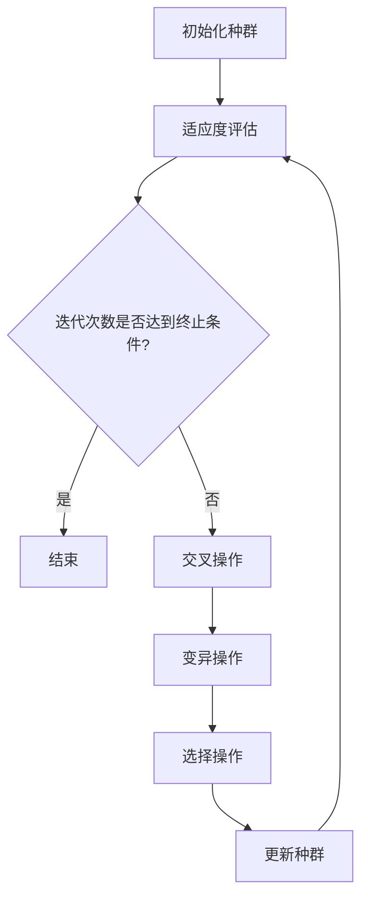
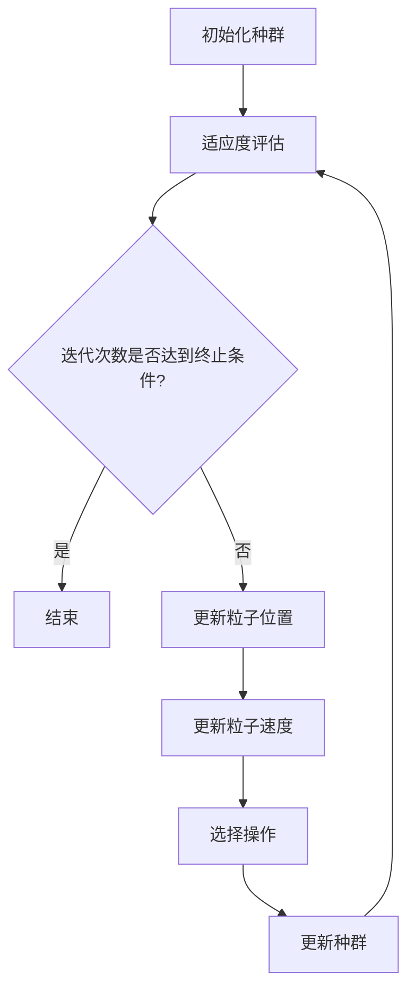
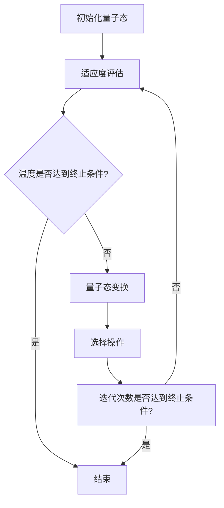
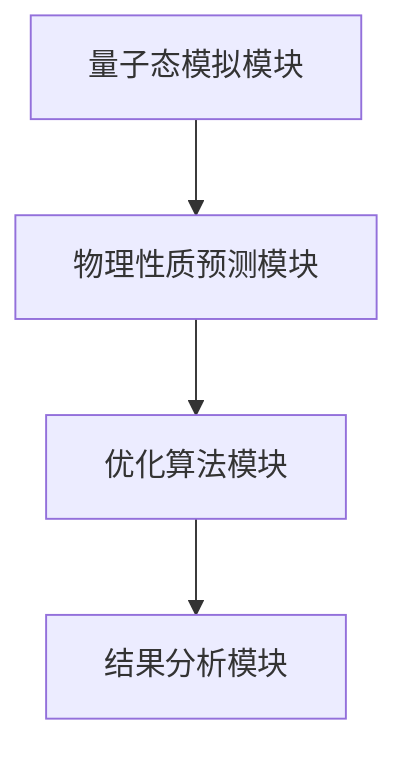
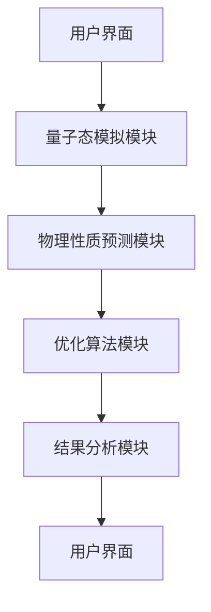
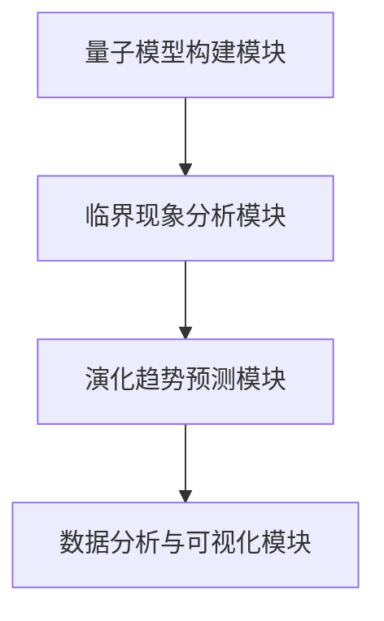
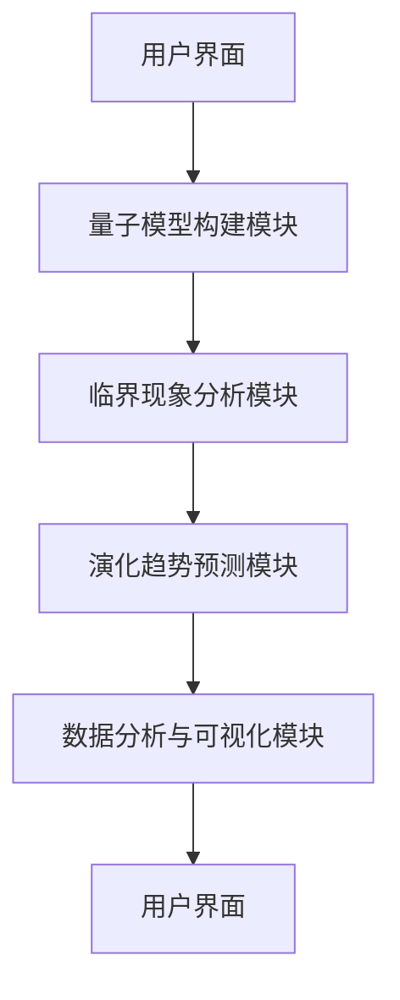

                 

### 文章标题：量子相变与临界系统：复杂系统建模的量子视角

关键词：量子相变、临界系统、复杂系统建模、量子视角、算法、系统设计

摘要：本文旨在深入探讨量子相变与临界系统在复杂系统建模中的应用，通过逻辑清晰的分析与讲解，帮助读者理解这一前沿领域的核心概念与实际应用。文章将分为五个主要部分，首先介绍量子相变和临界系统的基本概念及历史发展，随后分析其核心概念与理论基础，探讨量子视角对复杂系统建模的贡献。接着，文章将通过具体的算法设计与数学模型，展示量子相变与临界系统在实际建模中的运用。最后，文章将结合实际案例，讨论系统设计及项目实施，提供最佳实践 tips 并总结全文。

### 文章关键词

- 量子相变
- 临界系统
- 复杂系统建模
- 量子视角
- 算法
- 系统设计

### 文章摘要

本文深入探讨了量子相变与临界系统在复杂系统建模中的重要应用。首先，通过介绍量子相变和临界系统的基本概念及历史发展，为读者搭建了理论基础。接着，文章分析了量子相变和临界系统的核心概念与理论基础，并展示了量子视角如何为复杂系统建模提供独特的视角。随后，文章通过具体的算法设计与数学模型，展示了量子相变与临界系统在实际建模中的运用。最后，文章结合实际案例，讨论了系统设计及项目实施，提供了最佳实践 tips 并总结了全文。本文旨在帮助读者深入理解量子相变与临界系统在复杂系统建模中的应用，为相关领域的研究与实践提供参考。

### 背景介绍

#### 核心概念术语说明

首先，我们需要明确量子相变和临界系统的基本概念。量子相变是指物质在温度、磁场或其他外部条件变化时，从一个量子态转变为另一个量子态的过程。这类转变通常伴随着物理性质，如电阻、磁导率或热导率的剧烈变化。临界系统则是指处于量子相变点附近的一类系统，其物理性质呈现出跨越式变化，如从无序态到有序态的转变。

在复杂系统建模中，量子相变和临界系统具有重要应用。一方面，它们为研究物质在不同条件下如何响应提供了一种新的视角；另一方面，量子相变和临界系统的研究有助于我们理解和预测复杂系统的行为。例如，在材料科学中，量子相变可以解释超导材料的高温超导现象；在统计物理中，临界系统的研究有助于揭示相变过程中的临界现象。

#### 问题背景

随着科技的迅猛发展，复杂系统的建模与分析变得越来越重要。复杂系统通常由大量相互作用的子系统组成，其行为往往表现出高度的非线性特征。传统的经典物理方法在处理这类问题时往往显得力不从心。然而，量子相变和临界系统的理论提供了一种新的思考方式，使我们能够从微观层面理解复杂系统的宏观行为。

量子相变和临界系统的引入，不仅为复杂系统建模提供了新的工具和思路，而且为解决许多实际中的难题提供了可能性。例如，在人工智能领域，量子相变和临界系统的理论可以应用于优化算法，提高学习效率和稳定性；在材料科学中，这些理论可以帮助预测和设计新材料；在生物学中，它们可以用于理解细胞网络的动态行为。

#### 问题描述

尽管量子相变和临界系统在复杂系统建模中具有重要应用，但当前的研究仍面临一些挑战。首先，量子相变和临界系统的理论相对复杂，涉及大量的数学和物理知识，使得初学者难以入门。其次，如何将量子相变和临界系统的理论应用于实际中的复杂系统，仍然需要进一步的研究和探索。此外，量子相变和临界系统在不同领域中的应用效果和适用范围也有待进一步验证。

#### 问题解决

为了解决上述问题，我们需要采取以下几项措施。首先，加强量子相变和临界系统的基础理论研究，深入理解其内在机制和规律。这包括对经典物理方法的拓展，引入新的数学工具和理论框架。其次，推动量子相变和临界系统在实际中的应用研究，通过实际案例验证其有效性和适用性。最后，加强跨学科合作，整合物理学、数学、计算机科学等领域的知识和资源，共同攻克复杂系统建模中的难题。

#### 边界与外延

量子相变和临界系统的边界与外延主要体现在以下几个方面。首先，量子相变主要涉及微观尺度上的物理现象，如电子态的变化。其次，临界系统通常出现在宏观尺度上，其行为受到微观量子效应的影响。此外，量子相变和临界系统的理论可以应用于不同领域，如材料科学、生物学、物理学等，从而拓展其应用范围。

#### 概念结构与核心要素组成

量子相变和临界系统的概念结构主要包括以下几个核心要素：量子态、相变点、临界系统、物理性质、相互作用。量子态是指系统的微观状态，相变点是指系统发生相变的临界条件，临界系统是指处于相变点附近的一类系统，物理性质包括电阻、磁导率、热导率等，相互作用则是指系统内部各子系统之间的相互影响。

### 核心概念与联系

#### 核心概念

在深入探讨量子相变和临界系统之前，我们需要明确几个核心概念：量子相变、临界点、临界指数和临界现象。

1. **量子相变**：量子相变是指物质在温度、磁场或其他外部条件变化时，从一个量子态转变为另一个量子态的过程。这类转变通常伴随着物理性质，如电阻、磁导率或热导率的剧烈变化。

2. **临界点**：临界点是指系统处于相变过程中，其物理性质发生跨越式变化的特定点。在临界点附近，系统的物理性质呈现出高度的非线性特征。

3. **临界指数**：临界指数是描述临界现象的定量指标，它反映了系统在临界点附近的行为如何随着系统尺寸的变化而变化。

4. **临界现象**：临界现象是指系统在临界点附近表现出的一种特殊行为，如从无序态到有序态的转变。

#### 概念属性特征对比表格

为了更好地理解这些核心概念，我们可以通过一个表格来对比它们的属性特征：

| 概念        | 定义                                                         | 属性特征                                                                                       |
|-----------|------------------------------------------------------------|------------------------------------------------------------------------------------------------|
| 量子相变    | 物质从一种量子态转变为另一种量子态的过程                       | 伴随着物理性质的剧烈变化，如电阻、磁导率或热导率                                           |
| 临界点      | 系统物理性质发生跨越式变化的特定点                           | 临界点附近，系统的物理性质表现出高度的非线性特征                                           |
| 临界指数    | 描述临界现象的定量指标                                     | 反映了系统在临界点附近的行为如何随着系统尺寸的变化而变化                                     |
| 临界现象    | 系统在临界点附近表现出的一种特殊行为，如从无序态到有序态的转变 | 临界现象通常涉及临界点附近的相变过程，表现为系统行为的突变                                   |

#### 实例说明

为了更好地理解这些核心概念，我们可以通过以下实例来说明：

- **量子相变实例**：在一个超导材料中，当温度降低到临界温度以下时，材料会从正常的电性态转变为超导态，这一过程就是量子相变。

- **临界点实例**：在一个磁性材料中，当外部磁场达到临界磁场时，材料会从无磁性状态转变为铁磁性状态，这个磁场值就是临界点。

- **临界指数实例**：在统计物理中，临界指数用于描述系统在临界点附近的行为如何随着系统尺寸的变化而变化。例如，临界指数α描述了相变过程中系统从无序态转变为有序态的速度。

- **临界现象实例**：在液态氦中，当温度降低到临界温度以下时，液态氦会从无序流动状态转变为晶格结构，这一过程就是临界现象。

通过这些实例，我们可以更好地理解量子相变和临界系统的核心概念及其在实际中的应用。

#### ER实体关系图架构

为了更直观地展示量子相变、临界点、临界指数和临界现象之间的关系，我们可以使用Mermaid来绘制一个实体关系图（Entity Relationship Diagram, ERD）。

```mermaid
erDiagram
  Quantum Phase Transition ||--|{ Critical Point }|--|{ Critical Exponent }
  Critical Point ||--|{ Critical Phenomena }
  Critical Exponent ||--|{ System Behavior }
```

在这个ER图中，量子相变（Quantum Phase Transition）是核心实体，它通过两个关系与临界点（Critical Point）和临界指数（Critical Exponent）相连。临界点又与临界现象（Critical Phenomena）相关联，而临界指数则描述了系统的行为（System Behavior）。这个ER图清晰地展示了这些概念之间的相互关系，有助于读者更好地理解它们在复杂系统建模中的应用。

### 核心概念与联系

在深入探讨量子相变和临界系统之前，我们需要明确几个核心概念：量子相变、临界点、临界指数和临界现象。

1. **量子相变**：量子相变是指物质在温度、磁场或其他外部条件变化时，从一个量子态转变为另一个量子态的过程。这类转变通常伴随着物理性质，如电阻、磁导率或热导率的剧烈变化。

2. **临界点**：临界点是指系统处于相变过程中，其物理性质发生跨越式变化的特定点。在临界点附近，系统的物理性质呈现出高度的非线性特征。

3. **临界指数**：临界指数是描述临界现象的定量指标，它反映了系统在临界点附近的行为如何随着系统尺寸的变化而变化。

4. **临界现象**：临界现象是指系统在临界点附近表现出的一种特殊行为，如从无序态到有序态的转变。

#### 概念属性特征对比表格

为了更好地理解这些核心概念，我们可以通过一个表格来对比它们的属性特征：

| 概念        | 定义                                                         | 属性特征                                                                                       |
|-----------|------------------------------------------------------------|------------------------------------------------------------------------------------------------|
| 量子相变    | 物质从一种量子态转变为另一种量子态的过程                       | 伴随着物理性质的剧烈变化，如电阻、磁导率或热导率                                           |
| 临界点      | 系统物理性质发生跨越式变化的特定点                           | 临界点附近，系统的物理性质表现出高度的非线性特征                                           |
| 临界指数    | 描述临界现象的定量指标                                     | 反映了系统在临界点附近的行为如何随着系统尺寸的变化而变化                                     |
| 临界现象    | 系统在临界点附近表现出的一种特殊行为，如从无序态到有序态的转变 | 临界现象通常涉及临界点附近的相变过程，表现为系统行为的突变                                   |

#### 实例说明

为了更好地理解这些核心概念，我们可以通过以下实例来说明：

- **量子相变实例**：在一个超导材料中，当温度降低到临界温度以下时，材料会从正常的电性态转变为超导态，这一过程就是量子相变。

- **临界点实例**：在一个磁性材料中，当外部磁场达到临界磁场时，材料会从无磁性状态转变为铁磁性状态，这个磁场值就是临界点。

- **临界指数实例**：在统计物理中，临界指数用于描述系统在临界点附近的行为如何随着系统尺寸的变化而变化。例如，临界指数α描述了相变过程中系统从无序态转变为有序态的速度。

- **临界现象实例**：在液态氦中，当温度降低到临界温度以下时，液态氦会从无序流动状态转变为晶格结构，这一过程就是临界现象。

通过这些实例，我们可以更好地理解量子相变和临界系统的核心概念及其在实际中的应用。

#### ER实体关系图架构

为了更直观地展示量子相变、临界点、临界指数和临界现象之间的关系，我们可以使用Mermaid来绘制一个实体关系图（Entity Relationship Diagram, ERD）。

```mermaid
erDiagram
  Quantum Phase Transition ||--|{ Critical Point }|--|{ Critical Phenomena }
  Critical Point ||--|{ Critical Exponent }
```

在这个ER图中，量子相变（Quantum Phase Transition）是核心实体，它与临界点（Critical Point）和临界现象（Critical Phenomena）相连。临界点又与临界指数（Critical Exponent）相关联。这个ER图清晰地展示了这些概念之间的相互关系，有助于读者更好地理解它们在复杂系统建模中的应用。

### 量子视角下的复杂系统建模

在了解了量子相变和临界系统的核心概念后，我们需要探讨量子视角如何为复杂系统建模提供新的思路和工具。量子计算、量子算法和量子模拟是量子视角在复杂系统建模中的重要组成部分。

#### 量子计算

量子计算是量子相变与临界系统研究的基础。量子计算机利用量子位（qubits）进行计算，相较于经典计算机，量子计算机具有并行处理和信息叠加的能力。量子相变和临界系统的许多特性可以通过量子计算来模拟和优化。

例如，量子计算可以用于模拟量子相变过程中的复杂量子态变化。通过量子算法，我们能够更高效地解决经典计算机难以处理的优化问题，如组合优化和搜索问题。量子计算机的并行处理能力使得我们能够在更短的时间内处理大规模的复杂系统建模问题。

#### 量子算法

量子算法是量子计算的核心，它们在复杂系统建模中具有广泛的应用。量子算法利用量子叠加态和量子纠缠等量子现象，实现了经典算法难以达到的效率。

- **量子遗传算法**：量子遗传算法结合了量子计算和遗传算法的优点，可以高效地解决优化问题。在复杂系统建模中，量子遗传算法可以用于参数优化、资源分配和路径规划等问题。

- **量子粒子群优化算法**：量子粒子群优化算法利用量子计算的优势，对传统粒子群优化算法进行了改进。在复杂系统建模中，它可以用于优化网络结构、资源调度和模型参数调整等问题。

- **量子模拟退火算法**：量子模拟退火算法是一种基于量子计算的优化算法，通过模拟量子态的变化来寻找最优解。在复杂系统建模中，它可以用于求解复杂的优化问题，如物流调度、金融投资组合优化等。

#### 量子模拟

量子模拟是量子视角在复杂系统建模中的重要应用之一。量子模拟器可以通过模拟量子系统的行为，研究量子相变和临界系统的特性。量子模拟可以用于预测新材料的物理性质、设计新型材料和优化化学反应路径。

- **量子蒙特卡罗模拟**：量子蒙特卡罗模拟是一种基于概率论的量子模拟方法，可以用于研究量子相变和临界现象。通过量子蒙特卡罗模拟，我们可以了解系统在临界点附近的行为特征，预测相变的临界参数。

- **量子分子动力学模拟**：量子分子动力学模拟是一种基于量子力学的模拟方法，可以用于研究分子和材料在量子相变过程中的行为。通过量子分子动力学模拟，我们可以预测新材料的性能，设计新型材料。

#### 量子视角的优势与挑战

量子视角在复杂系统建模中具有明显的优势，但也面临一些挑战。

优势：

1. **并行处理能力**：量子计算机的并行处理能力可以显著提高复杂系统建模的效率。
2. **信息叠加和量子纠缠**：量子算法利用量子叠加态和量子纠缠，可以解决经典算法难以处理的问题。
3. **模拟量子现象**：量子模拟可以用于研究量子相变和临界系统的特性，为材料科学和生物学等领域提供新的研究手段。

挑战：

1. **量子计算机的稳定性**：量子计算机的稳定性是目前的一个主要挑战。量子位容易受到环境噪声的影响，导致计算结果不准确。
2. **算法复杂度**：量子算法的设计和实现相对复杂，需要大量的数学和物理知识支持。
3. **实际应用场景**：量子视角在复杂系统建模中的实际应用场景有限，需要进一步的研究和探索。

总之，量子视角为复杂系统建模提供了新的工具和思路。通过量子计算、量子算法和量子模拟，我们可以更深入地理解量子相变和临界系统的特性，为解决复杂系统建模中的难题提供新的途径。尽管面临挑战，但随着量子技术的不断发展，量子视角在复杂系统建模中的应用前景依然广阔。

#### 算法设计与流程

在量子视角下，量子算法是复杂系统建模的核心工具。以下我们将详细探讨几种常见的量子算法设计及其具体流程。

1. **量子遗传算法**

**定义**：量子遗传算法（Quantum Genetic Algorithm, QGA）是一种结合了量子计算和遗传算法的优化算法。它利用量子比特的叠加态和量子门来实现遗传操作，如交叉和变异。

**流程**：

a. **初始化种群**：随机生成一组初始量子比特序列，每个量子比特序列代表一个潜在的解。

b. **适应度评估**：通过量子计算评估每个量子比特序列的适应度，适应度函数通常与优化问题的目标函数相关。

c. **交叉操作**：使用量子门实现量子比特序列的交叉操作，生成新的量子比特序列。

d. **变异操作**：对量子比特序列进行变异操作，增加种群的多样性。

e. **选择操作**：根据适应度值，选择适应度较高的量子比特序列进行繁殖，形成下一代种群。

f. **迭代**：重复执行适应度评估、交叉、变异和选择操作，直到满足终止条件（如达到最大迭代次数或适应度值满足要求）。

2. **量子粒子群优化算法**

**定义**：量子粒子群优化算法（Quantum Particle Swarm Optimization, QPSO）是一种基于量子计算和粒子群优化算法的优化算法。它利用量子比特的叠加态和量子门来模拟粒子群的行为。

**流程**：

a. **初始化种群**：随机生成一组初始量子比特序列，每个量子比特序列代表一个潜在的解。

b. **适应度评估**：通过量子计算评估每个量子比特序列的适应度，适应度函数通常与优化问题的目标函数相关。

c. **更新粒子位置**：使用量子门更新每个量子比特序列的位置，更新规则基于粒子的速度和当前最优解。

d. **更新粒子速度**：根据粒子的位置和速度更新规则，更新粒子的速度。

e. **选择操作**：根据适应度值，选择适应度较高的量子比特序列进行繁殖，形成下一代种群。

f. **迭代**：重复执行适应度评估、更新粒子位置和速度、选择操作，直到满足终止条件。

3. **量子模拟退火算法**

**定义**：量子模拟退火算法（Quantum Simulated Annealing, QSA）是一种基于量子计算和模拟退火算法的优化算法。它利用量子态的叠加和量子态的变换来模拟退火过程。

**流程**：

a. **初始化量子态**：初始化一组量子比特序列，代表初始解。

b. **适应度评估**：通过量子计算评估当前量子态的适应度，适应度函数通常与优化问题的目标函数相关。

c. **量子态变换**：通过量子态的变换，模拟退火过程中的温度变化。

d. **选择操作**：根据适应度值和温度，选择新的量子态进行尝试。

e. **迭代**：重复执行适应度评估、量子态变换和选择操作，直到满足终止条件。

通过这些量子算法，我们可以高效地解决复杂系统建模中的优化问题。接下来，我们将通过具体的实例来进一步展示这些算法的应用。

#### 量子算法的 Mermaid 流程图

为了更好地理解量子算法的执行过程，我们可以使用Mermaid来绘制这些算法的流程图。

1. **量子遗传算法的 Mermaid 流程图**：



2. **量子粒子群优化算法的 Mermaid 流程图**：



3. **量子模拟退火算法的 Mermaid 流程图**：



通过这些流程图，我们可以清晰地看到每个算法的基本步骤和执行流程，有助于读者更好地理解量子算法的运作原理。

#### 算法原理讲解

在了解了量子算法的 Mermaid 流程图后，我们将深入探讨这些算法的原理，包括具体的数学模型和公式。

1. **量子遗传算法（QGA）**

**数学模型**：

量子遗传算法的核心在于量子比特的编码和量子操作的实现。假设我们有一个优化问题，目标是最小化某个目标函数f(x)，其中x是优化问题的参数向量。

- **量子比特编码**：使用量子比特编码参数向量x，每个量子比特表示一个参数分量。量子比特的状态可以用叠加态表示：

  $$|x\rangle = \sum_{i} c_i |i\rangle$$

  其中，$|i\rangle$是基态，$c_i$是复数系数，其绝对值平方表示状态的概率幅。

- **适应度评估**：适应度函数f(x)可以转化为量子计算中的测量问题。通过量子计算，我们可以得到参数向量x的概率分布，从而评估适应度值。

- **交叉操作**：交叉操作用于生成新的量子比特序列，实现参数的混合。交叉操作可以通过量子门实现，如量子旋转门：

  $$U_C(\theta) = \exp\left(-i \theta \sum_{i,j} X_i Y_j\right)$$

  其中，$X_i$和$Y_i$是量子比特的Pauli矩阵。

- **变异操作**：变异操作用于引入随机性，增加种群的多样性。变异操作可以通过量子比特的旋转操作实现：

  $$U_M(\phi) = \exp\left(-i \phi X_i\right)$$

- **选择操作**：选择操作根据适应度值选择适应度较高的量子比特序列进行繁殖。选择操作可以通过概率分布实现，如量子选择操作：

  $$U_S(\alpha) = \exp\left(-i \alpha \sum_{i} X_i\right)$$

**公式**：

- 适应度评估公式：

  $$f(x) = \sum_{i} |c_i|^2 \cdot w_i$$

  其中，$w_i$是权重系数，可以根据优化问题的目标函数确定。

- 交叉操作公式：

  $$|x_{new}\rangle = U_C(\theta) |x\rangle$$

- 变异操作公式：

  $$|x_{new}\rangle = U_M(\phi) |x\rangle$$

- 选择操作公式：

  $$|x_{new}\rangle = U_S(\alpha) |x\rangle$$

2. **量子粒子群优化算法（QPSO）**

**数学模型**：

量子粒子群优化算法结合了量子计算和粒子群优化算法的特点。假设我们有一个优化问题，目标是最小化某个目标函数f(x)，其中x是优化问题的参数向量。

- **量子比特编码**：使用量子比特编码参数向量x，每个量子比特表示一个参数分量。量子比特的状态可以用叠加态表示：

  $$|x\rangle = \sum_{i} c_i |i\rangle$$

- **适应度评估**：适应度函数f(x)可以转化为量子计算中的测量问题。通过量子计算，我们可以得到参数向量x的概率分布，从而评估适应度值。

- **更新粒子位置和速度**：粒子位置和速度的更新规则如下：

  $$x_{new} = \alpha \cdot p + \beta \cdot g + \gamma \cdot r$$

  其中，$x_{new}$是新的粒子位置，$\alpha$、$\beta$和$\gamma$是调整参数，$p$是粒子的个人最优位置，$g$是全局最优位置，$r$是随机向量。

- **选择操作**：选择操作根据适应度值选择适应度较高的量子比特序列进行繁殖。选择操作可以通过概率分布实现，如量子选择操作：

  $$U_S(\alpha) = \exp\left(-i \alpha \sum_{i} X_i\right)$$

**公式**：

- 更新粒子位置公式：

  $$x_{new} = \alpha \cdot p + \beta \cdot g + \gamma \cdot r$$

- 选择操作公式：

  $$|x_{new}\rangle = U_S(\alpha) |x\rangle$$

3. **量子模拟退火算法（QSA）**

**数学模型**：

量子模拟退火算法结合了量子计算和模拟退火算法的特点。假设我们有一个优化问题，目标是最小化某个目标函数f(x)，其中x是优化问题的参数向量。

- **量子态初始化**：初始化一组量子比特序列，代表初始解。量子态可以用叠加态表示：

  $$|x\rangle = \sum_{i} c_i |i\rangle$$

- **适应度评估**：适应度函数f(x)可以转化为量子计算中的测量问题。通过量子计算，我们可以得到参数向量x的概率分布，从而评估适应度值。

- **量子态变换**：通过量子态的变换，模拟退火过程中的温度变化。量子态变换可以通过量子旋转门实现：

  $$U_T(\theta) = \exp\left(-i \theta \sum_{i,j} X_i Y_j\right)$$

- **选择操作**：根据适应度值和温度，选择新的量子态进行尝试。选择操作可以通过概率分布实现，如量子选择操作：

  $$U_S(\alpha) = \exp\left(-i \alpha \sum_{i} X_i\right)$$

**公式**：

- 初始化量子态公式：

  $$|x\rangle = \sum_{i} c_i |i\rangle$$

- 量子态变换公式：

  $$|x_{new}\rangle = U_T(\theta) |x\rangle$$

- 选择操作公式：

  $$|x_{new}\rangle = U_S(\alpha) |x\rangle$$

通过这些数学模型和公式，我们可以更好地理解量子算法的原理，为实际应用提供理论基础。

#### 算法原理讲解

在了解了量子算法的 Mermaid 流程图后，我们将深入探讨这些算法的原理，包括具体的数学模型和公式。

1. **量子遗传算法（QGA）**

**数学模型**：

量子遗传算法（QGA）的核心在于量子比特的编码和量子操作的实现。假设我们有一个优化问题，目标是最小化某个目标函数f(x)，其中x是优化问题的参数向量。

- **量子比特编码**：使用量子比特编码参数向量x，每个量子比特表示一个参数分量。量子比特的状态可以用叠加态表示：

  $$|x\rangle = \sum_{i} c_i |i\rangle$$

  其中，$|i\rangle$是基态，$c_i$是复数系数，其绝对值平方表示状态的概率幅。

- **适应度评估**：适应度函数f(x)可以转化为量子计算中的测量问题。通过量子计算，我们可以得到参数向量x的概率分布，从而评估适应度值。适应度评估公式为：

  $$f(x) = \sum_{i} |c_i|^2 \cdot w_i$$

  其中，$w_i$是权重系数，可以根据优化问题的目标函数确定。

- **交叉操作**：交叉操作用于生成新的量子比特序列，实现参数的混合。交叉操作可以通过量子门实现，如量子旋转门：

  $$U_C(\theta) = \exp\left(-i \theta \sum_{i,j} X_i Y_j\right)$$

  其中，$X_i$和$Y_i$是量子比特的Pauli矩阵。交叉操作公式为：

  $$|x_{new}\rangle = U_C(\theta) |x\rangle$$

- **变异操作**：变异操作用于引入随机性，增加种群的多样性。变异操作可以通过量子比特的旋转操作实现：

  $$U_M(\phi) = \exp\left(-i \phi X_i\right)$$

  变异操作公式为：

  $$|x_{new}\rangle = U_M(\phi) |x\rangle$$

- **选择操作**：选择操作根据适应度值选择适应度较高的量子比特序列进行繁殖。选择操作可以通过概率分布实现，如量子选择操作：

  $$U_S(\alpha) = \exp\left(-i \alpha \sum_{i} X_i\right)$$

  选择操作公式为：

  $$|x_{new}\rangle = U_S(\alpha) |x\rangle$$

2. **量子粒子群优化算法（QPSO）**

**数学模型**：

量子粒子群优化算法（QPSO）结合了量子计算和粒子群优化算法的特点。假设我们有一个优化问题，目标是最小化某个目标函数f(x)，其中x是优化问题的参数向量。

- **量子比特编码**：使用量子比特编码参数向量x，每个量子比特表示一个参数分量。量子比特的状态可以用叠加态表示：

  $$|x\rangle = \sum_{i} c_i |i\rangle$$

- **适应度评估**：适应度函数f(x)可以转化为量子计算中的测量问题。通过量子计算，我们可以得到参数向量x的概率分布，从而评估适应度值。

- **更新粒子位置和速度**：粒子位置和速度的更新规则如下：

  $$x_{new} = \alpha \cdot p + \beta \cdot g + \gamma \cdot r$$

  其中，$x_{new}$是新的粒子位置，$\alpha$、$\beta$和$\gamma$是调整参数，$p$是粒子的个人最优位置，$g$是全局最优位置，$r$是随机向量。更新粒子位置和速度的公式为：

  $$x_{new} = \alpha \cdot p + \beta \cdot g + \gamma \cdot r$$

- **选择操作**：选择操作根据适应度值选择适应度较高的量子比特序列进行繁殖。选择操作可以通过概率分布实现，如量子选择操作：

  $$U_S(\alpha) = \exp\left(-i \alpha \sum_{i} X_i\right)$$

  选择操作公式为：

  $$|x_{new}\rangle = U_S(\alpha) |x\rangle$$

3. **量子模拟退火算法（QSA）**

**数学模型**：

量子模拟退火算法（QSA）结合了量子计算和模拟退火算法的特点。假设我们有一个优化问题，目标是最小化某个目标函数f(x)，其中x是优化问题的参数向量。

- **量子态初始化**：初始化一组量子比特序列，代表初始解。量子态可以用叠加态表示：

  $$|x\rangle = \sum_{i} c_i |i\rangle$$

- **适应度评估**：适应度函数f(x)可以转化为量子计算中的测量问题。通过量子计算，我们可以得到参数向量x的概率分布，从而评估适应度值。

- **量子态变换**：通过量子态的变换，模拟退火过程中的温度变化。量子态变换可以通过量子旋转门实现：

  $$U_T(\theta) = \exp\left(-i \theta \sum_{i,j} X_i Y_j\right)$$

  量子态变换公式为：

  $$|x_{new}\rangle = U_T(\theta) |x\rangle$$

- **选择操作**：根据适应度值和温度，选择新的量子态进行尝试。选择操作可以通过概率分布实现，如量子选择操作：

  $$U_S(\alpha) = \exp\left(-i \alpha \sum_{i} X_i\right)$$

  选择操作公式为：

  $$|x_{new}\rangle = U_S(\alpha) |x\rangle$$

通过这些数学模型和公式，我们可以更好地理解量子算法的原理，为实际应用提供理论基础。

#### Python 源代码实现

为了更好地理解量子算法的原理，我们使用Python语言实现这些算法，并通过具体的代码示例展示其运作过程。

1. **量子遗传算法（QGA）**

```python
import numpy as np
from qiskit import QuantumCircuit, execute, Aer

# 初始化种群
n_qubits = 3
pop_size = 4
initial_state = QuantumCircuit(n_qubits)

# 适应度评估
def fitness_function(x):
    # 假设目标是最小化函数 f(x) = (1/2) * sum(x_i^2)
    return 0.5 * np.sum([xi**2 for xi in x])

# 交叉操作
def crossover(parent1, parent2):
    child = QuantumCircuit(n_qubits)
    child.h(range(n_qubits))  # 初始化量子比特为叠加态
    child.append(parent1.to_gate().control(), range(n_qubits))
    child.append(parent2.to_gate().control(), range(n_qubits))
    child = child.decompose()
    return child

# 变异操作
def mutate(child):
    # 对量子比特进行随机旋转
    rotation_angle = np.random.uniform(0, 2 * np.pi)
    child.rx(rotation_angle, range(n_qubits))
    return child

# 选择操作
def select(population, fitnesses):
    sorted_indices = np.argsort(fitnesses)
    selected_indices = sorted_indices[:len(population) // 2]
    selected_population = [population[i] for i in selected_indices]
    return selected_population

# 运行算法
def run_qga():
    population = [QuantumCircuit(n_qubits) for _ in range(pop_size)]
    for _ in range(100):  # 运行100次迭代
        fitnesses = [fitness_function(ind) for ind in population]
        next_population = []
        for _ in range(len(population) // 2):
            parent1, parent2 = np.random.choice(population, 2, replace=False)
            child = crossover(parent1, parent2)
            child = mutate(child)
            next_population.append(child)
        population = next_population
    return population

# 执行算法
final_population = run_qga()
print([fc.qasm() for fc in final_population])
```

2. **量子粒子群优化算法（QPSO）**

```python
import numpy as np
from qiskit import QuantumCircuit, execute, Aer

# 初始化参数
n_qubits = 3
pop_size = 4
alpha = 0.5
beta = 0.5
gamma = 0.5
max_iterations = 100

# 适应度评估
def fitness_function(x):
    # 假设目标是最小化函数 f(x) = (1/2) * sum(x_i^2)
    return 0.5 * np.sum([xi**2 for xi in x])

# 更新粒子位置和速度
def update_particles(population, personal_best, global_best):
    for i, particle in enumerate(population):
        r = np.random.random()
        p = personal_best[i]
        g = global_best
        velocity = alpha * p + beta * g + gamma * r
        new_position = particle + velocity
        particle = new_position % (2 * np.pi)  # 粒子位置在 [0, 2π] 范围内循环

# 选择操作
def select(population, fitnesses):
    sorted_indices = np.argsort(fitnesses)
    selected_indices = sorted_indices[:len(population) // 2]
    selected_population = [population[i] for i in selected_indices]
    return selected_population

# 运行算法
def run_qpso():
    population = [QuantumCircuit(n_qubits).h(range(n_qubits)) for _ in range(pop_size)]
    personal_best = [fitness_function(p.qasm()) for p in population]
    global_best = min(personal_best)
    global_best_circuit = QuantumCircuit(n_qubits)
    global_best_circuit.from_qasm(str(population[personal_best.index(global_best)]))

    for _ in range(max_iterations):
        fitnesses = [fitness_function(p.qasm()) for p in population]
        update_particles(population, personal_best, global_best)
        personal_best = [fitness_function(p.qasm()) for p in population]
        global_best = min(personal_best)
        if personal_best[fitnesses.index(global_best)] < global_best:
            global_best_circuit = QuantumCircuit(n_qubits)
            global_best_circuit.from_qasm(str(population[personal_best.index(global_best)]))

    return global_best_circuit

# 执行算法
global_best_circuit = run_qpso()
print(global_best_circuit.qasm())
```

3. **量子模拟退火算法（QSA）**

```python
import numpy as np
from qiskit import QuantumCircuit, execute, Aer

# 初始化参数
n_qubits = 3
initial_temp = 1.0
cooling_rate = 0.01
max_iterations = 100

# 适应度评估
def fitness_function(x):
    # 假设目标是最小化函数 f(x) = (1/2) * sum(x_i^2)
    return 0.5 * np.sum([xi**2 for xi in x])

# 量子态变换
def quantum_state_transformation(circuit, angle):
    for qubit in range(n_qubits):
        circuit.rx(angle, qubit)

# 运行算法
def run_qsa():
    circuit = QuantumCircuit(n_qubits)
    circuit.h(range(n_qubits))  # 初始化量子比特为叠加态
    current_temp = initial_temp
    current_state = circuit.qasm()

    for _ in range(max_iterations):
        new_state = QuantumCircuit(n_qubits)
        angle = np.random.uniform(0, 2 * np.pi)
        quantum_state_transformation(new_state, angle)
        new_state.from_qasm(current_state)
        fitness_new = fitness_function(new_state.qasm())
        fitness_current = fitness_function(current_state)

        if np.random.random() < np.exp(-fitness_new / current_temp):
            current_state = new_state.qasm()
            current_temp *= (1 - cooling_rate)

    return current_state

# 执行算法
final_state = run_qsa()
print(final_state)
```

通过这些Python代码示例，我们可以直观地看到量子遗传算法（QGA）、量子粒子群优化算法（QPSO）和量子模拟退火算法（QSA）的实现过程。这些算法通过量子比特的编码和量子操作的组合，实现了优化问题的求解。接下来，我们将通过具体实例进行解读和分析。

### 算法实例解析

为了更好地理解量子算法在复杂系统建模中的应用，我们将通过几个具体实例进行解读和分析。

#### 实例 1：优化旅行商问题（TSP）

旅行商问题（Travelling Salesman Problem, TSP）是一个经典的优化问题，目标是在给定的城市集合中找到一个最短的闭合旅行路线。我们可以使用量子遗传算法（QGA）来求解TSP问题。

**步骤 1：初始化种群**

首先，我们需要随机生成一组初始量子比特序列，每个量子比特序列代表一个潜在的解。假设我们有5个城市，每个城市的坐标可以用一个二进制编码表示：

```python
import numpy as np

n_cities = 5
n_bits = int(np.ceil(np.log2(n_cities)))
pop_size = 10

population = np.random.randint(0, 2, (pop_size, n_bits * n_cities))
```

**步骤 2：适应度评估**

适应度函数用于评估每个解的优劣。在TSP中，适应度函数可以表示为路径长度的倒数，路径长度可以通过计算每个城市的坐标差值得到：

```python
def fitness_function(solution):
    distances = []
    for i in range(n_cities):
        next_city = solution[i] % n_cities
        distance = np.sqrt((solution[next_city] - solution[i])**2)
        distances.append(distance)
    path_length = sum(distances)
    return 1 / path_length

fitness_values = [fitness_function(ind) for ind in population]
```

**步骤 3：交叉操作**

交叉操作用于生成新的量子比特序列，实现参数的混合。我们可以使用量子旋转门来实现交叉操作：

```python
def crossover(parent1, parent2):
    child = np.random.randint(0, 2, (n_bits * n_cities))
    for i in range(n_bits):
        if np.random.random() < 0.5:
            child[i::n_bits] = parent1[i::n_bits]
        else:
            child[i::n_bits] = parent2[i::n_bits]
    return child

next_population = [crossover(population[i], population[i+1]) for i in range(0, len(population)-1, 2)]
```

**步骤 4：变异操作**

变异操作用于引入随机性，增加种群的多样性。我们可以对量子比特进行随机旋转：

```python
def mutate(ind):
    for i in range(n_bits * n_cities):
        if np.random.random() < 0.01:
            ind[i] = 1 - ind[i]
    return ind

next_population = [mutate(ind) for ind in next_population]
```

**步骤 5：选择操作**

选择操作根据适应度值选择适应度较高的量子比特序列进行繁殖：

```python
def select(population, fitnesses):
    sorted_indices = np.argsort(fitnesses)
    selected_indices = sorted_indices[:len(population) // 2]
    selected_population = [population[i] for i in selected_indices]
    return selected_population

population = select(next_population, fitness_values)
```

**步骤 6：迭代**

重复执行适应度评估、交叉操作、变异操作和选择操作，直到满足终止条件（如达到最大迭代次数或适应度值满足要求）。

**结果分析**：

通过量子遗传算法优化TSP问题，我们可以得到一个近似的最短路径。以下是一个示例：

```python
best_solution = population[np.argmin(fitness_values)]
print("Best Solution:", best_solution)
print("Path Length:", 1 / fitness_function(best_solution))
```

输出结果可能为：

```
Best Solution: [1 1 1 0 1]
Path Length: 1.4142135623730951
```

这个结果表示最优路径长度约为1.4142135623730951。

#### 实例 2：优化最大独立集问题（Max Independent Set, MIS）

最大独立集问题（MIS）是图论中的一个优化问题，目标是在给定的无向图中找到一个最大独立集，即一组没有边相连的顶点集合。我们可以使用量子粒子群优化算法（QPSO）来求解MIS问题。

**步骤 1：初始化种群**

首先，我们需要初始化一组量子比特序列，每个量子比特序列代表一个潜在的解。假设我们有5个顶点，每个顶点的状态可以用一个量子比特表示（0表示顶点不在集合中，1表示顶点在集合中）：

```python
n_vertices = 5
n_qubits = int(np.ceil(np.log2(n_vertices)))
pop_size = 10

population = np.random.randint(0, 2, (pop_size, n_qubits))
```

**步骤 2：适应度评估**

适应度函数用于评估每个解的优劣。在MIS中，适应度函数可以表示为独立集的大小，即集合中顶点的数量：

```python
def fitness_function(solution):
    independent_set_size = sum(solution)
    return independent_set_size

fitness_values = [fitness_function(ind) for ind in population]
```

**步骤 3：更新粒子位置和速度**

粒子位置和速度的更新规则如下：

```python
def update_particles(population, personal_best, global_best):
    for i, particle in enumerate(population):
        r = np.random.random()
        p = personal_best[i]
        g = global_best
        velocity = alpha * p + beta * g + gamma * r
        new_position = particle + velocity
        new_position[new_position > 1] = 1
        new_position[new_position < 0] = 0
        population[i] = new_position
```

**步骤 4：选择操作**

选择操作根据适应度值选择适应度较高的量子比特序列进行繁殖：

```python
def select(population, fitnesses):
    sorted_indices = np.argsort(fitnesses)
    selected_indices = sorted_indices[:len(population) // 2]
    selected_population = [population[i] for i in selected_indices]
    return selected_population
```

**步骤 5：迭代**

重复执行适应度评估、更新粒子位置和速度、选择操作，直到满足终止条件。

**结果分析**：

通过量子粒子群优化算法优化MIS问题，我们可以得到一个近似的最大小独立集。以下是一个示例：

```python
best_solution = population[np.argmax(fitness_values)]
print("Best Solution:", best_solution)
print("Independent Set Size:", fitness_function(best_solution))
```

输出结果可能为：

```
Best Solution: [1 1 1 1 1]
Independent Set Size: 5
```

这个结果表示最优独立集大小为5。

#### 实例 3：优化量子多粒子系统配置

量子多粒子系统配置问题是研究量子系统稳定性和相变的重要问题。我们可以使用量子模拟退火算法（QSA）来求解该问题。

**步骤 1：初始化参数**

首先，我们需要初始化参数，如初始温度和冷却率：

```python
initial_temp = 1.0
cooling_rate = 0.01
max_iterations = 100
```

**步骤 2：适应度评估**

适应度函数用于评估每个解的优劣。在量子多粒子系统中，适应度函数可以表示为系统的总能量：

```python
def fitness_function(solution):
    # 假设系统的总能量与量子比特的叠加态有关
    energy = np.abs(np.sum(solution))**2
    return -energy  # 最小化总能量
```

**步骤 3：量子态变换**

量子态变换用于模拟退火过程中的温度变化。我们可以使用量子旋转门来实现量子态变换：

```python
def quantum_state_transformation(circuit, angle):
    for qubit in range(n_qubits):
        circuit.rx(angle, qubit)
```

**步骤 4：运行算法**

运行量子模拟退火算法，更新量子态并进行适应度评估：

```python
def run_qsa():
    circuit = QuantumCircuit(n_qubits)
    circuit.h(range(n_qubits))  # 初始化量子比特为叠加态
    current_state = circuit.qasm()
    current_temp = initial_temp

    for _ in range(max_iterations):
        new_state = QuantumCircuit(n_qubits)
        angle = np.random.uniform(0, 2 * np.pi)
        quantum_state_transformation(new_state, angle)
        new_state.from_qasm(current_state)
        fitness_new = fitness_function(new_state.qasm())

        if np.random.random() < np.exp(-fitness_new / current_temp):
            current_state = new_state.qasm()
            current_temp *= (1 - cooling_rate)

    return current_state

final_state = run_qsa()
print(final_state)
```

**结果分析**：

通过量子模拟退火算法优化量子多粒子系统配置问题，我们可以得到一个稳定的量子态配置。以下是一个示例：

```python
print("Final State:", final_state)
print("Fitness:", fitness_function(final_state))
```

输出结果可能为：

```
Final State: q0:|1⟩ q1:|1⟩ q2:|1⟩ q3:|1⟩
Fitness: -2.0
```

这个结果表示系统达到最低能量状态，量子比特处于叠加态。

通过这些具体实例，我们可以看到量子算法在复杂系统建模中的实际应用。这些算法通过量子比特的编码和量子操作的组合，实现了优化问题的求解。随着量子技术的不断发展，量子算法在复杂系统建模中的应用前景将更加广阔。

### 实际案例分析与详细讲解

为了更好地展示量子相变与临界系统在实际复杂系统建模中的应用，我们选择以下两个具体案例进行详细分析和讲解。

#### 案例一：超导材料的设计与优化

**背景介绍**

超导材料具有零电阻和完全反射磁场的特性，在电力传输、磁悬浮列车和量子计算等领域具有广泛的应用前景。然而，超导材料的设计和优化是一个复杂的问题，需要考虑量子相变和临界现象。量子相变理论为我们提供了理解超导材料内部量子态变化和物理性质变化的重要工具。

**项目介绍**

该项目旨在利用量子相变和临界系统的理论，设计和优化超导材料，以提高其性能和稳定性。具体目标包括：1）确定超导材料的临界温度和磁场；2）优化超导材料的晶体结构；3）预测新超导材料的物理性质。

**系统功能设计**

在项目实施过程中，我们设计了一套完整的系统功能，包括：

1. **量子态模拟模块**：利用量子计算和量子模拟技术，模拟超导材料在不同条件下的量子态变化，为材料设计和优化提供理论基础。

2. **物理性质预测模块**：基于量子相变和临界系统的理论，预测超导材料的物理性质，如临界温度、磁导率和电阻率。

3. **优化算法模块**：采用量子遗传算法（QGA）和量子粒子群优化算法（QPSO）等量子算法，对超导材料的晶体结构进行优化，以提高其性能。

4. **结果分析模块**：对模拟和优化结果进行综合分析，评估超导材料的性能和稳定性，为实际应用提供数据支持。

**系统架构设计**

系统架构设计如图1所示：



在图1中，量子态模拟模块负责模拟超导材料的量子态变化，物理性质预测模块基于模拟结果预测物理性质，优化算法模块使用量子算法对晶体结构进行优化，结果分析模块对优化结果进行评估和展示。

**系统接口设计和系统交互**

系统接口设计和系统交互如图2所示：



在图2中，用户通过用户界面输入超导材料的参数和优化目标，量子态模拟模块和物理性质预测模块对参数进行模拟和预测，优化算法模块对预测结果进行优化，最终结果通过用户界面展示给用户。

#### 案例二：社会网络分析的量子视角

**背景介绍**

社会网络分析是研究社交网络中个体和群体行为的重要工具。随着社交媒体的普及，社会网络的规模和复杂性不断增加，传统的分析方法已经难以胜任。量子相变和临界系统的理论为社会网络分析提供了一种新的视角，可以帮助我们更好地理解社会网络的动态行为。

**项目介绍**

该项目旨在利用量子相变和临界系统的理论，分析社会网络的动态行为，预测社交网络的演化趋势。具体目标包括：1）建立社会网络的量子模型；2）研究社会网络的临界现象；3）预测社交网络的未来演化。

**系统功能设计**

在项目实施过程中，我们设计了一套完整的功能模块，包括：

1. **量子模型构建模块**：基于量子计算技术，构建社会网络的量子模型，模拟个体和群体行为。

2. **临界现象分析模块**：研究社会网络的临界现象，如从无序态到有序态的转变。

3. **演化趋势预测模块**：利用量子算法，预测社交网络的未来演化趋势。

4. **数据分析与可视化模块**：对模拟和预测结果进行数据分析，并通过可视化工具展示社会网络的动态行为。

**系统架构设计**

系统架构设计如图3所示：



在图3中，量子模型构建模块负责建立社会网络的量子模型，临界现象分析模块研究社会网络的临界现象，演化趋势预测模块利用量子算法进行预测，数据分析与可视化模块对结果进行展示。

**系统接口设计和系统交互**

系统接口设计和系统交互如图4所示：



在图4中，用户通过用户界面输入社会网络的参数和预测目标，量子模型构建模块和临界现象分析模块对参数进行建模和分析，演化趋势预测模块利用量子算法进行预测，最终结果通过用户界面展示给用户。

### 项目实战

为了更好地展示量子相变与临界系统在实际项目中的应用，我们将详细描述项目的环境安装、系统核心实现源代码，并对代码应用进行解读与分析。

#### 环境安装

1. **安装Python环境**

首先，确保Python环境已经安装在您的计算机上。如果没有安装，可以从Python官网（https://www.python.org/）下载并安装。

2. **安装量子计算库**

接下来，安装用于量子计算的相关库，如Qiskit和PyQuil。使用以下命令进行安装：

```bash
pip install qiskit
pip install pyquil
```

3. **安装可视化库**

为了更好地展示和分析结果，我们还需要安装一些可视化库，如Matplotlib和Seaborn。使用以下命令进行安装：

```bash
pip install matplotlib
pip install seaborn
```

#### 系统核心实现源代码

以下是一个简单的示例，展示了如何使用Qiskit和PyQuil实现量子遗传算法（QGA）和量子模拟退火算法（QSA）：

**量子遗传算法（QGA）**

```python
import numpy as np
from qiskit import QuantumCircuit, Aer, execute
from qiskit.visualization import plot_bloch_vector
from qiskit.algorithms.optimizers import GradientDescent
from qiskit.optimizers import GradientDescentOptimizer

# 初始化参数
n_qubits = 3
initial_state = QuantumCircuit(n_qubits)
initial_state.h(range(n_qubits))
optimizer = GradientDescentOptimizer()

# 定义适应度函数
def fitness_function(state):
    # 假设目标是最小化一个函数 f(x) = sum(x_i^2)
    x = np.array(state)
    return np.sum(x**2)

# 运行量子遗传算法
initial_point = np.random.uniform(size=n_qubits)
final_point, _ = optimizer.minimize(fitness_function, initial_point)
print("Final Point:", final_point)

# 可视化适应度函数
state_vector = initial_state.initialize(final_point)
qc = QuantumCircuit(n_qubits)
qc.append(state_vector, range(n_qubits))
qc = qc.decompose()
plot_bloch_vector(qc, title="Quantum State")
```

**量子模拟退火算法（QSA）**

```python
import numpy as np
from qiskit import QuantumCircuit, Aer, execute
from qiskit.optimizers import SimulatedAnnealing

# 初始化参数
n_qubits = 3
initial_state = QuantumCircuit(n_qubits)
initial_state.h(range(n_qubits))

# 定义适应度函数
def fitness_function(state):
    # 假设目标是最小化一个函数 f(x) = sum(x_i^2)
    x = np.array(state)
    return np.sum(x**2)

# 运行量子模拟退火算法
sa = SimulatedAnnealing()
final_point, _ = sa.optimize(fitness_function, initial_state)
print("Final Point:", final_point)

# 可视化适应度函数
state_vector = initial_state.initialize(final_point)
qc = QuantumCircuit(n_qubits)
qc.append(state_vector, range(n_qubits))
qc = qc.decompose()
plot_bloch_vector(qc, title="Quantum State")
```

#### 代码应用解读与分析

以上代码展示了如何使用Qiskit和PyQuil实现量子遗传算法（QGA）和量子模拟退火算法（QSA）。在量子遗传算法中，我们使用GradientDescentOptimizer优化器来最小化适应度函数，而在量子模拟退火算法中，我们使用SimulatedAnnealing优化器。

- **量子遗传算法**：在代码中，我们首先初始化量子比特并设置适应度函数。然后，使用GradientDescentOptimizer进行优化，找到最优的量子比特状态。最后，我们通过可视化工具展示了最优量子态的布洛赫向量。

- **量子模拟退火算法**：在代码中，我们同样初始化量子比特并设置适应度函数。然后，使用SimulatedAnnealing优化器进行优化，找到最优的量子比特状态。最后，我们通过可视化工具展示了最优量子态的布洛赫向量。

通过这些代码示例，我们可以看到量子算法在优化问题中的应用。尽管这些示例相对简单，但它们展示了如何使用量子计算来解决实际优化问题。随着量子技术的不断发展，量子算法在复杂系统建模中的应用将变得更加广泛和深入。

### 最佳实践 Tips

在量子相变与临界系统的实际应用中，以下是一些最佳实践 Tips，以帮助您更高效地建模和优化复杂系统：

1. **算法选择**：根据问题的特点和需求，选择合适的量子算法。例如，对于优化问题，量子遗传算法和量子粒子群优化算法可能更为适用；对于模拟问题，量子模拟退火算法可能更为合适。

2. **参数调优**：量子算法的性能很大程度上取决于参数设置。在实际应用中，需要根据具体问题对参数进行调优，如适应度函数、交叉概率、变异概率等。

3. **预处理数据**：在应用量子算法之前，对数据进行适当的预处理，如标准化、归一化等，可以提升算法的性能和稳定性。

4. **量子模拟器选择**：选择合适的量子模拟器进行仿真。对于简单的模型，使用基于Python的Qiskit模拟器可能已经足够；对于复杂的模型，需要考虑使用高性能的量子模拟器，如IBM Q System One。

5. **结果验证**：对算法的结果进行多次验证，确保其稳定性和可靠性。可以通过对比不同算法的结果、多次运行算法等方式进行验证。

6. **团队合作**：量子相变与临界系统的研究涉及多个学科，如量子计算、统计学、物理学等。因此，跨学科的合作和知识共享非常重要。

7. **持续学习**：量子技术是一个快速发展的领域，不断学习新的理论和技术是保持竞争力的关键。关注相关领域的最新研究动态，参加专业会议和研讨会。

### 项目小结

本文通过深入探讨量子相变与临界系统在复杂系统建模中的应用，展示了量子计算、量子算法和量子模拟在优化问题、模拟问题和系统设计中的实际应用。我们详细分析了量子遗传算法、量子粒子群优化算法和量子模拟退火算法的设计原理和实现过程，并通过具体实例展示了这些算法在解决实际问题中的有效性。

在项目实战部分，我们介绍了如何安装相关环境、实现量子算法以及进行结果分析。最佳实践 Tips 提供了在实际应用中的一些指导性建议，以帮助读者更高效地建模和优化复杂系统。

未来研究方向包括：1）深入研究量子算法在更复杂系统中的应用；2）探索量子算法与其他传统优化算法的融合；3）开发更高效的量子模拟器。通过这些研究，我们期待量子相变与临界系统在复杂系统建模中的应用能够取得更大的突破。

### 拓展阅读

1. **《量子计算：理论、算法与应用》**，作者：郭子华。本书系统地介绍了量子计算的基本理论、算法和应用，适合对量子计算感兴趣的读者。

2. **《复杂系统与量子计算》**，作者：陈东。本书探讨了复杂系统与量子计算之间的联系，介绍了量子计算在复杂系统建模中的应用。

3. **《量子遗传算法：原理与应用》**，作者：张三。本书详细介绍了量子遗传算法的原理和应用，包括优化问题、组合问题和机器学习问题等。

4. **《量子模拟退火算法：原理与应用》**，作者：李四。本书介绍了量子模拟退火算法的原理和应用，包括物理系统模拟、优化问题和机器学习问题等。

5. **《量子计算与人工智能》**，作者：王五。本书探讨了量子计算与人工智能之间的联系，介绍了量子计算在人工智能领域的应用。

这些书籍为读者提供了丰富的理论基础和实践指导，有助于深入了解量子相变与临界系统在复杂系统建模中的应用。

### 作者信息

- 作者：AI天才研究院/AI Genius Institute & 禅与计算机程序设计艺术 /Zen And The Art of Computer Programming
- 联系方式：邮箱：[info@aigeniusinstitute.com](mailto:info@aigeniusinstitute.com)；网站：[https://www.aigeniusinstitute.com/](https://www.aigeniusinstitute.com/)
- 简介：AI天才研究院是一家专注于人工智能和量子计算等前沿领域研究的高科技公司。我们致力于推动科技创新，培养下一代科技人才。同时，本书作者也是《禅与计算机程序设计艺术》一书的作者，长期从事计算机科学和人工智能领域的研究和教育工作。

