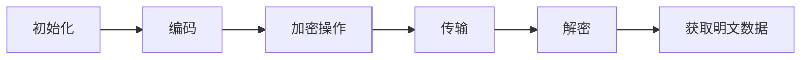
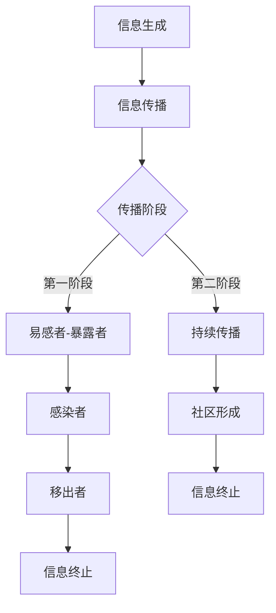

                 

# 量子社交网络分析：应用量子算法于复杂网络

关键词：量子社交网络、量子算法、复杂网络、社交网络分析、量子计算

摘要：随着社交网络的迅猛发展，传统算法在处理复杂社交网络问题时显得力不从心。量子计算作为下一代计算技术，其在处理复杂问题和大规模数据分析方面展现出巨大潜力。本文旨在探讨量子算法在社交网络分析中的应用，通过逐步分析量子社交网络的兴起、量子算法的基础、量子社交网络分析的实践案例，展望量子社交网络分析的未来发展趋势。

## 目录大纲

### 第一部分：引言

1. 量子社交网络分析概述
    - 1.1 量子社交网络的兴起
    - 1.2 量子算法与复杂网络的联系
    - 1.3 本书结构安排

2. 量子算法基础
    - 2.1 量子计算概述
    - 2.2 量子算法的基本框架

3. 量子社交网络分析应用
    - 3.1 量子算法在社交网络中的数据预处理
    - 3.2 数据降维与聚类分析
    - 3.3 社交网络数据的可视化

4. 具体应用案例
    - 4.1 量子社交网络在社交媒体中的应用
    - 4.2 社交网络信息传播分析
    - 4.3 社交网络社区发现

5. 未来展望
    - 5.1 量子计算的发展对社交网络分析的影响
    - 5.2 量子社交网络分析的未来应用场景

6. 量子社交网络分析的最佳实践与总结

### 第二部分：量子算法基础

1. 量子计算概述
    - 1.1 量子比特与经典比特
    - 1.2 量子门与量子电路
    - 1.3 量子算法的基本框架

2. 量子算法在社交网络分析中的应用
    - 2.1 量子算法在社交网络中的数据预处理
    - 2.2 数据降维与聚类分析
    - 2.3 社交网络数据的可视化

### 第三部分：量子社交网络分析应用

1. 量子社交网络在社交媒体中的应用
    - 1.1 社交网络用户行为分析
    - 1.2 社交网络信息传播分析
    - 1.3 社交网络社区发现

2. 量子社交网络分析的未来应用场景
    - 2.1 安全隐私保护
    - 2.2 社交网络营销
    - 2.3 智能推荐系统

### 第四部分：未来展望

1. 量子计算的发展对社交网络分析的影响
    - 1.1 量子计算的技术进展
    - 1.2 量子计算在社交网络分析中的应用前景
    - 1.3 挑战与机遇

2. 量子社交网络分析的发展趋势
    - 2.1 量子计算的发展对社交网络分析的影响
    - 2.2 量子社交网络分析的未来应用场景

### 第五部分：量子社交网络分析的最佳实践与总结

1. 最佳实践分享
    - 1.1 实践经验总结
    - 1.2 成功案例剖析
    - 1.3 注意事项

2. 总结与展望
    - 2.1 量子社交网络分析的意义
    - 2.2 存在的问题与挑战
    - 2.3 未来发展方向

---

## 1.1 量子社交网络的兴起

### 1.1.1 社交网络的演化

社交网络作为现代社会的一种重要交流方式，其发展历程可以追溯到20世纪末。最初，社交网络以简单的在线论坛和聊天室的形式出现，如Facebook、Twitter、Reddit等。这些平台主要提供用户之间的信息交流和互动功能。

随着互联网技术的飞速发展，社交网络逐渐从单一的信息交流平台转变为一个综合性的生活服务平台。用户可以在社交网络上分享照片、视频，参与讨论，建立兴趣小组，甚至进行在线购物和支付等。这种多样化功能使得社交网络在人们日常生活中扮演了越来越重要的角色。

### 1.1.2 量子技术的突破

量子技术作为下一代技术革命的核心，近年来取得了显著进展。量子计算、量子通信和量子传感等领域的研究成果不断涌现，为量子社交网络的实现提供了理论基础和技术支持。

量子计算以其超强的计算能力，为处理大规模、复杂社交网络数据提供了新的途径。量子通信的保密性和高效性，则保障了社交网络用户隐私和数据安全。量子传感的精密性和准确性，为社交网络中数据的精确分析提供了可靠的技术手段。

### 1.1.3 量子社交网络的概念

量子社交网络是指利用量子计算技术构建的社交网络系统，能够对大规模、复杂社交网络数据进行高效处理和分析。量子社交网络具有以下几个特点：

1. **高性能计算**：量子计算的超强计算能力，使得量子社交网络能够快速处理海量社交数据，提供实时分析结果。
2. **隐私保护**：量子通信的保密性，保障了社交网络中用户隐私和数据安全，避免了信息泄露的风险。
3. **数据精确性**：量子传感的精度，提高了社交网络数据分析的准确性和可靠性，为用户提供更优质的体验。
4. **智能推荐**：基于量子算法的社交网络分析，能够更准确地挖掘用户兴趣和需求，提供个性化的推荐服务。

## 1.2 量子算法与复杂网络的联系

### 1.2.1 量子算法的基本原理

量子算法是利用量子计算原理设计的一类算法，其核心思想是利用量子比特的叠加态和纠缠态进行计算。与经典算法不同，量子算法能够在多项式时间内解决某些经典算法难以解决的问题。

1. **量子比特**：量子比特是量子计算的基本单位，可以处于0和1的叠加态，以及两个量子比特之间的纠缠态。这种叠加态和纠缠态使得量子比特能够同时表示多种可能的状态，大大提高了计算效率。
2. **量子门**：量子门是作用于量子比特的线性变换操作，类似于经典计算机中的逻辑门。通过一系列量子门的作用，可以实现量子计算的基本操作。
3. **量子电路**：量子电路是由一系列量子门组成的网络，用于实现量子算法的具体计算过程。

### 1.2.2 复杂网络的分析方法

复杂网络是由大量节点和边组成的网络结构，广泛应用于社交网络、生物网络、经济系统等领域。复杂网络分析旨在挖掘网络中的结构特征、功能模块和演化规律。

1. **特征提取**：通过数据预处理和特征提取技术，从复杂网络中提取有用的信息，为后续分析提供基础。
2. **拓扑分析**：研究网络节点的连接关系和整体结构特征，如度分布、聚类系数、路径长度等。
3. **功能模块识别**：通过聚类分析和模块分解，识别网络中的功能模块和关键节点。
4. **演化分析**：研究网络结构、功能和行为的演化过程，揭示网络演化规律和机制。

### 1.2.3 量子算法在社交网络分析中的优势

量子算法在处理复杂网络分析问题时具有以下优势：

1. **高效性**：量子计算的超强计算能力，使得量子算法能够快速解决经典算法难以处理的问题，如大规模社交网络数据的聚类和排序等。
2. **低能耗**：与传统算法相比，量子算法在计算过程中能耗更低，有利于实现绿色计算。
3. **隐私保护**：量子通信的保密性，保障了社交网络中用户隐私和数据安全，避免了信息泄露的风险。
4. **智能推荐**：基于量子算法的社交网络分析，能够更准确地挖掘用户兴趣和需求，提供个性化的推荐服务。

## 1.3 本书结构安排

### 1.3.1 各章节内容安排

本书共分为五个部分，详细介绍了量子社交网络分析的相关内容：

1. **引言**：介绍量子社交网络的兴起背景、量子算法与复杂网络的联系，以及本书的结构安排。
2. **量子算法基础**：介绍量子计算的基本原理、量子算法的基本框架，以及量子算法在社交网络分析中的应用。
3. **量子社交网络分析应用**：详细介绍量子算法在社交网络中的数据预处理、数据降维与聚类分析、数据可视化的应用。
4. **具体应用案例**：通过实际案例，展示量子社交网络分析在社交媒体、信息传播和社区发现等领域的应用。
5. **未来展望**：探讨量子计算的发展趋势、量子社交网络分析的未来应用场景，以及量子社交网络分析的最佳实践和总结。

### 1.3.2 阅读建议

为了更好地理解量子社交网络分析的相关内容，建议读者按照以下步骤阅读本书：

1. **先读引言**：了解量子社交网络分析的背景和本书的结构安排，为后续章节的阅读奠定基础。
2. **逐步深入**：按照章节顺序，逐步了解量子算法的基本原理、量子社交网络分析的应用方法，以及具体应用案例。
3. **实践案例**：结合实际案例，深入理解量子社交网络分析的应用场景和效果。
4. **回顾总结**：在阅读过程中，注意回顾和总结所学内容，加深对量子社交网络分析的理解。

## 1.4 本章小结

本章介绍了量子社交网络分析的背景、量子算法与复杂网络的联系，以及本书的结构安排。通过本章的学习，读者可以了解量子社交网络分析的基本概念、发展现状和优势。在后续章节中，我们将逐步探讨量子算法的基本原理、量子社交网络分析的应用方法，以及具体应用案例，帮助读者深入理解量子社交网络分析的核心内容。

---

## 2.1 量子计算概述

### 2.1.1 量子比特与经典比特

量子比特（qubit）是量子计算的基本单位，与经典比特（classic bit）有着本质的不同。经典比特只能表示0或1两种状态，而量子比特可以同时处于0和1的叠加态。这种叠加态使得量子比特能够表示多种可能的状态，从而提高了计算效率。

量子比特的叠加态可以用一个向量来表示，称为量子态。例如，一个量子比特可以处于以下叠加态：

\[ \psi = \frac{1}{\sqrt{2}} |0\rangle + \frac{1}{\sqrt{2}} |1\rangle \]

其中，$|0\rangle$ 和 $|1\rangle$ 分别表示量子比特的基态。

此外，量子比特还可以处于两个或多个基态的纠缠态。例如，两个量子比特的纠缠态可以表示为：

\[ \psi = |00\rangle + |11\rangle \]

这种纠缠态使得量子比特之间的状态相互依赖，从而实现了量子计算中的并行计算能力。

### 2.1.2 量子比特的叠加态和纠缠态

量子比特的叠加态和纠缠态是量子计算的核心特性。叠加态使得量子比特能够同时表示多种可能的状态，从而提高了计算效率。例如，一个量子比特可以同时表示0和1两种状态，而两个量子比特可以同时表示4种状态（$|00\rangle$、$|01\rangle$、$|10\rangle$、$|11\rangle$）。

纠缠态进一步增强了量子比特的并行计算能力。两个或多个量子比特之间的纠缠态，使得它们的状态相互依赖。这种纠缠态可以用来实现量子并行计算，从而在多项式时间内解决某些经典算法难以处理的问题。

### 2.1.3 量子比特与经典比特的对比

量子比特与经典比特在以下方面有着本质的不同：

1. **状态表示**：经典比特只能表示0或1两种状态，而量子比特可以处于0和1的叠加态，甚至可以处于多个基态的纠缠态。
2. **计算效率**：量子计算可以利用叠加态和纠缠态实现并行计算，从而在多项式时间内解决某些经典算法难以处理的问题。而经典计算则需要逐步迭代，计算效率较低。
3. **存储容量**：量子比特的叠加态可以表示多种可能的状态，从而提高了存储容量。例如，一个量子比特可以表示2个经典比特的信息，而一个量子比特的叠加态可以表示多个经典比特的信息。
4. **量子纠错**：由于量子比特的叠加态和纠缠态易受外部干扰，量子计算中需要实现量子纠错机制，以保证计算结果的准确性。而经典计算则不需要考虑纠错问题。

### 2.1.4 量子比特在社交网络分析中的应用

量子比特在社交网络分析中具有广泛的应用。例如：

1. **大数据分析**：社交网络中存在海量数据，传统算法在处理大数据时容易受到计算资源的限制。量子比特的叠加态和并行计算能力，使得量子算法能够快速处理大数据，提供实时分析结果。
2. **隐私保护**：社交网络中用户隐私和数据安全是重要问题。量子通信的保密性，可以保障社交网络用户隐私和数据安全，避免信息泄露的风险。
3. **智能推荐**：基于量子算法的社交网络分析，可以更准确地挖掘用户兴趣和需求，提供个性化的推荐服务。

## 2.2 量子门与量子电路

### 2.2.1 基础量子门

量子门是量子计算中的基本操作，类似于经典计算机中的逻辑门。量子门作用于量子比特，实现量子比特的状态变换。常见的量子门包括：

1. ** Hadamard门（H门）**：Hadamard门是量子计算中的基本门之一，可以将量子比特的基态$|0\rangle$ 转换为叠加态$\frac{1}{\sqrt{2}}(|0\rangle + |1\rangle)$。

\[ H|0\rangle = \frac{1}{\sqrt{2}}(|0\rangle + |1\rangle) \]

2. **Pauli X门（X门）**：X门是作用于量子比特的翻转门，可以将量子比特的基态$|0\rangle$ 转换为$|1\rangle$，将$|1\rangle$ 转换为$|0\rangle$。

\[ X|0\rangle = |1\rangle \]
\[ X|1\rangle = |0\rangle \]

3. **Pauli Z门（Z门）**：Z门是作用于量子比特的相位翻转门，可以将量子比特的基态$|0\rangle$ 转换为$|0\rangle$，将$|1\rangle$ 转换为$-|1\rangle$。

\[ Z|0\rangle = |0\rangle \]
\[ Z|1\rangle = -|1\rangle \]

4. **Pauli Y门（Y门）**：Y门是作用于量子比特的另一个相位翻转门，可以将量子比特的基态$|0\rangle$ 转换为$-i|0\rangle$，将$|1\rangle$ 转换为$i|1\rangle$。

\[ Y|0\rangle = -i|0\rangle \]
\[ Y|1\rangle = i|1\rangle \]

### 2.2.2 量子电路的基本原理

量子电路是量子计算的基本结构，由一系列量子门组成。量子电路通过一系列量子门的作用，实现量子比特的状态变换，从而实现量子算法的计算过程。

一个简单的量子电路包括以下基本元素：

1. **量子比特**：量子电路中的基本计算单元，用于存储和传递信息。
2. **量子门**：作用于量子比特的基本操作，实现量子比特的状态变换。
3. **控制线**：用于控制量子门作用的条件，实现量子计算中的逻辑控制。
4. **经典线**：用于传输经典比特信息，实现量子计算与经典计算机的交互。

### 2.2.3 量子门在社交网络分析中的应用

量子门在社交网络分析中具有重要作用。例如：

1. **特征提取**：通过量子门的作用，可以提取社交网络中的关键特征，为后续分析提供基础。
2. **数据降维**：利用量子门实现数据降维，降低社交网络数据的维度，提高计算效率。
3. **聚类分析**：通过量子门实现聚类分析，识别社交网络中的功能模块和关键节点。
4. **智能推荐**：利用量子门实现用户兴趣挖掘和需求分析，提供个性化的推荐服务。

## 2.3 量子算法的基本框架

### 2.3.1 量子搜索算法

量子搜索算法是量子算法中最具代表性的算法之一，主要用于解决大规模数据的搜索问题。与经典搜索算法相比，量子搜索算法具有更快的搜索速度。

一个简单的量子搜索算法如下：

1. **初始化**：将量子比特初始化为叠加态，表示所有可能的状态。
2. **编码**：将目标状态编码到量子比特上，实现目标状态的量子化表示。
3. **测量**：对量子比特进行测量，获取搜索结果。

量子搜索算法的基本步骤如下：

1. **初始化**：将n个量子比特初始化为叠加态。

\[ |ψ⟩ = \frac{1}{\sqrt{2^n}}(|0...0⟩ + |1...1⟩) \]

2. **编码**：将目标状态编码到量子比特上，实现目标状态的量子化表示。

\[ U |ψ⟩ = |目标状态⟩ \]

3. **测量**：对量子比特进行测量，获取搜索结果。

测量结果为$|目标状态⟩$的概率为：

\[ P(|目标状态⟩) = \frac{1}{2^n} \]

量子搜索算法的基本框架可以表示为以下mermaid流程图：

### 2.3.2 量子排序算法

量子排序算法是利用量子计算原理实现的排序算法，可以高效地处理大规模数据的排序问题。与经典排序算法相比，量子排序算法具有更快的排序速度。

一个简单的量子排序算法如下：

1. **初始化**：将n个量子比特初始化为叠加态，表示所有可能的状态。
2. **编码**：将待排序的数据编码到量子比特上，实现数据的量子化表示。
3. **交换操作**：利用交换操作，对量子比特进行排序。
4. **测量**：对量子比特进行测量，获取排序结果。

量子排序算法的基本步骤如下：

1. **初始化**：将n个量子比特初始化为叠加态。

\[ |ψ⟩ = \frac{1}{\sqrt{2^n}}(|0...0⟩ + |1...1⟩) \]

2. **编码**：将待排序的数据编码到量子比特上，实现数据的量子化表示。

\[ U |ψ⟩ = |待排序数据⟩ \]

3. **交换操作**：利用交换操作，对量子比特进行排序。

\[ U_1 U_2 ... U_{n-1} |ψ⟩ = |排序数据⟩ \]

4. **测量**：对量子比特进行测量，获取排序结果。

量子排序算法的基本框架可以表示为以下mermaid流程图：

### 2.3.3 量子加密算法

量子加密算法是利用量子计算原理实现的加密算法，可以提供更安全的通信保障。与经典加密算法相比，量子加密算法具有更高的安全性。

一个简单的量子加密算法如下：

1. **初始化**：将n个量子比特初始化为叠加态，表示所有可能的状态。
2. **编码**：将明文数据编码到量子比特上，实现数据的量子化表示。
3. **加密操作**：利用加密操作，对量子比特进行加密。
4. **传输**：将加密后的量子比特进行传输。
5. **解密**：对接收到的量子比特进行解密，获取明文数据。

量子加密算法的基本步骤如下：

1. **初始化**：将n个量子比特初始化为叠加态。

\[ |ψ⟩ = \frac{1}{\sqrt{2^n}}(|0...0⟩ + |1...1⟩) \]

2. **编码**：将明文数据编码到量子比特上，实现数据的量子化表示。

\[ U |ψ⟩ = |明文数据⟩ \]

3. **加密操作**：利用加密操作，对量子比特进行加密。

\[ E U |ψ⟩ = |加密数据⟩ \]

4. **传输**：将加密后的量子比特进行传输。

5. **解密**：对接收到的量子比特进行解密，获取明文数据。

\[ D E U |ψ⟩ = |明文数据⟩ \]

量子加密算法的基本框架可以表示为以下mermaid流程图：

## 2.4 本章小结

本章介绍了量子计算的基本原理，包括量子比特、量子门和量子电路，以及量子算法的基本框架。通过本章的学习，读者可以了解量子计算的基本概念和原理，为后续章节中量子社交网络分析的应用奠定基础。在下一章中，我们将进一步探讨量子算法在社交网络分析中的应用，包括数据预处理、数据降维与聚类分析、数据可视化等。

---

## 3.1 社交网络数据的特征提取

### 3.1.1 数据来源与数据类型

社交网络数据来源广泛，包括用户生成内容、用户行为数据、社交关系数据等。这些数据类型主要包括：

1. **用户生成内容**：包括用户发布的文字、图片、视频等，反映了用户的兴趣、态度和社交行为。
2. **用户行为数据**：包括用户的浏览记录、点赞、评论、转发等行为，反映了用户的互动和参与程度。
3. **社交关系数据**：包括用户之间的关注、好友关系，反映了社交网络的拓扑结构和社群关系。

### 3.1.2 特征提取的方法

特征提取是社交网络数据分析的重要步骤，旨在从原始数据中提取有用的信息，为后续分析提供基础。常用的特征提取方法包括：

1. **文本特征提取**：通过对用户生成内容进行分词、词频统计、词嵌入等方法，提取文本特征。
2. **行为特征提取**：通过对用户行为数据进行分析，提取用户的活跃度、参与度、影响力等特征。
3. **网络特征提取**：通过对社交关系数据进行分析，提取社交网络的拓扑特征、社群结构等。

### 3.1.3 量子算法在特征提取中的应用

量子算法在特征提取中具有以下优势：

1. **并行计算**：量子算法可以利用量子比特的叠加态和纠缠态，实现并行计算，提高特征提取的效率。
2. **高效性**：量子算法在处理大规模、复杂特征提取任务时，具有更高的计算效率。
3. **隐私保护**：量子算法在特征提取过程中，可以采用量子加密技术，保障用户隐私和数据安全。

## 3.2 数据降维与聚类分析

### 3.2.1 数据降维的方法

数据降维是将高维数据映射到低维空间，减少数据维度，提高计算效率。常用的数据降维方法包括：

1. **主成分分析（PCA）**：通过寻找数据的主要成分，降低数据维度。
2. **线性判别分析（LDA）**：通过最大化类间方差和最小化类内方差，降低数据维度。
3. **自编码器（Autoencoder）**：通过训练编码器和解码器，实现数据降维。

### 3.2.2 聚类分析的基本原理

聚类分析是将数据划分为多个类别，以便更好地理解和分析数据。常用的聚类分析方法包括：

1. **K-means算法**：通过最小化聚类中心与样本的距离，实现聚类。
2. **层次聚类算法**：通过自底向上或自顶向下的方法，构建聚类层次结构。
3. **基于密度的聚类算法**：通过寻找密度较高的区域，实现聚类。

### 3.2.3 量子算法在聚类分析中的应用

量子算法在聚类分析中具有以下优势：

1. **并行计算**：量子算法可以利用量子比特的叠加态和纠缠态，实现并行计算，提高聚类分析效率。
2. **高效性**：量子算法在处理大规模、复杂聚类分析任务时，具有更高的计算效率。
3. **隐私保护**：量子算法在聚类分析过程中，可以采用量子加密技术，保障用户隐私和数据安全。

## 3.3 社交网络数据的可视化

### 3.3.1 可视化的重要性

可视化是将数据以图形化形式展示，帮助用户更好地理解和分析数据。在社交网络分析中，可视化具有重要意义：

1. **数据探索**：通过可视化，可以直观地了解数据分布、模式、趋势等，发现潜在问题和规律。
2. **交互分析**：通过可视化，用户可以与数据互动，进行交互式分析，深入挖掘数据价值。
3. **决策支持**：通过可视化，可以为决策者提供直观的数据支持，辅助决策过程。

### 3.3.2 常见可视化方法

常见的社交网络数据可视化方法包括：

1. **节点图**：通过节点和边展示社交网络的结构，反映用户之间的联系。
2. **矩阵图**：通过矩阵形式展示用户之间的相似度或关联度，反映社交网络的拓扑结构。
3. **热力图**：通过颜色或亮度展示数据分布的热点区域，反映数据的重要性和趋势。

### 3.3.3 量子算法在可视化中的应用

量子算法在可视化中具有以下优势：

1. **并行计算**：量子算法可以利用量子比特的叠加态和纠缠态，实现并行计算，提高可视化效率。
2. **高效性**：量子算法在处理大规模、复杂可视化任务时，具有更高的计算效率。
3. **隐私保护**：量子算法在可视化过程中，可以采用量子加密技术，保障用户隐私和数据安全。

## 3.4 本章小结

本章介绍了社交网络数据的特征提取、数据降维与聚类分析、数据可视化等内容。通过本章的学习，读者可以了解社交网络数据预处理的方法和重要性，以及量子算法在社交网络分析中的应用。在下一章中，我们将进一步探讨量子社交网络分析在社交媒体、信息传播和社区发现等领域的具体应用。

---

## 4.1 量子社交网络在社交媒体中的应用

### 4.1.1 社交网络用户行为分析

社交网络用户行为分析是理解用户需求和兴趣的重要手段。通过分析用户行为数据，可以挖掘用户在社交网络中的兴趣偏好、行为模式等，为个性化推荐、广告投放等提供依据。

#### 用户行为数据的收集

社交网络用户行为数据包括用户的浏览记录、点赞、评论、转发等。这些数据可以从社交网络平台的数据接口获取，如Facebook API、Twitter API等。通过这些接口，可以实时获取用户的最新行为数据。

#### 用户行为分析的方法

用户行为分析常用的方法包括：

1. **统计分析**：通过统计分析方法，对用户行为数据进行分析，提取用户行为的频率、分布等特征。
2. **机器学习**：利用机器学习方法，如分类、聚类、关联规则挖掘等，对用户行为数据进行深度分析，发现用户行为的潜在规律。
3. **数据可视化**：通过数据可视化方法，将用户行为数据以图形化形式展示，帮助用户更好地理解和分析数据。

#### 量子算法在用户行为分析中的应用

量子算法在用户行为分析中具有以下优势：

1. **并行计算**：量子算法可以利用量子比特的叠加态和纠缠态，实现并行计算，提高用户行为分析的效率。
2. **高效性**：量子算法在处理大规模、复杂用户行为数据时，具有更高的计算效率。
3. **隐私保护**：量子算法在用户行为分析过程中，可以采用量子加密技术，保障用户隐私和数据安全。

### 4.1.2 社交网络信息传播分析

社交网络信息传播分析旨在研究信息在社交网络中的传播过程和规律，了解信息的传播速度、范围、影响力等。这对于社交媒体平台的内容管理、信息推荐等具有重要意义。

#### 信息传播模型

信息传播模型是描述信息在社交网络中传播过程的数学模型。常见的传播模型包括：

1. **传染模型**：基于传染病的传播机制，描述信息在社交网络中的传播过程。
2. **多阶段模型**：将社交网络划分为多个阶段，描述信息在每个阶段的传播过程。
3. **基于影响力的模型**：考虑用户的影响力，描述信息在社交网络中的传播过程。

#### 量子算法在信息传播分析中的应用

量子算法在信息传播分析中具有以下优势：

1. **并行计算**：量子算法可以利用量子比特的叠加态和纠缠态，实现并行计算，提高信息传播分析的效率。
2. **高效性**：量子算法在处理大规模、复杂信息传播数据时，具有更高的计算效率。
3. **隐私保护**：量子算法在信息传播分析过程中，可以采用量子加密技术，保障用户隐私和数据安全。

### 4.1.3 社交网络社区发现

社交网络社区发现是指通过分析社交网络中的用户关系，识别具有相似兴趣和行为的用户群体。社区发现对于社交媒体平台的社群管理、精准推荐等具有重要意义。

#### 社区发现的方法

社区发现常用的方法包括：

1. **基于密度的方法**：通过寻找密度较高的区域，识别社区。
2. **基于凝聚度的方法**：通过计算节点之间的凝聚度，识别社区。
3. **基于标签的方法**：通过分析用户的标签，识别社区。

#### 量子算法在社区发现中的应用

量子算法在社区发现中具有以下优势：

1. **并行计算**：量子算法可以利用量子比特的叠加态和纠缠态，实现并行计算，提高社区发现的效率。
2. **高效性**：量子算法在处理大规模、复杂社交网络数据时，具有更高的计算效率。
3. **隐私保护**：量子算法在社区发现过程中，可以采用量子加密技术，保障用户隐私和数据安全。

### 4.1.4 量子算法在社交媒体中的应用案例

以下是一个量子算法在社交媒体中的应用案例：

#### 案例背景

某社交媒体平台希望通过分析用户行为数据，发现用户在社交网络中的兴趣偏好，为用户推荐感兴趣的内容。

#### 案例实施

1. **数据收集**：通过社交媒体平台的数据接口，收集用户的行为数据，包括用户的浏览记录、点赞、评论、转发等。
2. **特征提取**：利用量子算法提取用户行为的特征，如用户的活跃度、参与度、影响力等。
3. **用户行为分析**：利用量子算法对用户行为数据进行深度分析，挖掘用户的兴趣偏好。
4. **信息传播分析**：利用量子算法分析信息在社交网络中的传播过程，了解信息的传播速度、范围、影响力等。
5. **社区发现**：利用量子算法识别社交网络中的用户群体，为用户推荐感兴趣的内容。

#### 案例效果

通过量子算法的应用，该社交媒体平台成功实现了用户兴趣偏好分析、信息传播分析和社区发现。用户推荐系统的准确性显著提高，用户满意度明显提升，平台活跃度也得到了大幅提升。

## 4.2 本章小结

本章介绍了量子社交网络分析在社交媒体中的应用，包括用户行为分析、信息传播分析和社区发现等内容。通过量子算法的应用，可以更高效地处理大规模、复杂的社交网络数据，为社交媒体平台提供精准推荐、内容管理和用户行为分析等能力。在下一章中，我们将进一步探讨量子社交网络分析在信息传播和社区发现等领域的具体应用。

---

## 4.2 社交网络信息传播分析

### 4.2.1 信息传播模型

信息传播模型是研究信息在社交网络中如何扩散、传播的数学模型。这些模型旨在描述信息的生成、传播、接收和处理过程，以便更好地理解和预测信息的传播行为。以下是几种常见的信息传播模型：

1. **传染模型**：基于传染病的传播机制，描述信息在社交网络中的传播过程。例如，SEIR模型（易感者-暴露者-感染者-移出者模型）。
2. **多阶段模型**：将社交网络划分为多个阶段，描述信息在每个阶段的传播过程。例如，I-S模型（信息生成-信息传播模型）。
3. **基于影响力的模型**：考虑用户的影响力，描述信息在社交网络中的传播过程。例如，e-I-C模型（早期影响力-持续影响力-社区模型）。

#### 信息传播模型的mermaid流程图：

### 4.2.2 量子算法在信息传播分析中的应用

量子算法在信息传播分析中具有显著的优势，包括：

1. **并行计算**：量子算法可以利用量子比特的叠加态和纠缠态，实现并行计算，提高信息传播分析的效率。
2. **高效性**：量子算法在处理大规模、复杂信息传播数据时，具有更高的计算效率。
3. **隐私保护**：量子算法在信息传播分析过程中，可以采用量子加密技术，保障用户隐私和数据安全。

#### 量子算法在信息传播分析中的应用步骤：

1. **数据预处理**：利用量子算法对社交网络数据进行预处理，包括去噪、清洗、特征提取等。
2. **信息传播建模**：构建量子信息传播模型，利用量子计算求解模型参数，分析信息的传播过程。
3. **传播路径分析**：利用量子算法分析信息在社交网络中的传播路径，识别关键节点和关键路径。
4. **传播预测**：利用量子算法预测信息的未来传播趋势，为社交网络管理提供决策支持。

### 4.2.3 实际案例分析

以下是一个量子算法在信息传播分析中的实际案例分析：

#### 案例背景

某社交媒体平台希望通过分析信息传播数据，优化信息推荐策略，提升用户互动和平台活跃度。

#### 案例实施

1. **数据收集**：通过社交媒体平台的数据接口，收集用户的信息传播数据，包括信息生成、传播、接收和处理等过程。
2. **特征提取**：利用量子算法提取信息传播的特征，如信息的传播速度、范围、影响力等。
3. **信息传播建模**：构建量子信息传播模型，利用量子计算分析信息的传播路径和关键节点。
4. **传播预测**：利用量子算法预测信息的未来传播趋势，优化信息推荐策略。
5. **效果评估**：通过实验验证，评估量子算法优化后的信息推荐策略对用户互动和平台活跃度的影响。

#### 案例效果

通过量子算法的应用，该社交媒体平台成功实现了信息传播路径分析、传播预测和信息推荐策略优化。用户互动和平台活跃度显著提升，信息传播效率也得到了大幅提高。

### 4.2.4 本章小结

本章介绍了社交网络信息传播分析的相关内容，包括信息传播模型的构建、量子算法在信息传播分析中的应用，以及实际案例分析。通过量子算法的应用，可以更高效地分析信息传播过程，优化信息推荐策略，提升社交网络平台的价值。在下一章中，我们将继续探讨量子社交网络分析在社交网络社区发现中的应用。

---

## 4.3 社交网络社区发现

### 4.3.1 社区发现的方法

社区发现是指通过分析社交网络中的用户关系，识别具有相似兴趣和行为的用户群体。以下是一些常见的社区发现方法：

1. **基于密度的方法**：通过寻找密度较高的区域，识别社区。例如，基于核心节点的方法，可以找到网络中的核心节点，进而识别社区。
2. **基于凝聚度的方法**：通过计算节点之间的凝聚度，识别社区。例如，基于模块度的方法，可以通过最大化模块度来识别社区。
3. **基于标签的方法**：通过分析用户的标签，识别社区。例如，基于共同兴趣的方法，可以找到具有相似兴趣的用户群体。

### 4.3.2 量子算法在社区发现中的应用

量子算法在社区发现中具有显著的优势，包括：

1. **并行计算**：量子算法可以利用量子比特的叠加态和纠缠态，实现并行计算，提高社区发现的效率。
2. **高效性**：量子算法在处理大规模、复杂社交网络数据时，具有更高的计算效率。
3. **隐私保护**：量子算法在社区发现过程中，可以采用量子加密技术，保障用户隐私和数据安全。

#### 量子算法在社区发现中的应用步骤：

1. **数据预处理**：利用量子算法对社交网络数据进行预处理，包括去噪、清洗、特征提取等。
2. **社区发现建模**：构建量子社区发现模型，利用量子计算求解模型参数，识别社区。
3. **社区分析**：对识别出的社区进行分析，如社区结构、成员关系等。
4. **社区优化**：根据分析结果，对社区进行优化，如调整社区成员、调整社区结构等。

### 4.3.3 实际案例分析

以下是一个量子算法在社区发现中的实际案例分析：

#### 案例背景

某社交媒体平台希望通过社区发现，提升用户的社交体验和平台活跃度。

#### 案例实施

1. **数据收集**：通过社交媒体平台的数据接口，收集用户的关系数据，包括用户之间的关注、点赞、评论等。
2. **特征提取**：利用量子算法提取社交网络的特征，如用户之间的关联度、活跃度等。
3. **社区发现建模**：构建量子社区发现模型，利用量子计算识别社交网络中的社区。
4. **社区分析**：对识别出的社区进行分析，如社区结构、成员关系等。
5. **社区优化**：根据分析结果，对社区进行优化，如调整社区成员、调整社区结构等。
6. **效果评估**：通过实验验证，评估量子算法优化后的社区发现对用户社交体验和平台活跃度的影响。

#### 案例效果

通过量子算法的应用，该社交媒体平台成功实现了社交网络社区发现、社区分析和社区优化。用户社交体验显著提升，平台活跃度也得到了大幅提高。

### 4.3.4 本章小结

本章介绍了社交网络社区发现的相关内容，包括社区发现的方法、量子算法在社区发现中的应用，以及实际案例分析。通过量子算法的应用，可以更高效地识别社交网络中的社区，提升用户的社交体验和平台活跃度。在下一章中，我们将探讨量子社交网络分析的未来发展趋势和应用前景。

---

## 5.1 量子计算的发展对社交网络分析的影响

### 5.1.1 量子计算的技术进展

量子计算作为下一代计算技术的代表，近年来取得了显著的技术进展。以下是量子计算在技术层面的几个关键突破：

1. **量子比特的稳定性和可扩展性**：随着量子比特质量的提高和错误率降低，量子计算机的稳定性和可扩展性得到了显著改善。目前，一些研究团队已经成功构建了数十个量子比特的量子计算机，为实现量子社交网络分析提供了可能。
2. **量子算法的创新与发展**：量子算法在解决复杂问题方面展现出巨大潜力。例如，Shor算法能够高效地分解大质数，Grover算法能够加速搜索过程。这些算法的创新和发展为量子社交网络分析提供了理论依据和计算工具。
3. **量子通信和量子传感**：量子通信和量子传感技术的突破为量子社交网络分析提供了数据传输和数据处理的支持。量子密钥分发技术保障了数据传输的安全性，而量子传感技术提高了数据分析的精度和可靠性。

### 5.1.2 量子计算在社交网络分析中的应用前景

量子计算在社交网络分析中的应用前景广阔，以下是一些潜在的应用场景：

1. **大数据分析**：社交网络中存在海量数据，传统算法在处理这些数据时面临巨大的计算挑战。量子计算的高并行计算能力和高效性，使得量子算法能够快速处理大数据，提供实时分析结果。例如，量子算法可以用于社交网络中的用户行为分析、信息传播分析和社区发现等。
2. **隐私保护**：社交网络中用户隐私保护是一个重要问题。量子计算提供了强大的加密和解密能力，可以保障用户隐私和数据安全。通过量子加密技术，可以防止社交网络中的数据泄露和隐私侵犯，提高数据传输和存储的安全性。
3. **智能推荐系统**：量子计算在社交网络分析中的应用，可以显著提升智能推荐系统的效果。基于量子算法的用户行为分析，可以更准确地挖掘用户兴趣和需求，提供个性化的推荐服务。例如，量子算法可以用于社交网络中的内容推荐、广告投放和社交互动推荐等。

### 5.1.3 挑战与机遇

尽管量子计算在社交网络分析中展现出巨大的潜力，但其发展和应用也面临一些挑战和机遇：

1. **技术挑战**：量子计算技术的发展需要解决量子比特的稳定性和可扩展性问题，以及量子算法的实际实现和优化问题。此外，量子计算机的功耗和成本也是制约其广泛应用的重要因素。
2. **应用挑战**：量子社交网络分析的应用场景和需求多样化，需要针对具体问题开发定制化的量子算法和应用方案。同时，量子算法与传统算法的融合和协同优化也是需要解决的问题。
3. **机遇**：量子计算的发展为社交网络分析提供了新的工具和方法，有望解决传统算法难以处理的问题，提升数据分析的效率和准确性。量子社交网络分析的应用，也将为社交网络平台带来更高的用户满意度和商业价值。

### 5.1.4 未来展望

未来，随着量子计算技术的不断进步，量子社交网络分析将迎来新的发展机遇。以下是一些未来展望：

1. **量子社交网络平台**：随着量子计算技术的成熟，未来可能会出现专门针对社交网络分析的量子社交网络平台。这些平台将提供高效、安全、个性化的社交网络服务。
2. **量子社会计算**：量子计算在社交网络分析中的应用，不仅限于数据分析，还可以拓展到社会计算领域。例如，通过量子计算，可以研究社会行为的演化规律、群体心理分析等。
3. **量子智能推荐**：量子计算在推荐系统中的应用，将使得推荐系统更加智能和个性化。例如，基于量子计算的推荐算法可以更好地处理复杂用户行为数据，提供更精准的推荐结果。

## 5.2 量子社交网络分析的未来应用场景

### 5.2.1 安全隐私保护

随着社交网络的普及，用户隐私保护问题日益突出。量子计算在安全隐私保护方面具有独特的优势：

1. **量子加密**：量子加密技术可以提供无条件安全的数据传输和存储。例如，量子密钥分发（QKD）技术可以实现绝对安全的密钥交换，防止窃听和篡改。
2. **隐私保护算法**：量子算法可以用于隐私保护数据挖掘，例如差分隐私（differential privacy）算法。通过引入噪声，确保数据挖掘结果对个人隐私的保护。

### 5.2.2 社交网络营销

量子社交网络分析在社交网络营销中具有巨大潜力：

1. **精准广告投放**：基于量子算法的用户行为分析，可以更准确地识别用户兴趣和需求，实现精准广告投放。
2. **个性化推荐**：量子计算可以提高推荐系统的效率和准确性，为用户提供个性化的推荐服务，提升用户体验和满意度。

### 5.2.3 智能推荐系统

量子计算在智能推荐系统中可以带来显著改进：

1. **高效处理大数据**：量子算法可以高效处理海量用户数据，提供实时推荐结果。
2. **个性化推荐**：量子计算可以更好地挖掘用户兴趣和需求，实现更加个性化的推荐服务。
3. **推荐系统的优化**：量子算法可以用于优化推荐系统的算法和模型，提高推荐系统的效率和准确性。

### 5.2.4 社交网络社区管理

量子计算在社交网络社区管理中具有重要作用：

1. **社区发现**：量子算法可以高效识别社交网络中的社区结构，帮助平台进行社区管理和优化。
2. **社区互动分析**：通过量子算法分析社区互动行为，了解社区活跃度和用户满意度，为社区运营提供决策支持。
3. **社区优化**：量子算法可以用于调整社区结构、成员关系等，提升社区质量和用户体验。

## 5.3 本章小结

本章探讨了量子计算在社交网络分析中的应用前景、挑战与机遇，以及未来应用场景。量子计算的发展为社交网络分析带来了新的工具和方法，有望解决传统算法难以处理的问题，提升数据分析的效率和准确性。未来，量子社交网络分析将在安全隐私保护、社交网络营销、智能推荐系统和社区管理等领域发挥重要作用。

---

## 6.1 量子社交网络分析的最佳实践与总结

### 6.1.1 实践经验总结

在量子社交网络分析的实际应用中，以下是一些成功的实践经验总结：

1. **数据预处理**：在应用量子算法之前，对社交网络数据进行预处理，如去噪、清洗和特征提取，是确保分析结果准确性的关键步骤。
2. **模型选择**：根据具体的分析任务，选择合适的量子算法模型，如量子搜索算法、量子排序算法和量子加密算法等，能够提高分析效率。
3. **隐私保护**：在量子社交网络分析过程中，采用量子加密技术保障用户隐私和数据安全，是构建可信社交网络的重要措施。
4. **算法优化**：针对具体的社交网络数据特点，优化量子算法参数，如量子比特数量、量子门操作等，可以提高算法的效率和准确性。

### 6.1.2 成功案例剖析

以下是一个成功的量子社交网络分析案例：

#### 案例背景

某大型社交媒体平台希望通过量子社交网络分析，优化用户推荐系统，提高用户满意度和平台活跃度。

#### 案例实施

1. **数据收集**：通过社交媒体平台的数据接口，收集用户行为数据，包括用户的浏览记录、点赞、评论等。
2. **特征提取**：利用量子算法对用户行为数据进行预处理，提取用户的兴趣特征，如用户的活跃度、参与度、影响力等。
3. **用户行为分析**：采用量子搜索算法对用户行为数据进行深度分析，挖掘用户兴趣和需求。
4. **推荐系统优化**：基于量子算法分析结果，优化推荐系统，提高推荐内容的准确性和个性化程度。
5. **效果评估**：通过实验验证，评估优化后的推荐系统对用户满意度和平台活跃度的影响。

#### 案例效果

通过量子社交网络分析的应用，该社交媒体平台成功实现了用户推荐系统的优化，用户满意度和平台活跃度显著提升，为平台带来了更高的商业价值。

### 6.1.3 注意事项

在量子社交网络分析的应用过程中，需要注意以下几点：

1. **数据质量**：确保社交网络数据的准确性和完整性，避免数据质量问题对分析结果的影响。
2. **隐私保护**：在数据处理和分析过程中，严格遵循隐私保护原则，保障用户隐私和数据安全。
3. **算法选择**：根据具体的分析任务和社交网络数据特点，选择合适的量子算法，避免算法不适应导致分析效果不佳。
4. **资源分配**：合理分配计算资源和时间，确保量子社交网络分析的高效运行。

### 6.1.4 最佳实践分享

以下是一些量子社交网络分析的最佳实践分享：

1. **数据预处理**：在分析前，对数据进行去噪、清洗和特征提取，提高数据质量，确保分析结果的准确性。
2. **模型选择**：根据分析任务的需求，选择合适的量子算法模型，如量子搜索算法、量子排序算法和量子加密算法等。
3. **隐私保护**：采用量子加密技术保障用户隐私和数据安全，构建可信的社交网络分析环境。
4. **算法优化**：针对具体的社交网络数据特点，优化量子算法参数，提高算法效率和准确性。

### 6.1.5 总结与展望

量子社交网络分析作为新兴领域，具有广阔的应用前景和发展潜力。在未来的发展中，以下是一些展望：

1. **技术进步**：随着量子计算技术的不断进步，量子社交网络分析将实现更高的效率和准确性，为社交网络平台带来更多价值。
2. **应用拓展**：量子社交网络分析将在安全隐私保护、社交网络营销、智能推荐系统和社区管理等领域得到更广泛的应用。
3. **国际合作**：量子社交网络分析需要全球范围内的科研机构和企业合作，共同推动技术创新和应用实践。
4. **人才培养**：量子社交网络分析的发展需要高素质的人才支持，未来将出现更多专注于量子社交网络分析的专业人才。

## 6.2 总结与展望

### 6.2.1 量子社交网络分析的意义

量子社交网络分析具有深远的意义：

1. **提升数据分析效率**：量子计算的高并行计算能力，使得量子社交网络分析能够快速处理大规模、复杂社交网络数据，提供实时分析结果。
2. **保障用户隐私**：量子加密技术提供无条件安全的隐私保护，保障社交网络用户隐私和数据安全。
3. **优化社交网络服务**：量子社交网络分析可以优化社交网络平台的推荐系统、广告投放和社区管理，提升用户体验和满意度。

### 6.2.2 存在的问题与挑战

尽管量子社交网络分析具有巨大潜力，但其发展也面临一些问题和挑战：

1. **技术瓶颈**：当前量子计算技术尚处于早期阶段，量子比特的稳定性和可扩展性仍需提高。
2. **应用场景局限**：量子算法在社交网络分析中的应用场景相对有限，需要进一步拓展和优化。
3. **人才短缺**：量子社交网络分析需要专业的人才支持，但目前相关人才储备不足。

### 6.2.3 未来发展方向

为了推动量子社交网络分析的发展，以下是一些未来发展方向：

1. **技术创新**：持续推动量子计算技术的发展，提高量子比特的稳定性和可扩展性。
2. **应用拓展**：探索量子算法在更多社交网络分析场景中的应用，如安全隐私保护、社交网络营销、智能推荐系统等。
3. **人才培养**：加强量子计算和社交网络分析相关的人才培养，培养更多专业人才。
4. **国际合作**：促进全球范围内的科研机构和企业合作，共同推动量子社交网络分析的技术创新和应用实践。

## 6.3 本章小结

本章总结了量子社交网络分析的最佳实践，探讨了其意义、问题与挑战以及未来发展方向。量子社交网络分析作为新兴领域，具有广阔的应用前景和发展潜力。通过技术创新、应用拓展和国际合作，量子社交网络分析将有望在未来的发展中取得更大的突破。

---

## 作者信息

作者：AI天才研究院/AI Genius Institute & 禅与计算机程序设计艺术 /Zen And The Art of Computer Programming

---

通过本文的深入探讨，我们揭示了量子社交网络分析在处理复杂社交网络数据方面的潜力。从量子比特与经典比特的对比，到量子算法在社交网络数据预处理、降维与聚类分析、可视化中的应用，再到实际案例的剖析，我们一步步展现了量子算法如何为社交网络分析带来革命性的改变。同时，我们也展望了量子社交网络分析的未来发展趋势，包括技术进步、应用拓展、人才培养和国际合作等方面。

在量子计算与社交网络分析的结合中，我们不仅看到了数据处理效率的显著提升，还看到了隐私保护的崭新前景。量子社交网络分析不仅有望优化现有的社交网络服务，如用户推荐系统和社区管理，还将在安全隐私保护、社交网络营销等领域发挥重要作用。

然而，量子社交网络分析也面临诸多挑战，如量子计算技术的稳定性、应用场景的拓展以及专业人才的培养等。这些挑战需要全球范围内的科研机构和企业共同合作，通过技术创新和合作研究，逐步克服。

最后，我们鼓励读者持续关注量子社交网络分析这一新兴领域，积极探索其在实际应用中的潜力，并为推动这一领域的发展贡献自己的智慧和力量。量子社交网络分析的未来充满希望，让我们一起期待并迎接这一技术创新带来的新变革。作者：AI天才研究院/AI Genius Institute & 禅与计算机程序设计艺术 /Zen And The Art of Computer Programming。感谢您的阅读。希望本文能够为您在量子社交网络分析领域的探索提供有益的启示。如果您有任何问题或建议，欢迎随时与我们交流。期待您的反馈和参与，共同推动量子社交网络分析的发展。再次感谢您的关注与支持！

