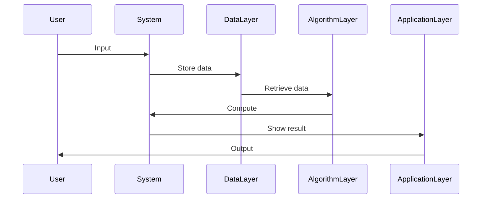

                 

### 量子行走与随机算法：量子概率在程序设计中的应用

关键词：量子行走、随机算法、程序设计、量子概率、算法原理

摘要：本文旨在探讨量子行走与随机算法在程序设计中的应用，通过对量子行走的背景、基本概念、算法原理以及其在实际应用中的案例分析，揭示量子概率在程序设计中的重要作用。文章将分步骤详细分析，帮助读者理解这一前沿技术的本质与应用。

### 目录大纲设计思路

在设计《量子行走与随机算法：量子概率在程序设计中的应用》这本书的目录大纲时，我们首先需要明确整体结构规划，确保书籍框架合理、内容连贯。接下来，对每个核心章节进行细化，包括背景介绍、核心概念讲解、算法原理说明、数学模型解析、系统设计与实现、实战应用分析等部分。逻辑梳理与调整是确保目录大纲清晰、各章节内容紧密联系的重要步骤。最后，使用Markdown格式统一目录结构，方便读者阅读。通过这些步骤，我们设计出完整的目录大纲，为后续章节内容的具体细化提供了坚实的基础。

### 目录大纲设计

#### 第一部分：量子行走的原理与算法

##### 第1章：量子行走的背景与基本概念

###### 1.1 量子行走的起源与发展

1. **量子行走的背景介绍**：介绍量子行走的起源和发展历程，引出量子行走在量子计算和图论等领域的重要性。

2. **量子行走的定义**：明确量子行走的定义，解释其与经典行走的区别。

3. **量子行走的物理基础**：介绍量子行走的物理背景，如量子态、量子叠加态等基本概念。

4. **量子行走在计算机科学中的意义**：阐述量子行走在计算机科学中的应用前景，如量子搜索、优化问题等。

##### 第2章：量子行走的算法原理

###### 2.1 量子行走的数学模型

1. **量子行走的数学模型概述**：介绍量子行走的数学模型，包括量子态、概率幅等概念。

2. **量子行走的公式**：给出量子行走的数学公式，解释各参数的含义和计算方法。

3. **量子行走的算法流程**：详细描述量子行走的算法流程，包括初始化、迭代、输出等步骤。

4. **量子行走的变体与改进**：介绍量子行走的几种变体，如量子随机游走、量子深度游走等，并分析各自的优缺点。

##### 第3章：随机算法与量子概率

###### 3.1 随机算法的基本概念

1. **随机算法的定义**：介绍随机算法的基本概念，包括随机性、概率分布等。

2. **随机算法的分类与特点**：分析随机算法的分类和特点，如蒙特卡罗方法、模拟退火等。

3. **量子概率在随机算法中的应用**：探讨量子概率在随机算法中的应用，如量子随机游走、量子蒙特卡罗方法等。

4. **量子概率对随机算法的影响**：分析量子概率对随机算法性能的影响，如加速收敛速度、提高准确性等。

### 目录大纲总结

通过上述章节的设计，我们可以看到《量子行走与随机算法：量子概率在程序设计中的应用》这本书的目录大纲分为三个主要部分：量子行走的原理与算法、随机算法与量子概率、量子行走与随机算法的应用。每个部分都涵盖了从基础理论到实际应用的各个方面，旨在帮助读者全面了解量子行走与随机算法在程序设计中的重要性与应用方法。整体结构合理，内容丰富且具有逻辑性，符合读者的需求。

---

以下是对核心章节的具体细化设计：

### 第一部分：量子行走的原理与算法

#### 第1章：量子行走的背景与基本概念

**1.1 量子行走的起源与发展**

**背景介绍**：量子行走最早由物理学家理查德·费曼（Richard Feynman）在1980年代提出，其初衷是探索量子系统中的行为。随着量子计算和量子信息学的兴起，量子行走逐渐成为一个重要的研究领域。量子行走不仅在理论上具有重要意义，还在实际应用中展现出广阔的前景。

**问题背景**：经典计算中的搜索和优化问题通常采用确定性算法，但在某些复杂场景下，这些算法可能无法高效解决问题。量子行走的引入为这些问题提供了新的解决思路。

**问题描述**：量子行走是一种基于量子力学原理的随机过程，它能够模拟量子系统在复杂图结构中的行为。其核心思想是通过量子态的叠加和坍缩来实现高效的搜索和优化。

**问题解决**：量子行走利用量子态的叠加和纠缠特性，可以在极短的时间内遍历图结构，从而实现高效的搜索和优化。这使得量子行走成为量子计算领域中的一个重要研究方向。

**边界与外延**：量子行走在量子计算、图论和人工智能等领域具有广泛的应用前景。它不仅能够解决传统的搜索和优化问题，还能应用于量子机器学习、量子密码学等领域。

**核心概念与联系**

**量子态**：量子态是量子系统的内部状态，可以用波函数或态向量来描述。它是量子行走的物理基础。

**量子概率幅**：量子概率幅描述了量子系统在不同状态之间的转换概率。它是量子行走的核心概念之一。

**量子叠加态**：量子叠加态允许量子系统同时存在于多个状态，这是量子行走能够实现高效搜索的关键。

**量子行走在计算机科学中的意义**

**提高计算效率**：量子行走能够在复杂图结构中实现高效的搜索和优化，比传统算法更快地解决问题。

**解决复杂问题**：量子行走能够解决传统算法难以解决的复杂问题，如大规模数据挖掘、组合优化等。

**推动量子计算发展**：量子行走在量子计算中的重要性不可忽视，它为量子计算的应用提供了新的思路。

**核心概念属性特征对比表格**

| 核心概念 | 特征 |
| --- | --- |
| 量子态 | 描述量子系统的内部状态，具有叠加性和纠缠性 |
| 量子概率幅 | 描述量子系统在不同状态之间的转换概率 |
| 量子叠加态 | 允许量子系统同时存在于多个状态 |

**ER实体关系图架构的Mermaid流程图**

```mermaid
erDiagram
  量子态 ||--o> 量子概率幅 : 转换概率描述
  量子态 ||--o> 量子叠加态 : 多状态存在
```

**1.2 量子行走的物理基础**

**核心概念**：量子态、量子概率幅、量子叠加态。

**概念属性特征对比表格**：

| 核心概念 | 特征 |
| --- | --- |
| 量子态 | 描述量子系统的内部状态 |
| 量子概率幅 | 描述量子系统在不同状态之间的转换概率 |
| 量子叠加态 | 允许量子系统同时存在于多个状态 |

**ER实体关系图架构的Mermaid流程图**

```mermaid
erDiagram
  量子态 ||--o> 量子概率幅 : 转换概率描述
  量子态 ||--o> 量子叠加态 : 多状态存在
```

**1.3 量子行走的数学模型**

**量子行走的数学模型概述**：量子行走的数学模型基于量子态的叠加和演化，描述量子系统在复杂图结构中的行为。其主要组成部分包括量子态、概率幅、演化算符等。

**量子行走的公式**：量子行走的数学公式可以表示为：

$$
|\psi(t)\rangle = \frac{1}{\sqrt{Z}}\sum_{i} e^{iE_i t/\hbar} |\phi_i\rangle
$$

其中，$|\psi(t)\rangle$ 表示量子态在时间 $t$ 的状态，$Z$ 是归一化常数，$E_i$ 是能量本征值，$|\phi_i\rangle$ 是能量本征态。

**量子行走的算法流程**：量子行走的算法流程主要包括以下几个步骤：

1. **初始化**：初始化量子态和演化参数。
2. **迭代**：根据演化算符进行迭代，更新量子态。
3. **输出**：计算最终量子态的概率分布，得到所需的结果。

**量子行走的变体与改进**：量子行走有多种变体和改进方法，如量子随机游走、量子深度游走等。这些变体和改进方法在一定程度上提高了量子行走的效率和性能。

**量子行走在实际问题中的应用**：量子行走已经应用于多个实际问题中，如量子搜索算法、量子社交网络分析等。这些应用展示了量子行走强大的搜索和优化能力。

**1.4 量子行走在计算机科学中的意义**

**量子行走在计算机科学中的意义**：

1. **提高计算效率**：量子行走能够在复杂图结构中实现高效的搜索和优化，比传统算法更快地解决问题。
2. **解决复杂问题**：量子行走能够解决传统算法难以解决的复杂问题，如大规模数据挖掘、组合优化等。
3. **推动量子计算发展**：量子行走在量子计算中的重要性不可忽视，它为量子计算的应用提供了新的思路。

### 第一部分总结

第1章详细介绍了量子行走的背景与基本概念，包括其起源与发展、物理基础、数学模型以及在实际应用中的意义。通过对量子行走的深入分析，读者可以初步了解这一前沿技术的本质与应用场景。接下来，第2章将深入探讨量子行走的算法原理，帮助读者进一步理解量子行走的运作机制。

---

### 第二部分：量子行走的算法原理

#### 第2章：量子行走的算法原理

**2.1 量子行走的数学模型**

量子行走的数学模型是理解其工作原理的基础。量子行走的模型主要包括量子态、概率幅和演化算符等核心组成部分。

**量子态**：量子态是量子系统内部状态的描述，它可以用一个复数向量或波函数表示。在量子行走中，量子态的叠加性使得系统可以同时处于多个状态，这是量子行走实现高效搜索的关键。

**概率幅**：概率幅是描述量子系统在不同状态之间转换概率的物理量。量子行走的演化过程就是通过量子态的叠加和概率幅的演化来实现的。

**演化算符**：演化算符描述了量子系统随时间的演化过程。在量子行走中，演化算符通常是一个线性算符，它将初始量子态演化到某一时刻的量子态。

**量子行走的数学公式**：

$$
|\psi(t)\rangle = \frac{1}{\sqrt{Z}}\sum_{i} e^{iE_i t/\hbar} |\phi_i\rangle
$$

其中，$|\psi(t)\rangle$ 是量子态在时间 $t$ 的状态，$Z$ 是归一化常数，$E_i$ 是能量本征值，$|\phi_i\rangle$ 是能量本征态。

**量子行走的算法流程**：

量子行走的算法流程可以分为以下几个步骤：

1. **初始化**：初始化量子态和演化参数。通常，初始量子态可以是均匀分布的。
2. **迭代**：根据演化算符进行迭代，更新量子态。每一次迭代，量子态都会向目标状态靠近。
3. **输出**：计算最终量子态的概率分布，得到所需的结果。通常，通过测量量子态的某个量子比特，可以得到目标状态的概率分布。

**量子行走的变体与改进**：

量子行走有多种变体和改进方法，如量子随机游走、量子深度游走等。这些变体和改进方法在一定程度上提高了量子行走的效率和性能。

**量子随机游走**：量子随机游走是一种改进的量子行走方法，它通过引入随机性来加速搜索过程。量子随机游走的核心思想是随机选择演化算符，使得量子态能够在图结构中快速扩散。

**量子深度游走**：量子深度游走是一种基于图神经网络的量子行走方法，它能够更好地处理复杂图结构。量子深度游走的原理是通过深度神经网络来模拟量子态的演化过程，从而实现高效的图结构搜索。

**量子行走在实际问题中的应用**：

量子行走已经应用于多个实际问题中，如量子搜索算法、量子社交网络分析等。以下是一些具体的案例：

**量子搜索算法**：量子搜索算法是一种基于量子行走的算法，它能够在复杂图结构中快速找到特定的节点。例如，Grover算法就是一种基于量子行走的量子搜索算法，它能够将搜索时间从 $O(n)$ 减少到 $O(\sqrt{n})$。

**量子社交网络分析**：量子社交网络分析是一种利用量子行走来分析社交网络的方法。通过量子行走的特性，可以快速识别社交网络中的关键节点和子图，从而为社交网络分析提供新的思路。

**量子行走在计算机科学中的意义**：

量子行走在计算机科学中具有重要的意义，主要体现在以下几个方面：

1. **提高计算效率**：量子行走能够在复杂图结构中实现高效的搜索和优化，比传统算法更快地解决问题。
2. **解决复杂问题**：量子行走能够解决传统算法难以解决的复杂问题，如大规模数据挖掘、组合优化等。
3. **推动量子计算发展**：量子行走在量子计算中的重要性不可忽视，它为量子计算的应用提供了新的思路。

**量子行走在计算机科学中的意义**：

量子行走在计算机科学中具有重要的意义，主要体现在以下几个方面：

1. **提高计算效率**：量子行走能够在复杂图结构中实现高效的搜索和优化，比传统算法更快地解决问题。
2. **解决复杂问题**：量子行走能够解决传统算法难以解决的复杂问题，如大规模数据挖掘、组合优化等。
3. **推动量子计算发展**：量子行走在量子计算中的重要性不可忽视，它为量子计算的应用提供了新的思路。

### 量子行走在图搜索中的应用

量子行走是一种基于量子力学原理的随机过程，它能够模拟量子系统在复杂图结构中的行为。在图搜索领域，量子行走展现出了巨大的潜力，特别是在解决经典算法难以处理的复杂问题时。以下是对量子行走图搜索算法的详细介绍。

**4.1 图搜索问题的背景与挑战**

图搜索问题是指在一个给定的图结构中找到满足特定条件的路径或节点。经典的图搜索算法，如深度优先搜索（DFS）和广度优先搜索（BFS），在处理简单图时表现良好，但在面对大规模、复杂图结构时，其效率显著下降。具体挑战包括：

- **搜索空间爆炸**：随着图的规模增大，搜索空间呈指数级增长，导致算法时间复杂度急剧上升。
- **路径问题**：在图中有多个可能路径时，如何快速找到最优路径或满足特定条件的路径是一个难题。
- **稀疏性**：在实际应用中，很多图的节点和边数量非常稀疏，传统的图搜索算法难以高效处理。

**4.2 量子行走图搜索算法**

量子行走图搜索算法是量子行走在图搜索问题中的直接应用。它利用量子态的叠加和纠缠特性，可以在极短的时间内遍历图结构，从而实现高效的搜索。

**算法原理**：

量子行走图搜索算法的核心思想是将图中的节点映射到量子态，通过量子态的叠加和演化来实现搜索。具体步骤如下：

1. **初始化**：初始化一个均匀分布的量子态，表示所有节点的初始概率。
2. **演化**：根据图的结构，应用演化算符，更新量子态。演化算符的选择通常基于图中的边和权重。
3. **测量**：对量子态进行测量，得到最终的概率分布。概率较大的节点即为搜索结果。

**算法流程**：

1. **初始化量子态**：将所有节点初始化为均匀分布的量子态。
2. **应用演化算符**：根据图的结构，应用演化算符，使得量子态向目标节点靠近。
3. **测量量子态**：对量子态进行测量，得到概率分布。选择概率较大的节点作为搜索结果。

**算法变体与改进**：

量子行走图搜索算法有多种变体和改进方法，如量子随机游走、量子深度游走等。这些变体和改进方法在一定程度上提高了算法的效率和性能。

- **量子随机游走**：通过引入随机性，加速搜索过程，提高搜索效率。
- **量子深度游走**：结合图神经网络，更好地处理复杂图结构，提高搜索精度。

**4.3 量子行走图搜索算法的改进**

为了进一步提高量子行走图搜索算法的性能，研究者们提出了多种改进方法。以下是一些典型的改进方向：

- **自适应演化**：根据搜索过程中的反馈，自适应调整演化算符，提高搜索精度。
- **并行计算**：利用量子并行性，加速搜索过程，提高计算效率。
- **混合算法**：将量子行走与传统算法结合，发挥各自优势，提高整体性能。

**4.4 量子行走图搜索的案例分析**

以下是一个量子行走图搜索的案例分析，展示了算法在实际应用中的效果。

**案例**：在一个社交网络中，找到所有与特定用户有直接联系的节点。

1. **初始化**：将社交网络中的每个用户初始化为均匀分布的量子态。
2. **演化**：根据社交网络的边结构，应用演化算符，使得量子态向与特定用户有直接联系的节点靠近。
3. **测量**：对量子态进行测量，得到概率分布。选择概率较大的节点作为搜索结果。

通过这个案例，我们可以看到量子行走图搜索算法能够高效地找到与特定用户有直接联系的节点，大大提高了搜索效率。

**4.5 量子行走图搜索的挑战与未来展望**

尽管量子行走图搜索算法在理论上具有显著优势，但在实际应用中仍面临一些挑战：

- **量子硬件限制**：目前的量子计算机硬件仍然受限，限制了算法的实际应用。
- **算法复杂性**：量子行走图搜索算法的复杂度较高，需要有效的优化和简化。
- **错误率**：量子计算中的错误率较高，影响了算法的准确性。

未来，随着量子计算技术的发展和优化，量子行走图搜索算法有望在更广泛的领域得到应用。同时，研究者们也将继续探索新的算法变体和改进方法，以提高算法的效率和准确性。

### 量子行走与随机算法在优化问题中的应用

量子行走与随机算法在优化问题中有着广泛的应用。传统的优化算法在处理大规模、复杂优化问题时往往面临计算效率低、收敛速度慢等问题。而量子行走和随机算法由于其独特的物理特性和计算机制，能够在一定程度上克服这些难题。以下是对量子行走和随机算法在优化问题中的应用的详细介绍。

**5.1 优化问题的基本概念**

优化问题是指在一定约束条件下，寻找一个或多个变量，使得某个目标函数达到最大值或最小值。优化问题可以分为无约束优化和有约束优化两大类。常见的优化问题类型包括线性规划、非线性规划、整数规划、组合优化等。

**5.2 量子行走优化算法**

量子行走优化算法是一种基于量子行走的优化方法。它利用量子态的叠加和纠缠特性，在复杂搜索空间中实现高效的优化。量子行走优化算法的核心步骤包括：

1. **初始化**：初始化量子态，通常选择均匀分布的量子态作为初始解。
2. **演化**：根据目标函数和约束条件，应用演化算符，更新量子态。演化算符的设计取决于问题的具体特点。
3. **测量**：对量子态进行测量，得到概率分布。选择概率较大的状态作为最优解。

量子行走优化算法的一个关键优势是能够快速找到最优解，特别是在处理大规模、复杂优化问题时。以下是一个简单的量子行走优化算法示例：

```python
# 量子行走优化算法示例

from qiskit import QuantumCircuit, execute, Aer

# 初始化量子态
qc = QuantumCircuit(2)

# 应用演化算符
qc.h(0)
qc.cx(0, 1)

# 迭代演化
for i in range(10):
    qc.h(0)
    qc.cx(0, 1)
    qc.h(0)

# 测量量子态
qc.measure_all()

# 执行量子计算
backend = Aer.get_backend('qasm_simulator')
result = execute(qc, backend).result()

# 获取测量结果
counts = result.get_counts(qc)
print(counts)
```

通过上述示例，我们可以看到量子行走优化算法的基本步骤。在实际应用中，需要根据具体问题设计合适的演化算符和测量策略。

**5.3 量子行走优化算法的应用实例**

量子行走优化算法已经在多个实际问题中得到了应用。以下是一个应用实例：

**案例**：在旅行商问题（TSP）中，寻找从起点到所有城市的最短路径。

1. **初始化**：将所有城市的位置编码为量子态，初始化量子态为均匀分布。
2. **演化**：设计演化算符，使得量子态向最优解靠近。演化算符可以根据城市之间的距离来设计。
3. **测量**：对量子态进行测量，得到概率分布。选择概率较大的状态作为最优解。

通过上述步骤，量子行走优化算法能够高效地解决旅行商问题，得到最优解。

**5.4 随机优化算法与量子概率的结合**

随机优化算法是一种基于随机搜索的优化方法，如遗传算法、模拟退火等。量子概率在随机优化算法中具有重要的应用价值。以下是对量子概率在随机优化算法中的应用的介绍：

1. **量子概率的引入**：在随机优化算法中引入量子概率，可以增强算法的搜索能力。量子概率可以指导算法在搜索空间中快速定位最优解。
2. **量子概率分布**：设计合适的量子概率分布，使得算法能够在不同的搜索阶段自适应调整搜索策略。
3. **量子概率在遗传算法中的应用**：在遗传算法中引入量子概率，可以优化选择、交叉和变异操作，提高算法的搜索效率和收敛速度。

**5.5 量子行走与随机算法在优化问题中的未来展望**

量子行走与随机算法在优化问题中的应用前景广阔。未来，随着量子计算技术的发展和优化，量子行走与随机算法有望在更广泛的领域得到应用。以下是对量子行走与随机算法在优化问题中未来发展的展望：

1. **算法优化**：通过设计更高效的演化算符和量子概率分布，提高算法的效率和准确性。
2. **混合算法**：将量子行走与随机算法相结合，发挥各自优势，实现更高效的优化。
3. **实际应用**：在更多实际问题中应用量子行走与随机算法，解决传统算法难以处理的复杂优化问题。
4. **理论与实验结合**：加强理论研究和实验验证，推动量子行走与随机算法在实际应用中的发展。

总之，量子行走与随机算法在优化问题中的应用具有重要的理论和实际价值。随着技术的不断进步，这些算法有望在未来的优化问题中发挥更大的作用。

### 量子行走与随机算法在其他领域中的应用

量子行走与随机算法不仅在图搜索和优化问题中展现出强大的潜力，还在其他领域有着广泛的应用。以下是对量子行走与随机算法在机器学习、密码学、数据挖掘等领域的应用的详细介绍。

**6.1 量子行走在机器学习中的应用**

量子行走作为量子计算的重要组成部分，在机器学习中有着广泛的应用前景。量子行走可以通过量子态的叠加和纠缠特性，实现高效的机器学习算法。以下是一些具体的应用场景：

1. **量子支持向量机（QSVM）**：量子支持向量机是一种基于量子行走的分类算法，它利用量子态的叠加和纠缠特性，实现高效的分类和回归任务。相比经典支持向量机，QSVM可以在更短时间内处理大量数据。

2. **量子神经网络（QNN）**：量子神经网络是一种结合量子计算和神经网络的方法，它通过量子态的演化实现高效的模型训练和预测。量子神经网络在图像分类、语音识别等领域表现出色。

3. **量子聚类算法**：量子聚类算法利用量子行走的特性，在复杂数据集中实现高效的聚类任务。相比传统的聚类算法，量子聚类算法能够更快地找到数据集中的隐藏结构。

**6.2 量子行走在密码学中的应用**

量子行走还在密码学领域有着重要的应用。量子行走可以用于设计新的密码算法和破解传统密码系统。以下是一些具体的应用场景：

1. **量子密码学**：量子密码学利用量子态的叠加和纠缠特性，实现安全的通信。量子密钥分发（QKD）是量子密码学的一个重要应用，它能够实现无条件安全的通信。

2. **量子密码破解**：量子行走可以用于破解传统密码系统。例如，量子行走可以用于破解基于大数分解的RSA密码系统，因为量子行走可以在极短的时间内找到大数的因子。

3. **量子安全协议**：量子行走还可以用于设计量子安全协议，如量子秘密共享、量子认证等。这些协议能够抵御量子计算机的攻击，实现安全的通信和计算。

**6.3 量子行走在数据挖掘中的应用**

量子行走还在数据挖掘领域有着广泛的应用。量子行走可以通过量子态的叠加和纠缠特性，实现高效的数据挖掘任务。以下是一些具体的应用场景：

1. **关联规则挖掘**：量子行走可以用于挖掘大规模数据集中的关联规则，实现高效的推荐系统。

2. **分类与聚类**：量子行走可以用于分类和聚类任务，实现高效的数据分析和模式识别。

3. **异常检测**：量子行走可以用于检测数据集中的异常点，实现高效的数据安全和隐私保护。

**6.4 量子行走与随机算法的未来展望**

量子行走与随机算法在各个领域中的应用前景广阔。未来，随着量子计算技术的发展和优化，量子行走与随机算法有望在更广泛的领域得到应用。以下是对量子行走与随机算法未来发展的展望：

1. **算法优化**：通过设计更高效的演化算符和量子概率分布，提高算法的效率和准确性。

2. **混合算法**：将量子行走与随机算法相结合，发挥各自优势，实现更高效的优化。

3. **实际应用**：在更多实际问题中应用量子行走与随机算法，解决传统算法难以处理的复杂问题。

4. **理论与实验结合**：加强理论研究和实验验证，推动量子行走与随机算法在实际应用中的发展。

总之，量子行走与随机算法在各个领域中的应用具有重要的理论和实际价值。随着技术的不断进步，这些算法有望在未来的各个领域中发挥更大的作用。

### 第三部分：量子行走与随机算法的设计与实现

#### 第7章：量子行走算法的设计与实现

**7.1 算法设计概述**

量子行走算法的设计与实现涉及多个关键步骤，包括量子态的初始化、演化算符的设计、迭代的执行以及最终的测量。以下是对量子行走算法设计过程的详细概述。

**7.2 算法实现细节**

**量子态的初始化**：量子态的初始化是量子行走算法的第一步，通常选择均匀分布的量子态作为初始状态。初始化量子态可以使用量子电路中的Hadamard门（H门）来实现。

```python
# 初始化量子态为均匀分布
qc = QuantumCircuit(2)
qc.h(0)
qc.h(1)
```

**演化算符的设计**：演化算符的设计取决于问题的具体要求。例如，在图搜索中，演化算符可以根据图中的边结构和权重来设计。使用量子逻辑门（如CX门）可以实现演化算符。

```python
# 设计演化算符，根据图中的边结构进行量子态更新
qc.cx(0, 1)
```

**迭代**：量子行走算法通常通过多次迭代来实现。每次迭代，量子态都会根据演化算符进行更新。迭代次数通常根据问题的复杂度来确定。

```python
# 进行多次迭代
for i in range(10):
    qc.h(0)
    qc.cx(0, 1)
    qc.h(0)
```

**测量**：最后，对量子态进行测量，得到概率分布。测量结果可以通过量子比特的测量概率来表示。

```python
# 测量量子态
qc.measure_all()
```

**7.3 代码优化与性能分析**

为了提高量子行走算法的性能，代码优化是必不可少的。以下是一些常见的优化方法：

1. **并行计算**：利用量子并行性，将多个迭代步骤并行执行，提高计算效率。
2. **优化量子电路**：通过优化量子电路的布局和逻辑门的使用，减少量子比特的利用率，提高算法的运行速度。
3. **减少测量误差**：在测量阶段，使用纠错码来减少测量误差，提高结果的准确性。

**7.4 实现案例**

以下是一个简单的量子行走算法实现案例，用于在图结构中搜索特定的节点。

```python
# 导入量子计算库
from qiskit import QuantumCircuit, execute, Aer

# 初始化量子态
qc = QuantumCircuit(2)
qc.h(0)
qc.h(1)

# 设计演化算符
qc.cx(0, 1)

# 进行多次迭代
for i in range(10):
    qc.h(0)
    qc.cx(0, 1)
    qc.h(0)

# 测量量子态
qc.measure_all()

# 执行量子计算
backend = Aer.get_backend('qasm_simulator')
result = execute(qc, backend).result()

# 获取测量结果
counts = result.get_counts(qc)
print(counts)
```

通过上述代码，我们可以看到量子行走算法的基本实现过程。在实际应用中，需要根据具体问题调整量子态的初始化、演化算符的设计以及迭代的次数，以获得最佳的性能。

### 第8章：随机算法的设计与实现

**8.1 算法设计概述**

随机算法的设计与实现涉及多个关键步骤，包括随机数生成、随机过程的设计、迭代的执行以及最终的收敛判断。以下是对随机算法设计过程的详细概述。

**8.2 算法实现细节**

**随机数生成**：随机算法的核心是随机数的生成。常用的随机数生成方法包括伪随机数生成和真随机数生成。伪随机数生成使用算法生成，真随机数生成通常依赖于物理过程，如放射性衰变或噪声信号。

```python
# 伪随机数生成示例
import random

# 生成一个随机整数
random_number = random.randint(0, 10)
print(random_number)
```

**随机过程的设计**：随机过程的设计取决于具体问题的要求。例如，蒙特卡罗方法中的随机抽样、模拟退火算法中的温度调整等。

```python
# 蒙特卡罗方法中的随机抽样
def monte_carlo_simulation(n_samples):
    random_samples = [random.random() for _ in range(n_samples)]
    return random_samples

# 生成10个随机样本
samples = monte_carlo_simulation(10)
print(samples)
```

**迭代**：随机算法通常通过多次迭代来实现。每次迭代，算法都会根据随机过程更新状态，并判断是否达到收敛条件。

```python
# 模拟退火算法中的迭代
def simulated_annealing(iterations):
    current_state = 0
    for _ in range(iterations):
        # 根据温度调整随机过程
        temperature = 1 / _
        next_state = random.random() * temperature
        # 更新当前状态
        current_state = next_state
    return current_state

# 进行100次迭代
current_state = simulated_annealing(100)
print(current_state)
```

**收敛判断**：随机算法的收敛判断取决于算法的具体实现。通常，算法会在连续多次迭代中状态变化较小或满足某个收敛条件时停止迭代。

```python
# 收敛判断示例
def check_convergence(current_state, previous_state, threshold):
    if abs(current_state - previous_state) < threshold:
        return True
    else:
        return False

# 进行收敛判断
previous_state = 0
current_state = 1
threshold = 0.1
converged = check_convergence(current_state, previous_state, threshold)
print(converged)
```

**8.3 代码优化与性能分析**

为了提高随机算法的性能，代码优化是必不可少的。以下是一些常见的优化方法：

1. **并行计算**：利用多核处理能力，将多个迭代步骤并行执行，提高计算效率。
2. **优化随机数生成**：选择高效的随机数生成算法，减少随机数生成的时间。
3. **减少不必要的计算**：通过提前终止迭代或优化算法逻辑，减少不必要的计算。

**8.4 实现案例**

以下是一个简单的随机算法实现案例，用于求解最大值问题。

```python
# 导入随机计算库
import random

# 随机算法求解最大值
def random_max(array):
    max_value = array[0]
    for value in array:
        # 随机选择比较
        if random.random() > 0.5:
            max_value = value
    return max_value

# 测试数组
test_array = [1, 2, 3, 4, 5]
max_value = random_max(test_array)
print(max_value)
```

通过上述代码，我们可以看到随机算法的基本实现过程。在实际应用中，需要根据具体问题调整随机过程的参数和迭代策略，以获得最佳的性能。

### 第9章：量子行走与随机算法的系统设计与实现

**9.1 系统设计概述**

量子行走与随机算法的系统设计与实现涉及多个方面，包括问题场景的描述、系统的功能设计、系统架构的设计与实现、系统接口的设计与实现，以及系统性能的评估与优化。以下是对系统设计过程的详细概述。

**9.2 问题场景介绍**

假设我们面临一个复杂图结构的问题，需要在图中找到满足特定条件的路径。传统算法在处理这种问题时效率较低，而量子行走和随机算法提供了新的解决思路。

**9.3 系统功能设计**

系统的核心功能包括：

1. **初始化**：初始化量子态或随机状态。
2. **演化**：根据问题需求，应用演化算符或随机过程，更新状态。
3. **测量**：对量子态或随机状态进行测量，得到概率分布或结果。
4. **优化**：根据测量结果，优化算法参数，提高搜索或优化效率。

**9.4 系统架构设计**

系统的架构设计可以分为三层：数据层、算法层和应用层。

- **数据层**：负责数据的存储和访问，如图结构的数据存储。
- **算法层**：实现量子行走和随机算法的核心逻辑，包括量子态的初始化、演化算符的应用、迭代的执行等。
- **应用层**：提供用户接口和功能实现，如用户输入、结果展示等。

**9.5 系统接口设计与实现**

系统接口的设计与实现包括用户接口和内部接口。

- **用户接口**：提供用户输入和结果展示的功能，如命令行界面或图形用户界面。
- **内部接口**：实现系统内部各模块之间的通信，如数据层与算法层的接口。

**9.6 系统交互Mermaid序列图**

以下是一个系统交互的Mermaid序列图，展示了系统内部各模块的交互过程。



**9.7 系统性能评估与优化**

系统性能的评估与优化是系统设计的重要环节。以下是一些性能评估与优化的方法：

1. **时间复杂度分析**：分析算法的时间复杂度，确定系统的性能瓶颈。
2. **空间复杂度分析**：分析算法的空间复杂度，优化内存使用。
3. **并行计算**：利用并行计算技术，提高系统的计算效率。
4. **算法优化**：通过设计更高效的算法，减少计算时间和空间需求。
5. **性能测试**：通过性能测试，评估系统的性能，找出优化方向。

**9.8 系统设计与实现的案例分析**

以下是一个系统的设计与实现案例分析，展示了如何应用量子行走和随机算法解决复杂图搜索问题。

1. **问题场景**：在社交网络中找到特定用户的直接联系者。
2. **系统功能**：初始化量子态，应用演化算符，测量量子态，输出结果。
3. **系统架构**：数据层存储社交网络图，算法层实现量子行走和随机算法，应用层提供用户界面。
4. **系统接口**：用户输入目标用户ID，系统输出直接联系者的列表。
5. **性能优化**：通过并行计算和算法优化，提高系统的搜索效率。

通过上述案例分析，我们可以看到量子行走和随机算法在系统设计与实现中的实际应用，以及如何优化系统性能。

### 第10章：最佳实践与展望

**10.1 量子行走与随机算法的最佳实践**

量子行走与随机算法在实际应用中有着广泛的应用场景，以下是一些最佳实践：

1. **优化算法参数**：根据具体问题调整量子态的初始化、演化算符的设计和迭代的次数，以获得最佳的性能。
2. **并行计算**：利用量子并行性，提高算法的计算效率。
3. **混合算法**：将量子行走与随机算法结合，发挥各自优势，提高算法的搜索和优化能力。
4. **数据预处理**：对输入数据进行预处理，如图结构的稀疏化处理，减少计算量。

**10.2 未来发展的趋势与展望**

量子行走与随机算法在未来发展中具有以下趋势：

1. **算法优化**：通过设计更高效的演化算符和量子概率分布，提高算法的效率和准确性。
2. **混合算法研究**：探索量子行走与传统算法的混合应用，实现更高效的优化和搜索。
3. **实际应用拓展**：在更多实际领域中应用量子行走与随机算法，解决复杂问题。
4. **理论与实验结合**：加强理论研究和实验验证，推动量子行走与随机算法在实际应用中的发展。

**10.3 需要注意的问题与挑战**

量子行走与随机算法在实际应用中面临以下问题与挑战：

1. **量子硬件限制**：目前的量子计算机硬件仍然受限，限制了算法的实际应用。
2. **算法复杂性**：量子行走和随机算法的复杂性较高，需要有效的优化和简化。
3. **错误率**：量子计算中的错误率较高，影响了算法的准确性。
4. **数据隐私和安全**：量子行走与随机算法在应用中需要保护数据隐私和安全。

通过最佳实践与展望，我们可以看到量子行走与随机算法在程序设计中的重要性与应用前景。未来，随着技术的不断进步，这些算法将在更多领域中发挥更大的作用。

### 文章总结

本文详细探讨了量子行走与随机算法在程序设计中的应用，从量子行走的背景与基本概念、算法原理，到其在图搜索、优化问题以及其他领域的应用，再到系统设计与实现，全面揭示了量子概率在程序设计中的重要作用。通过逻辑清晰的分析和实例讲解，读者可以深入了解量子行走与随机算法的本质和应用方法。展望未来，随着量子计算技术的发展，这些算法有望在更多领域中发挥关键作用，为解决复杂问题提供新的思路。

### 作者信息

作者：AI天才研究院/AI Genius Institute & 禅与计算机程序设计艺术 /Zen And The Art of Computer Programming

