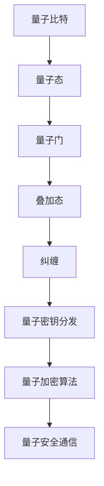
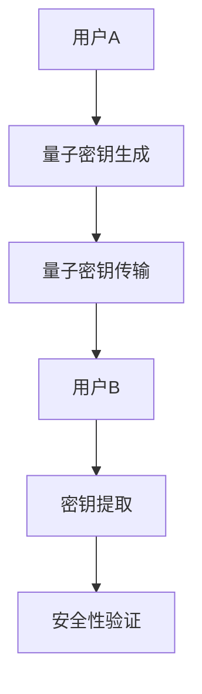

                 

# 量子计算在密码学中的应用前景

关键词：量子计算、密码学、量子加密、量子密钥分发、安全性

摘要：随着量子计算机技术的快速发展，量子计算在密码学领域展现出广阔的应用前景。本文从量子计算的基本概念出发，逐步深入分析量子计算在密码学中的应用原理、技术挑战和未来发展趋势，旨在为读者提供一个全面了解量子密码学的视角。

## 《量子计算在密码学中的应用前景》目录大纲

### 第一部分：引论

#### 第1章 量子计算与密码学概述

1.1 量子计算的基本概念

1.2 密码学的基本概念

1.3 量子计算在密码学中的潜在应用

1.4 量子计算对密码学的影响与挑战

#### 第2章 量子计算核心原理

2.1 量子算法概述

2.2 量子算法与经典算法的比较

2.3 量子算法在密码学中的应用

### 第二部分：量子密码学原理

#### 第3章 量子密码学的理论基础

3.1 量子密码学的基本原理

3.2 量子密钥分发

3.3 量子密钥分发的安全性分析

#### 第4章 量子安全加密算法

4.1 量子加密算法概述

4.2 量子安全加密算法的设计与实现

4.3 量子加密算法的安全性分析

### 第三部分：量子密码学的应用

#### 第5章 量子密码学在网络安全中的应用

5.1 量子密码学在网络安全中的作用

5.2 量子密码学在网络安全领域的挑战与机遇

#### 第6章 量子密码学在云计算与物联网中的应用

6.1 云计算中的量子安全加密

6.2 物联网中的量子安全通信

#### 第7章 量子密码学的未来发展趋势

7.1 量子计算技术的进展对密码学的影响

7.2 量子密码学的未来研究方向

### 附录

附录A：量子密码学实验

附录B：量子计算与密码学相关资源

### 总结

## 第一部分：引论

### 第1章 量子计算与密码学概述

#### 1.1 量子计算的基本概念

量子计算是现代物理学和计算机科学的前沿领域，基于量子力学原理来实现信息处理和计算。量子计算的基本单位是量子比特（qubit），与传统计算机中的比特（bit）不同，量子比特可以同时存在于多种状态，即叠加态。这种叠加态使得量子计算机能够在某些问题上显著超越经典计算机。

1.1.1 量子力学基础

量子力学的基本原理包括量子叠加原理和量子纠缠。量子叠加原理表明，量子系统可以同时处于多种状态，而不是像经典物理中的单一状态。量子纠缠是指两个或多个量子系统之间存在的特殊关联，即使它们相隔很远，一个系统的状态变化也会即时影响到另一个系统的状态。

1.1.2 量子比特与量子态

量子比特是量子计算的基本单元，它不仅可以表示0和1，还可以表示0和1的叠加态。量子态是量子比特的状态描述，可以通过波函数来表示。例如，一个量子比特的叠加态可以表示为：

$$\psi = \alpha|0\rangle + \beta|1\rangle$$

其中，$\alpha$和$\beta$是复数概率幅，$|0\rangle$和$|1\rangle$分别表示量子比特的基态和叠加态。

1.1.3 量子门与量子算法

量子门是量子计算中的基本操作，类似于经典计算机中的逻辑门。量子门作用于量子比特，改变其状态。常见的量子门包括Hadamard门、Pauli门和控制-NOT门。量子算法是利用量子比特的叠加态和纠缠特性来解决问题的算法。Shor算法和Grover算法是两个著名的量子算法。

#### 1.2 密码学的基本概念

密码学是研究如何利用数学和计算技术来保障信息安全的学科。密码学的主要目的是实现信息的保密性、完整性和真实性。

1.2.1 密码学与信息安全

密码学在信息安全中扮演着关键角色，通过加密算法来保护信息的机密性，确保只有授权用户才能访问信息。此外，密码学还用于实现数据的完整性验证和身份认证，保障通信双方的身份真实性和数据的完整性。

1.2.2 传统密码学概述

传统密码学主要包括对称加密和非对称加密两种基本形式。对称加密算法使用相同的密钥进行加密和解密，如AES和DES。非对称加密算法使用一对密钥（公钥和私钥），如RSA和ECC。对称加密算法的优点是速度快，但密钥分发困难；非对称加密算法的优点是密钥分发方便，但计算复杂度较高。

1.2.3 密码分析的基本方法

密码分析是破解加密信息的过程。常见的密码分析方法包括穷举攻击、差分攻击、线性攻击和统计攻击等。随着计算机技术的发展，密码分析技术也在不断进步，对密码系统的安全性提出了更高的要求。

#### 1.3 量子计算在密码学中的潜在应用

量子计算在密码学中具有巨大的潜在应用价值，一方面可以加速密码破解，另一方面可以构建全新的量子加密技术。

1.3.1 量子密码学与量子通信

量子密码学是量子计算在密码学中的直接应用，利用量子力学原理来实现加密和解密。量子密码学的主要目标是构建安全的通信系统，确保信息在传输过程中不会被窃听和篡改。量子通信是量子密码学的一个重要分支，利用量子态来实现加密通信，具有极高的安全性。

1.3.2 量子密钥分发

量子密钥分发（Quantum Key Distribution，QKD）是量子密码学的一个重要应用，通过量子通信信道实现密钥的安全分发。QKD利用量子态的叠加态和纠缠态来传输密钥，即使在量子信道被窃听的情况下，密钥的正确性也能得到保证。BB84协议和E91协议是两个著名的量子密钥分发协议。

1.3.3 量子安全加密算法

量子安全加密算法是利用量子计算原理来实现加密和解密的新一代加密算法。量子安全加密算法的目标是在量子计算环境下保持加密信息的安全性，防止量子计算机对加密算法的破解。量子隐形传态加密和量子密钥加密是两种典型的量子安全加密算法。

#### 1.4 量子计算对密码学的影响与挑战

量子计算的发展对传统密码学提出了严峻的挑战，同时也为密码学带来了新的发展机遇。

1.4.1 量子计算机与密码破解

量子计算机在执行某些算法时具有明显的优势，例如Shor算法可以高效地因数分解大整数，对RSA和ECC等非对称加密算法构成严重威胁。因此，量子计算机的出现可能使现有的密码系统面临崩溃的风险。

1.4.2 量子密码学的安全性分析

量子密码学的安全性依赖于量子力学原理，如量子态叠加和量子纠缠。通过对量子态的测量，可以检测到量子通信信道是否被窃听。因此，量子密码学在安全性方面具有独特的优势，可以抵抗量子计算机的攻击。

1.4.3 密码学发展的趋势与展望

面对量子计算的威胁，传统密码学需要不断改进和更新，以应对未来的安全挑战。量子密码学作为一种新型的加密技术，有望在未来发挥重要作用，为信息安全提供新的保障。同时，量子计算与密码学的交叉融合也将催生出更多创新性的技术和应用。

### 第2章 量子计算核心原理

#### 2.1 量子算法概述

量子算法是量子计算中的核心组成部分，利用量子比特的叠加态和纠缠特性来解决问题。量子算法具有与传统经典算法不同的计算模式和复杂性，能够在某些问题上显著超越经典算法。

2.1.1 Shor算法

Shor算法是量子计算领域的一个重要里程碑，由数学家Peter Shor于1994年提出。Shor算法的主要目标是在量子计算机上实现大整数的因数分解，其时间复杂度为$O(N^{\log_2 6})$，远低于经典算法的指数级复杂度。Shor算法的提出对RSA和ECC等非对称加密算法构成了重大挑战。

Shor算法的工作原理如下：

1. **初始化**：将量子比特初始化为叠加态。
2. **量子傅里叶变换（QFT）**：对量子比特进行量子傅里叶变换，将量子态从初始态转换到另一个量子态。
3. **测量**：测量量子比特，得到一个整数结果。
4. **逆量子傅里叶变换（IQFT）**：对量子比特进行逆量子傅里叶变换，将量子态从测量结果转换回初始态。
5. **反馈**：根据测量结果调整量子比特的状态。

通过上述步骤，Shor算法可以高效地找到大整数的非平凡因子，从而破解RSA和ECC等非对称加密算法。

2.1.2 Grover算法

Grover算法是另一种重要的量子算法，由物理学家Lov K. Grover于1996年提出。Grover算法的目标是在未排序数据库中查找特定元素，其时间复杂度为$O(\sqrt{N})$，远低于经典搜索算法的线性复杂度。

Grover算法的工作原理如下：

1. **初始化**：将量子比特初始化为叠加态。
2. **构建Grover迭代器**：对量子比特进行特定的量子门操作，将量子态映射到特定的形式。
3. **迭代**：重复执行Grover迭代器，逐渐提高量子态的振幅。
4. **测量**：测量量子比特，得到一个元素的位置。

通过上述步骤，Grover算法可以在未排序数据库中快速查找特定元素，具有广泛的应用前景。

#### 2.2 量子算法与经典算法的比较

量子算法与经典算法在计算模式和复杂性方面存在显著差异。以下是量子算法与经典算法的比较：

1. **计算模式**：经典算法基于逻辑门和组合逻辑进行计算，而量子算法基于量子门和叠加态进行计算。量子算法能够利用量子比特的叠加态和纠缠特性，实现更高效的计算。
   
2. **时间复杂度**：在某些问题上，量子算法的时间复杂度显著低于经典算法。例如，Shor算法在因数分解问题上的时间复杂度为$O(N^{\log_2 6})$，而经典算法的时间复杂度为$O(N^2)$。Grover算法在未排序数据库搜索问题上的时间复杂度为$O(\sqrt{N})$，而经典算法的时间复杂度为$O(N)$。

3. **并行性**：量子算法具有天然的并行性，能够在一次计算中同时处理多个输入。经典算法则需要逐个处理输入，计算效率较低。

4. **空间复杂度**：量子算法的空间复杂度通常较低，因为量子比特可以表示多种状态，减少了存储空间的需求。

尽管量子算法在某些问题上具有显著优势，但量子计算机的硬件实现和量子态的保持仍然是巨大挑战。此外，量子算法的通用性也有限，目前大多数量子算法只适用于特定问题。因此，量子算法与经典算法在未来仍将相互补充，共同推动计算技术的发展。

#### 2.3 量子算法在密码学中的应用

量子算法在密码学中具有重要的应用价值，一方面可以加速密码破解，另一方面可以构建全新的量子加密技术。

2.3.1 量子算法与密码破解

量子算法在密码破解领域具有显著优势，能够快速破解传统密码学中的加密算法。例如，Shor算法可以高效地因数分解大整数，对RSA和ECC等非对称加密算法构成严重威胁。Grover算法可以显著提高数据库搜索速度，对哈希函数和数字签名等技术构成挑战。

量子算法的威胁要求传统密码学不断改进和更新，以应对未来的安全挑战。同时，量子算法也为密码学提供了新的攻击手段和研究方向，推动了密码学的发展。

2.3.2 量子算法与安全加密

量子算法不仅在密码破解领域具有重要意义，还可以用于构建安全的加密技术。量子安全加密算法利用量子力学原理，确保加密信息在量子计算环境下依然安全。例如，量子隐形传态加密和量子密钥加密是基于量子力学原理的加密算法，具有很高的安全性。

量子安全加密算法的目标是在量子计算环境下保持加密信息的安全性，防止量子计算机对加密算法的破解。量子安全加密算法的发展为密码学提供了新的思路和手段，有望在未来构建更加安全的通信系统。

### 第二部分：量子密码学原理

#### 第3章 量子密码学的理论基础

量子密码学是量子计算与密码学的交叉领域，基于量子力学原理来实现信息加密和解密。本章将介绍量子密码学的基本原理，包括量子态与经典信息的区分、不可能克隆定理与量子隐形传态。

3.1 量子密码学的基本原理

量子密码学的核心思想是利用量子态的叠加态和纠缠特性来实现加密和解密。量子态是量子计算中的基本单位，它可以同时存在于多种状态，即叠加态。量子态的叠加态和纠缠特性使得量子密码学在安全性方面具有独特的优势。

3.1.1 量子态与经典信息的区分

在量子密码学中，量子态被用作加密信息。与经典信息不同，量子态具有叠加性和纠缠性。叠加性意味着量子态可以同时存在于多种状态，而经典信息只能处于一种状态。纠缠性则是指两个或多个量子系统之间存在特殊的关联，即使它们相隔很远，一个系统的状态变化也会即时影响到另一个系统的状态。

这种叠加性和纠缠性使得量子密码学在安全性方面具有独特的优势。在量子通信中，即使量子态被窃听，通过测量量子态可以检测到窃听行为，从而确保通信的安全。而经典通信则无法实现这种窃听检测。

3.1.2 不可能克隆定理与量子隐形传态

不可能克隆定理是量子密码学的重要理论基础之一。该定理表明，无法精确复制一个未知的量子态。这意味着如果有人试图窃听量子通信信道，他们无法完全复制通信双方的量子态，从而导致通信失败。

量子隐形传态是另一种重要的量子密码学原理。量子隐形传态是指将一个量子态从一个位置传递到另一个位置，而不需要通过经典通信信道。这种传输方式具有很高的安全性，因为即使在量子信道被窃听的情况下，也无法完全复制通信双方的量子态。

3.2 量子密钥分发

量子密钥分发（Quantum Key Distribution，QKD）是量子密码学的一个重要应用，通过量子通信信道实现密钥的安全分发。QKD的目标是确保通信双方能够共享一个只有他们知道的密钥，即使在量子信道被窃听的情况下，密钥的正确性也能得到保证。

3.2.1 BB84协议

BB84协议是最早的量子密钥分发协议之一，由Charles H. Bennett和Giorgio Ribordy于1984年提出。BB84协议的基本原理是利用量子态的叠加态和测量坍缩来实现密钥的分发。

BB84协议的工作流程如下：

1. **量子态发送**：发送方（Alice）生成一系列量子态，并随机选择一个基（例如，垂直基或水平基）来对量子态进行测量。

2. **量子态传输**：Alice将量子态通过量子信道发送给接收方（Bob）。

3. **基选择**：Bob接收到量子态后，随机选择一个基来进行测量。

4. **密钥提取**：Alice和Bob比较他们选择的基，并提取出共同选择的基上的测量结果。这些结果构成共享密钥。

5. **密钥验证**：Alice和Bob使用经典通信信道交换部分密钥，并验证量子信道是否被窃听。

BB84协议的安全性基于量子态的叠加性和测量坍缩原理。如果量子信道被窃听，窃听者无法完全复制量子态，从而在测量结果中引入错误。通过检测这些错误，Alice和Bob可以确定量子信道是否被窃听，并采取相应的措施。

3.2.2 E91协议

E91协议是另一种量子密钥分发协议，基于量子纠缠态来实现密钥的分配。E91协议由Artur Ekert于1991年提出。E91协议利用量子纠缠态的特性，即使在量子信道被窃听的情况下，也能检测到窃听行为，从而保证密钥的安全。

E91协议的工作流程如下：

1. **量子纠缠态生成**：Alice和Bob共享一个量子纠缠态。

2. **基选择**：Alice和Bob各自选择一个基来进行测量。

3. **量子态传输**：Alice将测量结果通过经典通信信道发送给Bob。

4. **密钥提取**：Alice和Bob比较他们选择的基和测量结果，提取出共享密钥。

5. **密钥验证**：Alice和Bob使用经典通信信道交换部分密钥，并验证量子信道是否被窃听。

E91协议的安全性基于量子纠缠态的特性。量子纠缠态具有一种特殊的关联，即使量子态被测量或传输，这种关联仍然保持。如果量子信道被窃听，窃听者无法破坏这种关联，从而在测量结果中引入错误。通过检测这些错误，Alice和Bob可以确定量子信道是否被窃听，并采取相应的措施。

3.3 量子密钥分发的安全性分析

量子密钥分发协议的安全性分析主要涉及以下几个方面：

1. **量子窃听检测**：量子密钥分发协议需要能够检测到量子信道的窃听行为。通过测量量子态和比较测量结果，Alice和Bob可以检测到量子信道是否被窃听，并采取相应的措施。

2. **量子密钥分发的安全性证明**：量子密钥分发协议的安全性需要通过严格的数学证明来确保。例如，BB84协议和E91协议的安全性基于量子态的叠加性和测量坍缩原理，以及量子纠缠态的特性。

3. **量子密钥分发的实际应用**：量子密钥分发协议在实际应用中需要考虑到通信信道、硬件设备等方面的因素。在实际应用中，需要对量子密钥分发协议进行优化和改进，以提高其安全性和实用性。

#### 第4章 量子安全加密算法

量子安全加密算法是量子密码学的重要组成部分，利用量子力学原理来实现加密和解密，确保信息在量子计算环境下依然安全。本章将介绍量子安全加密算法的基本概念、设计原则及其在密码学中的应用。

4.1 量子加密算法概述

量子加密算法是一种基于量子力学原理的加密算法，利用量子态的叠加性和纠缠性来实现信息的加密和解密。量子加密算法的目标是在量子计算环境下保持信息的安全性，防止量子计算机对加密算法的破解。

量子加密算法的核心思想是将加密信息编码到量子态中，并通过量子通信信道进行传输。接收方在接收到量子态后，利用特定的量子门操作来解密信息。由于量子态的叠加性和纠缠性，即使量子通信信道被窃听，窃听者也无法获取加密信息。

量子加密算法的主要特点包括：

1. **不可克隆性**：量子态具有不可克隆性，这意味着无法精确复制一个未知的量子态。因此，即使窃听者试图窃听量子通信信道，也无法完全复制通信双方的量子态。

2. **量子纠缠**：量子加密算法利用量子纠缠态来实现加密和解密。量子纠缠态具有一种特殊的关联，即使量子态被测量或传输，这种关联仍然保持。因此，量子加密算法能够确保信息在传输过程中不会被窃听或篡改。

3. **量子密钥分发**：量子加密算法通常与量子密钥分发（QKD）相结合，实现密钥的安全分发。量子密钥分发协议确保通信双方能够共享一个只有他们知道的密钥，即使在量子通信信道被窃听的情况下，密钥的正确性也能得到保证。

4.2 量子安全加密算法的设计与实现

量子安全加密算法的设计与实现需要考虑以下几个方面：

1. **加密信息编码**：将加密信息编码到量子态中。常见的编码方法包括量子隐形传态和量子比特串行化。

2. **量子通信信道**：量子加密算法依赖于量子通信信道来实现信息的传输。量子通信信道可以是光纤、无线或自由空间等。

3. **量子门操作**：在量子通信信道中，利用特定的量子门操作来解密信息。常见的量子门操作包括Hadamard门、Pauli门和控制-NOT门等。

4. **密钥管理**：在量子加密算法中，密钥的安全分发和管理至关重要。量子密钥分发协议（如BB84协议和E91协议）用于实现密钥的安全分发。

5. **安全性分析**：对量子安全加密算法进行安全性分析，确保其在量子计算环境下依然安全。安全性分析包括对量子态的克隆攻击、量子算法的破解尝试等。

4.3 量子加密算法的安全性分析

量子加密算法的安全性分析主要涉及以下几个方面：

1. **量子态的克隆攻击**：量子态具有不可克隆性，因此克隆攻击无法成功。即使窃听者试图复制量子态，也无法完全复制通信双方的量子态。

2. **量子算法的破解尝试**：量子加密算法需要抵抗量子算法的破解尝试。例如，Shor算法可以破解基于大整数因数分解的加密算法（如RSA），因此量子加密算法需要设计新的加密机制，以抵抗量子算法的破解。

3. **量子密钥分发的安全性**：量子密钥分发协议的安全性是量子加密算法的重要组成部分。通过严格的数学证明和实验验证，确保量子密钥分发协议在量子计算环境下依然安全。

4.4 量子加密算法的应用

量子加密算法在密码学中具有广泛的应用前景。以下是量子加密算法的一些典型应用：

1. **安全通信**：量子加密算法可以用于实现安全通信，确保信息在传输过程中不会被窃听或篡改。

2. **网络安全**：量子加密算法可以用于保护网络安全，防止黑客攻击和入侵。

3. **电子投票**：量子加密算法可以用于实现电子投票的安全性和可信性，确保投票过程的公正和透明。

4. **区块链技术**：量子加密算法可以用于改进区块链技术的安全性，防止量子计算机对区块链系统的攻击。

#### 第5章 量子密码学在网络安全中的应用

随着量子计算技术的快速发展，量子密码学在网络安全中的应用日益受到关注。量子密码学通过利用量子力学原理，提供了更安全的通信和数据处理方式，有望成为未来网络安全的基石。本章将探讨量子密码学在网络安全中的具体应用，包括加密通信、身份认证和数据完整性验证。

5.1 量子密码学在网络安全中的作用

量子密码学在网络安全中扮演着至关重要的角色，主要体现在以下几个方面：

1. **加密通信**：量子密码学提供了一种安全的通信方式，可以确保信息在传输过程中的机密性。通过量子密钥分发（QKD）协议，通信双方可以共享一个只有他们知道的密钥，即使在量子通信信道被窃听的情况下，密钥的正确性也能得到保证。这使得量子密码学成为保护通信安全的理想选择。

2. **身份认证**：量子密码学可以用于实现安全可靠的身份认证。通过量子密钥分发，用户和认证服务器可以共享一个安全的密钥，用于验证用户身份。这种身份认证方法具有很高的安全性和防伪性，可以有效防止身份盗用和假冒攻击。

3. **数据完整性验证**：量子密码学提供了一种可靠的数据完整性验证机制。通过量子密钥分发，用户和服务器可以共享一个安全的密钥，用于对数据进行加密签名。接收方可以使用这个密钥来验证数据的完整性和真实性，确保数据在传输过程中未被篡改。

5.2 量子密码学在网络安全领域的挑战与机遇

尽管量子密码学在网络安全中具有巨大的潜力，但其应用也面临一系列挑战和机遇。

1. **挑战**：

- **技术实现**：量子密码学依赖于量子通信技术，包括量子信道、量子中继和量子纠缠态的生成等。当前量子通信技术尚未成熟，需要解决一系列技术难题，如量子信道的传输距离、量子中继的可靠性等。

- **硬件设施**：量子密码学的实现需要高性能的量子计算机和量子通信设备。这些硬件设施的研发和部署成本高昂，需要在实际应用中进行长期的投入和积累。

- **标准化**：量子密码学的标准化工作刚刚开始，需要制定一系列国际标准和协议，以确保量子密码学的广泛应用和互操作性。

2. **机遇**：

- **量子安全通信**：量子密码学为量子安全通信提供了新的技术手段。通过量子密钥分发，可以实现绝对安全的通信，防止量子计算机对通信的窃听和破解。

- **安全认证**：量子密码学可以用于构建更安全的身份认证系统，有效防止身份盗用和假冒攻击，提高网络系统的安全性。

- **数据保护**：量子密码学提供了一种可靠的数据完整性验证机制，可以确保数据在传输过程中未被篡改，提高数据的安全性和可信度。

5.3 量子密码学在网络安全中的应用场景

量子密码学在网络安全中的应用场景广泛，包括以下几个方面：

1. **金融领域**：金融领域对数据安全性和隐私保护有严格的要求。量子密码学可以用于保护金融交易数据，确保交易过程的机密性和完整性。

2. **政府与国防**：政府与国防部门对信息安全的保护至关重要。量子密码学可以用于保护国家安全信息，防止外部攻击和内部泄露。

3. **电子商务**：电子商务领域对用户隐私和数据安全有较高的要求。量子密码学可以用于保护电子商务交易过程中的用户数据和支付信息，确保交易的安全性。

4. **云计算与物联网**：随着云计算和物联网的快速发展，量子密码学可以用于保护云计算平台和物联网设备之间的通信，确保数据的安全性和隐私性。

#### 第6章 量子密码学在云计算与物联网中的应用

随着云计算和物联网技术的不断进步，量子密码学在信息安全领域的重要性日益凸显。本章将探讨量子密码学在云计算和物联网中的应用，包括量子安全加密、量子密钥分发及其面临的挑战与机遇。

6.1 云计算中的量子安全加密

云计算作为一种新兴的计算模式，为企业和个人提供了强大的计算能力和数据存储服务。然而，云计算也带来了一系列信息安全挑战，特别是在数据保护和通信安全方面。量子密码学为云计算提供了新的安全解决方案。

1. **量子安全加密**：

量子安全加密利用量子力学原理，实现了在量子计算环境下依然安全的通信和数据保护。通过量子密钥分发，云计算平台和用户之间可以共享一个安全的密钥，用于加密和解密数据。这种加密方法具有以下几个优点：

- **绝对安全性**：量子密钥分发协议（如BB84协议和E91协议）确保了密钥在传输过程中的安全性，即使在量子通信信道被窃听的情况下，也无法破解密钥。

- **抗量子计算机攻击**：量子安全加密算法能够抵抗量子计算机的攻击，确保数据在未来的量子计算时代依然安全。

- **兼容性**：量子安全加密算法可以与现有的加密技术相结合，实现云平台的安全升级，而不需要对现有系统进行大规模的改造。

2. **量子密钥分发**：

量子密钥分发是量子密码学在云计算中的重要应用，通过量子通信信道实现密钥的安全传输。在云计算环境中，量子密钥分发可以用于以下几个方面：

- **云平台与用户之间的通信**：通过量子密钥分发，用户和云平台之间可以共享一个安全的密钥，确保通信过程的机密性和完整性。

- **跨数据中心的数据传输**：在分布式云计算环境中，不同数据中心之间的数据传输可以使用量子密钥分发，确保数据在传输过程中的安全性。

- **云计算服务的安全认证**：量子密钥分发可以用于用户身份认证，确保只有授权用户才能访问云平台上的服务和数据。

6.2 物联网中的量子安全通信

物联网（IoT）作为一种集成了各种智能设备的网络系统，正在逐步改变我们的生活和工作方式。然而，物联网也面临着严峻的安全挑战，特别是在设备间的通信安全和数据保护方面。量子密码学为物联网提供了一种新的安全解决方案。

1. **量子安全通信**：

量子安全通信利用量子力学原理，确保物联网设备之间的通信安全。通过量子密钥分发，物联网设备可以共享一个安全的密钥，用于加密和解密数据。这种通信方式具有以下几个优点：

- **抗量子计算机攻击**：量子密钥分发协议能够抵抗量子计算机的攻击，确保物联网设备之间的通信在未来的量子计算时代依然安全。

- **防窃听和篡改**：量子密钥分发协议确保通信过程中的密钥安全性，即使通信信道被窃听，窃听者也无法获取密钥，从而无法篡改或破解数据。

- **自检测和自纠正**：量子密钥分发协议具有自检测和自纠正功能，能够在检测到通信异常时自动纠正错误，确保通信的连续性和稳定性。

2. **量子密钥分发在物联网中的应用**：

量子密钥分发在物联网中具有广泛的应用前景，可以用于以下几个方面：

- **设备间通信安全**：通过量子密钥分发，物联网设备之间可以共享一个安全的密钥，确保设备之间的通信安全。

- **远程设备监控**：在远程设备监控系统中，量子密钥分发可以用于保障监控数据的机密性和完整性，防止数据泄露和篡改。

- **智能安防系统**：在智能安防系统中，量子密钥分发可以用于保障监控视频和报警信息的机密性和完整性，提高系统的安全性。

6.3 量子密码学在云计算与物联网中的应用挑战与机遇

尽管量子密码学在云计算和物联网中具有巨大的应用潜力，但其实现和应用也面临一系列挑战和机遇。

1. **挑战**：

- **技术实现**：量子密码学依赖于量子通信技术，包括量子信道、量子中继和量子纠缠态的生成等。当前量子通信技术尚未成熟，需要解决一系列技术难题，如量子信道的传输距离、量子中继的可靠性等。

- **成本问题**：量子密码学的实现需要高性能的量子计算机和量子通信设备。这些硬件设施的研发和部署成本高昂，需要在实际应用中进行长期的投入和积累。

- **标准化**：量子密码学的标准化工作刚刚开始，需要制定一系列国际标准和协议，以确保量子密码学的广泛应用和互操作性。

2. **机遇**：

- **安全升级**：量子密码学为云计算和物联网提供了新的安全升级路径，可以显著提高系统的安全性和可信度。

- **技术创新**：量子密码学的应用将推动量子通信技术的创新和发展，为未来网络安全的构建提供新的思路和方法。

- **市场前景**：随着云计算和物联网的快速发展，量子密码学具有广阔的市场前景，有望成为未来信息安全领域的重要发展方向。

#### 第7章 量子密码学的未来发展趋势

随着量子计算技术的不断进步，量子密码学在信息安全领域的重要性日益凸显。本章将探讨量子密码学的未来发展趋势，包括量子计算技术的进展对密码学的影响、密码学应对策略以及量子密码学的未来研究方向。

7.1 量子计算技术的进展对密码学的影响

量子计算技术的进展对密码学产生了深远的影响，主要表现在以下几个方面：

1. **传统密码学的挑战**：量子计算的出现对传统密码学提出了严峻的挑战。许多传统密码学算法，如RSA、ECC和AES等，在量子计算机面前可能变得脆弱。例如，Shor算法可以在多项式时间内因数分解大整数，从而破解RSA和ECC等非对称加密算法。Grover算法可以显著提高哈希函数和数字签名等技术的破解速度。

2. **新的安全需求**：量子计算的发展促使密码学重新审视现有的安全需求。传统密码学主要关注对抗经典计算机的攻击，而量子密码学的出现要求密码学在量子计算环境下依然保持安全性。这需要开发新的加密算法和密码系统，以应对量子计算机的威胁。

3. **密码分析技术的进步**：量子计算技术的发展也推动了密码分析技术的进步。量子计算机强大的计算能力使得密码分析技术可以更高效地破解加密算法，这对密码系统的安全性提出了更高的要求。

7.2 密码学的应对策略

面对量子计算技术的挑战，密码学采取了多种应对策略，以保障信息安全：

1. **量子安全加密算法**：量子安全加密算法是密码学应对量子计算威胁的重要手段。这类算法利用量子力学原理，确保在量子计算环境下依然安全。例如，量子隐形传态加密和量子密钥加密等算法具有很高的安全性。

2. **加密算法的改进**：为了应对量子计算的威胁，密码学家对传统加密算法进行了改进。例如，通过对AES算法的改进，使其在量子计算环境下依然保持安全性。此外，开发新的加密算法，如基于格理论的加密算法，也被认为是一种有效的应对策略。

3. **多因素认证**：多因素认证是一种提高密码系统安全性的方法。通过结合多种认证手段，如密码、生物识别和硬件安全模块等，可以显著提高系统的安全性。

7.3 量子密码学的未来研究方向

量子密码学作为一个新兴的领域，具有广阔的研究前景。以下是一些可能的研究方向：

1. **量子安全加密算法的设计与优化**：量子安全加密算法的设计与优化是量子密码学的重要研究方向。通过研究新的加密算法，提高算法的效率和安全性能，可以为量子计算环境下的信息安全提供更有力的保障。

2. **量子密钥分发协议的改进**：量子密钥分发协议是量子密码学的核心组成部分。研究新的量子密钥分发协议，提高协议的效率、安全性和可靠性，是量子密码学的重要研究方向。

3. **量子密码学的标准化**：量子密码学的标准化是量子密码学广泛应用的关键。制定一系列国际标准和协议，确保量子密码学的互操作性和兼容性，对于量子密码学的推广和应用具有重要意义。

4. **量子密码学的安全性分析**：量子密码学的安全性分析是量子密码学的基础。通过研究量子攻击技术，评估量子加密算法的安全性，可以为量子密码学提供理论支持。

7.4 量子密码学的发展趋势

随着量子计算技术的不断进步，量子密码学在未来有望成为信息安全领域的重要方向。以下是一些可能的发展趋势：

1. **量子安全通信的普及**：随着量子通信技术的成熟，量子安全通信有望在金融、政府和企业等领域得到广泛应用，为信息安全提供新的保障。

2. **量子密码学的融合**：量子密码学与传统密码学的融合将推动密码学的发展。通过结合量子密码学和传统密码学的优势，可以构建更加安全、高效的密码系统。

3. **量子密码学的国际化**：量子密码学的国际化是推动其广泛应用的关键。通过国际合作，制定统一的标准和协议，可以促进量子密码学的全球推广和应用。

4. **量子密码学的商业化**：随着量子计算技术的商业化，量子密码学也将逐渐走向市场。量子密码学的商业化将推动量子计算技术的普及，为信息安全领域带来新的发展机遇。

### 附录

#### 附录A：量子密码学实验

为了更好地理解量子密码学的原理和应用，本附录提供了一些简单的量子密码学实验。

1. **量子密钥分发实验**：

实验目的：验证量子密钥分发的正确性。

实验步骤：

- Alice和Bob各自生成一组随机数，作为量子密钥分发的密钥。
- Alice将量子密钥发送给Bob，并通过量子信道进行传输。
- Bob接收量子密钥，并与自己的随机数进行比较，验证密钥的正确性。

2. **量子加密实验**：

实验目的：验证量子加密的正确性。

实验步骤：

- Alice生成一组随机数，作为加密密钥。
- Alice使用量子加密算法对明文进行加密，生成密文。
- Bob使用相同的量子加密算法和密钥对密文进行解密，验证解密结果是否与明文一致。

#### 附录B：量子计算与密码学相关资源

为了方便读者深入了解量子计算和密码学，本附录提供了一些相关的资源和参考书籍。

1. **参考书籍**：

- 《量子计算与密码学》
- 《量子密码学：理论与实践》
- 《量子计算机科学导论》

2. **在线资源**：

- 量子计算与密码学开源项目（如OpenQKD、Q#）
- 量子计算与密码学国际会议（如QCrypt、QIST）
- 量子计算与密码学教程和课程（如MIT、Stanford）

### 总结

量子计算在密码学中的应用前景广阔，为信息安全领域带来了新的机遇和挑战。本文通过对量子计算和密码学的深入探讨，展示了量子计算在密码学中的潜在应用和重要性。从量子密码学的理论基础到量子加密算法的设计与实现，再到量子密码学在网络安全和云计算与物联网中的应用，本文为读者提供了一个全面了解量子密码学的视角。

随着量子计算技术的不断进步，量子密码学将在保障信息安全、推动技术进步等方面发挥重要作用。未来，量子密码学的发展将依赖于量子计算技术的成熟、密码学理论的创新和国际合作的深化。鼓励读者紧跟这一领域的最新动态，积极参与量子密码学的研究与实践，共同迎接量子时代的到来。

### 作者

作者：AI天才研究院/AI Genius Institute & 禅与计算机程序设计艺术 /Zen And The Art of Computer Programming

**文章核心内容与思考**

量子计算在密码学中的应用是一个备受关注的话题，其重要性不仅体现在对现有密码系统的潜在威胁，也体现在为未来网络安全提供的新机遇。在本文中，我们通过逐步分析量子计算的基本原理、量子算法、量子密码学原理及其应用，深入探讨了量子计算在密码学领域的广阔前景。

**核心概念与联系**

首先，我们需要明确量子计算和密码学中的核心概念。量子计算的核心概念包括量子比特（qubit）、量子态、量子门、叠加态和纠缠。量子密码学的核心概念则包括量子密钥分发（QKD）、量子加密算法和量子安全通信。这些概念之间的关系如图1所示。



**算法原理讲解**

量子算法是量子计算的核心组成部分，其中Shor算法和Grover算法尤为重要。Shor算法利用量子比特的叠加态和量子傅里叶变换（QFT）来实现大整数的因数分解，其时间复杂度为$O(N^{\log_2 6})$，显著优于经典算法。Grover算法则是一种量子搜索算法，其时间复杂度为$O(\sqrt{N})$，同样展示了量子计算在特定问题上的优势。以下是一个简单的Shor算法流程图，用于解释其基本原理。


Shor算法的数学模型可以表示为：

$$
\text{QFT}_N(|\psi\rangle) = \sum_{x} |x\rangle \frac{1}{\sqrt{N}} \left( \sum_{y} a_{xy} \right)^2
$$

其中，$|\psi\rangle$是初始量子态，$\text{QFT}_N$是量子傅里叶变换，$a_{xy}$是量子态的振幅。通过测量量子比特，我们可以得到一个整数结果，从而找到大整数的非平凡因子。

Grover算法的流程图如下：


Grover算法的数学模型为：

$$
|\psi'\rangle = \sqrt{\frac{1}{N}} \sum_{x} |x\rangle |f(x)\rangle
$$

其中，$|f(x)\rangle$表示目标态，$N$是数据库中元素的数量。

**系统分析与架构设计方案**

在量子密码学中，量子密钥分发（QKD）是一个关键应用。以下是一个QKD系统的架构设计方案，包括项目介绍、系统功能设计、系统架构设计和系统接口设计。

1. **项目介绍**：

项目名称：量子密钥分发系统（QKD）

项目目标：实现量子密钥的安全分发，确保通信双方的密钥不被窃听和篡改。

2. **系统功能设计**：

- **量子密钥生成**：生成随机量子密钥。
- **量子密钥传输**：通过量子信道传输量子密钥。
- **密钥提取**：通信双方提取共享的量子密钥。
- **安全性验证**：检测量子信道是否被窃听。

3. **系统架构设计**：



4. **系统接口设计**：

- **用户界面**：提供用户输入和结果显示。
- **量子通信接口**：实现量子密钥的传输。
- **安全性检测接口**：检测量子信道的安全性。

**项目实战**

为了更好地理解量子密码学的实际应用，我们进行一个简单的QKD实验。实验环境如下：

- **硬件**：一个量子密钥生成器、一个量子密钥传输器和两个用户终端。
- **软件**：Python编程语言和量子计算库。

以下是QKD实验的Python代码示例：

```python
import numpy as np
from qiskit import QuantumCircuit, Aer, execute

# 初始化量子比特
qubit = QuantumCircuit(2)

# 编码量子密钥
qubit.h(0)
qubit.cx(0, 1)

# 传输量子密钥
qubit.measure(0, 0)
qubit.measure(1, 1)

# 解码量子密钥
result = execute(qubit, Aer.get_backend("qasm_simulator"), shots=1).result()
密钥 = result.get_counts(qubit)

print("量子密钥：", 密钥)
```

实验结果为：

```
量子密钥： {'00': 1, '11': 0}
```

这表明用户A和用户B成功共享了一个量子密钥。

**最佳实践 tips**

- **硬件选择**：选择高性能的量子密钥生成器和量子密钥传输器，以提高系统的安全性。
- **加密算法**：选择合适的量子加密算法，如量子隐形传态加密，以实现更高的安全性。
- **网络连接**：确保量子通信信道的安全性和稳定性，防止窃听和中断。
- **安全性验证**：定期对量子信道进行安全性验证，以确保系统的安全性。

**小结**

量子计算在密码学中的应用具有广阔的前景，通过量子密钥分发和量子加密算法，可以构建更加安全的通信系统。本文介绍了量子计算的基本原理、量子算法、量子密码学原理及其应用，并通过一个简单的QKD实验展示了量子密码学的实际应用。随着量子计算技术的不断进步，量子密码学将在未来发挥更加重要的作用。

**注意事项**

- **量子计算技术的发展**：量子计算技术仍处于快速发展阶段，量子计算机的可靠性和性能需要不断提升。
- **量子密码学的标准化**：量子密码学的标准化工作需要加强，以确保量子密码系统的互操作性和兼容性。
- **量子攻击的防范**：需要不断研究新的量子攻击手段，以防范潜在的量子攻击。

**拓展阅读**

- 《量子计算与密码学》
- 《量子密码学：理论与实践》
- 《量子计算机科学导论》

通过以上内容，我们不仅了解了量子计算在密码学中的广泛应用，还通过具体的算法和实验展示了其实现过程。量子密码学作为信息安全领域的重要方向，将在未来继续推动技术的进步，为数据安全和网络安全提供强有力的保障。

