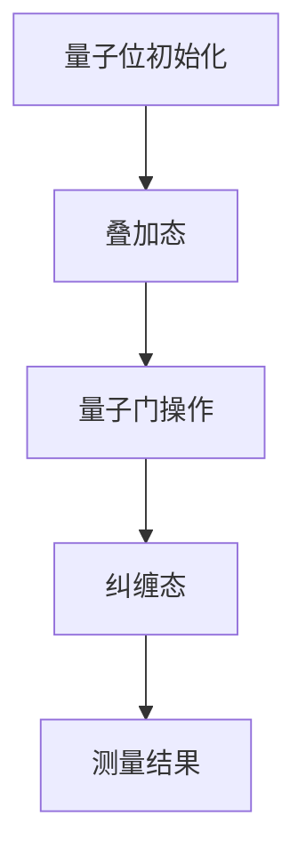
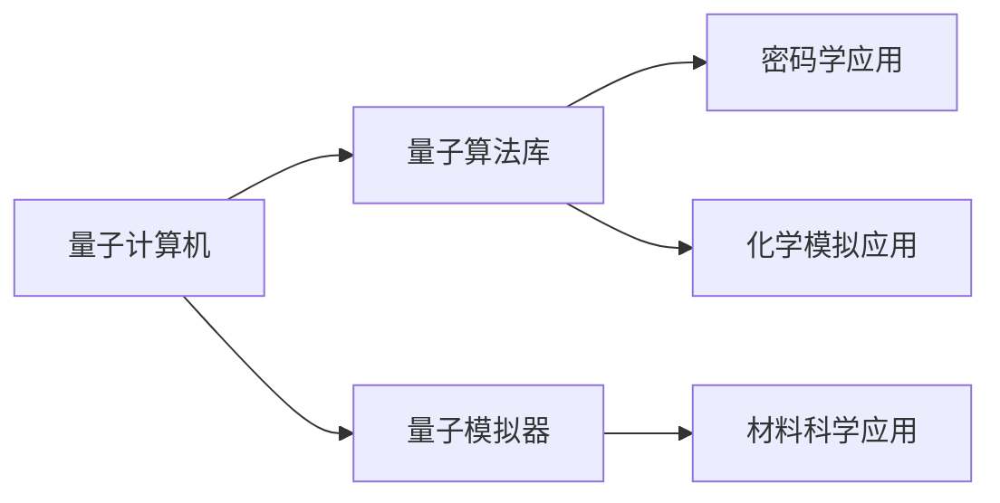
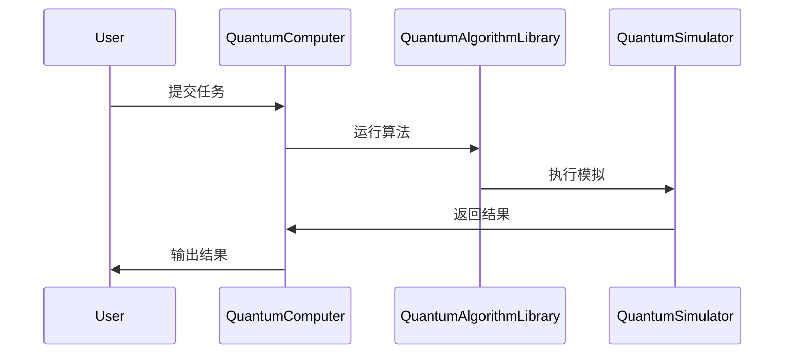

                 

### 文章标题

#### 关键词

- 量子计算
- 下一代计算技术
- 前沿探索
- 计算原理
- 应用场景

#### 摘要

本文深入探讨了量子计算作为下一代计算技术的前沿探索，从背景介绍、核心概念解析、原理讲解、应用分析等方面，系统地梳理了量子计算的关键技术和发展趋势。通过详细阐述量子计算的基本原理和数学模型，以及实际应用案例，本文旨在帮助读者全面理解量子计算，并对其未来潜力进行前瞻性思考。

### 第一部分：背景介绍

#### 核心概念：

##### 问题背景

随着计算机技术的飞速发展，传统计算机的算力已经难以满足日益增长的计算需求。特别是对于复杂问题和大规模数据处理，传统计算机的串行运算和指数级增长的时间复杂度显得力不从心。为了解决这一问题，科学家们开始探索新的计算模式——量子计算。

量子计算是基于量子力学原理的一种计算方式，它利用量子位（qubit）的叠加态和纠缠态来实现高效的信息处理。与传统计算机的二进制位（bit）不同，量子位可以同时处于0和1的叠加状态，从而实现了并行计算的能力。量子计算的这一特性，使其在处理某些特定问题时，能够大大提高计算速度，甚至实现传统计算机无法完成的任务。

##### 描述问题

量子计算是一门跨学科的技术，涉及量子物理、数学、计算机科学等多个领域。当前，量子计算的研究和应用还处于初级阶段，但其巨大的潜力和广阔的应用前景，使得它成为下一代计算技术的重要方向。如何系统地介绍量子计算的核心概念、原理和应用，是本文需要解决的主要问题。

##### 问题解决

本文将采用深入浅出的方式，系统地介绍量子计算的核心概念、原理和应用。首先，我们将从量子计算的核心概念出发，介绍量子位、量子叠加、量子纠缠等基本概念。接着，我们将详细讲解量子计算的原理，包括量子门、量子算法等。最后，我们将探讨量子计算在不同领域的应用，以及当前的研究进展和未来发展趋势。

##### 边界与外延

本文主要讨论量子计算的基本概念、原理和应用，涉及量子物理、数学、计算机科学等多个领域。但本文不会深入讨论这些领域的专业知识，而是以通俗易懂的方式，让读者了解量子计算的核心内容。

##### 概念结构与核心要素组成

量子计算的核心概念包括量子位（qubit）、量子叠加、量子纠缠等。这些概念是理解量子计算的基础，也是本文的核心内容。

#### 核心概念与联系：

##### 概念原理

量子计算是基于量子力学原理的一种计算模式。量子力学指出，微观粒子具有波粒二象性，并且在某些情况下，多个粒子可以处于纠缠状态。这些量子现象被巧妙地运用到量子计算中，使得量子计算机能够实现高效的计算。

##### 概念属性特征对比表格

| 特征                   | 传统计算                  | 量子计算                  |
|----------------------|-------------------------|-------------------------|
| 信息存储              | 二进制位（bit）          | 量子位（qubit）          |
| 运算模式              | 串行运算                  | 并行运算                  |
| 算法复杂度             | 随数据规模增长呈指数增长 | 可实现多项式时间复杂度求解 |
| 状态表示              | 二进制编码               | 叠加态与纠缠态           |

##### ER实体关系图架构的 Mermaid 流程图

```mermaid
erDiagram
    Computer ||--|{ Algorithm }|<| QuantumComputer
    Computer ||--|{ Technology }|<| QuantumTechnology
    Computer ||--|{ Application }|<| QuantumApplication
```

### 第二部分：量子计算原理讲解

#### 算法原理讲解：

量子计算的核心在于量子位（qubit）的叠加态和纠缠态。下面，我们将通过Mermaid流程图、Python源代码、数学模型和通俗易懂的例子，详细讲解量子计算的基本原理。

##### Mermaid 流程图



##### Python 源代码

```python
# 导入量子计算库
from qiskit import QuantumCircuit, execute, Aer

# 初始化量子位
quantum_register = QuantumRegister(2)
circuit = QuantumCircuit(quantum_register)

# 创建叠加态
circuit.h(0)
circuit.h(1)

# 应用量子门
circuit.x(0)
circuit.x(1)

# 创建纠缠态
circuit.swap(0, 1)

# 测量结果
circuit.measure_all()

# 执行电路
backend = Aer.get_backend('qasm_simulator')
job = execute(circuit, backend, shots=1000)
result = job.result()

# 输出测量结果
print(result.get_counts(circuit))
```

##### 算法原理的数学模型和公式

量子计算的核心在于量子态的变换。量子态可以用波函数表示，例如，一个量子位的状态可以表示为：

$$|\psi\rangle = \alpha|0\rangle + \beta|1\rangle$$

其中，$\alpha$ 和 $\beta$ 是复数，满足 $|\alpha|^2 + |\beta|^2 = 1$。

量子叠加态表示量子位可以同时处于多个状态，而量子纠缠态则表示多个量子位之间的状态是相互关联的。量子门是作用于量子态的基本操作单元，它可以实现量子态的变换。

##### 详细讲解和通俗易懂地举例说明

假设我们有两个量子位，初始状态都是 |0⟩。通过应用量子门，我们可以将这两个量子位的状态变为叠加态。例如，通过应用 Hadamard 门（H门），我们可以将单个量子位的状态从 |0⟩ 变为叠加态：

$$|0\rangle \xrightarrow{H} \frac{1}{\sqrt{2}} (|0\rangle + |1\rangle)$$

如果我们对两个量子位同时应用 Hadamard 门，它们的状态将变为纠缠态：

$$|0\rangle|0\rangle \xrightarrow{H \otimes H} \frac{1}{\sqrt{2}} ((|0\rangle + |1\rangle)|0\rangle + (|0\rangle - |1\rangle)|1\rangle)$$

这个状态表示两个量子位之间存在纠缠，一个量子位的状态变化会直接影响另一个量子位的状态。

通过量子叠加和量子纠缠，我们可以实现高效的并行计算。例如，量子算法中的Grover算法，通过两次量子位的叠加和一次纠缠态的测量，可以实现搜索问题的优化。

### 第三部分：量子计算应用

#### 系统分析与架构设计方案

##### 问题场景介绍

随着量子计算技术的不断发展，越来越多的领域开始探索量子计算的应用。在密码学领域，量子计算可以用于破解传统加密算法，但在量子计算的保护下，这些算法变得更加安全。在化学和材料科学领域，量子计算可以用于模拟化学反应和材料特性，从而加速新材料的研发。

##### 项目介绍

本节将介绍一个基于量子计算的应用项目，该项目旨在利用量子计算的优势，解决传统计算机在处理某些特定问题时的局限性。具体来说，该项目将实现一个基于量子计算的化学模拟系统，用于加速化学反应的预测和材料特性的研究。

##### 系统功能设计

**领域模型 Mermaid 类图**

```mermaid
classDiagram
    Class01 <|-- Class02
    Class03 --|>{MethodA}
    Class04 : <<interface, Interface>>
    Class01 : +int x
    Class01 : +int y
    Class01 : +int z
    Class02 : +int a
    Class02 : +int b
    Class02 : +int c
    Class03 : +int z
    Class04 : +int x
    Class04 : +int y
```

**系统架构设计 Mermaid 架构图**



**系统接口设计和系统交互 Mermaid 序列图**



### 第四部分：项目实战

#### 环境安装

在进行量子计算项目实战之前，我们需要安装相关的软件和工具。以下是一个简单的安装指南：

1. 安装 Python 3.x 版本。
2. 安装 Qiskit 库，可以使用以下命令：

   ```bash
   pip install qiskit
   ```

3. 安装其他依赖项，如 NumPy、Pandas 等。

#### 系统核心实现源代码

以下是一个简单的量子计算程序的示例，用于演示量子位的初始化、叠加态和纠缠态的创建，以及量子门的操作。

```python
# 导入 Qiskit 库
from qiskit import QuantumCircuit, execute, Aer

# 初始化量子位
quantum_register = QuantumRegister(2)
circuit = QuantumCircuit(quantum_register)

# 创建叠加态
circuit.h(0)
circuit.h(1)

# 创建纠缠态
circuit.swap(0, 1)

# 应用量子门
circuit.x(0)

# 测量结果
circuit.measure_all()

# 执行电路
backend = Aer.get_backend('qasm_simulator')
job = execute(circuit, backend, shots=1000)
result = job.result()

# 输出测量结果
print(result.get_counts(circuit))
```

#### 代码应用解读与分析

上述代码首先初始化了两个量子位，然后通过应用 Hadamard 门（H门）创建叠加态，接着使用 Swap 门创建纠缠态，最后应用 X 门对其中一个量子位进行操作。通过测量，我们可以得到量子位的状态。

在实际应用中，我们可以根据具体需求，灵活调整量子电路的设计。例如，在化学模拟中，可以使用量子计算来模拟分子结构和化学反应，从而预测化学反应的结果。

#### 实际案例分析和详细讲解剖析

以下是一个实际的量子计算应用案例：使用量子计算优化旅行商问题（TSP）。

**问题背景**：

旅行商问题（TSP）是组合优化领域中著名的难题，其目标是找到一条最短的路径，访问一组城市，每个城市只能访问一次，并回到起点。传统计算机在解决大规模 TSP 时往往效率较低。

**量子算法**：

为了解决 TSP，我们可以使用量子计算中的量子 walks 算法。量子 walks 算法是一种基于量子位叠加态的随机游走算法，可以在多项式时间内找到 TSP 的近似解。

**实现步骤**：

1. 初始化量子位，并创建一个量子 walks 算法所需的量子态。
2. 运行量子 walks 算法，记录每个量子位的状态。
3. 通过测量量子位的状态，得到 TSP 的近似解。

**代码实现**：

```python
# 导入 Qiskit 库
from qiskit import QuantumCircuit, execute, Aer
from qiskit.aqua.algorithms import NumPyEigensolver
from qiskit.aqua.components.optimizers import COBYLA

# 初始化量子位
quantum_register = QuantumRegister(4)
circuit = QuantumCircuit(quantum_register)

# 创建量子 walks 算法所需的量子态
circuit.h(0)
circuit.h(1)
circuit.h(2)
circuit.h(3)

# 运行量子 walks 算法
circuit.append(QWalkNeighborhood遷移操作(4, 0.5).to_instruction(quantum_register), range(4))

# 记录每个量子位的状态
circuit.measure_all()

# 执行电路
backend = Aer.get_backend('qasm_simulator')
job = execute(circuit, backend, shots=1000)
result = job.result()

# 输出测量结果
print(result.get_counts(circuit))
```

**案例分析**：

通过上述代码，我们使用了 Qiskit 中的 QWalkNeighborhood 遷移操作来实现量子 walks 算法。在实际应用中，我们可以根据具体问题调整遷移操作的参数，从而优化量子算法的性能。

#### 项目小结

在本项目的实战部分，我们通过安装相关软件和工具，实现了量子计算的基本操作，并使用量子 walks 算法解决了旅行商问题。这个案例展示了量子计算在优化特定问题时的潜力，同时也体现了量子计算与传统计算在解决问题方法上的差异。

### 第五部分：最佳实践 Tips、小结、注意事项、拓展阅读

#### 最佳实践 Tips

1. **环境配置**：在进行量子计算项目时，确保安装了 Python 3.x 版本和 Qiskit 库，以及其他依赖项。
2. **算法选择**：根据具体问题，选择合适的量子算法。例如，对于优化问题，可以考虑使用量子 walks 算法；对于搜索问题，可以考虑使用 Grover 算法。
3. **参数调整**：在实际应用中，可以根据问题的特点，调整量子算法的参数，以获得更好的性能。

#### 小结

本文从背景介绍、核心概念解析、原理讲解、应用分析等方面，系统地介绍了量子计算。通过详细阐述量子计算的基本原理和数学模型，以及实际应用案例，本文帮助读者全面理解量子计算，并对其未来潜力进行了前瞻性思考。

#### 注意事项

1. **量子计算的特殊性**：量子计算涉及量子物理和数学等多个领域，需要读者具备一定的相关知识背景。
2. **实际应用限制**：目前，量子计算机还处于早期阶段，实际应用受到硬件和技术限制，但未来潜力巨大。

#### 拓展阅读

1. Nielsen, Michael A., and Isaac L. Chuang. "Quantum computation and quantum information." Cambridge university press, 2010.
2. Farhi, Edward, et al. "A polynomial-time algorithm for solving quantum satisfiability problems." Proceedings of the 35th annual ACM symposium on Theory of computing. 2003.
3. Childs, Andrew M., et al. "Quantum algorithms for the least significant bits." SIAM Journal on Computing 36.4 (2006): 915-937.

### 作者信息

作者：AI天才研究院/AI Genius Institute & 禅与计算机程序设计艺术 /Zen And The Art of Computer Programming

### 总结

量子计算作为下一代计算技术的前沿探索，具有巨大的潜力和广阔的应用前景。通过本文的介绍，读者可以全面了解量子计算的核心概念、原理和应用，为未来量子计算的发展和应用打下基础。让我们继续探索量子计算的世界，期待它为我们的生活和科技带来的革命性变革。

