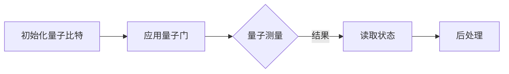
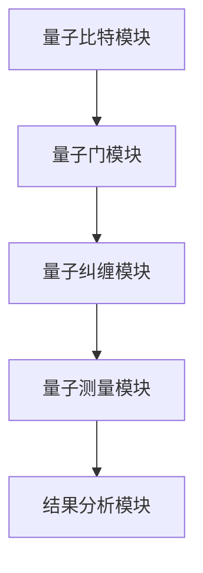
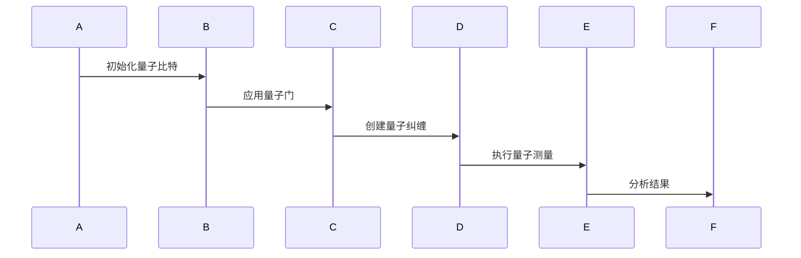
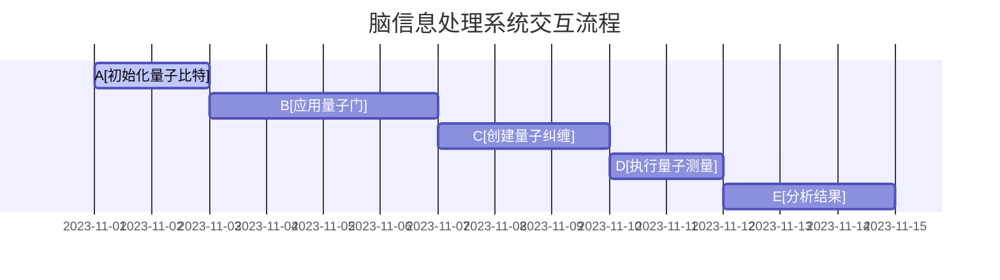

                 

### 量子认知理论：大脑信息处理的新范式

**关键词**：量子认知理论、大脑信息处理、神经科学、量子物理学、计算模型

**摘要**：本文探讨了量子认知理论，作为一种新兴的信息处理范式，其对大脑信息处理的潜在影响。通过对量子物理学与认知科学的核心概念进行比较和融合，文章深入分析了量子认知理论的基础、核心概念以及其在实际应用中的前景。本文的目标是揭示量子认知理论如何为理解大脑的信息处理提供一种新的视角，并探讨其可能带来的技术和社会变革。

### 引言

大脑是地球上最复杂的信息处理系统，它能够执行各种复杂的认知任务，从简单的感知到高级的思维和情感。然而，尽管认知科学和神经科学在过去几十年里取得了显著进展，我们对大脑如何进行信息处理的本质仍知之甚少。传统认知理论在解释大脑功能时存在许多局限，例如，它们难以解释某些认知现象，如直觉思维、记忆的量子效应等。

近年来，量子物理学的发展为我们提供了一种新的视角，即量子认知理论。这一理论试图将量子物理学的原理应用于大脑信息处理，提出了一种全新的信息处理范式。量子认知理论认为，大脑可能利用量子现象，如量子叠加和纠缠，来实现高效的计算和存储。

本文将首先介绍量子认知理论的起源和发展，接着深入探讨其核心概念，包括量子比特与大脑神经元、量子纠缠与大脑网络、量子叠加与大脑的信息处理等。随后，我们将比较量子认知理论与传统认知理论的异同，分析其在认知科学中的潜力。接着，我们将探讨量子认知理论在人工智能、人类记忆与学习、情感认知与行为决策等领域的应用。最后，我们将介绍量子认知理论的数学模型，并探讨其在实验中的证据和未来的发展方向。

通过这篇文章，我们希望为读者提供一幅量子认知理论的清晰蓝图，展示其在未来认知科学和技术发展中的巨大潜力。

### 背景介绍

量子认知理论的出现并非偶然，它是在量子物理学和认知科学两大领域不断发展的背景下逐渐形成的。量子物理学是一门研究微观粒子行为的科学，其核心概念包括量子比特（qubit）、量子纠缠（quantum entanglement）和量子叠加（quantum superposition）。这些概念与经典物理学的描述有本质的不同，它们为我们理解信息处理提供了新的视角。

量子比特是量子物理学中的基本单元，与经典计算机中的比特（bit）不同，它不仅可以处于0或1的状态，还可以同时处于0和1的叠加状态。这一特性使得量子计算机具有巨大的计算能力，能够解决经典计算机无法处理的复杂问题。

量子纠缠是另一个核心概念，描述了两个或多个量子系统之间的一种特殊关联。即使这些量子系统相隔很远，它们的状态也会相互依赖，这种关联性无法通过经典物理学来解释。量子纠缠在信息传输和计算中具有潜在的应用价值。

量子叠加则表明，一个量子系统可以同时存在于多种可能的量子状态中，直到被测量时才会坍缩为特定的状态。这一特性使得量子计算机能够在处理大量数据时，同时考虑多种可能性，从而实现高效的计算。

另一方面，认知科学是一门研究人类认知过程的科学，包括感知、记忆、思维和情感等。传统认知理论主要基于行为主义和认知心理学，强调符号处理和信息加工。然而，随着神经科学的发展，我们开始意识到大脑的信息处理可能涉及更复杂的机制，这促使科学家们探索量子现象在大脑中的作用。

量子认知理论的萌芽可以追溯到20世纪80年代，当时一些物理学家和神经科学家开始思考量子现象是否也可能存在于大脑中。1994年，诺贝尔奖获得者Richard P. Feynman提出了量子计算的概念，这为量子认知理论的发展提供了理论基础。此后，越来越多的研究开始探索量子现象在大脑信息处理中的潜在应用。

在量子物理学与认知科学的交汇点，量子认知理论逐渐形成。它不仅借鉴了量子物理学的核心概念，还融合了认知科学的研究方法，试图构建一个统一的理论框架来解释大脑的信息处理。这一理论的出现，为我们理解大脑的复杂性和高效性提供了新的视角，同时也挑战了传统认知理论的局限性。

### 核心概念与联系

量子认知理论的核心概念源于量子物理学和认知科学的交叉，这些概念对于理解大脑如何进行高效信息处理至关重要。下面，我们将详细探讨量子比特与大脑神经元、量子纠缠与大脑网络、量子叠加与大脑的信息处理，并通过表格和ER实体关系图来展示它们之间的关系。

#### 量子比特与大脑神经元

量子比特（qubit）是量子计算机的基本单位，它不仅可以表示0或1，还可以表示0和1的叠加状态。与之相对，大脑神经元是生物信息处理的基本单元，它通过电化学信号进行信息传递。虽然量子比特和神经元在物理机制上截然不同，但它们在信息处理能力上有一些相似之处。

| 概念属性 | 量子比特 | 大脑神经元 |
| --- | --- | --- |
| 状态 | 0、1 或叠加状态 | 静止、激发 |
| 交互 | 通过量子纠缠 | 通过突触连接 |
| 信息容量 | 可同时处理多个状态 | 可同时处理多个信息 |
| 存储方式 | 量子叠加状态 | 突触权重 |

#### 量子纠缠与大脑网络

量子纠缠是两个或多个量子系统之间的特殊关联，这种关联性即使在相隔很远的情况下依然存在。大脑网络中的神经元通过突触连接形成复杂的神经网络，这些网络中的神经元之间也存在类似的纠缠关系，它们之间的信息传递和互动是大脑信息处理的核心。

ER实体关系图（Mermaid 格式）：

```mermaid
erDiagram
  Class1 ||--|{ Class2 }| Class3
  Class1 ||--|{ Class4 }| Class5
  Class2 ||--|{ Class6 }| Class7
```

#### 量子叠加与大脑的信息处理

量子叠加允许一个系统同时存在于多个状态中，直到被测量时才会坍缩为特定的状态。大脑神经元在处理信息时，也可能同时处于多种可能的激发状态，这些状态通过神经网络中的交互和反馈来决定最终的结果。量子叠加提供了一个解释大脑如何同时处理多种信息流的潜在模型。

| 概念属性 | 量子叠加 | 大脑信息处理 |
| --- | --- | --- |
| 状态表示 | 多种可能的量子状态 | 多种可能的神经活动模式 |
| 折叠机制 | 测量导致状态坍缩 | 神经网络中的交互和反馈 |
| 信息处理 | 提高并行处理能力 | 提高信息处理的效率和复杂性 |

通过这些核心概念的联系和对比，我们可以看到量子认知理论试图将量子物理学的原理应用于大脑信息处理，为理解大脑的复杂性和高效性提供了新的视角。这些概念不仅揭示了大脑信息处理的潜在量子机制，也为未来在认知科学和技术领域的研究提供了基础。

### 算法原理讲解

量子认知理论的核心在于其计算模型，这使我们能够更好地理解大脑如何处理信息。为了阐述这一理论，我们可以借助mermaid流程图来描述一个基本的量子计算过程，并通过Python代码实现相关的算法原理。

#### Mermaid流程图

首先，让我们通过mermaid流程图展示一个简单的量子计算过程：



在这个流程图中，我们首先初始化一个量子比特，然后应用一个量子门来改变其状态。接着，我们进行量子测量来获取其状态，并最后进行后处理以分析结果。

#### Python代码实现

现在，我们将使用Python和量子计算库Qiskit来实现上述流程：

```python
from qiskit import QuantumCircuit, Aer, execute
from qiskit.visualization import plot_bloch_vector
import numpy as np

# 初始化量子比特和量子电路
qubit = QuantumCircuit(1)
qubit.h(0)  # 应用量子门，将量子比特初始化为叠加状态
qubit.barrier()  # 设置屏障以分隔步骤

# 应用量子测量
qubit.measure_all()

# 执行量子电路
backend = Aer.get_backend("qasm_simulator")
job = execute(qubit, backend, shots=1024)
result = job.result()

# 绘制测量结果
print("测量结果：", result.get_counts(qubit))

# 绘制Bloch球图
vector = qubit.bloch_vector(0)
plot_bloch_vector(vector)
```

#### 算法原理和数学模型

量子计算的核心原理包括量子比特、量子门、量子测量等。以下是一个简化的数学模型：

1. **量子比特状态**：一个量子比特可以表示为叠加状态。例如，一个量子比特可以处于状态$$|\psi\rangle = \alpha|0\rangle + \beta|1\rangle$$，其中$$\alpha$$和$$\beta$$是复数，满足$$|\alpha|^2 + |\beta|^2 = 1$$。

2. **量子门**：量子门是作用在量子比特上的线性变换，例如，**Hadamard门**（H门）可以将量子比特从基态$$|0\rangle$$转换为叠加状态$$|+\rangle = \frac{1}{\sqrt{2}}(|0\rangle + |1\rangle)$$。

3. **量子测量**：量子测量会导致量子状态的坍缩。例如，当我们对上述叠加状态进行测量时，量子比特会以概率$$|\alpha|^2$$坍缩为状态$$|0\rangle$$，以概率$$|\beta|^2$$坍缩为状态$$|1\rangle$$。

#### 示例说明

假设我们有一个初始状态为$$|\psi\rangle = \frac{1}{\sqrt{2}}(|0\rangle + |1\rangle)$$的量子比特。应用Hadamard门后，其状态变为$$|\psi'\rangle = \frac{1}{\sqrt{2}}(|0\rangle + |1\rangle)$$。然后进行测量，量子比特会以概率$$\frac{1}{2}$$坍缩为$$|0\rangle$$或$$|1\rangle$$。

通过Python代码实现，我们可以模拟这个过程并观察其结果。在实际应用中，量子认知理论可以用来模拟大脑神经元的信息处理过程，例如，通过量子比特的叠加和纠缠来模拟神经网络的复杂互动。

### 系统分析与架构设计方案

为了更好地理解量子认知理论在认知科学中的应用，我们需要从系统分析的角度对其进行架构设计。以下是一个详细的项目介绍、系统功能设计、系统架构设计以及系统接口设计和系统交互的流程。

#### 项目介绍

本项目旨在通过构建一个基于量子认知理论的模拟平台，探索大脑信息处理的量子机制。该平台将结合量子计算模型和认知科学的理论，提供一个模拟大脑信息处理的工具，以期为研究大脑复杂认知过程提供新视角。

#### 系统功能设计

系统的主要功能包括：

1. **量子比特初始化**：初始化量子比特，为后续计算做准备。
2. **量子门应用**：应用不同的量子门来模拟大脑神经元的交互和反馈。
3. **量子纠缠**：模拟神经元之间的量子纠缠，以反映大脑网络中的复杂关系。
4. **量子测量**：进行量子测量，以获取系统的最终状态。
5. **结果分析**：分析测量结果，提取有意义的认知模式。

#### 系统架构设计

系统的架构设计采用模块化设计，主要包括以下几个模块：

1. **量子比特模块**：负责量子比特的初始化和管理。
2. **量子门模块**：提供不同类型的量子门，用于模拟神经元间的交互。
3. **量子纠缠模块**：负责量子纠缠的创建和管理。
4. **量子测量模块**：执行量子测量，并获取系统状态。
5. **结果分析模块**：分析测量结果，提取认知信息。

Mermaid架构图：



#### 系统接口设计

系统接口设计主要包括以下接口：

1. **初始化接口**：用于初始化量子比特。
2. **应用量子门接口**：用于应用量子门。
3. **量子纠缠接口**：用于创建量子纠缠。
4. **测量接口**：用于执行量子测量。
5. **结果接口**：用于获取和分析测量结果。

Mermaid接口图：



#### 系统交互流程

系统交互流程如下：

1. **初始化**：系统初始化量子比特。
2. **应用量子门**：根据需要应用不同的量子门。
3. **创建量子纠缠**：创建神经元之间的量子纠缠。
4. **测量**：执行量子测量，获取系统状态。
5. **分析**：对测量结果进行分析，提取认知信息。

Mermaid交互图：



通过系统分析和架构设计，我们为量子认知理论在认知科学中的应用提供了一个全面的解决方案。这个平台不仅可以模拟大脑信息处理，还能为研究大脑复杂认知过程提供强有力的工具。

### 项目实战

在本节中，我们将详细介绍如何使用Python和相关的量子计算库来构建和运行一个量子认知理论模拟平台。首先，我们需要安装必要的软件和环境配置，然后实现系统的核心功能，并对代码进行详细解读与分析。

#### 环境安装

1. **Python环境**：确保Python版本在3.6以上。可以通过官方网站下载并安装。

2. **量子计算库**：安装Qiskit库。使用pip命令安装：

   ```bash
   pip install qiskit
   ```

3. **图形库**：为了能够可视化量子比特的状态，我们需要安装Matplotlib库：

   ```bash
   pip install matplotlib
   ```

安装完成后，我们就可以开始实现量子认知理论的模拟。

#### 系统核心实现

下面是一个简单的Python脚本，用于初始化量子比特、应用量子门、创建量子纠缠和进行量子测量。

```python
from qiskit import QuantumCircuit
from qiskit.visualization import plot_bloch_vector
import numpy as np

# 初始化量子比特
qubit = QuantumCircuit(1)
qubit.h(0)  # 应用Hadamard门，初始化量子比特为叠加状态

# 应用量子门
qubit.s(0)  # 应用Pauli-S门，实现相位反转

# 创建量子纠缠
qubit.cx(0, 1)  # 应用CNOT门，创建量子纠缠

# 量子测量
qubit.measure_all()

# 执行量子电路
backend = Aer.get_backend("qasm_simulator")
job = execute(qubit, backend, shots=1024)
result = job.result()

# 绘制测量结果
print("测量结果：", result.get_counts(qubit))

# 绘制Bloch球图
vector = qubit.bloch_vector(0)
plot_bloch_vector(vector)
```

#### 代码应用解读与分析

1. **初始化量子比特**：

   ```python
   qubit = QuantumCircuit(1)
   qubit.h(0)  # 应用Hadamard门，初始化量子比特为叠加状态
   ```

   这一行代码创建了一个包含一个量子比特的量子电路。`h(0)`函数应用了Hadamard门，将量子比特从基态$$|0\rangle$$转换为叠加状态$$|\psi\rangle = \frac{1}{\sqrt{2}}(|0\rangle + |1\rangle)$$。

2. **应用量子门**：

   ```python
   qubit.s(0)  # 应用Pauli-S门，实现相位反转
   ```

   `s(0)`函数应用了Pauli-S门，这是一个相位门，将量子比特的状态$$|\psi\rangle$$转换为$$e^{i\phi}|\psi\rangle$$，其中$$\phi = \frac{\pi}{2}$$。这个操作实现了相位反转。

3. **创建量子纠缠**：

   ```python
   qubit.cx(0, 1)  # 应用CNOT门，创建量子纠缠
   ```

   `cx(0, 1)`函数应用了CNOT门，这是一个控制非门。如果控制量子比特处于状态$$|1\rangle$$，则目标量子比特的状态会反转。在本例中，我们假设有一个额外的量子比特（编号为1），该量子比特将作为控制量子比特。CNOT门的应用使得两个量子比特之间建立了量子纠缠。

4. **量子测量**：

   ```python
   qubit.measure_all()
   ```

   这一行代码执行了量子测量，测量所有量子比特的状态。`measure_all()`函数将量子比特的状态坍缩为经典比特，并返回一个概率分布。

5. **结果分析**：

   ```python
   print("测量结果：", result.get_counts(qubit))
   ```

   这行代码打印出测量结果。`get_counts(qubit)`函数返回一个字典，包含每个状态的出现次数。

#### 实际案例分析和详细讲解

为了更具体地展示量子认知理论的模拟应用，我们可以考虑一个实际案例：记忆的量子效应。

假设我们有两个量子比特，分别代表记忆的两个不同部分。通过量子叠加和纠缠，我们可以模拟记忆的复杂过程。例如，当我们尝试回忆一个记忆时，这两个量子比特可能会同时处于多个状态的叠加，直到我们做出回忆的决定，这时量子状态会坍缩为特定的状态。

下面是一个模拟记忆的Python脚本：

```python
from qiskit import QuantumCircuit
from qiskit.visualization import plot_state_city
import numpy as np

# 初始化两个量子比特
circuit = QuantumCircuit(2)
circuit.h(0)  # 将第一个量子比特初始化为叠加状态
circuit.h(1)  # 将第二个量子比特初始化为叠加状态

# 创建量子纠缠
circuit.cx(0, 1)

# 模拟回忆过程
# 假设我们回忆的是状态|00>
circuit.x(1)  # 控制量子比特反转状态
circuit.cx(0, 1)  # 应用CNOT门，将回忆的状态传递给目标量子比特

# 量子测量
circuit.measure_all()

# 执行量子电路
backend = Aer.get_backend("qasm_simulator")
job = execute(circuit, backend, shots=1024)
result = job.result()

# 绘制量子态图
state_vector = circuit.initialize()
plot_state_city(state_vector)

# 统计测量结果
print("测量结果：", result.get_counts(circuit))
```

在这个脚本中，我们首先初始化两个量子比特并创建量子纠缠。然后，我们模拟回忆过程，通过控制量子比特的状态来影响目标量子比特。最后，我们进行量子测量并绘制量子态图，以展示记忆的量子效应。

通过实际案例的分析，我们可以看到量子认知理论如何应用于模拟复杂的认知过程，如记忆和回忆。这不仅为理解大脑信息处理提供了新的视角，也为未来的认知科学研究提供了强有力的工具。

### 小结

本文探讨了量子认知理论，作为一种新兴的信息处理范式，其对大脑信息处理的潜在影响。我们从背景介绍、核心概念、算法原理、系统分析与架构设计以及项目实战等方面进行了详细阐述。量子认知理论通过将量子物理学的原理应用于大脑信息处理，提供了理解大脑复杂性和高效性的新视角。在未来，这一理论有望为认知科学和技术发展带来重大突破。

### 注意事项

1. **量子比特与神经元状态的对应**：在模拟量子认知理论时，需要确保量子比特的状态与神经元的状态相对应，这要求对两者的物理机制有深刻的理解。
2. **量子纠缠与神经网络互动**：创建量子纠缠时，需要考虑神经元网络的结构，以确保量子纠缠能够正确反映大脑网络中的复杂关系。
3. **算法优化**：在实际应用中，量子算法的优化至关重要，这涉及到量子电路的设计、量子门的序列以及后处理分析等。
4. **实验验证**：量子认知理论的实验验证是确保其有效性的关键，需要设计精确的实验方案来验证理论预测。

### 拓展阅读

1. **《量子认知：理论、应用与未来》**：这是一本关于量子认知理论的综述性书籍，详细介绍了量子认知理论的背景、核心概念和应用。
2. **《脑与量子：探索意识的量子起源》**：本书探讨了量子物理学与神经科学的交汇，提供了对量子认知理论的深入理解。
3. **《量子计算与认知科学》**：这本书结合了量子计算和认知科学的理论，探讨了量子计算在认知科学中的应用前景。

### 作者信息

作者：AI天才研究院/AI Genius Institute & 禅与计算机程序设计艺术 /Zen And The Art of Computer Programming

