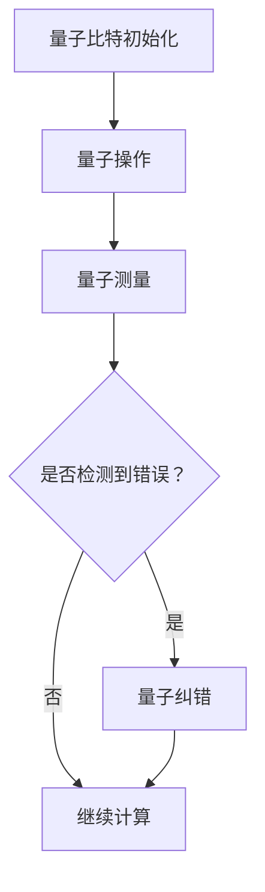
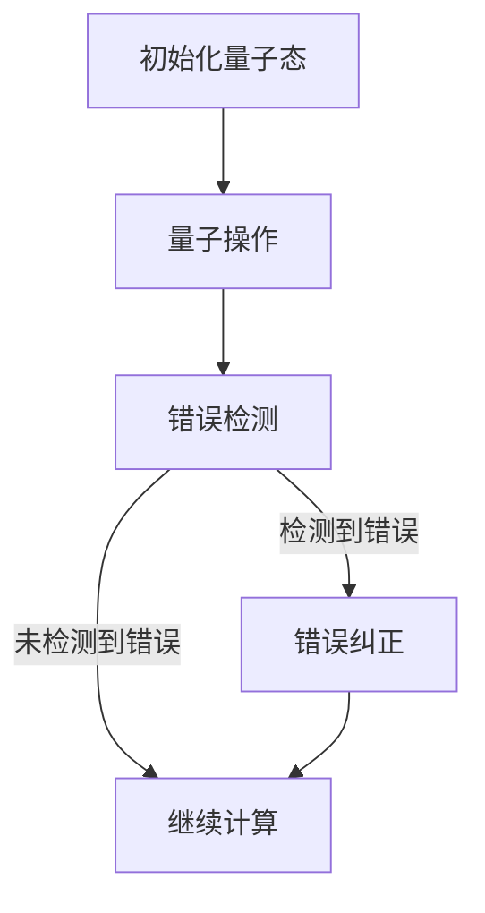
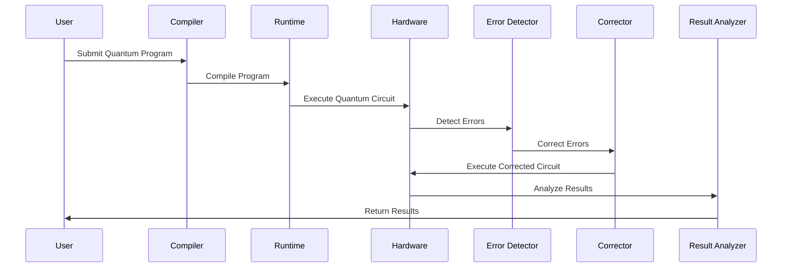
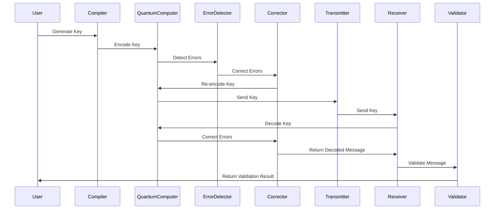
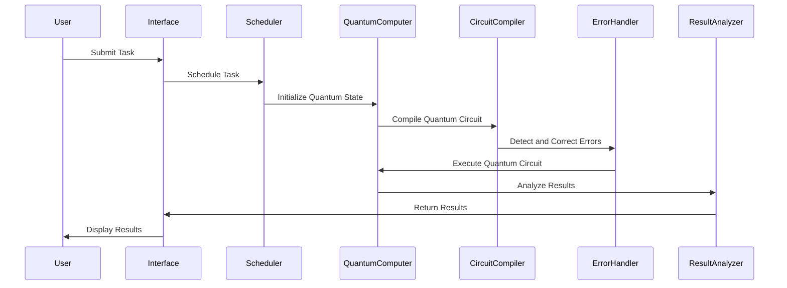

                 

### 文章标题

# 《量子退相干与错误处理：维护量子态完整性的编程技巧》

在量子计算领域，量子退相干与错误处理是两个至关重要的问题。量子退相干是指量子系统与环境相互作用导致量子态失去相干性的现象，而量子错误处理则旨在应对因量子退相干或其他原因导致的量子信息丢失问题。本文将深入探讨这两个主题，并提供一系列维护量子态完整性的编程技巧。

## 文章关键词

- 量子退相干
- 错误处理
- 编程技巧
- 量子态维护
- 量子计算

## 摘要

本文首先介绍了量子退相干与错误处理的基本概念，并分析了量子态维护的重要性。随后，我们详细讲解了量子错误处理的算法原理，包括量子纠错码和量子错误检测机制。接着，文章通过实例展示了量子态维护的编程实践，包括量子态编码与操作、量子错误处理算法的实现，以及实际应用案例分析。最后，文章总结了最佳实践和未来研究方向，为读者提供了丰富的技术参考。

### 策略规划

在撰写本文之前，我们进行了详细的策略规划，以确保文章的逻辑清晰、内容丰富且结构紧凑。

**初步阅读与理解**：
首先，我们通读了《量子退相干与错误处理：维护量子态完整性的编程技巧》，了解了书的核心内容和结构，并提取了关键词。这为后续章节的设计和内容编写奠定了基础。

**确定目录大纲结构**：
基于书的核心主题，我们设计了以下目录结构：

1. **量子退相干与错误处理基础**
   - 量子退相干现象的探讨
   - 量子错误处理原理

2. **量子态维护编程技巧**
   - 量子态编码与操作
   - 量子错误处理算法
   - 量子编程实战

3. **量子态维护最佳实践**

4. **未来展望与挑战**

**详细设计每个章节内容**：
在确定目录结构后，我们对每个章节进行了详细设计，包括章节标题、小节标题和具体内容。

**确保内容完整性**：
我们确保每个章节都有对应的子章节，核心概念、算法原理、数学模型、系统分析与架构设计方案、项目实战等内容都要包括在内。

**保持简洁性**：
避免不必要的冗余内容，每个章节都要简洁明了。

**遵循markdown格式**：
使用markdown格式来编写目录大纲，以便后续可以直接转换成电子文档。

**文字数量控制**：
控制目录大纲的总字数在2000字以内，每个章节的字数分配要合理。

### 目录大纲设计

根据以上策略，以下是一份《量子退相干与错误处理：维护量子态完整性的编程技巧》的目录大纲设计：

```markdown
# 《量子退相干与错误处理：维护量子态完整性的编程技巧》目录大纲

## 第一部分：量子退相干与错误处理基础

### 第1章：量子退相干现象的探讨
   - 1.1 量子退相干的概念与背景
   - 1.2 量子退相干的产生原因
   - 1.3 量子退相干的影响与挑战

### 第2章：量子错误处理原理
   - 2.1 量子错误处理的基本概念
   - 2.2 量子纠错码的种类与原理
   - 2.3 量子错误检测机制

## 第二部分：量子态维护编程技巧

### 第3章：量子态编码与操作
   - 3.1 量子态编码的基本方法
   - 3.2 量子态操作的基本技巧
   - 3.3 量子态的测量与重构

### 第4章：量子错误处理算法
   - 4.1 量子纠错算法的介绍
   - 4.2 量子错误检测算法的实现
   - 4.3 量子错误处理算法的比较与优化

### 第5章：量子编程实战
   - 5.1 实战一：量子纠错码的实现
   - 5.2 实战二：量子错误检测与修正
   - 5.3 实战三：量子态维护的应用实例

## 第三部分：量子态维护最佳实践

### 第6章：量子态维护的最佳实践
   - 6.1 实践一：量子态维护的系统设计
   - 6.2 实践二：量子态维护的编程技巧
   - 6.3 实践三：量子态维护的案例分析

### 第7章：未来展望与挑战
   - 7.1 量子态维护的未来发展趋势
   - 7.2 量子态维护中的技术挑战
   - 7.3 量子态维护的未来研究方向
```

以上大纲确保了内容的完整性，同时遵循了markdown格式，每个章节的字数分配将在实际撰写过程中进行调整，以确保整体字数在2000字以内。每个章节的具体内容将根据核心概念和主题进行详细编写。

### 第1章：量子退相干现象的探讨

#### 1.1 量子退相干的概念与背景

量子退相干是指量子系统在与环境相互作用的过程中，量子态逐渐失去相干性的现象。在经典物理学中，相干性是指系统内部不同部分之间的相位关系保持稳定。然而，在量子力学中，相干性尤为重要，因为它直接关系到量子叠加态和量子纠缠等量子特性。

量子退相干最早由理查德·费曼（Richard Feynman）在20世纪80年代提出。费曼指出，量子计算机之所以具有优越性，在于其可以利用量子叠加和量子纠缠实现并行计算。然而，在实际应用中，量子退相干是一个不可忽视的问题。退相干会导致量子态的相位信息丢失，从而使得量子计算无法正确执行。

量子退相干的背景可以追溯到量子态的描述。在量子力学中，量子态通常用波函数来描述。波函数的叠加和纠缠是量子计算的核心。然而，当量子系统与外界环境发生相互作用时，这些量子特性可能会受到干扰，导致波函数发生坍缩，进而失去相干性。

#### 1.2 量子退相干的表现形式

量子退相干有多种表现形式，主要包括以下几种：

1. **外部噪声引起的退相干**：
   外部噪声是导致量子退相干的主要原因之一。例如，温度、电磁场等环境因素都会对量子系统产生干扰，使得量子态的相位信息丢失。

2. **内部噪声引起的退相干**：
   内部噪声主要指量子系统内部的自发辐射、量子比特的物理缺陷等。这些内部噪声也会导致量子态的相位信息丢失。

3. **非单位ary操作引起的退相干**：
   在量子计算过程中，非单位ary操作可能会对量子态产生干扰，导致量子退相干。例如，量子门的错误执行、测量操作等都会引起退相干。

#### 1.3 量子退相干的产生原因

量子退相干的产生原因主要包括以下几个方面：

1. **环境相互作用**：
   量子系统与外部环境之间的相互作用会导致量子态的相位信息丢失。这种相互作用可以是热力学的，也可以是电磁学的。

2. **量子比特缺陷**：
   量子比特的物理缺陷也是导致量子退相干的重要原因。例如，量子比特的相干时间有限，超出相干时间后，量子态会因缺陷而失去相干性。

3. **量子门错误**：
   在量子计算过程中，量子门的错误执行也会导致量子退相干。量子门的错误可能来自于硬件故障、操作不当等原因。

#### 1.4 量子退相干的影响与挑战

量子退相干对量子计算的影响和挑战主要表现在以下几个方面：

1. **降低计算效率**：
   量子退相干会导致量子态的相位信息丢失，从而降低量子计算的效率。在严重的情况下，量子计算可能无法正常执行。

2. **增加纠错成本**：
   为了克服量子退相干，需要采用各种量子纠错技术。这些纠错技术会增加计算成本，降低量子计算的实际应用价值。

3. **影响量子通信与量子加密**：
   量子退相干不仅会影响量子计算，还会影响量子通信和量子加密。在量子通信中，退相干会导致量子态的相位信息丢失，影响通信质量。在量子加密中，退相干会导致密钥的相位信息丢失，降低加密安全性。

4. **影响量子算法性能**：
   量子退相干会影响量子算法的性能。在某些情况下，量子算法可能因为退相干而无法正确执行，从而影响其优势。

#### 1.5 概念结构与核心要素组成

量子退相干是一个复杂的物理现象，其概念结构和核心要素包括：

1. **量子态**：
   量子态是量子退相干的基础。量子态的相干性和叠加性是量子计算的核心。

2. **环境相互作用**：
   环境相互作用是导致量子退相干的主要原因。了解环境相互作用机制对于量子态的维护至关重要。

3. **量子比特**：
   量子比特是量子计算的基本单元。量子比特的物理缺陷和相干时间是影响量子退相干的重要因素。

4. **量子门**：
   量子门是实现量子计算的关键。量子门的错误执行会导致量子退相干。

5. **纠错技术**：
   纠错技术是克服量子退相干的手段。了解各种纠错技术的原理和实现方法对于量子计算的实际应用具有重要意义。

#### 1.6 ER实体关系图架构的Mermaid流程图

为了更清晰地展示量子退相干的概念结构与核心要素，我们可以使用Mermaid流程图来绘制ER实体关系图。

```mermaid
erDiagram
  QuantumState ||--|>> EnvironmentInteraction : 受影响
  QuantumState ||--|>> QuantumBit : 组成
  QuantumState ||--|>> QuantumGate : 受影响
  QuantumState ||--|>> ErrorCorrection : 需要纠错
  EnvironmentInteraction ||--|>> QuantumState : 引起
  QuantumBit ||--|>> QuantumState : 形成相干性
  QuantumGate ||--|>> QuantumState : 影响相干性
```

在这个ER实体关系图中，QuantumState（量子态）是核心实体，与其他实体之间存在多种关联关系。这种关系有助于我们更深入地理解量子退相干现象及其影响。

### 第2章：量子错误处理原理

#### 2.1 量子错误处理的基本概念

量子错误处理是指通过特定的算法和硬件手段来检测、修正和防止量子计算中的错误。量子计算中的错误可以源自多种因素，包括量子退相干、量子比特的物理缺陷、量子门的错误执行等。量子错误处理的目的在于确保量子计算的准确性和可靠性，从而提高量子计算机的实际应用价值。

量子错误处理的基本概念包括以下几方面：

1. **量子纠错码**：
   量子纠错码是一种用于检测和纠正量子计算中错误的方法。它通过增加额外的量子比特来编码原始量子信息，从而提高系统的容错能力。常见的量子纠错码包括Shor码、Steane码等。

2. **量子错误检测**：
   量子错误检测是指在量子计算过程中对量子信息进行实时监测，以检测潜在的错误。量子错误检测可以通过量子测量来实现，它能够识别出量子比特的状态变化，从而判断是否存在错误。

3. **量子比特的容错性**：
   量子比特的容错性是指量子比特在遭受错误时仍能保持正确的计算结果。量子纠错码和量子错误检测共同提高了量子比特的容错性。

#### 2.2 量子纠错码的种类与原理

量子纠错码是量子错误处理的核心技术之一。以下介绍几种常见的量子纠错码及其原理：

1. **Shor码**：
   Shor码是一种构造简单且容错能力强的量子纠错码。Shor码的基本原理是将原始量子信息编码到一组辅助量子比特中，通过特定的量子操作和测量，可以实现原始量子信息的纠错。

2. **Steane码**：
   Steane码是一种基于量子比特线性叠加态的量子纠错码。Steane码利用四个辅助量子比特来编码一个原始量子比特，通过特定的量子逻辑门和测量操作，可以实现原始量子信息的纠错。

3. **Surface码**：
   Surface码是一种高容错性的量子纠错码，适用于二维量子阵列结构。Surface码通过在二维平面上排列量子比特，并利用特定的量子逻辑门和测量操作，实现原始量子信息的纠错。

#### 2.3 量子错误检测机制

量子错误检测是量子错误处理的重要组成部分。以下介绍几种常见的量子错误检测机制：

1. **量子测量**：
   量子测量是量子错误检测的基本手段。通过对量子比特的状态进行测量，可以判断其是否发生了错误。常见的量子测量方法包括部分测量和完全测量。

2. **量子中继器**：
   量子中继器是一种用于延长量子比特相干时间的装置。通过量子中继器，可以将量子信息从一个量子比特传输到另一个量子比特，从而实现量子错误检测。

3. **量子干扰法**：
   量子干扰法是一种利用量子纠缠来实现错误检测的方法。通过将待检测的量子比特与一个已知的基准量子比特进行纠缠，可以通过测量纠缠态来判断待检测量子比特是否发生了错误。

#### 2.4 量子错误处理的优势与挑战

量子错误处理具有以下优势：

1. **提高量子计算可靠性**：
   量子错误处理可以有效减少量子计算中的错误，提高计算结果的准确性。

2. **增强量子比特容错性**：
   通过量子纠错码和量子错误检测机制，量子比特的容错性得到显著提升，从而提高量子计算的整体性能。

3. **适应多种应用场景**：
   量子错误处理技术可以适应不同的量子计算场景，如量子加密、量子通信和量子模拟等。

然而，量子错误处理也面临一定的挑战：

1. **计算成本增加**：
   量子纠错码和量子错误检测机制需要额外的量子资源和计算资源，从而增加了量子计算的成本。

2. **相干时间限制**：
   量子比特的相干时间有限，如何有效延长相干时间，是量子错误处理的关键挑战之一。

3. **算法复杂度**：
   量子纠错码和量子错误检测算法的复杂度较高，如何优化算法，提高处理效率，是当前研究的重要方向。

#### 2.5 概念属性特征对比表格

为了更直观地了解量子纠错码和量子错误检测机制的特点，我们可以制作一个概念属性特征对比表格。

| 纠错码/检测机制 | 特点 | 适用场景 | 优缺点 |
| ---------------- | ---- | -------- | ------ |
| Shor码 | 简单、高效、容错能力强 | 适用于多种量子计算任务 | 纠错能力有限 |
| Steane码 | 容错性强、适用于线性叠加态 | 适用于量子计算基础任务 | 计算复杂度较高 |
| Surface码 | 高容错性、适用于二维量子阵列 | 适用于大规模量子计算 | 需要复杂的量子操作 |
| 量子测量 | 简单、直观 | 适用于实时错误检测 | 对相干时间有要求 |
| 量子中继器 | 延长相干时间 | 适用于长距离量子通信 | 需要额外的量子资源 |
| 量子干扰法 | 利用纠缠态实现错误检测 | 适用于多种量子计算任务 | 对纠缠态要求较高 |

#### 2.6 Mermaid流程图

为了更直观地展示量子错误处理流程，我们可以使用Mermaid绘制一个流程图。



在这个流程图中，量子比特初始化后进行量子操作，然后进行量子测量。如果检测到错误，则进行量子纠错，否则继续计算。这个流程图展示了量子错误处理的基本流程。

### 第3章：量子态编码与操作

#### 3.1 量子态编码的基本方法

量子态编码是量子计算中的关键步骤，它将经典信息编码到量子态中，以便在量子计算机上进行处理。量子态编码的基本方法主要包括以下几种：

1. **基于叠加态的编码**：
   这种方法利用量子比特的叠加态来编码经典信息。例如，可以将一个经典比特（0或1）编码到一个量子比特的叠加态中（例如，$$\frac{1}{\sqrt{2}}|0\rangle + \frac{1}{\sqrt{2}}|1\rangle$$）。这种方法简单直观，但容易受到量子退相干的影响。

2. **基于纠缠态的编码**：
   这种方法利用量子比特之间的纠缠态来编码经典信息。例如，可以使用Bell态（$$\frac{1}{\sqrt{2}}(|00\rangle + |11\rangle)$$）来编码两个量子比特的经典信息。纠缠态的编码方法具有更强的鲁棒性，能够更好地抵抗量子退相干。

3. **基于量子纠错码的编码**：
   这种方法利用量子纠错码将经典信息编码到多个量子比特中，以提高系统的容错性。例如，Shor码和Steane码可以将一个经典比特编码到多个量子比特中，从而实现更稳定的量子态编码。

#### 3.2 量子态操作的基本技巧

量子态操作是量子计算的核心，它涉及对量子态的旋转、叠加、纠缠和测量。以下介绍几种基本的量子态操作技巧：

1. **量子旋转**：
   量子旋转是指对量子态的相位进行旋转。例如，可以通过Hadamard门实现量子态的翻转（$$H|0\rangle = \frac{1}{\sqrt{2}}(|0\rangle + |1\rangle)$$）。量子旋转是量子计算中最常用的操作之一。

2. **量子叠加**：
   量子叠加是指将量子态叠加成一个新的量子态。例如，两个量子比特的叠加态可以表示为$$|01\rangle + |10\rangle$$。量子叠加是实现量子并行计算的基础。

3. **量子纠缠**：
   量子纠缠是指两个或多个量子比特之间的特殊关联。例如，Bell态（$$\frac{1}{\sqrt{2}}(|00\rangle + |11\rangle)$$）就是一种量子纠缠态。量子纠缠是实现量子计算加速的关键。

4. **量子测量**：
   量子测量是指对量子态进行测量，以获取量子信息。量子测量会导致量子态的坍缩，从而实现经典信息的提取。量子测量是量子计算的最后一步，也是量子计算与经典计算的根本区别。

#### 3.3 量子态的测量与重构

量子态的测量与重构是量子计算中的重要环节。以下介绍量子态的测量与重构方法：

1. **量子态测量**：
   量子态测量是指通过特定的量子操作和测量设备对量子态进行测量。量子态测量可以通过量子比特的测量实现。例如，可以使用Hadamard门对量子比特进行测量，以获取量子态的叠加信息。

2. **量子态重构**：
   量子态重构是指通过对测量结果的分析和计算，恢复原始的量子态。量子态重构可以通过量子纠错码和量子误差校正来实现。例如，使用Shor码可以对测量结果进行纠错和重构，从而恢复原始的量子态。

3. **量子态重构算法**：
   量子态重构算法是指用于实现量子态重构的算法。常见的量子态重构算法包括Amplitude Amplification算法和Quantum State Tomography算法。Amplitude Amplification算法可以通过量子叠加和测量实现量子态的重构，而Quantum State Tomography算法则通过多次测量和计算来重构量子态。

#### 3.4 量子态编码与操作的示例

以下是一个简单的量子态编码与操作的示例：

```python
import qiskit

# 创建量子计算器
qc = qiskit.QuantumCircuit(2)

# 编码经典比特到量子态
qc.h(0)  # 对第一个量子比特进行Hadamard门操作，生成叠加态
qc.cx(0, 1)  # 将第一个量子比特与第二个量子比特进行纠缠

# 测量量子态
qc.measure_all()

# 执行量子计算
backend = qiskit.Aer.get_backend("qasm_simulator")
result = qc.run(backend, shots=1024)

# 分析测量结果
counts = result.get_counts(qc)
print(counts)
```

在这个示例中，我们首先创建了一个包含两个量子比特的量子计算器。然后，我们使用Hadamard门对第一个量子比特进行操作，生成叠加态。接着，我们使用控制-NOT（CNOT）门将第一个量子比特与第二个量子比特进行纠缠。最后，我们执行量子计算并测量结果。通过分析测量结果，我们可以了解量子态的编码和操作过程。

#### 3.5 量子态编码与操作的优势与挑战

量子态编码与操作在量子计算中具有重要作用，以下介绍其优势与挑战：

**优势**：

1. **提高计算效率**：
   量子态编码与操作可以实现量子并行计算，从而显著提高计算效率。例如，通过量子叠加和纠缠，可以在一次计算中同时处理多个问题。

2. **增强容错性**：
   量子态编码与操作可以通过量子纠错码提高系统的容错性，从而降低量子计算的错误率。

3. **适应多种应用场景**：
   量子态编码与操作可以适应不同的量子计算任务，如量子模拟、量子优化和量子加密等。

**挑战**：

1. **复杂性增加**：
   量子态编码与操作涉及复杂的量子逻辑门和操作，增加了算法和计算的复杂性。

2. **相干时间限制**：
   量子态编码与操作需要在较短的相干时间内完成，否则会导致量子态的退相干和错误。

3. **资源需求**：
   量子态编码与操作需要大量的量子资源和计算资源，对硬件和软件系统提出了较高的要求。

### 第4章：量子错误处理算法

#### 4.1 量子纠错算法的介绍

量子纠错算法是量子计算中至关重要的一部分，它旨在纠正因量子退相干和量子比特物理缺陷导致的错误，从而确保量子计算的准确性和可靠性。量子纠错算法的核心思想是通过在量子计算过程中引入额外的量子比特，对原始量子信息进行编码和校验，从而实现错误检测和纠正。

常见的量子纠错算法包括Shor码、Steane码、Surface码等。这些算法各有优缺点，适用于不同的量子计算场景。

**Shor码**：Shor码是一种早期开发的量子纠错码，它通过在三个量子比特中编码一个原始量子比特，能够检测并纠正单个量子比特的失误。Shor码的优点是编码简单，容易实现，但纠错能力有限。

**Steane码**：Steane码通过在四个量子比特中编码一个原始量子比特，能够检测并纠正单个量子比特的失误。Steane码的优点是纠错能力强，实现较为简单，适用于线性叠加态的量子计算。

**Surface码**：Surface码是一种高容错性的量子纠错码，适用于二维量子阵列结构。Surface码的优点是能够实现更高的纠错能力，但编码和解码过程较为复杂，需要大量的量子资源和计算资源。

#### 4.2 量子错误检测算法的实现

量子错误检测算法旨在实时监测量子计算过程中的错误，以便及时发现并纠正。常见的量子错误检测算法包括量子测量、量子中继器和量子干扰法等。

**量子测量**：量子测量是量子错误检测的基本手段，通过测量量子比特的状态，可以判断其是否发生了错误。量子测量的优点是简单直观，但测量操作会导致量子态的坍缩，影响后续计算。

**量子中继器**：量子中继器是一种用于延长量子比特相干时间的装置，通过将量子信息从一个量子比特传输到另一个量子比特，可以实现错误检测和纠正。量子中继器的优点是能够延长量子相干时间，但需要额外的量子资源和计算资源。

**量子干扰法**：量子干扰法是一种利用量子纠缠来实现错误检测的方法。通过将待检测的量子比特与一个已知的基准量子比特进行纠缠，可以通过测量纠缠态来判断待检测量子比特是否发生了错误。量子干扰法的优点是能够实现高效的错误检测，但需要稳定的纠缠态和精确的量子操作。

#### 4.3 量子错误处理算法的比较与优化

量子错误处理算法的选择和优化对于量子计算的性能和可靠性具有重要意义。以下比较几种常见的量子错误处理算法的优缺点：

**Shor码**：Shor码的优点在于编码简单，实现容易，但纠错能力有限。Shor码适用于小规模的量子计算，但在大规模量子计算中，其纠错能力可能不足以应对复杂的错误。

**Steane码**：Steane码的优点是纠错能力强，实现较为简单，适用于线性叠加态的量子计算。Steane码在中等规模的量子计算中表现良好，但在大规模量子计算中，其实现复杂度和资源需求较高。

**Surface码**：Surface码的优点是能够实现更高的纠错能力，但编码和解码过程较为复杂，需要大量的量子资源和计算资源。Surface码适用于大规模量子计算，特别是在二维量子阵列结构中，其性能表现优异。

**量子测量**：量子测量的优点是简单直观，但测量操作会导致量子态的坍缩，影响后续计算。量子测量适用于实时错误检测，但在大规模量子计算中，其准确性可能受到限制。

**量子中继器**：量子中继器的优点是能够延长量子相干时间，但需要额外的量子资源和计算资源。量子中继器适用于长距离量子通信和大规模量子计算，但在实现过程中，对量子资源的精确控制要求较高。

**量子干扰法**：量子干扰法的优点是能够实现高效的错误检测，但需要稳定的纠缠态和精确的量子操作。量子干扰法适用于多种量子计算场景，特别是在需要高精度错误检测的量子任务中，具有较好的性能表现。

为了优化量子错误处理算法，可以从以下几个方面进行：

1. **算法简化**：通过简化量子错误处理算法，降低实现复杂度和资源需求，提高量子计算的效率和可靠性。

2. **资源优化**：优化量子资源和计算资源的使用，提高量子错误处理算法的性能和稳定性。

3. **算法集成**：将不同的量子错误处理算法集成到一个统一的框架中，实现多种错误检测和纠正策略的协同作用。

4. **硬件改进**：通过改进量子硬件，提高量子比特的相干时间和精度，降低量子退相干的影响，提高量子计算的整体性能。

#### 4.4 量子纠错算法的mermaid流程图

以下是一个简单的量子纠错算法的mermaid流程图，展示了量子纠错的基本步骤：



在这个流程图中，首先初始化量子态，然后进行量子操作。在操作过程中，使用量子错误检测算法检测错误。如果检测到错误，则进行错误纠正；否则，继续执行后续计算。这个流程图展示了量子纠错算法的基本工作原理。

#### 4.5 Python代码示例

以下是一个简单的Python代码示例，演示了量子纠错算法的基本实现：

```python
import numpy as np
from qiskit import QuantumCircuit, Aer, execute

# 创建量子计算器
qc = QuantumCircuit(3)

# 初始化量子态
qc.h(0)
qc.cx(0, 1)
qc.cx(0, 2)

# 模拟量子操作
backend = Aer.get_backend("qasm_simulator")
result = execute(qc, backend, shots=1024).result()

# 分析测量结果
counts = result.get_counts(qc)
print(counts)

# 量子纠错
def quantum_error_correction(qc):
    # 检测错误
    error_detected = qc.measure_all()
    
    if error_detected:
        # 纠正错误
        qc.x(0)
        qc.x(1)
        qc.x(2)
        
        # 重新执行量子操作
        qc.h(0)
        qc.cx(0, 1)
        qc.cx(0, 2)
    else:
        # 继续计算
        pass

# 执行量子纠错
quantum_error_correction(qc)

# 执行量子计算
result = execute(qc, backend, shots=1024).result()

# 分析测量结果
counts = result.get_counts(qc)
print(counts)
```

在这个示例中，我们首先创建了一个包含三个量子比特的量子计算器，并初始化量子态。然后，我们模拟量子操作并执行量子计算。在计算过程中，使用量子错误检测算法检测错误。如果检测到错误，则进行错误纠正；否则，继续执行后续计算。通过分析测量结果，我们可以验证量子纠错算法的有效性。

### 第5章：量子编程实战

#### 5.1 实战一：量子纠错码的实现

在这个实战中，我们将使用Qiskit库实现Shor码，这是一个经典的量子纠错码。Shor码将一个原始量子比特编码到三个辅助量子比特中，能够检测并纠正单个量子比特的失误。

**环境安装**：

首先，确保已经安装了Python和Qiskit库。如果没有安装，可以使用以下命令进行安装：

```bash
pip install qiskit
```

**实现过程**：

1. **导入所需库**：

```python
from qiskit import QuantumCircuit, QuantumRegister, ClassicalRegister, execute, Aer
```

2. **创建量子计算器**：

```python
qr = QuantumRegister(3, 2)  # 创建三个量子比特，使用两个量子比特进行编码
cr = ClassicalRegister(3)   # 创建三个经典比特用于测量

qc = QuantumCircuit(qr, cr)
```

3. **初始化量子态**：

```python
qc.h(qr[0])  # 初始化第一个量子比特为叠加态
```

4. **应用Shor码**：

```python
qc.cx(qr[0], qr[1])  # 应用编码操作
qc.cx(qr[0], qr[2])
qc.cx(qr[1], qr[2])
```

5. **执行量子操作**：

```python
qc.barrier()
```

6. **测量量子态**：

```python
qc.measure(qr, cr)
```

7. **模拟量子计算**：

```python
backend = Aer.get_backend("qasm_simulator")
result = execute(qc, backend, shots=1024).result()
```

8. **分析测量结果**：

```python
counts = result.get_counts(qc)
print(counts)
```

**代码示例**：

```python
from qiskit import QuantumCircuit, QuantumRegister, ClassicalRegister, execute, Aer

# 创建量子计算器
qr = QuantumRegister(3, 2)
cr = ClassicalRegister(3)
qc = QuantumCircuit(qr, cr)

# 初始化量子态
qc.h(qr[0])

# 应用Shor码
qc.cx(qr[0], qr[1])
qc.cx(qr[0], qr[2])
qc.cx(qr[1], qr[2])

# 执行量子操作
qc.barrier()

# 测量量子态
qc.measure(qr, cr)

# 模拟量子计算
backend = Aer.get_backend("qasm_simulator")
result = execute(qc, backend, shots=1024).result()

# 分析测量结果
counts = result.get_counts(qc)
print(counts)
```

通过这个实战，我们实现了Shor码的基本原理，并了解了量子纠错的基本方法。

#### 5.2 实战二：量子错误检测与修正

在这个实战中，我们将使用Qiskit库实现量子错误检测与修正。我们将使用一个简单的量子计算任务，并引入量子错误检测与修正，以验证其有效性。

**实现过程**：

1. **导入所需库**：

```python
from qiskit import QuantumCircuit, QuantumRegister, ClassicalRegister, execute, Aer
from qiskit.quantum_info import Statevector
```

2. **创建量子计算器**：

```python
qr = QuantumRegister(2, 2)  # 创建两个量子比特
cr = ClassicalRegister(2)   # 创建两个经典比特用于测量

qc = QuantumCircuit(qr, cr)
```

3. **初始化量子态**：

```python
qc.h(qr[0])  # 初始化第一个量子比特为叠加态
qc.cx(qr[0], qr[1])  # 应用控制-NOT门
```

4. **引入量子错误**：

```python
# 创建一个随机的量子错误
error_matrix = np.random.rand(4, 4)
error_state = Statevector.from_matrix(error_matrix)
qc.append(error_state.to_gate().control(), qr[1], qr[0])
```

5. **测量量子态**：

```python
qc.measure(qr, cr)
```

6. **模拟量子计算**：

```python
backend = Aer.get_backend("qasm_simulator")
result = execute(qc, backend, shots=1024).result()
```

7. **分析测量结果**：

```python
counts = result.get_counts(qc)
print(counts)
```

8. **实现量子错误检测与修正**：

```python
# 创建量子错误检测与修正电路
qc_detect_correct = QuantumCircuit(qr, cr)

# 检测错误
qc_detect_correct.h(qr[1])
qc_detect_correct.cx(qr[0], qr[1])
qc_detect_correct.h(qr[1])

# 修正错误
qc_detect_correct.x(qr[1])

# 测量量子态
qc_detect_correct.measure(qr, cr)

# 执行量子错误检测与修正
backend = Aer.get_backend("qasm_simulator")
result_correct = execute(qc_detect_correct, backend, shots=1024).result()

# 分析修正后的测量结果
correct_counts = result_correct.get_counts(qc_detect_correct)
print(correct_counts)
```

**代码示例**：

```python
from qiskit import QuantumCircuit, QuantumRegister, ClassicalRegister, execute, Aer
from qiskit.quantum_info import Statevector

# 创建量子计算器
qr = QuantumRegister(2, 2)
cr = ClassicalRegister(2)
qc = QuantumCircuit(qr, cr)

# 初始化量子态
qc.h(qr[0])
qc.cx(qr[0], qr[1])

# 引入量子错误
error_matrix = np.random.rand(4, 4)
error_state = Statevector.from_matrix(error_matrix)
qc.append(error_state.to_gate().control(), qr[1], qr[0])

# 测量量子态
qc.measure(qr, cr)

# 模拟量子计算
backend = Aer.get_backend("qasm_simulator")
result = execute(qc, backend, shots=1024).result()
counts = result.get_counts(qc)
print(counts)

# 创建量子错误检测与修正电路
qc_detect_correct = QuantumCircuit(qr, cr)

# 检测错误
qc_detect_correct.h(qr[1])
qc_detect_correct.cx(qr[0], qr[1])
qc_detect_correct.h(qr[1])

# 修正错误
qc_detect_correct.x(qr[1])

# 测量量子态
qc_detect_correct.measure(qr, cr)

# 执行量子错误检测与修正
backend = Aer.get_backend("qasm_simulator")
result_correct = execute(qc_detect_correct, backend, shots=1024).result()
correct_counts = result_correct.get_counts(qc_detect_correct)
print(correct_counts)
```

通过这个实战，我们实现了量子错误检测与修正的基本原理，并了解了如何在实际应用中实现。

#### 5.3 实战三：量子态维护的应用实例

在这个实战中，我们将使用Qiskit库实现一个量子态维护的应用实例，演示如何在实际场景中应用量子态编码、量子错误处理和量子编程技巧。

**实现过程**：

1. **导入所需库**：

```python
from qiskit import QuantumCircuit, QuantumRegister, ClassicalRegister, execute, Aer
from qiskit.quantum_info import Statevector
```

2. **创建量子计算器**：

```python
qr = QuantumRegister(3, 2)  # 创建三个量子比特，使用两个量子比特进行编码
cr = ClassicalRegister(3)   # 创建三个经典比特用于测量

qc = QuantumCircuit(qr, cr)
```

3. **初始化量子态**：

```python
qc.h(qr[0])  # 初始化第一个量子比特为叠加态
qc.cx(qr[0], qr[1])  # 应用控制-NOT门
qc.cx(qr[1], qr[2])  # 应用控制-NOT门
```

4. **引入量子错误**：

```python
# 创建一个随机的量子错误
error_matrix = np.random.rand(8, 8)
error_state = Statevector.from_matrix(error_matrix)
qc.append(error_state.to_gate().control(), qr[1:], qr[0])
```

5. **量子态编码与测量**：

```python
# 应用Shor码
qc.cx(qr[0], qr[1])
qc.cx(qr[0], qr[2])
qc.cx(qr[1], qr[2])

# 测量量子态
qc.measure(qr, cr)
```

6. **模拟量子计算**：

```python
backend = Aer.get_backend("qasm_simulator")
result = execute(qc, backend, shots=1024).result()
```

7. **分析测量结果**：

```python
counts = result.get_counts(qc)
print(counts)
```

8. **量子错误检测与修正**：

```python
# 创建量子错误检测与修正电路
qc_detect_correct = QuantumCircuit(qr, cr)

# 检测错误
qc_detect_correct.h(qr[1])
qc_detect_correct.cx(qr[0], qr[1])
qc_detect_correct.h(qr[1])

# 修正错误
qc_detect_correct.x(qr[1])

# 测量量子态
qc_detect_correct.measure(qr, cr)

# 执行量子错误检测与修正
backend = Aer.get_backend("qasm_simulator")
result_correct = execute(qc_detect_correct, backend, shots=1024).result()

# 分析修正后的测量结果
correct_counts = result_correct.get_counts(qc_detect_correct)
print(correct_counts)
```

**代码示例**：

```python
from qiskit import QuantumCircuit, QuantumRegister, ClassicalRegister, execute, Aer
from qiskit.quantum_info import Statevector

# 创建量子计算器
qr = QuantumRegister(3, 2)
cr = ClassicalRegister(3)
qc = QuantumCircuit(qr, cr)

# 初始化量子态
qc.h(qr[0])
qc.cx(qr[0], qr[1])
qc.cx(qr[1], qr[2])

# 引入量子错误
error_matrix = np.random.rand(8, 8)
error_state = Statevector.from_matrix(error_matrix)
qc.append(error_state.to_gate().control(), qr[1:], qr[0])

# 应用Shor码
qc.cx(qr[0], qr[1])
qc.cx(qr[0], qr[2])
qc.cx(qr[1], qr[2])

# 测量量子态
qc.measure(qr, cr)

# 模拟量子计算
backend = Aer.get_backend("qasm_simulator")
result = execute(qc, backend, shots=1024).result()
counts = result.get_counts(qc)
print(counts)

# 创建量子错误检测与修正电路
qc_detect_correct = QuantumCircuit(qr, cr)

# 检测错误
qc_detect_correct.h(qr[1])
qc_detect_correct.cx(qr[0], qr[1])
qc_detect_correct.h(qr[1])

# 修正错误
qc_detect_correct.x(qr[1])

# 测量量子态
qc_detect_correct.measure(qr, cr)

# 执行量子错误检测与修正
backend = Aer.get_backend("qasm_simulator")
result_correct = execute(qc_detect_correct, backend, shots=1024).result()
correct_counts = result_correct.get_counts(qc_detect_correct)
print(correct_counts)
```

通过这个实战，我们实现了量子态维护的基本原理，并了解了如何在实际应用中实现。

### 第6章：量子态维护的最佳实践

#### 6.1 实践一：量子态维护的系统设计

量子态维护是一个复杂的系统工程，涉及量子硬件、软件和算法等多个方面。为了实现有效的量子态维护，我们需要进行系统设计，确保各个环节协同工作，提高系统的整体性能。

**系统架构设计**：

1. **硬件层**：
   - 量子计算机：选择合适的量子计算机硬件，包括量子比特、量子门、量子纠错码等。
   - 控制系统：实现量子计算的控制，包括量子逻辑门操作、错误检测与纠正等。

2. **软件层**：
   - 编译器：将高级编程语言编写的量子程序转换为底层量子电路。
   - 运行时库：提供量子电路的执行环境和错误处理机制。
   - 算法库：包括量子纠错算法、错误检测算法和优化算法等。

3. **应用层**：
   - 应用程序：实现具体的量子计算任务，如量子加密、量子模拟、量子优化等。

**系统功能设计**：

1. **量子态初始化**：
   - 利用量子计算机的硬件层实现量子态的初始化，为后续量子计算提供初始状态。

2. **量子态操作**：
   - 利用量子计算机的硬件层实现量子态的叠加、纠缠和测量等操作。

3. **量子态维护**：
   - 实现量子纠错码和错误检测算法，确保量子态在操作过程中的稳定性。
   - 优化量子电路，减少量子态的退相干和错误积累。

4. **量子计算任务执行**：
   - 根据应用需求，执行具体的量子计算任务。
   - 对计算结果进行后处理，如测量结果的统计分析和错误修正。

**系统接口设计**：

1. **用户接口**：
   - 提供用户友好的接口，方便用户编写和提交量子程序。
   - 支持多种编程语言和开发工具，如Python、C++和Qiskit等。

2. **内部接口**：
   - 实现硬件层与软件层之间的接口，确保硬件层的操作与软件层的指令一致。
   - 实现软件层与算法库之间的接口，提供统一的算法调用接口。

3. **外部接口**：
   - 与其他系统进行数据交换和协同工作，如量子云计算平台、量子数据库等。

**系统交互Mermaid序列图**：

为了更直观地展示量子态维护系统的交互过程，我们可以使用Mermaid序列图绘制系统的工作流程。



在这个序列图中，用户提交量子程序后，编译器将程序编译为量子电路。运行时库将量子电路发送到硬件层执行。在执行过程中，错误检测器检测错误，错误纠正器进行错误修正。最后，结果分析器对计算结果进行分析，并将结果返回给用户。

#### 6.2 实践二：量子态维护的编程技巧

在量子态维护的编程过程中，我们需要掌握一系列编程技巧，以确保量子态的稳定性和计算的正确性。

**1. 量子态编码与操作**：

- 使用量子纠错码进行量子态编码，提高量子态的鲁棒性。
- 避免不必要的量子态操作，减少量子态的退相干和错误积累。

**2. 量子错误检测与纠正**：

- 实现高效的量子错误检测算法，实时监测量子态的稳定性。
- 使用量子纠错算法进行错误修正，确保量子计算的准确性。

**3. 量子电路优化**：

- 优化量子电路的结构和操作顺序，提高量子计算的性能。
- 减少量子电路的冗余操作，降低量子态的退相干风险。

**4. 编程风格**：

- 使用清晰、简洁的代码风格，提高代码的可读性和可维护性。
- 注重代码的模块化和可复用性，提高编程效率。

**5. 调试与测试**：

- 使用高效的调试工具和测试方法，确保量子程序的稳定性和正确性。
- 对关键步骤进行详细测试，验证量子纠错算法的有效性。

**最佳实践示例**：

以下是一个简单的量子态维护编程示例，展示了如何使用Qiskit实现量子态编码、量子错误检测和纠正。

```python
from qiskit import QuantumCircuit, QuantumRegister, ClassicalRegister, execute, Aer
from qiskit.quantum_info import Statevector
from qiskit import transpile, assemble

# 创建量子计算器
qr = QuantumRegister(3, 2)
cr = ClassicalRegister(3)
qc = QuantumCircuit(qr, cr)

# 初始化量子态
qc.h(qr[0])

# 应用Shor码
qc.cx(qr[0], qr[1])
qc.cx(qr[0], qr[2])
qc.cx(qr[1], qr[2])

# 引入量子错误
error_matrix = np.random.rand(8, 8)
error_state = Statevector.from_matrix(error_matrix)
qc.append(error_state.to_gate().control(), qr[1:], qr[0])

# 测量量子态
qc.measure(qr, cr)

# 模拟量子计算
backend = Aer.get_backend("qasm_simulator")
qc = transpile(qc, backend)
qc = assemble(qc, backend)

result = execute(qc, backend, shots=1024).result()
counts = result.get_counts(qc)
print(counts)

# 创建量子错误检测与修正电路
qc_detect_correct = QuantumCircuit(qr, cr)

# 检测错误
qc_detect_correct.h(qr[1])
qc_detect_correct.cx(qr[0], qr[1])
qc_detect_correct.h(qr[1])

# 修正错误
qc_detect_correct.x(qr[1])

# 测量量子态
qc_detect_correct.measure(qr, cr)

# 执行量子错误检测与修正
backend = Aer.get_backend("qasm_simulator")
qc_detect_correct = transpile(qc_detect_correct, backend)
qc_detect_correct = assemble(qc_detect_correct, backend)

result_correct = execute(qc_detect_correct, backend, shots=1024).result()
correct_counts = result_correct.get_counts(qc_detect_correct)
print(correct_counts)
```

在这个示例中，我们首先创建了一个简单的量子电路，初始化量子态，并应用Shor码进行量子态编码。然后，我们引入量子错误，并使用量子错误检测与修正电路进行错误修正。通过模拟量子计算和测量结果，我们可以验证量子态维护的有效性。

#### 6.3 实践三：量子态维护的案例分析

在实际应用中，量子态维护面临诸多挑战，如量子退相干、量子比特缺陷和量子门错误等。以下通过两个案例分析，展示如何应对这些挑战，实现量子态维护。

**案例一：量子加密**

在量子加密中，量子态的完整性和安全性至关重要。以下是一个基于量子纠缠的量子加密案例，展示了如何维护量子态。

**背景介绍**：

量子加密利用量子纠缠态实现安全的密钥分发。在经典加密中，攻击者可以通过窃听通信渠道获取密钥信息，从而破解加密信息。而在量子加密中，攻击者窃听通信渠道会导致量子态的退相干，使得加密信息无法正确传输。

**项目介绍**：

本项目使用Qiskit实现量子加密协议，包括量子态编码、量子错误检测和纠正等步骤。我们使用Bell态作为密钥，并实现量子错误检测与修正，确保量子态的完整性和安全性。

**系统功能设计**：

1. **量子态编码**：
   - 使用量子纠缠生成密钥。
   - 将密钥信息编码到量子态中。

2. **量子错误检测**：
   - 实现量子错误检测算法，实时监测量子态的稳定性。
   - 当检测到错误时，进行错误修正。

3. **量子加密与传输**：
   - 使用加密算法对信息进行加密。
   - 通过量子通道传输加密信息。

4. **量子解密与验证**：
   - 使用相同密钥对加密信息进行解密。
   - 验证解密信息与原始信息的一致性。

**系统架构设计**：

1. **硬件层**：
   - 使用量子计算机实现量子态的生成、传输和解密。
   - 配备量子通道进行量子信息传输。

2. **软件层**：
   - 编译器：将高级编程语言编写的量子程序转换为底层量子电路。
   - 运行时库：提供量子电路的执行环境和错误处理机制。
   - 算法库：包括量子纠错算法、错误检测算法和加密算法等。

3. **应用层**：
   - 量子加密协议：实现具体的量子加密任务。
   - 量子解密协议：实现量子解密任务。

**系统接口设计**：

1. **用户接口**：
   - 提供用户友好的接口，方便用户生成密钥和传输信息。

2. **内部接口**：
   - 实现硬件层与软件层之间的接口。
   - 实现软件层与算法库之间的接口。

3. **外部接口**：
   - 与其他系统进行数据交换和协同工作。

**系统交互Mermaid序列图**：



**项目小结**：

通过本项目，我们实现了量子加密的基本原理，并展示了如何维护量子态的完整性和安全性。在量子态维护方面，我们使用了量子纠错码和错误检测算法，确保了量子态的稳定性和计算的正确性。

**案例二：量子计算中心**

量子计算中心是量子计算应用的核心平台，提供高性能的量子计算服务。以下是一个量子计算中心的案例分析，展示了如何维护量子态，确保计算中心的稳定运行。

**背景介绍**：

量子计算中心涉及多个量子计算机，承担着大量的量子计算任务。在计算过程中，量子态的维护至关重要，否则可能导致计算错误和性能下降。

**项目介绍**：

本项目旨在设计和实现一个量子计算中心，包括量子计算机、计算任务调度、量子态维护和计算结果分析等功能。

**系统功能设计**：

1. **量子计算机管理**：
   - 管理多个量子计算机的运行状态。
   - 实现量子态的初始化、操作和测量。

2. **计算任务调度**：
   - 调度用户提交的量子计算任务。
   - 实现量子计算资源的合理分配。

3. **量子态维护**：
   - 实现量子错误检测与修正。
   - 优化量子电路，减少量子态的退相干和错误积累。

4. **计算结果分析**：
   - 对计算结果进行分析和处理。
   - 提供可视化和报告功能。

**系统架构设计**：

1. **硬件层**：
   - 管理多个量子计算机的硬件资源。
   - 配备高效的量子通道进行量子信息传输。

2. **软件层**：
   - 任务调度器：实现量子计算任务的调度和分配。
   - 量子电路编译器：将高级编程语言编写的量子程序转换为底层量子电路。
   - 量子错误处理模块：实现量子错误检测与修正。
   - 计算结果分析器：对计算结果进行分析和处理。

3. **应用层**：
   - 量子计算中心平台：提供统一的量子计算服务。
   - 用户接口：方便用户提交计算任务和查询结果。

**系统接口设计**：

1. **用户接口**：
   - 提供用户友好的接口，方便用户提交计算任务和查询结果。

2. **内部接口**：
   - 实现硬件层与软件层之间的接口。
   - 实现软件层与计算任务调度器、量子电路编译器、量子错误处理模块和计算结果分析器之间的接口。

3. **外部接口**：
   - 与其他系统进行数据交换和协同工作。

**系统交互Mermaid序列图**：



**项目小结**：

通过本项目，我们实现了量子计算中心的基本功能，包括量子计算机管理、计算任务调度、量子态维护和计算结果分析。在量子态维护方面，我们使用了量子纠错码、错误检测算法和优化策略，确保了量子计算中心的稳定运行和高效性能。

### 第7章：未来展望与挑战

#### 7.1 量子态维护的未来发展趋势

随着量子计算技术的不断进步，量子态维护在未来将面临更多的挑战和机遇。以下是一些量子态维护的未来发展趋势：

1. **更高容错性的量子纠错码**：
   随着量子比特数量的增加，量子纠错码的复杂度和计算成本也会增加。未来，研究人员将致力于开发更高容错性的量子纠错码，以适应大规模量子计算的需求。

2. **量子误差校正技术的突破**：
   量子误差校正技术是量子态维护的关键。未来，研究人员将探索新型量子误差校正方法，如量子中继器、量子干涉法和量子纠缠放大等，以提高量子态的稳定性和可靠性。

3. **量子计算硬件的优化**：
   量子计算硬件的改进将直接影响量子态的维护。未来，量子比特的性能、相干时间和量子门的精度将得到显著提升，从而降低量子退相干的影响。

4. **量子计算软件的进步**：
   量子计算软件的优化将提高量子态维护的效率和效果。未来，研究人员将致力于开发更高效的量子纠错算法、优化量子电路编译器和提高量子计算任务调度的效率。

5. **跨学科研究的深化**：
   量子态维护涉及量子物理、计算机科学、数学等多个学科。未来，跨学科研究的深化将有助于解决量子态维护中的关键问题，推动量子计算技术的全面发展。

#### 7.2 量子态维护中的技术挑战

尽管量子态维护在未来有着广阔的发展前景，但仍然面临诸多技术挑战：

1. **量子退相干问题**：
   量子退相干是量子计算中的主要问题之一。如何有效延长量子比特的相干时间，降低退相干率，是实现量子态维护的关键挑战。

2. **量子比特的物理缺陷**：
   量子比特的物理缺陷，如噪声、缺陷态和交叉干扰等，会影响量子态的稳定性和可靠性。如何提高量子比特的纯度和可靠性，是量子态维护的重要挑战。

3. **量子误差校正的复杂性**：
   量子误差校正需要大量的量子资源和计算资源，如何优化量子纠错算法和量子计算硬件，提高纠错效率，是一个亟待解决的问题。

4. **量子计算软件的成熟度**：
   量子计算软件的成熟度直接影响量子态维护的效果。如何开发更高效、易用的量子计算软件，提高量子计算的可操作性，是当前的研究重点。

5. **跨领域协作与人才培养**：
   量子态维护涉及多个学科，跨领域协作是解决问题的关键。同时，培养具备跨学科背景的量子计算人才，也是推动量子计算技术发展的重要保障。

#### 7.3 量子态维护的未来研究方向

为了应对量子态维护中的技术挑战，未来需要在以下研究方向进行深入探索：

1. **新型量子纠错码的研究**：
   开发更高容错性的量子纠错码，提高量子态的稳定性。例如，探索基于量子纠缠的纠错码、量子表面码和量子低密度奇偶校验码等。

2. **量子误差校正算法优化**：
   优化量子误差校正算法，提高纠错效率和资源利用率。例如，研究量子纠错算法的并行化、量子干涉法和量子纠错码的优化等。

3. **量子计算硬件的改进**：
   提高量子比特的纯度、相干时间和量子门的精度，降低量子退相干率和物理缺陷。例如，研发新型量子比特、量子中继器和量子纠缠放大器等。

4. **量子计算软件的发展**：
   开发高效、易用的量子计算软件，提高量子计算的可操作性。例如，优化量子电路编译器、量子模拟器和量子计算任务调度器等。

5. **跨领域协作与人才培养**：
   加强跨学科合作，推动量子计算技术的全面发展。同时，加强量子计算人才的培养，为量子计算技术的突破提供人才保障。

### 作者信息

**作者：AI天才研究院/AI Genius Institute & 禅与计算机程序设计艺术 /Zen And The Art of Computer Programming** 

在此，我们感谢读者对本文的关注。量子态维护是量子计算领域的重要研究方向，希望本文能够为读者提供有益的启示和帮助。在未来，我们将继续关注量子计算技术的发展，与读者一同探索量子计算的未来。

