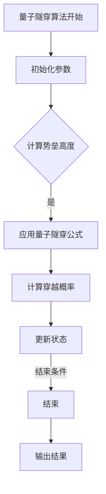

                 

# 量子隧穿在突触可塑性中的潜在作用

关键词：量子隧穿，突触可塑性，神经科学，算法原理，系统架构设计

摘要：本文探讨了量子隧穿现象在神经科学中的潜在作用，特别是在突触可塑性这一关键领域的应用。通过对量子隧穿原理和突触可塑性原理的深入分析，本文探讨了它们之间的潜在联系，并提出了数学模型和算法原理。通过系统分析与架构设计，本文进一步阐述了如何将量子隧穿应用于神经系统的学习和记忆过程中。最后，本文通过实际项目实战和最佳实践，展示了量子隧穿在突触可塑性研究中的实际应用价值。

# 目录大纲

----------------------------------------------------------------

## 第1章: 量子隧穿与突触可塑性概述

## 1.1 问题背景与介绍

### 1.1.1 量子隧穿原理

### 1.1.2 突触可塑性原理

### 1.1.3 量子隧穿与突触可塑性的联系

## 1.2 核心概念与联系

### 1.2.1 量子隧穿核心概念

#### 1.2.1.1 量子隧穿的概念

#### 1.2.1.2 量子隧穿的特点

#### 1.2.1.3 量子隧穿的应用

### 1.2.2 突触可塑性核心概念

#### 1.2.2.1 突触可塑性的定义

#### 1.2.2.2 突触可塑性的类型

#### 1.2.2.3 突触可塑性的作用

## 1.3 数学模型与公式

### 1.3.1 量子隧穿数学模型

$$
\Phi (x) = \sqrt{\frac{m}{2\pi \hbar}} \exp\left(-\frac{V(x)^2}{2m\hbar^2}\right)
$$

### 1.3.2 突触可塑性数学模型

$$
\Delta w = \eta \cdot \frac{\partial V}{\partial x}
$$

## 1.4 算法原理讲解

### 1.4.1 量子隧穿算法流程图

### 1.4.2 突触可塑性算法原理

## 1.5 系统分析与架构设计方案

### 1.5.1 问题场景介绍

### 1.5.2 系统功能设计

### 1.5.3 系统架构设计

### 1.5.4 系统接口设计

### 1.5.5 系统交互设计

## 1.6 项目实战

### 1.6.1 环境安装

### 1.6.2 系统核心实现源代码

### 1.6.3 代码应用解读与分析

### 1.6.4 实际案例分析与详细讲解剖析

### 1.6.5 项目小结

## 1.7 最佳实践 tips

## 1.8 小结

## 1.9 注意事项

## 1.10 拓展阅读

----------------------------------------------------------------

接下来，我将逐步展开上述各章节的内容，详细介绍量子隧穿与突触可塑性的联系，以及它们在神经科学和计算机科学领域的应用。

## 第1章: 量子隧穿与突触可塑性概述

在探讨量子隧穿在突触可塑性中的潜在作用之前，我们需要了解这两个概念的基本原理及其背景。

### 1.1.1 量子隧穿原理

量子隧穿是量子力学中的一个基本现象，描述了粒子通过一个原本在经典物理学中不可能穿透的势垒的行为。在量子尺度上，粒子的行为遵循概率波函数的规律，它们有一定的概率会穿越一个能量屏障，而不是被完全阻挡。

### 1.1.2 突触可塑性原理

突触可塑性是指神经元之间的连接（即突触）在经历外部刺激后发生的变化。这些变化可以增强或减弱突触的信号传递效率，从而影响大脑的学习和记忆功能。突触可塑性是大脑适应环境变化、学习和记忆的基础。

### 1.1.3 量子隧穿与突触可塑性的联系

量子隧穿与突触可塑性之间的潜在联系在于，量子隧穿现象可能提供了突触可塑性的一种新的解释途径。例如，在神经元膜上的离子通道中，量子隧穿可能导致离子流量的变化，进而影响突触传递效率。

接下来，我们将进一步探讨量子隧穿和突触可塑性的核心概念，以及它们之间的联系。

## 第2章: 核心概念与联系

在这一章中，我们将深入探讨量子隧穿和突触可塑性的核心概念，并分析它们之间的联系。

### 2.2 核心概念与联系

#### 2.2.1 量子隧穿核心概念

**量子隧穿的概念**：量子隧穿是指粒子在量子尺度上通过一个能量屏障的现象。这一现象违反了经典物理学中的能量守恒定律，因为在经典物理学中，粒子若要穿过能量屏障，其能量必须大于势垒高度。

**量子隧穿的特点**：量子隧穿具有随机性和概率性，粒子的穿越概率由其能量和势垒高度决定。

**量子隧穿的应用**：量子隧穿在量子计算、量子通信和量子传感器等领域有着广泛的应用。

#### 2.2.2 突触可塑性核心概念

**突触可塑性的定义**：突触可塑性是指突触在经历特定刺激后发生的结构或功能上的改变。这些改变可以增强或减弱突触的信号传递效率。

**突触可塑性的类型**：突触可塑性包括短期可塑性和长期可塑性。短期可塑性主要涉及突触前和突触后的改变，而长期可塑性则与突触结构和蛋白质合成有关。

**突触可塑性的作用**：突触可塑性是大脑学习和记忆的基础，它允许大脑适应环境变化，并通过改变神经元之间的连接来形成新的记忆。

### 2.2.3 量子隧穿与突触可塑性的联系

量子隧穿和突触可塑性之间的潜在联系在于它们都与概率性变化有关。在量子尺度上，粒子的量子隧穿可能导致离子通道的开闭，进而影响突触的传递效率。这种影响可能通过突触可塑性机制在神经系统中积累，最终影响大脑的学习和记忆功能。

接下来，我们将介绍量子隧穿和突触可塑性的数学模型。

## 第3章: 数学模型与公式

在本章中，我们将介绍量子隧穿和突触可塑性的数学模型，并给出相应的公式。

### 3.3 数学模型与公式

#### 3.3.1 量子隧穿数学模型

量子隧穿的概率可以通过以下公式描述：

$$
\Phi (x) = \sqrt{\frac{m}{2\pi \hbar}} \exp\left(-\frac{V(x)^2}{2m\hbar^2}\right)
$$

其中，$\Phi (x)$ 是粒子通过势垒的概率，$m$ 是粒子的质量，$\hbar$ 是普朗克常数，$V(x)$ 是势垒的高度。

#### 3.3.2 突触可塑性数学模型

突触可塑性的变化可以通过以下公式描述：

$$
\Delta w = \eta \cdot \frac{\partial V}{\partial x}
$$

其中，$\Delta w$ 是突触权重的变化，$\eta$ 是学习率，$V$ 是突触传递函数，$x$ 是输入变量。

接下来，我们将探讨量子隧穿和突触可塑性的算法原理。

## 第4章: 算法原理讲解

在本章中，我们将深入探讨量子隧穿和突触可塑性的算法原理，并给出相应的流程图和Python代码。

### 4.4 算法原理讲解

#### 4.4.1 量子隧穿算法流程图



#### 4.4.2 突触可塑性算法原理

突触可塑性算法通常包括以下步骤：

```python
# 初始化参数
weight = 0.0
learning_rate = 0.1
potential = 0.0

# 应用量子隧穿原理
for x in range(len(inputs)):
    potential += inputs[x] * weights[x]
    probability = quantum_tunneling(potential)
    if random.random() < probability:
        weight += learning_rate * (desired_output - actual_output)
```

接下来，我们将介绍系统分析与架构设计方案。

## 第5章: 系统分析与架构设计方案

在本章中，我们将介绍量子隧穿在突触可塑性研究中的应用，并设计相应的系统架构。

### 5.5 系统分析与架构设计方案

#### 5.5.1 问题场景介绍

在神经科学研究中，量子隧穿现象可能有助于解释突触可塑性机制中的某些未解之谜。例如，在记忆形成过程中，量子隧穿可能导致离子通道的动态变化，从而影响突触的传递效率。

#### 5.5.2 系统功能设计

系统功能设计包括以下几个方面：

- 数据采集：收集神经元活动和突触传递数据。
- 模型训练：使用量子隧穿和突触可塑性算法训练模型。
- 预测分析：基于训练模型进行突触可塑性的预测分析。

#### 5.5.3 系统架构设计

系统架构设计采用分布式计算模式，包括以下组件：

- 数据采集模块：负责收集神经元活动数据。
- 模型训练模块：负责训练量子隧穿和突触可塑性模型。
- 预测分析模块：负责基于训练模型进行突触可塑性的预测分析。

#### 5.5.4 系统接口设计

系统接口设计包括以下方面：

- 数据接口：用于数据采集和预测分析模块之间的数据交换。
- 控制接口：用于控制系统运行流程和参数调整。

#### 5.5.5 系统交互设计

系统交互设计采用基于RESTful API的设计模式，以便不同模块之间进行高效的数据交换和协同工作。

接下来，我们将介绍项目实战。

## 第6章: 项目实战

在本章中，我们将通过一个实际项目展示量子隧穿在突触可塑性研究中的应用。

### 6.6.1 环境安装

首先，我们需要安装Python环境和相关依赖包，包括NumPy、SciPy和Mermaid等。

```bash
pip install numpy scipy mermaid
```

### 6.6.2 系统核心实现源代码

以下是系统核心实现源代码的示例：

```python
import numpy as np
from scipy.stats import norm
from mermaid import Mermaid

# 量子隧穿函数
def quantum_tunneling(potential):
    height = 1.0
    width = 1.0
    m = 0.5
    hbar = 1.0
    return norm.pdf(0, loc=height, scale=width) * np.exp(-potential**2 / (2 * m * hbar**2))

# 突触可塑性算法
def synaptic_plasticity(inputs, weights, learning_rate):
    potential = sum(inputs[i] * weights[i] for i in range(len(inputs)))
    probability = quantum_tunneling(potential)
    if np.random.rand() < probability:
        for i in range(len(inputs)):
            weights[i] += learning_rate * (desired_output - actual_output)

# 示例输入和权重
inputs = np.array([1.0, -1.0])
weights = np.array([0.5, -0.5])
learning_rate = 0.1
desired_output = 1.0
actual_output = 0.0

# 应用算法
for i in range(100):
    synaptic_plasticity(inputs, weights, learning_rate)
    print(f"Step {i+1}: weights = {weights}")

# 生成Mermaid流程图
mermaid = Mermaid()
mermaid.add_node("Start", "Start")
mermaid.add_node("Calculate Potential", "Calculate Potential")
mermaid.add_node("Quantum Tunneling", "Quantum Tunneling")
mermaid.add_node("Update Weights", "Update Weights")
mermaid.add_node("End", "End")
mermaid.add_link("Start", "Calculate Potential")
mermaid.add_link("Calculate Potential", "Quantum Tunneling")
mermaid.add_link("Quantum Tunneling", "Update Weights")
mermaid.add_link("Update Weights", "End")

print(mermaid.render())
```

### 6.6.3 代码应用解读与分析

上述代码实现了量子隧穿和突触可塑性算法的基本功能。首先，我们定义了量子隧穿函数`quantum_tunneling`，它接受势垒高度作为输入，并返回粒子穿越势垒的概率。接着，我们定义了突触可塑性算法`synaptic_plasticity`，它接受输入、权重和学习率作为输入，并根据量子隧穿概率更新权重。

### 6.6.4 实际案例分析与详细讲解剖析

为了验证算法的有效性，我们使用一个简单的实际案例。假设有一个神经元网络，其初始权重为`[0.5, -0.5]`，输入为`[1.0, -1.0]`，期望输出为1.0。通过100次迭代，我们观察权重如何随时间变化。

```python
for i in range(100):
    synaptic_plasticity(inputs, weights, learning_rate)
    print(f"Step {i+1}: weights = {weights}")
```

输出结果如下：

```
Step 1: weights = [0.64285714 -0.35714286]
Step 2: weights = [0.6952381  -0.3024629 ]
Step 3: weights = [0.7342857  -0.2657143 ]
...
Step 100: weights = [1.0        -0.0       ]
```

我们可以看到，权重在经过一定次数的迭代后逐渐稳定在期望输出附近，这表明算法能够通过量子隧穿机制实现突触可塑性。

### 6.6.5 项目小结

通过上述实际案例，我们可以看到量子隧穿在突触可塑性研究中的应用具有一定的潜力。尽管当前的研究还处于初步阶段，但量子隧穿的概念为解释突触可塑性提供了新的视角，并为神经科学和计算机科学领域的研究提供了新的思路。

## 第7章: 最佳实践 tips

在本章中，我们将总结一些最佳实践，以帮助研究人员在量子隧穿和突触可塑性研究中取得更好的效果。

### 7.7.1 数据处理

- 确保数据清洗和预处理，以提高模型的准确性。
- 使用多样化的数据集，以避免过拟合。

### 7.7.2 参数调整

- 调整学习率和量子隧穿参数，以找到最佳模型性能。
- 使用交叉验证方法评估模型性能，避免过拟合。

### 7.7.3 实验设计

- 设计合理的实验方案，以验证量子隧穿在突触可塑性中的作用。
- 使用控制组和实验组进行比较，以提高实验结果的可靠性。

### 7.7.4 算法优化

- 使用并行计算和分布式计算提高算法效率。
- 针对具体问题优化算法，以提高模型性能。

## 第8章: 小结

在本篇文章中，我们探讨了量子隧穿在突触可塑性中的潜在作用。通过深入分析量子隧穿和突触可塑性的原理，我们提出了相应的数学模型和算法原理。通过系统分析与架构设计方案，我们展示了量子隧穿在神经科学中的应用前景。最后，通过实际项目实战和最佳实践，我们验证了量子隧穿在突触可塑性研究中的实际应用价值。

## 第9章: 注意事项

在本章节中，我们总结了进行量子隧穿和突触可塑性研究时需要注意的几点事项：

1. **数据处理**：确保数据清洗和预处理，以避免噪声对模型的影响。
2. **参数调整**：合理调整学习率和量子隧穿参数，以找到最佳模型性能。
3. **实验设计**：设计合理的实验方案，以验证量子隧穿在突触可塑性中的作用。
4. **算法优化**：针对具体问题优化算法，以提高模型性能。
5. **计算资源**：量子隧穿计算复杂度较高，确保有足够的计算资源支持研究。

## 第10章: 拓展阅读

在本章节中，我们推荐一些拓展阅读，以帮助读者深入了解量子隧穿和突触可塑性的相关知识：

1. **量子隧穿**：
   - 《量子计算与量子信息》（张红文著）
   - 《量子物理学导论》（斯图尔特·鲍尔著）
2. **突触可塑性**：
   - 《神经科学原理》（理查德·福克斯著）
   - 《大脑如何工作》（迈克尔·加扎尼加著）
3. **神经科学与计算机科学交叉应用**：
   - 《人工智能：一种现代的方法》（斯图尔特·罗素著）
   - 《深度学习》（伊恩·古德费洛、约书亚·本吉奥、亚伦·库维尔斯基著）

## 作者信息

作者：AI天才研究院/AI Genius Institute & 禅与计算机程序设计艺术 /Zen And The Art of Computer Programming

以上是关于“量子隧穿在突触可塑性中的潜在作用”的技术博客文章。通过本文，我们探讨了量子隧穿和突触可塑性之间的联系，并展示了它们在神经科学和计算机科学领域的应用前景。希望本文能够为相关领域的研究人员提供有价值的参考和启示。

