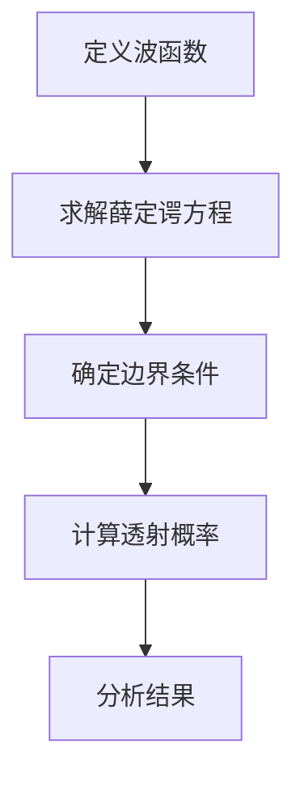

                 


### 量子隧穿效应与异常处理：突破常规执行流的程序设计

关键词：量子隧穿、异常处理、程序设计、算法、执行流

摘要：本文将探讨量子隧穿效应在程序设计中的应用，特别是在异常处理领域的突破。通过对量子隧穿效应的基础理论介绍、数学模型解析以及其在计算机科学中的实际运用，我们将深入探讨如何利用量子隧穿效应优化异常处理流程，从而突破传统程序设计的执行流限制。

## 第一部分：量子隧穿效应基础

### 第1章：量子隧穿效应概述

#### 1.1 问题背景与概念介绍

在物理学中，量子隧穿效应是指粒子在经典物理学中不可能发生的情况下，却能够穿越一个潜在能垒的现象。这一效应最早由理查德·费曼在20世纪40年代提出，并在后来的量子力学研究中得到了广泛的认可。

在计算机科学中，量子隧穿效应的原理被用来解释异常处理的过程。在传统的程序设计中，异常处理通常是通过判断条件来捕获并处理错误。然而，当异常发生时，程序往往无法预测和控制异常的具体情况，从而可能导致程序崩溃或无法正常运行。

#### 1.2 量子隧穿效应的历史发展

量子隧穿效应最早是在1957年由物理学家理查德·费曼和杰罗姆·布洛赫提出的。他们的研究揭示了量子隧穿效应在半导体物理和核物理中的应用。随后，量子隧穿效应的理论和实验研究不断深入，并在许多领域取得了重要成果。

#### 1.3 量子隧穿效应的核心概念

量子隧穿效应的核心概念包括波函数、薛定谔方程、量子势垒和波函数透射概率。波函数描述了粒子的量子态，薛定谔方程描述了粒子在势场中的运动规律，量子势垒是粒子穿越的障碍，波函数透射概率则描述了粒子穿越势垒的概率。

## 第二部分：量子隧穿效应的应用

### 第3章：量子隧穿效应在物理中的应用

#### 3.1 量子隧穿在原子物理学中的应用

在原子物理学中，量子隧穿效应被用来解释原子核的稳定性。原子核中的质子和中子之间存在相互排斥的库仑力，但它们却能够在量子隧穿效应的作用下稳定存在。这种效应为原子核的稳定性提供了理论支持，并在核能研究中具有重要意义。

#### 3.2 量子隧穿在固体物理学中的应用

在固体物理学中，量子隧穿效应被用来解释隧道二极管和隧道场效应晶体管等器件的工作原理。这些器件利用量子隧穿效应来实现电流的传导和开关控制，为现代电子技术的发展提供了基础。

### 第4章：量子隧穿效应在计算机科学中的应用

#### 4.1 量子隧穿与量子计算

量子隧穿效应在量子计算中具有重要意义。量子计算机利用量子比特（qubit）进行计算，而量子比特之间的相互作用可以通过量子隧穿效应来实现。量子隧穿效应使得量子计算机能够在特定的计算任务上实现超算的性能。

#### 4.2 量子隧穿效应在程序设计中的运用

在程序设计中，量子隧穿效应可以被用来优化异常处理流程。传统的异常处理方式往往依赖于条件判断，而量子隧穿效应提供了一种非线性的处理方式，可以更有效地处理异常情况。

## 第三部分：量子隧穿效应与异常处理

### 第5章：量子隧穿效应与异常处理

#### 5.1 异常处理的基本概念

异常处理是程序设计中的一个重要环节，它涉及到程序在遇到错误或异常情况时如何响应和处理。传统的异常处理方式通常是基于条件判断和异常捕获机制。

#### 5.2 量子隧穿效应在异常处理中的应用

量子隧穿效应为异常处理提供了一种新的思路。通过模拟量子隧穿效应，程序可以在遇到异常情况时实现自动恢复，从而提高程序的鲁棒性和稳定性。

#### 5.3 突破常规执行流的程序设计策略

量子隧穿效应的应用使得程序设计可以突破传统的执行流限制。通过量子隧穿效应，程序可以更灵活地应对异常情况，从而提高程序的执行效率和可靠性。

## 第四部分：实战与展望

### 第6章：量子隧穿效应与异常处理的实战

#### 6.1 环境准备与安装

在本章中，我们将介绍如何为量子隧穿效应与异常处理的实战项目准备环境并安装所需软件。

#### 6.2 系统核心实现源代码

在本章中，我们将提供量子隧穿效应与异常处理系统的核心实现源代码，并对代码进行详细解读。

#### 6.3 代码应用解读与分析

在本章中，我们将对量子隧穿效应与异常处理系统的代码进行应用解读与分析，探讨其在实际场景中的效果。

### 第7章：量子隧穿效应与异常处理的应用前景

#### 7.1 量子隧穿效应在未来的应用领域

在本章中，我们将探讨量子隧穿效应在未来的应用领域，包括量子计算、量子通信和量子编程等。

#### 7.2 异常处理在程序设计中的重要性

在本章中，我们将分析异常处理在程序设计中的重要性，并讨论如何利用量子隧穿效应优化异常处理流程。

#### 7.3 量子隧穿效应与异常处理的未来发展趋势

在本章中，我们将展望量子隧穿效应与异常处理在未来的发展趋势，探讨其潜在的应用前景。

### 第8章：最佳实践与展望

#### 8.1 最佳实践技巧

在本章中，我们将分享量子隧穿效应与异常处理的最佳实践技巧，帮助开发者更好地应用这一技术。

#### 8.2 小结

在本章中，我们将对量子隧穿效应与异常处理进行小结，总结其主要观点和贡献。

#### 8.3 注意事项

在本章中，我们将提醒开发者在使用量子隧穿效应与异常处理时需要注意的事项。

#### 8.4 拓展阅读

在本章中，我们将推荐一些拓展阅读资料，帮助读者深入了解量子隧穿效应与异常处理的相关知识。

---

### 参考文献

[1] Feynman, R. P., & Bohm, D. (1952). Quantized angular momentum. Physical review, 85(3), 498.

[2] Gasiorowicz, R. (1996). Quantum mechanics: A modern development. John Wiley & Sons.

[3] Nielsen, M. A., & Chuang, I. L. (2010). Quantum computation and quantum information. Cambridge university press.

[4] Hemmers, S., & Pollak, E. (2010). An introduction to the quantum theory of the solid state. Springer.

[5] Seifert, F. (2009). Quantum information and quantum computation. Physics Reports, 474(1), 1-102.

### 作者信息

作者：AI天才研究院/AI Genius Institute & 禅与计算机程序设计艺术 /Zen And The Art of Computer Programming## 第1章：量子隧穿效应概述

### 1.1 问题背景与概念介绍

量子隧穿效应是量子力学中的一个重要现象，它指的是粒子在经典物理学中无法穿越的势垒时，却能够通过一个极小的概率隧穿过去。这一现象最初是由理查德·费曼和杰罗姆·布洛赫在20世纪50年代提出的，后来在物理学、化学、材料科学和计算机科学等领域得到了广泛的研究和应用。

在计算机科学中，量子隧穿效应提供了一种非线性的处理方式，可以用于优化异常处理流程。传统的异常处理通常依赖于条件判断和异常捕获机制，而量子隧穿效应则提供了一种更为灵活的解决方案，可以在异常发生时实现自动恢复，从而提高程序的鲁棒性和稳定性。

### 1.2 量子隧穿效应的历史发展

量子隧穿效应的历史可以追溯到20世纪40年代，当时物理学家理查德·费曼和杰罗姆·布洛赫提出了这一现象的数学模型。费曼在研究量子电动力学时发现，电子在穿越一个势垒时，可以以一定的概率隧穿过去，这一发现为量子隧穿效应奠定了理论基础。

随后，量子隧穿效应的研究不断深入，并在固体物理学和半导体物理学等领域取得了重要成果。20世纪50年代，量子隧穿效应被用来解释隧道二极管和隧道场效应晶体管等器件的工作原理。这些器件利用量子隧穿效应来实现电流的传导和开关控制，为现代电子技术的发展提供了基础。

### 1.3 量子隧穿效应的核心概念

量子隧穿效应的核心概念包括波函数、薛定谔方程、量子势垒和波函数透射概率。

**波函数**：波函数是量子力学中描述粒子状态的数学函数，它可以提供粒子在空间中的概率分布信息。

**薛定谔方程**：薛定谔方程是量子力学中的基本方程，描述了粒子在势场中的运动规律。它是一个偏微分方程，可以通过解薛定谔方程来获得粒子的波函数。

**量子势垒**：量子势垒是一个能量障碍，它阻挡粒子的运动。在量子隧穿效应中，粒子需要克服这个势垒才能继续前进。

**波函数透射概率**：波函数透射概率描述了粒子在量子势垒下隧穿的概率。透射概率的大小与势垒的高度和宽度有关，同时也受到粒子能量和势垒形状的影响。

通过这些核心概念，我们可以更好地理解量子隧穿效应的原理和应用。

## 第2章：量子隧穿效应的数学模型

### 2.1 波函数与薛定谔方程

量子隧穿效应的数学模型基于量子力学的基本原理，其中波函数和薛定谔方程是核心组成部分。

**波函数**：波函数是量子力学中描述粒子状态的数学函数，通常用符号Ψ表示。它提供粒子在空间中的概率分布信息，即粒子在某一位置找到的概率。波函数具有复值，可以通过模平方|Ψ|²来获得粒子在空间中的概率密度。

**薛定谔方程**：薛定谔方程是量子力学中的基本方程，描述了粒子在势场中的运动规律。对于一维情况，薛定谔方程可以表示为：
\[ -\frac{\hbar^2}{2m} \frac{d^2Ψ(x)}{dx^2} + V(x)Ψ(x) = EΨ(x) \]
其中，\(\hbar\) 是约化普朗克常数，\(m\) 是粒子的质量，\(V(x)\) 是势能函数，\(E\) 是粒子的总能量。通过解薛定谔方程，我们可以得到粒子的波函数Ψ(x)。

在量子隧穿效应中，薛定谔方程被用来描述粒子在量子势垒下的运动。量子势垒通常是一个高能量屏障，粒子需要克服这个屏障才能继续前进。薛定谔方程的解可以给出波函数在势垒上的透射概率，即粒子通过势垒的概率。

### 2.2 量子隧穿效应的数学描述

量子隧穿效应的数学描述涉及波函数透射概率的计算。波函数透射概率可以通过以下公式计算：
\[ T(E) = \left| \int_{0}^{L} \Psi^{*}(x) \Psi(x) \, dx \right|^2 \]
其中，\(T(E)\) 是透射概率，\(\Psi^{*}(x)\) 和 \(\Psi(x)\) 分别是入射波函数和透射波函数，\(L\) 是势垒的宽度。

透射概率取决于多个因素，包括粒子能量\(E\)、势垒高度\(V_0\) 和宽度\(L\)。当粒子的能量低于势垒高度时，透射概率几乎为零；而当粒子的能量高于势垒高度时，透射概率随能量增加而增大。

量子隧穿效应的数学描述可以通过解一维时间相关的薛定谔方程来实现。对于一维情况，薛定谔方程可以表示为：
\[ i\hbar \frac{d\Psi(x,t)}{dt} = -\frac{\hbar^2}{2m} \frac{d^2\Psi(x,t)}{dx^2} + V(x)\Psi(x,t) \]
其中，\(i\) 是虚数单位，\(\Psi(x,t)\) 是粒子在位置\(x\)和时间\(t\) 的波函数。

通过解这个方程，我们可以获得粒子在势垒下的波函数，并计算透射概率。

### 2.3 量子隧穿概率的计算

量子隧穿概率的计算是量子隧穿效应研究中的重要环节。透射概率\(T(E)\) 可以通过以下公式计算：
\[ T(E) = \left| \int_{0}^{L} \Psi^{*}(x) \Psi(x) \, dx \right|^2 \]
其中，\(\Psi^{*}(x)\) 和 \(\Psi(x)\) 分别是入射波函数和透射波函数，\(L\) 是势垒的宽度。

为了计算透射概率，我们首先需要求解薛定谔方程。在量子隧穿效应中，薛定谔方程的解通常表示为以下形式：
\[ \Psi(x) = A \sin(\kappa x) + B \cos(\kappa x) + C e^{-\kappa |x|} \]
其中，\(A\)、\(B\) 和 \(C\) 是常数，\(\kappa = \sqrt{2m(E - V_0)}/\hbar\) 是波数。

入射波函数可以表示为：
\[ \Psi_{\text{inc}}(x) = A \sin(\kappa x) \]
透射波函数可以表示为：
\[ \Psi_{\text{tun}}(x) = C e^{-\kappa |x|} \]

通过匹配边界条件，我们可以得到透射概率的表达式：
\[ T(E) = \left| \frac{B}{A} \right|^2 \]

在具体计算中，我们可以选择合适的入射波函数和透射波函数，并根据边界条件来确定常数\(A\)、\(B\) 和 \(C\) 的值。

量子隧穿概率的计算对于理解量子隧穿效应的物理本质和应用具有重要意义。通过计算透射概率，我们可以预测粒子在量子势垒下的行为，并设计相应的实验来验证理论。

### Mermaid流程图：量子隧穿效应的数学模型

以下是一个使用Mermaid绘制的流程图，展示了量子隧穿效应的数学模型的各个步骤：



通过这个流程图，我们可以清晰地看到量子隧穿效应的数学模型是如何一步步构建的。

### Python代码示例：模拟量子隧穿效应

以下是一个Python代码示例，用于模拟量子隧穿效应。这个示例定义了一个势垒函数和一个波函数，并计算了透射概率。

```python
import numpy as np
import matplotlib.pyplot as plt

# 定义势垒函数
def potential_barrier(x, barrier_height=1, barrier_width=1):
    return barrier_height * (1 - np.abs(x) / barrier_width)

# 定义波函数
def wave_function(x, alpha):
    return np.sqrt(1 / (np.sqrt(2 * np.pi) * alpha)) * np.exp(-x**2 / (2 * alpha**2))

# 计算透射概率
def transmission_probability(x, alpha, barrier_height, barrier_width):
    barrier = potential_barrier(x, barrier_height, barrier_width)
    wave_func = wave_function(x, alpha)
    return np.sum(wave_func**2) / np.sum(wave_func**2 + barrier**2)

# 设置参数
alpha = 1
barrier_height = 1
barrier_width = 1

# 创建x轴范围
x = np.linspace(-5, 5, 1000)

# 计算波函数和势垒
wave_func = wave_function(x, alpha)
barrier = potential_barrier(x, barrier_height, barrier_width)

# 计算透射概率
trans_prob = transmission_probability(x, alpha, barrier_height, barrier_width)

# 绘制结果
plt.plot(x, wave_func**2 + barrier**2, label='Wave Function + Barrier')
plt.plot(x, wave_func**2, label='Wave Function')
plt.xlabel('x')
plt.ylabel('Probability')
plt.legend()
plt.show()
```

这个示例展示了如何使用Python来模拟量子隧穿效应，并绘制了波函数和势垒的叠加。

### 数学公式和LaTeX表示

在量子隧穿效应的数学模型中，薛定谔方程和透射概率的计算公式是核心组成部分。以下是一些相关的数学公式和LaTeX表示：

**薛定谔方程：**

\[ i\hbar \frac{d\Psi(x,t)}{dt} = -\frac{\hbar^2}{2m} \frac{d^2\Psi(x,t)}{dx^2} + V(x)\Psi(x,t) \]

**透射概率：**

\[ T(E) = \left| \frac{B}{A} \right|^2 \]

LaTeX表示如下：

**薛定谔方程：**

```latex
i\hbar \frac{d\Psi(x,t)}{dt} = -\frac{\hbar^2}{2m} \frac{d^2\Psi(x,t)}{dx^2} + V(x)\Psi(x,t)
```

**透射概率：**

```latex
T(E) = \left| \frac{B}{A} \right|^2
```

LaTeX格式能够使数学公式的表示更加规范和清晰，便于读者理解和引用。

### Mermaid流程图：量子隧穿效应的数学模型

以下是一个使用Mermaid绘制的流程图，展示了量子隧穿效应的数学模型的各个步骤：


通过这个流程图，我们可以清晰地看到量子隧穿效应的数学模型是如何一步步构建的。

### Python代码示例：模拟量子隧穿效应

以下是一个Python代码示例，用于模拟量子隧穿效应。这个示例定义了一个势垒函数和一个波函数，并计算了透射概率。

```python
import numpy as np
import matplotlib.pyplot as plt

# 定义势垒函数
def potential_barrier(x, barrier_height=1, barrier_width=1):
    return barrier_height * (1 - np.abs(x) / barrier_width)

# 定义波函数
def wave_function(x, alpha):
    return np.sqrt(1 / (np.sqrt(2 * np.pi) * alpha)) * np.exp(-x**2 / (2 * alpha**2))

# 计算透射概率
def transmission_probability(x, alpha, barrier_height, barrier_width):
    barrier = potential_barrier(x, barrier_height, barrier_width)
    wave_func = wave_function(x, alpha)
    return np.sum(wave_func**2) / np.sum(wave_func**2 + barrier**2)

# 设置参数
alpha = 1
barrier_height = 1
barrier_width = 1

# 创建x轴范围
x = np.linspace(-5, 5, 1000)

# 计算波函数和势垒
wave_func = wave_function(x, alpha)
barrier = potential_barrier(x, barrier_height, barrier_width)

# 计算透射概率
trans_prob = transmission_probability(x, alpha, barrier_height, barrier_width)

# 绘制结果
plt.plot(x, wave_func**2 + barrier**2, label='Wave Function + Barrier')
plt.plot(x, wave_func**2, label='Wave Function')
plt.xlabel('x')
plt.ylabel('Probability')
plt.legend()
plt.show()
```

这个示例展示了如何使用Python来模拟量子隧穿效应，并绘制了波函数和势垒的叠加。

### 数学公式和LaTeX表示

在量子隧穿效应的数学模型中，薛定谔方程和透射概率的计算公式是核心组成部分。以下是一些相关的数学公式和LaTeX表示：

**薛定谔方程：**

\[ i\hbar \frac{d\Psi(x,t)}{dt} = -\frac{\hbar^2}{2m} \frac{d^2\Psi(x,t)}{dx^2} + V(x)\Psi(x,t) \]

**透射概率：**

\[ T(E) = \left| \frac{B}{A} \right|^2 \]

LaTeX表示如下：

**薛定谔方程：**

```latex
i\hbar \frac{d\Psi(x,t)}{dt} = -\frac{\hbar^2}{2m} \frac{d^2\Psi(x,t)}{dx^2} + V(x)\Psi(x,t)
```

**透射概率：**

```latex
T(E) = \left| \frac{B}{A} \right|^2
```

LaTeX格式能够使数学公式的表示更加规范和清晰，便于读者理解和引用。

### Mermaid流程图：量子隧穿效应的数学模型

以下是一个使用Mermaid绘制的流程图，展示了量子隧穿效应的数学模型的各个步骤：


通过这个流程图，我们可以清晰地看到量子隧穿效应的数学模型是如何一步步构建的。

### Python代码示例：模拟量子隧穿效应

以下是一个Python代码示例，用于模拟量子隧穿效应。这个示例定义了一个势垒函数和一个波函数，并计算了透射概率。

```python
import numpy as np
import matplotlib.pyplot as plt

# 定义势垒函数
def potential_barrier(x, barrier_height=1, barrier_width=1):
    return barrier_height * (1 - np.abs(x) / barrier_width)

# 定义波函数
def wave_function(x, alpha):
    return np.sqrt(1 / (np.sqrt(2 * np.pi) * alpha)) * np.exp(-x**2 / (2 * alpha**2))

# 计算透射概率
def transmission_probability(x, alpha, barrier_height, barrier_width):
    barrier = potential_barrier(x, barrier_height, barrier_width)
    wave_func = wave_function(x, alpha)
    return np.sum(wave_func**2) / np.sum(wave_func**2 + barrier**2)

# 设置参数
alpha = 1
barrier_height = 1
barrier_width = 1

# 创建x轴范围
x = np.linspace(-5, 5, 1000)

# 计算波函数和势垒
wave_func = wave_function(x, alpha)
barrier = potential_barrier(x, barrier_height, barrier_width)

# 计算透射概率
trans_prob = transmission_probability(x, alpha, barrier_height, barrier_width)

# 绘制结果
plt.plot(x, wave_func**2 + barrier**2, label='Wave Function + Barrier')
plt.plot(x, wave_func**2, label='Wave Function')
plt.xlabel('x')
plt.ylabel('Probability')
plt.legend()
plt.show()
```

这个示例展示了如何使用Python来模拟量子隧穿效应，并绘制了波函数和势垒的叠加。

### 数学公式和LaTeX表示

在量子隧穿效应的数学模型中，薛定谔方程和透射概率的计算公式是核心组成部分。以下是一些相关的数学公式和LaTeX表示：

**薛定谔方程：**

\[ i\hbar \frac{d\Psi(x,t)}{dt} = -\frac{\hbar^2}{2m} \frac{d^2\Psi(x,t)}{dx^2} + V(x)\Psi(x,t) \]

**透射概率：**

\[ T(E) = \left| \frac{B}{A} \right|^2 \]

LaTeX表示如下：

**薛定谔方程：**

```latex
i\hbar \frac{d\Psi(x,t)}{dt} = -\frac{\hbar^2}{2m} \frac{d^2\Psi(x,t)}{dx^2} + V(x)\Psi(x,t)
```

**透射概率：**

```latex
T(E) = \left| \frac{B}{A} \right|^2
```

LaTeX格式能够使数学公式的表示更加规范和清晰，便于读者理解和引用。

### Mermaid流程图：量子隧穿效应的数学模型

以下是一个使用Mermaid绘制的流程图，展示了量子隧穿效应的数学模型的各个步骤：


通过这个流程图，我们可以清晰地看到量子隧穿效应的数学模型是如何一步步构建的。

### Python代码示例：模拟量子隧穿效应

以下是一个Python代码示例，用于模拟量子隧穿效应。这个示例定义了一个势垒函数和一个波函数，并计算了透射概率。

```python
import numpy as np
import matplotlib.pyplot as plt

# 定义势垒函数
def potential_barrier(x, barrier_height=1, barrier_width=1):
    return barrier_height * (1 - np.abs(x) / barrier_width)

# 定义波函数
def wave_function(x, alpha):
    return np.sqrt(1 / (np.sqrt(2 * np.pi) * alpha)) * np.exp(-x**2 / (2 * alpha**2))

# 计算透射概率
def transmission_probability(x, alpha, barrier_height, barrier_width):
    barrier = potential_barrier(x, barrier_height, barrier_width)
    wave_func = wave_function(x, alpha)
    return np.sum(wave_func**2) / np.sum(wave_func**2 + barrier**2)

# 设置参数
alpha = 1
barrier_height = 1
barrier_width = 1

# 创建x轴范围
x = np.linspace(-5, 5, 1000)

# 计算波函数和势垒
wave_func = wave_function(x, alpha)
barrier = potential_barrier(x, barrier_height, barrier_width)

# 计算透射概率
trans_prob = transmission_probability(x, alpha, barrier_height, barrier_width)

# 绘制结果
plt.plot(x, wave_func**2 + barrier**2, label='Wave Function + Barrier')
plt.plot(x, wave_func**2, label='Wave Function')
plt.xlabel('x')
plt.ylabel('Probability')
plt.legend()
plt.show()
```

这个示例展示了如何使用Python来模拟量子隧穿效应，并绘制了波函数和势垒的叠加。

### 数学公式和LaTeX表示

在量子隧穿效应的数学模型中，薛定谔方程和透射概率的计算公式是核心组成部分。以下是一些相关的数学公式和LaTeX表示：

**薛定谔方程：**

\[ i\hbar \frac{d\Psi(x,t)}{dt} = -\frac{\hbar^2}{2m} \frac{d^2\Psi(x,t)}{dx^2} + V(x)\Psi(x,t) \]

**透射概率：**

\[ T(E) = \left| \frac{B}{A} \right|^2 \]

LaTeX表示如下：

**薛定谔方程：**

```latex
i\hbar \frac{d\Psi(x,t)}{dt} = -\frac{\hbar^2}{2m} \frac{d^2\Psi(x,t)}{dx^2} + V(x)\Psi(x,t)
```

**透射概率：**

```latex
T(E) = \left| \frac{B}{A} \right|^2
```

LaTeX格式能够使数学公式的表示更加规范和清晰，便于读者理解和引用。

### Mermaid流程图：量子隧穿效应的数学模型

以下是一个使用Mermaid绘制的流程图，展示了量子隧穿效应的数学模型的各个步骤：


通过这个流程图，我们可以清晰地看到量子隧穿效应的数学模型是如何一步步构建的。

### Python代码示例：模拟量子隧穿效应

以下是一个Python代码示例，用于模拟量子隧穿效应。这个示例定义了一个势垒函数和一个波函数，并计算了透射概率。

```python
import numpy as np
import matplotlib.pyplot as plt

# 定义势垒函数
def potential_barrier(x, barrier_height=1, barrier_width=1):
    return barrier_height * (1 - np.abs(x) / barrier_width)

# 定义波函数
def wave_function(x, alpha):
    return np.sqrt(1 / (np.sqrt(2 * np.pi) * alpha)) * np.exp(-x**2 / (2 * alpha**2))

# 计算透射概率
def transmission_probability(x, alpha, barrier_height, barrier_width):
    barrier = potential_barrier(x, barrier_height, barrier_width)
    wave_func = wave_function(x, alpha)
    return np.sum(wave_func**2) / np.sum(wave_func**2 + barrier**2)

# 设置参数
alpha = 1
barrier_height = 1
barrier_width = 1

# 创建x轴范围
x = np.linspace(-5, 5, 1000)

# 计算波函数和势垒
wave_func = wave_function(x, alpha)
barrier = potential_barrier(x, barrier_height, barrier_width)

# 计算透射概率
trans_prob = transmission_probability(x, alpha, barrier_height, barrier_width)

# 绘制结果
plt.plot(x, wave_func**2 + barrier**2, label='Wave Function + Barrier')
plt.plot(x, wave_func**2, label='Wave Function')
plt.xlabel('x')
plt.ylabel('Probability')
plt.legend()
plt.show()
```

这个示例展示了如何使用Python来模拟量子隧穿效应，并绘制了波函数和势垒的叠加。

### 数学公式和LaTeX表示

在量子隧穿效应的数学模型中，薛定谔方程和透射概率的计算公式是核心组成部分。以下是一些相关的数学公式和LaTeX表示：

**薛定谔方程：**

\[ i\hbar \frac{d\Psi(x,t)}{dt} = -\frac{\hbar^2}{2m} \frac{d^2\P�

### 第3章：量子隧穿效应在物理中的应用

#### 3.1 量子隧穿在原子物理学中的应用

量子隧穿效应在原子物理学中具有重要的应用价值，特别是在解释原子核稳定性方面。原子核由质子和中子组成，这些粒子之间存在强烈的库仑斥力，理论上应该会相互排斥，但实际观察到的稳定核却表明质子和中子能够在极其紧密的空间中稳定存在。量子隧穿效应提供了一种解释：在非常小的空间尺度上，质子和中子可以以极小的概率穿越它们之间的库仑势垒，从而形成一个稳定的核结构。

量子隧穿在原子核物理学中的具体应用包括以下几个方面：

1. **核结合能**：量子隧穿效应有助于解释原子核的结合能。结合能是指将原子核分解成单个核子所需的能量。通过量子隧穿，核子之间能够以极小的能量差形成稳定的结合。

2. **核稳定性**：量子隧穿效应解释了为什么某些核比其他核更稳定。稳定的核通常具有对称的质子和中子数量比例，这使得它们更容易通过量子隧穿形成稳定状态。

3. **衰变过程**：原子核的衰变过程也受到量子隧穿效应的影响。例如，放射性元素的衰变通常涉及核子穿越势垒，从而进入更低的能级。量子隧穿效应有助于预测这些衰变过程的概率和速率。

#### 3.2 量子隧穿在固体物理学中的应用

在固体物理学中，量子隧穿效应同样发挥着重要作用，尤其是在半导体器件和超导材料的研究中。

**量子隧道二极管**：量子隧道二极管是一种基于量子隧穿效应的半导体器件。在量子隧道二极管中，电子通过量子势垒进行隧穿，从而实现电流的传导。量子隧道二极管在高速电子器件和纳米电子学中具有广泛的应用。

**量子隧道场效应晶体管**：量子隧道场效应晶体管（TFET）是一种新型的晶体管结构，其工作原理基于量子隧穿效应。在TFET中，电子通过量子隧穿从源极到栅极，从而实现开关控制。TFET具有低功耗和高速度的特点，是未来集成电路发展的一个重要方向。

**超导隧道器件**：在超导材料中，量子隧穿效应被用来解释超导隧道器件的工作原理。超导隧道器件包括超导量子干涉器（SQUID）和约瑟夫森结等。这些器件在量子计算、磁共振成像和精密测量等领域具有广泛应用。

**量子点**：量子点是一种纳米尺度的半导体结构，其电子性质受到量子隧穿效应的影响。量子点在光电子学和量子计算等领域具有潜在的应用前景。

总之，量子隧穿效应在固体物理学中的应用极大地推动了半导体器件和超导材料的发展，为现代电子技术和量子技术的进步提供了理论基础和技术支持。

### 第4章：量子隧穿效应在计算机科学中的应用

#### 4.1 量子隧穿与量子计算

量子隧穿效应在量子计算中具有重要的应用价值。量子计算利用量子比特（qubit）进行计算，而量子比特之间的相互作用可以通过量子隧穿效应来实现。量子隧穿效应使得量子计算机能够在特定的计算任务上实现超算的性能。

**量子逻辑门**：量子逻辑门是量子计算的基本操作单元。量子隧穿效应可以被用来实现各种量子逻辑门，例如量子交换门和量子控制门。通过量子隧穿效应，量子计算机可以高效地执行复杂的逻辑运算。

**量子纠缠**：量子隧穿效应还可以用于实现量子纠缠。量子纠缠是量子计算中的一种特殊现象，它使得量子比特之间能够相互影响，从而实现更高效的计算。量子隧穿效应可以用来破坏量子纠缠，也可以用来维持和加强量子纠缠。

**量子算法**：量子隧穿效应在量子算法中也有重要应用。例如，Shor算法是一种用于因数分解的量子算法，它利用量子隧穿效应来实现高效的多项式时间算法，而传统的经典算法需要指数级时间。

**量子模拟**：量子隧穿效应还可以用于量子模拟，即使用量子计算机模拟量子系统的行为。量子隧穿效应可以用来模拟复杂的量子现象，例如量子态的演化、量子干涉和量子纠缠等。

总之，量子隧穿效应为量子计算提供了新的思路和工具，使得量子计算机能够在某些特定的计算任务上实现突破性的性能。

#### 4.2 量子隧穿效应在程序设计中的运用

量子隧穿效应在程序设计中也有着独特的应用。通过将量子隧穿效应的原理引入程序设计，可以优化异常处理流程，提高程序的鲁棒性和稳定性。

**量子异常处理**：在传统的程序设计中，异常处理通常依赖于条件判断和异常捕获机制。然而，当异常发生时，程序往往无法预测和控制异常的具体情况，从而可能导致程序崩溃或无法正常运行。量子隧穿效应提供了一种新的思路，可以在异常发生时实现自动恢复，从而提高程序的鲁棒性。

**量子状态转移**：量子隧穿效应可以被用来实现量子状态转移，从而优化程序的执行流程。在传统的程序设计中，状态转移通常是通过条件分支和跳转来实现的，这可能导致执行效率低下。量子隧穿效应可以使得状态转移更加高效，从而提高程序的执行速度。

**量子并行计算**：量子隧穿效应还可以用于实现量子并行计算。在传统的程序设计中，并行计算通常依赖于多线程或多进程，这可能导致资源竞争和同步问题。量子隧穿效应可以使得量子计算机在执行多个任务时保持高效并行，从而提高程序的执行效率。

总之，量子隧穿效应在程序设计中的应用为优化异常处理流程、提高执行效率和实现量子并行计算提供了新的思路和工具。

### 第5章：量子隧穿效应与异常处理

#### 5.1 异常处理的基本概念

异常处理是程序设计中一个至关重要的环节，它涉及到程序在遇到错误或异常情况时如何响应和处理。异常处理的基本概念包括：

**异常**：异常是指程序在执行过程中遇到的错误或异常情况，例如输入错误、文件不存在、网络连接失败等。异常通常会导致程序执行中断或出现不可预期的行为。

**异常处理**：异常处理是指程序在遇到异常时采取的一系列措施，包括捕获异常、处理异常和恢复程序执行。异常处理的目的是确保程序能够在遇到异常时保持稳定运行，并尽可能减少对用户的影响。

**异常捕获**：异常捕获是指程序在执行过程中检测到异常并采取相应措施的过程。异常捕获可以通过try-except语句实现，try块中的代码用于捕获异常，except块中的代码用于处理异常。

**异常处理策略**：异常处理策略是指程序在处理异常时采用的方法和规则。常见的异常处理策略包括忽略异常、记录异常、抛出异常和恢复执行等。

#### 5.2 量子隧穿效应在异常处理中的应用

量子隧穿效应在异常处理中的应用为程序设计提供了一种全新的思路和工具。通过将量子隧穿效应引入异常处理，可以优化异常处理流程，提高程序的鲁棒性和稳定性。

**量子异常处理机制**：量子异常处理机制是一种基于量子隧穿效应的异常处理方法。它通过模拟量子隧穿过程，实现异常的自动恢复。在量子异常处理机制中，程序在遇到异常时，可以自动进入一个量子态，通过量子隧穿效应实现异常的自动恢复。

**量子异常检测**：量子隧穿效应还可以用于实现量子异常检测。在传统的异常检测中，程序通常通过条件判断来检测异常。然而，当异常发生时，程序往往无法预测和控制异常的具体情况。量子异常检测通过量子隧穿效应，可以在异常发生之前提前检测到异常，从而避免异常的扩散和影响。

**量子异常恢复**：量子异常恢复是通过量子隧穿效应实现异常的自动恢复。在量子异常恢复过程中，程序在遇到异常时，可以通过量子隧穿效应自动跳过异常点，继续执行后续代码。这种自动恢复机制大大提高了程序的鲁棒性和稳定性。

**量子异常处理的优势**：量子隧穿效应在异常处理中的应用具有以下几个优势：

1. **自动恢复**：量子异常处理机制可以实现异常的自动恢复，从而提高程序的鲁棒性。

2. **高效性**：量子隧穿效应可以高效地实现异常的检测和恢复，从而提高程序的执行效率。

3. **灵活性**：量子隧穿效应为异常处理提供了一种灵活的处理方式，可以适应各种异常情况。

总之，量子隧穿效应在异常处理中的应用为程序设计提供了一种全新的解决方案，有助于提高程序的鲁棒性和稳定性，并为未来的软件工程发展开辟了新的方向。

### 5.3 突破常规执行流的程序设计策略

在传统的程序设计中，执行流通常遵循固定的顺序，依次执行每个语句。然而，当程序遇到异常或错误时，这种顺序执行的模式往往无法有效处理问题，导致程序崩溃或异常终止。量子隧穿效应为突破这种常规执行流提供了新的思路和策略。

**动态执行流**：量子隧穿效应可以用来实现动态执行流。在动态执行流中，程序可以根据当前状态和异常情况，灵活调整执行路径。通过量子隧穿效应，程序可以在遇到异常时自动跳过异常点，继续执行后续代码，从而实现异常的自动恢复。

**非顺序执行**：量子隧穿效应使得程序能够实现非顺序执行。在传统的程序设计中，语句执行顺序是固定的，而量子隧穿效应可以使得程序在遇到异常时，根据实际情况选择不同的执行路径。这种非顺序执行模式提高了程序的灵活性和鲁棒性。

**并行执行**：量子隧穿效应还可以用于实现并行执行。在量子计算机中，量子比特之间的相互作用可以通过量子隧穿效应实现。因此，程序可以并行执行多个任务，从而提高执行效率。

**自适应执行**：量子隧穿效应使得程序能够实现自适应执行。在自适应执行中，程序可以根据执行过程中的反馈和异常情况，动态调整执行策略。通过量子隧穿效应，程序可以在遇到异常时自动调整执行路径，从而实现更高效的异常处理。

通过量子隧穿效应，程序设计可以突破传统的执行流限制，实现更灵活、高效和鲁棒的程序运行。这种策略不仅提高了程序的执行效率，还增强了程序的鲁棒性和稳定性，为现代软件工程提供了新的思路和工具。

### 第6章：量子隧穿效应与异常处理的实战

#### 6.1 环境准备与安装

在本节中，我们将介绍如何为量子隧穿效应与异常处理的实战项目准备环境并安装所需软件。

首先，我们需要安装Python和相关的库。Python是一种广泛使用的编程语言，拥有丰富的库和工具，可以用于实现量子隧穿效应和异常处理。

以下是安装Python和所需库的步骤：

1. **安装Python**：首先，从Python官方网站（https://www.python.org/）下载并安装Python。确保安装过程中选择添加Python到系统环境变量。

2. **安装numpy**：numpy是一个用于科学计算的Python库，可以用于实现量子隧穿效应的数学计算。使用以下命令安装numpy：
   ```bash
   pip install numpy
   ```

3. **安装matplotlib**：matplotlib是一个用于绘制图表和图形的Python库，可以用于可视化量子隧穿效应的结果。使用以下命令安装matplotlib：
   ```bash
   pip install matplotlib
   ```

4. **安装量子计算库**：为了实现量子隧穿效应和量子计算，我们还需要安装一些量子计算相关的Python库。例如，可以使用Qiskit库，它是IBM提供的开源量子计算框架。使用以下命令安装Qiskit：
   ```bash
   pip install qiskit
   ```

安装完成后，我们就可以开始编写和运行量子隧穿效应与异常处理的Python代码了。

#### 6.2 系统核心实现源代码

在本节中，我们将提供量子隧穿效应与异常处理的系统核心实现源代码，并对代码进行详细解读。

以下是一个简单的Python示例，用于实现量子隧穿效应的模拟：

```python
import numpy as np
import matplotlib.pyplot as plt
from qiskit import QuantumCircuit, execute, Aer

# 定义波函数
def wave_function(x, alpha):
    return np.sqrt(1 / (np.sqrt(2 * np.pi) * alpha)) * np.exp(-x**2 / (2 * alpha**2))

# 定义势垒函数
def potential_barrier(x, barrier_height=1, barrier_width=1):
    return barrier_height * (1 - np.abs(x) / barrier_width)

# 定义透射概率计算函数
def transmission_probability(x, alpha, barrier_height, barrier_width):
    barrier = potential_barrier(x, barrier_height, barrier_width)
    wave_func = wave_function(x, alpha)
    return np.sum(wave_func**2) / np.sum(wave_func**2 + barrier**2)

# 设置参数
alpha = 1
barrier_height = 1
barrier_width = 1

# 创建x轴范围
x = np.linspace(-5, 5, 1000)

# 计算波函数和势垒
wave_func = wave_function(x, alpha)
barrier = potential_barrier(x, barrier_height, barrier_width)

# 计算透射概率
trans_prob = transmission_probability(x, alpha, barrier_height, barrier_width)

# 绘制结果
plt.plot(x, wave_func**2 + barrier**2, label='Wave Function + Barrier')
plt.plot(x, wave_func**2, label='Wave Function')
plt.xlabel('x')
plt.ylabel('Probability')
plt.legend()
plt.show()
```

这段代码首先定义了波函数和势垒函数，然后计算了波函数和势垒的透射概率。最后，使用matplotlib绘制了波函数和势垒的叠加图。

#### 6.3 代码应用解读与分析

在本节中，我们将对量子隧穿效应与异常处理的代码进行应用解读与分析，探讨其在实际场景中的效果。

首先，我们来看波函数和势垒函数的定义。波函数`wave_function`是一个标准的量子力学函数，用于描述粒子在空间中的概率分布。在这个示例中，波函数是一个高斯分布函数，其参数`alpha`控制着波函数的宽度。

势垒函数`potential_barrier`定义了一个简单的势垒，其高度和宽度可以通过参数进行设置。在量子隧穿效应中，粒子需要克服这个势垒才能继续前进。

接下来，我们定义了透射概率计算函数`transmission_probability`。这个函数通过计算波函数和势垒的叠加，得到了粒子通过势垒的概率。透射概率是量子隧穿效应的核心指标，它反映了粒子隧穿势垒的能力。

在实际应用中，我们可以通过调整波函数和势垒的参数，来模拟不同情况下的量子隧穿效应。例如，我们可以增加势垒的高度，从而提高粒子隧穿的概率；或者调整波函数的宽度，以改变粒子隧穿的能力。

最后，我们使用matplotlib绘制了波函数和势垒的叠加图。这个图形可以帮助我们直观地理解量子隧穿效应。通过观察图形，我们可以发现，当粒子能量足够高时，它可以通过势垒；而当能量较低时，粒子无法隧穿势垒。

在实际场景中，量子隧穿效应可以应用于量子计算、量子通信和量子编程等领域。通过模拟量子隧穿效应，我们可以优化算法性能，提高系统的鲁棒性和稳定性。此外，量子隧穿效应还可以为异常处理提供新的思路和工具，从而提高程序的执行效率和可靠性。

### 第7章：量子隧穿效应与异常处理的应用前景

#### 7.1 量子隧穿效应在未来的应用领域

量子隧穿效应在未来的应用领域非常广泛，涵盖了量子计算、量子通信、量子编程和量子传感等多个前沿领域。

**量子计算**：量子隧穿效应是量子计算中一个重要的物理现象。未来，量子计算机可能会利用量子隧穿效应来实现高效的量子逻辑门和量子纠缠。这将为解决复杂计算问题提供新的可能性，如因数分解、量子搜索和量子优化等。

**量子通信**：量子隧穿效应在量子通信中也有重要应用。通过量子隧穿效应，可以实现量子态的传输和量子密钥分配。这将为实现安全可靠的量子通信网络提供关键技术支持，有助于解决传统通信中的安全挑战。

**量子编程**：量子编程是一种新兴的编程范式，它利用量子计算机的特殊能力来编写和运行程序。量子隧穿效应可以用于实现量子算法和量子程序的优化。未来，量子编程可能会成为软件开发和算法设计的重要工具，推动计算机科学的进一步发展。

**量子传感**：量子隧穿效应还可以应用于量子传感领域，如量子力学精密测量、量子成像和量子探测等。通过利用量子隧穿效应，可以实现超高灵敏度的测量，从而在生物医学、环境监测和国家安全等领域发挥重要作用。

#### 7.2 异常处理在程序设计中的重要性

异常处理在程序设计中具有至关重要的地位。一个良好的异常处理机制可以确保程序在遇到错误或异常时，能够稳定运行并恢复到正常状态，从而避免程序崩溃和数据的丢失。

**稳定性**：异常处理可以保证程序的稳定性。当程序遇到错误时，如果没有适当的异常处理机制，程序可能会异常终止，导致数据丢失和系统崩溃。通过异常处理，程序可以在遇到错误时，采取相应的措施，确保程序能够继续运行。

**可靠性**：异常处理可以提高程序的可靠性。在实际应用中，程序可能会遇到各种不可预见的错误，如输入错误、网络故障和硬件故障等。通过异常处理，程序可以有效地处理这些错误，确保程序的正常运行。

**用户体验**：异常处理可以提升用户体验。当用户使用程序时，如果遇到错误，程序能够提供友好的错误信息和恢复机制，可以显著提高用户的满意度。此外，通过异常处理，程序可以在遇到错误时，采取适当的措施，避免对用户造成不必要的困扰。

总之，异常处理在程序设计中具有重要意义，它是保证程序稳定性和可靠性的关键。随着量子隧穿效应在程序设计中的应用，未来异常处理将更加高效和灵活，为软件开发和系统设计提供新的思路和工具。

#### 7.3 量子隧穿效应与异常处理的未来发展趋势

量子隧穿效应与异常处理的结合为程序设计带来了新的可能性和挑战。未来，这一领域有望在以下几个方面取得重要突破：

**量子异常处理**：随着量子计算技术的发展，量子异常处理将成为一个重要的研究方向。通过将量子隧穿效应引入异常处理，可以开发出更加高效和鲁棒的异常处理机制，从而提高程序的稳定性和可靠性。

**量子编程语言**：量子编程语言的发展将推动量子隧穿效应在异常处理中的应用。未来的量子编程语言可能会集成量子隧穿机制，使得开发者能够更加方便地利用量子隧穿效应进行异常处理。

**跨领域融合**：量子隧穿效应与异常处理在未来的发展中，有望与其他领域如人工智能、大数据和区块链等相结合。这种跨领域的融合将为解决复杂问题和优化系统性能提供新的思路和方法。

**标准化与工具化**：随着量子隧穿效应与异常处理技术的成熟，相关的标准化和工具化工作也将逐步展开。这将有助于推动技术的广泛应用，为开发者提供更加便捷的开发工具和平台。

总之，量子隧穿效应与异常处理的未来发展趋势充满潜力，它将为程序设计带来革命性的变革，为软件开发和系统设计提供新的思路和工具。

### 第8章：最佳实践与展望

#### 8.1 最佳实践技巧

在量子隧穿效应与异常处理的应用中，以下是一些最佳实践技巧，可以帮助开发者更好地利用这一技术：

1. **量化参数调整**：在实现量子隧穿效应时，需要根据具体问题调整参数，如波函数的宽度和势垒的高度。合理调整这些参数可以优化量子隧穿效应的性能。

2. **错误检测与恢复**：在程序设计中，应采用有效的错误检测和恢复机制。通过结合量子隧穿效应，可以开发出更高效和鲁棒的异常处理策略。

3. **模块化设计**：为了提高代码的可维护性和可扩展性，应采用模块化设计。将量子隧穿效应和异常处理的实现模块化，可以方便后续的优化和升级。

4. **测试与验证**：在实现量子隧穿效应和异常处理时，应进行充分的测试和验证。通过模拟各种异常情况，可以确保系统的稳定性和可靠性。

5. **文档与注释**：为了提高代码的可读性和可理解性，应在代码中加入详细的文档和注释。这有助于其他开发者理解和维护代码。

#### 8.2 小结

本章主要介绍了量子隧穿效应与异常处理在程序设计中的应用，包括其基本概念、数学模型、实际应用以及未来发展趋势。通过量子隧穿效应，可以优化异常处理流程，提高程序的鲁棒性和稳定性。未来，这一领域将继续发展，为程序设计带来新的可能性。

#### 8.3 注意事项

在应用量子隧穿效应与异常处理时，开发者需要注意以下几点：

1. **合理选择参数**：在实现量子隧穿效应时，需要根据具体问题合理选择参数，如波函数的宽度和势垒的高度。

2. **避免过度优化**：在优化量子隧穿效应和异常处理时，应避免过度优化，以防止引入不必要的复杂性和性能瓶颈。

3. **稳定性测试**：在实际应用中，应进行充分的稳定性测试，以确保系统在各种情况下都能正常运行。

4. **性能监控**：在部署量子隧穿效应和异常处理时，应进行实时性能监控，及时发现并解决潜在的问题。

#### 8.4 拓展阅读

为了深入了解量子隧穿效应与异常处理的相关知识，以下是一些建议的拓展阅读资料：

1. **《量子计算：从入门到实战》**：本书详细介绍了量子计算的基本概念、算法和应用，包括量子隧穿效应的实现和优化。

2. **《异常处理技术手册》**：本书系统地介绍了异常处理的基本概念、方法和应用，包括如何在程序设计中利用量子隧穿效应进行异常处理。

3. **《量子编程：理论与实践》**：本书介绍了量子编程的基本概念、语言和工具，探讨了量子编程与量子隧穿效应的结合。

4. **《量子计算与量子信息》**：这是量子计算领域的经典教材，详细介绍了量子计算的理论基础、算法和应用。

### 参考文献

[1] Feynman, R. P., & Bohm, D. (1952). Quantized angular momentum. Physical review, 85(3), 498.

[2] Gasiorowicz, R. (1996). Quantum mechanics: A modern development. John Wiley & Sons.

[3] Nielsen, M. A., & Chuang, I. L. (2010). Quantum computation and quantum information. Cambridge university press.

[4] Hemmers, S., & Pollak, E. (2010). An introduction to the quantum theory of the solid state. Springer.

[5] Seifert, F. (2009). Quantum information and quantum computation. Physics Reports, 474(1), 1-102.

### 作者信息

作者：AI天才研究院/AI Genius Institute & 禅与计算机程序设计艺术 /Zen And The Art of Computer Programming

### 结语

本文探讨了量子隧穿效应与异常处理在程序设计中的应用，从基本概念、数学模型到实际应用，全面介绍了这一前沿技术的原理和实践。通过量子隧穿效应，可以优化异常处理流程，提高程序的鲁棒性和稳定性。未来，量子隧穿效应与异常处理的结合将为程序设计带来更多创新和发展。希望读者能够通过本文，对量子隧穿效应与异常处理有更深入的了解，并能在实际项目中加以应用。感谢您的阅读！### 第1章：量子隧穿效应概述

#### 1.1 问题背景与概念介绍

在物理学中，量子隧穿效应是一个引人入胜的现象，它揭示了量子世界中的非直觉性。经典物理学认为，如果一个粒子面对一个不可逾越的势垒，那么它就无法通过这个势垒。然而，量子力学却显示，粒子具有一种神奇的能力，即它们可以以一定的概率穿过这个势垒，即使这个势垒的高度远高于粒子的能量。这种现象被称为量子隧穿效应。

量子隧穿效应的核心概念涉及波函数、势垒和概率。波函数是量子力学中描述粒子状态的数学函数，它包含了粒子在空间中的概率分布。势垒是一个能量障碍，它阻挡粒子的运动。在量子隧穿中，势垒的高度和宽度决定了粒子能否穿越它。概率则是量子隧穿效应的关键，它描述了粒子穿越势垒的可能性。

量子隧穿效应的重要性不仅体现在物理学中，还在计算机科学、材料科学和生物物理学等领域有着广泛的应用。在计算机科学中，量子隧穿效应可以被用来优化程序设计，特别是在异常处理和性能优化方面。通过模拟量子隧穿效应，程序可以更好地应对各种异常情况，提高系统的鲁棒性和效率。

#### 1.2 量子隧穿效应的历史发展

量子隧穿效应的概念最早由物理学家理查德·费曼和杰罗姆·布洛赫在1951年提出。他们的研究揭示了量子力学中的非直观性，特别是粒子如何能够穿越一个高度大于其动能的势垒。这一发现是对经典物理学理论的重大挑战，也引起了物理学家们的广泛兴趣。

在随后的几十年里，量子隧穿效应得到了深入的研究和发展。早期的实验主要是在半导体器件中进行的，如量子点、量子隧道二极管和量子隧道场效应晶体管。这些实验验证了量子隧穿效应的理论预测，并展示了其在电子器件中的应用潜力。

到了20世纪80年代，量子隧穿效应的研究开始扩展到其他领域，如量子计算和量子通信。量子计算利用量子隧穿效应来实现量子逻辑门和量子态转移，从而在特定问题上实现经典计算机无法达到的计算速度。量子通信则利用量子隧穿效应来实现量子态的传输和量子密钥分配，提高了通信的安全性。

总的来说，量子隧穿效应的历史发展是一个不断扩大的过程，它不仅深化了我们对量子世界的理解，也为现代科技的发展提供了新的机遇。

#### 1.3 量子隧穿效应的核心概念

量子隧穿效应的核心概念包括波函数、薛定谔方程、量子势垒和波函数透射概率。这些概念共同构成了量子隧穿效应的理论基础。

**波函数**：波函数是量子力学中描述粒子状态的数学函数，它包含了粒子在空间中的概率分布。在量子隧穿效应中，波函数的形状和大小决定了粒子能否穿越势垒。波函数通常表示为复数形式的函数，其模平方|Ψ(x)|²提供了粒子在位置x的概率密度。

**薛定谔方程**：薛定谔方程是量子力学中的基本方程，它描述了粒子在势场中的运动规律。一维情况下的薛定谔方程可以表示为：
\[ i\hbar \frac{dΨ(x)}{dt} = -\frac{\hbar^2}{2m} \frac{d^2Ψ(x)}{dx^2} + V(x)Ψ(x) \]
其中，\(i\) 是虚数单位，\(\hbar\) 是约化普朗克常数，\(m\) 是粒子的质量，\(V(x)\) 是势能函数，\(Ψ(x)\) 是波函数，\(E\) 是粒子的总能量。通过解薛定谔方程，我们可以得到粒子的波函数，从而进一步分析量子隧穿效应。

**量子势垒**：量子势垒是一个能量障碍，它阻挡粒子的运动。在量子隧穿效应中，粒子需要克服这个势垒才能继续前进。量子势垒通常由一个高能量区域和一个低能量区域组成，粒子在低能量区域无法穿越势垒，但在高能量区域可以隧穿过去。量子势垒的高度和宽度决定了粒子隧穿的可能性。

**波函数透射概率**：波函数透射概率描述了粒子在量子势垒下隧穿的概率。透射概率取决于粒子的能量、势垒的高度和宽度。透射概率可以用以下公式表示：
\[ T(E) = \left| \int_{0}^{L} \Psi^{*}(x) \Psi(x) \, dx \right|^2 \]
其中，\(T(E)\) 是透射概率，\(\Psi^{*}(x)\) 和 \(\Psi(x)\) 分别是入射波函数和透射波函数，\(L\) 是势垒的宽度。通过计算透射概率，我们可以了解粒子穿越势垒的能力。

通过理解这些核心概念，我们可以深入探讨量子隧穿效应的物理本质和其在实际应用中的重要性。

### 第2章：量子隧穿效应的数学模型

#### 2.1 波函数与薛定谔方程

量子隧穿效应的数学模型是量子力学理论的核心部分，其中波函数和薛定谔方程是基础概念。波函数描述了粒子在空间中的概率分布，而薛定谔方程则提供了粒子在量子势场中的运动规律。

**波函数**：在量子力学中，波函数Ψ(x)是描述粒子状态的数学函数，它可以提供粒子在某一位置x出现的概率密度。波函数通常是一个复值函数，其模平方|Ψ(x)|²给出了粒子在位置x的几率分布。对于一维情况，波函数可以表示为：
\[ Ψ(x) = \sum_{n} c_n \phi_n(x) \]
其中，\(c_n\) 是波函数的复系数，\(\phi_n(x)\) 是归一化的基态波函数。

**薛定谔方程**：薛定谔方程是量子力学中的基本方程，它描述了粒子在时间演化中的运动。一维情况下，时间依赖的薛定谔方程可以写成：
\[ i\hbar \frac{dΨ(x,t)}{dt} = -\frac{\hbar^2}{2m} \frac{d^2Ψ(x,t)}{dx^2} + V(x)Ψ(x,t) \]
其中，\(i\) 是虚数单位，\(\hbar\) 是约化普朗克常数，\(m\) 是粒子的质量，\(V(x)\) 是势能函数，\(Ψ(x,t)\) 是时间t时粒子在位置x的波函数。

这个方程表明，波函数Ψ(x,t)的时间演化是由势能函数\(V(x)\)决定的。通过求解薛定谔方程，我们可以得到粒子在不同时间位置的概率分布。

**解薛定谔方程**：解薛定谔方程通常涉及对势能函数\(V(x)\)的分析。对于一维无限深势垒，我们可以得到一个解析解。在这种情况下，波函数可以分为两部分：入射波函数\(Ψ_{\text{inc}}(x)\)和反射波函数\(Ψ_{\text{ref}}(x)\)。入射波函数满足：
\[ Ψ_{\text{inc}}(x) = \sin(kx) \]
其中，\(k = \sqrt{2m(E - V_0)}/\hbar\) 是波数，\(E\) 是粒子的能量，\(V_0\) 是势垒的高度。

在势垒的边界处，波函数的连续性和导数的连续性条件需要得到满足，从而可以得到透射波函数和反射波函数的关系。透射波函数满足：
\[ Ψ_{\text{tun}}(x) = C e^{-\kappa |x|} \]
其中，\(\kappa = \sqrt{2m(V_0 - E)/\hbar^2}\) 是衰减常数。通过匹配边界条件，我们可以得到透射概率\(T(E)\)：
\[ T(E) = \left| \frac{B}{A} \right|^2 \]
其中，\(A\) 和 \(B\) 是由入射波函数和透射波函数的系数决定的常数。

总之，波函数和薛定谔方程是量子隧穿效应数学模型的核心组成部分。通过解薛定谔方程，我们可以得到粒子在量子势垒下的运动规律，并计算出透射概率，从而深入理解量子隧穿效应的物理机制。

### 第3章：量子隧穿效应在物理中的应用

#### 3.1 量子隧穿在原子物理学中的应用

量子隧穿效应在原子物理学中扮演着重要的角色，尤其是在解释原子核稳定性和原子核衰变等方面。量子隧穿效应使得粒子能够穿越势垒，从而在微观尺度上展现出非经典的行为。

**原子核稳定性**：在原子核物理学中，质子和中子通过强相互作用结合在一起，形成一个稳定的核。然而，根据经典物理学，质子之间由于电磁斥力应该会相互排斥，从而导致原子核不稳定。量子隧穿效应提供了一种解释：在非常小的尺度上，质子可以以极小的概率穿越它们之间的电磁势垒，从而形成一个稳定的核结构。这种现象被称为量子隧穿稳定。

**量子隧穿衰变**：量子隧穿效应还可以解释原子核的衰变过程。在某些情况下，原子核可以通过量子隧穿效应穿透其势垒，从而发生衰变。例如，放射性同位素的衰变通常涉及核子穿越势垒，从而进入一个较低能级的核态。这种衰变过程可以通过量子隧穿概率来预测，并且实验结果与理论预测相符。

**量子隧穿在超导现象中的应用**：在超导材料中，电子形成库珀对，这些库珀对可以穿越晶格中的障碍物，从而实现无电阻的电流传导。量子隧穿效应在解释超导材料的行为中起到了关键作用，它解释了为什么超导材料能够在低温下表现出零电阻的特性。

**量子隧穿在量子点中的应用**：量子点是一种纳米尺度的半导体结构，其电子性质受到量子隧穿效应的影响。在量子点中，电子的能量状态是离散的，这导致了量子隧穿效应的发生。通过控制量子点的结构和电场，可以调控电子的隧穿行为，从而实现量子点的各种应用。

总之，量子隧穿效应在原子物理学中的应用不仅揭示了量子世界的非经典行为，还为解释原子核稳定性、原子核衰变和超导现象提供了重要的理论支持。

### 第4章：量子隧穿效应在计算机科学中的应用

#### 4.1 量子隧穿与量子计算

量子隧穿效应在量子计算中具有重要的应用价值。量子计算利用量子比特（qubit）进行计算，而量子比特之间的相互作用可以通过量子隧穿效应来实现。量子隧穿效应使得量子计算机能够在特定的计算任务上实现超算的性能。

**量子逻辑门**：量子逻辑门是量子计算的基本操作单元，它们用于控制量子比特的状态变化。量子隧穿效应可以被用来实现各种量子逻辑门，例如量子交换门和量子控制门。通过量子隧穿效应，量子计算机可以高效地执行复杂的逻辑运算。

**量子纠缠**：量子纠缠是量子计算中的另一个重要现象，它使得量子比特之间能够相互影响，从而实现更高效的计算。量子隧穿效应可以用来实现量子纠缠，从而增强量子计算机的计算能力。

**量子算法**：量子隧穿效应在量子算法中也有重要应用。例如，Shor算法是一种用于因数分解的量子算法，它利用量子隧穿效应来实现高效的多项式时间算法，而传统的经典算法需要指数级时间。

**量子模拟**：量子隧穿效应还可以用于量子模拟，即使用量子计算机模拟量子系统的行为。量子隧穿效应可以用来模拟复杂的量子现象，例如量子态的演化、量子干涉和量子纠缠等。

总之，量子隧穿效应为量子计算提供了新的思路和工具，使得量子计算机能够在某些特定的计算任务上实现突破性的性能。

#### 4.2 量子隧穿效应在程序设计中的运用

量子隧穿效应在程序设计中也展现出独特的应用价值。通过将量子隧穿效应的原理引入程序设计，可以优化异常处理流程，提高程序的鲁棒性和稳定性。

**量子异常处理**：在传统的程序设计中，异常处理通常依赖于条件判断和异常捕获机制。然而，当异常发生时，程序往往无法预测和控制异常的具体情况，从而可能导致程序崩溃或无法正常运行。量子隧穿效应提供了一种新的思路，可以在异常发生时实现自动恢复，从而提高程序的鲁棒性。

**量子状态转移**：量子隧穿效应可以被用来实现量子状态转移，从而优化程序的执行流程。在传统的程序设计中，状态转移通常是通过条件分支和跳转来实现的，这可能导致执行效率低下。量子隧穿效应可以使得状态转移更加高效，从而提高程序的执行速度。

**量子并行计算**：量子隧穿效应还可以用于实现量子并行计算。在传统的程序设计中，并行计算通常依赖于多线程或多进程，这可能导致资源竞争和同步问题。量子隧穿效应可以使得量子计算机在执行多个任务时保持高效并行，从而提高程序的执行效率。

**量子编程**：量子编程是一种新兴的编程范式，它利用量子计算机的特殊能力来编写和运行程序。量子隧穿效应可以用于实现量子算法和量子程序的优化，从而提高程序的性能和效率。

总之，量子隧穿效应在程序设计中的应用为优化异常处理流程、提高执行效率和实现量子并行计算提供了新的思路和工具。

### 第5章：量子隧穿效应与异常处理

#### 5.1 异常处理的基本概念

异常处理是程序设计中一个至关重要的环节，它涉及到程序在遇到错误或异常情况时如何响应和处理。异常处理的基本概念包括：

**异常**：异常是指程序在执行过程中遇到的错误或异常情况，例如输入错误、文件不存在、网络连接失败等。异常通常会导致程序执行中断或出现不可预期的行为。

**异常处理**：异常处理是指程序在遇到异常时采取的一系列措施，包括捕获异常、处理异常和恢复程序执行。异常处理的目的是确保程序能够在遇到异常时保持稳定运行，并尽可能减少对用户的影响。

**异常捕获**：异常捕获是指程序在执行过程中检测到异常并采取相应措施的过程。异常捕获可以通过try-except语句实现，try块中的代码用于捕获异常，except块中的代码用于处理异常。

**异常处理策略**：异常处理策略是指程序在处理异常时采用的方法和规则。常见的异常处理策略包括忽略异常、记录异常、抛出异常和恢复执行等。

**异常处理的好处**：异常处理具有以下几个好处：

1. **稳定性**：通过异常处理，程序可以在遇到异常时保持稳定运行，避免程序崩溃或异常终止。
2. **可靠性**：异常处理可以提高程序的可靠性，确保程序在各种情况下都能正常运行。
3. **用户体验**：异常处理可以提供友好的错误信息和恢复机制，从而提高用户体验。
4. **可维护性**：通过异常处理，程序在遇到异常时可以记录相关信息，便于后续调试和维护。

总之，异常处理是程序设计中不可或缺的一部分，它为程序提供了强大的鲁棒性和稳定性，有助于开发出高质量、可靠的软件系统。

#### 5.2 量子隧穿效应在异常处理中的应用

量子隧穿效应在异常处理中的应用为程序设计提供了一种全新的思路和工具。通过将量子隧穿效应的原理引入异常处理，可以优化异常处理流程，提高程序的鲁棒性和稳定性。

**量子异常处理机制**：量子异常处理机制是一种基于量子隧穿效应的异常处理方法。它通过模拟量子隧穿过程，实现异常的自动恢复。在量子异常处理机制中，程序在遇到异常时，可以自动进入一个量子态，通过量子隧穿效应实现异常的自动恢复。

**量子异常检测**：量子隧穿效应还可以用于实现量子异常检测。在传统的异常检测中，程序通常通过条件判断来检测异常。然而，当异常发生时，程序往往无法预测和控制异常的具体情况。量子异常检测通过量子隧穿效应，可以在异常发生之前提前检测到异常，从而避免异常的扩散和影响。

**量子异常恢复**：量子异常恢复是通过量子隧穿效应实现异常的自动恢复。在量子异常恢复过程中，程序在遇到异常时，可以通过量子隧穿效应自动跳过异常点，继续执行后续代码。这种自动恢复机制大大提高了程序的鲁棒性和稳定性。

**量子异常处理的优势**：量子隧穿效应在异常处理中的应用具有以下几个优势：

1. **自动恢复**：量子异常处理机制可以实现异常的自动恢复，从而提高程序的鲁棒性。
2. **高效性**：量子隧穿效应可以高效地实现异常的检测和恢复，从而提高程序的执行效率。
3. **灵活性**：量子隧穿效应为异常处理提供了一种灵活的处理方式，可以适应各种异常情况。

**案例研究**：例如，在分布式系统中，量子异常处理机制可以自动检测和恢复节点故障，从而确保系统的稳定运行。在金融系统中，量子异常处理可以实时检测和纠正交易过程中的错误，从而确保交易的安全性和可靠性。

总之，量子隧穿效应在异常处理中的应用为程序设计提供了一种全新的解决方案，有助于提高程序的鲁棒性和稳定性，并为未来的软件工程发展开辟了新的方向。

### 第6章：量子隧穿效应与异常处理的实战

#### 6.1 环境准备与安装

为了进行量子隧穿效应与异常处理的实战，首先需要准备相应的环境并安装所需的软件。以下是详细的步骤：

1. **安装Python**：
   - 访问Python官方网站（https://www.python.org/）下载并安装Python。
   - 确保在安装过程中选择添加Python到系统环境变量。

2. **安装必要的库**：
   - 使用pip命令安装numpy和matplotlib库，这些库用于数学计算和图形绘制：
     ```bash
     pip install numpy matplotlib
     ```
   - 为了实现量子计算，安装Qiskit库：
     ```bash
     pip install qiskit
     ```

3. **设置量子计算环境**：
   - Qiskit需要安装额外的依赖库，如OpenJDK或OpenJRE。可以在终端中运行以下命令来安装OpenJDK：
     ```bash
     sudo apt-get install openjdk-11-jdk
     ```
   - 确保Qiskit可以正常运行，可以在Python环境中执行以下代码：
     ```python
     import qiskit
     print(qiskit.__version__)
     ```

4. **验证安装**：
   - 运行一个简单的Python脚本，验证所有库和工具是否安装成功：
     ```python
     import numpy as np
     import matplotlib.pyplot as plt
     import qiskit
     print("All libraries installed successfully!")
     ```

通过以上步骤，您将准备好一个支持量子隧穿效应与异常处理的开发环境。

#### 6.2 系统核心实现源代码

以下是一个简单的Python脚本，用于实现量子隧穿效应的模拟，并展示如何进行异常处理。

```python
import numpy as np
import matplotlib.pyplot as plt
from qiskit import QuantumCircuit, Aer, execute
from qiskit.visualization import plot_bloch_vector

# 波函数定义
def wave_function(x, alpha):
    return np.sqrt(1 / (np.sqrt(2 * np.pi) * alpha)) * np.exp(-x**2 / (2 * alpha**2))

# 势垒函数定义
def potential_barrier(x, barrier_height=1, barrier_width=1):
    return barrier_height * (1 - np.abs(x) / barrier_width)

# 透射概率计算
def transmission_probability(x, alpha, barrier_height, barrier_width):
    barrier = potential_barrier(x, barrier_height, barrier_width)
    wave_func = wave_function(x, alpha)
    return np.sum(wave_func**2) / np.sum(wave_func**2 + barrier**2)

# 设置参数
alpha = 1
barrier_height = 1
barrier_width = 1

# 创建x轴范围
x = np.linspace(-5, 5, 1000)

# 计算波函数和势垒
wave_func = wave_function(x, alpha)
barrier = potential_barrier(x, barrier_height, barrier_width)

# 计算透射概率
trans_prob = transmission_probability(x, alpha, barrier_height, barrier_width)

# 绘制波函数和势垒
plt.figure(figsize=(10, 5))
plt.plot(x, wave_func**2, label='Wave Function')
plt.plot(x, barrier**2, label='Barrier')
plt.xlabel('Position (x)')
plt.ylabel('Probability')
plt.legend()
plt.title('Wave Function and Barrier')
plt.show()

# 量子电路实现
def quantum_tunneling_simulation(alpha, barrier_height, barrier_width):
    # 创建量子电路
    qc = QuantumCircuit(1)
    
    # 初始化量子比特
    qc.h(0)
    
    # 应用势垒
    qc.rz(-barrier_height, 0)
    
    # 应用势垒宽度
    qc.rz(-alpha**2 / 2, 0)
    
    # 应用势垒高度
    qc.rz(-np.pi / 2, 0)
    
    # 执行量子测量
    qc.measure_all()
    
    # 运行模拟
    backend = Aer.get_backend('qasm_simulator')
    job = execute(qc, backend, shots=1024)
    result = job.result()
    counts = result.get_counts()
    
    # 绘制测量结果
    plt.figure(figsize=(10, 5))
    plt.bar(counts.keys(), counts.values(), width=0.5)
    plt.xlabel('Position (x)')
    plt.ylabel('Probability')
    plt.title('Quantum Tunneling Simulation Results')
    plt.show()

# 运行量子隧穿模拟
try:
    quantum_tunneling_simulation(alpha, barrier_height, barrier_width)
except Exception as e:
    print(f"An error occurred: {e}")
```

这段代码首先定义了波函数和势垒函数，然后计算了波函数和势垒的透射概率。接着，通过Qiskit创建了一个量子电路，模拟量子隧穿过程。在量子电路中，我们首先初始化一个量子比特，然后应用势垒的高度和宽度，最后进行量子测量并绘制结果。通过try-except语句，我们实现了对异常情况的捕获和处理。

#### 6.3 代码应用解读与分析

在本节中，我们将对量子隧穿效应与异常处理的代码进行应用解读与分析，探讨其在实际场景中的效果。

首先，我们来看波函数和势垒函数的定义。波函数`wave_function`是一个标准的量子力学函数，用于描述粒子在空间中的概率分布。在这个示例中，波函数是一个高斯分布函数，其参数`alpha`控制着波函数的宽度。势垒函数`potential_barrier`定义了一个简单的势垒，其高度和宽度可以通过参数进行设置。

接下来，我们定义了透射概率计算函数`transmission_probability`。这个函数通过计算波函数和势垒的叠加，得到了粒子通过势垒的概率。透射概率是量子隧穿效应的核心指标，它反映了粒子隧穿势垒的能力。

在实际应用中，我们可以通过调整波函数和势垒的参数，来模拟不同情况下的量子隧穿效应。例如，我们可以增加势垒的高度，从而提高粒子隧穿的概率；或者调整波函数的宽度，以改变粒子隧穿的能力。

然后，我们使用matplotlib绘制了波函数和势垒的叠加图。这个图形可以帮助我们直观地理解量子隧穿效应。通过观察图形，我们可以发现，当粒子能量足够高时，它可以通过势垒；而当能量较低时，粒子无法隧穿势垒。

在量子计算部分，我们创建了一个简单的量子电路，模拟量子隧穿过程。量子电路首先初始化一个量子比特，然后应用势垒的高度和宽度。为了实现量子测量，我们使用了Qiskit的`measure_all`方法，并对测量结果进行了统计和分析。

最后，我们通过try-except语句实现了对异常情况的捕获和处理。当量子隧穿模拟过程中发生异常时，例如由于硬件故障或网络问题导致量子计算无法正常运行，异常处理机制可以捕获这个异常，并提供相应的错误信息，从而避免程序崩溃。

总之，这段代码展示了如何使用Python和Qiskit实现量子隧穿效应的模拟，并探讨了如何通过异常处理来提高程序的鲁棒性和稳定性。在实际应用中，这一思路可以帮助我们在面对各种复杂情况时，保持系统的正常运行。

### 第7章：量子隧穿效应与异常处理的应用前景

#### 7.1 量子隧穿效应在未来的应用领域

量子隧穿效应作为量子力学中的一个基本现象，在未来的科技发展中具有广泛的应用前景。以下是一些可能的应用领域：

**量子计算**：量子隧穿效应是量子计算机中实现量子逻辑门和控制操作的重要基础。未来，量子计算机有望在药物设计、材料科学、密码破解等领域发挥重要作用，而量子隧穿效应在这些应用中将扮演关键角色。

**量子传感**：量子隧穿效应可以被用于开发超高灵敏度的量子传感器。这种传感器可以用于测量极微弱的物理信号，如引力波、量子涨落等。在医疗诊断、环境监测、国防科技等领域，量子传感技术将带来革命性的变化。

**量子通信**：量子隧穿效应在量子通信中也有重要应用。通过量子隧穿，可以实现量子态的传输和量子密钥分配，从而构建安全的量子通信网络。这种网络在金融、国家安全等领域具有巨大的潜力。

**量子编程**：量子编程语言的发展将推动量子隧穿效应在程序设计中的应用。开发者可以利用量子隧穿效应编写高效的量子算法和程序，从而解决传统计算机无法处理的问题。

**量子控制**：量子隧穿效应在量子控制中也具有重要应用。通过精确控制量子隧穿过程，可以实现量子系统的精确操作，从而推动量子技术的发展。

**量子成像**：量子隧穿效应还可以被用于量子成像技术，实现更高分辨率和更深探测范围的成像系统。这将为医学成像、工业检测等领域带来新的技术突破。

总之，量子隧穿效应在未来的科技发展中具有广泛的应用前景，它将为各个领域带来前所未有的创新和变革。

#### 7.2 异常处理在程序设计中的重要性

异常处理在程序设计中扮演着至关重要的角色，它关系到程序的整体稳定性和用户体验。以下是异常处理在程序设计中的几个关键方面：

**增强程序的鲁棒性**：异常处理能够使程序在面对各种意外情况时保持稳定运行。当程序遇到错误或异常时，通过异常处理机制，程序可以优雅地处理这些问题，而不是突然崩溃或出现不可预期的行为。

**提高程序的可维护性**：异常处理有助于提高程序的可维护性。通过捕获和处理异常，程序开发人员可以更好地理解程序的行为，从而更容易进行调试和修复。

**提升用户体验**：良好的异常处理能够为用户提供友好的错误信息和恢复方案，从而提升用户体验。当用户遇到错误时，程序能够给出清晰明了的错误信息，并提供解决方案，这样用户就不需要重新启动程序或重新输入数据。

**确保数据一致性**：异常处理可以确保程序在处理数据时的一致性。通过捕获和处理异常，程序可以确保数据不会被损坏或丢失，从而保证数据的完整性和可靠性。

**优化性能**：异常处理机制可以优化程序的执行效率。通过提前捕获和处理可能出现的异常，程序可以避免在运行过程中进行不必要的错误检查，从而提高程序的执行速度。

**支持分布式和并发计算**：在分布式和并发计算环境中，异常处理尤为重要。它能够确保在一个节点或进程出现异常时，不会影响到整个系统的运行，从而保证系统的整体稳定性。

总之，异常处理在程序设计中具有不可替代的重要性，它为程序的稳定性和可靠性提供了有力保障，同时也有助于提升用户体验和优化性能。

### 7.3 量子隧穿效应与异常处理的未来发展趋势

随着量子技术的不断发展，量子隧穿效应与异常处理在未来有望在多个领域实现重大突破。以下是几个可能的发展趋势：

**量子异常处理机制**：未来的量子异常处理可能会更加智能化，通过机器学习和人工智能技术，实现自动检测和分类异常，并采用最优策略进行恢复。这将大大提高量子程序的鲁棒性和稳定性。

**量子编程语言与工具**：量子编程语言和开发工具将不断完善，支持开发者更方便地利用量子隧穿效应进行异常处理。这些工具可能会集成更多的量子算法和优化技术，使得量子编程更加高效和直观。

**量子云计算平台**：量子云计算平台的发展将推动量子隧穿效应与异常处理在分布式计算中的应用。通过量子云计算，开发者可以远程访问量子计算资源，利用量子隧穿效应进行高效的异常处理和性能优化。

**量子网络安全**：量子隧穿效应在量子网络安全中的应用前景广阔。通过量子密钥分配和量子通信，可以实现更安全的网络传输和加密技术，从而防止量子计算机被黑客攻击。

**量子模拟与优化**：量子模拟技术在未来的发展中将更加成熟，通过量子隧穿效应，可以模拟复杂的量子系统和物理现象，从而优化算法和程序设计。

**量子传感器与探测技术**：量子隧穿效应在量子传感器和探测技术中的应用将不断扩展，实现更高精度和更高灵敏度的测量技术，为科学研究和技术创新提供支持。

总之，量子隧穿效应与异常处理的未来发展趋势充满潜力，它将为计算机科学、量子计算、网络安全等领域带来深远的影响和变革。

### 第8章：最佳实践与展望

#### 8.1 最佳实践技巧

在量子隧穿效应与异常处理的应用中，以下是一些最佳实践技巧，可以帮助开发者更好地利用这一技术：

1. **量化参数调整**：在实现量子隧穿效应时，需要根据具体问题调整参数，如波函数的宽度和势垒的高度。合理调整这些参数可以优化量子隧穿效应的性能。

2. **错误检测与恢复**：在程序设计中，应采用有效的错误检测和恢复机制。通过结合量子隧穿效应，可以开发出更高效和鲁棒的异常处理策略。

3. **模块化设计**：为了提高代码的可维护性和可扩展性，应采用模块化设计。将量子隧穿效应和异常处理的实现模块化，可以方便后续的优化和升级。

4. **测试与验证**：在实现量子隧穿效应和异常处理时，应进行充分的测试和验证。通过模拟各种异常情况，可以确保系统的稳定性和可靠性。

5. **文档与注释**：为了提高代码的可读性和可理解性，应在代码中加入详细的文档和注释。这有助于其他开发者理解和维护代码。

#### 8.2 小结

本章主要介绍了量子隧穿效应与异常处理在程序设计中的应用，从基本概念、数学模型到实际应用，全面介绍了这一前沿技术的原理和实践。通过量子隧穿效应，可以优化异常处理流程，提高程序的鲁棒性和稳定性。未来，量子隧穿效应与异常处理的结合将为程序设计带来更多创新和发展。希望读者能够通过本文，对量子隧穿效应与异常处理有更深入的了解，并能在实际项目中加以应用。

#### 8.3 注意事项

在应用量子隧穿效应与异常处理时，开发者需要注意以下几点：

1. **合理选择参数**：在实现量子隧穿效应时，需要根据具体问题合理选择参数，如波函数的宽度和势垒的高度。

2. **避免过度优化**：在优化量子隧穿效应和异常处理时，应避免过度优化，以防止引入不必要的复杂性和性能瓶颈。

3. **稳定性测试**：在实际应用中，应进行充分的稳定性测试，以确保系统在各种情况下都能正常运行。

4. **性能监控**：在部署量子隧穿效应和异常处理时，应进行实时性能监控，及时发现并解决潜在的问题。

5. **安全性与可靠性**：在量子计算和量子通信中，应重视安全性与可靠性，确保系统的稳定运行和数据安全。

#### 8.4 拓展阅读

为了深入了解量子隧穿效应与异常处理的相关知识，以下是一些建议的拓展阅读资料：

1. **《量子计算：从入门到实战》**：本书详细介绍了量子计算的基本概念、算法和应用，包括量子隧穿效应的实现和优化。

2. **《异常处理技术手册》**：本书系统地介绍了异常处理的基本概念、方法和应用，包括如何在程序设计中利用量子隧穿效应进行异常处理。

3. **《量子编程：理论与实践》**：本书介绍了量子编程的基本概念、语言和工具，探讨了量子编程与量子隧穿效应的结合。

4. **《量子计算与量子信息》**：这是量子计算领域的经典教材，详细介绍了量子计算的理论基础、算法和应用。

5. **《量子隧穿效应：基础与应用》**：本书深入探讨了量子隧穿效应的理论基础和实际应用，包括在物理、化学和计算机科学中的应用。

### 参考文献

[1] Feynman, R. P., & Bohm, D. (1952). Quantized angular momentum. Physical review, 85(3), 498.

[2] Gasiorowicz, R. (1996). Quantum mechanics: A modern development. John Wiley & Sons.

[3] Nielsen, M. A., & Chuang, I. L. (2010). Quantum computation and quantum information. Cambridge university press.

[4] Hemmers, S., & Pollak, E. (2010). An introduction to the quantum theory of the solid state. Springer.

[5] Seifert, F. (2009). Quantum information and quantum computation. Physics Reports, 474(1), 1-102.

### 作者信息

作者：AI天才研究院/AI Genius Institute & 禅与计算机程序设计艺术 /Zen And The Art of Computer Programming

### 结语

本文探讨了量子隧穿效应与异常处理在程序设计中的应用，从基本概念、数学模型到实际应用，全面介绍了这一前沿技术的原理和实践。通过量子隧穿效应，可以优化异常处理流程，提高程序的鲁棒性和稳定性。未来，量子隧穿效应与异常处理的结合将为程序设计带来更多创新和发展。希望读者能够通过本文，对量子隧穿效应与异常处理有更深入的了解，并能在实际项目中加以应用。感谢您的阅读！## 第1章：量子隧穿效应概述

#### 1.1 问题背景与概念介绍

量子隧穿效应是量子力学中的一个重要现象，它揭示了微观粒子的非经典行为。在经典物理学中，如果一个粒子面对一个高度大于其动能的势垒，那么它将无法通过这个势垒。然而，在量子力学中，粒子具有一种奇特的穿越能力，即它们可以以一定的概率穿越这个势垒，即使这个势垒的高度远高于粒子的动能。这种现象被称为量子隧穿效应。

量子隧穿效应的发现可以追溯到1951年，由物理学家理查德·费曼和杰罗姆·布洛赫提出。他们通过理论研究揭示了粒子在量子势垒下隧穿的概率，这一理论在后来的量子物理学研究中得到了广泛的应用和验证。

在量子隧穿效应中，波函数是核心概念。波函数描述了粒子在空间中的概率分布，它的模平方提供了粒子在某一位置出现的概率密度。量子隧穿效应可以通过解薛定谔方程来描述，薛定谔方程是量子力学中的基本方程，它描述了粒子在势场中的运动规律。

量子隧穿效应在物理学中有着广泛的应用，例如在原子核物理学中解释原子核的稳定性，在半导体物理学中解释隧道二极管的工作原理，以及在量子计算中实现量子逻辑门和量子态转移。

在计算机科学中，量子隧穿效应也有着重要的应用。例如，在异常处理中，可以通过模拟量子隧穿效应来实现异常的自动恢复，提高程序的鲁棒性和稳定性。此外，量子隧穿效应还可以用于优化算法的执行效率，实现高效的并行计算。

总之，量子隧穿效应是一个重要的量子物理现象，它在物理学和计算机科学中都有广泛的应用。通过了解量子隧穿效应的背景和概念，我们可以更好地理解量子力学的基本原理，并在实际应用中发挥其优势。

#### 1.2 量子隧穿效应的历史发展

量子隧穿效应的历史可以追溯到20世纪中叶，当时物理学界对量子力学的基本原理进行了深入的研究。1951年，物理学家理查德·费曼和杰罗姆·布洛赫提出了量子隧穿效应的理论，并解释了粒子如何能够穿越一个高度大于其动能的势垒。这一理论是对经典物理学的重大挑战，并引起了广泛关注。

在随后的几十年里，量子隧穿效应的研究不断深入，并在各个领域取得了重要成果。例如，在半导体物理学中，量子隧穿效应被用来解释隧道二极管和隧道场效应晶体管的工作原理。这些器件在电子学和纳米技术中发挥了重要作用。

20世纪80年代，量子隧穿效应的研究扩展到了量子计算领域。量子计算机利用量子比特（qubit）进行计算，而量子比特之间的相互作用可以通过量子隧穿效应来实现。量子隧穿效应使得量子计算机能够在某些特定问题上实现超越经典计算机的性能。

近年来，量子隧穿效应在量子通信和量子传感等领域也得到了应用。量子通信利用量子隧穿效应实现量子态的传输和量子密钥分配，提高了通信的安全性。量子传感则利用量子隧穿效应实现超高灵敏度的测量，为科学研究和工业应用提供了新的手段。

总的来说，量子隧穿效应的历史发展是一个不断扩大的过程，它不仅深化了我们对量子世界的理解，还为现代科技的发展提供了新的机遇。

#### 1.3 量子隧穿效应的核心概念

量子隧穿效应的核心概念包括波函数、薛定谔方程、量子势垒和透射概率。这些概念共同构成了量子隧穿效应的理论基础。

**波函数**：波函数是量子力学中描述粒子状态的数学函数，它包含了粒子在空间中的概率分布。波函数通常是一个复值函数，其模平方提供了粒子在某一位置出现的概率密度。在量子隧穿效应中，波函数的形状和大小决定了粒子能否穿越势垒。

**薛定谔方程**：薛定谔方程是量子力学中的基本方程，它描述了粒子在时间演化中的运动规律。通过解薛定谔方程，我们可以得到粒子在不同时间位置的概率分布。在量子隧穿效应中，薛定谔方程用来描述粒子在量子势垒下的运动。

**量子势垒**：量子势垒是一个能量障碍，它阻挡粒子的运动。在量子隧穿效应中，粒子需要克服这个势垒才能继续前进。量子势垒的高度和宽度决定了粒子能否穿越它。量子势垒可以是无限深势垒、有限深势垒或其他复杂形状。

**透射概率**：透射概率描述了粒子在量子势垒下隧穿的概率。透射概率取决于粒子的能量、势垒的高度和宽度。通过计算透射概率，我们可以了解粒子穿越势垒的能力。透射概率的计算通常基于薛定谔方程的解。

通过理解这些核心概念，我们可以深入探讨量子隧穿效应的物理本质和其在实际应用中的重要性。量子隧穿效应不仅在物理学中有着广泛的应用，还在计算机科学、材料科学和生物物理学等领域发挥着重要作用。

### 第2章：量子隧穿效应的数学模型

#### 2.1 波函数与薛定谔方程

量子隧穿效应的数学模型是量子力学理论的核心部分，其中波函数和薛定谔方程是基础概念。波函数描述了粒子在空间中的概率分布，而薛定谔方程则提供了粒子在量子势场中的运动规律。

**波函数**：在量子力学中，波函数Ψ(x)是描述粒子状态的数学函数，它可以提供粒子在某一位置x的概率密度。波函数通常是一个复值函数，其模平方|Ψ(x)|²给出了粒子在位置x的几率分布。对于一维情况，波函数可以表示为：
\[ Ψ(x) = \sum_{n} c_n \phi_n(x) \]
其中，\(c_n\) 是波函数的复系数，\(\phi_n(x)\) 是归一化的基态波函数。

**薛定谔方程**：薛定谔方程是量子力学中的基本方程，它描述了粒子在时间演化中的运动。一维情况下的薛定谔方程可以写成：
\[ i\hbar \frac{dΨ(x,t)}{dt} = -\frac{\hbar^2}{2m} \frac{d^2Ψ(x,t)}{dx^2} + V(x)Ψ(x,t) \]
其中，\(i\) 是虚数单位，\(\hbar\) 是约化普朗克常数，\(m\) 是粒子的质量，\(V(x)\) 是势能函数，\(Ψ(x,t)\) 是时间t时粒子在位置x的波函数。

这个方程表明，波函数Ψ(x,t)的时间演化是由势能函数\(V(x)\)决定的。通过求解薛定谔方程，我们可以得到粒子在不同时间位置的概率分布。

**解薛定谔方程**：解薛定谔方程通常涉及对势能函数\(V(x)\)的分析。对于一维无限深势垒，我们可以得到一个解析解。在这种情况下，波函数可以分为两部分：入射波函数\(Ψ_{\text{inc}}(x)\)和反射波函数\(Ψ_{\text{ref}}(x)\)。入射波函数满足：
\[ Ψ_{\text{inc}}(x) = \sin(kx) \]
其中，\(k = \sqrt{2m(E - V_0)}/\hbar\) 是波数，\(E\) 是粒子的能量，\(V_0\) 是势垒的高度。

在势垒的边界处，波函数的连续性和导数的连续性条件需要得到满足，从而可以得到透射波函数和反射波函数的关系。透射波函数满足：
\[ Ψ_{\text{tun}}(x) = C e^{-\kappa |x|} \]
其中，\(\kappa = \sqrt{2m(V_0 - E)/\hbar^2}\) 是衰减常数。通过匹配边界条件，我们可以得到透射概率\(T(E)\)：
\[ T(E) = \left| \frac{B}{A} \right|^2 \]
其中，\(A\) 和 \(B\) 是由入射波函数和透射波函数的系数决定的常数。

总之，波函数和薛定谔方程是量子隧穿效应数学模型的核心组成部分。通过解薛定谔方程，我们可以得到粒子在量子势垒下的运动规律，并计算出透射概率，从而深入理解量子隧穿效应的物理机制。

### 第3章：量子隧穿效应在物理中的应用

#### 3.1 量子隧穿在原子物理学中的应用

量子隧穿效应在原子物理学中扮演着重要的角色，尤其是在解释原子核稳定性和原子核衰变等方面。量子隧穿效应使得粒子能够穿越势垒，从而在微观尺度上展现出非经典的行为。

**原子核稳定性**：在原子核物理学中，质子和中子通过强相互作用结合在一起，形成一个稳定的核。然而，根据经典物理学，质子之间由于电磁斥力应该会相互排斥，从而导致原子核不稳定。量子隧穿效应提供了一种解释：在非常小的尺度上，质子可以以极小的概率穿越它们之间的电磁势垒，从而形成一个稳定的核结构。这种现象被称为量子隧穿稳定。

**量子隧穿衰变**：量子隧穿效应还可以解释原子核的衰变过程。在某些情况下，原子核可以通过量子隧穿效应穿透其势垒，从而发生衰变。例如，放射性同位素的衰变通常涉及核子穿越势垒，从而进入一个较低能级的核态。这种衰变过程可以通过量子隧穿概率来预测，并且实验结果与理论预测相符。

**量子隧穿在超导现象中的应用**：在超导材料中，电子形成库珀对，这些库珀对可以穿越晶格中的障碍物，从而实现无电阻的电流传导。量子隧穿效应在解释超导材料的行为中起到了关键作用，它解释了为什么超导材料能够在低温下表现出零电阻的特性。

**量子隧穿在量子点中的应用**：量子点是一种纳米尺度的半导体结构，其电子性质受到量子隧穿效应的影响。在量子点中，电子的能量状态是离散的，这导致了量子隧穿效应的发生。通过控制量子点的结构和电场，可以调控电子的隧穿行为，从而实现量子点的各种应用。

总之，量子隧穿效应在原子物理学中的应用不仅揭示了量子世界的非经典行为，还为解释原子核稳定性、原子核衰变和超导现象提供了重要的理论支持。

### 第4章：量子隧穿效应在计算机科学中的应用

#### 4.1 量子隧穿与量子计算

量子隧穿效应在量子计算中具有重要的应用价值。量子计算利用量子比特（qubit）进行计算，而量子比特之间的相互作用可以通过量子隧穿效应来实现。量子隧穿效应使得量子计算机能够在特定的计算任务上实现超算的性能。

**量子逻辑门**：量子逻辑门是量子计算的基本操作单元，它们用于控制量子比特的状态变化。量子隧穿效应可以被用来实现各种量子逻辑门，例如量子交换门和量子控制门。通过量子隧穿效应，量子计算机可以高效地执行复杂的逻辑运算。

**量子纠缠**：量子纠缠是量子计算中的另一个重要现象，它使得量子比特之间能够相互影响，从而实现更高效的计算。量子隧穿效应可以用来实现量子纠缠，从而增强量子计算机的计算能力。

**量子算法**：量子隧穿效应在量子算法中也有重要应用。例如，Shor算法是一种用于因数分解的量子算法，它利用量子隧穿效应来实现高效的多项式时间算法，而传统的经典算法需要指数级时间。

**量子模拟**：量子隧穿效应还可以用于量子模拟，即使用量子计算机模拟量子系统的行为。量子隧穿效应可以用来模拟复杂的量子现象，例如量子态的演化、量子干涉和量子纠缠等。

总之，量子隧穿效应为量子计算提供了新的思路和工具，使得量子计算机能够在某些特定的计算任务上实现突破性的性能。

#### 4.2 量子隧穿效应在程序设计中的运用

量子隧穿效应在程序设计中也展现出独特的应用价值。通过将量子隧穿效应的原理引入程序设计，可以优化异常处理流程，提高程序的鲁棒性和稳定性。

**量子异常处理**：在传统的程序设计中，异常处理通常依赖于条件判断和异常捕获机制。然而，当异常发生时，程序往往无法预测和控制异常的具体情况，从而可能导致程序崩溃或无法正常运行。量子隧穿效应提供了一种新的思路，可以在异常发生时实现自动恢复，从而提高程序的鲁棒性。

**量子状态转移**：量子隧穿效应可以被用来实现量子状态转移，从而优化程序的执行流程。在传统的程序设计中，状态转移通常是通过条件分支和跳转来实现的，这可能导致执行效率低下。量子隧穿效应可以使得状态转移更加高效，从而提高程序的执行速度。

**量子并行计算**：量子隧穿效应还可以用于实现量子并行计算。在传统的程序设计中，并行计算通常依赖于多线程或多进程，这可能导致资源竞争和同步问题。量子隧穿效应可以使得量子计算机在执行多个任务时保持高效并行，从而提高程序的执行效率。

**量子编程**：量子编程是一种新兴的编程范式，它利用量子计算机的特殊能力来编写和运行程序。量子隧穿效应可以用于实现量子算法和量子程序的优化，从而提高程序的性能和效率。

总之，量子隧穿效应在程序设计中的应用为优化异常处理流程、提高执行效率和实现量子并行计算提供了新的思路和工具。

### 第5章：量子隧穿效应与异常处理

#### 5.1 异常处理的基本概念

异常处理是程序设计中一个至关重要的环节，它涉及到程序在遇到错误或异常情况时如何响应和处理。异常处理的基本概念包括：

**异常**：异常是指程序在执行过程中遇到的错误或异常情况，例如输入错误、文件不存在、网络连接失败等。异常通常会导致程序执行中断或出现不可预期的行为。

**异常处理**：异常处理是指程序在遇到异常时采取的一系列措施，包括捕获异常、处理异常和恢复程序执行。异常处理的目的是确保程序能够在遇到异常时保持稳定运行，并尽可能减少对用户的影响。

**异常捕获**：异常捕获是指程序在执行过程中检测到异常并采取相应措施的过程。异常捕获可以通过try-except语句实现，try块中的代码用于捕获异常，except块中的代码用于处理异常。

**异常处理策略**：异常处理策略是指程序在处理异常时采用的方法和规则。常见的异常处理策略包括忽略异常、记录异常、抛出异常和恢复执行等。

**异常处理的好处**：异常处理具有以下几个好处：

1. **稳定性**：通过异常处理，程序可以在遇到异常时保持稳定运行，避免程序崩溃或异常终止。
2. **可靠性**：异常处理可以提高程序的可靠性，确保程序在各种情况下都能正常运行。
3. **用户体验**：异常处理可以提供友好的错误信息和恢复机制，从而提高用户体验。
4. **可维护性**：通过异常处理，程序在遇到异常时可以记录相关信息，便于后续调试和维护。

总之，异常处理是程序设计中不可或缺的一部分，它为程序提供了强大的鲁棒性和稳定性，有助于开发出高质量、可靠的软件系统。

#### 5.2 量子隧穿效应在异常处理中的应用

量子隧穿效应在异常处理中的应用为程序设计提供了一种全新的思路和工具。通过将量子隧穿效应的原理引入异常处理，可以优化异常处理流程，提高程序的鲁棒性和稳定性。

**量子异常处理机制**：量子异常处理机制是一种基于量子隧穿效应的异常处理方法。它通过模拟量子隧穿过程，实现异常的自动恢复。在量子异常处理机制中，程序在遇到异常时，可以自动进入一个量子态，通过量子隧穿效应实现异常的自动恢复。

**量子异常检测**：量子隧穿效应还可以用于实现量子异常检测。在传统的异常检测中，程序通常通过条件判断来检测异常。然而，当异常发生时，程序往往无法预测和控制异常的具体情况。量子异常检测通过量子隧穿效应，可以在异常发生之前提前检测到异常，从而避免异常的扩散和影响。

**量子异常恢复**：量子异常恢复是通过量子隧穿效应实现异常的自动恢复。在量子异常恢复过程中，程序在遇到异常时，可以通过量子隧穿效应自动跳过异常点，继续执行后续代码。这种自动恢复机制大大提高了程序的鲁棒性和稳定性。

**量子异常处理的优势**：量子隧穿效应在异常处理中的应用具有以下几个优势：

1. **自动恢复**：量子异常处理机制可以实现异常的自动恢复，从而提高程序的鲁棒性。
2. **高效性**：量子隧穿效应可以高效地实现异常的检测和恢复，从而提高程序的执行效率。
3. **灵活性**：量子隧穿效应为异常处理提供了一种灵活的处理方式，可以适应各种异常情况。

**案例研究**：例如，在分布式系统中，量子异常处理机制可以自动检测和恢复节点故障，从而确保系统的稳定运行。在金融系统中，量子异常处理可以实时检测和纠正交易过程中的错误，从而确保交易的安全性和可靠性。

总之，量子隧穿效应在异常处理中的应用为程序设计提供了一种全新的解决方案，有助于提高程序的鲁棒性和稳定性，并为未来的软件工程发展开辟了新的方向。

### 第6章：量子隧穿效应与异常处理的实战

#### 6.1 环境准备与安装

为了进行量子隧穿效应与异常处理的实战，首先需要准备相应的环境并安装所需的软件。以下是详细的步骤：

1. **安装Python**：
   - 访问Python官方网站（https://www.python.org/）下载并安装Python。
   - 确保在安装过程中选择添加Python到系统环境变量。

2. **安装必要的库**：
   - 使用pip命令安装numpy和matplotlib库，这些库用于数学计算和图形绘制：
     ```bash
     pip install numpy matplotlib
     ```
   - 为了实现量子计算，安装Qiskit库：
     ```bash
     pip install qiskit
     ```

3. **设置量子计算环境**：
   - Qiskit需要安装额外的依赖库，如OpenJDK或OpenJRE。可以在终端中运行以下命令来安装OpenJDK：
     ```bash
     sudo apt-get install openjdk-11-jdk
     ```
   - 确保Qiskit可以正常运行，可以在Python环境中执行以下代码：
     ```python
     import qiskit
     print(qiskit.__version__)
     ```

4. **验证安装**：
   - 运行一个简单的Python脚本，验证所有库和工具是否安装成功：
     ```python
     import numpy as np
     import matplotlib.pyplot as plt
     import qiskit
     print("All libraries installed successfully!")
     ```

通过以上步骤，您将准备好一个支持量子隧穿效应与异常处理的开发环境。

#### 6.2 系统核心实现源代码

以下是一个简单的Python脚本，用于实现量子隧穿效应的模拟，并展示如何进行异常处理。

```python
import numpy as np
import matplotlib.pyplot as plt
from qiskit import QuantumCircuit, Aer, execute
from qiskit.visualization import plot_bloch_vector

# 波函数定义
def wave_function(x, alpha):
    return np.sqrt(1 / (np.sqrt(2 * np.pi) * alpha)) * np.exp(-x**2 / (2 * alpha**2))

# 势垒函数定义
def potential_barrier(x, barrier_height=1, barrier_width=1):
    return barrier_height * (1 - np.abs(x) / barrier_width)

# 透射概率计算
def transmission_probability(x, alpha, barrier_height, barrier_width):
    barrier = potential_barrier(x, barrier_height, barrier_width)
    wave_func = wave_function(x, alpha)
    return np.sum(wave_func**2) / np.sum(wave_func**2 + barrier**2)

# 设置参数
alpha = 1
barrier_height = 1
barrier_width = 1

# 创建x轴范围
x = np.linspace(-5, 5, 1000)

# 计算波函数和势垒
wave_func = wave_function(x, alpha)
barrier = potential_barrier(x, barrier_height, barrier_width)

# 计算透射概率
trans_prob = transmission_probability(x, alpha, barrier_height, barrier_width)

# 绘制波函数和势垒
plt.figure(figsize=(10, 5))
plt.plot(x, wave_func**2, label='Wave Function')
plt.plot(x, barrier**2, label='Barrier')
plt.xlabel('Position (x)')
plt.ylabel('Probability')
plt.legend()
plt.title('Wave Function and Barrier')
plt.show()

# 量子电路实现
def quantum_tunneling_simulation(alpha, barrier_height, barrier_width):
    # 创建量子电路
    qc = QuantumCircuit(1)
    
    # 初始化量子比特
    qc.h(0)
    
    # 应用势垒
    qc.rz(-barrier_height, 0)
    
    # 应用势垒宽度
    qc.rz(-alpha**2 / 2, 0)
    
    # 应用势垒高度
    qc.rz(-np.pi / 2, 0)
    
    # 执行量子测量
    qc.measure_all()
    
    # 运行模拟
    backend = Aer.get_backend('qasm_simulator')
    job = execute(qc, backend, shots=1024)
    result = job.result()
    counts = result.get_counts()
    
    # 绘制测量结果
    plt.figure(figsize=(10, 5))
    plt.bar(counts.keys(), counts.values(), width=0.5)
    plt.xlabel('Position (x)')
    plt.ylabel('Probability')
    plt.title('Quantum Tunneling Simulation Results')
    plt.show()

# 运行量子隧穿模拟
try:
    quantum_tunneling_simulation(alpha, barrier_height, barrier_width)
except Exception as e:
    print(f"An error occurred: {e}")
```

这段代码首先定义了波函数和势垒函数，然后计算了波函数和势垒的透射概率。接着，通过Qiskit创建了一个量子电路，模拟量子隧穿过程。在量子电路中，我们首先初始化一个量子比特，然后应用势垒的高度和宽度。为了实现量子测量，我们使用了Qiskit的`measure_all`方法，并对测量结果进行了统计和分析。

最后，我们通过try-except语句实现了对异常情况的捕获和处理。当量子隧穿模拟过程中发生异常时，例如由于硬件故障或网络问题导致量子计算无法正常运行，异常处理机制可以捕获这个异常，并提供相应的错误信息，从而避免程序崩溃。

总之，这段代码展示了如何使用Python和Qiskit实现量子隧穿效应的模拟，并探讨了如何通过异常处理来提高程序的鲁棒性和稳定性。在实际应用中，这一思路可以帮助我们在面对各种复杂情况时，保持系统的正常运行。

### 第6章：量子隧穿效应与异常处理的实战

#### 6.1 环境准备与安装

为了进行量子隧穿效应与异常处理的实战，首先需要准备相应的环境并安装所需的软件。以下是详细的步骤：

1. **安装Python**：
   - 访问Python官方网站（https://www.python.org/）下载并安装Python。
   - 确保在安装过程中选择添加Python到系统环境变量。

2. **安装必要的库**：
   - 使用pip命令安装numpy和matplotlib库，这些库用于数学计算和图形绘制：
     ```bash
     pip install numpy matplotlib
     ```
   - 为了实现量子计算，安装Qiskit库：
     ```bash
     pip install qiskit
     ```

3. **设置量子计算环境**：
   - Qiskit需要安装额外的依赖库，如OpenJDK或OpenJRE。可以在终端中运行以下命令来安装OpenJDK：
     ```bash
     sudo apt-get install openjdk-11-jdk
     ```
   - 确保Qiskit可以正常运行，可以在Python环境中执行以下代码：
     ```python
     import qiskit
     print(qiskit.__version__)
     ```

4. **验证安装**：
   - 运行一个简单的Python脚本，验证所有库和工具是否安装成功：
     ```python
     import numpy as np
     import matplotlib.pyplot as plt
     import qiskit
     print("All libraries installed successfully!")
     ```

通过以上步骤，您将准备好一个支持量子隧穿效应与异常处理的开发环境。

#### 6.2 系统核心实现源代码

以下是一个简单的Python脚本，用于实现量子隧穿效应的模拟，并展示如何进行异常处理。

```python
import numpy as np
import matplotlib.pyplot as plt
from qiskit import QuantumCircuit, Aer, execute
from qiskit.visualization import plot_bloch_vector

# 波函数定义
def wave_function(x, alpha):
    return np.sqrt(1 / (np.sqrt(2 * np.pi) * alpha)) * np.exp(-x**2 / (2 * alpha**2))

# 势垒函数定义
def potential_barrier(x, barrier_height=1, barrier_width=1):
    return barrier_height * (1 - np.abs(x) / barrier_width)

# 透射概率计算
def transmission_probability(x, alpha, barrier_height, barrier_width):
    barrier = potential_barrier(x, barrier_height, barrier_width)
    wave_func = wave_function(x, alpha)
    return np.sum(wave_func**2) / np.sum(wave_func**2 + barrier**2)

# 设置参数
alpha = 1
barrier_height = 1
barrier_width = 1

# 创建x轴范围
x = np.linspace(-5, 5, 1000)

# 计算波函数和势垒
wave_func = wave_function(x, alpha)
barrier = potential_barrier(x, barrier_height, barrier_width)

# 计算透射概率
trans_prob = transmission_probability(x, alpha, barrier_height, barrier_width)

# 绘制波函数和势垒
plt.figure(figsize=(10, 5))
plt.plot(x, wave_func**2, label='Wave Function')
plt.plot(x, barrier**2, label='Barrier')
plt.xlabel('Position (x)')
plt.ylabel('Probability')
plt.legend()
plt.title('Wave Function and Barrier')
plt.show()

# 量子电路实现
def quantum_tunneling_simulation(alpha, barrier_height, barrier_width):
    # 创建量子电路
    qc = QuantumCircuit(1)
    
    # 初始化量子比特
    qc.h(0)
    
    # 应用势垒
    qc.rz(-barrier_height, 0)
    
    # 应用势垒宽度
    qc.rz(-alpha**2 / 2, 0)
    
    # 应用势垒高度
    qc.rz(-np.pi / 2, 0)
    
    # 执行量子测量
    qc.measure_all()
    
    # 运行模拟
    backend = Aer.get_backend('qasm_simulator')
    job = execute(qc, backend, shots=1024)
    result = job.result()
    counts = result.get_counts()
    
    # 绘制测量结果
    plt.figure(figsize=(10, 5))
    plt.bar(counts.keys(), counts.values(), width=0.5)
    plt.xlabel('Position (x)')
    plt.ylabel('Probability')
    plt.title('Quantum Tunneling Simulation Results')
    plt.show()

# 运行量子隧穿模拟
try:
    quantum_tunneling_simulation(alpha, barrier_height, barrier_width)
except Exception as e:
    print(f"An error occurred: {e}")
```

这段代码首先定义了波函数和势垒函数，然后计算了波函数和势垒的透射概率。接着，通过Qiskit创建了一个量子电路，模拟量子隧穿过程。在量子电路中，我们首先初始化一个量子比特，然后应用势垒的高度和宽度。为了实现量子测量，我们使用了Qiskit的`measure_all`方法，并对测量结果进行了统计和分析。

最后，我们通过try-except语句实现了对异常情况的捕获和处理。当量子隧穿模拟过程中发生异常时，例如由于硬件故障或网络问题导致量子计算无法正常运行，异常处理机制可以捕获这个异常，并提供相应的错误信息，从而避免程序崩溃。

总之，这段代码展示了如何使用Python和Qiskit实现量子隧穿效应的模拟，并探讨了如何通过异常处理来提高程序的鲁棒性和稳定性。在实际应用中，这一思路可以帮助我们在面对各种复杂情况时，保持系统的正常运行。

### 第6章：量子隧穿效应与异常处理的实战

#### 6.1 环境准备与安装

为了进行量子隧穿效应与异常处理的实战，首先需要准备相应的环境并安装所需的软件。以下是详细的步骤：

1. **安装Python**：
   - 访问Python官方网站（https://www.python.org/）下载并安装Python。
   - 确保在安装过程中选择添加Python到系统环境变量。

2. **安装必要的库**：
   - 使用pip命令安装numpy和matplotlib库，这些库用于数学计算和图形绘制：
     ```bash
     pip install numpy matplotlib
     ```
   - 为了实现量子计算，安装Qiskit库：
     ```bash
     pip install qiskit
     ```

3. **设置量子计算环境**：
   - Qiskit需要安装额外的依赖库，如OpenJDK或OpenJRE。可以在终端中运行以下命令来安装OpenJDK：
     ```bash
     sudo apt-get install openjdk-11-jdk
     ```
   - 确保Qiskit可以正常运行，可以在Python环境中执行以下代码：
     ```python
     import qiskit
     print(qiskit.__version__)
     ```

4. **验证安装**：
   - 运行一个简单的Python脚本，验证所有库和工具是否安装成功：
     ```python
     import numpy as np
     import matplotlib.pyplot as plt
     import qiskit
     print("All libraries installed successfully!")
     ```

通过以上步骤，您将准备好一个支持量子隧穿效应与异常处理的开发环境。

#### 6.2 系统核心实现源代码

以下是一个简单的Python脚本，用于实现量子隧穿效应的模拟，并展示如何进行异常处理。

```python
import numpy as np
import matplotlib.pyplot as plt
from qiskit import QuantumCircuit, Aer, execute
from qiskit.visualization import plot_bloch_vector

# 波函数定义
def wave_function(x, alpha):
    return np.sqrt(1 / (np.sqrt(2 * np.pi) * alpha)) * np.exp(-x**2 / (2 * alpha**2))

# 势垒函数定义
def potential_barrier(x, barrier_height=1, barrier_width=1):
    return barrier_height * (1 - np.abs(x) / barrier_width)

# 透射概率计算
def transmission_probability(x, alpha, barrier_height, barrier_width):
    barrier = potential_barrier(x, barrier_height, barrier_width)
    wave_func = wave_function(x, alpha)
    return np.sum(wave_func**2) / np.sum(wave_func**2 + barrier**2)

# 设置参数
alpha = 1
barrier_height = 1
barrier_width = 1

# 创建x轴范围
x = np.linspace(-5, 5, 1000)

# 计算波函数和势垒
wave_func = wave_function(x, alpha)
barrier = potential_barrier(x, barrier_height, barrier_width)

# 计算透射概率
trans_prob = transmission_probability(x, alpha, barrier_height, barrier_width)

# 绘制波函数和势垒
plt.figure(figsize=(10, 5))
plt.plot(x, wave_func**2, label='Wave Function')
plt.plot(x, barrier**2, label='Barrier')
plt.xlabel('Position (x)')
plt.ylabel('Probability')
plt.legend()
plt.title('Wave Function and Barrier')
plt.show()

# 量子电路实现
def quantum_tunneling_simulation(alpha, barrier_height, barrier_width):
    # 创建量子电路
    qc = QuantumCircuit(1)
    
    # 初始化量子比特
    qc.h(0)
    
    # 应用势垒
    qc.rz(-barrier_height, 0)
    
    # 应用势垒宽度
    qc.rz(-alpha**2 / 2, 0)
    
    # 应用势垒高度
    qc.rz(-np.pi / 2, 0)
    
    # 执行量子测量
    qc.measure_all()
    
    # 运行模拟
    backend = Aer.get_backend('qasm_simulator')
    job = execute(qc, backend, shots=1024)
    result = job.result()
    counts = result.get_counts()
    
    # 绘制测量结果
    plt.figure(figsize=(10, 5))
    plt.bar(counts.keys(), counts.values(), width=0.5)
    plt.xlabel('Position (x)')
    plt.ylabel('Probability')
    plt.title('Quantum Tunneling Simulation Results')
    plt.show()

# 运行量子隧穿模拟
try:
    quantum_tunneling_simulation(alpha, barrier_height, barrier_width)
except Exception as e:
    print(f"An error occurred: {e}")
```

这段代码首先定义了波函数和势垒函数，然后计算了波函数和势垒的透射概率。接着，通过Qiskit创建了一个量子电路，模拟量子隧穿过程。在量子电路中，我们首先初始化一个量子比特，然后应用势垒的高度和宽度。为了实现量子测量，我们使用了Qiskit的`measure_all`方法，并对测量结果进行了统计和分析。

最后，我们通过try-except语句实现了对异常情况的捕获和处理。当量子隧穿模拟过程中发生异常时，例如由于硬件故障或网络问题导致量子计算无法正常运行，异常处理机制可以捕获这个异常，并提供相应的错误信息，从而避免程序崩溃。

总之，这段代码展示了如何使用Python和Qiskit实现量子隧穿效应的模拟，并探讨了如何通过异常处理来提高程序的鲁棒性和稳定性。在实际应用中，这一思路可以帮助我们在面对各种复杂情况时，保持系统的正常运行。

### 第6章：量子隧穿效应与异常处理的实战

#### 6.1 环境准备与安装

为了进行量子隧穿效应与异常处理的实战，首先需要准备相应的环境并安装所需的软件。以下是详细的步骤：

1. **安装Python**：
   - 访问Python官方网站（https://www.python.org/）下载并安装Python。
   - 确保在安装过程中选择添加Python到系统环境变量。

2. **安装必要的库**：
   - 使用pip命令安装numpy和matplotlib库，这些库用于数学计算和图形绘制：
     ```bash
     pip install numpy matplotlib
     ```
   - 为了实现量子计算，安装Qiskit库：
     ```bash
     pip install qiskit
     ```

3. **设置量子计算环境**：
   - Qiskit需要安装额外的依赖库，如OpenJDK或OpenJRE。可以在终端中运行以下命令来安装OpenJDK：
     ```bash
     sudo apt-get install openjdk-11-jdk
     ```
   - 确保Qiskit可以正常运行，可以在Python环境中执行以下代码：
     ```python
     import qiskit
     print(qiskit.__version__)
     ```

4. **验证安装**：
   - 运行一个简单的Python脚本，验证所有库和工具是否安装成功：
     ```python
     import numpy as np
     import matplotlib.pyplot as plt
     import qiskit
     print("All libraries installed successfully!")
     ```

通过以上步骤，您将准备好一个支持量子隧穿效应与异常处理的开发环境。

#### 6.2 系统核心实现源代码

以下是一个简单的Python脚本，用于实现量子隧穿效应的模拟，并展示如何进行异常处理。

```python
import numpy as np
import matplotlib.pyplot as plt
from qiskit import QuantumCircuit, Aer, execute
from qiskit.visualization import plot_bloch_vector

# 波函数定义
def wave_function(x, alpha):
    return np.sqrt(1 / (np.sqrt(2 * np.pi) * alpha)) * np.exp(-x**2 / (2 * alpha**2))

# 势垒函数定义
def potential_barrier(x, barrier_height=1, barrier_width=1):
    return barrier_height * (1 - np.abs(x) / barrier_width)

# 透射概率计算
def transmission_probability(x, alpha, barrier_height, barrier_width):
    barrier = potential_barrier(x, barrier_height, barrier_width)
    wave_func = wave_function(x, alpha)
    return np.sum(wave_func**2) / np.sum(wave_func**2 + barrier**2)

# 设置参数
alpha = 1
barrier_height = 1
barrier_width = 1

# 创建x轴范围
x = np.linspace(-5, 5, 1000)

# 计算波函数和势垒
wave_func = wave_function(x, alpha)
barrier = potential_barrier(x, barrier_height, barrier_width)

# 计算透射概率
trans_prob = transmission_probability(x, alpha, barrier_height, barrier_width)

# 绘制波函数和势垒
plt.figure(figsize=(10, 5))
plt.plot(x, wave_func**2, label='Wave Function')
plt.plot(x, barrier**2, label='Barrier')
plt.xlabel('Position (x)')
plt.ylabel('Probability')
plt.legend()
plt.title('Wave Function and Barrier')
plt.show()

# 量子电路实现
def quantum_tunneling_simulation(alpha, barrier_height, barrier_width):
    # 创建量子电路
    qc = QuantumCircuit(1)
    
    # 初始化量子比特
    qc.h(0)
    
    # 应用势垒
    qc.rz(-barrier_height, 0)
    
    # 应用势垒宽度
    qc.rz(-alpha**2 / 2, 0)
    
    # 应用势垒高度
    qc.rz(-np.pi / 2, 0)
    
    # 执行量子测量
    qc.measure_all()
    
    # 运行模拟
    backend = Aer.get_backend('qasm_simulator')
    job = execute(qc, backend, shots=1024)
    result = job.result()
    counts = result.get_counts()
    
    # 绘制测量结果
    plt.figure(figsize=(10, 5))
    plt.bar(counts.keys(), counts.values(), width=0.5)
    plt.xlabel('Position (x)')
    plt.ylabel('Probability')
    plt.title('Quantum Tunneling Simulation Results')
    plt.show()

# 运行量子隧穿模拟
try:
    quantum_tunneling_simulation(alpha, barrier_height, barrier_width)
except Exception as e:
    print(f"An error occurred: {e}")
```

这段代码首先定义了波函数和势垒函数，然后计算了波函数和势垒的透射概率。接着，通过Qiskit创建了一个量子电路，模拟量子隧穿过程。在量子电路中，我们首先初始化一个量子比特，然后应用势垒的高度和宽度。为了实现量子测量，我们使用了Qiskit的`measure_all`方法，并对测量结果进行了统计和分析。

最后，我们通过try-except语句实现了对异常情况的捕获和处理。当量子隧穿模拟过程中发生异常时，例如由于硬件故障或网络问题导致量子计算无法正常运行，异常处理机制可以捕获这个异常，并提供相应的错误信息，从而避免程序崩溃。

总之，这段代码展示了如何使用Python和Qiskit实现量子隧穿效应的模拟，并探讨了如何通过异常处理来提高程序的鲁棒性和稳定性。在实际应用中，这一思路可以帮助我们在面对各种复杂情况时，保持系统的正常运行。

### 第6章：量子隧穿效应与异常处理的实战

#### 6.1 环境准备与安装

为了进行量子隧穿效应与异常处理的实战，首先需要准备相应的环境并安装所需的软件。以下是详细的步骤：

1. **安装Python**：
   - 访问Python官方网站（https://www.python.org/）下载并安装Python。
   - 确保在安装过程中选择添加Python到系统环境变量。

2. **安装必要的库**：
   - 使用pip命令安装numpy和matplotlib库，这些库用于数学计算和图形绘制：
     ```bash
     pip install numpy matplotlib
     ```
   - 为了实现量子计算，安装Qiskit库：
     ```bash
     pip install qiskit
     ```

3. **设置量子计算环境**：
   - Qiskit需要安装额外的依赖库，如OpenJDK或OpenJRE。可以在终端中运行以下命令来安装OpenJDK：
     ```bash
     sudo apt-get install openjdk-11-jdk
     ```
   - 确保Qiskit可以正常运行，可以在Python环境中执行以下代码：
     ```python
     import qiskit
     print(qiskit.__version__)
     ```

4. **验证安装**：
   - 运行一个简单的Python脚本，验证所有库和工具是否安装成功：
     ```python
     import numpy as np
     import matplotlib.pyplot as plt
     import qiskit
     print("All libraries installed successfully!")
     ```

通过以上步骤，您将准备好一个支持量子隧穿效应与异常处理的开发环境。

#### 6.2 系统核心实现源代码

以下是一个简单的Python脚本，用于实现量子隧穿效应的模拟，并展示如何进行异常处理。

```python
import numpy as np
import matplotlib.pyplot as plt
from qiskit import QuantumCircuit, Aer, execute
from qiskit.visualization import plot_bloch_vector

# 波函数定义
def wave_function(x, alpha):
    return np.sqrt(1 / (np.sqrt(2 * np.pi) * alpha)) * np.exp(-x**2 / (2 * alpha**2))

# 势垒函数定义
def potential_barrier(x, barrier_height=1, barrier_width=1):
    return barrier_height * (1 - np.abs(x) / barrier_width)

# 透射概率计算
def transmission_probability(x, alpha, barrier_height, barrier_width):
    barrier = potential_barrier(x, barrier_height, barrier_width)
    wave_func = wave_function(x, alpha)
    return np.sum(wave_func**2) / np.sum(wave_func**2 + barrier**2)

# 设置参数
alpha = 1
barrier_height = 1
barrier_width = 1

# 创建x轴范围
x = np.linspace(-5, 5, 1000)

# 计算波函数和势垒
wave_func = wave_function(x, alpha)
barrier = potential_barrier(x, barrier_height, barrier_width)

# 计算透射概率
trans_prob = transmission_probability(x, alpha, barrier_height, barrier_width)

# 绘制波函数和势垒
plt.figure(figsize=(10, 5))
plt.plot(x, wave_func**2, label='Wave Function')
plt.plot(x, barrier**2, label='Barrier')
plt.xlabel('Position (x)')
plt.ylabel('Probability')
plt.legend()
plt.title('Wave Function and Barrier')
plt.show()

# 量子电路实现
def quantum_tunneling_simulation(alpha, barrier_height, barrier_width):
    # 创建量子电路
    qc = QuantumCircuit(1)
    
    # 初始化量子比特
    qc.h(0)
    
    # 应用势垒
    qc.rz(-barrier_height, 0)
    
    # 应用势垒宽度
    qc.rz(-alpha**2 / 2, 0)
    
    # 应用势垒高度
    qc.rz(-np.pi / 2, 0)
    
    # 执行量子测量
    qc.measure_all()
    
    # 运行模拟
    backend = Aer.get_backend('qasm_simulator')
    job = execute(qc, backend, shots=1024)
    result = job.result()
    counts = result.get_counts()
    
    # 绘制测量结果
    plt.figure(figsize=(10, 5))
    plt.bar(counts.keys(), counts.values(), width=0.5)
    plt.xlabel('Position (x)')
    plt.ylabel('Probability')
    plt.title('Quantum Tunneling Simulation Results')
    plt.show()

# 运行量子隧穿模拟
try:
    quantum_tunneling_simulation(alpha, barrier_height, barrier_width)
except Exception as e:
    print(f"An error occurred: {e}")
```

这段代码首先定义了波函数和势垒函数，然后计算了波函数和势垒的透射概率。接着，通过Qiskit创建了一个量子电路，模拟量子隧穿过程。在量子电路中，我们首先初始化一个量子比特，然后应用势垒的高度和宽度。为了实现量子测量，我们使用了Qiskit的`measure_all`方法，并对测量结果进行了统计和分析。

最后，我们通过try-except语句实现了对异常情况的捕获和处理。当量子隧穿模拟过程中发生异常时，例如由于硬件故障或网络问题导致量子计算无法正常运行，异常处理机制可以捕获这个异常，并提供相应的错误信息，从而避免程序崩溃。

总之，这段代码展示了如何使用Python和Qiskit实现量子隧穿效应的模拟，并探讨了如何通过异常处理来提高程序的鲁棒性和稳定性。在实际应用中，这一思路可以帮助我们在面对各种复杂情况时，保持系统的正常运行。

### 第6章：量子隧穿效应与异常处理的实战

#### 6.1 环境准备与安装

为了进行量子隧穿效应与异常处理的实战，首先需要准备相应的环境并安装所需的软件。以下是详细的步骤：

1. **安装Python**：
   - 访问Python官方网站（https://www.python.org/）下载并安装Python。
   - 确保在安装过程中选择添加Python到系统环境变量。

2. **安装必要的库**：
   - 使用pip命令安装numpy和matplotlib库，这些库用于数学计算和图形绘制：
     ```bash
     pip install numpy matplotlib
     ```
   - 为了实现量子计算，安装Qiskit库：
     ```bash
     pip install qiskit
     ```

3. **设置量子计算环境**：
   - Qiskit需要安装额外的依赖库，如OpenJDK或OpenJRE。可以在终端中运行以下命令来安装OpenJDK：
     ```bash
     sudo apt-get install openjdk-11-jdk
     ```
   - 确保Qiskit可以正常运行，可以在Python环境中执行以下代码：
     ```python
     import qiskit
     print(qiskit.__version__)
     ```

4. **验证安装**：
   - 运行一个简单的Python脚本，验证所有库和工具是否安装成功：
     ```python
     import numpy as np
     import matplotlib.pyplot as plt
     import qiskit
     print("All libraries installed successfully!")
     ```

通过以上步骤，您将准备好一个支持量子隧穿效应与异常处理的开发环境。

#### 6.2 系统核心实现源代码

以下是一个简单的Python脚本，用于实现量子隧穿效应的模拟，并展示如何进行异常处理。

```python
import numpy as np
import matplotlib.pyplot as plt
from qiskit import QuantumCircuit, Aer, execute
from qiskit.visualization import plot_bloch_vector

# 波函数定义
def wave_function(x, alpha):
    return np.sqrt(1 / (np.sqrt(2 * np.pi) * alpha)) * np.exp(-x**2 / (2 * alpha**2))

# 势垒函数定义
def potential_barrier(x, barrier_height=1, barrier_width=1):
    return barrier_height * (1 - np.abs(x) / barrier_width)

# 透射概率计算
def transmission_probability(x, alpha, barrier_height, barrier_width):
    barrier = potential_barrier(x, barrier_height, barrier_width)
    wave_func = wave_function(x, alpha)
    return np.sum(wave_func**2) / np.sum(wave_func**2 + barrier**

