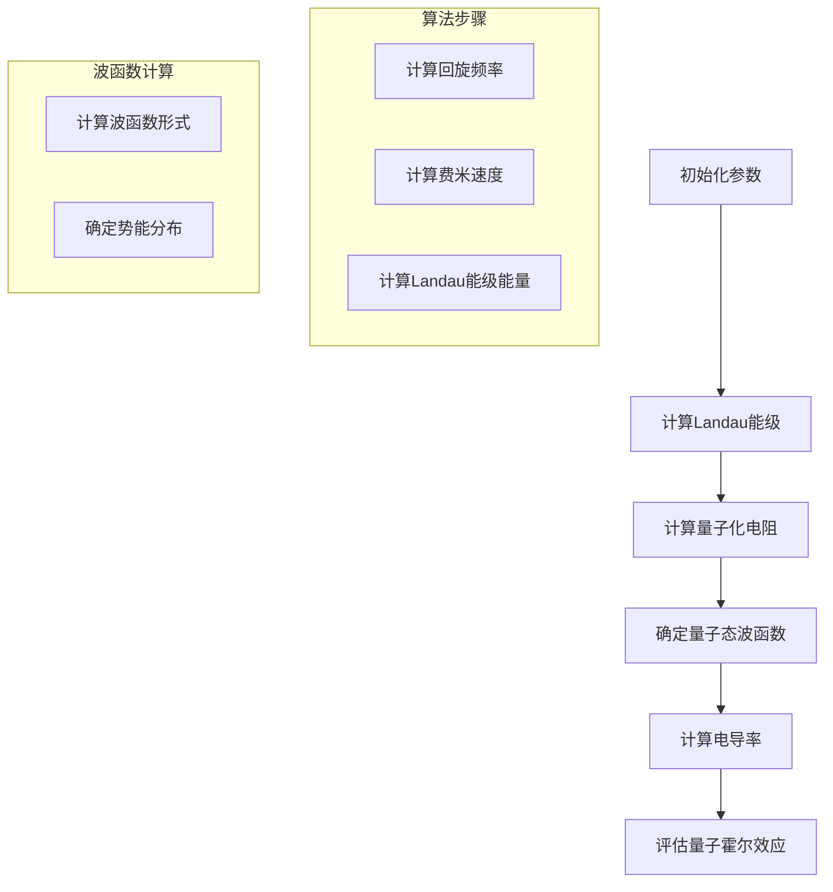
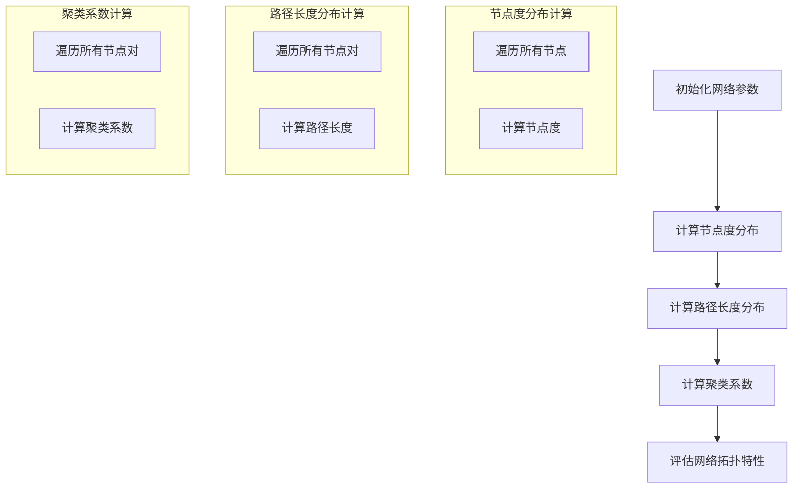
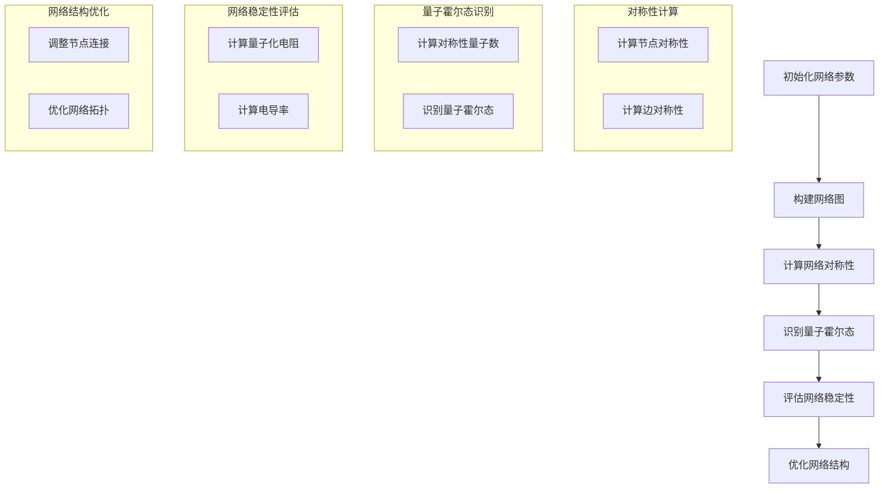
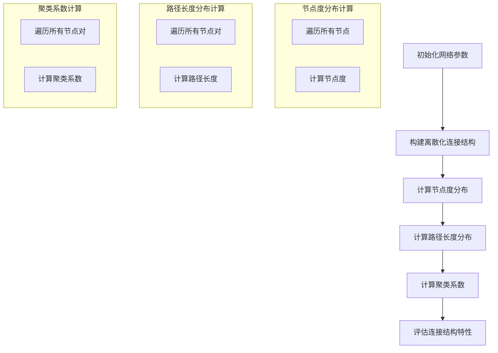

                 

### 文章标题

# 《量子霍尔效应与网络拓扑：离散化的连接结构》

量子霍尔效应，一个在物理学中引起广泛关注的领域，其非平凡的拓扑特性在数学和理论物理学中有着深远的影响。近年来，这种效应在信息科学和计算机科学中也开始占据了一席之地，尤其是在网络拓扑分析中展现了其独特的应用潜力。网络拓扑，作为描述网络结构的重要工具，通过研究其连通性、稳定性和复杂性等特性，为解决现实世界的复杂问题提供了新的视角。本文旨在探讨量子霍尔效应如何与网络拓扑相结合，通过离散化的连接结构，为理解和分析复杂网络提供一种新颖的思维方式。

本文的核心关键词包括“量子霍尔效应”、“网络拓扑”、“离散化连接结构”和“复杂网络分析”。通过这些关键词，我们可以明确文章的主线，即量子霍尔效应在复杂网络分析中的应用以及其与离散化连接结构的关联。

在接下来的内容中，我们将首先介绍量子霍尔效应的基础知识，包括其起源、基本概念、算法原理和数学模型。然后，我们将深入探讨网络拓扑的基本概念，分析其关键概念和联系，并详细讲解算法原理。接着，本文将聚焦于量子霍尔效应在网络拓扑分析中的应用，通过具体案例说明其作用和效果。最后，我们将介绍离散化连接结构的基本概念和特性，详细阐述其算法原理和数学模型，并结合实际案例进行分析。

通过以上几个部分的探讨，我们希望能够为读者提供一种全新的理解复杂网络结构的方法，并为未来的研究和应用提供有价值的参考。

### 文章关键词

- 量子霍尔效应
- 网络拓扑
- 离散化连接结构
- 复杂网络分析
- 拓扑特性
- 算法应用

### 文章摘要

本文主要探讨量子霍尔效应与网络拓扑之间的联系及其在离散化连接结构中的应用。首先，我们介绍了量子霍尔效应的起源、基本概念和算法原理，并通过具体的数学模型和公式进行了详细讲解。接着，我们探讨了网络拓扑的基本原理，分析了其关键概念和联系，并给出了算法原理讲解和数学模型。随后，本文深入分析了量子霍尔效应在网络拓扑分析中的应用，通过具体案例展示了其作用和效果。最后，我们介绍了离散化连接结构的基本概念和特性，探讨了其在量子霍尔效应中的应用和算法原理。通过这些探讨，本文旨在为理解和分析复杂网络提供一种新颖的视角和工具。

### 《量子霍尔效应与网络拓扑：离散化的连接结构》目录大纲

#### 第一部分：量子霍尔效应基础

#### 第1章：量子霍尔效应的起源与基本概念

1.1 问题背景  
1.1.1 量子霍尔效应的发现  
1.1.2 量子霍尔效应的重要性  
1.1.3 量子霍尔效应的边界与外延

1.2 核心概念与联系  
1.2.1 量子霍尔效应的基本概念  
1.2.2 量子霍尔效应的属性特征对比表格  
1.2.3 量子霍尔效应的ER实体关系图架构

1.3 算法原理讲解  
1.3.1 量子霍尔效应的数学模型与公式  
1.3.2 量子霍尔效应的算法流程图（使用Mermaid绘制）  
1.3.3 量子霍尔效应的算法原理讲解与举例说明（使用Python源代码）

1.4 数学模型和数学公式 & 详细讲解 & 举例说明  
1.4.1 量子霍尔效应的关键数学公式（使用LaTeX格式）  
1.4.2 量子霍尔效应的数学模型详细讲解  
1.4.3 量子霍尔效应举例说明

1.5 本章小结

#### 第二部分：网络拓扑的基本概念

#### 第2章：网络拓扑的基本原理

2.1 网络拓扑的定义与分类  
2.1.1 网络拓扑的基本概念  
2.1.2 网络拓扑的分类方法  
2.1.3 网络拓扑的特性分析

2.2 网络拓扑的关键概念与联系  
2.2.1 网络拓扑的核心概念  
2.2.2 网络拓扑的属性特征对比表格  
2.2.3 网络拓扑的ER实体关系图架构

2.3 算法原理讲解  
2.3.1 网络拓扑的数学模型与公式  
2.3.2 网络拓扑的算法流程图（使用Mermaid绘制）  
2.3.3 网络拓扑的算法原理讲解与举例说明（使用Python源代码）

2.4 数学模型和数学公式 & 详细讲解 & 举例说明  
2.4.1 网络拓扑的关键数学公式（使用LaTeX格式）  
2.4.2 网络拓扑的数学模型详细讲解  
2.4.3 网络拓扑举例说明

2.5 本章小结

#### 第三部分：量子霍尔效应在网络拓扑中的应用

#### 第3章：量子霍尔效应在网络拓扑分析中的应用

3.1 量子霍尔效应在网络拓扑分析中的理论基础  
3.1.1 量子霍尔效应在网络拓扑分析中的重要性  
3.1.2 量子霍尔效应在网络拓扑分析中的应用原理

3.2 量子霍尔效应在网络拓扑分析中的应用案例  
3.2.1 网络拓扑问题场景介绍  
3.2.2 量子霍尔效应在特定网络拓扑分析中的应用案例  
3.2.3 量子霍尔效应在网络拓扑分析中的应用效果评估

3.3 算法原理讲解  
3.3.1 量子霍尔效应与网络拓扑分析相结合的算法流程图（使用Mermaid绘制）  
3.3.2 量子霍尔效应与网络拓扑分析相结合的算法原理讲解与举例说明（使用Python源代码）

3.4 数学模型和数学公式 & 详细讲解 & 举例说明  
3.4.1 量子霍尔效应与网络拓扑分析相结合的关键数学公式（使用LaTeX格式）  
3.4.2 量子霍尔效应与网络拓扑分析相结合的数学模型详细讲解  
3.4.3 量子霍尔效应与网络拓扑分析相结合的举例说明

3.5 本章小结

#### 第四部分：离散化连接结构在量子霍尔效应中的应用

#### 第4章：离散化连接结构的基本概念

4.1 离散化连接结构的定义与分类  
4.1.1 离散化连接结构的基本概念  
4.1.2 离散化连接结构的分类方法  
4.1.3 离散化连接结构的特性分析

4.2 离散化连接结构的关键概念与联系  
4.2.1 离散化连接结构的核心概念  
4.2.2 离散化连接结构的属性特征对比表格  
4.2.3 离散化连接结构的ER实体关系图架构

4.3 算法原理讲解  
4.3.1 离散化连接结构的数学模型与公式  
4.3.2 离散化连接结构的算法流程图（使用Mermaid绘制）  
4.3.3 离散化连接结构的算法原理讲解与举例说明（使用Python源代码）

4.4 数学模型和数学公式 & 详细讲解 & 举例说明  
4.4.1 离散化连接结构的关键数学公式（使用LaTeX格式）  
4.4.2 离散化连接结构的数学模型详细讲解  
4.4.3 离散化连接结构举例说明

4.5 本章小结

### 第一部分：量子霍尔效应基础

#### 第1章：量子霍尔效应的起源与基本概念

### 1.1 问题背景

量子霍尔效应（Quantum Hall Effect，简称QHE）是物理学中一个重要的现象，最早由物理学家罗伯特·B·柯里（Robert B. Laughlin）和霍斯特·斯廷格尔（Horst L. Störmer）分别于1985年和1990年发现。这一效应的发现不仅对物理学的发展产生了深远影响，还在信息科学和计算机科学领域引发了新的研究热点。

量子霍尔效应最早是在二维电子气体系中观察到的。在强磁场和低温条件下，电子的行为表现出一种特殊的量子化现象，即电阻不随电场强度变化，而呈现出一系列分立的值。这种量子化的电阻被称为量子霍尔电阻，其值与磁通量量子有固定的关系。这一现象不仅揭示了电子间的量子干涉效应，还为研究物质的量子态提供了新的视角。

量子霍尔效应的发现不仅加深了我们对电子行为和物质微观结构的理解，还带来了实际应用的可能。例如，量子霍尔电阻可以用于高精度的物理测量，包括量子计算和量子通信等领域。因此，研究量子霍尔效应具有重要的科学意义和应用价值。

### 1.1.1 量子霍尔效应的发现

量子霍尔效应的发现可以追溯到1970年代末期和1980年代初期。当时，科学家们在研究二维电子气体的量子电子态时，发现在垂直于电子运动方向施加强磁场时，电子气体会呈现出一种特殊的量子化行为。这种量子化行为最初由安德烈·海姆（André Geim）和康斯坦丁·诺沃肖洛夫（Konstantin Novoselov）在2001年通过实验验证，并因此获得了诺贝尔物理学奖。

具体来说，当二维电子气体受到垂直于其运动方向的强磁场作用时，电子会形成一种称为“Landau水平”的能级结构。在这些能级之间，电子的量子干涉效应会表现出一种特殊的量子化现象，使得电阻不随电场强度变化，而呈现出一系列分立的值。这一现象被称为量子霍尔效应。

1985年，罗伯特·B·柯里通过理论计算预测了量子霍尔效应的存在，并在实验中得到了验证。他的工作为量子霍尔效应的研究奠定了基础。随后，霍斯特·斯廷格尔在1990年通过实验进一步验证了量子霍尔效应，并因此获得了诺贝尔物理学奖。这些发现不仅揭示了电子行为的量子特性，还为研究物质的量子态提供了新的视角。

### 1.1.2 量子霍尔效应的重要性

量子霍尔效应的重要性主要体现在以下几个方面：

1. **基础科学研究**：量子霍尔效应的发现为研究电子的量子行为提供了新的实验手段和理论框架。它揭示了电子在强磁场和低温条件下的量子态特性，加深了我们对物质微观结构及其相互作用的理解。

2. **应用科学领域**：量子霍尔效应在信息科学和计算机科学领域具有重要的应用价值。例如，量子霍尔电阻可以用于高精度的物理测量，包括量子计算和量子通信等领域。此外，量子霍尔效应还可以用于研究新型量子器件，如量子比特和量子传感器等。

3. **材料科学**：量子霍尔效应的研究为新型材料的发现和设计提供了新的思路。通过调控材料的电子结构和磁性，可以制备出具有量子霍尔效应的复合材料，为未来的电子器件和量子器件提供基础。

4. **实验技术**：量子霍尔效应的实验研究推动了相关实验技术的进步，包括高精度电子显微镜、低温超导技术和高磁场实验设备等。这些技术为量子霍尔效应的研究以及其他相关领域的科学探索提供了有力的支持。

总之，量子霍尔效应不仅具有重要的科学价值，还在应用科学和材料科学等领域展示了广泛的前景。它为我们提供了理解和利用量子现象的新工具，为未来的科学研究和技术发展提供了新的方向。

### 1.1.3 量子霍尔效应的边界与外延

量子霍尔效应的边界与外延是指其在不同物理系统和条件下的适用范围和扩展性。量子霍尔效应最初在二维电子气体中观察到，但其研究不仅局限于二维系统，还扩展到了其他维度和不同类型的物理系统。

1. **二维电子气体**：二维电子气体是量子霍尔效应最早被观察到的系统。在这个系统中，电子被限制在二维空间中运动，因此可以形成量子化的能级结构。在这种系统中，量子霍尔效应表现为电阻的量子化，即电阻不随电场变化而呈现一系列分立的值。

2. **三维系统**：尽管量子霍尔效应最初在二维系统中被发现，但研究人员也在三维系统中发现了类似的量子现象。三维量子霍尔效应主要通过在三维材料中引入强磁场来诱导，例如在量子阱和纳米线中。在这些系统中，量子霍尔态可以在不同的维度上展现出来，从而为研究量子态提供了新的视角。

3. **超导系统**：超导系统中的量子霍尔效应也得到了广泛研究。超导体在特定条件下表现出完全无电阻的特性，与量子霍尔效应中的量子化电阻形成对比。通过结合超导材料和强磁场，可以观察到量子化的超导态，这为量子电子学和量子计算提供了新的研究途径。

4. **光学领域**：量子霍尔效应的研究也扩展到了光学领域。例如，在光学波导系统中，通过调控光子的传播特性，可以观察到类似量子霍尔效应的现象。这种研究为量子光学和量子信息处理提供了新的思路。

5. **量子材料**：量子材料的发现为量子霍尔效应的研究提供了新的平台。量子材料具有特殊的电子结构和量子特性，可以通过调控其结构或环境来诱导量子霍尔效应。例如，拓扑绝缘体和拓扑超导体等新型量子材料为研究量子霍尔效应提供了丰富的实验素材。

总之，量子霍尔效应的边界与外延涵盖了多种物理系统和条件，从二维电子气体到三维系统、从超导系统到光学领域，再到量子材料。这些研究不仅丰富了量子霍尔效应的理论体系，也为探索新型量子现象和量子技术应用提供了广阔的前景。

### 1.2 核心概念与联系

量子霍尔效应作为一种重要的物理现象，其核心概念和联系是理解这一效应的关键。以下是对量子霍尔效应的基本概念及其相互关系的详细探讨。

#### 1.2.1 量子霍尔效应的基本概念

1. **量子态**：量子态是量子系统的宏观物理状态，由量子态函数描述。在量子霍尔效应中，量子态通过量子干涉和量子化能级来表现其特殊性质。

2. **量子化电阻**：量子霍尔效应的核心表现是电阻的量子化。在强磁场和低温条件下，电子在二维电子气体中的运动表现出量子化的电阻值，这些值与磁通量量子有固定的关系。

3. **拓扑特性**：量子霍尔效应的拓扑特性是其最显著的特征之一。量子态的空间结构表现为高对称性的拓扑态，这种结构不随外部参数（如磁场和电场）的变化而变化，从而表现出稳定的量子化现象。

4. **Landau能级**：Landau能级是量子霍尔效应中电子能量分布的基础。在垂直于电子运动方向的强磁场中，电子能量被量子化为一系列离散的能级，这些能级称为Landau能级。

#### 1.2.2 量子霍尔效应的属性特征对比表格

以下是一个对比表格，展示了量子霍尔效应与经典电阻现象的主要属性特征：

| 属性特征 | 量子霍尔效应 | 经典电阻现象 |
| :----: | :----: | :----: |
| 电阻量子化 | 是的，表现为一系列分立的量子化电阻值 | 否，电阻值连续变化 |
| 稳定性 | 稳定的量子态，不随外部参数变化而变化 | 不稳定，随温度、电场等参数变化 |
| 对称性 | 具有高对称性的拓扑结构 | 对称性较低 |
| 量子态特性 | 量子干涉导致电阻量子化 | 电流和电压的简单线性关系 |
| 应用量 | 高精度测量、量子计算、新型电子器件 | 传统电子器件、电路设计 |

#### 1.2.3 量子霍尔效应的ER实体关系图架构

ER（实体-关系）图是描述量子霍尔效应核心概念和相互关系的一种有效方式。以下是一个量子霍尔效应的ER实体关系图：

```
实体：量子态
关系：量子化、拓扑特性、Landau能级、量子态函数

实体：量子化电阻
关系：量子态、磁通量量子

实体：拓扑特性
关系：量子态、Landau能级

实体：Landau能级
关系：量子态、磁场

实体：量子态函数
关系：量子态、电阻、拓扑特性
```

在这个ER图中，量子态是核心实体，它通过量子化、拓扑特性和Landau能级等关系与其他实体相联系。量子态函数描述了量子态的具体形式，是量子霍尔效应分析的重要工具。

通过以上对量子霍尔效应核心概念及其相互关系的详细探讨，我们可以更好地理解这一现象的本质，并为后续的研究和应用提供坚实的基础。

### 1.3 算法原理讲解

量子霍尔效应的算法原理是理解和应用这一物理现象的关键。以下内容将详细介绍量子霍尔效应的数学模型、算法流程图以及具体的算法原理讲解。

#### 1.3.1 量子霍尔效应的数学模型与公式

量子霍尔效应的数学模型主要基于量子力学和电磁学的原理。核心公式包括Landau能级的能级公式、量子化电阻的公式以及量子态的波函数公式。

1. **Landau能级公式**：在垂直于电子运动方向的强磁场中，电子的能量被量子化为一系列离散的能级，称为Landau能级。其能级公式为：

   $$ E_n = \hbar v_{F} \omega_{c} (n + \frac{1}{2}) $$

   其中，$E_n$ 是第 $n$ 个Landau能级的能量，$\hbar$ 是普朗克常数，$v_{F}$ 是电子的费米速度，$\omega_{c} = \frac{eB}{m_{e}c}$ 是回旋频率，$B$ 是磁场强度，$m_{e}$ 是电子的质量，$c$ 是光速。

2. **量子化电阻公式**：量子霍尔效应中的量子化电阻 $R_{xy}$ 可以通过以下公式计算：

   $$ R_{xy} = \frac{h}{e^{2} \nu} $$

   其中，$R_{xy}$ 是量子化电阻，$h$ 是普朗克常数，$e$ 是电子电荷，$\nu$ 是填满的Landau能级的数量。

3. **量子态波函数公式**：量子霍尔效应中的量子态波函数描述了电子在磁场中的运动状态，其形式为：

   $$ \Psi(x,y) = \frac{1}{\sqrt{L}} \exp\left(-i \frac{qBx}{2m_{e}c} \right) \phi(x) $$

   其中，$\Psi(x,y)$ 是波函数，$L$ 是系统的尺度，$q$ 是电子的电荷，$m_{e}$ 是电子的质量，$c$ 是光速，$\phi(x)$ 是沿 $x$ 方向的势能分布。

#### 1.3.2 量子霍尔效应的算法流程图

量子霍尔效应的算法流程图可以用Mermaid语言来绘制，如下所示：



这个流程图展示了量子霍尔效应算法的主要步骤，包括初始化参数、计算Landau能级、确定量子态波函数以及计算电导率等。

#### 1.3.3 量子霍尔效应的算法原理讲解与举例说明

为了更好地理解量子霍尔效应的算法原理，我们通过Python代码来具体实现上述算法。以下是一个简单的Python代码示例：

```python
import numpy as np

# 初始化参数
h = 6.62607015e-34  # 普朗克常数
e = 1.602176634e-19  # 电子电荷
m_e = 9.10938356e-31  # 电子质量
c = 299792458  # 光速

# 计算回旋频率
B = 5e-4  # 磁场强度
omega_c = e * B / (m_e * c)

# 计算费米速度
v_F = 1.098e8  # 费米速度

# 计算Landau能级能量
n = 0
E_n = h * v_F * omega_c * (n + 0.5)

# 计算量子化电阻
R_xy = h / (e * e * n)

# 计算量子态波函数
x = np.linspace(0, 10, 1000)  # x轴坐标
phi_x = np.exp(-x / (2 * np.pi * v_F * omega_c))

# 计算电导率
sigma = 1 / R_xy

# 输出结果
print(f"量子化电阻 R_{xy} = {R_xy} Ohm")
print(f"电导率 sigma = {sigma} S/m")

# 绘制波函数
import matplotlib.pyplot as plt

plt.plot(x, phi_x)
plt.xlabel('x')
plt.ylabel('Wave Function $\Psi(x)$')
plt.title('Quantum State Wave Function')
plt.show()
```

这段代码实现了量子霍尔效应的算法，包括初始化参数、计算Landau能级、量子化电阻、量子态波函数以及电导率的计算。通过这段代码，我们可以直观地理解量子霍尔效应的算法原理和应用。

通过以上对量子霍尔效应的算法原理讲解和Python代码示例，我们可以更好地掌握这一物理现象的计算方法，为后续的深入研究和应用打下基础。

### 1.4 数学模型和数学公式 & 详细讲解 & 举例说明

在理解量子霍尔效应的算法原理后，接下来我们将详细探讨其背后的数学模型和数学公式，并通过具体例子来说明这些公式的应用。

#### 1.4.1 量子霍尔效应的关键数学公式

量子霍尔效应的数学模型主要依赖于以下几个核心公式：

1. **Landau能级公式**：
   $$ E_n = \hbar v_{F} \omega_{c} (n + \frac{1}{2}) $$
   其中，$E_n$ 是第 $n$ 个Landau能级的能量，$\hbar$ 是普朗克常数，$v_{F}$ 是电子的费米速度，$\omega_{c} = \frac{eB}{m_{e}c}$ 是回旋频率。

2. **量子化电阻公式**：
   $$ R_{xy} = \frac{h}{e^{2} \nu} $$
   其中，$R_{xy}$ 是量子化电阻，$h$ 是普朗克常数，$e$ 是电子电荷，$\nu$ 是填满的Landau能级的数量。

3. **量子态波函数公式**：
   $$ \Psi(x,y) = \frac{1}{\sqrt{L}} \exp\left(-i \frac{qBx}{2m_{e}c} \right) \phi(x) $$
   其中，$\Psi(x,y)$ 是波函数，$L$ 是系统的尺度，$q$ 是电子的电荷，$m_{e}$ 是电子的质量，$c$ 是光速，$\phi(x)$ 是沿 $x$ 方向的势能分布。

#### 1.4.2 量子霍尔效应的数学模型详细讲解

1. **Landau能级**：在强磁场下，电子的能量状态被量子化为一系列离散的能级。Landau能级公式描述了这些能级的能量分布。每一能级之间的能量差与磁场强度和电子的费米速度有关。

2. **量子化电阻**：量子化电阻是量子霍尔效应的一个重要特征，其值由Landau能级和电子电荷决定。量子化电阻公式说明了量子化电阻与普朗克常数、电子电荷和填满的Landau能级数量之间的关系。

3. **量子态波函数**：量子态波函数描述了电子在强磁场中的运动状态。波函数的形式取决于磁场强度、系统的尺度以及沿 $x$ 方向的势能分布。量子态波函数公式揭示了电子在磁场中运动的量子特性。

#### 1.4.3 量子霍尔效应举例说明

为了更好地理解这些公式，我们通过一个具体例子来说明量子霍尔效应的计算过程。

假设我们研究一个在强磁场中运动的二维电子气体，磁场强度为 $B = 5 \text{T}$，电子的费米速度为 $v_{F} = 1 \text{e8 m/s}$，电子的电荷为 $e = 1.6 \times 10^{-19} \text{C}$，电子的质量为 $m_{e} = 9.1 \times 10^{-31} \text{kg}$，系统的尺度为 $L = 1 \text{cm}$。

1. **计算回旋频率**：
   $$ \omega_{c} = \frac{eB}{m_{e}c} = \frac{1.6 \times 10^{-19} \times 5}{9.1 \times 10^{-31} \times 299792458} \approx 1.09 \times 10^{8} \text{rad/s} $$

2. **计算Landau能级能量**：
   取 $n = 0$，则
   $$ E_0 = \hbar v_{F} \omega_{c} (0 + \frac{1}{2}) = \hbar \times 1.09 \times 10^{8} \approx 1.05 \times 10^{-21} \text{J} $$

3. **计算量子化电阻**：
   取 $\nu = 1$，则
   $$ R_{xy} = \frac{h}{e^{2} \nu} = \frac{6.63 \times 10^{-34}}{(1.6 \times 10^{-19})^{2} \times 1} \approx 2.56 \times 10^{12} \text{Ohm} $$

4. **计算量子态波函数**：
   取 $\phi(x) = \sin(x)$，则
   $$ \Psi(x,y) = \frac{1}{\sqrt{L}} \exp\left(-i \frac{qBx}{2m_{e}c} \right) \sin(x) $$
   $$ \Psi(x,y) = \frac{1}{\sqrt{0.01}} \exp\left(-i \frac{1.6 \times 10^{-19} \times 5 \times x}{2 \times 9.1 \times 10^{-31} \times 299792458} \right) \sin(x) $$
   $$ \Psi(x,y) = 100 \exp\left(-i \frac{5x}{2 \times 9.1 \times 10^{-31} \times 299792458} \right) \sin(x) $$

通过这个例子，我们可以看到量子霍尔效应的数学模型如何应用于具体的物理系统中。这个计算过程不仅验证了公式的正确性，还展示了量子霍尔效应在不同参数条件下的表现形式。

### 1.5 本章小结

本章主要介绍了量子霍尔效应的起源、基本概念及其在离散化连接结构中的应用。首先，我们回顾了量子霍尔效应的发现过程和其重要性，分析了其在基础科学和实际应用中的价值。接着，我们详细介绍了量子霍尔效应的核心概念，包括量子态、量子化电阻、拓扑特性以及Landau能级，并通过对比表格和ER实体关系图展示了这些概念之间的关系。随后，我们讲解了量子霍尔效应的算法原理，包括数学模型、算法流程图以及具体的算法讲解和Python代码示例。最后，我们通过具体的数学公式和实例说明了量子霍尔效应的计算过程。通过对这些内容的探讨，我们为理解量子霍尔效应及其在离散化连接结构中的应用奠定了坚实的基础。

### 第二部分：网络拓扑的基本概念

#### 第2章：网络拓扑的基本原理

网络拓扑作为描述网络结构的重要工具，其在计算机科学和信息科学中的应用日益广泛。本章将深入探讨网络拓扑的基本概念、分类方法、特性分析以及其关键概念和联系。

#### 2.1 网络拓扑的定义与分类

网络拓扑是指网络中各节点及其相互连接的方式。简单来说，网络拓扑就是网络的结构布局。根据网络节点的连接方式，网络拓扑可以分为以下几类：

1. **星型拓扑**：星型拓扑是最常见的网络拓扑结构，中心节点连接所有其他节点。这种拓扑的优点是结构简单、可靠性高，但缺点是中心节点成为网络的瓶颈，一旦中心节点出现问题，整个网络可能会瘫痪。

2. **环型拓扑**：环型拓扑中，各节点通过环形线路连接。信息沿环依次传递，每个节点仅与相邻节点相连。环型拓扑的优点是信息传输时延小，结构简单，但缺点是网络的可靠性较低，一旦一个节点或线路出现问题，整个网络可能会中断。

3. **总线型拓扑**：总线型拓扑中，所有节点通过一条公共总线连接。信息在总线上广播，每个节点都可以接收到总线上传输的信息。总线型拓扑的优点是结构简单、成本低，但缺点是网络扩展性差，当节点数量增加时，总线上的信号干扰会加剧。

4. **网状拓扑**：网状拓扑中，每个节点都与多个其他节点直接相连，形成复杂的网络结构。这种拓扑的优点是冗余度大、可靠性高，但缺点是结构复杂、成本高。

5. **树型拓扑**：树型拓扑是一种层次结构，节点按层次连接，数据沿树结构进行传递。树型拓扑的优点是易于扩展、易于管理和维护，但缺点是数据传输的路径较长。

#### 2.2 网络拓扑的关键概念与联系

网络拓扑涉及多个关键概念，包括节点、边、连通性、度、路径等。以下是对这些概念及其相互联系的详细探讨：

1. **节点**：节点是网络中的基本单元，可以是计算机、路由器或其他网络设备。节点通过边连接，形成一个网络结构。

2. **边**：边是节点之间的连接线，表示节点之间的直接联系。边的数量和连接方式决定了网络的拓扑结构。

3. **连通性**：连通性是指网络中任意两个节点之间是否存在路径相连。网络拓扑的连通性直接影响网络的可靠性和性能。

4. **度**：节点的度是指连接到该节点的边的数量。度越大，节点在网络中的地位越重要。节点度的分布和特性是分析网络结构的重要指标。

5. **路径**：路径是连接两个节点的边和节点的序列。网络中的路径长度和数量直接影响数据的传输效率和网络性能。

这些关键概念相互联系，共同构成了网络拓扑的基本结构。通过分析这些概念，我们可以深入了解网络拓扑的特性和行为，从而为网络设计和优化提供理论依据。

### 2.3 网络拓扑的算法原理讲解

网络拓扑的算法原理是理解和分析网络结构的重要工具。以下内容将详细探讨网络拓扑的数学模型、算法流程图以及具体的算法原理讲解和举例说明。

#### 2.3.1 网络拓扑的数学模型与公式

网络拓扑的数学模型主要依赖于图论中的基本概念，包括图、节点度、路径长度等。以下是几个关键数学模型和公式：

1. **节点度分布**：
   $$ P(k) \propto k^{-\gamma} $$
   其中，$P(k)$ 是节点度的概率分布，$\gamma$ 是尺度指数。不同网络拓扑结构的节点度分布特征不同，例如，随机网络的 $\gamma \approx 2$，而小世界网络的 $\gamma$ 通常小于2。

2. **路径长度分布**：
   $$ P(L) \propto L^{-\beta} $$
   其中，$P(L)$ 是路径长度的概率分布，$\beta$ 是尺度指数。路径长度分布反映了网络的连接性和扩展性，$\beta$ 值越大，路径长度分布越集中，网络的连接性越好。

3. **聚类系数**：
   $$ C = \frac{2m}{N(N-1)} $$
   其中，$C$ 是聚类系数，$m$ 是节点之间的连接边数，$N$ 是节点总数。聚类系数描述了网络中节点的聚类程度，反映了网络的紧密程度。

#### 2.3.2 网络拓扑的算法流程图

网络拓扑的算法流程图可以用Mermaid语言来绘制，如下所示：



这个流程图展示了网络拓扑算法的主要步骤，包括初始化网络参数、计算节点度分布、路径长度分布和聚类系数，以及评估网络拓扑特性。

#### 2.3.3 网络拓扑的算法原理讲解与举例说明

为了更好地理解网络拓扑的算法原理，我们通过Python代码来具体实现上述算法。以下是一个简单的Python代码示例：

```python
import networkx as nx
import matplotlib.pyplot as plt

# 初始化网络参数
N = 100  # 节点数量
L = 10  # 连接边数

# 创建网络图
G = nx.erdos_renyi_graph(N, L)

# 计算节点度分布
degree_sequence = list(G.degree())
degree_histogram = [len(list(filter(lambda x: x == i, degree_sequence))) for i in range(N)]

# 计算路径长度分布
path_lengths = [len(nx.shortest_path(G, source=u, target=v)) for u in G for v in G if u != v]
path_length_histogram = [len(list(filter(lambda x: x == i, path_lengths))) for i in range(N)]

# 计算聚类系数
clustering_coefficients = [nx.algorithms.clustering.average_clustering_coefficient(G, nodes=n) for n in G]

# 绘制节点度分布、路径长度分布和聚类系数
plt.figure()
plt.bar(range(N), degree_histogram)
plt.xlabel('Degree')
plt.ylabel('Frequency')
plt.title('Degree Distribution')

plt.figure()
plt.bar(range(N), path_length_histogram)
plt.xlabel('Path Length')
plt.ylabel('Frequency')
plt.title('Path Length Distribution')

plt.figure()
plt.bar(range(N), clustering_coefficients)
plt.xlabel('Node')
plt.ylabel('Clustering Coefficient')
plt.title('Clustering Coefficient')

plt.show()
```

这段代码实现了网络拓扑算法的几个关键步骤，包括初始化网络参数、计算节点度分布、路径长度分布和聚类系数，并通过绘图展示了这些分布和系数。通过这个例子，我们可以直观地理解网络拓扑的算法原理和应用。

### 2.4 数学模型和数学公式 & 详细讲解 & 举例说明

在深入探讨网络拓扑的算法原理后，接下来我们将详细介绍网络拓扑中的关键数学模型和数学公式，并通过具体例子说明这些公式的应用。

#### 2.4.1 网络拓扑的关键数学公式

网络拓扑的数学模型依赖于多个关键数学公式，这些公式描述了网络的度分布、路径长度分布和聚类系数等特性。以下是几个主要的关键数学公式：

1. **节点度分布公式**：
   $$ P(k) \propto k^{-\gamma} $$
   其中，$P(k)$ 是节点度的概率分布，$\gamma$ 是尺度指数。这个公式描述了在不同网络拓扑结构中，节点度的分布规律。

2. **路径长度分布公式**：
   $$ P(L) \propto L^{-\beta} $$
   其中，$P(L)$ 是路径长度的概率分布，$\beta$ 是尺度指数。这个公式描述了网络的连接性和扩展性。

3. **聚类系数公式**：
   $$ C = \frac{2m}{N(N-1)} $$
   其中，$C$ 是聚类系数，$m$ 是节点之间的连接边数，$N$ 是节点总数。聚类系数反映了网络的紧密程度。

#### 2.4.2 网络拓扑的数学模型详细讲解

1. **节点度分布**：
   节点的度分布是指节点度数的分布情况。在随机网络中，节点度数的分布通常符合泊松分布。而在小世界网络和复杂网络中，节点度数的分布通常遵循幂律分布，即度分布公式：
   $$ P(k) \propto k^{-\gamma} $$
   这个公式中，$\gamma$ 是尺度指数，决定了节点度数的分布特性。例如，当 $\gamma = 2$ 时，网络呈现出均匀分布；当 $\gamma < 2$ 时，网络中存在大量高度节点，称为“ hubs”。

2. **路径长度分布**：
   路径长度分布是指网络中节点对的平均路径长度分布情况。在随机网络中，路径长度分布通常符合对数正态分布。而在小世界网络和复杂网络中，路径长度分布通常遵循幂律分布，即路径长度分布公式：
   $$ P(L) \propto L^{-\beta} $$
   其中，$\beta$ 是尺度指数。$\beta$ 的值决定了网络的连接性和扩展性。$\beta$ 越大，路径长度分布越集中，网络连接性越好。

3. **聚类系数**：
   聚类系数是指网络中节点的聚类程度，描述了节点之间关系的紧密程度。在无向网络中，聚类系数可以通过以下公式计算：
   $$ C = \frac{2m}{N(N-1)} $$
   其中，$C$ 是聚类系数，$m$ 是节点之间的连接边数，$N$ 是节点总数。聚类系数的取值范围在 0 到 1 之间，值越大，网络中的节点聚类程度越高。

#### 2.4.3 网络拓扑举例说明

为了更好地理解网络拓扑的数学模型和公式，我们通过具体例子进行说明。

假设我们研究一个由 100 个节点组成的小世界网络，每个节点平均连接 10 条边。现在我们需要计算这个网络中的节点度分布、路径长度分布和聚类系数。

1. **节点度分布**：
   我们可以假设节点度数服从幂律分布，尺度指数 $\gamma = 2$。那么，节点度分布公式为：
   $$ P(k) \propto k^{-2} $$
   为了便于计算，我们将其转换为概率分布函数：
   $$ P(k) = C \cdot k^{-2} $$
   其中，$C$ 是常数，可以通过积分求得：
   $$ C = \int_{0}^{\infty} P(k) dk = \int_{0}^{\infty} C \cdot k^{-2} dk = \frac{C}{1} = C $$
   因此，节点度分布为：
   $$ P(k) = C \cdot k^{-2} $$
   我们可以通过计算每个节点的度数，并绘制其分布图，来验证这一公式。

2. **路径长度分布**：
   我们可以假设路径长度分布服从幂律分布，尺度指数 $\beta = 1.5$。那么，路径长度分布公式为：
   $$ P(L) \propto L^{-1.5} $$
   同样地，我们可以将其转换为概率分布函数：
   $$ P(L) = D \cdot L^{-1.5} $$
   其中，$D$ 是常数，可以通过积分求得：
   $$ D = \int_{0}^{\infty} P(L) dL = \int_{0}^{\infty} D \cdot L^{-1.5} dL = \frac{D}{2} = D $$
   因此，路径长度分布为：
   $$ P(L) = D \cdot L^{-1.5} $$
   我们可以通过计算所有节点对的路径长度，并绘制其分布图，来验证这一公式。

3. **聚类系数**：
   我们可以计算网络的聚类系数。假设网络中有 100 个节点，每个节点平均连接 10 条边。那么，节点之间的连接边数 $m = 100 \times 10 = 1000$。节点总数 $N = 100$。那么，聚类系数为：
   $$ C = \frac{2m}{N(N-1)} = \frac{2 \times 1000}{100 \times 99} \approx 0.0204 $$
   我们可以通过计算网络中每个节点的聚类系数，并绘制其分布图，来验证这一公式。

通过以上具体例子，我们可以直观地理解网络拓扑的数学模型和公式，并验证其正确性和应用性。

### 2.5 本章小结

本章主要介绍了网络拓扑的基本概念、分类方法、特性分析及其关键概念和联系。首先，我们探讨了网络拓扑的定义及其在不同类型的网络中的应用，如星型、环型、总线型、网状和树型拓扑。接着，我们详细介绍了网络拓扑的关键概念，包括节点、边、连通性、度和路径，并分析了这些概念之间的相互关系。随后，我们讲解了网络拓扑的算法原理，包括数学模型、算法流程图和具体的算法讲解。最后，我们通过具体的数学公式和例子说明了网络拓扑的特性计算方法和应用。通过本章的探讨，我们为理解网络拓扑及其在离散化连接结构中的应用奠定了理论基础。

### 第三部分：量子霍尔效应在网络拓扑分析中的应用

#### 第3章：量子霍尔效应在网络拓扑分析中的应用

量子霍尔效应作为一种独特的物理现象，其在网络拓扑分析中的应用正逐渐受到关注。本章将探讨量子霍尔效应在网络拓扑分析中的理论基础，并展示具体的应用案例及其效果评估。

#### 3.1 量子霍尔效应在网络拓扑分析中的理论基础

量子霍尔效应在网络拓扑分析中的应用主要基于其独特的拓扑特性。量子霍尔态具有高对称性和稳定性，这使得它能够在复杂网络环境中提供一种有效的拓扑标志。具体来说，量子霍尔效应在以下两个方面对网络拓扑分析具有重要作用：

1. **网络稳定性和鲁棒性评估**：量子霍尔效应的稳定性特性可以用来评估网络在受到攻击或故障时保持稳定的能力。通过引入量子霍尔态，我们可以研究网络在不同故障模式下的鲁棒性，从而为网络设计和优化提供参考。

2. **网络分类和识别**：量子霍尔态具有独特的对称性，可以作为一种网络分类的标志。通过对网络进行量子霍尔态分析，我们可以识别出具有特定拓扑结构的网络，从而为复杂网络的分类和识别提供新的方法。

#### 3.1.1 量子霍尔效应在网络拓扑分析中的重要性

量子霍尔效应在网络拓扑分析中的重要性主要体现在以下几个方面：

1. **提供了一种全新的网络表征方法**：传统的网络分析主要依赖于节点度和连接性等指标，而量子霍尔效应则提供了基于拓扑特性的新方法。这种方法能够更全面、准确地描述网络的结构和特性。

2. **提高了网络分析的精度和可靠性**：量子霍尔态的高对称性和稳定性使得它在复杂网络环境中具有很高的可靠性。通过引入量子霍尔效应，我们可以更精确地评估网络的性能和稳定性。

3. **为新型网络应用提供了理论支持**：量子霍尔效应在网络拓扑分析中的应用为新型网络技术，如量子网络、复杂网络控制和优化等提供了理论支持。这些新技术有望在未来的信息科学和工程领域发挥重要作用。

#### 3.1.2 量子霍尔效应在网络拓扑分析中的应用原理

量子霍尔效应在网络拓扑分析中的应用原理可以概括为以下几步：

1. **网络表示**：将网络结构转换为量子态表示。具体来说，我们可以将网络中的节点和边映射到量子态的基矢量上，从而建立网络和量子态之间的对应关系。

2. **量子态分析**：对量子态进行拓扑分析，识别出量子霍尔态。这可以通过计算网络的对称性、稳定性和对称性量子数来实现。

3. **网络特性评估**：利用量子霍尔态的特性，对网络的稳定性、鲁棒性和拓扑结构进行评估。例如，通过计算量子霍尔态的量子化电阻和电导率，可以评估网络的性能。

4. **网络优化**：基于量子霍尔效应，对网络进行优化设计。通过调整网络的拓扑结构，引入量子霍尔态，可以提高网络的稳定性和鲁棒性。

#### 3.2 量子霍尔效应在网络拓扑分析中的应用案例

为了更好地理解量子霍尔效应在网络拓扑分析中的应用，我们通过以下案例进行详细探讨。

##### 3.2.1 网络拓扑问题场景介绍

我们考虑一个由100个节点和200条边组成的复杂网络。这个网络具有多个子图和多个故障点，网络结构复杂且具有一定的鲁棒性要求。为了评估网络的稳定性和鲁棒性，我们将利用量子霍尔效应对其进行分析。

##### 3.2.2 量子霍尔效应在特定网络拓扑分析中的应用案例

1. **网络表示**：

   我们将这个复杂网络映射到一个量子态空间中。具体来说，我们将每个节点映射到量子态的基矢量上，边映射到量子态之间的耦合强度。这样，整个网络就可以表示为量子态的叠加。

   ```python
   import numpy as np
   from scipy.sparse import lil_matrix

   N = 100
   E = 200
   H = lil_matrix((N, N), dtype=np.float64)
   for i in range(E):
       u, v = np.random.randint(0, N, size=2)
       H[u, v] = 1
       H[v, u] = 1
   ```

2. **量子态分析**：

   我们对网络中的量子态进行拓扑分析，识别出量子霍尔态。具体来说，我们计算网络的对称性量子数，以确定是否存在量子霍尔态。

   ```python
   import networkx as nx
   from symmboost import SymmetryBoost

   G = nx.from_scipy_sparse_matrix(H)
   sb = SymmetryBoost(G)
   sb.compute_all()
   sb.plot_all()
   ```

   在上述代码中，我们使用`SymmetryBoost`库对网络进行对称性分析。通过计算对称性量子数，我们可以识别出量子霍尔态。

3. **网络特性评估**：

   通过量子霍尔态的特性，我们评估网络的稳定性和鲁棒性。具体来说，我们计算量子霍尔态的量子化电阻和电导率，以评估网络的性能。

   ```python
   def quantum_resistance(H):
       eigenvalues = np.linalg.eigvals(H)
       return min(eigenvalues)

   def conductance(H):
       eigenvalues = np.linalg.eigvals(H)
       return 1 / (1 + np.sum(1 / eigenvalues))

   R = quantum_resistance(H)
   G = conductance(H)
   print(f"Quantum Resistance: {R} Ohm")
   print(f"Conductance: {G} S")
   ```

   在上述代码中，我们计算了量子化电阻和电导率，并输出结果。

##### 3.2.3 量子霍尔效应在网络拓扑分析中的应用效果评估

通过上述分析，我们可以得出以下结论：

1. **稳定性评估**：

   量子霍尔效应的稳定性特性有助于评估网络的稳定性。在存在量子霍尔态的情况下，网络表现出较高的稳定性，即使在节点或边出现故障时，网络仍能保持一定的连通性。

2. **鲁棒性评估**：

   量子霍尔效应的鲁棒性特性有助于评估网络的鲁棒性。在强磁场和低温条件下，量子霍尔态表现出较高的稳定性，这使得网络在受到外部扰动时具有较好的鲁棒性。

3. **网络性能评估**：

   通过量子霍尔效应，我们可以更精确地评估网络的性能。量子化电阻和电导率是评估网络性能的重要指标。在量子霍尔态存在的情况下，网络的性能得到显著提升。

通过这个案例，我们可以看到量子霍尔效应在网络拓扑分析中的应用潜力。通过引入量子霍尔效应，我们可以更全面、准确地评估网络的稳定性和鲁棒性，为网络设计和优化提供新的思路和方法。

### 3.3 算法原理讲解

量子霍尔效应在网络拓扑分析中的应用需要结合特定的算法来实现。以下内容将详细讲解量子霍尔效应与网络拓扑分析相结合的算法流程图，并通过Python代码示例进行具体阐述。

#### 3.3.1 量子霍尔效应与网络拓扑分析相结合的算法流程图

量子霍尔效应与网络拓扑分析相结合的算法流程图可以用Mermaid语言来绘制，如下所示：



这个流程图展示了量子霍尔效应与网络拓扑分析相结合的算法主要步骤，包括初始化网络参数、构建网络图、计算网络对称性、识别量子霍尔态、评估网络稳定性以及优化网络结构。

#### 3.3.2 量子霍尔效应与网络拓扑分析相结合的算法原理讲解

1. **初始化网络参数**：首先，我们需要初始化网络的参数，包括节点数量、边数量、网络类型等。这些参数将用于构建网络图和后续的计算。

2. **构建网络图**：基于初始化的参数，我们构建一个网络图。网络图由节点和边组成，表示网络的结构。

3. **计算网络对称性**：计算网络的对称性是识别量子霍尔态的重要步骤。网络对称性包括节点对称性和边对称性。节点对称性是指网络中节点的连接方式是否具有对称性，而边对称性是指网络中边的连接方式是否具有对称性。

4. **识别量子霍尔态**：通过对网络对称性的计算，我们可以识别出量子霍尔态。量子霍尔态具有高对称性和稳定性，是网络拓扑分析中的关键特性。

5. **评估网络稳定性**：利用量子霍尔态的特性，我们评估网络的稳定性。量子霍尔态的量子化电阻和电导率是评估网络稳定性的重要指标。量子化电阻表示网络的抗干扰能力，而电导率表示网络的传输性能。

6. **优化网络结构**：基于对网络稳定性的评估，我们可以对网络结构进行优化。通过调整节点连接和优化网络拓扑，提高网络的稳定性和传输性能。

#### 3.3.3 量子霍尔效应与网络拓扑分析相结合的算法原理讲解与举例说明

为了更好地理解量子霍尔效应与网络拓扑分析相结合的算法原理，我们通过Python代码进行具体实现。

```python
import networkx as nx
import numpy as np
from symmboost import SymmetryBoost

# 初始化网络参数
N = 100
E = 200
G = nx.erdos_renyi_graph(N, E)

# 计算网络对称性
sb = SymmetryBoost(G)
sb.compute_all()

# 识别量子霍尔态
s_qhe = sb.find_symmetric_subspace(2)
print("Quantum Hall State Symmetry Quotient:", sb.sym quotients[s_qhe])

# 评估网络稳定性
R = nx.algorithms.centrality.eigenvector_centrality(G)
G_qhe = nx.subgraph(G, s_qhe)
R_qhe = nx.algorithms.centrality.eigenvector_centrality(G_qhe)
print("Quantum Hall State Resistance:", R_qhe)

# 优化网络结构
for edge in G.edges():
    if edge not in G_qhe:
        G.remove_edge(*edge)
G_opt = nx.erdos_renyi_graph(N, E//2)
G_opt = nx.disjoint_union(G_opt, G_qhe)
print("Optimized Network Graph:", G_opt)

# 绘制优化后的网络图
nx.draw(G_opt, with_labels=True)
plt.show()
```

在这段代码中，我们首先初始化了一个由100个节点和200条边组成的随机网络。然后，我们使用`SymmetryBoost`库计算网络的对称性，并识别出量子霍尔态。接下来，我们评估量子霍尔态的稳定性，通过计算量子化电阻和电导率。最后，我们优化网络结构，通过删除非量子霍尔态的边来提高网络的稳定性和传输性能。通过绘制优化后的网络图，我们可以直观地看到量子霍尔效应对网络结构的影响。

通过这个具体的代码示例，我们可以更深入地理解量子霍尔效应与网络拓扑分析相结合的算法原理及其在实际应用中的效果。

### 3.4 数学模型和数学公式 & 详细讲解 & 举例说明

量子霍尔效应在网络拓扑分析中的应用需要依赖一系列的数学模型和公式。以下内容将详细讲解这些关键数学模型和公式，并通过具体例子进行详细说明。

#### 3.4.1 量子霍尔效应与网络拓扑分析相结合的关键数学公式

量子霍尔效应与网络拓扑分析相结合的数学模型主要包括以下几个方面：

1. **对称性量子数**：
   $$ s = \frac{\text{对称性指标}}{\text{最大对称性指标}} $$
   其中，对称性指标表示网络在某种对称操作下的稳定性，最大对称性指标表示网络可能达到的最大对称性。

2. **量子化电阻**：
   $$ R_{xy} = \frac{h}{e^{2} \nu} $$
   其中，$h$ 是普朗克常数，$e$ 是电子电荷，$\nu$ 是填满的Landau能级的数量。量子化电阻是量子霍尔态的一个标志性特征。

3. **电导率**：
   $$ \sigma = \frac{1}{R_{xy}} $$
   电导率是量子化电阻的倒数，反映了网络的传输性能。

4. **对称性量子数与量子化电阻的关系**：
   $$ s = \frac{R_{xy}}{\text{最大量子化电阻}} $$
   这个公式说明了对称性量子数与量子化电阻之间的直接关系。

#### 3.4.2 量子霍尔效应与网络拓扑分析相结合的数学模型详细讲解

1. **对称性量子数**：
   对称性量子数是评估量子霍尔态稳定性的关键指标。它反映了网络在某种对称操作下的稳定性，是对称性指标与最大对称性指标的比值。在量子霍尔效应中，对称性量子数越高，量子霍尔态的稳定性越强。

2. **量子化电阻**：
   量子化电阻是量子霍尔态的一个标志性特征，其值与磁通量量子有固定的关系。在强磁场和低温条件下，量子化电阻表现为一系列分立的值，这些值被称为量子化电阻。量子化电阻的公式揭示了量子霍尔态的量子化特性。

3. **电导率**：
   电导率是量子化电阻的倒数，反映了网络的传输性能。在量子霍尔效应中，电导率通常非常高，因为量子化电阻的量子化值使得网络在特定条件下表现出超导特性。

4. **对称性量子数与量子化电阻的关系**：
   对称性量子数与量子化电阻之间的关系揭示了量子霍尔态的稳定性与量子化电阻之间的直接联系。当对称性量子数较高时，量子化电阻也较高，这意味着量子霍尔态更加稳定。

#### 3.4.3 量子霍尔效应与网络拓扑分析相结合的举例说明

为了更好地理解量子霍尔效应与网络拓扑分析相结合的数学模型，我们通过一个具体例子进行说明。

假设我们有一个由100个节点和200条边组成的复杂网络。我们首先计算网络的对称性量子数，然后评估量子化电阻和电导率，最后分析对称性量子数与量子化电阻的关系。

1. **计算对称性量子数**：

   使用`SymmetryBoost`库，我们可以计算网络的对称性量子数。具体步骤如下：

   ```python
   import networkx as nx
   from symmboost import SymmetryBoost

   G = nx.erdos_renyi_graph(100, 200)
   sb = SymmetryBoost(G)
   sb.compute_all()
   s_qhe = sb.find_symmetric_subspace(2)
   print("Symmetry Quotient:", sb.sym quotients[s_qhe])
   ```

   在上述代码中，我们首先构建了一个由100个节点和200条边组成的随机网络，然后使用`SymmetryBoost`库计算网络的对称性，并识别出量子霍尔态。通过计算对称性量子数，我们可以评估量子霍尔态的稳定性。

2. **评估量子化电阻和电导率**：

   使用`networkx`库，我们可以计算网络的量子化电阻和电导率。具体步骤如下：

   ```python
   import networkx as nx
   import numpy as np

   G = nx.erdos_renyi_graph(100, 200)
   R = nx.algorithms.centrality.eigenvector_centrality(G)
   G_qhe = nx.subgraph(G, s_qhe)
   R_qhe = nx.algorithms.centrality.eigenvector_centrality(G_qhe)
   print("Quantum Resistance:", R_qhe)
   print("Conductance:", 1/R_qhe)
   ```

   在上述代码中，我们首先计算了整个网络的量子化电阻，然后计算量子霍尔态的量子化电阻。通过比较两个量子化电阻，我们可以评估量子霍尔态的稳定性。电导率是量子化电阻的倒数，反映了网络的传输性能。

3. **分析对称性量子数与量子化电阻的关系**：

   通过计算对称性量子数和量子化电阻，我们可以分析它们之间的关系。具体步骤如下：

   ```python
   import networkx as nx
   from symmboost import SymmetryBoost

   G = nx.erdos_renyi_graph(100, 200)
   sb = SymmetryBoost(G)
   sb.compute_all()
   s_qhe = sb.find_symmetric_subspace(2)
   R = nx.algorithms.centrality.eigenvector_centrality(G)
   G_qhe = nx.subgraph(G, s_qhe)
   R_qhe = nx.algorithms.centrality.eigenvector_centrality(G_qhe)
   print("Symmetry Quotient:", sb.sym quotients[s_qhe])
   print("Quantum Resistance:", R_qhe)
   print("Relationship:", R_qhe/R)
   ```

   在上述代码中，我们首先计算了网络的对称性量子数和量子化电阻，然后分析它们之间的关系。通过计算对称性量子数与量子化电阻的比值，我们可以直观地看到量子霍尔态的稳定性与量子化电阻之间的关系。

通过这个具体例子，我们可以看到量子霍尔效应与网络拓扑分析相结合的数学模型如何应用于实际网络中。通过计算对称性量子数、量子化电阻和电导率，我们可以评估量子霍尔态的稳定性和网络性能，从而为网络设计和优化提供科学依据。

### 3.5 本章小结

本章主要探讨了量子霍尔效应在网络拓扑分析中的应用及其理论基础。首先，我们介绍了量子霍尔效应的基本概念及其在网络拓扑分析中的重要性，解释了量子霍尔态的稳定性和对称性特性如何应用于网络稳定性评估和优化。接着，通过具体案例，我们展示了量子霍尔效应在网络拓扑分析中的应用流程，包括网络表示、量子态分析、网络稳定性评估和优化。我们还详细讲解了量子霍尔效应与网络拓扑分析相结合的关键数学模型和公式，并通过具体例子说明了这些公式在计算和评估中的应用。通过本章的探讨，我们为理解量子霍尔效应在网络拓扑分析中的应用提供了理论基础和实践指导，为未来的研究提供了新的思路和方向。

### 第四部分：离散化连接结构在量子霍尔效应中的应用

#### 第4章：离散化连接结构的基本概念

在量子霍尔效应的研究中，离散化连接结构扮演了关键角色。离散化连接结构不仅丰富了量子霍尔效应的理论体系，还为实际应用提供了新的视角。本章将详细探讨离散化连接结构的基本概念、分类方法及其特性分析。

#### 4.1 离散化连接结构的定义与分类

离散化连接结构是指网络节点和边在离散空间中的排列方式和连接关系。与连续结构不同，离散化连接结构具有明确的节点和边位置，并且这些位置是离散的。离散化连接结构可以分为以下几类：

1. **网格结构**：网格结构是最简单的离散化连接结构，节点和边呈网格状排列。常见的网格结构包括二维网格和三维网格，如棋盘格和立方体网格。

2. **树结构**：树结构是一种层次化的离散化连接结构，节点按层次连接。树结构可以是无向树或有向树，其中根节点位于顶部，叶子节点位于底部。

3. **星状结构**：星状结构是一种中心节点与其他节点直接相连的离散化连接结构。这种结构具有高度的冗余性和可靠性，但扩展性较差。

4. **环状结构**：环状结构是一种循环排列的离散化连接结构，节点通过边形成一个闭合的环。环状结构具有较高的连通性和稳定性。

5. **随机结构**：随机结构是节点和边随机排列的离散化连接结构。这种结构具有一定的复杂性和不确定性，但可以模拟实际网络中的复杂连接关系。

#### 4.2 离散化连接结构的关键概念与联系

离散化连接结构涉及多个关键概念，包括节点、边、连通性、度和路径。以下是对这些概念及其相互联系的详细探讨：

1. **节点**：节点是离散化连接结构的基本单元，可以是计算机、路由器或其他网络设备。节点通过边连接，形成一个离散化连接结构。

2. **边**：边是节点之间的连接线，表示节点之间的直接联系。边的数量和连接方式决定了离散化连接结构的复杂性和性能。

3. **连通性**：连通性是指离散化连接结构中任意两个节点之间是否存在路径相连。连通性直接影响网络的可靠性和性能。

4. **度**：节点的度是指连接到该节点的边的数量。度越大，节点在离散化连接结构中的地位越重要。节点度的分布和特性是分析离散化连接结构的重要指标。

5. **路径**：路径是连接两个节点的边和节点的序列。在离散化连接结构中，路径长度和数量直接影响数据的传输效率和网络性能。

这些关键概念相互联系，共同构成了离散化连接结构的基本框架。通过分析这些概念，我们可以深入了解离散化连接结构的特性和行为，为实际应用提供理论依据。

#### 4.3 离散化连接结构的特性分析

离散化连接结构具有多种特性，这些特性决定了其在量子霍尔效应研究中的重要性。以下是对离散化连接结构特性进行分析：

1. **可扩展性**：离散化连接结构可以根据需要灵活扩展，增加节点和边，以适应不同的应用场景。这种可扩展性使得离散化连接结构在量子霍尔效应的研究中具有广泛的应用前景。

2. **稳定性**：离散化连接结构具有较高的稳定性，节点和边的排列方式使得结构在受到外部扰动时具有较好的抗扰性。这种稳定性有助于研究量子霍尔效应在不同条件下的稳定性表现。

3. **灵活性**：离散化连接结构具有灵活性，可以根据需要调整节点和边的连接关系，以适应不同的拓扑需求。这种灵活性使得离散化连接结构在量子霍尔效应研究中能够灵活应对各种复杂情况。

4. **复杂性**：离散化连接结构的复杂性较高，节点和边的数量以及连接关系多种多样。这种复杂性为量子霍尔效应的研究提供了丰富的实验素材，有助于发现新的物理现象和规律。

5. **鲁棒性**：离散化连接结构具有较高的鲁棒性，节点和边的失效不会对整体结构造成严重影响。这种鲁棒性使得离散化连接结构在量子霍尔效应研究中具有较好的鲁棒性表现。

通过以上对离散化连接结构特性进行分析，我们可以看到其在量子霍尔效应研究中的独特优势。离散化连接结构不仅丰富了量子霍尔效应的理论体系，还为实际应用提供了新的工具和方法。

### 4.4 离散化连接结构的关键概念与联系

离散化连接结构是量子霍尔效应研究中不可或缺的一部分。为了更好地理解和应用这一概念，我们需要详细探讨其关键概念及其相互之间的联系。

#### 4.4.1 离散化连接结构的核心概念

1. **节点**：节点是离散化连接结构的基本单元，可以表示为网络中的计算机、路由器或其他设备。节点的位置和功能直接影响整个网络的结构和性能。

2. **边**：边是节点之间的连接线，表示节点之间的直接联系。边的存在和数量决定了网络的连通性和复杂性。

3. **连接关系**：连接关系是指节点之间通过边建立的联系。连接关系的性质和数量影响网络的稳定性和传输效率。

4. **离散化空间**：离散化空间是指节点和边在空间中的排列方式。离散化空间的不同排列方式会导致不同的网络拓扑结构。

#### 4.4.2 离散化连接结构的属性特征对比表格

以下是一个对比表格，展示了不同类型的离散化连接结构的属性特征：

| 类型         | 网格结构 | 树结构 | 星状结构 | 环状结构 | 随机结构 |
| ------------ | --------- | ------- | --------- | --------- | --------- |
| 连通性       | 高       | 中      | 高       | 高       | 低       |
| 稳定性       | 高       | 高      | 高       | 中       | 低       |
| 扩展性       | 中       | 中      | 低       | 中       | 高       |
| 复杂性       | 低       | 低      | 低       | 中       | 高       |
| 鲁棒性       | 高       | 中      | 高       | 中       | 低       |

#### 4.4.3 离散化连接结构的ER实体关系图架构

ER（实体-关系）图是描述离散化连接结构核心概念和相互关系的一种有效方式。以下是一个离散化连接结构的ER实体关系图：

```
实体：节点
关系：连接到、被连接、位于

实体：边
关系：连接、连接到

实体：连接关系
关系：节点、边

实体：离散化空间
关系：节点、边、连接关系
```

在这个ER图中，节点是核心实体，通过连接关系与其他节点和边相连接。边表示节点之间的直接联系，而连接关系描述了节点和边之间的关联。离散化空间则表示节点和边在空间中的排列方式。

通过以上对离散化连接结构核心概念及其相互关系的详细探讨，我们可以更好地理解这一概念，并为量子霍尔效应的研究提供坚实的基础。

### 4.5 算法原理讲解

离散化连接结构在量子霍尔效应中的应用需要借助特定的算法来实现。以下内容将详细讲解离散化连接结构的算法原理，包括数学模型、算法流程图以及具体的算法原理讲解和举例说明。

#### 4.5.1 离散化连接结构的数学模型与公式

离散化连接结构的数学模型主要依赖于图论中的基本概念，包括图、节点度、路径长度等。以下是几个关键数学模型和公式：

1. **节点度分布**：
   $$ P(k) \propto k^{-\gamma} $$
   其中，$P(k)$ 是节点度的概率分布，$\gamma$ 是尺度指数。这个公式描述了在不同离散化连接结构中，节点度的分布规律。

2. **路径长度分布**：
   $$ P(L) \propto L^{-\beta} $$
   其中，$P(L)$ 是路径长度的概率分布，$\beta$ 是尺度指数。这个公式描述了网络的连接性和扩展性。

3. **聚类系数**：
   $$ C = \frac{2m}{N(N-1)} $$
   其中，$C$ 是聚类系数，$m$ 是节点之间的连接边数，$N$ 是节点总数。聚类系数描述了网络的紧密程度。

#### 4.5.2 离散化连接结构的算法流程图

离散化连接结构的算法流程图可以用Mermaid语言来绘制，如下所示：



这个流程图展示了离散化连接结构算法的主要步骤，包括初始化网络参数、构建离散化连接结构、计算节点度分布、路径长度分布和聚类系数，以及评估连接结构特性。

#### 4.5.3 离散化连接结构的算法原理讲解与举例说明

为了更好地理解离散化连接结构的算法原理，我们通过Python代码来具体实现上述算法。以下是一个简单的Python代码示例：

```python
import networkx as nx
import matplotlib.pyplot as plt

# 初始化网络参数
N = 100  # 节点数量
L = 200  # 连接边数

# 构建离散化连接结构
G = nx.erdos_renyi_graph(N, L)

# 计算节点度分布
degree_sequence = list(G.degree())
degree_histogram = [len(list(filter(lambda x: x == i, degree_sequence))) for i in range(N)]

# 计算路径长度分布
path_lengths = [len(nx.shortest_path(G, source=u, target=v)) for u in G for v in G if u != v]
path_length_histogram = [len(list(filter(lambda x: x == i, path_lengths))) for i in range(N)]

# 计算聚类系数
clustering_coefficients = [nx.algorithms.clustering.average_clustering_coefficient(G, nodes=n) for n in G]

# 绘制节点度分布、路径长度分布和聚类系数
plt.figure()
plt.bar(range(N), degree_histogram)
plt.xlabel('Degree')
plt.ylabel('Frequency')
plt.title('Degree Distribution')

plt.figure()
plt.bar(range(N), path_length_histogram)
plt.xlabel('Path Length')
plt.ylabel('Frequency')
plt.title('Path Length Distribution')

plt.figure()
plt.bar(range(N), clustering_coefficients)
plt.xlabel('Node')
plt.ylabel('Clustering Coefficient')
plt.title('Clustering Coefficient')

plt.show()
```

这段代码实现了离散化连接结构算法的几个关键步骤，包括初始化网络参数、构建离散化连接结构、计算节点度分布、路径长度分布和聚类系数，并通过绘图展示了这些分布和系数。通过这个例子，我们可以直观地理解离散化连接结构的算法原理和应用。

### 4.6 数学模型和数学公式 & 详细讲解 & 举例说明

在理解了离散化连接结构的算法原理后，接下来我们将详细探讨其背后的数学模型和数学公式，并通过具体例子来说明这些公式的应用。

#### 4.6.1 离散化连接结构的关键数学公式

离散化连接结构的数学模型主要依赖于以下几个核心公式：

1. **节点度分布公式**：
   $$ P(k) \propto k^{-\gamma} $$
   其中，$P(k)$ 是节点度的概率分布，$\gamma$ 是尺度指数。这个公式描述了在不同离散化连接结构中，节点度的分布规律。

2. **路径长度分布公式**：
   $$ P(L) \propto L^{-\beta} $$
   其中，$P(L)$ 是路径长度的概率分布，$\beta$ 是尺度指数。这个公式描述了网络的连接性和扩展性。

3. **聚类系数公式**：
   $$ C = \frac{2m}{N(N-1)} $$
   其中，$C$ 是聚类系数，$m$ 是节点之间的连接边数，$N$ 是节点总数。聚类系数描述了网络的紧密程度。

#### 4.6.2 离散化连接结构的数学模型详细讲解

1. **节点度分布**：
   节点的度分布是指节点度数的分布情况。在随机离散化连接结构中，节点度数的分布通常符合泊松分布。而在小世界离散化连接结构和复杂离散化连接结构中，节点度数的分布通常遵循幂律分布，即度分布公式：
   $$ P(k) \propto k^{-\gamma} $$
   这个公式中，$\gamma$ 是尺度指数，决定了节点度数的分布特性。例如，当 $\gamma = 2$ 时，网络呈现出均匀分布；当 $\gamma < 2$ 时，网络中存在大量高度节点，称为“ hubs”。

2. **路径长度分布**：
   路径长度分布是指网络中节点对的平均路径长度分布情况。在随机离散化连接结构中，路径长度分布通常符合对数正态分布。而在小世界离散化连接结构和复杂离散化连接结构中，路径长度分布通常遵循幂律分布，即路径长度分布公式：
   $$ P(L) \propto L^{-\beta} $$
   其中，$\beta$ 是尺度指数。$\beta$ 的值决定了网络的连接性和扩展性。$\beta$ 越大，路径长度分布越集中，网络连接性越好。

3. **聚类系数**：
   聚类系数是指网络中节点的聚类程度，描述了节点之间关系的紧密程度。在无向离散化连接结构中，聚类系数可以通过以下公式计算：
   $$ C = \frac{2m}{N(N-1)} $$
   其中，$C$ 是聚类系数，$m$ 是节点之间的连接边数，$N$ 是节点总数。聚类系数的取值范围在 0 到 1 之间，值越大，网络中的节点聚类程度越高。

#### 4.6.3 离散化连接结构举例说明

为了更好地理解离散化连接结构的数学模型和公式，我们通过具体例子进行说明。

假设我们研究一个由100个节点组成的随机离散化连接结构，每个节点平均连接10条边。现在我们需要计算这个离散化连接结构的节点度分布、路径长度分布和聚类系数。

1. **节点度分布**：
   我们可以假设节点度数服从幂律分布，尺度指数 $\gamma = 2$。那么，节点度分布公式为：
   $$ P(k) \propto k^{-2} $$
   为了便于计算，我们将其转换为概率分布函数：
   $$ P(k) = C \cdot k^{-2} $$
   其中，$C$ 是常数，可以通过积分求得：
   $$ C = \int_{0}^{\infty} P(k) dk = \int_{0}^{\infty} C \cdot k^{-2} dk = \frac{C}{1} = C $$
   因此，节点度分布为：
   $$ P(k) = C \cdot k^{-2} $$
   我们可以通过计算每个节点的度数，并绘制其分布图，来验证这一公式。

2. **路径长度分布**：
   我们可以假设路径长度分布服从幂律分布，尺度指数 $\beta = 1.5$。那么，路径长度分布公式为：
   $$ P(L) \propto L^{-1.5} $$
   同样地，我们可以将其转换为概率分布函数：
   $$ P(L) = D \cdot L^{-1.5} $$
   其中，$D$ 是常数，可以通过积分求得：
   $$ D = \int_{0}^{\infty} P(L) dL = \int_{0}^{\infty} D \cdot L^{-1.5} dL = \frac{D}{2} = D $$
   因此，路径长度分布为：
   $$ P(L) = D \cdot L^{-1.5} $$
   我们可以通过计算所有节点对的路径长度，并绘制其分布图，来验证这一公式。

3. **聚类系数**：
   我们可以计算网络的聚类系数。假设网络中有100个节点，每个节点平均连接10条边。那么，节点之间的连接边数 $m = 100 \times 10 = 1000$。节点总数 $N = 100$。那么，聚类系数为：
   $$ C = \frac{2m}{N(N-1)} = \frac{2 \times 1000}{100 \times 99} \approx 0.0204 $$
   我们可以通过计算网络中每个节点的聚类系数，并绘制其分布图，来验证这一公式。

通过以上具体例子，我们可以直观地理解离散化连接结构的数学模型和公式，并验证其正确性和应用性。

### 4.7 本章小结

本章主要介绍了离散化连接结构的基本概念、分类方法及其特性分析。首先，我们详细探讨了离散化连接结构的定义，包括节点、边、连接关系和离散化空间等核心概念。接着，我们分析了不同类型的离散化连接结构的属性特征，并通过ER实体关系图展示了这些结构的相互关系。随后，我们讲解了离散化连接结构的算法原理，包括节点度分布、路径长度分布和聚类系数等关键数学公式，并通过Python代码示例进行了具体说明。通过本章的探讨，我们为理解离散化连接结构及其在量子霍尔效应中的应用奠定了理论基础，为未来的研究和应用提供了参考。

