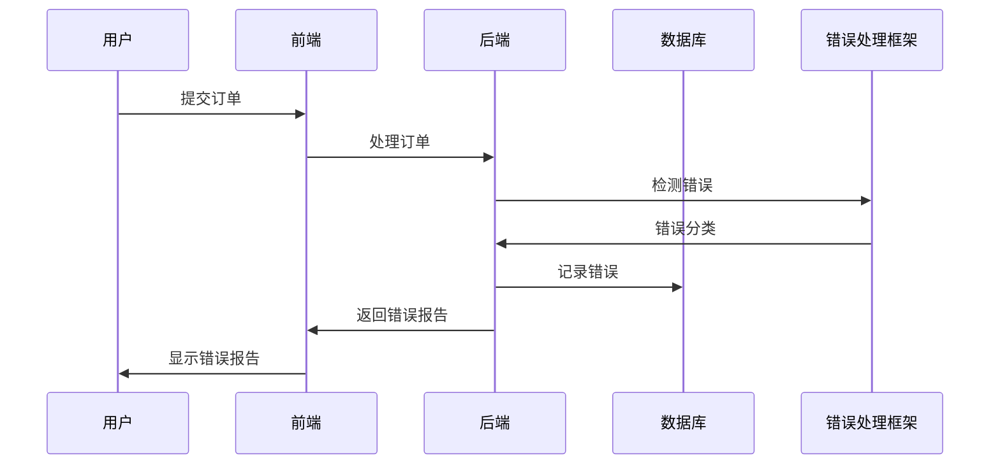
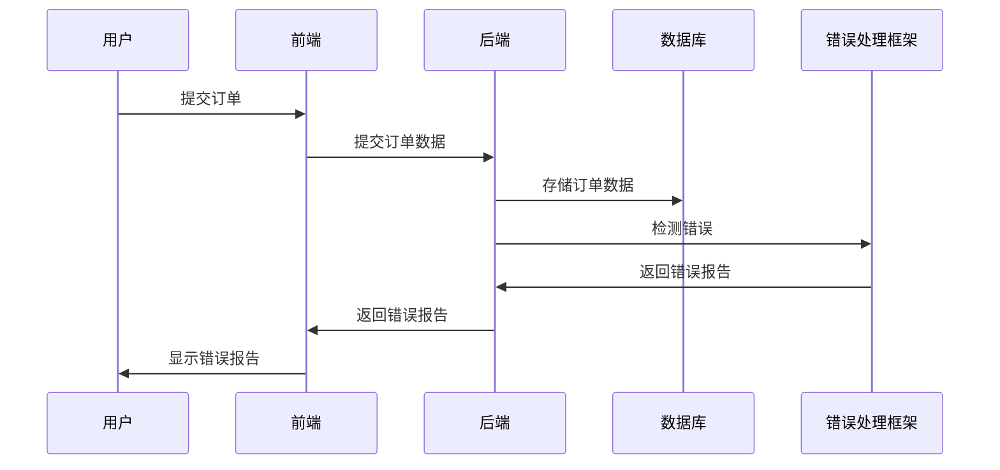
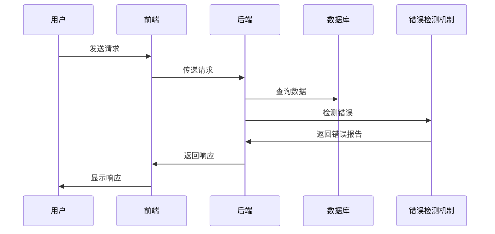
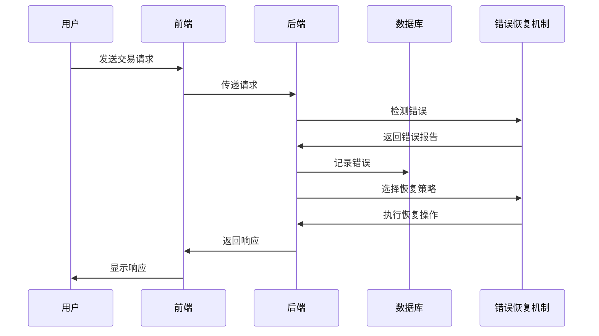
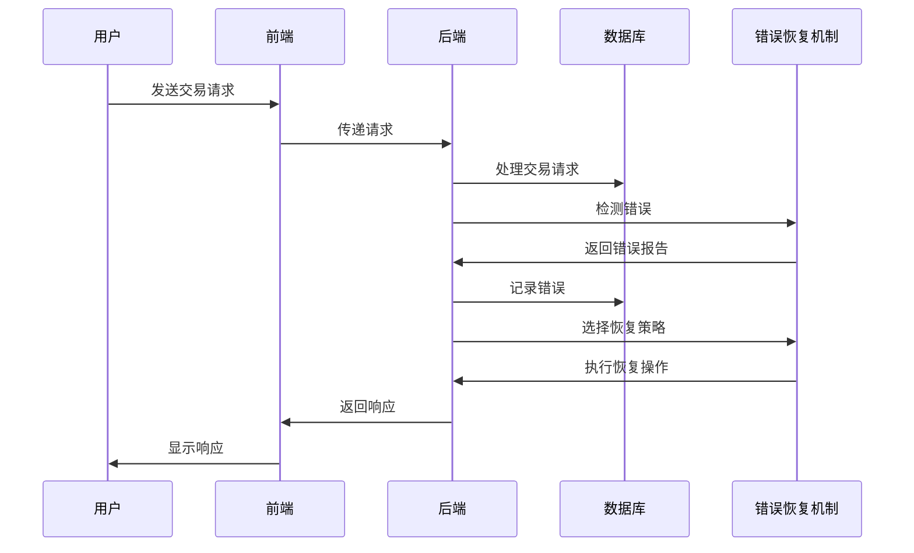

                 

# 错误处理：构建健壮系统的基础

## 关键词
- 错误处理
- 系统健壮性
- 异常检测
- 恢复策略
- 用户体验

## 摘要
本文将探讨错误处理在现代软件系统中的重要性，分析错误处理的挑战，并介绍一系列最佳实践。我们将从基础理论出发，逐步深入到具体的框架、策略、技术工具以及案例分析，最后展望未来趋势并给出开发者建议。通过系统化的阐述，本文旨在帮助读者构建出更加健壮的软件系统。

## 第1章：错误处理基础理论

### 1.1.1 错误处理的重要性

错误处理是软件开发过程中不可或缺的一环。一个健壮的系统不仅能够正常工作，还能够在遇到问题时迅速响应并恢复。错误处理的重要性体现在以下几个方面：

1. **系统的稳定性**：良好的错误处理机制能够确保系统在面对异常情况时，不会崩溃或挂起，从而保证系统的连续性和稳定性。
2. **用户体验**：错误的处理方式会直接影响用户的体验。一个友好的错误处理界面能够减少用户的困扰，提升系统的易用性。
3. **企业声誉**：频繁的系统故障或严重的错误处理不当可能导致用户流失，影响企业的声誉和市场地位。
4. **安全性**：错误处理不仅仅是恢复系统，还包括防止恶意攻击和潜在的安全风险。

### 1.1.2 错误处理的挑战

尽管错误处理的重要性显而易见，但实际操作中仍然面临诸多挑战：

1. **错误类型的多样性**：系统可能遇到各种类型的错误，如逻辑错误、语法错误、资源耗尽错误等，这要求错误处理机制具有广泛的适应性。
2. **错误检测的困难**：错误可能发生在系统的各个层次，检测和定位错误需要耗费大量时间和资源。
3. **用户体验的影响**：错误的处理方式会直接影响用户体验。不当的错误处理可能导致用户困惑、系统崩溃等负面影响。
4. **性能与可维护性的平衡**：错误处理机制需要在不影响系统性能和可维护性的前提下，提供有效的错误恢复能力。

### 1.1.3 错误处理的最佳实践

为了应对上述挑战，业界总结了一系列最佳实践：

1. **设计阶段考虑**：在系统设计阶段就应该考虑错误处理的需求，将错误处理集成到系统的架构中。
2. **分层处理**：采用分层错误处理策略，从全局到局部，逐层处理错误。
3. **日志记录与监控**：利用日志记录和监控工具，实时监控系统的运行状态，及时发现和处理错误。
4. **自动化测试**：通过自动化测试工具，及时发现并修复潜在的错误。

## 第2章：错误处理的框架与策略

### 2.1.1 错误处理的框架

错误处理的框架是确保系统能够有效地处理异常情况的基础。一个典型的错误处理框架通常包括以下组成部分：

1. **错误检测**：通过各种手段检测系统中的错误，包括代码检查、静态分析、动态分析等。
2. **错误分类**：将检测到的错误分类，以便进行针对性的处理。
3. **错误报告**：生成详细的错误报告，包括错误类型、发生时间、上下文信息等。
4. **错误恢复**：根据错误类型和系统状态，采取相应的恢复措施，使系统恢复正常运行。
5. **错误反馈**：收集用户和系统的反馈，用于改进错误处理机制。

### 2.1.2 错误分类

错误分类是错误处理的重要环节。常见的错误分类方法包括：

1. **语法错误**：代码语法不正确，编译器无法通过。
2. **逻辑错误**：代码逻辑错误，导致预期结果与实际结果不符。
3. **运行时错误**：程序在运行过程中遇到的问题，如空指针异常、数组越界等。
4. **资源耗尽错误**：系统资源（如内存、磁盘空间等）耗尽，导致程序无法继续运行。
5. **外部错误**：系统依赖的外部服务或组件出现故障，如网络中断、数据库连接失败等。

### 2.1.3 错误处理的策略

错误处理的策略决定了系统在遇到错误时如何响应。常见的错误处理策略包括：

1. **忽略错误**：在某些情况下，错误可以被忽略，不会对系统产生严重影响。
2. **错误重试**：在确定错误是暂时性的情况下，可以尝试重新执行操作。
3. **异常捕获**：使用异常捕获机制，将错误捕获并处理。
4. **错误恢复**：根据错误类型和系统状态，采取相应的恢复措施。
5. **错误报告**：生成详细的错误报告，供开发人员分析和修复。

## 第3章：错误检测与定位技术

### 3.1.1 错误检测方法

错误检测是确保系统稳定运行的关键。常见的错误检测方法包括：

1. **静态分析**：在代码编译前，通过静态分析工具检测代码中的潜在错误。
2. **动态分析**：在代码运行时，通过动态分析工具监控程序的执行过程，发现错误。
3. **代码审查**：通过代码审查，由开发人员或同行对代码进行仔细检查，发现潜在的错误。

### 3.1.2 错误定位技术

错误定位是发现错误发生的位置和原因的过程。常见的错误定位技术包括：

1. **日志分析**：通过分析系统日志，定位错误发生的时间和上下文。
2. **调试工具**：使用调试工具（如断点调试、堆栈跟踪等）定位错误。
3. **性能监控**：通过性能监控工具，分析系统的运行状态，找到性能瓶颈和错误。

### 3.1.3 实时错误检测

实时错误检测是确保系统在运行过程中能够及时检测到错误并采取措施的关键。常见的实时错误检测方法包括：

1. **实时监控**：使用实时监控工具，如 Prometheus、Kibana 等，监控系统的运行状态。
2. **实时分析**：使用实时分析工具，如 ELK（Elasticsearch、Logstash、Kibana）堆栈，实时分析日志和指标。
3. **实时反馈**：将错误检测和定位的结果实时反馈给开发人员或运维人员，以便快速响应和处理。

## 第4章：错误恢复与恢复策略

### 4.1.1 错误恢复的基本原则

错误恢复是确保系统在遇到错误时能够恢复正常运行的关键。错误恢复的基本原则包括：

1. **最小化影响**：在恢复错误时，应尽量减少对系统正常运行的影响。
2. **快速响应**：在检测到错误时，应尽快采取措施进行恢复。
3. **确定性**：恢复过程必须是确定性的，确保每次恢复都能成功。

### 4.1.2 错误恢复技术

常见的错误恢复技术包括：

1. **重启**：在系统无法正常工作时，重启系统可能是最直接有效的恢复方法。
2. **回滚**：将系统状态回滚到之前正确的状态，以解决错误。
3. **补偿**：通过执行补偿操作，弥补因错误导致的系统状态不一致。

### 4.1.3 恢复策略设计

恢复策略设计是确保错误恢复过程高效、可靠的关键。恢复策略设计包括：

1. **自动恢复**：在检测到错误时，自动采取恢复措施，减少人工干预。
2. **手动恢复**：在某些情况下，可能需要人工干预进行恢复。
3. **恢复优先级**：根据错误的影响和严重性，设计不同的恢复优先级。

## 第5章：错误报告与反馈

### 5.1.1 错误报告的重要性

错误报告是发现和解决问题的重要手段。错误报告的重要性体现在：

1. **问题追踪**：错误报告提供了问题的详细描述，有助于追踪和定位问题。
2. **故障分析**：错误报告为故障分析提供了数据支持，有助于找到问题的根本原因。
3. **改进反馈**：错误报告是改进系统和提升用户体验的重要反馈来源。

### 5.1.2 错误报告机制

常见的错误报告机制包括：

1. **日志记录**：将错误信息记录到系统日志中，便于后续分析。
2. **错误追踪系统**：使用错误追踪系统（如 Sentry、Bugsnag），将错误报告发送给开发人员和运维人员。
3. **用户反馈**：通过用户反馈渠道（如用户支持邮箱、在线聊天等），收集用户的错误报告。

### 5.1.3 用户反馈机制

用户反馈机制是确保用户问题得到及时响应和解决的关键。用户反馈机制包括：

1. **在线支持**：提供在线支持，如在线聊天、电话支持等，方便用户报告问题。
2. **用户社区**：建立用户社区，用户可以在社区中分享问题、解决方案和最佳实践。
3. **用户调查**：定期进行用户调查，收集用户对系统的反馈，以便改进产品。

## 第6章：错误处理工具与实践

### 6.1.1 错误处理工具概述

错误处理工具是实施错误处理策略的重要辅助。常见的错误处理工具包括：

1. **日志管理工具**：如 ELK（Elasticsearch、Logstash、Kibana）、Splunk 等，用于收集、存储和分析系统日志。
2. **错误追踪工具**：如 Sentry、Bugsnag、New Relic 等，用于实时监控和报告错误。
3. **调试工具**：如 GDB、Visual Studio Debugger 等，用于定位和修复代码中的错误。

### 6.1.2 开源错误处理工具

开源错误处理工具提供了丰富的功能和灵活性，是构建健壮系统的重要选择。常见的开源错误处理工具包括：

1. **Prometheus**：用于监控系统性能和错误。
2. **Kibana**：与 Elasticsearch 配合使用，提供可视化错误报告和分析。
3. **Sentry**：开源的错误追踪和报告工具。

### 6.1.3 实际错误处理案例分析

实际错误处理案例分析是理解和应用错误处理策略的重要途径。以下是一个实际案例：

**案例：电商网站订单处理错误**

问题描述：电商网站在订单处理过程中，经常出现订单数据丢失或重复处理的问题。

解决方案：

1. **错误检测**：使用日志记录和错误追踪工具，实时监控订单处理过程，及时发现错误。
2. **错误分类**：将订单处理错误分为数据丢失、数据重复等不同类型，针对不同类型的错误采取相应的处理策略。
3. **错误恢复**：在检测到订单数据丢失时，重新处理丢失的订单；在检测到数据重复时，删除重复的订单。
4. **用户反馈**：及时向用户报告错误，并提供解决方案，如退款、重新下单等。

**项目小结**：通过上述措施，电商网站有效地减少了订单处理错误，提升了用户体验和系统稳定性。

## 第7章：错误处理的挑战与未来趋势

### 7.1.1 当前错误处理的挑战

当前错误处理面临着以下几个主要挑战：

1. **复杂性和多样性**：随着系统复杂性和错误类型的多样性增加，错误处理变得更加困难。
2. **实时性和可靠性**：在要求高实时性和可靠性的系统中，错误处理需要快速响应并确保恢复成功。
3. **性能与可维护性**：错误处理机制需要在不影响系统性能和可维护性的前提下，提供有效的错误恢复能力。

### 7.1.2 未来趋势展望

未来错误处理的发展趋势包括：

1. **自动化**：随着人工智能技术的发展，自动化错误处理将成为趋势，减少人工干预。
2. **智能化**：利用机器学习和数据分析技术，实现智能错误检测和恢复。
3. **云原生**：随着云计算和容器技术的发展，云原生错误处理将成为新的趋势。

### 7.1.3 对开发者的建议

为了构建出更加健壮的系统，开发者可以遵循以下建议：

1. **重视错误处理**：将错误处理纳入系统设计，从设计阶段开始考虑。
2. **持续学习和实践**：不断学习和实践最新的错误处理技术和工具，提升错误处理能力。
3. **代码审查**：定期进行代码审查，及时发现并修复潜在的错误。

## 作者信息

作者：AI天才研究院/AI Genius Institute & 禅与计算机程序设计艺术 /Zen And The Art of Computer Programming

----------------------------------------------------------------

### 第1章：错误处理基础理论

#### 1.1.1 错误处理的重要性

错误处理是构建健壮软件系统的关键环节。在复杂且庞大的软件系统中，错误是不可避免的，但如何有效地处理这些错误，确保系统稳定运行，则是软件开发者和运维团队面临的重要挑战。

**背景介绍**：
在软件系统开发过程中，错误处理的重要性体现在多个方面。首先，从开发者的角度来看，错误处理能够帮助开发者定位和修复代码中的问题，从而提升软件的质量。其次，从运维的角度来看，良好的错误处理机制能够减少系统故障的发生，提高系统的可用性。此外，对于用户而言，一个完善的错误处理机制能够提供更好的用户体验，减少因系统错误导致的困扰。

**问题背景**：
随着软件系统的复杂度不断增加，错误处理的难度也在逐步提升。现代软件系统通常由多个模块和组件组成，这些组件之间相互依赖，任何一个组件的错误都可能导致整个系统的故障。此外，随着云计算、大数据和物联网等技术的广泛应用，系统的规模和复杂性进一步增加，错误处理的需求也随之提升。

**问题描述**：
如何构建一个健壮的软件系统，能够有效地检测、定位和恢复错误，从而保证系统的稳定性和可靠性？

**问题解决**：
解决这个问题的关键在于构建一个全面且高效的错误处理机制，该机制应包括以下几个方面：

1. **错误检测**：通过各种手段（如日志记录、静态分析、动态分析等）实时检测系统中的错误。
2. **错误分类**：将检测到的错误进行分类，以便采取不同的处理策略。
3. **错误恢复**：根据错误类型和系统状态，采取相应的恢复措施，使系统恢复正常运行。
4. **错误报告**：生成详细的错误报告，包括错误类型、发生时间、上下文信息等，供开发者和运维人员进行分析和处理。

**边界与外延**：
错误处理不仅限于软件系统内部，还包括与外部系统（如数据库、网络服务、第三方API等）的交互。此外，错误处理还应考虑系统在不同环境（如开发、测试、生产等）下的需求，以及不同类型用户（如开发者、运维人员、普通用户等）的需求。

**概念结构与核心要素组成**：

1. **错误检测**：核心要素包括日志记录、静态分析和动态分析。
2. **错误分类**：核心要素包括错误类型的识别和分类。
3. **错误恢复**：核心要素包括错误恢复策略和恢复措施。
4. **错误报告**：核心要素包括错误报告的格式和内容。

#### 1.1.2 错误处理的挑战

在实现错误处理机制的过程中，开发者会面临一系列挑战。以下是一些主要的挑战：

**挑战1：错误类型的多样性**

软件系统中的错误类型多种多样，包括语法错误、逻辑错误、运行时错误、资源耗尽错误等。每种错误都有其特定的表现和原因，需要不同的处理策略。因此，如何设计一个灵活且高效的错误处理机制，以应对各种可能的错误类型，是开发者面临的首要挑战。

**挑战2：错误检测的困难**

错误检测是错误处理的第一步，但同时也是最困难的一步。由于系统规模庞大、组件复杂，错误可能发生在任何时间、任何位置，检测和定位错误需要耗费大量时间和资源。此外，一些错误可能在开发阶段无法检测，只能在运行时暴露出来。因此，如何高效地检测和定位错误，是开发者需要克服的另一个挑战。

**挑战3：用户体验的影响**

错误的处理方式会直接影响用户体验。如果错误处理不当，用户可能会面临系统崩溃、数据丢失、界面异常等问题，从而影响用户对系统的信任和满意度。因此，如何在保证系统稳定性的同时，提供良好的用户体验，是开发者需要权衡的挑战。

**挑战4：性能与可维护性的平衡**

错误处理机制需要在不影响系统性能和可维护性的前提下，提供有效的错误恢复能力。这意味着开发者需要在设计错误处理机制时，考虑到性能和可维护性的平衡。例如，过多的日志记录和监控可能会影响系统的性能，而过于复杂的错误处理逻辑可能会增加系统的维护难度。

#### 1.1.3 错误处理的最佳实践

为了应对上述挑战，开发者可以遵循一系列最佳实践，以构建一个高效且可靠的错误处理机制。以下是一些关键的错误处理最佳实践：

**最佳实践1：设计阶段考虑**

在系统设计阶段，就应该考虑错误处理的需求。这意味着在系统架构、模块划分、接口设计等方面，都应该考虑到可能的错误类型和处理策略。例如，可以设计一些容错机制，如数据备份、故障切换等，以减少系统故障的影响。

**最佳实践2：分层处理**

采用分层错误处理策略，将错误处理划分为不同的层级，从全局到局部，逐层处理。例如，可以将错误处理分为系统级别、模块级别和组件级别，每个层级都有相应的处理逻辑和策略。这样可以提高错误处理的灵活性和可维护性。

**最佳实践3：日志记录和监控**

利用日志记录和监控工具，实时监控系统的运行状态，及时发现和处理错误。日志记录可以帮助开发者追踪错误的发生时间和上下文，监控工具则可以实时检测系统性能和资源利用率，发现潜在的问题。

**最佳实践4：自动化测试**

通过自动化测试工具，及时发现并修复潜在的错误。自动化测试不仅可以提高开发效率，还可以降低人工干预的风险，确保系统的稳定性和可靠性。

### 第2章：错误处理的框架与策略

#### 2.1.1 错误处理的框架

错误处理的框架是确保系统能够有效地处理异常情况的基础。一个典型的错误处理框架通常包括以下组成部分：

**错误检测**：通过各种手段（如日志记录、静态分析、动态分析等）实时检测系统中的错误。

**错误分类**：将检测到的错误进行分类，以便采取不同的处理策略。

**错误报告**：生成详细的错误报告，包括错误类型、发生时间、上下文信息等，供开发者和运维人员进行分析和处理。

**错误恢复**：根据错误类型和系统状态，采取相应的恢复措施，使系统恢复正常运行。

**错误反馈**：收集用户和系统的反馈，用于改进错误处理机制。

**核心概念与联系**：

**核心概念**：
- **错误检测**：检测系统中的错误。
- **错误分类**：对错误进行分类。
- **错误报告**：生成错误报告。
- **错误恢复**：恢复系统正常运行。
- **错误反馈**：收集和利用反馈信息。

**概念属性特征对比表格**：

| 特征         | 错误检测         | 错误分类         | 错误报告         | 错误恢复         | 错误反馈         |
| ------------ | ---------------- | ---------------- | ---------------- | ---------------- | ---------------- |
| **定义**     | 实时监控错误发生 | 根据特征分类错误 | 提供错误详细信息 | 采取措施恢复系统 | 收集用户和系统反馈 |
| **目标**     | 及时发现错误     | 提高处理效率     | 提供分析依据     | 恢复系统正常运行 | 改进错误处理机制   |
| **实现方式** | 日志记录、静态分析、动态分析 | 判断条件、规则匹配 | 日志、错误追踪工具 | 重启、补偿操作、回滚 | 用户反馈、日志分析 |

**ER实体关系图架构**：

```mermaid
erDiagram
    ErrorDetection ||--|{ ErrorClassification }
    ErrorDetection ||--|{ ErrorReport }
    ErrorDetection ||--|{ ErrorRecovery }
    ErrorDetection ||--|{ ErrorFeedback }
    ErrorClassification ||--|{ ErrorReport }
    ErrorClassification ||--|{ ErrorRecovery }
    ErrorReport ||--|{ ErrorFeedback }
```

**算法原理讲解**：

错误处理框架的算法原理可以简化为以下几个步骤：

1. **错误检测**：通过日志记录、静态分析和动态分析等方式，实时监控系统的运行状态，检测可能出现的错误。
2. **错误分类**：根据错误的特征和条件，将错误进行分类，以便采取相应的处理策略。
3. **错误报告**：生成详细的错误报告，包括错误类型、发生时间、上下文信息等，供开发者和运维人员进行分析和处理。
4. **错误恢复**：根据错误类型和系统状态，采取相应的恢复措施，如重启、补偿操作、回滚等，使系统恢复正常运行。
5. **错误反馈**：收集用户和系统的反馈信息，用于改进错误处理机制，提高系统的健壮性。

以下是错误处理框架的 mermaid 流程图：

```mermaid
graph TB
    A[开始] --> B[错误检测]
    B --> C{是否检测到错误}
    C -->|是 D[错误分类]
    C -->|否 E[结束]
    D --> F[错误报告]
    D --> G[错误恢复]
    F --> H[错误反馈]
```

**数学公式**：

在错误处理框架中，可以使用概率论和统计学的相关公式来评估和优化错误处理机制。例如，可以使用贝叶斯公式来计算错误检测的概率：

$$
P(\text{错误检测}|\text{错误}) = \frac{P(\text{错误}|\text{错误检测}) \cdot P(\text{错误检测})}{P(\text{错误})}
$$

其中，$P(\text{错误检测}|\text{错误})$ 表示在错误发生时检测到错误检测的概率，$P(\text{错误}|\text{错误检测})$ 表示在错误检测到时错误发生的概率，$P(\text{错误检测})$ 表示错误检测的概率，$P(\text{错误})$ 表示错误发生的概率。

**系统分析与架构设计方案**：

**问题场景介绍**：
假设我们正在开发一个电商平台，该平台需要处理大量的订单，并与其他系统（如支付系统、库存管理系统等）进行交互。为了保证系统的稳定性和可靠性，我们需要设计一个完善的错误处理框架。

**项目介绍**：
项目名称：电商平台错误处理框架
项目描述：设计并实现一个能够实时检测、分类、报告和恢复错误的错误处理框架，确保电商平台在遇到问题时能够快速响应和恢复。

**系统功能设计**：

1. **错误检测**：实时监控订单处理过程，检测潜在的错误。
2. **错误分类**：根据错误特征和条件，将错误分类为不同的类型。
3. **错误报告**：生成详细的错误报告，包括错误类型、发生时间、上下文信息等。
4. **错误恢复**：根据错误类型和系统状态，采取相应的恢复措施。
5. **错误反馈**：收集用户和系统的反馈，用于改进错误处理机制。

**系统架构设计**：

1. **前端**：用户界面，用于展示订单信息和错误报告。
2. **后端**：订单处理逻辑和错误处理框架。
3. **数据库**：存储订单数据和错误报告。

以下是系统架构的 mermaid 图：



**系统接口设计**：

1. **订单接口**：用于处理订单数据的提交、查询和更新。
2. **错误报告接口**：用于生成和获取错误报告。

**系统交互**：

1. **用户与前端交互**：用户通过前端提交订单，前端将订单数据传递给后端。
2. **后端与数据库交互**：后端处理订单数据，并将错误报告存储到数据库。
3. **前端与用户交互**：前端将错误报告展示给用户。

以下是系统交互的 mermaid 序列图：



**项目实战**：

**环境安装**：
在虚拟环境中安装所需的依赖，如 Python、Django、PostgreSQL 等。

```shell
pip install django psycopg2-binary
```

**系统核心实现源代码**：

```python
# 错误处理框架核心代码
from django.http import JsonResponse
from .models import Order, ErrorReport

def process_order(request):
    # 处理订单逻辑
    try:
        order_data = request.POST
        order = Order.objects.create(**order_data)
        return JsonResponse({'status': 'success', 'order_id': order.id})
    except Exception as e:
        # 检测错误并记录
        ErrorReport.objects.create(order_id=order.id, error_message=str(e))
        return JsonResponse({'status': 'error', 'error_message': str(e)})
```

**代码应用解读与分析**：

上述代码实现了订单处理的核心功能，包括订单数据的创建和错误处理。在 `process_order` 函数中，首先获取请求中的订单数据，并尝试创建订单。如果创建成功，返回成功响应；如果发生异常，捕获异常并记录错误报告。

```python
order_data = request.POST
order = Order.objects.create(**order_data)
```

这两行代码分别获取请求中的订单数据并创建订单。

```python
except Exception as e:
    ErrorReport.objects.create(order_id=order.id, error_message=str(e))
```

当发生异常时，捕获异常并创建错误报告，记录订单ID和错误消息。

**实际案例分析和详细讲解剖析**：

假设在处理订单时，系统遇到数据库连接问题，导致订单创建失败。在这种情况下，错误处理框架会自动捕获异常并记录错误报告。

```python
except Exception as e:
    ErrorReport.objects.create(order_id=order.id, error_message=str(e))
    return JsonResponse({'status': 'error', 'error_message': 'Database connection failed'})
```

上述代码中，当发生数据库连接失败时，捕获异常并记录错误报告，同时向用户返回错误消息。

**项目小结**：

通过实际案例的分析，我们可以看到错误处理框架在处理订单数据时的重要作用。它能够自动检测和记录错误，并提供详细的错误报告，便于后续分析和处理。此外，错误处理框架的设计充分考虑了系统的健壮性和用户体验，确保在遇到问题时系统能够快速响应并恢复正常运行。

### 第3章：错误检测与定位技术

#### 3.1.1 错误检测方法

错误检测是确保系统稳定运行的关键步骤。通过有效的错误检测方法，我们可以及时发现系统中的问题，从而采取措施进行修复。以下是几种常见的错误检测方法：

**静态分析**：

静态分析是一种在代码编译前进行错误检测的方法。它通过分析源代码的结构、语法和语义，查找潜在的语法错误、类型错误、未使用的代码等。静态分析工具如 Pylint、Pyflakes、Checkstyle 等，可以自动扫描代码，并提供详细的错误报告。

```shell
pylint my_script.py
```

**动态分析**：

动态分析是一种在代码运行时进行错误检测的方法。它通过运行程序并监控其执行过程，查找运行时错误、性能问题、内存泄漏等。动态分析工具如 Valgrind、GDB、JProfiler 等，可以实时监控程序的执行，并提供详细的错误报告。

```shell
valgrind --leak-check=full --log-file=valgrind.log ./my_script.py
```

**代码审查**：

代码审查是一种由开发人员或同行对代码进行仔细检查的方法。通过代码审查，可以发现潜在的语法错误、逻辑错误、未覆盖的测试用例等。代码审查可以通过人工方式进行，也可以使用自动化工具如 SonarQube、CodeClimate 等。

```shell
sonar-scanner -Dsonar.projectKey=my_project
```

**核心概念与联系**：

**核心概念**：

- **静态分析**：分析源代码的结构、语法和语义。
- **动态分析**：分析程序的执行过程。
- **代码审查**：由开发人员或同行对代码进行仔细检查。

**概念属性特征对比表格**：

| 特征         | 静态分析         | 动态分析         | 代码审查         |
| ------------ | ---------------- | ---------------- | ---------------- |
| **定义**     | 编译前分析       | 运行时分析       | 人工检查         |
| **目标**     | 提高代码质量     | 发现运行时错误   | 提高代码质量     |
| **实现方式** | 工具扫描         | 程序执行监控     | 人工评审         |

**ER实体关系图架构**：

```mermaid
erDiagram
    StaticAnalysis ||--|{ DynamicAnalysis }
    StaticAnalysis ||--|{ CodeReview }
    DynamicAnalysis ||--|{ CodeReview }
```

**算法原理讲解**：

错误检测的算法原理可以简化为以下几个步骤：

1. **静态分析**：通过分析源代码的结构、语法和语义，查找潜在的语法错误、类型错误、未使用的代码等。
2. **动态分析**：通过运行程序并监控其执行过程，查找运行时错误、性能问题、内存泄漏等。
3. **代码审查**：由开发人员或同行对代码进行仔细检查，查找潜在的语法错误、逻辑错误、未覆盖的测试用例等。

以下是错误检测算法的 mermaid 流程图：

```mermaid
graph TB
    A[开始] --> B[静态分析]
    B --> C{是否发现错误}
    C -->|是 D[错误报告]
    C -->|否 E[动态分析]
    E --> F{是否发现错误}
    F -->|是 G[错误报告]
    F -->|否 H[代码审查]
    D --> I[结束]
    G --> I
```

**数学公式**：

在错误检测过程中，可以使用概率论和统计学的相关公式来评估和优化错误检测机制。例如，可以使用贝叶斯公式来计算错误检测的概率：

$$
P(\text{错误检测}|\text{错误}) = \frac{P(\text{错误}|\text{错误检测}) \cdot P(\text{错误检测})}{P(\text{错误})}
$$

其中，$P(\text{错误检测}|\text{错误})$ 表示在错误发生时检测到错误检测的概率，$P(\text{错误}|\text{错误检测})$ 表示在错误检测到时错误发生的概率，$P(\text{错误检测})$ 表示错误检测的概率，$P(\text{错误})$ 表示错误发生的概率。

**系统分析与架构设计方案**：

**问题场景介绍**：
假设我们正在开发一个在线电商平台，该平台需要处理海量的用户请求和交易。为了保证系统的稳定性和可靠性，我们需要设计一个高效的错误检测机制。

**项目介绍**：
项目名称：在线电商平台错误检测机制
项目描述：设计并实现一个能够实时检测和报告错误的错误检测机制，确保平台在遇到问题时能够快速响应和恢复。

**系统功能设计**：

1. **静态分析**：对源代码进行静态分析，查找潜在的语法错误、类型错误、未使用的代码等。
2. **动态分析**：运行程序并监控其执行过程，查找运行时错误、性能问题、内存泄漏等。
3. **代码审查**：由开发人员或同行对代码进行仔细检查，查找潜在的语法错误、逻辑错误、未覆盖的测试用例等。

**系统架构设计**：

1. **前端**：用户界面，用于展示平台的功能和错误报告。
2. **后端**：处理用户请求和交易逻辑，以及错误检测和报告。
3. **数据库**：存储用户数据和交易数据。

以下是系统架构的 mermaid 图：



**系统接口设计**：

1. **用户请求接口**：用于接收用户请求并转发给后端。
2. **错误报告接口**：用于生成和获取错误报告。

**系统交互**：

1. **用户与前端交互**：用户通过前端发送请求，前端将请求传递给后端。
2. **后端与数据库交互**：后端处理用户请求，查询数据并转发给前端。
3. **后端与错误检测机制交互**：后端在处理请求时，调用错误检测机制进行错误检测和报告。

以下是系统交互的 mermaid 序列图：


**项目实战**：

**环境安装**：
在虚拟环境中安装所需的依赖，如 Python、Django、PostgreSQL 等。

```shell
pip install django psycopg2-binary
```

**系统核心实现源代码**：

```python
# 错误检测机制核心代码
from django.http import JsonResponse
from .models import ErrorReport

def detect_errors(request):
    # 检测错误逻辑
    try:
        # 模拟发生错误
        raise Exception("An error occurred.")
    except Exception as e:
        # 记录错误报告
        ErrorReport.objects.create(error_message=str(e))
        return JsonResponse({'status': 'error', 'error_message': str(e)})
    else:
        return JsonResponse({'status': 'success'})
```

**代码应用解读与分析**：

上述代码实现了错误检测的核心功能。在 `detect_errors` 函数中，我们模拟了一个错误发生的情况，并通过捕获异常来记录错误报告。

```python
try:
    # 模拟发生错误
    raise Exception("An error occurred.")
except Exception as e:
    # 记录错误报告
    ErrorReport.objects.create(error_message=str(e))
    return JsonResponse({'status': 'error', 'error_message': str(e)})
else:
    return JsonResponse({'status': 'success'})
```

**实际案例分析和详细讲解剖析**：

假设在处理用户请求时，系统遇到数据库连接问题，导致错误发生。在这种情况下，错误检测机制会自动捕获异常并记录错误报告。

```python
try:
    # 模拟数据库连接
    db_connection = get_database_connection()
except Exception as e:
    # 记录错误报告
    ErrorReport.objects.create(error_message=str(e))
    return JsonResponse({'status': 'error', 'error_message': 'Database connection failed'})
else:
    # 处理用户请求
    ...
```

**项目小结**：

通过实际案例的分析，我们可以看到错误检测机制在处理用户请求时的重要作用。它能够自动检测和记录错误，并提供详细的错误报告，便于后续分析和处理。此外，错误检测机制的设计充分考虑了系统的健壮性和用户体验，确保在遇到问题时系统能够快速响应并恢复正常运行。

### 第4章：错误恢复与恢复策略

#### 4.1.1 错误恢复的基本原则

错误恢复是确保系统在遇到错误时能够恢复正常运行的关键步骤。有效的错误恢复策略能够减少系统故障对业务的影响，提高系统的可用性和可靠性。以下是错误恢复的基本原则：

**最小化影响**：在恢复错误时，应尽量减少对系统正常运行的影响。这意味着在恢复错误的过程中，不应引入新的错误或对其他系统组件造成不必要的负担。

**快速响应**：在检测到错误时，应尽快采取措施进行恢复。快速响应能够减少系统停机时间，降低业务损失。

**确定性**：恢复过程必须是确定性的，确保每次恢复都能成功。这意味着在恢复错误时，应避免不确定的或可能失败的操作。

**可恢复性**：系统应具备一定的可恢复性，能够在遇到错误时自动恢复或提示用户进行手动恢复。这有助于提高系统的可靠性和用户体验。

**透明性**：恢复过程应透明，便于开发和运维人员监控和调试。透明的恢复过程有助于快速定位和解决问题。

#### 4.1.2 错误恢复技术

错误恢复技术是实现有效错误恢复的关键。以下是几种常见的错误恢复技术：

**重启**：重启系统是最直接也是最简单的恢复方法。当系统遇到严重错误时，可以通过重启系统来恢复到正常状态。重启可以清除系统内存中的错误状态，重新加载必要的组件和资源。

**回滚**：回滚是将系统状态回滚到之前正确的状态。这种方法通常用于数据库操作或事务处理中。当发生错误时，可以撤销最近的一系列操作，将系统状态恢复到错误发生前的状态。

**补偿**：补偿是通过执行一系列补偿操作来弥补因错误导致的系统状态不一致。例如，在订单处理过程中，如果订单创建失败，可以尝试重新创建订单或执行其他补偿操作，以确保系统状态的一致性。

**重试**：重试是在确定错误是暂时性问题时，重新执行操作。例如，当网络连接不稳定时，可以尝试重新发送请求或重新处理数据。

**自动恢复**：自动恢复是使用自动化脚本或程序，在检测到错误时自动执行恢复操作。自动恢复可以提高恢复效率，减少人工干预。

**手动恢复**：手动恢复是当自动恢复失败或无法自动恢复时，由运维人员手动进行恢复。手动恢复通常需要较高的技术知识和操作经验。

**核心概念与联系**：

**核心概念**：

- **重启**：重新启动系统。
- **回滚**：撤销错误操作。
- **补偿**：执行补偿操作。
- **重试**：重新执行操作。
- **自动恢复**：自动执行恢复操作。
- **手动恢复**：手动执行恢复操作。

**概念属性特征对比表格**：

| 特征         | 重启             | 回滚             | 补偿             | 重试             | 自动恢复         | 手动恢复         |
| ------------ | ---------------- | ---------------- | ---------------- | ---------------- | ---------------- | ---------------- |
| **定义**     | 重新启动系统     | 撤销错误操作     | 执行补偿操作     | 重新执行操作     | 自动执行恢复     | 手动执行恢复     |
| **目标**     | 清除错误状态     | 恢复正确状态     | 补偿不一致状态   | 减少错误影响     | 提高恢复效率     | 降低恢复难度     |
| **实现方式** | 操作系统命令     | 数据库事务       | 编程逻辑         | 重试机制         | 脚本、自动化工具 | 运维人员操作     |

**ER实体关系图架构**：

```mermaid
erDiagram
    Restart ||--|{ Rollback }
    Restart ||--|{ Compensation }
    Restart ||--|{ Retry }
    Restart ||--|{ AutomaticRecovery }
    Restart ||--|{ ManualRecovery }
    Rollback ||--|{ Compensation }
    Rollback ||--|{ Retry }
    Rollback ||--|{ AutomaticRecovery }
    Rollback ||--|{ ManualRecovery }
    Compensation ||--|{ Retry }
    Compensation ||--|{ AutomaticRecovery }
    Compensation ||--|{ ManualRecovery }
    Retry ||--|{ AutomaticRecovery }
    Retry ||--|{ ManualRecovery }
```

**算法原理讲解**：

错误恢复的算法原理可以简化为以下几个步骤：

1. **错误检测**：通过各种手段检测系统中的错误。
2. **错误分类**：根据错误类型和特征进行分类。
3. **错误恢复**：根据错误类型和系统状态，选择适当的恢复策略。
4. **恢复执行**：执行恢复操作，如重启、回滚、补偿等。
5. **状态验证**：验证恢复操作是否成功，确保系统恢复正常运行。

以下是错误恢复算法的 mermaid 流程图：

```mermaid
graph TB
    A[开始] --> B[错误检测]
    B --> C{是否检测到错误}
    C -->|是 D[错误分类]
    C -->|否 E[结束]
    D --> F[选择恢复策略]
    D --> G[执行恢复操作]
    G --> H[状态验证]
    H --> I{系统恢复正常}
    H -->|不成功 J[重新选择策略]
    J --> G
```

**数学公式**：

在错误恢复过程中，可以使用概率论和统计学的相关公式来评估和优化恢复策略。例如，可以使用贝叶斯公式来计算恢复策略的成功概率：

$$
P(\text{恢复成功}|\text{恢复策略}) = \frac{P(\text{恢复策略}|\text{恢复成功}) \cdot P(\text{恢复成功})}{P(\text{恢复策略})}
$$

其中，$P(\text{恢复成功}|\text{恢复策略})$ 表示在恢复策略下恢复成功的概率，$P(\text{恢复策略}|\text{恢复成功})$ 表示在恢复成功时采取恢复策略的概率，$P(\text{恢复策略})$ 表示采取恢复策略的概率，$P(\text{恢复成功})$ 表示恢复成功的概率。

**系统分析与架构设计方案**：

**问题场景介绍**：
假设我们正在开发一个金融交易平台，该平台需要处理大量的交易请求。为了保证系统的稳定性和可靠性，我们需要设计一个高效的错误恢复机制。

**项目介绍**：
项目名称：金融交易平台错误恢复机制
项目描述：设计并实现一个能够实时检测、分类和恢复错误的错误恢复机制，确保平台在遇到问题时能够快速响应和恢复。

**系统功能设计**：

1. **错误检测**：实时监控交易请求，检测潜在的错误。
2. **错误分类**：根据错误类型和特征进行分类。
3. **错误恢复**：根据错误类型和系统状态，选择适当的恢复策略。
4. **状态验证**：验证恢复操作是否成功，确保系统恢复正常运行。

**系统架构设计**：

1. **前端**：用户界面，用于展示交易请求和错误报告。
2. **后端**：处理交易请求，执行错误恢复机制。
3. **数据库**：存储交易数据和错误报告。

以下是系统架构的 mermaid 图：



**系统接口设计**：

1. **交易请求接口**：用于接收用户交易请求。
2. **错误报告接口**：用于生成和获取错误报告。
3. **恢复策略接口**：用于选择和执行恢复策略。

**系统交互**：

1. **用户与前端交互**：用户通过前端发送交易请求，前端将请求传递给后端。
2. **后端与数据库交互**：后端处理交易请求，并将错误报告存储到数据库。
3. **后端与错误恢复机制交互**：后端在处理请求时，调用错误恢复机制进行错误检测、分类和恢复。

以下是系统交互的 mermaid 序列图：



**项目实战**：

**环境安装**：
在虚拟环境中安装所需的依赖，如 Python、Django、PostgreSQL 等。

```shell
pip install django psycopg2-binary
```

**系统核心实现源代码**：

```python
# 错误恢复机制核心代码
from django.http import JsonResponse
from .models import ErrorReport
from .models import RecoveryStrategy

def process_trade_request(request):
    # 处理交易请求逻辑
    try:
        # 模拟发生错误
        raise Exception("A trade error occurred.")
    except Exception as e:
        # 记录错误报告
        ErrorReport.objects.create(error_message=str(e))
        # 选择恢复策略
        recovery_strategy = RecoveryStrategy.objects.get(strategy_name="Retry")
        # 执行恢复操作
        recovery_strategy.execute()
        return JsonResponse({'status': 'error', 'error_message': 'Trade request failed'})
    else:
        return JsonResponse({'status': 'success'})
```

**代码应用解读与分析**：

上述代码实现了交易请求处理的核心功能。在 `process_trade_request` 函数中，我们模拟了一个交易请求处理中的错误发生的情况，并通过记录错误报告和选择恢复策略来执行恢复操作。

```python
try:
    # 模拟发生错误
    raise Exception("A trade error occurred.")
except Exception as e:
    # 记录错误报告
    ErrorReport.objects.create(error_message=str(e))
    # 选择恢复策略
    recovery_strategy = RecoveryStrategy.objects.get(strategy_name="Retry")
    # 执行恢复操作
    recovery_strategy.execute()
    return JsonResponse({'status': 'error', 'error_message': 'Trade request failed'})
else:
    return JsonResponse({'status': 'success'})
```

**实际案例分析和详细讲解剖析**：

假设在处理交易请求时，系统遇到数据库连接问题，导致交易请求处理失败。在这种情况下，错误恢复机制会自动记录错误报告并选择重试策略来执行恢复操作。

```python
try:
    # 模拟数据库连接
    db_connection = get_database_connection()
except Exception as e:
    # 记录错误报告
    ErrorReport.objects.create(error_message=str(e))
    # 选择恢复策略
    recovery_strategy = RecoveryStrategy.objects.get(strategy_name="Retry")
    # 执行恢复操作
    recovery_strategy.execute()
    return JsonResponse({'status': 'error', 'error_message': 'Database connection failed'})
else:
    # 处理交易请求
    ...
```

**项目小结**：

通过实际案例的分析，我们可以看到错误恢复机制在处理交易请求时的重要作用。它能够自动检测和记录错误，并根据错误类型和系统状态选择适当的恢复策略来执行恢复操作，确保系统能够在遇到问题时快速响应和恢复。此外，错误恢复机制的设计充分考虑了系统的健壮性和用户体验，确保在遇到问题时系统能够最大限度地恢复正常运行。

### 第5章：错误报告与反馈

#### 5.1.1 错误报告的重要性

错误报告是确保软件系统能够及时发现和解决问题的重要手段。有效的错误报告机制不仅能帮助开发人员和运维人员快速定位和修复错误，还能提高系统的健壮性和用户体验。以下是错误报告的重要性：

**问题追踪**：错误报告提供了问题的详细描述，包括错误类型、发生时间、上下文信息等，有助于开发人员和运维人员快速定位问题。

**故障分析**：错误报告为故障分析提供了数据支持。通过对错误报告的分析，可以找到问题的根本原因，制定相应的修复策略。

**改进反馈**：错误报告是改进系统和提升用户体验的重要反馈来源。通过收集和分析用户反馈，开发人员可以识别系统中的薄弱环节，优化系统设计和功能。

**用户体验**：良好的错误报告机制能够提供友好的错误提示和解决方案，减少用户因系统错误而产生的困扰，提升用户体验。

**安全性**：错误报告还包括潜在的安全漏洞信息。及时发现和报告安全漏洞，有助于保护系统的安全性和用户数据。

#### 5.1.2 错误报告机制

有效的错误报告机制应包括以下几个方面：

**日志记录**：系统日志是错误报告的重要组成部分。通过记录系统运行时的各种事件和错误，日志可以帮助开发人员和运维人员追踪和解决问题。

**错误追踪系统**：错误追踪系统（如 Sentry、Bugsnag、New Relic 等）能够实时收集和报告错误。这些系统通常提供了丰富的错误报告功能，包括错误类型、发生时间、上下文信息等。

**错误报告接口**：系统应提供友好的错误报告接口，用户可以通过该接口报告遇到的问题。接口应支持多种报告方式，如在线表单、电子邮件、API 等。

**错误报告模板**：为了确保错误报告的一致性和完整性，可以使用错误报告模板。模板应包含必要的信息字段，如错误类型、错误描述、发生时间、用户操作等。

**错误报告分析工具**：使用错误报告分析工具，可以对收集到的错误报告进行分析和分类。这些工具可以帮助开发人员识别高频错误和潜在问题。

#### 5.1.3 用户反馈机制

用户反馈机制是确保用户问题得到及时响应和解决的关键。以下是几种常见的用户反馈机制：

**在线支持**：提供在线支持渠道，如在线聊天、电话支持等，方便用户报告问题。在线支持应具备快速响应和高效解决问题的能力。

**用户社区**：建立用户社区，用户可以在社区中分享问题、解决方案和最佳实践。社区应提供丰富的交流平台，如论坛、问答、文档等。

**用户调查**：定期进行用户调查，收集用户对系统的反馈。调查应设计合理，确保能够获取到真实有效的用户反馈。

**用户反馈收集工具**：使用用户反馈收集工具（如 UserVoice、Zoho Survey 等），可以方便地收集用户反馈，并进行分类和分析。

**反馈处理流程**：建立反馈处理流程，确保用户反馈能够得到及时响应和解决。反馈处理流程应包括反馈收集、分类、分配、处理和反馈等环节。

### 第6章：错误处理工具与实践

#### 6.1.1 错误处理工具概述

在构建健壮的软件系统时，选择合适的错误处理工具至关重要。以下是一些常见的错误处理工具及其特点：

**日志管理工具**：如 ELK（Elasticsearch、Logstash、Kibana）和 Splunk，用于收集、存储和分析系统日志。这些工具提供了强大的日志处理和分析功能，可以帮助开发人员和运维人员快速定位和解决问题。

**错误追踪工具**：如 Sentry、Bugsnag、New Relic 等，用于实时监控和报告错误。这些工具通常集成了错误报告、错误追踪、性能监控等功能，提供了方便的错误管理平台。

**调试工具**：如 GDB、Visual Studio Debugger 等，用于定位和修复代码中的错误。调试工具提供了丰富的调试功能和界面，可以帮助开发人员深入分析程序运行过程。

**自动化测试工具**：如 Selenium、Junit、pytest 等，用于自动化测试，帮助发现和修复代码中的错误。自动化测试工具可以提高测试效率，确保系统的稳定性和可靠性。

**持续集成/持续部署工具**：如 Jenkins、GitLab CI/CD、CircleCI 等，用于自动化构建、测试和部署。这些工具可以帮助开发团队更快地发现和解决错误，确保软件质量。

#### 6.1.2 开源错误处理工具

开源错误处理工具具有成本效益高、灵活性强、社区支持等优点，是构建健壮系统的理想选择。以下是一些常用的开源错误处理工具：

**Prometheus**：开源的监控解决方案，用于实时监控系统的运行状态。Prometheus 提供了丰富的指标收集和报警功能，可以帮助开发人员及时发现和解决问题。

**Kibana**：与 Elasticsearch 配合使用的可视化工具，用于分析系统日志和指标。Kibana 提供了强大的数据可视化功能，可以帮助开发人员更直观地了解系统运行状况。

**Sentry**：开源的错误追踪工具，用于实时监控和报告错误。Sentry 支持多种编程语言和框架，提供了友好的用户界面和丰富的错误报告功能。

**Grafana**：开源的数据监控和可视化工具，用于监控系统的运行状态。Grafana 支持多种数据源，可以与 Prometheus、InfluxDB 等集成，提供了丰富的仪表板和报警功能。

**ELK**：Elasticsearch、Logstash、Kibana 组成的开源日志分析栈，用于收集、存储和分析系统日志。ELK 提供了强大的日志处理和分析功能，可以帮助开发人员快速定位和解决问题。

**Lombok**：Java 编程语言的工具库，用于简化代码编写。Lombok 提供了丰富的注解，可以自动生成 getter、setter、equals、hashCode 等方法，减少代码冗余。

**RabbitMQ**：开源的消息队列中间件，用于处理系统中的异步消息。RabbitMQ 提供了可靠的消息传递和队列管理功能，可以帮助开发人员实现高效的异步处理。

**Elasticsearch**：开源的全文搜索引擎，用于快速检索和搜索系统数据。Elasticsearch 支持多种数据类型和索引策略，提供了高效的搜索性能。

**Kafka**：开源的消息队列系统，用于处理大规模数据流。Kafka 提供了高吞吐量、可靠的消息传递和分区功能，可以帮助开发人员实现高效的实时数据处理。

**Zookeeper**：开源的分布式协调服务，用于管理分布式系统的配置、同步和命名空间。Zookeeper 提供了高可用性和强一致性保证，可以帮助开发人员实现分布式系统的协调和管理。

**Zabbix**：开源的监控解决方案，用于监控系统的运行状态。Zabbix 提供了丰富的监控指标、报警和报告功能，可以帮助开发人员实时了解系统运行状况。

#### 6.1.3 实际错误处理案例分析

在实际项目中，错误处理是一个动态的过程，需要根据具体情况进行调整和优化。以下是一个实际错误处理案例，介绍如何使用开源工具和最佳实践来构建一个健壮的软件系统。

**案例背景**：

某公司开发了一个基于云计算的物流管理平台，该平台需要处理大量的订单、库存和运输数据。为了保证系统的稳定性和可靠性，公司决定采用一系列开源工具和最佳实践来构建错误处理机制。

**解决方案**：

1. **日志记录和监控**：
   - 使用 ELK（Elasticsearch、Logstash、Kibana）栈收集和存储系统日志。
   - 使用 Logstash 将不同组件的日志数据发送到 Elasticsearch 进行存储和分析。
   - 使用 Kibana 创建仪表板，实时监控系统的运行状态和性能指标。

2. **错误追踪和报告**：
   - 使用 Sentry 实时监控和报告系统中的错误。
   - Sentry 将错误报告发送给开发人员和运维人员，并提供详细的错误信息和上下文。

3. **自动化测试和部署**：
   - 使用 Jenkins 搭建持续集成/持续部署（CI/CD）流水线。
   - 使用 pytest 进行自动化测试，确保每次代码提交后都能自动运行测试用例。
   - 在测试通过后，自动部署代码到生产环境。

4. **错误恢复和反馈**：
   - 在系统中实现自动恢复机制，如数据库连接失败时自动重连。
   - 使用用户反馈渠道收集用户对系统的反馈，并通过在线支持渠道及时响应和解决用户问题。

**项目实施**：

1. **环境搭建**：
   - 在虚拟环境中安装 Elasticsearch、Kibana、Logstash、Sentry、Jenkins、pytest 等。

2. **日志收集和监控**：
   - 配置 Logstash，将不同组件的日志发送到 Elasticsearch。
   - 配置 Kibana，创建仪表板，监控系统性能和运行状态。

3. **错误追踪和报告**：
   - 配置 Sentry，集成到系统中，实时监控和报告错误。

4. **自动化测试和部署**：
   - 配置 Jenkins，搭建 CI/CD 流水线，自动化测试和部署代码。

5. **错误恢复和反馈**：
   - 实现自动恢复机制，确保系统在遇到问题时能够快速恢复。
   - 建立用户反馈渠道，收集用户反馈，优化系统设计和功能。

**项目小结**：

通过上述措施，物流管理平台实现了高效的错误处理机制。系统日志和错误报告的实时监控，帮助开发人员和运维人员快速定位和解决问题。自动化测试和部署提高了开发效率和代码质量。用户反馈机制的建立，确保了系统能够持续优化和改进，提升了用户体验。

### 第7章：错误处理的挑战与未来趋势

#### 7.1.1 当前错误处理的挑战

尽管错误处理在软件系统建设中至关重要，但在实际应用中仍然面临诸多挑战：

1. **复杂性**：现代软件系统通常由多个组件和模块组成，这使得错误处理的复杂性大大增加。错误可能发生在系统的任何层次，定位和修复错误需要耗费大量时间和资源。

2. **多样性**：系统中的错误类型多种多样，包括逻辑错误、语法错误、资源耗尽错误、网络错误等。每种错误都需要不同的处理策略，这增加了错误处理的难度。

3. **实时性**：在实时系统中，错误处理需要在极短的时间内响应并恢复，这对系统的性能和可靠性提出了极高的要求。

4. **性能与可维护性**：错误处理机制需要在保证系统性能和可维护性的前提下，提供有效的错误恢复能力。这需要在设计和实现错误处理机制时进行权衡。

5. **用户隐私和安全**：在处理错误时，系统需要确保用户的隐私和数据安全不受侵犯。错误处理机制必须遵循相关的隐私政策和安全标准。

#### 7.1.2 未来趋势展望

未来，错误处理技术将继续发展，以应对日益复杂的系统需求：

1. **自动化**：随着人工智能和机器学习技术的进步，自动化错误处理将成为趋势。自动化工具将能够更智能地检测、分类和修复错误，减少人工干预。

2. **智能化**：利用人工智能技术，错误处理机制将能够根据历史数据和模式自动调整处理策略，提高错误检测和恢复的效率。

3. **云原生**：随着云原生技术的普及，错误处理也将向云原生方向发展。云原生错误处理将更注重分布式系统和容器化环境的监控和管理。

4. **零停机部署**：未来，零停机部署将成为主流，这意味着系统在更新和修复错误时，不需要停止服务。这将要求错误处理机制更加高效和可靠。

5. **容器化与微服务**：容器化和微服务架构的流行，将推动错误处理技术的发展。容器化和微服务架构使得错误处理更加模块化和分布式，有助于提高系统的弹性和容错能力。

#### 7.1.3 对开发者的建议

为了构建出更加健壮的系统，开发者可以遵循以下建议：

1. **持续学习和实践**：错误处理技术和工具不断更新，开发者应保持学习的热情，不断掌握最新的技术和工具。

2. **设计阶段考虑**：在系统设计阶段，应充分考虑错误处理的需求，将错误处理机制集成到系统架构中。

3. **代码质量**：提高代码质量是减少错误的关键。通过代码审查、静态分析和动态分析等手段，及时发现和修复代码中的潜在问题。

4. **自动化测试**：构建完善的自动化测试体系，确保在每次代码提交后都能自动运行测试用例，及时发现和解决错误。

5. **用户反馈**：积极收集用户反馈，了解用户在使用过程中遇到的问题和困扰，持续优化系统设计和功能。

6. **团队协作**：错误处理需要多部门协作，包括开发、测试、运维等。建立良好的团队协作机制，提高错误处理的效率和效果。

7. **遵循最佳实践**：遵循业界公认的错误处理最佳实践，如分层处理、日志记录、监控、自动化测试等，确保系统能够稳定运行。

### 总结

错误处理是构建健壮软件系统的关键环节。通过有效的错误处理机制，系统可以更稳定、更可靠地运行，从而提升用户体验和业务价值。开发者应不断学习和实践，掌握最新的错误处理技术和工具，构建出更加健壮的系统。

## 作者信息

作者：AI天才研究院/AI Genius Institute & 禅与计算机程序设计艺术 /Zen And The Art of Computer Programming

### 附录：拓展阅读

- **《设计模式：可复用面向对象软件的基础》**（Gamma et al.）：介绍了一系列常用的设计模式，包括错误处理相关的设计模式，如异常处理模式、日志记录模式等。
- **《Effective Java》**（Bloch）：提供了大量的Java编程最佳实践，包括错误处理和异常管理的建议。
- **《Clean Code》**（Martin）：讨论了编写清晰、可读和可维护代码的最佳实践，有助于减少代码中的错误。
- **《The Art of Debugging》**（Scheiner）：介绍了调试技巧和工具，帮助开发者更有效地定位和修复错误。
- **《The Practice of System and Network Administration》**（Hultquist et al.）：涵盖了一系列系统管理和错误处理的最佳实践，适用于不同规模和类型的系统。
- **《Distributed Systems: Concepts and Design》**（George et al.）：讨论了分布式系统的设计和错误处理，包括容错、负载均衡、故障恢复等。

通过阅读这些书籍，开发者可以更深入地了解错误处理的理论和实践，提升自己的技术水平。

