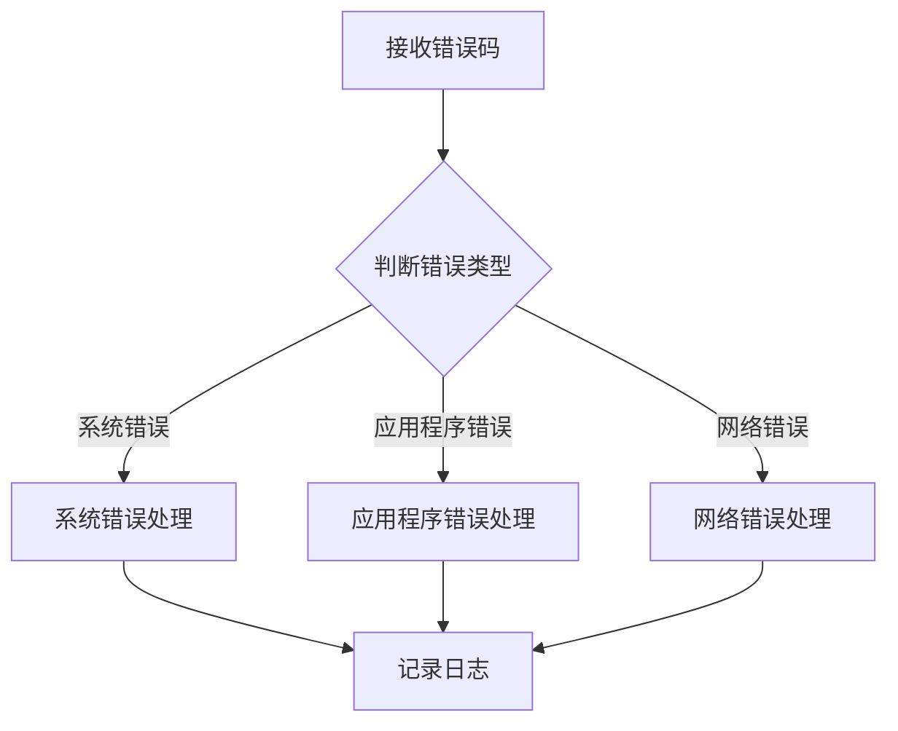

                 


### 错误码到底是什么？

**背景介绍：**

在计算机科学和软件工程中，错误码是一个常见而关键的概念。错误码，顾名思义，是在程序运行过程中出现的错误或异常的标识符。它们用于帮助开发人员、系统管理员和最终用户理解发生了什么问题，以及如何解决问题。错误码的概念可以追溯到早期计算机系统，但随着时间的推移，它们已经成为了现代软件开发过程中不可或缺的一部分。

**核心概念与联系：**

1. **定义：** 错误码是一种标识符，用于描述程序运行中的错误或异常情况。它们通常是一个数字或字符串，包含了错误发生的上下文和类型信息。

2. **分类：** 错误码可以根据不同的分类标准进行分类，例如按操作系统、应用程序或错误类型分类。常见的分类包括系统错误码、应用程序错误码、网络错误码等。

3. **作用：** 错误码在软件开发和系统维护中起着至关重要的作用。它们帮助开发人员快速定位和诊断问题，使得调试和修复过程更加高效。此外，错误码还用于日志记录、用户界面反馈和自动化处理。

**算法原理讲解：**

为了更好地理解错误码的解析过程，我们可以使用Mermaid来绘制一个简单的算法流程图：



下面，我们使用Python代码来详细阐述错误码的解析过程：

```python
def handle_error(error_code):
    if error_code.startswith('E'):
        # 系统错误处理
        print("系统错误：", error_code)
    elif error_code.startswith('A'):
        # 应用程序错误处理
        print("应用程序错误：", error_code)
    elif error_code.startswith('N'):
        # 网络错误处理
        print("网络错误：", error_code)
    else:
        # 未知错误处理
        print("未知错误：", error_code)

# 示例
handle_error('E1001')  # 系统错误
handle_error('A2002')  # 应用程序错误
handle_error('N3003')  # 网络错误
handle_error('XXX')    # 未知错误
```

在上述代码中，我们首先定义了一个名为`handle_error`的函数，它接收一个错误码作为参数。然后，根据错误码的前缀，我们分别调用不同的错误处理函数，实现了对不同类型错误码的解析和处理。

**数学模型和数学公式讲解与举例说明：**

为了更好地理解错误码的分类过程，我们可以使用以下数学模型来表示错误码的解析过程：

$$
\text{错误码分类模型} = \begin{cases}
    \text{系统错误} & \text{如果错误码前缀为 'E'} \\
    \text{应用程序错误} & \text{如果错误码前缀为 'A'} \\
    \text{网络错误} & \text{如果错误码前缀为 'N'} \\
    \text{未知错误} & \text{其他情况}
\end{cases}
$$

以下是一个简单的例子：

$$
\text{错误码} = 'E1001'
$$

根据上述数学模型，我们可以得出：

$$
\text{错误码分类} = \text{系统错误}
$$

这意味着错误码 'E1001' 被分类为系统错误，需要根据系统错误处理流程进行相应的操作。

**系统分析与架构设计方案：**

在系统架构设计中，错误码的处理是一个关键环节。以下是一个简单的系统架构设计方案：

1. **问题场景介绍：** 假设我们有一个电子商务系统，用户在购物过程中可能会遇到各种错误。

2. **项目介绍：** 我们将设计一个错误码处理模块，用于解析和分类用户遇到的错误。

3. **系统功能设计：** 错误码处理模块的主要功能包括：
   - 接收并解析用户提交的错误码。
   - 根据错误码类型，调用相应的错误处理函数。
   - 记录错误日志，以便后续分析。

4. **系统架构设计：** 错误码处理模块的架构设计如下：

   ```mermaid
   graph TD
       A[用户提交错误码] --> B[错误码解析模块]
       B -->|系统错误| C[系统错误处理模块]
       B -->|应用程序错误| D[应用程序错误处理模块]
       B -->|网络错误| E[网络错误处理模块]
       C --> F[记录日志]
       D --> F
       E --> F
   ```

5. **系统接口设计：** 错误码处理模块的接口设计如下：

   - `handle_error(error_code): void`：接收错误码并处理错误。

6. **系统交互：** 错误码处理模块与其他模块的交互如下：

   - 用户提交错误码给错误码解析模块。
   - 错误码解析模块根据错误码类型调用相应的错误处理模块。
   - 错误处理模块执行相应的操作，如记录日志或显示错误消息。

**项目实战：**

为了实际演示错误码的处理过程，我们将在一个简单的Python环境中实现一个错误码处理模块。以下是环境安装和系统核心实现源代码：

1. **环境安装：** 
   - 安装Python环境（版本3.6及以上）。
   - 安装必要的依赖库，如Mermaid和LaTeX。

2. **系统核心实现源代码：**

   ```python
   # 错误码处理模块
   class ErrorCodeHandler:
       def __init__(self):
           self.log_file = "error_logs.txt"

       def handle_error(self, error_code):
           with open(self.log_file, "a") as f:
               f.write(f"Error Code: {error_code}\n")
               if error_code.startswith('E'):
                   print("系统错误：", error_code)
               elif error_code.startswith('A'):
                   print("应用程序错误：", error_code)
               elif error_code.startswith('N'):
                   print("网络错误：", error_code)
               else:
                   print("未知错误：", error_code)

   # 测试
   handler = ErrorCodeHandler()
   handler.handle_error('E1001')
   handler.handle_error('A2002')
   handler.handle_error('N3003')
   handler.handle_error('XXX')
   ```

3. **代码应用解读与分析：**
   - `ErrorCodeHandler`类：定义了一个错误码处理类，包括初始化方法和处理错误方法。
   - `handle_error`方法：根据错误码类型调用相应的错误处理函数，并记录错误日志。

4. **实际案例分析和详细讲解剖析：**
   - 在实际应用中，我们可以将错误码处理模块集成到电子商务系统中，以便在用户购物过程中捕获和处理错误。

5. **项目小结：**
   - 错误码处理是软件开发过程中不可或缺的一部分，它帮助我们快速定位和解决程序中的问题。
   - 通过设计合理的错误码处理模块，我们可以提高系统的稳定性和用户体验。

**最佳实践 tips、小结、注意事项、拓展阅读等内容：**

**最佳实践 tips：**
1. 设计合理的错误码结构，确保易于理解和维护。
2. 提供详细的错误码文档，方便开发人员和用户查找错误信息。
3. 定期更新和优化错误码处理模块，以适应新的需求和变化。

**小结：**
错误码是软件开发过程中不可或缺的一部分，它帮助我们快速定位和解决程序中的问题。通过合理设计和处理错误码，我们可以提高系统的稳定性和用户体验。

**注意事项：**
1. 错误码应遵循统一的命名规范，以便于分类和处理。
2. 错误码的处理过程应尽量简洁高效，避免过度复杂化。

**拓展阅读：**
1. 《软件工程：实践者的研究方法》（Roger S. Pressman） - 有关软件错误和调试的深入讨论。
2. 《深入理解计算机系统》（Randal E. Bryant & David R. O’Hallaron） - 计算机系统错误和调试的详细介绍。
3. 《错误处理的艺术》（Robert C. Martin） - 有关软件错误处理的最佳实践和技巧。

---

**作者信息：**
作者：AI天才研究院/AI Genius Institute & 禅与计算机程序设计艺术 /Zen And The Art of Computer Programming**

