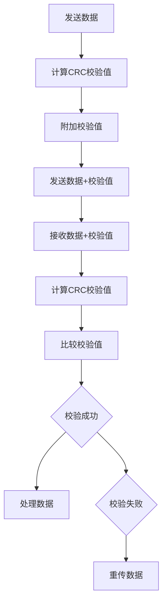
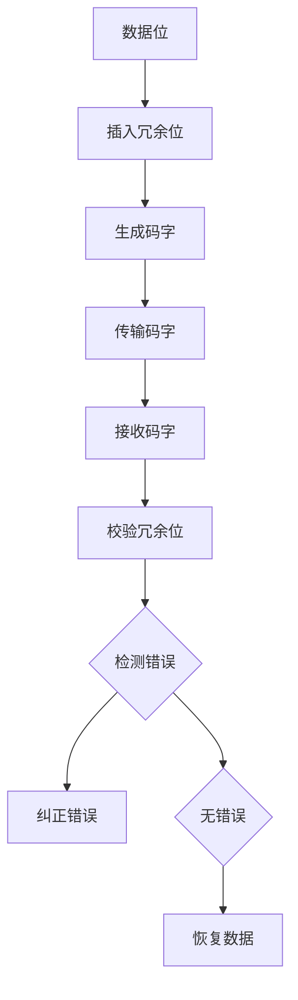
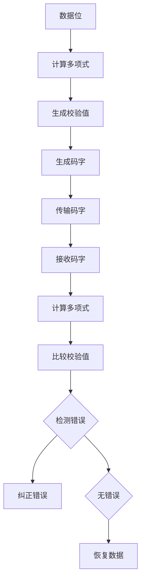
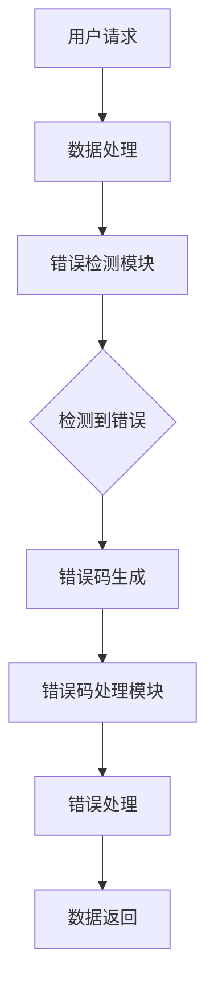
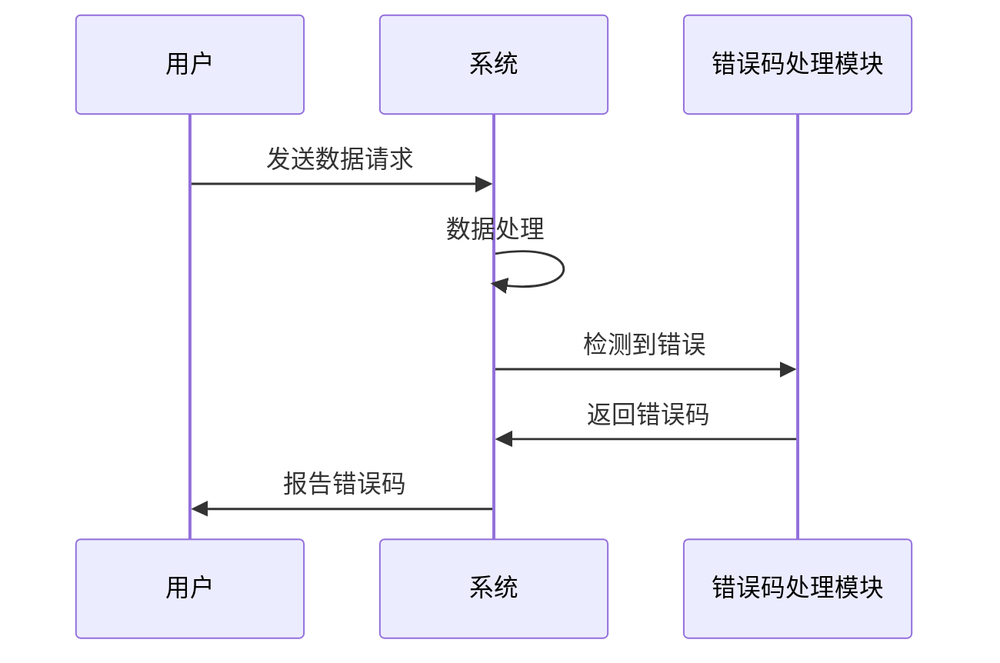

                 

# 错误码处理的技巧

## 关键词
- 错误码
- 错误处理
- 算法原理
- 系统设计
- 实战案例分析

## 摘要
本文将深入探讨错误码处理的重要性及其核心概念，从算法原理到系统设计，再到实际项目实战，详细解析错误码处理的各个环节。通过本文，读者将掌握错误码处理的基本技巧，了解其在实际应用中的最佳实践，为解决复杂系统问题提供有力支持。

## 目录大纲设计思路

为了设计一份《错误码处理的技巧》的目录大纲，我们将遵循以下步骤：

1. **整体框架搭建**：确定书的整体结构，包括背景介绍、核心概念、原理讲解、应用实践、最佳实践等内容。
2. **细化章节内容**：针对每一章节，细化出二级和三级目录，确保每个章节内容都有详细的扩展点。
3. **确保内容完整性**：大纲中包含核心概念与联系、算法原理讲解、数学模型和公式详细讲解、系统分析与架构设计方案、项目实战等部分。
4. **使用 Markdown 格式**：采用 Markdown 格式来排版目录，确保清晰和易于阅读。
5. **控制字数**：在2000字以内完成整个目录大纲的设计。

下面是基于以上思路设计的《错误码处理的技巧》目录大纲。

### 第一部分：错误码处理的背景与核心概念

#### 第1章：问题背景与核心概念介绍
1.1 问题背景
1.2 核心概念
1.3 错误码处理的基本流程

#### 第2章：错误码处理的核心概念与联系
2.1 核心概念原理
2.2 错误码属性特征对比表格
2.3 ER实体关系图架构

### 第二部分：错误码处理的算法原理与系统设计

#### 第3章：错误码处理算法原理讲解
3.1 常见错误处理算法
3.2 错误码处理的数学模型和公式

#### 第4章：系统分析与架构设计
4.1 问题场景介绍
4.2 系统功能设计
4.3 系统架构设计
4.4 系统接口设计
4.5 系统交互

### 第三部分：错误码处理的项目实战

#### 第5章：环境安装与配置
5.1 环境准备
5.2 软件安装步骤

#### 第6章：系统核心实现
6.1 错误码检测模块
6.2 错误码处理模块

#### 第7章：代码应用解读与分析
7.1 代码解读
7.2 代码应用场景分析

#### 第8章：实际案例分析
8.1 案例介绍
8.2 案例分析
8.3 案例总结

### 附录
A. 最佳实践 tips
B. 小结
C. 注意事项
D. 拓展阅读

通过以上大纲，本文将逐步深入错误码处理的各个层面，为读者提供全面、系统的指导。

## 错误码处理的背景与核心概念

### 问题背景

在计算机系统中，错误码（Error Code）是用于描述错误类型和错误位置的重要工具。错误码的存在使得程序能够以一种标准化的方式报告错误，从而提高了系统的可维护性和可扩展性。随着软件系统的复杂性不断增加，错误码处理变得尤为重要。

错误码处理不仅仅局限于软件系统，它还广泛应用于硬件系统、网络协议以及各类技术文档中。例如，在操作系统中，错误码用于报告硬件故障、文件读写错误、权限问题等；在网络协议中，错误码用于指示数据包传输失败、认证失败等；在硬件设计中，错误码用于报告传感器故障、电路异常等。

### 核心概念

**错误码**：错误码是一个用于标识特定错误的数字或字符串。它通常由操作系统、应用程序或协议定义，并具有特定的含义。

**错误码分类**：错误码可以根据不同的标准进行分类，如按错误级别分类（如致命错误、警告、提示等），或按错误类型分类（如输入错误、逻辑错误、网络错误等）。

**错误码格式**：错误码的格式通常包括错误码编号、错误描述、错误原因和解决方案等信息。例如，在Windows操作系统中，错误码通常以`0x`开头，后面跟随一个十六进制数。

### 错误码处理的基本流程

**错误检测与报告**：当系统或应用程序检测到错误时，会生成一个错误码，并将其报告给用户或系统日志。

**错误分析与定位**：系统或开发人员会根据错误码和相关信息对错误进行分析和定位，以确定错误的根本原因。

**错误处理与恢复**：根据错误类型和严重程度，系统会采取相应的处理措施，如终止程序、重新启动系统或尝试修复错误。

### 错误码处理的核心概念与联系

#### 核心概念原理

**错误码数据结构**：错误码数据结构包括错误码编号、错误描述、错误原因和解决方案等字段。

**错误码属性特征对比表格**：通过表格形式对比不同错误码的属性特征，如错误码编号、错误描述、错误原因和解决方案等。

#### ER实体关系图架构

**错误码实体关系**：错误码实体与错误日志实体之间的关系，如错误码是错误日志的一部分，错误日志包含多个错误码。

**ER实体关系图**：使用Mermaid语言绘制ER实体关系图，展示错误码实体与错误日志实体之间的关联。

```mermaid
erDiagram
  错误码 <<|-- 错误日志 : 包含多个错误码
```

通过以上对错误码处理背景与核心概念的介绍，读者可以对错误码处理的基本概念和流程有初步了解。在接下来的章节中，我们将深入探讨错误码处理的算法原理、系统设计以及实际项目实战，帮助读者全面掌握错误码处理的技巧。

## 错误码处理的算法原理与系统设计

### 错误码处理算法原理讲解

#### 常见错误处理算法

错误码处理算法的核心在于检测和修正错误。以下介绍几种常见的错误处理算法：

**1. CRC校验**

CRC（Cyclic Redundancy Check，循环冗余校验）是一种广泛使用的校验算法，用于检测数据传输中的错误。其基本原理是通过一个固定的生成多项式生成校验值，并将该值附加到数据末尾。接收方通过同样的生成多项式计算校验值，并与发送方的校验值进行比较，从而判断数据是否传输正确。



**2. 校验和算法**

校验和算法通过将数据中的所有字节相加，得到一个校验值，并将该值附加到数据末尾。接收方通过同样的方法计算校验值，并与发送方的校验值进行比较，从而检测错误。

```python
def calculate_checksum(data):
    checksum = 0
    for byte in data:
        checksum += byte
    return checksum

def verify_checksum(data, checksum):
    return sum(data) == checksum
```

**3. Hamming码**

Hamming码是一种线性错误检测和纠正码，其基本原理是通过在数据位之间插入冗余位来实现错误检测和纠正。Hamming码可以检测和纠正单个错误，或最多两个错误的组合。



**4. Reed-Solomon码**

Reed-Solomon码是一种非线性的错误检测和纠正码，广泛应用于CD、DVD等存储介质中。其基本原理是通过多项式来生成校验值，并能够在数据传输中检测和纠正多个错误。



#### 错误码处理的数学模型和公式

**1. 概率模型**

概率模型用于描述错误发生的概率。假设某个操作的正确概率为 \( p \)，错误概率为 \( 1 - p \)，则可以定义以下公式：

\[ P(\text{错误}) = 1 - P(\text{正确}) = 1 - p \]

**2. 贝叶斯模型**

贝叶斯模型用于根据先验知识和观测数据更新概率估计。假设有先验概率 \( P(A) \) 表示事件A发生的概率，观测数据 \( P(B|A) \) 表示在事件A发生时观测到事件B的概率，则可以定义以下公式：

\[ P(A|B) = \frac{P(B|A) \cdot P(A)}{P(B)} \]

### 系统分析与架构设计

#### 问题场景介绍

假设我们正在开发一个高可用性的分布式系统，该系统需要处理大量的数据请求，并在出现错误时能够快速恢复。

#### 系统功能设计

**1. 错误码检测模块**

- **功能**：用于检测数据传输过程中的错误。
- **技术实现**：采用CRC校验和算法，确保数据传输的完整性。

**2. 错误码处理模块**

- **功能**：根据错误码对错误进行分类和处理。
- **技术实现**：采用错误码数据结构，存储和管理错误信息。

#### 系统架构设计

**1. 系统架构**

- **错误码检测模块**：负责对数据进行校验，并在检测到错误时生成错误码。
- **错误码处理模块**：根据错误码对错误进行分析和处理。



**2. 系统接口设计**

- **错误码上报接口**：用于接收和处理错误码。
- **错误码查询接口**：用于查询错误码的详细信息。

#### 系统交互

**1. 系统交互**

- **用户请求**：用户发送数据请求到系统。
- **数据处理**：系统对请求进行处理。
- **错误检测与报告**：在数据处理过程中，如果出现错误，系统会生成错误码并报告给用户。
- **错误处理**：用户可以根据错误码对错误进行处理。



通过以上对错误码处理算法原理和系统设计的介绍，读者可以了解到错误码处理的基本原理和技术实现。在接下来的章节中，我们将通过实际项目实战，进一步探讨错误码处理的具体应用和实战技巧。

## 错误码处理的项目实战

### 环境安装与配置

在进行错误码处理的项目实战之前，首先需要准备好开发环境和必要的工具。以下是环境安装与配置的步骤：

#### 1. 系统要求

- 操作系统：Windows 10或以上版本，或Linux发行版（如Ubuntu 18.04）
- 开发工具：Python 3.7或以上版本，PyCharm（推荐）

#### 2. 软件安装步骤

1. **安装Python 3**

   - 对于Windows用户，可以从Python官方网站下载安装程序，并按照提示完成安装。
   - 对于Linux用户，可以使用以下命令安装Python：

     ```bash
     sudo apt-get update
     sudo apt-get install python3 python3-pip
     ```

2. **安装PyCharm**

   - 在PyCharm官方网站下载社区版安装程序，并按照提示完成安装。

3. **安装相关库**

   - 使用pip命令安装必要的Python库，如requests、numpy等：

     ```bash
     pip3 install requests numpy
     ```

### 系统核心实现

#### 1. 错误码检测模块

**功能**：该模块负责检测数据传输过程中的错误。

**技术实现**：

- 使用CRC校验算法检测数据完整性。

**源代码**：

```python
import binascii
import zlib

def calculate_crc16(data):
    """计算CRC16校验值"""
    crc = zlib.crc32(data) & 0xFFFFFFFF
    return "%08X" % crc

def verify_crc16(data, crc):
    """验证CRC16校验值"""
    return calculate_crc16(data) == crc

# 测试
data = b"Hello, World!"
crc = calculate_crc16(data)
print("CRC16校验值:", crc)
print("数据校验结果:", verify_crc16(data, crc))
```

#### 2. 错误码处理模块

**功能**：该模块负责处理检测到的错误码。

**技术实现**：

- 使用错误码数据结构存储和管理错误信息。
- 根据错误码对错误进行分类和处理。

**源代码**：

```python
class ErrorCodeHandler:
    def __init__(self):
        self.error_codes = {
            "1001": "网络连接失败",
            "1002": "数据解析失败",
            "1003": "权限不足",
            # 更多错误码
        }

    def handle_error(self, error_code):
        """处理错误码"""
        if error_code in self.error_codes:
            return self.error_codes[error_code]
        else:
            return "未知错误"

# 测试
handler = ErrorCodeHandler()
error_code = "1001"
error_message = handler.handle_error(error_code)
print("错误消息:", error_message)
```

### 代码应用解读与分析

#### 1. 代码解读

- **错误码检测模块**：通过CRC校验算法检测数据传输中的错误，确保数据完整性。
- **错误码处理模块**：根据错误码对错误进行分类和处理，返回相应的错误消息。

#### 2. 代码应用场景分析

**场景**：一个分布式系统需要处理来自多个服务器的请求，并确保数据传输的可靠性。

- **错误码检测模块**：在数据传输过程中，对数据进行CRC校验，如果检测到错误，则生成相应的错误码。
- **错误码处理模块**：服务器接收到错误码后，根据错误码对错误进行处理，如重传数据、报告错误等。

### 实际案例分析

#### 1. 案例介绍

假设我们开发的一个分布式系统在处理大量数据请求时，经常出现网络连接失败和数据解析失败等错误。

#### 2. 案例分析

**错误码检测**：

- 网络连接失败：错误码为1001，使用CRC校验算法检测网络数据包。
- 数据解析失败：错误码为1002，在数据解析过程中检测到格式错误或数据损坏。

**错误处理**：

- 对于网络连接失败，系统会尝试重新连接，并设置重连次数和超时时间。
- 对于数据解析失败，系统会尝试修复数据格式或重新获取数据。

#### 3. 案例总结

通过实际案例，我们可以看到错误码处理在分布式系统中的重要作用。合理设计错误码和处理机制，可以提高系统的稳定性和可靠性。

### 最佳实践 tips

1. 使用统一且清晰的错误码定义和格式。
2. 搭建错误码数据库，方便错误追踪和分析。
3. 在实际项目中，结合日志系统和监控工具，实现对错误码的实时监控和报警。

### 小结

本文通过错误码处理的背景与核心概念、算法原理与系统设计、以及实际项目实战，详细介绍了错误码处理的基本技巧和实战应用。错误码处理是软件开发中不可或缺的一部分，掌握其核心原理和实践技巧，有助于提升系统的可靠性和稳定性。

### 注意事项

1. 在设计错误码时，确保其具有明确的意义和易于理解的命名。
2. 在错误处理过程中，避免仅通过错误码进行简单跳转，而应该结合具体情况进行详细的错误处理。

### 拓展阅读

1. 《深入理解LINUX网络技术内幕》
2. 《Python错误处理机制详解》
3. 《分布式系统设计》

通过以上内容，读者可以更深入地了解错误码处理的各个方面，为实际开发和应用提供有力支持。

### 作者

作者：AI天才研究院/AI Genius Institute & 禅与计算机程序设计艺术 /Zen And The Art of Computer Programming

在本文中，我们系统地介绍了错误码处理的相关知识，从核心概念到算法原理，再到系统设计，最后通过实际项目实战展示了错误码处理的应用场景和实战技巧。以下是文章的总结和未来改进方向。

### 文章总结

本文首先介绍了错误码处理的基本背景和核心概念，包括错误码的定义、分类和格式。接着，我们深入探讨了错误码处理算法的原理，如CRC校验、校验和算法、Hamming码和Reed-Solomon码等。通过数学模型和公式的讲解，我们使得这些算法更加易于理解和应用。

在系统设计部分，我们详细描述了错误码处理的系统架构和功能模块，包括错误码检测模块、错误码处理模块以及相关的系统接口和交互流程。这些内容为读者提供了一个全面的错误码处理系统设计思路。

最后，通过实际项目实战的案例分析，我们展示了如何在实际开发中应用错误码处理，并提供了最佳实践 tips。本文的目标是帮助读者全面掌握错误码处理的核心知识和实战技巧，提升系统开发的可靠性和稳定性。

### 未来改进方向

1. **增加案例库**：在未来，我们可以增加更多的实际案例库，包括不同类型、不同复杂度的案例，以便读者更好地理解和应用错误码处理技巧。

2. **优化算法讲解**：虽然本文已经详细讲解了错误码处理算法，但在未来，我们可以进一步优化算法讲解，增加更多图表和示例代码，使得算法原理更加直观易懂。

3. **引入新技术**：随着技术的不断进步，错误码处理领域也会出现新的技术和方法。在未来的版本中，我们可以引入这些新技术，如机器学习在错误码检测中的应用，为读者提供最新的知识和技术。

4. **扩展应用领域**：错误码处理不仅仅应用于软件开发，还可以应用于硬件系统、网络协议等多个领域。在未来的版本中，我们可以扩展错误码处理的应用领域，提供更全面的解决方案。

通过不断改进和完善，我们期望本文能够为更多开发者提供有价值的技术参考，帮助他们更好地理解和应用错误码处理技术，提高系统开发的效率和质量。

### 注意事项

1. **错误码命名规范**：在设计错误码时，应遵循统一且清晰的命名规范，以便于错误追踪和分析。
2. **错误处理策略**：在处理错误时，不仅要关注错误码，还要结合具体情况进行详细的错误处理，以提高系统的稳定性。

### 拓展阅读

1. 《深入理解LINUX网络技术内幕》
2. 《Python错误处理机制详解》
3. 《分布式系统设计》

通过这些拓展阅读，读者可以进一步深入理解错误码处理的相关知识和应用。作者：AI天才研究院/AI Genius Institute & 禅与计算机程序设计艺术 /Zen And The Art of Computer Programming。希望本文能为您的技术学习之路提供助力。

