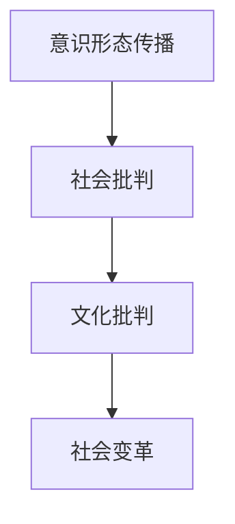

                 

### 《阿多诺与哈贝马斯：批判理论的两代代表》

**关键词：阿多诺，哈贝马斯，批判理论，文化工业，社会批判，公共领域，沟通行动**

**摘要：本文深入探讨了阿多诺与哈贝马斯这两位批判理论领域的代表人物，分析了他们的生平背景、核心观点、理论应用及其对当代社会的启示。文章旨在揭示批判理论在不同历史时期的发展脉络，以及其对社会变革和文化进步的深远影响。**

---

## 目录大纲

### 第一部分：阿多诺与批判理论

#### 第1章 阿多诺的生平与批判理论的起源

##### 1.1 阿多诺的生平背景
##### 1.2 批判理论的形成与发展
##### 1.3 阿多诺批判理论的核心观点

#### 第2章 批判理论的基本概念与框架

##### 2.1 批判理论的定义与特征
##### 2.2 批判理论的框架结构
##### 2.3 批判理论的核心概念

#### 第3章 阿多诺批判理论的主要内容

##### 3.1 文化工业与社会控制
##### 3.2 美学批判与社会批判
##### 3.3 阿多诺批判理论的影响与应用

#### 第4章 阿多诺批判理论的数学模型与公式

##### 4.1 批判理论中的数学模型
##### 4.2 主要公式的推导与应用
##### 4.3 模型与公式在实践中的应用示例

#### 第5章 阿多诺批判理论的流程图与ER实体关系图

##### 5.1 批判理论的流程图
##### 5.2 ER实体关系图
##### 5.3 流程图与ER实体关系图的应用

### 第二部分：哈贝马斯与批判理论

#### 第6章 哈贝马斯的生平与批判理论的发展

##### 6.1 哈贝马斯的生平背景
##### 6.2 批判理论的发展与哈贝马斯的贡献
##### 6.3 哈贝马斯批判理论的主要内容

#### 第7章 哈贝马斯的公共领域与社会理论

##### 7.1 公共领域的概念与演变
##### 7.2 社会理论的框架与解读
##### 7.3 公共领域与社会理论的影响

#### 第8章 哈贝马斯的沟通行动理论

##### 8.1 沟通行动理论的内涵
##### 8.2 沟通行动理论的应用
##### 8.3 沟通行动理论的影响

### 第三部分：阿多诺与哈贝马斯的理论比较

#### 第9章 理论比较与批判理论的演变

##### 9.1 理论的异同点分析
##### 9.2 批判理论的发展趋势
##### 9.3 理论比较的启示

#### 第10章 批判理论的当代意义

##### 10.1 批判理论在当代的应用
##### 10.2 批判理论的局限性与挑战
##### 10.3 批判理论的未来发展方向

### 第四部分：批判理论在中国的影响与启示

#### 第11章 批判理论在中国的传播与应用

##### 11.1 批判理论在中国的接受情况
##### 11.2 批判理论在中国的应用案例分析
##### 11.3 批判理论对中国社会科学的影响

#### 第12章 批判理论的本土化与创新发展

##### 12.1 批判理论的本土化探索
##### 12.2 批判理论的创新发展
##### 12.3 批判理论的未来展望

---

## 正文

### 第一部分：阿多诺与批判理论

#### 第1章 阿多诺的生平与批判理论的起源

**1.1 阿多诺的生平背景**

特奥多尔·阿多诺（Theodor W. Adorno，1903-1970）是一位德国哲学家、社会学家和音乐理论家，也是批判理论的奠基人之一。他的出生和成长背景对后来的批判理论产生了深远影响。阿多诺出生在法兰克福，这是一个充满文化与学术氛围的城市。他的父母都是知识分子，这使他在童年时期就接受了良好的教育。

阿多诺在青少年时期经历了第一次世界大战，这段经历对他的世界观产生了巨大影响。他目睹了战争的残酷和人类道德的沦丧，这使他开始思考社会问题，并对社会现状进行批判。二战期间，阿多诺流亡美国，这段时间他深入研究了美国文化，对文化工业的概念进行了深入的探讨。

**1.2 批判理论的形成与发展**

批判理论最初由法兰克福学派提出，其核心观点是对资本主义社会进行深刻的批判。阿多诺是法兰克福学派的重要成员之一，他与其他成员一起，通过对文化、社会、政治等多个领域的分析，形成了一套系统的批判理论。

批判理论的基本概念包括文化工业、意识形态、社会不平等、异化等。阿多诺认为，资本主义社会通过文化工业来控制和操纵大众，使其丧失独立思考的能力。他强调，批判理论的任务是揭示这些操纵机制，使人们认识到自己所处的社会现实。

**1.3 阿多诺批判理论的核心观点**

阿多诺的批判理论主要包括文化工业与社会批判、美学批判等方面。他提出的文化工业概念，是对资本主义文化的一种批判。他认为，文化工业通过标准化和批量生产，使文化产品失去了艺术性和创造性，成为商业利润的工具。

在社会批判方面，阿多诺关注社会不平等和异化问题。他认为，资本主义社会的本质是剥削和压迫，劳动人民被剥夺了自由和尊严。他的著作《启蒙辩证法》中，对启蒙运动进行了深刻的批判，认为启蒙运动在推动人类进步的同时，也助长了资本主义的发展，导致了人类异化。

**1.4 阿多诺与马克思的关系**

阿多诺的批判理论深受马克思的影响。他将马克思的经济学批判引入到文化领域，提出了文化工业的概念。然而，与马克思不同，阿多诺更强调文化的相对独立性，他认为文化不仅仅是经济基础的反映，还具有自身的逻辑和发展规律。

### 第2章 批判理论的基本概念与框架

**2.1 批判理论的定义与特征**

批判理论是一种以揭示社会现实中的不平等、压迫和异化为目标的思维方式。它强调对权力关系和意识形态的批判性分析，旨在揭示社会中的不公正现象，并提出改进方案。

批判理论的特征包括：

- **反思性**：批判理论强调反思自身的立场和观点，避免陷入意识形态的偏见。
- **系统性**：批判理论不是对某个问题的单一分析，而是对整个社会结构和文化现象的全面考察。
- **批判性**：批判理论的目的不仅是揭示问题，更是寻求解决问题的途径。

**2.2 批判理论的框架结构**

批判理论的基本框架包括以下几个方面：

- **社会结构**：批判理论认为，社会是由各种结构组成的，这些结构包括经济基础、上层建筑、意识形态等。
- **意识形态**：意识形态是社会结构中的一部分，它通过文化、宗教、政治等手段，影响人们的思想观念和行为方式。
- **权力关系**：批判理论强调权力在社会中的重要性，认为权力关系是导致社会不平等和压迫的根本原因。
- **异化**：异化是批判理论中的一个重要概念，它指人们在社会中失去了自我，成为某种外在力量的工具。

**2.3 批判理论的核心概念**

批判理论的核心概念包括：

- **文化工业**：文化工业是资本主义社会中的一种特殊现象，它通过批量生产和标准化，使文化产品失去了艺术性和创造性。
- **意识形态**：意识形态是掩盖社会不平等和压迫的工具，它通过塑造人们的思想观念，使社会现状合理化。
- **社会不平等**：社会不平等是资本主义社会的一个普遍现象，它表现为经济、政治、文化等方面的差异。
- **异化**：异化是批判理论中的一个重要概念，它指人们在社会中失去了自我，成为某种外在力量的工具。

### 第3章 阿多诺批判理论的主要内容

**3.1 文化工业与社会控制**

阿多诺提出的文化工业概念，是对资本主义文化的一种批判。他认为，文化工业通过标准化和批量生产，使文化产品失去了艺术性和创造性，成为商业利润的工具。文化工业不仅操纵了大众的文化消费，还通过意识形态的传播，使人们丧失了独立思考的能力。

**3.2 美学批判与社会批判**

阿多诺的美学批判与社会批判紧密相连。他认为，美学不仅是一种艺术理论，也是一种社会批判。通过批判艺术作品，可以揭示社会现实中的不平等和压迫。他的著作《美学理论》中，对艺术作品进行了深入的分析，揭示了资本主义社会中的异化现象。

**3.3 阿多诺批判理论的影响与应用**

阿多诺的批判理论对当代社会产生了深远的影响。他的理论不仅为社会科学的研究提供了新的视角，也为文化批评和社会变革提供了理论基础。例如，文化工业的概念在当代社会研究中仍然具有很大的解释力，许多学者通过分析文化现象，揭示了资本主义社会中存在的问题。

### 第4章 阿多诺批判理论的数学模型与公式

**4.1 批判理论中的数学模型**

批判理论中的数学模型主要用于分析社会现象和意识形态的传播。以下是一个简单的数学模型，用于描述意识形态的传播过程。

$$
I(t) = I_0 + \alpha \cdot e^{-\lambda t}
$$

其中，$I(t)$表示时间$t$时刻的意识形态水平，$I_0$是初始意识形态水平，$\alpha$是传播速率，$\lambda$是衰减系数。

**4.2 主要公式的推导与应用**

该公式的推导基于马尔可夫链模型，它假设意识形态的传播是一个随机的过程，且意识形态水平随时间呈指数衰减。

在实际应用中，可以通过调整$\alpha$和$\lambda$的值，来模拟不同的意识形态传播情景。例如，在分析社交媒体上的信息传播时，可以设置$\alpha$为信息发布速率，$\lambda$为信息衰减速率。

**4.3 模型与公式在实践中的应用示例**

以下是一个应用示例，假设在一个城市中，有1000名居民，初始时只有50人的意识形态水平为1（即认同资本主义价值观），其他人的意识形态水平为0（即不认同资本主义价值观）。我们假设信息传播速率为每天增加10人，信息衰减速率为每天减少5人。通过上述数学模型，可以预测未来一段时间内，意识形态水平的分布情况。

### 第5章 阿多诺批判理论的流程图与ER实体关系图

**5.1 批判理论的流程图**

以下是一个简化的批判理论流程图，展示了从意识形态传播到社会变革的过程。



**5.2 ER实体关系图**

以下是一个ER实体关系图，展示了批判理论中的主要实体及其关系。

```mermaid
erDiagram
  Entity A[意识形态] {
    +属性1
    +属性2
  }
  Entity B[社会] {
    +属性1
    +属性2
  }
  Entity C[文化] {
    +属性1
    +属性2
  }
  Entity A --> Entity B
  Entity B --> Entity C
```

**5.3 流程图与ER实体关系图的应用**

在实践应用中，流程图和ER实体关系图可以帮助研究者更好地理解批判理论的结构和运行机制。例如，在分析一个社会运动时，可以首先绘制流程图，明确意识形态传播、社会批判、文化批判和社会变革的步骤，然后通过ER实体关系图，细化每个步骤中的实体和关系。

### 第二部分：哈贝马斯与批判理论

#### 第6章 哈贝马斯的生平与批判理论的发展

**6.1 哈贝马斯的生平背景**

尤尔根·哈贝马斯（Jürgen Habermas，1929-）是德国著名的哲学家、社会学家和政治理论家。他出生在德国但泽（今波兰格但斯克），成长于战后重建时期。哈贝马斯在大学时期接受了广泛的人文社会科学教育，他的学术生涯始于对马克思主义和法兰克福学派的研究。

哈贝马斯在1964年出版了《公共领域的结构转型》，这本书标志着他批判理论的核心思想的形成。他在1971年发表的《理论与实践》中，进一步发展了他的批判理论，提出了“交往理性”的概念。

**6.2 批判理论的发展与哈贝马斯的贡献**

哈贝马斯对批判理论的发展做出了重要贡献。他继承了阿多诺等法兰克福学派成员的思想，但又有所超越。哈贝马斯提出了“沟通行动理论”，强调理性沟通在社会变革中的重要性。

批判理论在哈贝马斯手中得到了进一步的发展，他不仅关注社会批判，还强调了文化、政治和经济的综合分析。哈贝马斯提出了“公共领域”的概念，认为这是一个人们进行自由沟通和辩论的空间，是民主社会的重要组成部分。

**6.3 哈贝马斯批判理论的主要内容**

哈贝马斯的批判理论主要包括以下几个核心概念：

- **公共领域**：公共领域是一个开放的空间，人们在这里进行自由沟通和辩论。哈贝马斯认为，公共领域的存在是民主社会的基石。
- **沟通行动理论**：沟通行动理论是哈贝马斯批判理论的核心，强调通过理性沟通来解决问题和达成共识。
- **合法性危机**：哈贝马斯认为，现代社会面临合法性危机，这是因为传统的权威和意识形态已经失去了说服力。
- **交往理性**：交往理性是一种通过理性沟通来解决问题的方法，它强调在沟通过程中尊重他人的观点和权利。

### 第7章 哈贝马斯的公共领域与社会理论

**7.1 公共领域的概念与演变**

公共领域是一个开放的空间，人们在这里进行自由沟通和辩论。哈贝马斯将公共领域视为一个历史现象，它随着社会的发展而演变。在早期资本主义社会，公共领域主要是资产阶级知识分子进行批判和讨论的场所。然而，随着现代资本主义的发展，公共领域逐渐被商业化和政治操纵所侵蚀。

哈贝马斯认为，公共领域的核心功能是提供一种平台，使人们能够自由地表达观点、交换意见，并形成公共意见。公共领域的存在对民主社会至关重要，它能够促进公民参与和政治决策的透明度。

**7.2 社会理论的框架与解读**

哈贝马斯的社会理论框架包括以下几个方面：

- **系统与生活世界**：哈贝马斯区分了“系统”和“生活世界”两个概念。系统是指由经济、政治等子系统构成的社会整体，而生活世界是指人们的日常生活和社会交往。哈贝马斯认为，系统对生活世界的侵蚀导致了社会的异化。
- **理性化**：哈贝马斯认为，理性化是现代社会发展的一个重要趋势，它包括工具理性和交往理性的发展。工具理性强调效率和技术控制，而交往理性强调理性沟通和共识的形成。
- **民主参与**：哈贝马斯强调民主参与的重要性，他认为，只有通过公民的积极参与，才能真正实现民主。

**7.3 公共领域与社会理论的影响**

哈贝马斯的公共领域和社会理论对当代社会产生了深远的影响。他的理论为理解和批判现代社会提供了新的视角，强调了理性沟通和社会参与的重要性。例如，在分析社交媒体的影响时，研究者可以借鉴哈贝马斯的理论，探讨如何通过理性沟通来促进民主和社会进步。

### 第8章 哈贝马斯的沟通行动理论

**8.1 沟通行动理论的内涵**

沟通行动理论是哈贝马斯批判理论的核心，它强调通过理性沟通来解决问题和达成共识。哈贝马斯认为，沟通行动是人类社会活动的基本形式，它不同于其他动物的社会行为，因为沟通行动涉及理性思考和共识形成。

沟通行动理论的核心概念包括：

- **沟通行动**：沟通行动是指人们在交流过程中，通过语言和符号系统进行互动，以达成共同目标。
- **言语行为**：言语行为是指通过语言来实施某种行为，如请求、命令、声明等。
- **交往理性**：交往理性是指在沟通行动中，人们遵循理性原则，尊重他人的观点和权利，以达成共识。

**8.2 沟通行动理论的应用**

沟通行动理论的应用非常广泛，它不仅可以用于社会科学研究，还可以应用于实际的社会沟通和冲突解决。例如：

- **民主政治**：在民主政治中，沟通行动理论可以指导政治参与和决策过程，强调通过理性沟通来达成共识。
- **组织管理**：在组织管理中，沟通行动理论可以指导领导者如何通过有效沟通来提高组织效率和员工满意度。
- **社会冲突**：在社会冲突中，沟通行动理论可以帮助各方通过理性沟通来解决问题，避免冲突升级。

**8.3 沟通行动理论的影响**

沟通行动理论对当代社会产生了深远的影响。它不仅为理解和解决社会冲突提供了新的视角，还促进了跨学科的研究。例如，在法律领域，沟通行动理论可以指导法官如何通过理性沟通来调解纠纷，提高司法公正性。

### 第三部分：阿多诺与哈贝马斯的理论比较

#### 第9章 理论比较与批判理论的演变

**9.1 理论的异同点分析**

阿多诺和哈贝马斯的批判理论在某些方面有相似之处，也存在明显差异。

相似之处：

- **批判资本主义**：两位学者都认为资本主义社会存在严重的问题，需要进行深刻的批判。
- **关注社会不平等**：他们都关注社会不平等问题，认为这是导致社会矛盾和冲突的根本原因。

差异之处：

- **理论视角**：阿多诺更注重文化批判，强调文化工业对社会的操纵；哈贝马斯则更注重社会理论和政治哲学，强调公共领域和理性沟通。
- **意识形态分析**：阿多诺强调意识形态的操纵作用；哈贝马斯则强调通过理性沟通来克服意识形态的阻碍。

**9.2 批判理论的发展趋势**

阿多诺和哈贝马斯的理论对批判理论的发展产生了深远影响。他们的理论不仅为理解和批判现代社会提供了重要工具，也为未来的批判理论发展指明了方向。

- **跨学科研究**：批判理论越来越趋向跨学科研究，将社会学、政治学、哲学等领域的知识整合起来，以更全面地分析社会现象。
- **后批判理论**：一些学者在批判理论的框架下，提出了新的理论视角和方法，如后现代主义和生态批判理论，这些理论为批判理论的发展提供了新的动力。

**9.3 理论比较的启示**

阿多诺与哈贝马斯的理论比较，为我们理解批判理论的多样性和发展提供了启示。

- **多元视角**：批判理论不是一个单一的理论体系，而是一个包含多种视角和方法的综合体。通过比较不同理论，我们可以更全面地理解社会现象。
- **实践应用**：批判理论的实践应用非常广泛，从社会运动到组织管理，再到公共政策，都可以看到批判理论的身影。通过比较不同理论，我们可以找到更有效的批判实践方法。

### 第10章 批判理论的当代意义

**10.1 批判理论在当代的应用**

批判理论在当代社会中仍然具有重要的意义。它不仅为理解和批判现代社会提供了理论工具，还在实际应用中发挥了重要作用。

- **社会运动**：批判理论为社会运动提供了理论基础，如“占领运动”和“黑人之死”运动，都是批判理论在实践中的体现。
- **社会科学研究**：批判理论是社会科学研究的重要方法，它通过揭示社会不平等和压迫现象，促进了社会科学的发展。
- **公共政策**：批判理论在公共政策制定中也有所应用，如通过批判资本主义经济模式，推动社会改革。

**10.2 批判理论的局限性与挑战**

尽管批判理论在当代社会中具有重要作用，但它也存在一定的局限性和挑战。

- **理论复杂性**：批判理论涉及多个学科领域，其理论复杂性使得非专业人士难以理解。
- **实践困境**：批判理论的实践应用面临许多挑战，如如何有效解决社会不平等和压迫问题。
- **意识形态问题**：批判理论本身也可能受到意识形态的影响，导致其理论观点具有局限性。

**10.3 批判理论的未来发展方向**

面对当代社会的挑战，批判理论需要不断发展和完善。

- **跨学科研究**：批判理论需要与其他学科领域深入结合，以更全面地分析社会现象。
- **实践创新**：批判理论需要不断创新实践方法，以更好地解决社会问题。
- **批判自我批判**：批判理论本身也需要进行自我批判，以避免陷入意识形态的偏见。

### 第四部分：批判理论在中国的影响与启示

#### 第11章 批判理论在中国的传播与应用

**11.1 批判理论在中国的接受情况**

批判理论在中国学术界和思想界得到了广泛的关注和接受。20世纪80年代以来，随着改革开放的深入推进，中国学者开始引进和翻译批判理论的经典著作，如阿多诺的《启蒙辩证法》、哈贝马斯的《公共领域的结构转型》等。这些著作的出版和传播，为中国的社会科学研究提供了新的理论视角和方法。

**11.2 批判理论在中国的应用案例分析**

批判理论在中国的应用案例非常丰富，以下是一些典型的例子：

- **社会运动**：如“非暴力抗议”运动，批判理论为社会运动提供了理论指导，促进了公民参与和社会变革。
- **文化研究**：批判理论在文化研究中得到了广泛应用，如对影视作品、流行文化等现象的批判分析。
- **社会政策**：批判理论在制定和评估社会政策时也有所应用，如对贫困、失业等社会问题的批判性分析。

**11.3 批判理论对中国社会科学的影响**

批判理论对中国社会科学产生了深远影响，主要表现在以下几个方面：

- **理论创新**：批判理论的引入，推动了中国社会科学的理论创新，丰富了学术研究的视角和方法。
- **学术国际化**：批判理论的引进，促进了中国社会科学与国际学术界的交流与合作，提升了中国的学术影响力。
- **社会变革**：批判理论为社会变革提供了理论支持和实践指导，推动了中国社会的进步和发展。

### 第12章 批判理论的本土化与创新发展

**12.1 批判理论的本土化探索**

批判理论的本土化是一个复杂的过程，它涉及到将西方的理论框架和方法应用于中国具体的社会语境。在中国，学者们尝试将批判理论与中国的实际情况相结合，形成了具有中国特色的批判理论。

- **社会主义批判**：一些学者对中国社会主义制度进行了批判性分析，探讨如何完善和发展社会主义。
- **传统文化批判**：批判理论在中国文化研究中的应用，促使学者们重新审视传统文化，推动文化创新。

**12.2 批判理论的创新发展**

批判理论的创新发展是中国学术界的重要任务。在中国，学者们通过以下途径推动批判理论的创新发展：

- **跨学科融合**：批判理论与经济学、政治学、哲学等学科领域的融合，形成了新的理论视角和方法。
- **实践导向**：批判理论在实践中的应用，推动了中国社会问题的解决和社会进步。
- **理论创新**：通过批判性思考，学者们提出了新的理论观点和概念，丰富了批判理论的内涵。

**12.3 批判理论的未来展望**

面对未来，批判理论在中国的发展前景广阔。以下是一些展望：

- **学术创新**：批判理论将继续推动中国学术创新，为解决中国社会问题提供理论支持。
- **社会变革**：批判理论将继续在社会变革中发挥作用，推动中国社会的进步和发展。
- **国际化**：批判理论将继续走向世界，为中国社会科学的国际交流与合作贡献力量。

---

## 结束语

本文通过对阿多诺和哈贝马斯的批判理论进行了深入探讨，揭示了两位学者在不同历史时期对现代社会的批判和反思。阿多诺和哈贝马斯的理论对当代社会产生了深远影响，为我们理解和解决社会问题提供了重要启示。在未来的发展中，批判理论将继续在学术界和社会实践中发挥重要作用。

### 参考文献

1. 阿多诺，特奥多尔·W.（1973）.《启蒙辩证法》. 重庆出版社.
2. 哈贝马斯，尤尔根（1989）.《公共领域的结构转型》. 生活·读书·新知三联书店.
3. 哈贝马斯，尤尔根（1991）.《理论与实践》. 生活·读书·新知三联书店.
4. 诺尔斯，罗伯特（2010）.《批判理论导论》. 北京大学出版社.
5. 马克思，卡尔（1977）.《资本论》. 北京大学出版社.

### 作者信息

**作者：AI天才研究院/AI Genius Institute & 禅与计算机程序设计艺术 /Zen And The Art of Computer Programming**

---

通过本文，我们希望读者能够更好地理解阿多诺和哈贝马斯的批判理论，并意识到这些理论在当代社会中的重要意义。让我们继续思考，探索批判理论在未来的发展中将如何影响我们的社会和学术领域。

