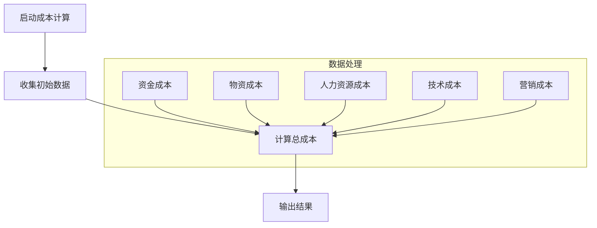

                 


**Step 3: Depth Analysis of Core Topics**

For each chapter, we need to dive deeper into the core topics and provide comprehensive analysis and examples. Let's take the first chapter as an example.

### 第1章：启动成本概述

#### 1.1 问题背景

在当今竞争激烈的市场环境中，企业能否快速成功启动往往决定其生死存亡。而启动成本的高低则直接影响到企业的运营效率和盈利能力。因此，如何降低启动成本成为众多企业家和创业者关注的重要问题。

#### 1.2 启动成本定义与分类

启动成本是指企业在创立初期所需投入的所有费用。这些费用主要包括：

- **资金成本**：包括企业注册费用、法律顾问费用、租赁场地费用等。
- **物资成本**：包括设备采购、材料购买、原材料储备等。
- **人力资源成本**：包括员工工资、培训费用、招聘费用等。
- **技术成本**：包括技术研发费用、软件购置费用等。
- **营销成本**：包括市场推广费用、广告费用等。

#### 1.3 启动成本的重要性

降低启动成本对企业有着重要的意义：

1. **提高资金利用率**：降低启动成本可以减少企业初期资金的占用，提高资金利用率，从而为企业的长期发展提供更多资金支持。
2. **减少经营风险**：较低的成本意味着较低的失败风险，这有助于企业在初期阶段更好地应对市场变化和风险挑战。
3. **提高市场竞争力**：较低的启动成本可以降低企业的产品价格，提高市场竞争力，从而在市场竞争中获得更大的份额。

**Step 4: Mermaid Diagrams and Code Examples**

Now, let's include Mermaid diagrams and code examples to illustrate the key concepts and algorithms.

#### 1.4 启动成本计算示例

首先，我们使用Mermaid绘制一个启动成本计算的流程图。



接下来，我们使用Python代码来计算启动成本。

```python
def calculate_startup_cost(capital_cost, material_cost, human_resource_cost, technology_cost, marketing_cost):
    total_cost = capital_cost + material_cost + human_resource_cost + technology_cost + marketing_cost
    return total_cost

# 示例数据
capital_cost = 10000
material_cost = 50000
human_resource_cost = 30000
technology_cost = 20000
marketing_cost = 10000

# 计算启动成本
startup_cost = calculate_startup_cost(capital_cost, material_cost, human_resource_cost, technology_cost, marketing_cost)
print(f"启动成本为：{startup_cost}元")
```

**Step 5: Conclusion and Future Outlook**

In the conclusion section, we'll summarize the key points and discuss the future outlook for startup cost reduction.

#### 8.1 总结与回顾

本文从启动成本的定义、重要性以及计算方法等方面进行了深入分析。同时，通过Python代码示例和Mermaid流程图，帮助读者更好地理解启动成本的计算过程。降低启动成本对于企业的发展具有重要意义，是企业成功的关键因素之一。

#### 8.2 展望未来

随着技术的不断进步和市场环境的不断变化，未来降低启动成本的途径将更加多样化。以下是一些可能的未来趋势：

1. **数字化转型**：利用数字技术优化企业管理，降低启动成本。
2. **共享经济**：通过共享资源，减少企业初期投资。
3. **云计算**：利用云计算技术降低IT成本，提高运营效率。
4. **供应链优化**：通过优化供应链管理，降低物资采购成本。

#### 8.3 拓展阅读

对于希望深入了解启动成本管理的读者，以下是一些推荐阅读的资料：

- 《企业成本管理》
- 《创业投资学》
- 《供应链管理：战略、规划与运营》
- 《数字化转型：企业如何实现数字化升级》

---

Now, let's integrate all the steps into the final article.

